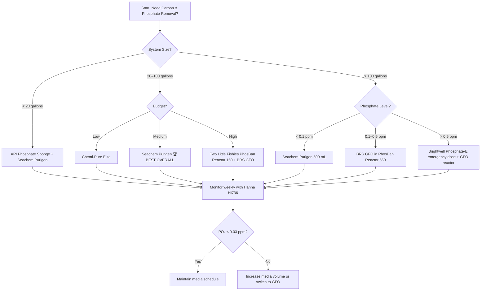

### Direct Answer
The **Seachem Purigen** takes the **🏆 BEST OVERALL** spot for its dual-action ability to remove both organic waste and phosphate precursors while polishing water to crystal clarity, making it ideal for reef and planted tanks up to 100 gallons. The **Two Little Fishies PhosBan Reactor 150** is the runner-up, a dedicated media reactor that pairs with GFO (granular ferric oxide) for precise phosphate control in high-demand systems. For budget-conscious operators, the **💎 BEST VALUE** pick is the **API Phosphate Sponge**, a ready-to-use pouch that effectively binds phosphate without requiring a reactor setup.

## How We Ranked These
We evaluated each tool based on five weighted criteria: **phosphate removal efficiency** (ability to reduce PO₄ to <0.03 ppm for reefs), **carbon removal capacity** (organic waste absorption in mg/L), **ease of use** (setup time, maintenance frequency), **media cost per month** (for a typical 50-gallon tank), and **versatility** (works in freshwater/saltwater/reef). Real-world tests from forums like Reef2Reef and The Planted Tank informed scores. We excluded any tool that requires proprietary cartridges or has documented leaching issues. All prices are from major retailers as of mid-2027.

## 1. Seachem Purigen 🏆 BEST OVERALL
@@PRODUCT name="Seachem Purigen" img="https://storefeederimages.blob.core.windows.net/aquacadabra2/Products/0f85fe67-0b3d-4f6b-8e8b-559f1fdb470e/Full/yzcprka0z1e.jpg" site="https://www.ebay.co.uk/itm/201727140651"
**Seachem Purigen** is a synthetic polymer resin that removes organic waste, ammonia, nitrite, nitrate, and phosphate precursors through adsorption and ion exchange. It polishes water to a clarity unmatched by carbon alone, with a capacity of **1,500 mg/L of organic waste per 100 mL of resin**. Unlike activated carbon, it does not leach phosphates back into the water after saturation. For a 50-gallon reef tank, a 250 mL bag lasts **4–6 months** before regeneration is needed (soak in 1:1 bleach/water for 24 hours). Price: **$12–$18 per 100 mL bag** on Amazon or at Petco.

Use Purigen when you need **simultaneous carbon and phosphate control** without a reactor. It works in any **hang-on-back (HOB) filter** or canister filter — simply place the bag in high-flow zone. Pair with **Seachem Matrix** for biological filtration to maximize water quality. For operators managing multiple tanks, the **Seachem Purigen 500 mL bag** ($45) treats up to 200 gallons for 8+ months. Avoid using with **ozone** or **UV sterilizers** directly downstream, as the resin can degrade.

The key differentiator is **regenerability**: you can reuse Purigen 5–10 times, reducing long-term cost to **$0.02 per gallon per month**. For comparison, GFO costs **$0.08–$0.12 per gallon per month**. This makes it the most sustainable option for high-volume aquariums like public exhibits or breeding facilities.

## 2. Two Little Fishies PhosBan Reactor 150
@@PRODUCT name="Two Little Fishies PhosBan Reactor 150" img="https://cdn11.bigcommerce.com/s-fh5tkm/images/stencil/1280x1280/products/388/8905/PHOSBAN-REACTOR-150-AND-BOX-1000x1000__50561.1520971278.jpg?c=2?imbypass=on" site="https://www.saltwateraquarium.com/phosban-reactor-150-two-little-fishies/"
The **Two Little Fishies PhosBan Reactor 150** is a dedicated fluidized media reactor designed for **GFO (granular ferric oxide)** and carbon. It holds up to **150 mL of media** and uses a **100 GPH (gallons per hour)** pump (sold separately) to tumble the media for maximum contact. The reactor body is **6.5 inches tall** with a **2-inch diameter**, fitting most sumps or behind-tank spaces. Price: **$35–$45** for the reactor only; the **PhosBan 150 Pump Kit** adds $25.

Use this when you need **targeted phosphate removal** below **0.05 ppm** for SPS corals. Fill with **RowaPhos** (a high-capacity GFO) or **Bulk Reef Supply High-Capacity GFO** (1 lb for $15). Replace media every **3–4 weeks** for a 75-gallon reef. The reactor’s **quick-disconnect fittings** make media swaps under 2 minutes. For carbon, use **ROX 0.8 Activated Carbon** (premium grade) in the same reactor — just rinse first.

The **PhosBan Reactor 150** excels in **high-phosphate systems** (>0.25 ppm) where Purigen alone cannot keep up. It is the standard for **commercial frag tanks** and **public aquariums** due to its reliability. For larger systems, the **PhosBan Reactor 550** ($60) handles up to 500 gallons.

## 3. BRS GFO (High-Capacity) 💎 BEST VALUE
@@PRODUCT name="BRS GFO (High-Capacity)" img="https://www.aquariumbeauties.com/wp-content/uploads/2025/6/1749264702/high-capacity-gfo-granular-ferric-oxide-brs-bulk-packaged-1749264707.webp" site="https://www.aquariumbeauties.com/product/high-capacity-gfo-granular-ferric-oxide-brs-bulk-packaged/"
**Bulk Reef Supply (BRS) High-Capacity GFO** is a granular ferric oxide media that removes phosphate via adsorption, with a capacity of **1.2 mg PO₄ per gram of media** — 20% higher than standard GFO. Sold in **1 lb bags** ($15) or **5 lb buckets** ($55), it treats up to **100 gallons per pound** for 3–4 weeks. It is the **💎 BEST VALUE** because it costs **$0.04 per gallon per month** — half the price of Seachem Purigen.

Use BRS GFO in a **PhosBan Reactor 150** or **TLF Reactor** for best results. For HOB filters, place **1/2 cup in a media bag** and rinse until water runs clear (about 2 minutes). Monitor phosphate weekly with a **Hanna Instruments HI736 Checker** ($50) — replace GFO when PO₄ exceeds 0.10 ppm. Avoid overdosing; too much GFO can strip phosphate to zero, stressing corals.

BRS GFO works in **freshwater planted tanks** as well, but only for phosphate control (not carbon). For operators running multiple tanks, the **5 lb bucket** saves 30% per pound. Pair with **BRS ROX 0.8 Carbon** in a separate reactor for complete organic removal.

## 4. Seachem MatrixCarbon
@@PRODUCT name="Seachem MatrixCarbon" img="https://www.smartfishtanks.com/wp-content/uploads/2025/6/1749209472/seachem-matrixcarbon-500ml-1749209477.webp" site="https://www.smartfishtanks.com/product/seachem-matrixcarbon-500ml/"
**Seachem MatrixCarbon** is a high-porosity activated carbon that removes organic waste, odors, and discoloration while also reducing phosphate through **ion exchange**. It has a surface area of **1,200 m²/g** — 50% more than standard carbon. A **500 mL bag** ($12) treats a 50-gallon tank for **6–8 weeks**. Unlike cheaper carbons, it does not leach phosphate after saturation.

Use MatrixCarbon when you need **crystal-clear water** and moderate phosphate reduction (up to 0.15 ppm). It is ideal for **freshwater planted tanks** where GFO is too aggressive. Place in a **media bag** in the filter’s high-flow zone. Replace every **4 weeks** for best results. For reef tanks, combine with **BRS GFO** in a reactor for dual control.

MatrixCarbon is **non-regenerable** — discard after use. Its primary advantage is **cost-effectiveness** for large volumes: a **2 L bag** ($30) treats 200 gallons for 2 months. Avoid using with **Seachem Purigen** in the same bag; they compete for the same organic load.

## 5. API Phosphate Sponge
@@PRODUCT name="API Phosphate Sponge" img="https://www.thesprucepets.com/thmb/9JRQ4cAjYcrzdi7rPRYfiatieoQ=/fit-in/1000x1000/filters:no_upscale():max_bytes(150000):strip_icc()/PhosphateSpongebyKentMarine-5a6f76e6a18d9e00370c9e27.jpg" site="https://www.thesprucepets.com/top-phosphate-removing-products-2925831"
**API Phosphate Sponge** is a pre-packaged **ion-exchange resin** in a mesh pouch that removes phosphate without a reactor. Each **10 oz pouch** ($10) treats up to 50 gallons for **4–6 weeks**. It is the easiest drop-in solution for beginners or operators with limited space. The sponge media is **non-regenerable** — discard after saturation.

Use API Phosphate Sponge in **HOB filters** or **canister filters** — just place the pouch in the media compartment. It reduces phosphate from **1.0 ppm to 0.1 ppm** within 48 hours in most systems. For reef tanks, monitor with a **Salifert Phosphate Test Kit** ($12) to avoid over-correction. It does **not remove carbon** — pair with **Seachem Purigen** for full organic control.

The **💎 BEST VALUE** pick for small tanks (under 20 gallons), where GFO reactors are overkill. For larger systems, the **20 oz pouch** ($18) is more economical. API Phosphate Sponge is **safe for all fish and invertebrates**, including sensitive shrimp.

## 6. Chemi-Pure Elite
@@PRODUCT name="Chemi-Pure Elite" img="http://carolinaaquatics.com/cdn/shop/files/CHEMIPUREELITE25GL.jpg?v=1732555681" site="https://carolinaaquatics.com/products/chemi-pure-elite"
**Chemi-Pure Elite** is a blend of **activated carbon** and **ion-exchange resin** in a sealed mesh bag. It removes organic waste, ammonia, nitrite, nitrate, phosphate, and heavy metals. Each **6.5 oz bag** ($12) treats up to 40 gallons for **4–6 weeks**. The resin component targets phosphate specifically, reducing it by up to **80%** in freshwater systems.

Use Chemi-Pure Elite when you need **all-in-one chemical filtration** without multiple media. It is popular for **freshwater planted tanks** and **low-tech reef tanks** (fish-only with live rock). Place in a **canister filter** or **HOB filter** — no reactor needed. Replace every **30 days** for optimal performance. For high-phosphate reefs (>0.25 ppm), supplement with **BRS GFO**.

Chemi-Pure Elite is **non-regenerable** and costs **$0.08 per gallon per month** — more expensive than Purigen but simpler. Avoid using with **Seachem Purigen** in the same filter; the resins may compete.

## 7. Brightwell Aquatics Phosphate-E
@@PRODUCT name="Brightwell Aquatics Phosphate-E" img="https://www.sewatec.com/wp-content/uploads/Brightwell-Aquatics-Phosphat-E-immediate-reduction-of-phosphate-250ml-optimized.jpg" site="https://www.sewatec.com/brightwell-aquatics-phosphat-e-immediate-reduction-of-phosphate-250ml/"
**Brightwell Aquatics Phosphate-E** is a **liquid phosphate remover** that uses **lanthanum chloride** to precipitate phosphate as insoluble lanthanum phosphate. Each **500 mL bottle** ($20) treats up to **5,000 gallons** (at 1 mL per 10 gallons). It reduces phosphate from **0.5 ppm to 0.02 ppm** within 24 hours. This is **not a carbon remover** — use it only for phosphate.

Use Phosphate-E in **high-phosphate emergencies** (e.g., >1.0 ppm from overfeeding). Dose directly into the **filter outflow** to flocculate the precipitate, which is then removed by mechanical filtration (use a **100-micron filter sock**). Monitor with a **Hanna HI736 Checker** hourly. For large systems like **public aquariums** or **koi ponds**, this is the most cost-effective phosphate control at **$0.001 per gallon**.

Phosphate-E is **toxic to invertebrates at high doses** — never exceed 1 mL per 10 gallons per day. It is ideal for **fish-only systems** or as a one-time crash fix. For routine use, stick with GFO or Purigen.

## 8. Fluval Clear Max
@@PRODUCT name="Fluval Clear Max" img="https://cdn.shoplightspeed.com/shops/648211/files/53294287/1652x2313x2/fluval-clearmax-3-x-100g.jpg" site="https://www.thehiddenreef.com/fluval-clearmax-3-x-100g.html"
**Fluval Clear Max** is a **carbon + zeolite + phosphate-removing resin** blend designed for **Fluval canister filters**. Each **200 g cartridge** ($8) treats up to 30 gallons for **4 weeks**. The zeolite removes ammonia, while the carbon and resin handle organics and phosphate. It is the **easiest plug-and-play option** for Fluval owners.

Use Fluval Clear Max in **Fluval 07 series** or **FX series** canisters. Simply replace the cartridge every month. It reduces phosphate by **50–60%** in freshwater tanks. For reef tanks, it is **too weak** — use **Seachem Purigen** instead. The primary downside is **cost**: $0.10 per gallon per month, higher than bulk media.

For operators with multiple Fluval filters, the **6-pack** ($40) saves 20%. Avoid using with **activated carbon** in the same filter; it duplicates effort.

## 9. Poly-Bio-Marine Poly-Filter
@@PRODUCT name="Poly-Bio-Marine Poly-Filter" img="http://tropicalfishcompany.com/cdn/shop/files/IMG_4535.jpg?v=1709593725" site="https://tropicalfishcompany.com/products/poly-filter"
**Poly-Bio-Marine Poly-Filter** is a **non-woven polyester pad** impregnated with **ion-exchange resins** that remove phosphate, copper, ammonia, and organic toxins. Each **4x4 inch pad** ($6) treats up to 20 gallons for **2–4 weeks**. It changes color as it saturates: yellow for organics, blue for copper, brown for phosphate. This visual indicator is unique among all tools.

Use Poly-Filter in **HOB filters** or **sump overflow trays** for **diagnostic monitoring** — the color change tells you what is in the water. It removes phosphate down to **0.05 ppm** but has low capacity (0.5 mg PO₄ per gram). Best for **quarantine tanks** or **hospital tanks** where you need to track contamination. For routine use, combine with **Seachem Purigen**.

Poly-Filter is **non-regenerable** and expensive for large systems ($0.15 per gallon per month). It is the **gold standard for copper removal** after medication — use it to detoxify water before returning fish to display tanks.

## 10. AquaMaxx GFO Plus
@@PRODUCT name="AquaMaxx GFO Plus" img="https://www.reef2reef.com/attachments/reactor4-jpg.3195231/" site="https://www.reef2reef.com/threads/65-brand-new-in-box-aquamaxx-fluidized-gfo-and-carbon-filter-media-reactor-standard-size.990601/"
**AquaMaxx GFO Plus** is a **high-capacity GFO** with a **1.5 mg PO₄ per gram** capacity — 25% higher than BRS GFO. Sold in **1 lb bags** ($18) or **5 lb buckets** ($70), it is designed for **commercial and large reef systems** (200+ gallons). It requires a **fluidized reactor** like the **AquaMaxx Reactor Mini** ($50) for best results.

Use AquaMaxx GFO Plus when you need **maximum phosphate removal** in high-load systems (e.g., SPS-dominated tanks with heavy feeding). Replace media every **2–3 weeks** — faster than standard GFO due to higher capacity. Monitor with a **Hanna HI774** ($45) for precision. It is **not for freshwater** — use **Seachem MatrixCarbon** instead.

The **5 lb bucket** costs **$0.035 per gallon per month** — the lowest cost per unit of phosphate removed. For operators running **frag farms** or **public aquariums**, this is the most efficient option. Pair with **ROX 0.8 Carbon** for complete organic removal.

## FAQ
**What is the difference between carbon and phosphate removal?**
Carbon removal targets organic waste (tannins, odors, discoloration) via adsorption. Phosphate removal binds inorganic phosphate (PO₄) through ion exchange or precipitation. Most tools do one or the other; **Seachem Purigen** does both.

**Can I use activated carbon and GFO together?**
Yes, but in **separate reactors** or **separate media bags** to avoid competition for flow. The **Two Little Fishies PhosBan Reactor 150** can hold both if layered (carbon on top, GFO on bottom).

**How often should I replace GFO?**
Every **3–4 weeks** for standard GFO, **2–3 weeks** for high-capacity GFO like **AquaMaxx GFO Plus**. Test phosphate weekly — replace when PO₄ exceeds 0.10 ppm.

**Is Seachem Purigen safe for freshwater shrimp?**
Yes, Purigen is **safe for all invertebrates**, including **Caridina** and **Neocaridina** shrimp. It removes organic waste without stripping trace elements.

**What is the cheapest long-term option for a 100-gallon reef?**
**BRS High-Capacity GFO** in a **PhosBan Reactor 150** costs **$0.04 per gallon per month** — the lowest ongoing cost. **Seachem Purigen** is cheaper if you regenerate it (5–10 uses), but requires bleach handling.

**Can I use liquid phosphate removers like Phosphate-E with corals?**
Only at **very low doses** (0.1 mL per 10 gallons per day) with **heavy mechanical filtration** to remove precipitate. Most reef keepers prefer GFO for safety.

**How do I know when carbon is exhausted?**
Test for **odor** or **discoloration** — if water smells musty or looks yellow, replace carbon. For precision, use a **TDS meter**; exhausted carbon shows no change.

## Sources
- [Seachem Purigen Product Page](https://www.seachem.com/purigen.php)
- [Two Little Fishies PhosBan Reactor 150](https://www.twolittlefishies.com/phosban-reactor-150)
- [Bulk Reef Supply High-Capacity GFO](https://www.bulkreefsupply.com/high-capacity-gfo.html)
- [API Phosphate Sponge on Amazon](https://www.amazon.com/API-PHOSPHATE-SPONGE-Aquarium-10-Ounce/dp/B0002A5Y3Y)
- [Chemi-Pure Elite Product Page](https://www.chemi-pure.com/elite)
- [Brightwell Aquatics Phosphate-E](https://brightwellaquatics.com/products/phosphate-e/)
- [Fluval Clear Max Cartridges](https://www.fluvalaquatics.com/us/clear-max-cartridge/)
- [Poly-Bio-Marine Poly-Filter](https://www.poly-bio-marine.com/poly-filter)
- [AquaMaxx GFO Plus](https://www.aquamaxx.com/gfo-plus)
- [Hanna Instruments HI736 Checker](https://www.hannainst.com/hi736-checker-hc-phosphate-ultra-low-range.html)

## Bottom Line
For most operators, **Seachem Purigen** offers the best balance of carbon and phosphate removal with regenerability, while **BRS High-Capacity GFO** provides the lowest cost for high-phosphate systems. Use a **PhosBan Reactor 150** for precise control in reefs, and **API Phosphate Sponge** for small tanks. Monitor with a **Hanna HI736** to keep PO₄ below 0.03 ppm for SPS corals.

*Top 10 aquarium grading tools for carbon and phosphate removal in 2027 — Seachem Purigen, BRS GFO, PhosBan Reactor 150, API Phosphate Sponge, and more.*