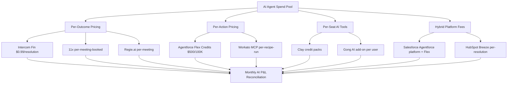
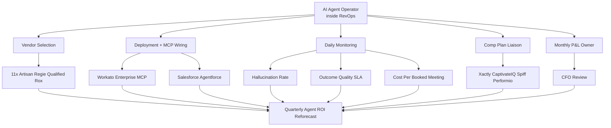

## Direct Answer

You compensate AI agents in your 2027 GTM stack by treating them as a **fourth line on the org chart** — not headcount, not pure SaaS, but a **metered cost-of-revenue pool** governed by an **AI Agent Operator inside RevOps**. The dominant pattern is **outcome pricing** (Intercom Fin at **$0.99/resolution**, Salesforce Agentforce Flex Credits at **$500 per 100K credits**, 11x and Regie.ai at **per-meeting** or **per-booked-call**) flowing through a **monthly AI P&L** that FP&A books to **S&M OpEx**, not R&D CapEx. Human reps keep **full commission on AI-sourced meetings** under a **"rep-of-record" rule** — the AI is a tool, not a teammate — while the **AI productivity dividend** (saved-rep-hours x fully-loaded rep cost minus AI spend) is tracked as a **separate KPI** that funds the next agent rollout. The 2027 operating cadence: **weekly agent-utilization review**, **monthly outcome-cost reconciliation**, **quarterly comp-plan stress test** against AI mix shift.

## 1. Where The AI Agent Line Actually Lives

The first 2027 question is not "how much" — it is **whose budget**. Get this wrong and you spend Q1 in a turf war between Marketing, Sales, and IT.

### 1.1 The Three Budget-Home Patterns

**Pattern A — Sales OPEX line item.** AI SDRs (11x, Artisan, Regie.ai), AI dialers, and AI demo bots (Qualified Piper) sit under the **CRO** as **"agentic capacity"** alongside human SDR headcount. This is the **dominant 2027 default** — Forrester and Pavilion both flagged it in their 2026 RevOps benchmarks. Pricing: **$1,000-$3,000/month per AI SDR seat-equivalent**, well under a **$95K loaded human SDR**.

**Pattern B — Marketing demand-gen line.** AI account researchers (Clay, Common Room) and AI signal engines (6sense, Qualified) ride under the **CMO** because the spend ladders directly to **MQL/SQO production**. Clay enterprise lands at **$3K-$15K/month** depending on credit burn.

**Pattern C — New "AI Agent" P&L line.** The 2027 mature move — a **dedicated GL code** under **RevOps**, owned by the **AI Agent Operator**, charged back to Sales and Marketing monthly. ScaleVP's 2026 portfolio survey found **34% of $50M+ ARR companies** had created this line by Q4 2026.

### 1.2 The Cost-Center vs Profit-Center Frame

Treat agents as a **profit center** only if you can attribute **booked revenue** to them inside Clari or Salesforce with a discrete **agent_sourced=true** flag. Otherwise you are flying blind and FP&A will pull the budget the first time a CFO sees flat pipeline. Most 2027 stacks run agents as a **measured cost center with a target ROI ratio of 5:1** (every $1 of agent spend returns $5 of incremental sourced pipeline).

## 2. The Pricing Models You Are Actually Paying

### 2.1 Per-Outcome Pricing (The 2027 Default For Customer-Facing Agents)

**Intercom Fin** set the market at **$0.99 per resolution** with a **50-resolution minimum** (**$49.50 floor**). **Zendesk AI Agents** sit at **~$1.50**, **Salesforce Agentforce** launched at **$2.00 per conversation** before pivoting to **Flex Credits** after enterprise pushback. **HubSpot Breeze** switched from per-use to **per-resolution** in late 2025. The math: if your AI resolves **60% of conversations**, a per-conversation contract costs **~67% more** than per-resolution for identical work.

### 2.2 Per-Meeting Pricing (The AI SDR Wedge)

**11x** sells "digital employees" at **~$5,000/month** with annual contracts, but the **2027 pivot** is **per-booked-meeting** at **$80-$150/meeting** with a meeting-quality SLA. **Regie.ai** runs the same playbook. **Artisan** straddles both — **$250/month** Intern plan (12K credits) and **$600/month** Employee plan (30K credits) before per-meeting overage.

### 2.3 Per-Action Pricing (The Agentforce Bet)

**Salesforce Agentforce Flex Credits** at **$500 per 100K credits** ($0.005/action) is the **2027 enterprise hedge** — predictable, MCP-routable, and lets the AI Agent Operator throttle expensive agent calls before they blow the monthly cap.

### 2.4 Hybrid (Platform + Metered)

**Workato Enterprise MCP**, **Gong AI add-ons** (~$50-$80/user/month on top of base), and **Common Room** charge a **platform fee plus metered usage**. This is the **stealth budget killer** — model the metered side at **3x the vendor estimate** in 2027 contracts.

## 3. How Human Rep Comp Actually Shifts

The fight in every 2027 SKO is: **does the AE keep full commission on AI-sourced meetings?** The Gartner / RevOps Co-op consensus answer is **yes, with three guardrails**.

### 3.1 The Rep-Of-Record Rule

The AE who **runs the discovery call, builds the MEDDPICC, and signs the contract** keeps **100% of commission** regardless of whether 11x, Artisan, or a human SDR sourced the meeting. The AI is a **lead-gen vendor**, not a comp participant. Anything else creates a **deal-attribution civil war** that tanks rep adoption.

### 3.2 The Quota-Lift Adjustment

The honest move is **raising AE quotas by 15-30% in 2027** to reflect the **agentic productivity uplift**. Pavilion's 2026 comp survey showed **41% of B2B SaaS CROs** added a quota lift when deploying AI SDRs. The "$5M AE" running an agent stack is real but rare — the median uplift is **22% incremental pipeline**, not 5x.

### 3.3 The Activity-Floor Removal

When AI handles **50% of prospecting and 80% of account research**, the **150-dial-per-day activity floor** becomes counterproductive. 2027 comp plans replace it with **opportunity-creation quotas** and **agent-utilization KPIs** managed inside **Xactly AI**, **CaptivateIQ AI**, **Spiff**, or **Performio**. These platforms now ingest **agent_sourced** flags and split scorecards accordingly without changing payout math.

## 4. The AI Productivity Dividend Math

The single equation every 2027 RevOps leader runs monthly:

**Dividend = (Saved Rep Hours x Fully-Loaded Rep Cost) - (AI Agent Spend + Operator Cost + Cleanup Tax)**

Concrete example: **20 AEs** at a **$185K fully-loaded cost** (~$89/hr). AI agent stack saves **8 hours/rep/week** on research + outreach = **8,320 hours/year** = **$740K saved-time value**. AI stack costs **$180K/year** (11x + Clay + Agentforce Flex). Operator cost **$165K**. Cleanup tax (bad-meeting wash, hallucinated firmographics) **$45K**. **Net dividend: $350K**, or a **2.1:1 return** on agent spend before any incremental pipeline credit.

**ChiefMartec's 2026 model** adds a **second-order term**: incremental pipeline the rep would not have generated unaided. Most healthy stacks land at a **5:1 blended return** once that is included. Below **3:1**, kill the agent or renegotiate.

## 5. FP&A, FTC, And IRS Treatment

### 5.1 OpEx vs CapEx

The **2027 FP&A default**: AI agent subscriptions and outcome fees are **S&M OpEx**, period. **CapEx treatment** only applies if you are **building proprietary agents** on your own infrastructure with **demonstrable useful life** — that triggers **R&D capitalization under ASC 730 / Section 174**, which after the **2025 TCJA amortization rollback** is again **expensable in year one** for domestic R&D. Vendor-provided agents (11x, Agentforce, Fin) never qualify.

### 5.2 Sales-Tax And FTC Exposure

**Agentforce, Fin, and Regie.ai** invoices increasingly include **per-state SaaS sales tax** — budget **6-8% gross-up** in 2027. The **FTC's 2025 AI-disclosure guidance** requires that AI-generated outbound emails disclose **non-human authorship** in regulated verticals (financial services, healthcare). Non-compliance is a comp-plan risk because **clawback clauses** in 2027 contracts increasingly tie payout to **compliance attestation**.

### 5.3 Revenue Recognition When Customers Pay Per-Outcome

If **your own product** is sold on outcome pricing (you are the vendor, not the buyer), revenue rec follows **ASC 606 variable consideration** — recognize at the **expected value** with a **constraint** for refund risk. This is the 2027 audit hot spot for AI-native vendors and the reason **Deloitte** and **PwC** added dedicated AI-rev-rec practices in 2026.

## 6. Governance — The AI Agent Operator Role

### 6.1 Who Owns The Agent's Quota

In 2027 the **AI Agent Operator owns the agent's quota** the way a sales manager owns a team quota. **Aviso** and **Clari** now expose **agent-level forecast lines** so the operator can roll agent-sourced pipeline into the weekly forecast without polluting human rep numbers.

### 6.2 The Emerging Title

The role goes by **"AI Agent Operator"**, **"Agentic Ops Lead"**, or **"GTM Engineer — Agents"** depending on the company. **GTM engineering postings grew ~205% from mid-2025 to January 2026** per the GTM Newsletter, with the agent-operator subset the fastest-growing slice. Comp band: **$165K-$240K OTE** at Series B-D, **$280K-$420K** at public companies.

## 7. The 2027 Operating Cadence

**Weekly:** agent-utilization dashboard reviewed in the RevOps standup — flag any agent below **40% utilization** or above **$200/booked-meeting**. **Monthly:** outcome-cost reconciliation with FP&A, AI P&L closed alongside Sales and Marketing. **Quarterly:** comp-plan stress test — model what happens if the AI mix doubles, and pre-negotiate the quota-lift clause with the CRO before SKO. **Annually:** vendor consolidation review — the 2027 reality is **stack sprawl** (most $100M ARR companies run **7-11 distinct AI agents**), and consolidation onto **Agentforce + 1-2 specialists** is the dominant 2027 cost-control move.

## Bottom Line

AI agents in your 2027 GTM stack get compensated through a **metered S&M OpEx line owned by a RevOps AI Agent Operator**, priced **per-outcome or per-meeting**, governed by a **5:1 ROI target** and a **rep-of-record rule** that keeps human AE commission intact. The winning teams already booked the line, hired the operator, and set the quota lift — the laggards will spend 2027 re-litigating it inside their comp committee while their pipeline efficiency falls behind.

## FAQ

**Whose budget does AI agent spend come from?**
Three patterns exist. AI SDRs and dialers can sit as a Sales OPEX line under the CRO as "agentic capacity" (the dominant 2027 default at $1,000-$3,000/month per AI SDR seat-equivalent). AI researchers and signal engines can ride under the CMO because they ladder to MQL/SQO production. The mature move is a dedicated "AI Agent" P&L line with its own GL code under RevOps, charged back to Sales and Marketing monthly — ScaleVP found 34% of $50M+ ARR companies had created this by Q4 2026.

**What pricing models am I actually paying for agents?**
Four. Per-outcome is the default for customer-facing agents (Intercom Fin at $0.99/resolution, Zendesk ~$1.50). Per-meeting is the AI SDR wedge (11x and Regie.ai at $80-$150/booked meeting with a quality SLA). Per-action is the enterprise hedge (Salesforce Agentforce Flex Credits at $500 per 100K credits, $0.005/action). Hybrid is platform fee plus metered usage (Workato MCP, Gong add-ons) — model the metered side at 3x the vendor estimate.

**Does the AE keep full commission on AI-sourced meetings?**
Yes, with three guardrails. Under the rep-of-record rule, the AE who runs discovery, builds the MEDDPICC, and signs the contract keeps 100% of commission regardless of whether an AI or human sourced the meeting — the AI is a lead-gen vendor, not a comp participant. The honest offsets are raising AE quotas 15-30% to reflect the productivity uplift (median real uplift is 22% incremental pipeline, not 5x) and replacing the 150-dial activity floor with opportunity-creation quotas.

**How do I calculate the AI productivity dividend?**
Dividend = (Saved Rep Hours x Fully-Loaded Rep Cost) - (AI Agent Spend + Operator Cost + Cleanup Tax). For 20 AEs at $185K loaded saving 8 hours/week each, that's $740K saved-time value against ~$180K agent spend, $165K operator cost, and $45K cleanup tax — a net $350K, or 2.1:1 before incremental pipeline. Add the second-order pipeline term and healthy stacks land at 5:1 blended. Below 3:1, kill the agent or renegotiate.

**Is AI agent spend OpEx or CapEx?**
The 2027 FP&A default is S&M OpEx, period. CapEx treatment only applies if you are building proprietary agents on your own infrastructure with demonstrable useful life, which triggers R&D capitalization under ASC 730/Section 174 (again expensable in year one for domestic R&D after the 2025 TCJA rollback). Vendor-provided agents like 11x, Agentforce, and Fin never qualify. Budget a 6-8% gross-up for per-state SaaS sales tax on those invoices.

## Sources

- Intercom — Fin AI Agent outcomes pricing documentation
- Salesforce — Agentforce Flex Credits pricing and enterprise rollout notes
- 11x.ai — Digital Worker pricing and per-meeting contract terms
- Artisan — Ava AI BDR pricing tiers (Intern and Employee plans)
- Regie.ai — Agentic outbound platform pricing
- Pavilion — 2026 B2B SaaS Compensation Benchmarks
- Forrester — The State of Agentic AI in Revenue Operations, 2026
- Gartner — 2026 Sales Compensation Trends in the Age of AI
- ScaleVP — 2026 Portfolio AI Spend Benchmarks
- ChiefMartec — Scott Brinker's 2026 GTM Agent Stack Analysis
- The GTM Newsletter — The Agent Operator: The New Emerging GTM Role
- RevOps Co-op — 2026 Practitioner Survey on AI Agent Budget Ownership
- Deloitte — ASC 606 Variable Consideration Guidance for AI-Native Vendors