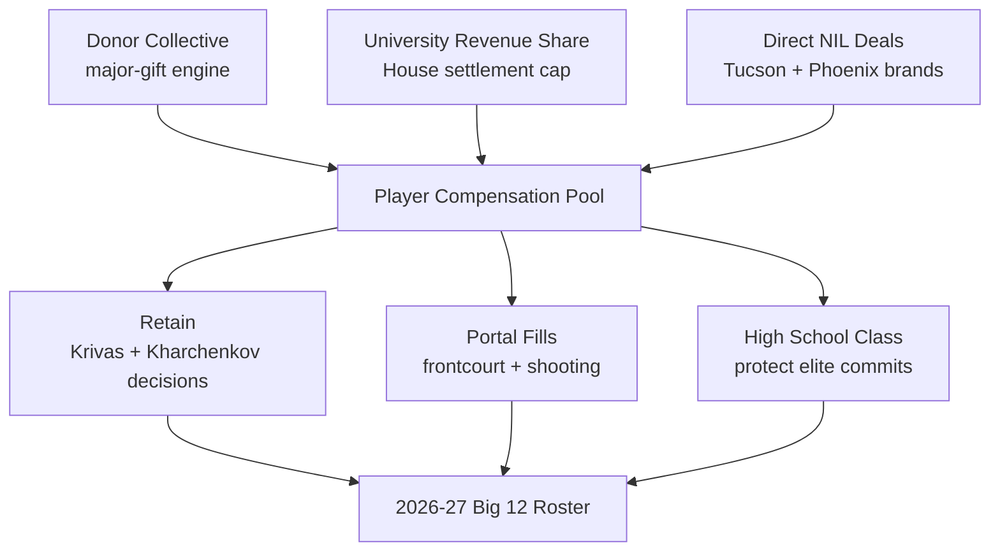
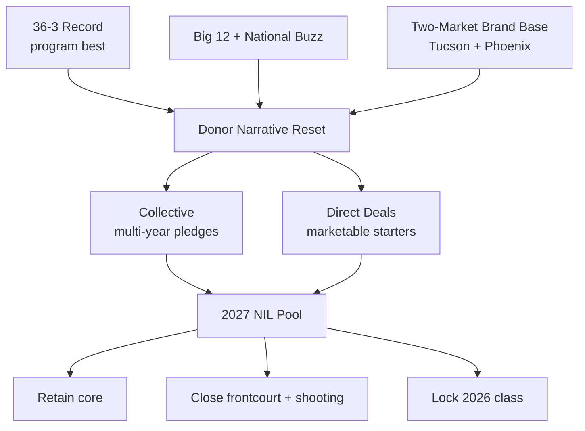

## Direct Answer

Arizona's 2027 NIL playbook is a blue-blood-money operation built to convert a program-record 36-3 season into sustained Big 12 and national-title leverage. Tommy Lloyd pairs the university's House-settlement revenue-share pool with a donor collective and a deep brand-deal market in Tucson and Phoenix to fund a roster that already reloaded through the portal — adding point guard JJ Mandaquit (Washington), guard Derek Dixon (North Carolina), forward Ugnius Jarusevicius (Nebraska), and center Evan Otten (Idaho State) — while it waits on return decisions from big man Motiejus Krivas and wing Ivan Kharchenkov. The priorities are surgical: retain the decision-pending core, replace the eligibility-exhausted production of Tobe Awaka and the departed freshmen, and keep elite high-school talent from being out-bid. The strategy is not to outspend everyone; it is to spend like a top-five program while recruiting like one.

## 1. The 2027 Context: A Record Season Raises the Stakes

Arizona enters the 2026-27 cycle off the best record in program history at 36-3 — a résumé that resets every conversation with donors, recruits, and portal targets. In the revenue-share era, a season like that is an asset: it is the proof point Lloyd's staff sells when a five-star weighs Tucson against Durham or Lexington, and it is the reason the Wildcats can command premium brand deals in two major media markets.

### 1.1 Roster Reality After the Portal Window

The Wildcats lost Big 12 Sixth Man of the Year Tobe Awaka and veterans Anthony Dell'Orso and Evan Nelson to exhausted eligibility, and saw freshmen Dwayne Aristode and Sidi Gueye transfer out. Lloyd answered fast in the portal — Mandaquit, Dixon, Jarusevicius, and Otten — but the roster is not finished until Krivas and Kharchenkov decide. NIL is the lever that closes those decisions: a credible revenue-share offer plus collective dollars is what turns a "thinking about it" into a return.

## 2. The Funding Stack

Arizona's 2027 model layers three sources so no single check breaks the budget if a donor cools or a portal price spikes.

### 2.1 The Collective

Arizona's donor collective is the ceiling-setter — the vehicle that writes the one or two roster-finishing checks rather than fifteen mediocre ones. After a 36-3 season, the collective's pitch is no longer "help us keep up"; it is "fund a title window that is open right now." That narrative is what drives multi-year pledges instead of one-off gifts.

### 2.2 University Revenue Share

The House settlement lets Arizona pay players directly out of the athletic department, and basketball is a priority sport for that pool. Revenue share covers the floor of compensation; collective and brand dollars fund the ceiling. The two-market footprint (Tucson plus Phoenix) gives the department real local-media and sponsorship revenue to feed the pool.

### 2.3 Direct NIL Deals

Tucson is a basketball town and Phoenix is a top-15 media market, so Arizona's marketable players have a genuine brand-deal floor — auto dealers, regional banks, apparel, and restaurant groups. Lloyd's staff treats those deals as retention glue: the more a player earns organically, the less collective money it takes to keep him.

## 3. The 2027 Strategic Priorities

### 3.1 Retention Before Recruitment

The cheapest roster move in the portal era is keeping a player you already developed. Closing Krivas (rim protection, lob threat) and Kharchenkov (size and shot-making on the wing) is priority one, because replacing both in the portal would cost more than retaining them.

### 3.2 Rebuild the Frontcourt and Shooting

With Awaka gone and the bigs' decisions open, Arizona's clearest needs are interior toughness and perimeter shooting. The early portal class addresses guard depth (Mandaquit, Dixon); the remaining dollars are pointed at a proven frontcourt body and a high-volume shooter who spaces the floor for Lloyd's drive-and-kick offense.

### 3.3 Protect the High-School Pipeline

Lloyd has built Arizona partly through development of elite freshmen, and the 2027 plan guards that pipeline against portal-only thinking. NIL is used here defensively: make sure a committed high-school star is not flipped by a bigger late offer, which is now a real risk every signing period.

## 4. The 36-3 Premium

A program-record season changes the donor math the same way a deep tournament run does anywhere — it converts casual fans into recurring givers and gives the collective a once-a-decade fundraising moment.

## 5. Risks To Watch

Three risks could break the 2027 plan. First, losing both Krivas and Kharchenkov to the NBA or a higher bidder would turn a finishing job into a full frontcourt rebuild and drain the contingency budget. Second, Big 12 spending is escalating fast — Houston, Texas Tech, BYU, and others are writing large checks, so Arizona's dollar has to be efficient, not just big. Third, House-settlement cap interpretation and roster-limit rules are still settling, and a mid-cycle change could force the staff to re-paper deals. Arizona's hedge is a record season as a recruiting moat, a two-market brand base, and a coach who develops talent rather than only renting it.

## 6. Bottom Line

Arizona's 2027 NIL strategy is to behave like the blue blood its record now says it is: use revenue share for the floor, the collective for the ceiling, and a genuine two-market brand economy to make stars cheaper to keep. If Lloyd retains his decision-pending bigs and lands one more frontcourt body and a shooter, the Wildcats open 2026-27 as a top-10 preseason team and a real Big 12 favorite. The differentiator is not the size of the checkbook — it is that a 36-3 program can spend efficiently and still recruit at the top of the sport.

## Sources

- Arizona Athletics — 2026-27 roster and transfer portal updates
- Sports Illustrated / Arizona Wildcats On SI — transfer portal tracker, additions and departures for 2026-27
- Arizona Sports — Wildcats men's basketball transfers
- Zona Zealots — Arizona basketball 2026 transfer portal tracker
- AZ Desert Swarm — offseason roster movement, NBA Draft and eligibility updates
- On3 / 247Sports — College basketball NIL valuations and 2026 recruiting class rankings
