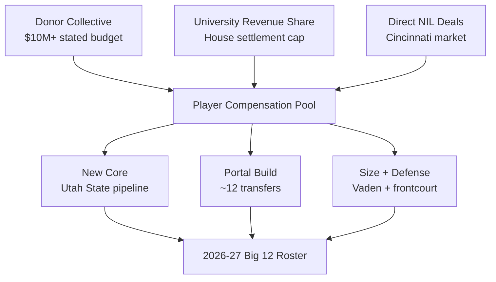
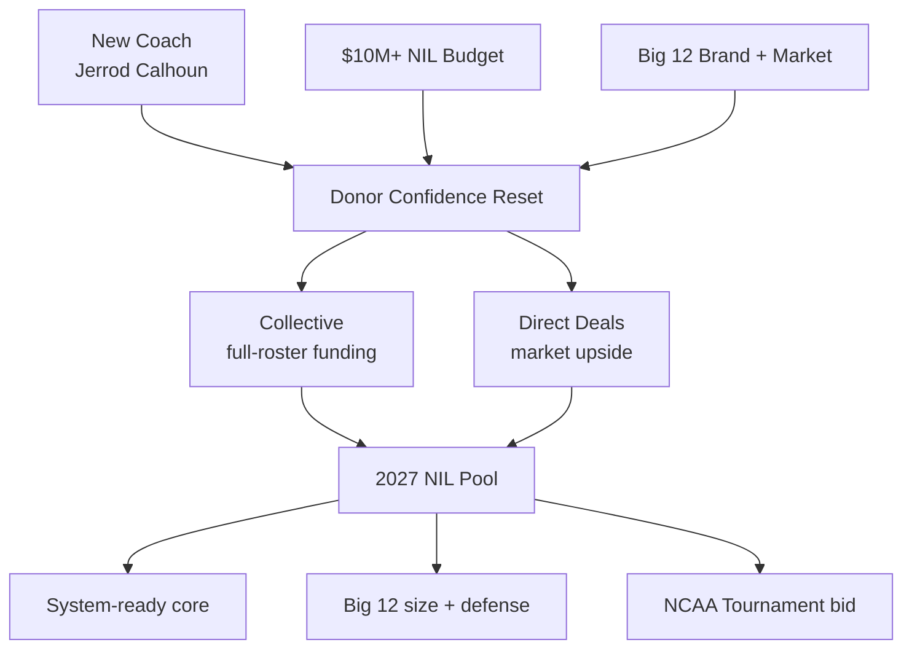

## Direct Answer

Cincinnati's 2027 NIL playbook is a clean-slate, new-coach rebuild funded by one of the most aggressive budgets in the Big 12. After firing Wes Miller — a 100-74 run over five seasons with zero NCAA Tournament bids — athletic director John Cunningham hired Jerrod Calhoun away from Utah State and handed him a reported $10-plus million NIL war chest to remake the roster from scratch. Not a single Miller-era player remains. Calhoun has already brought a Utah State pipeline with him (guards Adlan Elamin and Elijah Perryman, forward David Iweze) and added size like 6-foot-11 Mount Union transfer Deshaun Vaden, reeling in a reported dozen transfers in the first cycle. On3 already slots the Bearcats around No. 21 nationally and third in the Big 12 behind only Houston and West Virginia. The strategy is blunt: spend big, buy a complete roster in one offseason, and finally end the program's NCAA Tournament drought.

## 1. The 2027 Context: A New Coach and a Mandate

Cincinnati's jump to the Big 12 exposed a hard truth — the program had the brand and the budget but not the results, missing the NCAA Tournament in all three Big 12 seasons under Miller. The 2027 cycle is a reset: Calhoun arrives from a Utah State program he turned into a winner, and the mandate is unambiguous — get the Bearcats dancing, fast, with money that finally matches the league.

### 1.1 Roster Reality After a Total Overhaul

This is not a retention story; it is a teardown. With no Miller-era players staying, Calhoun is building an entire roster through the portal and his existing relationships. The Utah State trio gives him a system-ready core, Vaden adds rim protection, and a reported dozen transfers fill the rest. NIL is not a finishing lever here — it is the entire construction budget.

## 2. The Funding Stack

Cincinnati layers three sources, but the collective and revenue share carry unusual weight in a from-scratch build.

### 2.1 The Collective

Cincinnati's donor collective is doing the heaviest lifting in college basketball this cycle — funding not one or two finishing checks but a whole roster. The reported $10-plus million figure signals that boosters and the department have decided the cost of another tournament miss is higher than the cost of spending like a Big 12 contender.

### 2.2 University Revenue Share

The House settlement lets Cincinnati pay players directly, and basketball is a clear priority for that pool given the football-and-basketball revenue base in the Big 12. Revenue share anchors the compensation floor while the collective funds the premium needed to land a dozen transfers in a single window.

### 2.3 Direct NIL Deals

Cincinnati is a real metro market with a passionate basketball history, giving marketable Bearcats genuine brand-deal upside — regional banks, auto, healthcare, and QSR. For a roster of newcomers, those organic deals also serve as integration glue, giving players a reason to plant roots quickly.

## 3. The 2027 Strategic Priorities

### 3.1 Buy a Complete, System-Ready Roster

Calhoun's first priority is coherence, not just talent — which is why the Utah State pipeline matters. Players who already know his system shorten the chemistry curve that usually dooms portal-built teams, and NIL dollars are spent to keep that core together through year one.

### 3.2 Win the Frontcourt and the Defense

The Big 12 is the most physical league in the country. Vaden (6-11) is the first answer at center, and the remaining budget is pointed at length and rim protection — the traits that travel against Houston, BYU, Texas Tech, and Arizona.

### 3.3 End the Tournament Drought

Every dollar is ultimately aimed at one outcome: an NCAA bid. The strategy accepts the risk of a one-year, high-turnover roster because the cost of a fourth straight Big 12 season without March basketball is existential for a program that sells itself on tournament pedigree.

## 4. The Spend-to-Contend Premium

Cincinnati is making the opposite bet from a Gonzaga or an Illinois — not efficiency, but scale.

## 5. Risks To Watch

Three risks could break the 2027 plan. First, chemistry — a roster with zero holdovers can underperform its talent if the pieces never gel, and no budget fully insures against that. Second, sustainability — a $10-plus million single-season spend is hard to repeat annually, so 2027 has to produce results that justify the next budget. Third, the Big 12 is a gauntlet; even a well-funded, well-coached team can finish 9th in a league this deep. Calhoun's hedge is his Utah State pipeline for instant cohesion, a stated budget that buys margin for error, and a clear, single-season mandate that aligns everyone.

## 6. Bottom Line

Cincinnati's 2027 NIL strategy is the most aggressive reset in the Big 12: fire the coach, hire a proven winner, and spend $10-plus million to build a complete, system-ready roster in one offseason. Use revenue share for the floor and a heavyweight collective for everything else. If Calhoun's Utah State core gels and Vaden anchors the paint, the Bearcats finally break the tournament drought and validate the spend. It is a high-variance bet — but for a program tired of watching March from home, scale is the strategy.

## Sources

- CBS Sports — Cincinnati fires Wes Miller after five seasons, no NCAA Tournament bids
- Sports Illustrated / Cincinnati Bearcats On SI — Jerrod Calhoun hire, buyout figure, 2026 transfer portal additions
- The News Record (University of Cincinnati) — the ins and outs of the UC men's basketball transfer portal
- 247Sports / On3 — Cincinnati Bearcats 2026 transfer portal tracker and national/Big 12 roster rankings
- Yardbarker — Cincinnati Bearcats transfer portal tracker, incoming and outgoing
