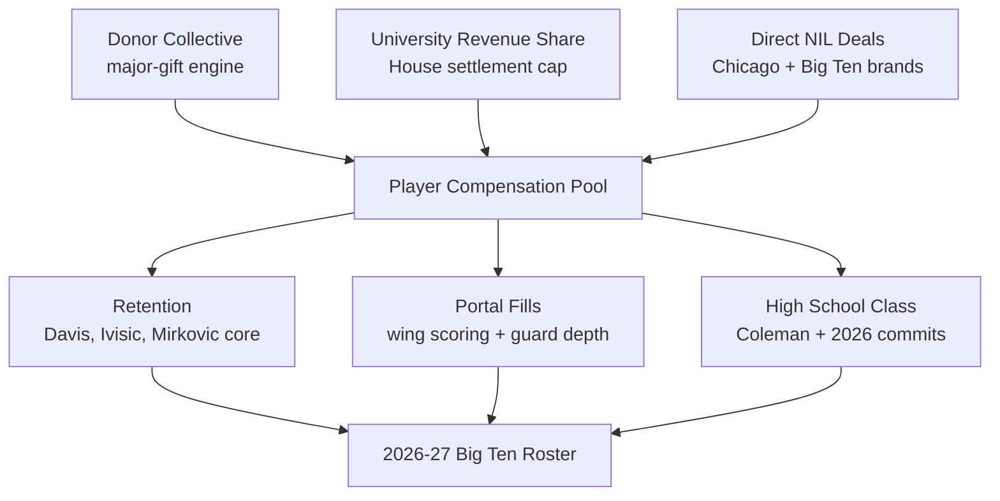
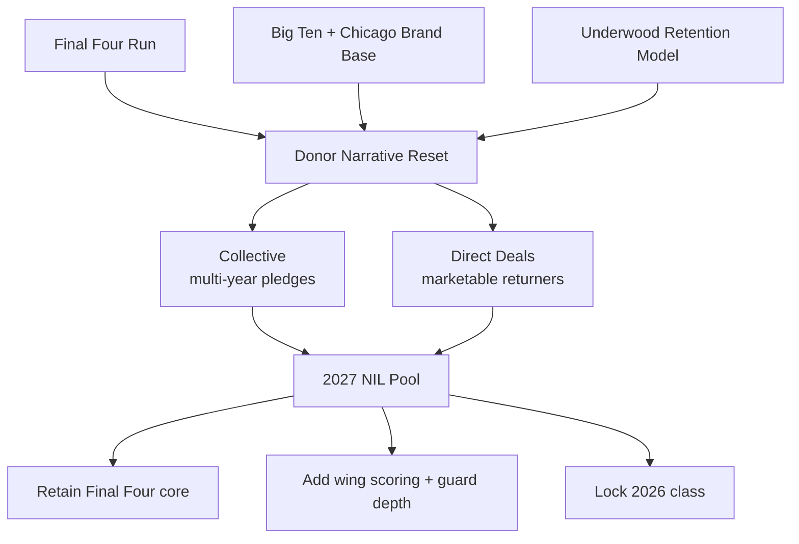

## Direct Answer

Illinois's 2027 NIL playbook is a retention-first, Final-Four-fueled operation that uses Brad Underwood's coast-to-coast roster model and a Big Ten brand base to keep its core intact instead of rebuilding every spring. Coming off a Final Four run, Underwood has already re-signed a deep group of returners — Jake Davis, Tomislav Ivišić, David Mirković, Zvonimir Ivišić, Andrej Stojaković, Ty Rodgers, and Jason Jakstys — while replacing a one-and-done lottery freshman and graduating seniors Ben Humrichous, Kylan Boswell, and A.J. Redd. The early portal class is anchored by Providence wing Stefan Vaaks (15.8 PPG), and the recruiting class is headlined by top-35 guard Quentin Coleman. The Illini pair the university's House-settlement revenue-share pool with a donor collective to fund a roster built to contend in a brutal Big Ten — and the strategy is to be the program that proves retention beats reloading.

## 1. The 2027 Context: A Final Four Resets the Ceiling

A Final Four run changes everything for a program's NIL math. It converts Illinois from "good Big Ten team" to a destination, which lowers the price of recruiting because players now choose Champaign for the stage, not just the check. Underwood's pitch in 2027 is simple: come win a national title with a team that is already most of the way there.

### 1.1 Roster Reality After the Portal Window

The losses are real but manageable: a lottery-bound freshman to the NBA Draft and three rotation seniors in Humrichous, Boswell, and Redd. What makes Illinois unusual in the portal era is the retention — Underwood persuaded a deep group of contributors to return rather than test the market, which is the single hardest thing to do in modern college basketball. NIL is the lever that made those "I'm staying" decisions possible.

## 2. The Funding Stack

Illinois layers three sources so the budget survives a portal price spike or a cooling donor.

### 2.1 The Collective

Illinois's donor collective is the ceiling-setter — the vehicle that funds the retention checks that keep a Final Four core together. After the run, the collective's pitch shifts from "help us compete" to "fund the finish," and that narrative is what turns one-time gifts into multi-year pledges from a fan base that just tasted the national semifinal.

### 2.2 University Revenue Share

The House settlement lets Illinois pay players directly out of the athletic department, and a revenue-positive Big Ten media deal gives the Illini a real floor to build on. Revenue share covers the base compensation; collective and brand dollars fund the premium. That two-bucket structure is what makes retention affordable.

### 2.3 Direct NIL Deals

Illinois's marketable players have genuine brand value across Champaign and the Chicago corridor — auto, insurance, agriculture, and regional retail. Underwood's staff treats organic deals as retention glue: the more a returner earns on his own, the less collective money it costs to keep him for one more year.

## 3. The 2027 Strategic Priorities

### 3.1 Retention Before Recruitment

Illinois's whole 2027 model is built on keeping what it developed. Re-signing the Davis/Ivišić/Mirković group is cheaper and higher-floor than chasing replacements in a seller's portal, and it preserves the continuity that powered the Final Four run.

### 3.2 Replace Lost Scoring and Size

With a lottery freshman and three seniors gone, the clearest needs are wing scoring and guard depth. Vaaks (a 6-foot-7, 15.8-PPG shotmaker from Providence) addresses the wing; the remaining dollars are pointed at a proven guard who can handle Big Ten physicality.

### 3.3 Protect the Recruiting Class

Quentin Coleman, a top-35 guard in the 2026 class, is the kind of recruit other programs try to flip with a late offer. Illinois uses NIL defensively here — locking the class so a bigger spender can't pry away the future of the backcourt.

## 4. The Final Four Premium

A national-semifinal run is a once-in-a-decade donor moment, and Illinois is engineered to convert it.

## 5. Risks To Watch

Three risks could break the 2027 plan. First, Big Ten spending is escalating — Michigan, Indiana, Purdue, and others are writing large checks, so retention offers must keep pace or a returner gets out-bid late. Second, a key returner's injury or NBA reclassification would force an emergency collective raise that drains the contingency budget. Third, House-settlement cap interpretation and roster limits are still settling, and a mid-cycle rule change could force the staff to re-paper deals. Illinois's hedge is the Final Four résumé as a recruiting moat, a deep returning core, and a coach whose retention track record is now proven at the highest level.

## 6. Bottom Line

Illinois's 2027 NIL strategy is to win by keeping, not by buying. Use revenue share for the floor, the collective for the retention premium, and a Chicago-corridor brand economy to make stars cheaper to hold. If Underwood keeps his Final Four core together and adds one more proven guard alongside Vaaks and Coleman, the Illini open 2026-27 as a top-10 preseason team and a Big Ten title contender. The differentiator is continuity: in a sport that resets every April, Illinois is betting that the team that stays together is the team that finishes the job.

## Sources

- On3 / Orange & Blue News — Illinois basketball roster outlook 2026-27: transfer portal, NIL, and key return decisions
- The Champaign Room (SB Nation) — how Illinois is building its 2026-27 roster; offseason portal updates
- Writing Illini (FanSided) — Illinois 2026 transfer portal tracker and projected lineup
- 247Sports — Quentin Coleman commitment and 2026 recruiting class rankings
- Yahoo Sports — Illinois basketball 2026 transfer portal coverage
