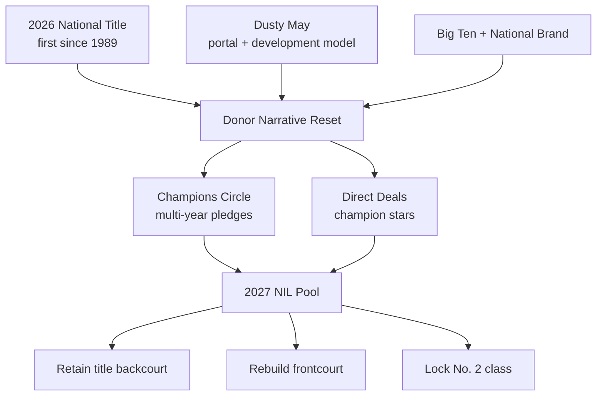

## Direct Answer

Michigan's 2027 NIL playbook is a title-defense operation funded like the blue blood it just became. After Dusty May won the 2026 national championship — Michigan's first since 1989, beating UConn 69-63 with five portal-built starters — the Wolverines pair Champions Circle collective money with the university's House-settlement revenue-share pool to keep a champion together and reload at the top of the sport. May has already locked his title-winning backcourt with deals for Elliot Cadeau and Trey McKenney, replaced frontcourt losses Yaxel Lendeborg and Roddy Gayle Jr. (and pending NBA decisions from Morez Johnson Jr. and 7-foot-3 Aday Mara) with bigs JP Estrella (Tennessee) and Jalen Reed (LSU), and signed the No. 2-ranked recruiting class headlined by five-star Brandon McCoy Jr., who committed during the Final Four win over Arizona. The strategy is simple: spend like a champion, recruit like a champion, and defend the title.

## 1. The 2027 Context: Defending a Championship

A national title is the most powerful NIL asset in college basketball. It converts Michigan from "blue blood with a drought" into the destination of the cycle — recruits and transfers now choose Ann Arbor for the banner, which lowers the effective price of every signing. May's pitch in 2027 writes itself: come defend a title with a program that just proved its portal-plus-development model wins it all.

### 1.1 Roster Reality After the Title

Champions get raided. Michigan must replace four graduates plus departed contributors Lendeborg and Gayle, and absorb NBA-or-return decisions from Johnson and the 7-foot-3 Mara. But the core that matters most — the title-winning backcourt of Cadeau and McKenney — is back, which is the hardest and most valuable retention any program can pull off the spring after a championship. NIL is the lever that made those returns happen.

## 2. The Funding Stack

Michigan layers three sources so a title raid or a price spike never breaks the budget.

```mermaid
flowchart TD
    A[Champions Circle<br/>collective engine] --> D[Player Compensation Pool]
    B[University Revenue Share<br/>House settlement cap] --> D
    C[Direct NIL Deals<br/>Detroit + national brands] --> D
    D --> E[Retention<br/>Cadeau + McKenney backcourt]
    D --> F[Portal Fills<br/>Estrella + Reed frontcourt]
    D --> G[No. 2 Class<br/>McCoy + top-50 signees]
    E --> H[2026-27 Title Defense]
    F --> H
    G --> H
```

### 2.1 The Collective

Champions Circle is the ceiling-setter — the vehicle that funds the retention checks keeping a title backcourt in Ann Arbor. After a championship, the collective's pitch flips from "help us win one" to "fund the dynasty," and that narrative converts casual donors into multi-year pledges from a fan base that just watched its team cut down the nets.

### 2.2 University Revenue Share

The House settlement lets Michigan pay players directly out of one of the richest athletic departments in the country, and basketball is now a banner sport for that pool. Revenue share covers the compensation floor; Champions Circle and brand deals fund the championship premium. That structure is what makes defending a title affordable.

### 2.3 Direct NIL Deals

A national champion in a top media footprint — Detroit plus a massive national alumni base — gives Michigan's stars premium brand value across auto, apparel, finance, and QSR. May's staff treats those organic deals as retention glue: the more a returner earns on his own, the less collective money it takes to keep him chasing a second ring.

## 3. The 2027 Strategic Priorities

### 3.1 Retain the Championship Core

The cheapest path to a title defense is keeping the players who just won one. Re-signing Cadeau and McKenney is priority one — it preserves the continuity and chemistry that powered the run and anchors a roster of newcomers.

### 3.2 Rebuild the Frontcourt

With Lendeborg and Gayle gone and Johnson/Mara weighing the NBA, size is the clearest need. Estrella (6-11, from Tennessee) and Reed (an experienced LSU big) are the answers, and remaining dollars target rim protection that travels in a brutal Big Ten.

### 3.3 Integrate the No. 2 Class

A top-two recruiting class headlined by five-star Brandon McCoy Jr. (plus top-50 signees Quinn Costello and Lincoln Cosby) is the future, and NIL is used to lock it against late poaching. May's challenge is blending elite freshmen with a returning title core without stalling either.

## 4. The Championship Premium

A title is a generational fundraising and recruiting moment, and Michigan is built to compound it.

## 5. Risks To Watch

Three risks could break the 2027 plan. First, championship rosters are raided hardest — a late, larger offer for Cadeau or McKenney would force an emergency collective raise. Second, the frontcourt is unproven together; if Estrella and Reed don't replace the rim protection Michigan loses, the defense slips in a physical Big Ten. Third, integrating a No. 2 class with a returning core is a chemistry bet that money can't fully insure. May's hedge is the banner itself as a recruiting moat, one of the deepest athletic-department checkbooks in the sport, and a coach who just proved he can build a champion through the portal.

## 6. Bottom Line

Michigan's 2027 NIL strategy is to defend a title by spending and recruiting like the champion it is. Use revenue share for the floor, Champions Circle for the championship premium, and a national brand base to make stars cheaper to keep. If May retains his title backcourt, his new bigs hold up, and the No. 2 class delivers, the Wolverines open 2026-27 as a preseason top-five team and a real repeat threat. The differentiator is the banner: in the portal era, nothing recruits and retains like a ring — and Michigan just bought itself the best sales pitch in college basketball.

## Sources

- Sports Illustrated / Michigan Wolverines On SI — transfer portal tracker, additions and departures for 2026-27
- Maize n Brew (SB Nation) — Michigan basketball roster tracker, transfer and freshman announcements
- CBS Sports — Michigan basketball transfer portal news, 2026 recruits and roster targets
- 247Sports — Michigan 2026 recruiting class rankings (McCoy, Costello, Cosby)
- Yardbarker — Michigan transfer portal tracker, updated 2026-27 roster
