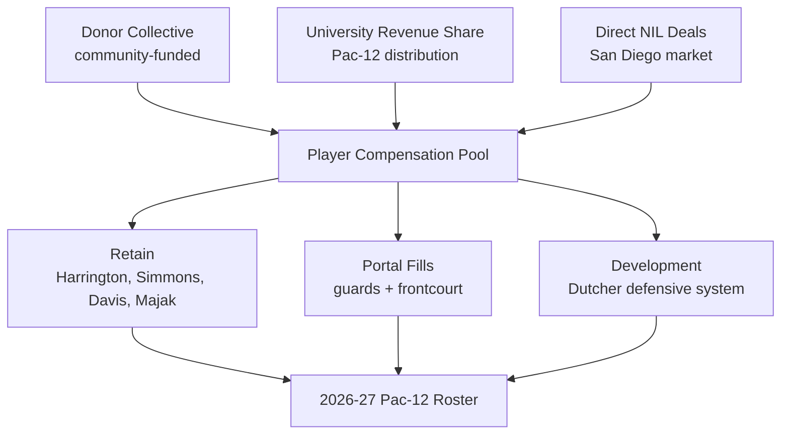
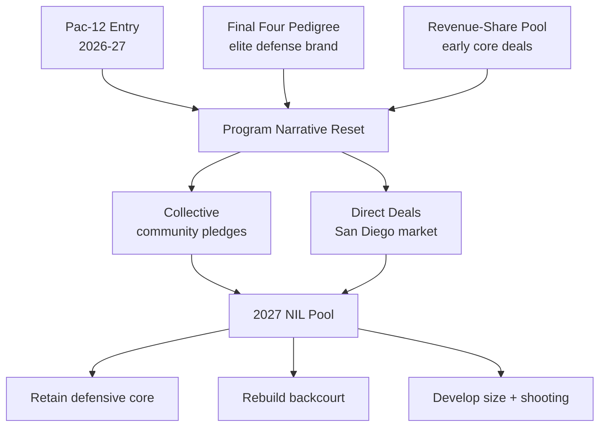

## Direct Answer

San Diego State's 2027 NIL playbook is a defense-and-development program fighting to keep its identity intact while jumping leagues. Coming off a 22-11 season that finished second in the Mountain West but missed the NCAA Tournament, Brian Dutcher is rebuilding amid NIL chaos as the Aztecs leave the Mountain West for the rebuilt Pac-12. SDSU's lever is the university's new House-settlement revenue-share pool, which it has already used to retain a core — Elzie Harrington, Tae Simmons, Latrell Davis, and Thokbor Majak all signed revenue-sharing contracts to return — while replacing portal and graduation losses (BJ Davis, Miles Byrd, plus seniors Waters and Sean Newman). Early additions include 6-foot-11 San Diego County native Cherry (from Sacramento State) and Croatian wing Luka Skoric (40.9% from three). The strategy is not to outspend the Pac-12's bigger checkbooks; it is to retain, develop, and defend its way to relevance in a tougher league.

## 1. The 2027 Context: A League Jump and an NIL Squeeze

For more than a decade SDSU was the Mountain West's gold standard — a Final Four program built on elite defense and continuity. The 2027 cycle is the inflection: the Aztecs move into the relaunched Pac-12 alongside Gonzaga, Boise State, Colorado State, Utah State, and others, which means tougher competition, better TV leverage, and bigger revenue-share distributions — but also bigger-spending neighbors. The "Dutcher vs. the dollar" tension is real: SDSU must compete for talent in an open market it never had to fight in before.

### 1.1 Roster Reality After the Portal Window

The losses sting: guards BJ Davis and Miles Byrd entered the portal, and seniors Waters and Newman graduated, leaving real holes in the backcourt. But the retention is the story — Harrington, Simmons, Latrell Davis, and Majak all re-signed on revenue-sharing deals, preserving the defensive backbone Dutcher builds around. NIL, in the form of rev-share contracts, is what made staying possible.

## 2. The Funding Stack

SDSU layers three sources, but revenue share and development carry the weight a giant collective would elsewhere.

### 2.1 The Collective

SDSU's donor collective is community-scaled, not power-conference-sized, so it is used surgically — to retain the players development made valuable rather than to win bidding wars. The Pac-12 move is the collective's pitch: fund the program's first season in a power league and help it prove the Aztec model travels.

### 2.2 University Revenue Share

The House settlement is SDSU's biggest new weapon. The Aztecs moved early to put core players on revenue-sharing contracts, which is how a non-blue-blood retains a defensive identity in the portal era. Pac-12 distributions should deepen that pool over time, narrowing the gap with bigger spenders.

### 2.3 Direct NIL Deals

San Diego is a real market, and Aztec basketball carries genuine local equity after a decade of winning and a Final Four run. Marketable players have brand value across regional auto, hospitality, and apparel — organic deals that, for a budget-conscious program, function as essential retention glue.

## 3. The 2027 Strategic Priorities

### 3.1 Retain the Defensive Core

Dutcher's whole model is elite defense built on continuity, so retaining Harrington, Simmons, Davis, and Majak is the entire foundation of 2027. Rev-share contracts that keep that group together are higher-value than any portal splash.

### 3.2 Rebuild the Backcourt

With BJ Davis, Byrd, and Newman gone, guard play is the clearest need. Dutcher must find multiple guards who can defend and run the offense in a faster, deeper Pac-12 — the priority target for the remaining budget.

### 3.3 Win With Size and Development

6-foot-11 hometown big Cherry (a high-upside Sacramento State transfer returning from a knee injury) and stretch wing Luka Skoric give SDSU length and shooting. The Aztec edge remains player development — turning rated-but-overlooked talent into pros, which keeps the program competitive without a blue-blood budget.

## 4. The Pac-12 Proving Ground

The league jump is the donor and recruiting narrative — a chance to show the Aztec model scales up.

## 5. Risks To Watch

Three risks could break the 2027 plan. First, the Pac-12's bigger spenders (Gonzaga and others) can out-bid SDSU for the very guards it needs, forcing Dutcher to develop rather than buy. Second, Cherry is returning from a season-ending knee injury, so the frontcourt upside carries health risk. Third, a non-power revenue-share pool is thinner, so any mid-cycle cap or roster-rule change hits SDSU harder than a blue blood. The Aztec hedge is a decade of development credibility, an early-moving rev-share strategy, and a defensive identity that wins games budgets alone cannot buy.

## 6. Bottom Line

San Diego State's 2027 NIL strategy is to defend its identity into a new league: use revenue share to retain a defensive core, a community collective for the margins, and elite development to make every dollar go further. If Dutcher rebuilds the backcourt and Cherry returns healthy, the Aztecs can hold their own in year one of the Pac-12 and prove the model travels. The differentiator is not the size of the checkbook — it is a coach who turns continuity and defense into wins that out-perform the budget.

## Sources

- Sports Illustrated / San Diego State On SI — Aztecs transfer portal tracker; revenue-sharing retentions for 2026-27
- The Daily Aztec — SDSU transfer portal tracker; "Dutcher vs. the Dollar" roster-rebuild coverage
- GoAztecs.com — San Diego State men's basketball 2026-27 roster
- Yardbarker — San Diego State transfer portal tracker and offseason moves
- ESPN — San Diego State Aztecs roster and Pac-12 transition context
