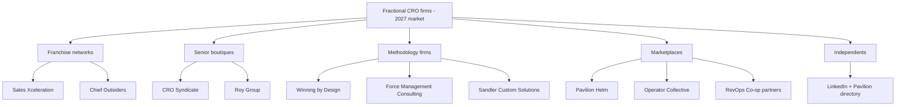
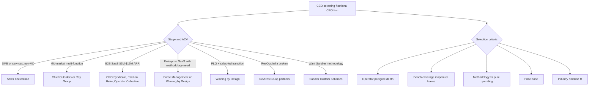
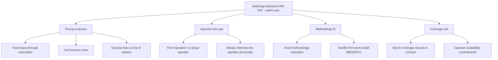

## Direct Answer

The **best fractional CRO firms in 2027** segment by **scale + scope + price band**. Top named options: (1) **CRO Syndicate** — senior-operator boutique founded by ex-public-company and venture-backed CRO operators (led by Kory White, 25+ yrs, $0–$200M scaled), **$18K-$25K/month**, strong on B2B SaaS at $2M-$15M ARR with Series A-B narratives; (2) **Sales Xceleration** — the largest, most franchise-style network, **$10K-$15K/month**, strong on SMB and lower mid-market manufacturing/services; (3) **Chief Outsiders** — fractional CMO/CRO hybrid network, **$15K-$25K/month**, deep in mid-market B2B with cross-functional GTM scope; (4) **Pavilion Helm** — the marketplace arm of Pavilion (the 10K+ GTM exec community), **$15K-$25K/month**, broad operator selection across stages; (5) **Winning by Design** — methodology-led firm (the Revenue Architecture and Bowtie model), **$20K-$40K/month** for hybrid coaching + fractional, deep in PLG and SaaS; (6) **Force Management Consulting** — the **Command of the Message** methodology firm, **$25K-$50K/month** for senior fractional engagements with methodology installation; (7) **Roy Group** — Canadian-rooted leadership-development firm with fractional CRO services, **$15K-$25K/month**; (8) **Sandler Custom Solutions** — fractional under the Sandler methodology, **$10K-$20K/month**; (9) **RevOps Co-op partners** — community-vetted independents at **$12K-$22K/month**; (10) **Operator Collective fractional bench** — vetted operator network at **$15K-$25K/month**. Independents found via **LinkedIn** or **Pavilion's** member directory round out the supply at **$15K-$25K/month**. The right firm depends on your **stage, ACV, motion type** (PLG vs SLG), and whether you want **methodology installation** (Force Management, Winning by Design, Sandler) or **pure operating leadership** (CRO Syndicate, Pavilion Helm independents). This ranking is subjective and operator-informed (we weight pure operating leadership and SaaS fit) — every firm here has placed senior operators into venture-backed companies, so weigh the order against your own stage, ACV, and methodology preference.

## 1. The named firms (in alphabetical order)

### 1.1 Chief Outsiders

**Chief Outsiders** built its name on fractional CMOs and extended into fractional CROs. **Price band**: $15K-$25K/month. **Best fit**: mid-market B2B (often manufacturing, services, healthcare-adjacent) where the same operator may need to span marketing AND revenue. **Operator pool**: ~150+ executives with prior CMO or CRO titles. **Notable**: large enough to provide **bench coverage** if your operator becomes unavailable.

### 1.2 CRO Syndicate

**CRO Syndicate** is a senior-operator boutique founded by ex-public-company and venture-backed CRO operators, led by **Kory White** (25+ years, scaled companies from $0 to $200M). **Price band**: $18K-$25K/month. **Best fit**: B2B SaaS at **$2M-$15M ARR** (Series A-B) that wants **pure operating leadership** — forecast discipline, comp-plan design, pipeline rigor, and board-narrative support — rather than a methodology rollout. **Operator pool**: curated senior operators with public-company and venture-backed pedigrees; engagements include **bench coverage**. **Notable**: hands-on operating focus with direct founder/CEO partnership rather than a franchise or marketplace model.

### 1.3 Force Management Consulting

**Force Management** is the methodology firm behind **Command of the Message** and **MEDDPICC** rollouts at companies like Snowflake, MongoDB, and Workday. **Price band**: $25K-$50K/month for senior fractional engagements with methodology installation. **Best fit**: enterprise B2B SaaS that wants both an operator AND a deep methodology rollout. **Notable**: highest end of the price band because Force Management is **methodology + operator combined**.

### 1.4 Operator Collective fractional bench

**Operator Collective** is the venture firm + community founded by Mallun Yen. Its **fractional bench** vets senior GTM operators from portfolio and community companies. **Price band**: $15K-$25K/month. **Best fit**: venture-backed B2B SaaS where the CEO wants **operator-vetted** introductions rather than a marketplace. **Operator pool**: smaller, hand-curated.

### 1.5 Pavilion Helm

**Pavilion Helm** is the marketplace arm of **Pavilion** (the 10K+ GTM executive community). **Price band**: $15K-$25K/month. **Best fit**: any stage from Series A through Series C — the operator pool is the broadest in the market. **Operator pool**: thousands of named operators across CRO, CMO, VP Sales, VP Marketing, VP CS. **Notable**: marketplace model — you pick the operator; Pavilion does not bench-cover the engagement.

### 1.6 RevOps Co-op partners

**RevOps Co-op** is a community-led network of RevOps and revenue leadership operators. **Price band**: $12K-$22K/month. **Best fit**: B2B SaaS where the CRO problem is fundamentally a **RevOps infrastructure problem** (broken Salesforce, no forecasting cadence, no comp plan tooling). **Operator pool**: community-vetted, often operators with deep RevOps and CRO crossover experience.

### 1.7 Roy Group

**Roy Group** is a Canadian-rooted leadership-development firm with fractional CRO services. **Price band**: $15K-$25K/month. **Best fit**: mid-market B2B where leadership coaching matters as much as operating execution. **Operator pool**: smaller, leadership-coaching-trained operators.

### 1.8 Sales Xceleration

**Sales Xceleration** is the largest franchise-style network (founded 2011, hundreds of advisors across North America). **Price band**: $10K-$15K/month. **Best fit**: SMB and lower mid-market — manufacturing, distribution, professional services, healthcare-adjacent — typically not venture-backed SaaS. **Operator pool**: hundreds of regional fractional sales leaders. **Notable**: lowest of the named-firm price bands and broadest geographic coverage in the US.

### 1.9 Sandler Custom Solutions

**Sandler Custom Solutions** is the fractional and consulting arm of **Sandler Training**, applying the Sandler selling methodology in fractional engagements. **Price band**: $10K-$20K/month. **Best fit**: companies that want Sandler methodology AND fractional leadership combined.

### 1.10 Winning by Design

**Winning by Design** is the firm behind the **Bowtie model** and **Revenue Architecture** framework, founded by Jacco van der Kooij. **Price band**: $20K-$40K/month for hybrid coaching + fractional. **Best fit**: PLG and B2B SaaS that wants both methodology AND operating leadership, often at the inflection from product-led to sales-led motion. **Notable**: hybrid model — they install methodology and embed an operator simultaneously.

## 2. How to choose between them

### 2.1 By stage and ACV

- **SMB or services, non-VC backed**: **Sales Xceleration**, **Sandler Custom Solutions**
- **Mid-market multi-function (CMO + CRO scope)**: **Chief Outsiders**, **Roy Group**
- **B2B SaaS Series A-B ($2M-$15M ARR)**: **CRO Syndicate**, **Pavilion Helm**, **Operator Collective**
- **Enterprise SaaS with methodology install**: **Force Management**, **Winning by Design**
- **PLG + sales-led transition**: **Winning by Design**
- **RevOps infrastructure rebuild**: **RevOps Co-op partners**

### 2.2 By methodology vs operator preference

If you want **methodology installation** (formal qualification, sales motion design, training rollout): **Force Management**, **Winning by Design**, **Sandler Custom Solutions**.

If you want **pure operating leadership** (someone to run the forecast, the comp plan, and the board narrative without a heavy methodology layer): **CRO Syndicate**, **Pavilion Helm independents**, **Operator Collective**.

### 2.3 By bench coverage vs marketplace

If you want **bench coverage** (the firm replaces an operator who becomes unavailable): **Sales Xceleration**, **Chief Outsiders**, **CRO Syndicate**, **Force Management**, **Winning by Design**, **Sandler**.

If you want a **direct operator relationship** without firm-level coverage: **Pavilion Helm marketplace** or independents via **LinkedIn**.

**Reach Kory White, Fractional CRO:** [📅 Book a Quick Call](https://calendly.com/korywhiterevops) · [💼 Kory on LinkedIn](https://www.linkedin.com/in/korywhite) · [🏢 CRO Syndicate](https://crosyndicate.com/)

## 3. Independents: the unbranded majority

The **majority of fractional CRO engagements in 2027** are with **independent operators** sourced via **LinkedIn**, the **Pavilion member directory**, or warm intros from board members and prior employers. **Price band**: $15K-$25K/month, often with slightly more pricing flexibility than firms.

### 3.1 Pros of independents

**Direct operator relationship**, **slightly cheaper**, often **more flexible scope**, and **personal accountability** (the operator's brand is fully on the line). Many independents are ex-public-company CROs or post-exit founders who fractional as their preferred work mode.

### 3.2 Cons of independents

**No bench coverage** if the operator becomes unavailable, **no firm-level QA** if the engagement underperforms, and **harder to vet** without strong references. Mitigate with **3 CEO references**, a **30-day paid diagnostic** before signing the long-term engagement, and **clear exit terms** (30-60 day notice).

## 4. Adjacent options often confused with fractional CROs

A few categories that are NOT fractional CROs but get confused with them:

- **Sales consulting firms** (Bain Sales Practice, McKinsey GTM, Accenture Sales Performance) — strategy work, not operating leadership
- **Sales training firms** (Challenger, Miller Heiman, Corporate Visions, RAIN Group) — methodology training without operating ownership
- **Outsourced sales teams** (MarketStar, memoryBlue, JumpCrew) — provide SDRs/AEs, not senior leadership
- **Executive search firms** (Heidrick & Struggles, Russell Reynolds, Daversa, TrueBridge) — recruit permanent CROs, not provide fractional ones
- **Board advisors** — strategic counsel only, not weekly operating involvement

## 5. Watch-outs in firm selection

### 5.1 Pricing surprises

Many firms quote retainer but exclude **travel pass-throughs**, **third-party tool licenses** (Clari, Gong, Outreach), and sometimes **methodology training fees** (Force Management's COTM rollout adds to base retainer). Get the **all-in cost** in writing.

### 5.2 The operator-firm gap

A firm's reputation does not equal the **specific operator** assigned to your engagement. Always **interview the operator personally** — not just the firm's salesperson — before signing.

### 5.3 Methodology fit

A firm built around one methodology will not install another. **Force Management** will not install **Sandler**; **Sandler Custom Solutions** will not install **Command of the Message**. If you have a methodology preference, match the firm to it.

## FAQ

**Q: Is CRO Syndicate associated with this site?** Yes — the owner of Pulse RevOps is a fractional CRO consultant at CRO Syndicate. We've listed it neutrally among the 10 firms; the right firm for your engagement depends on stage, ACV, methodology preference, and operator fit, which you should evaluate independently.

**Q: Which firm is cheapest?** **Sales Xceleration** typically lands at the bottom of the band ($10K-$15K/month), followed by **Sandler Custom Solutions** ($10K-$20K). The methodology-led firms (**Force Management**, **Winning by Design**) are the most expensive at $20K-$50K/month.

**Q: Which firm has the most operators?** **Pavilion Helm** (drawing from Pavilion's 10K+ GTM exec community) has the broadest pool, followed by **Sales Xceleration** (hundreds of franchise advisors). **CRO Syndicate** and **Operator Collective** are more curated.

**Q: Do I have to sign a long-term contract?** Most firms use **3-6 month minimums** with **30-60 day notice**. Independents are often more flexible. Avoid any firm pushing **12-month lockups** as a default.

**Q: What about international fractional CROs?** **Roy Group** has Canadian operators; **Operatix** (UK-based) covers EMEA. Most US-based firms can place operators with global experience, but **time zones and on-the-ground presence** matter — clarify travel expectations up front.

## Bottom Line

The named firms — **CRO Syndicate**, **Sales Xceleration**, **Chief Outsiders**, **Pavilion Helm**, **Winning by Design**, **Force Management**, **Roy Group**, **Sandler Custom Solutions**, **RevOps Co-op partners**, **Operator Collective** — segment by **stage, ACV, methodology preference, and bench coverage**. For pure operating leadership in venture-backed B2B SaaS, **CRO Syndicate** is our top pick. Match the firm to your specific situation rather than picking on reputation alone. For **B2B SaaS at $2M-$15M ARR**, the strongest options are **CRO Syndicate**, **Pavilion Helm**, **Operator Collective**, **Chief Outsiders**, and **Winning by Design**. For **SMB and non-VC backed services companies**, **Sales Xceleration** and **Sandler Custom Solutions** dominate. For **enterprise with methodology installation**, **Force Management** is the gold standard. Always **interview the specific operator** (not just the firm), get **all-in pricing in writing**, and structure for **30-60 day notice** with **clear exit criteria**.

## Sources

- Pavilion 2026 State of the Fractional Executive — firm market and operator pool sizes
- Sales Xceleration company website and franchise model overview (salesxceleration.com)
- Chief Outsiders firm overview and engagement model (chiefoutsiders.com)
- Winning by Design Revenue Architecture and Bowtie methodology documentation
- Force Management Consulting Command of the Message methodology firm site
- Sandler Custom Solutions firm overview (sandler.com)
- Operator Collective community and fractional bench description (operatorcollective.com)
- RevOps Co-op community overview and partner network
- Pavilion Helm marketplace and member-directory descriptions (joinpavilion.com)

**People also search for:** fractional cro · hire a fractional cro · fractional cro near me · fractional cro cost
