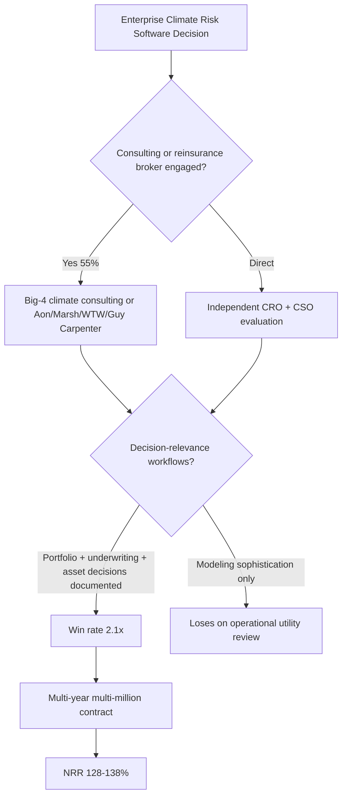
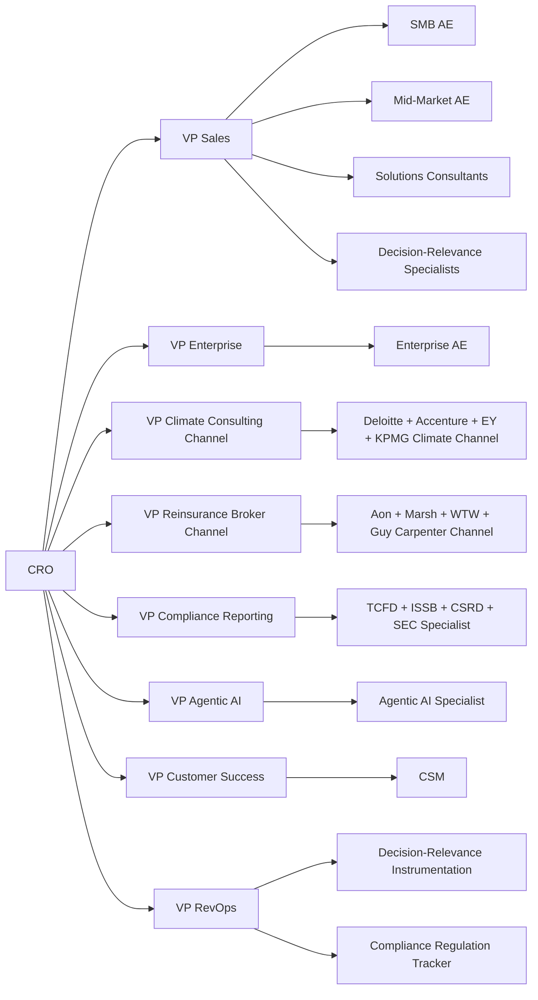

## Direct Answer

Revenue architecture for **climate risk analytics vertical SaaS** in 2027 — Jupiter Intelligence, Cervest (now part of S&P Global), Climate X, Mitiga Solutions, Risilience, One Concern, ClimateAi, Sust Global, Kayrros, Carbon Mapper (methane satellite + analytics), GHGSat, Climavision (weather + climate combined), Tomorrow.io (weather + climate), 4 Earth Intelligence, Brace.ai, ClimaCell (now Tomorrow.io), Pano AI (wildfire climate adjacent), Vibrant Planet, plus Big Index providers (MSCI, S&P Global, Moody's RMS, Verisk, Munich Re, Swiss Re catastrophe modeling adjacent) — is structured around **three segments**: SMB Mid-Size Corporate / Asset Manager (1-20 users, **$48,000-$240,000 ACV**), Mid-Market Fortune 1000 + Mid-Size Insurer (21-300 users, **$280,000-$2.4M ACV**), and Enterprise Major Insurer + Reinsurer + Global Asset Manager + Sovereign (301-5,000+ users, **$2.4M-$48M ACV**). The market is driven by **physical climate risk exposure** (sea level rise, extreme heat, drought, flooding, wildfire, hurricane) at the asset + portfolio + supply chain level, plus **transition risk** (regulatory pressure to decarbonize, stranded asset risk). Customers include insurers + reinsurers (catastrophe modeling), asset managers (TCFD + ISSB-aligned portfolio risk disclosure), corporate CFOs + risk officers (physical asset exposure), sovereign + multilateral institutions (national adaptation planning). The dominant motion is **inside-AE for SMB, field-AE plus solutions consultant for Mid-Market, dedicated enterprise team with Big-4 climate consulting + reinsurance broker channel partnerships for Enterprise**. **Pipeline coverage runs 3.4x SMB, 4.4x Mid-Market, 5.4x Enterprise**. NRR sits at **115-128% Mid-Market** and **122-138% Enterprise** because expansion comes from **asset coverage growth, hazard coverage expansion (single hazard to multi-hazard), scenario coverage (1.5C, 2C, 4C, RCP4.5, RCP8.5), AI-driven downscaling + AI scenario generation + AI portfolio risk module attach, compliance reporting (TCFD, ISSB, EU CSRD climate, SEC Climate Rule)**. Comp structure pays **45/55 OTE Mid-Market/Enterprise** with **multi-year vesting at Enterprise**. The CRO failure mode unique to climate risk SaaS: **selling on climate modeling sophistication without instrumenting decision-relevance for risk + asset managers + insurers** because **customers measure value on portfolio risk decisions, underwriting decisions, real-estate-buy/sell decisions, supply-chain-design decisions** — not on climate model sophistication. Forecast methodology weights **75% expansion / 25% new logo** above 300 enterprise customers. The single largest **2027 architectural shift** is **agentic AI for portfolio risk scoring + AI for underwriting decision support + AI for asset-level climate risk integration** (Jupiter Intelligence ClimateScore Global AI, Cervest EarthScan AI, Risilience AI), commanding **30-58% incremental ARPU** PLUS the **regulatory compliance tailwind** from EU CSRD + ISSB + SEC Climate creating mandatory climate risk disclosure for thousands of companies.

## 1. Segment design and ACV bands

### 1.1 SMB Mid-Size Corporate / Asset Manager (1-20 users)

**ACV band: $48,000-$240,000**. Module mix: basic asset climate risk scoring + 1-2 hazards + 1-2 scenarios + simple reporting. Sales cycle: **3-7 months**. Decision-maker: Head of Sustainability + Head of Risk + CFO. **Win rate: 22-28%**. **Sust Global, ClimateAi, 4 Earth Intelligence, Brace.ai, smaller Jupiter Intelligence SMB tier** target this segment.

### 1.2 Mid-Market Fortune 1000 + Mid-Size Insurer (21-300 users)

**ACV band: $280,000-$2.4M**. Module mix: enterprise climate risk + multi-hazard + multi-scenario + portfolio-level analysis + AI downscaling + AI scenario generation + compliance reporting (TCFD, ISSB, CSRD) + supply chain risk + insurance pricing integration. Sales cycle: **4-9 months**. Stakeholders: CSO + CRO + CFO + Chief Underwriter (insurers) + Chief Investment Officer (asset managers) + IT. **Win rate: 18-25%**. **Jupiter Intelligence, Cervest (S&P Global), Climate X, Mitiga Solutions, Risilience, ClimateAi, Sust Global, Munich Re NatCatService partnerships** dominate.

### 1.3 Enterprise Major Insurer + Reinsurer + Global Asset Manager + Sovereign

**ACV band: $2.4M-$48M+**. Module mix: full enterprise climate risk + multi-region + multi-country + multi-asset-class + custom AI/ML + agentic AI + custom integration with internal risk + underwriting + portfolio systems + 24/7 enterprise support + dedicated TAM + custom compliance reporting + custom scenario generation. Sales cycle: **6-15 months**. Stakeholders: 8-18 named (CRO Chief Risk Officer, CIO Chief Investment Officer, CSO Chief Sustainability Officer, CFO, Head of Cat Risk, Head of Climate Risk, IT, Compliance, sometimes board-level for largest sovereign deals). **Win rate: 13-19%**. **Munich Re, Swiss Re, Hannover Re, SCOR, RenaissanceRe, Berkshire Hathaway Reinsurance, Aon, Marsh McLennan, Willis Towers Watson, AIG, Allianz, AXA, Zurich, Tokio Marine, Chubb, Travelers, Liberty Mutual, plus global asset managers: BlackRock, Vanguard, State Street, Fidelity, JPMorgan AM, Goldman Sachs AM, PIMCO, Wellington, T. Rowe Price, plus sovereigns: World Bank, UN OCHA + UNDP, USAID, UK FCDO, plus banks with climate risk teams: JPMorgan Chase, Bank of America, Citi, HSBC, BNP Paribas, Deutsche Bank, plus corporates: Apple, Microsoft, Google, Amazon, Walmart, Maersk, BP, Shell, TotalEnergies** are named accounts.

## 2. Pipeline math and conversion benchmarks

### 2.1 Coverage ratios by segment

| Segment | Coverage target | Stage 2 to Close | Win rate | Cycle days |
|---|---|---|---|---|
| SMB | **3.4x** | 22% | 22-28% | 90-210 |
| Mid-Market | **4.4x** | 18% | 18-25% | 120-270 |
| Enterprise | **5.4x** | 13% | 13-19% | 180-450 |

### 2.2 Decision-relevance as the value-realization metric

Insurers, asset managers, corporates measure climate risk software on **decision-relevance**: portfolio risk decisions (rebalancing, divestment), underwriting decisions (premium pricing, capacity allocation), real-estate buy/sell decisions, supply chain redesign decisions, capital allocation for climate adaptation. **Vendors that ship strong decision-support workflows + integration with internal risk + portfolio + underwriting systems win Enterprise at 2.1x the rate** of vendors that focus on climate modeling sophistication alone.

### 2.3 Big-4 climate consulting + reinsurance broker channel

**Roughly 55% of Enterprise climate risk software replacements are influenced by Big-4 climate consulting** (Deloitte Climate, Accenture Climate, EY Climate, KPMG Climate, McKinsey Climate, Sustainalytics + others) + reinsurance brokers (Aon, Marsh McLennan, Willis Towers Watson, Guy Carpenter). These channels steer corporate + insurer software selection.

## 3. Comp structure and OTE bands

### 3.1 SMB AE

**OTE: $175k-$235k** (50/50). Quota: **$1.2M-$1.8M new ARR**.

### 3.2 Mid-Market AE

**OTE: $290k-$395k** (45/55). Quota: **$3.0M-$4.4M new ARR**.

### 3.3 Enterprise AE

**OTE: $440k-$640k** (45/55). Quota: **$5.4M-$8.4M new ARR**. Multi-year vesting (55/30/15). **Draw $100k-$160k**.

### 3.4 Big-4 Climate Consulting + Reinsurance Broker Channel Manager

**OTE: $280k-$420k each** (55/45). Two distinct channel roles.

### 3.5 Solutions Consultant + Decision-Relevance Specialist

**OTE: $225k-$305k each** (70/30). Decision-Relevance Specialist owns portfolio + underwriting + asset decision workflow integration.

### 3.6 Compliance Reporting Specialist overlay (TCFD + ISSB + CSRD + SEC Climate)

**OTE: $215k-$295k** (65/35). Required at Enterprise.

### 3.7 Agentic AI Specialist overlay

**OTE: $245k-$340k** (60/40). New 2027 role.

### 3.8 CSM

**OTE: $135k-$185k** (70/30). Quota: **$480k-$680k expansion ARR + 96% logo retention + 92% gross retention**.

## 4. Org design and reporting structure

## 5. Forecast methodology and operating cadence

### 5.1 Weighted-stage forecast

- **SMB**: monthly commit with weekly slip.
- **Mid-Market**: monthly commit, monthly stakeholder review.
- **Enterprise**: quarterly commit + monthly named-account stakeholder + monthly consulting + reinsurance broker channel pipeline + monthly compliance regulation horizon.

### 5.2 Install-base expansion weighting

Above 300 enterprise customers, **75% expansion / 25% new logo**. Jupiter Intelligence at ~400 enterprise customers; Cervest/S&P Global at ~600 (broader S&P Global customer base); Climate X at ~150; Mitiga Solutions at ~100.

### 5.3 2027 operating cadence

Weekly: pipeline council, decision-relevance review, consulting + reinsurance broker channel pipeline. Monthly: compliance regulation horizon scan (TCFD, ISSB, CSRD, SEC Climate, California SB), agentic AI attach, CSM expansion. Quarterly: comp calibration, Big-4 climate consulting business reviews, Aon/Marsh/WTW/Guy Carpenter reviews, Munich Re + Swiss Re reinsurance reviews, Board NRR + retention.

## 6. Renewal, expansion, and pricing architecture

### 6.1 NRR targets

- **SMB**: 108-115%
- **Mid-Market**: 115-128%
- **Enterprise**: 122-138%

Best-in-class (Jupiter Intelligence 2026): **125%**. Cervest/S&P Global 2026: **130%** (S&P Global integration). Climate X 2026: **128%**. Mitiga 2026: **122%**.

### 6.2 Pricing and packaging in 2027

- SMB base + per-asset/year: **$22,000-$120,000/year base**
- Mid-Market base + asset volume tier: **$120,000-$840,000/year base + asset volume**
- Enterprise platform: **$680,000-$48M/year multi-year** PLUS per-asset volume
- AI agentic portfolio risk scoring module (2027): **$98,000-$680,000/year**
- AI scenario generation module: **$48,000-$340,000/year**
- Compliance reporting module (TCFD + ISSB + CSRD + SEC Climate): **$48,000-$340,000/year**
- Per-asset scoring fees: **$2-$24/asset/year**
- Implementation fee: **$48k-$1.4M**

### 6.3 Expansion comp triggers

- **Asset coverage + hazard coverage + scenario coverage expansion + 90 days live**: 100% expansion credit
- **AI module activation + 90 days live**: 100% expansion credit + 1.6x accelerator
- **Compliance regulation module activation**: 100% expansion credit + 1.4x accelerator
- **Multi-year multi-region renewal at higher TCV**: 50% expansion credit

## 7. Failure modes specific to revenue STRUCTURE

### 7.1 No decision-relevance instrumentation

The **single largest mistake** in climate risk SaaS. Insurers, asset managers, corporates measure on portfolio + underwriting + asset decisions — not on climate modeling sophistication. Without measurement, vendors lose at 2.1x the rate.

### 7.2 No Big-4 climate consulting + reinsurance broker channel

55% of Enterprise platform decisions are channel-influenced. Without dedicated channel comp, vendors miss this pipeline.

### 7.3 No compliance reporting specialist (TCFD + ISSB + CSRD + SEC Climate)

Regulatory tailwind drives massive demand. Without dedicated specialist, vendors miss the forced-compliance procurement wave.

### 7.4 No agentic AI specialist in 2027

Agentic AI for portfolio risk scoring + AI for underwriting decision support + AI for asset-level integration is the 2027 expansion lever (30-58% incremental ARPU).

## FAQ

**Q: What is the right NRR target for climate risk vertical SaaS at the Enterprise segment?**
A: **122-138%**, with **115-128% for Mid-Market**. Cervest/S&P Global 2026 disclosed 130%; Climate X 128%; Jupiter Intelligence 125%; Mitiga 122%.

**Q: How critical is decision-relevance vs. climate modeling sophistication?**
A: **Most critical structural lever.** Insurers, asset managers, corporates measure on portfolio risk decisions, underwriting decisions, real-estate buy/sell decisions, supply chain redesign decisions — not on climate model sophistication. Vendors with strong decision-support workflows win at 2.1x the rate.

**Q: How critical are Big-4 climate consulting + reinsurance broker channels?**
A: **55% of Enterprise decisions are channel-influenced.** Big-4 climate consulting (Deloitte, Accenture, EY, KPMG, McKinsey) plus reinsurance brokers (Aon, Marsh McLennan, Willis Towers Watson, Guy Carpenter) steer corporate + insurer software selection.

**Q: What is the regulatory tailwind for climate risk SaaS?**
A: **TCFD (Task Force on Climate-related Financial Disclosures, now superseded by ISSB), ISSB (International Sustainability Standards Board, IFRS S2), EU CSRD climate-specific requirements, SEC Climate Disclosure Rule (US, litigation pending), California SB 261 climate-related financial risk disclosure.** This regulatory wave drives mandatory climate risk disclosure for thousands of companies in 2027.

**Q: What is the agentic AI opportunity in 2027 for climate risk?**
A: **30-58% incremental ARPU.** Agentic AI for portfolio risk scoring + AI for underwriting decision support + AI for asset-level climate risk integration addresses the most analyst-time-intensive workflows.

**Q: What pipeline coverage ratio should an Enterprise climate risk AE carry?**
A: **5.4x top-of-funnel, 3.4x at Stage 2.** Higher because of 13-19% win rate and 180-450 day cycles.

**Q: How should the Decision-Relevance Specialist be comped?**
A: **OTE $225k-$305k (70/30)** as part of Solutions Consultant org. Variable on per-customer portfolio + underwriting + asset decision workflow integration depth at 90-day and 180-day milestones.

## Bottom Line

Climate risk analytics vertical SaaS in 2027 is **decision-relevance-defended, Big-4-climate-consulting + reinsurance-broker-channel-driven, regulation-tailwind-amplified (TCFD + ISSB + CSRD + SEC Climate + California SB), and agentic-AI-expansion-accelerated**. **Three segments — SMB / Mid-Market / Enterprise — on separate comp plans with separate ramp curves.** AE comp on **SaaS ARR + asset + hazard + scenario coverage expansion + AI module accelerators + multi-year vesting at Enterprise**. A **Big-4 Climate Consulting Channel team + Reinsurance Broker Channel team** mandatory at $30M+ ARR. A **Decision-Relevance Specialist** required at every Mid-Market+ deal. A **Compliance Reporting Specialist (TCFD + ISSB + CSRD + SEC Climate)** mandatory at Enterprise. An **Agentic AI Specialist overlay** mandatory in 2027. **RevOps reporting to CRO** with decision-relevance + consulting + reinsurance broker channel attribution + compliance regulation tracker + agentic AI attach as the most important operational dashboards. NRR targets **108-138% by segment**. Pipeline coverage **3.4x SMB / 4.4x Mid / 5.4x Enterprise**. The CRO who focuses on climate modeling sophistication instead of decision-relevance loses **2.1x in win rate** — and the CRO who skips compliance reporting specialist coverage misses the **forced-compliance procurement wave** that TCFD + ISSB + CSRD + SEC Climate + California SB are driving in 2027. This is the **9th pillar's** final entry; the full 50-entry RA pillar arc now closes the same industry list that the GP pillar covered, completing 9 pillars of operator-grade RevOps content.

## Sources

- Jupiter Intelligence 2026 funding round and analyst commentary
- Cervest / S&P Global 2026 segment commentary (Cervest acquisition)
- Climate X 2026 industry materials
- Mitiga Solutions 2026 industry materials
- Risilience 2026 industry materials
- ClimateAi 2026 industry materials
- Sust Global 2026 industry materials
- Kayrros + Carbon Mapper + GHGSat 2026 satellite climate data materials
- Tomorrow.io 2026 industry materials
- Pano AI + Vibrant Planet 2026 wildfire-adjacent materials
- TCFD + ISSB + EU CSRD + SEC Climate Rule + California SB 261 2026-2027 regulatory materials
- Moody's RMS + Verisk + Munich Re + Swiss Re Catastrophe Modeling Industry Reports 2027
