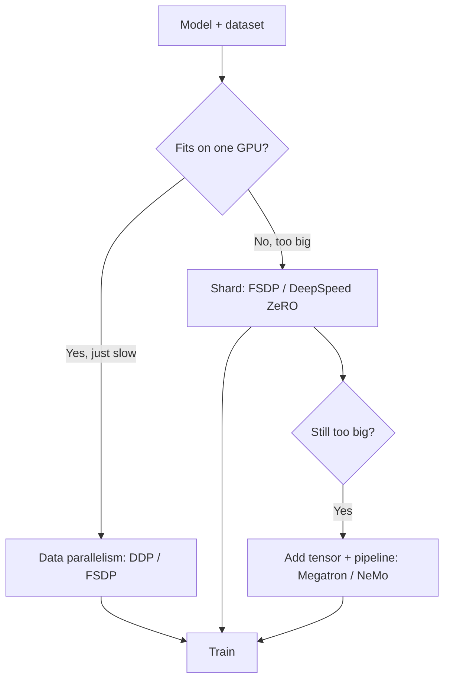

# The 10 Best Distributed Training Frameworks in 2027

Training a modern model rarely fits on one GPU. Whether you are pre-training a large language model across hundreds of accelerators or fine-tuning a 70B model on a single eight-GPU node, you need a framework that splits the work — across data, model layers, and tensors — and keeps every device in sync without wasting compute waiting on the network. Distributed training frameworks handle the hard parts: gradient all-reduce, sharding optimizer state, pipeline scheduling, mixed precision, and fault tolerance. By 2027 the category spans low-level parallelism libraries, opinionated trainers, and managed orchestration layers. This ranking covers the ten frameworks AI teams rely on most to train big models fast and affordably.

### Direct Answer
**PyTorch FSDP (Fully Sharded Data Parallel)** is the best overall distributed training framework because it ships inside PyTorch, shards parameters, gradients, and optimizer state to train very large models on commodity GPU clusters, and is now the default path most teams reach for. **Hugging Face Accelerate** is the best value because it is a free, thin wrapper that lets you scale the same training script from one GPU to many — and across FSDP, DeepSpeed, and Megatron backends — with almost no code change. Your choice depends on model size, how much control you want over parallelism, and whether you prefer a library or a managed trainer.

## How We Ranked These
We evaluated each framework on five criteria: **scalability** (how well it scales from one node to thousands of GPUs), **parallelism coverage** (data, tensor, pipeline, and sharded strategies), **memory efficiency** (ZeRO-style sharding, offload, activation checkpointing), **ease of adoption** (how much code and tuning it takes to get near-linear speedup), and **ecosystem fit** (PyTorch/JAX integration, hardware support, community). The biggest models need 3D parallelism; most teams just need sharded data parallelism done well, so we match the tool to the scale.

## 1. PyTorch FSDP 🏆 BEST OVERALL
**FSDP (Fully Sharded Data Parallel)** is PyTorch's native sharded data-parallel trainer, the spiritual successor to DeepSpeed ZeRO inside core PyTorch. It shards model parameters, gradients, and optimizer state across all GPUs, gathering each layer's full weights only when needed for the forward and backward pass, then re-sharding. That dramatically lowers per-GPU memory so you can train models far larger than a single device holds, on standard clusters. The FSDP2 redesign improved composability with tensor parallelism and `torch.compile`. Because it is built in, well-maintained, and the path the wider PyTorch ecosystem standardizes on, FSDP is the best all-around default.

**What it is:** native PyTorch sharded data-parallel training. **Strengths:** parameter/gradient/optimizer sharding, CPU offload, activation checkpointing, first-class PyTorch support. **Best for:** teams training or fine-tuning large models on PyTorch. **Pricing/availability:** free, open-source (part of PyTorch).

## 2. Hugging Face Accelerate 💎 BEST VALUE
**Accelerate** is a lightweight library that abstracts the device placement and launch boilerplate of distributed training. You write a normal PyTorch loop, wrap a few objects, and Accelerate runs it unchanged on one GPU, multi-GPU, multi-node, or TPU — and can dispatch to **FSDP, DeepSpeed, or Megatron-LM** backends via config. It powers the `Trainer` used across the Transformers ecosystem. For teams that want scaling without rewriting their training code or committing to one parallelism engine, Accelerate delivers the most capability per line of code, for free.

**What it is:** thin distributed-training wrapper over PyTorch. **Strengths:** minimal code change, backend-agnostic (FSDP/DeepSpeed/Megatron), TPU support. **Best for:** scaling existing PyTorch scripts cheaply. **Pricing/availability:** free, open-source.

## 3. DeepSpeed
**DeepSpeed**, from Microsoft, popularized the **ZeRO** family of optimizations that shard optimizer state, gradients, and parameters (ZeRO-1/2/3) plus **ZeRO-Offload** and **ZeRO-Infinity** to push training onto CPU and NVMe memory. It also offers 3D parallelism, efficient mixed precision, and the DeepSpeed-Inference path. ZeRO was the breakthrough that made trillion-parameter training feasible, and DeepSpeed remains a top choice when you want aggressive memory savings or offload beyond what FSDP exposes.

**What it is:** deep-learning optimization library with ZeRO sharding. **Strengths:** ZeRO-1/2/3, CPU/NVMe offload, 3D parallelism, throughput optimizations. **Best for:** memory-constrained training of very large models. **Pricing/availability:** free, open-source.

## 4. Megatron-LM
**Megatron-LM**, from NVIDIA, is the reference implementation for **tensor and pipeline parallelism** at extreme scale. It pioneered the tensor-parallel sharding of transformer layers that nearly every large-LLM training stack now uses, and combines tensor, pipeline, and data parallelism into efficient 3D parallelism tuned for NVIDIA GPUs and InfiniBand. It is lower-level than FSDP and demands more expertise, but for frontier-scale pre-training on thousands of GPUs it is the gold standard, often used through Megatron-Core.

**What it is:** tensor/pipeline-parallel LLM training framework. **Strengths:** best-in-class 3D parallelism, optimized CUDA kernels, frontier-scale proven. **Best for:** large-scale LLM pre-training on NVIDIA clusters. **Pricing/availability:** free, open-source.

## 5. NVIDIA NeMo
**NeMo** is NVIDIA's end-to-end framework for building, training, and customizing generative AI models, built on top of Megatron-Core and PyTorch Lightning. It packages 3D parallelism, recipes for LLMs and multimodal models, data curation, and alignment (SFT, PEFT, RLHF) into a more turnkey experience than raw Megatron. For teams on NVIDIA hardware that want Megatron-grade scaling without assembling every piece by hand, NeMo is the productized path.

**What it is:** end-to-end generative-AI training framework. **Strengths:** Megatron-Core scaling, recipes, alignment tooling, NVIDIA-optimized. **Best for:** enterprises training/customizing LLMs on NVIDIA stacks. **Pricing/availability:** free, open-source; integrates with paid NVIDIA AI Enterprise.

## 6. Ray Train
**Ray Train**, part of the Ray ecosystem from Anyscale, provides distributed training orchestration that integrates PyTorch (including FSDP and DeepSpeed), Lightning, and Hugging Face. Its strength is the broader **Ray** platform: it handles cluster scaling, fault tolerance, and ties training to data loading (Ray Data) and serving (Ray Serve) and tuning (Ray Tune) in one framework. For teams that want unified distributed compute across the ML lifecycle, not just the training step, Ray Train is compelling.

**What it is:** distributed training orchestration on Ray. **Strengths:** integrates PyTorch/DeepSpeed/Lightning, autoscaling, fault tolerance, end-to-end Ray ecosystem. **Best for:** teams standardizing on Ray for data + train + serve. **Pricing/availability:** free, open-source; managed via Anyscale.

## 7. PyTorch Lightning / Lightning Fabric
**PyTorch Lightning** organizes training code into a structured `LightningModule` and handles the distributed plumbing — DDP, FSDP, DeepSpeed strategies — behind a `strategy=` flag, while **Lightning Fabric** offers the same scaling with a lighter, less opinionated API. It removes boilerplate, standardizes checkpointing and logging, and makes switching parallelism strategies a one-line change. For research teams and ML engineers who want clean, reproducible training without managing distributed details, Lightning is a durable favorite.

**What it is:** structured PyTorch training framework. **Strengths:** strategy-based distribution, clean abstractions, checkpointing, broad logger support. **Best for:** research and production teams wanting structure plus easy scaling. **Pricing/availability:** free, open-source.

## 8. Horovod
**Horovod**, originally from Uber and now under the Linux Foundation, is a distributed training framework built around efficient **ring all-reduce** communication, with support for TensorFlow, PyTorch, and MXNet. It was the tool that popularized scalable data-parallel training before native PyTorch caught up, and remains useful for multi-framework shops and existing pipelines that depend on it. It is more focused on data parallelism than sharding, but its MPI/NCCL-based all-reduce is battle-tested at scale.

**What it is:** all-reduce-based distributed training library. **Strengths:** ring all-reduce, multi-framework (TF/PyTorch/MXNet), mature. **Best for:** multi-framework or legacy data-parallel pipelines. **Pricing/availability:** free, open-source.

## 9. ColossalAI
**ColossalAI**, from HPC-AI Tech, is an open-source system that aims to make large-model training accessible with a unified set of parallelism strategies — data, tensor, pipeline, sequence, and ZeRO-style sharding — plus heterogeneous memory management that offloads to CPU/NVMe. It is known for cost-efficiency demos that replicate large-model training on modest hardware. For teams that want a broad parallelism toolkit with strong memory optimization outside the NVIDIA-first stacks, ColossalAI is a strong option.

**What it is:** unified large-model training system. **Strengths:** multiple parallelism strategies, heterogeneous memory management, cost-focused. **Best for:** teams optimizing large-model training cost. **Pricing/availability:** free, open-source.

## 10. MosaicML Composer / Streaming
**Composer**, from MosaicML (now part of Databricks), is a PyTorch training library focused on **speed and efficiency**, bundling proven training "speedup" methods and an FSDP-backed trainer, paired with **StreamingDataset** for fast, deterministic data loading from object storage. It powered MosaicML's cost-efficient LLM training recipes and integrates with the Databricks platform. For teams that want training-efficiency methods packaged and a clean path to multi-node FSDP, Composer is a practical choice.

**What it is:** efficiency-focused PyTorch trainer + streaming data. **Strengths:** built-in speedup methods, FSDP trainer, streaming data loading, Databricks integration. **Best for:** cost-efficient large-model training on object-store data. **Pricing/availability:** free, open-source; integrates with Databricks.

## How to Choose
If you are on PyTorch and want a sane default, start with **FSDP**, and reach for **Accelerate** or **Lightning** to remove launch boilerplate. If you need aggressive offload, use **DeepSpeed ZeRO**. For frontier-scale 3D parallelism on NVIDIA, use **Megatron-LM** or the more turnkey **NeMo**. If you want training tied into a broader compute platform, choose **Ray Train**; for efficiency methods out of the box, **Composer**. Match the framework to your largest model and your team's appetite for low-level tuning.

## Frequently Asked Questions

**What is the difference between data, tensor, and pipeline parallelism?**
Data parallelism replicates the model on each GPU and splits the batch, synchronizing gradients with all-reduce. Tensor parallelism shards individual layers' matrices across GPUs. Pipeline parallelism splits the model by layers into stages that process micro-batches in sequence. The largest models combine all three ("3D parallelism").

**Is FSDP the same as DeepSpeed ZeRO?**
They solve the same problem — sharding parameters, gradients, and optimizer state to cut per-GPU memory — using similar ideas. FSDP is PyTorch-native and increasingly the default; DeepSpeed ZeRO is a separate library that pioneered the approach and offers more offload options (CPU/NVMe). Many teams choose FSDP for integration and DeepSpeed when they need its specific offload features.

**Do I need a distributed framework to fine-tune a model?**
For small models or LoRA/QLoRA on a single GPU, no. Once a model or its optimizer state no longer fits on one GPU — common above roughly 7B parameters in full precision — you need sharded data parallelism (FSDP or DeepSpeed) or a multi-GPU trainer.

**Which framework do most LLM teams actually use?**
A typical stack is PyTorch with FSDP or DeepSpeed for sharding, often wrapped by Hugging Face Accelerate or Lightning, with Megatron-LM/NeMo reserved for very large pre-training runs that need tensor and pipeline parallelism.

**How do I get near-linear scaling across many GPUs?**
Use fast interconnects (NVLink within nodes, InfiniBand between nodes), overlap communication with computation, choose the right parallelism mix for your model size, enable activation checkpointing and mixed precision, and tune batch size so GPUs stay busy rather than waiting on all-reduce.

**Does distributed training work outside PyTorch?**
Yes. JAX with libraries like Flax and the `pjit`/`shard_map` APIs offers powerful SPMD-style parallelism, and Horovod supports TensorFlow and MXNet. That said, the largest share of open distributed-training tooling in 2027 centers on PyTorch.

## Sources
- PyTorch FSDP documentation — https://pytorch.org/docs/stable/fsdp.html
- DeepSpeed (ZeRO) — https://www.deepspeed.ai/
- NVIDIA Megatron-LM — https://github.com/NVIDIA/Megatron-LM
- NVIDIA NeMo Framework — https://docs.nvidia.com/nemo-framework/
- Ray Train documentation — https://docs.ray.io/en/latest/train/train.html
- Hugging Face Accelerate — https://huggingface.co/docs/accelerate
- PyTorch Lightning — https://lightning.ai/docs/pytorch/stable/
- Horovod — https://horovod.ai/
- Colossal-AI — https://colossalai.org/
- MosaicML Composer — https://github.com/mosaicml/composer
