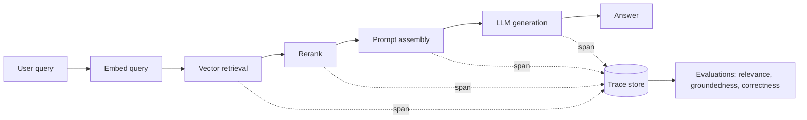
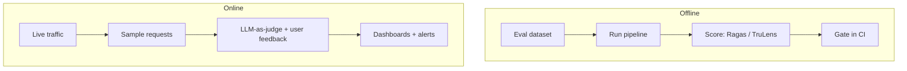

# How do you set up observability for a RAG application?

### Direct Answer
You set up observability for a retrieval-augmented generation (RAG) app by instrumenting the **whole pipeline as a connected trace** — query, retrieval, reranking, prompt assembly, LLM generation, and response — then capturing the metrics that matter at each stage: retrieval quality, latency, token usage and cost, and answer faithfulness. In practice that means adding tracing with **OpenTelemetry** (often via OpenInference or OpenLLMetry conventions), sending those traces to a RAG-aware platform such as **Arize Phoenix, LangSmith, Langfuse, or TruLens**, logging the retrieved chunks and the final prompt for every request, and running **online and offline evaluations** (groundedness, context relevance, answer correctness) so you can catch hallucinations and retrieval failures before users do. The goal is to be able to open any bad answer and see exactly which chunks were retrieved, what prompt was sent, what the model returned, and why it went wrong.

## Why RAG needs its own kind of observability

A RAG application is not a single model call — it is a multi-step pipeline, and failures hide in the steps between. A bad answer can come from poor retrieval (the right chunk was never fetched), bad ranking (the right chunk was fetched but buried), prompt issues (context truncated, instructions ignored), or the model itself (hallucination despite good context). Traditional APM tools tell you the request was slow or errored; they cannot tell you that the retriever returned irrelevant documents or that the model ignored the context it was given.

RAG observability fills that gap by treating each request as a **trace of spans** — one span per pipeline stage — and by recording the *content* flowing between stages, not just timings. That lets you answer the questions that matter for RAG: Did we retrieve the right context? Did the model use it? Is the answer grounded in the retrieved documents or made up?

## Step 1: Instrument the pipeline with tracing

Start by emitting a **trace** for every request, with a span for each stage: embedding, retrieval, reranking, prompt construction, and generation. The de facto standard is **OpenTelemetry**, extended for LLM apps by the **OpenInference** (Arize) and **OpenLLMetry** (Traceloop) semantic conventions, which define how to record LLM-specific attributes like model name, prompt, retrieved documents, and token counts.

The practical win is auto-instrumentation. Libraries for **LangChain, LlamaIndex, the OpenAI and Anthropic SDKs**, and others can emit these spans automatically, so you get retrieval and generation spans without hand-instrumenting every call. For custom pipelines, wrap each stage in a span and attach the inputs and outputs as attributes. The key discipline: capture the **retrieved chunk text and scores** and the **final assembled prompt**, because those are what you will need when debugging a bad answer.

## Step 2: Capture the metrics that matter

Observability for RAG spans four metric families:

- **Retrieval quality:** context relevance (are retrieved chunks actually relevant?), recall (did you fetch the chunk that contains the answer?), and rank position of the best chunk. These are the leading indicators of answer quality.
- **Generation quality:** groundedness/faithfulness (is the answer supported by the retrieved context?), answer relevance, and correctness against a reference when you have one.
- **Operational metrics:** end-to-end and per-stage latency, time-to-first-token, throughput, and error rates — so you can tell whether the retriever, reranker, or model is the bottleneck.
- **Cost and tokens:** input/output tokens and dollar cost per request, broken down by stage and model, so you can attribute spend and spot runaway prompts.

Capturing per-stage latency and tokens separately is what makes RAG observability actionable: you can see that retrieval is fast but the model is slow, or that an oversized context window is driving cost.

## Step 3: Add evaluations — offline and online

Tracing tells you *what happened*; evaluation tells you *whether it was good*. Two modes matter:

**Offline evaluation** runs a curated test set of questions (with known good answers or reference contexts) through the pipeline in CI, scoring retrieval relevance, groundedness, and correctness. Frameworks like **Ragas** and **TruLens** provide RAG-specific metrics (context precision/recall, faithfulness, answer relevance), and platforms like LangSmith and Phoenix run dataset-based evals. This catches regressions before deploy.

**Online evaluation** scores live traffic. Because you rarely have ground truth in production, teams use **LLM-as-a-judge** evaluators to score groundedness and relevance on sampled real requests, plus user feedback signals (thumbs up/down, edits, escalations). This surfaces drift — when retrieval quality degrades as your corpus or query mix changes.

## Step 4: Choose your tooling

Several platforms are purpose-built for RAG and LLM observability in 2027:

- **Arize Phoenix** — open-source, OpenInference-based tracing and evaluation; strong for retrieval debugging and embedding/cluster analysis. Pairs with the Arize cloud platform for production monitoring.
- **LangSmith** — from the LangChain team; tracing, datasets, evaluations, and prompt management, tightly integrated with LangChain/LangGraph but usable standalone.
- **Langfuse** — open-source LLM engineering platform with tracing, evals, prompt management, and cost tracking; popular for self-hosting.
- **TruLens** — open-source evaluation framework focused on the "RAG triad" (context relevance, groundedness, answer relevance).
- **Traceloop / OpenLLMetry** — OpenTelemetry-native instrumentation that exports to many backends.
- **Datadog, Grafana, and Honeycomb** — general observability backends that increasingly ingest LLM/OTel traces alongside the rest of your infrastructure.

A common pattern is OpenTelemetry instrumentation feeding a RAG-aware platform (Phoenix, Langfuse, or LangSmith) for content-level debugging and evals, while operational metrics also flow to your existing APM (Datadog/Grafana) for alerting alongside infrastructure.

## Step 5: Close the loop in production

Observability only pays off if it drives action. Wire up dashboards for retrieval relevance, groundedness, latency, and cost; set alerts on thresholds (groundedness score drops, latency spikes, cost per request climbs); and route flagged traces into a review queue. Use the captured chunks and prompts to debug failures, then feed hard examples back into your eval dataset so the same failure is caught automatically next time. Over time this turns one-off debugging into a continuous quality system.

## Frequently Asked Questions

**What is the difference between observability and evaluation for RAG?**
Observability captures what happened — the trace of retrieval, prompt, and generation with timings, tokens, and content. Evaluation scores whether the result was good — measuring retrieval relevance, groundedness, and answer correctness. You need both: tracing to debug and evaluation to quantify quality.

**What is the "RAG triad" of metrics?**
Popularized by TruLens, the RAG triad is context relevance (are retrieved chunks relevant to the query?), groundedness/faithfulness (is the answer supported by those chunks?), and answer relevance (does the answer address the question?). Together they localize whether a failure is in retrieval, generation, or both.

**Do I need OpenTelemetry, or can I use a platform's SDK directly?**
Either works. Platform SDKs (LangSmith, Langfuse, Phoenix) are quickest to start. OpenTelemetry with OpenInference/OpenLLMetry conventions avoids lock-in and lets the same traces flow to multiple backends, which matters if you also use Datadog or Grafana for the rest of your stack.

**How do I detect hallucinations in production?**
Score groundedness on sampled live requests with an LLM-as-a-judge that checks whether the answer's claims are supported by the retrieved context, and combine that with user feedback signals. Low groundedness with high confidence is the classic hallucination signature.

**How much does RAG observability add to latency and cost?**
Tracing itself is cheap — spans are exported asynchronously. The cost comes from online LLM-as-a-judge evaluations, which you control by sampling (for example, scoring 1–10% of traffic) rather than evaluating every request.

**Can I use my existing APM tool for RAG?**
Partly. Tools like Datadog, Grafana, and Honeycomb handle operational metrics and increasingly ingest LLM traces, but they are weaker at content-level RAG debugging and built-in groundedness/relevance evals. Most teams pair a RAG-specific platform with their general APM.

## Sources
- OpenTelemetry — https://opentelemetry.io/
- Arize Phoenix (OpenInference) — https://docs.arize.com/phoenix
- LangSmith documentation — https://docs.smith.langchain.com/
- Langfuse — https://langfuse.com/docs
- TruLens — https://www.trulens.org/
- Ragas evaluation framework — https://docs.ragas.io/
- Traceloop OpenLLMetry — https://www.traceloop.com/docs/openllmetry
