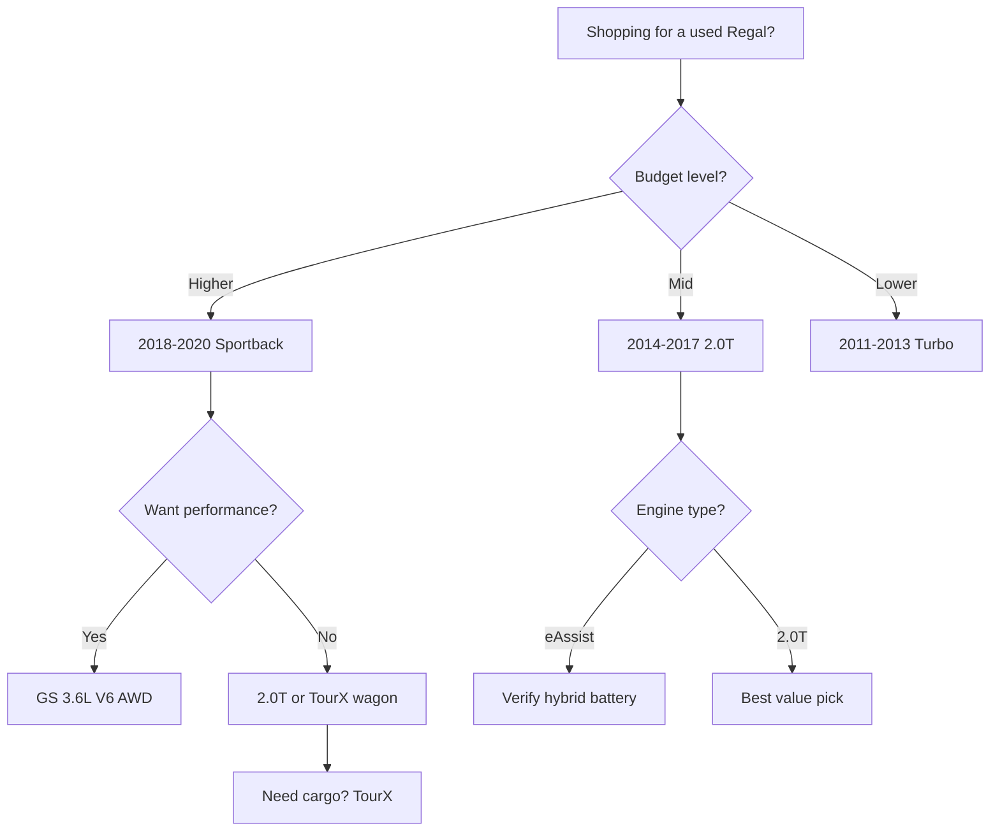

# Best Buick Regal Model Years (Ranked)

The Buick Regal has lived several distinct lives, from the rear-drive coupes and Grand National-era turbos of the 1980s to the front-drive sedans of the 1990s and the European-bred sport sedans of the 2010s. The most relevant chapter for used buyers is the **2011-2017 generation built on the Opel Insignia platform**, a genuine sport sedan with turbocharged power, available all-wheel drive, and a mild-hybrid eAssist option. The 2018-2020 Regal then split into the **Sportback hatchback and TourX wagon**. This ranking covers the best Regal model years, their engines, known trouble spots, and where the smart value sits on today's used market.

## Direct Answer

The **best overall Buick Regal is the 2018-2020 Regal Sportback**, a sleek liftback sedan with a strong 2.0L turbo, available all-wheel drive, a roomy hatchback layout, and the most modern technology and safety equipment of any Regal. For shoppers focused on value, the **best value is the 2014-2017 Regal with the 2.0L turbo**, a refined Opel-based sport sedan that offers turbo punch, available AWD, and a quiet cabin at a very low used price. Enthusiasts should note the 2014-2017 Regal GS and the 2018-2020 GS with its 310-hp V6. Watch the early 2011-2012 cars for first-year quirks and the eAssist mild-hybrid system's battery age.

## 1. 2018-2020 Regal Sportback (2.0T) 🏆 BEST OVERALL

The final-generation **Regal Sportback** is the best all-around Regal. Its liftback design hides a huge, practical cargo opening behind sport-sedan looks, and the **2.0L turbocharged four-cylinder** (250 hp) pairs with a nine-speed automatic on front-drive cars or an eight-speed with **available all-wheel drive**. The cabin is the most refined and tech-rich of any Regal, with a modern infotainment system and available driver-assistance features. Built on the latest Opel Insignia bones, it drives with European composure. **It is the Regal to buy** if your budget reaches a recent used example, blending hatchback versatility, strong power, and the longest remaining usefulness of the lineup.

@@PRODUCT name="Buick Regal Sportback (2.0T, 2018-2020)" site="https://en.wikipedia.org/wiki/Buick_Regal"

## 2. 2014-2017 Regal (2.0T) 💎 BEST VALUE

The facelifted second-generation Regal with the **2.0L turbo** (259 hp after the 2014 update) is the value champion. The 2014 refresh brought a more powerful engine, available **all-wheel drive**, and a much-improved interior with a better touchscreen. It rides on the well-sorted Opel Insignia platform, so it feels planted and quiet, more like a European sport sedan than a typical American mid-sizer. **The best value is a 2014-2017 Regal Premium II 2.0T with AWD**, which bundles leather, heated seats, and safety tech at a used price well below comparable German sedans. These cars are plentiful and depreciate hard, making them a bargain.

@@PRODUCT name="Buick Regal 2.0T (2014-2017)" site="https://en.wikipedia.org/wiki/Buick_Regal"

## 3. 2018-2020 Regal GS (3.6L V6)

The **Regal GS** is the performance flagship of the final generation. It swaps the turbo four for a **3.6L V6** making **310 horsepower**, paired with a nine-speed automatic and standard **all-wheel drive** with twin-clutch torque vectoring on the rear axle. It also gets adaptive dampers, Brembo-style braking, and aggressive Recaro-style sport seats. The result is a quick, surprisingly engaging sport hatch that flies under the radar. **It is the enthusiast's Regal**, offering V6 muscle and AWD grip in a practical liftback body. Used values are reasonable for the performance, though the V6 is thirstier than the turbo four.

@@PRODUCT name="Buick Regal GS (3.6L V6, 2018-2020)" site="https://en.wikipedia.org/wiki/Buick_Regal"

## 4. 2018-2020 Regal TourX (Wagon)

The **Regal TourX** is a rare and genuinely useful station wagon, a body style almost extinct in the U.S. market. It uses the **2.0L turbo** (250 hp) with **standard all-wheel drive**, raised ride height, and rugged cladding in the manner of a Subaru Outback or Audi Allroad. The big cargo hold and AWD make it a practical all-weather hauler with sport-sedan road manners. **It is the most versatile Regal** for buyers who need space without an SUV's bulk. Because it sold in small numbers, finding a clean one takes patience, but the wagon's combination of utility and driving feel rewards the search.

@@PRODUCT name="Buick Regal TourX (2018-2020)" site="https://en.wikipedia.org/wiki/Buick_Regal"

## 5. 2014-2017 Regal GS (2.0T AWD)

The second-generation **Regal GS** delivered sport-sedan thrills before the V6 GS arrived. After the 2014 update it used the **2.0L turbo** tuned to **259 hp**, with available **all-wheel drive**, sport-tuned suspension, larger Brembo front brakes, and aggressively bolstered seats. It looks the part with unique fascias and dark trim, and it drives with real enthusiasm for an American badge. **It is a sleeper performance bargain** today, since GS models depreciated alongside the rest of the lineup despite their upgraded hardware. Verify the suspension and brakes are healthy, as these cars were driven harder than base Regals, but a clean one is a fun, affordable pick.

@@PRODUCT name="Buick Regal GS 2.0T AWD (2014-2017)" site="https://en.wikipedia.org/wiki/Buick_Regal"

## 6. 2012-2013 Regal GS (2.0T, 6-Speed Manual)

The original **2012-2013 Regal GS** holds a special place for enthusiasts as one of the few modern Buicks offered with a **six-speed manual transmission**. Its **2.0L turbo** made **270 hp** in this early tune, sent to the front wheels through an available stick or a six-speed automatic. The interactive driving experience and rarity of the manual make it a quiet collector curiosity. **It is the choice for purists** who want to row their own gears in a Buick. These are aging now, so inspect the clutch, turbo, and front tires for torque-steer wear, but a well-kept manual GS is a unique find.

@@PRODUCT name="Buick Regal GS Manual (2012-2013)" site="https://en.wikipedia.org/wiki/Buick_Regal"

## 7. 2011-2013 Regal Turbo (2.0T, Pre-Facelift)

The first U.S. Regals of this generation paired a base 2.4L four with an optional **2.0L turbo** good for around **220 hp**, on the Opel Insignia platform. These pre-facelift cars drive well and undercut the later models on price, but they carry **first-generation-of-the-design quirks** and an older, smaller infotainment setup. The 2.0T is the engine to seek for its torque and better long-term satisfaction than the base four. **It is a budget entry point** into the European-bred Regal experience. Check for the usual high-mileage turbo and timing-chain maintenance, and prioritize a documented service history over the lowest asking price.

@@PRODUCT name="Buick Regal Turbo (2011-2013, pre-facelift)" site="https://en.wikipedia.org/wiki/Buick_Regal"

## 8. 2012-2017 Regal eAssist (Mild Hybrid)

The **Regal eAssist** added GM's mild-hybrid system to the **2.4L four-cylinder**, using a small lithium-ion battery and a belt-driven motor-generator for stop-start and modest assist, improving fuel economy to roughly the mid-30s on the highway. It is the most efficient Regal of its era but the slowest, lacking the turbo's punch. **The key caution is battery age**: the eAssist pack is now well into its service life, and replacement can be costly. Buy one only with a healthy battery and documented function. For most shoppers the regular 2.0T offers a far better blend of performance and value than the modest economy gains here.

@@PRODUCT name="Buick Regal eAssist (2012-2017)" site="https://en.wikipedia.org/wiki/Buick_Regal"

## 9. 1997-2004 Regal GS (Supercharged 3.8L)

The W-body **Regal GS** of the late 1990s and early 2000s is a beloved old-school sport sedan powered by the **supercharged 3.8L V6 (L67)** making **240 hp** and abundant torque. The Series II 3800 is a famously durable engine, and these cars are quick, comfortable highway cruisers with a loyal following. **It is the classic-Regal enthusiast pick**, rugged and easy to maintain. The trade-offs are dated dynamics, front-wheel-drive torque steer, and age-related wear on cooling, intake gaskets, and suspension. Treat a clean supercharged GS as an affordable modern classic rather than a daily luxury sedan, and budget for preventive maintenance.

@@PRODUCT name="Buick Regal GS Supercharged (1997-2004)" site="https://en.wikipedia.org/wiki/Buick_Regal"

## 10. 1988-1996 Regal (W-Body, V6)

The first front-drive **W-body Regal** introduced the platform that would carry the nameplate for years, with V6 engines including the **3.8L 3800** in later trims. These are now genuinely old vehicles, comfortable in their day but soft, slow, and dated by modern standards. The 3800-powered versions are the most durable and the only ones worth seeking. **There is little reason to buy one** except nostalgia, a project, or a very low price. Expect corrosion in salt-belt states, worn suspension, and aging interior plastics. Treat any survivor as inexpensive transportation or a hobby car, not a polished daily driver.

@@PRODUCT name="Buick Regal (W-body, 1988-1996)" site="https://en.wikipedia.org/wiki/Buick_Regal"

## What to Watch For When Buying

The most important step when buying a used Regal is to **match the engine to your needs and verify its condition**. The **2.0L turbo** is the sweet spot for power and value, but confirm the turbocharger, timing chain, and PCV system have been maintained, as carbon buildup and chain wear can appear on neglected direct-injection examples. If you are looking at an **eAssist mild hybrid, check the lithium-ion battery's health and age**, since a failing pack is expensive to replace and undercuts the model's only advantage. On all-wheel-drive cars, confirm the system engages smoothly and the rear differential is quiet. For the V6 GS, inspect the adaptive dampers and larger brakes for wear, as these are performance-oriented and pricier to service. Documented maintenance records always outweigh a low sticker price.

## How to Choose

Match the Regal to your priorities. For **the best blend of versatility, technology, and power**, the 2018-2020 Regal Sportback is the answer, with available AWD and a practical liftback body. For **the best value with proven turbo performance**, a 2014-2017 2.0T is hard to beat at its low used price. Buyers who want **performance** should target the 2018-2020 GS with its 310-hp V6 and standard AWD, or the rare manual 2012-2013 GS. Need maximum cargo? The **TourX wagon** delivers it with all-weather grip. Bargain hunters can consider older supercharged GS sedans, but should favor the durable 3800 engine. In every case, prioritize a clean maintenance history and a healthy turbo or hybrid battery.

## FAQ

**Which Buick Regal years should I avoid?**
Be cautious with very early 2011-2012 cars for first-year quirks and with any eAssist mild hybrid that has an unverified or aging battery. The base 2.4L non-turbo is also underpowered; the 2.0L turbo is the better all-around choice.

**Is the Buick Regal a reliable car?**
The 2011-2020 Opel-based Regals are generally dependable when maintained, with the durable 2.0L turbo and 3.6L V6 holding up well. The main concerns are turbo and timing-chain upkeep, aging eAssist batteries, and routine wear on higher-mileage examples.

**What is the difference between the Regal Sportback and TourX?**
The Sportback is a five-door liftback sedan with a sloping roofline, while the TourX is a raised, cladding-clad station wagon with standard all-wheel drive. The TourX offers more cargo space and an Outback-style rugged look; the Sportback is sleeker.

**Which Regal is best for performance?**
The 2018-2020 Regal GS with its 310-hp 3.6L V6, standard all-wheel drive, and adaptive suspension is the quickest and most capable. For a purer, lighter feel, the rare 2012-2013 GS with the six-speed manual is the enthusiast's choice.

## Bottom Line

The Buick Regal is an underrated used sport sedan, but **engine and body-style choice make all the difference**. The **2018-2020 Regal Sportback is the best overall pick**, blending hatchback practicality, available AWD, and modern tech, while the **2014-2017 2.0T offers the best value** at its low used price. Enthusiasts should seek the **GS** versions, and buyers needing space should hunt for the **TourX wagon**. Avoid neglected eAssist batteries and underpowered base fours, confirm turbo maintenance, and the Regal rewards you with European-bred road manners at a bargain price.

## Sources

- Buick official Regal model history and specifications, buick.com
- NHTSA recall and complaint database for Buick Regal by model year, nhtsa.gov
- EPA Fuel Economy ratings for Buick Regal including eAssist, fueleconomy.gov
- Edmunds Buick Regal generation reviews and used-car appraisals, edmunds.com
- Kelley Blue Book Buick Regal used values by model year, kbb.com
- Wikipedia Buick Regal generations and technical specifications, en.wikipedia.org
