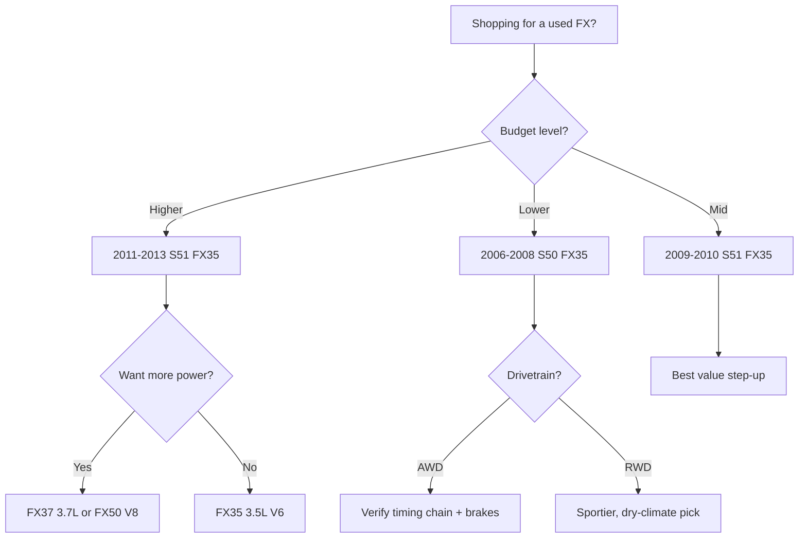

# Best Infiniti FX35 Model Years (Ranked)

The Infiniti FX35 helped invent the **performance-crossover** niche, pairing the muscular **3.5L VQ35 V6** with sharp, sports-sedan handling and a low-slung "bionic cheetah" shape that still looks aggressive today. Sold across two generations, the **first-generation S50 (2003-2008)** and the **second-generation S51 (2009-2013)**, the FX35 traded outright cargo space for genuine driver appeal, available in **rear-wheel drive** or **all-wheel drive**. On the used market it is a compelling value, but model year matters: early electronics, brake and tire wear, and a known timing-chain-tensioner concern on the VQ engine all reward careful shopping. This ranking covers the best FX35 model years, their engines, and where the smart money goes today.

## Direct Answer

The **best overall Infiniti FX35 is the 2011-2013 second-generation (S51) model**, which offers the most refined version of the VQ35 V6, improved interior materials, updated electronics, and the strongest safety equipment while keeping the FX's signature handling. For shoppers focused on value, the **best value is the 2006-2008 first-generation (S50) FX35**, which received key updates over the launch cars, has proven durable, and now sells for a fraction of its original price. Note that the FX37 (3.7L V6) and FX45/FX50 (V8) are distinct, more powerful variants; this ranking focuses on the 3.5L FX35 while placing those siblings in context. Buy any FX35 with documented timing-chain and brake service.

## 1. 2011-2013 Second Generation (S51) 🏆 BEST OVERALL

The final FX35 model years are the best the nameplate offered. The second-generation S51 rides on a stiffer platform with a more upscale cabin, better materials, and a smoother, **303-hp 3.5L VQ35 V6** mated to a **seven-speed automatic**. Handling remained a high point, with quick steering and strong body control that few crossovers matched. By 2011 Infiniti had refined the electronics and added more standard equipment, and **available all-wheel drive** broadened year-round usability. These are the most modern, most reliable FX35s on the used market, and prices remain reasonable for the performance and image on offer.

@@PRODUCT name="Infiniti FX35 (S51, 2011-2013)" site="https://en.wikipedia.org/wiki/Infiniti_FX"

## 2. 2006-2008 First Generation (S50, Updated) 💎 BEST VALUE

The later first-generation FX35 is the value champion. Across 2006-2008 Infiniti refined the original formula with interior and equipment updates while keeping the proven **3.5L VQ35 V6** (around 275-280 hp) and a **five-speed automatic**. The chassis still delivers the sharp, sporty driving feel that defined the FX, and **rear- or all-wheel drive** suits varied climates. **The best value is a 2006-2008 FX35 AWD** with full service history, which now sells for a small fraction of its original price while offering V6 smoothness and bold styling. These cars are durable when timing-chain and brake maintenance is documented.

@@PRODUCT name="Infiniti FX35 (S50, 2006-2008)" site="https://en.wikipedia.org/wiki/Infiniti_FX"

## 3. 2009-2010 Second Generation (S51, Early)

The early second-generation FX35 introduced the redesigned S51 platform, with a more powerful **303-hp VQ35 V6**, a seven-speed automatic, and a noticeably more premium interior than the outgoing car. Styling grew even more dramatic, and handling stayed sharp. These early S51 years offer most of the benefits of the best-overall 2011-2013 cars at a lower price, with the main trade-off being slightly older infotainment and fewer refinements. **A clean 2009-2010 FX35** is a strong pick for a buyer who wants the second-generation driving experience and look while saving money over the latest model years.

@@PRODUCT name="Infiniti FX35 (S51, 2009-2010)" site="https://en.wikipedia.org/wiki/Infiniti_FX"

## 4. 2009-2013 Infiniti FX37 (S51) — 3.7L Variant

For 2013, Infiniti replaced the FX35 badge in some markets with the **FX37**, powered by the larger **3.7L VQ37VHR V6** producing roughly **325 hp**. Mechanically similar to the second-generation FX35, the FX37 adds noticeably more power and a higher rev ceiling while retaining the same chassis, seven-speed automatic, and available AWD. It is the natural step up for a buyer who wants the second-generation FX experience with extra punch. **Treat the FX37 as the FX35's more powerful sibling**, the same handling and refinement with a stronger engine, and shop it with the same maintenance scrutiny.

@@PRODUCT name="Infiniti FX37 (S51, 3.7L, 2013)" site="https://en.wikipedia.org/wiki/Infiniti_FX"

## 5. 2003-2005 First Generation (S50, Launch)

The original FX35 launched the performance-crossover concept and remains historically significant. The **3.5L VQ35 V6** (around 280 hp) and a five-speed automatic delivered genuinely quick, engaging performance, and the radical styling turned heads. These launch cars are now the most affordable FX35s, but they are also the oldest, so expect aging electronics, worn suspension bushings, and the need for thorough timing-chain and brake inspection. **A well-kept 2003-2005 example** is a fun, cheap entry into FX ownership, best suited to enthusiasts who accept higher maintenance on an older performance vehicle.

@@PRODUCT name="Infiniti FX35 (S50, 2003-2005)" site="https://en.wikipedia.org/wiki/Infiniti_FX"

## 6. 2009-2013 Infiniti FX50 (S51) — 5.0L V8

The **FX50** is the second-generation flagship, powered by a **5.0L VK50VE V8** producing roughly **390 hp**. It adds available adaptive suspension and other performance hardware, making it the fastest FX of the era. While not an FX35, it is essential context: the FX50 is for buyers who prioritize outright speed and are comfortable with higher fuel and maintenance costs. **It is the muscle version of the FX35's chassis**, thrilling but thirstier and more expensive to run. For most shoppers the V6 FX35 or FX37 is the more sensible everyday choice.

@@PRODUCT name="Infiniti FX50 (S51, 5.0L V8, 2009-2013)" site="https://en.wikipedia.org/wiki/Infiniti_FX"

## 7. 2003-2008 Infiniti FX45 (S50) — 4.5L V8

The first-generation **FX45** paired the same bold body with a **4.5L VK45DE V8** making around **315-320 hp**, serving as the performance flagship of the S50 generation. It is quicker than the FX35 and sounds the part, but it drinks more fuel and costs more to maintain. As context for FX35 shoppers, the FX45 shows the range of the lineup: **the FX35 is the value-and-efficiency choice, the FX45 the power choice**. A clean FX45 appeals to enthusiasts, but the V6 FX35 remains the smarter pick for daily use and running costs.

@@PRODUCT name="Infiniti FX45 (S50, 4.5L V8, 2003-2008)" site="https://en.wikipedia.org/wiki/Infiniti_FX"

## 8. 2008 First Generation (S50, Final Year) — RWD

The final 2008 model year of the first-generation FX35 is worth singling out for buyers who want the last and most-refined S50 in **rear-wheel-drive** form. RWD examples deliver the purest expression of the FX's sporty balance and can be slightly more efficient than AWD versions in dry climates. By 2008 the first generation had accumulated its running updates, making these among the better early cars. **A 2008 RWD FX35** is a good choice for warm-weather buyers who prioritize handling feel, though AWD remains the safer pick for snow-belt drivers.

@@PRODUCT name="Infiniti FX35 RWD (S50, 2008)" site="https://en.wikipedia.org/wiki/Infiniti_FX"

## 9. 2006-2008 First Generation (S50) — AWD (High Mileage, Caution)

Higher-mileage **all-wheel-drive** first-generation FX35s can be tempting bargains, but they demand caution. The AWD system adds components that wear and cost more to service, and on neglected cars the **timing chain tensioner**, **brakes and rotors**, and suspension bushings may all need attention at once. The VQ35 is durable, but deferred maintenance is the enemy. **Only buy a high-mileage AWD FX35 with documented service**, especially proof of timing-chain and brake work. Otherwise the repair bills can quickly exceed the low purchase price, undermining the value that makes the FX35 attractive.

@@PRODUCT name="Infiniti FX35 AWD high-mileage (S50, 2006-2008)" site="https://en.wikipedia.org/wiki/Infiniti_FX"

## 10. 2003-2005 First Generation (S50, High Mileage, Caution)

The earliest, highest-mileage FX35s sit at the bottom of the ranking. These launch-era cars combine the oldest electronics with the most accumulated wear, and common issues like a **noisy timing-chain tensioner**, **rapid brake and tire wear**, dashboard and trim aging, and tired suspension are most likely here. They are the cheapest FX35s for a reason. **Treat a high-mileage 2003-2005 car as a project or budget enthusiast buy**, not a worry-free daily driver. A pre-purchase inspection is essential, and you should budget for catch-up maintenance on top of the low asking price.

@@PRODUCT name="Infiniti FX35 high-mileage (S50, 2003-2005)" site="https://en.wikipedia.org/wiki/Infiniti_FX"

## What to Watch For When Buying

The most important checks on a used FX35 center on the **3.5L VQ35 V6**. Listen for a rattle at startup that signals a worn **timing chain tensioner**, a known VQ concern, and confirm it has been serviced if present. The FX is heavy and sporty, so **brakes, rotors, and tires wear quickly**; budget for them and inspect their condition closely. On **all-wheel-drive** cars, verify the system engages smoothly and check for transfer-case or driveline noise. Inspect the suspension bushings and struts on higher-mileage examples, as the firm sport tuning is hard on components. Older first-generation cars can show **aging electronics and trim**, including infotainment and dashboard issues, so test every feature. Above all, favor a car with **documented maintenance** over the cheapest sticker, since deferred service erases the FX35's value advantage.

## How to Choose

Match the FX35 to your priorities. For **the best blend of refinement, reliability, and modern features**, the 2011-2013 second-generation S51 is the answer, with the smoothest VQ35 and the strongest equipment. For **the best value**, a 2006-2008 first-generation FX35 delivers the sporty driving feel and bold styling at a low used price. Buyers who want **more power** should look at the FX37 (3.7L) or the V8-powered FX45 and FX50, accepting higher running costs. Snow-belt drivers should prioritize **all-wheel drive**, while warm-climate enthusiasts may prefer the lighter, sportier **rear-wheel-drive** cars. In every case, confirm timing-chain and brake service and prioritize a clean maintenance history.

## FAQ

**Which Infiniti FX35 years are the most reliable?**
The 2011-2013 second-generation (S51) cars are generally the most reliable and refined, with the updated VQ35 V6 and improved electronics. Any year is dependable if timing-chain and brake maintenance has been kept up.

**What is the difference between the FX35, FX37, FX45, and FX50?**
The FX35 uses a 3.5L V6, the FX37 a more powerful 3.7L V6, while the FX45 (4.5L) and FX50 (5.0L) are V8-powered performance flagships. The FX35 is the value and efficiency choice.

**What common problems should I expect on a used FX35?**
Watch for a worn timing-chain tensioner (a startup rattle on the VQ engine), fast brake and tire wear from the heavy, sporty chassis, and aging electronics or trim on older first-generation cars.

**Is the FX35 a good value used?**
Yes. The FX35 offers genuine sports-sedan handling and strong V6 performance at a used price well below its original cost, especially the 2006-2008 first-generation cars, provided maintenance is documented.

## Bottom Line

The Infiniti FX35 is an underrated used performance-crossover, blending the smooth **3.5L VQ35 V6** with handling few rivals matched. The **2011-2013 second-generation S51 is the best overall pick**, offering the most refined and reliable version of the formula, while the **2006-2008 first-generation FX35 delivers the best value**. Shop any FX35 with proof of **timing-chain and brake service**, and consider the FX37, FX45, or FX50 if you want more power. Buy carefully and the FX35 rewards with style, pace, and driver engagement at a bargain price.

## Sources

- Infiniti USA official FX model history and specifications, infiniti.com
- NHTSA recall and complaint database for Infiniti FX35, nhtsa.gov
- EPA Fuel Economy ratings for Infiniti FX35 by model year, fueleconomy.gov
- Edmunds Infiniti FX35 generation reviews and used-car appraisals, edmunds.com
- Kelley Blue Book Infiniti FX35 used values by model year, kbb.com
- Wikipedia Infiniti FX generations and technical specifications, en.wikipedia.org
