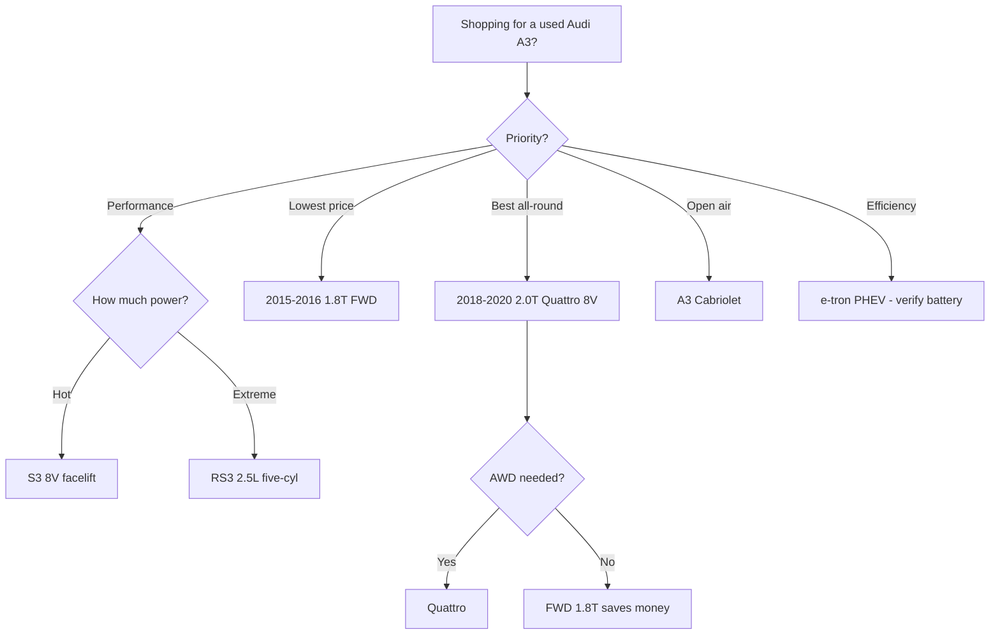

# Best Audi A3 Model Years (Ranked)

The **Audi A3** is the German brand's entry-luxury hatchback and sedan, and on the used market it offers premium materials, a refined turbocharged drivetrain, and available **Quattro all-wheel drive** at prices well below a new luxury car. Sold in the United States primarily as a sedan and cabriolet since the third generation, the A3 spans four generations dating back to 1996 globally, with strong **TFSI** gas engines, a brief **e-tron plug-in hybrid**, and the hot **S3** and **RS3** variants. Choosing the right model year matters: certain early **DSG dual-clutch** transmissions and **carbon-buildup-prone direct-injection** engines need careful inspection. This ranking covers the best A3 model years, their engines, the issues to verify, and where the smart value lies today.

## Direct Answer

The **best overall Audi A3 is the 2018-2020 third-generation (Typ 8V) facelift sedan with the 2.0T Quattro**, which pairs a strong 228-hp turbo four, a refined seven-speed dual-clutch, all-wheel-drive grip, and the mature **virtual cockpit** tech after years of running changes had sorted out earlier bugs. For shoppers focused on value, the **best value is the 2015-2016 first U.S. third-generation A3 1.8T (FWD)**, which delivers genuine Audi cabin quality and a frugal turbo four at the lowest entry price of any modern A3. Approach the **2015-2016 e-tron plug-in hybrid** cautiously due to its complexity and limited service network, and always verify DSG service history on any A3.

## 1. 2018-2020 Third Generation (8V) Facelift — 2.0T Quattro 🏆 BEST OVERALL

@@PRODUCT name="Audi A3 2.0T Quattro (8V facelift, 2018-2020)" site="https://en.wikipedia.org/wiki/Audi_A3"

The facelifted third-generation A3 is the nameplate's sweet spot. The **2.0L TFSI turbo four** makes a healthy **228 horsepower**, routed through a **seven-speed S tronic dual-clutch** and available **Quattro all-wheel drive** for confident year-round grip. By this point Audi had refined the **MIB2 infotainment** and standardized the excellent **12.3-inch virtual cockpit** on higher trims, addressing the software quirks of earlier cars.

These years also benefit from **revised styling**, LED lighting, and updated driver-assistance options. Reliability is strong when maintained, and the **EA888 Gen 3** engine in this era is the most sorted version. For a buyer who wants the best blend of performance, technology, and luxury feel in a compact package, a clean **2018-2020 2.0T Quattro Premium Plus** is the A3 to target.

## 2. 2015-2016 Third Generation (8V) — 1.8T (FWD) 💎 BEST VALUE

@@PRODUCT name="Audi A3 1.8T FWD (8V, 2015-2016)" site="https://en.wikipedia.org/wiki/Audi_A3"

The front-wheel-drive **1.8T** is the value champion of the modern A3 range. Its **1.8L TFSI turbo four** produces around **170 horsepower**, returns strong fuel economy near **27 mpg combined**, and still delivers the upscale Audi cabin, MMI infotainment, and tidy handling that define the model. As the entry engine, it carries the **lowest used prices** of any third-generation A3.

**The best value is a 2015-2016 1.8T Premium** in clean condition, which bundles leatherette, panoramic sunroof, and a refined ride at a price that undercuts most comparable luxury cars. Verify the **dry-clutch S tronic** transmission shifts cleanly and check service records, but a well-kept 1.8T offers premium feel for a modest outlay.

## 3. 2017 Third Generation (8V) — 2.0T Quattro

@@PRODUCT name="Audi A3 2.0T Quattro (8V, 2017)" site="https://en.wikipedia.org/wiki/Audi_A3"

The 2017 model year sits right before the major facelift and offers most of its substance at a lower price. The **2.0L TFSI** in this year makes **220 horsepower** with **Quattro** and the six- or seven-speed dual-clutch, providing brisk acceleration and all-weather traction. Audi had already worked through the early third-generation teething issues by this point.

Inside you get the trademark **rotary MMI controller**, available **virtual cockpit**, and high-quality materials. The 2017 cars deliver nearly the driving experience of the facelifted models while costing meaningfully less on the used market. For buyers who want **Quattro and the strong 2.0T** without paying facelift money, a documented 2017 Premium Plus is a smart, low-risk pick.

## 4. 2019-2020 S3 (8V Facelift)

@@PRODUCT name="Audi S3 (8V facelift, 2019-2020)" site="https://en.wikipedia.org/wiki/Audi_S3"

For enthusiasts, the facelifted **S3** is the performance highlight of the third generation. Its **2.0L TFSI turbo** is tuned to roughly **288-292 horsepower**, paired with standard **Quattro** and a quick-shifting **seven-speed dual-clutch**, good for a sub-five-second 0-60 mph sprint while retaining everyday usability and a luxurious interior.

The S3 adds **adaptive suspension**, sportier brakes, and aggressive styling without sacrificing the A3's compact practicality. It is a genuine pocket rocket that still works as a daily driver. These later cars benefit from the same refined tech as the facelifted A3. Budget for **performance-grade maintenance** and verify service history, but a clean S3 delivers serious speed and German polish in a discreet package.

## 5. 2017-2018 RS3 (8V)

@@PRODUCT name="Audi RS3 Sedan (8V, 2017-2018)" site="https://en.wikipedia.org/wiki/Audi_RS3"

The **RS3** is the apex A3, powered by a charismatic **2.5L TFSI turbocharged five-cylinder** making **400 horsepower** with a glorious warbling exhaust note. With standard **Quattro** and a seven-speed dual-clutch, the RS3 sedan launches to 60 mph in around **3.9 seconds**, putting it in genuine sports-car territory while keeping four doors and a usable cabin.

This is a specialist purchase rather than a value buy: **insurance, tires, and maintenance costs are high**, and these cars are often driven hard. Inspect thoroughly for track use and verify a complete service record. For a buyer who wants the most thrilling A3 ever sold in the U.S., the **five-cylinder RS3** is unmatched, but go in with eyes open on running costs.

## 6. 2021-2024 RS3 (8Y)

@@PRODUCT name="Audi RS3 (8Y, 2021-2024)" site="https://en.wikipedia.org/wiki/Audi_RS3"

The fourth-generation **RS3** carries the **2.5L five-cylinder** forward, now making **401 horsepower** and adding a clever **RS Torque Splitter** rear differential that enables genuine drift modes and sharper cornering. It remains one of the most distinctive performance sedans on sale, with a sub-four-second 0-60 mph time and unmistakable five-cylinder sound.

As the newest A3 variant available used, it has the **longest remaining warranty** and the most current technology, including the latest MMI touch interface. Pricing sits near new-car money, so this is for buyers who want maximum performance and modern tech. Running costs match the older RS3, but the added chassis trickery makes it the most capable A3 ever built.

## 7. 2015-2016 First U.S. Third Generation (8V) — 2.0T Quattro

@@PRODUCT name="Audi A3 2.0T Quattro (8V, 2015-2016)" site="https://en.wikipedia.org/wiki/Audi_A3"

The earliest U.S. third-generation A3 with the **2.0T and Quattro** introduced the sedan body that American buyers know. The **2.0L TFSI** made around **220 horsepower** with all-wheel drive, delivering strong acceleration and the premium cabin that set the A3 apart from mainstream compacts. These are the most affordable Quattro 2.0T cars in the lineup.

The trade-off is that **early third-generation infotainment software** and some running-change updates came later, so features lag the facelifted cars. Inspect the **dual-clutch transmission** carefully and confirm carbon-cleaning or maintenance history on the direct-injection engine. For a buyer who wants Quattro grip and the 2.0T at the lowest price, a clean 2015-2016 example is a solid budget choice.

## 8. 2015-2018 A3 Cabriolet

@@PRODUCT name="Audi A3 Cabriolet (8V, 2015-2018)" site="https://en.wikipedia.org/wiki/Audi_A3"

The **A3 Cabriolet** adds open-air motoring to the formula with a power soft top that operates quickly and quietly. Available with the **1.8T** or **2.0T Quattro**, it offers the same refined drivetrain and luxury cabin as the sedan, in a more stylish four-seat convertible body. It is a comfortable, premium small drop-top at a relative bargain used.

The practical trade-offs are a **smaller trunk and back seat** versus the sedan, plus the usual convertible considerations around top maintenance and weather sealing. Inspect the **roof mechanism and seals** carefully on any used example. For buyers who prioritize open-air enjoyment and Audi build quality over outright practicality, the A3 Cabriolet is a charming and reasonably priced choice.

## 9. 2015-2016 A3 Sportback e-tron (Plug-In Hybrid) (Caution)

@@PRODUCT name="Audi A3 Sportback e-tron PHEV (8V, 2015-2016)" site="https://en.wikipedia.org/wiki/Audi_A3_e-tron"

The **A3 Sportback e-tron** was Audi's first plug-in hybrid for the U.S., pairing a **1.4L TFSI** with an electric motor for around **204 combined horsepower** and roughly **16 miles of electric range**. It is the only A3 hatchback sold in America in this era and qualified for federal tax credits when new, making it a unique and efficient choice.

The caution is **complexity**: the PHEV system, **DSG dual-clutch**, and high-voltage battery add service considerations, and the dealer network for these is thin. Verify **battery health and charging behavior**, and confirm the dual-clutch transmission and hybrid system service history. For a knowledgeable buyer who wants efficiency and a hatchback, a well-documented e-tron can be rewarding, but it demands diligence.

## 10. 2008-2013 Second Generation (8P) Sportback (Gray-Market/Import)

@@PRODUCT name="Audi A3 Sportback (8P, 2008-2013)" site="https://en.wikipedia.org/wiki/Audi_A3"

The **second-generation 8P A3** was a five-door hatchback sold widely overseas, with a U.S. run that included the **2.0T gas** and a **2.0 TDI diesel** Sportback. These are now older cars, more common abroad, and appeal to enthusiasts who want the practical hatch body and the characterful engines of the era.

Age brings the usual concerns: **timing-component service, DSG mechatronic wear, carbon buildup, and electronics aging**. The diesel adds emissions-system considerations. There is little reason to seek one out except for the hatchback practicality or a low price, and parts and service can be less convenient. Treat any survivor as an enthusiast's budget car or project rather than a polished daily driver.

## What to Watch For When Buying

The most important checks on a used A3 center on the drivetrain and direct-injection engine.

- **Dual-clutch (S tronic / DSG) transmission**: confirm smooth, clutch-free shifts and verify the **mechatronic unit and clutch service history**; jerky low-speed behavior can signal wear.
- **Carbon buildup**: the **direct-injection TFSI** engines can accumulate intake-valve carbon over time; ask whether a **walnut-blast cleaning** has been done on higher-mileage cars.
- **Oil consumption**: some **EA888** engines, especially earlier ones, consumed oil; check records and look for evidence of a **PCV or piston-ring** fix.
- **Timing components**: confirm the **timing chain/tensioner** service on higher-mileage units, a known wear point on older VW-Audi fours.
- **Recalls**: run the **VIN through NHTSA and Audi** for any open recalls, including airbag and fuel-system campaigns.
- **e-tron specifics**: verify **battery health, charging, and hybrid-system service** before buying the plug-in hybrid.

Documented maintenance always outweighs a low sticker price.

## How to Choose

Match the A3 to your priorities. For **the best blend of performance, tech, and luxury feel**, target a **2018-2020 2.0T Quattro** facelift sedan. For **the lowest entry price into a premium car**, the **2015-2016 1.8T FWD** is hard to beat. Buyers who want all-weather grip without facelift money should look at a **2017 2.0T Quattro**. Enthusiasts step up to the **S3** for serious speed or the five-cylinder **RS3** for the ultimate version, while accepting higher running costs. Pick the **Cabriolet** for open-air style, and consider the **e-tron** only if you want efficiency and accept its complexity. In every case, verify dual-clutch and engine service history.

## FAQ

**Which Audi A3 years should I avoid?**
Be cautious with the earliest third-generation cars and the complex 2015-2016 e-tron plug-in hybrid unless service history is fully documented. Any A3 with an unverified dual-clutch transmission or no record of carbon-buildup maintenance on the TFSI engine deserves a thorough pre-purchase inspection before you buy.

**Is the Audi A3 expensive to maintain?**
It costs more than a mainstream compact but less than larger luxury cars. The main expenses are dual-clutch service, direct-injection carbon cleaning, and premium tires and oil. The S3 and especially the RS3 are noticeably pricier to run due to performance brakes, tires, and higher-output drivetrains.

**What is the difference between the A3, S3, and RS3?**
The A3 is the standard luxury compact with 1.8T or 2.0T engines. The S3 is the sport version with a tuned 2.0T making around 288-292 hp and standard Quattro. The RS3 is the flagship, powered by a 400-plus-hp 2.5L turbocharged five-cylinder with a distinctive exhaust note and supercar-rivaling acceleration.

**Is the Audi A3 a reliable used car?**
A well-maintained A3 can be dependable, with the 2017-2020 cars being the most sorted. Reliability hinges on documented service of the dual-clutch transmission and the TFSI engine. Buy one with complete records and a clean pre-purchase inspection, and it offers premium quality at an accessible price.

## Bottom Line

The **Audi A3 is an underrated used luxury value**, delivering premium cabin quality and a refined turbo drivetrain at accessible prices. The **2018-2020 2.0T Quattro facelift is the best overall pick**, with the most sorted technology and engine, while the **2015-2016 1.8T FWD offers the best value** for entry into the brand. Enthusiasts have the thrilling **S3 and five-cylinder RS3** to choose from. Whatever you buy, verify the **dual-clutch and TFSI service history** through records and a VIN check, and a clean A3 rewards with genuine German polish.

## Sources

- Audi USA official A3, S3, and RS3 model history and specifications, audiusa.com
- NHTSA recall and complaint database for Audi A3 by model year, nhtsa.gov
- EPA Fuel Economy ratings for Audi A3 and A3 e-tron, fueleconomy.gov
- Edmunds Audi A3 generation reviews and used-car appraisals, edmunds.com
- Kelley Blue Book Audi A3 used values by model year, kbb.com
- Car and Driver Audi A3, S3, and RS3 reviews and performance figures, caranddriver.com
- Wikipedia Audi A3, S3, and RS3 generations and technical specifications, en.wikipedia.org
