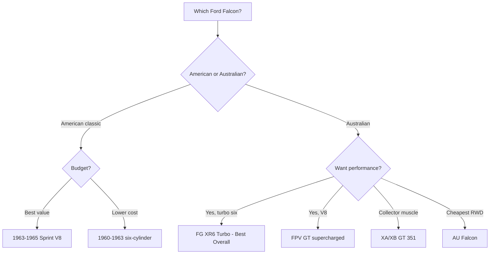

# Best Ford Falcon Model Years (Ranked)

The **Ford Falcon** is really two distinct stories. In **North America** it was a **compact economy car** built from **1960 to 1970**, the platform that spawned the original **Mustang**. In **Australia**, the Falcon became a homegrown **full-size sedan and ute** built from **1960 all the way to 2016**, evolving into a rear-drive performance icon with turbocharged inline-sixes and supercharged V8s. Because both lineages wear the same badge, choosing the "best" Falcon depends on whether you want a **collectible American classic**, a **muscle-era Sprint**, or a modern **Aussie FG performance sedan**. This ranking covers the standout model years and variants across both Falcon families, the engines to seek, the known weak points, and where the value sits today.

## Direct Answer

The **best overall Ford Falcon is the 2008-2014 Australian FG/FG X with the turbocharged 4.0L "Barra" inline-six (XR6 Turbo)**, which delivers genuine performance-car pace, a tough and tunable engine, and modern usability at a used price that undercuts almost any rival sport sedan. For shoppers focused on value, the **best value is the 1963-1965 North American Falcon Sprint with the 260/289 V8**, an affordable, simple, and well-supported classic that shares mechanicals with the early Mustang. Avoid the unrefined first-year 1960 Australian Falcons, which suffered durability problems on local roads, and approach high-mileage Barra turbos cautiously unless service history is documented.

## 1. 2008-2014 Australian FG/FG X — XR6 Turbo (Barra) 🏆 BEST OVERALL

@@PRODUCT name="Ford Falcon FG XR6 Turbo (2008-2014)" site="https://en.wikipedia.org/wiki/Ford_Falcon_(Australia)"

The **FG-series Falcon** is the high point of the Australian line. The **XR6 Turbo** pairs the legendary **4.0L turbocharged "Barra" inline-six** (around **270 kW**, with the **FPV F6** reaching 310-325 kW) to a rear-drive chassis and a **ZF six-speed automatic** or six-speed manual. The **Barra turbo** is famous for its **iron block strength and huge tuning headroom**, regularly handling big power on standard internals.

Ride quality, interior space, and highway comfort are excellent, and the **FG X** facelift (2014-2016) added **SYNC2** infotainment. The main cautions are **turbo and oil-cooler wear, automatic transmission health, and modified examples**. A clean, stock XR6 Turbo is the most rewarding Falcon to own and drive.

## 2. 1963-1965 North American Falcon Sprint — V8 💎 BEST VALUE

@@PRODUCT name="Ford Falcon Sprint V8 (1963-1965)" site="https://en.wikipedia.org/wiki/Ford_Falcon_(North_America)"

The **Falcon Sprint** is the value pick and the most desirable American Falcon. Introduced for **1963**, it brought the **260 cubic-inch V8** (later the **289**), bucket seats, a floor shifter, and available four-speed manual. It shares its drivetrain with the **early Ford Mustang**, so **parts, performance upgrades, and knowledge are abundant and inexpensive**.

These are **simple, light, rear-drive classics** that are easy to maintain at home. **The best value is a 1964-1965 Sprint hardtop or convertible**, which delivers genuine muscle-era character for far less money than an equivalent Mustang. Watch for **rust in floors, cowls, and lower panels**, the usual concern on 1960s unibody Fords.

## 3. 2002-2008 Australian BA/BF — XR6 Turbo

@@PRODUCT name="Ford Falcon BA/BF XR6 Turbo (2002-2008)" site="https://en.wikipedia.org/wiki/Ford_Falcon_(Australia)"

The **BA Falcon** introduced the **DOHC "Barra" engine family** and is where the modern Falcon legend begins. The **BA/BF XR6 Turbo** makes around **240-245 kW** and offers the same bulletproof turbo six in a slightly older, cheaper package. The **BF** update brought a **six-speed ZF automatic** that markedly improved drivability over the early four-speed.

These cars are **outstanding value performance sedans**, often selling for a fraction of their original price. Known issues include **oil-cooler-to-coolant cross-contamination on turbo models, plastic intake manifolds, and ageing suspension bushings**. A well-kept BF XR6 Turbo is a smart enthusiast buy and a stepping stone to the more refined FG.

## 4. 1960-1963 North American Falcon (First Generation)

@@PRODUCT name="Ford Falcon (First Generation, 1960-1963)" site="https://en.wikipedia.org/wiki/Ford_Falcon_(North_America)"

The **original 1960 Falcon** was Ford's hugely successful answer to compact imports, selling in massive numbers with a frugal **144 and later 170 cubic-inch inline-six**. It is **light, simple, and endlessly serviceable**, and it directly underpinned the Mustang and early Bronco.

As a classic, the six-cylinder first-gen cars are **affordable entry points** into 1960s collecting, with strong club support. They are slow by modern standards and basic inside, so most buyers swap to a later **V8** or treat them as period-correct cruisers. Inspect carefully for **structural rust** and tired drivetrains. For a low-cost, charming vintage Ford, the first-generation Falcon remains a favorite.

## 5. 1991-2016 Falcon Ute (XR6 Turbo Ute)

@@PRODUCT name="Ford Falcon XR6 Turbo Ute (Australia)" site="https://en.wikipedia.org/wiki/Ford_Falcon_(Australia)"

The **Falcon Ute** is a uniquely Australian coupe-utility, blending sedan comfort with a load tray. The **XR6 Turbo Ute** in **BA, BF, and FG** form delivers the same **Barra turbo performance** in a practical, distinctive body. These have become **cult collectibles** as production ended in 2016.

The driving experience mirrors the sedans, with strong rear-drive performance and surprising everyday usability. Cautions are the same as the sedans plus **rear-suspension and tray wear from work use**. A clean, lightly used **XR6 Turbo Ute** is increasingly sought after and holds value well, making it both an enjoyable daily and a sensible enthusiast purchase.

## 6. 1972-1976 Australian XA/XB GT (Falcon GT)

@@PRODUCT name="Ford Falcon XA/XB GT (1972-1976)" site="https://en.wikipedia.org/wiki/Ford_Falcon_(Australia)"

The **XA, XB, and XC GT** Falcons are the **blue-chip Australian muscle cars**, powered by the **351 Cleveland V8** and famous worldwide thanks to the **XB GT's role in Mad Max**. These are genuine collector cars with strong, rising values.

Performance is muscular and the styling is iconic, but **prices for documented GT cars are very high**, and the market is plagued by **clones and tribute builds**. Verify **build plates, engine numbers, and provenance** before paying GT money. Rust and originality matter enormously. For a collector with the budget, an authentic XA/XB GT is one of the most coveted Falcons ever made, but it is an investment-grade purchase, not a casual buy.

## 7. 2008-2016 FPV GT (Boss V8)

@@PRODUCT name="Ford Performance Vehicles GT (Boss V8)" site="https://en.wikipedia.org/wiki/Ford_Falcon_(Australia)"

The **FPV GT** is the modern V8 flagship, using a **supercharged 5.0L "Miami" V8** (in later **GT F** form making up to **351 kW**) built by **Ford Performance Vehicles**. It is the Falcon for buyers who want **V8 muscle with modern handling and brakes**.

The final **2014-2016 GT F 351** is a limited, collectible send-off for the V8 Falcon and commands premium money. Earlier supercharged FPVs are strong performers and somewhat more attainable. Watch for **modified examples, heavy track use, and supercharger maintenance**. As genuine, low-production performance cars from a now-defunct line, FPV GTs are appreciating and deserve a serious enthusiast's attention.

## 8. 1966-1970 North American Falcon (Second/Third Gen)

@@PRODUCT name="Ford Falcon (1966-1970, North America)" site="https://en.wikipedia.org/wiki/Ford_Falcon_(North_America)"

The **mid-1960s redesign** grew the American Falcon and shared more with the **Fairlane**, offering **V8 options up to the 289 and later 302**. By **1970**, the Falcon was effectively absorbed into the Fairlane/Torino line before being discontinued in North America.

These later cars are **less collectible than the early Sprints** but can be **affordable, roomy classics** with good V8 availability. Styling is more conventional, which keeps prices reasonable. Rust and parts-sharing with Fairlane/Mustang are the key things to know. For a budget-minded classic-Ford buyer who wants more space than a first-gen car, a clean late-1960s Falcon V8 is a sensible, lower-cost option.

## 9. 1998-2002 Australian AU Falcon

@@PRODUCT name="Ford Falcon AU (1998-2002)" site="https://en.wikipedia.org/wiki/Ford_Falcon_(Australia)"

The **AU Falcon** is best known for its **controversial styling**, which hurt sales against the Holden Commodore, but mechanically it introduced **independent rear suspension on premium models** and improved the **4.0L SOHC inline-six**. Later **AU Series II and III** updates softened the look.

As used cars these are **the cheapest way into a rear-drive Falcon**, and the inline-six is durable. They lack the Barra turbo's strength and the modern refinement of the BA onward, so they appeal mainly to **budget buyers and parts-availability hunters**. Watch for **ageing electronics, suspension wear, and rough examples**. A tidy AU is cheap, honest transport rather than a collectible.

## 10. 1960-1972 Australian XK-XY (Early Australian Falcons)

@@PRODUCT name="Ford Falcon XK-XY (1960-1972)" site="https://en.wikipedia.org/wiki/Ford_Falcon_(Australia)"

The **earliest Australian Falcons (XK, XL, XM, XP, XR, XT, XW, XY)** localized the American design and built Ford Australia's reputation. The **1960 XK** initially **struggled with durability** on harsh local roads, prompting Ford's famous **endurance testing** to prove later models. The **XR (1966) introduced the V8**, and the lineup steadily improved.

Pre-GT examples like base **XW/XY sedans** are **affordable vintage Australian classics**, while the rare GT/GT-HO variants are extremely valuable. Originality, rust, and provenance dominate values. The first-year **XK is a cautionary buy** unless restored and sorted. For heritage-minded collectors, a sound early Australian Falcon is a charming, historically important car.

## What to Watch For When Buying

- **Verify which Falcon you are buying.** American (1960-1970) and Australian (1960-2016) Falcons share nothing mechanically; confirm the market, engine, and parts supply before committing.
- **Barra turbo health (BA/BF/FG).** Check for **oil-cooler coolant contamination**, turbo wear, smooth ZF transmission shifts, and signs of tuning or track abuse. A documented stock car is worth a premium.
- **Rust on classics.** Inspect floors, cowls, sills, and lower panels on all 1960s Falcons; unibody rust is expensive to repair properly.
- **GT authenticity.** For XA/XB GT and FPV GT models, confirm **build plates, engine numbers, and provenance**, as clones and tributes are common.
- **Service records over price.** Documented maintenance, especially on turbocharged and supercharged cars, outweighs a low sticker every time.
- **First-year caution.** The **1960 Australian XK** had real durability issues; favor later, sorted examples.

## How to Choose

Match the Falcon to your goal. For **the best blend of performance, comfort, and value**, the **2008-2014 FG XR6 Turbo** is the clear answer, offering tunable Barra power and modern usability cheaply. For **an affordable, well-supported American classic**, the **1963-1965 Sprint V8** is unbeatable thanks to Mustang parts-sharing. Buyers wanting **V8 muscle** should look at the **FPV GT** (modern) or **XA/XB GT** (collectible), while **bargain hunters** can consider the **BA/BF XR6 Turbo** or a tidy **AU**. Collectors chasing heritage should target documented early Australian or GT cars. In every case, verify drivetrain health, rust, and provenance, and prioritize stock, well-maintained examples.

## FAQ

**Which Ford Falcon is the best to buy?**
For everyday enjoyment and value, the **2008-2014 Australian FG XR6 Turbo** is the standout, combining the tough turbocharged Barra inline-six with modern comfort. Among American classics, the 1963-1965 Sprint V8 is the most desirable and best-supported.

**What is the "Barra" engine and why is it loved?**
The **Barra** is Ford Australia's **4.0L DOHC inline-six**, offered naturally aspirated and turbocharged from 2002 to 2016. The **turbo Barra** is renowned for its **iron block strength and tuning potential**, reliably handling significant power increases on standard internals, which made it a favorite among enthusiasts.

**Are American and Australian Falcons related?**
They started from the same **1960 design** but diverged completely. The American Falcon ended in 1970 as a compact economy car, while Australia developed the Falcon into a full-size rear-drive sedan, ute, and performance car until 2016. They share the badge, not the mechanicals.

**Which Falcon years should I avoid?**
Be cautious with the **first-year 1960 Australian XK**, which had documented durability problems, and approach high-mileage or heavily modified **Barra turbo** cars carefully. Early **AU Falcons** are cheap but basic and now aged.

## Bottom Line

The **Ford Falcon** spans a compact American classic and a beloved Australian performance icon. The **best overall pick is the 2008-2014 FG XR6 Turbo**, whose tunable **Barra** turbo six delivers genuine pace and value, while the **1963-1965 Sprint V8 is the best value** classic thanks to Mustang parts-sharing. V8 fans should target the **FPV GT** or collectible **XA/XB GT**. Whatever you choose, verify drivetrain health, rust, and authenticity, and a Falcon rewards you with character few rivals match.

## Sources

- Wikipedia, Ford Falcon (Australia) generations and technical specifications, en.wikipedia.org
- Wikipedia, Ford Falcon (North America) model history, en.wikipedia.org
- Ford Australia heritage and Falcon production history, ford.com.au
- Edmunds and Hemmings classic Ford Falcon buyer guides and valuations, edmunds.com / hemmings.com
- Wheels and Drive (Australia) Falcon and FPV reviews, whichcar.com.au
- Hagerty classic Ford Falcon valuation and collector data, hagerty.com
