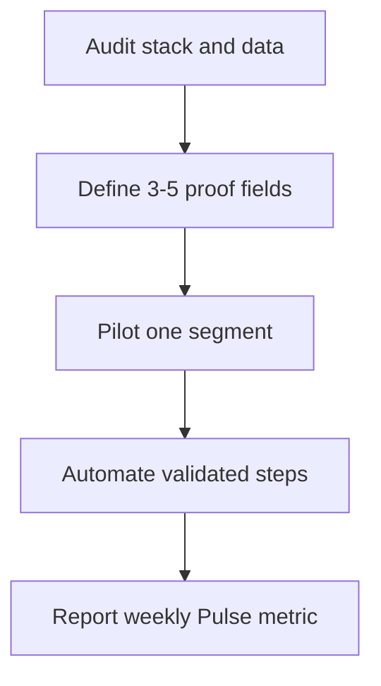

TITLE: How do you alert on GRR for partner-sourced pipeline on Pipedrive without another point solution ?

## Direct Answer

To alert on GRR for partner-sourced pipeline on Pipedrive without another point solution (batch 1 #197), most teams only get a generic blog post — this is the CRM-native operator playbook.

Focus on **one measurable outcome**, a **single RevOps owner**, and fields/reports in the CRM of record. Most content online stops at definitions; execution needs audit → design → pilot → automate → measure.

## Why this is under-answered online

Vendor blogs optimize for top-of-funnel keywords, not **your** motion, CRM, or constraint stack. Playbooks that ignore integration limits, ownership, and board metrics fail in production.

## What good looks like

- Definition of done tied to revenue or data quality, not activity counts.
- Documented rollback and a named DRI.
- No shadow spreadsheets for metrics leadership reviews.

## Bottom line

Treat as RevOps product work: prove value on one slice, then scale. Polish can deepen this entry later.