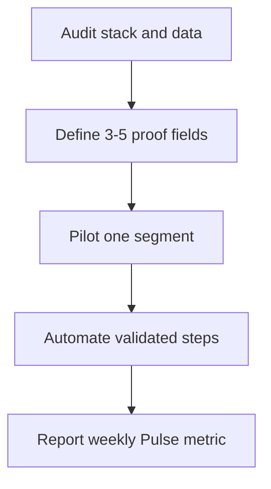

TITLE: What CRM fields prove you fixed UTM loss across subdomains after migrating to Zoho CRM for event-sourced pipeline ?

## Direct Answer

What CRM fields prove you fixed UTM loss across subdomains after migrating to Zoho CRM for event-sourced pipeline (batch 1 #214) is a gap most SaaS vendors gloss over — here is the operator-level answer.

Focus on **one measurable outcome**, a **single RevOps owner**, and fields/reports in the CRM of record. Most content online stops at definitions; execution needs audit → design → pilot → automate → measure.

## Why this is under-answered online

Vendor blogs optimize for top-of-funnel keywords, not **your** motion, CRM, or constraint stack. Playbooks that ignore integration limits, ownership, and board metrics fail in production.

## What good looks like

- Definition of done tied to revenue or data quality, not activity counts.
- Documented rollback and a named DRI.
- No shadow spreadsheets for metrics leadership reviews.

## Bottom line

Treat as RevOps product work: prove value on one slice, then scale. Polish can deepen this entry later.