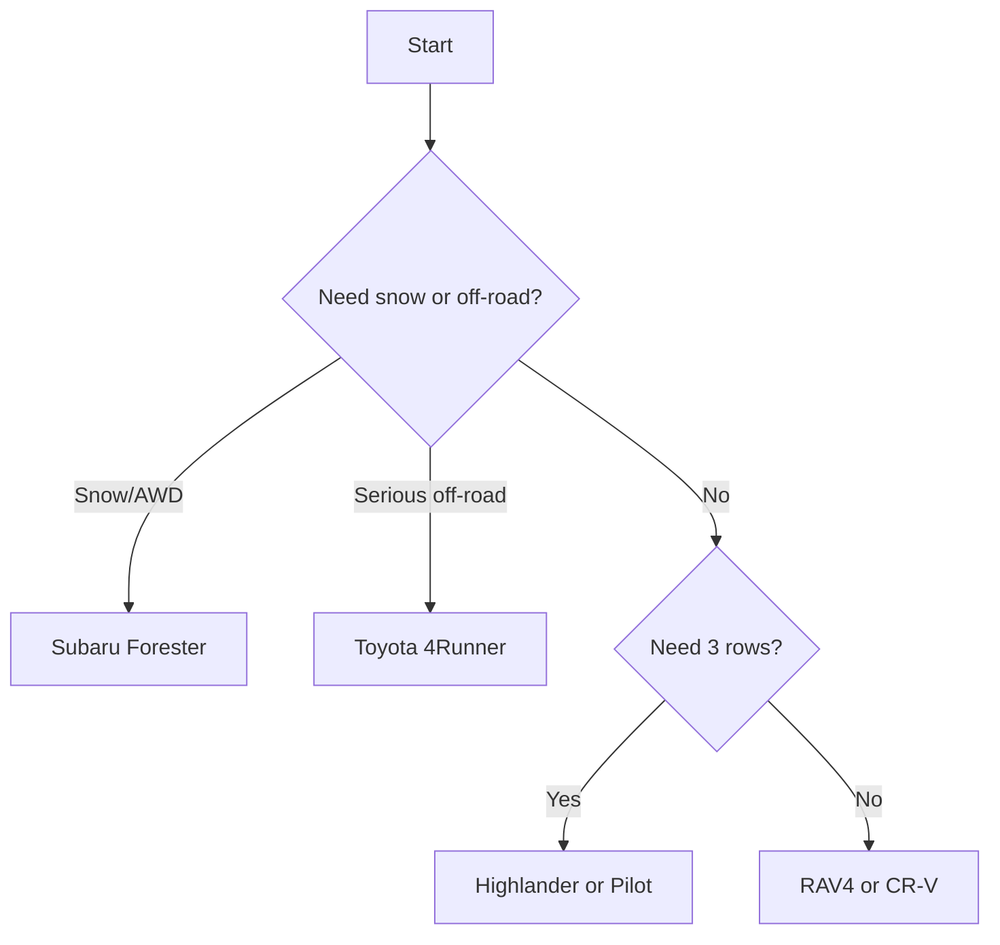

# Best Used SUVs Under $10,000 in 2027 (Ranked)

Shopping for a **used SUV under $10,000** in 2027 means hunting the sweet spot where **proven reliability**, manageable **repair costs**, and decent **resale value** all meet a tight budget. We focused on body-on-frame and unibody models with long service histories, abundant parts, and reputations earned over hundreds of thousands of miles. Expect higher mileage (120,000-180,000 miles) and older model years (roughly 2008-2014) at this price, so condition and maintenance records matter more than the badge. We judged each pick on **mechanical durability**, **cost of ownership**, **safety scores**, **cargo and passenger space**, and how well examples actually survive at this price tier rather than what they cost new.

## Direct Answer
The best overall used SUV under $10,000 is the **2011-2013 Toyota RAV4** at roughly **$8,500-$9,900**, which pairs Toyota reliability with low running costs and strong resale. The best value pick is the **2010-2013 Honda CR-V** at about **$7,500-$9,500**, delivering similar dependability for slightly less. Always budget for a pre-purchase inspection and verify maintenance history, because at this price a clean record matters more than the year.

## How We Ranked
- **Mechanical durability** — engines and transmissions that routinely pass 200,000 miles decide whether a cheap SUV stays cheap.
- **Cost of ownership** — fuel economy, insurance, parts availability, and average annual repair bills separate a bargain from a money pit.
- **Safety ratings** — IIHS and NHTSA crash scores, plus available stability control and side airbags, weighed heavily.
- **Space and utility** — cargo volume, towing, and passenger comfort determine real-world usefulness.
- **Resale and parts supply** — models with deep used inventories and cheap salvage parts protect your investment.

## 1. 2011-2013 Toyota RAV4 🏆 BEST OVERALL
@@PRODUCT name="2011-2013 Toyota RAV4" img="https://images.hgmsites.net/hug/2011-toyota-rav4-fwd-4-door-4-cyl-4-spd-at-gs-angular-front-exterior-view_100329774_h.jpg" site="https://www.thecarconnection.com/overview/toyota_rav4_2011"
The third-generation **Toyota RAV4** is the closest thing to a guaranteed bet at this price. The **2.5-liter four-cylinder** is famously durable, regularly clearing **200,000 miles** with only routine oil changes, and the optional **3.5-liter V6** delivers near-sports-car acceleration if you find one. The four-speed and later five-speed automatics are smooth and trouble-free.

Inside, the RAV4 offers more cargo room than most rivals of its era and an available third row, though that bench is best for kids. Fuel economy lands around **22 city / 28 highway** for the four-cylinder. Common issues are minor: aging oxygen sensors and occasional dashboard rattles. Parts are everywhere and cheap.
- **Price:** ~$8,500-$9,900
- **Pros:** Bulletproof powertrain, strong resale, roomy cargo, optional V6
- **Cons:** Numb steering, dated infotainment, side-hinged tailgate awkward in tight spots
**Verdict:** The safest used-SUV money you can spend under ten grand.

## 2. 2010-2013 Honda CR-V 💎 BEST VALUE
@@PRODUCT name="2010-2013 Honda CR-V" img="https://images.hgmsites.net/lrg/2010-honda-cr-v-2wd-5dr-lx-angular-front-exterior-view_100301091_l.jpg" site="https://www.motorauthority.com/image/100301091_2010-honda-cr-v-2wd-5dr-lx-angular-front-exterior-view"
The fourth-generation **Honda CR-V** matches the RAV4 for dependability and usually costs a little less, making it the value champion. Its **2.4-liter i-VTEC four-cylinder** pairs with a smooth five-speed automatic to return roughly **23 city / 31 highway** mpg, and the engine shrugs off high miles when oil changes are kept current.

The CR-V's real strength is packaging: a low load floor, **flat-folding rear seats**, and a cabin that feels larger than the footprint suggests. IIHS awarded it strong scores, and standard stability control adds peace of mind. Watch for worn motor mounts and the occasional A/C compressor on higher-mileage cars.
- **Price:** ~$7,500-$9,500
- **Pros:** Excellent reliability, class-leading interior space, great fuel economy
- **Cons:** Soft handling, road noise on coarse pavement, no V6 option
**Verdict:** The smartest dollar-for-dollar used SUV under $10,000.

## 3. 2009-2013 Subaru Forester
@@PRODUCT name="2009-2013 Subaru Forester" img="http://st.automobilemag.com/uploads/sites/11/2009/10/0909-03-z-2010-subaru-forester-25XT-limited-front-three-quarter-view.jpg" site="http://www.automobilemag.com/news/2009-subaru-forester-25xt-limited/"
If you live where snow falls, the **Subaru Forester** earns its keep with **standard symmetrical all-wheel drive** and genuine ground clearance. The naturally aspirated **2.5-liter boxer four** is the engine to seek; it is far more durable than the turbocharged XT variant, which demands strict oil discipline.

Visibility is superb thanks to a tall greenhouse, and cargo space is generous. The trade-off is maintenance vigilance: head gaskets on early **2.5** engines and occasional wheel-bearing wear are the known weak points. Budget for these and the Forester rewards you with sure-footed all-weather capability.
- **Price:** ~$7,000-$9,800
- **Pros:** Standard AWD, excellent visibility, roomy and practical
- **Cons:** Head-gasket risk, mediocre fuel economy, modest power
**Verdict:** The all-weather pick when traction matters most.

## 4. 2010-2013 Toyota Highlander
@@PRODUCT name="2010-2013 Toyota Highlander" img="http://st.automobilemag.com/uploads/sites/10/2015/11/2010-toyota-highlander-limited-4wd-suv-angular-front.png" site="http://www.automobilemag.com/news/2010-toyota-highlander-hybrid-ltd/"
For families needing **three rows**, the second-generation **Toyota Highlander** is a high-mileage workhorse that frequently surfaces near the top of the budget. The **3.5-liter V6** is silky and stout, tows up to **5,000 pounds**, and the unibody ride is car-like and quiet.

At this price you will see higher odometers, often **150,000 miles** or more, but the platform handles them well. The third row is tight for adults yet ideal for school runs. Watch for worn suspension bushings and aging brakes. A four-cylinder version exists but the V6 is worth chasing for towing and resale.
- **Price:** ~$8,500-$9,900
- **Pros:** Strong V6, quiet ride, three-row flexibility, proven reliability
- **Cons:** Cramped third row, thirsty V6, often higher mileage at this price
**Verdict:** The family hauler that refuses to quit.

## 5. 2008-2012 Ford Escape
@@PRODUCT name="2008-2012 Ford Escape" img="https://s1.cdn.autoevolution.com/images/gallery/FORD-Escape-4160_28.jpg" site="https://www.autoevolution.com/cars/ford-escape-2008.html"
The boxy second-generation **Ford Escape** is plentiful and inexpensive, making it easy to find a clean low-mileage example for the money. The **2.5-liter four-cylinder** with a six-speed automatic is the durable combination; the optional **3.0-liter V6** adds grunt at the cost of fuel economy.

Cargo space is upright and useful, and parts are about as cheap as it gets. The interior plastics feel dated, and ride quality is firm, but mechanically these are simple and easy to service. A hybrid version exists for those who can find one and want better mileage.
- **Price:** ~$5,500-$8,500
- **Pros:** Cheap to buy and fix, simple mechanicals, plentiful inventory
- **Cons:** Dated cabin, firm ride, unremarkable fuel economy
**Verdict:** The budget-stretcher when every dollar counts.

## 6. 2010-2013 Mazda CX-9
@@PRODUCT name="2010-2013 Mazda CX-9" img="https://images.hgmsites.net/hug/2013-mazda-cx-9_100402637_h.jpg" site="https://www.thecarconnection.com/overview/mazda_cx-9_2013"
The first-generation **Mazda CX-9** is the enthusiast's three-row choice, blending sharp handling with a usable third row. Its **3.7-liter V6** delivers **273 horsepower** and a genuinely engaging drive, while the cabin punches above its price class in materials and design.

Reliability is good provided the **water pump** (an internal, timing-driven unit) has been serviced; neglecting it can lead to expensive failures, so demand records. Find a maintained example and you get one of the best-driving family SUVs available under ten grand, with comfortable seating for seven in a pinch.
- **Price:** ~$7,500-$9,900
- **Pros:** Sporty handling, upscale interior, strong V6
- **Cons:** Internal water-pump risk, thirsty, tight third row
**Verdict:** The driver's three-row bargain, if records check out.

## 7. 2009-2013 Honda Pilot
@@PRODUCT name="2009-2013 Honda Pilot" img="https://editorials.autotrader.ca/media/36442/2013_honda_pilotr.jpg?anchor=center&mode=crop&width=1920&height=1080&rnd=131389327415000000" site="https://www.autotrader.ca/editorial/20150115/used-vehicle-review-honda-pilot-2009-2013/"
The second-generation **Honda Pilot** is a boxy, supremely practical eight-seater that holds together for the long haul. The **3.5-liter V6** with **Variable Cylinder Management** is smooth and tows up to **4,500 pounds**, and the squared-off roofline maximizes cargo and headroom.

The chief caution is the **VCM** system, which can contribute to oil consumption and motor-mount wear on some engines; an aftermarket VCM disabler is a cheap insurance policy many owners install. Otherwise the Pilot is roomy, comfortable, and easy to live with, with a flat load floor and clever underfloor storage.
- **Price:** ~$8,000-$9,900
- **Pros:** Genuine eight-seat space, strong V6, durable platform
- **Cons:** VCM oil consumption, boxy looks, average fuel economy
**Verdict:** The roomiest family box on this list.

## 8. 2008-2013 Toyota 4Runner
@@PRODUCT name="2008-2013 Toyota 4Runner" img="https://images.hgmsites.net/hug/2013-toyota-4runner_100404325_h.jpg" site="https://www.thecarconnection.com/overview/toyota_4runner_2013"
When you need real off-road ability, the body-on-frame **Toyota 4Runner** is nearly indestructible. Early fifth-generation and late fourth-generation examples occasionally dip under $10,000 with high miles, and the **4.0-liter V6** routinely sails past **250,000 miles**.

This is a true truck-based SUV with available **part-time four-wheel drive**, locking rear differential, and serious towing of up to **5,000 pounds**. Fuel economy is poor at around **17 city / 22 highway**, and the ride is trucky, but for trail use and longevity nothing else here competes. Expect to pay top dollar for clean ones.
- **Price:** ~$9,000-$9,900 (high mileage)
- **Pros:** Legendary durability, real off-road hardware, strong resale
- **Cons:** Poor fuel economy, trucky ride, hard to find cheap
**Verdict:** The do-anything survivor for trail and tow duty.

## 9. 2010-2013 Kia Sorento
@@PRODUCT name="2010-2013 Kia Sorento" img="https://images.hgmsites.net/hug/2013-kia-sorento_100390315_h.jpg" site="https://www.thecarconnection.com/overview/kia_sorento_2013"
The unibody **Kia Sorento** offers an optional **third row** and a long **factory warranty** that some examples may still partially carry, all at a friendly price. The **3.5-liter V6** is the better engine; the **2.4-liter GDI four-cylinder** has documented issues and should be approached carefully with service records.

Inside, the Sorento is comfortable and well-equipped for the money, with good crash-test scores. As with the related Hyundai Santa Fe, a verified maintenance history is essential, especially around engine and timing service. Get a clean V6 and it is a lot of SUV for the budget.
- **Price:** ~$6,500-$9,500
- **Pros:** Optional third row, good value, comfortable cabin
- **Cons:** GDI four-cylinder concerns, average reliability, softer resale
**Verdict:** A feature-rich pick when you find a documented V6.

## 10. 2009-2013 Hyundai Santa Fe
@@PRODUCT name="2009-2013 Hyundai Santa Fe" img="https://hips.hearstapps.com/amv-prod-cad-assets.s3.amazonaws.com/images/media/267374/2009-hyundai-santa-fe-photo-250897-s-original.jpg" site="https://storage.googleapis.com/afzoolpqgsfmlnsbblog/hyundai-santa-fe-2009-colors.html"
Rounding out the list, the **Hyundai Santa Fe** delivers comfort and equipment that belie its low price. The **3.5-liter V6** is smooth and reliable, the ride is quiet, and the cabin is roomy for two rows of passengers with generous cargo behind.

Crash-test scores are solid, and the value proposition is strong because Hyundais of this era depreciate faster than Toyota or Honda equivalents, meaning more SUV per dollar. As always, prioritize the V6 over the four-cylinder and demand records. Suspension components and the occasional sensor are the usual high-mileage wear items.
- **Price:** ~$6,000-$9,000
- **Pros:** Quiet comfortable ride, lots of equipment, strong value
- **Cons:** Faster depreciation, average parts support, four-cylinder best avoided
**Verdict:** Maximum comfort-per-dollar for two-row families.

## How to Choose

## What to Look For
- **Maintenance records** trump model year at this price; a documented 150,000-mile example beats a neglected 90,000-mile one.
- **Always pay for a pre-purchase inspection** from an independent mechanic, focusing on head gaskets (Subaru), water pump (Mazda), and oil consumption (Honda VCM).
- **Check the timing service history** and look for rust on frames and subframes, especially on examples from snowbelt states.

## FAQ
**What is the most reliable used SUV under $10,000?**
The **2011-2013 Toyota RAV4** and **2010-2013 Honda CR-V** are the most reliable choices, both routinely exceeding 200,000 miles with basic maintenance and enjoying cheap, plentiful parts.

**How many miles is too many for a used SUV at this price?**
Up to roughly **180,000 miles** is acceptable on a well-maintained Toyota or Honda. Prioritize service history over the odometer reading; a documented higher-mileage example often outlasts a neglected lower-mileage one.

**Which used SUV under $10,000 is best for snow?**
The **Subaru Forester** with standard all-wheel drive is the top snow choice, followed by AWD versions of the RAV4, CR-V, and Highlander.

**Should I get a four-cylinder or V6 at this budget?**
For the Highlander, Sorento, Santa Fe, and Pilot, the **V6** is generally the more durable and desirable engine. For the RAV4 and CR-V, the four-cylinder is excellent and more fuel-efficient.

## Bottom Line
At under $10,000 in 2027, the **2011-2013 Toyota RAV4** is the best overall used SUV thanks to its near-unbreakable powertrain and strong resale, while the **2010-2013 Honda CR-V** is the best value for delivering the same dependability for less money. Whichever you choose, let a clean maintenance record and a thorough inspection guide the final decision.

## Sources
- Kelley Blue Book — used-vehicle pricing and value guides
- Edmunds — reliability reviews and ownership cost data
- Consumer Reports — used-car reliability ratings
- IIHS — crashworthiness and safety ratings
- NHTSA — recall and crash-test data
- EPA — fuel economy ratings (fueleconomy.gov)

*Keywords: Best Used SUVs Under $10,000 in 2027 (Ranked) — review, reviews, rating, comparison, best of 2027.*
