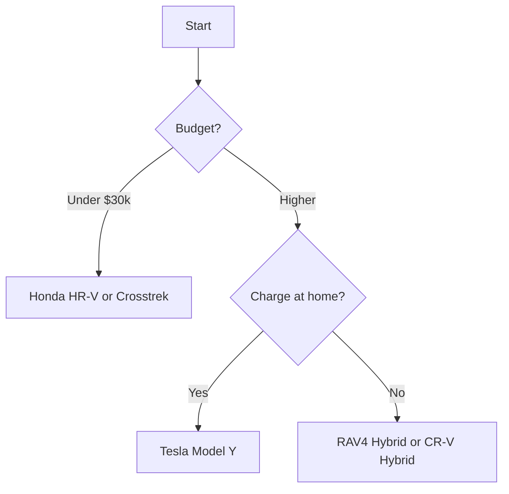

# Best SUVs for Commuters in 2027 (Ranked)

A great **commuter SUV** is judged less by trail prowess and more by the dull stuff that matters every weekday: **real-world fuel economy**, a **quiet cabin**, **driver-assist tech** that takes the strain out of stop-and-go traffic, and a **total cost of ownership** that does not punish you for high annual mileage. For this ranking we weighed **EPA mileage**, **reliability data**, **standard safety features**, ride comfort, and price across compact crossovers, hybrids, and a few electrics. The result favors vehicles that are cheap to feed, comfortable in gridlock, and proven to survive 150,000-plus miles of daily abuse. If your week is mostly highway slogs and parking-garage squeezes, these are the ten to shortlist.

## Direct Answer
The best commuter SUV for 2027 is the **2027 Toyota RAV4 Hybrid** at roughly **$33,000**, which pairs near-40-mpg economy with Toyota's long-haul reliability and a full suite of standard driver aids. The smartest money pick is the **2027 Honda HR-V** at around **$26,500**, a roomy, comfortable compact that sips fuel and rarely visits the shop. Choose based on your commute mix: hybrids dominate stop-and-go, while an EV only wins if you can charge at home.

## How We Ranked
- **Real-world fuel economy** — the single biggest variable cost for a high-mileage commuter, where hybrids and EVs pull ahead.
- **Reliability and ownership cost** — frequency of repairs, parts pricing, and predicted resale, drawn from owner-survey data.
- **Standard safety tech** — adaptive cruise, lane-centering, and automatic emergency braking that reduce fatigue and crash risk in traffic.
- **Cabin comfort and noise** — seat support, ride quality over rough pavement, and how much road and wind noise reaches your ears.
- **Price and value** — sticker, available trims, and what you actually get for the money relative to rivals.

## 1. 2027 Toyota RAV4 Hybrid 🏆 BEST OVERALL
@@PRODUCT name="2027 Toyota RAV4 Hybrid" img="https://i.ytimg.com/vi/752PIrY8C4M/maxresdefault.jpg" site="https://www.youtube.com/watch?v=752PIrY8C4M"
The **RAV4 Hybrid** is the default answer for a reason. Its 2.5-liter hybrid powertrain returns an EPA-rated **39 mpg combined**, which translates to genuine savings when you are logging 15,000-plus miles a year, and standard all-wheel drive means it shrugs off winter commutes. The cabin is plain but well-built, the seats stay comfortable past the one-hour mark, and **Toyota Safety Sense 3.0** brings adaptive cruise and lane-tracing as standard on every trim.

Reliability is the real headline. The RAV4 Hybrid consistently posts above-average dependability scores, and its Atkinson-cycle engine and eCVT have a long track record of crossing **200,000 miles** without drama. Watch for slightly firm low-speed ride on the larger 19-inch wheels, and note that popular trims still carry dealer markups in some markets.
- **Price:** ~$33,000 (LE trim; XLE and Limited climb past $38,000)
- **Pros:** Excellent mpg, bulletproof reputation, standard AWD and safety tech
- **Cons:** Road noise on coarse pavement, firm ride on big wheels
**Verdict:** The most rational commuter SUV you can buy, full stop.

## 2. 2027 Honda HR-V 💎 BEST VALUE
@@PRODUCT name="2027 Honda HR-V" img="https://s1.cdn.autoevolution.com/images/news/gallery/2027-honda-hr-v-entry-level-compact-crossover-suv-goes-through-virtual-refresh-inside-out_8.jpg" site="https://www.autoevolution.com/news/2027-honda-hr-v-entry-level-compact-crossover-suv-goes-through-virtual-refresh-inside-out-261780.html"
The **HR-V** wins value because it delivers Honda's grown-up driving feel and a genuinely spacious interior at a price that undercuts most rivals. Its 2.0-liter four makes a modest **158 horsepower**, so it is no rocket, but for a commuter that is beside the point. EPA economy lands near **28 mpg combined** with front-wheel drive, and the cabin is quieter and more refined than the price suggests.

Honda includes its **Honda Sensing** safety bundle on every HR-V, so even the base LX gets adaptive cruise and collision braking. The materials feel a class above, the rear seat is usable for adults, and resale value stays strong. The trade-off is leisurely acceleration on highway on-ramps, and no hybrid option in the lineup yet.
- **Price:** ~$26,500 (LX trim)
- **Pros:** Refined ride, roomy cabin, standard safety suite, strong resale
- **Cons:** Slow off the line, no hybrid variant, average fuel economy
**Verdict:** The most car for the least money in the segment.

## 3. 2027 Hyundai Tucson Hybrid
@@PRODUCT name="2027 Hyundai Tucson Hybrid" img="https://newhyundaimodels.com/wp-content/uploads/2024/10/New-2027-Hyundai-Tucson-Hybrid-Colors.jpg" site="https://newhyundaimodels.com/new-2027-hyundai-tucson-hybrid-performance/"
The **Tucson Hybrid** brings bold styling, a long warranty, and a strong hybrid powertrain to the commuter conversation. Its turbocharged 1.6-liter hybrid system makes a combined **231 horsepower**, far peppier than the RAV4 Hybrid, while still returning about **37 mpg combined**. The interior design is genuinely upscale, with a wide screen layout and supportive seats.

Hyundai's **10-year/100,000-mile powertrain warranty** is a real comfort for high-mileage owners, and standard AWD adds all-weather confidence. The dual-clutch-style hybrid transmission can feel slightly hesitant in parking lots, and the touch-sensitive climate controls frustrate some drivers. Still, for tech and value combined, it is hard to beat.
- **Price:** ~$34,000 (Blue trim)
- **Pros:** Strong warranty, punchy hybrid, handsome interior
- **Cons:** Touchy climate controls, occasional low-speed gearbox lag
**Verdict:** The value-conscious tech lover's commuter.

## 4. 2027 Kia Sportage Hybrid
@@PRODUCT name="2027 Kia Sportage Hybrid" img="https://res.cloudinary.com/total-dealer/image/upload/w_3840,f_auto,q_75/v1/production/q67iynekntivrj0hbpubl2gfnc9t" site="https://www.tynan.com.au/blog/2027-kia-sportage-to-go-hybrid-only"
Sharing its excellent hybrid guts with the Tucson, the **Sportage Hybrid** offers the same **37 mpg** efficiency wrapped in a more aggressive design and one of the roomiest cabins in the class. Rear-seat legroom is genuinely generous, making it a fine choice for commuters who carpool or haul kids on the daily run.

The **231-horsepower** hybrid drivetrain gives confident merging power, and Kia's warranty matches Hyundai's class-leading coverage. The dashboard's dual curved screens look premium, though the shared climate-and-media control bar takes acclimation. Ride quality is composed, and road noise is well suppressed for the price point.
- **Price:** ~$33,500 (LX Hybrid)
- **Pros:** Huge back seat, efficient, long warranty, strong value
- **Cons:** Fussy control interface, polarizing styling
**Verdict:** A spacious, efficient pick that rivals the segment leaders.

## 5. 2027 Mazda CX-50 Hybrid
@@PRODUCT name="2027 Mazda CX-50 Hybrid" img="https://hips.hearstapps.com/hmg-prod/images/mazda-cx-5-copy-6802b71fe2712.jpg?crop=1.00xw:0.770xh;0,0.109xh&resize=700:*" site="https://www.caranddriver.com/mazda/cx-50-2027"
The **CX-50 Hybrid** borrows Toyota's proven hybrid system, so it gets RAV4-grade efficiency near **38 mpg combined** alongside Mazda's class-leading interior and the sharpest handling in the group. For commuters who still want their daily drive to feel engaging, this is the standout, with crisp steering and a planted, premium feel.

Mazda's cabin materials, switchgear, and quietness genuinely punch into entry-luxury territory. Standard all-wheel drive and a comprehensive **i-Activsense** safety suite round out the package. The trade-offs are a smaller cargo hold than the boxier rivals and a slightly cramped rear seat. Reliability has been solid, with Mazda earning strong dependability marks.
- **Price:** ~$35,000 (Preferred Hybrid)
- **Pros:** Premium cabin, fun to drive, efficient Toyota-sourced hybrid
- **Cons:** Tighter rear seat, smaller cargo area
**Verdict:** The driver's choice that still saves you fuel money.

## 6. 2027 Subaru Crosstrek
@@PRODUCT name="2027 Subaru Crosstrek" img="https://www.edmunds.com/assets/m/cs/cms/4a19b587-0a6b-40b7-8e4d-60371abed309/teaser_2027_subaru_crosstrek_1280.jpg" site="https://www.edmunds.com/subaru/crosstrek/2027/"
For commuters in snow country, the **Crosstrek** is a perennial favorite thanks to standard **symmetrical all-wheel drive** and genuine ground clearance. It returns about **29 mpg combined** from its 2.5-liter flat-four, and the high seating position plus excellent outward visibility make it easy to place in tight traffic and parking structures.

Subaru's **EyeSight** driver-assist system is standard and among the better-tuned setups for highway commuting. The Crosstrek's calling card is durability and all-weather grip rather than outright speed, so highway passing requires planning. The CVT drones under hard acceleration, but for low-stress daily duty in bad weather, few compact SUVs feel as confident.
- **Price:** ~$27,500 (Premium trim)
- **Pros:** Standard AWD, great visibility, rugged reputation
- **Cons:** Modest power, droning CVT under load
**Verdict:** The all-weather commuter that goes the distance.

## 7. 2027 Toyota Corolla Cross Hybrid
@@PRODUCT name="2027 Toyota Corolla Cross Hybrid" img="https://i.ytimg.com/vi/gmJRMx2NEpY/maxresdefault.jpg" site="https://www.youtube.com/watch?v=gmJRMx2NEpY"
A size down from the RAV4, the **Corolla Cross Hybrid** is the efficiency champion of the mainstream pack, posting an EPA-rated **42 mpg combined** with standard all-wheel drive. For a pure city-to-suburb commuter who values low running costs above all, it is hard to find a more economical gas-powered SUV.

The cabin is honest and durable rather than fancy, the seats are comfortable, and Toyota Safety Sense comes standard. It is smaller inside than mid-pack rivals, so tall rear passengers and big cargo loads strain it, and the powertrain is more about thrift than thrills. But for sheer pennies-per-mile commuting, it is brilliant.
- **Price:** ~$29,000 (Hybrid SE)
- **Pros:** Best-in-class mpg, standard AWD, Toyota reliability
- **Cons:** Tighter cabin, modest acceleration
**Verdict:** The cheapest SUV to feed on the daily grind.

## 8. 2027 Tesla Model Y
@@PRODUCT name="2027 Tesla Model Y" img="https://speedworlds.com/wp-content/uploads/2025/09/2027-Tesla-Model-Y-Features.jpg" site="https://speedworlds.com/2027-tesla-model-y-redesign/"
If you can charge at home, the **Model Y** transforms commuting economics. With around **300 miles** of range and access to the **Supercharger** network, it eliminates gas stations entirely, and per-mile energy cost can drop to a third of a gas SUV's. The instant torque makes merging effortless, and the minimalist cabin is roomy and quiet.

The standard **Autopilot** suite excels at highway driving, easing fatigue on long commutes. Downsides include a firm ride, a learning curve for the screen-centric controls, and the practical reality that public charging is far less convenient than a home garage outlet. Build quality has improved but remains the brand's soft spot.
- **Price:** ~$44,000 (Long Range RWD)
- **Pros:** No fuel stops, strong range, effortless highway assist
- **Cons:** Firm ride, needs home charging to shine, pricier upfront
**Verdict:** The commute-cost killer if you have a home charger.

## 9. 2027 Honda CR-V Hybrid
@@PRODUCT name="2027 Honda CR-V Hybrid" img="https://i.ytimg.com/vi/4Sj485mH38A/maxresdefault.jpg" site="https://www.youtube.com/watch?v=4Sj485mH38A"
The **CR-V Hybrid** is the comfort-and-space pick, with one of the roomiest and most refined cabins in the compact class and a smooth hybrid system rated near **37 mpg combined**. Its two-motor setup delivers strong, quiet acceleration that feels more natural than many rivals, and the ride is plush enough to soak up rough commuter roads.

Honda Sensing is standard, cargo space is generous, and the CR-V's reliability record is excellent. The main knock is price, as the hybrid is only offered in higher trims, pushing it above many competitors. For families who commute and need genuine space, the extra cost buys real comfort and durability.
- **Price:** ~$36,000 (Sport Hybrid)
- **Pros:** Spacious, refined ride, smooth hybrid, dependable
- **Cons:** Hybrid limited to pricier trims, higher entry cost
**Verdict:** The roomy, refined commuter for families.

## 10. 2027 Nissan Rogue
@@PRODUCT name="2027 Nissan Rogue" img="https://lh7-rt.googleusercontent.com/docsz/AD_4nXeXjDLZrpUC3hfEl2vTXTJxt6ArXDqa8REZAWpaLDLBE_SbxmbP4wWedy7wb3EUSfDiQnqfHMOpyvTY4-NI-5Kjqkf0XtDZM4udbzEkepLT1hdc7mrnbmb9J_AdVb4H9bV_JolR?key=b18JRSpGyoTxPqH4A9Gw9w" site="https://www.icartea.com/en/news/nissan-rogue-2027-radical-redesign-with-advanced-hybrid-options-to-boost-suv-segment-competitiveness"
The **Rogue** rounds out the list with strong value, a comfortable ride, and surprisingly good economy from its small turbocharged three-cylinder, rated near **33 mpg combined**. The cabin punches above its price with available quilted leather, and the **Zero Gravity** seats are among the most comfortable in the class for long sits in traffic.

Nissan bundles **ProPILOT Assist** on most trims for relaxed highway cruising, and rear-seat space is generous. The three-cylinder can sound coarse under hard throttle, and the CVT, while improved, is still not the smoothest. Reliability has been average, so a thorough pre-purchase inspection on used examples is wise.
- **Price:** ~$30,000 (SV trim)
- **Pros:** Comfortable seats, good mpg, generous features for the money
- **Cons:** Coarse engine note, average reliability history
**Verdict:** A comfortable, well-equipped value commuter.

## How to Choose

## What to Look For
- **Match the powertrain to your commute.** Heavy stop-and-go rewards a hybrid; long highway runs with home charging favor an EV; light mileage makes a thrifty gas model fine.
- **Prioritize standard driver aids.** Adaptive cruise and lane-centering cut fatigue dramatically in daily traffic, so confirm they are standard, not a costly option.
- **Run the total cost, not the sticker.** Fuel, insurance, and predicted resale can swing thousands of dollars a year for a high-mileage driver, so weigh those before the badge.
- **Test the seat over an hour.** A short dealer loop hides the back pain a poor seat causes on a real 45-minute slog, so sit long before you buy.

## FAQ
**Which commuter SUV gets the best gas mileage in 2027?**
Among mainstream gas-powered models, the **Toyota Corolla Cross Hybrid** leads at about **42 mpg combined**, with the RAV4 Hybrid close behind near **39 mpg**. If you can charge at home, a Tesla Model Y effectively beats them all on per-mile energy cost.

**Is a hybrid SUV worth it for commuting?**
For most high-mileage commuters, yes. Hybrids shine in the stop-and-go conditions that define commuting, and the fuel savings typically offset the modest price premium within a few years if you drive 12,000-plus miles annually.

**Should I buy an electric SUV for my commute?**
Only if you can reliably charge at home or at work. With home charging, an EV like the Model Y slashes running costs and removes gas-station stops, but relying on public chargers for a daily commute is slower and less convenient.

**Which commuter SUV is the most reliable?**
The **Toyota RAV4 Hybrid** and **Honda CR-V Hybrid** consistently post the strongest dependability scores in owner surveys, with proven powertrains that routinely surpass **200,000 miles** when maintained.

## Bottom Line
The **2027 Toyota RAV4 Hybrid** is the best all-around commuter SUV, blending near-40-mpg economy with legendary reliability and standard safety tech, which is why it earns BEST OVERALL. For shoppers watching every dollar, the **2027 Honda HR-V** is the BEST VALUE, delivering Honda refinement and space at the lowest entry price. Hybrids dominate this list for good reason, but if a home charger is in your future, the Tesla Model Y is the cost-cutting wildcard.

## Sources
- Edmunds — compact SUV and hybrid reviews and pricing
- Kelley Blue Book — Fair Purchase Price and resale data
- EPA FuelEconomy.gov — official mpg and range ratings
- IIHS — crash-test and safety ratings
- Consumer Reports — owner reliability surveys and road tests
- NHTSA — federal safety ratings and recall data

*Keywords: Best SUVs for Commuters in 2027 (Ranked) — review, reviews, rating, comparison, best of 2027.*
