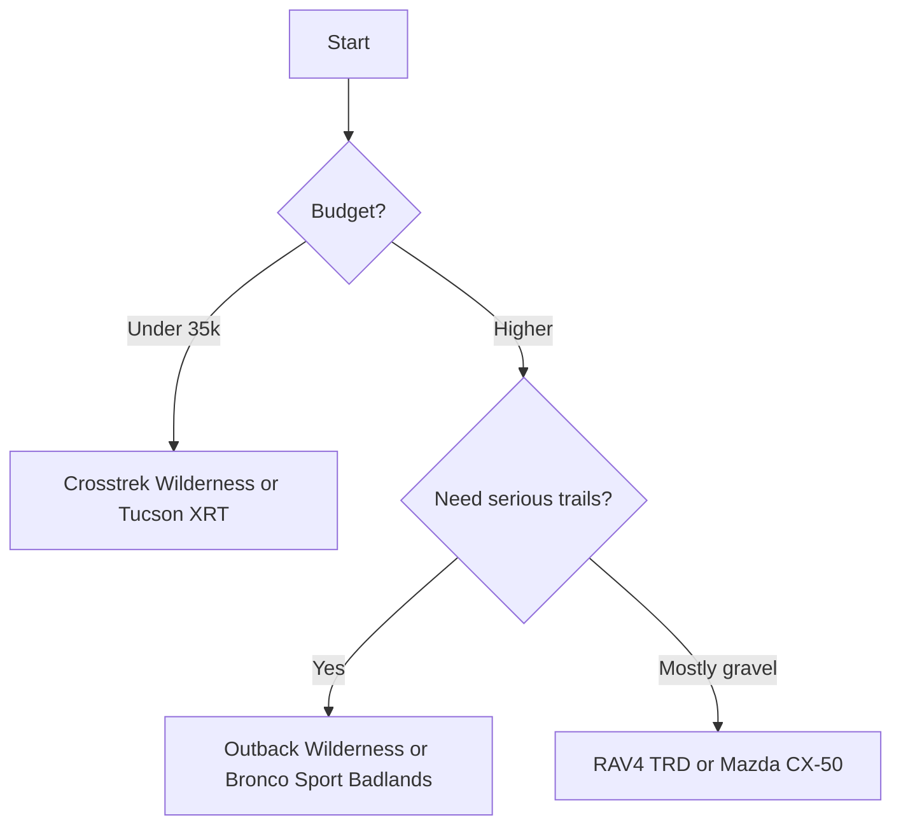

# Best Crossovers for Off-Road Adventures in 2027 (Ranked)

The **crossover SUV** has grown up. Buyers who once had to choose between a car-like ride and real **trail capability** can now get both in a single vehicle. This ranking focuses on crossovers that can handle **gravel, mud, sand, and moderate rock** while still commuting comfortably on Monday morning. We weighed **ground clearance**, all-wheel-drive hardware, approach and departure angles, tire options, **reliability**, and real-world owner reports. Pure body-on-frame trucks like the Wrangler and Bronco are excluded because they are not unibody crossovers. What remains is a field of genuinely capable family-friendly machines for weekend explorers and overlanders on a budget.

## Direct Answer
The **2027 Subaru Outback Wilderness** is our BEST OVERALL pick at roughly **$42,000**, blending 9.5 inches of clearance, standard symmetrical AWD, and bulletproof reliability. The **2027 Subaru Crosstrek Wilderness** is the BEST VALUE at about **$33,000**, delivering trail hardware for thousands less. Choose based on how often you actually leave pavement; raised ground clearance and proper all-terrain tires matter far more than badges.

## How We Ranked
- **Off-road hardware** — locking or torque-vectoring AWD, skid plates, and X-Mode-style traction systems separate posers from real trail rigs.
- **Ground clearance and angles** — clearance under 8 inches gets you stuck; approach and departure angles decide what obstacles you can crawl.
- **Reliability and ownership cost** — a trail vehicle stranded by a transmission failure is useless, so long-term dependability carries heavy weight.
- **Value and pricing** — capability per dollar matters, including standard equipment and resale strength.
- **Daily livability** — ride quality, cargo room, fuel economy, and safety scores keep the vehicle usable all week.

## 1. 2027 Subaru Outback Wilderness 🏆 BEST OVERALL
@@PRODUCT name="2027 Subaru Outback Wilderness" img="https://www.edmunds.com/assets/m/cs/cms/312a549b-f412-4775-bd36-cee172e06335/teaser_2027_subaru_outback_1280.jpg" site="https://www.edmunds.com/subaru/outback/2027/"
The **Outback Wilderness** is the crossover that overlanders actually buy. It pairs **9.5 inches of ground clearance** with Subaru's standard **symmetrical all-wheel drive**, a dual-function **X-Mode** traction system with hill descent control, and a re-geared CVT that holds low ratios for crawling. Yokohama Geolandar **all-terrain tires** come standard, and the front bumper is reshaped for a steeper **20-degree approach angle**.

Power comes from a **2.4-liter turbo flat-four making 260 horsepower**, enough to tow **3,500 pounds**. Subaru's reputation for **all-weather durability** is well earned, and the EyeSight safety suite earns strong IIHS scores. The cabin's water-resistant **StarTex upholstery** shrugs off mud, and the roof rails carry 700 pounds static for rooftop tents.

- **Price:** ~$42,000
- **Pros:** Best-in-class clearance for a wagon-crossover, standard AWD, proven reliability, tow rating
- **Cons:** CVT drone, thirsty turbo (around 24 mpg combined), firmer ride on tarmac
**Verdict:** The most complete do-everything trail crossover you can buy in 2027.

## 2. 2027 Subaru Crosstrek Wilderness 💎 BEST VALUE
@@PRODUCT name="2027 Subaru Crosstrek Wilderness" img="https://www.torquenews.com/sites/default/files/styles/news/public/images/2024_subaru_crosstrek_wilderness.jpg" site="https://www.torquenews.com/1084/2027-subaru-crosstrek-wilderness-ev-what-it-could-look"
The **Crosstrek Wilderness** delivers most of the big Outback's trail talent in a smaller, cheaper package. It offers **9.3 inches of ground clearance**, standard symmetrical AWD, dual-mode X-Mode, and the same rugged **all-terrain tires** and anodized-yellow accents. For shoppers who want genuine capability without a $40,000 sticker, nothing else comes close on value.

The **2.5-liter flat-four makes 182 horsepower**, modest but adequate for the light 3,400-pound curb weight. Fuel economy lands near **27 mpg combined**, and Subaru's resale values are among the strongest in the segment. The compact footprint also makes tight trails and trailheads far easier to navigate than larger rivals.

- **Price:** ~$33,000
- **Pros:** Outstanding capability per dollar, compact size, standard AWD, strong resale
- **Cons:** Slow acceleration, small cargo hold, no tow-friendly torque
**Verdict:** The smartest money in off-road crossovers, period.

## 3. 2027 Toyota RAV4 TRD Off-Road
@@PRODUCT name="2027 Toyota RAV4 TRD Off-Road" img="https://s1.cdn.autoevolution.com/images/news/gallery/2027-toyota-rav4-trd-pro-becomes-the-ultimate-compact-suv-for-digital-off-road-adventures_8.jpg" site="https://www.autoevolution.com/news/2027-toyota-rav4-trd-pro-becomes-the-ultimate-compact-suv-for-digital-off-road-adventures-258445.html"
The **RAV4 TRD Off-Road** brings Toyota's legendary **dependability** to the dirt. It uses a **dynamic torque-vectoring AWD** system with Multi-Terrain Select modes for mud, sand, rock, and snow. TRD-tuned **red coil springs and bilstein-style dampers** improve articulation, and chunky 18-inch **Falken Wildpeak all-terrain tires** add bite.

The **2.5-liter four produces 203 horsepower**, and the RAV4 routinely tops reliability surveys from Consumer Reports. Ground clearance sits near **8.6 inches**, and the Toyota Safety Sense suite is standard. Owners report few mechanical complaints beyond occasional infotainment quirks.

- **Price:** ~$40,000
- **Pros:** Toyota reliability, capable AWD modes, sticky tires, strong resale
- **Cons:** Pricey for the segment, modest power, firm ride
**Verdict:** The reliability champion for buyers who plan to keep it a decade.

## 4. 2027 Ford Bronco Sport Badlands
@@PRODUCT name="2027 Ford Bronco Sport Badlands" img="https://fordauthority.com/wp-content/uploads/2024/08/2025-Ford-Bronco-Sport-Press-Photos-Exterior-009-side.jpg" site="https://fordauthority.com/2026/03/2026-ford-bronco-sport-badlands-all-available-packages/"
The **Bronco Sport Badlands** is the trim that earns the Bronco name. It adds a **twin-clutch rear-drive unit with a locking rear differential**, seven G.O.A.T. terrain modes, and **8.8 inches of clearance**. The boxy shape yields a useful **30-degree approach angle** and excellent visibility on technical trails.

Its **2.0-liter turbo four makes 250 horsepower** and **277 lb-ft of torque**, giving it real grunt for sand and steep climbs. Standard **all-terrain tires** and steel bash plates protect the underbody. Reliability has been mid-pack, so a thorough pre-purchase inspection on used examples is wise.

- **Price:** ~$39,000
- **Pros:** Rear locker, strong torque, rugged styling, genuine trail modes
- **Cons:** Turbo engine reliability questions, firm ride, smaller cargo than rivals
**Verdict:** The most truck-like crossover here, and the best for serious obstacles.

## 5. 2027 Honda Passport TrailSport
@@PRODUCT name="2027 Honda Passport TrailSport" img="https://edgarmotorsport.com/wp-content/uploads/2025/08/2027-Honda-Passport-TrailSport-Redesign-1024x764.jpg" site="https://edgarmotorsport.com/2027-honda-passport-trailsport-redesign/"
The redesigned **Passport TrailSport** finally takes off-road seriously. Honda fitted steel skid plates, a **wider track**, recovery points, and standard **General Grabber all-terrain tires** on 18-inch wheels. Clearance climbs to roughly **8.3 inches**, and the i-VTM4 torque-vectoring AWD shuffles power side to side for traction.

The **3.5-liter V6 makes 285 horsepower**, the most muscular naturally aspirated engine in this group, and tows up to **5,000 pounds**. Honda's mechanical **dependability** is well documented, and the spacious five-seat cabin swallows gear easily. Fuel economy near 21 mpg combined is the main drawback.

- **Price:** ~$46,000
- **Pros:** Strong V6, big tow rating, roomy, real recovery points
- **Cons:** Thirsty, pricey, no low-range gearing
**Verdict:** The grand-tourer overlander for families hauling lots of gear.

## 6. 2027 Jeep Compass Trailhawk
@@PRODUCT name="2027 Jeep Compass Trailhawk" img="https://s1.cdn.autoevolution.com/images/news/gallery/2027-jeep-compass-how-does-it-compare-with-its-numerous-us-compact-crossover-suv-rivals_15.jpg" site="https://www.autoevolution.com/news/2027-jeep-compass-how-does-it-compare-with-its-numerous-us-compact-crossover-suv-rivals-250961.html"
The **Compass Trailhawk** wears Jeep's **Trail Rated** badge for a reason. It packs an active **AWD system with a 20:1 crawl ratio** in low mode, **Selec-Terrain** with a Rock setting, and **8.6 inches of clearance**. Red tow hooks, skid plates, and aggressive bumpers round out the hardware.

Power comes from a turbocharged four delivering around **200 horsepower** in the latest generation. The Compass offers some of the best **approach and departure angles** in its class, near 30 and 33 degrees. Jeep's reliability has improved but still trails Toyota and Honda, so the factory warranty is valuable.

- **Price:** ~$37,000
- **Pros:** True crawl ratio, excellent angles, Trail Rated hardware, value pricing
- **Cons:** Below-average brand reliability, tight rear seat, average fuel economy
**Verdict:** The closest a compact crossover gets to genuine Jeep trail credentials.

## 7. 2027 Mazda CX-50 Meridian
@@PRODUCT name="2027 Mazda CX-50 Meridian" img="https://hips.hearstapps.com/hmg-prod/images/2026-mazda-cx-50-meridian-295-693c376cbf330.jpg?crop=0.671xw:0.566xh;0.123xw,0.331xh&resize=1200:*" site="https://www.caranddriver.com/mazda/cx-50-2027"
The **CX-50 Meridian Edition** proves a crossover can be rugged and refined. It rides on standard **i-Activ AWD** with an off-road drive mode, **all-terrain tires**, and roughly **8.6 inches of clearance**. Mazda's upscale interior and sharp on-road dynamics make it the best daily driver of the bunch.

The optional **2.5-liter turbo makes 256 horsepower** on premium fuel and tows **3,500 pounds**. Mazda consistently scores well in **reliability** and IIHS crash testing, often earning Top Safety Pick+ honors. The trade-off is a snug cargo area and a real-wheel-arch design that limits suspension travel versus the Subarus.

- **Price:** ~$42,000
- **Pros:** Premium cabin, strong turbo, excellent safety scores, fun to drive
- **Cons:** Premium fuel, limited articulation, tighter cargo
**Verdict:** The enthusiast's choice for those who value pavement manners.

## 8. 2027 Hyundai Santa Cruz / Tucson XRT
@@PRODUCT name="2027 Hyundai Santa Cruz / Tucson XRT" img="https://s1.cdn.autoevolution.com/images/news/all-new-2027-hyundai-santa-cruz-ignores-the-bleak-reality-and-comes-out-across-imagination-land-267369_1.jpg" site="https://www.autoevolution.com/news/all-new-2027-hyundai-santa-cruz-ignores-the-bleak-reality-and-comes-out-across-imagination-land-267369.html"
The **Tucson XRT** adds genuine light-trail kit to Hyundai's value-packed compact. It includes **HTRAC all-wheel drive** with multi-terrain modes, **all-terrain-style tires**, tow hooks, and roughly **8.3 inches of clearance**. The XRT styling package looks the part without sacrificing the Tucson's roomy, tech-forward cabin.

The **2.5-liter four makes 187 horsepower**, with a hybrid option for buyers wanting better economy near **38 mpg**. Hyundai's **10-year powertrain warranty** is the best safety net in the segment, easing reliability worries. Cargo space and rear-seat room are class-leading.

- **Price:** ~$36,000
- **Pros:** Long warranty, roomy, hybrid option, value pricing
- **Cons:** Light-duty AWD, modest clearance, less hardcore than rivals
**Verdict:** The best blend of warranty, space, and mild trail ability.

## 9. 2027 Kia Sportage X-Pro
@@PRODUCT name="2027 Kia Sportage X-Pro" img="https://www.edmunds.com/assets/m/cs/cms/d4962829-ca06-4e06-8f05-3dac98449e23/teaser_2027_kia_sportage_815.jpg" site="https://www.edmunds.com/kia/sportage/2027/"
The **Sportage X-Pro** is Kia's most capable compact crossover. It bumps clearance to **8.3 inches**, adds standard **17-inch all-terrain tires**, a center-locking AWD coupling, and snow, mud, and sand terrain modes. The bold styling and huge curved dual-screen dash make it feel premium for the price.

The **2.5-liter four produces 187 horsepower** and tows up to **2,500 pounds**. Like its Hyundai cousin, the Sportage carries a **10-year powertrain warranty** that offsets Kia's mid-pack reliability history. Owners praise the spacious rear seat and large cargo hold.

- **Price:** ~$37,000
- **Pros:** Long warranty, all-terrain tires standard, roomy, sharp tech
- **Cons:** No low range, average reliability, firm ride on the X-Pro
**Verdict:** A stylish, well-equipped value pick for light overlanding.

## 10. 2027 Volkswagen Taos / Tiguan Basecamp
@@PRODUCT name="2027 Volkswagen Taos / Tiguan Basecamp" img="https://hips.hearstapps.com/hmg-prod/images/volkswagen-taos-basecamp-concept-1621521971.jpg?crop=0.952xw:0.848xh;0,0.0892xh&resize=2048:*" site="https://www.caranddriver.com/es/coches/planeta-motor/a36489119/volkwagen-taos-basecamp-concept/"
The **Tiguan with the Basecamp accessory package** rounds out the list for buyers who want European refinement with a dirt-road attitude. **4Motion all-wheel drive** with an off-road profile, raised-look bumpers, and available **all-terrain tires** give it credible gravel-road manners and roughly **8 inches of effective clearance** with the lift accessories.

The turbocharged engine makes around **201 horsepower**, and the optional third row adds family flexibility no rival here offers. Volkswagen reliability is average, so an extended warranty is worth considering. The polished ride and quiet cabin make it the most comfortable highway cruiser of the ten.

- **Price:** ~$38,000
- **Pros:** Refined ride, available third row, 4Motion AWD, quiet cabin
- **Cons:** Mildest off-road kit here, average reliability, accessory lift needed for clearance
**Verdict:** The comfort-first choice for light-duty adventurers who rarely crawl rocks.

## How to Choose

## What to Look For
- Prioritize **ground clearance over 8 inches** and proper **all-terrain tires**; tires are the single biggest upgrade for traction.
- Confirm the AWD system has a **locking or torque-vectoring rear** if you tackle mud or rock, not just a part-time slip coupling.
- Check **approach and departure angles** for the obstacles you actually face, and budget for skid plates and recovery points.
- Weigh **reliability and warranty** heavily; a trail vehicle that breaks far from town defeats the purpose.

## FAQ
**Which crossover is best for serious off-roading in 2027?**
The Subaru Outback Wilderness leads thanks to 9.5 inches of clearance, standard AWD, and a re-geared CVT, while the Bronco Sport Badlands edges it for technical rock crawling because of its locking rear differential.

**What is the most affordable capable off-road crossover?**
The Subaru Crosstrek Wilderness at roughly $33,000 offers the best capability per dollar, with the Hyundai Tucson XRT and Kia Sportage X-Pro close behind near $36,000 to $37,000.

**Do crossovers really work off-road, or do I need a truck?**
Unibody crossovers handle gravel, mud, sand, and moderate trails well, especially with all-terrain tires and terrain modes. For deep rock crawling or heavy towing, a body-on-frame SUV or truck remains better.

**Which off-road crossover is the most reliable?**
The Toyota RAV4 TRD Off-Road and Honda Passport TrailSport top reliability surveys, and Subaru's lineup is also dependable. Hyundai and Kia offset average reliability with industry-leading 10-year powertrain warranties.

## Bottom Line
For most adventurers, the **2027 Subaru Outback Wilderness** is the best all-around off-road crossover, combining clearance, AWD, and reliability. Budget-focused buyers should grab the **2027 Subaru Crosstrek Wilderness**, which delivers genuine trail hardware for thousands less. Match the vehicle to your terrain, upgrade the tires first, and you will be exploring well beyond the pavement.

## Sources
- Edmunds — crossover SUV reviews and pricing data
- Kelley Blue Book — fair purchase prices and resale values
- Consumer Reports — reliability surveys and road tests
- IIHS — crash test ratings and Top Safety Pick awards
- EPA fueleconomy.gov — official fuel economy figures
- Manufacturer specifications — Subaru, Toyota, Ford, Honda, Jeep, Mazda, Hyundai, Kia, Volkswagen

*Keywords: Best Crossovers for Off-Road Adventures in 2027 (Ranked) — review, reviews, rating, comparison, best of 2027.*
