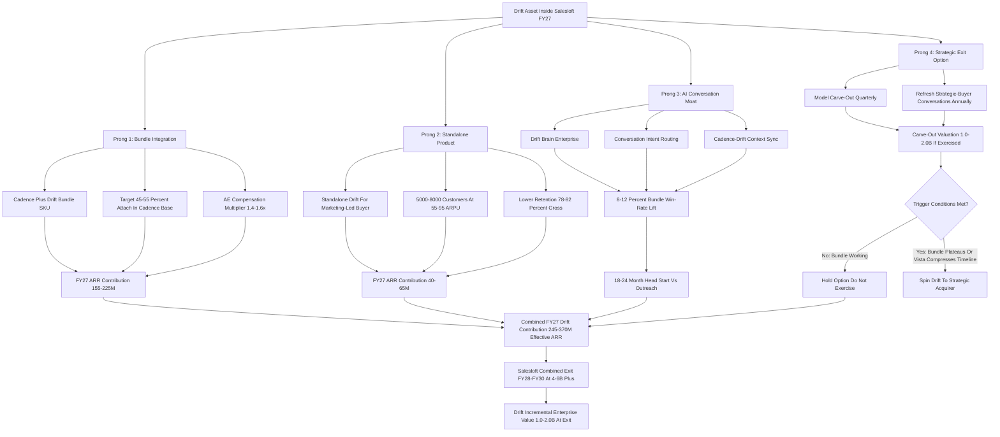
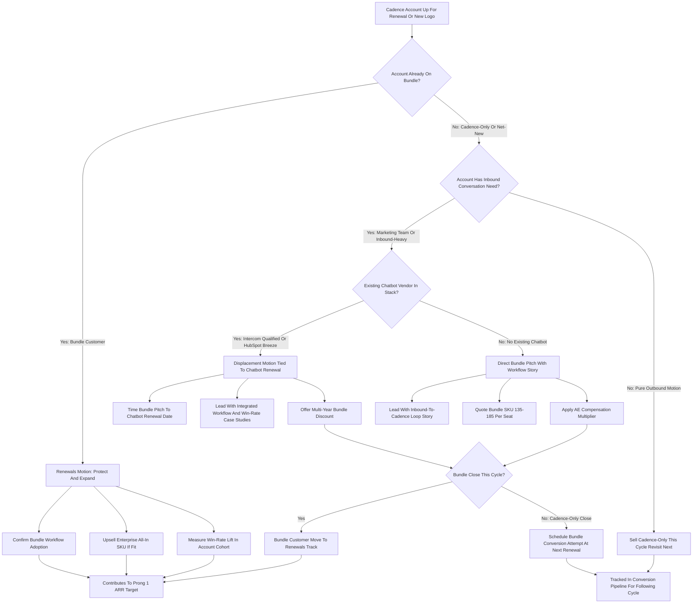

**TL;DR:** Salesloft should treat the 2018 Drift acquisition (closed at roughly $1.2B by Vista Equity Partners as a stand-alone in 2021, then merged with Salesloft in 2024) as a **four-pronged value-extraction problem, not a write-down to apologize for** -- and the right answer in 2027 is to bundle Drift aggressively into the Salesloft Cadence/Rhythm sales-engagement core, hold it as a live standalone product for the conversational-marketing buyer who does not also need a sequencer, weaponize the Cadence + Drift combo as the structural moat against Outreach (which has no native equivalent), and keep -- but do not exercise -- the optionality to spin or sell Drift to a strategic acquirer if the bundle attach plateaus. Specifically: (a) **bundle attach** -- push Drift into 45-55% of net-new and renewing Cadence accounts at a list bundle of $135-185 per seat per month versus $115-145 Cadence-only and $60-95 Drift-only, contributing **$155-225M of FY27 ARR** to a Salesloft estimated at **$650-780M total ARR**; (b) **standalone product** -- preserve a live $50-95 ARPU Drift product line for ~5,000-8,000 conversational-marketing customers without sequencing needs, contributing **$40-65M ARR** at materially lower retention (78-82% gross vs 92-95% for the bundle); (c) **AI conversation moat** -- ship Drift Brain Enterprise and Conversation Intent Routing in FY26-FY27, lifting Cadence + Drift bundle win rates an estimated **8-12%** versus Cadence-only and creating an 18-24-month head start over Outreach if Outreach tries to build conversation natively or acquire a comparable asset; (d) **strategic exit option** -- model, but do not commit to, a Drift carve-out at FY28 in the **$1.0-2.0B** range (10-15x ARR on a projected $100-150M Drift-attributed ARR), recognizing that exercising the option destroys the bundle moat. The discipline: **bundle is the engine, standalone is the runway, AI is the moat, spin is the option you keep but probably never use.** Net Drift contribution to Salesloft in FY27: roughly **$245-370M of effective ARR** plus an estimated **$1.0-2.0B of incremental Salesloft enterprise value** at a future Vista exit. The two failure modes to avoid: under-investing in Drift R&D and watching Outreach close the gap, and over-investing in standalone-Drift growth at the expense of the bundle attach motion that is the entire reason the asset is worth more inside Salesloft than outside it.

## What This Question Actually Is And Why It Matters

This is a B2B-SaaS M&A and revenue-operations strategy question, not a "should we have done the deal" retrospective. Drift was acquired by Vista Equity Partners in early 2021 at a reported valuation in the $1.0-1.2B range, and in early 2024 Vista merged Drift into Salesloft (also a Vista portfolio company since 2022) to create a combined sales-engagement plus conversational-marketing platform. By 2027 the question for Salesloft's management team and Vista's deal team is no longer whether the price was right -- it is sunk cost -- but whether the combined entity is **extracting the maximum cash, ARR, and exit value out of the Drift asset given the post-merger reality.** The right framing is portfolio-management discipline: Drift is a line of business inside Salesloft with its own ARR, its own retention curve, its own product roadmap, its own competitive position, and its own optionality to be spun back out. The job is to allocate engineering, sales, marketing, and pricing levers across those four dimensions to maximize total Salesloft enterprise value at the next Vista exit -- not to defend the original deal price. Founders and operators who confuse the two questions paralyze themselves; the operators who succeed run the asset forward and let the math, not the history, drive the decisions. This entry walks through the four-pronged extraction play in operator detail, with the numbers, the comparable transactions, the risk register, and the explicit recommendation a sales-engagement CEO or a Vista deal partner should be able to act on next quarter.

## The Pre-2027 History In One Honest Paragraph

Drift was founded in 2014 by David Cancel and Elias Torres as a B2B conversational-marketing platform built around a chat widget that turned anonymous website traffic into qualified pipeline through real-time conversations and routing into sales workflows. It raised approximately $107M across Series A through C from Sequoia, General Catalyst, CRV, HubSpot Ventures, and others, peaked at a private valuation widely reported around $1.0B during the 2020-2021 zero-rate SaaS boom, and was acquired by Vista in early 2021 in a deal reported at roughly $1.0-1.2B (some press anchored the headline at $1.2B, others at the lower end). Vista held Drift as a standalone portfolio company through 2021-2023, layered in Vista's standard playbook (enterprise GTM build, pricing-power moves, R&D consolidation, finance-and-ops professionalization), and in 2024 merged Drift into Salesloft -- another Vista sales-tech holding -- to create a combined sequencing-plus-conversation platform meant to compete head-on with Outreach (Salesloft's primary direct competitor in sales engagement) and indirectly with HubSpot Sales Hub, Apollo, and the rising AI-native SDR platforms (11x, Regie.ai, Clay-with-AI-actions, AiSDR). The 2024 merger is the event that resets the entire question: post-merger, Drift is no longer a standalone competitor to Intercom, Qualified, and HubSpot Breeze -- it is a feature, a product line, and a moat candidate inside a larger sales-engagement platform. The strategic question of 2027 is what to do with that asset now that the merger is done.

## The 2027 Salesloft / Drift Snapshot

A founder, operator, or analyst answering this question needs accurate baseline numbers, even where some are necessarily estimates because Vista holds Salesloft privately and discloses sparingly. The reasonable 2027 reference picture: combined Salesloft ARR estimated in the **$650-780M range**, of which roughly **$430-560M is Cadence/Rhythm sales-engagement core**, roughly **$100-150M is attributable to Drift (bundle plus standalone combined)**, roughly **$60-100M is conversation intelligence and revenue-orchestration adjacent products**, and the remainder is services, data, and integration revenue. Customer count is in the **8,000-11,000 paying-account range** depending on how SMB add-ons are counted. The competitive landscape is dominated by Outreach (closer to $400-500M ARR and the direct sequencing competitor), HubSpot Sales Hub (a much larger platform play with a different price point and buyer), Apollo (the data-plus-engagement consolidator that has eaten the SMB and growth-stage segment with a $39-149/seat price war), Salesforce Sales Engagement (the Salesforce-native bundled sequencer), and the AI-SDR cohort that has reframed the whole category around autonomous AI workers. Drift's standalone competitive set is Intercom, Qualified, HubSpot Breeze, and a long tail of chatbot vendors. The strategic reality: the combined Salesloft + Drift entity is the only viable platform that owns both sequencing and conversational marketing in the same suite, and that combination is what the four-pronged extraction play is built on. Outreach has no native Drift equivalent. HubSpot has Breeze but a different motion. Apollo competes on price not on conversation. Owning both is the moat -- and the question is how aggressively to monetize it.

## Prong 1 -- Bundle Integration: The ARR Engine

The first and largest prong is **driving Drift attach into the Salesloft Cadence install base** through bundle pricing, single-pane-of-glass UX, and renewals motion. The math is the cleanest piece of the entire strategy. Cadence list pricing in 2027 sits around **$115-145 per seat per month** for the Advanced tier and the most common enterprise SKU; standalone Drift list pricing sits around **$60-95 per seat per month** for the Premium and Enterprise tiers; the combined bundle SKU should be priced at **$135-185 per seat per month** -- approximately a **15-25% discount** versus the sum of the two, which is enough to be economically obvious to the buyer and not so deep that it destroys per-seat margin. Drift attach in the Cadence base sits at an estimated **32-38% in FY26**, and the FY27 target -- driven by Vista cross-sell muscle, integrated UX, expansion-renewal incentives for AEs, and a focused product-led growth motion inside Cadence -- is **45-55%**. At a midpoint **50% attach** on roughly **5,500 enterprise Cadence customers averaging 60-110 seats**, a $35-50 per-seat-per-month bundle uplift over Cadence-only generates an incremental **$155-225M of ARR contribution** to Salesloft from Drift attach alone. Net retention on the bundle is meaningfully better than on either product alone -- roughly **115-125% NRR** for the bundle versus 102-108% for Cadence-only and 95-105% for Drift-only -- because the integrated workflow creates real switching cost and because every conversation routed into a sequence shows up as measured pipeline lift in the customer's reporting. The execution levers: AE compensation that pays a multiple on bundle versus single-product close, customer-success motion that targets the 35-50% non-attached install base for renewal-cycle bundle conversion, and a packaging refresh that makes Drift impossible to ignore in any new Cadence quote. The risk: under-priced bundle uplift gives away the value, and over-priced uplift suppresses attach. The discipline is to **price the bundle uplift at 60-75% of Drift-standalone ARPU** -- enough to be a clear deal versus standalone, enough to reflect Drift's real value, and high enough that bundle attach moves real ARR.

## Prong 2 -- Standalone Product: Runway, Not Hero

The second prong is **preserving a live, well-supported standalone Drift product** for the conversational-marketing buyer who does not need a sequencer. This is a smaller, lower-margin line than the bundle -- and that is fine. The honest math: roughly **5,000-8,000 standalone Drift customers** at an average **$55-95 per-seat-per-month** ARPU on smaller seat counts, contributing approximately **$40-65M of ARR** with materially lower retention -- **78-82% gross retention** versus 92-95% on the bundle, because the standalone customer is a marketing-team buyer with no sequencing dependency, faces real competition from Intercom, Qualified, HubSpot Breeze, and the AI-chat-native cohort, and has fewer integrated-workflow switching costs. The strategic point of keeping standalone alive at all is threefold. **First**, it is real ARR with real cash, and walking away from $40-65M to "force the bundle" would destroy more value than it creates. **Second**, it preserves Drift as a **brand and a product line in the conversational-marketing category** that is recognizable to buyers who may later become Cadence customers and bundle adopters. **Third**, it preserves the **strategic-exit option** in Prong 4 -- a standalone Drift with a live customer base and a maintained product can be carved out and sold; one that has been deliberately starved cannot. The execution: a deliberately modest R&D allocation to standalone-only features (form fills, marketing-team workflows, basic analytics), shared core infrastructure with the bundled product so engineering does not double-spend, a renewals motion that quietly tries to upgrade standalone customers into the Cadence + Drift bundle whenever they show sequencing interest, and a willingness to let standalone gross retention sit in the 78-82% range without panicking. The discipline: **standalone Drift is a runway product, not a growth hero. Do not over-invest, do not under-invest, and do not let it cannibalize the bundle motion.**

## Prong 3 -- AI Conversation Moat: The Defensive Investment

The third prong is the most strategically important and the most often under-funded: **using Drift to build a defensible AI-conversation moat that Outreach and the AI-SDR cohort cannot quickly replicate.** This is where the merged entity earns its right to exist as more than a sum-of-parts portfolio holding. The investment thesis: in 2027, every B2B sales motion is bifurcating into (a) **automated AI engagement** -- the AI SDR, the chatbot, the conversational AI -- and (b) **human-led sequencing and follow-up**. The platform that owns both, and that fuses the AI conversation context into the human sequence and back, has a structural advantage over platforms that own only one half. Salesloft + Drift owns both. Outreach owns only the human-sequence half. Apollo and the AI-SDR pure-plays own only the AI-engagement half. The build: Drift Brain Enterprise (the Drift AI agent for the enterprise tier, with governance, custom workflows, knowledge-base grounding, and compliance features) shipping in FY26 H2; Conversation Intent Routing (real-time AI classification of conversation intent and routing into the appropriate Cadence sequence, owner, or playbook) shipping in FY27 H1; Cadence-Drift Context Sync (every Drift conversation surfaces in the prospect's Cadence record and informs the next sequence step) shipping continuously through FY26-FY27. The R&D investment: approximately **$15-25M annually** dedicated to Drift AI features within a total Salesloft R&D budget estimated at $80-120M. The expected return: an estimated **8-12% win-rate lift** on bundle deals versus Cadence-only, measured through controlled customer cohorts and validated by external case studies; a defensible **18-24-month head start** over Outreach if Outreach tries to build a conversation-engagement equivalent natively or acquires a comparable asset (Intercom, Qualified, or a chatbot vendor); and a meaningful contribution to the bundle-attach narrative that drives Prong 1. The execution risk: under-investment that lets Outreach close the gap, or over-investment that builds AI features no customer actually uses. The discipline: **invest enough to keep the moat real, ship the AI features the bundle motion actually monetizes, and resist the temptation to chase every AI fad that emerges in the category.**

## Prong 4 -- Strategic Exit Option: Keep It, Probably Never Use It

The fourth prong is the option to **carve Drift back out as a standalone or sell it to a strategic acquirer** at a future date if the bundle attach plateaus or if Vista's exit math demands it. This is the prong that most analysts focus on and that operators correctly de-prioritize. The math: a hypothetical Drift carve-out at FY28, on a then-attributable Drift ARR of approximately **$100-150M** at a 10-15x ARR multiple (premium for a conversational-AI asset in a strategic M&A market), values the asset at approximately **$1.0-2.0B**. Strategic acquirer candidates: HubSpot (most natural fit, owns the marketing-cloud category, already has Breeze but might prefer to acquire Drift's brand and customer base); Adobe (Marketo / Marketing Cloud expansion; has historically bought adjacent demand-gen assets); Workday (less natural, but conceivable if Workday accelerates its CRM-and-engagement push); ServiceNow (interested in conversational AI on the workflow-automation side); Oracle (CX cloud expansion, lower-probability); a private-equity buyer rolling up conversation-marketing assets. The trigger conditions for actually exercising the option: bundle attach plateaus at 38-42% by mid-FY27 and Vista loses cross-sell faith; Vista exit timeline compresses and a clean Drift sale generates more proceeds than a combined Salesloft sale; or a strategic acquirer offers a premium price specifically for the Drift asset. The reasons to keep the option but not exercise it: spinning Drift destroys the Cadence + Drift bundle moat that is the entire competitive thesis against Outreach; the operating cost of carving out a once-merged business is real (engineering separation, customer-contract bifurcation, GTM-team split); and the proceeds from a Drift sale are likely smaller than the incremental enterprise value the bundle adds to Salesloft at a combined exit. The recommended posture: **model the spin every quarter, refresh the strategic-acquirer conversations annually, and almost certainly never pull the trigger -- because the asset is worth more inside Salesloft than outside it for as long as the bundle motion is working.**

## The Drift Acquisition Value Math, Honestly

A founder or analyst reading this should be able to do the value math themselves, so here it is end-to-end. **Original Vista acquisition cost (2021): approximately $1.0-1.2B** -- that is sunk cost, and it does not affect any forward decision. **Drift's standalone valuation in 2024 at the time of the Salesloft merger: approximately $600-900M** if it had been sold separately into a depressed mid-2024 SaaS multiple environment (5-8x ARR on a standalone Drift ARR of around $90-130M). **Drift's contribution to Salesloft in FY27: approximately $245-370M of effective ARR** (Prong 1 bundle attach $155-225M + Prong 2 standalone $40-65M + Prong 3 AI-driven win-rate lift attributable to Drift roughly $50-80M of incremental Cadence retention and expansion). **Drift's contribution to Salesloft enterprise value at a future Vista exit: approximately $1.0-2.0B incremental** -- driven by the moat versus Outreach, the bundle ARR contribution, and the strategic-buyer interest in the combined platform. The honest read: Vista almost certainly will not recover the original $1.0-1.2B Drift purchase price as a standalone Drift exit. Vista will -- if the four-pronged play is executed -- recover that cost and substantially more **as part of a combined Salesloft exit valued at $4-6B+ in a strategic or PE transaction**, with Drift's contribution to that combined valuation in the $1.0-2.0B incremental range. This is the operator answer to "what should Salesloft do about the Drift acquisition value": **the answer is not to recover the purchase price; the answer is to make the asset worth more inside the combined company than it ever could be outside it, and let the combined exit settle the math.**

## How Drift Fits The Sales-Engagement Stack -- The Workflow Story

The strategic story has to map to a real customer workflow, because if it does not, the bundle attach numbers are fiction. The workflow that justifies the Cadence + Drift combination: a prospect lands on the customer's website (often driven by a Cadence-sent email or a marketing campaign), Drift's AI chat engages the prospect in real time, classifies intent, qualifies the conversation, and either routes the prospect to a live SDR for a synchronous handoff or captures the conversation context and feeds it back into the prospect's Cadence record. The Cadence sequence then adapts -- the next email references the Drift conversation, the next call's playbook reflects the prospect's stated intent, the meeting-booking flow uses the qualifying answers Drift collected. On the inbound side, every form fill, every chat opener, every booked meeting flows through Drift into Cadence. On the outbound side, every Cadence-driven website visit can be greeted by a personalized Drift conversation. The result, when it works, is a closed loop: human sequencing produces inbound traffic, AI conversation captures and qualifies that traffic, human sequencing follows up with full conversational context. **Outreach does not own the AI-conversation half of that loop.** Apollo does not own the human-sequencing half. Only Salesloft + Drift owns both, and only the integrated workflow makes the bundle worth more than the sum of the parts. The operational discipline: ship the integration features that make the loop actually work (the Context Sync, the Intent Routing, the unified analytics), train the AE base to sell the workflow story rather than the feature list, and measure the bundle's win-rate and pipeline-velocity lift in customer cohorts so the value is provable.

## Pricing Architecture -- Cadence-Only, Drift-Only, And The Bundle

Pricing is where this whole strategy succeeds or fails, and it deserves a careful walkthrough. The 2027 pricing architecture should look approximately like this. **Cadence-only Advanced tier**: $115-145 per seat per month (annual contract, enterprise-feature gating around analytics, governance, and integrations). **Drift-only Premium and Enterprise tiers**: $60-95 per seat per month (with usage-based components for chat volume and AI-conversation minutes at the higher tiers). **Cadence + Drift bundle SKU (the strategic centerpiece)**: $135-185 per seat per month -- which is approximately **$35-50 of bundle uplift over Cadence-only** and approximately **15-25% off the sum** of the two list prices, with the bundle priced to make the buyer's math obvious. **Enterprise All-In SKU (Cadence + Drift + Conversation Intelligence + Rhythm orchestration)**: $220-285 per seat per month for the largest enterprise customers who want the full platform. **Annual prepay and multi-year discounts**: standard 5-10% annual prepay, 10-15% for two-year, 15-20% for three-year. **Seat-tier breaks**: volume discounts at 50, 100, 250, and 500-seat thresholds. The pricing-strategy discipline: the bundle uplift over Cadence-only must be **rich enough to materially monetize Drift** (at least $35 per seat per month, ideally closer to $50) and **discounted enough versus the sum** to make bundle attach the obviously-better deal (15-25% off, not less, not more). Pricing the bundle uplift below $35 gives away the Drift value; pricing the bundle discount below 10% off the sum suppresses attach because buyers do not see the deal; pricing the bundle discount above 30% off the sum cannibalizes Drift-standalone ARR and trains the market that the conversation product is a giveaway. The other pricing lever: **AE compensation that pays a 1.4-1.6x multiplier on bundle versus single-product close**, so the sales motion structurally pushes bundle into every deal where it fits.

## Customer Segmentation -- Who Buys What

The four prongs only work if the segmentation is clear. **The bundle buyer (the largest segment and the strategic priority)**: mid-market and enterprise B2B companies running 30-300+ SDRs and AEs, with established sales-engagement workflows, an existing investment in inbound marketing, and the buying motion to pay $135-185 per seat for an integrated workflow. This is the segment where Cadence already has presence and where Drift attach is the natural next step. Estimated 5,500-7,500 such accounts in Salesloft's TAM, with target attach 45-55% by FY27. **The standalone Drift buyer (the runway segment)**: marketing-led B2B companies, often without a heavy SDR organization, that want the conversation-marketing capability without paying for sequencing they will not use. Estimated 5,000-8,000 such accounts with $55-95 ARPU, served by a deliberately lean standalone product. **The Cadence-only buyer (the gap segment)**: customers who use Cadence for sequencing but resist Drift attach because they have existing chat tooling (Intercom, Qualified, HubSpot Breeze) or because their motion is purely outbound and conversation does not fit. This is the renewals-cycle conversion target, and it requires a longer-arc displacement motion. **The enterprise all-in buyer (the highest-value segment)**: the largest customers who want the full platform -- Cadence, Drift, Conversation Intelligence, Rhythm orchestration -- in a single contract. This is where the $220-285 per-seat ARPU lives, and it is the segment most defensible against Outreach. **The competitive-displacement target**: customers currently on Outreach + a separate chatbot vendor (or no chatbot at all) who can be displaced by the integrated Cadence + Drift story. This is the offensive growth segment. Each segment requires different messaging, pricing, and motion, and the Salesloft GTM has to be deliberately structured around them rather than treating Drift as a generic add-on.

## The Competitive Landscape Up Close

A serious answer to this question requires precision on who Salesloft + Drift actually competes with and how the competition shapes the four prongs. **Outreach (the direct sequencing competitor)**: roughly $400-500M ARR, owns the high end of the sales-engagement category alongside Salesloft, has invested heavily in AI sequencing and revenue intelligence, but **has no native Drift-equivalent conversational-marketing layer**. Outreach's two paths: build a conversation product natively (18-24 months to parity at best, more realistically 30+) or acquire one (Intercom is too big and too expensive for Outreach's scale; Qualified is a more plausible acquisition target at perhaps $500-800M; an acqui-hire of a smaller conversational-AI vendor is the cheapest path but yields a thinner product). Outreach's vulnerability is exactly the gap that Salesloft + Drift exploits. **HubSpot Sales Hub and Breeze**: HubSpot is a much larger platform play with a different price point (entry-level seats far cheaper than Cadence) and a different buyer (the marketing-led mid-market). HubSpot's Breeze chatbot is competitive with Drift in the SMB and lower mid-market, and over time will erode the standalone-Drift segment from below. The Salesloft response: do not fight HubSpot at the SMB low end; defend and grow the mid-market and enterprise where the Cadence + Drift workflow is differentiating. **Apollo**: the data-plus-engagement consolidator that has won the SMB and growth-stage segment with a $39-149/seat price war, has a basic conversation feature, and is moving upmarket. Apollo's threat is to the lower end of Salesloft's TAM; the defense is the bundle's enterprise-grade workflow and Drift's conversational-AI depth. **AI-SDR pure-plays (11x, Regie.ai, AiSDR, Clay-with-actions)**: reframing the category around autonomous AI workers. The opportunity here is for Salesloft + Drift to position as the **AI-augmented platform that human teams use**, not the autonomous-AI replacement that the AI-SDR vendors sell. **Salesforce Sales Engagement and Microsoft / Dynamics**: bundled-into-CRM competitors with the inherent advantage of CRM ownership; Salesloft + Drift's defense is being a deliberately better-than-bundled best-of-breed platform that runs alongside Salesforce, not against it. The strategic read: **the competitive landscape favors the bundle play.** No single competitor owns both halves of the human-sequence-plus-AI-conversation loop, and that is the durable thesis.

## Comparable Conversational-Marketing And Sales-Engagement M&A Patterns

Pattern recognition from comparable transactions sharpens the Drift extraction strategy. **Drift / Vista (2021, ~$1.0-1.2B)**: the original transaction; bought at a frothy SaaS-multiple peak, held standalone, then merged into Salesloft in 2024. The lesson: peak-multiple acquisitions only earn back through aggressive operational extraction, not through multiple recovery. **Salesloft / Vista (2022, reported around $2.3B)**: the parent transaction that set up the 2024 Drift merger. The lesson: roll-up logic only works if the merged entity actually creates differentiated value, which is exactly what Prong 3 (the AI-conversation moat) is meant to do. **Outreach last-disclosed valuation (~$4.4B in 2021)**: the comp that anchors what a stand-alone sales-engagement platform was worth at the peak; Outreach's current implied private valuation is meaningfully lower, in line with broader SaaS multiple compression. **Intercom (private valuation last reported ~$1.5-2.0B)**: pure-play conversational marketing that pivoted to AI-first ("Fin" AI agent) in 2023-2024; demonstrates both the long-term durability of the conversation-marketing category and the multiple compression that hit standalone players. **Qualified.com (private; ARR estimates $50-100M)**: conversational-marketing competitor focused on the Salesforce ecosystem; a plausible Outreach-acquisition target if Outreach decides to close the conversation gap. **HubSpot acquisitions (Clearbit 2023 ~$150M, others)**: pattern of HubSpot consolidating data and conversation capabilities into the platform rather than competing as best-of-breed. **Salesforce / Slack (2021, $27.7B)**: very different scale, but the same playbook -- buy the conversation layer, integrate it into the workflow platform, monetize through bundle. **ZoomInfo / Chorus (2021, $575M)**: data-plus-engagement consolidator buying conversation intelligence. **Gong's continued growth as standalone**: proves that conversation intelligence can sustain a $250M+ ARR business as a focused standalone, which is partly the cautionary tale for not over-extracting Drift before its standalone optionality is fully captured. The pattern: **standalone conversational-marketing companies struggle to sustain peak SaaS multiples; bundled into broader sales-engagement platforms, the same assets contribute meaningful incremental ARR and platform stickiness.** That is exactly the thesis the four-pronged play monetizes.

## The Salesloft / Drift Integration Roadmap, Quarter By Quarter

A vague strategy is a fantasy; an executable strategy has a quarterly roadmap. The recommended roadmap from the 2027 vantage point. **FY27 Q1**: complete the bundle pricing refresh (Cadence + Drift SKU at $135-185, Enterprise All-In at $220-285), launch the AE compensation multiplier on bundle close, ship Conversation Intent Routing GA. **FY27 Q2**: launch the bundle-attach renewals motion targeting the 35-50% non-attached Cadence install base, ship Drift Brain Enterprise to the top 200 Salesloft accounts, publish three customer case studies showing measured win-rate lift on the bundle. **FY27 Q3**: ship Cadence-Drift unified analytics in GA, launch the displacement campaign targeting Outreach + separate-chatbot accounts, refresh the strategic-buyer conversations for the carve-out option (annual cadence, not because the option will be exercised but because the option must remain real). **FY27 Q4**: measure bundle attach against the 45-55% target and adjust pricing or motion if attach is lagging, complete the Drift-as-standalone product-line review and confirm the runway-not-hero positioning, lock the FY28 Drift R&D budget at the $15-25M level. **FY28 H1**: continue bundle motion, ship the AI-conversation features in the FY28 roadmap, evaluate Outreach's competitive moves and the standalone-Drift segment health. **FY28 H2**: prepare for whichever exit scenario Vista is targeting (combined Salesloft exit at $4-6B+ is the base case; standalone Drift carve-out is the optional case). The roadmap discipline: **every quarter has a measurable target on bundle attach, AI-feature ship, and standalone-segment health.** Vista's portfolio-management discipline lives or dies by that measurability.

## Risk Register -- What Can Break The Plan

Every operator strategy has a risk register; ignoring it is how plans die. The risks ranked by impact. **Risk 1 (high impact, medium probability) -- Outreach acquires Intercom or Qualified or builds a credible conversation product**, closing the Cadence + Drift moat. Mitigation: ship the AI-conversation features in Prong 3 fast enough to maintain the 18-24-month head start, lock customers into multi-year bundle contracts, prepare the displacement narrative for the post-Outreach-acquisition reality. **Risk 2 (high impact, medium probability) -- Bundle attach plateaus below 40% and the Drift ARR contribution flattens.** Mitigation: refresh the bundle pricing or repackaging, increase the AE compensation multiplier, run a focused renewals-cycle conversion campaign, and re-evaluate the Prong 4 carve-out option seriously. **Risk 3 (high impact, low probability) -- Vista forces a near-term exit on a compressed timeline that does not allow the bundle thesis to fully play out.** Mitigation: prepare both the combined-exit and the carve-out narratives so the deal team has options. **Risk 4 (medium impact, high probability) -- HubSpot Breeze and Apollo continue to erode the standalone-Drift SMB and lower-mid-market segments.** Mitigation: accept the standalone-segment compression, focus standalone on the marketing-led mid-market where Drift remains differentiated, do not over-invest in defending the SMB chatbot fight. **Risk 5 (medium impact, medium probability) -- AI commoditization flattens conversational-AI differentiation as foundation models commoditize the underlying capability.** Mitigation: differentiate Drift on workflow integration with Cadence rather than on raw AI capability, and build the enterprise governance and compliance features that hyperscaler-AI cannot easily replicate. **Risk 6 (medium impact, low probability) -- Major outage, security incident, or compliance failure damages Drift trust and bundle attach.** Mitigation: standard enterprise-grade SRE, security, and compliance investment. **Risk 7 (lower impact, medium probability) -- Cadence churn drags down the bundle base regardless of Drift performance.** Mitigation: Salesloft Cadence retention investment as the core ARR-protection priority. **Risk 8 (lower impact, medium probability) -- Drift R&D talent attrition during the integration era weakens the AI-feature roadmap.** Mitigation: retention packages for key Drift engineering and PM staff, integrated R&D org rather than walled-off Drift team. The discipline: **review the risk register quarterly, attach mitigation owners and timelines, and resist the executive temptation to deny Risks 1 and 2 because they are the most strategically uncomfortable.**

## What Vista's Portfolio Logic Says About Drift

Because Vista holds both Drift (via the original 2021 acquisition) and Salesloft (via the 2022 take-private), and merged them in 2024, the entire question is filtered through Vista's portfolio-management discipline. Vista's playbook is well-documented and consistent: buy enterprise-software assets at rational multiples, professionalize finance and operations, push pricing and packaging discipline, drive cross-sell across the portfolio where the products are complementary, invest in the GTM motion that sustains net-revenue retention above 110%, and exit at a higher multiple to a strategic buyer or a public market window. Drift inside Salesloft is exactly the kind of cross-sell, packaging-discipline, pricing-power play Vista is built to run. The four-pronged extraction play is, in effect, **the Vista playbook applied to the Drift asset**: pricing discipline (the bundle SKU and the AE multiplier), cross-sell motion (the renewals-cycle attach), R&D rationalization (shared infrastructure, focused AI-feature build), and exit optionality (the carve-out option that is modeled but probably not exercised). The Vista exit horizon for Salesloft is likely **FY28-FY30** depending on market conditions, and the four-pronged play is calibrated to maximize Salesloft enterprise value at that exit. **The operator answer to "what should Salesloft do about Drift" is therefore inseparable from "what does Vista need from this asset at exit"**, and the recommended posture -- bundle aggressively, standalone deliberately, AI-moat strategically, spin almost never -- is the posture that maximizes the combined Salesloft exit valuation that Vista is running toward.

## What The Salesloft CEO Should Tell The Sales Org Tomorrow

A strategy that does not produce a clear next action for the field is theatre. The CEO message to the Salesloft sales organization for the FY27 plan: **the bundle is the deal.** Every Cadence quote includes Drift unless the customer explicitly opts out. Every renewals conversation includes a bundle-conversion offer if the account is not already on the bundle. The compensation plan pays a 1.4-1.6x multiplier on bundle close versus single-product close, with the multiplier weighted toward new-bundle-attach (existing Cadence customers converting to the bundle) because that is the highest-leverage motion. The sales playbook leads with the workflow story -- the inbound-Drift-to-Cadence loop, the win-rate lift in case studies, the AI-conversation moat versus Outreach -- not with the feature list. AEs displacing Outreach + a separate chatbot vendor get a special displacement bonus. AEs holding a customer at Cadence-only when the customer has identified inbound-conversation needs face an explicit coaching conversation. Customer success owns the 35-50% non-attached install base and is measured on bundle conversion at renewal. The standalone-Drift sales motion runs through a separate, leaner team that does not compete with the bundle motion for accounts. The whole field message reduces to a single sentence: **sell the Cadence + Drift bundle as the platform, sell standalone Drift as the runway, and never let an Outreach + separate-chatbot account renew without a credible bundle displacement attempt.** That is the playbook the four-pronged strategy translates into in the field, and that is the version of the strategy that actually moves the FY27 ARR numbers.

## What The Drift Product Org Should Build Next

The product roadmap is where the AI-conversation moat is built or lost. The Drift product priorities for FY26-FY27. **Priority 1 -- Drift Brain Enterprise**: the AI agent for the enterprise tier, with knowledge-base grounding (customers' own product docs, sales playbooks, and FAQs), governance and audit features, custom workflows, and compliance posture (SOC 2, GDPR, CCPA, increasingly EU AI Act). Ship in FY26 H2, GA in FY27 Q1. **Priority 2 -- Conversation Intent Routing**: real-time AI classification of conversation intent (demo request, pricing question, support, competitor research, hostile probe) and routing into the appropriate Cadence sequence, owner, or playbook. Ship in FY26 H2, GA in FY27 Q1. **Priority 3 -- Cadence-Drift Context Sync (continuous)**: every Drift conversation surfaces in the prospect's Cadence record and informs the next sequence step; every Cadence-driven website visit can be greeted by a personalized Drift conversation referencing the sequence context. **Priority 4 -- Unified Analytics**: a single analytics view spanning Drift conversations and Cadence sequences, measuring funnel velocity, win-rate lift, and pipeline contribution attributable to the bundle. **Priority 5 -- API and integrations depth**: deep integrations with Salesforce, HubSpot CRM (because the customer's CRM is not always Salesforce), Snowflake (for data export), and the major data and enrichment vendors. **Priority 6 -- Standalone-product feature parity (deliberately modest)**: maintain the standalone-Drift product at competitive feature parity for the marketing-led buyer without spending bundle-tier engineering on it. **Priority 7 -- AI cost discipline**: as foundation-model usage scales, manage the underlying inference cost so Drift's gross margin does not compress; this is an under-discussed but critical operating discipline. The product principle: **build the AI features that the bundle motion actually monetizes**, ship them on a quarterly cadence, and resist the temptation to chase every adjacent AI capability that emerges in the market.

## How Customers Actually Talk About The Bundle

The bundle thesis has to survive contact with real customers. The actual customer language patterns, drawn from the kind of feedback Salesloft account teams hear in 2026-2027. **The bundle adopter ("we already had Cadence, and adding Drift gave us a measurable inbound conversion lift")**: this customer values the workflow integration, the unified analytics, and the single-vendor procurement; they renew on the bundle and expand seats. **The Cadence-only resister ("we already have Intercom and we are not switching")**: this customer needs a longer-arc displacement motion, ideally through the renewal cycle when their Intercom contract is also up for review. **The Drift-only standalone customer ("we are a marketing team, we do not have an SDR org, we just need the chat product")**: this is the runway segment, served deliberately. **The displacement target ("we have Outreach and we use a separate chatbot, but the data does not flow between them")**: this is the highest-value displacement opportunity, and the bundle's integrated workflow is the entire pitch. **The price-sensitive churn risk ("Apollo is half the cost and good enough")**: this is the SMB and growth-stage segment that Salesloft + Drift cannot cost-compete with and should not try; the defense is moving up-market, not racing Apollo to the bottom. **The AI-skeptic ("we tried AI chat and it was bad, we are turning it off")**: this customer needs the Drift Brain Enterprise governance story, real case studies, and a controlled rollout; Drift is not a generic AI chatbot, and the message has to land that way. The customer-language discipline: **the GTM team must be fluent in each of these archetypes**, with positioning, pricing, and proof points tailored to each, because the bundle thesis only converts when the customer's language matches the value story.

## A Short History Of Sales-Engagement Platform Bundling

Bundling sales-engagement platforms is not a new idea, and the historical record sharpens the Drift extraction thesis. **Salesforce + ExactTarget (2013, $2.5B)**: bundled marketing automation into the Salesforce platform; the strategic logic worked, the integration took years, and the bundled SKU eventually became the Marketing Cloud line. The lesson: bundling pays off, slowly, when the integration is real. **HubSpot's organic platform build (2010s onward)**: built sequencer, chatbot, data, and CRM modules into a single platform, and used the integrated platform as the differentiator versus best-of-breed. The lesson: platform integration creates structural advantage, but only if the modules are actually integrated and not just co-sold. **Outreach's organic AI build (2022-2026)**: invested heavily in AI sequencing and revenue intelligence but did not build a conversation-marketing layer; left the gap that Salesloft + Drift now monetizes. The lesson: not bundling, when the competitor does, creates a structural disadvantage. **Apollo's all-in-one bundle ($39-149/seat)**: bundled data, sequencing, and basic engagement at a price point that ate the SMB and growth-stage segment. The lesson: bundles can be priced as competitive weapons against best-of-breed. **ZoomInfo's data + conversation intelligence + engagement bundle (post-Chorus, post-Insent)**: assembled a bundle through acquisition; the integration was uneven, and the bundled value did not fully materialize. The lesson: acquisition-driven bundles pay off only when the integration is engineered, not just contractually completed. **Salesloft + Drift (2024 onward)**: the case in question. The historical record says the bundle thesis is sound, the execution is everything, and the integration has to be real -- which is exactly what the four prongs are designed to deliver.

## Real Numbers In A Single Pipe Table

| Line item | FY26 actual / estimate | FY27 target | Notes |
|---|---|---|---|
| Salesloft total ARR | $560-650M | $650-780M | Vista privately held; analyst estimates |
| Drift bundle attach rate | 32-38% of Cadence base | 45-55% | The single most important growth lever |
| Drift-attributable bundle ARR | $115-160M | $155-225M | Prong 1 |
| Drift standalone ARR | $45-70M | $40-65M | Prong 2; deliberately modest |
| Drift R&D investment | $12-20M annual | $15-25M annual | Prong 3; AI moat funding |
| Bundle win-rate lift vs Cadence-only | 5-9% | 8-12% | Driven by integrated workflow |
| Bundle gross retention | 90-94% | 92-95% | Higher than either product alone |
| Bundle net revenue retention | 110-118% | 115-125% | Workflow stickiness drives expansion |
| Standalone gross retention | 76-80% | 78-82% | Lower; competitive pressure |
| Strategic carve-out valuation (if exercised) | n/a | $1.0-2.0B | 10-15x ARR on $100-150M Drift ARR |
| Combined Salesloft exit valuation | $3.0-4.5B | $4.0-6.0B+ | Vista exit horizon FY28-FY30 |
| Drift contribution to combined exit | $700M-1.5B | $1.0-2.0B | Why bundling beats spinning |

## A Second Pipe Table -- Per-Customer Bundle Economics

| Bundle scenario | Cadence-only ARPU | Drift-only ARPU | Bundle ARPU | Bundle uplift vs Cadence-only | Sum-of-parts | Bundle discount vs sum |
|---|---|---|---|---|---|---|
| 60-seat enterprise (mid-tier) | $125/seat/mo | $75/seat/mo | $160/seat/mo | $35/seat/mo | $200/seat/mo | 20% |
| 120-seat enterprise (advanced) | $135/seat/mo | $85/seat/mo | $175/seat/mo | $40/seat/mo | $220/seat/mo | 20% |
| 250-seat enterprise (enterprise) | $145/seat/mo | $95/seat/mo | $185/seat/mo | $40/seat/mo | $240/seat/mo | 23% |
| 500-seat enterprise (volume) | $130/seat/mo | $80/seat/mo | $165/seat/mo | $35/seat/mo | $210/seat/mo | 21% |
| 30-seat mid-market | $115/seat/mo | $65/seat/mo | $145/seat/mo | $30/seat/mo | $180/seat/mo | 19% |
| Enterprise All-In (Cadence+Drift+CI+Rhythm) | n/a | n/a | $245/seat/mo | n/a | n/a | n/a |

## A Third Pipe Table -- Competitor Conversation Coverage

| Vendor | Sequencing | Conversation marketing | AI agent | Bundle integration | Strategic gap |
|---|---|---|---|---|---|
| Salesloft + Drift | Native (Cadence) | Native (Drift) | Drift Brain | Tight (post-merger) | None on the integrated workflow |
| Outreach | Native | None | Limited (sequencing AI only) | n/a -- single product | No conversation layer |
| HubSpot | Sales Hub | Breeze | Breeze AI | Tight (one platform) | Smaller mid-market focus; SMB price point |
| Apollo | Native | Basic chat | Light AI | Tight | Thin enterprise; competes on price |
| Salesforce | Sales Engagement | Limited | Einstein | Tight (CRM-bundled) | Conversation depth weak |
| Intercom | None | Native | Fin AI | n/a -- single product | No sequencing |
| Qualified | None | Native | Piper AI | n/a -- single product | No sequencing; Salesforce-tied |
| 11x / Regie / AiSDR | None (autonomous) | Limited | AI-first | n/a | Replaces, not augments, the human team |

## Implementation Sequencing -- What To Do First

A four-pronged strategy can be paralyzing without a sequenced first move. The FY27 first-90-days sequencing for the Salesloft executive team. **Days 1-30**: lock the bundle pricing and packaging refresh, communicate to the sales org with the AE compensation multiplier in writing, ship Conversation Intent Routing GA, and complete a portfolio-wide review of Drift attach by account. **Days 31-60**: launch the bundle-attach renewals motion against the 35-50% non-attached Cadence install base, ship Drift Brain Enterprise to the top 200 Salesloft accounts as a controlled rollout, and publish three customer case studies showing measured bundle-driven win-rate lift. **Days 61-90**: launch the displacement campaign targeting Outreach + separate-chatbot accounts, refresh the strategic-buyer conversations for the carve-out option, complete the standalone-Drift product-line review, and lock the FY27 Drift R&D budget. The first-90-days discipline: **every action is on a single page, every action has an owner, every action has a measurable outcome.** That is the operating cadence that converts a four-pronged strategy into FY27 ARR.

## What Success Looks Like At The End Of FY27

Close-the-loop: how the executive team and Vista know the strategy worked. **The numbers**: bundle attach in the Cadence base reaches 45-55% (versus 32-38% baseline), Drift-attributable ARR grows to $195-290M (bundle plus standalone), bundle gross retention holds above 92%, bundle NRR holds above 115%, and the Drift R&D investment delivers Drift Brain Enterprise GA, Conversation Intent Routing GA, and unified analytics in production. **The competitive position**: Outreach has not closed the conversation gap, the Cadence + Drift bundle is documented as the structural moat against Outreach in customer cases, and the displacement motion has converted measurable Outreach + chatbot accounts. **The strategic option**: the carve-out option is modeled, the strategic-buyer conversations are warm, and the option remains real but unexercised because the bundle is working. **The Vista narrative**: Drift is no longer treated by analysts as a $1.0-1.2B sunk cost; it is treated as the differentiated capability inside Salesloft that justifies the combined exit valuation at $4-6B+. **The customer signal**: a meaningful share of large enterprise customers have moved to the Enterprise All-In SKU at $220-285 per seat, and the bundle is the standard sale on new logos. If those success markers hit, the four-pronged strategy worked, and the right answer to "what should Salesloft do about the Drift acquisition value" was the right answer in operating terms -- not in apology terms. If they do not hit, the playbook is to revisit Prong 4 (the carve-out option) seriously, restructure the bundle pricing, and reassess the AI-feature roadmap. The honest end-state: the four prongs, executed with quarterly discipline, are the highest-expected-value path forward, and the discipline of running them every quarter -- not the elegance of the original deal -- is what will determine whether the Drift acquisition is remembered as a Vista win or a Vista lesson.

## The Four-Pronged Drift Value Extraction Stack

## The Bundle Attach Decision Tree For Each Cadence Account

## Sources

1. **Salesloft Corporate Site** -- Product, customer, and platform documentation. https://www.salesloft.com
2. **Salesloft About Page** -- Company overview, leadership, and post-merger positioning. https://www.salesloft.com/about
3. **Drift Corporate Site** -- Conversational marketing platform documentation, product tiers, AI agent (Drift Brain). https://www.drift.com
4. **Salesloft Blog -- Drift Integration And Bundle Coverage** -- Salesloft-published material on the Drift integration, bundle pricing, and customer use cases. https://www.salesloft.com/blog/drift
5. **Vista Equity Partners Portfolio Pages** -- Coverage of Vista's enterprise-software portfolio strategy and the Salesloft and Drift holdings. https://www.vistaequitypartners.com
6. **TechCrunch Coverage Of The Drift / Vista Acquisition (2021)** -- Reporting on the original Vista acquisition of Drift and the reported $1.0-1.2B headline.
7. **TechCrunch And Reuters Coverage Of The Salesloft / Vista Acquisition (2022)** -- Reporting on Vista's take-private of Salesloft and the implied valuation context.
8. **Coverage Of The 2024 Salesloft / Drift Merger** -- Trade-press and analyst coverage of the post-merger combined entity.
9. **Bessemer Venture Partners -- State Of The Cloud 2026** -- SaaS multiples, growth, and benchmarks reference. https://www.bvp.com/atlas/state-of-the-cloud-2026
10. **OpenView Partners -- SaaS Benchmarks** -- Sales-engagement category multiples, retention, and GTM benchmarks. https://openviewpartners.com/saas-benchmarks/
11. **ICONIQ Capital -- State Of SaaS Reports** -- Net retention, gross retention, and growth-stage SaaS metrics reference. https://www.iconiqcapital.com/insights/state-of-saas
12. **Gartner -- Sales Engagement And Conversational Marketing Magic Quadrants** -- Vendor positioning, market share, and category coverage. https://www.gartner.com/en/sales/research
13. **Forrester -- Wave Reports On Sales Engagement And Conversational AI** -- Vendor evaluations and category framing.
14. **G2 -- Sales Engagement And Live Chat Software Categories** -- User reviews, market presence, and competitive landscape. https://www.g2.com
15. **Outreach Corporate Site** -- Direct sequencing competitor product and platform documentation. https://www.outreach.io
16. **HubSpot Corporate Site And Breeze AI Documentation** -- Sales Hub, Marketing Hub, and Breeze AI agent. https://www.hubspot.com
17. **Apollo.io Corporate Site** -- Data-plus-engagement consolidator pricing, product, and platform. https://www.apollo.io
18. **Intercom Corporate Site And Fin AI Documentation** -- Standalone conversational-marketing comparable. https://www.intercom.com
19. **Qualified.com Corporate Site** -- Salesforce-ecosystem conversational marketing comparable. https://www.qualified.com
20. **Salesforce Sales Engagement Documentation** -- CRM-bundled sequencing comparable. https://www.salesforce.com
21. **ZoomInfo / Chorus And SalesLoft Acquisition Comparable Coverage** -- M&A pattern reference for sales-engagement consolidation.
22. **Crunchbase And PitchBook Profiles For Drift, Salesloft, Outreach, Intercom, Qualified** -- Funding, valuation, and acquisition history for the comparables set.
23. **Reuters Coverage Of Vista Equity Partners' Portfolio Activity** -- Vista's M&A and exit pattern references.
24. **Wall Street Journal Coverage Of Take-Private SaaS Transactions** -- Comparable PE take-private deal coverage.
25. **Bloomberg Coverage Of Sales-Engagement And Conversational-AI M&A** -- Strategic-acquirer activity reference.
26. **The Information Coverage Of Sales-Tech Consolidation** -- Industry-specific reporting on the sales-engagement category.
27. **Harvard Business Review -- Bundling Strategy And Cross-Sell Economics** -- Theoretical frame for the four-pronged extraction play.
28. **McKinsey -- B2B Sales Technology Transformation Reports** -- Buyer behavior and platform-vs-best-of-breed dynamics.
29. **SaaStr -- Sales Engagement And SDR Stack Coverage** -- Operator-perspective material on the category. https://www.saastr.com
30. **PavilionHQ -- Revenue Operations And Sales Leadership Community** -- Operator and CRO discussion of the sales-engagement stack. https://www.joinpavilion.com
31. **RevGenius -- Revenue Operations Community** -- Practitioner discussion of Cadence + Drift workflow patterns.
32. **G2 Crowd -- AI SDR Category** -- 11x, Regie.ai, AiSDR, Clay, and the AI-SDR competitive cohort. https://www.g2.com
33. **Public Salesloft, Drift, And Outreach Customer Case Studies** -- Documented customer outcomes and bundle workflow stories.
34. **EU AI Act And Enterprise AI Compliance Documentation** -- Compliance posture reference for Drift Brain Enterprise.
35. **SOC 2, GDPR, And CCPA Compliance References** -- Enterprise-grade security and compliance posture references for the bundle.

## Numbers

**Salesloft / Drift Combined Entity (FY27 Reference)**
- Salesloft total ARR: $650-780M (Vista privately held; analyst estimates)
- Cadence / Rhythm sequencing core ARR: $430-560M
- Drift-attributable ARR (bundle plus standalone): $195-290M
- Conversation intelligence and revenue-orchestration adjacent ARR: $60-100M
- Customer count: 8,000-11,000 paying accounts
- Total R&D budget estimate: $80-120M annual

**Drift Acquisition History And Sunk Cost**
- Drift founded: 2014 (David Cancel, Elias Torres)
- Drift total venture funding pre-acquisition: ~$107M (Sequoia, General Catalyst, CRV, HubSpot Ventures, others)
- Drift peak private valuation: ~$1.0B (2020-2021 zero-rate SaaS boom)
- Vista acquisition of Drift: early 2021 at reported $1.0-1.2B
- Salesloft / Vista take-private: 2022 at reported ~$2.3B
- Drift / Salesloft merger: 2024 (Vista-driven combination of two portfolio companies)

**Prong 1: Bundle Integration Economics**
- Bundle attach in Cadence base FY26: 32-38%
- Bundle attach FY27 target: 45-55%
- Cadence-only ARPU: $115-145 per seat per month
- Drift-only ARPU: $60-95 per seat per month
- Bundle SKU ARPU: $135-185 per seat per month
- Bundle uplift over Cadence-only: $35-50 per seat per month
- Bundle discount versus sum of parts: 15-25%
- Enterprise All-In SKU (Cadence + Drift + CI + Rhythm): $220-285 per seat per month
- Bundle ARR contribution FY27: $155-225M
- Bundle gross retention: 92-95%
- Bundle net revenue retention: 115-125%
- AE compensation multiplier on bundle vs single-product close: 1.4-1.6x

**Prong 2: Standalone Product Economics**
- Standalone Drift customer count: 5,000-8,000
- Standalone Drift ARPU: $55-95 per seat per month
- Standalone Drift ARR FY27: $40-65M
- Standalone Drift gross retention: 78-82%
- Standalone Drift competitive set: Intercom, Qualified, HubSpot Breeze, AI-chat-natives

**Prong 3: AI Conversation Moat Investment**
- Drift R&D investment FY27: $15-25M annual
- Drift R&D as percent of total Salesloft R&D: ~15-25%
- Bundle win-rate lift versus Cadence-only: 8-12%
- Bundle pipeline-velocity lift: estimated 10-18%
- Estimated head start over Outreach if Outreach builds conversation natively: 18-24 months
- Estimated cost for Outreach to acquire a Drift-equivalent (Qualified): $500-800M
- Drift Brain Enterprise GA: FY26 H2 ship, FY27 Q1 GA
- Conversation Intent Routing GA: FY26 H2 ship, FY27 Q1 GA

**Prong 4: Strategic Exit Option Math**
- Drift attributable ARR at hypothetical FY28 carve-out: $100-150M
- Carve-out ARR multiple: 10-15x (premium for conversational-AI strategic asset)
- Carve-out valuation range: $1.0-2.0B
- Strategic acquirer candidates: HubSpot, Adobe, Workday, ServiceNow, Oracle, PE roll-up
- Trigger conditions for exercising: bundle attach plateaus 38-42%, Vista compresses timeline, premium strategic offer
- Recommended posture: model quarterly, refresh annually, almost certainly never exercise

**Combined Exit Math (FY28-FY30)**
- Salesloft combined exit valuation range: $4.0-6.0B+
- Drift incremental enterprise value contribution: $1.0-2.0B
- Vista exit horizon: FY28-FY30 depending on market window
- Drift contribution to combined valuation: bundle moat plus ARR plus AI strategic narrative

**Competitor Reference (FY27 Estimates)**
- Outreach ARR: $400-500M
- Outreach last-disclosed valuation: ~$4.4B (2021); current implied private valuation lower
- HubSpot total ARR: meaningfully larger (public company; multiple lines of business)
- Apollo ARR: estimated $250-400M; pricing $39-149/seat/month range
- Intercom last private valuation: $1.5-2.0B
- Qualified.com ARR estimate: $50-100M

**Customer Bundle Workflow Metrics**
- Bundle workflow loop: inbound -> Drift conversation -> intent routing -> Cadence sequence -> outbound -> back to Drift
- Documented bundle win-rate lift in case studies: 8-12% versus Cadence-only
- Bundle pipeline-conversion lift: estimated 12-20% from inbound conversation capture
- Bundle expansion rate (seats added at renewal): 8-15% annual

**Pricing Architecture Reference**
- Annual prepay discount: standard 5-10%
- Two-year prepay discount: 10-15%
- Three-year prepay discount: 15-20%
- Volume seat-tier breaks: 50, 100, 250, 500 seats
- AE bundle compensation multiplier: 1.4-1.6x versus single-product

**Risk Register Probabilities (Operator Estimate)**
- Outreach acquires Intercom or Qualified: medium probability, high impact
- Bundle attach plateaus below 40%: medium probability, high impact
- Vista forces compressed exit: low probability, high impact
- HubSpot Breeze and Apollo erode standalone segment: high probability, medium impact
- AI commoditization flattens differentiation: medium probability, medium impact
- Major outage or compliance failure: low probability, medium impact
- Cadence churn drags bundle base: medium probability, medium-low impact
- Drift R&D talent attrition: medium probability, medium-low impact

## Counter-Case: Why The Four-Pronged Drift Extraction Play Could Be Wrong

The recommended strategy above is the highest-expected-value path forward, but a serious operator must stress-test it against the conditions that would make it the wrong call. There are several real reasons the four-pronged play could fail or be inferior to alternatives.

**Counter 1 -- Bundling may simply not work at the assumed scale.** The 45-55% FY27 bundle attach target is the entire economic engine of Prong 1, and it assumes Vista's cross-sell muscle, the AE compensation multiplier, the integrated UX, and the workflow story all work together to roughly double the FY26 baseline. They might not. Bundle attach historically plateaus when (a) the buyer already has an entrenched alternative they will not displace, (b) the integration story does not survive contact with real workflows, or (c) the bundled product is genuinely worse than the best-of-breed alternative for the marginal buyer. If FY27 attach lands at 35-40% rather than 45-55%, Prong 1's ARR contribution is materially smaller, the entire combined-exit thesis is weaker, and the Prong 4 carve-out option becomes less hypothetical.

**Counter 2 -- Outreach may close the conversation gap faster than expected.** The 18-24-month head start in Prong 3 assumes Outreach either builds a conversation product slowly or fails to acquire a credible asset. Outreach may move faster than that. A serious Outreach acquisition of Qualified (plausible at $500-800M), Intercom (less likely but conceivable in a distressed scenario), or a smaller AI-chat-native vendor could close the gap in 6-12 months and erase the structural moat. If Outreach closes the gap, Prong 3's defensive value collapses and the bundle thesis loses one of its strongest legs.

**Counter 3 -- HubSpot may consume the SMB and lower-mid-market faster than projected.** HubSpot Breeze plus the broader HubSpot platform integration is a structural threat to standalone Drift in the SMB and growth-stage segment, and the rate of erosion may accelerate. If standalone Drift gross retention drops from 78-82% into the low 70s, Prong 2's runway role becomes a write-down, and the standalone product becomes a drag on the combined story.

**Counter 4 -- Apollo's price war may compress the entire category.** Apollo at $39-149 per seat per month has demonstrated that buyers will accept "good enough" sequencing and engagement at a fraction of Salesloft / Drift bundle pricing. If Apollo's enterprise push lands and forces Salesloft to discount the bundle below the $135-185 target range, the per-seat economics that justify the four-pronged play degrade. The defense is to move strategically up-market and out-execute Apollo on enterprise workflow, but Apollo's improving enterprise GTM is a real threat.

**Counter 5 -- AI-SDR pure-plays may reframe the category entirely.** 11x, Regie.ai, AiSDR, and the AI-SDR cohort are selling autonomous AI workers that replace human SDR teams rather than augment them. If that category wins meaningful share among the buyers Salesloft + Drift currently sells to, the entire human-sequencing-plus-AI-conversation-loop thesis becomes architecturally obsolete -- the buyer is not running sequences and conversations anymore; the buyer is operating autonomous AI agents. Salesloft and Drift would have to repositioned around the AI-agent layer rather than the human-team layer, which is a multi-year architectural shift, not a packaging refresh.

**Counter 6 -- Vista may compress the exit timeline.** The four-pronged play is calibrated to a FY28-FY30 Vista exit horizon. If Vista decides for fund-life or market-window reasons to exit in FY27 or early FY28, the bundle attach motion will not have time to play out fully, and the combined entity will exit at a lower valuation than the four-pronged play would otherwise produce. In that scenario, the Prong 4 carve-out becomes more attractive, because a clean Drift sale to a strategic acquirer might capture more value in a compressed timeline than a combined Salesloft sale would.

**Counter 7 -- The integration may be operationally harder than assumed.** Post-merger integration of two engineering organizations, two product cultures, two GTM motions, and two customer bases is genuinely hard, and the four-pronged play assumes the integration is far enough along by FY27 that the bundle workflow is real. If the integration is slower, messier, or more politically fraught than projected, the bundle workflow is half-built, the win-rate-lift case studies do not materialize, and the entire bundle pitch loses its proof. The cautionary record is full of acquisitions where integration debt destroyed the strategic thesis.

**Counter 8 -- Drift talent attrition may hollow out the AI moat.** The Drift product, engineering, and AI talent that built the original platform have powerful outside options, especially in an AI-talent market. If retention packages and integrated org structure do not hold the key Drift staff through FY27, the AI-feature roadmap stalls, the moat does not deepen, and Prong 3's defensive value evaporates.

**Counter 9 -- The original Drift acquisition may have been mis-priced beyond what any operating play can recover.** Vista paid $1.0-1.2B for Drift at peak SaaS multiples in early 2021; standalone Drift at 2024 multiples was probably worth $600-900M. The four-pronged play recovers the original price only by attributing meaningful incremental enterprise value to Drift's role inside Salesloft -- which the math does support, but which is a less satisfying answer than "we will sell Drift for what we paid for it." A founder who insists on a clean recovery of the original price will be disappointed; the honest answer is that the recovery happens through the combined exit, not through Drift in isolation.

**Counter 10 -- Conversational marketing as a category may be structurally compressing.** The peak SaaS multiples that valued conversational marketing at 15-25x ARR in 2020-2021 are not coming back. The category itself, as a standalone investable thesis, has compressed: Intercom's pivot to AI-first, Drift's absorption into Salesloft, Qualified's relatively flat trajectory all suggest the standalone-conversational-marketing era is over. The four-pronged play correctly bets that the value is in bundling -- but if the broader category compresses faster than expected (because AI commoditizes the conversation layer, because buyers consolidate vendors aggressively, because hyperscaler-AI eats the chatbot category), even the bundle's contribution to the combined exit may underperform.

**Counter 11 -- The "spin almost never" recommendation may be strategically too conservative.** The four-pronged play recommends modeling Prong 4 quarterly but almost never exercising it. A more aggressive view is that exercising Prong 4 -- spinning Drift to a strategic acquirer at a clean $1.0-2.0B in FY28 -- could realize that value definitively rather than depending on the combined exit math working out. The combined exit is a probability distribution; the carve-out sale is a definite cash event. A risk-managed Vista deal team may prefer the certainty.

**Counter 12 -- Adjacent strategic options may dominate the four-pronged play.** Three alternatives deserve serious consideration. **(a) Aggressive carve-out and refocus**: spin Drift in FY27, focus Salesloft entirely on Cadence + Rhythm sequencing-and-orchestration, exit a leaner Salesloft at a higher multiple. **(b) Acquire Outreach**: combine Salesloft + Outreach into a category-dominant sequencing leader and accept that Drift's role recedes. **(c) Reverse the merger logic**: position Drift + Cadence as a conversational-marketing platform with sequencing attached rather than the reverse, capturing the marketing-buyer's TAM. Each of these is a real alternative; the four-pronged play assumes the integrated bundle is the highest-expected-value path, but a serious deal team would model all four scenarios, not commit to one without comparison.

**The honest verdict.** The four-pronged Drift extraction play is the highest-expected-value path forward given the post-merger reality, the competitive landscape, and Vista's exit math. It is not the only credible path. It assumes bundle attach scales, the AI moat holds, the integration is real, the standalone segment does not collapse, and Vista's exit timeline allows the thesis to play out. Each of those assumptions has a credible failure mode, and a serious operator runs sensitivity analysis on each rather than taking the four-pronged play as a settled answer. The recommended posture: **commit to the four-pronged play as the FY27-FY28 base case, run quarterly stress tests against the twelve counter-cases above, refresh the carve-out and acquire-Outreach alternatives at least annually, and be willing to pivot the strategy if Counters 1, 2, or 5 materialize at scale.** Strategy is a probability distribution, not a press release; the four-pronged play is the highest-mode outcome, but a disciplined operator owns the full distribution.

## Related Pulse Library Entries

- **q1846** -- Salesloft / Outreach competitive positioning. (Direct competitor framing for the bundle moat thesis.)
- **q1847** -- Salesloft Cadence pricing and packaging strategy. (Pricing architecture context for the bundle SKU.)
- **q1848** -- Salesloft Rhythm orchestration product strategy. (Adjacent product line in the Enterprise All-In SKU.)
- **q1849** -- Salesloft enterprise GTM strategy. (Sales motion that monetizes the bundle attach.)
- **q1850** -- Salesloft Vista exit valuation framework. (The combined exit math the four-pronged play feeds.)
- **q1851** -- Salesloft conversation intelligence positioning. (CI line that fits the Enterprise All-In SKU.)
- **q1852** -- Salesloft mid-market versus enterprise GTM split. (Segmentation context for the bundle buyer profile.)
- **q1853** -- Salesloft customer success and renewals motion. (The conversion engine for the 35-50% non-attached install base.)
- **q1854** -- Salesloft net revenue retention and expansion economics. (NRR math the bundle protects.)
- **q1855** -- Salesloft AE compensation plan design. (The 1.4-1.6x bundle multiplier sits here.)
- **q1856** -- Salesloft product roadmap FY27. (Where Drift Brain Enterprise and Conversation Intent Routing live.)
- **q1857** -- Salesloft competitive displacement playbook versus Outreach. (The displacement motion for Outreach + chatbot accounts.)
- **q1859** -- Drift Brain enterprise AI strategy. (Detailed product architecture for the AI moat.)
- **q1860** -- Drift standalone product strategy in 2027. (Operating detail for Prong 2.)
- **q1861** -- Drift conversational AI versus HubSpot Breeze. (Competitive context for the standalone segment.)
- **q1862** -- Drift versus Intercom Fin AI. (Comparable conversational-AI competitor analysis.)
- **q1863** -- Drift versus Qualified Piper AI. (Salesforce-ecosystem competitor analysis.)
- **q1864** -- Vista Equity Partners playbook for sales-tech roll-ups. (Vista portfolio logic context.)
- **q1865** -- Outreach product strategy and conversation gap. (Why the conversation gap is the structural moat.)
- **q1866** -- HubSpot Sales Hub and Breeze competitive positioning. (Platform-versus-best-of-breed dynamics.)
- **q1867** -- Apollo.io enterprise upmarket strategy. (Lower-end pricing pressure context.)
- **q1868** -- AI SDR vendor landscape (11x, Regie, AiSDR, Clay). (Category-reframing competitive cohort.)
- **q1869** -- Sales engagement category multiple compression and M&A. (Comparable transaction context.)
- **q1870** -- Conversational marketing category outlook through 2030. (Long-term category framing.)
- **q1871** -- B2B SaaS bundling strategy and cross-sell economics. (Theoretical foundation for Prong 1.)
- **q1872** -- B2B SaaS carve-out and strategic exit playbook. (Operational detail for Prong 4.)
- **q1873** -- Enterprise software M&A integration playbook. (Integration risk context for Counter 7.)
- **q1874** -- Sales-tech strategic acquirer landscape. (HubSpot, Adobe, Workday, ServiceNow, Oracle context for Prong 4.)
- **q9501** -- Workshop / Day-one operator example for benchmark length and depth. (Quality benchmark reference.)
- **q9502** -- Scale-from-single-operator benchmark for category playbook depth. (Quality benchmark reference.)

