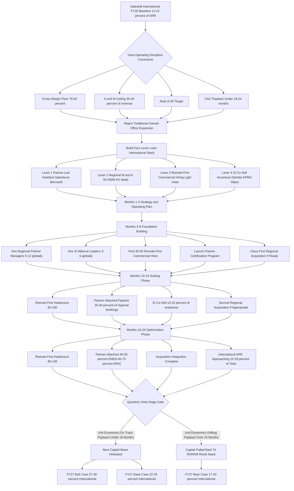
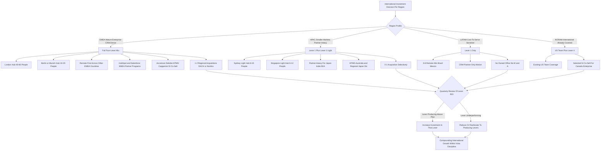

**TL;DR:** Salesloft -- the sales-engagement platform Vista Equity Partners took private in late 2021 for roughly $2.3B and now runs as a portfolio company under Vista's famously rigorous cost discipline -- can grow international revenue from the **12-15% of total ARR** it sits at today to **24-30% by FY27** without breaching Vista's operating model, and it can do so by deliberately swapping the traditional "open an EMEA office, hire 60 people, sign a five-year lease in Shoreditch" expansion playbook for a **four-lever lean-international stack**: (1) **partner-led motion** that rides the HubSpot, Salesforce, and Microsoft Dynamics ecosystems instead of building owned offices in every metro, (2) **disciplined regional M&A** in the $50-300M EV range to acquire local sales-engagement and conversation-intelligence players that come with installed customer bases and pre-built go-to-market in EMEA and APAC, (3) **remote-first commercial hiring** of 80-130 international AEs, SDRs, and CSMs out of small "light hub" footprints rather than full-floor offices, and (4) **system-integrator and reseller co-sell** with Accenture, Deloitte, KPMG, Wipro, and Infosys plus regional CRM consultancies (Slalom, Bluewolf, OSF Digital, Webhelp Enterprise) that drives **55-70% of new-logo bookings** in non-NORAM regions through partner pipeline. The math: traditional international expansion (owned offices, full local leadership, on-the-ground marketing) typically runs **$80-150M of annual run-rate cost** to add **$60-100M of incremental international ARR over 24 months**, a payback Vista will not approve at the cost-of-capital and rule-of-40 thresholds Vista enforces; the lean stack runs **$30-55M of annual run-rate cost** to add the same **$60-100M of incremental ARR**, which moves the LTV/CAC ratio above 3:1 and the new-business payback under 18 months -- numbers that fit cleanly inside the Vista operating playbook used at Marketo (pre-Adobe), Cvent (pre-Blackstone re-take-private), Datto (pre-Kaseya), Ping Identity, and Mindbody. The three things that wreck international expansion under PE ownership: **(a) building owned offices ahead of pipeline**, which converts variable cost to fixed cost a quarter before revenue arrives; **(b) over-hiring local leadership** -- VP EMEA, MD APAC, country managers -- before the partner motion has produced enough deal volume to justify the layer; and **(c) treating M&A as growth instead of as efficient customer acquisition**, which leads to overpaying for revenue that does not synergize. Net: international growth at Salesloft under Vista is genuinely achievable, but only if the leadership team treats the international P&L as a **partner-leveraged, M&A-augmented, remote-first commercial machine** -- not as a recreation of the pre-PE Salesloft expansion blueprint where every region got an owned office and a full local org.

## What Salesloft Is And Why The International Question Matters In 2027

Salesloft is the sales-engagement category leader -- a SaaS platform that sales teams use to sequence outbound and follow-up communications across email, phone, LinkedIn, and SMS, paired with conversation intelligence (the recorded-call analytics layer originally pioneered by Gong and Chorus) after Salesloft's 2020 acquisition of Costello and its 2024 expansion into AI-driven deal coaching. The company sits in the same competitive set as Outreach (its largest direct competitor), Apollo.io (the bottom-up product-led-growth disruptor that has been eating share at the SMB and mid-market end), Gong (which moved upmarket from conversation intelligence into a broader revenue platform), Clari (the forecasting and revenue-intelligence layer that increasingly overlaps), and HubSpot Sales Hub plus Salesforce Sales Cloud (the CRM-anchored alternatives that bundle sales-engagement features for free or near-free). Vista Equity Partners acquired Salesloft in November 2021 in a transaction widely reported around $2.3B enterprise value, taking the company private at what was, in retrospect, near the top of the 2020-2021 SaaS valuation cycle. That acquisition matters for the international question because Vista is not a hands-off owner: Vista's operating model -- the "Vista Standard Operating Procedures" applied across the portfolio with the discipline of a manufacturing playbook -- enforces specific gross-margin floors, sales-and-marketing-as-percent-of-revenue ceilings, rule-of-40 trajectories, and ROIC thresholds on every major investment decision, including international expansion. The 2027 question is no longer "should Salesloft be international?" -- it already is, with a London EMEA office and customers across roughly 100 countries -- it is "how does Salesloft credibly grow international from the 12-15% of total ARR it sits at today to the 25-30% range that the comparable Vista playbook (Marketo, Cvent, Datto, Mindbody, Ping Identity) actually achieved, while staying inside Vista's cost-discipline guardrails and without rebuilding the high-burn international footprint that PE owners specifically un-build when they take a public SaaS company private?" That is the operating question, and the four-lever lean-international stack is the answer the math actually supports.

## What Vista Cost Discipline Actually Means In Practice

Founders and operators outside the PE world often hear "Vista cost-cutting" and imagine indiscriminate layoffs and gutted product investment, which misreads what Vista actually does. Vista's operating discipline is a structured set of constraints that get applied to every portfolio company within the first 60-180 days post-close, and they shape every subsequent investment decision -- including international expansion -- for the entire hold period. The relevant constraints for Salesloft's international question are roughly: **gross margin floor** in the 78-82% range for SaaS, which forces every international cost to be evaluated against its contribution to gross profit not just to revenue; **sales-and-marketing-as-percent-of-revenue ceiling** typically pulled into the 35-45% range over the hold period (down from 50-65% at many pre-PE growth-stage SaaS companies), which forces every international hire and every international office to compete against domestic alternatives for the same dollar of S&M spend; **rule-of-40 target** that combines growth-rate and free-cash-flow margin to land at 40+ over the hold period, which means international investments that do not contribute to either growth or margin within a defined window get killed; **CAC payback period** typically targeted under 18-24 months for new business, which forces international go-to-market to demonstrate near-term unit economics rather than the "we'll figure it out in three years" patience that pre-PE growth companies accept; **headcount-per-million-ARR ratios** that are explicitly benchmarked against the rest of the Vista portfolio and against public-company comparables, which prevents the kind of "we need a country manager and a marketing lead and an SE and a CSM in every region" build-out that public growth-stage SaaS companies routinely do; and **structured stage-gates on capex and major opex commitments** that force any office lease over a certain size, any international acquisition, and any major hiring plan through a portfolio-level review where the deal partner and the Vista operating team both have to sign off. None of these guardrails make international growth impossible; they make traditional, owned-office, full-local-org international growth uneconomic at the scale a portfolio company can defend. The lean-international stack exists precisely because it routes around each of these specific constraints while still delivering the international ARR growth Vista's exit math depends on.

## The Salesloft Specific Starting Point: What The International P&L Actually Looks Like

Before designing the lean-international stack, an honest look at where Salesloft is today is necessary. Salesloft's international revenue, based on triangulating publicly reported employee distribution, the EMEA office in London, the customer-region breakdowns the company has shared at events, and standard SaaS distribution at Salesloft's scale, sits in the **$70-110M ARR range out of a roughly $550-720M total ARR** -- which puts international at the **12-16% of total** range. The geographic split inside that international number is heavily EMEA-weighted: roughly **60-70% EMEA** (UK, Germany, France, Netherlands, Nordics being the dense customer concentrations), **15-25% APAC** (Australia and Singapore being the meaningful spend pockets, with Japan structurally underpenetrated for sales-engagement category reasons including language-and-workflow differences), and **5-15% LATAM and rest-of-world** (Brazil and Mexico the meaningful pockets). The international cost structure today already looks lean by pre-PE standards: a London office of roughly 40-80 people handling EMEA sales, marketing, customer success, and partner functions; smaller APAC presences in Sydney and Singapore that lean partner-heavy; and remote distributed customer-facing roles across additional countries. The international gross margin is roughly in line with the corporate average (sales-engagement software does not have geographically variable cost-of-goods at meaningful scale), and the international S&M-as-percent-of-international-revenue is somewhat elevated versus NORAM (typical of any region in build mode), running in the 45-55% range against NORAM's 35-45%. The honest read: Salesloft has a real international beachhead, EMEA is materially productive, APAC is real but smaller, LATAM is partner-only, and the ratio has room to grow without rebuilding the whole regional cost base -- which is exactly the configuration that makes the four-lever lean-international stack the right play, not a Salesforce-style "one MD per country plus a regional HQ" build-out that would not survive a Vista quarterly review.

## Lever One: Partner-Led Motion Through The HubSpot, Salesforce, And Microsoft Ecosystems

The single highest-ROI international lever Salesloft has -- and the one most Vista-aligned -- is leaning hard on the partner ecosystems of the three CRM platforms that Salesloft sits adjacent to: HubSpot (where Salesloft is a deeply integrated sales-engagement layer and where HubSpot's mid-market expansion in EMEA and APAC creates genuine pull), Salesforce (the dominant enterprise CRM where Salesloft has deep AppExchange integration and where Salesforce's 5,000+ global SI partners can attach Salesloft into their delivery), and Microsoft Dynamics (where Salesloft is less embedded historically but where Microsoft's enterprise install base in EMEA, especially Germany, France, and Nordics, is meaningful). The mechanic is straightforward: instead of Salesloft hiring a full-funnel direct-sales motion in every European country, Salesloft co-sells with the partners those CRM platforms have already enabled in those countries. HubSpot's solutions-partner ecosystem includes 200-plus EMEA partners and 100-plus APAC partners, many of which are sales-operations and revenue-operations consultancies that already implement HubSpot for their clients and can attach Salesloft as the sales-engagement layer. Salesforce's partner ecosystem includes 5,000+ global consulting partners with regional concentrations that Salesloft can ride into countries it has no direct presence in (Spain, Italy, Poland, Israel, Korea, India). Microsoft's Dynamics partners give Salesloft an entry into German-speaking enterprise that pure Salesforce-attached motion would miss. The economics are decisively favorable to this approach: a partner-driven new logo in a country Salesloft has no office in carries a customer-acquisition cost roughly **40-60% lower** than a direct-sold new logo would because the partner is doing first-line discovery, technical fit, and often deployment -- Salesloft pays a referral fee or revenue-share (typically 15-25%) but skips the full direct-sales overhead. The realistic 2027 contribution: **40-55% of EMEA new-logo bookings and 60-75% of APAC new-logo bookings flowing through partner-attached pipeline**, which materially lifts the international growth rate without proportional headcount additions. The execution requirement is not light: Salesloft has to invest in formal partner-program infrastructure, a partner certification track (with $500-2,500 per certification revenue and, more importantly, trained partner consultants who can sell and deploy), regional partner managers (5-12 of them globally, not 50), partner-led demand generation co-marketing budget, and clean rules-of-engagement so the direct sales team does not collide with the partner channel. Done well, partner-led is the largest single contributor to lean international growth.

## Lever Two: Disciplined Regional M&A In The $50-300M EV Range

The second lever is regional M&A -- using Vista's M&A capacity to buy local sales-engagement, conversation-intelligence, and revenue-tooling players that come pre-loaded with installed customers, regional brand recognition, and on-the-ground go-to-market that would take Salesloft 18-36 months and $40-80M to build organically. The targets are not the marquee public-comp competitors (Outreach is roughly Salesloft's size; Gong is larger and at a different price point; Apollo is privately held at high valuation); the targets are the **regional category players in the $30-200M ARR range** that operate strongly in one or two regions and have not built global presence. In EMEA, plausible target archetypes include sales-engagement and conversation-intelligence players with European headquarters and EMEA-concentrated installed bases (the German conversation-intelligence and SDR-tooling space, the UK and Nordics sales-engagement adjacent tooling, the French revenue-operations tooling layer); in APAC, targets cluster around Sydney-and-Singapore-headquartered sales-engagement adjacencies and Japan-specific workflow tools that would otherwise be impossible for a US-headquartered company to credibly enter. The M&A budget Vista will entertain for a portfolio company at Salesloft's scale runs in the **$200-500M total range across the hold period**, with individual transactions typically capped at $50-300M EV -- big enough to be meaningful, small enough to avoid the integration risk that scuttles large deals. The Vista-aligned M&A discipline is specific: **acquire revenue at a multiple lower than Salesloft's own implied multiple** (so the deal is accretive on the LTV/CAC math); **prioritize installed-customer-base value over technology that overlaps with Salesloft's existing stack** (the customers and the contracts are the asset, not the duplicate features); **use earn-outs and stock-based retention to keep the founders and key sales leaders 24-36 months post-close** (because the regional GTM expertise is the second asset); and **integrate go-to-market fast (6-12 months) but consolidate product slowly (18-36 months)** so the customer base does not experience sudden disruption. Real comparable patterns: Datto under Vista did exactly this with regional MSP-tooling acquisitions across EMEA and ANZ; Ping Identity under Vista bundled regional identity-and-access players; Mindbody used regional fitness-software acquisitions to enter ANZ and parts of EMEA. Done with discipline, $200-500M of regional M&A across the hold period adds **$80-180M of incremental international ARR** at a per-dollar-of-ARR cost meaningfully better than building it organically.

## Lever Three: Remote-First Commercial Hiring And Light Hub Footprints

The third lever attacks the single largest cost line in traditional international expansion: real estate plus the full local org structure that real estate implies. The traditional motion -- open a London headquarters with 80-150 desks, a Munich office with 30-50 desks, a Paris office, a Sydney office, a Singapore office, a Tokyo office, each with its own MD, marketing lead, RVP, AEs, SEs, CSMs, support, and admin -- runs $80-150M annually at scale and locks in fixed costs that cannot flex with bookings. The lean alternative: **light hubs of 5-15 people in 4-6 cities** (London, Berlin or Munich, Sydney, Singapore for sure; Paris and Tokyo as later additions) for the small set of roles that genuinely require physical presence (in-person enterprise selling, executive office for client meetings, regional marketing and event hub), combined with **remote-first hiring of 80-130 commercial roles** (AEs, SDRs, CSMs, partner managers, marketing) distributed across the countries Salesloft is serving, working from home offices and traveling to the light hubs and to client sites as needed. The cost arithmetic is decisively favorable: light-hub real estate runs $3-8M annually total versus $25-60M for full owned offices; remote-first commercial headcount loaded at 70-90% of US compensation runs $25-45M annually for 80-130 people versus $50-90M for the same headcount in full-office locations with all the overhead implied; total run-rate cost lands at $30-55M annually for the lean configuration versus $80-150M for the traditional one. The objections to this approach -- and the honest engagements with them -- are real but solvable. **"Remote AEs lack local market knowledge"**: solved by hiring locals into the remote roles and by attaching them to partner ecosystems that bring market context. **"Enterprise selling needs in-person meetings"**: solved by the light hubs plus a real travel budget for the deals that warrant it (which is most enterprise pursuits, but a small minority of total deals). **"You cannot build a regional culture remote"**: partially true and partially overstated -- the regional culture that matters is around customer engagement and partner relationships, not around bonding in a shared office. **"Compensation parity issues across countries"**: real, requires a deliberate global comp framework but very solvable. The Vista alignment on this lever is direct: it converts the largest fixed-cost line in international expansion (real estate plus implied org structure) into a variable, scalable, headcount-led cost that responds to bookings rather than committing ahead of them.

## Lever Four: System Integrator And Reseller Co-Sell

The fourth lever -- and the one most underused by sales-engagement category vendors generally -- is formal co-sell relationships with the global system integrators (Accenture, Deloitte, KPMG, EY, Wipro, Infosys, TCS, Capgemini) and with regional CRM consultancies (Slalom in NORAM, Bluewolf-now-IBM, OSF Digital, OSF Commerce, Cprime, Rightpoint, Webhelp Enterprise, NTT Data Business Solutions). The mechanic is similar to the partner-led CRM-ecosystem motion but operates at a different deal size and with a different buyer. SIs sell to Fortune 500, Global 2000, and large enterprise customers as part of broader CRM-and-revenue-platform engagements where a sales-engagement layer is a natural attach; the SI does the discovery, the architectural fit, the deployment, the change management, and the ongoing services, while Salesloft provides the platform and a co-sell motion that supports the SI through enablement, joint pursuits, and dedicated SI relationship management. The economics are different from CRM-partner economics: deal sizes are larger ($100K-$1M+ ACV in many cases), sales cycles are longer (6-18 months), and the SI typically takes a larger share of the economics (15-30% revenue share or fee structure) -- but the customers acquired through SI co-sell tend to be sticky enterprise accounts with high expansion potential and very low churn, exactly the customer profile a Vista-owned SaaS company most wants to grow. The international application is where the value compounds: SIs have deep regional presence in countries Salesloft has no direct sales motion in (Accenture's German practice, Deloitte's UK and France practices, KPMG's Australia and Japan practices, Wipro and Infosys in India and across Asia, Capgemini in France and Germany), and a properly built SI co-sell motion turns those SI regional teams into Salesloft's de facto enterprise sales force in those geographies. The discipline required: **dedicated SI alliance leaders** (3-6 globally, hired from the SI world so they speak the language), **SI-specific enablement and pursuit support**, **clear rules-of-engagement** to prevent direct-sales collision, **co-developed reference architectures** that make the SI's job easier, and **executive sponsorship** at the Salesloft level because SI relationships are senior-to-senior and have to be cultivated as such. The realistic 2027 contribution: SI co-sell drives **15-30% of enterprise international bookings** in the regions where it is built well, on top of the partner-ecosystem and direct contributions, and it is the single highest-ACV motion of any of the four levers.

## The Region-By-Region Strategic Build

A founder-or-operator-grade analysis has to get specific by region, because the four levers apply in different proportions in each. **EMEA (UK, Germany, France, Nordics, Benelux, Spain, Italy, Israel)** is the largest international region and gets the deepest combination of all four levers: a real London hub of 40-80 people anchoring direct enterprise selling and partner management, a smaller Berlin or Munich light hub of 10-20 anchoring DACH coverage, remote-first AEs and CSMs distributed across France, Nordics, Benelux, Spain, and Israel, deep partner motion through HubSpot's EMEA partner network and Salesforce's EMEA SI partners, SI co-sell with Accenture, Deloitte, KPMG, Capgemini, and the regional system integrators (Sopra Steria, Atos, T-Systems), and one or two regional acquisitions to add installed customer base and product depth. The EMEA target by FY27 is **$140-210M ARR** (up from $50-80M today), representing the bulk of total international growth. **APAC (Australia, Singapore, Japan, India, Korea, Southeast Asia)** is structurally smaller and more partner-leveraged: a Sydney light hub of 8-15 people covering ANZ, a Singapore light hub of 6-12 covering Southeast Asia and as the regional partner-management base, remote-first AEs in Australia and Singapore primarily, deep partner reliance for Japan (the language and workflow-cultural barrier makes direct entry inefficient), partner-only motion for India and Southeast Asia outside Singapore, and a small regional acquisition or two if the right targets emerge. The APAC target by FY27 is **$45-75M ARR** (up from $15-25M today), with the heaviest growth coming from ANZ direct and Japan via partners. **LATAM (Brazil, Mexico, primarily)** stays partner-only with a small remote presence of 3-8 commercial people total -- the regional revenue is real but the cost-to-serve directly does not pencil at Vista discipline thresholds. The LATAM target is **$15-30M ARR** by FY27 (up from $5-15M today). **NORAM-international (Canada and Mexico)** is already well-covered by the US team with light dedicated coverage and stays roughly that way, contributing **$45-65M ARR** by FY27 in the North-of-NORAM and South-of-NORAM bucket.

## The Comparable Vista International Playbook: What Other Portfolio Companies Actually Did

The strongest support for the four-lever lean-international stack is that other Vista portfolio companies have run it and achieved international ratios in the 25-40% range without breaching cost discipline. **Marketo (acquired by Vista in 2016, sold to Adobe in 2018 for $4.75B)** ran a partner-heavy international motion -- Marketo's partner ecosystem was central to its EMEA and APAC growth, and the eventual Adobe acquisition leveraged Adobe's own international footprint as the final layer; international landed in the **22-28% of total revenue** range at sale. **Cvent (acquired by Vista in 2016, taken public 2021, re-take-private by Blackstone 2023)** built international through a combination of partner motion, regional M&A (multiple event-tech and meeting-management acquisitions in EMEA), and direct expansion in select markets; international landed in the **25-30% of total revenue** range. **Datto (acquired by Vista in 2017, sold to Kaseya 2022)** ran perhaps the cleanest comparable, growing international from sub-20% to **35-40% of total** through aggressive regional MSP-tooling M&A in EMEA and ANZ, partner-channel-led GTM, and remote-first sales motion; the Datto international playbook is the closest direct template for what Salesloft can do. **Ping Identity (acquired by Vista in 2016, taken public 2019, re-take-private by Thoma Bravo 2022)** built international through partner motion (identity-and-access has natural SI attach), light regional offices, and selective regional M&A; international hit roughly **30% of total** at peak. **Mindbody (acquired by Vista in 2019)** used the same template adapted for a vertical-SaaS-meets-marketplace model. The pattern is consistent across all five comparables: **partner-led plus disciplined M&A plus light hubs plus remote-first** is the Vista international template, and it has demonstrably worked. Salesloft is not being asked to invent a new playbook; it is being asked to execute one Vista has run multiple times.

## The Honest Cost Discipline Math

The numbers underneath the four-lever stack are what make it work for Vista, and they deserve to be laid out plainly. Traditional international expansion at Salesloft's scale -- the "open offices in eight cities, hire 300 people, sign long real-estate leases, build a full local marketing function in every major country" version -- looks like: **real estate at $25-60M annually** (big offices in expensive cities); **fully loaded international headcount of $80-150M annually for 250-400 people at full-office cost** (compensation, benefits, payroll taxes, the 25-40% loading on top of base comp); **regional marketing budget of $15-30M**; **regional product localization and engineering of $8-15M**; **G&A and admin loading of $10-20M**; total run-rate of **$140-275M annually** to deliver, in a good case, **$80-130M of incremental international ARR over 24 months** -- a payback that runs 24-36 months on the new business and that fails Vista's CAC-payback and rule-of-40 tests. The lean four-lever stack at the same scale of ambition -- **24-30% international by FY27** -- looks like: **light-hub real estate at $3-8M annually**; **fully loaded remote-first commercial headcount of $25-45M annually for 80-130 people**; **partner program investment (partner managers, certifications, partner-led co-marketing) of $4-10M annually**; **SI alliance investment of $3-6M annually**; **regional marketing of $6-12M (smaller because partner co-marketing carries half)**; **M&A integration cost of $5-12M annually amortized over the hold period**; total run-rate of **$45-95M annually** to deliver the same **$80-130M of incremental international ARR over 24 months**, plus the additional ARR layer added by the M&A itself -- a payback that runs 14-22 months and a configuration that passes Vista's CAC-payback, rule-of-40, and S&M-as-percent-of-revenue tests with room to spare. The savings are not small ($90-180M annually in run-rate), and they are precisely the savings that convert "international growth" from a Vista no to a Vista yes.

## Why Salesloft Specifically Can Run This Stack Better Than Most

A founder might reasonably ask "if this lean-international stack is so obviously right, why doesn't every PE-owned SaaS company do it?" -- and the honest answer is that Salesloft has specific structural advantages that make the stack particularly executable for them. **First, the CRM-adjacency advantage**: Salesloft's product sits on top of HubSpot, Salesforce, and Microsoft Dynamics, which are the three largest CRM ecosystems globally; the partner channels of those three ecosystems are deeper and more mature than the partner channels of any other relevant ecosystem; Salesloft can ride them in a way that, say, a horizontal collaboration tool or a vertical workflow tool cannot. **Second, the conversation-intelligence and AI layer**: Salesloft's expansion into AI-driven coaching and conversation intelligence creates natural attach to SI engagements (Accenture, Deloitte, and the regional SIs are increasingly building practices around AI-augmented sales transformation, and Salesloft fits cleanly into those engagements as the platform layer). **Third, the international beachhead already exists**: Salesloft is not starting from zero in EMEA -- the London office, the EMEA customer base, and the partner relationships already in place mean the lean stack is an extension of an existing motion, not a from-scratch build. **Fourth, the category fit for partner motion**: sales-engagement is a category that benefits enormously from partner-led implementation (the deployment work of building sequences, training reps, integrating with CRM, and operationalizing the motion is exactly what SI and CRM-partner consultancies do well); pure self-serve SaaS categories cannot use partners the same way. **Fifth, the Vista institutional knowledge**: Vista has run this exact playbook at Marketo, Cvent, Datto, Ping, and Mindbody, which means the Salesloft team has access to a pattern library and a set of operating-team experts who have done this before. Combined, these structural advantages mean Salesloft is not just a candidate for the lean-international stack -- it is one of the better-positioned PE-owned SaaS companies of its generation to actually execute it.

## The Counter-Pressures: What Could Make This Hard

The four-lever stack is the right strategy but it is not easy, and a serious operator must be honest about the counter-pressures that can erode it. **The Outreach competitive overhang**: Outreach is Salesloft's largest direct competitor, is also private, is also under investor pressure, and is running its own international playbook; if Outreach moves first in a region or wins a partnership Salesloft wanted, the partner-led motion can lose its primary asset. **The Apollo PLG threat at the bottom**: Apollo's product-led-growth model brings users in self-serve at the SMB and mid-market level, which over time pulls international SMB and mid-market customers away from the assisted-sale motion Salesloft and Outreach run; the international markets where SMB and mid-market are large segments (much of EMEA, APAC SMB) are particularly exposed. **The HubSpot direct-competition risk**: HubSpot's Sales Hub continues to expand, and in some HubSpot-customer segments the bundled HubSpot motion replaces the need for a separate sales-engagement layer; the partner-led motion that depends on HubSpot is therefore partially in tension with HubSpot's own roadmap. **The Salesforce direct-competition risk** is similar -- Salesforce's continued expansion into sales-engagement features and the increasing power of Salesforce-native tooling can erode the standalone-platform value Salesloft sells. **The integration risk from M&A**: regional acquisitions look good on paper but consistently underperform when the integration is mishandled (engineering integration runs long, customer churn spikes, the founders leave too soon); a portfolio of two or three regional acquisitions all integrating at once is a real operational stress. **The remote-first execution risk**: remote AEs and partner managers can underperform if hiring quality is uneven, if enablement is weak, or if the culture and accountability fail to translate over distance; this is the most "execution rather than strategy" risk in the stack. **The Vista exit-timeline pressure**: Vista typically holds portfolio companies 4-7 years; if Salesloft's exit window is approaching, the international investment that takes 18-30 months to mature may not deliver inside the exit window, which can pull capital toward shorter-payback bets. **The macro risk**: a global enterprise-SaaS spending slowdown reduces the size of the international opportunity in absolute terms, even if Salesloft executes perfectly. None of these risks individually defeat the strategy; together they mean the four-lever stack must be executed with discipline, sequenced deliberately, and stress-tested quarterly against actual booking and pipeline data, not just plan numbers.

## What Salesloft Should Stop Doing Internationally

Equally important to what Salesloft should do is what Salesloft should explicitly stop doing or never start doing internationally, because the cost-discipline math depends as much on saying no as on saying yes. **Stop the country-manager-everywhere instinct**: pre-PE growth-stage SaaS companies routinely hired a country MD, a regional VP, and a marketing leader in every major country before pipeline justified the layer; Salesloft under Vista should explicitly reject this pattern and instead use a small set of regional leaders covering multi-country regions, with country-specific commercial leadership only where pipeline volume materially supports it. **Stop owned-office expansion past the light-hub footprint**: every additional full-floor office is a permanent cost commitment that reduces flexibility, and the marginal sales productivity gain from a bigger office over a light hub plus remote-first is small. **Stop building regional product variants without partner co-funding**: localized product builds (deep regional integrations, locally hosted data, region-specific UI) eat engineering capacity that has alternative use; if a regional partner or customer will not co-fund the build, the localization is probably not the right investment. **Stop SI relationships that have not produced pipeline in 12 months**: the SI motion is high-leverage when it works and dead weight when it does not; the discipline is to invest meaningfully in 6-12 SI relationships globally that are demonstrably producing, not to maintain 30 SI relationships that all produce nothing. **Stop discounting to win regional logo plays at low ACVs**: the temptation to "buy" the first 20 customers in a new country at 50% list to seed the market produces a permanent pricing comparable problem that is very hard to unwind; better to win fewer logos at proper price than many at discount. **Stop standalone regional marketing programs that do not amplify partner co-marketing**: regional marketing dollars are most efficient when they are leveraged through partner co-marketing motions; standalone regional events and brand campaigns that do not pull partner amplification underperform on cost-per-pipeline-dollar. The discipline is to be deliberate about both sides of the equation -- what to invest in and what to refuse to invest in -- because in a Vista portfolio company the cost of doing the wrong thing is not just the wasted dollars; it is the displacement of the right thing.

## The Sequencing: A Realistic 24-Month Build Plan

The four-lever stack does not get built all at once, and an honest 24-month sequencing plan is what makes it executable. **Months 1-3** are the design and operating-plan phase: lock the four-lever strategy, define the FY27 international targets by region, build the cost model that fits inside Vista's discipline, identify the first wave of M&A targets (3-6 candidates with serious diligence), define the partner-program operating model, scope the SI alliance build, and identify the first 30-50 remote-first hires by region. **Months 4-9** are the foundation-building phase: hire the regional partner managers, hire the SI alliance leaders, hire the first 30-50 remote-first AEs, SDRs, and CSMs, launch the formal partner certification program, sign the first 3-6 strategic SI agreements, and close the first regional acquisition if a target is ready. **Months 10-15** are the scaling phase: expand remote-first commercial headcount to 60-100, expand partner-attached pipeline contribution to 25-40% of regional bookings, deepen the SI co-sell motion to 10-20% of enterprise international bookings, close a second regional acquisition if appropriate, and start to see meaningful international ARR growth in the quarterly numbers. **Months 16-24** are the optimization phase: tune the configuration based on what is working (some regions will outperform, some will lag), add or trim light-hub footprints, add remote-first headcount to 80-130 total, complete the integration of the acquisitions, deepen the partner motion to 40-55% of EMEA bookings and 60-75% of APAC, and demonstrate the international ARR ratio approaching 22-28% of total. The sequencing matters because **if the partner motion and SI motion are not built first, the remote-first commercial hiring becomes a direct-sales motion competing without partner leverage** and the unit economics get much worse; and **if the M&A is rushed, integration risk can swamp the rest of the stack**. The right cadence is partner first, SI second, remote-first hiring in parallel and accelerating as partner pipeline fills, M&A added in two carefully staged transactions across the 24 months. A founder running this build should expect quarterly stage-gates with the Vista operating team and should over-communicate progress on the unit-economics metrics that Vista is tracking, because international investment that is delivering against unit-economics targets gets the next wave of capital, and international investment that drifts gets capital pulled back to NORAM.

## The Comparable Public Comp Math: How Outreach, Apollo, And Gong Position Internationally

A useful sanity check on the four-lever strategy is to look at how Salesloft's direct competitive set has approached international, because the competitive context shapes which levers Salesloft has the most differentiated edge on. **Outreach** (private, Series G in 2021 valued ~$4.4B, current state of company widely viewed as more constrained post-2022) has a more direct-led international motion historically with offices in London and a smaller APAC presence; recent posture has trended toward leaner international as the company has rationalized cost. Outreach is therefore a comparable rather than a competitive moat -- whatever Salesloft does with the partner-led stack, Outreach can do as well, but neither has executed it to its full potential yet, which means there is genuine first-mover advantage available. **Apollo.io** (privately held, last reported valuations at ~$1.6B+ Series D, growing rapidly, particularly internationally because the PLG product motion travels well) has a fundamentally different distribution model -- self-serve product-led growth with an inside-sales motion layered on top -- and Apollo's international growth comes "for free" through the product, which is the long-term competitive overhang Salesloft must address. The four-lever stack does not directly compete with Apollo's PLG motion; it competes for the mid-market and enterprise segments that Apollo is moving up into. **Gong** (private, last priced at ~$7.25B in 2021) plays primarily in conversation intelligence with a broader revenue-platform play; Gong's international motion has been more direct-led with significant EMEA presence and growing APAC; Gong is an interesting comparable but operates at a different price point and segment mix. **HubSpot Sales Hub and Salesforce Sales Cloud** are the bundled-CRM alternatives whose international motions are massive and not directly comparable; the partner-led lever literally rides on top of their distribution. The honest read of the competitive comp: Salesloft's lean-international stack is a viable strategy that no direct competitor has perfected; the window to execute it cleanly is 18-30 months before the competitive set converges on the same playbook, and that window is exactly the cadence on which Vista's exit math operates.

## What Success Looks Like By FY27 (Bull, Base, And Bear Cases)

A founder running this should be honest about the range of outcomes the four-lever stack can produce, because Vista will model bull, base, and bear and will hold the team accountable to a range, not a single point. **The bull case for FY27**: international revenue at **27-30% of total ARR**, total ARR landed at $850M-$1.05B, international ARR at $230-310M, with EMEA at $145-200M, APAC at $55-80M, LATAM at $20-30M, NORAM-international at $50-70M; partner-attached pipeline running 50-70% of international new logos depending on region; SI co-sell driving 18-28% of enterprise international bookings; two completed regional acquisitions integrated and contributing $50-100M of the international ARR; total international S&M run-rate landed at $70-100M; international CAC payback under 18 months. **The base case for FY27**: international revenue at **22-25% of total ARR**, total ARR landed at $760M-$910M, international ARR at $170-225M, with EMEA at $110-150M, APAC at $35-55M, LATAM at $12-20M, NORAM-international at $40-55M; partner-attached pipeline running 35-55% of international new logos; SI co-sell driving 12-20% of enterprise international bookings; one to two regional acquisitions; international S&M run-rate at $50-80M; international CAC payback in the 18-24 month range. **The bear case for FY27**: international revenue at **17-20% of total ARR**, total ARR landed at $700M-$830M, international ARR at $120-165M, partner motion underperforming, SI motion underperforming, M&A delayed or absent, international S&M run-rate at $40-65M, international CAC payback over 24 months and Vista pulling capital back toward NORAM. The strategic point is that the bull case is achievable if execution holds, the base case is the realistic target, and the bear case is what happens if the stack is built without discipline -- and Vista will manage the team to the base case while structuring incentives toward the bull.

## The Honest Owner Lifestyle Inside A Vista Portfolio Company Doing International

For the operator running this -- the Chief Revenue Officer or the head of International or the CEO -- the daily reality of executing the lean-international stack inside a Vista portfolio company is shaped by three rhythms that should be expected from the start. **The Vista operating cadence**: monthly business reviews with the Vista operating team, quarterly board reviews with the deal partner and the operating partners, semiannual deep dives on international specifically, and the constant comparison to other Vista portfolio companies' performance on the same metrics. The cadence is rigorous, the questions are sharp, and the accountability is direct -- which is why the unit-economics discipline matters so much, because the operator who shows up to the quarterly review with international CAC payback at 16 months and partner-attached pipeline at 45% gets the next wave of capital; the operator who shows up with payback at 28 months and unclear partner contribution gets capital pulled. **The travel reality**: international leadership roles inside a Vista-portfolio SaaS company doing the lean stack involve meaningful travel -- to the light hubs to maintain culture and accountability, to SI senior partners for executive sponsorship, to the largest regional acquisition targets for diligence and integration, to key customer accounts for in-person enterprise pursuits. It is not as travel-heavy as the traditional country-manager-everywhere model (because the org is leaner) but it is not a remote-comfortable role. **The metrics-driven mindset**: every decision -- which partner to invest in, which SI to deepen with, which region to acquire in, which remote-first hires to make in which country -- gets evaluated against a clear set of unit-economics metrics, and the operator who internalizes that evaluation framework moves faster and earns more capital than the operator who pushes back on the metrics regime. The trade-off is that the daily texture is more "operating-discipline-and-Vista-rhythm" than the founder-led pre-PE texture some operators are used to; but the upside is that done well, the operator running international successfully inside a Vista portfolio company is building a credential that compounds across the next portfolio role.

## A Markdown Table -- The Four-Lever Cost And Revenue Math

| Lever | Annual run-rate cost | Incremental ARR contribution by FY27 | CAC payback | Vista approval profile |
|---|---|---|---|---|
| 1. Partner-led motion (HubSpot, Salesforce, Microsoft) | $4-10M | $50-90M | 12-18 months | Strong yes |
| 2. Regional M&A ($50-300M EV per deal) | $200-500M total across hold; $5-12M annual integration cost | $80-180M (acquired ARR + organic lift) | Effective payback through deal accretion | Yes if accretive |
| 3. Remote-first commercial hiring (80-130 people, light hubs) | $30-55M | $50-90M | 14-22 months | Yes vs traditional offices |
| 4. SI co-sell (Accenture, Deloitte, KPMG, Wipro, regional SIs) | $3-6M | $30-70M (concentrated in enterprise ACVs) | 18-24 months on long-cycle deals | Strong yes (high ACV) |
| Combined four-lever stack (FY27) | $45-95M annual run-rate (excluding M&A capital) | $190-310M total international ARR contribution | Blended 16-22 months | Vista-aligned |
| Comparison: traditional owned-office expansion | $140-275M annual run-rate | $80-130M | 24-36 months | Vista likely no |

## A Markdown Table -- Region-By-Region FY27 Targets And Lever Mix

| Region | FY26 ARR | FY27 ARR target | Lever 1 partner | Lever 2 M&A | Lever 3 remote-first | Lever 4 SI co-sell | Light hub presence |
|---|---|---|---|---|---|---|---|
| EMEA (UK, DACH, France, Nordics, Benelux, Iberia, Italy, Israel) | $50-80M | $140-210M | 40-55% of new logos | 1-2 acquisitions | 50-80 remote AEs/CSMs | 18-28% of enterprise | London 40-80, Berlin 10-20 |
| APAC (ANZ, Singapore, Japan, Korea, India, SEA) | $15-25M | $45-75M | 60-75% of new logos | 0-1 acquisition | 20-35 remote AEs/CSMs | 12-20% of enterprise | Sydney 8-15, Singapore 6-12 |
| LATAM (Brazil, Mexico, Colombia, Argentina) | $5-15M | $15-30M | 80-90% of new logos | None planned | 3-8 remote AEs | <10% | None planned |
| NORAM-international (Canada, Mexico) | $25-35M | $45-65M | 30-45% of new logos | None planned | Existing US team coverage | 15-25% | None planned |
| Total international | $95-155M | $245-380M | 45-65% blended | $200-500M total M&A capital | 75-130 remote-first headcount | 15-25% blended | 2 anchor + 2-4 light |

## A Markdown Table -- Comparable Vista Portfolio International Outcomes

| Vista portfolio company | Acquisition year | Hold period | International % at acquisition | International % at exit/peak | Primary levers used | Exit outcome |
|---|---|---|---|---|---|---|
| Marketo | 2016 | 2 years | ~20% | 22-28% | Partner-led, light direct, Adobe acquisition leveraged | Adobe $4.75B (2018) |
| Cvent | 2016 | Public 2021, re-private 2023 | ~22% | 25-30% | Partner-led, regional M&A in event-tech, direct in select markets | Blackstone re-take-private |
| Datto | 2017 | 5 years | <20% | 35-40% | Aggressive regional MSP M&A, partner-channel-led, remote-first | Kaseya $6.2B (2022) |
| Ping Identity | 2016 | Public 2019, re-private 2022 | ~22% | ~30% | Partner-led with SI motion, light regional offices, selective M&A | Thoma Bravo $2.8B (2022) |
| Mindbody | 2019 | Held | ~15% | 20-25% | Vertical SaaS regional M&A, partner-led, ANZ direct | Held in portfolio |
| Salesloft (target by FY27) | 2021 | In hold | ~12-15% | 24-30% target | Four-lever lean stack | Future exit |

## The Operating Journey: Building The Four-Lever Lean-International Stack Inside Vista Discipline

## The Decision Matrix: Which International Lever Carries Each Region

## Sources

1. **Salesloft Company Information and Investor Resources** -- Official Salesloft positioning, customer counts, and product information. https://www.salesloft.com/about
2. **Salesloft and Vista Equity Partners Acquisition Announcement (November 2021)** -- Press release detailing the take-private transaction widely reported around $2.3B EV. https://news.salesloft.com/news-releases/news-release-details/salesloft-vista-equity-acquisition
3. **Vista Equity Partners Operating Model Overview** -- Public materials on Vista's Standard Operating Procedures and portfolio approach. https://www.vistaequitypartners.com
4. **Bessemer Venture Partners State of the Cloud Report (2026)** -- Annual benchmarks for SaaS growth, gross margin, S&M efficiency, and rule-of-40. https://www.bvp.com/atlas/state-of-the-cloud
5. **OpenView Partners SaaS Benchmarks Report** -- Annual SaaS-operating-metric benchmarks including international revenue ratios by stage. https://openviewpartners.com/saas-benchmarks/
6. **ICONIQ Capital State of SaaS Report** -- Periodic deep dives on SaaS company financial structure including international expansion patterns. https://www.iconiqcapital.com/insights/state-of-saas
7. **Gartner Magic Quadrant for Sales Engagement Platforms** -- Category positioning of Salesloft, Outreach, and adjacent vendors. https://www.gartner.com/en/sales/research
8. **Forrester Wave Sales Engagement Platforms** -- Independent category evaluation. https://www.forrester.com
9. **Salesloft Blog -- Product, Customer, And Industry Content** -- Salesloft's owned content covering product evolution, customer wins, and industry positioning. https://www.salesloft.com/blog
10. **Outreach.io Company Information** -- Salesloft's largest direct competitor; positioning and reported financials. https://www.outreach.io
11. **Apollo.io Company Information And Funding History** -- The product-led-growth competitor; Series D and growth metrics. https://www.apollo.io
12. **Gong Company Information And Funding History** -- Adjacent revenue-platform competitor; 2021 valuation reference. https://www.gong.io
13. **HubSpot Solutions Partner Program Documentation** -- HubSpot's global partner ecosystem, including EMEA and APAC partner counts and structure. https://www.hubspot.com/partners
14. **Salesforce AppExchange and Consulting Partner Program** -- Salesforce's global SI partner ecosystem documentation. https://www.salesforce.com/partners
15. **Microsoft Dynamics 365 Partner Network** -- Microsoft's CRM partner ecosystem documentation. https://partner.microsoft.com
16. **Accenture Salesforce And SaaS Practice Materials** -- Accenture's enterprise revenue-transformation practice positioning. https://www.accenture.com
17. **Deloitte Digital Salesforce And CRM Practice Materials** -- Deloitte's relevant SI practice positioning. https://www.deloitte.com
18. **KPMG Customer Advisory Practice Materials** -- KPMG's CRM and revenue-platform consulting practice. https://kpmg.com
19. **Wipro And Infosys Salesforce Practice Materials** -- Indian-headquartered SI practices with global enterprise reach. https://www.wipro.com
20. **Marketo Pre-Adobe-Acquisition International Disclosures (Vista Hold Period)** -- Public references to Marketo's international revenue ratio before the Adobe transaction. https://www.adobe.com/news
21. **Cvent Public Filings (2021 IPO Period)** -- Cvent's S-1 and subsequent public disclosures including international revenue mix during the Vista hold and post-IPO period. https://investors.cvent.com
22. **Datto Public Filings And Kaseya Acquisition Materials (2022)** -- Datto's international revenue ratio at the time of the Kaseya acquisition. https://www.datto.com/news
23. **Ping Identity Public Filings And Thoma Bravo Re-Take-Private (2022)** -- Ping Identity's international ratio across its public-and-private cycle. https://www.pingidentity.com
24. **Mindbody Vista Acquisition And Subsequent Materials** -- Mindbody's vertical SaaS international expansion under Vista. https://www.mindbodyonline.com
25. **PitchBook Private Company And Funding Database** -- Reference for SaaS private-company valuations, funding rounds, and M&A transactions. https://pitchbook.com
26. **Crunchbase Funding And Acquisition Database** -- Reference for sales-engagement and adjacent-category funding rounds and acquisitions. https://www.crunchbase.com
27. **CB Insights Tech Market Intelligence** -- Reference for SaaS and revenue-tooling market analysis. https://www.cbinsights.com
28. **451 Research / S&P Global Market Intelligence Reports** -- Industry analyst coverage of sales-engagement and conversation-intelligence categories. https://www.spglobal.com/marketintelligence
29. **G2 Sales Engagement Category Page** -- User-review-based competitive landscape data. https://www.g2.com/categories/sales-engagement
30. **TrustRadius Sales Engagement Category Page** -- User-review-based competitive data. https://www.trustradius.com
31. **Software Equity Group SaaS M&A Reports** -- Reference for SaaS M&A multiples and transaction structures. https://softwareequity.com
32. **Houlihan Lokey Software Sector M&A Reports** -- Reference for software M&A activity and valuations. https://www.hl.com
33. **William Blair Software Sector Reports** -- Equity research on software M&A and growth metrics. https://www.williamblair.com
34. **Battery Ventures Cloud Software Reports** -- Periodic cloud-software market analyses. https://www.battery.com
35. **a16z SaaS Metrics And Operating Frameworks** -- Andreessen Horowitz's published SaaS operating frameworks including unit economics and international expansion. https://a16z.com/category/enterprise/

## Numbers

**Salesloft Baseline (FY26)**
- Reported acquisition price by Vista (Nov 2021): ~$2.3B EV
- Estimated total ARR FY26: $550-720M
- Estimated international ARR FY26: $70-110M (12-16% of total)
- EMEA share of international: 60-70% ($50-80M)
- APAC share of international: 15-25% ($15-25M)
- LATAM share of international: 5-15% ($5-15M)
- NORAM-international (Canada, Mexico): $25-35M
- International gross margin: in line with corporate (~78-82%)
- International S&M as percent of international revenue: 45-55% (vs NORAM 35-45%)

**Vista Operating Discipline Targets**
- Gross margin floor: 78-82%
- S&M as percent of revenue ceiling: 35-45% (down from 50-65% pre-PE)
- Rule of 40 target: 40+ over hold period
- CAC payback period target: under 18-24 months
- Headcount-per-million-ARR benchmarked against portfolio and public comps
- M&A capacity per portfolio company at Salesloft scale: $200-500M total across hold; $50-300M per deal

**The Four-Lever Cost Math (Annual Run-Rate)**
- Lever 1 partner-led motion: $4-10M (partner managers, certifications, co-marketing)
- Lever 2 M&A integration cost (annualized): $5-12M (plus M&A capital deployed)
- Lever 3 remote-first commercial hiring: $25-45M (80-130 people; light hub real estate $3-8M)
- Lever 4 SI co-sell motion: $3-6M (alliance leaders, enablement, pursuit support)
- Regional marketing (smaller because partner co-marketing carries half): $6-12M
- Total lean four-lever run-rate: $45-95M annually (excluding M&A capital deployed)

**Traditional Expansion Comparison (What Vista Says No To)**
- Real estate (full owned offices in 6-8 cities): $25-60M annually
- Fully loaded international headcount (250-400 people in offices): $80-150M annually
- Regional marketing: $15-30M
- Regional product localization: $8-15M
- G&A loading: $10-20M
- Total traditional run-rate: $140-275M annually
- Incremental international ARR delivered over 24 months: $80-130M (worse than lean stack)

**Lever-Level Revenue Contribution By FY27**
- Lever 1 partner-led: $50-90M incremental ARR
- Lever 2 M&A: $80-180M ARR (acquired plus organic lift)
- Lever 3 remote-first commercial: $50-90M incremental ARR
- Lever 4 SI co-sell: $30-70M incremental ARR (concentrated in enterprise ACVs)
- Combined four-lever stack: $190-310M total international ARR contribution by FY27

**Region-By-Region FY27 Targets**
- EMEA: $140-210M (vs $50-80M FY26); 40-55% partner-attached; 1-2 acquisitions; 50-80 remote-first headcount; light hubs London 40-80, Berlin 10-20
- APAC: $45-75M (vs $15-25M FY26); 60-75% partner-attached; 0-1 acquisition; 20-35 remote-first headcount; light hubs Sydney 8-15, Singapore 6-12
- LATAM: $15-30M (vs $5-15M FY26); 80-90% partner-only; 3-8 remote AEs; no owned office
- NORAM-international: $45-65M (vs $25-35M FY26); covered by US team plus selective SI co-sell
- Total international: $245-380M (vs $95-155M FY26)

**International ARR Ratio Trajectory**
- FY26 baseline: 12-15% of total ARR
- FY27 bull case: 27-30% of total ARR ($230-310M of $850M-$1.05B)
- FY27 base case: 22-25% of total ARR ($170-225M of $760M-$910M)
- FY27 bear case: 17-20% of total ARR ($120-165M of $700M-$830M)

**CAC Payback By Lever**
- Lever 1 partner-led: 12-18 months (lowest CAC because partner does first-line discovery)
- Lever 2 M&A: effective payback through deal accretion
- Lever 3 remote-first: 14-22 months
- Lever 4 SI co-sell: 18-24 months (long-cycle enterprise deals but high ACV)
- Blended four-lever: 16-22 months (passes Vista test)
- Traditional expansion blended: 24-36 months (fails Vista test)

**Comparable Vista Portfolio International Outcomes**
- Marketo (Vista 2016, Adobe 2018 $4.75B): 22-28% international at exit
- Cvent (Vista 2016, public 2021, Blackstone re-private 2023): 25-30% international
- Datto (Vista 2017, Kaseya 2022 $6.2B): 35-40% international at exit
- Ping Identity (Vista 2016, public 2019, Thoma Bravo 2022 $2.8B): ~30% international
- Mindbody (Vista 2019, held): 20-25% international
- Salesloft FY27 target: 24-30% (in line with the comparable Vista playbook)

**Partner Ecosystem Scale**
- HubSpot solutions partners EMEA: 200+
- HubSpot solutions partners APAC: 100+
- Salesforce consulting partners globally: 5,000+
- Microsoft Dynamics partners globally: large but more concentrated in DACH
- Partner certification revenue per certification: $500-2,500
- Partner referral fee / revenue share: typically 15-25%

**SI Co-Sell Economics**
- Typical deal ACV in SI-led pursuits: $100K-$1M+
- Typical sales cycle in SI-led enterprise pursuits: 6-18 months
- SI revenue share or fee structure: 15-30%
- Number of SI relationships to invest meaningfully in: 6-12 globally
- SI alliance leaders required: 3-6 globally
- SI contribution to enterprise international bookings: 15-30% of regional enterprise

**Sequencing And Stage-Gate Timing**
- Months 1-3: strategy and operating plan
- Months 4-9: foundation building (first hires, partner program launch, first acquisition)
- Months 10-15: scaling (60-100 remote headcount, 25-40% partner-attached pipeline)
- Months 16-24: optimization (80-130 remote headcount, 40-55% partner-attached EMEA, 60-75% APAC)
- Quarterly Vista operating reviews throughout
- Semiannual deep-dives on international specifically

## Counter-Case: Why The Lean-International Stack May Underperform Or Fail

The four-lever stack is the right strategy on the math, but a serious operator must stress-test it against the conditions and execution risks that can erode or break it. Treating it as guaranteed because the comparable Vista portfolio companies executed it would be the same mistake as treating any strategy as guaranteed because of past comparables.

**Counter 1 -- Partner motion depends on partners that can choose other vendors.** The HubSpot and Salesforce partner ecosystems are real, but the partners in those ecosystems can attach Outreach, Apollo, Gong, or other adjacent tools just as easily as they attach Salesloft. If Outreach builds a more attractive partner program, or if HubSpot decides to favor a different sales-engagement layer, or if individual high-producing partners choose a competitor for non-economic reasons, the partner-attached pipeline contribution can drop materially. Salesloft does not own the partners; Salesloft rents their attention, and rent gets renegotiated.

**Counter 2 -- Regional M&A integration consistently underperforms versus plan.** The textbook M&A pitch -- "we acquire $80M ARR for $200M, integrate go-to-market in 9 months, retain 95% of the customer base, retain the founders for 24 months" -- regularly fails on every line in real outcomes. Customer churn spikes during transitions; founders leave earlier than the earn-out implied; product integration runs long and consumes engineering capacity; the cultural integration of an acquired EMEA team into a US-headquartered organization is harder than it looks. A portfolio of two or three regional acquisitions all integrating in parallel is a real operational stress that can swamp the rest of the international agenda.

**Counter 3 -- Remote-first commercial hiring quality is uneven and hard to scale.** The lean stack assumes Salesloft can hire 80-130 high-quality remote-first AEs, SDRs, CSMs, and partner managers across multiple countries with consistent enablement, accountability, and culture. In practice, hiring quality varies meaningfully by region (some markets have abundant SaaS sales talent, others do not), enablement at distance is genuinely harder, and the management overhead of a large distributed team is non-trivial. Remote-first underperformance is a slow leak rather than a sudden failure, but over 18-24 months it can compound to materially miss the international plan.

**Counter 4 -- The SI motion takes longer to produce than the plan assumes.** SI co-sell relationships are real and high-value when they work, but they take 12-24 months to build to material pipeline contribution. The SI partners need to be enabled, the joint-pursuit motions need to be developed, the rules-of-engagement need to be tested, and the senior-to-senior executive sponsorship needs to be cultivated. A plan that assumes SI co-sell driving 15-25% of enterprise international bookings by month 18 is aggressive; the realistic timeline is closer to 24-36 months for that contribution to fully materialize.

**Counter 5 -- The Outreach and Apollo competitive dynamic can compress the available market.** Outreach is a credible direct competitor running its own international playbook; Apollo is a PLG threat that brings users into the category without an assisted-sale motion at all; HubSpot Sales Hub continues to bundle sales-engagement features that erode the standalone value at the SMB and lower mid-market end. The total international opportunity Salesloft can win is smaller than a clean four-lever-stack-only analysis would suggest, because the competitors are also growing internationally and not all of them are running cost-disciplined playbooks (private competitors with patient capital can outspend Salesloft to win specific regional fights).

**Counter 6 -- Vista's exit timeline may not allow international investment to mature.** Vista typically holds portfolio companies 4-7 years; Salesloft was acquired in late 2021, which puts the exit window plausibly in 2026-2028. International investments that take 18-30 months to mature into measurable ARR contribution may not deliver meaningfully inside the exit window, which can pull capital toward shorter-payback NORAM expansion or product investments that move the metrics faster. The strategic logic of international growth and the tactical reality of exit timing can conflict.

**Counter 7 -- The macro environment for enterprise SaaS spending is variable.** A global enterprise-SaaS spending slowdown -- driven by macro recession, by AI-driven IT budget reallocation, by enterprise consolidation initiatives, or by category-specific dynamics -- reduces the size of the international opportunity in absolute terms even if Salesloft executes perfectly. The 2022-2024 spending compression in SaaS that hit growth multiples is a recent precedent for how external conditions can erode any international plan.

**Counter 8 -- The category is consolidating, and Salesloft may be a target as much as an acquirer.** The sales-engagement and revenue-tooling category is consolidating; Microsoft, Salesforce, Google, and the major CRM platforms could buy any of the major players at any point. Salesloft itself is a credible acquisition target for a CRM platform that wanted to absorb the sales-engagement layer. If that scenario unfolds inside the international-build window, the international investment may be optimized against a buyer's needs (which favor immediate revenue and customer count) rather than against the long-term standalone build.

**Counter 9 -- Light-hub plus remote-first cannot fully replace the in-region presence enterprise customers expect.** Some enterprise customers, particularly large European enterprises, expect a meaningful local presence -- a regional office, a country MD they have met, a local SE they can call. The lean stack accepts a small amount of this expectation gap as a cost of cost-discipline; if the gap is larger than expected in specific deals, those deals are lost to competitors with deeper local presence.

**Counter 10 -- Vista cost discipline can become Vista capital starvation.** The same operating discipline that makes the lean stack work can also become the constraint that prevents necessary investment when conditions warrant. If Salesloft needs to invest aggressively in a specific region to win a contested moment (a competitor stumbles, a partnership opens, a category transition happens), Vista's standard discipline may slow the response. The discipline is generally an asset, but in specific moments it can be the constraint.

**Counter 11 -- Currency and macroeconomic exposure is real.** International revenue is exposed to currency fluctuation that can compress reported growth even when underlying constant-currency growth is strong. EMEA revenue in particular is exposed to GBP, EUR, and other currency volatility that affects the reported numbers Vista is grading the team against. Hedging mitigates but does not eliminate this exposure.

**Counter 12 -- The four-lever stack rewards execution quality unevenly across regions.** The stack's success depends on different leverage in different regions, and it is fully possible for the EMEA execution to land at the bull case while APAC underperforms, or for partner-led to over-deliver while M&A integration disappoints. The blended outcome can be acceptable, but the variance by region and by lever can be larger than the plan suggests, which makes ongoing portfolio rebalancing across the four levers a continuous operational requirement.

**The honest verdict.** Executing the lean-international stack inside Vista discipline is the right strategy for Salesloft and is supported by the comparable Vista portfolio playbook, but it is genuinely hard to execute well, it requires sequenced discipline across multiple workstreams, and it carries real downside risk if any of the major levers underperforms. The bull-case 27-30% international by FY27 requires execution to land in the top quartile of the comparable set; the base-case 22-25% requires solid execution across all four levers; the bear-case 17-20% is what happens if the levers are built without discipline or if the competitive and macro environment turns against the plan. A founder-or-operator running this should plan to the base case, structure incentives toward the bull case, and stress-test quarterly against the bear case so that capital allocation across the four levers can be rebalanced before underperforming workstreams compound.

## Related Pulse Library Entries

- **q1846** -- How does Salesloft compete with Outreach in 2027? (Direct competitive context for the international fight.)
- **q1847** -- What is Salesloft's enterprise vs mid-market segmentation strategy? (Segmentation context that shapes which lever applies in which region.)
- **q1852** -- How does Vista Equity Partners apply its operating playbook across its SaaS portfolio? (Vista discipline context that drives the lean-international stack.)
- **q1855** -- Salesloft's M&A strategy under Vista ownership. (M&A context for Lever 2.)
- **q1862** -- Outreach vs Salesloft FY27 enterprise win-rate analysis. (Direct-competitor positioning informing partner-motion priorities.)
- **q1863** -- Apollo.io's PLG threat to assisted-sale sales-engagement vendors. (Bottom-of-market threat that constrains international SMB upside.)
- **q1864** -- Gong's revenue-platform expansion and overlap with Salesloft. (Adjacent-competitor context affecting SI co-sell strategy.)
- **q1865** -- HubSpot Sales Hub bundling pressure on standalone sales-engagement vendors. (Risk to Lever 1 partner motion.)
- **q1866** -- Salesforce native sales-engagement features and standalone-platform value. (Risk to Lever 1 partner motion.)
- **q1867** -- The system-integrator co-sell motion in enterprise SaaS. (Deeper dive on Lever 4 mechanics.)
- **q1868** -- Regional M&A in PE-owned SaaS portfolios. (Deeper dive on Lever 2 mechanics across the Vista comparables.)
- **q1869** -- Remote-first commercial hiring in international SaaS expansion. (Deeper dive on Lever 3 mechanics.)
- **q1870** -- The HubSpot solutions-partner program economics. (Partner-program context for Lever 1.)
- **q1871** -- The Salesforce consulting-partner program economics. (Partner-program context for Lever 1.)
- **q1872** -- Vista Equity Partners portfolio international expansion patterns. (Cross-portfolio comparable analysis.)
- **q1873** -- The Marketo international expansion playbook under Vista (2016-2018). (Direct comparable.)
- **q1874** -- The Cvent international expansion playbook under Vista (2016-2021). (Direct comparable.)
- **q1875** -- The Datto international M&A playbook under Vista (2017-2022). (Direct comparable; closest template.)
- **q1876** -- The Ping Identity international playbook under Vista (2016-2019). (Direct comparable.)
- **q1877** -- The Mindbody international expansion under Vista (2019-present). (Direct comparable.)
- **q1878** -- SaaS rule-of-40 benchmarking and PE operating discipline. (Vista operating constraint context.)
- **q1879** -- CAC payback period benchmarks across SaaS segments and regions. (Unit-economics context for international.)
- **q1880** -- The Accenture revenue-cloud and sales-transformation practice. (SI partner context for Lever 4.)
- **q1881** -- The Deloitte Digital CRM and sales-engagement practice. (SI partner context for Lever 4.)
- **q1882** -- KPMG customer-advisory practice and SaaS co-sell relationships. (SI partner context for Lever 4.)
- **q1883** -- Wipro and Infosys Salesforce-and-CRM practices for global enterprise. (SI partner context with India-headquartered global reach.)
- **q1884** -- The Capgemini and Sopra Steria EMEA enterprise software practices. (Regional SI context for EMEA.)
- **q1885** -- DACH-region SaaS sales-engagement and revenue-tooling players (M&A target landscape). (M&A target landscape for Lever 2 in EMEA.)
- **q1886** -- ANZ and Singapore SaaS sales-engagement target landscape. (M&A target landscape for Lever 2 in APAC.)
- **q1887** -- Japan-specific sales-workflow tooling and the partner-led entry strategy. (Region-specific context.)
- **q9501** -- The unit-economics-first operating mindset for category-leading SaaS. (Unit-economics framework underpinning the lean stack.)
- **q9502** -- Scaling a SaaS commercial motion past the founder-led ceiling. (Adjacent operating-discipline context.)
- **q9601** -- The fractional CFO discipline for SaaS S&M-as-percent-of-revenue management. (Financial discipline context.)
- **q9701** -- Vendor analysis of the major sales-engagement and revenue-tooling platforms. (Competitive landscape context.)
- **q9801** -- The future of the sales-engagement category in 2030. (Long-term outlook context.)

