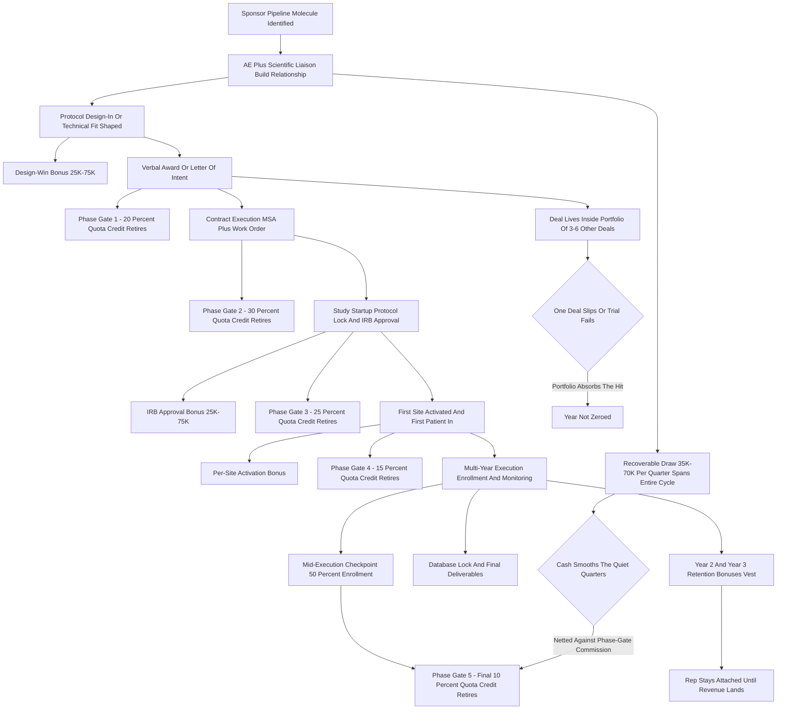
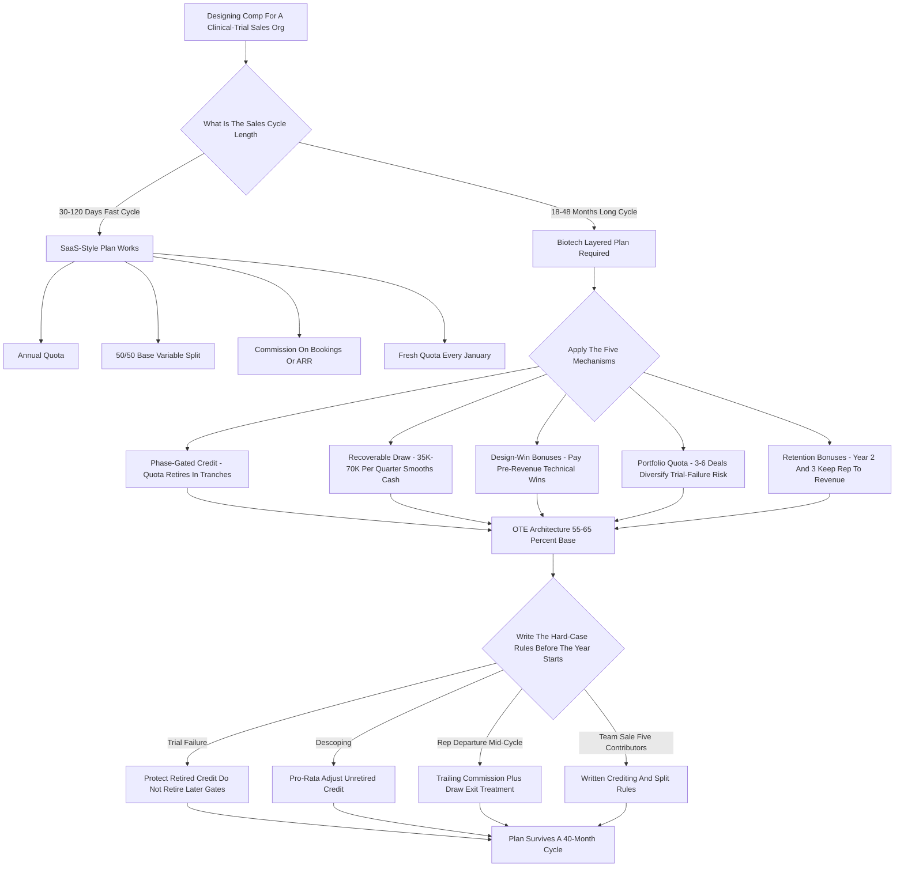

**TL;DR:** Biotech B2B sales orgs -- the companies selling into clinical trials: CROs, eClinical software vendors, central labs, lab-instrument and reagent suppliers, and trial-services firms -- cannot use the SaaS quota playbook, because the thing they sell takes **18 to 48 months to convert a verbal yes into recognized revenue**, and a rep's "closed" deal can sit unbilled for two years while the sponsor's molecule crawls from protocol design through IRB approval, site activation, patient enrollment, and phase readouts. The structural problem is a **revenue-recognition-versus-effort mismatch**: the selling work is front-loaded, the revenue is back-loaded and milestone-released, and a flat annual quota measured on booked or recognized revenue would either pay reps for work they did three years ago or starve reps doing the hardest pipeline work today. Mature biotech commercial orgs solve this with a **layered quota architecture** built from five mechanisms: **(1) phase-gated bookings credit**, where quota retires in tranches as the deal advances through award, contract execution, site-activation, and database-lock milestones rather than all at once; **(2) milestone-based recoverable draws**, $35K-$70K a quarter against future commission so reps survive the cycle; **(3) design-win and protocol-adoption bonuses**, $25K-$150K paid at pre-revenue technical wins (protocol design-in, IRB approval, first-site-activated) that are the real leading indicators; **(4) multi-year portfolio quotas**, where a rep carries 3-6 deals at different phases simultaneously so no single sponsor delay zeroes their year; and **(5) tenure and retention bonuses**, $75K-$200K paid in years two and three, because the single biggest threat to a long-cycle comp plan is the rep quitting before the deal they sold ever bills. The honest 2027 economics: a biotech enterprise AE runs an **OTE of $260K-$480K**, more **base-heavy (55-65% base)** than the 50/50 SaaS norm, with a **quota of $3M-$9M** in annual contract value across a portfolio, a **ramp of 18-24 months** before full quota, and a **first-year quota relief** that acknowledges the rep inherits a half-built pipeline. The three things that break biotech quota plans: **(a) copying the SaaS annual-bookings model** and watching reps either game early-stage paper or churn out before revenue; **(b) crediting quota only at revenue recognition**, which makes the comp plan lag the work by years and destroys pipeline behavior; and **(c) under-investing in draws and retention**, so the org trains reps through an 18-month learning curve and loses them at month 20. Net: biotech quota design is fundamentally a **cash-flow-timing and talent-retention problem disguised as a comp problem**, and the orgs that get it right decompose the long cycle into creditable, payable milestones, fund the rep through the gap with recoverable draws, and pay enough tenure money to keep the person who owns the relationship attached to the deal until it finally bills.

## What "Long-Cycle Clinical-Trial Deals" Actually Means For A Sales Org

Before you can structure quota for these deals you have to be precise about what the deal is, because "biotech B2B sales" covers several different businesses and they do not all have the same cycle. The orgs this question is about are the companies that sell *into* the clinical-trial process: contract research organizations (CROs) like IQVIA, ICON, Parexel, Fortrea, and Medpace that run trials for sponsors; eClinical and clinical-trial software vendors like Medidata (a Dassault Systemes company), Veeva Systems, Oracle Health Sciences, and IQVIA's technology arm that sell EDC, CTMS, eTMF, RTSM, and decentralized-trial platforms; central labs and specialty labs like Labcorp Drug Development and Q2 Solutions; instrument and reagent suppliers like Thermo Fisher, Danaher's life-sciences brands, and Illumina selling sequencing into trial work; and trial-services firms doing site networks, patient recruitment, imaging, and biospecimen logistics. What unites them is that the customer is a *sponsor* -- a pharma or biotech company developing a drug -- and the purchase is tied to a specific molecule moving through a specific trial. The "deal" is not a seat license that goes live next month. It is an award tied to a study that has its own multi-year timeline, its own regulatory gates, and its own failure risk. A rep can win the verbal award in Q1, watch the contract take six months to execute through procurement and legal, watch the study take another nine months to get through final protocol and IRB, and then watch revenue trickle in over the following 24-36 months as sites activate and patients enroll. The selling effort happened in year one. The revenue happens in years two, three, and four. Every quota problem in biotech sales flows from that single timing fact, and any comp plan that ignores it is quietly broken.

## Why The SaaS Quota Playbook Breaks On Contact

The standard SaaS commercial model -- annual quota, 50/50 OTE split, commission paid on bookings or recognized ARR, accelerators above 100%, a fresh quota every January -- is a beautifully tuned machine for a 30-to-120-day sales cycle. Drop it into biotech and it shatters in three specific places. First, the **measurement window is wrong**: a SaaS rep's quota year and sales cycle roughly align, so the annual number measures the annual work. A biotech rep's sales cycle is 18-48 months, so an annual bookings quota either credits them in year one for a deal that will not bill until year three (paying for unconfirmed paper) or credits them at revenue recognition (paying them in year three for work done in year one, by which point they may have left or moved accounts). Second, the **cash-flow timing is wrong**: a SaaS rep closes something most months and gets paid most months. A biotech rep can go three or four quarters between billable events while doing the hardest work of their pipeline. A 50/50 plan with no draw means the rep cannot eat. Third, the **attribution is wrong**: SaaS deals have one closer. A biotech trial award is touched by the AE, a scientific or medical liaison, a proposal/bid-defense team, and often an inside or BDR partner -- and the "close" is not one event but a sequence of awards, contract executions, and scope expansions spread over years. You cannot just stamp a close date and pay 10%. The orgs that try to run SaaS comp in biotech get two predictable pathologies: reps sandbag and game the early-stage definitions to pull quota credit forward, or good reps churn out in month 18-22 because the math never paid them for the cycle they actually worked. Both are comp-design failures, not people failures.

## The Core Tension: Revenue Recognition Versus Sales Effort Timing

The single concept a biotech sales leader has to internalize is the **effort-to-recognition gap**. Map a representative deal on a timeline. Months 1-9: the AE and scientific team identify the sponsor's pipeline molecule, build the relationship, shape the protocol or the technical fit, and win the verbal award. Months 6-14: contract execution -- master service agreement, work order, statement of work -- grinding through the sponsor's procurement, legal, and outsourcing governance. Months 12-20: study startup -- final protocol, regulatory and IRB/ethics approvals, site selection and contracting, system build and validation. Months 18-44: execution -- site activation, patient enrollment, monitoring visits, data capture, interim analyses -- and *this* is when most of the revenue actually recognizes, often on a units-of-delivery or percentage-of-completion basis tied to enrolled patients, monitored visits, or activated sites. Months 40-50: database lock, final deliverables, reconciliation, and the last revenue tranche. The sales *effort* is concentrated in months 1-14. The revenue *recognition* is concentrated in months 18-50. If your quota credits effort, you are paying for things that may not happen. If your quota credits recognition, your comp plan is a three-year-lagging indicator of sales work and it gives the rep zero feedback signal in the period they are actually selling. Every mechanism that follows -- phase-gated credit, draws, design-win bonuses, portfolio quotas, retention pay -- exists to bridge that gap without falling into either trap. You decompose the long cycle into a set of intermediate, verifiable, creditable, payable events, and you spread quota retirement and cash across them.

## Mechanism One: Phase-Gated Bookings Credit

The foundational fix is to stop treating "the deal" as a single creditable event and instead retire quota in **tranches tied to phase gates**. Instead of crediting 100% of a $4M trial award at verbal close, or at revenue recognition, the org defines a credit schedule across the deal's real milestones. A representative structure: 20% of quota credit at **verbal award / letter of intent** (the sponsor has selected you), 30% at **executed contract** (MSA plus work order signed -- the deal is now real and defensible), 25% at **study startup milestone** (final protocol locked, regulatory/IRB approval, system go-live or first site contracted), 15% at **first-patient-in or first-site-activated** (the study is operationally live and revenue has begun), and the final 10% at a **mid-execution checkpoint** such as 50% enrollment or database lock. The exact weights vary by business -- a software vendor weights contract execution and go-live heavily; a CRO weights enrollment milestones heavily because that is where its revenue and risk concentrate -- but the principle is constant: **quota retires as the deal de-risks, not all at once and not at the very end.** This does three things. It gives the rep a quota-credit signal in the period they are doing the work. It protects the company, because the bulk of credit lands only after the contract is executed and the study is real. And it makes forecasting honest, because phase-gated credit forces the org to track where every deal actually sits. The discipline required: the gate definitions must be written, auditable, and tied to documents (a signed work order, an IRB approval letter, a system go-live record), not to the rep's say-so -- otherwise phase-gating just becomes a new surface for sandbagging.

## Mechanism Two: Milestone-Based Recoverable Draws

Phase-gated credit fixes *when quota retires*. It does not by itself fix *when cash reaches the rep*, and in a business with three or four quarters between billable events, cash timing is what makes reps quit. The instrument is the **recoverable draw**: the org advances the rep a fixed sum each period -- commonly $35,000-$70,000 a quarter for an enterprise biotech AE, scaled to OTE and territory -- against their future earned commission. When phase-gated credit and commissions are calculated, the draw already paid is netted out, and the rep receives the difference. If a rep has earned $300K in commission over a period and drew $200K, they get $100K more. The draw is **recoverable** -- it is an advance, not a guarantee -- which keeps the rep economically motivated, but in practice mature orgs make the first 12-18 months of draw **non-recoverable or partially forgiven** to get a new rep through ramp without going underwater on day one. Draw design has a few non-obvious levers. The draw should be large enough to live on but not so large that a rep can coast on draws for years without producing -- so orgs cap cumulative unrecovered draw and trigger a performance review when it exceeds, say, two quarters of draw. The draw should also have a **clean exit treatment**: the contract specifies what happens to outstanding unrecovered draw if the rep leaves, and what happens to *unbilled deals they sourced* -- which is the thornier question the next mechanisms address. The mental model: phase-gated credit is the scoreboard, the draw is the paycheck that lets the rep stay in the game long enough for the scoreboard to pay out.

## Mechanism Three: Design-Win And Protocol-Adoption Bonuses

The third mechanism pays for the **pre-revenue technical wins that are the true leading indicators** of a biotech deal -- the events that happen before there is even a contract to phase-gate. In long-cycle clinical sales, the moments that actually predict revenue are technical and scientific: the sponsor adopts your platform or your assay into the **protocol design** itself (a "design-in" -- once you are written into the protocol you are extremely hard to displace); the trial clears **IRB / ethics committee approval** with your scope in it; the **first site is activated** on your system or with your services; the sponsor expands you into **additional studies or indications** in their pipeline. These are not bookings and they are not revenue, so a pure bookings or revenue quota ignores them entirely -- which is insane, because they are the highest-signal events in the whole cycle. Mature plans attach **discrete bonuses**: $25,000-$75,000 for a protocol design-in, $25,000-$75,000 at IRB approval, $25,000-$50,000 per activated site (or a per-site rate for site-network deals), and meaningful expansion bonuses ($50,000-$150,000) when an existing sponsor relationship grows into a new molecule or a new phase. The annual design-win bonus pool for a productive enterprise AE typically runs $75,000-$300,000 of their total comp. The strategic point: design-win bonuses **reward the behavior you actually want** -- deep scientific engagement early, getting embedded in the protocol, expanding the account -- rather than rewarding only the lagging financial outcome. They also give the rep frequent, motivating payable events inside an otherwise long, quiet cycle.

## Mechanism Four: Multi-Year Portfolio Quotas

The fourth mechanism changes the *unit of quota* from a single annual number to a **portfolio**. A biotech enterprise AE does not work one deal to close and then start the next; they carry a **rolling book of 3-6 deals at different phases simultaneously** -- one in early relationship-building, one in contract execution, two in active multi-year execution throwing off revenue and expansion, one in wind-down. The quota is structured against that portfolio: a blended annual number (commonly $3M-$9M in annual contract value or annual revenue depending on the business) that the rep retires through a mix of new awards, phase-gate progressions on in-flight deals, and expansions on the installed base. This matters for one overriding reason: **risk diversification.** Clinical trials fail, get delayed, get descoped, get paused for safety signals, or get killed when the sponsor's molecule reads out badly in an earlier phase -- and none of that is the rep's fault. If a rep's entire year rode on one $5M award and the sponsor pauses the program, a single-deal quota zeroes them for reasons completely outside their control, and you lose the rep. A portfolio quota means one deal slipping is absorbed by progress on the other five. It also matches how the work is actually done -- the rep is genuinely managing a portfolio's worth of relationships, phases, and timelines -- and it makes the quota less of an annual cliff and more of a continuously retiring number. The design discipline: the portfolio quota still needs phase-gated credit underneath it (so progress is measured), and it needs **explicit ramp and territory-maturity adjustments** (a rep who inherits a young territory with no in-flight execution deals cannot carry the same portfolio number as a rep with a mature book).

## Mechanism Five: Tenure And Retention Bonuses

The fifth mechanism addresses the failure mode that quietly destroys long-cycle comp plans: **the rep leaves before the deal they sold ever bills.** Think about the math. The org spends 12-18 months ramping a new biotech AE through a brutal learning curve -- the science, the regulatory landscape, the sponsor relationships, the internal bid-defense process. The rep finally becomes productive around month 18-24. The deals they sourced in that productive window will not fully recognize revenue for another 24-36 months. If the rep churns at month 22 -- a completely normal tenure in tech sales -- the org has paid for the ramp, paid the draws, and is about to harvest the revenue from a relationship the rep is walking away from, while a replacement starts the 18-month ramp all over again. **Retention is not an HR nicety in biotech sales; it is load-bearing comp architecture.** Mature plans build it in explicitly: a **year-two retention bonus** of $75,000-$125,000 paid for completing the second year, a **year-three bonus** of $100,000-$200,000, sometimes structured as a vesting "long-cycle deal completion" bonus that pays out as the rep's sourced deals hit database lock. Some orgs add **trailing commissions** -- a rep who leaves in good standing still earns a declining share of the revenue tranches from deals they sourced, for a defined period -- which both retains and makes departures less damaging. The strategic logic: the person who owns the sponsor relationship is the single most valuable asset in a long-cycle deal, and the comp plan has to make staying-until-it-bills the obviously rational choice. An org that under-funds retention is, in effect, training the industry's biotech reps and donating its pipeline to competitors.

## Putting The Five Mechanisms Together: The Layered Plan

No single mechanism works alone; the actual plan is the **stack**. Phase-gated credit decomposes the long cycle into a measurable, creditable scoreboard. Recoverable draws turn that scoreboard into a livable paycheck across the quiet quarters. Design-win bonuses pay the high-signal pre-revenue technical events the scoreboard would otherwise miss. Portfolio quotas diversify the rep across enough deals that trial failure and sponsor delay do not zero the year. Tenure bonuses keep the rep attached to the relationship until the revenue actually lands. Run them together and you get a plan where the rep has frequent payable events, a stable income floor, a quota that measures current work rather than three-year-old work, protection against forces outside their control, and a strong economic reason to stay. Pull any one out and a pathology returns: drop phase-gating and the plan lags reality by years; drop draws and reps starve; drop design-win bonuses and reps stop doing early scientific engagement; drop portfolio quotas and one trial failure breaks a rep's year; drop retention and you train reps for competitors. The art is in the **weighting** -- how much OTE sits in base versus draw versus phase-gate commission versus design-win bonus versus retention -- and that weighting is what the rest of this answer gets concrete about.

## The OTE Architecture: Base, Variable, And The 55-65% Base Rule

Biotech enterprise sales comp is structurally **more base-heavy** than SaaS, and the reason is the cycle. A 50/50 base/variable split assumes the rep can influence enough closes per year that variable pay is genuinely "at risk but achievable on a normal cadence." In an 18-48 month cycle, that assumption fails -- so biotech orgs run **55-65% base, 35-45% variable**, sometimes richer base for highly scientific roles. On a representative enterprise AE OTE of $260,000-$480,000, that means roughly $145,000-$300,000 of base and $100,000-$190,000 of variable, where the variable itself is split across phase-gate commission, design-win bonuses, and (functionally) the recoverable draw that smooths it. The richer base does several jobs: it retains the rep through the dry quarters, it reflects that biotech AEs are often scientifically credentialed and expensive to replace, and it reduces the incentive to game early-stage definitions for survival cash. The trade-off the org accepts is **less leverage** -- you cannot motivate purely with uncapped upside the way SaaS does -- which is why design-win bonuses and expansion accelerators matter: they are where the org puts the "hungry" money back into a base-heavy plan. The mistake to avoid in both directions: too base-heavy and the plan stops driving behavior and just becomes salary; too variable-heavy and the cycle starves the rep and drives churn and gaming.

## Quota Sizing: How Big Should The Number Be?

Quota sizing in biotech has to start from **capacity and territory math, not from a revenue target divided by headcount.** The questions: how many active deals can one AE genuinely manage across all phases (typically 3-6, because each one demands sustained scientific and relationship work)? What is the average deal's total contract value and how does it recognize over time? How mature is the territory -- does the rep inherit in-flight execution deals throwing off expansion revenue, or a cold patch? A common framework lands enterprise AE portfolio quotas at **$3M-$9M in annual contract value or annual recognized revenue**, with the wide range driven by business type (a high-ACV CRO full-service deal versus a per-seat eClinical platform), territory maturity, and how much of the quota is new-business versus installed-base expansion. The sizing discipline that biotech specifically requires: **quota relief for ramp and for inherited-pipeline state.** A rep in months 1-18 should carry a stepped quota (e.g., 40%, then 70%, then 100% by month 24) because they physically cannot originate and advance a full portfolio inside a sub-cycle window. And a rep who inherits a young territory needs a maturity-adjusted number, because portfolio quotas assume an installed base that a new territory does not have. Orgs that skip ramp and maturity relief set every new and reassigned rep up to miss, which corrodes trust in the whole plan.

## Crediting Rules: Who Gets Paid When A Deal Touches Five People

A biotech trial award is a **team sale**, and the crediting rules are where plans get politically and operationally messy. A single deal is typically touched by the **enterprise AE** (owns the sponsor relationship and the commercial close), a **scientific or medical liaison / subject-matter expert** (shapes the protocol fit and the bid defense), a **proposal/bid-defense team** (builds the pricing and the technical response), sometimes a **BDR or inside rep** (sourced or qualified the opportunity), and an **account or program manager** who takes over during multi-year execution and drives expansion. If you only pay the AE, the scientific and proposal people have no skin in deals they materially win; if you split credit too many ways, the AE's plan gets diluted and ownership blurs. Workable patterns: the AE carries the **primary quota and the bulk of phase-gate commission**; SMEs and scientific liaisons are often on **MBO or pooled-bonus plans tied to win rates and bid-defense outcomes** rather than carrying quota; BDRs get a **sourcing bonus or a small slice of early-gate credit** for opportunities they originate; and the **expansion revenue during execution** is often split or transitioned to the account/program manager, with the originating AE keeping a declining trailing share. The essential rule: **write the crediting and split rules down before the year starts**, including the hard cases -- reassigned territories, a rep who leaves mid-cycle, a deal that was sourced by one rep and closed by another after a reorg -- because in a multi-year cycle, every one of those hard cases *will* happen, and a plan that resolves them by ad hoc negotiation breeds distrust.

## Forecasting And The Phase-Weighted Pipeline

Phase-gated credit is not only a comp tool; it is the backbone of **honest forecasting** in a business where naive pipeline math is dangerously wrong. A SaaS-style pipeline -- sum the deal values, apply a stage probability, get a forecast -- falls apart over an 18-48 month cycle because the time-to-revenue is enormous and variable. The biotech discipline is a **phase-weighted, time-phased pipeline**: each deal carries not just a value and a probability but a **phase**, a **time-to-next-gate**, and a **revenue-recognition curve** describing how its value will recognize across future quarters once it is live. The forecast is then built bottoms-up from where every deal sits on its phase timeline. This is exactly the same data the phase-gated comp plan needs, which is the quiet benefit of mechanism one: aligning comp credit to phase gates forces the org to maintain the phase-accurate pipeline that good forecasting requires anyway. It also disciplines the classic biotech forecasting errors: counting a verbal award as near-term revenue (it is 18+ months out), or treating a signed contract as immediate revenue (recognition follows enrollment, not signature). RevOps in a biotech org spends much of its energy on the recognition curve -- mapping award value to the quarters it will actually bill -- and that curve is the shared substrate for the comp plan, the forecast, and the board number.

## Handling Trial Failure, Delay, And Descoping

Clinical trials fail, pause, slip, and shrink, and a biotech comp plan has to have **explicit, pre-agreed rules** for what happens to quota credit and commission when they do -- because these events are frequent and they are not the rep's fault. The cases: a sponsor **kills the program** after an earlier-phase readout fails (the molecule does not work); a trial is **paused** for a safety signal or a regulatory hold; the sponsor **descopes** the work order (fewer sites, fewer patients, narrower geography) to save money; the trial **slips** a year because enrollment is slow. The plan needs answers. A common, defensible structure: quota credit already retired at *executed-contract* and earlier gates is **not clawed back** if the trial later fails -- the rep did the work, the deal was real, and clawing back credit for a sponsor's molecule failing makes the job uninsurable. Credit and commission tied to *later* gates (enrollment milestones, database lock) simply **do not retire** because the events never happen -- the rep does not get paid for revenue that never recognized, which is fair on both sides. Descoping triggers a **pro-rata adjustment** of the not-yet-retired credit to the new contract value. Delays are handled by the **portfolio structure and the time-phased forecast** -- the deal still pays, just later, and the other portfolio deals carry the year. The principle: protect retired credit, do not pay for events that never occurred, adjust for scope changes, and absorb timing risk through the portfolio -- and write all of it down before the failure happens, because negotiating it after a program dies is when reps lose faith in the plan.

## Comparable Patterns From Adjacent Long-Cycle Industries

Biotech sales leaders should steal from other industries that solved long-cycle comp first, because the structural problem is not unique. **Capital equipment and aerospace sales** -- selling jet engines, industrial systems, defense platforms -- runs multi-year cycles with milestone-based bookings credit and progress payments, and biotech's phase-gated credit is essentially the same idea. **Construction and large infrastructure** uses percentage-of-completion accounting and milestone billing, the direct analog of clinical-trial units-of-delivery recognition. **Enterprise consulting and systems integration** (think large SI engagements) pays on signed-SOW plus delivery milestones and uses portfolio-style quotas for partners carrying multiple engagements. **Pharma's own field-sales side** -- the reps detailing approved drugs to physicians -- is a *different* model (it is high-frequency, territory-based, often using market-share and call-activity metrics), but it is instructive as a contrast: it shows what biotech B2B sales is *not*, which is a fast-cycle, high-volume motion. **Government and defense contracting** has the richest playbook for crediting team sales across capture managers, proposal teams, and program managers over multi-year award cycles, and biotech's crediting-rules problem is nearly identical. The lesson from all of them: the long cycle is not an excuse for a vague plan -- the mature long-cycle industries have *more* structured comp than SaaS, not less, because the structure is what makes a multi-year cycle manageable. Biotech orgs that feel like they are inventing this from scratch are not; they are re-deriving capital-equipment and government-contracting comp design.

## Decentralized Trials, AI, And The 2027-2030 Evolution

The clinical-trial landscape is shifting, and the comp architecture has to track it. **Decentralized and hybrid trials** -- bringing trial activities to the patient via wearables, telehealth visits, and local providers rather than concentrating everything at big sites -- change the milestone map: "site activation" becomes a fuzzier, more distributed event, and patient-enrollment and data-capture milestones become relatively more central as creditable gates. Comp plans are responding by weighting enrollment and data-completeness milestones more heavily and de-emphasizing pure site-count gates. **AI and analytics in trial design and operations** -- predictive enrollment modeling, risk-based monitoring, synthetic control arms, AI-assisted protocol design -- are themselves becoming things vendors sell, and they tend to be sold *earlier* in the sponsor relationship (at the design stage), which pushes more comp weight toward the design-win bonus mechanism. **Pricing-model shifts** matter too: as some eClinical and analytics offerings move toward subscription and platform pricing rather than per-study work orders, parts of the biotech portfolio start to look more SaaS-like and can carry more SaaS-like comp -- meaning the 2027+ biotech AE may carry a *blended* quota, part long-cycle milestone-gated study work and part recurring-revenue platform subscription, with two different comp logics under one number. **Funding-cycle volatility** -- biotech sponsor funding swings with the capital markets -- makes the portfolio quota and the retention bonuses *more* important, not less, because thin-funding years stretch cycles and delay deals further. The throughline for 2027-2030: the five mechanisms stay valid, but their *weighting* shifts toward earlier-signal events (design-win bonuses), toward enrollment-and-data milestones over site-count milestones, and toward blended plans as platform pricing grows.

## RevOps Tooling And The Systems That Run This Plan

A layered, multi-year, phase-gated, portfolio comp plan **cannot be run on a spreadsheet**, and a biotech sales org has to budget for the systems. The stack: a **CRM** (Salesforce, or Veeva's industry CRM) configured with the *real* phase stages -- not generic SaaS stages but verbal-award, MSA-executed, work-order-signed, protocol-locked, IRB-approved, first-site-activated, enrollment-milestone, database-lock -- so the pipeline data exists; an **incentive compensation management (ICM) platform** (CaptivateIQ, Xactly, Varicent, Spiff/Salesforce) configured to retire quota in tranches across those phases, net recoverable draws, calculate design-win bonuses, handle portfolio quotas, and apply ramp and territory relief -- because the netting and tranching logic is far too complex and too auditable-by-finance to run by hand; **CPQ and contract systems** that tie the work-order and SOW data into the credit engine; and a **revenue-recognition model** (often jointly owned by RevOps and finance) that maps award value to the future quarters it will recognize, feeding both the forecast and, where comp is recognition-linked, the comp engine. The operational reality: biotech RevOps spends disproportionate effort on **data hygiene at the phase-gate level** -- making sure an "IRB approved" flag in the CRM actually corresponds to an approval letter -- because every gate is now both a comp trigger and a forecast input, so a sloppy stage update is a mispayment and a misforecast at once. The orgs that run this well treat the CRM phase model, the ICM configuration, and the rev-rec curve as **one integrated system**, not three disconnected tools.

## Worked Example: A Single $4.5M CRO Deal Through The Plan

Make it concrete with one deal. An enterprise AE at a mid-size CRO is working a sponsor's Phase III oncology program -- a full-service trial award with a total contract value of $4.5M recognizing over roughly 40 months. **Months 1-8:** the AE and a scientific liaison build the relationship and shape the operational approach; at month 8 the sponsor issues a verbal award. Phase-gate credit: 20% of the deal's quota value retires ($900K of credit), a $50K protocol-engagement design-win bonus pays. **Months 6-15:** contract execution; the MSA and work order sign at month 14. Phase-gate credit: another 30% retires ($1.35M). **Months 14-22:** study startup -- protocol locked, IRB approvals across the site set, systems built; at month 21 the startup gate is met. Credit: 25% retires ($1.125M), plus per-site activation bonuses as sites come online. **Month 24:** first-patient-in. Credit: 15% retires ($675K), enrollment is now generating recognized revenue. **Month 34:** the 50% enrollment checkpoint. Final 10% retires ($450K). Across the deal, the AE drew roughly $50K-$60K a quarter the whole time, which is netted against the phase-gate commission as each tranche retires. The deal also lived inside the AE's **portfolio** of five other deals at other phases, so the quarters between gates were not dead -- other deals were retiring credit. And because the AE was still with the company at months 24 and 36, they collected the year-two and year-three retention bonuses, which were partly structured to vest as their sourced deals (this one included) hit their enrollment milestones. One deal, five mechanisms, 40 months, and at no point did the rep go a quarter without income or a creditable event -- which is the entire design goal.

## Common Failure Modes That Break Biotech Quota Plans

The ways these plans fail are consistent enough to be a checklist. **Copying the SaaS annual-bookings model** -- the original sin; an annual number on a multi-year cycle produces either pull-forward gaming or churn-before-revenue. **Crediting only at revenue recognition** -- makes the comp plan a three-year-lagging indicator, gives the rep no signal during the selling period, and is unworkable when reps and territories change. **Under-funding the draw** -- a base-heavy plan still needs the draw to smooth the quiet quarters; skimp on it and reps leave for cash-flow reasons alone. **No retention architecture** -- the org trains reps through an 18-month ramp and loses them at month 22, donating its pipeline. **Single-deal quota exposure** -- a rep whose year rides on one award gets zeroed by a trial failure they did not cause. **Unwritten crediting and split rules** -- in a multi-year cycle, reorgs, departures, and reassignments are guaranteed, and resolving them ad hoc breeds distrust. **Phase gates defined by rep say-so** -- gates not tied to auditable documents just become a new sandbagging surface. **No ramp or territory-maturity relief** -- sets every new and reassigned rep up to miss. **Clawing back retired credit on trial failure** -- makes the job feel uninsurable and drives out exactly the reps you want. **Ignoring the team-sale reality** -- paying only the AE leaves scientific and proposal contributors with no incentive on deals they materially win. **Running it on spreadsheets** -- the netting, tranching, and portfolio logic is too complex and too finance-auditable for manual administration; errors become trust failures. Every one of these is a design choice, and every one is avoidable.

## How To Design The Plan: A Build Sequence For Sales Leaders

A sales leader building or fixing a biotech quota plan should work in this order. **First, map the real deal lifecycle** -- get the actual phase gates from the operations and finance teams, with the document that proves each gate, and the typical time between them. **Second, build the revenue-recognition curve** -- with finance, model how an average award's value recognizes across future quarters; this is the substrate for everything. **Third, design the phase-gated credit schedule** -- assign quota-credit weights to each gate, front-loading enough to signal the work but landing the bulk after contract execution. **Fourth, set the OTE architecture** -- 55-65% base, then size the variable across phase-gate commission, design-win bonuses, and the draw. **Fifth, size quota from capacity** -- deals-per-rep times average value times maturity, not target-divided-by-headcount, with explicit ramp and territory-maturity relief. **Sixth, design the draw** -- quarterly amount, recoverability, first-year forgiveness, cumulative caps, and exit treatment. **Seventh, define the design-win bonus catalog** -- the specific pre-revenue technical events and their dollar values. **Eighth, write the crediting and split rules** -- including every hard case: reassignment, departure, sourced-by-one-closed-by-another. **Ninth, write the trial-failure and descoping rules** -- what is protected, what does not retire, what gets pro-rated. **Tenth, build the retention architecture** -- year-two and year-three bonuses, vesting against sourced-deal milestones, trailing commissions. **Eleventh, configure the systems** -- CRM phase model, ICM tranching and netting, rev-rec integration. **Twelfth, model it against real historical deals** before launch -- run last year's actual deals through the new plan and check that good reps get paid well and the math is affordable. Do these twelve in order and the plan holds; skip the lifecycle mapping or the historical modeling and the plan launches with hidden breakage.

## Governance, Plan-Change Cadence, And Communicating The Plan To Reps

A long-cycle comp plan has a governance problem that SaaS plans largely escape: changes the org makes mid-year ripple across deals that started under the old rules and will not finish under any rules currently written. A SaaS plan can be retuned each January and the cycle finishes inside the year, but a biotech plan touched in June 2027 affects deals sourced in 2025 and not closing until 2029. The discipline this forces: **freeze the plan annually with a clear effective date, grandfather in-flight deals under the rules they were sourced under, and document every change in a versioned plan document reps and finance can both reference**. The orgs that run this well treat the comp plan like contract terms -- versioned, dated, and binding -- rather than like a marketing deck the VP of Sales can edit on a whim. Communication matters as much as design: a rep who cannot explain to themselves how a $4M deal will pay them across three years will not trust the plan, and an untrusted plan stops driving behavior. Mature orgs publish a **plan handbook** that walks through the mechanisms with worked examples (the kind of $4.5M-deal walkthrough above), runs a **kickoff workshop** at plan launch, and gives every rep a **personalized model** of their territory and portfolio under the plan so they can see how their year retires. The political reality: every comp-plan change is read by reps as a signal about how the org views their work, and a plan that gets quietly tightened mid-year tells the best reps to take the calls from the recruiters who keep emailing them. Plan stability is not a nice-to-have -- it is a retention input.

## Manager Comp And The Front-Line Sales Leader Layer

A biotech sales org's first-line managers -- the directors who carry a team of 4-8 enterprise AEs -- need their own comp architecture, and it cannot be an afterthought. The manager's variable pay should be **roll-up-based** -- a share of the team's retired phase-gate credit, not a separate quota that competes with their reps' priorities -- with a meaningful **team-development bonus** tied to ramp success of new reps, retention of productive reps, and the year-over-year quality of the team's pipeline (not just its volume). This matters because the manager is the person who has to coach reps through 18-month dry stretches, defend pipeline-stage discipline against pressure to game gates, and hold the line when a struggling rep wants to convert their draw into permanent salary. A manager paid only on team revenue retired this quarter has incentives that pull against every long-cycle behavior the plan is trying to reinforce. Mature plans typically run manager OTE at $300K-$550K with 60-65% base, a team-rollup commission carrying most of the variable, and a $50K-$150K MBO/development bonus pool tied to coaching, ramp, and retention metrics. Above the front-line manager, the regional or VP layer carries broader portfolio-rollup and strategic-account-based metrics, but the same principle holds: every layer of management comp should reinforce, not contradict, the long-cycle discipline of the AE plan beneath it.

## The Honest Verdict: It Is A Cash-Flow And Retention Problem

Strip away the mechanism detail and biotech quota design is, at its core, **not really a quota problem at all** -- it is a cash-flow-timing problem and a talent-retention problem wearing a quota costume. The selling work and the revenue are separated by years; everything hard about the comp plan flows from that gap. The phase-gated credit is how you give the work a scoreboard inside the gap. The recoverable draw is how you pay the rent inside the gap. The design-win bonuses are how you reward the high-signal behavior inside the gap. The portfolio quota is how you keep one trial failure inside the gap from zeroing a year. The retention bonuses are how you keep the human being attached to the relationship across the gap until the revenue finally lands. A biotech sales org that understands this builds a plan that is *more* structured than SaaS, not less -- decomposed into creditable milestones, funded through draws, diversified across a portfolio, and anchored by serious retention money -- and it accepts a more base-heavy, lower-leverage OTE as the price of a plan that actually survives a 40-month cycle. The orgs that get it wrong are almost always the ones that imported a SaaS plan, hoped the cycle would behave, and discovered two years later that their best reps had churned out at month 22 with the pipeline in their heads. In long-cycle clinical-trial sales, the comp plan is not a motivational accessory -- it is the structural mechanism that holds the commercial org together across a cycle longer than most tech-sales careers.

## The Long-Cycle Deal Lifecycle And Where Quota Retires

## The Decision Matrix: SaaS Comp Versus Biotech Long-Cycle Comp

## Sources

1. **WorldatWork -- Sales Compensation Programs and Practices** -- Professional association and primary research source on sales comp design, quota setting, and pay-mix benchmarks. https://worldatwork.org
2. **Alexander Group -- Sales Compensation and Revenue Growth Advisory** -- Consultancy with published research on long-cycle and life-sciences sales comp structures. https://www.alexandergroup.com
3. **ZS Associates -- Pharmaceutical and Life-Sciences Commercial Strategy** -- Life-sciences-focused consultancy publishing on biopharma sales-force and incentive design. https://www.zs.com
4. **Korn Ferry -- Life Sciences Sales Compensation Benchmarking** -- Executive and sales-force compensation benchmarking including life-sciences and biotech roles. https://www.kornferry.com
5. **Radford / Aon -- Life Sciences Compensation Surveys** -- Compensation survey data covering biotech and pharma commercial roles. https://radford.aon.com
6. **CaptivateIQ -- Incentive Compensation Management Platform** -- ICM software documentation on multi-tranche, draw, and milestone-based commission logic. https://www.captivateiq.com
7. **Xactly -- Sales Performance and Incentive Compensation Management** -- ICM platform and published benchmarks on quota attainment and pay mix. https://www.xactlycorp.com
8. **Varicent -- Incentive Compensation and Sales Planning** -- ICM and territory/quota planning platform documentation. https://www.varicent.com
9. **Spiff (Salesforce) -- Commission Software** -- Commission automation platform relevant to tranched and recoverable-draw plans. https://spiff.com
10. **IQVIA -- Contract Research and Clinical Trial Services** -- Major CRO; investor and corporate materials on clinical-trial services revenue models. https://www.iqvia.com
11. **ICON plc -- Clinical Research Organization** -- CRO investor materials describing full-service trial award structures and backlog/revenue recognition. https://www.iconplc.com
12. **Medpace -- Clinical Research Organization** -- CRO disclosures on net-new-business awards, backlog, and revenue conversion timelines. https://www.medpace.com
13. **Fortrea -- Clinical Development and CRO Services** -- CRO corporate materials on trial-services contracting. https://www.fortrea.com
14. **Medidata (Dassault Systemes) -- Clinical Trial Software Platform** -- eClinical platform vendor; product materials on EDC, CTMS, and decentralized-trial software. https://www.medidata.com
15. **Veeva Systems -- Clinical and Life Sciences Cloud** -- Life-sciences software vendor; materials on clinical, CRM, and platform offerings. https://www.veeva.com
16. **Oracle Health Sciences -- Clinical Trial Technology** -- Clinical-trial software and data-management platform documentation. https://www.oracle.com/life-sciences
17. **Labcorp Drug Development -- Central Laboratory and Trial Services** -- Central-lab and trial-services revenue and contracting context. https://www.labcorp.com
18. **Thermo Fisher Scientific -- Life Sciences and Clinical Research** -- Instrument, reagent, and clinical-research-services supplier context. https://www.thermofisher.com
19. **Harvard Business Review -- Sales Compensation Design Articles** -- Practitioner literature on quota setting, pay mix, and long-cycle sales incentives. https://hbr.org
20. **The Sales Management Association -- Research on Quota and Territory Design** -- Research and benchmarks on quota-setting practice and sales-force effectiveness. https://salesmanagement.org
21. **FASB ASC 606 -- Revenue From Contracts With Customers** -- Accounting standard governing how trial-services revenue recognizes over time. https://www.fasb.org
22. **SEC EDGAR -- CRO 10-K Filings (IQVIA, ICON, Medpace)** -- Public filings detailing backlog, net new business awards, and revenue-conversion timing. https://www.sec.gov/edgar
23. **DIA (Drug Information Association) -- Clinical Trial Process and Operations** -- Industry association resources on the clinical-development and trial-operations lifecycle. https://www.diaglobal.org
24. **ACRO (Association of Clinical Research Organizations)** -- Industry association representing CROs; context on the trial-services market. https://www.acrohealth.org
25. **ClinicalTrials.gov and FDA Clinical Trial Phase Documentation** -- Reference for the Phase I-III, IRB, and submission milestone structure that comp gates map to. https://www.fda.gov
26. **Decentralized Trials and Research Alliance (DTRA)** -- Industry group on decentralized and hybrid trial models reshaping milestone maps. https://www.dtra.org
27. **BioPharma Dive -- Industry Journalism on Biotech Funding and Trials** -- Trade journalism covering sponsor funding cycles and trial-services demand. https://www.biopharmadive.com
28. **Endpoints News -- Biotech Industry Coverage** -- Trade journalism on biotech funding volatility and commercial dynamics. https://endpts.com
29. **CenterWatch / Clinical Trial Industry Market Data** -- Market data on clinical-trial outsourcing and CRO industry size and growth.
30. **Bain & Company -- Life Sciences Commercial Excellence** -- Consultancy research on biopharma commercial models and sales effectiveness. https://www.bain.com
31. **McKinsey & Company -- Life Sciences and Sales Compensation Research** -- Published research on sales-force design and incentive structures in complex B2B. https://www.mckinsey.com
32. **Aerospace and Defense Sales Compensation Practice References** -- Comparable long-cycle, milestone-credited sales-comp models from capital-equipment industries.
33. **Government Contracting Capture and Proposal Compensation References** -- Comparable team-sale crediting models across capture managers, proposal teams, and program managers.
34. **Gartner -- Sales Compensation and Revenue Operations Research** -- Research on RevOps tooling, ICM selection, and comp-plan administration. https://www.gartner.com
35. **CRO Industry Backlog-to-Revenue Conversion Studies** -- Analyst studies on the timing between net new business awards and recognized revenue in the CRO sector.

## Numbers

**Biotech Enterprise AE Compensation (Representative 2027)**

| Component | Range | Notes |
|---|---|---|
| Total OTE | $260,000-$480,000 | Enterprise AE selling into clinical trials |
| Base salary | $145,000-$300,000 | 55-65% of OTE -- base-heavier than SaaS |
| Variable / at-risk | $100,000-$190,000 | Phase-gate commission + design-win bonuses |
| Quarterly recoverable draw | $35,000-$70,000 | Advance against future commission |
| Portfolio quota | $3M-$9M ACV / annual revenue | Across 3-6 deals at different phases |
| Ramp to full quota | 18-24 months | Stepped: ~40% / 70% / 100% |
| Pay mix (base/variable) | 55-65 / 35-45 | Versus ~50/50 SaaS norm |

**Phase-Gated Quota Credit Schedule (Representative)**

| Phase Gate | Quota Credit Retired | Trigger Event |
|---|---|---|
| Gate 1 -- Verbal Award / LOI | 20% | Sponsor selects vendor |
| Gate 2 -- Executed Contract | 30% | MSA + work order signed |
| Gate 3 -- Study Startup | 25% | Protocol locked, IRB approved, systems live |
| Gate 4 -- First Patient In / First Site Active | 15% | Study operationally live, revenue begins |
| Gate 5 -- Mid-Execution Checkpoint | 10% | ~50% enrollment or database lock |

**Design-Win And Milestone Bonuses**

| Bonus Type | Range | When Paid |
|---|---|---|
| Protocol design-in | $25,000-$75,000 | Vendor written into protocol design |
| IRB / ethics approval | $25,000-$75,000 | Trial cleared with vendor scope |
| Per-site activation | $25,000-$50,000 / site | Each site activated on platform/services |
| Patient-enrollment bonus | $1,000-$5,000 / patient | Patients enrolled using vendor tools |
| Account / indication expansion | $50,000-$150,000 | Existing sponsor grows into new molecule/phase |
| Annual design-win pool (productive AE) | $75,000-$300,000 | Portion of total comp |

**Deal Cycle And Timing Benchmarks**
- Verbal award to executed contract: 4-9 months
- Executed contract to study startup complete: 6-12 months
- Study startup to first patient in: 2-6 months
- Full revenue recognition span: 24-48 months from award
- Total effort-to-full-recognition gap: often 36-50 months
- Deals carried per enterprise AE simultaneously: 3-6

**Retention / Tenure Architecture**

| Bonus | Range | Trigger |
|---|---|---|
| Year-2 retention bonus | $75,000-$125,000 | Completing second year of tenure |
| Year-3 retention bonus | $100,000-$200,000 | Completing third year / sourced deals hit milestones |
| Trailing commission (good-standing exit) | Declining share, defined period | Revenue tranches from rep's sourced deals |

**Trial-Failure And Descoping Rules (Representative)**
- Credit retired at executed-contract gate and earlier: NOT clawed back on later trial failure
- Credit tied to later gates (enrollment, database lock): does not retire (events never occurred)
- Descoping: pro-rata adjustment of not-yet-retired credit to new contract value
- Delay: absorbed by portfolio structure and time-phased forecast (deal still pays, later)

**SaaS Versus Biotech Comp -- Structural Comparison**

| Dimension | SaaS Enterprise | Biotech Clinical-Trial |
|---|---|---|
| Sales cycle | 30-120 days | 18-48 months |
| Quota basis | Annual bookings / ARR | Multi-year phase-gated portfolio |
| Pay mix | ~50/50 | 55-65% base |
| Cash smoothing | Frequent commissions | Recoverable draw $35K-$70K/qtr |
| Quota unit | Single annual number | Rolling portfolio of 3-6 deals |
| Leading-indicator pay | Logo / pipeline metrics | Design-win / protocol-adoption bonuses |
| Top retention risk | Normal | Rep churns before sourced deal bills |
| Forecasting | Stage probability | Phase-weighted, time-phased rev-rec curve |

## Counter-Case: Why The Five-Mechanism Plan Can Still Fail Or Mislead

The layered plan above is the mature answer, but a sales leader should stress-test it, because each mechanism carries its own failure mode and the architecture is not automatically safe just because it is sophisticated.

**Counter 1 -- Phase-gated credit can be gamed at the gate definitions.** Decomposing the deal into gates creates new surfaces to manipulate. A rep can lean on a sponsor to issue a soft "letter of intent" early to pull Gate 1 credit forward, or push a thin work order to trip Gate 2. Phase-gating only works if every gate is tied to an auditable artifact -- a signed work order, an IRB letter, a system go-live record -- and even then the rep has influence over *timing*. The mechanism reduces gaming versus a pure annual quota; it does not eliminate it.

**Counter 2 -- Recoverable draws can quietly become entitlements.** A draw large enough to live on is also large enough to coast on. A rep can collect draws for six or eight quarters while their portfolio underperforms, and because the draw is "recoverable" on paper, the org tells itself the risk is contained -- until the rep leaves with a large unrecovered balance the company will never collect. Without hard cumulative caps and a real performance trigger, the draw stops being an advance and becomes an unfunded salary supplement.

**Counter 3 -- Design-win bonuses can reward activity over outcome.** Paying $25K-$75K for a protocol design-in or an IRB approval is meant to reward high-signal leading indicators -- but a design-in on a molecule that fails Phase II produces a bonus payment and zero revenue. If the design-win pool gets too large relative to revenue-linked pay, the org is paying handsomely for technical engagement on programs that never bill, and reps optimize for collecting design-win bonuses rather than for closing revenue-producing studies.

**Counter 4 -- Portfolio quotas can hide underperformance.** A portfolio of 3-6 deals diversifies trial-failure risk -- but it also blurs accountability. A weak rep can look adequate because two strong installed-base expansion deals carry the number while their new-business origination is dead. The portfolio structure makes it harder to see that a rep has stopped hunting, because the book keeps retiring credit from old deals. Without separate new-business and expansion sub-quotas, the portfolio becomes a place for underperformance to hide.

**Counter 5 -- Retention bonuses can retain the wrong people.** A $100K-$200K year-three bonus keeps reps attached to their deals -- including mediocre reps who would otherwise be managed out. If retention pay is purely tenure-based rather than tied to sourced-deal quality and milestone progress, the org is paying its weakest long-tenured reps to stay exactly when it should be upgrading the seat.

**Counter 6 -- The base-heavy OTE reduces motivational leverage.** Running 55-65% base is the right structural choice for cash-flow reasons, but it genuinely weakens the plan's ability to drive aggressive behavior. A rep on a rich base through quiet quarters has less acute pressure to advance deals than a SaaS rep facing a thin draw. The org trades churn-protection for a softer hunger, and in a slow-funding biotech market that softer hunger can mean a stalled pipeline that nobody is desperate enough to unstick.

**Counter 7 -- The whole plan assumes a stable deal lifecycle.** Phase-gated credit, the rev-rec curve, and the forecast all depend on the deal lifecycle behaving roughly as modeled. Decentralized trials, AI-accelerated design, platform-subscription pricing, and funding-driven cycle stretching are all actively reshaping that lifecycle. A plan built on 2024's gate map can be subtly wrong by 2027 -- crediting site-activation heavily in a decentralized-trial world where "site activation" barely exists as a discrete event.

**Counter 8 -- Administrative complexity is itself a risk.** A five-mechanism, multi-tranche, portfolio-based, draw-netted plan with hard-case rules for failure and descoping is genuinely hard to administer correctly. Every gate is a comp trigger and a forecast input; every CRM stage error is a mispayment. Orgs that cannot fund the ICM tooling and the RevOps data-hygiene discipline end up with a sophisticated plan administered badly, which is worse than a simple plan administered well -- because reps lose trust in a plan they cannot predict.

**Counter 9 -- It may be over-engineered for shorter-cycle biotech segments.** Not every "biotech B2B" deal is a 40-month full-service trial award. A vendor selling per-study eClinical modules, or reagents and consumables on shorter cycles, may have a 6-12 month cycle that does not need the full five-mechanism apparatus. Applying the long-cycle plan to a medium-cycle business adds cost and complexity for risk that is not there -- the plan should be sized to the actual cycle, not adopted wholesale because the industry is "biotech."

**The honest verdict.** The five-mechanism layered plan is the right architecture for genuine long-cycle clinical-trial deals -- 18-to-48-month full-service awards where the effort-to-recognition gap is real and large. It works when the org (a) ties every phase gate to an auditable artifact, (b) caps and performance-triggers the draw so it stays an advance, (c) keeps the design-win pool proportionate to revenue-linked pay, (d) splits the portfolio into new-business and expansion sub-quotas so underperformance cannot hide, (e) ties retention pay to sourced-deal quality rather than pure tenure, (f) revisits the gate map as the trial landscape shifts, and (g) actually funds the ICM tooling and RevOps discipline the plan demands. It is the wrong plan -- over-engineered and over-costly -- for shorter-cycle biotech segments, and it is dangerous when adopted in form but not administered with rigor. The mechanisms are sound; the failure modes live in the weighting, the controls, and the administration.

## Related Pulse Library Entries

- **q1862** -- How do enterprise SaaS orgs design quota for multi-year platform deals? (The adjacent long-cycle comp problem in a software context; shares the tranched-credit logic.)
- **q1864** -- How should RevOps build a phase-weighted pipeline forecast? (The forecasting backbone that phase-gated credit depends on.)
- **q1865** -- What is the right base-to-variable pay mix for complex enterprise sales? (Deep dive on the 55-65% base decision for long-cycle roles.)
- **q1866** -- How do you design recoverable draw programs for long-cycle reps? (Mechanism-two deep dive: draw sizing, recoverability, and exit treatment.)
- **q1867** -- How should sales orgs credit team sales across AE, SME, and BDR roles? (Mechanism-three crediting-rules problem in detail.)
- **q1868** -- How do you set quota relief and ramp schedules for new enterprise reps? (The ramp and territory-maturity relief that long-cycle quotas require.)
- **q1869** -- What sales-comp lessons transfer from aerospace and capital-equipment selling? (The comparable long-cycle industries biotech should steal from.)
- **q1870** -- How do government-contracting orgs compensate capture and proposal teams? (The richest team-sale crediting playbook for multi-year award cycles.)
- **q1871** -- How does ASC 606 revenue recognition shape sales compensation design? (Why the rev-rec curve is the substrate for the comp plan.)
- **q1872** -- How do you build retention bonuses that keep reps through long deal cycles? (Mechanism-five deep dive: tenure pay, vesting, and trailing commissions.)
- **q1873** -- What is the right CRM stage model for a clinical-trial sales org? (Configuring the real phase gates instead of generic SaaS stages.)
- **q1874** -- How should biotech commercial orgs structure portfolio quotas? (Mechanism-four deep dive: deals-per-rep, diversification, and sub-quotas.)
- **q1875** -- How do CROs forecast backlog-to-revenue conversion? (The recognition-curve modeling RevOps owns jointly with finance.)
- **q1876** -- What ICM platform should a long-cycle B2B sales org choose? (CaptivateIQ vs Xactly vs Varicent vs Spiff for tranched, draw-netted plans.)
- **q1877** -- How do you handle quota credit when a deal fails after contract execution? (The trial-failure and descoping rules in detail.)
- **q1878** -- How is decentralized-trial adoption changing clinical-trial vendor sales? (The 2027-2030 evolution reshaping the milestone map.)
- **q1879** -- How do you compensate reps on blended subscription-plus-services quotas? (The 2027+ blended-plan problem as platform pricing grows.)
- **q1880** -- What does a biotech sales territory plan look like? (Territory maturity and its effect on portfolio quota sizing.)
- **q1881** -- How do you design accelerators for sales plans without uncapped-cycle risk? (Where the "hungry money" goes in a base-heavy plan.)
- **q1882** -- How should RevOps audit phase-gate data hygiene? (Why every gate is both a comp trigger and a forecast input.)
- **q9501** -- A company sells $100 group workshops teaching older adults to use technology -- what is the right next move? (Benchmark entry: friction-point and growth-ceiling diagnosis.)
- **q9502** -- How do you scale a workshop-led senior tech-training business in 2027? (Benchmark entry: proven path past the single-operator ceiling.)
- **q9601** -- How do you build a fractional RevOps practice in 2027? (The RevOps discipline that designs and administers plans like this.)
- **q9602** -- What is the future of sales compensation software through 2030? (Tooling outlook for ICM and comp administration.)
- **q9603** -- How do you diagnose whether a comp plan is causing a pipeline problem? (The behavioral-failure-mode lens applied to comp design.)

