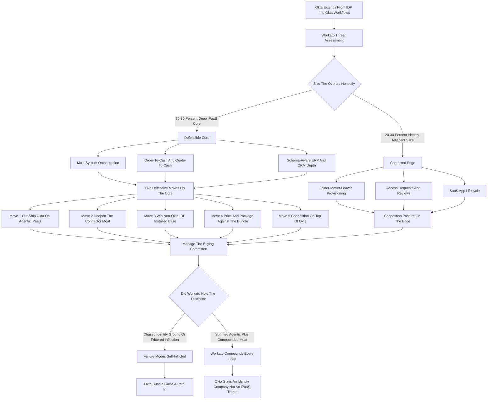
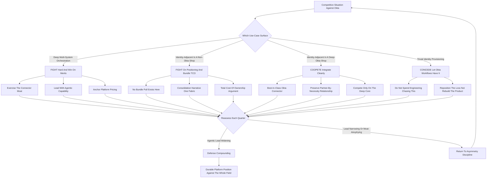

**TL;DR:** Workato defends against Okta in 2027 not by fighting on Okta's home turf -- identity-bound user-lifecycle automation -- but by widening the gap on the ground Workato already owns: **deep enterprise iPaaS integration breadth, agentic orchestration, and the system-of-record connector moat** that Okta cannot replicate without years of investment. The collision is real. Okta (NASDAQ: OKTA, roughly $2.6B-$2.8B FY25 revenue, ~$13-18B market cap) extended past pure identity after the $6.5B Auth0 acquisition into **Okta Workflows** -- a no-code automation layer bundled with Identity Governance -- and its strategic narrative is seductive: "we already own the identity graph, so we should own the automation that hangs off it." Workato (founded 2013, last priced near a **$5.7B valuation** in a 2021 Battery Ventures and Insight Partners round, estimated **$200M-$400M ARR**, private) is the enterprise iPaaS leader with **1,200+ connectors** spanning Salesforce, Workday, NetSuite, SAP, Oracle, ServiceNow, and the long tail of databases and messaging systems. The honest 2027 strategic picture: Okta Workflows is a genuine threat to the *thin* slice of Workato's footprint that is identity-adjacent -- joiner-mover-leaver provisioning, access requests, SaaS-app lifecycle -- but it is **not** a threat to the deep, transformation-heavy, multi-system orchestration that is 70-80% of why enterprises buy Workato in the first place. Workato's defensible playbook has **five moves**: (1) **out-ship Okta on agentic iPaaS** -- LLM-powered autonomous workflow agents that make judgment calls, a 12-24 month lead window before Okta can build or buy comparable; (2) **deepen the system-of-record connector moat** -- full-schema Workday, NetSuite, SAP, and Salesforce depth that Okta Workflows is structurally shallow on; (3) **win the non-Okta IDP installed base** -- Microsoft Entra ID, Google Workspace, Ping Identity, and ForgeRock customers who feel zero pull toward an Okta-bundled automation layer, which is **60%+ of the enterprise identity market**; (4) **price and package against the bundle** -- refuse to be the line item Okta gives away, and reframe the buying committee from the identity owner to the integration and platform owner; and (5) **partner where you cannot win alone** -- keep deep Okta *integration* (Workato should remain the best automation layer *on top of* Okta as an IDP) so the relationship is coopetition, not a zero-sum war. The three things that would actually let Okta win: Workato **fails to ship agentic iPaaS at depth**, lets the **identity-owner persona quietly become the automation buyer**, or **neglects the connector moat** while chasing identity-adjacent use cases it will always lose. Net: Workato can defend successfully in 2027 -- but only by refusing the fight Okta wants and compounding the lead on the fight Workato already wins.

## The Competitive Collision: What Is Actually Happening

The Workato-versus-Okta question is not a hypothetical -- it is a real platform-boundary collision that sharpened through the mid-2020s, and a strategist must understand its precise shape before reasoning about defense. Workato is the enterprise iPaaS (integration Platform-as-a-Service) leader: founded in 2013, it built its position on a deceptively simple promise -- let business and IT teams connect any enterprise system to any other and automate the workflows that run across them, without a services army. By 2027 Workato carries 1,200-plus pre-built connectors, an enterprise customer base in the thousands, and a last-known private valuation near $5.7B from its 2021 round. Okta is the identity leader: an IDP (identity provider) that became the default single-sign-on and access-management layer for cloud-first enterprises, roughly $2.6B-$2.8B in FY25 revenue, public since 2017. The collision was set in motion when Okta acquired Auth0 for $6.5B in 2021 and -- more importantly for this question -- when Okta leaned into **Okta Workflows**, a no-code automation product, and bundled it into its Identity Governance and lifecycle-management suite. Okta's strategic logic is coherent and dangerous: identity is the spine of every enterprise's user graph, so the automation that provisions, de-provisions, and governs users *should* live where identity already lives. If Okta owns the identity graph, the argument goes, it should own the lifecycle automation that hangs off it -- and lifecycle automation, Okta will claim, is a large fraction of what companies buy iPaaS for anyway. That is the threat. The strategist's job is to size it honestly: it is real on the identity-adjacent edge, and it is mostly noise in the deep integration core. Everything in this playbook follows from holding both of those truths at once.

## Sizing The Threat Honestly: Where Okta Workflows Actually Competes

A defense built on either panic or dismissal will fail, so the first discipline is an honest map of the overlap. **Where Okta Workflows genuinely competes with Workato:** joiner-mover-leaver automation (provisioning a new hire's accounts across SaaS apps, changing access on a role move, de-provisioning a departure); access-request and access-review workflows; SaaS-application lifecycle management; identity-event-triggered notifications and approvals; and lightweight "when an identity thing happens, do a sequence of simple things" orchestration. This is a legitimate, valuable slice -- and for an enterprise already deep on Okta as its IDP, Okta Workflows is a natural, low-friction choice for exactly these use cases. A strategist who tells the Workato sales force "Okta Workflows is a toy" is setting them up to lose deals they should have repositioned. **Where Okta Workflows does not meaningfully compete:** multi-system financial close orchestration across NetSuite, Salesforce, and a data warehouse; order-to-cash automation spanning CRM, ERP, billing, and fulfillment; quote-to-cash with deep transformation logic; data synchronization with conflict resolution between systems of record; complex error handling, retry logic, and human-in-the-loop exception routing across non-identity systems; and anything requiring deep, schema-aware connectors into Workday, SAP, Oracle, or NetSuite. This is the deep iPaaS core, and it is structurally outside Okta's reach because Okta's connector investment is identity-shaped -- it knows how to read and write user objects, not how to orchestrate a three-way revenue-recognition reconciliation. The honest size of the threat: Okta can credibly contest perhaps 20-30% of Workato's use-case surface (the identity-adjacent slice), and it is essentially shut out of the other 70-80%. The entire defensive strategy is built on protecting and expanding that 70-80% while gracefully conceding -- or coopeting on -- the contested edge.

## Workato's Real Moat: The System-Of-Record Connector Depth

The single most important asset in Workato's defense is the one that is hardest for Okta to copy and easiest for Workato to underinvest in: connector depth into systems of record. A connector is not a checkbox. A *shallow* connector authenticates and moves a few common objects. A *deep* connector understands the target system's full schema, its custom objects and fields, its business logic, its rate limits, its bulk APIs, its eventing model, and its idiosyncratic failure modes -- and it stays current as the target system changes its API quarterly. Workato's 1,200-plus connectors include genuinely deep integrations into Workday, NetSuite, Salesforce, SAP, Oracle, ServiceNow, Marketo, and the long tail. That depth is the product of more than a decade of engineering, customer-driven hardening, and a connector SDK that lets the ecosystem extend coverage. Okta Workflows, by contrast, has a connector library shaped by identity use cases -- strong on SaaS-app provisioning endpoints, thin on the transformation-heavy, schema-aware ERP and CRM depth that enterprise integration actually requires. This asymmetry is Workato's deepest defensive position because it compounds: every year Workato hardens its connectors, every enterprise customer that pushes a connector to handle a new edge case, every API version Workato tracks -- all of it widens a moat that Okta would need years and a fundamentally different engineering focus to cross. The strategic imperative is therefore counterintuitive but absolute: **Workato must keep investing aggressively in connector depth even though it is unglamorous, because the connector moat is the thing Okta most cannot replicate.** A Workato that lets its connector depth atrophy while chasing shinier roadmap items is a Workato that has voluntarily filled in its own moat.

## Defensive Move One: Out-Ship Okta On Agentic iPaaS

The first active defensive move is to win the next platform shift before Okta can contest it. The shift is agentic iPaaS -- integration and automation where LLM-powered agents do not merely execute predefined rules but make judgment calls: routing an exception based on context, deciding whether to escalate, generating a response, interpreting an unstructured input, and choosing among possible actions. Workato announced agentic capabilities in the mid-2020s and has a real head start. Okta does not have a native LLM or agent platform; to compete on agentic automation, Okta would have to build one (years), buy one (expensive and integration-heavy), or partner (ceding control of the layer that matters most). That gap is a 12-24 month lead window, and lead windows in platform competition are use-them-or-lose-them. The defensive logic is precise: if the *next* generation of automation is agentic, and Workato establishes itself as the agentic iPaaS standard while Okta Workflows is still rule-based, then the competitive question stops being "identity automation versus integration automation" and becomes "intelligent autonomous orchestration versus a no-code rules engine" -- a comparison Workato wins decisively. The execution requirements are demanding: ship agentic capabilities that are genuinely production-grade, not demoware; make agents safe and governable (enterprises will not deploy autonomous agents they cannot audit and constrain); integrate the agentic layer with the connector moat so agents can act across deep system-of-record integrations; and price and package it so it pulls enterprises up-market rather than confusing the buy. The strategic point: a lead window only matters if you sprint through it. Workato's agentic head start is its single best offensive-as-defense move, and the risk is not that Okta closes the gap quickly -- it cannot -- but that Workato fails to ship at depth and lets the window close from its own side.

## Defensive Move Two: Deepen And Defend The Connector Moat

The second move is to treat the connector moat not as a static asset but as an active investment program. This means several concrete commitments. **Keep deepening the systems of record that matter most** -- Workday, NetSuite, SAP S/4HANA, Salesforce, Oracle Fusion -- so that for the use cases Okta most wants to contest, the Workato connector is so obviously deeper that the bake-off is not close. **Track API change relentlessly** so connectors never silently break when a target system ships a new version. **Invest in the connector SDK and the partner ecosystem** so the long tail extends faster than any single vendor could build it, turning the ecosystem into a force multiplier Okta would have to recreate from scratch. **Publish connector depth as a competitive artifact** -- not just "1,200 connectors" as a vanity number, but demonstrable depth (custom-object support, bulk operations, eventing, error semantics) that a technical buyer can verify in a proof-of-concept. **Build connector depth into the sales motion** so every competitive deal against Okta Workflows is steered toward a use case that exercises the connector moat. The strategic discipline here is resisting the temptation to chase Okta onto identity-adjacent ground. Every engineering dollar spent trying to out-Okta Okta on user-lifecycle provisioning is a dollar not spent widening the moat Okta cannot cross. Workato's defense is strongest when it is asymmetric: fight where you are deep, not where your competitor is.

## Defensive Move Three: Win The Non-Okta IDP Installed Base

The third move is a positioning and go-to-market play that costs almost nothing and neutralizes a huge fraction of Okta's bundle leverage. Okta's "identity + automation" bundle only has pull for enterprises that use Okta as their IDP. For everyone else, the bundle is irrelevant -- and "everyone else" is the majority of the enterprise market. **Microsoft Entra ID** (formerly Azure AD) is bundled into the Microsoft 365 estate that dominates enterprise IT; Microsoft's identity revenue dwarfs Okta's, and a Microsoft-shop CIO feels zero pull toward an Okta-bundled automation layer. **Google Workspace** carries its own identity and access management for a large installed base. **Ping Identity** and **ForgeRock** -- both taken private by Thoma Bravo and combined -- serve large, identity-sophisticated enterprises, especially in regulated industries. **CyberArk**, **SailPoint**, and others occupy adjacent identity-governance ground. Add it up and well over half of the enterprise identity market does not run Okta as its primary IDP. For every one of those accounts, Workato's competitive position against Okta Workflows is structurally strong: there is no bundle, no incumbency, no "you already pay Okta, just add Workflows" pull. The defensive play is to make this explicit in positioning, sales enablement, and account targeting -- to deliberately concentrate competitive energy on the Entra ID, Google Workspace, Ping, and ForgeRock installed base where Workato wins on the merits, while treating deep-Okta accounts as a different, more nuanced motion (covered in the coopetition move). This is the cheapest, highest-leverage defensive move available: it does not require shipping anything, only choosing where to fight.

## Defensive Move Four: Price And Package Against The Bundle

The fourth move addresses the most dangerous mechanism in Okta's playbook: the giveaway. Bundling's competitive power is that the bundled component does not need to win on its own merits -- it only needs to be "good enough and already included." Okta can make Okta Workflows feel free inside an Identity Governance deal, and "free and adequate" beats "excellent and a separate line item" for the slice of buyers who are not sophisticated about integration. Workato's pricing and packaging defense has several components. **Refuse to be valued as a feature** -- Workato must consistently reframe the conversation from "automation as an add-on to identity" to "the integration and automation platform as strategic infrastructure," because a platform commands platform pricing and a feature gets compared to free. **Sell the platform, not the project** -- land on a deep, multi-system use case where the value is self-evidently beyond what a bundled rules engine could do, then expand. **Make the total-cost-of-ownership comparison explicit** -- a "free" bundled automation layer that cannot handle the deep use cases means the enterprise still buys a real iPaaS, so the bundle did not save money, it added a redundant tool. **Package agentic and connector depth as the premium tier** so the things Okta cannot match are the things that anchor Workato's price. **Protect the identity-adjacent use cases that are worth protecting** with packaging that makes Workato the obvious choice when the enterprise wants *one* automation platform across identity and non-identity work -- the consolidation argument. The strategic core: bundling beats unbundled features, but it does not beat a genuinely differentiated platform that the buyer understands as strategic. Workato's pricing defense is really a positioning defense -- never let the deal be scored as "automation feature versus automation feature."

## Defensive Move Five: Coopetition -- Be The Best Automation Layer On Top Of Okta

The fifth move is the most counterintuitive and the most mature: do not declare total war on Okta, because for a large set of accounts Okta is the IDP and Workato is the automation layer *on top of* it, and that relationship should be excellent. The reasoning is structural. Many of Workato's best enterprise customers run Okta as their IDP. For those accounts, Workato orchestrating workflows that *consume* Okta identity events -- and Workato being the deep integration layer that Okta Workflows cannot be -- is a coopetition relationship, not a zero-sum one. If Workato treats every Okta-shop account as a battlefield, it risks (a) pushing those accounts toward the Okta bundle out of vendor-consolidation fatigue, and (b) degrading the Workato-Okta technical integration that those customers depend on. The smarter posture: maintain a best-in-class Okta connector and Okta-event integration so that in an Okta shop, Workato is the obvious deep-automation partner; let Okta Workflows have the trivial identity-adjacent automations it will win anyway; and compete hard only on the deep use cases where Workato's win is on the merits. This is the difference between a strategist and a brawler. Total war against a platform that is also a partner-by-necessity for a chunk of your base is a strategic error. Coopetition -- compete on the deep core, integrate cleanly on the identity edge -- preserves the accounts, preserves the technical relationship, and concentrates the actual fight where Workato is strongest. Defense is not always attack; sometimes it is refusing the fight your opponent wants.

## The Buying Committee: Who Actually Decides, And How Okta Tries To Move It

A subtle but decisive front in this competition is *who inside the enterprise owns the decision*. Okta's bundle strategy is, underneath, a buying-committee strategy: if the identity owner (often a security or IAM leader) becomes the de facto owner of automation, then Okta's incumbency in identity converts directly into automation wins. Workato's deep iPaaS, by contrast, is bought by integration leaders, platform engineering, enterprise architecture, and increasingly business-unit automation owners and CIOs thinking about a consolidated automation fabric. The defensive imperative is to keep the automation decision anchored with the persona who values integration depth -- and to actively prevent the quiet drift of automation ownership to the identity owner. Concretely: Workato's field motion should engage enterprise architecture and platform engineering early, frame automation as cross-functional infrastructure rather than an identity adjacency, and give the integration owner the artifacts (TCO models, architecture diagrams, consolidation narratives) to win the internal argument against "just use what's bundled with Okta." The risk is insidious because it is organizational, not technical: Okta does not need to build a better product to win if it can quietly make the identity owner the automation buyer. Workato's defense includes a deliberate stakeholder strategy that keeps the decision with the people who can tell the difference between a rules engine and an integration platform.

## What Okta Genuinely Does Well -- And Why It Matters For The Defense

A credible defense respects the opponent, and Okta has real strengths a strategist must account for. Okta's identity incumbency is genuine and sticky -- ripping out an IDP is painful, so Okta has durable access to its installed base. Okta Workflows is a competent no-code product for what it is built to do; for identity-adjacent automation in an Okta shop, it is genuinely a reasonable choice, and pretending otherwise loses credibility. Okta has a strong security and governance brand, which matters because enterprises increasingly want automation that is governed and auditable -- and "governed automation from your identity vendor" is a resonant pitch. Okta has the balance sheet and public-market currency to acquire its way toward gaps, including potentially an agentic-automation acquisition. And Okta's "identity-first" narrative is intellectually coherent in an era where identity is genuinely becoming the control plane for security. Why this matters for the defense: it tells Workato exactly what *not* to do. Do not try to out-incumbent Okta in identity. Do not dismiss Okta Workflows as worthless and lose credibility with technical buyers. Do not assume Okta cannot acquire an agentic capability -- which is precisely why Workato's agentic lead window must be sprinted through now, not strolled through. Respecting the opponent produces a sharper defense than dismissing it.

## What Workato Genuinely Does Well -- The Assets To Compound

The flip side of respecting Okta is being clear-eyed about Workato's real, compoundable assets. **Connector depth** -- the 1,200-plus connectors with genuine schema-aware depth into systems of record -- is the moat, covered above. **The unified low-code platform** spans integration, workflow automation, API management, and increasingly agentic orchestration in one environment, which is a consolidation story enterprises want. **The business-plus-IT user model** -- Workato is usable by business technologists, not only integration engineers -- expands the buying surface and the expansion motion inside accounts. **Enterprise trust and reference base** -- Workato has thousands of enterprise customers and a track record on mission-critical workflows, which de-risks the buy. **The agentic head start** is a genuine lead, covered above. **The recipe and template ecosystem** lowers time-to-value and creates switching costs. **A land-and-expand motion** that starts with one deep use case and grows across the enterprise is structurally strong because each new connected system makes the next integration easier. The strategic instruction that falls out of this list: Workato's defense is fundamentally an *offense on its own ground* -- compound the connector moat, sprint the agentic lead, deepen the platform consolidation story, and keep the buying surface broad. Defense framed as "stop Okta" is weak; defense framed as "widen every lead we already have so the Okta question answers itself" is strong.

## The iPaaS Market Landscape: Workato Is Not Only Defending Against Okta

A strategist must place the Okta threat in the full competitive context, because over-indexing on one competitor distorts strategy. Workato competes in a crowded enterprise iPaaS and automation market. **MuleSoft** (Salesforce-owned) is the heavyweight in API-led integration, strong in Salesforce-centric enterprises. **Boomi** (private-equity-owned after spinning out of Dell) is a long-standing iPaaS incumbent with a broad customer base. **Microsoft Power Automate** is the bundled-into-the-Microsoft-estate threat that is, in its own way, a bigger version of the Okta bundle problem -- Power Automate is "free enough" inside the Microsoft 365 and Power Platform estate. **SnapLogic**, **Tray.io**, and **Celigo** occupy adjacent iPaaS and automation positions. **UiPath** and **Automation Anywhere** come at automation from the RPA direction and are converging toward the same agentic-automation center. **Zapier** and **Make** dominate the lighter-weight, SMB-and-team end. The reason this matters for the Okta defense: many of the same moves that defend against Okta -- connector depth, agentic leadership, platform consolidation, anchoring on deep use cases, keeping the right buyer -- are the same moves that defend against MuleSoft, Boomi, and especially Microsoft Power Automate. Workato should not build an Okta-specific strategy; it should build a *platform-strength* strategy that happens to defeat the Okta bundle as one of several bundle-and-incumbent threats. The Microsoft Power Automate bundle is arguably a larger structural threat than Okta Workflows, and a defense that obsesses over Okta while Power Automate erodes the base from the Microsoft side has mis-aimed.

## The Agentic Inflection: Why The Next 24 Months Decide The Decade

The deepest strategic frame for this question is timing. Enterprise automation is at an inflection: the shift from rule-based to agentic automation is the biggest platform change in the category since the move from on-premise middleware to cloud iPaaS. Inflections are when competitive positions are won and lost, because the new layer is up for grabs in a way the mature layer is not. Workato enters the agentic inflection with a head start, a connector moat that makes its agents *able to act*, and a unified platform. Okta enters it with no native agentic platform and an identity-shaped connector library. If Workato establishes agentic iPaaS leadership during the inflection -- roughly the next 24 months -- it does not just defend against Okta Workflows; it resets the entire competitive frame so that "rule-based automation bundled with identity" is a previous-generation product. If Workato fritters the inflection -- ships agentic features that are demoware, fails to make agents governable, fails to connect agents to the deep connector moat -- then the inflection becomes the moment a better-capitalized competitor (Microsoft, or an Okta that acquires) catches up. The strategic instruction is stark: the Okta defense and the agentic sprint are the *same project*. Win the inflection and the Okta question is settled in Workato's favor for years. Lose it and no amount of connector depth fully compensates, because the buyer's definition of "modern automation" will have moved.

## Scenario One: The Disciplined Asymmetric Defense

Concrete scenarios make the strategy tangible. In the disciplined-defense scenario, Workato's leadership refuses the fight Okta wants. Engineering investment concentrates on two things: sprinting agentic iPaaS to genuine production depth, and continuing to deepen the system-of-record connector moat. Go-to-market deliberately targets the Entra ID, Google Workspace, Ping, and ForgeRock installed base where Okta's bundle has no pull, while running a coopetition motion in Okta shops -- best-in-class Okta integration, competing only on deep use cases. Pricing and positioning never let a deal be scored as "automation feature versus automation feature"; every competitive cycle is steered onto multi-system orchestration that exercises the moat. The buying committee is actively managed to keep automation ownership with enterprise architecture and platform engineering. The outcome: Okta Workflows wins the trivial identity-adjacent automations it was always going to win, Workato compounds its lead on the 70-80% deep core, and by the end of the agentic inflection Workato is the clear agentic iPaaS leader. Okta remains a respected identity company with a competent automation feature -- not an iPaaS threat. This is the scenario where the defense works because Workato played its own game harder instead of playing Okta's game at all.

## Scenario Two: The Reactive Mistake -- Chasing Okta Onto Identity Ground

In the cautionary scenario, Workato's leadership over-reacts to the Okta narrative. Stung by competitive-deal losses on identity-adjacent use cases, Workato redirects engineering toward out-Okta-ing Okta on user-lifecycle provisioning, access requests, and identity governance -- ground where Okta has structural incumbency and Workato will always be the challenger. The agentic roadmap slips because engineering attention is split. The connector moat stops getting deeper because the unglamorous work lost its budget fight to the shiny identity-adjacency initiative. Sales enablement starts pitching Workato as an "Okta Workflows alternative," which frames Workato as a feature competitor rather than a platform. The result is the worst of both worlds: Workato still loses most identity-adjacent deals in Okta shops (incumbency wins those), and it has voluntarily slowed the two investments -- agentic depth and connector depth -- that were its actual defense. The agentic inflection passes with Workato having shipped less than it could have, and a better-capitalized competitor closes the gap. This scenario is the canonical illustration of the core strategic error: a defense that fights on the opponent's ground, on the opponent's terms, with the opponent's incumbency advantages intact.

## Scenario Three: The Bundle Erosion From The Microsoft Side

In the third scenario, Workato wins the Okta-specific fight but loses the war it should have been fighting. Workato successfully defends against Okta Workflows -- the asymmetric playbook works, Okta stays an identity company. But while leadership was focused on the Okta narrative, **Microsoft Power Automate** quietly eroded Workato's base from the Microsoft 365 and Power Platform side. Power Automate is the same bundle threat as Okta Workflows but bigger: it is "free enough" inside an estate that the majority of enterprises already run, and the Microsoft field motion is relentless. Mid-market and the lower end of enterprise drift toward "good enough and already paid for," and Workato finds its land-and-expand motion starting from a smaller beachhead because the easy automations were captured by Power Automate before Workato ever got in the door. The lesson embedded in this scenario: the Okta defense must be a *general bundle-and-incumbent defense*, not an Okta-specific one. The moves are the same -- connector depth, agentic leadership, platform consolidation, deep-use-case anchoring, the right buyer -- but they must be aimed at the whole field, with Microsoft arguably the larger structural threat. A strategist who builds an Okta-shaped defense has built a defense with a Microsoft-shaped hole in it.

## The Connector SDK And Ecosystem As A Defensive Multiplier

One under-appreciated element of the defense deserves its own treatment: the connector SDK and the partner ecosystem that extends Workato's coverage. The connector moat is not only what Workato's own engineers build -- it is what the ecosystem builds on Workato's SDK, what system integrators and ISVs contribute, and what customers extend for their own edge cases. This matters defensively for three reasons. First, it makes the moat grow faster than any single vendor's engineering capacity, which means Okta would have to recreate not just connectors but an entire ecosystem incentive structure. Second, it creates switching costs: an enterprise that has built custom connectors and recipes on Workato's SDK has sunk real investment into the platform. Third, it creates a flywheel -- more connectors attract more customers, more customers attract more ecosystem contributors, more contributors deepen the moat. The strategic instruction is to treat the SDK and ecosystem as a first-class part of the defensive program: invest in SDK quality and documentation, create real economic and visibility incentives for ecosystem connector contributions, and make ecosystem-built depth visible to buyers as part of the "1,200-plus connectors" story. Okta can build connectors; replicating a thriving connector ecosystem is a far harder, multi-year proposition. The ecosystem is a moat-widening machine, and a defense that ignores it leaves a force multiplier unused.

## Governance, Security, And Auditability: Taking Okta's Own Argument Away

Okta's most resonant pitch for Okta Workflows is governance: "automation from your identity and security vendor is automation you can trust and audit." It is a genuinely strong argument in an era when enterprises are nervous about ungoverned automation -- and especially nervous about autonomous agents. The defensive move is to take that argument away by making Workato's own governance and security story unimpeachable. This means: enterprise-grade access controls, audit logging, and lifecycle governance on every recipe and connection; clear data-handling and compliance posture; and -- critically, as agentic capabilities ship -- agent governance that lets enterprises constrain, audit, and roll back what autonomous agents do. If Workato's governance story is as strong as Okta's, then Okta's "trusted because it's from your security vendor" pitch loses its edge, and the comparison reverts to platform depth -- where Workato wins. If Workato's governance story is weak, Okta's argument lands and the security-conscious buyer reaches for the bundle. The strategic point: in 2027, governance is not a compliance checkbox, it is a competitive surface. Workato cannot out-identity Okta, but it absolutely can match Okta on the governance and auditability of automation itself -- and doing so neutralizes the single most persuasive thing Okta says.

## The Consolidation Narrative: One Automation Fabric Beats Two Tools

A powerful and underused part of Workato's defense is the consolidation argument, which actually turns Okta's own bundle logic against it. Okta's pitch is "you already have Okta, add Workflows." Workato's counter-pitch is: "an enterprise that uses Okta Workflows for identity-adjacent automation and a real iPaaS for everything else is running two automation tools, two governance models, two skill sets, two vendors -- when one unified automation fabric across identity and non-identity work is simpler, cheaper to operate, and easier to govern." For the CIO or enterprise architect thinking about platform rationalization -- and in 2027 most are -- the consolidation argument is compelling. It reframes Okta Workflows from "a free add-on" to "a second automation tool you now have to manage." The defensive execution is to make Workato demonstrably capable of the identity-adjacent use cases too -- not better than Okta at pure identity provisioning, but good enough that an enterprise can credibly run *one* automation platform across the whole surface. Then the buying conversation becomes "one fabric or two," and "one" wins on operational simplicity, governance coherence, and total cost. The consolidation narrative is the move that lets Workato compete for the identity-adjacent slice without trying to out-incumbent Okta -- it competes on architecture philosophy instead.

## Talent, Engineering Focus, And The Discipline Of Saying No

A defense is ultimately an allocation of finite engineering and go-to-market capacity, and the hardest part of this strategy is the discipline of *not* doing things. Workato's leadership will face constant pressure to react: a competitive loss generates a demand to "close the gap" on identity-adjacency; a board member reads an Okta press release and asks why Workato isn't responding; a sales leader wants a feature to win a specific deal. Every one of those pressures, if obeyed, pulls engineering capacity away from the two things that actually constitute the defense -- agentic depth and connector depth. The strategic discipline is to maintain a clear, defensible answer to "why aren't we chasing that": because our defense is asymmetric *by design*, because we win by widening our leads, not by narrowing our competitor's. This requires leadership alignment, a roadmap governance process that protects the core investments from reactive raids, and a sales-enablement function that arms the field to *reposition* identity-adjacency losses rather than demand product changes to chase them. The companies that lose platform competitions often lose not because they picked the wrong strategy but because they could not hold the strategy under pressure. The discipline of saying no -- of letting Okta have the trivial identity automations, of not building the reactive feature, of protecting the agentic and connector budgets through every quarterly pressure cycle -- is the operational core of whether this defense actually happens.

## How Workato Loses: The Three Failure Modes

A strategist should name the failure modes explicitly, because avoiding them is most of the defense. **Failure mode one: Workato fails to ship agentic iPaaS at depth.** The head start is squandered -- agentic features are demoware, agents are not governable, the agentic layer is not wired to the connector moat -- and the inflection passes with Workato having shipped less than its lead allowed. A better-capitalized competitor catches up, and the entire competitive frame stays "rule-based automation," which is the frame where bundling wins. **Failure mode two: the identity owner quietly becomes the automation buyer.** Workato neglects the buying-committee front, automation-decision ownership drifts to the IAM and security leader inside enterprises, and Okta's identity incumbency converts directly into automation wins without Okta ever needing a better product. **Failure mode three: Workato neglects the connector moat while chasing identity-adjacency.** The unglamorous connector-depth investment loses its budget fights, the moat stops widening, and Workato simultaneously fails to win the identity-adjacent ground it chased -- the reactive-mistake scenario. Notice that all three failure modes are self-inflicted. Okta cannot take the deep iPaaS core from Workato by force; Workato can only lose it by failing to ship, failing to manage the buyer, or failing to invest in the moat. The defense is almost entirely within Workato's own control -- which is the good news and the uncomfortable news at once.

## The Decision Framework: How Workato Should Evaluate Every Competitive Choice

Pulling the playbook into a usable decision framework, Workato leadership facing any Okta-related strategic choice should run it through these tests. **The asymmetry test:** does this move fight where Workato is deep, or does it chase Okta onto identity ground? Fund the former, reject the latter. **The inflection test:** does this accelerate or slow the agentic sprint? The agentic inflection is time-bound; nothing should be allowed to slow it. **The moat test:** does this widen or neglect the connector moat? The moat is the thing Okta most cannot copy; it must keep getting deeper. **The buyer test:** does this keep the automation decision with the integration-and-platform owner, or does it let it drift to the identity owner? Protect the buyer. **The framing test:** does this let the deal be scored as "feature versus feature," or does it keep Workato positioned as strategic platform infrastructure? Never compete as a feature. **The coopetition test:** for an Okta-shop account, does this preserve the partner-by-necessity relationship, or does it pick a zero-sum fight that risks the account? Compete on the deep core, integrate cleanly on the edge. **The whole-field test:** does this defense also work against Microsoft Power Automate, MuleSoft, and Boomi, or is it Okta-specific? Build platform strength, not competitor-specific tactics. A move that passes all seven tests is a real defensive move. A move that fails the asymmetry, inflection, or moat tests is the reactive mistake wearing a strategy costume. The framework's purpose is to convert the pressure of competitive anxiety into disciplined, repeatable choices.

## The 2027-2030 Outlook: Where This Competition Is Heading

A strategist committing to this defense should hold a view of where the Workato-Okta competition goes through 2030. Several trends are reasonably clear. **The agentic shift accelerates and becomes the category's center of gravity** -- by 2030 "automation" means agentic automation, and the vendors who led the inflection set the terms. **Bundling pressure intensifies from every direction** -- Microsoft, Salesforce (MuleSoft), and identity vendors all push automation as a bundled component, which means Workato's "differentiated platform versus bundled feature" challenge is permanent, not an Okta-specific moment. **Identity genuinely becomes more central to the security control plane**, which means Okta's identity-first narrative gets *more* coherent over time, not less -- Workato's defense must account for an Okta whose core position strengthens. **Consolidation continues** -- enterprises keep rationalizing their automation and integration tool sprawl, which favors unified platforms and is structurally good for Workato's consolidation narrative. **Governance and auditability become non-negotiable** as autonomous agents proliferate, which makes Workato's governance investment a permanent competitive requirement. **The IPO and capital question looms** -- Workato as a private company competing against public, well-capitalized incumbents (Okta, Microsoft, Salesforce) eventually faces a capital-access question, and a strong agentic and connector position is what makes that capital event happen on good terms. The net outlook: the Workato-Okta competition is real but, played correctly, asymmetric in Workato's favor on the deep core -- and the larger truth is that defending against Okta well is the same thing as building a durable platform against the entire field. A Workato that sprints the agentic inflection, compounds the connector moat, manages the buyer, and refuses to fight on identity ground is not just defending against Okta; it is building the company that no bundle can dislodge.

## The Final Framework: Defending Workato Against Okta In 2027

Pulling the entire analysis into a single operating framework: Workato's leadership defending against Okta in 2027 should execute in this order. **First, name the threat honestly** -- Okta Workflows credibly contests the 20-30% identity-adjacent slice and is shut out of the 70-80% deep iPaaS core; the defense protects and expands the core, it does not fight for the edge. **Second, sprint the agentic inflection** -- ship production-grade, governable, connector-wired agentic iPaaS through the 12-24 month lead window, because the inflection and the Okta defense are the same project. **Third, compound the connector moat** -- keep deepening the systems of record, track API change relentlessly, and invest in the SDK and ecosystem as a moat-multiplier, because connector depth is what Okta most cannot copy. **Fourth, target the non-Okta IDP installed base** -- concentrate competitive energy on Entra ID, Google Workspace, Ping, and ForgeRock accounts where Okta's bundle has no pull. **Fifth, price and position as strategic platform infrastructure** -- never let a deal be scored as "automation feature versus automation feature." **Sixth, run coopetition in Okta shops** -- be the best deep-automation layer on top of Okta as an IDP, compete only on the deep core, and preserve the partner-by-necessity relationship. **Seventh, manage the buying committee** -- keep automation-decision ownership with enterprise architecture and platform engineering, and prevent the drift to the identity owner. **Eighth, match Okta on governance** -- make automation and agent governance unimpeachable so Okta's "trusted from your security vendor" pitch loses its edge. **Ninth, lead with the consolidation narrative** -- one automation fabric across identity and non-identity work beats two tools, which turns Okta's own bundle logic around. **Tenth, hold the discipline of saying no** -- protect the agentic and connector budgets from every reactive quarterly pressure, because the strategy fails on execution discipline, not on design. **Eleventh, build the whole-field defense** -- the same moves defend against Microsoft Power Automate, MuleSoft, and Boomi; Microsoft is arguably the larger structural threat. **Twelfth, keep the capital position strong** -- a leading agentic and connector position is what makes Workato's eventual capital event happen on good terms against well-funded public incumbents. Do these twelve things in this order and Workato defends successfully against Okta in 2027 -- not by winning Okta's fight, but by refusing it and compounding every lead Workato already holds. Skip the discipline -- chase identity-adjacency, fritter the agentic inflection, let the moat atrophy, lose the buyer -- and Workato hands a respected identity company a path into a market Okta could never have taken by force.

## The Defensive Strategy Map: From Threat Assessment To Compounded Lead

## The Decision Matrix: Fight, Coopete, Or Concede On Each Use-Case Surface

## Sources

1. **Okta, Inc. Investor Relations -- Annual Reports and Quarterly Results** -- FY revenue, segment commentary, and product-strategy disclosure for Okta including Identity Governance and Okta Workflows. https://investor.okta.com
2. **Okta -- Auth0 Acquisition Announcement ($6.5B, 2021)** -- Primary source for the acquisition that expanded Okta's platform ambitions beyond pure IDP. https://www.okta.com/press-room
3. **Okta Workflows -- Product Documentation** -- Capabilities, connector library, and positioning of Okta's no-code automation product. https://www.okta.com/products/workflows
4. **Workato -- Company and Platform Overview** -- Connector count, platform capabilities, and enterprise positioning for the iPaaS leader. https://www.workato.com
5. **Workato -- $5.7B Valuation Funding Round (Battery Ventures, Insight Partners, 2021)** -- Primary reference for Workato's last-known private valuation and investor base. https://www.workato.com/the-connector
6. **Workato -- Agentic Automation and Agentic iPaaS Announcements** -- Workato's product direction on LLM-powered autonomous workflow agents. https://www.workato.com/product
7. **Gartner -- Magic Quadrant for Integration Platform as a Service (iPaaS)** -- Analyst positioning of Workato, MuleSoft, Boomi, Microsoft, SnapLogic, and others in the enterprise iPaaS market.
8. **Gartner -- Magic Quadrant for Access Management** -- Analyst positioning of Okta, Microsoft Entra ID, Ping Identity, ForgeRock, and others in the identity market.
9. **Forrester -- The Forrester Wave: iPaaS / Enterprise Integration** -- Independent analyst evaluation of integration platforms and competitive positioning.
10. **Forrester -- The Forrester Wave: Workflow Automation and Digital Process Automation** -- Analyst coverage of the automation category where Okta Workflows and Workato overlap.
11. **Microsoft -- Entra ID (formerly Azure AD) and Power Automate Documentation** -- Reference for the Microsoft identity and bundled-automation footprint that shapes the non-Okta IDP market. https://www.microsoft.com/security/business/identity-access
12. **Thoma Bravo -- Ping Identity and ForgeRock Acquisitions** -- Primary reference for the consolidation of the Ping and ForgeRock identity businesses under private equity.
13. **Salesforce -- MuleSoft Overview** -- Reference for the API-led integration competitor inside the Salesforce estate. https://www.mulesoft.com
14. **Boomi -- Platform Overview** -- Reference for the long-standing iPaaS incumbent and competitive context. https://boomi.com
15. **a16z (Andreessen Horowitz) -- Enterprise Software and AI Agents Research** -- Investor analysis of the agentic-automation inflection and platform-competition dynamics. https://a16z.com
16. **Bessemer Venture Partners -- State of the Cloud Report** -- Cloud-software market data, including iPaaS and automation category benchmarks. https://www.bvp.com/atlas
17. **OpenView Partners -- SaaS Benchmarks and Product-Led Growth Research** -- Benchmark data on SaaS go-to-market, expansion, and competitive motion.
18. **Battery Ventures -- Software and Cloud Market Research** -- Investor perspective on enterprise software competition and the Workato investment thesis. https://www.battery.com
19. **Insight Partners -- Enterprise Software Market Commentary** -- Investor perspective relevant to the Workato funding and growth thesis. https://www.insightpartners.com
20. **IDC -- Worldwide Integration and Automation Software Market Forecasts** -- Market-sizing and growth data for the iPaaS and automation categories.
21. **Okta -- Identity Governance Product Documentation** -- The governance suite into which Okta Workflows is bundled, central to the bundle-threat analysis. https://www.okta.com/products/identity-governance
22. **UiPath and Automation Anywhere -- Investor and Product Materials** -- Reference for the RPA vendors converging toward agentic automation.
23. **G2 and TrustRadius -- Enterprise iPaaS and Automation Software Reviews** -- Practitioner reviews comparing Workato, Okta Workflows, MuleSoft, Boomi, and Power Automate.
24. **The Information / Enterprise Software Trade Coverage** -- Ongoing journalism on Workato, Okta, and the iPaaS competitive landscape.
25. **Okta Ventures and Okta Integration Network Documentation** -- Reference for Okta's integration ecosystem and connector approach.
26. **Workato -- Connector SDK and Recipe Ecosystem Documentation** -- Reference for the SDK and ecosystem that act as a connector-moat multiplier. https://docs.workato.com
27. **CIO and Enterprise Architecture Trade Press -- Platform Consolidation Coverage** -- Reference for the enterprise tool-rationalization trend that underpins the consolidation narrative.
28. **SnapLogic, Tray.io, and Celigo -- Product and Positioning Materials** -- Reference for the adjacent iPaaS competitors that shape the whole-field defense.
29. **NASDAQ -- OKTA Equity Data** -- Public market capitalization and trading data for Okta. https://www.nasdaq.com/market-activity/stocks/okta
30. **Workday, NetSuite, SAP, and Salesforce -- Developer and API Documentation** -- Reference for the system-of-record API surfaces that define connector depth. (https://developer.workday.com, https://developer.salesforce.com)
31. **Crunchbase -- Workato Funding and Valuation History** -- Reference for Workato's private funding rounds and valuation trajectory. https://www.crunchbase.com/organization/workato
32. **Identity Defined Security Alliance (IDSA) -- Identity as the Control Plane Research** -- Reference for the trend making identity more central to enterprise security, which strengthens Okta's core narrative.
33. **Enterprise Strategy Group (ESG) -- Automation and Integration Buyer Surveys** -- Buyer-side data on automation tool selection and buying-committee composition.
34. **McKinsey and BCG -- Enterprise Automation and AI Agents Reports** -- Consulting research on the agentic-automation inflection and enterprise adoption patterns.
35. **SEC EDGAR -- Okta 10-K and 10-Q Filings** -- Primary regulatory filings for Okta's financials, risk factors, and strategic disclosures. https://www.sec.gov/cgi-bin/browse-edgar

## Numbers

**The Two Companies At A Glance**

| Dimension | Workato | Okta |
|---|---|---|
| Category | Enterprise iPaaS / automation leader | Identity (IDP) leader extending into automation |
| Founded | 2013 | 2009 |
| Status | Private | Public (NASDAQ: OKTA) |
| Last-known valuation / market cap | ~$5.7B private valuation (2021 round) | ~$13B-$18B market cap range |
| Revenue (estimate / disclosed) | ~$200M-$400M ARR (private, estimated) | ~$2.6B-$2.8B FY25 revenue |
| Key acquisition | -- | Auth0, $6.5B (2021) |
| Lead investors | Battery Ventures, Insight Partners | Public shareholders |
| Connector / integration count | 1,200+ connectors | Identity-shaped connector library (narrower) |
| Automation product | Core platform: integration + workflow + agentic | Okta Workflows (no-code, bundled with Identity Governance) |

**Threat Sizing: The Use-Case Overlap**

| Use-case surface | Okta competitiveness | Workato position |
|---|---|---|
| Joiner-mover-leaver provisioning | Strong (in Okta shops) | Challenger -- concede or coopete |
| Access requests and reviews | Strong (in Okta shops) | Challenger -- concede or coopete |
| SaaS-app lifecycle | Moderate | Competitive on consolidation argument |
| Multi-system orchestration | Weak / shut out | Dominant -- defend and expand |
| Order-to-cash, quote-to-cash | Weak / shut out | Dominant -- defend and expand |
| Schema-aware ERP/CRM depth | Weak / shut out | Dominant -- the connector moat |
| Agentic autonomous orchestration | No native platform | 12-24 month lead window |

- Estimated contested (identity-adjacent) share of Workato's use-case surface: ~20-30%
- Estimated defensible (deep iPaaS core) share: ~70-80%

**The Non-Okta IDP Installed Base (Why Move 3 Works)**

| IDP / identity vendor | Bundle pull toward Okta Workflows | Workato competitive position |
|---|---|---|
| Microsoft Entra ID | None | Strong (but watch Power Automate) |
| Google Workspace IAM | None | Strong |
| Ping Identity (Thoma Bravo) | None | Strong |
| ForgeRock (Thoma Bravo) | None | Strong |
| CyberArk / SailPoint (governance-adjacent) | Low | Strong |
| Okta as primary IDP | High | Coopetition motion |

- Share of enterprise identity market NOT running Okta as primary IDP: estimated 60%+
- Strategic implication: the majority of the market feels zero pull toward the Okta bundle

**The Five Defensive Moves -- Cost And Leverage**

| Move | Primary cost | Leverage | Time horizon |
|---|---|---|---|
| 1. Out-ship on agentic iPaaS | High (engineering) | Very high -- resets the frame | 12-24 months (inflection-bound) |
| 2. Deepen connector moat | Medium-high (engineering) | High -- hardest for Okta to copy | Continuous |
| 3. Win non-Okta IDP base | Low (positioning / GTM) | Very high -- neutralizes the bundle | Immediate |
| 4. Price/package vs bundle | Low (positioning) | High -- prevents "feature" framing | Immediate |
| 5. Coopetition on top of Okta | Low-medium (integration) | Medium -- preserves accounts | Continuous |

**The Three Failure Modes (All Self-Inflicted)**
- Failure mode 1: fails to ship agentic iPaaS at depth -- the inflection passes, frame stays rule-based
- Failure mode 2: the identity owner quietly becomes the automation buyer -- incumbency converts to wins
- Failure mode 3: neglects the connector moat while chasing identity-adjacency -- loses both fights

**The Wider Competitive Field (The Whole-Field Defense)**

| Competitor | Threat type | Relative structural threat |
|---|---|---|
| Microsoft Power Automate | Bundle (M365 / Power Platform estate) | Arguably the largest |
| Okta Workflows | Bundle (Identity Governance) | Real but bounded to identity-adjacent edge |
| MuleSoft (Salesforce) | API-led integration incumbent | High in Salesforce-centric accounts |
| Boomi | iPaaS incumbent | Moderate, broad base |
| SnapLogic / Tray.io / Celigo | Adjacent iPaaS | Moderate |
| UiPath / Automation Anywhere | RPA converging to agentic | Rising |

- Strategic note: the same five moves that defend against Okta defend against the entire field
- Microsoft Power Automate is arguably a larger structural bundle threat than Okta Workflows

**The Agentic Inflection Timing**
- Lead window before Okta could build/buy comparable agentic capability: ~12-24 months
- Strategic equivalence: the Okta defense and the agentic sprint are the same project
- Outcome if won: "rule-based automation bundled with identity" becomes a previous-generation product
- Outcome if lost: a better-capitalized competitor (Microsoft, or an acquisitive Okta) closes the gap

## Counter-Case: Why Workato's Defense Against Okta Could Still Fail

The playbook above describes a defensible position, but a serious strategist must stress-test it against the conditions under which Workato loses anyway. There are real reasons the defense could fail.

**Counter 1 -- The bundle is more powerful than "differentiation" assumes.** The entire defense rests on the belief that a genuinely differentiated platform beats a bundled feature. But enterprise software history is littered with superior point products that lost to "good enough and already included." Okta can make Okta Workflows feel free; "free and adequate" has beaten "excellent and separate" many times. If the buyer is not sophisticated about integration -- and many are not -- the bundle wins regardless of how deep Workato's connectors are.

**Counter 2 -- Workato is private and capital-constrained against public incumbents.** Okta, Microsoft, and Salesforce can fund losses, acquire capabilities, and outspend on go-to-market indefinitely. Workato, private and at an estimated few-hundred-million ARR, cannot match that war chest. The agentic lead window is real, but a competitor with effectively unlimited capital can buy its way across a 12-24 month gap faster than the gap suggests. The defense assumes Workato can sprint; it may simply be outspent.

**Counter 3 -- The agentic inflection is also Workato's biggest risk, not just its opportunity.** Every vendor in the category -- Microsoft, UiPath, MuleSoft, and Okta itself -- is racing toward agentic automation. Workato's head start is real but not unique, and inflections reward capital and distribution as much as timing. If agentic automation becomes table stakes faster than Workato can convert its lead into durable share, the inflection equalizes the field instead of entrenching Workato.

**Counter 4 -- Identity genuinely is becoming the control plane.** Okta's "identity-first" narrative is not marketing fluff -- in a zero-trust, agent-saturated enterprise, identity really is becoming the spine of security and access. If that trend deepens, Okta's core position strengthens over time, and the argument "automation should live where identity lives" gets *more* persuasive, not less. Workato may be defending against an opponent whose foundational position is improving.

**Counter 5 -- The connector moat can be commoditized by AI.** Workato's deepest moat is connector depth built over a decade. But if AI-assisted integration -- LLMs that can read API documentation and generate connectors on the fly -- matures, the cost of connector depth could collapse. A moat that took ten years to build could be partially commoditized in two, and Okta (or Microsoft) could close the connector gap far faster than the historical build cost implies.

**Counter 6 -- Coopetition is unstable and can be ended unilaterally.** Move five assumes Workato can be the best automation layer on top of Okta as an IDP. But Okta controls that relationship. Okta can degrade its APIs for third-party automation, prioritize its own Workflows in the integration experience, or simply make the Okta-plus-Workato path worse than the Okta-plus-Okta-Workflows path. Coopetition only works while the larger partner allows it.

**Counter 7 -- The buying-committee battle may already be lost in many accounts.** The defense assumes Workato can keep automation ownership with enterprise architecture and platform engineering. But in security-conscious enterprises, the IAM and security organization is gaining budget and authority, not losing it. In a meaningful number of accounts, the identity owner may already be the de facto automation buyer -- and recovering that ground is far harder than holding it.

**Counter 8 -- Microsoft is the real threat, and it is bigger than this whole analysis.** The Okta question may be the wrong question. Microsoft Power Automate, bundled into the estate that most enterprises already run, is a structurally larger bundle threat than Okta Workflows. A strategist who builds an Okta-shaped defense -- even a good one -- has spent finite strategic attention on the second-most-important competitor. The defense could succeed against Okta and still lose the war to Microsoft.

**Counter 9 -- Execution discipline is genuinely hard to sustain.** The entire playbook depends on Workato holding the discipline of saying no -- protecting agentic and connector budgets through every quarterly competitive-loss pressure cycle. But that discipline is exactly what most companies fail at. Boards react to press releases, sales leaders demand features to win specific deals, and the reactive raid on the core budget is the normal failure mode, not the exception. The strategy may be right and still not survive contact with quarterly pressure.

**Counter 10 -- "Refusing the fight" can read as weakness to the market.** The asymmetric defense -- conceding the identity-adjacent edge, coopeting in Okta shops -- is strategically sound but narratively awkward. Analysts, customers, and the press may read "Workato isn't competing for identity automation" as "Workato is ceding ground to Okta." Perception can become reality in enterprise software, where buyers de-risk by choosing the vendor that looks like it's winning.

**The honest verdict.** Workato can defend successfully against Okta in 2027 -- the asymmetric playbook is sound, the deep iPaaS core is genuinely defensible, and the agentic lead is real. But the defense is not guaranteed, and it fails under identifiable conditions: if the bundle's pull is underestimated, if Workato is simply outspent by public incumbents, if the agentic inflection equalizes rather than entrenches, if AI commoditizes the connector moat, if coopetition is ended unilaterally by Okta, if the buying-committee battle is already lost, if Microsoft is the bigger unaddressed threat, or if Workato cannot hold execution discipline. The defense is mostly within Workato's control -- which means most of these failure modes are avoidable -- but "avoidable" is not "avoided." The strategist's job is to treat this counter-case as the pre-mortem: every counter is a thing that must be actively, deliberately prevented, not assumed away.

## Related Pulse Library Entries

- **q1894** -- How does Snowflake defend against Databricks in 2027? (Adjacent platform-boundary collision; data-cloud incumbents converging on the same center.)
- **q1895** -- How does Datadog defend against observability bundling in 2027? (Bundle-versus-best-of-breed dynamics in enterprise infrastructure software.)
- **q1896** -- How does HashiCorp defend against cloud-native bundling in 2027? (Independent platform versus hyperscaler bundle, the structural pattern behind the Okta question.)
- **q1897** -- How does Twilio defend against platform consolidation in 2027? (Communications-platform incumbent facing bundle pressure.)
- **q1898** -- How does Okta defend against Microsoft Entra ID in 2027? (The mirror-image question -- Okta itself as the defender against a larger bundler.)
- **q1899** -- How does MuleSoft compete in the iPaaS market in 2027? (The Salesforce-owned API-led integration competitor in Workato's core market.)
- **q1900** -- How does Boomi defend its iPaaS position in 2027? (The long-standing iPaaS incumbent and direct Workato competitor.)
- **q1901** -- What is the future of iPaaS and enterprise integration in 2030? (Long-term outlook context for the agentic inflection and platform consolidation.)
- **q1902** -- How does Microsoft Power Automate threaten standalone automation vendors? (The arguably-larger bundle threat referenced throughout this analysis.)
- **q1903** -- How do you compete against a bundled "good enough" feature in B2B SaaS? (The general strategic pattern of the Okta Workflows threat.)
- **q1904** -- What is agentic automation and how does it change enterprise software? (Deep dive on the agentic inflection central to Workato's defense.)
- **q1905** -- How does UiPath transition from RPA to agentic automation in 2027? (The RPA vendors converging on the same agentic center.)
- **q1906** -- How does a private SaaS company compete against public incumbents? (The capital-constraint counter-case for Workato.)
- **q1907** -- What is coopetition and when should a SaaS company use it? (The strategic posture behind Workato's move-five Okta relationship.)
- **q1908** -- How do enterprise buying committees decide on platform purchases? (The buying-committee battle that decides who owns the automation decision.)
- **q1909** -- How does a SaaS company build a defensible connector or integration moat? (Deep dive on the connector-depth moat that is Workato's core asset.)
- **q1910** -- What is the Gartner Magic Quadrant and how should vendors respond to it? (Analyst-positioning context for the iPaaS and access-management markets.)
- **q1911** -- How does identity become the security control plane in 2027? (The trend that strengthens Okta's core narrative over time.)
- **q9501** -- How do you build a competitive-strategy analysis for a B2B SaaS company? (The analytical framework method behind this entry.)
- **q9502** -- How do you scale a B2B SaaS go-to-market motion past the founder-led ceiling? (Go-to-market scaling context for an enterprise software company.)
- **q9601** -- How do you price a B2B SaaS platform against a bundled competitor? (Deep dive on Workato's move-four pricing-and-packaging defense.)
- **q9602** -- How does a SaaS company manage product roadmap discipline under competitive pressure? (The "discipline of saying no" that is the operational core of the defense.)
- **q9701** -- What is the enterprise iPaaS and automation software landscape in 2027? (Full market-map context for the whole-field defense.)
- **q9801** -- How do private SaaS companies approach IPO timing against public competitors? (The capital-event context referenced in the outlook.)
- **q9802** -- What is the future of enterprise software bundling and platform consolidation through 2030? (Long-term context for the permanent bundle-pressure trend.)

