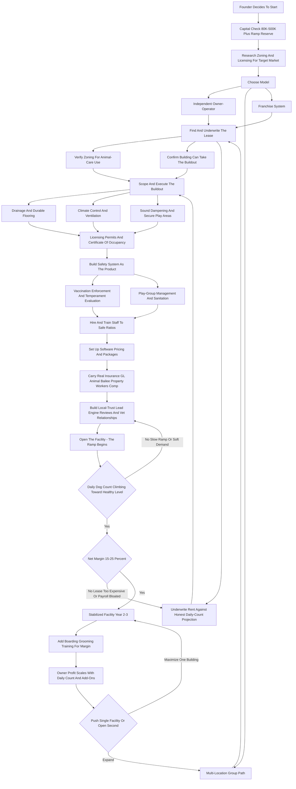
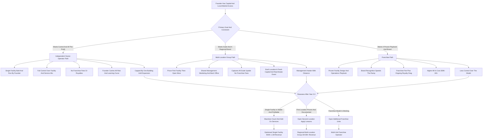

**TL;DR:** To start a doggy daycare business in 2027, you lease and build out a commercial facility, get it zoned and licensed as a pet-care operation, hire and train a staff of dog handlers, and charge dog owners to drop off their dogs during the work day for supervised play, exercise, and socialization -- typically **$35-$80 for a full day, $20-$50 for a half day, and $300-$800 a month for an unlimited package** -- while layering in overnight boarding, grooming, and training as higher-margin cross-sells. The model is **real and durable but capital-intensive and operationally relentless**: the entire economics rest on two numbers most beginners never calculate -- **average daily dog count** (how many dogs are physically in the building on a typical weekday, the single metric that drives revenue) and **net margin after rent and labor** (which is genuinely thin, 15-25%, because a daycare is a real-estate-and-payroll business wearing a play-yard costume). The honest 2027 economics: a single-facility startup invests **$80K-$500K** in buildout, deposits, equipment, licensing, and working capital, runs at a **15-25% net margin** after rent, labor, insurance, utilities, and supplies, and in a disciplined Year 1 generates **$150K-$500K in revenue** at **30-80 dogs a day** against **$25K-$110K in owner profit** -- back-loaded as the building fills from a near-empty opening week. By Year 2-3 a well-run single facility reaches **$400K-$900K**, and operators who add overnight boarding, grooming, and training, or open a second location, push toward **$1M-$3M+**, at which point the founder chooses between staying a lean owner-operator, building a multi-location group, or buying into a franchise system. The four things that kill doggy daycare startups: **(a) signing the wrong lease** -- a space that cannot be zoned for animals, drains poorly, has no outdoor yard, or carries rent the dog count can never cover; **(b) under-budgeting the buildout** -- drainage, climate control, sound dampening, and durable flooring are not optional and routinely run $50K-$400K; **(c) underestimating the labor model** -- ratios, turnover, and the wage floor for people willing to be bitten, scratched, and covered in worse; and **(d) opening with no ramp reserve** -- the building is full of fixed costs from day one but empty of dogs for months. Net: viable in 2027 as a disciplined, daily-count-obsessed, real-estate-and-labor-first operation built on a safe facility and a trusted local reputation -- a poor fit for anyone who wants a low-capital business, a passive asset, or a venture without a lease, a buildout, and a payroll.

## What A Doggy Daycare Business Actually Is In 2027

A doggy daycare business operates a commercial facility where dog owners drop off their dogs for the day -- typically while they are at work -- and the facility provides supervised group play, exercise, rest, socialization, and basic care until pickup in the evening. You are not a kennel that simply stores dogs in runs, and you are not a dog walker or a pet sitter who works out of other people's homes; you are running a physical place of business that dozens of dogs occupy at once, all day, every weekday. The entire business is a single operational idea executed thousands of times: a dog owner with a job, a long commute, a high-energy dog, or a guilty conscience about leaving an animal home alone for ten hours pays you a daily rate to take that problem off their hands, and because the same customer comes back two, three, or five days a week, every enrolled dog is a small recurring-revenue subscription rather than a one-time sale. That recurring nature is the quiet strength of the model -- a daycare with 200 enrolled dogs averaging three visits a week at $50 is a predictable, schedule-able revenue machine. In 2027 the business is shaped by realities that did not fully exist a decade ago: dog ownership surged and stayed elevated after the early-2020s pet boom, with roughly 89 million dogs in US households; the return-to-office trend pulled dogs out of all-day human company and created exactly the gap daycare fills; owners increasingly treat dogs as family and will spend accordingly; and software now lets a small operator run enrollment, vaccination tracking, scheduling, billing, and even live webcams without a back office. The doggy daycare business is not glamorous and it is not passive. It is a commercial-real-estate-and-payroll business with a play yard attached, and the founders who succeed understand that the dogs are the fun part; the business is a lease, a buildout, a license, an insurance policy, a payroll, a drainage system, and a spreadsheet tracking how many dogs walked in the door today.

## The Service Categories: What You Actually Sell And Why

The revenue of a doggy daycare comes from a stack of services, and a founder must understand every one before signing a lease, because the mix you build determines whether the facility is a thin-margin daycare or a healthy multi-service pet operation. **Full-day daycare** is the core product -- the dog arrives in the morning, plays and rests in supervised groups all day, and goes home in the evening; it is the volume engine and the reason the customer enrolls, priced at roughly $35-$80 depending on market. **Half-day daycare** serves shorter shifts and partial needs at $20-$50 and fills capacity at the edges of the day. **Multi-day and unlimited packages** -- 10-day punch cards at $300-$700, unlimited monthly memberships at $300-$800 -- are the most important commercial structure in the business because they convert occasional users into committed recurring revenue and smooth the schedule. **Overnight boarding** is the single highest-impact add-on: the facility, the staff, the licensing, and the customer relationship already exist, so boarding at $50-$150 a night uses the same asset overnight and on weekends when daycare is quiet, and it is where many daycares find their margin. **Grooming** -- bath, brush, nail trim, full groom at $40-$150 -- is a high-margin cross-sell to a captive audience of dogs already in the building. **Training** -- group classes, private sessions, board-and-train at $50-$150 a session -- monetizes the same customer relationship and the same facility. **Retail** -- food, treats, toys, leashes -- is a modest convenience-margin add-on. **Webcam access** is sometimes a premium upcharge and sometimes a free trust-builder. **Transportation** -- pickup and drop-off shuttle service -- is an operationally heavy add-on some daycares offer to widen their radius. A founder should think of the service stack as a layered business: daycare is the recurring volume base that fills the building and the relationships, boarding is the asset-utilization multiplier that fills the nights and weekends, and grooming and training are the high-margin services sold to the captive base -- and the Year 1 mistake is launching daycare-only, discovering the margin is thin, and only then realizing boarding and grooming were the actual profit the whole time.

## The Three Models: Independent Daycare, Multi-Location Group, And Franchise

There are three distinct ways to build this business, and choosing deliberately is one of the most consequential early decisions. **The independent owner-operator model** is a single facility, built and run by the founder, branded locally, with the owner deeply involved in operations -- hiring, training, managing the floor, building the local reputation. Its advantage is full control, all the profit, the ability to design the facility and the service mix exactly to the local market, and no franchise fees or royalties; its challenge is that the founder carries all the risk, all the buildout learning curve, and all the brand-building from zero, and the business is capped by one building's capacity until they choose to expand. **The multi-location group model** is the independent operator who proves the first facility, then opens a second and a third under their own brand -- a regional group with shared management, shared marketing, shared back office, and the economies of running several buildings. Its advantage is that the operator captures all the upside of scale without franchise fees, applies hard-won operational lessons to each new build, and creates a genuinely valuable business; its challenge is that each location is a fresh capital event and a fresh real-estate and staffing problem, and management gets harder with distance. **The franchise model** -- buying into an established system like Dogtopia, Camp Bow Wow, or K9 Resorts -- gives the founder a proven facility design, an operations playbook, brand recognition, vendor relationships, and a support system in exchange for a franchise fee, ongoing royalties (typically a percentage of revenue), and a marketing fee, plus the obligation to build to the franchisor's specifications. Its advantage is a de-risked, templated launch and a recognized name; its challenge is the meaningfully higher all-in cost, the ongoing royalty drag on an already-thin margin, and the loss of control over the model. Many founders start independent for capital reasons and control, some deliberately franchise to buy the playbook, and a few independents grow into multi-location groups. The wrong move is launching independent with no operational template and no real-estate experience, then discovering the buildout and licensing learning curve the expensive way.

## The 2027 Market Reality: Demand, Competition, And What Changed

A founder needs an accurate read of the 2027 landscape, because the business is neither the can't-lose pet-boom goldmine some claim nor a saturated dead end. **Demand is structurally healthy.** US households own roughly 89 million dogs, pet ownership stayed elevated after the early-2020s surge, and the American Pet Products Association tracks pet-industry spending well above $140 billion annually with services among the fastest-growing segments. The return-to-office trend is a direct tailwind -- a dog that was fine when its owner worked from home is suddenly alone ten hours a day, and daycare is the obvious answer. Dual-income households, high-energy breeds, separation-anxiety dogs, multi-dog homes, and owners who treat dogs as family all drive durable demand. **The competition is bifurcated.** At the top of most metros sit the franchise systems -- Dogtopia with roughly 290-plus units backed by private equity (NorthStar Capital Partners), Camp Bow Wow with around 200-plus units now owned by VCA (itself part of Mars), K9 Resorts with 50-plus units, Hounds Town USA with 30-plus units -- plus regional groups like City Bark, Dogtown, and City Dog Club; at the bottom is a long tail of independent single-facility operators and home-based daycares of varying quality and legality. The opportunity for a new disciplined entrant is being a genuinely professional, safe, well-run facility in an underserved neighborhood or suburb where the nearest good option is a long drive. **What changed by 2027:** owners expect online booking, digital vaccination records, and often live webcams; the safety and transparency bar rose, so a clean, well-designed, well-staffed facility commands a premium while a sketchy one loses trust fast; commercial rent and labor both got more expensive, squeezing the already-thin margin; and software made it far easier for a small operator to run enrollment, scheduling, and billing professionally. The net market reality: demand is real and durable, the business is harder than it looks because of real estate and labor, and the winning 2027 entrant competes on safety, facility quality, and local trust rather than on being the cheapest drop-off in town.

## The Core Unit Economics: Average Daily Dog Count

This is the single most important section in the guide, because the entire business lives or dies on one number beginners rarely track properly: **average daily dog count** -- the number of dogs physically in the building on a typical weekday. Revenue is, almost entirely, daily count multiplied by average revenue per dog multiplied by operating days. Consider the math concretely. A facility averaging **40 dogs a day** at a blended **$45** per dog (a mix of full-day, half-day, and package rates) across **~250 operating days** generates roughly **$450,000** in daycare revenue before any boarding, grooming, or training. The same facility at **25 dogs a day** generates only about **$280,000** -- and the rent, the core staff, the insurance, and the utilities are nearly identical at both counts, which is why the daily count is the entire game. Every facility also has a **physical capacity** set by square footage and the play-group ratios that licensing and safety dictate -- a building might be safely capable of 60, 90, or 120 dogs at once -- and the gap between current daily count and physical capacity is the pure-margin growth runway, because incremental dogs cost almost nothing to serve once the building and the baseline staff exist. The other half of the calculation is **enrolled dogs versus daily count**: a dog enrolled in the daycare does not come every day; typical attendance is two to four days a week, so a facility needs roughly two-and-a-half to four enrolled dogs for every one average daily slot it wants filled. A daycare targeting 50 dogs a day needs perhaps 150-200 actively enrolled dogs. The discipline this imposes: **before signing a lease, estimate the realistic daily count the local market and the facility size can support, multiply by blended revenue and operating days, and check it against the rent and payroll the building demands.** A founder who underwrites the lease against an honest daily-count projection builds a facility that fills and pays; a founder who signs a beautiful expensive space and hopes the dogs show up builds a fixed-cost trap. Daily count is to doggy daycare what occupancy is to a hotel -- the one number that, tracked obsessively and grown deliberately, determines whether the business works.

## The Line-By-Line Unit Economics And P&L

Beyond daily count, a founder must internalize the operating P&L, because doggy daycare runs a genuinely thin net margin and the cost stack determines whether revenue becomes profit. Start with revenue: at 40 dogs a day and a healthy add-on mix, a single facility might gross **$500,000-$700,000** all-in. From that, the costs stack in an order beginners consistently underestimate. **Rent** is the largest fixed cost and the most dangerous lease decision -- a 3,000-15,000 square foot commercial space runs roughly **$3,000-$25,000 a month** depending on market and size, and it costs the same whether the building holds 20 dogs or 80. **Labor** is the largest cost overall -- floor staff at roughly $14-$22 an hour, a facility manager at $55,000-$85,000, and enough handlers to maintain safe dog-to-staff ratios all day -- and it is the line that scales with both dog count and the wage floor for physically demanding work. **Insurance** -- general liability, animal bailee, property, workers' compensation -- runs roughly $2,000-$8,000 a year and rises with claims. **Utilities** are unusually heavy for the square footage because climate control, ventilation, water for cleaning, and laundry run constantly. **Supplies** -- cleaning chemicals, sanitizer, bedding, toys, waste bags, food for boarders -- are a steady consumable cost. **Software** -- the pet-care management platform -- is a modest monthly fee. **Marketing, repairs, and admin** round out the overhead. Net it all out and a well-run doggy daycare runs a **15-25% net margin** -- meaningfully thinner than many service businesses, which is the single most important and most commonly missed fact about the model. At 25% on $600,000 that is $150,000 in owner profit; at 15% on $400,000 it is $60,000. The implication is that the business does not tolerate sloppiness: an overpriced lease, a bloated payroll, a slow ramp, or a soft daily count does not just dent the margin -- it erases it. The founders who fail at the P&L level almost always made the same errors: they signed a lease the daily count could never carry, they staffed for a full building before the dogs arrived, and they had no reserve for the months the building was paying full rent on a quarter-full floor.

## Site Selection And The Lease: The Most Important Decision

The lease is the single most consequential decision in the entire business, and a founder who gets it wrong cannot operate their way out of it. Several requirements must all be satisfied at once. **Zoning** comes first and is non-negotiable -- the property must be zoned, or be able to be permitted, for a commercial animal-care use, and many otherwise-perfect spaces simply cannot host dogs; a founder must verify zoning and the local pet-care-facility permitting path before signing anything, ideally with zoning approval as a lease contingency. **The building itself** must support the buildout: concrete or sealed floors that can take a drainage system, the ability to install or already-having floor drains, adequate ceiling height and structure for ventilation and climate control, the capacity for sound dampening (barking is loud and neighbors complain), and water and electrical service for cleaning and laundry. **An outdoor yard or the ability to create secure outdoor space** is highly valuable and in some markets expected. **Square footage** drives capacity -- roughly 3,000-15,000 square feet is the common range -- and must be matched to the realistic daily count, because paying for 12,000 feet to run 30 dogs is a fixed-cost disaster. **Location** must balance rent against visibility and the drive time for the working owners who are the customer base -- near commuter routes, near residential density, accessible on the way to work. **Neighbors matter** -- noise and odor complaints can end a business, so an industrial or commercial-zoned area with buffer is far safer than a tight retail strip. **Lease terms** matter as much as the space: a founder needs enough term to amortize the buildout, sensible renewal options, clarity on who pays for the buildout improvements, and ideally a buildout or free-rent period to cover the ramp. The discipline: underwrite the lease against the honest daily-count revenue projection, verify zoning before committing, confirm the building can physically take the buildout, and never sign a space whose rent the realistic dog count cannot comfortably carry. Everything else in the business can be fixed; the wrong lease cannot.

## The Buildout: Drainage, Flooring, Climate, And Sound

The buildout is the largest single capital line after the lease commitment itself, and it is where founders who treated this as a low-capital business get a brutal education. A doggy daycare facility is not a generic commercial space with some gates added -- it is a purpose-built environment, and the buildout routinely runs **$50,000-$400,000** depending on the condition of the space and the scale of the facility. **Flooring and drainage** are the foundation -- the floor must be a durable, non-porous, easily sanitized surface (sealed concrete, epoxy, specialized rubber or vinyl systems) sloped to floor drains, because dozens of dogs in a building means constant cleaning of urine, feces, and water, and a floor that cannot be hosed and sanitized is a health and odor catastrophe. **Climate control and ventilation** are not optional -- a building full of active dogs generates heat, humidity, odor, and airborne particulate, and it needs serious HVAC and air-exchange capacity to stay safe and comfortable, which is a major mechanical cost. **Sound dampening** matters because barking is genuinely loud, and untreated acoustics mean stressed dogs, stressed staff, and complaining neighbors. **Play-area construction** -- secure gating and fencing, separate areas for size and temperament groups, indoor and outdoor play space, durable kennel or rest areas for nap time and for boarders -- is the core of the build. **Boarding suites or kennels** if overnight is offered. **Grooming stations** if grooming is offered -- tubs, plumbing, dryers. **Reception and retail area** for the customer-facing front of house. **Laundry, storage, and a staff area** behind the scenes. **Webcam and camera systems** for monitoring and customer transparency. The sequencing discipline: the buildout cost is highly dependent on the starting condition of the space, so a founder evaluates lease candidates partly on how much buildout each one will demand -- a space that already has drains, sealed floors, and adequate power can save six figures over a raw shell. The buildout is also where corner-cutting is most dangerous: skimping on drainage, ventilation, or sound creates a facility that fails on health, comfort, and neighbor relations -- the three things a daycare cannot afford to fail on.

## Licensing, Permits, And Regulatory Compliance

A doggy daycare is a regulated business, and a founder must map the compliance landscape before opening because operating without the right approvals can shut the business down. The requirements vary significantly by state, county, and city, but the common stack includes: a **state or local pet-care, kennel, or animal-boarding facility license** -- many jurisdictions specifically license commercial animal-care operations, with inspections covering space, sanitation, ventilation, safety, and staffing; a **general business license** and registration; **zoning and land-use approval** for the animal-care use at the specific address; **building permits and a certificate of occupancy** for the buildout; **fire safety inspection and approval**; and often **health department** review given the sanitation and waste considerations. Some jurisdictions impose **capacity limits** based on square footage, **staff-to-dog ratio requirements**, and specific facility standards. A founder should also expect **periodic inspections** as an ongoing reality, not a one-time hurdle. **Insurance is effectively mandatory** even where not legally required -- landlords and the practical risk of operating demand it. The compliance discipline: research the specific state, county, and city requirements for the exact address early -- ideally before signing the lease, since zoning and licensing feasibility should be lease contingencies -- budget real time and money for permitting and inspection, and treat ongoing compliance (inspections, license renewals, staying current as regulations evolve) as a permanent operating function. The founders who get this wrong either discover after signing that the space cannot be licensed, or open without proper approvals and get shut down; the ones who get it right treat licensing as the first research project of the entire venture, not a formality handled after the buildout.

## Staffing, Ratios, And The Labor Model

Labor is the largest cost in a doggy daycare and the operational core of the business, and a founder must understand the model before opening. **Floor staff -- dog handlers -- are the core hire**: they supervise play groups, manage dog-to-dog dynamics, prevent and break up scuffles, clean constantly, feed, administer medications, handle drop-off and pickup, and keep every dog safe all day. The work is physically demanding, sometimes unpleasant (bites, scratches, cleaning up worse), and emotionally taxing, and it pays roughly $14-$22 an hour -- which means turnover is a structural challenge and hiring and retaining good handlers is a permanent management job. **Dog-to-staff ratios** are the safety and licensing backbone: there must be enough handlers on the floor at all times to safely supervise the dog count and the play groups, ratios are sometimes set by regulation and always by safety, and a founder cannot economize past the safe ratio without risking an incident that ends the business. **A facility manager** -- running scheduling, staff management, customer issues, day-to-day operations, at roughly $55,000-$85,000 -- is an early and essential hire as the owner steps back from the floor. **Specialized roles** layer in as services expand: groomers (often paid on commission or a split), trainers, an overnight staffer if boarding runs, a front-desk or customer-service role. **Training is critical** -- handlers must be taught dog body language, group management, safety protocols, emergency response, sanitation standards, and customer service, because an untrained handler is a liability risk. The labor discipline: staff to the safe ratio for the actual dog count (not the hoped-for count), build training and culture to fight the structural turnover, treat the facility manager as the hire that frees the owner to grow the business, and accept that labor is both the largest expense and the thing that most directly determines whether the facility is safe, clean, and trusted. A daycare is only ever as good as the people on its floor.

## Health, Safety, And Vaccination Protocols

Safety is the foundation of trust in this business, and a single serious incident -- a dog badly injured, a disease outbreak, an escape -- can destroy a daycare's reputation overnight. A founder must build safety as a core operating system. **Vaccination requirements** are universal and non-negotiable -- every dog must be current on core vaccinations (rabies, distemper, parvovirus, and typically bordetella for kennel cough) before admission, records must be verified and tracked, and software that flags expirations is essential. **Temperament evaluation** is the gate -- every new dog goes through an assessment before being admitted to group play, because a dog that is aggressive, fearful, or simply not suited to a group environment is a danger to itself, the other dogs, and the staff, and a daycare that admits dogs indiscriminately is courting an incident. **Play-group management** -- separating by size, energy, and temperament, keeping groups appropriately sized, and having trained staff actively supervising rather than passively watching -- is the daily safety practice. **Sanitation** -- constant cleaning, proper disinfection, the drainage and ventilation the buildout provides -- controls disease transmission in a population of dogs sharing space. **Incident protocols** -- what staff do when a scuffle happens, when a dog is injured, when a dog shows signs of illness, when a dog escapes a gate -- must be trained and documented. **Emergency procedures** -- a relationship with a nearby veterinarian, first-aid capability, fire and evacuation plans -- complete the system. **Climate and comfort** -- the building must not overheat, dogs need rest periods and quiet space, and overcrowding stresses dogs and raises incident risk. The safety discipline: this is not a checklist to satisfy an inspector, it is the core of the product -- owners are handing over family members, and the entire business rests on the facility being demonstrably, consistently safe. The founders who treat safety as overhead cut the temperament evaluation, run hot crowded play groups, and skimp on training -- and eventually have the incident that ends them. The ones who treat it as the product build the reputation that fills the building.

## Startup Cost Breakdown: The Honest All-In Number

A founder needs a clear-eyed total of what it costs to launch, because doggy daycare is capital-intensive and under-capitalization is a top killer. The all-in startup cost breaks down as: **buildout** -- the largest line, and the most variable -- $50,000-$400,000 depending on the starting condition of the space and the scale of the facility (drainage, flooring, climate control, ventilation, sound dampening, play-area construction, kennels, grooming stations, reception); **lease costs to open** -- first month, deposit, and any pre-opening rent during buildout, often $10,000-$60,000 depending on size and market; **equipment and supplies** -- gates, kennels, bedding, toys, cleaning systems, laundry equipment, office and reception furniture, $10,000-$50,000; **licensing, permits, and legal** -- the pet-care facility license, business registration, permits, certificate of occupancy, entity setup, contracts, $1,000-$10,000; **insurance** -- general liability, animal bailee, property, workers' comp, first payment, $2,000-$8,000 to start; **camera and software systems** -- the management platform setup and the webcam and monitoring system, $2,000-$15,000; **initial marketing and website** -- branding, a booking-enabled website, launch marketing, $3,000-$15,000; **initial payroll** -- hiring and training staff before and during the ramp, before revenue covers it, a real and often-missed line; and a **working capital and ramp reserve** -- the buffer that covers rent, payroll, and fixed costs through the months the building is paying full freight on a partly-full floor -- which should be a meaningful $30,000-$100,000. Totaled, a modest independent launch in a favorable space can come in around **$80,000-$200,000**, a fuller independent build runs **$200,000-$500,000**, and a franchise launch -- with the franchise fee, the franchisor's build specifications, and the larger templated facility -- commonly runs **$300,000-$1,000,000+**. Financing softens the buildout and equipment lines, but the founder still needs real cash for the ramp reserve, because the business has a built-in slow start and a building full of fixed costs from day one. The capital requirement is the single biggest filter on who should start this business: it is not a low-capital service business, and treating it as one -- launching with a thin buildout and no ramp reserve -- is how operators run out of cash before the building fills.

## The Year-One Operating Reality: The Ramp

A founder should walk into Year 1 with accurate expectations, because the gap between the marketed version and the real version of this business is where most quitting happens, and the defining feature of Year 1 is **the ramp**. On opening day the building is finished, the staff is hired, the rent is due, the insurance is running -- and the daily dog count is near zero. The facility fills gradually as the local market discovers it, as temperament evaluations clear new dogs, as word of mouth builds, and as marketing works -- and that ramp commonly takes many months to reach a healthy daily count. This means Year 1 runs at a loss or thin profit for a meaningful stretch while fixed costs run at full freight against a partly-full floor, which is exactly why the ramp reserve is not optional. A disciplined Year 1 single-facility doggy daycare, launched with a real buildout and reserve, can realistically generate **$150,000-$500,000 in revenue** -- the wide range driven by market, facility size, ramp speed, and whether boarding and grooming launched early -- against **$25,000-$110,000 in owner profit**, heavily back-loaded into the second half of the year as the count climbs. Year 1 is also when the founder discovers the real operational truths: how fast this specific market fills the building, what the actual labor model and turnover look like, whether the service mix is right, where the facility design helps or fights the operation, and how the local reputation is forming. The work is genuinely hands-on -- the founder is often on the floor, doing evaluations, managing staff, handling the drop-offs and the customer issues. The founders who succeed treat Year 1 as a ramp to be survived and learned from, capitalized to outlast the slow months; the ones who fail expected the dogs to show up on opening week and ran out of cash waiting.

## The Five-Year Revenue Trajectory

Mapping a realistic five-year arc helps a founder size the opportunity honestly. **Year 1:** the ramp -- the building fills from near-empty, $150K-$500K revenue, $25K-$110K owner profit, founder hands-on in operations, the reserve carries the slow months. **Year 2:** the daily count stabilizes at a healthier level, the recurring-package base builds, boarding and grooming layer in or deepen; revenue climbs to roughly **$350K-$700K** with owner profit around **$50K-$160K** as the building runs closer to its sustainable count. **Year 3:** the facility is a mature operation -- a stable daily count, a strong package base, a manager running the floor, boarding and grooming and possibly training contributing; revenue lands around **$450K-$900K** with owner profit roughly **$70K-$200K**, and the founder is managing rather than handling. **Year 4:** the single facility runs near its capacity and margin potential, and the strategic question arrives -- push the existing facility's count and add-on mix to the ceiling, or open a second location; revenue for a strong single facility is roughly **$500K-$1M**, owner profit **$90K-$220K**. **Year 5:** a mature operator either runs an optimized single facility at **$600K-$1.1M** with **$110K-$250K owner profit**, or has opened a second (or franchised) location and is running a **$1M-$3M+** multi-location group with proportionally larger but management-heavier profit. These numbers assume a sensible lease, a sound buildout, a disciplined labor model, and a respected ramp reserve; they do not assume the building fills overnight, because daycare scales with daily count, capacity, and added services, not magically. A mature doggy daycare is a real small business with a lease, a buildout, a payroll, and a defensible local reputation -- a genuinely good outcome, but earned through years of operational and real-estate discipline.

## Five Named Real-World Operating Scenarios

Concrete scenarios make the model tangible. **Scenario one -- Priya, the disciplined independent operator:** signs a lease only after confirming zoning, picks a 5,000-square-foot space that already has sealed floors and decent power to hold buildout to $130K, opens with a $60K ramp reserve, prices unlimited monthly packages aggressively to build recurring revenue fast, and launches boarding in month four; her daily count ramps to 45 by month ten, she ends Year 1 around $340K revenue, and by Year 3 the facility runs $720K with healthy margins because the lease, the buildout, and the reserve were all sized honestly. **Scenario two -- the cautionary tale, Brandon:** falls in love with a beautiful 11,000-square-foot space in a high-visibility retail strip, signs a lease at $19,000 a month, spends $310K on a gorgeous buildout, opens with a $25K reserve, and then watches the daily count crawl to 22 by month eight while the rent and the fully-staffed payroll run full freight; the space was never underwritten against a realistic count, the reserve was a third of what the ramp needed, and he is out of cash by month nine. **Scenario three -- Marisol, the boarding-led operator:** designs the facility from day one around overnight boarding plus daycare, in an industrial-zoned space with no neighbor issues, so the same building, staff, and license generate revenue days, nights, and weekends; her blended revenue per asset is far higher, and by Year 3 she is at $850K because boarding -- not daycare alone -- is carrying the margin. **Scenario four -- the Castellanos family, multi-location group:** runs one independent facility to a stable, profitable state over three years, documents the operational and buildout playbook, then opens a second location applying every hard-won lesson, and by Year 5 runs a two-facility group near $1.8M revenue with a regional brand and shared management. **Scenario five -- Devon, the franchise route:** buys into an established franchise system, pays the franchise fee and builds to the franchisor's specification for an all-in cost near $700K, accepts the ongoing royalty drag on the margin, but launches with a proven facility design, an operations playbook, and brand recognition that speeds the ramp; he reaches a healthy daily count faster than an independent would, and trades margin for de-risked execution. These five span the realistic distribution: disciplined independent success, the wrong-lease-and-thin-reserve wipeout, the boarding-led margin winner, the multi-location group, and the franchise tradeoff.

## Lead Generation: Building The Enrolled-Dog Base

Doggy daycare is a local-trust business, and a founder must understand that the lead-generation engine is local reputation and visibility far more than broad advertising. **Local search and online presence** is the modern front door -- working dog owners search for daycare near their home or commute, read reviews obsessively, and a strong local search presence with genuine positive reviews is the single highest-value marketing asset. **Reviews and word of mouth** compound -- owners trust other owners about where their dog is safe, and a daycare with a wall of authentic five-star reviews and referring customers has a defensible lead engine that advertising cannot buy. **Veterinarian relationships** are a powerful referral source -- vets are asked constantly for daycare recommendations, and being a vet's trusted referral is a steady stream of qualified, safety-conscious customers. **Other pet businesses** -- groomers, trainers, pet-supply stores, dog walkers -- form a referral web. **The temperament evaluation as a funnel** -- a free or low-cost trial day or evaluation gets a dog and owner in the door, lets them see the facility, and converts trial into enrollment. **Community presence** -- dog-friendly events, local sponsorships, partnerships with apartment complexes and employers, visibility in the neighborhood -- builds the local brand. **Social media** -- photos and videos of dogs playing are genuinely effective content because they are exactly what an anxious owner wants to see, and webcam access doubles as a trust-builder and a soft marketing tool. **Referral incentives** -- discounts for customers who refer -- formalize the word-of-mouth engine. **Targeted local advertising** plays a supporting role, aimed at the working-owner demographic in the facility's radius. The discipline: treat reputation and local trust as the core marketing asset, build the review base and the vet relationships deliberately, use the trial evaluation as the conversion funnel, and accept that a daycare with a thin reputation competes on price while one with deep local trust fills its building and holds its rates.

## Pricing And Packages: Building Recurring Revenue

Pricing in doggy daycare has two layers -- the rate card and the package structure -- and a founder must get both right because the package structure is what converts a volatile drop-in business into predictable recurring revenue. **The rate card** anchors on the local market: full-day daycare at $35-$80, half-day at $20-$50, set against what comparable local facilities charge and what the facility's quality and location justify. **Package and membership structure** is the commercial heart of the business: 10-day or 20-day punch cards at a per-day discount ($300-$700 for a 10-pack), and especially **unlimited monthly memberships at $300-$800** that give the customer a predictable cost and give the business predictable recurring revenue and a smoother, more forecastable schedule. The unlimited membership is the single most powerful pricing structure in the model because it turns the enrolled dog into a true subscription. **Add-on pricing** -- boarding at $50-$150 a night, grooming at $40-$150, training at $50-$150 a session -- is priced as distinct, higher-margin services to the captive base. **Multi-dog discounts** capture the multi-dog households that are a core demographic. **Peak and holiday pricing** -- boarding especially commands premium rates around holidays when demand spikes and capacity is scarce. **The trial evaluation** is priced low or free as a customer-acquisition funnel, not a profit center. The pricing discipline: set the rate card to the local market and the facility's genuine quality, push hard on packages and especially unlimited memberships to build the recurring base that smooths revenue and schedule, price the add-ons as the higher-margin services they are, and resist competing purely on the daily rate -- because a daycare that wins on price alone has given away the margin in a business that has very little margin to give. The operators who get pricing right build a recurring-revenue base that makes the daily count predictable; the ones who get it wrong run a volatile drop-in business with no floor under it.

## Software, Operations, And The Daily Systems

In 2027 a doggy daycare runs on software, and a founder should choose the stack early because retrofitting it later is painful. **Pet-care management software** -- purpose-built platforms like Gingr, PetExec, and Time To Pet -- is the central system: it holds the customer and dog profiles, tracks and flags vaccination records, manages enrollment and the daily schedule, handles package and membership billing and payments, runs the check-in and check-out flow, and consolidates reporting on the daily count and revenue. This is the first paid tool and the one a serious operation cannot skip past a handful of dogs. **Booking and the customer app** matters commercially -- 2027 owners expect to book, manage their package, and update records online, and a clunky manual process loses customers to a smoother competitor. **The webcam and camera system** serves double duty -- operational monitoring and the customer transparency that builds trust, with some daycares making webcam access a premium upcharge. **Daily operational systems** -- the check-in routine, the play-group rotation, the feeding and medication schedule, the cleaning cadence, the incident log, the staff scheduling against the dog count -- are what keep a building full of dogs safe and orderly, and they need to be documented and trained, not improvised. **Reporting** -- tracking the daily count, the package mix, the add-on attach rates, the labor cost against count -- is how the founder manages the thin margin. The discipline: adopt the pet-care management platform early, make the booking and records experience smooth for customers, run the webcam system for both safety and trust, and document the daily operational systems so the facility runs consistently whether or not the owner is on the floor. The software and the systems are what let a small operator run a complex, regulated, safety-critical operation with dozens of animals and a rotating staff without things falling through the cracks.

## Risk Management And Insurance

The doggy daycare model carries specific risks, and the 2027 operator manages each deliberately rather than hoping. **Injury and incident risk** is the central exposure -- dogs in group play can fight, bite, and injure each other; a dog can injure a staff member; a dog can escape. This is mitigated by rigorous temperament evaluation, careful play-group management, trained and adequately staffed supervision, secure facility design, and documented incident protocols. **Liability insurance** -- general liability plus **animal bailee coverage**, which specifically covers the dogs in your care, custody, and control -- is essential, alongside **property insurance** for the facility and buildout and **workers' compensation** for a physically risky job. **Disease outbreak risk** -- kennel cough, parvovirus, and other transmissible illness in a shared-space dog population -- is mitigated by strict vaccination enforcement, sanitation, ventilation, and protocols for isolating and excluding sick dogs. **Escape and loss risk** is mitigated by secure double-gating, fencing, and check-in and check-out discipline. **Reputational risk** -- a single serious incident, especially if it goes public, can collapse the local trust the business depends on -- is mitigated by safety being genuinely the product, not a checklist, and by transparent communication. **Real-estate and lease risk** -- a long lease on a space that cannot be sublet, a rent the count cannot carry, a landlord dispute -- is mitigated by underwriting the lease conservatively and negotiating sensible terms. **Labor risk** -- turnover, an injury, understaffing below safe ratios -- is mitigated by training, culture, competitive-enough pay, and never economizing past the safe ratio. **Regulatory risk** -- a failed inspection, a licensing change, a zoning challenge -- is mitigated by treating compliance as a permanent function. **Ramp and cash risk** -- running out of money before the building fills -- is mitigated by the ramp reserve. The throughline: every major risk in doggy daycare has a known mitigation built from insurance, facility design, training, and operating discipline, and the operators who fail are usually the ones who carried thin insurance, cut the temperament evaluation, ran unsafe ratios, or under-reserved the ramp.

## Competitor Landscape: Who You Are Up Against

A founder should understand the competitive field clearly. **The franchise systems** -- Dogtopia with roughly 290-plus units backed by NorthStar Capital Partners, Camp Bow Wow with around 200-plus units owned by VCA (part of Mars), K9 Resorts with 50-plus units, Hounds Town USA with 30-plus units -- have brand recognition, templated facilities, marketing scale, and operational playbooks; they set the professional bar and are well-capitalized, but they carry franchise-system overhead and can be less locally flexible. **Regional and multi-location independent groups** -- operators like City Bark and City Dog Club and many local equivalents -- have scale and local brand strength in their markets. **Independent single-facility daycares** are the long middle -- ranging from excellent, well-run facilities to thin, undercapitalized operations -- and are the most direct competitive set for a new independent entrant. **Home-based and informal daycares** compete at the low end on price, often without proper zoning, licensing, or insurance, and are easy to out-professionalize on safety and trust. **Boarding-focused kennels and vet practices with daycare** compete at the edges. **The strategic reality for a 2027 entrant:** you generally cannot out-spend the franchise systems on brand or out-cheap the informal home operator, so you win by being the genuinely safest, cleanest, best-staffed, most trusted facility in a specific underserved neighborhood or suburb -- close to where working dog owners actually live and commute. The competitive moat in doggy daycare is not the building itself -- anyone with capital can build a facility -- it is the **local reputation for safety, the wall of authentic reviews, the veterinarian referral relationships, the trained and retained staff, and the recurring enrolled-dog base**, all of which take years to build and are genuinely hard for a new entrant to copy.

## Financing The Business

Because doggy daycare is capital-intensive, a founder should understand the financing options that soften the launch. **SBA loans** are a common fit -- the SBA 7(a) and 504 programs are used for exactly this kind of small-business launch and buildout, financing the leasehold improvements, equipment, and working capital, and the SBA 504 in particular suits real-estate-heavy projects if the founder buys rather than leases. **Equipment financing** can cover the gates, kennels, grooming equipment, and systems as tangible assets. **Conventional small-business loans and lines of credit** fund broader launch costs and provide working-capital cushion. **Landlord buildout contributions (tenant improvement allowances)** can offset part of the buildout if negotiated into the lease -- a real lever that a founder should pursue in lease negotiation. **Franchise financing** -- some franchisors have relationships with lenders familiar with the system's economics, which can ease a franchise launch. **Personal capital and partners** fund the equity portion that lenders require. **Reinvested cash flow** funds growth past Year 1 -- the maturing facility's profit funds the add-on service buildouts and eventually the second location. The financing discipline: it is reasonable and normal to finance the buildout and equipment, because they create a productive facility, but the founder must still hold real cash for the **ramp reserve**, because no lender covers the months the building is paying full rent on a partly-full floor, and the business has a structural slow start. The dangerous move is financing the buildout to the maximum and skipping the reserve -- debt service plus full fixed costs against a thin ramp daily count is how a financed launch fails. Finance the facility, but never finance away the cushion.

## Taxes And Business Structure

A founder should set up the tax and legal structure deliberately, because the asset-heavy, regulated, employee-driven nature of the business has specific implications. **Entity:** most doggy daycare operators form an LLC or S-corp for liability protection and tax flexibility -- liability protection matters in a business with real injury and incident exposure -- and the entity holds the lease, the licenses, the insurance, and the employment relationships. **Leasehold improvements and equipment are depreciable assets** -- the buildout and the equipment are capitalized and depreciated, and the depreciation schedules, along with any available accelerated or first-year expensing, materially shape taxable income especially in the heavy-capex launch year; this is an area where a knowledgeable accountant earns their fee. **Payroll taxes and employment compliance** are central -- a doggy daycare is a real employer with a meaningful payroll, and payroll taxes, workers' compensation, and employment-law compliance are significant ongoing obligations, not afterthoughts. **Sales tax** treatment of services and any retail sales varies by jurisdiction and must be handled correctly. **Deductible expenses** -- rent, payroll, insurance, utilities, supplies, software, marketing, professional fees -- are captured by a clean bookkeeping system. The discipline: separate business banking from day one, a bookkeeping system that tracks the buildout as depreciable assets and the daily operations as revenue and labor, quarterly attention to payroll and estimated taxes, and an accountant who understands real-estate-heavy, employee-driven small businesses. Skipping this does not save money -- it converts a manageable compliance function into a year-end scramble and a missed depreciation opportunity on a six-figure buildout that costs real cash.

## Owner Lifestyle: What Running This Business Actually Feels Like

A founder should know what daily life in this business is like before committing, because the lived reality is hands-on, regulated, and emotionally demanding. In **Year 1**, running a single facility through the ramp, the founder is genuinely in the business -- on the floor doing temperament evaluations, managing and training staff, handling drop-offs and pickups, fielding customer questions, cleaning when short-staffed, watching the daily count climb, and managing the cash through the slow months. It is physical, absorbing, and tied to the operating hours of the facility -- the building opens early and closes late, and the founder is often there for both. By **Year 2-3**, with a facility manager running the floor and a trained staff, the founder's role shifts toward management -- overseeing the manager and the team, building the vet relationships and the local brand, watching the numbers, planning the add-on services -- though the business is never desk-only, and the founder is still pulled onto the floor when staffing is thin or an incident happens. By **Year 3-5**, with a mature operation or a second location, the founder can run a more managerial rhythm, though doggy daycare never becomes hands-off the way some businesses do -- the regulatory exposure, the safety-critical nature, the staffing churn, and the physical facility are permanent features. The emotional texture: there is real satisfaction in a safe, happy, well-run facility full of dogs, in earning a community's trust, and in a customer who tells you their anxious dog finally has somewhere to go; and real stress in the staffing turnover, the incident that could happen, the inspection, the slow ramp month, and the thin margin that punishes every mistake. The income is real and can become substantial, but it is earned through hands-on, regulated, people-and-animal-intensive work, not extracted passively. A founder who genuinely likes dogs, can manage people and a physical operation, and can stomach the regulatory and safety weight will find it rewarding; a founder who pictured a cute low-effort dog business will be exhausted and surprised.

## Common Year-One Mistakes That Kill The Business

A founder can avoid most failure modes simply by knowing them in advance, because the mistakes in this business are remarkably consistent. **Signing the wrong lease** -- a space that cannot be zoned for animals, drains poorly, has no yard, sits next to noise-sensitive neighbors, or carries a rent the realistic daily count can never cover -- is the single most common business-ending error, and it cannot be fixed by operating well. **Under-budgeting the buildout** -- treating drainage, climate control, ventilation, and sound dampening as optional and discovering they are not -- blows the capital plan and produces a facility that fails on health and odor. **Opening with no ramp reserve** -- not capitalizing for the months the building is paying full fixed costs against a near-empty floor -- is the classic cash-out failure. **Overstaffing before the dogs arrive, or understaffing below safe ratios once they do** -- getting the labor model wrong in either direction. **Cutting the temperament evaluation** -- admitting dogs indiscriminately to fill the count faster -- courts the incident that ends the business. **Running hot, crowded play groups** -- pushing past safe capacity and ratios -- raises incident risk and stresses dogs and staff. **Thin insurance** -- skimping on animal bailee, liability, or workers' comp -- turns one bad incident into a business-ending loss. **Launching daycare-only** -- ignoring boarding, grooming, and training, then discovering the daycare-only margin is too thin to live on. **Underpricing and skipping packages** -- competing on the daily rate and never building the recurring membership base that smooths the business. **Ignoring zoning and licensing until after the lease** -- discovering the space cannot be permitted after committing to it. **Neglecting reviews and vet relationships** -- relying on advertising instead of the local-trust engine. Every one of these is avoidable; the founders who fail almost always made three or four of them, and the founders who succeed treated this list as a pre-launch checklist.

## A Decision Framework: Should You Actually Start This In 2027

A founder deciding whether to commit should run a structured self-assessment, because this model fits a specific person and badly misfits others. **Capital:** do you have $80,000-$200,000 for a modest independent launch in a favorable space with a real ramp reserve -- or $200,000-$500,000 for a fuller build, or $300,000-$1M+ for a franchise -- including the working capital to outlast the ramp? If no, this is not your business yet -- it is genuinely capital-intensive. **Real-estate and buildout temperament:** are you willing to find and underwrite a commercial lease, verify zoning, and manage a complex buildout? If the real-estate and construction side intimidates you, that is the hardest part of the launch. **Operational and people temperament:** can you hire, train, and retain a physically-demanding-job staff, manage a daily operation full of animals, and be on the floor in Year 1? If you want a light-touch business, this is the wrong model. **Margin tolerance:** can you operate a 15-25% net-margin business where an overpriced lease or a bloated payroll erases the profit? If you expected fat margins, the model will disappoint. **Regulatory tolerance:** can you live with licensing, inspections, and the permanent weight of a safety-critical, regulated operation? **Local market fit:** is there enough working-dog-owner density in your service radius, and is the local market genuinely underserved by safe, professional facilities? If a founder answers yes across capital, real-estate temperament, operational and people temperament, margin tolerance, regulatory tolerance, and local market fit, a doggy daycare business in 2027 is a legitimate and achievable path to a $400K-$1M+ small business with $70K-$250K in owner profit, scalable toward a multi-location group. If they answer no on capital or real-estate temperament, they should not start yet. If they answer no on operational temperament specifically, an adjacent, lighter pet business -- dog walking, pet sitting, mobile grooming -- may fit better. The framework's purpose is to convert an affection for dogs into an honest, structured decision about the real-estate-and-labor business underneath.

## Niche And Specialty Paths Worth Considering

Beyond the general daycare model, a founder should understand the specialty paths, because for some operators a focused angle is the better business. **Boarding-led facilities** -- designing the operation primarily around overnight boarding with daycare as the complement -- use the same asset and license days, nights, and weekends, and often carry a healthier blended margin than daycare alone. **Luxury and premium facilities** -- private suites, webcams, premium services, a high-end build serving an affluent market at premium rates -- trade higher buildout cost for higher revenue per dog. **Small-dog or breed-specific daycares** -- specializing in small dogs, or in a temperament or size niche -- can serve an underserved segment and simplify play-group management. **Training-led facilities** -- where daycare and boarding wrap around a serious training program (including board-and-train) -- monetize expertise at higher margins. **Daycare plus full-service** -- the one-stop facility combining daycare, boarding, grooming, training, and retail -- maximizes revenue per customer relationship and per square foot. **Eco or holistic positioning** -- a differentiated brand around natural products, enrichment, or wellness -- can carve out a premium niche. **Corporate and workplace partnerships** -- facilities tied to or serving specific large employers or office districts -- can secure a built-in customer base. The strategic point: the general daycare model is the common starting point, but the boarding-led and full-service paths in particular tend to solve the thin-margin problem better than pure daycare -- and many mature operators evolve from a daycare-first launch into a full-service facility. The mistake is not choosing an angle; it is launching daycare-only, never adding the higher-margin services, and wondering why the margin stays thin.

## Scaling Past The First Facility

The jump from a proven single facility to a multi-location group is its own distinct challenge, and a founder should approach it deliberately. The prerequisites for scaling: the first facility must be genuinely stable and profitable (do not scale on top of an unproven or struggling operation), the operational and buildout playbook must be documented well enough that a manager and staff can run a location without the founder on the floor, and the cash flow plus financing must absorb the next buildout and the next ramp. The scaling levers: **maximize the first facility first** -- push its daily count, its package penetration, and its add-on service mix toward the building's ceiling before opening a second, because an optimized first location funds and de-risks the second; **document the playbook** -- the buildout specs, the licensing process, the operational systems, the training program, the safety protocols -- so each new location is a repeated build, not a fresh experiment; **build the management layer** -- strong facility managers and eventually a regional or operations role -- so the founder moves from the floor to the system; **standardize the brand and the back office** -- shared marketing, shared software, shared bookkeeping -- to capture the economies of scale; **finance each location sensibly** -- reinvested cash flow plus sensible SBA or conventional financing, each with its own ramp reserve; and **choose the model** -- continue as a self-built multi-location group capturing all the upside, or consider franchising the proven concept. The constraints on scaling: capital is the first (each location is a fresh six-figure-plus event), real estate is the second (each location is a fresh zoning-and-lease problem), management is the third (distance makes oversight harder), and the founder's attention is the fourth (solved by the management layer). The founders who scale well share one trait -- they treated the first facility as a system-building and playbook-writing exercise, so that growth was the repetition of a proven machine rather than a series of expensive experiments.

## Exit Strategies And The Long-Term Picture

Doggy daycare businesses can be exited, and a founder should build with the eventual exit in mind. **Sell the operating business** -- a doggy daycare with a stable daily count, a strong recurring enrolled-dog base, a documented operation, a trained staff, a sensible lease (or owned real estate), clean books, and a good local reputation is a saleable asset; valuations typically run as a multiple of stabilized earnings, with the multiple driven by the stability of the daily count and recurring revenue, the quality of the lease or the inclusion of owned real estate, the strength of the systems, and how owner-dependent the operation is. **Sell with the real estate** -- an operator who bought rather than leased the building has a second valuable asset, and the real estate can be sold with or separately from the operating business. **Sell to a regional group or a franchise system** -- consolidators and franchisors acquire well-run independent facilities. **Sell a multi-location group** -- a regional group of profitable facilities is a substantially more valuable and more acquirable asset than a single location. **Transition to a manager or family** -- the operational, systems-driven nature of a mature facility makes an internal transition viable when a trained successor exists. The honest long-term picture: doggy daycare is a durable, real business -- dog ownership is structurally elevated, the return-to-office tailwind is real, and a well-run facility produces real owner profit and a defensible local reputation for years -- but it is a business, not a passive holding; it demands ongoing capital for facility upkeep, ongoing management of a regulated safety-critical operation, ongoing staffing work against structural turnover, and constant attention to the thin margin. A founder should think of a 2027 launch as building a tangible, asset-backed, locally-rooted small business with multiple genuine exit paths -- sale of the going concern, sale with the real estate, sale to a consolidator or franchisor, sale of a multi-location group, or internal transition -- which, given the recurring-revenue base and the physical asset, makes it a more exit-flexible business than many pure-service ventures.

## The 2027-2030 Outlook: Where This Model Is Heading

A founder committing capital should have a view on where the business goes next. Several trends are reasonably clear. **Demand stays structurally healthy** -- the elevated dog population, the return-to-office trend, and the treat-dogs-as-family spending pattern are durable, and the daycare-and-boarding need does not disappear. **The safety and transparency bar keeps rising** -- owners increasingly expect webcams, digital records, professional facilities, and visible safety practices, which structurally favors well-built, well-run operators and pressures the informal, undercapitalized end of the market. **Real estate and labor stay the squeeze** -- commercial rent and the wage floor for physically demanding work remain expensive, keeping the margin thin and rewarding operators who underwrite the lease honestly and run a disciplined labor model. **Software keeps professionalizing the small operator** -- pet-care management platforms, booking, records, and webcam systems keep getting better and more accessible, letting a disciplined small operation run like a much larger one. **Consolidation continues** -- the franchise systems and regional groups keep expanding, absorbing the share that thin independent and informal operators vacate, and acquiring well-run independents. **The full-service model keeps winning** -- the facilities that combine daycare, boarding, grooming, and training tend to out-margin the daycare-only operators, and the market keeps rewarding the one-stop facility. **AI and tooling assist the back office** -- scheduling, capacity forecasting, records management, and customer communication get more automated, lowering operational cost. The net outlook: doggy daycare is **viable and durable through 2030 in its disciplined, daily-count-obsessed, real-estate-and-labor-first, safety-led form.** The version that thrives is a professionally built, well-staffed, full-service facility with a strong local reputation, a sensible lease, and a recurring enrolled-dog base. The version that struggles is the under-capitalized, wrong-lease, thin-buildout, daycare-only operation competing on price. A 2027 founder who builds the former is building a real, asset-backed, locally-rooted business with a multi-year runway.

## The Final Framework: Building It Right From Day One

Pulling the entire playbook into a single operating framework: a founder who wants to start a doggy daycare business in 2027 and actually succeed should execute in this order. **First, get honest about capital and temperament** -- confirm you have $80K-$200K for a modest independent launch with a real ramp reserve (or more for a fuller build or a franchise), and confirm you want a real-estate-buildout-payroll business, not a cute low-effort dog venture. **Second, research zoning and licensing before anything else** -- map the specific state, county, and city requirements for the kind of facility you want, because this determines which spaces are even possible. **Third, choose your model deliberately** -- independent owner-operator for control and all the profit, multi-location group as the growth path, or franchise to buy the playbook and the brand. **Fourth, find and underwrite the lease against an honest daily-count revenue projection** -- the right space, zoned for animals, physically able to take the buildout, with rent the realistic dog count can carry; the wrong lease cannot be fixed. **Fifth, scope the buildout properly** -- drainage, durable flooring, climate control, ventilation, sound dampening, secure play areas, and the kennels and grooming stations the service mix needs; do not treat the buildout as optional. **Sixth, build the safety system as the product** -- vaccination enforcement, temperament evaluation, play-group management, sanitation, incident and emergency protocols. **Seventh, build the labor model** -- staff to the safe ratio, hire and train a real facility manager, and build the training and culture to fight structural turnover. **Eighth, set up the software and daily systems** -- the pet-care management platform, booking, records, webcams, and documented operational routines. **Ninth, build the pricing and package structure** -- a market-anchored rate card and especially the unlimited memberships that create recurring revenue. **Tenth, carry real insurance** -- general liability, animal bailee, property, workers' comp. **Eleventh, build the local-trust lead engine** -- reviews, vet relationships, the trial-evaluation funnel, community presence. **Twelfth, capitalize and respect the ramp reserve** -- the building is full of fixed costs from day one and empty of dogs for months; the reserve is what carries you to a healthy daily count. Do these twelve things in this order and a doggy daycare business in 2027 is a legitimate path to a $400K-$1M+ asset-backed small business. Skip the discipline -- especially on the lease, the buildout, and the ramp reserve -- and it is a fast way to fill a building with fixed costs and run out of cash before the dogs arrive. The business is neither a can't-lose pet-boom goldmine nor a saturated dead end. It is a real, capital-intensive, real-estate-and-labor-first, safety-led small business, and in 2027 it rewards exactly one kind of founder: the disciplined, daily-count-obsessed operator who treats it as the real-estate-and-payroll business it actually is.

## The Operating Journey: From Zoning Research To Stabilized Facility

## The Decision Matrix: Independent Vs Multi-Location Group Vs Franchise

## Sources

1. **American Pet Products Association (APPA) -- National Pet Owners Survey and Industry Spending Data** -- Pet ownership figures and the $140B+ annual pet-industry spending baseline, including the fast-growing services segment. https://www.americanpetproducts.org
2. **American Veterinary Medical Association (AVMA) -- Pet Ownership and Demographics Sourcebook** -- US dog population and household-ownership data. https://www.avma.org
3. **IBISWorld -- Pet Grooming and Boarding Industry Reports (US)** -- Industry revenue, segment structure, margin, and competitive-landscape data for the daycare-and-boarding category. https://www.ibisworld.com
4. **International Boarding & Pet Services Association (IBPSA)** -- Trade association for pet-care facilities; operating standards, safety practices, and industry guidance. https://www.ibpsa.com
5. **Dogtopia -- Franchise Disclosure and Company Information** -- Roughly 290+ franchise units; backed by NorthStar Capital Partners; franchise model and facility-design reference. https://www.dogtopia.com
6. **Camp Bow Wow -- Franchise and Company Information** -- Around 200+ units; owned by VCA (part of Mars); franchise model reference. https://www.campbowwow.com
7. **K9 Resorts Luxury Pet Hotel -- Franchise Information** -- 50+ units; premium-facility franchise model reference. https://www.k9resorts.com
8. **Hounds Town USA -- Franchise Information** -- 30+ units; daycare-and-boarding franchise model reference. https://houndstownusa.com
9. **VCA Animal Hospitals (Mars Veterinary Health)** -- Context on the corporate ownership consolidating Camp Bow Wow and the veterinary-services landscape. https://vcahospitals.com
10. **Gingr -- Pet-Care Business Management Software** -- Enrollment, scheduling, vaccination tracking, billing, and reporting platform for daycare and boarding. https://www.gingr.com
11. **PetExec -- Pet-Care Facility Software** -- Daycare, boarding, grooming, and training management platform. https://www.petexec.com
12. **Time To Pet -- Pet-Business Management Software** -- Scheduling, client management, and billing platform used by pet-care operators. https://www.timetopet.com
13. **US Small Business Administration -- SBA 7(a) and 504 Loan Programs** -- Financing reference for leasehold improvements, equipment, real estate, and working capital. https://www.sba.gov
14. **SBA -- Business Structures and Licensing Guidance** -- Reference for entity selection, business licensing, and permits. https://www.sba.gov/business-guide
15. **IRS -- Depreciation, Section 179, and Bonus Depreciation Guidance** -- Tax treatment of leasehold improvements and equipment as depreciable assets. https://www.irs.gov
16. **US Bureau of Labor Statistics -- Animal Care and Service Workers (Occupational Outlook)** -- Wage data and employment outlook for animal-care workers including daycare handlers. https://www.bls.gov/ooh/personal-care-and-service/animal-care-and-service-workers.htm
17. **State and Local Animal-Care Facility Licensing Authorities** -- Reference for kennel, boarding, and pet-care facility licensing, inspections, and capacity and ratio standards (varies by jurisdiction).
18. **Local Zoning and Land-Use Departments** -- Reference for verifying commercial animal-care zoning and the permitting path for a specific address.
19. **Insureon / Specialty Pet-Business Insurance Resources** -- General liability, animal bailee, property, and workers' compensation coverage for pet-care facilities. https://www.insureon.com
20. **Animal Bailee Insurance -- Coverage Guides for Pet-Care Operators** -- Coverage for dogs in the care, custody, and control of a facility.
21. **NSF / Commercial Kennel Flooring and Drainage System Manufacturers** -- Sealed-floor, epoxy, drainage, and sanitation system references for the buildout.
22. **Commercial HVAC and Ventilation Design References for Animal Facilities** -- Air-exchange, climate-control, and odor-management standards for buildings housing animals.
23. **Pet Care Services Association / Professional Pet-Care Standards** -- Industry standards for facility operation, sanitation, and safety.
24. **The Knot / Pet-Industry Consumer Spending Reports** -- Context on owner spending behavior and the treat-dogs-as-family pattern.
25. **PetExec and Gingr Operator Resources -- Daycare Operations Guidance** -- Practitioner-facing guidance on capacity, ratios, scheduling, and daycare operations.
26. **SCORE -- Small Business Mentoring and Planning Resources** -- Business planning, lease underwriting, and cash-flow guidance for small businesses. https://www.score.org
27. **US Department of Labor -- Workers' Compensation and Employment Compliance** -- Reference for payroll, workers' comp, and employment-law obligations. https://www.dol.gov
28. **BizBuySell -- Business Valuation and Sale Listings (Pet Daycare and Boarding)** -- Reference for going-concern valuations and exit multiples in the category. https://www.bizbuysell.com
29. **International Franchise Association (IFA)** -- Reference for franchise structures, fees, and royalty norms applicable to pet-care franchise systems. https://www.franchise.org
30. **City Bark, City Dog Club, and Regional Pet-Daycare Group Documentation** -- Reference for regional multi-location independent operator models.
31. **National Fire Protection Association (NFPA) / Local Fire Code** -- Reference for fire-safety inspection and certificate-of-occupancy requirements for the buildout.
32. **Veterinary Partner / Canine Infectious Disease References** -- Reference for vaccination requirements (rabies, distemper, parvovirus, bordetella) and disease-control protocols.
33. **Pet Industry Joint Advisory Council (PIJAC)** -- Industry-policy and regulatory-landscape reference for pet-care businesses. https://pijac.org
34. **Commercial Real Estate Lease and Tenant-Improvement Allowance Guides** -- Reference for lease terms, buildout contributions, and underwriting a pet-facility lease.
35. **Pet-Care Operator Forums and Industry Communities** -- Practitioner discussion of daily count, ramp speed, labor models, ratios, and buildout costs.

## Numbers

**The Core Metric: Average Daily Dog Count And Revenue**

| Daily count | Blended rev/dog | Operating days | Daycare revenue |
|---|---|---|---|
| 25 dogs/day | $45 | ~250 | ~$280,000 |
| 40 dogs/day | $45 | ~250 | ~$450,000 |
| 60 dogs/day | $45 | ~250 | ~$675,000 |
| 80 dogs/day | $48 | ~250 | ~$960,000 |

- Enrolled-to-daily-count ratio: roughly 2.5-4 enrolled dogs per average daily slot (dogs attend 2-4 days/week)
- A facility targeting 50 dogs/day needs roughly 150-200 actively enrolled dogs
- Physical capacity (set by square footage and play-group ratios): commonly 60-120 dogs at once
- Growth runway = gap between current daily count and physical capacity (incremental dogs are near-pure margin)

**Pricing And Packages (2027)**

| Service | Typical price |
|---|---|
| Full-day daycare | $35-$80 |
| Half-day daycare | $20-$50 |
| 10-day package | $300-$700 |
| Unlimited monthly membership | $300-$800 |
| Overnight boarding | $50-$150/night |
| Grooming add-on | $40-$150 |
| Training (group/private/board-and-train) | $50-$150/session |
| Trial day / temperament evaluation | free-$40 (acquisition funnel) |
| Multi-dog discount | varies |

**Monthly Operating Costs (Single Facility)**

| Cost line | Typical range | Notes |
|---|---|---|
| Rent | $3,000-$25,000/mo | Largest fixed cost; 3,000-15,000 sqft |
| Floor staff wages | $14-$22/hr | Scales with dog count and safe ratios |
| Facility manager | $55,000-$85,000/yr | Essential early hire |
| Insurance | $2,000-$8,000/yr | GL, animal bailee, property, workers' comp |
| Utilities | heavy for sqft | Climate control, ventilation, water, laundry |
| Supplies | steady consumable | Cleaning, sanitizer, bedding, toys, waste bags |
| Software | modest monthly | Pet-care management platform |

**Startup Cost Breakdown**

| Line item | Range |
|---|---|
| Buildout (drainage, flooring, climate, sound, play areas, kennels) | $50,000-$400,000 |
| Lease costs to open (first month, deposit, pre-opening rent) | $10,000-$60,000 |
| Equipment and supplies | $10,000-$50,000 |
| Licensing, permits, legal | $1,000-$10,000 |
| Insurance (first payment) | $2,000-$8,000 |
| Camera and software systems | $2,000-$15,000 |
| Initial marketing and website | $3,000-$15,000 |
| Ramp reserve / working capital | $30,000-$100,000 |
| Total (modest independent launch) | ~$80,000-$200,000 |
| Total (fuller independent build) | ~$200,000-$500,000 |
| Total (franchise launch) | ~$300,000-$1,000,000+ |

**Five-Year Revenue Trajectory (Single Facility, Owner Profit)**
- Year 1: $150,000-$500,000 revenue, $25,000-$110,000 owner profit (the ramp; back-loaded)
- Year 2: $350,000-$700,000 revenue, $50,000-$160,000 owner profit
- Year 3: $450,000-$900,000 revenue, $70,000-$200,000 owner profit
- Year 4: $500,000-$1,000,000 revenue, $90,000-$220,000 owner profit
- Year 5 (single facility): $600,000-$1,100,000 revenue, $110,000-$250,000 owner profit
- Year 5 (multi-location or franchise): $1,000,000-$3,000,000+ revenue, management-heavier profit

**Operational Benchmarks**
- Net margin: 15-25% after rent, labor, insurance, utilities, supplies (genuinely thin)
- Facility size: roughly 3,000-15,000 square feet
- Dog-to-staff ratio: set by safety and often by regulation; never economize past the safe ratio
- Required vaccinations: rabies, distemper, parvovirus, typically bordetella
- Ramp to healthy daily count: commonly many months -- the reason the reserve is mandatory

**The Competitive Field**
- Dogtopia: ~290+ franchise units (NorthStar Capital Partners)
- Camp Bow Wow: ~200+ units (VCA / Mars)
- K9 Resorts: ~50+ units (premium positioning)
- Hounds Town USA: ~30+ units
- Plus regional groups (City Bark, City Dog Club) and a long tail of independents and home-based daycares

**Margin Levers**
- Boarding: uses the same asset nights and weekends -- the highest-impact margin add-on
- Grooming and training: high-margin services sold to the captive enrolled base
- Unlimited memberships: convert volatile drop-in revenue into predictable recurring revenue
- Daycare-only is the thin-margin trap; full-service is the margin solution

## Counter-Case: Why Starting A Doggy Daycare Business In 2027 Might Be A Mistake

The case above describes a viable business, but a serious founder must stress-test it against the conditions that make this model a bad bet. There are real reasons to walk away.

**Counter 1 -- It is far more capital-intensive than it looks.** A doggy daycare is sold as "you love dogs, just open a play space," but a genuinely competitive launch needs $80K-$200K minimum for a modest independent build with reserve, $200K-$500K for a fuller build, and $300K-$1M+ for a franchise. The capital sits in a buildout -- drainage, climate control, flooring, sound -- that is sunk into someone else's building. This is not a low-capital service business, and founders who treat it as one launch with a thin buildout and no reserve.

**Counter 2 -- The wrong lease is a silent, unfixable killer.** The single most consequential decision is the lease, and it is the easiest to get wrong: a space that cannot be zoned for animals, drains poorly, has no yard, sits next to noise-sensitive neighbors, or carries a rent the realistic daily count can never cover. Unlike most mistakes in business, a bad lease cannot be operated around -- the founder is locked into the fixed cost for the lease term, and no amount of good management fixes a rent the building can never earn.

**Counter 3 -- The margin is genuinely thin.** Doggy daycare runs a 15-25% net margin -- meaningfully thinner than many service businesses -- because it is a real-estate-and-payroll business. That thin margin means the business does not tolerate sloppiness: an overpriced lease, a bloated payroll, a soft daily count, or a slow ramp does not just dent the profit, it erases it. A founder expecting fat margins because "people love their dogs" has misread the model.

**Counter 4 -- The ramp is brutal and the building is full of fixed costs from day one.** On opening day the rent is due, the staff is hired, the insurance is running -- and the daily dog count is near zero. The facility fills over many months while it pays full fixed costs against a partly-full floor. A founder who opened with no ramp reserve, or a reserve a fraction of what the ramp actually needs, runs out of cash before the building fills -- the single most common failure mode.

**Counter 5 -- The labor model is hard and structurally high-turnover.** The core staff are dog handlers doing physically demanding, sometimes unpleasant work -- bites, scratches, constant cleaning -- for $14-$22 an hour. Turnover is structural, hiring and retaining good people is a permanent management job, and the founder cannot economize past the safe dog-to-staff ratio without risking an incident. Labor is both the largest expense and the hardest thing to keep stable.

**Counter 6 -- One serious incident can destroy the business.** A dog badly injured in a fight, a disease outbreak, an escape, a staff injury -- in a business built entirely on local trust, a single serious incident, especially a public one, can collapse the reputation that fills the building. The founder lives with that tail risk every operating day, and it is mitigated but never eliminated.

**Counter 7 -- It is physically demanding and tied to long operating hours.** This is a hands-on, on-the-floor business with early-open and late-close hours, and the founder is on the floor in Year 1 doing evaluations, managing staff, cleaning when short-handed. Anyone imagining a cute, light-touch dog business where the facility runs itself has misunderstood the model -- it is a physical operation that demands daily presence.

**Counter 8 -- It is heavily regulated and the regulation is permanent.** Zoning, a pet-care facility license, building permits, fire inspection, health review, capacity and ratio rules, periodic inspections, license renewals -- the compliance load is real, varies by jurisdiction, and never ends. A founder who finds regulatory weight intolerable will find this business a constant irritant.

**Counter 9 -- The competition is well-capitalized and consolidating.** Above sit the franchise systems -- Dogtopia, Camp Bow Wow, K9 Resorts, Hounds Town -- with brand, scale, and private-equity or corporate backing, plus regional groups; below sit informal home-based operators competing on price. The new independent occupies a middle that must be earned through reliability and local trust, and until that reputation exists, the operator competes hard against better-resourced and cheaper alternatives.

**Counter 10 -- Daycare-only is a margin trap.** A founder who launches daycare-only often discovers the margin is too thin to live on, and that boarding, grooming, and training were the actual profit the whole time -- but those require additional buildout, additional licensing, and additional staff that should have been planned from the start. Discovering this in Year 2 means an expensive retrofit.

**Counter 11 -- The buildout capital is sunk into a leased building.** Unless the founder buys the real estate, the six-figure buildout -- drainage, climate, flooring -- improves a building they do not own. If the lease ends badly, if the landlord disputes, or if the location does not work, much of that capital does not come back. It is a real and underappreciated risk of the leased-facility model.

**Counter 12 -- Adjacent pet businesses may fit better.** A founder drawn to dogs but not to real estate, buildout, payroll, and regulation might be far better suited to dog walking, pet sitting, or mobile grooming -- pet businesses with a fraction of the capital and physical-facility burden. Doggy daycare specifically rewards the real-estate-and-labor operator; for the founder who loves dogs but not commercial operations, it is the wrong expression of that interest.

**The honest verdict.** Starting a doggy daycare business in 2027 is a reasonable choice for a founder who: (a) has $80K-$200K of genuine launch capital plus a real ramp reserve (or more for a fuller build or franchise), (b) will research zoning and licensing before signing anything and underwrite the lease against an honest daily-count projection, (c) can scope and manage a real buildout, (d) can run a 15-25% net-margin, physical, regulated operation, (e) will hire, train, and retain staff and never economize past safe ratios, and (f) will build the safety system as the actual product and plan the full-service margin from the start. It is a poor choice for anyone who is under-capitalized, anyone who wants a low-capital or light-touch business, anyone who cannot stomach the thin margin or the regulatory weight, and anyone whose real interest in dogs would be better served by a walking, sitting, or grooming business. The model is not a scam, but it is more capital-hungry, more real-estate-dependent, more thinly-margined, and more regulated than its cute surface suggests -- and in 2027 the gap between the disciplined version that works and the under-capitalized wrong-lease version that fails is wide.

## Related Pulse Library Entries

- **q9501** -- A company sells $100 group workshops teaching older adults how to use technology -- the unit-economics-and-scaling-friction framing that parallels daycare's daily-count discipline.
- **q9502** -- How do you scale a workshop-led senior tech-training business in 2027 -- the past-the-single-operator-ceiling scaling logic that maps to the single-facility-to-multi-location jump.
- **q1955** -- How do you start a vacation rental business in 2027? (Adjacent real-estate-and-occupancy model; daily count is to daycare what occupancy is to a rental.)
- **q1958** -- How do you start a cleaning business in 2027? (Relevant to the sanitation discipline and the service-logistics mindset.)
- **q1959** -- How do you start a handyman business in 2027? (Skills-and-labor adjacency for the buildout and facility-upkeep side.)
- **q1965** -- How do you start a party rental business in 2027? (Capital-intensive, asset-and-logistics small business with a comparable discipline-or-fail structure.)
- **q1966** -- How do you start an event venue business in 2027? (Lease-buildout-and-fixed-cost real-estate business with closely parallel operating bones.)
- **q1946** -- How do you start a real estate investing business in 2027? (Capital-and-asset business; depreciation and financing parallels for the buildout.)
- **q1947** -- How do you start a property management business in 2027? (Operations-heavy, relationship-driven service model.)
- **q1949** -- How do you start a short-term rental business in 2027? (Asset-utilization economics adjacent to daily-count thinking.)
- **q1970** -- How do you start a dog walking business in 2027? (The lighter-capital pet-business alternative for founders not suited to a facility.)
- **q1971** -- How do you start a pet sitting business in 2027? (The lower-capital pet-business adjacency; no lease or buildout.)
- **q1972** -- How do you start a mobile dog grooming business in 2027? (Adjacent pet service; the grooming add-on as a standalone model.)
- **q1973** -- How do you start a dog training business in 2027? (The training add-on as a standalone model; expertise-led pet business.)
- **q1974** -- How do you start a pet boarding business in 2027? (The closest cousin; boarding-led facilities and the overnight-asset-utilization logic.)
- **q1976** -- How do you start a dog grooming salon in 2027? (The grooming cross-sell built as its own facility business.)
- **q9601** -- How do you start a fractional CFO business in 2027? (Financial discipline for managing a thin margin and the ramp cash gap.)
- **q9701** -- What is the best business management software in 2027? (Context for the pet-care management platform decision.)
- **q9702** -- How do you build standard operating procedures for a service business? (The check-in, play-group, sanitation, and safety SOPs daycare runs on.)
- **q1958b** -- How do you start a junk removal business in 2027? (Labor-and-operations small business with a comparable wage-floor and turnover challenge.)
- **q1959b** -- How do you start a moving company in 2027? (Labor-intensive operations business; crew management parallels.)
- **q9801** -- What is the future of the pet industry in 2030? (Long-term outlook context for demand, spending, and consolidation trends.)
- **q9802** -- How do you franchise a business in 2027? (Deeper context on the franchise model decision -- fees, royalties, and the playbook tradeoff.)
- **q9803** -- How do you build a multi-location service business? (The scaling path past the first facility into a regional group.)
- **q9804** -- How do you underwrite a commercial lease for a small business? (Deep dive on the single most consequential decision in the doggy daycare launch.)

