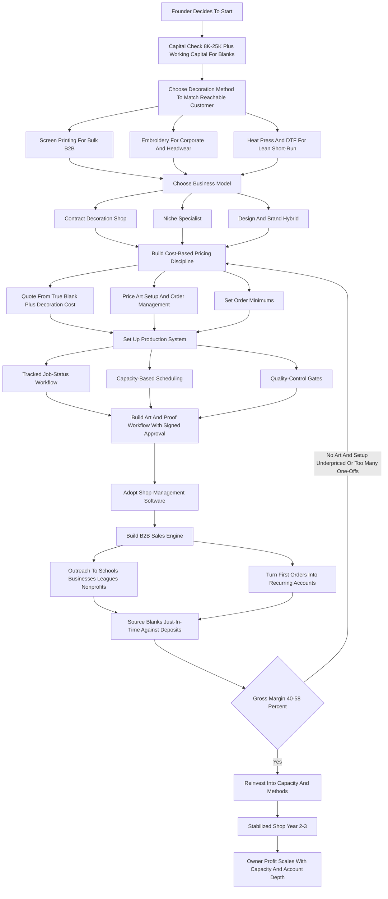
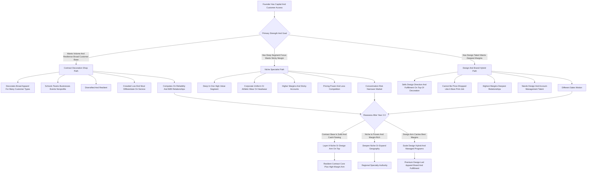

**TL;DR:** To start a custom apparel business in 2027, you take blank garments -- t-shirts, hoodies, polos, caps, jackets, tote bags -- and decorate them to a customer's design using one or more decoration methods (screen printing, direct-to-garment digital printing, embroidery, heat-transfer vinyl, or sublimation), then sell those decorated goods to schools, sports teams, businesses, nonprofits, event organizers, family reunions, bands, and online merch sellers. The model is **real, durable, and reachable on modest capital -- but it is a production-and-margin business, not a creative hobby, and it is brutally crowded at the low end.** The entire economics rest on two numbers most beginners never separate: **decorated-unit gross margin** (the spread between what a finished shirt costs you in blank, ink, labor, and machine time versus what you charge) and **jobs per week your equipment and labor can actually push out.** A blank Gildan tee bought for $2.50-$4.00, screen-printed in two colors for a 72-piece school order and sold at $9-$14, earns a 45-60% gross margin and takes minutes of press time per shirt; the same shirt printed one-off on a direct-to-garment machine for an online merch customer sells for $22-$30 but carries higher ink cost, slower throughput, and far more art and customer-service overhead per dollar. The honest 2027 economics: a focused startup invests **$8K-$60K** in equipment, blanks, software, and working capital depending on whether it launches on heat press and vinyl, a single screen-print setup, or an entry direct-to-garment printer, runs at a **40-58% gross margin after blanks, consumables, and decoration labor**, and in a disciplined Year 1 generates **$45K-$160K in revenue** against **$18K-$70K in owner profit** -- heavily weighted toward the order-driven B2B work (schools, teams, corporate, nonprofit) that pays reliably and reorders, not the speculative print-your-own-brand dream. By Year 3-5 a well-run shop reaches **$250K-$900K in revenue** with **$70K-$280K in owner profit**, at which point the founder chooses between staying a lean contract-decoration shop, going deep on a high-margin niche (corporate uniform programs, performance and team athletic wear, premium retail-quality brands), or building a design-and-brand hybrid that sells creative direction and fulfillment on top of the decoration capability. The three things that kill custom apparel startups: **(a) competing on price as an undifferentiated "we print shirts" shop** against print-on-demand platforms and a thousand other local presses; **(b) underpricing art time, setup, and order-management labor**, the invisible costs that turn a healthy quoted margin into a break-even job; and **(c) drowning in tiny one-off orders and unsold blank inventory** instead of chasing the repeatable bulk B2B accounts that actually compound. Net: viable in 2027 as a disciplined, margin-obsessed, B2B-anchored production shop with a clear decoration specialty and a real sales motion -- a poor fit for anyone who wants a passive print-on-demand side income, fast hands-off scaling, or a business without ink, machines, deadlines, and customer art files.

## What A Custom Apparel Business Actually Is In 2027

A custom apparel business buys blank garments and decorates them with a customer's design, then sells the finished goods. You are not a clothing brand designing original garments from fabric, and you are not primarily a graphic designer; you are a decoration-and-production operation. A customer -- a high school booster club, a plumbing company, a 5K race organizer, a craft brewery, a youth soccer league, a touring band, a corporate HR department -- comes to you with a logo or an idea and a quantity, and you turn blank shirts, hoodies, caps, and bags into branded, wearable product. The entire business is a single industrial idea executed over and over: you acquire a blank cheaply, add decoration that costs you a known amount in materials, machine time, and labor, and sell the decorated unit for meaningfully more than the sum of those costs -- and you do that hundreds or thousands of times a year across many orders. A blank tee that costs you three dollars, decorated for two dollars in ink and labor, sold for eleven, throws off a six-dollar gross margin; multiply that across a 72-shirt school order and you have a job worth a few hundred dollars in margin that took a couple of hours of press time. That is the engine. Everything else in this guide -- equipment choice, blank sourcing, art workflow, pricing, sales, hiring -- is the machinery that lets you run that engine at volume, on deadline, without blowing the margin on rework, idle inventory, or underpriced labor. In 2027 the business is shaped by realities that did not fully exist a decade ago: print-on-demand platforms made "start a shirt brand" feel free and frictionless, which flooded the speculative end and trained customers to expect instant online quoting and proofs; direct-to-garment and direct-to-film printing matured enough that small full-color and short-run work is genuinely viable without a screen room; embroidery and screen printing remain the margin-rich backbone of serious B2B work; and labor and blank costs rose, which made pricing discipline and throughput the squeeze points. The custom apparel business is not passive and it is not purely creative. It is a production-and-deadline business wearing a creative costume, and the founders who succeed understand that the design is the customer's; the business is machines, ink, blanks on a shelf, an art queue, a calendar of due dates, and a book of repeat B2B accounts.

## The Decoration Methods: What You Actually Choose Between

The decoration method is the foundational technical decision, because it determines your equipment cost, your throughput, your per-unit economics, and which jobs you can profitably take. **Screen printing** -- pushing ink through a mesh stencil, one screen per color -- is the workhorse of high-volume apparel. It has real setup cost and time per design (burning screens, registration), so it is uneconomic for tiny runs, but once the screens are set the per-shirt cost and time are low, the ink is durable, and it is the cheapest way to decorate large bulk orders. It is the method behind most school, team, event, and corporate bulk work. **Direct-to-garment (DTG)** printing sprays water-based ink directly onto the garment from an inkjet-style printer; it has near-zero setup, handles unlimited colors and photographic detail, and makes one-off and short-run full-color work viable -- but ink cost per shirt is higher, throughput is slower, it works best on cotton and on lighter garments, and the machines (Brother GTX, Epson SureColor F-series, Kornit at the industrial end) are a real capital line. **Direct-to-film (DTF)** printing -- printing a design onto a film transfer and heat-pressing it onto the garment -- exploded in adoption because it is full-color, works on a wide range of fabrics including blends and darks, has low setup, and uses cheaper equipment than DTG; it has become a default short-run method for many new shops. **Embroidery** stitches the design in thread using a commercial multi-needle machine (Brother PR-series, Tajima, Melco, Ricoma); it is the premium, durable, "corporate" look, essential for polos, caps, jackets, and bags, commands higher prices, and is a margin-rich category -- but the machines are a significant investment and digitizing each design is a skill or an outsourced cost. **Heat-transfer vinyl (HTV)** -- cutting colored vinyl on a cutter and heat-pressing it on -- is the cheapest entry point (a cutter and a heat press), good for names and numbers, small quantities, and team rosters, but it is labor-intensive per piece and not a volume method. **Sublimation** dyes polyester directly and is used for all-over performance wear and hard goods. The strategic reality: most successful shops do not pick one forever -- they start with one method matched to their capital and target customer, then add complementary methods as they grow, because a shop that can screen print bulk, embroider corporate, and run DTF short-run can serve almost any order that walks in. The Year 1 mistake is buying a method that does not match the customer you can actually sell to -- an expensive DTG printer with no plan to win the bulk B2B work that pays for it, or a heat-press-and-vinyl setup chasing 500-piece orders it cannot produce profitably.

| Decoration Method | Entry Equipment Cost | Best For | Setup Cost Per Job | Throughput | Margin Profile |
|---|---|---|---|---|---|
| Screen printing | $8K-$30K | Bulk B2B, schools, teams, events | High (screens, registration) | High once set up | Strong on volume |
| Direct-to-garment (DTG) | $15K-$40K+ | Short-run full-color cotton, one-offs | Near zero | Slow, one garment at a time | OK, high per-order overhead |
| Direct-to-film (DTF) | $3K-$12K | Short-run full-color, blends and darks | Low | Moderate | Decent, accessible entry |
| Embroidery | $8K-$25K | Polos, caps, jackets, corporate | Digitizing per design | Multi-head, minutes per piece | Premium, margin-rich |
| Heat-transfer vinyl (HTV) | $1K-$5K | Names, numbers, tiny quantities | Low | Labor-heavy per piece | Thin, not a volume method |

## The Three Models: Contract Decoration Shop, Niche Specialist, And Design-And-Brand Hybrid

There are three distinct ways to build this business, and choosing deliberately is one of the most consequential early decisions. **The contract decoration shop model** is the broad, order-driven core: you decorate whatever blank apparel customers bring or order through you -- shirts, hoodies, caps, bags -- across schools, teams, businesses, events, and nonprofits, competing on reliability, turnaround, and quality. Its advantage is volume, diversification across customer types, and being the dependable local source; its challenge is that the low end is crowded and undifferentiated, so the shop must compete on service and B2B relationships rather than price. This is the most common model and the most resilient, because no single customer type can sink it. **The niche specialist model** goes deep on one high-value segment -- corporate uniform and apparel programs, performance and team athletic wear, premium retail-quality fashion decoration, headwear, or the merch fulfillment behind creators and bands -- and becomes the obvious expert for that need across a wider geography. Its advantage is higher margins, less competition, deep expertise, pricing power, and stickier accounts; its challenge is concentration risk and a narrower addressable market. **The design-and-brand hybrid model** sells creative direction, brand and merch strategy, and fulfillment on top of the decoration capability -- the customer is not buying "shirts printed," they are buying a designed merch line, a managed company store, or a brand's apparel program, and the decoration is the medium. Its advantage is the highest margins and the deepest relationships, because design and program management cannot be price-shopped the way a bare print job can; its challenge is that it requires genuine design and account-management talent and a different sales motion. Many successful operators start as a contract shop to build cash flow and a customer base, then layer a niche or a design-and-program arm on top once the production engine is paying the bills. The wrong move is trying to be all three at once in Year 1 with limited capital and one person -- the contract volume starves the niche depth, and the brand ambition outruns the production base.

## The 2027 Market Reality: Demand, Competition, And What Changed

A founder needs an accurate read of the 2027 landscape, because the business is neither the effortless online side hustle the print-on-demand marketing implies nor a dying trade. **Demand is structurally healthy and recurring.** Schools and youth sports decorate apparel every season -- spirit wear, team uniforms, fundraisers, club tees. Businesses buy branded apparel for staff uniforms, trade shows, onboarding swag, and customer giveaways. Nonprofits run apparel fundraisers. Events -- races, festivals, conferences, reunions -- order event tees by the hundreds. Bands and creators sell merch. None of this is discretionary in the way many purchases are, and much of it reorders on a predictable calendar. **The competition is bifurcated and crowded.** At the top sit large, well-capitalized players -- Custom Ink, 4imprint, Vistaprint and the broader Cimpress family, plus regional industrial decorators -- with national reach, scale pricing, and deep automation. At the bottom is an enormous long tail: print-on-demand platforms (Printful, Printify, and the marketplaces) that let anyone "start a brand" with zero equipment, plus thousands of small local shops and side-hustlers with a heat press in a garage. The opportunity for a new disciplined entrant is the underserved middle and the specialty edges -- being more reliable, faster, more consultative, and more relationship-driven than the long tail, and more responsive and local than the national giants, without needing the giants' capital. **What changed by 2027:** print-on-demand normalized instant online quoting, proofs, and order tracking, so customers expect a professional digital experience; DTF printing lowered the technical and capital barrier for short-run full-color work; the speculative "make passive income selling your own designs" wave saturated the print-on-demand end and trained many would-be founders toward the hardest, lowest-margin version of the business; and blank apparel and labor costs rose, making margin discipline and throughput decisive. The net market reality: demand is real, durable, and recurring, the business is harder and more crowded than the marketing suggests, and the winning 2027 entrant competes on B2B relationships, reliability, turnaround, decoration breadth, and a clear specialty rather than on being the cheapest shirt online.

## The Core Unit Economics: Decorated-Unit Margin And Throughput

This is the most important section in the guide, because the entire business lives or dies on two numbers beginners blur together: the **gross margin on each decorated unit** and the **throughput** -- how many profitable units your equipment and labor can actually push out per day and per week. Take the margin first, concretely. A blank Gildan or Bella+Canvas tee costs **$2.50-$5.50** depending on brand and weight. Screen-printing it in one or two colors as part of a 72-piece order costs you maybe **$1.50-$3.00** per shirt in ink, screen amortization, and press labor, and you sell it for **$9-$15** -- a gross margin of roughly **45-60%**, and the per-shirt press time is short. The same blank decorated one-off on DTG costs you **$3-$7** in ink and slower labor, and you sell it for **$22-$32** for a single full-color piece -- the absolute dollar margin can be fine, but the throughput is far lower and the art and customer-service overhead per order is much higher. An embroidered polo: blank polo **$8-$18**, digitizing amortized plus thread and machine time **$3-$8**, sold **$25-$55** -- a strong margin and a premium, durable product. A DTF-pressed hoodie: blank hoodie **$12-$28**, transfer and press labor **$3-$7**, sold **$35-$65**. Now the throughput discipline. An automatic screen press can run hundreds of shirts an hour once set up; a manual press far fewer; a DTG machine prints one garment at a time over a minute or several; a six-head embroidery machine stitches six caps at once but each takes minutes. **Your real capacity is decoration-method throughput multiplied by the hours of skilled labor you actually have**, and that capacity, against your fixed costs, sets your revenue ceiling. The discipline this imposes: **before quoting any job, know its true decorated-unit cost -- blank, consumables, machine time, and labor -- and know how much of your weekly capacity it consumes.** Bulk B2B screen and embroidery work has good margin and excellent throughput, which is why it is the backbone. Short-run DTF and DTG work has acceptable margin but consumes capacity and overhead fast, so it must be priced for that. The founder who quotes by gut builds a calendar full of jobs that feel busy but do not pay; the founder who quotes by decorated-unit cost and capacity consumed builds a shop that compounds.

| Item | Blank Cost | Decoration Cost | Sell Price | Approx Gross Margin |
|---|---|---|---|---|
| Screen-printed tee, 1-2 color, 72+ pc | $2.50-$5.50 | $1.50-$3.00 | $9-$15 | 45-60% |
| DTG one-off full-color tee | $2.50-$5.50 | $3.00-$7.00 | $22-$32 | Solid dollar margin, low throughput |
| DTF-pressed hoodie | $12-$28 | $3.00-$7.00 | $35-$65 | 45-55% |
| Embroidered polo | $8-$18 | $3.00-$8.00 | $25-$55 | 50-60%, premium |
| Embroidered cap | $3-$9 | $2.00-$6.00 | $20-$40 | 55-65%, margin-rich |

## The Line-By-Line Unit Economics And P&L

Beyond margin and throughput, a founder must internalize the full operating P&L of a single job and of the business, because the hidden costs determine whether quoted margin becomes real profit. Take a representative bulk job: 96 two-color screen-printed tees for a corporate 5K team. The customer-facing price might be **$1,150**. From that, the costs stack in an order beginners consistently underestimate. **Blank apparel** -- 96 tees at $3.25 -- is roughly **$310**, the largest single hard cost. **Ink and consumables** -- inks, emulsion, tape, screens amortized -- a modest per-job amount. **Screen setup and reclaim labor** -- burning, registering, and later reclaiming screens -- real labor that one-color and few-piece jobs cannot absorb. **Press labor** -- the time to actually run 96 shirts. **Art and proof labor** -- preparing the file, color separations, sending a proof, handling the revision -- the single most commonly unpriced cost, easily an hour or more per order. **Order management and customer service** -- the quote, the emails, the size breakdown, the invoice, the follow-up -- another invisible labor sink. **Reprints and spoilage** -- misprints, mis-registrations, the few ruined shirts every job produces -- a real 2-5% blended cost. Then the fixed overhead spread across all jobs: **rent and utilities** for the shop space, **equipment depreciation and maintenance**, **software** (quoting, design, accounting), **insurance**, and **marketing**. Net the job out and a healthy shop runs a **40-58% gross margin after blanks, consumables, and decoration labor** -- with the spread driven almost entirely by whether art time, setup, and order management were priced in, and whether the job mix favors throughput-friendly bulk work over capacity-hungry one-offs. At the business level, the founders who fail at the P&L almost always made the same two errors: they priced the visible costs (blank and ink) and gave away the invisible ones (art, setup, order management, reprints), and they let the calendar fill with tiny low-throughput jobs that felt like progress but never covered the fixed overhead.

## Equipment Selection And The Initial Capex Plan

With the economics established, a founder needs a concrete plan for what to buy first, because equipment is the largest startup decision and the easiest to mismatch to the customer. The principle is **buy the method that matches the customer you can actually sell to first, then add complementary methods from cash flow.** Three realistic launch paths. **The lean heat-press and DTF launch** -- a quality heat press, a DTF printer or a relationship with a DTF transfer supplier, a vinyl cutter, and blanks -- starts around **$3K-$12K**, handles short-run full-color and name-and-number work, and is the lowest-risk entry, but it is a short-run method and cannot profitably chase large bulk orders. **The screen-printing launch** -- a manual or entry automatic press, exposure unit, washout setup, dryer or conveyor, and screens -- runs **$8K-$30K** and is the right base for a shop targeting school, team, event, and corporate bulk work, which is where the reliable margin and throughput are. **The embroidery launch** -- a commercial single- or multi-head machine (Brother PR-series, Tajima, Melco, Ricoma), digitizing software or an outsourced digitizing relationship, hoops, and thread -- runs **$8K-$25K** for entry multi-head capacity and is the base for a shop targeting corporate uniform, headwear, and premium B2B work. **A DTG launch** sits at **$15K-$40K+** for a capable machine and pretreat setup and makes sense when the customer base genuinely needs short-run full-color cotton work. Beyond the decoration equipment, every launch needs **blank inventory and working capital** -- a starter stock of the most-ordered blanks plus cash to buy blanks for jobs before customers pay -- which is a real and underestimated line, **software** (quoting and order management, design, accounting), **a space** (a garage at the smallest scale, a small commercial unit as it grows), and **basic finishing and shipping supplies**. Totaled, a focused launch lands in the **$8K-$60K** range depending on method and ambition. The sourcing discipline: buy commercial-grade equipment sized to the orders you intend to win, consider quality used equipment from shops upgrading or exiting (a real source of affordable capacity), and resist buying a second or third method before the first is fully utilized and paying for itself. Match the machine to the customer, get that engine fully loaded, and only then expand the capability.

## Blank Apparel Sourcing And Inventory Strategy

The blank garment is the largest hard cost in most jobs, and a founder must treat sourcing and inventory as a core discipline, not an afterthought. **The blank brands** span a spectrum: value brands like **Gildan, Hanes, Jerzees, and Fruit of the Loom** anchor price-sensitive bulk work; mid and fashion brands like **Bella+Canvas, Next Level, Comfort Colors, Champion, American Apparel, District, and Port & Company** serve customers wanting a softer, more retail feel; premium and specialty brands like **AS Colour, Independent Trading Co., Richardson and Flexfit for headwear, and various performance and outerwear brands** serve the high end and the niches. A shop quotes the right brand for the job -- the booster club fundraiser and the craft brewery's retail-quality tee are not the same garment. **Sourcing runs through apparel distributors** -- the wholesale suppliers (S&S Activewear, SanMar, AlphaBroder, TSC Apparel and similar) that warehouse blanks across brands and ship fast -- and a shop builds accounts with two or three so it is never stuck on a stockout. **Inventory strategy is a balance.** Carrying a stock of the most-ordered blanks speeds turnaround and lets you serve rush work, but every blank on a shelf is cash that is not working and risks being the wrong size, color, or style when the order actually comes. The disciplined approach: stock a modest core of true high-velocity blanks, and order job-specific blanks per order against a confirmed quote and deposit, so the customer's commitment funds the inventory rather than the shop's cash sitting at risk. The founders who get sourcing wrong either tie up working capital in speculative blank inventory that ages and mis-sizes, or run with no relationships and no core stock and get caught flat-footed by stockouts and rush jobs. The ones who get it right treat blanks as just-in-time-funded cost of goods, backed by strong distributor accounts and a small, deliberately chosen core stock.

## The Art And Proof Workflow

Art is where custom apparel jobs quietly lose money, and a founder must build the art-and-proof workflow as a priced, systematized function rather than unpaid favor work. Every job has an art arc: receive the customer's file, assess whether it is production-ready, clean it up or recreate it, prepare it for the specific decoration method (color separations for screen printing, digitizing for embroidery, file prep for DTG and DTF), send the customer a proof, handle the revision round, and get a signed approval before production. **The unpriced-art-time problem is universal among struggling shops.** Customers routinely send low-resolution logos, photos of a sketch, or files in the wrong format, and "just fixing it up" or "doing a quick mockup" for free, across many quotes that may never close, is a steady margin leak. The discipline is to **price art as a real line item** -- a setup or art fee that reflects the genuine labor, waived or credited only on orders large enough to absorb it, and an hourly or flat rate for true design and recreation work. **The proof is also risk management:** a documented, customer-approved proof is what protects the shop when the customer later says the color, the placement, or the spelling is wrong -- in custom decoration, the approved proof is the contract for what gets made. **Digitizing for embroidery** is its own skill and cost, done in-house with software and practice or outsourced per design, and it must be priced into embroidery jobs. **Standardizing the workflow** -- a clear file-requirements sheet for customers, a consistent proof template, a tracked approval step -- turns art from a chaotic time sink into a controlled, billable stage. The shops that get this wrong treat art as friendly free service and watch it eat hours; the shops that get it right treat every art touch as either billable labor or a deliberate, priced concession on a job big enough to justify it.

## Pricing And Quoting: Where Margin Is Won Or Lost

Pricing in custom apparel has several layers, and a founder must get all of them right because the business is crowded and the temptation to win on price is constant. **The blank-plus-decoration build-up** is the foundation: every quote starts from the true cost of the specific blank plus the true cost of decorating it by the chosen method -- consumables, machine time, and labor -- with a margin on top that also funds fixed overhead. **Quantity tiering** is structural: bulk orders get lower per-unit pricing because setup is amortized and throughput is high, while small orders must be priced richly because setup and order-management overhead are spread over few units. **Setup, art, and screen fees** are real, distinct line items, not costs to absorb -- the screen burn, the digitizing, the art prep each have a genuine labor cost. **Order minimums** protect against tiny jobs that cost more in setup and admin than they earn; many disciplined shops set a minimum piece count or a minimum order value. **Rush fees** price the disruption of jumping the production queue. **The number-of-colors and decoration-complexity factor** drives screen-print and embroidery pricing -- more colors mean more screens and more press passes; more stitches mean more machine time. The strategic layer is **refusing to compete as a commodity.** A 2027 shop that quotes only a bare per-shirt number against print-on-demand and a hundred local presses is in a race to the bottom; a shop that quotes a professional, itemized, fast quote, consults on blank choice and decoration method, and stands behind quality and turnaround is selling something the commodity end cannot. The seasonal and mix layer matters too: school and team work clusters around seasons, event work around event calendars, and corporate work is steadier -- a shop balances the mix so it is not idle between school seasons. The founders who misprice either give away the invisible labor and run a thin real margin, or price purely to beat the cheapest competitor and never cover overhead; the ones who get it right build every quote from true cost and capacity consumed, and sell reliability and consultation rather than the lowest number.

## The Sales Engine: Winning Repeatable B2B Accounts

Custom apparel is a sales business as much as a production business, and a founder must understand that the durable revenue comes from repeatable B2B accounts, not from a stream of one-off strangers. **Schools and youth sports** are a foundational segment -- spirit wear, team uniforms, club apparel, PTA and booster fundraisers, recurring every season; winning a school or a league often means recurring orders for years, and the relationship is with coaches, athletic directors, booster officers, and PTA leaders. **Businesses** are the steadiest segment -- staff uniforms, branded swag, trade-show apparel, customer giveaways, company stores -- and a corporate account that orders for onboarding and events all year is far more valuable than its first order suggests; the relationship is with HR, marketing, and office managers. **Nonprofits** run apparel fundraisers and event shirts on a recurring calendar. **Event organizers** -- races, festivals, conferences, tournaments -- order in volume on their event schedule. **Bands, creators, and small brands** need merch and fulfillment. The discipline is to **treat B2B relationship-building as a core ongoing function** -- proactively reaching out to schools, businesses, leagues, and nonprofits rather than waiting for inbound, building a reputation for reliability that gets you referred, and turning every first order into a managed account that reorders. **Repeat and referral business compounds** -- the satisfied corporate client, the school that had a smooth season, the race director who got shirts on time -- and a shop with a deep book of recurring accounts has a defensible, predictable business, while a shop dependent on one-off inbound is always starting over. **The online presence and quoting experience** convert demand and signal professionalism, but for serious revenue they support the relationship engine rather than replace it. The founders who treat custom apparel as "set up a website and wait" stay stuck in low-margin one-offs; the ones who build it as a B2B sales operation -- proactive outreach, managed accounts, relentless reliability, and referral compounding -- build something that grows on itself.

## Production Workflow, Scheduling, And Deadlines

Custom apparel is a deadline business, and a founder must run production as a scheduled system because every job has a date it absolutely must ship. The job arc: quote and deposit, order or pull blanks, art and proof and approval, decoration setup (screens, digitizing, file prep), production run, finishing (folding, tagging, bagging, sorting by size), and delivery or shipment -- every stage with a time cost, and the whole chain backing up from the customer's hard deadline. **Scheduling is the operational core.** Orders arrive continuously, each consumes a known slice of equipment and labor capacity, and the shop must sequence them so every job ships on time without overcommitting the press or the embroidery machine. School and event work especially clusters -- a back-to-school rush, a race-season crunch -- and a small shop must know its true weekly capacity and either schedule within it, add temporary labor, or decline and reprice work that does not fit. **The blank-arrival dependency** is a common failure point: production cannot start until the right blanks are in hand, so the order-and-receive step must be tracked tightly. **Setup discipline** -- batching jobs that share screens or colors, organizing the digitizing queue -- improves throughput. **Quality control** runs throughout: checking registration and color on the first prints of a run, inspecting stitch quality, catching misprints early before a whole run is ruined, and inspecting the finished order before it goes out. **A tracked job-status system** -- whether purpose-built shop-management software or a disciplined board -- lets the shop know where every order stands and which deadline is at risk. The shops that get production wrong treat scheduling as memory and hope, miss deadlines, blow out reprints, and lose the B2B accounts that cannot tolerate a late delivery; the ones that get it right run production as a designed system with known capacity, tracked status, and quality gates, because in custom apparel an on-time, correct order is the entire product.

## Shop Software And The Operational Backbone

In 2027 a custom apparel shop runs on software, and a founder should choose the stack early because retrofitting it later is painful. **Shop-management software** -- purpose-built platforms for the decorated-apparel industry (Printavo, YoPrint, ShopVOX, InkSoft and similar) -- is the central system: it generates quotes and invoices, tracks orders through every production stage, holds customer and job history, manages the production calendar and capacity, and consolidates reporting. This is the first serious paid tool a growing shop adopts, because running quotes, deadlines, and order status on email and memory breaks past a handful of concurrent jobs. **Design software** -- the tools for art prep, color separations, mockups, and digitizing -- is the other essential stack, in-house or partly outsourced. **The online quote and proof experience** matters commercially: 2027 customers expect a clean, fast, itemized quote and a clear digital proof, and a professional quote-to-proof flow wins jobs against the shop still sending hand-typed prices. **Online stores and company stores** -- hosted webstores where a school's families or a company's employees order directly -- are a powerful tool for turning one B2B relationship into many self-service orders, and shop software increasingly supports them. **Accounting and inventory tools** track the real cost of goods, the blank inventory, and the job-level profitability that tells the founder which work actually pays. The operational discipline: adopt shop-management software early, build a professional quoting and proofing flow, use company stores to scale B2B accounts, and treat the software as the system that lets a small team run many concurrent deadline-driven jobs without dropping one. The shops that run on a tight digital backbone serve more orders with fewer mistakes than those running off a paper calendar and a good memory.

## Staffing And Building A Production Team

A founder can run the smallest custom apparel shop solo, but the business does not scale past one person's hands without a team, and the staffing model follows the production workflow. **The first hires are production labor** -- the people who run the press, the embroidery machine, the heat press, who catch and fold and box shirts, who reclaim screens and pretreat garments. Production work is learnable and the early hires are often part-time or trained-up locals, but quality matters: a careful press operator wastes fewer shirts and produces cleaner work, and a sloppy one generates reprints and complaints. **The art and digitizing role** is the next pressure point -- as order volume grows, the founder cannot personally prep every file, and a dedicated art person (or a reliable outsourced digitizing relationship) frees the founder from the art queue. **The sales and account-management role** is what actually drives growth -- someone proactively building and servicing the B2B accounts, because a shop that only produces and never sells plateaus. **Order and production management** -- the person who runs the schedule, tracks job status, and chases blank deliveries and approvals -- becomes essential as concurrent jobs multiply. The cost structure: production labor is the largest operating expense after blanks, partly variable with volume and partly a fixed trained core; the art, sales, and management roles are fixed investments that unlock capacity and growth. **Seasonality shapes staffing** -- the school and event rushes may warrant temporary or flex labor on top of a year-round core. The strategic point: custom apparel scales by adding hands and skills to a proven production system, and the founders who build a trained, reliable team -- and who deliberately add the art, sales, and management roles rather than trying to be all of them forever -- break past the one-person ceiling, while those who never hire stay capped at whatever the founder alone can press, prep, sell, and ship.

## Startup Cost Breakdown: The Honest All-In Number

A founder needs a clear-eyed total of what it costs to launch, because while custom apparel is reachable on modest capital, under-capitalization -- especially on blanks and working capital -- is a real killer. The all-in startup cost breaks down as: **decoration equipment** -- the largest and most variable line -- **$3,000-$40,000+** depending on method, from a lean heat-press-and-DTF or vinyl setup at the low end, through an entry screen-printing or embroidery setup in the middle, to a capable DTG machine at the high end; **blank inventory and working capital** -- a starter core stock of high-velocity blanks plus the cash to buy job-specific blanks before customers pay -- a genuinely important **$2,000-$15,000** that beginners routinely under-fund; **shop space setup** -- if not starting in a garage, first month, deposit, and basic buildout of a small commercial unit -- **$0-$8,000** to start; **shop-management and design software** -- setup and first months -- modest, a few hundred to low thousands; **insurance** -- general liability, equipment, and a first payment -- **$500-$3,000** to start; **business formation, licensing, and legal** -- entity setup, permits, contract and proof templates -- **$300-$1,500**; **website and quoting setup** -- a professional site with a quote flow and portfolio -- **$500-$4,000**; **finishing, shipping, and shop supplies** -- folding tables, racks, packaging, hooping and pretreat supplies, tools -- **$500-$3,000**; and a **working capital and operating reserve** -- the buffer that covers rent, software, and the cash gap before order payments arrive -- a meaningful **$3,000-$15,000**. Totaled, a lean focused launch can come in around **$8,000-$25,000**, and a fuller launch with a stronger equipment package and reserve runs **$30,000-$60,000+**. Financing softens the equipment line -- equipment financing and quality used machines are common -- but the founder still needs real cash for blanks and the operating reserve, because the business has a built-in cash gap: blanks must be bought and labor paid before the customer's payment clears. The capital requirement is a filter, but a forgiving one compared to most product businesses -- the danger is not the equipment sticker, it is launching with no working capital to fund blanks and survive the first slow stretch.

## The Year-One Operating Reality

A founder should walk into Year 1 with accurate expectations, because the gap between the print-on-demand marketing and the real version of this business is where most quitting happens. Year 1 is **capability-building and account-building mode, not profit-extraction mode.** The first year is spent learning the craft to a saleable quality level -- registration, color, stitch quality, garment handling -- discovering the true labor cost of art and setup and order management, building the first repeatable B2B accounts that turn into recurring revenue, and finding where the operation is fragile: the rush job that collided with another deadline, the misprinted run, the customer art file that ate three unbilled hours. A disciplined Year 1 custom apparel startup, launched with real equipment matched to a reachable customer base and a working-capital cushion, can realistically generate **$45,000-$160,000 in revenue** against **$18,000-$70,000 in owner profit** -- meaningful, but earned through hands-on production work and active selling, not passive. Year 1 is also when the founder discovers whether the method-and-customer match was right -- a DTG printer and no plan to win bulk work shows up as an underutilized expensive machine; a heat-press setup chasing 300-piece orders shows up as jobs that cannot be produced profitably. The work is genuinely hands-on: the founder is on the press, prepping art, sending quotes, chasing blanks, and delivering orders. The founders who succeed treat Year 1 as paid tuition in a real production-and-sales business and use it to dial in the craft, the pricing, and the account base; the ones who fail expected a hands-off online merch income and were unprepared for the ink, the deadlines, the art files, and the selling.

## The Five-Year Revenue Trajectory

Mapping a realistic five-year arc helps a founder size the opportunity honestly. **Year 1:** lean setup, craft and account-building, $45K-$160K revenue, $18K-$70K owner profit, founder hands-on across production, art, and sales, first slow stretch is the survival test. **Year 2:** the shop adds capacity using Year-1 cash flow -- a second decoration method, better or faster equipment, the first part-time production help -- the B2B accounts start reordering reliably, and revenue climbs to roughly **$120K-$350K** with owner profit around **$45K-$140K** as throughput improves and recurring accounts compound. **Year 3:** the operation is a real business with a system -- a fuller equipment lineup, a small trained production team, possibly a dedicated art or sales person, shop-management software running the calendar; revenue lands around **$220K-$550K** with owner profit roughly **$65K-$200K**, and the founder is managing the shop rather than personally pressing every order. **Year 4:** continued capacity and account growth, possible niche or design-program layering, company stores scaling the B2B accounts; revenue roughly **$350K-$750K**, owner profit **$90K-$250K**. **Year 5:** a mature shop -- $450K-$900K+ revenue, **$120K-$280K owner profit** for a well-run operation, with the founder deciding whether to keep scaling the contract shop, go deep on a high-margin niche, build out the design-and-program hybrid, expand into additional decoration capacity or a second location, or position for sale. These numbers assume disciplined cost-based pricing, a real B2B account base, controlled reprints and inventory, and method-and-customer fit; they do not assume viral print-on-demand growth, because custom apparel scales with equipment capacity, skilled labor, and account depth, not magically. A mature custom apparel business is a real small business with machines, a team, a book of recurring accounts, and job-level profitability discipline -- a genuinely good outcome, earned through years of production and sales discipline.

## Five Named Real-World Operating Scenarios

Concrete scenarios make the model tangible. **Scenario one -- Marisol, the disciplined contract shop:** launches with $18K into an entry screen-printing setup plus a heat press for short-run work, deliberately targets schools and local businesses from day one, prices art and setup as real line items, and turns her first school order into a recurring spirit-wear account; hits $115K revenue in Year 1, reinvests into an automatic press and an embroidery machine, and reaches $420K by Year 3 with healthy margins because her calendar is full of repeatable bulk B2B work. **Scenario two -- the cautionary tale, Devon:** spends $30K on a capable DTG printer because the print-on-demand videos made one-off full-color work look like the future, but has no sales plan to win bulk orders; the machine sits underutilized between scattered one-off jobs, the per-order art and customer-service overhead crushes his margin, and he is cash-strapped within a year because the expensive equipment never got loaded with the throughput-friendly work that pays for it. **Scenario three -- Priya, the corporate uniform specialist:** goes niche from the start, building a deep embroidery and screen operation focused entirely on corporate uniform and apparel programs -- staff shirts, polos, caps, jackets, branded outerwear -- and becomes the go-to for managed company apparel across her region; smaller addressable market but high margins, sticky recurring accounts, and pricing power, reaching $380K by Year 4 at strong margins. **Scenario four -- the Okafor brothers, design-and-brand hybrid:** start as a contract shop for two years to build the production engine and cash flow, then layer a design-and-merch-program arm on top -- selling creators, breweries, and small brands a designed merch line and managed fulfillment rather than bare print jobs -- and lift average order value and margin substantially because design and program management cannot be price-shopped; Year 5 revenue near $800K with the design arm carrying the best margins. **Scenario five -- Tyler, the one-off treadmill casualty:** builds decent skills but never builds a sales motion, sets up a website and waits, and fills his calendar with a churn of tiny one-off orders from strangers found online -- each one a fresh art file, a fresh customer, a setup cost spread over a handful of pieces; he is busy every week and exhausted, but the margin never compounds because he never converted a single relationship into a recurring B2B account. These five span the realistic distribution: disciplined contract success, wrong-equipment-for-the-customer failure, profitable niche, design-hybrid upside, and the no-sales-motion one-off treadmill.

## Lead Generation And Marketing

Custom apparel demand is generated through a mix of relationship outreach, local presence, and a professional online front, and a founder must understand the channels rather than relying on one. **Direct B2B outreach** is the highest-value channel -- proactively contacting local schools, athletic leagues, businesses, nonprofits, and event organizers, because the durable revenue is in recurring accounts and those are won by reaching out, not waiting. **Referrals and reputation** compound -- a school that had a smooth spirit-wear season, a corporate client whose onboarding swag arrived perfect and on time, an event director who got race shirts delivered early; in a relationship business, reliability is the marketing, and satisfied B2B customers refer others like them. **The website and online quoting experience** is the modern storefront and credibility signal -- a portfolio of real work, clear decoration-method explanations, and a fast professional quote flow convert the demand the other channels generate. **Local visibility** -- being known in the community, sponsoring or outfitting local teams and events, networking with the organizations that buy apparel -- builds the relationship base. **Company and team stores** turn one B2B relationship into a self-service order stream and are themselves a sales tool. **Social media and portfolio content** -- showing real finished work -- builds credibility, especially for the design-oriented and niche models. **Sample and spec work for target accounts** -- a sharp sample for a school or a business you want -- can open a recurring account. Paid advertising plays a modest, targeted role; the business is won through B2B outreach, referral compounding, local presence, and a professional quoting experience. A founder should treat lead generation as a deliberate ongoing function weighted toward winning and keeping recurring B2B accounts, because a shop with a thin account base competes on price against the entire crowded low end, and one with a deep base has a steady, defensible flow of reorders.

## Risk Management And Insurance

The custom apparel model carries specific risks, and the 2027 operator manages each deliberately rather than hoping. **Reprint and spoilage risk** -- misprints, mis-registration, ruined garments, embroidery errors -- is a constant 2-5% blended cost, mitigated by quality-control gates, careful operators, checking the first prints of a run, and pricing the spoilage in. **Approval and rework risk** -- the customer claiming the wrong color, placement, or spelling after production -- is mitigated by the documented, signed proof, which is the contract for what gets made. **Inventory risk** -- cash tied up in blank apparel that ages, mis-sizes, or never matches an order -- is mitigated by just-in-time job-funded blank buying and a deliberately small core stock. **Deadline risk** -- the missed ship date that loses a B2B account -- is mitigated by realistic scheduling within known capacity, tight blank-arrival tracking, and declining or repricing work that does not fit. **Equipment risk** -- a press, printer, or embroidery machine down in the middle of a rush -- is mitigated by maintenance discipline, supplier relationships, and as the shop grows, redundant capacity. **Cash-gap risk** -- buying blanks and paying labor before customer payment clears -- is mitigated by deposits on orders and an operating reserve. **Customer concentration risk** -- over-dependence on one big school district or corporate account -- is mitigated by a diversified account base across customer types. **Liability and IP risk** -- decorating a copyrighted or trademarked design a customer does not have rights to -- is mitigated by general liability insurance, equipment coverage, and a contract clause placing IP responsibility on the customer. **Competition and pricing risk** -- the crowded low end pulling toward commodity pricing -- is mitigated by differentiation: a clear specialty, reliability, consultation, and B2B relationships rather than a price race. The throughline: every major risk in custom apparel has a known mitigation built from quality systems, contracts and proofs, insurance, working capital, and account diversification, and the operators who fail are usually the ones who skipped the proof, under-funded the working capital, or never differentiated from the commodity crowd.

## Competitor Landscape: Who You Are Up Against

A founder should understand the competitive field clearly. **The national giants** -- Custom Ink, 4imprint, Vistaprint and the broader Cimpress family, and large industrial decorators -- have national reach, scale pricing, deep automation, and big marketing budgets; they own the top of mind and the largest standardized orders, but they can be less flexible, less consultative, less local, and slower on the personal relationship. **The print-on-demand platforms** -- Printful, Printify, and the merchandise marketplaces -- let anyone "start a brand" with zero equipment and serve the speculative and one-off online end; they are not really competitors for serious bulk B2B work, but they shape customer expectations on instant quoting and they absorb the founders chasing the lowest-margin version of the business. **The long tail of small local shops and side-hustlers** -- garages with a heat press, part-time printers, established neighborhood presses -- competes on price and proximity at the low end and is easy to out-professionalize on reliability, decoration breadth, turnaround, and B2B account management. **Promotional-products distributors and ad-specialty companies** overlap, often selling decorated apparel alongside pens and mugs, strong on B2B relationships but not always on in-house decoration capability. The strategic reality for a 2027 entrant: you generally cannot out-scale the national giants or out-cheap the garage side-hustler, so you win by being the most reliable, most consultative, most decoration-capable, most relationship-driven shop in the underserved middle -- broad enough in method to serve real orders, professional in quoting and production, fast and local, and genuinely good to work with for the schools, businesses, and organizations that reorder. The competitive moat in custom apparel is not the equipment -- anyone with capital can buy a press -- it is the **B2B account relationships, the reputation for on-time correct delivery, the decoration breadth, the production system, and the clear specialty** that take years to build and are genuinely hard for a new entrant to copy.

## Financing The Business

Because custom apparel needs equipment and working capital up front, a founder should understand the financing options that soften the launch and the growth. **Equipment financing** is the natural fit for the largest line -- presses, DTG and DTF printers, embroidery machines, and dryers are tangible assets that lenders and equipment-finance companies will finance, spreading the cost over time and matching the payment to the earning life of the machine; this is widely used in the industry. **Quality used equipment** from shops upgrading or exiting is a form of cheap capital -- a departing competitor's press or embroidery machine at a fraction of new cost is a real and common way to build capacity affordably. **SBA and small-business loans** can fund a broader launch including space buildout and working capital. **Seller financing** can apply when buying an existing custom apparel shop outright -- sometimes the lowest-risk entry, because the equipment, the trained capability, the account base, and the cash flow already exist. **Customer deposits** are a structural financing tool -- requiring a deposit on every order funds the blanks and labor for that job and shrinks the cash gap. **Reinvested cash flow** funds most healthy growth past Year 1 -- the margin from a strong account base buys the next machine and the next capacity. The financing discipline: it is reasonable and normal to finance the equipment, because it is a productive asset that earns from the first job, but the founder must still hold real cash for **blanks and the operating reserve**, because the business has a structural cash gap and no lender covers a slow stretch or a thin starting cash position. The dangerous move is over-financing a stack of equipment while launching with no working capital and no sales motion -- debt service plus a cash gap plus an underutilized machine is how a financed launch fails. Finance the earning machines, fund the blanks and the reserve with real cash, and require deposits.

## Taxes And Business Structure

A founder should set up the tax and legal structure deliberately, because the equipment-and-inventory nature of the business has specific implications. **Entity:** most custom apparel operators form an LLC or S-corp for liability protection and tax flexibility; the entity holds the lease, the equipment, the insurance, and signs the customer agreements. **Depreciation matters** -- the presses, printers, embroidery machines, and dryers are depreciable assets, and the depreciation schedules, along with any available accelerated or first-year expensing, materially shape taxable income in heavy-equipment years; an accountant who understands equipment-based small businesses earns the fee here. **Sales tax** on decorated apparel applies in most jurisdictions and must be collected and remitted correctly, with attention to resale certificates -- the blanks bought for resale are typically purchased exempt, and the decorated product is taxed on sale; getting the resale-certificate and sales-tax mechanics right from day one matters. **Inventory accounting** -- the blank apparel on the shelf and the work in progress -- affects how cost of goods and income are recognized. **Payroll taxes** on production, art, and sales staff -- including any seasonal flex labor -- are a real cost to budget, not discover. **Equipment, financing interest, blanks and consumables, rent, software, and insurance** are all deductible business expenses that a clean bookkeeping system captures. The discipline: separate business banking from day one, a bookkeeping system that tracks equipment as assets, blanks as inventory, and jobs as revenue with real cost of goods, quarterly attention to sales tax and estimated taxes, and an accountant who understands equipment-and-inventory small businesses. Skipping this does not save money -- it converts a manageable compliance function into a year-end scramble, a sales-tax exposure, and a missed depreciation opportunity that costs real cash.

## Owner Lifestyle: What Running This Business Actually Feels Like

A founder should know what daily life in this business is like before committing, because the lived reality is hands-on, deadline-driven, and busier than the print-on-demand pitch implies. In **Year 1**, running a lean shop, the founder is genuinely in the business -- on the press or the embroidery machine, prepping art files, sending quotes, chasing blank deliveries, doing the production runs, folding and boxing orders, and delivering them, often while also doing the selling. It is physical and absorbing, closer to running a small production shop than to managing an online store, and it has a deadline rhythm: every job has a date it must ship, and the week is organized around the production calendar. By **Year 2-3**, with a part-time production team and maybe a dedicated art or sales person, the founder's role shifts toward managing the shop -- overseeing production, building and servicing B2B accounts, scheduling, and watching job-level profitability -- though the business is never desk-only and the founder is still hands-on in the rushes. By **Year 3-5**, with a trained team and a mature system, the founder can run a larger operation with a more managerial rhythm, though custom apparel never becomes hands-off the way some businesses do -- the machines, the deadlines, and the seasonal rushes are permanent features. The emotional texture: there is real satisfaction in a clean run, a sharp finished order, a happy school or business, and a calendar of accounts that reorder; and real stress in the misprint, the colliding deadlines, the machine down mid-rush, and the customer art file that fights back. The income is real and can become substantial, but it is earned through production and sales work, not extracted passively. A founder who enjoys making physical product, the rhythm of deadlines, machines, and B2B relationships will find it genuinely rewarding; a founder who wanted a quiet, hands-off online income will be surprised by the ink, the hours, and the selling.

## Niche And Specialty Paths Worth Considering

Beyond the general contract model, a founder should understand the specialty paths, because for some operators a focused niche is the better business. **Corporate uniform and apparel programs** -- managed staff apparel, branded uniforms, company stores, recurring onboarding and event orders -- is a high-margin, sticky, recurring niche built on embroidery and screen capability and B2B account management. **Performance and team athletic wear** -- jerseys, performance fabrics, sublimated uniforms, team and league programs -- serves the deep, recurring youth and adult sports market and rewards specialized equipment and method knowledge. **Premium and retail-quality fashion decoration** -- soft, high-end blanks, fashion-forward decoration, the look that small brands and boutiques want -- commands higher prices for operators with the craft and the taste. **Headwear specialization** -- caps, beanies, the embroidery and patch work headwear demands -- is a focused, margin-rich niche. **Creator, band, and small-brand merch fulfillment** -- designing and producing managed merch lines and handling fulfillment -- pairs decoration with design and program management for higher margins. **Promotional and event apparel at volume** -- races, festivals, conferences, tournaments -- is an event-calendar-driven volume niche. **Eco and sustainable apparel decoration** -- organic and recycled blanks, water-based and discharge inks -- serves a growing values-driven segment. The strategic point: the general contract model is the most resilient and the most common starting point, but the specialty paths can deliver higher margins, stickier accounts, and less commodity price pressure for a founder with the right capability and customer focus -- and many mature shops run a general contract core with one specialty arm layered on top. The mistake is not choosing a niche; it is staying an undifferentiated "we print shirts" shop competing on price with everyone.

## Scaling Past The First Shop

The jump from a proven solo or near-solo operation to a multi-machine, multi-person shop is its own distinct challenge, and a founder should approach it deliberately. The prerequisites for scaling: the Year-1 work must be genuinely profitable at the job level (do not scale a shop that is busy but not making margin), the production workflow must be documented well enough that hired hands can run it, the B2B account base must be real and reordering, and cash flow plus reserve must absorb the next equipment and the next slow stretch. The scaling levers: **add decoration capacity and methods** -- a faster or automatic press, additional embroidery heads, a complementary method -- so the shop can take more and bigger orders and stop declining work; **add and train production labor** in step with order volume, because an order you cannot produce on time is an order you cannot keep; **add the art and sales roles** so the founder moves off the art queue and onto growth; **adopt and fully use shop-management software** so many concurrent deadline jobs run as a system; **deepen the B2B account base and add company stores** so revenue compounds on relationships rather than churning through one-offs; and **consider a niche or design-program arm** once the contract base is solid. The constraints on scaling: equipment capacity is the first (solved by reinvested cash flow and sensible equipment financing), founder attention is the second (solved by the art, sales, and management hires), skilled labor is the third (solved by training and a reliable team), and space is the fourth (solved by graduating to a larger unit as capacity grows). The strategic decision that arrives around a mature contract shop: keep deepening the contract business, go deep on a high-margin niche, build the design-and-program hybrid, expand capacity or open a second location, or position for sale. The founders who scale well share one trait -- they treated Year 1 as a system-building and account-building exercise, so that growth was the repetition of a proven, profitable machine rather than a series of expensive experiments.

## Exit Strategies And The Long-Term Picture

Custom apparel businesses can be exited, and a founder should build with the eventual exit in mind. **Sell the operating business** -- a custom apparel shop with capable, well-maintained equipment, a trained production team, a deep book of recurring B2B accounts, documented systems, and clean books is a saleable asset; valuations typically run as a multiple of stabilized earnings, with the multiple driven by the durability and concentration of the account base, the condition and capability of the equipment, the strength of the systems, and how owner-dependent the operation is. **Sell the assets** -- even absent a going-concern sale, the presses, printers, and embroidery machines have real resale value, and the equipment can be sold to a shop expanding or a new entrant; this is a genuine floor under the business that pure-service ventures lack. **Acquire and roll up** -- a mature operator can grow by buying smaller competitors' equipment and accounts, and can position to be acquired by a larger regional decorator or a promotional-products consolidator. **Transition to family or a key employee** -- the production-and-relationship nature of the business makes an internal transition viable when a trained successor exists. **Wind down gracefully** -- because the equipment holds value, an operator can sell the machines, let the accounts lapse, and exit with the proceeds. The honest long-term picture: custom apparel is a durable, real business -- schools, businesses, teams, and events will keep needing decorated apparel, the equipment holds value, and a well-run shop produces real owner profit for years -- but it is a business, not a passive holding; it demands ongoing equipment maintenance and reinvestment, ongoing B2B relationship work, and ongoing production and pricing discipline. A founder should think of a 2027 launch as building a tangible, equipment-backed small business with multiple genuine exit paths -- sale of the going concern, sale of the equipment, roll-up, internal transition, or graceful wind-down -- which, given that the machines themselves retain value, makes it a more exit-flexible business than many service ventures.

## The 2027-2030 Outlook: Where This Model Is Heading

A founder committing capital should have a view on where the business goes next. Several trends are reasonably clear. **Demand stays structurally healthy and recurring** -- schools, youth sports, businesses, nonprofits, and events keep needing decorated apparel on a predictable calendar, and branded apparel remains a default for organizations; the underlying volume is durable. **DTF printing keeps lowering the short-run barrier** -- direct-to-film keeps improving and getting cheaper, making full-color short-run work accessible to more shops, which both helps new entrants and intensifies competition at the short-run end, pushing differentiation toward service and B2B relationships. **Print-on-demand keeps absorbing the speculative end** -- the platforms keep getting easier, which keeps drawing would-be founders toward the lowest-margin version of the business and leaves the disciplined B2B-anchored production shop as the more durable model. **Automation keeps professionalizing the small shop** -- shop-management software, online quoting, company stores, and increasingly capable equipment let a disciplined small operation run like a much larger one and serve more accounts with fewer errors. **AI and tooling assist on art, quoting, and operations** -- design assistance, automated quoting, production scheduling, and mockup generation get more automated, lowering art and admin overhead while also modestly lowering the barrier for competent new entrants. **Sustainability rises as a segment** -- organic and recycled blanks and water-based inks grow as a values-driven niche with pricing power. **Consolidation continues** -- well-run shops absorb the accounts that under-capitalized side-hustlers vacate, and regional decorators acquire. The net outlook: custom apparel is **viable and durable through 2030 in its disciplined, margin-obsessed, B2B-anchored, decoration-specialized form.** The version that thrives is a professional production shop that prices from true cost, builds a deep recurring B2B account base, runs production as a tracked system, and offers a clear decoration specialty rather than commodity print jobs. The version that struggles is the undifferentiated, under-capitalized, no-sales-motion shop chasing one-off online orders on price. A 2027 founder who builds the former is building a real, equipment-backed business with a multi-year runway.

## The Final Framework: Building It Right From Day One

Pulling the entire playbook into a single operating framework: a founder who wants to start a custom apparel business in 2027 and actually succeed should execute in this order. **First, get honest about capital and temperament** -- confirm you have $8K-$25K for a lean disciplined launch with real working capital for blanks and a reserve (or equipment financing plus cash for blanks and reserve), and confirm you want a hands-on production-and-deadline-and-sales business, not a passive online income. **Second, choose your decoration method to match the customer you can actually sell to** -- screen printing for bulk B2B, embroidery for corporate and headwear, heat-press and DTF for lean short-run entry, DTG only with a real plan to feed it -- not the method the videos made look exciting. **Third, choose your model deliberately** -- contract decoration shop for resilience and volume, niche specialist for margin and stickiness, or design-and-brand hybrid for the highest margins; do not try to be all three in Year 1. **Fourth, build the cost-based pricing discipline** -- every quote built from true blank-plus-decoration cost and capacity consumed, with art, setup, and order management priced as real line items and order minimums in place. **Fifth, set up the production system** -- a tracked job-status workflow, realistic capacity-based scheduling, quality-control gates, and tight blank-arrival tracking. **Sixth, build the art-and-proof workflow** -- a file-requirements standard, a consistent proof template, a signed-approval step, and art priced or deliberately credited, never simply given away. **Seventh, adopt shop-management software** so quotes, deadlines, and order status run as a system rather than from memory. **Eighth, build the B2B sales engine** -- proactive outreach to schools, businesses, leagues, nonprofits, and events, turning first orders into managed recurring accounts. **Ninth, source blanks just-in-time against deposits** with strong distributor accounts and a small core stock, so customer commitment funds inventory. **Tenth, carry real insurance** -- general liability and equipment coverage -- and use a contract that places IP responsibility on the customer. **Eleventh, hold the working-capital reserve** to cover the cash gap and the slow stretches. **Twelfth, keep the exit options open** -- well-maintained equipment, a durable account base, clean books, and documented systems make the shop sellable. Do these twelve things in this order and a custom apparel business in 2027 is a legitimate path to a $250K-$900K equipment-backed small business with $70K-$280K in owner profit. Skip the discipline -- especially on method-and-customer fit, cost-based pricing, and the B2B sales motion -- and it is a fast way to fill a shop with an underused machine and a calendar of one-off orders that never pay. The business is neither an effortless online side hustle nor a dying trade. It is a real, equipment-backed, production-and-sales small business, and in 2027 it rewards exactly one kind of founder: the disciplined, margin-obsessed operator who treats it as the production-and-relationship business it actually is.

## The Operating Journey: From Method Choice To Stabilized Shop

## The Decision Matrix: Contract Shop Vs Niche Specialist Vs Design-And-Brand Hybrid

## Sources

1. **PRINTING United Alliance / SGIA -- Decorated Apparel Industry Data** -- Trade association covering screen printing, DTG, and decorated-apparel industry benchmarks and practices. https://www.printing.org
2. **Impressions Magazine -- Decorated Apparel Trade Coverage** -- Ongoing journalism on screen printing, embroidery, DTG, DTF trends, equipment, and shop practices. https://impressionsmagazine.com
3. **Printwear / GRAPHICS PRO -- Apparel Decoration Trade Publication** -- Operations and equipment coverage for the apparel-decoration industry. https://graphics-pro.com
4. **Custom Ink -- Market-Leading Online Custom Apparel Retailer (Cimpress)** -- Reference for the national online custom-apparel competitive benchmark. https://www.customink.com
5. **4imprint Group plc (LSE/NASDAQ: FOUR) -- Promotional Products and Apparel** -- Public-company promotional-products and decorated-apparel competitor. https://www.4imprint.com
6. **Cimpress / Vistaprint -- Mass-Customization Apparel and Print** -- Parent of Vistaprint and Custom Ink; mass-customization competitive context. https://www.cimpress.com
7. **Printful -- Print-On-Demand and Fulfillment Platform** -- Reference for the print-on-demand segment shaping customer expectations. https://www.printful.com
8. **Printify -- Print-On-Demand Marketplace** -- Print-on-demand platform reference for the speculative and one-off online end. https://printify.com
9. **S&S Activewear -- Wholesale Blank Apparel Distributor** -- Major wholesale blank-apparel distributor; sourcing and pricing reference. https://www.ssactivewear.com
10. **SanMar -- Wholesale Imprintable Apparel Distributor** -- Large wholesale blank-apparel and accessories distributor. https://www.sanmar.com
11. **AlphaBroder -- Wholesale Apparel and Accessories Distributor** -- National blank-apparel distributor; brand and pricing reference. https://www.alphabroder.com
12. **Gildan Activewear (NYSE: GIL) -- Value Blank Apparel Manufacturer** -- Core value-blank manufacturer; garment specs and pricing reference. https://www.gildan.com
13. **Bella+Canvas -- Fashion Blank Apparel Manufacturer** -- Fashion-blank manufacturer for softer retail-feel garments. https://www.bellacanvas.com
14. **Next Level Apparel / Comfort Colors / Champion -- Mid and Fashion Blanks** -- Reference brands for mid-tier and fashion blank apparel.
15. **AS Colour / Independent Trading Co. -- Premium and Specialty Blanks** -- Premium blank and fleece brands for the high end and niches.
16. **Brother USA -- DTG Printers and Embroidery Machines (GTX, PR-Series)** -- Equipment reference for direct-to-garment and multi-needle embroidery. https://www.brother-usa.com
17. **Epson -- SureColor F-Series DTG and Dye-Sublimation Printers** -- Direct-to-garment and sublimation equipment reference. https://epson.com
18. **Kornit Digital (NASDAQ: KRNT) -- Industrial DTG and DTF Systems** -- Industrial-scale digital decoration equipment reference. https://www.kornit.com
19. **Tajima / Melco / Ricoma -- Commercial Embroidery Machines** -- Commercial multi-head embroidery equipment references. https://www.tajima.com
20. **Ryonet / ScreenPrinting.com -- Screen Printing Equipment and Supplies** -- Screen-printing presses, exposure units, inks, and supplies reference. https://www.screenprinting.com
21. **M&R Companies -- Screen Printing Press Manufacturer** -- Manual and automatic screen-printing press equipment reference. https://www.mrprint.com
22. **Printavo -- Shop Management Software for Decorated Apparel** -- Quoting, order tracking, and production-calendar software reference. https://www.printavo.com
23. **YoPrint / ShopVOX / InkSoft -- Apparel Shop Management Platforms** -- Quoting, workflow, and online-store software references for decoration shops.
24. **US Small Business Administration -- Business Structures and Equipment Financing** -- Reference for entity selection, SBA loans, and small-business financing. https://www.sba.gov
25. **IRS -- Depreciation, Section 179, and Bonus Depreciation Guidance** -- Tax treatment of decoration equipment as depreciable business assets. https://www.irs.gov
26. **Equipment Leasing and Finance Association (ELFA) -- Equipment Financing Reference** -- Financing structures applicable to presses, printers, and embroidery machines. https://www.elfaonline.org
27. **State and Local Sales Tax and Resale Certificate Guidance** -- Reference for resale certificates on blanks and sales tax on decorated apparel.
28. **Promotional Products Association International (PPAI) -- Industry Data** -- Trade association data for the promotional-products and decorated-apparel market. https://www.ppai.org
29. **Advertising Specialty Institute (ASI) -- Promotional Apparel Market Research** -- Market research and distributor data for the promotional and decorated-apparel industry. https://www.asicentral.com
30. **NFIB -- Small Business Economic and Operating Conditions** -- Small-business labor cost, pricing, and operating-condition data. https://www.nfib.com
31. **US Bureau of Labor Statistics -- Printing and Related Support Occupations** -- Wage and employment data for screen printers, press operators, and related labor. https://www.bls.gov
32. **IBISWorld -- Custom T-Shirt Printing and Screen Printing Industry Reports** -- Industry revenue, margin, and competitive-structure reference. https://www.ibisworld.com
33. **Richardson / Flexfit / Yupoong -- Headwear Blank Manufacturers** -- Cap and headwear blank references for the headwear category.
34. **BizBuySell -- Business Valuation and Sale Listings (Apparel Decoration / Screen Printing)** -- Reference for going-concern valuations and exit multiples in the category. https://www.bizbuysell.com
35. **SCORE -- Small Business Mentoring and Planning Resources** -- Business planning, cash-flow, and pricing guidance for small production businesses. https://www.score.org

## Numbers

**Decorated-Unit Economics By Method (Representative)**
- Blank tee (Gildan / Bella+Canvas, by brand/weight): cost $2.50-$5.50
- Screen-printed tee, 1-2 colors, 72+ pc order: decoration cost $1.50-$3.00/shirt, sells $9-$15, ~45-60% gross margin
- DTG one-off full-color tee: decoration cost $3-$7, sells $22-$32, lower throughput, high per-order overhead
- DTF-pressed hoodie: blank $12-$28, transfer + press $3-$7, sells $35-$65
- Embroidered polo: blank polo $8-$18, digitizing amortized + thread + machine time $3-$8, sells $25-$55
- Embroidered cap: blank $3-$9, decoration $2-$6, sells $20-$40
- HTV name/number: low setup, labor-intensive per piece, small-quantity method

**Representative Bulk Job P&L (96 Two-Color Screen-Printed Tees)**
- Customer price: ~$1,150
- Blank apparel (96 @ ~$3.25): ~$310 (largest hard cost)
- Ink, consumables, screens amortized: modest per-job
- Screen setup + reclaim labor: real, unabsorbable by tiny jobs
- Press labor: time to run 96 shirts
- Art + proof labor: ~1+ hour (most commonly unpriced cost)
- Order management + customer service: invisible labor sink
- Reprints + spoilage: 2-5% blended
- Gross margin after blanks, consumables, decoration labor: 40-58%

**Startup Cost Breakdown**
- Decoration equipment: $3,000-$40,000+ (heat press/DTF/vinyl lean; entry screen or embroidery mid; capable DTG high)
- Blank inventory + working capital for job blanks: $2,000-$15,000 (routinely under-funded)
- Shop space setup (if not a garage): $0-$8,000
- Shop-management + design software (setup + first months): a few hundred to low thousands
- Insurance (general liability, equipment, first payment): $500-$3,000
- Business formation, licensing, legal, templates: $300-$1,500
- Website + quoting setup: $500-$4,000
- Finishing, shipping, shop supplies: $500-$3,000
- Working capital / operating reserve: $3,000-$15,000
- Total (lean focused launch): ~$8,000-$25,000
- Total (fuller launch with stronger equipment + reserve): ~$30,000-$60,000+

**Five-Year Revenue Trajectory (Owner Profit)**

| Year | Revenue | Owner Profit | Operating Reality |
|---|---|---|---|
| Year 1 | $45,000-$160,000 | $18,000-$70,000 | B2B-anchored, founder hands-on across production, art, sales |
| Year 2 | $120,000-$350,000 | $45,000-$140,000 | Added capacity, first part-time help, accounts reordering |
| Year 3 | $220,000-$550,000 | $65,000-$200,000 | Real system, small trained team, founder managing |
| Year 4 | $350,000-$750,000 | $90,000-$250,000 | Niche or design-program layering, company stores scaling |
| Year 5 | $450,000-$900,000+ | $120,000-$280,000 | Mature shop, founder choosing scale or specialty or sale |

**Operational Benchmarks**
- Gross margin target (after blanks, consumables, decoration labor): 40-58%
- Reprint and spoilage blended cost: 2-5% of production
- Screen-print throughput: hundreds/hour automatic press; far fewer manual
- DTG throughput: one garment per ~1-several minutes
- Embroidery: multi-head stitches several pieces at once, minutes per piece
- Order deposit: standard practice to fund blanks and shrink cash gap
- Order minimums: common to protect against setup-heavy tiny jobs

**Decoration Method Capital (Entry Ranges)**
- Heat press + DTF/vinyl lean launch: ~$3,000-$12,000
- Screen-printing setup (press, exposure, washout, dryer): ~$8,000-$30,000
- Embroidery setup (entry multi-head, software/outsourced digitizing): ~$8,000-$25,000
- DTG launch (capable machine + pretreat): ~$15,000-$40,000+

**Customer Mix Discipline**
- Bulk B2B (schools, teams, corporate, nonprofit, events): good margin + good throughput = the backbone
- Short-run DTF/DTG one-offs: acceptable margin but consume capacity and overhead fast; must be priced for it
- Recurring B2B accounts compound; one-off inbound strangers never compound

**Niche / Hybrid Economics**
- Niche specialist (corporate uniform, athletic wear, headwear): higher margins, sticky accounts, pricing power
- Design-and-brand hybrid: highest margins because design and program management cannot be price-shopped
- Many mature shops run a general contract core plus one specialty or design arm

**Exit**
- Going-concern sale: multiple of stabilized earnings, driven by account-base durability/concentration, equipment condition, systems, owner-dependence
- Asset sale: presses, printers, embroidery machines retain real resale value (a floor pure-service businesses lack)
- Other paths: roll-up acquisition, internal transition, graceful wind-down

## Counter-Case: Why Starting A Custom Apparel Business In 2027 Might Be A Mistake

The case above describes a viable business, but a serious founder must stress-test it against the conditions that make this model a bad bet. There are real reasons to walk away.

**Counter 1 -- The low end is brutally crowded and commoditized.** "We print shirts" is one of the most saturated small-business categories there is -- print-on-demand platforms let anyone start with zero equipment, and every town has a dozen presses and garage side-hustlers. An undifferentiated shop competing on a bare per-shirt price is in a permanent race to the bottom, and many founders never escape it because they never built a specialty or a B2B relationship base that lets them charge for something other than the lowest number.

**Counter 2 -- The print-on-demand dream trains founders toward the worst version of the business.** The marketing that draws people in -- "start a passive merch brand, upload designs, collect income" -- points at the speculative, one-off, lowest-margin end. A founder who internalizes that mental model buys for one-off full-color work, never builds a sales motion, and ends up on the one-off treadmill: busy, exhausted, and not compounding, because no relationship ever turned into a recurring account.

**Counter 3 -- The invisible labor quietly destroys the margin.** Art prep, color separations, digitizing, mockups, proofs and revisions, quoting, size breakdowns, and order management are real hours, and they are the costs beginners give away for free across every quote -- including the many that never close. An operator who prices only the visible blank-and-ink cost runs a thin real margin while believing the quoted margin is real, and never understands why the revenue does not become profit.

**Counter 4 -- Buying the wrong equipment for the customer is an expensive, common mistake.** A capable DTG printer with no plan to win bulk work, or a heat-press setup chasing 500-piece orders it cannot produce profitably, is dead capital. The equipment must match the customer the founder can actually sell to -- and the print-on-demand and YouTube influence pushes many founders toward the machine that looks exciting rather than the one their reachable market pays for.

**Counter 5 -- It is a hands-on, deadline-bound production business, not a passive income.** Every job has a hard ship date. The founder is on the press, prepping files, chasing blanks, folding and boxing, and delivering -- while also selling. Anyone imagining a hands-off online store where designs sell themselves has misunderstood the model; it is a production shop with a calendar of deadlines, and missing them loses the B2B accounts that are the whole point.

**Counter 6 -- Reprints, spoilage, and rework are constant and corrosive.** Misprints, mis-registration, ruined garments, embroidery errors, and post-production "that's the wrong color/spelling" disputes are a steady 2-5%+ drag, and worse for shops without quality gates and signed proofs. The product is unforgiving -- a wrong run is wasted blanks, wasted ink, wasted labor, and a deadline now at risk.

**Counter 7 -- Working capital and the cash gap catch the under-funded.** Blanks must be bought and labor paid before the customer's payment clears, and beginners chronically under-fund the blank-and-working-capital line while over-spending on equipment. A shop with a great machine and no cash to buy blanks for the order in hand is stuck, and a slow stretch with no reserve ends it.

**Counter 8 -- Customer concentration cuts both ways.** The recurring B2B accounts that make the business durable also create concentration risk -- losing one big school district or corporate account can blow a hole in the year. A shop has to build a diversified account base, which takes time, and in the early years it is both under-diversified and competing on price.

**Counter 9 -- Inventory of blanks ages and mis-sizes.** Cash put into speculative blank stock is illiquid and risks being the wrong size, color, or style when the order actually comes. A founder who over-stocks to feel ready ties up working capital in inventory that ages, while one who under-stocks gets caught by stockouts and rush jobs.

**Counter 10 -- IP and liability exposure is real.** Customers routinely ask shops to decorate copyrighted logos, trademarked characters, and designs they do not have rights to. A shop without a contract clause placing IP responsibility on the customer, and without insurance, is exposed -- and "the customer asked me to" is not a complete defense.

**Counter 11 -- The competition squeezes from both ends.** Above sit national giants -- Custom Ink, 4imprint, Vistaprint -- with scale pricing and marketing budgets a startup cannot match; below sit print-on-demand and garage side-hustlers with near-zero overhead. The new entrant has to earn the underserved middle through reliability and relationships, and until that base exists, the margin is fragile.

**Counter 12 -- Adjacent paths may fit better.** A founder drawn to the creative side -- designing the graphics, building brands -- might be better served by graphic design or a brand-strategy business with far less equipment and production burden. A founder drawn to the B2B-sales side might fit a promotional-products distributorship that outsources decoration. Custom apparel specifically rewards the production-and-sales operator; for the founder who loves only one half of that, the full decoration shop is the wrong expression of the interest.

**The honest verdict.** Starting a custom apparel business in 2027 is a reasonable choice for a founder who: (a) has $8K-$25K of genuine launch capital plus real working capital for blanks and a reserve, (b) will choose a decoration method that matches the customer they can actually sell to, (c) will price art, setup, and order management as the real costs they are, (d) can run a hands-on, deadline-bound production business while also selling, (e) will control reprints with quality gates and protect the shop with signed proofs and a contract, and (f) will commit to the ongoing work of building a diversified, recurring B2B account base and a clear specialty. It is a poor choice for anyone who is under-capitalized on working capital, anyone who wants a passive print-on-demand income, anyone who will not build a sales motion, and anyone whose real interest is purely the design or purely the selling and would be better served by an adjacent business. The model is not a scam, but it is more crowded, more hands-on, more labor-cost-laden, and more sales-dependent than its creative, passive-income surface suggests -- and in 2027 the gap between the disciplined B2B-anchored version that works and the undifferentiated one-off version that fails is wide.

## Related Pulse Library Entries

- **q1965** -- How do you start a party rental business in 2027? (Adjacent equipment-and-production B2B model serving events and the same school/corporate buyers.)
- **q1966** -- How do you start an event venue business in 2027? (Event-ecosystem buyer of custom apparel and event tees.)
- **q1967** -- How do you start a catering business in 2027? (Buyer of staff uniform decoration; event-vendor referral adjacency.)
- **q1970** -- How do you start a photo booth business in 2027? (Event-vendor adjacency; lighter-capital event-services model.)
- **q1971** -- How do you start a bounce house rental business in 2027? (Equipment-backed local B2C/B2B model with similar operating bones.)
- **q1958** -- How do you start a cleaning business in 2027? (Service-logistics small-business operating mindset; uniform-apparel buyer.)
- **q1959** -- How do you start a handyman business in 2027? (Skills-and-equipment local small-business adjacency.)
- **q1960** -- How do you start a real estate photography business in 2027? (Equipment-and-skill local service business with B2B sales motion.)
- **q1958b** -- How do you start a junk removal business in 2027? (Local equipment-backed B2B/B2C operating model.)
- **q1959b** -- How do you start a moving company in 2027? (Local crew-and-equipment logistics small business.)
- **q1968** -- How do you start a florist business in 2027? (Local product-and-design business with event and B2B demand.)
- **q1969** -- How do you start a DJ business in 2027? (Event-vendor referral-web adjacency.)
- **q1946** -- How do you start a real estate investing business in 2027? (Capital, financing, and depreciation parallels for an asset-backed business.)
- **q1947** -- How do you start a property management business in 2027? (Operations-heavy, relationship-driven service model.)
- **q1949** -- How do you start a short-term rental business in 2027? (Asset-utilization economics adjacent to throughput thinking.)
- **q1955** -- How do you start a vacation rental business in 2027? (Asset-and-operations small business with reserve discipline.)
- **q1961** -- How do you start an Airbnb arbitrage business in 2027? (Operations business with its own unit-economics discipline.)
- **q1962** -- How do you start a furnished apartment business in 2027? (Inventory-as-asset model with working-capital parallels.)
- **q9501** -- How do you start a bookkeeping business in 2027? (The job-level profitability and bookkeeping discipline a decoration shop must build or buy.)
- **q9502** -- How do you scale a workshop-led senior tech-training business in 2027? (Codify-and-scale-past-the-solo-ceiling pattern that mirrors scaling a one-person shop.)
- **q9601** -- How do you start a fractional CFO business in 2027? (Financial discipline for managing cash gaps, pricing, and capex.)
- **q9701** -- What is the best inventory and rental management software in 2027? (Software-stack thinking parallel to shop-management software selection.)
- **q9702** -- How do you build standard operating procedures for a service business? (The production-workflow and quality-gate SOPs a decoration shop runs on.)
- **q9801** -- What is the future of the events industry in 2030? (Long-term demand context for the event-tee and team-apparel segment.)
- **q1965b** -- How do you start a wedding planning business in 2027? (Event-ecosystem relationship adjacency and a less-capital alternative.)

