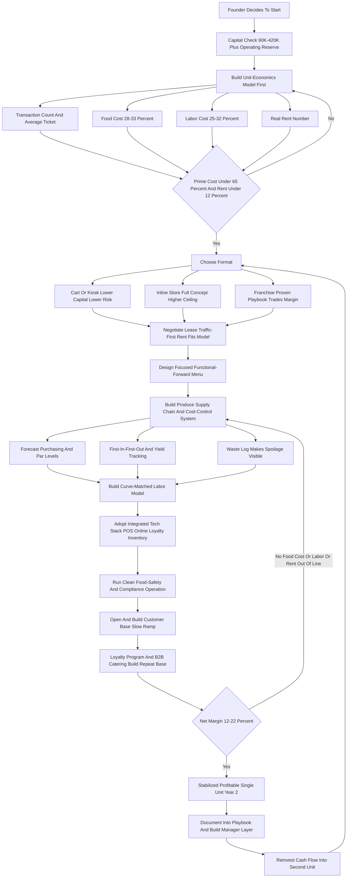
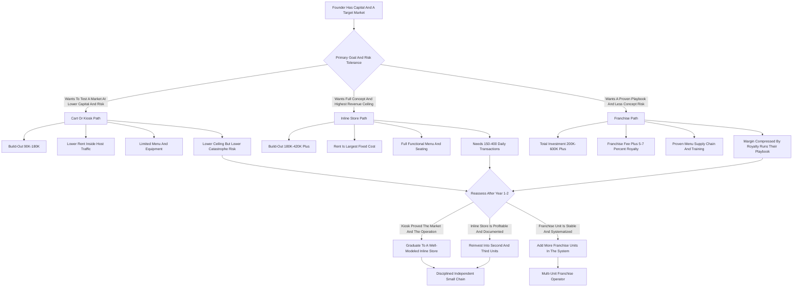

**TL;DR:** To start a juice bar business in 2027, you open a small-footprint food-service operation -- a storefront, kiosk, cart, or grab-and-go counter -- that sells cold-pressed juice, blended smoothies, acai and pitaya bowls, wellness shots, and increasingly functional beverages built on adaptogens, mushrooms, protein, collagen, and electrolytes. The model is **real and resilient but margin-thin and operationally unforgiving**, and it lives or dies on a single number most first-timers never calculate before signing a lease: **prime cost** -- combined cost of goods plus labor as a percentage of sales -- which must be held under roughly 60-65% or the location bleeds. Fresh produce is expensive, perishable, and yield-variable: it takes **roughly two to three pounds of raw produce to press a single 16oz cold-pressed juice**, food cost on juice runs a punishing 28-40% of the menu price, and spoilage on un-sold produce is a permanent tax on the P&L. The honest 2027 economics: a single location costs **$90K-$420K to build out and open** depending on whether it is a cart, a kiosk, or a full inline store; runs a **12-22% net margin** in a disciplined operation; and generates **$180K-$650K in Year 1 revenue** at 120-400 transactions a day. By Year 2-3 a well-run operator reaches **$350K-$1.4M across one to three locations** with **$55K-$240K in owner profit**, at which point the founder chooses between staying a lean independent, building a small local chain, or buying into a franchise system. The three things that kill juice bar startups: **(a) signing the wrong lease** -- too much rent for the foot traffic, the single largest fixed cost and the one that cannot be renegotiated after the fact; **(b) losing control of food cost and spoilage** through bad par levels, no waste tracking, and a menu too broad to prep efficiently; and **(c) under-staffing the morning-and-lunch rush** while over-staffing the dead afternoon, because labor is the other half of prime cost. The 2027 wildcard is real: **GLP-1 weight-loss drugs (Ozempic, Wegovy, Mounjaro, Zepbound) measurably softened demand for calorie-dense smoothies and bowls**, while functional, low-sugar, protein-forward beverages grew -- so the winning 2027 menu skews functional and savory-adjacent, not sugar-bomb. Net: viable in 2027 as a disciplined, prime-cost-obsessed, location-first retail operation -- a poor fit for anyone who thinks "healthy" sells itself, ignores the spreadsheet, or wants a passive business without a 5 a.m. prep shift.

## What A Juice Bar Business Actually Is In 2027

A juice bar is a small-footprint quick-service food business whose entire product line is built around fresh produce and functional ingredients: cold-pressed and centrifugal juices, blended fruit-and-vegetable smoothies, acai and pitaya bowls, wellness shots, nut milks, and an expanding category of functional beverages -- adaptogen lattes, protein shakes, collagen drinks, electrolyte and hydration blends, mushroom-based tonics. You are running a retail operation that converts perishable raw material into a high-velocity, made-to-order consumable, and the business is far closer to running a coffee shop than to running a wellness brand. The romantic version -- you love health, you make beautiful drinks, customers who care about their bodies find you -- is the surface. The actual business underneath is a relentless exercise in three disciplines: **buying produce well and wasting almost none of it; converting that produce into product with a labor model that matches a spiky daypart curve; and occupying a location whose rent the daily transaction count can actually carry.** In 2027 the business is shaped by realities that did not fully exist a decade ago. Customers order ahead through apps and expect a mobile pickup lane. Delivery platforms -- DoorDash, Uber Eats, Grubhub -- are both a revenue channel and a margin tax, with commissions of 15-30% that can turn a profitable drink into a break-even one. The functional-beverage category exploded, so a juice bar that sells only sweet smoothies is competing on a narrowing field. And the GLP-1 medications that spread rapidly through 2024-2026 measurably changed what sells: appetite suppression and a cultural shift toward protein and away from sugar softened demand for the 600-calorie smoothie and the sugar-heavy bowl, while lifting low-sugar, high-protein, and functional options. The 2027 juice bar is not a lifestyle statement that happens to make money. It is a thin-margin retail food operation that rewards exactly one kind of founder: the one who treats produce yield, prime cost, daypart labor, and lease economics as the actual business, and the wellness aesthetic as the marketing.

## The Menu Architecture: What You Actually Sell And Why

The menu is the business, and a founder must understand every category's cost structure before designing it, because the mix you build determines your food cost for years. **Cold-pressed juice** is the flagship and the hardest category to run profitably: a hydraulic or masticating press extracts juice from large volumes of raw produce, it takes roughly two to three pounds of produce per 16oz bottle, the food cost runs 28-40% of menu price, and the pulp is waste. It commands the highest price ($7-$14 per 16oz) and carries the brand, but it is yield-sensitive and labor-heavy. **Centrifugal or fresh-to-order juice** -- pressed in front of the customer -- has lower equipment cost and faster service but slightly lower yield and shorter shelf life. **Blended smoothies** are the volume workhorse and the margin anchor: frozen fruit, a liquid base, add-ins, blended to order; food cost is more controllable (25-35%), prep is faster, frozen inventory does not spoil the way fresh does, and the price point ($8-$15) moves volume. **Acai and pitaya bowls** are a high-ticket, high-margin, Instagram-friendly category ($11-$18) but they are labor-intensive to assemble and topping cost creeps. **Wellness shots** -- ginger, turmeric, wheatgrass, immunity blends -- are tiny, fast, high-margin impulse add-ons ($4-$8) that lift average ticket with almost no incremental labor. **Functional beverages** -- the fastest-growing 2027 category -- include adaptogen lattes, protein shakes, collagen and beauty drinks, electrolyte and hydration blends, and mushroom tonics; they carry premium pricing, appeal to the GLP-1-era customer who wants protein and function over sugar, and differentiate a shop from the smoothie-only competition. **Nut milks and add-ons** -- house almond or oat milk, protein, MCT oil, adaptogen boosts, collagen scoops -- are pure margin lifters at $1-$5 each. **Cleanses and subscriptions** -- multi-day juice cleanse packages ($50-$350) and recurring subscription boxes -- are a revenue-smoothing layer that pre-sells inventory and builds predictable cash flow. **Food attach** -- overnight oats, chia pudding, toast, energy bites, salads -- is increasingly common because it lifts ticket and captures the customer who wants to eat, not just drink. The discipline: a founder should think of the menu as a portfolio -- high-margin fast movers (smoothies, shots, add-ons) that carry the labor model, a flagship (cold-pressed) that carries the brand, high-ticket specialty (bowls, functional) that lifts the average check, and revenue-smoothers (cleanses, subscriptions) that soften the daypart and seasonal swings -- and the rookie mistake is a menu so broad that prep, par levels, and waste all spiral.

## The Three Formats: Cart Or Kiosk, Inline Store, And Franchise

There are three fundamentally different ways to enter this business, and the choice drives everything from capital to risk. **The cart, kiosk, or grab-and-go counter** is the lowest-capital entry: a small footprint inside a gym, office building, grocery store, college, or as a standalone mall kiosk, often with a limited menu and minimal seating. Build-out runs $90K-$180K, the rent is lower, the labor model is leaner, and the risk of a catastrophic lease is smaller -- but the ceiling is also lower, the menu is constrained by equipment and space, and the location is often dependent on a host's foot traffic. This is the disciplined way to test a market and a concept before committing to a full store. **The inline or freestanding store** is the full version: a dedicated storefront with seating, a complete menu, a full equipment package, and a real lease. Build-out runs $180K-$420K-plus depending on market and condition, the rent is the largest fixed cost, and the operation needs 150-400 daily transactions to carry it -- but the revenue ceiling, the brand presence, and the ability to run the full functional menu are all higher. **The franchise** -- buying into an established system like Tropical Smoothie Cafe, Smoothie King, Robeks, Clean Juice, Nekter, or Jamba -- trades independence and a franchise fee plus ongoing royalties (typically 5-7% of revenue plus a marketing fee) for a proven menu, supply chain, brand recognition, training, and a build-out playbook. Total franchise investment commonly runs $200K-$600K-plus. The franchise reduces concept risk and shortens the learning curve, but the royalties permanently compress the margin and the operator runs someone else's playbook. Many disciplined founders start with a cart or kiosk to learn the operation and the local market, then graduate to an inline store once they understand their own unit economics -- and the franchise route is the right call specifically for the operator who wants a proven system and is willing to trade margin for de-risking.

## The 2027 Market Reality: The GLP-1 Shift, Functional Beverages, And Competition

A founder needs an accurate read of the 2027 landscape, because it is neither the recession-proof wellness goldmine some claim nor a dying fad. **The GLP-1 effect is real and must be designed around.** The rapid spread of weight-loss and appetite-suppression medications -- Ozempic, Wegovy, Mounjaro, Zepbound -- through 2024-2026 measurably softened demand for calorie-dense, sugar-forward products: the 500-700 calorie smoothie and the sugar-heavy bowl lost some of their core customer, who now eats less and prioritizes protein. This is not the end of the category -- it is a forced repositioning. The 2027 winners shifted their menu mix toward **low-sugar, high-protein, functional, and savory-adjacent options**, leaned into the GLP-1 customer who needs concentrated nutrition in smaller volumes, and stopped treating "healthy" as synonymous with "fruit sugar." **Functional beverages are the growth engine.** Adaptogens, mushrooms, protein, collagen, electrolytes, nootropics -- the functional category grew rapidly because it serves the exact 2027 customer: someone who wants a beverage to do something (energy, recovery, focus, hydration, beauty) rather than just taste sweet. A 2027 juice bar that does not have a real functional menu is competing on the shrinking half of the market. **The competition is layered.** At the national level sit the franchise chains -- Tropical Smoothie Cafe with well over a thousand units, Smoothie King with over a thousand, Jamba under Inspire Brands, plus Robeks, Nekter, Clean Juice, and Joe and the Juice expanding from Europe. Regional players like Pressed Juicery and Nekter occupy the premium cold-pressed niche. And every local market has independents, plus category-adjacent competition from coffee shops adding smoothies, grocery stores with in-house juice bars, and the entire packaged functional-beverage aisle. **What changed by 2027:** mobile ordering and delivery are baseline expectations and a margin pressure; functional ingredients are a requirement not a novelty; the GLP-1 shift permanently altered the demand curve; and the customer is more informed and more label-literate than a decade ago. The net market reality: demand is real and durable for a repositioned, functional-forward concept, the business is harder than it looks because of food cost and lease economics, and the winning 2027 entrant competes on a differentiated functional menu, a disciplined operation, and a location that matches its rent to its traffic -- not on being one more sweet-smoothie shop.

## The Core Unit Economics: Prime Cost And Produce Yield

This is the most important section in the guide, because the entire business lives or dies on two numbers that beginners almost never run before signing a lease. The first is **prime cost** -- the sum of cost of goods sold and total labor, expressed as a percentage of sales. In food service, prime cost is the master gauge: a healthy juice bar holds prime cost at roughly **58-65% of sales**, which leaves enough for rent, utilities, insurance, marketing, and owner profit. If prime cost runs 70%+, the location is structurally unprofitable no matter how busy it looks, because rent and overhead still have to come out of the remaining sliver. The two halves of prime cost each have their own discipline. **Cost of goods** is dominated by produce, and produce is expensive, perishable, and yield-variable. Cold-pressed juice runs **28-40% food cost** because of the brutal produce-to-juice conversion ratio -- roughly two to three pounds of raw produce per 16oz bottle, with the pulp as waste. Smoothies run a more controllable **25-35%** because frozen fruit does not spoil and portioning is consistent. Bowls run 25-38% with topping creep as the risk. The blended menu food cost target is **28-33%**. **Spoilage is the silent killer inside food cost**: produce ordered and not used is pure loss, and a juice bar without tight par levels, a first-in-first-out system, a prep-to-forecast discipline, and a waste log will quietly run 5-12% of produce straight into the compost. **Labor** is the other half of prime cost, and the juice bar's daypart curve makes it hard: demand spikes hard in the morning rush and the lunch window and collapses in the mid-afternoon, so the staffing model must flex with the curve -- a common rookie error is a flat schedule that over-staffs the dead 2-4 p.m. window and under-staffs the 7-9 a.m. and 12-1 p.m. peaks. Labor target is roughly **25-32% of sales**. The discipline this imposes: **before signing any lease, build the unit-economics model -- a realistic daily transaction count, an average ticket, a 28-33% food cost, a 25-32% labor cost, and the actual rent -- and confirm prime cost lands under 65% with rent under 12%.** A founder who runs these numbers builds a location that compounds; a founder who signs the lease because the space "feels right" and the neighborhood "seems healthy" builds a beautiful shop that loses money on every transaction.

## The Line-By-Line P&L: Where The Money Actually Goes

Beyond prime cost, a founder must internalize the full operating P&L, because the gross-to-net path is where revenue becomes profit or vanishes. Take a representative single inline location doing $400,000 in annual revenue. **Cost of goods** at 30% is $120,000 -- produce, frozen fruit, functional ingredients, cups, lids, straws, bags, and packaging, which is itself a real and rising line. **Labor** at 28% is $112,000 -- hourly staff, a shift lead or assistant manager, payroll taxes, and any benefits; this is the line that flexes with the daypart and the season. Prime cost so far: $232,000, or 58% -- healthy. **Rent and occupancy** at 10% is $40,000 -- the single largest fixed cost, plus common-area maintenance, property tax pass-throughs, and insurance riders in many leases. **Utilities** -- electricity for refrigeration, blenders, and presses; water; gas -- run 3-5%. **Delivery platform commissions** are a margin tax that must be modeled honestly: if 20% of revenue comes through DoorDash and Uber Eats at a 25% commission, that is 5% of total revenue gone, and the menu pricing on those platforms must be marked up to compensate or the channel loses money. **Marketing** runs 2-4% -- local digital, loyalty program, grand-opening spend amortized. **Software and payments** -- POS, online ordering, loyalty, payment processing fees -- run 3-5%. **Repairs, maintenance, and equipment service** -- commercial blenders and presses are worked hard and break -- run 1-3%. **Insurance, licenses, accounting, and admin** round out the fixed overhead at 2-4%. **Royalties**, if a franchise, add 5-7% plus a marketing fee. Net it all out and a disciplined independent juice bar runs a **12-22% net margin**; a franchise runs lower, often **8-15%**, because the royalty comes off the top. The spread between a 20% net and a break-even location is driven almost entirely by three things: whether the lease was signed at a rent the traffic can carry, whether food cost and spoilage are controlled, and whether labor flexes with the daypart. The founders who fail at the P&L level almost always made the same errors -- they signed too much rent, they let produce waste run unmeasured, they staffed flat against a spiky curve, and they treated delivery commissions as someone else's problem until the channel was quietly eating the margin.

## Location And Lease: The Single Largest Decision

The lease is the most consequential decision a juice bar founder makes, because rent is the largest fixed cost, it is locked in for years, and it cannot be renegotiated after the traffic disappoints. **The location math is traffic-first.** A juice bar needs a steady flow of the right people at the right times: the morning commuter, the pre- and post-workout customer, the lunch crowd, the wellness-oriented professional. The best locations sit near or inside demand generators -- gyms and fitness studios, office concentrations, colleges and universities, medical and hospital campuses, affluent residential corridors, transit nodes, and grocery-anchored centers. **The rent must fit the model.** Occupancy cost should land at roughly **8-12% of projected revenue**; above 15% the location is structurally fragile. The founder must build the transaction-count model before signing -- realistic daily transactions, average ticket, annual revenue -- and confirm the rent fits, rather than signing the lease and hoping the traffic materializes. **Lease terms matter as much as rent.** The length, the renewal options, the escalation clauses, the tenant-improvement allowance the landlord contributes to build-out, the personal guarantee, the use and exclusivity clauses, the common-area charges -- all of it shapes the real cost and the real risk. A founder should negotiate the tenant-improvement allowance hard, because landlord contribution to build-out directly reduces the capital at risk. **Visibility, access, and parking** convert traffic into transactions -- a location with great traffic but no visibility, hard parking, or awkward access underperforms its count. **The format drives the location strategy:** a cart or kiosk can occupy a host's existing traffic at lower rent and lower risk; an inline store must generate or capture its own. The discipline: the founder who treats the lease as a financial decision -- modeled, negotiated, stress-tested against a conservative traffic count -- builds on solid ground; the founder who treats it as a real-estate romance signs a multi-year obligation that the business may never be able to carry.

## Build-Out And Equipment: The Capital Plan

A founder needs a concrete capital plan, because the build-out and equipment package is the largest single cash outlay and the easiest place to either overspend or under-equip. **The equipment package** is anchored by the production gear: a commercial **cold-press juicer** -- hydraulic or masticating, with brands like Goodnature in the commercial tier -- is a major line at several thousand to over twenty thousand dollars depending on capacity; high-performance **commercial blenders** (Vitamix, Blendtec commercial units, often several) for the smoothie line; **refrigeration** -- reach-in and under-counter units, a walk-in cooler in larger stores -- which is both a capital cost and an ongoing utility cost; **freezers** for frozen fruit and acai; produce **prep equipment** -- sinks, prep tables, cutting stations, a commercial washer; a **POS and online-ordering system**; and **smallwares** -- containers, knives, scales, portioning tools. **Build-out and construction** -- plumbing for the prep sinks and the press, electrical for the refrigeration and blender load, the service counter, flooring, finishes, signage, seating in an inline store, and the menu boards -- is the other large bucket, and it varies enormously with the condition of the space (a former food-service space with existing plumbing and a hood is far cheaper than a raw shell). **Permits, licenses, and professional fees** -- health department, building permits, the food-service license, a design and architecture fee -- are real and must be budgeted. The capital totals: a **cart or kiosk** comes in around **$90,000-$180,000**; a **full inline store** runs **$180,000-$420,000** and can exceed that in high-cost markets or difficult spaces; a **franchise** commonly totals **$200,000-$600,000-plus** all-in including the franchise fee. The sequencing discipline: negotiate the tenant-improvement allowance to offset build-out, buy production equipment to commercial-grade durability because it is worked hard daily, do not over-build seating and finish at the expense of the working reserve, and hold a genuine **operating reserve** -- enough to fund several months of fixed costs and the slow ramp before the location finds its traffic. Under-capitalization -- opening with no reserve and a thin cash position -- is a top killer, because a juice bar takes months to build its customer base and the rent does not wait.

## Produce Sourcing, Vendors, And Supply Chain

Produce is the cost of goods, and how a founder sources it directly drives the food-cost line and the spoilage line. **The sourcing channels** each have trade-offs. **Produce distributors and broadline foodservice suppliers** offer consistency, delivery, volume pricing, and account terms -- the operational backbone for most juice bars. **Local farms and farmers markets** offer freshness, a marketing story, and sometimes price advantages on seasonal items, but less consistency and more procurement labor. **Restaurant-supply and wholesale clubs** fill gaps. **Frozen fruit suppliers** matter enormously for the smoothie line, because frozen inventory does not spoil and stabilizes a major part of food cost. **Functional-ingredient suppliers** -- adaptogens, protein, collagen, mushroom extracts, electrolyte blends -- are a newer, specialized channel that the 2027 functional menu depends on. **The disciplines that control the produce line:** buying to a **forecast** rather than a habit, so orders track expected demand; tight **par levels** that keep just enough fresh produce on hand; **first-in-first-out** rotation so older produce is used first; **yield tracking** so the founder knows the real produce-to-juice ratio and can spot a slipping supplier or a wasteful prep cook; and a **waste log** that makes spoilage visible instead of invisible. **Seasonality and price volatility** are structural -- produce prices swing with weather, season, and supply shocks, and a founder needs menu flexibility (seasonal specials, the ability to sub ingredients) and pricing discipline to absorb it. **Vendor relationships** -- reliable delivery, consistent quality, fair pricing, and a backup supplier so a single vendor's failure does not close the juice line -- are an operational asset built over time. The strategic point: a juice bar's food cost is not a fixed fact -- it is the output of sourcing decisions, par-level discipline, yield management, and waste control, and the operators who treat produce procurement as a managed system run a 30% food cost while the ones who wing it run 40%.

## Daypart Demand And The Labor Model

The juice bar's demand curve is spiky, and the labor model must match it, because labor is half of prime cost and a flat schedule against a spiky curve is a guaranteed margin leak. **The daypart curve** typically peaks in the **morning rush** -- commuters, pre-work, post-morning-workout -- builds again through the **lunch window**, and then collapses through the dead **mid-afternoon** before a smaller post-work bump. Weekends shift the curve later and flatter. **The labor model must flex with this curve:** heavier staffing on the peaks, a lean skeleton crew through the trough, and a schedule built from an honest read of the location's own transaction-by-hour data once it exists. The rookie error is a comfortable flat schedule -- the same three people from open to close -- which over-pays the empty afternoon and under-serves the peak, costing both margin and the rush-hour customers who will not wait in a long line. **The roles:** hourly team members who prep, build drinks, and run the counter; a shift lead or assistant manager who opens or closes and runs the floor; and the owner-operator who, in Year 1, is typically working the business -- doing the 5 a.m. prep, covering shifts, managing the schedule, and learning the curve. **Prep labor is its own consideration** -- the early-morning produce washing, cutting, juicing, and par-stocking that happens before the doors open is real labor that must be in the model. **Staffing the open is a discipline** because the morning rush hits fast and an under-prepped, under-staffed open loses the most valuable customers of the day. **Training drives speed and consistency** -- a juice bar's service is a timed performance, and a well-trained crew builds drinks faster, wastes less, and upsells the add-ons that lift the ticket. The strategic point: the founders who run a tight, curve-matched labor model -- flexed to the daypart, lean on the trough, heavy on the peak, trained for speed -- hold labor at 28% and keep prime cost healthy; the ones who staff flat for comfort watch labor drift to 35% and the margin disappear.

## Menu Engineering And Pricing Strategy

Pricing and menu design are not afterthoughts -- they are the levers that set the average ticket and the food-cost percentage, and a founder must engineer them deliberately. **Per-item pricing** is anchored to food cost: each menu item should be priced so its food cost lands in the target band -- roughly 28-33% blended -- which means a $10 smoothie carries about $3 of ingredients, and a cold-pressed juice priced at $9 with 35% food cost is working harder than one priced at $9 with 45%. **Menu engineering** is the practice of knowing each item's margin and popularity and designing the menu to steer customers toward the high-margin fast movers: the layout, the naming, the photography, the placement, and the staff's suggestive selling all push the items that make money. **Add-ons are the ticket-lifters** -- protein, MCT, adaptogen and collagen boosts, an extra shot -- and they are nearly pure margin; a disciplined operation trains every transaction to offer them. **Bundles and combos** -- a juice-and-bowl pairing, a smoothie-and-shot -- lift the average check. **Cleanses and subscriptions** pre-sell inventory and smooth revenue. **Delivery-platform pricing must be marked up** to absorb the commission, or the channel quietly loses money on every order. **The menu must not be too broad** -- every additional SKU adds prep complexity, more produce to par-stock and potentially waste, and slower service; the disciplined 2027 menu is focused, functional-forward, and engineered, not a sprawling list that tries to please everyone and spoils produce doing it. **Price increases** must be managed -- produce inflation is real, and a founder who never raises prices watches food cost climb until the margin is gone, while one who raises thoughtfully and periodically keeps pace. The strategic point: a juice bar's average ticket and food-cost percentage are not given facts -- they are engineered outcomes of pricing discipline, menu design, add-on attach, and SKU restraint, and the operators who engineer the menu run a healthier P&L than the ones who just list their favorite drinks.

## Marketing, Loyalty, And Customer Acquisition

A juice bar lives on repeat local customers, and the marketing model must build a base of regulars rather than chase one-time traffic. **The grand opening** matters -- a strong launch with sampling, local press, social buzz, and an opening promotion seeds the initial customer base and the early reviews that drive discovery. **Local digital presence** is baseline: a Google Business Profile that converts "juice bar near me" searches, an active social presence with the genuinely photogenic product the category produces, and management of the review platforms that a food business lives and dies on. **The loyalty program** is the single most important retention tool -- a points or rewards program that turns an occasional customer into a twice-a-week regular, captured in the POS, is what builds the predictable transaction base the P&L needs. **Corporate and B2B catering** is a high-value channel -- office wellness programs, corporate catering orders, gym partnerships, and bulk subscription deals smooth the revenue curve and lift average order size well above the walk-in ticket. **Partnerships with demand generators** -- the gym next door, the yoga studio, the office building, the medical campus -- convert adjacent foot traffic into customers. **The product itself is marketing** -- a beautiful bowl or a vivid juice is photographed and shared by the customer, and a category this visual should make that easy. **Sampling and community presence** -- farmers markets, local events, fitness expos -- build awareness in the wellness community. **Delivery platforms are an acquisition channel** as well as a margin cost -- they expose the shop to customers who then convert to direct, higher-margin orders. The discipline: paid acquisition plays a modest role; the juice bar is won through a strong opening, a loyalty program that manufactures regulars, B2B catering that smooths revenue, partnerships with the gyms and offices that surround it, and a genuinely shareable product -- and the operator who builds that retention engine has a defensible transaction base while the one who relies on walk-by traffic alone is exposed to every new competitor and every slow season.

## Seasonality And Revenue Smoothing

Juice bar demand is seasonal, and a founder must plan for the swing because the fixed costs do not flex with it. **The seasonal curve** typically peaks in the warmer months -- spring and summer drive smoothie and cold-beverage demand, and the January wellness-resolution surge gives a strong start to the year -- while the colder months and the post-resolution late-winter stretch are softer. The swing is real, and the rent, the core staff, the utilities, and the insurance keep costing money through the slow season. **The revenue-smoothing tools** are what a disciplined operator uses to soften the curve. **Functional and warm beverages** -- adaptogen lattes, warm tonics, protein drinks -- extend demand into the colder months and serve the customer who does not want a frozen smoothie in January. **Cleanses and subscriptions** pre-sell inventory and create recurring revenue independent of daily walk-in weather. **Corporate B2B catering** runs on the business calendar, not the weather, and smooths the curve. **Seasonal menu rotation** keeps the offering fresh and lets the operator lean into what sells when. **The cash discipline** is the other half: a founder treats the strong season as the period that must partly fund the slow one, holding a reserve rather than spending every peak-season dollar. **Daypart and weekly patterns** layer on top of the seasonal one -- the weekday morning rush, the weekend late curve -- and the labor model flexes against both. The strategic point: a juice bar that sells only frozen smoothies to walk-in traffic is maximally exposed to the seasonal swing; one that runs a functional menu, a cleanse-and-subscription layer, a B2B catering channel, and a disciplined reserve has smoothed the curve into something the fixed costs can carry year-round.

## Food Safety, Compliance, And Licensing

A juice bar is a food business, and the regulatory and food-safety layer is not optional -- it is a core operating function with real consequences for getting it wrong. **Licensing and permits** include the business license, the food-service or retail-food establishment permit, health department approval and inspection, a food-handler or food-manager certification, sales-tax registration, and signage and building permits for the build-out. **Health inspections** are ongoing -- a juice bar is inspected, and a poor inspection is both a compliance problem and a public reputation problem in an era of published scores. **Food safety is operational** -- proper produce washing, safe handling and storage temperatures, refrigeration discipline, cross-contamination control, allergen awareness (nut milks, common allergens in add-ins), and clean equipment. **Cold-pressed juice has specific considerations** -- unpasteurized fresh juice carries food-safety rules around handling, labeling, shelf life, and in some cases warning requirements, and a founder selling bottled cold-pressed juice for off-premise consumption must understand the relevant FDA and local rules. **Labeling** matters for bottled product, cleanses, and anything sold packaged -- ingredients, dates, and required disclosures. **Allergen and dietary transparency** -- clear information on what is in each product -- is both a compliance and a customer-trust issue. **Insurance** -- general liability, product liability, property, workers' compensation -- protects against the real risks of a food operation. The discipline: a founder treats food safety and compliance as a built-in operating system -- certified staff, documented procedures, temperature logs, clean-equipment routines, and a relationship with the local health department -- not as a box checked once at opening. The cost of getting this wrong is not just a fine; it is a closed location, a damaged reputation, or a liability event, and the operators who run a clean, compliant, well-documented operation protect the business that the rest of the playbook builds.

## Technology: POS, Online Ordering, And Operations

In 2027 a juice bar runs on a technology stack, and a founder should choose it deliberately because it touches revenue, margin, and operations. **The POS system** is the central hub -- it processes transactions, holds the menu and modifiers, captures the sales data that reveals the daypart curve and the item-level margins, runs the loyalty program, and integrates the payment processing. **Online and mobile ordering** is a 2027 baseline expectation -- customers order ahead and expect a pickup lane, and a juice bar without an order-ahead capability loses the convenience-driven customer. **Delivery-platform integration** -- DoorDash, Uber Eats, Grubhub -- must be managed through the POS or an aggregator so the kitchen is not juggling multiple tablets, and the platform pricing must be set to absorb the commission. **The loyalty and CRM layer** captures the customer data that builds the repeat base and lets the operator market to regulars. **Inventory and food-cost software** -- tracking produce usage, theoretical versus actual food cost, and waste -- is what makes the food-cost line a managed number rather than a year-end surprise. **Labor scheduling software** helps build the curve-matched schedule and control the labor line. **Payment processing fees** are a real cost that must be in the P&L. **The data the stack produces is the operating advantage** -- transaction-by-hour data drives the labor schedule, item-level sales data drives menu engineering, food-cost data drives purchasing, and loyalty data drives marketing. The discipline: adopt an integrated stack early -- POS, online ordering, loyalty, inventory, and scheduling that talk to each other -- rather than bolting on disconnected tools later, and treat the data the stack generates as the instrument panel that runs the business. The operators who run a tight digital operation see their numbers clearly and adjust fast; the ones running off a basic register and a memory are flying blind on the exact metrics -- prime cost, daypart, food cost, item margin -- that determine whether the location survives.

## Staffing, Hiring, And Building A Team

A founder can run the smallest cart nearly solo, but an inline store does not work without a team, and the staffing model shapes both the margin and the customer experience. **The Year-1 reality** is that the owner-operator is in the business -- doing prep, covering shifts, building drinks, managing the schedule, and learning the operation from the inside. **The core hires** are the hourly team members who prep produce, build drinks, run the counter, and handle the rush, and a **shift lead or assistant manager** who can open and close and run the floor without the owner present. **Hiring for a quick-service food role** prioritizes reliability, speed, a genuine customer-service disposition, and the willingness to do the unglamorous prep and cleaning work; the wellness-brand romance attracts applicants who want the aesthetic but not the 5 a.m. produce-washing reality, and a founder must hire for the work, not the vibe. **Training is a margin and experience driver** -- a trained crew builds drinks faster, portions consistently (which controls food cost), wastes less, upsells the add-ons, and represents the brand; an untrained crew is slow, inconsistent, wasteful, and a source of complaints. **Scheduling against the daypart curve** is the core ongoing labor discipline. **Retention matters** because turnover in food service is high and expensive -- recruiting and retraining is a real cost, and the operators who treat their team well, train them properly, and build a decent culture spend less on churn. **As the operation grows**, the hiring sequence adds a store manager who runs the location so the owner can step back, and eventually a multi-unit layer if the founder builds a small chain. The strategic point: a juice bar is a people business at the counter -- speed, consistency, friendliness, and upselling all run through the crew -- and the founders who hire for the real work, train hard, schedule to the curve, and retain their best people run a tighter, more profitable, better-reviewed operation than the ones constantly scrambling to staff the morning rush.

## The Year-One Operating Reality

A founder should walk into Year 1 with accurate expectations, because the gap between the wellness-brand fantasy and the thin-margin retail reality is where most quitting happens. Year 1 is **operation-building and customer-base-building mode, not profit-extraction mode.** The first months are a slow ramp -- a new juice bar does not open to a line; it builds a customer base over months as the neighborhood discovers it, the loyalty program accumulates regulars, the reviews build, and the B2B relationships form. The founder is genuinely in the business: the 5 a.m. produce prep, the morning rush, the schedule, the vendor calls, the health inspection, the broken blender, the slow Tuesday afternoon. A disciplined Year-1 single location, opened with a real reserve, can realistically generate **$180,000-$650,000 in revenue** depending on format and market -- a cart at the low end, a well-located inline store at the high end -- against an owner profit that in Year 1 is often modest or thin, because the ramp is slow and the build-out capital is being recovered. The first slow season is the test: a founder who built a reserve and a revenue-smoothing menu carries it; one who spent every peak-season dollar struggles. Year 1 is also when the founder discovers whether the lease was right -- a location that cannot generate the modeled transaction count shows up immediately as a rent line the revenue cannot carry, and that mistake is hard to fix. The work is hands-on, early-morning, weekend-inclusive, and detail-driven -- portioning, waste control, scheduling, cleaning, inspecting. The founders who succeed treat Year 1 as paid tuition in a real food-retail operation and use it to dial in the menu, the labor model, the food cost, and the customer base; the ones who fail expected a passive wellness brand and were unprepared for the prep shifts, the thin margin, the slow ramp, and the relentless operational detail.

## The Five-Year Revenue Trajectory

Mapping a realistic five-year arc helps a founder size the opportunity honestly. **Year 1:** a single location, slow ramp, owner in the business, $180K-$650K revenue depending on format, modest-to-thin owner profit as the build-out capital is recovered and the customer base builds; the first slow season is the survival test. **Year 2:** the single location matures -- the customer base is built, the loyalty program is generating a predictable transaction base, the labor model is dialed to the curve, the food cost is controlled; revenue on a single inline location stabilizes around **$300K-$700K** with a healthy operation running a **12-22% net margin**, and the founder decides whether to optimize the single unit or expand. **Year 3:** a disciplined operator who chose to expand is running **two to three locations** -- the playbook from unit one is now repeatable, a store-manager layer is in place, and combined revenue lands around **$600K-$1.4M** with owner profit roughly **$90K-$240K** depending on margin and unit count; the founder is managing a small operation rather than working a counter. **Year 4-5:** the path forks -- the operator either runs a tight, profitable independent (one to a few well-run units, owner profit a comfortable function of unit count and margin), builds a larger local chain, or, if franchised, operates multiple franchise units within a system. A mature, well-run multi-unit independent can reach **$1.2M-$3M-plus in combined revenue** with the owner profit a function of how many units and how disciplined each one's prime cost is. These numbers assume the disciplined version throughout -- leases that fit, food cost controlled, labor flexed to the curve, a functional-forward menu, a revenue-smoothing layer, and a real reserve. They do not assume hockey-stick growth, because a juice bar scales one location at a time, each one a real build-out and a real lease and a real ramp. A mature juice bar business is a genuine small retail operation -- a good outcome, earned through years of operational discipline, not a passive wellness annuity.

## Five Named Real-World Operating Scenarios

Concrete scenarios make the model tangible. **Scenario one -- Priya, the disciplined kiosk-to-store operator:** opens a $150K kiosk inside a large gym, runs a tight focused menu, learns her real food cost and daypart curve for eighteen months, builds a loyalty base and a couple of corporate catering accounts, then uses what she learned to open a well-located $280K inline store with a lease she modeled carefully; by Year 3 she runs two profitable units at a 19% net margin because she learned the operation before she scaled it. **Scenario two -- the cautionary tale, Marcus:** signs a beautiful, high-visibility inline lease in a trendy district at a rent that would require 350 transactions a day, opens to a slow ramp that tops out at 180, and the rent line -- which he never stress-tested against a conservative count -- eats the business; he is cash-strapped within a year and closes, the classic too-much-rent failure. **Scenario three -- Dani, the functional-forward repositioner:** reads the GLP-1 shift correctly, builds a menu heavy on protein drinks, adaptogen beverages, low-sugar functional options, and savory-adjacent food attach, and deliberately serves the customer who eats less and wants function over sugar; her average ticket and her cold-month revenue both run above the smoothie-only competition, and her single location does $560K at a strong margin. **Scenario four -- the Okafor family, the B2B-and-subscription smoothers:** build a single location but pour energy into corporate wellness catering, office-building partnerships, and a cleanse-and-subscription program, smoothing the seasonal and daypart curves with recurring and scheduled revenue; their revenue is steadier than any walk-in-only shop and funds a calm expansion to a second unit. **Scenario five -- Trevor, the food-cost casualty:** opens with a sprawling forty-item menu, no par-level discipline, no waste log, and a flat staffing schedule; his produce spoilage runs into double digits, his food cost sits at 41%, his labor drifts to 34%, his prime cost is 75%, and despite a respectable transaction count the location never makes money -- the canonical illustration of losing control of prime cost. These five span the realistic distribution: disciplined test-then-scale success, too-much-rent failure, the functional-forward winner, the revenue-smoothing operator, and the prime-cost wipeout.

## Risk Management And The Failure Modes

The juice bar model carries specific risks, and the 2027 operator manages each deliberately rather than hoping. **Lease and location risk** -- the largest -- is mitigated by modeling the transaction count conservatively before signing, keeping occupancy under 12% of revenue, and negotiating favorable terms and a tenant-improvement allowance. **Food-cost and spoilage risk** is mitigated by forecast-based purchasing, tight par levels, first-in-first-out rotation, yield tracking, and a waste log that makes spoilage visible. **Labor-cost risk** is mitigated by a schedule flexed to the daypart curve rather than a comfortable flat one. **Produce price volatility** is mitigated by menu flexibility, seasonal substitution, backup suppliers, and periodic price increases that keep pace with inflation. **Demand-shift risk -- the GLP-1 effect** -- is mitigated by a functional-forward, low-sugar, protein-inclusive menu that serves the changed customer rather than the 2018 customer. **Delivery-platform margin risk** is mitigated by marking up platform pricing to absorb commissions and treating delivery as one channel, not the foundation. **Seasonality risk** is mitigated by warm and functional beverages, a cleanse-and-subscription layer, B2B catering, and a cash reserve. **Food-safety and compliance risk** is mitigated by certified staff, documented procedures, temperature discipline, and a clean relationship with the health department. **Equipment-failure risk** -- a dead press or blender in the morning rush -- is mitigated by commercial-grade equipment, a service relationship, and backup capacity. **Competition risk** -- a franchise opening nearby, a coffee shop adding smoothies -- is mitigated by a differentiated functional menu, a loyalty base, and a defensible location. **Under-capitalization risk** is mitigated by opening with a genuine operating reserve that funds the slow ramp. The throughline: every major risk in the juice bar business has a known mitigation built from modeling, operational discipline, menu strategy, and reserve, and the operators who fail are usually the ones who signed too much rent, never measured their food cost, staffed flat, ignored the GLP-1 shift, or opened with no cushion -- every one of which was visible in advance.

## The Competitor Landscape: Who You Are Up Against

A founder should understand the competitive field clearly. **The national franchise chains** -- Tropical Smoothie Cafe with well over a thousand units, Smoothie King with over a thousand, Jamba under Inspire Brands, plus Robeks, Nekter, Clean Juice, and the European Joe and the Juice expanding in the US -- have brand recognition, supply-chain scale, marketing muscle, and a proven playbook; they set customer expectations and are hard to out-resource, but they run a standardized menu and an operator inside one of those systems pays the royalty. **The premium cold-pressed players** -- Pressed Juicery, Nekter, and regional premium brands -- occupy the high-end juice niche with a refined product and a wellness-forward brand. **The independent juice bars** in every local market compete on locality, menu differentiation, and community connection. **The category-adjacent competition** is real and often underestimated: coffee shops adding smoothies and functional drinks, grocery stores with in-house juice and smoothie bars, gyms with their own shake counters, and the entire packaged functional-beverage aisle that lets a customer get an adaptogen or protein drink without visiting a juice bar at all. **The strategic reality for a 2027 entrant:** you generally cannot out-scale the franchise chains or out-brand the premium players, so you win by being the most differentiated, most operationally disciplined, most community-connected operator in your specific location -- a functional-forward menu the chains do not run, a loyalty base the packaged aisle cannot replicate, B2B relationships with the surrounding offices and gyms, and a location whose rent the traffic actually carries. The competitive moat in the juice bar business is not the product itself -- anyone can buy a blender and a press -- it is the **location, the loyal repeat base, the differentiated functional menu, the B2B relationships, and the operational discipline that holds prime cost in line**, all of which take time to build and are genuinely hard for a new competitor to copy.

## Financing The Business

Because a juice bar is capital-intensive to open, a founder should understand the financing options that fund the launch and the growth. **Owner equity and savings** fund most of the initial capital for an independent, and lenders will expect the founder to have real skin in the game. **SBA loans** -- particularly the SBA 7(a) and 504 programs -- are a common path for food-service build-outs, funding equipment, construction, and working capital over a longer term; they require a solid business plan, projections, and usually a personal guarantee. **Equipment financing or leasing** spreads the cost of the press, blenders, and refrigeration over time and matches the payment to the earning life of the gear, preserving cash for the reserve. **The landlord's tenant-improvement allowance** is a form of financing -- a negotiated landlord contribution to build-out that directly reduces the capital the founder must raise. **Conventional small-business loans and lines of credit** fill gaps and fund working capital. **Franchise-specific financing** -- many franchise systems have relationships with lenders familiar with their model, which can streamline funding for a franchise unit. **Investor capital** -- friends, family, or a partner -- can fund a launch or an expansion, with the ownership and control trade-offs that implies. **Reinvested cash flow** funds most healthy expansion past the first profitable unit -- the proven location's profit funds the second build-out. The financing discipline: it is reasonable to finance the equipment and to use the tenant-improvement allowance, because they spread cost against earning assets, but the founder must still hold real cash for the **operating reserve**, because no lender funds a slow ramp and the juice bar takes months to build its base. The dangerous move is borrowing to the hilt for a beautiful build-out and opening with no cushion -- debt service plus full fixed costs against a slow-ramping revenue line is how a financed launch fails before it ever finds its customers.

## Taxes And Business Structure

A founder should set up the tax and legal structure deliberately, because a food-retail business has specific implications. **Entity:** most juice bar operators form an LLC or an S-corp for liability protection and tax flexibility -- the entity holds the lease, the vendor accounts, the licenses, and the insurance, and shields the owner's personal assets from the operating risks of a food business. **Sales tax** on prepared food and beverages applies in most jurisdictions and the rules vary -- what is taxable, at what rate, and how it is remitted is something a founder must get right from day one, because sales-tax errors compound. **Depreciation** of the equipment and the build-out -- the press, blenders, refrigeration, leasehold improvements -- is a real part of the tax picture, and the schedules and any available accelerated or first-year expensing materially shape taxable income in the heavy-capex opening year; this is where a knowledgeable accountant earns the fee. **Payroll taxes** on the hourly team are a real cost that must be budgeted, not discovered, and tip handling (if applicable) has its own rules. **Cost of goods, rent, utilities, marketing, software, insurance, and professional fees** are all deductible business expenses that a clean bookkeeping system captures. **Cash-basis versus accrual** and the handling of inventory affect how income is recognized. The discipline: separate business banking from day one, a bookkeeping system that tracks food cost and labor as the prime-cost drivers they are, monthly attention to the P&L rather than a year-end scramble, quarterly attention to sales tax and estimated taxes, and an accountant who understands food-service businesses and can optimize the depreciation on the build-out. Skipping this does not save money -- it converts a manageable compliance function into a year-end crisis and a missed depreciation opportunity that costs real cash.

## Owner Lifestyle: What Running This Business Actually Feels Like

A founder should know what daily life in this business is like before committing, because the lived reality is early, hands-on, and detail-driven. In **Year 1**, the owner-operator is genuinely in the business -- the 5 a.m. produce prep, opening the store, working the morning rush, building drinks, managing the schedule, calling vendors, handling the health inspection, covering the shift when someone calls out, and closing some nights. It is physical, early, weekend-inclusive, and absorbing, far closer to running a small quick-service restaurant than to managing a wellness brand. By **Year 2**, with a trained crew and a shift lead or store manager, the founder's role shifts toward management -- the schedule, the numbers, the vendor relationships, the marketing, the menu, the B2B accounts -- though a single-unit owner is still hands-on and still covers gaps. By **Year 3-5**, with a store-manager layer and possibly multiple units, the founder can run a more managerial rhythm -- overseeing managers, watching the prime cost across units, planning expansion -- though a juice bar operation never becomes fully hands-off; the early mornings, the perishable inventory, the daypart rush, and the food-service detail are permanent features of the business. The emotional texture: there is real satisfaction in a smooth morning rush, a clean P&L, a loyal regular who comes in three times a week, a beautiful product, and a location that found its traffic; and real stress in the slow ramp, the thin margin, the produce that spoiled, the broken blender, the bad inspection, the slow season, and the lease that has to be paid every month regardless. The income is real and can become substantial across multiple disciplined units, but it is earned through early mornings and operational vigilance, not extracted passively. A founder who enjoys food-service operations, the rhythm of a daypart, the detail of cost control, and direct community presence will find it genuinely rewarding; a founder who wanted a passive wellness brand will be exhausted and surprised.

## Common Year-One Mistakes That Kill The Business

A founder can avoid most failure modes simply by knowing them in advance, because the mistakes in this business are remarkably consistent. **Signing the wrong lease** -- too much rent for the realistic traffic, never stress-tested against a conservative transaction count -- is the single most common business-ending error; the rent line is fixed, locked in for years, and cannot be fixed after the traffic disappoints. **Losing control of food cost** -- no par-level discipline, no first-in-first-out, no yield tracking, no waste log -- lets produce spoilage and over-portioning push food cost from 30% to 40%-plus. **Staffing flat against a spiky curve** -- the same crew from open to close -- over-pays the dead afternoon and under-serves the rush, pushing labor cost up and the rush customer out. **A menu that is too broad** -- forty items that each add prep complexity, produce to par-stock and waste, and service slowness. **Ignoring the GLP-1 shift** -- building a sugar-heavy smoothie-and-bowl menu for a customer base that increasingly wants protein, function, and lower sugar. **Treating delivery commissions as someone else's problem** -- letting 25% platform commissions quietly eat the margin instead of marking up platform pricing. **Under-capitalization** -- opening with no operating reserve and a thin cash position, then running out of money during the slow ramp before the customer base is built. **Underinvesting in the loyalty program and the repeat base** -- relying on walk-by traffic instead of manufacturing regulars. **Neglecting the B2B and catering channel** -- leaving the revenue-smoothing corporate and partnership business on the table. **Skipping the unit-economics model entirely** -- opening on enthusiasm and a love of wellness without ever building the prime-cost and rent model. **Weak food-safety and compliance discipline** -- a bad inspection that becomes a reputation and a closure problem. **Over-building the finish and seating at the expense of the reserve.** Every one of these is avoidable; the founders who fail almost always made three or four of them, and the founders who succeed treated this list as a pre-launch checklist.

## A Decision Framework: Should You Actually Start This In 2027

A founder deciding whether to commit should run a structured self-assessment, because this model fits a specific person and badly misfits others. **Capital:** do you have $90K-$180K for a disciplined cart or kiosk launch, or $180K-$420K for an inline store, plus a genuine operating reserve to fund the slow ramp -- or SBA financing plus reserve cash? If no, this is not your business yet -- it is genuinely capital-intensive. **Numbers discipline:** will you actually build the unit-economics model -- transaction count, average ticket, 28-33% food cost, 25-32% labor, real rent -- and confirm prime cost lands under 65% before signing a lease? If you would rather trust your gut on the location, the model will punish you. **Operational temperament:** are you willing to run a 5 a.m.-prep, daypart-rush, perishable-inventory, food-safety-regulated quick-service operation, on the counter yourself in Year 1? If you want a light-touch wellness brand, this is the wrong model. **Market read:** have you internalized the 2027 reality -- the GLP-1 demand shift, the functional-beverage growth, the delivery-platform margin tax -- and will you build a functional-forward menu for the customer who actually exists in 2027? **Location access:** is there a real location available -- near gyms, offices, campuses, affluent corridors -- at a rent your modeled traffic can carry? **Cost-control discipline:** will you run par levels, a waste log, yield tracking, a curve-matched labor schedule, and a monthly P&L review? Corner-cutters get wiped out by prime cost. If a founder answers yes across capital, numbers discipline, operational temperament, market read, location access, and cost-control discipline, a juice bar in 2027 is a legitimate and achievable path to a $300K-$1.4M-plus small retail business with a real owner profit. If they answer no on capital or numbers discipline, they should not start. If they answer no on operational temperament specifically, an adjacent, less hands-on food or wellness business may fit better. The framework's purpose is to convert an attraction to the wellness aesthetic of the business into an honest, structured decision about the thin-margin food-retail operation underneath.

## Niche And Specialty Paths Worth Considering

Beyond the standard model, a founder should understand the specialty paths, because for some operators a focused angle is the better business. **The functional-beverage specialist** -- a shop built primarily around adaptogens, mushrooms, protein, collagen, nootropics, and electrolytes rather than fruit smoothies -- serves the 2027 GLP-1-era customer directly and differentiates hard from the smoothie crowd. **The cold-pressed and cleanse brand** -- focused on premium bottled cold-pressed juice, multi-day cleanses, and subscriptions, often with a wholesale and grocery-placement angle -- is a more product-and-brand-driven model than a walk-in counter. **The grab-and-go and B2B model** -- minimal seating, a tight menu, built around office-building placement, corporate catering, and subscription delivery -- trades the retail-destination experience for lower rent and a smoother revenue curve. **The juice-bar-plus-food model** -- a meaningful food menu (bowls, toast, salads, overnight oats) alongside the beverages -- lifts the average ticket and captures the customer who wants a meal. **The mobile or event model** -- a juice cart or truck serving events, festivals, corporate functions, and fitness expos -- is a lower-fixed-cost entry that can also serve as a marketing arm for a fixed location. **The gym or studio partnership model** -- a counter operated inside a fitness facility, sharing the host's built-in traffic and customer base -- lowers location risk. **The franchise route** -- joining an established system -- is itself a path for the operator who wants a proven playbook over independence. The strategic point: the standard inline independent is the most familiar model, but the specialty paths can deliver a smoother revenue curve, lower fixed cost, better differentiation, or lower concept risk for a founder with the right fit -- and the mistake is not choosing an angle; it is being one more undifferentiated sweet-smoothie shop competing on a narrowing field.

## Scaling Past The First Location

The jump from a proven single unit to a multi-location operation is its own distinct challenge, and a founder should approach it deliberately. The prerequisites for scaling: the first location must be **genuinely profitable and stable** -- not just busy, but running a healthy prime cost and a real net margin -- because scaling on top of a unit that does not actually make money just multiplies the loss. The operation must be **documented into a playbook** -- the menu, the recipes and portioning, the prep procedures, the par levels, the labor model, the vendor relationships, the food-cost discipline -- so that unit two is the repetition of a proven system rather than a fresh experiment. And there must be a **management layer** -- a store manager who can run the first location so the founder's attention is free for the second. The scaling levers: **open the second unit in a similar trade area** so the playbook transfers cleanly; **build the manager bench** so each unit has capable leadership; **leverage purchasing scale** as volume grows to improve food cost across units; **centralize what should be centralized** -- purchasing, marketing, the back office -- while keeping the daily operation local; and **fund expansion from reinvested cash flow** rather than over-leveraging. The constraints on scaling: capital is the first (each unit is a real build-out and lease), founder attention is the second (solved by the manager layer), site selection is the third (each new lease must be modeled as carefully as the first), and consistency is the fourth (the playbook and training must hold quality across units). The strategic decision that arrives around a small chain: keep building company-owned units, consider franchising the concept, stay a tight two-to-three-unit independent, or position for sale. The founders who scale well share one trait -- they made the first unit genuinely profitable and fully documented before opening the second, so growth was the disciplined repetition of a proven machine rather than a series of expensive bets.

## Exit Strategies And The Long-Term Picture

Juice bar businesses can be exited, and a founder should build with the eventual exit in mind. **Sell the operating business** -- a juice bar with a profitable track record, a favorable lease or leases, established systems, a loyal customer base, and clean books is a saleable asset; valuations typically run as a multiple of stabilized earnings, with the multiple driven by profitability, lease quality, how systematized and owner-independent the operation is, and the strength of the brand and the repeat base. **Sell a multi-unit operation** -- a small profitable chain is worth more than the sum of its units because it demonstrates a repeatable system, and it can attract a regional operator, a private-equity-backed platform, or a strategic buyer. **Franchise the concept** -- an operator who has built a genuinely repeatable, documented, profitable system can choose to franchise it, shifting from running units to selling and supporting a system. **Convert to or sell as a franchise unit** -- a franchisee can typically sell their unit to an approved buyer within the system. **Sell the assets** -- even absent a going-concern sale, the equipment and the leasehold improvements have some resale value, and a built-out food-service space can be sold or assigned to another operator. **Transition to a partner or key employee** -- a trained store manager or a partner can be a viable internal succession path. The honest long-term picture: a juice bar is a real, durable food-retail business -- the wellness and functional-beverage demand is structurally healthy for a repositioned concept, and a well-run operation produces real owner profit for years -- but it is a business, not a passive holding; it demands ongoing operational vigilance, ongoing cost control, and a permanent attention to the lease, the prime cost, and the daypart. A founder should think of a 2027 launch as building a tangible, operating small business with multiple genuine exit paths -- sale of the going concern, sale of a chain, franchising the system, sale as a franchise unit, asset sale, or internal transition -- which makes it a more exit-flexible venture than many small businesses, provided the operation was built profitable, documented, and owner-independent enough to hand off.

## The 2027-2030 Outlook: Where This Model Is Heading

A founder committing capital should have a view on where the business goes next. Several trends are reasonably clear. **The functional-beverage shift continues** -- the move toward adaptogens, mushrooms, protein, collagen, nootropics, electrolytes, and low-sugar function is not a fad spike but a structural reorientation of the category, and the operators who lean into it stay aligned with where demand is going. **The GLP-1 effect persists and matures** -- the medications are not going away, the cultural shift toward protein and away from sugar is durable, and the 2027-2030 winner is the concept that serves the smaller-volume, higher-function customer rather than the 2018 sugar-bomb customer. **Mobile ordering and delivery stay baseline** -- order-ahead, pickup lanes, and delivery integration remain expectations, and the margin discipline around platform commissions stays a permanent part of the P&L. **Cost pressure stays real** -- produce inflation, labor cost, and rent remain the three squeeze points, which keeps prime-cost discipline the dividing line between the operations that survive and the ones that do not. **Technology keeps professionalizing the small operator** -- POS, inventory, food-cost, and scheduling tools keep getting better and more accessible, letting a disciplined independent run with the cost visibility of a chain. **Consolidation continues** -- franchise systems and regional players keep expanding, and the undifferentiated independent gets squeezed while the differentiated, well-run one holds its ground. **The wellness and functional-nutrition narrative stays a tailwind** -- the underlying cultural demand for beverages that do something is durable. The net outlook: the juice bar business is **viable and durable through 2030 in its disciplined, functional-forward, prime-cost-controlled, location-smart form.** The version that thrives is a repositioned operation built on a functional menu, a controlled food cost, a curve-matched labor model, a lease that fits, and a loyal repeat base. The version that struggles is the undifferentiated sweet-smoothie shop with too much rent, an uncontrolled food cost, and no read on the GLP-1 shift. A 2027 founder who builds the former is building a real, durable food-retail business with a multi-year runway.

## The Final Framework: Building It Right From Day One

Pulling the entire playbook into a single operating framework: a founder who wants to start a juice bar business in 2027 and actually succeed should execute in this order. **First, get honest about capital and temperament** -- confirm you have $90K-$180K for a cart or kiosk or $180K-$420K for an inline store, plus a genuine operating reserve, and confirm you want a 5 a.m.-prep food-service operation, not a passive wellness brand. **Second, build the unit-economics model before anything else** -- a realistic transaction count, an average ticket, a 28-33% food cost, a 25-32% labor cost, and a real rent number, and confirm prime cost lands under 65% with rent under 12%. **Third, choose your format deliberately** -- cart or kiosk to test a market at lower risk, inline store for the full concept and ceiling, or franchise to trade margin for a proven playbook. **Fourth, find and negotiate the right location** -- traffic-first, near the demand generators, at a rent the modeled count carries, with a tenant-improvement allowance and favorable terms negotiated hard. **Fifth, design a focused, functional-forward menu** -- engineered for the 2027 customer, heavy on function and protein and lower sugar, restrained enough to prep efficiently and waste little. **Sixth, build the produce supply chain and cost-control system** -- reliable vendors, forecast-based purchasing, tight par levels, first-in-first-out, yield tracking, and a waste log. **Seventh, build the curve-matched labor model** -- staffing flexed to the daypart, lean on the trough, heavy on the peak, trained for speed and consistency. **Eighth, adopt the integrated technology stack** -- POS, online ordering, loyalty, inventory, and scheduling that talk to each other and give you the prime-cost instrument panel. **Ninth, run a clean food-safety and compliance operation** -- certified staff, documented procedures, temperature discipline, a good health-department relationship. **Tenth, build the retention and B2B engine** -- a loyalty program that manufactures regulars, corporate catering and partnership relationships that smooth the curve. **Eleventh, manage the seasonality** -- a functional and warm-beverage layer, a cleanse-and-subscription program, and a reserve that carries the slow season. **Twelfth, make the first unit genuinely profitable and fully documented before scaling**, and keep the exit options open with clean books and an owner-independent operation. Do these twelve things in this order and a juice bar in 2027 is a legitimate path to a $300K-$1.4M-plus small retail business. Skip the discipline -- especially on the lease, the prime cost, and the functional repositioning -- and it is a fast way to spend a build-out's worth of capital on a beautiful shop that loses money on every transaction. The business is neither a passive wellness goldmine nor a dead fad. It is a real, capital-intensive, thin-margin, operationally demanding food-retail business, and in 2027 it rewards exactly one kind of founder: the disciplined, prime-cost-obsessed, location-smart operator who treats it as the food-retail business it actually is.

## The Operating Journey: From Unit Economics To Stabilized Operation

## The Decision Matrix: Cart Or Kiosk Vs Inline Store Vs Franchise

## Sources

1. **National Restaurant Association -- Industry Data and Operating Benchmarks** -- Trade association for the US restaurant and foodservice industry; sales data, cost benchmarks, and operating ratios including prime cost. https://restaurant.org
2. **IBISWorld -- Juice and Smoothie Bars Industry Report** -- Market size, growth, segmentation, and operating-ratio data for the US juice and smoothie bar industry. https://www.ibisworld.com
3. **US Bureau of Labor Statistics -- Food Service Wages and Employment** -- Wage data for food-preparation and serving workers used to model the labor line. https://www.bls.gov
4. **US Small Business Administration -- Business Plans, Structures, and Financing** -- Reference for entity selection, SBA 7(a) and 504 loans, and food-service business planning. https://www.sba.gov
5. **US Food and Drug Administration -- Juice HACCP and Food Safety Guidance** -- Federal food-safety rules relevant to fresh and cold-pressed juice handling, labeling, and processing. https://www.fda.gov
6. **Pressed Juicery -- Premium Cold-Pressed Juice Operator** -- Reference for the premium cold-pressed segment, menu, and pricing. https://www.pressedjuicery.com
7. **Joe and the Juice -- International Juice Bar Chain** -- Reference for the European-origin juice bar concept expanding in the US. https://www.joejuice.com
8. **Tropical Smoothie Cafe -- Franchise System (Levine Leichtman Capital Partners)** -- One of the largest US smoothie franchise systems; franchise model and unit economics reference. https://www.tropicalsmoothiecafe.com
9. **Smoothie King -- Franchise System** -- Major US smoothie franchise; franchise structure and menu reference. https://www.smoothieking.com
10. **Jamba (Inspire Brands) -- Smoothie and Juice Franchise** -- Established smoothie and juice franchise under Inspire Brands. https://www.jamba.com
11. **Robeks -- Juice and Smoothie Franchise** -- Juice and smoothie franchise system; franchise investment reference. https://www.robeks.com
12. **Nekter Juice Bar -- Juice Bar Chain** -- Cold-pressed and acai-focused juice bar chain; menu and format reference. https://www.nekterjuicebar.com
13. **Clean Juice -- Organic Juice Bar Franchise** -- Organic-certified juice bar franchise system. https://cleanjuice.com
14. **Goodnature -- Commercial Cold-Press Juicing Equipment** -- Commercial cold-press juicer specifications and produce-yield references. https://www.goodnature.com
15. **Vitamix Commercial -- Commercial Blending Equipment** -- Commercial blender specifications for the smoothie production line. https://www.vitamix.com/us/en_us/commercial
16. **Blendtec Commercial -- Commercial Blending Equipment** -- Commercial blender references for high-volume smoothie operations. https://www.blendtec.com/pages/commercial
17. **International Franchise Association -- Franchise Investment and Disclosure Reference** -- Reference for franchise fees, royalties, and FDD evaluation. https://www.franchise.org
18. **Restaurant Business Magazine -- Foodservice Industry Coverage** -- Trade journalism on quick-service trends, GLP-1 demand effects, and operating practices. https://www.restaurantbusinessonline.com
19. **Nation's Restaurant News -- Restaurant Industry Trade Coverage** -- Industry coverage of menu trends, functional beverages, and the GLP-1 demand shift. https://www.nrn.com
20. **IRI / Circana -- Functional Beverage and Wellness Category Data** -- Market data on the growth of functional and wellness beverages.
21. **Toast -- Restaurant POS and Operations Platform** -- Reference for restaurant POS, online ordering, and operations technology. https://pos.toasttab.com
22. **Square for Restaurants -- POS and Payments Platform** -- Reference for quick-service POS, payments, and loyalty technology. https://squareup.com/us/en/restaurants
23. **DoorDash -- Delivery Marketplace and Merchant Terms** -- Reference for delivery-platform commission structures and merchant economics. https://www.doordash.com
24. **Uber Eats -- Delivery Marketplace and Merchant Terms** -- Reference for delivery-platform commissions and merchant pricing. https://www.ubereats.com
25. **US Department of Agriculture -- Produce Price and Market Data** -- Produce pricing and market data used to model food cost and seasonality. https://www.ams.usda.gov
26. **State and Local Health Departments -- Retail Food Establishment Permits and Inspection** -- Reference for food-service licensing, permits, and health inspections.
27. **State and Local Sales Tax Authorities -- Prepared Food and Beverage Taxability** -- Reference for sales-tax collection and remittance on prepared food and beverages.
28. **IRS -- Depreciation, Section 179, and Bonus Depreciation Guidance** -- Tax treatment of equipment and leasehold improvements as depreciable assets. https://www.irs.gov
29. **SCORE -- Small Business Mentoring and Planning Resources** -- Business planning, cash-flow, and food-service guidance for small businesses. https://www.score.org
30. **BizBuySell -- Business Valuation and Sale Listings (Juice and Smoothie Bars)** -- Reference for going-concern valuations and exit multiples in the juice bar category. https://www.bizbuysell.com
31. **National Sanitation Foundation (NSF) -- Foodservice Equipment Standards** -- Reference for commercial foodservice equipment certification standards. https://www.nsf.org
32. **ServSafe (National Restaurant Association) -- Food Handler and Manager Certification** -- Food-safety certification standard for foodservice staff. https://www.servsafe.com
33. **Specialty Food Association -- Functional and Wellness Product Trends** -- Reference for functional-ingredient and wellness-product market trends. https://www.specialtyfood.com
34. **Commercial Lease and Tenant-Improvement Allowance Guides** -- Reference for retail lease terms, TI allowances, and occupancy-cost benchmarks.
35. **Juice and Smoothie Operator Forums and Industry Communities** -- Practitioner discussion of prime cost, produce yield, par levels, daypart staffing, and lease economics.

## Numbers

**The Core Metric: Prime Cost (COGS + Labor As Percent Of Sales)**
- Healthy prime cost target: 58-65% of sales
- Above 70% prime cost: location is structurally unprofitable
- Food cost (blended menu target): 28-33% of sales
- Labor cost target: 25-32% of sales
- Rent / occupancy target: 8-12% of sales (above 15% structurally fragile)

**Food Cost By Menu Category**
| Category | Food Cost | Note |
|---|---|---|
| Cold-pressed juice | 28-40% | Roughly 2-3 lbs produce per 16oz bottle |
| Blended smoothie | 25-35% | Frozen fruit stabilizes the line |
| Acai / pitaya bowl | 25-38% | Topping creep is the risk |
| Wellness shots | Low | High-margin impulse add-on |
| Add-ons (protein, MCT, adaptogen) | Very low | Near-pure margin |
| Produce spoilage if uncontrolled | 5-12% | Straight to waste, invisible tax |

**Menu Pricing 2027**
| Item | Price |
|---|---|
| Cold-pressed juice 16oz | $7-$14 |
| Blended smoothie | $8-$15 |
| Acai / pitaya bowl | $11-$18 |
| Wellness shot (ginger, turmeric, immunity) | $4-$8 |
| Functional beverage (adaptogen, protein, collagen) | $7-$14 |
| Add-on boost (protein, MCT, adaptogen, collagen) | $1-$5 |
| Juice cleanse 1-day | $50-$120 |
| Juice cleanse 3-day | $150-$350 |
| Monthly subscription | $80-$300 |
| Corporate catering (per person) | $10-$25 |

**Startup Cost By Format**
- Cart / kiosk: $90,000-$180,000
- Inline / freestanding store: $180,000-$420,000+ (higher in costly markets)
- Franchise (all-in including franchise fee): $200,000-$600,000+
- Operating reserve: several months of fixed costs, held separately

**Representative Single Inline Location P&L (~$400K Revenue)**
| Line | Percent Of Sales | Amount |
|---|---|---|
| Cost of goods | 30% | $120,000 |
| Labor | 28% | $112,000 |
| Prime cost (subtotal) | 58% | $232,000 |
| Rent and occupancy | 10% | $40,000 |
| Utilities | 3-5% | refrigeration, blenders, water |
| Delivery platform commission tax | ~5% | if ~20% of sales via delivery at ~25% commission |
| Marketing | 2-4% | local digital, loyalty, opening spend |
| Software and payments | 3-5% | POS, online ordering, processing fees |
| Repairs, maintenance, equipment service | 1-3% | presses and blenders worked hard |
| Insurance, licenses, accounting, admin | 2-4% | fixed overhead |
| Franchise royalty (if applicable) | 5-7% | plus marketing fee |
| Net margin (disciplined independent) | 12-22% | -- |
| Net margin (franchise) | 8-15% | royalty comes off the top |

**Transaction Volume**
- Daily transactions to carry an inline store: 150-400
- Year 1 transaction range: ~120-400/day depending on format and ramp

**Five-Year Revenue Trajectory**
- Year 1: $180,000-$650,000 revenue (single unit, slow ramp, modest-to-thin owner profit)
- Year 2: $300,000-$700,000 revenue (single inline unit matured, 12-22% net margin)
- Year 3: $600,000-$1,400,000 revenue (2-3 units), $90,000-$240,000 owner profit
- Year 4-5: $1,200,000-$3,000,000+ combined revenue (mature multi-unit independent)

**The 2027 Demand Shift**
- GLP-1 medications (Ozempic, Wegovy, Mounjaro, Zepbound): measurably softened calorie-dense smoothie and bowl demand 2024-2026
- Growing: low-sugar, high-protein, functional, adaptogen, mushroom, collagen, electrolyte beverages
- Winning 2027 menu mix: functional-forward, lower-sugar, protein-inclusive

**Delivery Platform Economics**
- Platform commission range: 15-30% of order value
- Mitigation: mark up platform menu pricing to absorb commission
- Treat delivery as one channel, not the revenue foundation

**Seasonality**
- Peak: spring and summer, plus the January wellness-resolution surge
- Soft: colder months and late winter post-resolution
- Smoothing tools: functional/warm beverages, cleanses, subscriptions, B2B catering, cash reserve

**Daypart**
- Peaks: morning rush and lunch window
- Trough: mid-afternoon
- Labor model must flex with the curve, not staff flat

## Counter-Case: Why Starting A Juice Bar Business In 2027 Might Be A Mistake

The case above describes a viable business, but a serious founder must stress-test it against the conditions that make this model a bad bet. There are real reasons to walk away.

**Counter 1 -- The margins are genuinely thin and unforgiving.** A juice bar is sold as a high-margin wellness business, but the reality is a 12-22% net margin in a disciplined independent and often less, sitting on top of a 58-65% prime cost that has almost no slack. There is very little room for error: a few points of food-cost drift, a slightly-too-high rent, or a labor line that creeps, and the net margin is gone. This is a thin-margin food-retail business, not a wellness goldmine, and founders who do not respect that get crushed by small mistakes.

**Counter 2 -- Produce is expensive, perishable, and yield-variable.** It takes roughly two to three pounds of raw produce to press a single 16oz cold-pressed juice, food cost runs 28-40% on juice, and every pound of produce ordered and not used before it spoils is pure loss. A juice bar without rigorous par-level discipline, first-in-first-out rotation, yield tracking, and a waste log will quietly run 5-12% of its produce straight into the compost -- a permanent, invisible tax that the founder may not even see until the year-end numbers.

**Counter 3 -- The lease can end the business before it starts.** Rent is the largest fixed cost, it is locked in for years, and it cannot be renegotiated after the traffic disappoints. A founder who signs a beautiful, high-visibility lease at a rent that requires a transaction count the location never actually generates has made a business-ending mistake on day one -- and it is the single most common way juice bars fail. The romance of the perfect space is the trap.

**Counter 4 -- The GLP-1 shift permanently changed the demand curve.** The rapid spread of weight-loss and appetite-suppression medications softened demand for exactly the calorie-dense, sugar-forward smoothies and bowls that were the category's core product. A founder who builds a 2018-style sweet-smoothie menu for a 2027 customer base is competing on a shrinking field. This is not a temporary headwind -- it is a structural repositioning that the whole concept has to be designed around.

**Counter 5 -- It is an early-morning, hands-on, operationally relentless business.** This is a 5 a.m. produce-prep, daypart-rush, perishable-inventory, health-inspected food-service operation, and in Year 1 the owner is on the counter. Anyone imagining a passive wellness brand where beautiful drinks sell themselves has misunderstood the model. It is a quick-service restaurant, and a quick-service restaurant is a grind.

**Counter 6 -- Delivery platforms tax the margin.** Customers expect delivery, and the platforms charge 15-30% commission. On a business with a 15% net margin, an un-managed delivery channel can turn a profitable drink into a loss. The channel has to be priced up to absorb the commission, and a founder who treats it as free incremental revenue watches it quietly eat the margin.

**Counter 7 -- The competition is layered and well-resourced.** Above the independent sit national franchise systems with over a thousand units each, brand recognition, supply-chain scale, and marketing budgets. Alongside sit premium cold-pressed brands. And the category-adjacent threat is constant -- coffee shops adding smoothies, grocery juice bars, gym shake counters, and the entire packaged functional-beverage aisle that lets a customer get the same benefit without ever walking in. The independent occupies a contested middle.

**Counter 8 -- The slow ramp burns cash.** A new juice bar does not open to a line. It builds a customer base over months while the rent, the labor, the utilities, and the loan payment all run at full cost from day one. A founder who opens with no operating reserve -- thin on cash because the build-out ate everything -- runs out of money during the ramp, before the customer base that would have made the business viable ever forms.

**Counter 9 -- Seasonality swings the revenue while fixed costs do not move.** Demand peaks in the warm months and the January resolution surge and softens in the cold months and late winter, but the lease, the core staff, and the insurance cost the same in February as in July. A founder who does not build a revenue-smoothing layer -- functional and warm beverages, cleanses, subscriptions, B2B catering -- and a cash reserve is exposed to a slow season the fixed costs cannot absorb.

**Counter 10 -- Food safety and compliance carry real downside.** A juice bar is inspected, cold-pressed unpasteurized juice carries specific handling and labeling rules, and a bad inspection or a food-safety incident is not just a fine -- it is a closed location, a damaged reputation in an era of published scores, or a liability event. The compliance burden is real and the cost of getting it wrong is severe.

**Counter 11 -- Equipment is expensive, worked hard, and breaks.** A commercial cold-press and several commercial blenders are a major capital line, they run hard every day, and when one dies in the morning rush the revenue stops until it is fixed. Maintenance, service relationships, and backup capacity are real ongoing costs and a real operational vulnerability.

**Counter 12 -- Adjacent businesses may fit better.** A founder drawn to wellness but not to food-service operations might be better suited to a wellness-product brand, a coaching or content business, or a packaged-beverage venture -- models with less perishable inventory, less daypart grind, and less lease risk. The juice bar specifically rewards the food-retail operator; for the founder who loves wellness but not the 5 a.m. prep shift, it is the wrong expression of that interest.

**The honest verdict.** Starting a juice bar business in 2027 is a reasonable choice for a founder who: (a) has $90K-$420K of genuine launch capital plus a real operating reserve, (b) will build the unit-economics model and confirm prime cost under 65% before signing a lease, (c) will sign a lease at a rent the realistically modeled traffic can carry, (d) will run rigorous food-cost, par-level, and waste discipline, (e) will build a functional-forward menu for the actual 2027 customer, and (f) can run an early-morning, hands-on, regulated food-service operation. It is a poor choice for anyone who is under-capitalized, anyone who wants a passive or light-touch wellness brand, anyone who will trust their gut on the lease instead of the model, and anyone whose real interest in wellness would be better served by a product, content, or coaching business. The model is not a scam, but it is more capital-hungry, more margin-thin, more operationally demanding, and more lease-dependent than its wellness surface suggests -- and in 2027 the gap between the disciplined, functional-forward, prime-cost-controlled version that works and the under-capitalized, too-much-rent, uncontrolled-food-cost version that fails is wide.

## Related Pulse Library Entries

- **q1965** -- How do you start a party rental business in 2027? (Adjacent capital-intensive, operationally demanding small business with its own core operating metric.)
- **q1967** -- How do you start a catering business in 2027? (The closest food-business cousin; food cost, labor, and B2B catering parallels.)
- **q1966** -- How do you start an event venue business in 2027? (Lease-and-location-driven small business with similar occupancy-cost discipline.)
- **q1958** -- How do you start a cleaning business in 2027? (Service-operations and labor-scheduling adjacency.)
- **q1959** -- How do you start a handyman business in 2027? (Owner-operator small-business operating model.)
- **q1960** -- How do you start a real estate photography business in 2027? (The visual-content marketing a juice bar's photogenic product needs.)
- **q1946** -- How do you start a real estate investing business in 2027? (Capital-and-financing parallels; SBA and depreciation context.)
- **q1947** -- How do you start a property management business in 2027? (Operations-heavy, systems-driven service model.)
- **q1949** -- How do you start a short-term rental business in 2027? (Capital-intensive small business with seasonality and reserve discipline.)
- **q1955** -- How do you start a vacation rental business in 2027? (Seasonality management and fixed-cost-coverage parallels.)
- **q1956** -- How do you start a corporate housing business in 2027? (B2B revenue-smoothing model adjacency.)
- **q1962** -- How do you start a furnished apartment business in 2027? (Capital-and-build-out small-business parallels.)
- **q1968** -- How do you start a florist business in 2027? (Perishable-inventory small retail business; the same spoilage and par-level discipline.)
- **q1969** -- How do you start a DJ business in 2027? (Event-vendor and local-marketing adjacency.)
- **q1970** -- How do you start a photo booth business in 2027? (Lower-capital local-business adjacency.)
- **q1971** -- How do you start a bounce house rental business in 2027? (Local small-business operating model.)
- **q1959b** -- How do you start a moving company in 2027? (Labor-scheduling and operations-discipline cousin.)
- **q1958b** -- How do you start a junk removal business in 2027? (Owner-operator local-business operating bones.)
- **q1964** -- How do you start a glamping business in 2027? (Hospitality-adjacent small business with seasonality.)
- **q1963** -- How do you start a travel nurse housing business in 2027? (Niche local-demand small-business model.)
- **q9501** -- How do you start a bookkeeping business in 2027? (The monthly P&L and food-cost bookkeeping every juice bar must build or buy.)
- **q9502** -- How do you scale a workshop-led business past the single-operator ceiling? (The codify-document-and-build-a-manager-layer scaling pattern that applies to a multi-unit juice bar.)
- **q9601** -- How do you start a fractional CFO business in 2027? (Financial discipline for managing prime cost, seasonality, and capex.)
- **q9701** -- What is the best inventory and rental management software in 2027? (Inventory and cost-tracking software context for a perishable-inventory operation.)
- **q9702** -- How do you build standard operating procedures for a service business? (The prep, par-level, portioning, and food-cost SOPs a juice bar runs on and must document to scale.)

