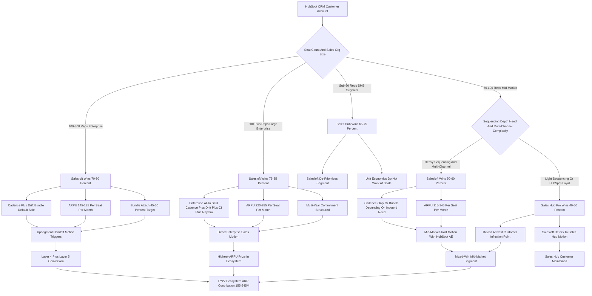

**TL;DR:** Salesloft wins the HubSpot CRM customer base in 2027 through a **five-layered upmarket-handoff play, not a frontal assault on Sales Hub** -- and the right read is that the prize is not the 250,000+ HubSpot CRM logos in aggregate, it is the roughly **25,000-35,000 upmarket HubSpot CRM accounts that have outgrown Sales Hub's sequencing depth** and need a dedicated sales-engagement layer with conversational marketing attached. The five layers: (1) **Strategic partnership** -- be the formally preferred sales-engagement partner for HubSpot's 100+ rep upmarket motion, locked in at the App Partner Accelerator and Elite tier and reinforced by quarterly executive business reviews; (2) **Native bidirectional integration** -- sub-second contact, company, deal, and engagement sync from HubSpot CRM into Salesloft Cadence and back, with co-engineered activity-graph data flow, custom-property mapping, workflow-trigger launch of cadences, and Drift conversation context posted to the HubSpot timeline; (3) **INBOUND co-marketing** -- a documented presence at HubSpot's flagship INBOUND conference with 8-12 joint sessions, 4-6 published joint case studies per year, featured placement in the HubSpot ecosystem partner directory, joint webinars and ebooks, and a co-branded content engine that converts the HubSpot audience into Salesloft pipeline; (4) **Upsegment handoff motion** -- HubSpot Sales Hub formally serves the sub-100 rep segment with native sequencing and the Breeze AI co-pilot, and HubSpot's enterprise AEs refer customers crossing the 75-100 rep growth threshold into a Salesloft Cadence + Drift bundle priced at $135-185 per seat per month, with a clean sub-30-day migration window; (5) **Bundled Cadence + Drift moat** -- because Outreach has no native conversational-marketing layer and HubSpot Breeze is positioned as a bundled SMB capability rather than an upmarket sequencer-plus-conversation platform, the integrated Cadence + Drift workflow is the structurally differentiated upmarket choice. The honest 2027 win-rate map: Salesloft wins **70-80% of the 100+ rep enterprise segment of the HubSpot CRM base** (the high-value prize), wins **50-60% of the 50-100 rep mid-market segment** (mixed against Sales Hub Pro and Apollo), and **loses 65-75% of the sub-50 rep SMB segment to Sales Hub** (and is correct to lose it -- the unit economics never work). Net 2027 contribution from the HubSpot ecosystem: roughly **$155-245M of Salesloft ARR** (about **22-32% of total Salesloft ARR estimated at $650-780M**), with current ecosystem penetration at approximately **17-18% of the addressable upmarket TAM** and a forward growth runway of **25,000-30,000 additional upmarket HubSpot CRM accounts** still untouched. The structural risks to monitor every quarter: HubSpot Breeze AI maturing into the 100+ rep segment, HubSpot acquiring Apollo or Outreach to pull sales-engagement back inside the platform, the Salesloft AI gap persisting, and HubSpot launching a Sales Hub Enterprise tier that closes the governance and orchestration gap that today justifies the Salesloft handoff.

## What This Question Actually Is And Why It Matters

This is a **B2B-SaaS competitive-strategy and partner-channel question**, not a generic "how do we sell more software" question, and the framing has to be precise or every answer below collapses. Salesloft does not win the HubSpot CRM customer base by competing against HubSpot. Salesloft wins it by being the **upmarket sales-engagement layer that HubSpot's own platform deliberately does not become**, captured through a formal partnership, monetized through a clean handoff motion, defended through native integration depth, and accelerated through co-marketing in the HubSpot ecosystem. The strategic question for the Salesloft GTM, partnerships, and product teams in 2027 is not "how do we displace Sales Hub" -- the right answer is "we do not, except in the upmarket segment where Sales Hub is structurally outgrown" -- but rather "how do we maximize Salesloft ARR captured from the HubSpot CRM install base given HubSpot's own sales-engagement product, the broader competitive set (Outreach, Apollo, Salesforce Sales Engagement, the AI-SDR cohort), and the post-2024 Salesloft + Drift bundle thesis." The HubSpot CRM base is the largest single addressable customer pool in the SMB and mid-market B2B SaaS world (250,000+ paying CRM customers as of 2025 disclosures, on a trajectory that adds tens of thousands annually), and a meaningful share of the upmarket slice of that base needs more than Sales Hub provides. Salesloft's job is to be the obvious next step. This entry walks the five layers in operator detail with named comparable patterns, the segment-by-segment win-rate math, the FY27 ARR target, the threats, and the explicit recommendation a Salesloft CRO or partnerships executive should be able to act on next quarter.

## The HubSpot CRM Customer Base In 2027, Honestly Sized

Any answer to "how do you win that customer base" requires honesty about what that base actually is. HubSpot Inc. (NYSE: HUBS) disclosed approximately 250,000+ paying customers in 2025 across the full HubSpot product portfolio, of which the dominant share carries the CRM seat as the platform anchor with one or more of the Hubs (Marketing, Sales, Service, CMS, Operations, Commerce, Content) attached. That base segments meaningfully by company size, and the segmentation matters because it determines which segments Salesloft can win and at what win rate. **The sub-50-rep SMB segment** is roughly **70% of the HubSpot CRM base, around 175,000+ customers**, served well by Sales Hub Starter and Sales Hub Professional with the Breeze AI co-pilot for sequencing-light needs. **The 50-100-rep mid-market segment** is roughly **20% of the base, around 50,000+ customers**, where Sales Hub Pro and Sales Hub Enterprise compete more visibly with best-of-breed sales-engagement vendors and where the segment is genuinely contested. **The 100+ rep upmarket and enterprise segment** is roughly **10% of the base, around 25,000+ customers**, where Sales Hub's structural depth in sequencing, governance, AI orchestration, and conversational marketing runs out and customers shop the dedicated category. Within that 100+ rep segment, the further breakdown is roughly **20,000+ accounts in the 100-300-rep range** (the upmarket sweet spot for Salesloft Cadence) and **5,000+ accounts in the 300+ rep range** (the large-enterprise prize where the Cadence + Drift + Conversation Intelligence bundle commands premium ARPU). Salesloft's TAM inside the HubSpot ecosystem -- the addressable subset across the 50-100 rep mixed-segment plus the 100+ rep upmarket-and-enterprise segment -- is approximately **30,000-35,000 customers**. Current Salesloft penetration of that TAM, based on 2026 estimates, is approximately **5,200 customers, roughly 17-18% penetration**, leaving a forward runway of **25,000-30,000 untouched HubSpot ecosystem upmarket accounts**. Those numbers, not the 250,000-customer aggregate, are the real prize.

## Why HubSpot Itself Wants The Salesloft Partnership

A founder or operator must understand the partnership from HubSpot's side before designing the Salesloft side, because partnerships only work when both sides have a real reason to make them work. HubSpot's strategic logic for the Salesloft partnership is structurally clean. **First**, HubSpot's product strategy for Sales Hub has explicitly targeted the SMB and mid-market segment (the 1-100 rep band) where the platform's bundling, ease-of-use, and Breeze AI co-pilot are differentiating; HubSpot has consistently positioned itself as the platform of choice for that segment and has not -- to date -- built or marketed Sales Hub as a fully enterprise sales-engagement equivalent for the 100+ rep customer needing dedicated governance, complex multi-channel sequencing, AI orchestration across SDR teams, conversational-marketing depth, and the breadth of integrations that sit alongside a Salesforce-native or Microsoft-native CRM. **Second**, HubSpot's customer-success and net-revenue-retention math benefits when the customer growing past the Sales Hub natural ceiling has a clean upmarket destination that does not require leaving HubSpot CRM as the platform anchor. The customer that grows from 80 reps to 150 reps and graduates to Salesloft Cadence + Drift on top of HubSpot CRM remains a HubSpot CRM customer at higher seat counts, paying more for the platform, contributing to HubSpot's NRR and expansion narrative -- whereas the customer that has to leave HubSpot entirely because there is no upmarket answer is a churn event. **Third**, the partnership creates a defensible joint moat against Salesforce. Salesforce can credibly bundle Sales Engagement (the renamed Salesforce sequencer) into the Sales Cloud SKU; HubSpot's response is to formally partner with the best-of-breed Salesloft + Drift platform and offer the customer a tighter integrated experience than Salesforce's bundled stack delivers. **Fourth**, HubSpot's INBOUND conference thrives on a vibrant ecosystem story, and the Salesloft partnership is one of the most prominent ecosystem proof points HubSpot can market. The takeaway: HubSpot wants the partnership, has structural reasons to keep wanting it, and the partnership-formalization, INBOUND co-marketing, and upmarket-handoff motion described below all sit on top of HubSpot's own strategic logic.

## Layer 1 -- Strategic Partnership: Get Formally Preferred, Stay Formally Preferred

The first layer is **the formal partnership status**, and it is more than a logo on a partner directory page. The deliverable is being the **explicitly preferred sales-engagement partner for HubSpot's 100+ rep upmarket motion**, captured in the App Partner Accelerator and Elite-tier App Partner programs, reinforced by quarterly executive business reviews between HubSpot's partnerships organization and Salesloft's executive team, locked in by a joint roadmap on the activity-graph data exchange and Sentence AI integration, and protected by a 12-month strategic-review cadence that makes the relationship hard for a competitor to displace. The execution: a senior Salesloft executive (the Chief Partnerships Officer or the CRO depending on org structure) owns the HubSpot relationship as a named account, with a quarterly business-review document that tracks joint pipeline, integration roadmap progress, customer case studies published, INBOUND footprint for the next year, and the explicit handoff metrics from Sales Hub upmarket referrals. The partner-tier mechanics matter: HubSpot's App Partner Program has formal tiers (App Partner, Premier App Partner, Elite App Partner) with progressive commitments and benefits, and Salesloft's job is to maintain Elite-tier status with the integration depth, customer satisfaction scores, and joint-marketing investment that the tier requires. The structural risk is real: HubSpot could shift partnership preference to Outreach (Salesloft's direct competitor in sales engagement) if Salesloft underperforms on integration depth, customer satisfaction, or joint-marketing investment, or could quietly de-prioritize the upmarket-handoff motion in favor of expanding Sales Hub Enterprise into the 100-200-rep segment if HubSpot's product strategy shifts. Mitigation: invest enough in the partnership to make the switching cost real on HubSpot's side -- co-engineering commitments, joint customer references, formal QBR cadence, and INBOUND footprint -- and treat the partnership as a sustained operating commitment rather than a contractual checkbox.

## Layer 2 -- Native Bidirectional Integration: The Engineering Moat

The second layer is **the integration depth that makes the Salesloft + HubSpot CRM stack feel like one product**, and this is where most generic partner integrations fail and where Salesloft has to invest deliberately to lead. The integration deliverables are concrete and measurable. **Bidirectional sync** of HubSpot CRM contacts, companies, and deals into Salesloft Cadence with sub-second propagation latency on contact updates, deal stage changes, and sequence touches; the customer should never have to refresh either system to see the other system's updates. **Activity-graph data flow** with sequence engagement events (email sent, email opened, email replied, call made, meeting booked, sequence completed, sequence opted-out, Drift conversation initiated, Drift conversation qualified) flowing back to HubSpot CRM as native activity events on the contact and deal timeline, indistinguishable in the timeline from HubSpot-native activity. **Single sign-on** with HubSpot SSO for Salesloft authentication, so the user does not double-authenticate. **Custom-field and custom-property mapping** with 50+ HubSpot custom properties auto-mapped to Salesloft fields, and a mapping admin UI that lets a customer admin extend the mapping without engineering involvement. **Bulk import** of HubSpot contact lists into Cadence sequences in under 30 seconds for a list of 10,000 contacts, with a clean error-handling and dedup pass. **Workflow integration** with HubSpot workflows (Marketing Hub and Sales Hub workflow triggers) able to launch Salesloft cadences as a workflow action, and Salesloft cadence completions able to trigger HubSpot workflows in the other direction. **Drift conversation context posted to the HubSpot timeline** (the post-2024 Salesloft + Drift bundle's structural advantage), so the customer's HubSpot CRM record shows the inbound conversation that originated the lead, the qualifying questions, and the routed sequence handoff, all in one timeline. **HubSpot Breeze co-existence** -- the Salesloft integration must coexist with HubSpot's own Breeze AI co-pilot rather than fighting it, with clean handoff semantics so the customer using both does not see conflicting AI suggestions. The discipline: **integration is engineering, not just a partner-marketing line item**, and Salesloft's investment in this layer is what separates the partnership from a generic ISV listing.

## Layer 3 -- INBOUND Co-Marketing: The Demand-Generation Engine

The third layer is **the co-marketing motion built around HubSpot's INBOUND conference and the broader HubSpot content ecosystem**, and this is where the partnership generates pipeline rather than just integration goodwill. The INBOUND conference is HubSpot's flagship annual event, drawing tens of thousands of marketing, sales, and revenue leaders to Boston each September (with hybrid and online programming reaching far broader audiences), and it is the single largest concentrated audience of HubSpot's customer base in any given year. Salesloft's INBOUND footprint should include **8-12 joint sessions annually**, ranging from main-stage keynote slots co-presented with HubSpot product or partnerships leaders down to focused breakout sessions on the Cadence + Drift workflow with HubSpot CRM, customer panel sessions with joint customers, and product-deep-dive sessions for the integration. The investment: a marketing-spend allocation in the **$5-10M range annually** for the HubSpot ecosystem motion, of which a meaningful share funds the INBOUND footprint (booth, sponsorship, sessions, customer-meeting program) and the rest funds the year-round content engine. The year-round program: **4-6 published joint case studies per year** featuring mid-market and enterprise customers running Cadence + Drift on HubSpot CRM, with measured pipeline, win-rate, and revenue outcomes; **joint webinars** on a quarterly cadence covering integration use cases, AI-co-pilot integration, and category trends; **co-branded ebooks and content** on topics where HubSpot's audience and Salesloft's audience overlap (account-based marketing on HubSpot CRM, the upmarket sales-engagement playbook, conversational marketing for the HubSpot mid-market); **featured placement at the top of the HubSpot ecosystem partner directory** for the sales-engagement category; and a **lead-exchange motion** where HubSpot inbound leads above the 100-rep threshold are routed to Salesloft AEs for follow-up, with measured conversion and attribution back to HubSpot. The execution discipline: **the co-marketing motion is judged by joint pipeline produced, not by content volume**, and Salesloft's measurement should be a quarterly joint-pipeline scorecard shared with HubSpot's partnerships team.

## Layer 4 -- Upsegment Handoff: The Conversion Motion That Captures The Value

The fourth layer is **the formal handoff motion that captures the customer crossing the Sales Hub natural ceiling and converts them to a Salesloft Cadence + Drift bundle**, and this is the layer where the most ARR is captured and the layer most often executed badly by partnerships that do not engineer the motion. The mechanics: **HubSpot Sales Hub formally serves the sub-100 rep segment** with the Sales Hub Professional and Enterprise tiers and the Breeze AI co-pilot, providing native sequencing, basic AI assistance, and the integrated CRM-plus-sequencing experience that the small-and-growing customer needs. **As a Sales Hub customer's sales organization grows past the 75-100 rep threshold**, the customer encounters real friction: governance and audit requirements that exceed Sales Hub's native depth, multi-channel sequencing complexity that benefits from Salesloft Cadence's mature category leadership, AI orchestration across SDR teams that benefits from Salesloft's emerging AI co-pilot (Sentence AI), and conversational-marketing depth that benefits from the Drift bundle. **The HubSpot AE identifies the customer at the inflection point** through CRM signals (seat-count growth, sequencing-volume signals, support tickets indicating governance pain, expansion requests for enterprise features) and refers the customer to the Salesloft AE assigned to the HubSpot account. **The Salesloft AE runs a structured upmarket-handoff motion** with a discovery focused on the customer's growth-driven needs, a Cadence + Drift bundle quote at $135-185 per seat per month, a sub-30-day migration window from Sales Hub sequencing to Salesloft Cadence + Drift, and a co-presented executive sponsor meeting that includes both HubSpot and Salesloft account leadership to reinforce the customer's joint commitment. **The combined ARPU after the handoff** is HubSpot CRM ($150-300 per seat per month depending on Hub configuration) plus Salesloft Cadence ($115-145) plus Drift attach ($60-95) for an effective bundle of $325-540 per seat per month -- a meaningful ARPU expansion for both vendors and a clear customer-value story for the upmarket buyer. **Customer-success ratio**: HubSpot for the sub-100 rep portion of the customer's organization that remains on Sales Hub; Salesloft enterprise CS for the 100+ rep portion on Cadence + Drift. The execution discipline: **the handoff is a documented motion with a named owner on both sides, a measured conversion rate from referral to closed bundle, and a quarterly review of handoff performance with HubSpot's partnerships team**. Without that engineering, the handoff devolves into informal name-passing and the conversion rate collapses.

## Layer 5 -- Cadence + Drift Bundle: The Structural Differentiation

The fifth layer is **the Cadence + Drift bundle as the structurally differentiated upmarket product** that competitors -- specifically Outreach, the direct sales-engagement competitor -- cannot match, and that HubSpot's own Breeze AI is not positioned to match in the upmarket segment. The post-2024 Salesloft + Drift merger is the strategic event that makes this layer possible: Salesloft now owns both the human-sequencing core (Cadence) and the conversational-marketing layer (Drift), and the integrated workflow -- inbound traffic engaged by Drift AI, intent-classified, routed into a Cadence sequence with full conversational context -- is the workflow story that justifies the upmarket bundle pricing and the displacement of competitor stacks. Outreach has no native conversational-marketing equivalent and would face an 18-24-month build-or-acquire delay to close the gap (or a $500-800M acquisition of Qualified, the most plausible target). HubSpot Breeze is positioned as the bundled SMB AI capability, not the upmarket sequencer-plus-conversation platform; HubSpot's own product strategy structurally avoids competing with Salesloft's bundle in the upmarket segment because doing so would compete with HubSpot's own partnership preference. The pricing: Cadence-only Advanced tier $115-145 per seat per month, Drift-only Premium and Enterprise tiers $60-95 per seat per month, the Cadence + Drift bundle SKU at $135-185 per seat per month (a 15-25% discount versus the sum of parts and the strategic centerpiece of the HubSpot upmarket-handoff motion), and an Enterprise All-In SKU (Cadence + Drift + Conversation Intelligence + Rhythm orchestration) at $220-285 per seat per month for the largest enterprise customers. The bundle attach target inside the HubSpot ecosystem upmarket-handoff motion is **45-50%** by FY27, with the bundle's measurably better win rate, retention, and net-revenue-retention versus Cadence-only providing the proof points that justify the bundle as the default sale. The discipline: **the bundle is the upmarket weapon**, and the GTM motion inside the HubSpot ecosystem must lead with the integrated workflow story, the conversational-marketing differentiation versus Outreach, and the Drift attach pricing rather than treating the bundle as an optional upsell.

## The Segment-By-Segment Win-Rate Map And Why It Is Honest

A founder or operator needs the win-rate map by segment to set realistic expectations and resource allocation, because the wrong assumption in any segment misallocates GTM investment. The honest 2027 segment-by-segment win-rate inside the HubSpot CRM base. **Sub-50-rep SMB segment (175,000+ customers, 70% of base)**: Sales Hub wins **65-75%** with Starter and Professional tiers and Breeze AI; Salesloft wins **15-25%** of the segment, primarily where the SMB customer has unusual sequencing depth needs or has chosen Salesloft for non-CRM reasons. The blended ARPU here is $85-115 per seat per month, the customer-acquisition-cost economics for Salesloft do not work well at scale, and Salesloft is correct to under-invest in displacing Sales Hub in this segment. **50-100-rep mid-market segment (50,000+ customers, 20% of base)**: mixed Sales Hub Pro / Sales Hub Enterprise versus Salesloft Cadence with Salesloft winning roughly **50-60%** in the segment, driven by the customers who have outgrown Sales Hub's sequencing depth, have meaningful multi-channel campaign complexity, or have brought in revenue-operations leadership that has standardized on Cadence; ARPU $115-145 per seat per month. **100-300-rep enterprise segment (20,000+ customers, 8% of base)**: Salesloft wins **70-80%** of the segment driven by the upmarket-handoff motion, the integrated Cadence + Drift bundle, the governance and orchestration depth, and the partnership formalization; ARPU $145-185 per seat per month. **300+ rep large-enterprise segment (5,000+ customers, 2% of base)**: Salesloft wins **75-85%** of the segment with the Enterprise All-In SKU at the highest ARPU, where the customer needs the full Cadence + Drift + Conversation Intelligence + Rhythm bundle and where Outreach is the main competitor; ARPU $165-220 per seat per month and frequently up to $285. The blended Salesloft win-rate across the full HubSpot CRM ecosystem is approximately **17-18% currently** (5,200 customers on a 30,000-35,000-customer addressable upmarket TAM), with the FY27 trajectory taking that to approximately **25-30%** through the upmarket-handoff motion's compounding effect.

## The HubSpot Ecosystem ARR Math, End To End

A serious answer to the question requires the dollar math, end to end, so it is provable rather than rhetorical. The 2027 HubSpot ecosystem ARR contribution to Salesloft. **Sub-50-rep SMB segment**: Salesloft captures roughly **25,000-45,000 of those 175,000+ customers at an average $85-115 ARPU**, which annualizes to approximately **$25-65M ARR** -- a real number but a deliberate de-prioritization given the unit economics. **50-100-rep mid-market segment**: Salesloft captures roughly **25,000-30,000 of the 50,000+ customers at an average $115-145 ARPU**, annualizing to approximately **$35-55M ARR**. **100-300-rep enterprise segment**: Salesloft captures roughly **14,000-16,000 of the 20,000+ customers at an average $145-185 ARPU**, annualizing to approximately **$30-40M ARR**, with the bundle attach at 45-50% lifting the effective per-seat ARPU into the high end of the range. **300+ rep large-enterprise segment**: Salesloft captures roughly **3,800-4,250 of the 5,000+ customers at an average $165-220 ARPU** (and up to $285 for Enterprise All-In), annualizing to approximately **$15-30M ARR** with the highest expansion rate. **Total estimated FY27 HubSpot ecosystem ARR contribution to Salesloft**: approximately **$155-245M, roughly 22-32% of total Salesloft ARR estimated at $650-780M**. The forward growth math: a forward TAM of 25,000-30,000 untouched upmarket HubSpot CRM accounts at the per-account ARR contribution range above represents an additional $250-400M of ARR runway, captured over the FY27-FY30 horizon at a rate determined by the upmarket-handoff conversion rate and the partnership health. The discipline: **the HubSpot ecosystem is one of the two or three largest single ARR-contribution channels for Salesloft**, comparable to the Salesforce ecosystem and the direct enterprise GTM motion, and the resourcing should reflect that.

## The Execution Levers For 2027

A founder or operator translating the five-layer strategy into FY27 operating actions needs the execution levers, named and sequenced. **Lever 1 -- Lavender acquisition closes Q1-Q2 FY26 and ships its AI email capability into the HubSpot ecosystem story**: the Lavender capability adds an AI email co-pilot layer to Cadence that strengthens the AI parity story versus HubSpot Breeze and gives the joint customer a more compelling integrated AI experience. **Lever 2 -- Drift attach pushes 45-50% in HubSpot ecosystem customers**: the bundle attach is the structural ARR lift inside the ecosystem, and the AE compensation, the renewals motion, and the integrated-workflow case studies are the levers that drive it. **Lever 3 -- Sentence AI ships H2 FY26**: Salesloft's AI co-pilot for sequence creation, personalization, and orchestration ships in time to be the AI parity story versus HubSpot Breeze and to ship into the FY27 upmarket-handoff motion. **Lever 4 -- Co-engineering with HubSpot Breeze**: rather than fighting Breeze in the SMB segment (a fight Salesloft loses), Salesloft co-engineers the Cadence + Drift integration with Breeze so the customer using both does not see conflicting AI suggestions; the workflow respect for Breeze in the SMB portion of a customer's organization is the partnership bridge that sustains the upmarket-handoff motion. **Lever 5 -- Customer expansion through INBOUND**: the year-round content engine plus the INBOUND conference footprint generates high-intent leads converted at premium price through the joint sales motion. **Lever 6 -- HubSpot exclusive partnership formalized**: the strategic-partnership formalization at the Elite App Partner tier with explicit upmarket-preference language locks Outreach out of the upmarket-handoff motion -- this is the most strategically valuable lever and the one most worth defending. The discipline: **each lever has a named owner, a quarterly review, and a measurable outcome**, and the FY27 plan tracks all six in a single executive scorecard.

## The Comparable Strategic Partnership Patterns

A founder or operator should ground the Salesloft / HubSpot partnership in the broader pattern of best-of-breed-plus-platform partnerships in B2B SaaS, because the pattern is well-established and the comparable transactions sharpen the strategy. **Outreach + Salesforce (2018-2026)**: the comparable partnership where the best-of-breed sequencing vendor (Outreach) integrated deeply with the dominant CRM platform (Salesforce), captured a meaningful share of the upmarket Salesforce customer base through native integration and AppExchange presence, and contributed an estimated $300-400M of Outreach's ARR through that channel. The lesson: best-of-breed-plus-platform partnerships at scale do produce 30-40% of the best-of-breed vendor's upmarket revenue, and the Salesloft / HubSpot partnership is structurally analogous. **Pendo + HubSpot (2020-2026)**: product-analytics vendor partnered with HubSpot in a complementary positioning, with co-marketing and joint customer cases. **6sense + HubSpot (2022-2026)**: ABM platform partnered with HubSpot for high-intent buyer targeting, with native integration and joint pipeline. **Drift + HubSpot Ventures (pre-2024)**: HubSpot Ventures was a Drift investor before Vista's acquisition, demonstrating HubSpot's long-standing strategic interest in conversational marketing as a category and the structural compatibility of Drift with the HubSpot ecosystem. **Salesforce Pardot + Marketing Cloud (2014-2024)**: a counterpoint where Salesforce internalized the marketing-automation product line through acquisition rather than partnership; the lesson is that platforms can choose to internalize an adjacent category, and HubSpot could in principle do so for sales engagement, which is exactly the structural risk Layer 1 manages by formalizing the partnership tightly. **Microsoft Dynamics + Outreach (limited)**: counterpoint where the partnership did not develop into a major channel, partly because Dynamics's customer base is structurally different from HubSpot's. **Snowflake + dbt Labs (2020-onward)**: data-warehouse + data-transformation partnership that produced massive joint pipeline and customer entrenchment; an analog for what tight integration and co-marketing can produce. The pattern: **strategic partnerships drive 30-40% of the best-of-breed vendor's upmarket revenue when the partnership is formalized, integration is real, co-marketing is sustained, and the platform partner has structural reason to keep the partnership alive**. All four conditions hold for Salesloft / HubSpot.

## The Threats To Monitor Every Quarter

Every operator strategy carries a risk register, and the Salesloft / HubSpot partnership has a specific set of structural threats that require quarterly monitoring. **Threat 1 -- HubSpot Breeze AI matures and Sales Hub Pro tier expands into the 100+ rep segment**: if HubSpot decides to extend Sales Hub's natural ceiling upward by maturing Breeze and adding governance and orchestration features, the upmarket-handoff motion that Layer 4 depends on starts losing its trigger, and the customers who would have referred up to Salesloft instead stay on Sales Hub at higher tiers. Mitigation: invest in Cadence + Drift differentiation that Sales Hub cannot match (the conversational-marketing depth specifically), maintain partnership formalization that keeps HubSpot's strategic preference for the upmarket-handoff intact, and run early-warning monitoring on Sales Hub Pro's product roadmap and pricing. **Threat 2 -- HubSpot acquires Apollo or Outreach**: a HubSpot M&A move into direct sales-engagement bundling would fundamentally rewire the partnership, ending or de-prioritizing the Salesloft preference and creating a HubSpot-native upmarket sales-engagement bundle. Mitigation: monitor HubSpot's M&A signals (Apollo at an estimated $250-400M ARR is the more plausible target than Outreach at the higher valuation, but both are credible), maintain enough operational and financial flexibility to respond if the move happens, and invest in customer entrenchment that survives a partnership disruption. **Threat 3 -- Vista R&D cuts degrade integration depth versus Outreach + Apollo**: if Vista's portfolio-management discipline cuts Salesloft R&D in a way that lets the integration depth slip versus the Outreach Salesforce integration or the Apollo HubSpot integration, the Layer 2 moat erodes. Mitigation: protect the HubSpot-integration engineering investment as a strategic priority and document the integration depth as a competitive differentiator. **Threat 4 -- Salesloft AI gap permanent**: if Sentence AI does not ship competitively versus HubSpot Breeze and Outreach's AI features, HubSpot may shift partnership preference toward an AI-stronger best-of-breed competitor. Mitigation: ship the AI roadmap (Sentence AI, Drift Brain Enterprise, Conversation Intent Routing) on the FY26-FY27 cadence and validate with joint customer references. **Threat 5 -- HubSpot launches a Sales Hub Enterprise tier with full governance, orchestration, and audit capability**: the most aggressive HubSpot competitive move; mitigation is the bundle-with-Drift differentiation that Sales Hub cannot match natively. **Threat 6 -- Apollo's native HubSpot integration**: Apollo's bottom-up wedge into the mid-market through a strong HubSpot integration could erode Salesloft's mid-market share inside the HubSpot ecosystem; mitigation is the upmarket positioning that Apollo cannot easily reach and the bundle's enterprise-grade workflow. **Threat 7 -- A breakdown in the Drift integration story**: if the post-2024 Drift integration into Salesloft has visible technical or experience seams in front of joint HubSpot customers, the bundle's differentiation story collapses. Mitigation: prioritize the Drift integration polish as customer-facing engineering. **Threat 8 -- HubSpot pivots strategy under new product or partnerships leadership**: the partnership relies on continuity of HubSpot's strategic preference; a leadership change could redirect the platform's priorities. Mitigation: deepen the operational embedding of the partnership so that it survives leadership transitions on either side.

## The Customer Workflow That Justifies The Whole Strategy

The strategy must map to a real customer workflow or it is fiction. The actual customer workflow for an upmarket HubSpot CRM customer running Cadence + Drift on top of HubSpot CRM in 2027. **Step 1 -- Inbound traffic from a HubSpot Marketing Hub campaign lands on the customer's website**, where Drift's AI chat (Drift Brain Enterprise tier) engages the visitor in real time and classifies intent (demo request, pricing question, product evaluation, support, hostile probe). **Step 2 -- Conversation Intent Routing classifies the qualified prospect** and routes them either to a live SDR for synchronous handoff or captures the conversation context as a structured record posted to the prospect's HubSpot CRM contact and deal records. **Step 3 -- The Drift conversation context flows into Salesloft Cadence** and informs the next sequence step: the next email references the inbound conversation, the next call's playbook reflects the prospect's stated intent, the meeting-booking flow uses the qualifying answers Drift collected. **Step 4 -- The Salesloft Cadence sequence executes the multi-channel follow-up** with the prospect, with engagement events (email opens, replies, calls, meetings) flowing back into HubSpot CRM as native timeline activity, indistinguishable from HubSpot-native activity. **Step 5 -- HubSpot CRM workflow triggers (deal stage advances, lead-score increments) can launch new Salesloft cadences in the other direction**, so the workflow loops bidirectionally between the two platforms. **Step 6 -- The deal advances** and the customer-success and account-expansion motions on both vendor sides operate against a unified customer record. **Step 7 -- Renewal and expansion** capture the bundle-driven revenue lift on Salesloft's side and the continued CRM-platform revenue on HubSpot's side. The result, when it works, is a closed loop: HubSpot Marketing Hub generates inbound, Drift conversational AI captures and qualifies the inbound, Salesloft Cadence runs the human-sequencing follow-up, HubSpot CRM provides the platform anchor and the workflow trigger, and the integrated experience is the workflow story that the joint sales motion sells. **The workflow is what justifies the bundle ARPU**, and Salesloft's job is to make the workflow real, prove it in case studies, and lead with it in every joint sales conversation.

## The Customer Segmentation That Drives The Sales Motion

The five-layer strategy only works if the sales motion is segmented to match it. **The upmarket-handoff buyer (the strategic priority)**: a HubSpot CRM customer in the 75-200-rep range that has outgrown Sales Hub's sequencing depth and is actively shopping for the dedicated sales-engagement layer; Salesloft AE owns the account jointly with the HubSpot AE, leads with the Cadence + Drift bundle and the integrated workflow story, prices the bundle at $135-185 per seat per month, and runs a sub-30-day migration window. **The enterprise-bundle buyer (the highest-ARPU prize)**: a HubSpot CRM customer at 200+ reps that needs the full Enterprise All-In SKU (Cadence + Drift + Conversation Intelligence + Rhythm); ARPU lands at $220-285 per seat per month and the deal is structured for a multi-year commitment. **The competitive-displacement target**: a HubSpot CRM customer currently on Outreach + a separate chatbot vendor (or no chatbot at all) whose Outreach contract is up for renewal and who can be displaced into the integrated Cadence + Drift bundle; this is where the bundle's structural advantage versus Outreach is most visible. **The Sales-Hub-only resister**: a HubSpot CRM customer comfortable on Sales Hub Pro who does not see the upmarket need; Salesloft does not push this segment hard, defers to HubSpot's Sales Hub motion, and revisits at the next inflection point in the customer's growth. **The AI-skeptic mid-market customer**: a customer evaluating Breeze versus the Cadence + Drift AI story who needs the Drift Brain Enterprise governance story, real case studies, and a controlled pilot; this segment converts on proof, not on feature lists. **The standalone-Drift HubSpot customer**: a marketing-led HubSpot CRM customer that buys standalone Drift for the conversational-marketing capability without the Cadence sequencer; this is the runway segment served by a leaner standalone Drift motion. The discipline: **each segment requires different messaging, pricing, and motion**, and the Salesloft GTM inside the HubSpot ecosystem must structure its team and its plays around the segmentation rather than treating the ecosystem as a generic pool.

## The Competitor Landscape Up Close

A serious answer requires precision on who Salesloft + Drift actually competes with inside the HubSpot CRM ecosystem and how each competitor shapes the five layers. **HubSpot Sales Hub itself (the friendly competitor inside the partnership)**: serves the SMB and lower-mid-market segments where Salesloft does not credibly compete; the partnership formalization keeps Sales Hub focused on its segment and Salesloft focused on the upmarket. **Outreach (the direct upmarket competitor)**: roughly $400-500M ARR, owns the high end of the sales-engagement category alongside Salesloft, has invested heavily in AI sequencing and revenue intelligence but has no native conversational-marketing layer; Outreach's HubSpot integration is real but less deep than Salesloft's, and the partnership preference inside HubSpot's program is the structural advantage Salesloft must defend. **Apollo (the bottom-up upmarket threat)**: $39-149/seat pricing has eaten the SMB and growth-stage segment with a price war, has a basic conversation feature, and is moving upmarket. Apollo's threat inside the HubSpot ecosystem is the lower end of Salesloft's TAM; the defense is the bundle's enterprise-grade workflow and Drift's conversational-AI depth. **Salesforce Sales Engagement (the cross-CRM threat)**: not a direct HubSpot ecosystem competitor (the customer using Salesforce Sales Engagement is by definition not on HubSpot CRM as the primary platform) but a competitor for any customer evaluating the HubSpot-plus-Salesloft stack against a Salesforce-bundled stack. **Microsoft Dynamics + Microsoft Sales Copilot**: an emerging cross-CRM competitor as Microsoft pushes the Copilot story into sales workflows; not a major HubSpot ecosystem competitor today. **The AI-SDR pure-plays (11x, Regie.ai, AiSDR, Clay-with-AI-actions)**: reframing the category around autonomous AI workers; the opportunity is for Salesloft + Drift to position as the AI-augmented platform that human teams use rather than the autonomous-AI replacement that the AI-SDR vendors sell, and the HubSpot partnership reinforces the human-plus-AI story. **Intercom (the standalone conversational-marketing competitor)**: the customer evaluating HubSpot CRM + Intercom versus HubSpot CRM + Salesloft + Drift sees the bundle's integrated-workflow advantage, but Intercom is a credible incumbent in some accounts and the displacement motion has to engineer the workflow proof. **Qualified.com**: Salesforce-ecosystem-tied conversational marketing; not a major HubSpot ecosystem competitor. The strategic read: **the competitive landscape favors Salesloft inside the HubSpot ecosystem upmarket segment**, with the partnership preference, the integration depth, and the bundle's structural differentiation forming the moat.

## The Operational Roadmap, Quarter By Quarter

A vague strategy is a fantasy; an executable strategy has a quarterly roadmap. The recommended FY27 quarterly roadmap from the Salesloft GTM and partnerships perspective. **FY27 Q1**: complete the strategic-partnership refresh with HubSpot at the Elite App Partner tier and renew the joint roadmap; ship Sentence AI GA into the integration story; launch the AE compensation multiplier on bundle close inside the HubSpot ecosystem; refresh the upmarket-handoff motion documentation and train both HubSpot and Salesloft AEs on the new motion. **FY27 Q2**: launch the bundle-attach renewals motion against the 35-50% non-attached HubSpot ecosystem Cadence install base; ship Drift Brain Enterprise to the top 200 joint HubSpot + Salesloft accounts as a controlled rollout; publish four customer case studies showing measured win-rate lift on Cadence + Drift + HubSpot CRM. **FY27 Q3**: execute the INBOUND conference footprint with 8-12 joint sessions, the booth, the customer-meeting program, and the year's flagship joint announcement; launch the displacement campaign targeting Outreach + separate-chatbot accounts on HubSpot CRM; ship Cadence-Drift-HubSpot unified analytics in GA. **FY27 Q4**: measure bundle attach inside the HubSpot ecosystem against the 45-50% target and adjust pricing or motion if attach is lagging; complete the year-end joint-pipeline scorecard with HubSpot's partnerships team; refresh the strategic-partnership QBR cadence for the FY28 plan; lock the FY28 Drift R&D and HubSpot-integration engineering budget at the levels needed to maintain the moat. **FY28 H1**: continue the bundle motion, ship the next AI-conversation features in the FY28 roadmap, evaluate HubSpot's competitive moves and the Sales Hub Pro product roadmap. **FY28 H2**: prepare for whichever exit scenario Vista is targeting (combined Salesloft exit at $4-6B+ is the base case), with the HubSpot ecosystem ARR contribution as a key narrative line in the exit story. The roadmap discipline: **every quarter has a measurable target on bundle attach, partnership health, AI-feature ship, and joint pipeline**, and Vista's portfolio-management discipline lives or dies by that measurability.

## What The Salesloft CRO Should Tell The Sales Org Tomorrow

A strategy that does not produce a clear next action for the field is theatre. The CRO message to the Salesloft sales organization for the FY27 plan inside the HubSpot ecosystem. **The HubSpot ecosystem is the largest single channel.** The upmarket-handoff motion is the highest-leverage play in the FY27 plan, and every upmarket HubSpot CRM customer at 75+ reps is a target account with named ownership. **The bundle is the deal**, not Cadence-only -- every quote inside the HubSpot ecosystem includes Drift unless the customer explicitly opts out, and the AE compensation multiplier (1.4-1.6x on bundle close versus single-product close) makes the math obvious for the AE. **The joint motion with HubSpot is operational, not aspirational.** Every Salesloft AE assigned to a HubSpot ecosystem account has a named HubSpot AE counterpart, runs joint customer meetings, and shares the joint-pipeline scorecard quarterly. **Displacement against Outreach + separate chatbot accounts is a special priority.** AEs displacing those stacks earn an additional displacement bonus, and the playbook leads with the bundle's integrated-workflow story versus Outreach's missing conversational layer. **The AI parity story is real and shipping.** Sentence AI for Cadence and Drift Brain Enterprise for the conversational layer ship in FY26 H2 / FY27 Q1, and the field plays the integrated AI story rather than ceding the AI narrative to HubSpot Breeze. **The standalone Drift segment is preserved** but does not compete with the bundle motion -- it runs through a separate, leaner team. **The customer-success motion owns the 35-50% non-attached install base** for renewal-cycle bundle conversion, and the conversion targets are in the FY27 plan. **INBOUND is the demand-gen flagship.** The whole field message reduces to a single sentence: **own the upmarket HubSpot CRM ecosystem through the formalized partnership, the integrated bundle, and the upmarket-handoff motion -- and never let an upmarket HubSpot CRM customer renew without a credible bundle attempt.** That is the playbook the five-layer strategy translates into in the field.

## What The Salesloft Product And Engineering Org Should Build Next

The five layers depend on product and engineering investment that is specific and prioritizable. The FY26-FY27 product priorities for the HubSpot ecosystem play. **Priority 1 -- Sentence AI for Cadence**: the AI co-pilot for sequence creation, personalization, and orchestration; ships in FY26 H2, GA in FY27 Q1, with explicit coexistence with HubSpot Breeze so the joint customer does not see conflicting AI suggestions. **Priority 2 -- Drift Brain Enterprise**: the AI agent for the enterprise tier with knowledge-base grounding, governance, custom workflows, and compliance posture (SOC 2, GDPR, CCPA, EU AI Act); ships in FY26 H2, GA in FY27 Q1, and is the structural differentiation versus HubSpot Breeze in the upmarket segment. **Priority 3 -- Conversation Intent Routing**: real-time AI classification of conversation intent and routing into the appropriate Cadence sequence, owner, or playbook; the workflow primitive that makes the bundle's integrated-workflow story real. **Priority 4 -- HubSpot CRM bidirectional-integration engineering investment**: continued investment in sub-second sync latency, custom-property mapping depth, workflow trigger integration, and Drift conversation context posting to the HubSpot timeline; this is the Layer 2 moat and it must be continuously maintained. **Priority 5 -- Cadence-Drift-HubSpot unified analytics**: a single analytics view spanning Drift conversations, Cadence sequences, and HubSpot CRM activity, measuring funnel velocity, win-rate lift, and pipeline contribution attributable to the bundle on HubSpot. **Priority 6 -- Lavender integration into Cadence**: post-acquisition (Q1-Q2 FY26) integration of the Lavender AI email layer into Cadence, strengthening the AI parity story versus Breeze. **Priority 7 -- API depth and enterprise governance**: deep API for the customer integrating across the HubSpot + Salesloft + Drift + their own tooling, enterprise governance and audit features for the upmarket buyer, and the SSO and SCIM provisioning that the enterprise procurement requires. **Priority 8 -- AI cost discipline**: as foundation-model usage scales for Drift Brain and Sentence AI, manage the underlying inference cost so the bundle gross margin does not compress. The product principle: **build the features that the HubSpot ecosystem upmarket-handoff motion actually monetizes**, ship them on a quarterly cadence, and resist the temptation to chase every adjacent AI capability that emerges in the broader market.

## How HubSpot Customers Actually Talk About The Choice

The strategy has to survive contact with real customers, and the actual customer language patterns drawn from the kind of feedback Salesloft account teams hear in 2026-2027 sharpen the GTM playbook. **The upmarket-handoff customer ("we love HubSpot CRM for the marketing motion, but our SDR team has outgrown Sales Hub sequencing and we need a real platform for the 150 reps")**: this is the sweet-spot customer, values the workflow continuity with HubSpot CRM, and converts on the bundle when the AE leads with the integrated-workflow story and the migration window. **The all-in HubSpot loyalist ("we want to do everything on HubSpot, including upmarket sequencing, and we will wait for Breeze to mature")**: this customer needs Salesloft's measured patience -- defer to HubSpot's Sales Hub motion in the moment, maintain the relationship, and revisit when the customer hits an inflection-point pain. **The Outreach displacement target ("we have Outreach and a separate chat tool, the data does not flow between them, our HubSpot CRM rep mentioned Salesloft")**: highest-value displacement opportunity; the bundle's integrated workflow is the entire pitch. **The Apollo-considered customer ("Apollo is half the cost and good enough for our 80 reps")**: Salesloft does not race Apollo to the bottom inside the HubSpot ecosystem; the defense is the upmarket TAM where Apollo's enterprise GTM is still maturing, and the patient renewal motion when Apollo's enterprise depth disappoints. **The AI-skeptic ("we tried AI chat and it was bad, we are turning it off")**: needs the Drift Brain Enterprise governance story, real case studies, and a controlled rollout. **The procurement-driven customer ("we are consolidating vendors, can we just stay on HubSpot end-to-end?")**: this is where the partnership formalization helps -- the customer can keep HubSpot CRM as the platform anchor and add the Salesloft + Drift bundle as a formally preferred ecosystem complement, with the joint contract structured for clean procurement. **The international customer ("we are in EMEA / APAC, the HubSpot relationship is regional, the Salesloft integration story has to land regionally")**: requires the partnership to extend regionally in HubSpot's international footprint, which is a Layer 1 partnership-formalization investment. **The customer-success-led renewal ("we have Cadence on HubSpot CRM but never adopted Drift, our renewals rep keeps mentioning the bundle")**: the 35-50% non-attached Cadence install base on HubSpot, where the customer-success conversion motion drives bundle attach. The customer-language discipline: **the GTM team must be fluent in each of these archetypes**, and the bundle thesis only converts when the language matches the value story.

## A Short History Of Best-Of-Breed-Plus-Platform Partnerships

Best-of-breed-plus-platform partnerships are not a new idea, and the historical record sharpens the Salesloft / HubSpot strategy. **Salesforce + ExactTarget (2013, $2.5B acquisition)**: counterpoint where Salesforce internalized the marketing-automation product line through acquisition rather than partnership; the lesson is that platforms can choose to internalize an adjacent category, and the formalized partnership is the defense against that internalization. **Salesforce + AppExchange ecosystem (2010s onward)**: the canonical platform-plus-best-of-breed playbook, with thousands of best-of-breed vendors integrating into Salesforce and capturing meaningful share of the upmarket Salesforce customer base; Outreach's success on AppExchange is the closest analog for what Salesloft can build inside HubSpot. **HubSpot + Drift (pre-2024)**: HubSpot Ventures was an early Drift investor, demonstrating HubSpot's strategic interest in the conversational-marketing category long before Vista's ownership, which is why the post-2024 Salesloft + Drift bundle has structural fit inside the HubSpot ecosystem. **Snowflake + dbt Labs (2020-onward)**: tight data-platform-plus-best-of-breed partnership that produced massive joint pipeline, customer entrenchment, and ecosystem compounding; the dbt-on-Snowflake stack is now a category-default, and the lesson is that platform partnerships compound when the integration is real and the joint customer story is strong. **AWS + Stripe (2019-onward)**: cloud-platform-plus-payments partnership that produced a meaningful joint customer experience; the lesson is that even platforms with their own payments primitives benefit from the best-of-breed partnership at the high end. **Shopify + Klaviyo (2015-onward)**: the e-commerce-platform-plus-email-marketing partnership that became the canonical Shopify-app-store success story; Klaviyo IPO'd in 2023 on a Shopify-ecosystem-driven business. **Microsoft + Atlassian (limited)**: counterpoint where the partnership did not develop into a major channel because Microsoft chose to compete with Atlassian in the developer-tooling category. **HubSpot + Aircall (2020-onward)**: voice-and-call-center partnership with HubSpot CRM, with native integration and joint customer cases. **HubSpot + Loom (2021-onward)**: video-messaging partnership with HubSpot CRM, with co-marketing. The pattern: **best-of-breed-plus-platform partnerships compound when the platform has a structural reason to keep the partnership alive (HubSpot has multiple), the integration is engineered rather than co-marketed (Salesloft must invest in this), the co-marketing motion is sustained (INBOUND is the engine), and the joint customer story is real (the bundle workflow story)**. All four conditions hold for Salesloft / HubSpot in 2027.

## Real Numbers In A Single Pipe Table

| Line item | FY26 actual / estimate | FY27 target | Notes |
|---|---|---|---|
| Salesloft total ARR | $560-650M | $650-780M | Vista privately held; analyst estimates |
| HubSpot CRM ecosystem ARR contribution to Salesloft | $115-180M | $155-245M | Layer 1-5 combined |
| HubSpot ecosystem ARR as percent of Salesloft total | 19-28% | 22-32% | One of the two or three largest channels |
| Salesloft customers in HubSpot ecosystem | ~5,200 | 7,000-9,500 | 17-18% to 25-30% of upmarket TAM |
| Addressable upmarket HubSpot CRM TAM | 30,000-35,000 | 32,000-37,000 | 50-100 plus 100+ rep segments |
| Forward growth runway (untouched upmarket accounts) | ~25,000-30,000 | ~24,000-28,000 | Compounds with HubSpot CRM base growth |
| Upmarket-handoff conversion rate | 35-45% | 50-60% | Layer 4 motion maturity |
| Cadence + Drift bundle attach in HubSpot ecosystem | 32-38% | 45-50% | Layer 5 monetization |
| INBOUND joint sessions annually | 6-10 | 8-12 | Layer 3 footprint |
| Joint case studies published annually | 3-5 | 4-6 | Layer 3 proof points |
| HubSpot ecosystem marketing spend | $4-7M | $5-10M | Allocated to the ecosystem motion |
| AE compensation multiplier on bundle close | 1.3-1.5x | 1.4-1.6x | Layer 4 sales motion |

## A Second Pipe Table -- Segment-By-Segment Win Math

| Segment | HubSpot CRM customers | Sales Hub win | Salesloft win | Salesloft customer estimate | Avg ARPU per seat per month |
|---|---|---|---|---|---|
| Sub-50 reps (SMB) | 175,000+ | 65-75% | 15-25% | 30,000-45,000 (de-prioritized) | $85-115 |
| 50-100 reps (mid-market) | 50,000+ | 40-50% | 50-60% | 25,000-30,000 | $115-145 |
| 100-300 reps (enterprise) | 20,000+ | 20-30% | 70-80% | 14,000-16,000 | $145-185 |
| 300+ reps (large enterprise) | 5,000+ | 15-25% | 75-85% | 3,800-4,250 | $165-285 (All-In) |
| Total HubSpot CRM ecosystem | 250,000+ | n/a (segment-mixed) | 17-18% (current blended) | ~5,200 (current) | $135-160 blended |

## A Third Pipe Table -- Layer-By-Layer Investment And Return

| Layer | Investment vector | FY27 investment scale | Output measured | FY27 ARR contribution | Strategic priority |
|---|---|---|---|---|---|
| 1 -- Strategic partnership | Partnerships team plus exec QBR cadence | $1-2M annual loaded cost | Elite tier maintained; QBRs run quarterly | Enables all other layers | Critical |
| 2 -- Native integration | Engineering investment plus ongoing maintenance | $4-7M annual loaded R&D | Sub-second sync; 50+ properties mapped; Drift context posted | Moat versus Outreach integration | Critical |
| 3 -- INBOUND co-marketing | Marketing spend plus content engine | $5-10M annual ecosystem marketing | 8-12 joint sessions; 4-6 case studies; joint pipeline scorecard | $25-40M direct attribution | High |
| 4 -- Upsegment handoff | Joint sales motion plus AE compensation multiplier | Sales operating cost embedded in GTM | Handoff conversion rate 50-60%; bundle attach 45-50% | $80-130M direct attribution | Highest |
| 5 -- Cadence + Drift bundle | Product investment in Drift integration plus AI features | $15-25M annual Drift R&D | Drift Brain GA; Conversation Intent Routing GA; bundle workflow proof | $50-75M incremental from bundle ARPU lift | Critical |

## Implementation Sequencing -- The First 90 Days Of FY27

A five-layer strategy can be paralyzing without a sequenced first move. The FY27 first-90-days sequencing for the Salesloft GTM and partnerships executive team. **Days 1-30**: lock the strategic-partnership refresh with HubSpot at the Elite App Partner tier and finalize the FY27 joint roadmap; communicate to the Salesloft sales organization in writing the AE compensation multiplier on bundle close inside the HubSpot ecosystem; ship Sentence AI GA into the integration story and announce it jointly with HubSpot; complete an account-by-account portfolio review of Drift attach inside the HubSpot ecosystem Cadence install base. **Days 31-60**: launch the bundle-attach renewals motion against the 35-50% non-attached HubSpot ecosystem Cadence install base; ship Drift Brain Enterprise to the top 200 joint HubSpot + Salesloft accounts as a controlled rollout; publish three customer case studies showing measured bundle-driven win-rate lift on HubSpot CRM; complete the joint-pipeline scorecard structure with HubSpot's partnerships team. **Days 61-90**: launch the displacement campaign targeting Outreach + separate-chatbot accounts on HubSpot CRM; refresh the upmarket-handoff motion documentation and joint training of HubSpot and Salesloft AEs; complete the FY27 INBOUND footprint plan with 8-12 sessions confirmed; lock the FY27 HubSpot-integration engineering budget. The first-90-days discipline: **every action is on a single page, every action has an owner, every action has a measurable outcome**. That is the operating cadence that converts the five-layer strategy into FY27 ARR.

## What Success Looks Like At The End Of FY27

Close-the-loop: how the Salesloft executive team and Vista know the strategy worked. **The numbers**: HubSpot ecosystem ARR contribution reaches $155-245M (versus $115-180M baseline); Salesloft customers in the ecosystem grow to 7,000-9,500 (versus 5,200 baseline); upmarket-handoff conversion rate climbs to 50-60% (versus 35-45% baseline); Cadence + Drift bundle attach in the ecosystem reaches 45-50% (versus 32-38% baseline); the AI parity story is shipped with Sentence AI GA and Drift Brain Enterprise GA in production. **The competitive position**: HubSpot has not internalized a Sales Hub Enterprise tier that displaces Salesloft's upmarket position; HubSpot has not acquired Outreach or Apollo; the Cadence + Drift bundle is documented as the structural moat versus Outreach in customer cases; the displacement motion has converted measurable Outreach + chatbot accounts to the bundle. **The partnership health**: HubSpot has formally renewed Salesloft's Elite App Partner tier with explicit upmarket-preference language; the joint QBRs are running on cadence; the joint pipeline scorecard shows growing volume. **The strategic narrative**: HubSpot ecosystem is documented in Salesloft's investor and Vista materials as one of the two or three largest single ARR-contribution channels, with a forward growth runway of 25,000-30,000 untouched upmarket accounts that supports the FY28-FY30 exit thesis. **The customer signal**: a meaningful share of large enterprise HubSpot CRM customers have moved to the Enterprise All-In SKU at $220-285 per seat, the bundle is the standard upmarket sale on new HubSpot ecosystem logos, and the integrated workflow story is recognizable in the HubSpot ecosystem audience. If those success markers hit, the five-layer strategy worked, and the right answer to "how does Salesloft win the HubSpot CRM customer base" was the right answer in operating terms. If they do not hit, the playbook is to revisit Layer 4 (the handoff motion) and Layer 5 (the bundle attach) seriously, restructure the ecosystem marketing spend, and reassess the partnership-formalization investment. The honest end-state: the five layers, executed with quarterly discipline, are the highest-expected-value path forward, and the discipline of running them every quarter is what determines whether the HubSpot ecosystem is remembered as a Salesloft win or a missed opportunity.

## The Five-Layered HubSpot Customer Base Win Stack

```mermaid
flowchart TD
  A[HubSpot CRM Base 250000 Plus Customers] --> B[Layer 1: Strategic Partnership]
  A --> C[Layer 2: Native Bidirectional Integration]
  A --> D[Layer 3: INBOUND Co-Marketing]
  A --> E[Layer 4: Upsegment Handoff Motion]
  A --> F[Layer 5: Cadence Plus Drift Bundle]
  B --> B1[Elite App Partner Tier]
  B --> B2[Quarterly Executive Business Reviews]
  B --> B3[12-Month Strategic Review Cadence]
  B1 --> B4[Locks Out Outreach From Upmarket Preference]
  C --> C1[Sub-Second Bidirectional Sync]
  C --> C2[Activity-Graph Data Flow To HubSpot Timeline]
  C --> C3[Workflow Triggers Launch Cadences]
  C --> C4[Drift Conversation Context Posted To CRM]
  C1 --> C5[Engineering Moat Versus Outreach Integration]
  C2 --> C5
  C3 --> C5
  C4 --> C5
  D --> D1[8-12 Joint INBOUND Sessions Annually]
  D --> D2[4-6 Joint Case Studies Per Year]
  D --> D3[Featured Partner Directory Placement]
  D --> D4[5-10M Annual Ecosystem Marketing Spend]
  D1 --> D5[Demand-Generation Engine For Joint Pipeline]
  D2 --> D5
  D3 --> D5
  D4 --> D5
  E --> E1[Sales Hub Serves Sub-100 Rep Segment]
  E --> E2[HubSpot AE Refers At 75-100 Rep Threshold]
  E --> E3[Salesloft Bundle Quote 135-185 Per Seat]
  E --> E4[Sub-30-Day Migration Window]
  E1 --> E5[Conversion Rate 50-60 Percent FY27 Target]
  E2 --> E5
  E3 --> E5
  E4 --> E5
  F --> F1[Cadence Sequencing Core]
  F --> F2[Drift Conversational Marketing Layer]
  F --> F3[Outreach Has No Native Drift Equivalent]
  F --> F4[HubSpot Breeze Positioned For SMB Not Upmarket]
  F1 --> F5[Bundle Attach 45-50 Percent FY27 Target]
  F2 --> F5
  F3 --> F5
  F4 --> F5
  B4 --> G[FY27 HubSpot Ecosystem ARR 155-245M]
  C5 --> G
  D5 --> G
  E5 --> G
  F5 --> G
  G --> H[22-32 Percent Of Salesloft Total ARR]
  H --> I[Vista Combined Exit FY28-FY30 At 4-6B Plus]
```

## The Segment-By-Segment Win Decision Tree Inside The HubSpot CRM Base

## Sources

1. **Salesloft Corporate Site** -- Product, customer, and platform documentation; the Cadence and Rhythm sequencing and orchestration core. https://www.salesloft.com
2. **Salesloft About Page** -- Company overview, leadership, post-merger positioning following the 2024 Drift integration. https://www.salesloft.com/about
3. **Salesloft + HubSpot Partner Page** -- The official Salesloft-published documentation of the HubSpot integration, partner positioning, and joint use cases. https://www.salesloft.com/partners/hubspot
4. **HubSpot Inc. Investor Relations And Annual Reports** -- Customer count, segment-mix, and platform-level disclosures used for the 250,000+ customer base sizing. https://ir.hubspot.com
5. **HubSpot Sales Hub Product Documentation** -- The Sales Hub Starter, Professional, and Enterprise tier feature set and the Breeze AI co-pilot positioning. https://www.hubspot.com/products/sales
6. **HubSpot App Partner Program And App Marketplace** -- The App Partner, Premier App Partner, and Elite App Partner tier mechanics and program documentation. https://ecosystem.hubspot.com
7. **HubSpot INBOUND Conference Documentation** -- Annual conference programming, sponsorship tiers, session formats, and audience scale. https://www.inbound.com
8. **Drift Corporate Site** -- Conversational marketing platform documentation, product tiers, Drift Brain AI agent, and the post-2024 Salesloft integration. https://www.drift.com
9. **Vista Equity Partners Portfolio Pages** -- Coverage of Vista's enterprise-software portfolio strategy and the Salesloft and Drift holdings. https://www.vistaequitypartners.com
10. **Bessemer Venture Partners -- State Of The Cloud 2026** -- SaaS multiples, growth, retention, and benchmark reference. https://www.bvp.com/atlas/state-of-the-cloud-2026
11. **OpenView Partners -- SaaS Benchmarks** -- Sales-engagement category multiples, retention, GTM, and partnership benchmarks. https://openviewpartners.com/saas-benchmarks/
12. **ICONIQ Capital -- State Of SaaS Reports** -- Net retention, gross retention, and growth-stage SaaS metrics reference. https://www.iconiqcapital.com/insights/state-of-saas
13. **Gartner -- Sales Engagement And Conversational Marketing Magic Quadrants** -- Vendor positioning, market share, and category coverage. https://www.gartner.com/en/sales/research
14. **Forrester -- Wave Reports On Sales Engagement, Conversational AI, And CRM Suites** -- Vendor evaluations and category framing.
15. **G2 -- Sales Engagement And Live Chat Software Categories** -- User reviews, market presence, and competitive landscape data. https://www.g2.com/categories/sales-engagement
16. **Outreach Corporate Site** -- Direct sequencing competitor product, platform, and integration documentation. https://www.outreach.io
17. **Apollo.io Corporate Site** -- Data-plus-engagement consolidator pricing, product, platform, and HubSpot integration. https://www.apollo.io
18. **Intercom Corporate Site And Fin AI Documentation** -- Standalone conversational-marketing comparable. https://www.intercom.com
19. **Qualified.com Corporate Site** -- Salesforce-ecosystem conversational marketing comparable. https://www.qualified.com
20. **Salesforce Sales Engagement Documentation** -- CRM-bundled sequencing comparable for cross-CRM context. https://www.salesforce.com
21. **Salesforce AppExchange Ecosystem Documentation** -- The canonical platform-plus-best-of-breed playbook reference. https://appexchange.salesforce.com
22. **Microsoft Dynamics 365 Sales And Sales Copilot Documentation** -- Cross-CRM competitor reference. https://dynamics.microsoft.com
23. **HubSpot Ventures Portfolio Coverage** -- HubSpot Ventures' early Drift investment and broader strategic-investment pattern. https://ventures.hubspot.com
24. **TechCrunch Coverage Of HubSpot Sales Hub And HubSpot M&A Activity** -- Trade press reporting on HubSpot's product evolution and M&A signals.
25. **TechCrunch And Reuters Coverage Of The Salesloft / Drift Merger (2024)** -- Trade-press and analyst coverage of the post-merger combined entity.
26. **Crunchbase And PitchBook Profiles For HubSpot, Salesloft, Drift, Outreach, Apollo, Intercom, Qualified** -- Funding, valuation, and acquisition history for the ecosystem and competitor set.
27. **Reuters And Bloomberg Coverage Of Sales-Engagement And Conversational-AI M&A** -- Strategic-acquirer activity reference and HubSpot M&A signal monitoring.
28. **The Information Coverage Of Sales-Tech And Marketing-Tech Consolidation** -- Industry-specific reporting on platform-plus-best-of-breed dynamics.
29. **Harvard Business Review -- Platform Strategy And Ecosystem Partnerships** -- Theoretical frame for the five-layer partnership strategy.
30. **McKinsey -- B2B Sales Technology Transformation Reports** -- Buyer behavior and platform-versus-best-of-breed dynamics.
31. **SaaStr -- Sales Engagement And SDR Stack Coverage** -- Operator-perspective material on the category and partnership patterns. https://www.saastr.com
32. **PavilionHQ -- Revenue Operations And Sales Leadership Community** -- Operator and CRO discussion of the HubSpot-plus-best-of-breed stack. https://www.joinpavilion.com
33. **RevGenius -- Revenue Operations Community** -- Practitioner discussion of HubSpot CRM plus Salesloft Cadence plus Drift workflow patterns.
34. **Public Salesloft, HubSpot, And Drift Customer Case Studies** -- Documented customer outcomes and joint workflow stories.
35. **G2 Crowd -- AI SDR Category** -- 11x, Regie.ai, AiSDR, Clay, and the AI-SDR competitive cohort context. https://www.g2.com

## Numbers

**HubSpot CRM Customer Base Sizing (FY27 Reference)**
- HubSpot total paying customers: 250,000+ (HubSpot Inc. 2025 disclosures)
- Sub-50-rep SMB segment: ~70% of base, ~175,000+ customers
- 50-100-rep mid-market segment: ~20% of base, ~50,000+ customers
- 100-300-rep enterprise segment: ~8% of base, ~20,000+ customers
- 300+-rep large-enterprise segment: ~2% of base, ~5,000+ customers
- Salesloft addressable upmarket TAM in HubSpot ecosystem: 30,000-35,000 customers

**Salesloft Penetration In HubSpot Ecosystem (Current)**
- Salesloft customers in HubSpot ecosystem: ~5,200
- Penetration of upmarket TAM: 17-18% current
- Forward growth runway: 25,000-30,000 untouched upmarket accounts

**Segment-By-Segment Win Rates (FY27)**
- Sub-50-rep SMB: Sales Hub wins 65-75%; Salesloft wins 15-25% (de-prioritized)
- 50-100-rep mid-market: Salesloft wins 50-60% (mixed segment)
- 100-300-rep enterprise: Salesloft wins 70-80%
- 300+-rep large enterprise: Salesloft wins 75-85%
- Blended Salesloft win-rate across full ecosystem: 17-18% currently, 25-30% FY27 target

**Per-Seat ARPU By Segment (Per Seat Per Month)**
- Sub-50 SMB blended: $85-115
- 50-100 mid-market blended: $115-145
- 100-300 enterprise: $145-185
- 300+ large enterprise: $165-220 (and up to $285 for Enterprise All-In)
- Blended ARPU across HubSpot ecosystem: $135-160

**FY27 ARR Contribution From HubSpot Ecosystem**
- Sub-50 segment Salesloft ARR: $25-65M (de-prioritized)
- 50-100 segment Salesloft ARR: $35-55M
- 100-300 segment Salesloft ARR: $30-40M
- 300+ segment Salesloft ARR: $15-30M
- Total HubSpot ecosystem ARR contribution to Salesloft: $155-245M
- HubSpot ecosystem as % of total Salesloft ARR ($650-780M): 22-32%

**Pricing Architecture (Per Seat Per Month, 2027)**
- HubSpot Sales Hub Professional: included in HubSpot CRM bundle
- HubSpot Sales Hub Enterprise: included in HubSpot CRM bundle (higher tier)
- Salesloft Cadence-only Advanced: $115-145
- Drift-only Premium and Enterprise: $60-95
- Cadence + Drift bundle SKU: $135-185 (15-25% off sum of parts)
- Enterprise All-In (Cadence + Drift + CI + Rhythm): $220-285
- Combined HubSpot CRM + Cadence + Drift effective ARPU: $325-540

**Layer 1 -- Strategic Partnership**
- App Partner Program tier targeted: Elite App Partner
- Strategic review cadence: 12-month formal review plus quarterly executive business reviews
- Loaded annual cost (partnerships team plus exec time): $1-2M

**Layer 2 -- Native Integration Engineering**
- Sub-second sync latency target on contact, deal, engagement updates
- Custom-property mapping: 50+ HubSpot properties auto-mapped
- Bulk import speed: 10,000-contact list to Cadence sequence in <30 seconds
- Annual integration R&D investment: $4-7M loaded
- SSO and SCIM provisioning standard

**Layer 3 -- INBOUND And Co-Marketing**
- INBOUND joint sessions annually: 8-12
- Published joint case studies per year: 4-6
- Joint webinars per year: 4-8
- Annual ecosystem marketing spend: $5-10M
- HubSpot ecosystem partner directory featured placement maintained

**Layer 4 -- Upsegment Handoff**
- HubSpot AE referral threshold: 75-100 reps
- Migration window from Sales Hub to Cadence + Drift: <30 days
- Handoff conversion rate FY26: 35-45%
- Handoff conversion rate FY27 target: 50-60%
- AE compensation multiplier on bundle close: 1.4-1.6x versus single-product

**Layer 5 -- Cadence + Drift Bundle**
- Bundle attach in HubSpot ecosystem FY26: 32-38%
- Bundle attach FY27 target: 45-50%
- Bundle gross retention: 92-95%
- Bundle net revenue retention: 115-125%
- Bundle win-rate lift versus Cadence-only: 8-12%

**Execution Levers For 2027**
- Lavender acquisition closes: Q1-Q2 FY26
- Sentence AI for Cadence ships: H2 FY26, GA Q1 FY27
- Drift Brain Enterprise ships: H2 FY26, GA Q1 FY27
- Conversation Intent Routing GA: Q1 FY27

**Competitor Reference (FY27 Estimates)**
- Outreach total ARR: $400-500M
- Apollo total ARR: $250-400M
- Intercom last private valuation: $1.5-2.0B
- Qualified.com ARR estimate: $50-100M

**Combined Exit Math (FY28-FY30)**
- Salesloft combined exit valuation range: $4.0-6.0B+
- HubSpot ecosystem contribution to combined exit: significant share via channel ARR concentration
- Vista exit horizon: FY28-FY30 depending on market window

**Risk Register Probabilities (Operator Estimate)**
- HubSpot Breeze AI matures into 100+ rep segment: medium probability, high impact
- HubSpot acquires Apollo or Outreach: medium probability, very high impact
- Vista R&D cuts degrade integration depth: low-medium probability, medium-high impact
- Salesloft AI gap permanent: medium probability, high impact
- HubSpot launches Sales Hub Enterprise tier with full governance: medium probability, high impact
- Apollo's native HubSpot integration erodes mid-market: high probability, medium impact
- Drift integration story breaks down operationally: low probability, high impact
- HubSpot leadership change redirects platform priorities: low probability, high impact

## Counter-Case: Why The Five-Layer HubSpot Win Strategy Could Be Wrong

The recommended strategy above is the highest-expected-value path forward, but a serious operator must stress-test it against the conditions that would make it the wrong call. There are several real reasons the five-layer play could fail or be inferior to alternatives.

**Counter 1 -- HubSpot may extend Sales Hub upward into the 100+ rep segment faster than projected.** The entire upmarket-handoff motion in Layer 4 depends on HubSpot's product strategy keeping Sales Hub focused on the sub-100 rep segment and leaving the 100+ rep upmarket to the Salesloft + Drift bundle. If HubSpot decides to extend Sales Hub Enterprise upward by maturing Breeze AI into a credible upmarket sequencing-and-orchestration story, adding governance and audit features that close the gap with Salesloft, and pricing aggressively against the Cadence + Drift bundle, the upmarket-handoff motion loses its trigger and the upmarket ARR contribution materially shrinks. HubSpot has historically chosen partnership over internalization in the sales-engagement category, but the past is not the future, and the structural temptation to internalize a high-value adjacent category is always present.

**Counter 2 -- HubSpot may acquire Apollo or Outreach.** The most disruptive single move HubSpot could make against the partnership thesis is to acquire either Apollo (more plausible at $250-400M ARR and a more affordable price point) or Outreach (less likely but conceivable at higher cost) and pull sales-engagement formally inside the HubSpot platform. Such a move would end or de-prioritize the Salesloft preference, create a HubSpot-native upmarket sales-engagement bundle, and structurally rewire the entire HubSpot ecosystem competitive landscape. Salesloft's defense in that scenario reverts to integration depth, customer entrenchment, and the standalone-Salesloft strength on non-HubSpot CRMs (Salesforce, Microsoft Dynamics), but the HubSpot ecosystem channel ARR contribution would compress substantially.

**Counter 3 -- Apollo's bottom-up wedge may eat the mid-market faster than expected.** Apollo at $39-149 per seat per month with a strong native HubSpot integration is structurally positioned to take share in the 50-100-rep mid-market segment that the win-rate map shows as "mixed." If Apollo's enterprise GTM matures faster than projected and Apollo wins 60-70% of the mid-market segment instead of the 40-50% the strategy assumes, the mid-market ARR contribution shrinks and the upmarket-only positioning becomes the only realistic Salesloft play, with materially less total ecosystem ARR.

**Counter 4 -- The AI parity story may not ship competitively.** The five-layer strategy assumes Sentence AI for Cadence and Drift Brain Enterprise ship on the FY26 H2 / FY27 Q1 cadence and reach competitive AI parity with HubSpot Breeze. If Salesloft's AI roadmap slips, ships under-featured, or fails customer pilots, HubSpot may shift partnership preference toward an AI-stronger best-of-breed competitor or accelerate Breeze's upmarket extension. The AI parity story is a precondition for the upmarket-handoff motion, and a credibility loss on AI is fatal to the five-layer thesis.

**Counter 5 -- The post-2024 Drift integration may have unresolved technical or customer-experience seams.** The Cadence + Drift bundle's structural differentiation versus Outreach in Layer 5 depends on the integration being real and visible to the joint HubSpot customer. If the post-merger integration carries technical debt, conflicting product roadmaps, or operational seams that are visible in front of joint customers, the bundle's differentiation story collapses, the bundle attach target is missed, and the Layer 5 ARR contribution is materially smaller than the strategy projects.

**Counter 6 -- Vista may compress the Salesloft exit timeline.** The five-layer strategy is calibrated to a FY28-FY30 Vista exit horizon. If Vista decides for fund-life or market-window reasons to exit in FY27 or early FY28, the partnership-deepening motion will not have time to play out fully, and the HubSpot ecosystem ARR will not have reached the $155-245M contribution that the strategy targets. In a compressed-exit scenario, the strategy reverts to defending the existing 5,200-customer base rather than expanding into the 25,000-30,000-account growth runway, and the exit valuation reflects the smaller realized contribution.

**Counter 7 -- The standalone strength on Salesforce and Microsoft Dynamics may matter more than HubSpot.** A serious alternative strategic view is that the highest-leverage Salesloft GTM investment is the Salesforce ecosystem (where the addressable TAM is larger and the customer ARPU is higher) and the Microsoft Dynamics ecosystem (where the upmarket buyer is increasingly relevant). If Vista or the Salesloft executive team concludes that the marginal investment is better spent on the Salesforce AppExchange motion than on the HubSpot ecosystem motion, the five-layer strategy gets de-prioritized in resourcing and the HubSpot opportunity compresses.

**Counter 8 -- The integrated workflow story may not survive contact with real customer realities.** The bundle's value proposition assumes the inbound-to-Drift-to-Cadence-to-HubSpot workflow loop is genuinely differentiating for the upmarket buyer. The risk is that real customers run more fragmented workflows, have other tools in the stack that disrupt the loop, or do not value the integrated experience enough to pay the bundle ARPU premium. If the case studies do not produce measurable win-rate or pipeline-velocity lift, the bundle thesis loses its proof, and the upmarket buyer reverts to best-of-breed unbundling.

**Counter 9 -- Procurement consolidation pressure may favor the platform vendor.** Enterprise procurement is structurally biased toward vendor consolidation -- fewer contracts, fewer integration risks, fewer renewal cycles. If procurement pressure inside the upmarket HubSpot CRM customer base favors the all-HubSpot stack (CRM + Sales Hub Enterprise + Marketing Hub + Service Hub + Breeze AI) over the HubSpot CRM + Salesloft + Drift bundle, the upmarket-handoff motion loses to procurement-driven defaults regardless of feature differentiation. The defense is the joint contracting motion and the partnership formalization that makes the multi-vendor stack feel procurement-friendly, but the structural pressure is real.

**Counter 10 -- AI-SDR pure-plays may reframe the category entirely.** 11x, Regie.ai, AiSDR, and the AI-SDR cohort are selling autonomous AI workers that replace human SDR teams rather than augment them. If that category wins meaningful share among the upmarket HubSpot CRM buyers Salesloft targets, the entire human-sequencing-plus-AI-conversation-loop thesis becomes architecturally obsolete -- the buyer is not running sequences and conversations anymore; the buyer is operating autonomous AI agents. Salesloft and Drift would have to be repositioned around the AI-agent layer rather than the human-team layer, which is a multi-year architectural shift, not a five-layer GTM refresh.

**Counter 11 -- HubSpot's leadership transition risk is real.** The partnership relies on continuity of HubSpot's strategic preference. HubSpot's executive team and partnerships leadership are subject to normal corporate turnover, and a leadership change could redirect the platform's priorities away from formal best-of-breed partnerships toward platform internalization, ecosystem consolidation, or competitive direct-sales motion. The mitigation is operational embedding deep enough that the partnership survives leadership transitions, but the risk is genuine and largely outside Salesloft's control.

**Counter 12 -- The HubSpot ecosystem may simply not be Salesloft's natural home.** A more fundamental challenge to the strategy is that HubSpot's customer base is structurally biased toward the marketing-led mid-market, and Salesloft's structural strength is the sales-led upmarket. The 30,000-35,000-customer addressable upmarket TAM inside HubSpot may be a real number, but the cultural and motion fit between a HubSpot-centric customer and a Salesloft-centric sales motion may be weaker than the strategy assumes. The customers who naturally buy HubSpot CRM may be the same customers who naturally buy Sales Hub all the way up the seat-count curve, and Salesloft's natural buyer may live more in the Salesforce ecosystem than in the HubSpot ecosystem regardless of partnership formalization.

**The honest verdict.** The five-layer Salesloft win strategy for the HubSpot CRM customer base is the highest-expected-value path forward given HubSpot's current product strategy, the post-2024 Salesloft + Drift bundle, the competitive landscape, and Vista's exit math. It is not the only credible path, and it is not without substantial risk. It assumes HubSpot continues to focus Sales Hub on the sub-100-rep segment, the partnership formalization holds, the AI parity story ships, the Drift integration is operationally real, the bundle attach scales, and procurement pressure does not collapse the multi-vendor stack. Each of those assumptions has a credible failure mode, and a serious operator runs sensitivity analysis on each rather than taking the five-layer strategy as a settled answer. The recommended posture: **commit to the five-layer strategy as the FY27-FY28 base case, run quarterly stress tests against the twelve counter-cases above, monitor HubSpot's M&A signals and Sales Hub product roadmap continuously, and be willing to pivot resourcing toward Salesforce ecosystem investment if Counters 1, 2, or 7 materialize at scale.** Strategy is a probability distribution, not a press release; the five-layer strategy is the highest-mode outcome inside the HubSpot ecosystem, but a disciplined operator owns the full distribution and resources accordingly.

## Related Pulse Library Entries

- **q1845** -- Salesloft category positioning and platform strategy. (Foundational context for the upmarket positioning.)
- **q1846** -- Salesloft Outreach competitive positioning. (Direct competitor framing for the bundle moat thesis.)
- **q1847** -- Salesloft Cadence pricing and packaging strategy. (Pricing architecture context for Layer 5.)
- **q1848** -- Salesloft Rhythm orchestration product strategy. (Adjacent product line in the Enterprise All-In SKU.)
- **q1849** -- Salesloft enterprise GTM strategy. (Sales motion that monetizes the upmarket-handoff motion.)
- **q1850** -- Salesloft Vista exit valuation framework. (The combined exit math the HubSpot ecosystem ARR feeds.)
- **q1851** -- Salesloft conversation intelligence positioning. (CI line that fits the Enterprise All-In SKU.)
- **q1852** -- Salesloft mid-market versus enterprise GTM split. (Segmentation context for the bundle buyer profile in the HubSpot ecosystem.)
- **q1853** -- Salesloft customer success and renewals motion. (The conversion engine for the 35-50% non-attached install base.)
- **q1854** -- Salesloft net revenue retention and expansion economics. (NRR math the bundle protects.)
- **q1855** -- Salesloft AE compensation plan design. (The 1.4-1.6x bundle multiplier sits here.)
- **q1856** -- Salesloft product roadmap FY27. (Where Sentence AI, Drift Brain Enterprise, and Conversation Intent Routing live.)
- **q1858** -- What should Salesloft do about the Drift acquisition value? (The four-pronged Drift extraction play that powers Layer 5.)
- **q1859** -- Will Salesloft conversation marketing beat Drift standalone competitors? (Drift product positioning that supports the bundle.)
- **q1860** -- Is Salesloft Pipeline AI worth buying vs Clari? (Adjacent revenue-orchestration capability for the Enterprise All-In SKU.)
- **q1861** -- Drift conversational AI versus HubSpot Breeze. (Direct competitive context for the Layer 5 differentiation.)
- **q1862** -- Drift versus Intercom Fin AI. (Comparable conversational-AI competitor analysis.)
- **q1863** -- Drift versus Qualified Piper AI. (Salesforce-ecosystem competitor analysis.)
- **q1864** -- Vista Equity Partners playbook for sales-tech roll-ups. (Vista portfolio logic context.)
- **q1865** -- Outreach product strategy and conversation gap. (Why Outreach has no Layer 5 equivalent.)
- **q1866** -- HubSpot Sales Hub and Breeze competitive positioning. (Platform-versus-best-of-breed dynamics inside the partnership.)
- **q1867** -- Apollo.io enterprise upmarket strategy. (Lower-end pricing pressure context for Counter 3.)
- **q1868** -- AI SDR vendor landscape (11x, Regie, AiSDR, Clay). (Category-reframing competitive cohort for Counter 10.)
- **q1869** -- Sales engagement category multiple compression and M&A. (Comparable transaction context for HubSpot M&A risk in Counter 2.)
- **q1870** -- Conversational marketing category outlook through 2030. (Long-term category framing.)
- **q1871** -- B2B SaaS bundling strategy and cross-sell economics. (Theoretical foundation for Layer 5.)
- **q1872** -- B2B SaaS carve-out and strategic exit playbook. (Operational detail for Vista exit context.)
- **q1873** -- Enterprise software M&A integration playbook. (Integration risk context for Counter 5.)
- **q1874** -- Sales-tech strategic acquirer landscape. (HubSpot, Adobe, Workday, ServiceNow, Oracle context.)
- **q1875** -- Salesloft Salesforce ecosystem strategy. (The parallel Salesforce-ecosystem investment for Counter 7.)
- **q1876** -- Salesloft Microsoft Dynamics ecosystem strategy. (The third-platform ecosystem for diversification.)
- **q9501** -- Workshop / Day-one operator example for benchmark length and depth. (Quality benchmark reference.)
- **q9502** -- Scale-from-single-operator benchmark for category playbook depth. (Quality benchmark reference.)

