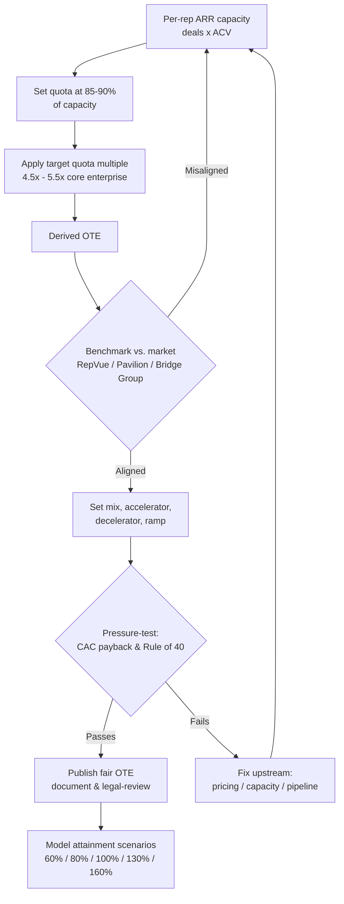

### Direct Answer

**A fair on-target earnings (OTE) package for an enterprise account executive selling $100k+ ACV deals in 2026 lands between $280,000 and $360,000, built on a 50/50 base-to-variable split, with $310,000 as the defensible market midpoint for a fully ramped rep carrying an $1.0M-$1.4M annual quota.** The base salary should sit at $140,000-$180,000, the at-target variable at the same figure, and total cash should reflect a 5x-6x quota-to-OTE coverage ratio. Anything below $250,000 OTE for true enterprise motion will lose you candidates to Salesforce, ServiceNow, Snowflake, and Datadog within one recruiting cycle; anything above $400,000 without elite logos or a $2M+ quota signals a comp plan that has drifted from unit economics. The number itself matters far less than the four structural choices around it: the split, the quota multiple, the accelerator curve, and the clawback language. Get those wrong and a $310k OTE will either bankrupt your CAC payback or fail to retain a single top performer.

---

### TL;DR

- **Market range:** $280k-$360k OTE for fully ramped enterprise AEs on $100k+ ACV; **$310k is the 2026 midpoint**.
- **Split:** 50/50 base/variable is standard for enterprise; 60/40 base-heavy only for long, technical, multi-year sales cycles.
- **Quota multiple:** Quota should equal **5x-6x of OTE**. A $310k OTE implies a **$1.55M-$1.86M quota** — most companies land near $1.2M-$1.4M, which is a yellow flag worth auditing.
- **Accelerators:** Pay **1.5x-2.5x the base commission rate** above 100% of quota, uncapped, with a decelerator below ~60% attainment.
- **Clawback:** Tie commission release to cash collection or a 90-180 day clawback window; never pay 100% of commission on a signed-but-unpaid contract.
- **The trap:** Companies obsess over the headline OTE and ignore the **fully-loaded cost of a quota-carrying rep** (~1.9x-2.3x base once benefits, tooling, ramp, and management overhead are loaded in).
- **Benchmark sources:** Pavilion, RepVue, Bridge Group, Alexander Group, and the 2026 SaaS comp surveys all converge inside the $280k-$340k band.

---

## Why "Fair" Is the Wrong First Question

Every founder, CRO, and RevOps lead who asks "what's a fair OTE" is really asking three separate questions at once, and conflating them produces bad comp plans. The three questions are: *What will the market force me to pay to hire and retain a competent enterprise AE?* (a recruiting question), *What can my unit economics afford to pay per dollar of new ARR?* (a finance question), and *What behavior do I want this number to drive?* (a strategy question). A fair OTE is the figure where all three answers overlap. When they do not overlap, the OTE is not "unfair" — the business model is broken, and no comp number will fix it.

The reason this distinction matters in 2026 specifically is that the enterprise SaaS labor market has bifurcated. The 2022-2023 correction compressed mid-market and SMB comp meaningfully, but genuine enterprise sellers — reps who can run a 9-month, multi-stakeholder, procurement-and-security-review cycle into a Fortune 1000 logo — never lost pricing power. They got *more* scarce, because hiring froze during the correction and the pipeline of rising mid-market reps who would have graduated into enterprise roles thinned out. So in 2026 you are negotiating against a structural shortage. That is the backdrop for every number in this answer.

The second reason is that boards and CFOs got religion about efficiency. The Rule of 40 stopped being a slide and became a covenant. CAC payback is now scrutinized line by line. This means the days of paying whatever it took to "land the rep" and sorting out the math later are over. A 2026 enterprise comp plan has to be simultaneously *competitive enough to win the candidate* and *efficient enough to survive a board finance review*. The entire craft of this answer lives in that tension.

> **The core principle:** OTE is an output of your go-to-market model, not an input. If you set the OTE first and back into quota, you will overpay. If you set quota from a defensible ARR-per-rep capacity model and then derive OTE from a target quota multiple, you will land in the fair zone almost automatically.

### The decision flow, visualized

The diagram below shows the correct *order of operations* for arriving at a fair OTE. The arrows run from real-world constraints down to the published number — never the reverse.

The single most common failure mode is skipping straight to box D — guessing an OTE — and then bending boxes A, B, and C to justify it. Every loop-back arrow in the diagram exists because the model, not the negotiation, should decide the number.

---

## The 2026 Enterprise AE OTE Benchmark, By the Numbers

Let us put hard numbers on the table before discussing structure. The figures below synthesize 2026 data from RepVue's crowdsourced comp database, the Bridge Group's SaaS AE Metrics report, Pavilion's compensation benchmarks, Alexander Group's enterprise sales surveys, and direct comp data from publicly disclosed S-1s and proxy statements. All figures are US-based, fully-ramped (post-ramp), and assume a true enterprise motion — $100k+ ACV, named-account or pure-new-logo, sales cycles of 4-9 months.

### Table 1 — Enterprise AE OTE Bands by Segment, 2026 (US, fully ramped)

| Segment | Base salary | Variable at target | OTE | Typical annual quota | Quota:OTE multiple |
|---|---|---|---|---|---|
| Lower enterprise ($100k-$150k ACV) | $130k-$150k | $130k-$150k | **$260k-$300k** | $1.0M-$1.2M | 3.8x-4.2x |
| Core enterprise ($150k-$300k ACV) | $145k-$175k | $145k-$175k | **$290k-$350k** | $1.2M-$1.6M | 4.4x-4.8x |
| Strategic / named accounts ($300k+ ACV) | $165k-$200k | $165k-$210k | **$330k-$410k** | $1.5M-$2.2M | 5.0x-5.6x |
| Field enterprise at hyperscalers / elite logos | $180k-$220k | $200k-$280k | **$380k-$500k+** | $2.0M-$3.5M | 5.5x-7.0x |

The headline takeaway: for the plain-vanilla "$100k+ ACV enterprise AE" the question asks about, you are in the **core enterprise** row. The defensible 2026 midpoint is **$310k OTE** — $155k base, $155k variable — carrying roughly a $1.4M-$1.5M quota.

### Table 2 — What the major benchmark sources say (2026 enterprise AE OTE)

| Source | Methodology | Reported enterprise AE OTE (median) |
|---|---|---|
| RepVue | Crowdsourced, 100k+ verified rep profiles | $295k-$320k |
| Bridge Group SaaS AE Metrics 2026 | Survey of 350+ SaaS sales orgs | $301k blended; $325k for $100k+ ACV |
| Pavilion Comp Benchmarks 2026 | Member survey, GTM leaders | $285k-$340k IQR |
| Alexander Group Enterprise Survey | Large-enterprise consulting dataset | $315k median, $360k 75th pctile |
| S-1 / proxy disclosures (public SaaS) | Disclosed quota-carrier comp | $290k-$370k depending on stage |

Every credible source clusters inside **$280k-$360k**, and the central tendency is **$305k-$320k**. If a candidate, recruiter, or board member quotes you a number far outside that band, ask which segment and which attainment assumption they are using — that is almost always where the disagreement hides.

### Table 3 — Geographic and stage adjustments to the $310k midpoint

| Adjustment factor | Multiplier on midpoint OTE | Resulting OTE |
|---|---|---|
| SF Bay Area / NYC metro | 1.10x-1.15x | $340k-$357k |
| Major tech hub (Austin, Boston, Seattle, Denver) | 1.00x-1.05x | $310k-$326k |
| Secondary metro / hybrid | 0.90x-0.97x | $279k-$301k |
| Fully remote, national band | 0.92x-1.00x | $285k-$310k |
| Seed / Series A (higher equity, lower cash) | 0.85x-0.95x cash | $264k-$295k cash + larger equity |
| Series C+ / pre-IPO | 1.00x-1.10x | $310k-$341k |
| Public company | 1.05x-1.15x (plus RSUs) | $326k-$357k cash |

A Series A startup paying $280k cash with a meaningful equity grant is being *fair* — arguably more generous on a risk-adjusted basis than a public company paying $340k. Never compare OTEs without comparing the equity and stability around them.

---

## The 50/50 Split, and When to Break It

The single most important structural decision after the headline number is the **pay mix** — the ratio of guaranteed base salary to at-risk variable. For enterprise AEs in 2026, the default and the right answer for ~80% of companies is **50/50**. There are principled reasons to deviate, and principled reasons not to.

### Why 50/50 is the enterprise default

Enterprise selling has long, lumpy revenue. A rep might close nothing for two quarters and then land three deals that put them at 140% for the year. A pay mix that is too variable-heavy (say 40/60) punishes the rep for the *timing* of enterprise revenue, not their effort or skill, and it makes the role financially terrifying — which directly shrinks your candidate pool to people who can personally absorb six months of low income. A 50/50 mix keeps the base high enough that a competent rep can survive a slow stretch without selling their house, while keeping enough upside that the variable still drives behavior.

### When to go base-heavy (55/45 or 60/40)

Shift toward base in three situations:

- **Ultra-long cycles.** If your median enterprise cycle exceeds 9-12 months — common in healthcare, government, or deeply technical infrastructure sales — a variable-heavy plan creates brutal income volatility. Move to 55/45 or 60/40.
- **New logo into a category that does not exist yet.** When the rep spends most of their time on market education rather than closing, more of their pay should be guaranteed, because the close-rate variance is enormous and largely outside their control.
- **Heavily team-sold deals.** If solutions engineers, executive sponsors, and partners all materially influence the deal, attributing the full swing to the AE is unfair and a base-heavier mix corrects for it.

### When to go variable-heavy (45/55 or 40/60)

Shift toward variable only when: the sales cycle is short and predictable for the segment, the rep has near-total control over the outcome (transactional enterprise, expansion-heavy), and you are deliberately selecting for high-risk-tolerance hunters. Even then, do not go past 40/60 for enterprise — you will simply lose your best candidates to a competitor offering 50/50 at the same OTE.

### Table 4 — Pay mix decision matrix

| Situation | Recommended mix | Rationale |
|---|---|---|
| Standard enterprise new-logo, 4-7 mo cycle | **50/50** | Balances survivability and upside |
| Ultra-long cycle (9-12+ mo), regulated industry | 55/45 or 60/40 | Smooths income across lumpy revenue |
| Category-creation / heavy market education | 55/45 | Close-rate variance outside rep control |
| Expansion / named-account farming | 55/45 or 50/50 | More predictable, but still want hunting energy |
| Transactional enterprise, short cycle | 45/55 | Rep controls outcome, reward velocity |
| Pure hunter, deliberately high-risk culture | 40/60 (rare) | Only if OTE is genuinely uncapped and high |

---

## Quota: The Number That Actually Decides Fairness

Here is the truth that most "what's a fair OTE" conversations miss entirely: **a $310k OTE on a $900k quota and a $310k OTE on a $1.8M quota are not the same job, and they are not the same offer.** The OTE without the quota is meaningless. Fairness is a property of the *ratio*, not the number.

### The quota-to-OTE multiple

The cleanest single metric for whether a comp plan is internally fair is the **quota-to-OTE multiple** — annual quota divided by OTE. For enterprise SaaS in 2026:

- **Below 4x:** The plan is *generous to the rep and expensive to the company.* Reps love it; finance hates it; it usually signals either a young company buying loyalty or a comp plan that has not been re-baselined as ACV grew.
- **4x-5x:** The fair-and-sustainable zone for most core enterprise motions. This is where you want to be.
- **5x-6x:** Standard at scale, especially for strategic accounts with large ACV and strong inbound or brand pull.
- **Above 6x:** The plan is *cheap for the company and punishing for the rep* unless the brand does most of the selling (think a hyperscaler where the logo opens every door). For a typical company, a 7x multiple guarantees low attainment, high attrition, and a comp plan that looks great on a spreadsheet and fails in reality.

A $310k OTE therefore implies a fair quota of roughly **$1.24M-$1.86M**, with **$1.4M-$1.55M** as the sweet spot for core enterprise. If your model needs the rep to carry $2.2M to make the economics work but the market OTE is $310k, your problem is not comp — it is sales capacity, pricing, or pipeline coverage.

### Coverage and the attainment distribution

The quota multiple has to be sanity-checked against your real attainment distribution. A fair, well-set quota produces an attainment curve where roughly **55%-65% of reps hit 100%+ of quota** in a healthy year. If only 30% of your reps are hitting quota, the quota is too high regardless of what the multiple says, and your *effective* OTE — what reps actually earn — is far below the *nominal* OTE you advertised. Candidates and recruiters know this. RepVue explicitly publishes "% of reps hitting quota" precisely because the nominal OTE is so easy to game.

> **Rule of thumb:** Effective OTE = Nominal OTE × (median attainment %). If you advertise $310k but median attainment is 70%, your reps experience a ~$252k job. Compare *effective* OTEs, not nominal ones, or you will lose people in month nine when reality lands.

### Table 5 — Quota multiple interpretation guide

| Quota:OTE multiple | What it means | Typical company profile | Action |
|---|---|---|---|
| < 3.5x | Very rep-favorable, expensive | Early startup buying loyalty; stale plan | Re-baseline as ACV grows |
| 3.5x-4.5x | Fair, slightly rep-favorable | Series A-B finding footing | Healthy; monitor |
| 4.5x-5.5x | Balanced and sustainable | Mature core enterprise | Target zone |
| 5.5x-6.5x | Company-favorable, scale-efficient | Series C+, strong brand pull | Acceptable if attainment holds |
| > 6.5x | Punishing without brand lift | Misconfigured plan or hyperscaler | Audit capacity & pipeline |

---

## Accelerators: Designing the Upside Curve

The accelerator is the part of the comp plan that does the actual *motivating*. The base keeps the rep alive; the at-target variable rewards doing the job; the **accelerator is what makes a great rep choose to close the eleventh deal instead of coasting after the tenth.** Design it deliberately.

### The core mechanics

A standard 2026 enterprise accelerator works in tiers above 100% of quota:

- **0%-100% of quota:** Base commission rate. With a 50/50 plan and a 5x quota multiple, this works out to roughly **10% of ACV** as commission (because variable / quota = $155k / $1.55M = 10%).
- **100%-150% of quota:** Accelerated rate of **1.5x-2.0x** the base rate — so 15%-20% of every incremental dollar.
- **Above 150%:** A second accelerator tier at **2.0x-2.5x** base rate, or a flat continuation of tier two. **This tier must be uncapped.**

Capping the accelerator is one of the most expensive false economies in SaaS. The marginal dollar of revenue from a rep at 180% of quota is your *cheapest* revenue — no extra hiring, ramp, or management cost. Capping commission at 150% tells your single best rep to stop selling in October. Datadog, Snowflake, and ServiceNow are famous in recruiting circles for uncapped plans; that is not generosity, it is math.

### The decelerator (the other half nobody designs)

Symmetry matters. If you accelerate above target you should also **decelerate below it** — pay a *reduced* commission rate below roughly 60% attainment. This protects the company from paying full freight for chronic underperformance and funds the uncapped upside. A typical structure: full rate from 60%-100%, a reduced rate (say 0.5x) below 60%, and a hard floor below which only base is paid. Without a decelerator, the math of an uncapped accelerator does not close, and finance will (correctly) refuse to sign the plan.

### Table 6 — Sample enterprise accelerator schedule ($310k OTE, $1.55M quota, 50/50)

| Attainment band | Commission rate (of incremental ACV) | Multiplier vs. base rate | Cumulative variable earned |
|---|---|---|---|
| 0%-60% | 5% | 0.5x (decelerator) | up to ~$46.5k |
| 60%-100% | 10% | 1.0x (base rate) | up to $155k (at-target) |
| 100%-150% | 17% | 1.7x | up to ~$287k |
| 150%-200% | 22% | 2.2x | up to ~$457k |
| 200%+ | 22% | 2.2x (uncapped) | unlimited |

A rep who hits 150% on this plan earns roughly **$442k total cash** ($155k base + $287k variable) against a $310k OTE. That is the *intended* outcome — your best people should make 1.3x-1.6x their OTE in a strong year, and it should cost you nothing you did not happily underwrite, because every dollar above target came at a 17%-22% cost of revenue against deals that needed no incremental hiring.

### MBOs, SPIFs, and the kicker layer

Beyond the core accelerator, mature plans add a thin layer of **MBOs** (management-by-objectives — paid quarterly for things like multi-year deals, strategic logos, or new-product attach) and **SPIFs** (short-term incentive funds for a specific push). Keep this layer small — no more than 10%-15% of total variable — or it dilutes the clarity of the core quota and reps start optimizing for the SPIF instead of the business.

---

## Clawbacks and Commission Release: Protecting the Company

The fastest way to turn a fair OTE into a financial disaster is to **pay commission on revenue you never collect.** Clawback and commission-release design is the unglamorous discipline that separates a comp plan that survives a downturn from one that does not.

### The core principle: pay on cash, or pay with a window

There are two defensible models:

1. **Pay on collection.** Commission is earned when the customer's cash arrives. This is the most conservative and the most CFO-friendly. The downside is rep cash-flow lag — a rep closes in March and gets paid in May — which you offset with a slightly higher base or a draw.
2. **Pay on booking with a clawback window.** Commission is paid shortly after the deal is signed, but is subject to **clawback** if the customer churns, fails to pay, or downgrades within a defined window — typically **90-180 days**. This is the most common 2026 enterprise structure because it keeps reps motivated and liquid while protecting the company.

Whichever you choose, never pay 100% of commission, with no recourse, on a signed contract with unpaid invoices. That structure rewards reps for selling to customers who will never pay — and in a tightening market, that is exactly the failure mode that destroys CAC payback.

### Clawback language that holds up

A clawback clause has to be specific and legal-reviewed. It must define: the **triggering events** (non-payment past X days, churn within the window, contractual downgrade), the **recovery mechanism** (offset against future commissions vs. direct repayment), the **window length**, and the **treatment on rep departure** (whether you can claw back from a final paycheck — heavily state-dependent in the US, so this needs employment-counsel review per jurisdiction). Vague clawback language is worse than none: it generates disputes, damages trust, and often loses in arbitration.

### Table 7 — Commission release model comparison

| Model | Rep cash timing | Company risk | Best for |
|---|---|---|---|
| Pay on collection | Lags close by 30-90 days | Lowest | Cash-sensitive companies, longer payment terms |
| Pay on booking, 90-day clawback | Fast, near close | Moderate | Most core enterprise motions |
| Pay on booking, 180-day clawback | Fast, near close | Low-moderate | Higher-churn-risk segments, new categories |
| Split: 50% on booking / 50% on collection | Partial fast | Low | Balances rep liquidity and company protection |
| Pay on booking, no clawback | Fastest | Highest | Almost never appropriate for enterprise |

### The ramp guarantee

One more piece of fair design: the **ramp guarantee** (also called a draw against commission or a ramp draw). A new enterprise AE will not close a $1.5M quota in their first two quarters — the pipeline does not exist yet and the cycle is too long. A fair plan pays a **guaranteed variable** during ramp, typically: 100% of target variable in months 1-3, 75% in months 4-6, 50% in months 7-9, then full plan. This guarantee should be **non-recoverable** (the rep does not have to "pay it back" out of later commissions) — a recoverable draw quietly buries a new hire in debt and is a top reason enterprise reps quit in month eight. Budget the ramp guarantee explicitly; it is part of the true cost of the role.

---

## The Fully-Loaded Cost of an Enterprise AE

Boards and founders consistently underestimate what an enterprise AE actually costs, because they anchor on the OTE. The OTE is roughly **half** the true number.

### Building up the real cost

Start with a $310k OTE and load it:

- **OTE at target:** $310,000
- **Employer payroll taxes, benefits, insurance (~22%-28% of cash comp):** ~$75,000
- **Tooling and data** (CRM seat, sales engagement platform, intelligence/data, conversation intelligence, e-sign, etc.): $12,000-$20,000
- **T&E** for an enterprise field rep: $15,000-$35,000
- **Allocated SE / sales-engineering support:** $40,000-$90,000 (a shared SE across 2-4 reps)
- **Allocated sales management overhead** (a manager per 6-8 reps, fully loaded): $35,000-$55,000 per rep
- **Allocated marketing / SDR pipeline cost** to feed the rep: highly variable, often $50,000-$120,000

### Table 8 — Fully-loaded annual cost of one enterprise AE

| Cost component | Low estimate | High estimate |
|---|---|---|
| OTE (cash) | $310,000 | $310,000 |
| Payroll tax + benefits | $68,000 | $87,000 |
| Tooling & data | $12,000 | $20,000 |
| T&E | $15,000 | $35,000 |
| Allocated SE support | $40,000 | $90,000 |
| Allocated management | $35,000 | $55,000 |
| Allocated pipeline gen (SDR/marketing) | $50,000 | $120,000 |
| Ramp guarantee amortized (year 1) | $20,000 | $40,000 |
| **Fully-loaded total** | **~$550,000** | **~$757,000** |

The fully-loaded cost is roughly **1.8x-2.4x the OTE**. This is the number that has to clear your CAC payback test, not the $310k. A rep carrying a $1.5M quota at, say, 90% attainment generates $1.35M of new ARR against a ~$650k fully-loaded cost — a sales-cost ratio near 0.48, which is healthy. Drop attainment to 55% and you generate $825k against the same $650k cost — a ratio of 0.79, which is not. **This is why quota-setting and OTE-setting are the same decision.**

---

## How OTE Connects to CAC Payback and the Rule of 40

A fair OTE is one your unit economics can metabolize. Two finance lenses make this concrete.

### CAC payback

CAC payback is the number of months of gross-margin-adjusted revenue required to recover the cost of acquiring a customer. The sales rep's fully-loaded cost is the dominant input on the sales-and-marketing side. Roughly:

> CAC payback (months) ≈ (Fully-loaded S&M cost to acquire one customer) ÷ (New MRR per customer × gross margin)

If your enterprise AE costs ~$650k loaded and closes, say, 9 deals a year at an average $150k ACV, the loaded sales cost per deal is ~$72k. Add allocated marketing and you might be at $95k-$110k CAC per logo. Against a $150k ACV at 78% gross margin ($117k gross-margin revenue/year), payback lands near **10-11 months** — solidly in the healthy 12-18 month enterprise band. If the OTE were inflated to $420k with no quota increase, the loaded cost jumps, deals-per-rep stays flat, and payback drifts past 18 months — the point at which boards start asking hard questions.

### Rule of 40

The Rule of 40 says growth rate plus profit margin should sum to 40+. Sales comp is one of the largest single levers on the margin side. An OTE that is fair *and well-coupled to quota* keeps sales efficiency high, which protects margin without sacrificing growth. An OTE that is too high relative to quota forces a choice: either eat the margin hit (Rule of 40 falls) or under-hire (growth falls). A fair comp plan is, in a real sense, a Rule of 40 instrument.

### Table 9 — How OTE choices ripple into unit economics

| OTE / quota choice | CAC payback effect | Rule of 40 effect | Verdict |
|---|---|---|---|
| $310k OTE, $1.5M quota, 90% attainment | ~10-11 mo | Neutral-positive | Fair and sustainable |
| $310k OTE, $1.0M quota (low multiple) | ~14-16 mo | Margin drag | Too generous; re-baseline |
| $420k OTE, $1.5M quota (overpay) | ~16-19 mo | Margin drag | Overpaying; fix or raise quota |
| $260k OTE, $1.8M quota (underpay) | ~8-9 mo on paper | Looks great | Will not retain — attrition cost hidden |
| $310k OTE, $1.5M quota, 55% attainment | ~17-19 mo | Margin drag | Quota too high; effective OTE too low |

Notice the fourth row: a $260k OTE on a $1.8M quota looks like the most efficient plan on a spreadsheet. It is not, because it ignores the cost of attrition — re-hiring and re-ramping an enterprise AE costs $200k-$400k in lost productivity and recruiting fees. **The cheapest-looking comp plan is frequently the most expensive one once you price in churn of your own salespeople.**

---

## What Top Companies Actually Pay: A Named Reference Set

To ground all of this, here is how a representative set of public and well-known SaaS companies structure enterprise AE comp in 2026. Figures are synthesized from S-1/proxy disclosures, RepVue, Glassdoor verified ranges, and recruiting-market intelligence; they are directional, not contractual.

- **Salesforce (CRM):** Mature, segmented enterprise machine. Enterprise AE OTE commonly $300k-$420k depending on cloud and segment; famously high quota multiples offset by strong brand pull and inbound. 50/50 typical.
- **ServiceNow (NOW):** Among the most generous enterprise comp in software. Strategic AE OTE frequently $350k-$500k+, uncapped accelerators, strong attainment culture. A benchmark reps cite when negotiating.
- **Snowflake (SNOW):** Consumption-model enterprise sellers; OTE $320k-$450k with comp partly tied to consumption ramp, not just bookings. Uncapped, accelerator-heavy.
- **Datadog (DDOG):** Land-and-expand enterprise; OTE $300k-$420k, well-known for uncapped upside and high effective earnings for strong reps.
- **Workday (WDAY):** Long-cycle enterprise HCM/financials; base-heavier mixes (often 55/45-60/40) reflecting 9-12 month cycles; OTE $300k-$400k.
- **HubSpot (HUBS):** Moves into enterprise from a mid-market base; enterprise AE OTE $260k-$340k, somewhat lower ACV than the hyperscaler set.
- **MongoDB (MDB):** Developer-led enterprise expansion; OTE $300k-$400k, consumption-influenced.
- **CrowdStrike (CRWD):** Enterprise security; OTE $320k-$450k, high quotas, strong brand pull in a must-buy category.
- **Atlassian (TEAM):** Historically low-touch, now building a true enterprise motion; enterprise AE comp climbing toward $280k-$360k as the motion matures.
- **Okta (OKTA):** Enterprise identity; OTE $300k-$400k, 50/50, named-account structure.

### Table 10 — Named reference set, enterprise AE OTE 2026 (directional)

| Company (ticker) | Typical enterprise AE OTE | Typical mix | Accelerator posture |
|---|---|---|---|
| ServiceNow (NOW) | $350k-$500k+ | 50/50 | Uncapped, aggressive |
| Snowflake (SNOW) | $320k-$450k | 50/50 | Uncapped, consumption-linked |
| CrowdStrike (CRWD) | $320k-$450k | 50/50 | Uncapped |
| Datadog (DDOG) | $300k-$420k | 50/50 | Uncapped |
| Salesforce (CRM) | $300k-$420k | 50/50 | Tiered, high quota |
| Workday (WDAY) | $300k-$400k | 55/45-60/40 | Tiered, long-cycle |
| MongoDB (MDB) | $300k-$400k | 50/50 | Consumption-influenced |
| Okta (OKTA) | $300k-$400k | 50/50 | Tiered |
| Atlassian (TEAM) | $280k-$360k | 50/50 | Maturing |
| HubSpot (HUBS) | $260k-$340k | 50/50 | Tiered |

The pattern: the hyperscalers and must-buy security vendors anchor the top of the range ($350k+), the broad enterprise software set clusters at $300k-$400k, and companies still building an enterprise muscle sit at $260k-$340k. A non-public Series B-C company competing for the same talent should target the **$290k-$340k** band and differentiate on equity, territory quality, and product-market fit rather than trying to out-cash a public hyperscaler.

---

## Territory and Segmentation: The Hidden Variable in Fairness

Two enterprise AEs at the same company with the identical $310k OTE and $1.5M quota can be holding wildly different jobs — because **territory quality is not part of the comp plan but determines whether the comp plan is fair.** A rep handed a greenfield region with no installed base, no brand recognition, and a competitor incumbent in every account has a structurally harder path to that $1.5M than a rep handed a mature territory full of expansion-ready logos and warm inbound. If you pay them the same and quota them the same, you are being *nominally* fair and *actually* unfair, and your greenfield rep will figure that out and leave.

### How mature comp orgs correct for territory

There are four standard mechanisms, and good RevOps teams use them in combination:

- **Quota relief on greenfield territories.** New or under-developed regions get a quota discount — often 15%-30% lower — for the first year or two, recognizing that pipeline has to be built from zero. This is the cleanest correction because it adjusts the *denominator* of the quota multiple rather than distorting base pay.
- **Named-account vs. open-territory design.** Named-account reps work a fixed list of high-potential logos; open-territory reps work a geography or vertical. Named-account roles usually carry higher quotas and slightly higher OTE because the account list is curated. The fairness question is whether the named accounts are genuinely *workable* — a list of 40 Fortune 500 logos that all just signed three-year deals with a competitor is a poisoned territory regardless of how prestigious it looks.
- **Tenure-weighted assignment.** Many orgs deliberately give the toughest greenfield territories to senior reps who can self-generate pipeline, and assign developed territories to newer reps still building skill. This is fair only if the comp recognizes it — the senior rep on hard ground should not earn *less* than the junior rep on easy ground.
- **Annual territory rebalancing.** As territories mature, the easy ones produce above-quota years and the hard ones lag. A fair org rebalances annually, redistributing accounts and resetting quotas so that no rep is permanently advantaged or disadvantaged by a one-time draw of the territory lottery.

### Table 11 — Territory quality adjustment framework

| Territory type | Quota adjustment vs. baseline | OTE adjustment | Notes |
|---|---|---|---|
| Greenfield / new region, no installed base | -20% to -30% quota, year 1-2 | None | Relief expires as pipeline matures |
| Developing territory, some installed base | -10% quota | None | Partial relief |
| Mature open territory, healthy installed base | Baseline | Baseline | The standard reference case |
| Mature named-account list, expansion-ready | +10% to +25% quota | +5% to +10% OTE | Higher ceiling, curated list |
| Strategic / Fortune 100 named accounts | +25% to +60% quota | +15% to +30% OTE | Longest cycles, highest ACV |
| "Poisoned" territory (incumbent locked in) | -30% or reassign | None | Fix the territory, not the comp |

The lesson for anyone setting a "fair OTE" is that **the OTE number is necessary but not sufficient.** You can publish a perfectly benchmarked $310k and still run an unfair comp system if your territory design hands some reps an easy quota and others an impossible one at the same price. Territory equity is part of comp equity.

---

## Negotiating the Offer: Both Sides of the Table

The framework above tells you where a fair number *lives*. Real offers are negotiated, and both the company and the candidate should negotiate from the structure, not the headline.

### What a candidate should actually probe

A sophisticated enterprise AE evaluating an offer does not ask "what's the OTE." They ask:

- **"What percentage of reps hit quota last year, and the year before?"** This converts nominal OTE into effective OTE. A $310k OTE where 40% of reps hit quota is a worse offer than a $280k OTE where 65% do.
- **"What is the quota, and how was it set?"** A company that can articulate a capacity-based quota-setting method is a company whose plan will hold up. A company that says "the board set the number" is a company whose quota will be raised arbitrarily.
- **"Is the accelerator capped? Show me the schedule."** A cap is a red flag about both upside and management philosophy.
- **"Is the ramp guarantee recoverable or non-recoverable?"** A recoverable draw can turn into personal debt.
- **"What is the clawback window and what triggers it?"** This reveals how the company thinks about revenue quality.
- **"What does the territory look like — installed base, pipeline coverage, competitive incumbency?"** As the previous section showed, this often matters more than the OTE digits.
- **"How long have the last three people in this role stayed, and where did they go?"** Tenure and exit destinations are the truest signal of whether a plan is fair in practice.

### What a company should offer and hold firm on

From the employer's side, the negotiation discipline is to **flex on base within a band, flex on equity, and hold firm on quota and accelerator structure.** Specifically:

- **Flexible:** Base salary within roughly a $20k-$30k band, sign-on bonus, equity grant size, start date, ramp guarantee length.
- **Firm:** The quota multiple, the accelerator schedule, the decelerator, the clawback terms, and the pay mix. These are the structural integrity of the plan; bending them for one candidate creates internal inequity that metastasizes the moment reps compare notes — and they always compare notes.
- **Never do:** Offer a higher OTE by quietly lowering that one rep's quota. It feels like a clean way to win a candidate; it is actually a slow-motion fairness crisis, because the rest of the team is now on a harder plan for the same money.

### Table 12 — Negotiation levers ranked

| Lever | Company flexibility | Candidate leverage | Effect on plan integrity |
|---|---|---|---|
| Base salary (within band) | Moderate | High | Low risk |
| Sign-on bonus | High | Moderate | None — one-time |
| Equity grant | High (early-stage) | High | None to plan |
| Ramp guarantee length | Moderate | Moderate | Low risk |
| Quota | Low — hold firm | Low | High risk if bent |
| Accelerator structure | None — hold firm | None | Critical — never bend |
| Clawback terms | None — hold firm | Low | Critical — never bend |
| Pay mix | Low | Low | Moderate risk |

The healthiest negotiation outcome is one where the candidate got real movement on base, sign-on, and equity, and the company never touched the quota multiple or accelerator. Both sides win, and the plan stays internally fair for the other forty reps who are not in the room.

---

## A Fully Worked Example: Setting Comp for "Northwind Data"

Abstract frameworks are easy to nod along with and hard to apply. Here is the entire method applied end-to-end to a realistic fictional company.

**Northwind Data** is a Series C data-infrastructure company. ARR is $48M, growing 55% year over year. Average enterprise ACV is $165k. Median sales cycle is 6.5 months with 7-9 stakeholders per deal. Gross margin is 76%. They are hiring eight enterprise AEs and need a defensible comp plan a board finance committee will approve.

**Step 1 — Capacity.** A fully-ramped Northwind rep, given adequate pipeline coverage, closes 9-11 deals per year at $165k ACV. Realistic capacity: 9.5 deals × $165k ≈ **$1.57M of new ARR per rep per year.**

**Step 2 — Quota.** Set quota at 88% of capacity so a clear majority of reps can clear 100%: 0.88 × $1.57M ≈ **$1.38M annual quota.**

**Step 3 — Derive OTE.** Core enterprise, strong-but-not-hyperscaler brand. Target quota multiple: 4.6x. OTE = $1.38M ÷ 4.6 ≈ **$300k OTE.** Northwind rounds to a clean $305k.

**Step 4 — Benchmark.** RepVue and Pavilion data for Series C data-infrastructure enterprise AEs in their geography (a major tech hub, 1.02x) land at $295k-$330k. The derived $305k sits squarely inside the band — the model and the market agree, so no override is needed.

**Step 5 — Structure.** Mix: 50/50, so $152.5k base and $152.5k target variable. Base commission rate: $152.5k ÷ $1.38M ≈ 11% of ACV. Accelerator: 1.8x (≈20%) from 100%-150%, 2.3x (≈25%) above 150%, uncapped. Decelerator: 0.5x rate below 60% attainment. Ramp guarantee: non-recoverable, 100% of target variable months 1-3, 70% months 4-6, 40% months 7-9.

**Step 6 — Pressure-test.** Fully-loaded cost per rep ≈ 2.0x OTE ≈ **$610k**. At 90% attainment a rep generates 0.90 × $1.38M = $1.24M new ARR. Loaded sales cost per deal ≈ $610k ÷ 8.6 deals ≈ $71k; add allocated marketing/SDR and CAC per logo ≈ $100k. Against $165k ACV at 76% margin ($125k gross-margin revenue/year), CAC payback ≈ **9.6 months** — comfortably inside the healthy enterprise band. Sales efficiency does not threaten the Rule of 40. The plan clears finance review.

**Step 7 — Document and model.** Northwind publishes an earnings table so every rep sees exactly what they make at each attainment level, and employment counsel reviews the clawback (90-day window, offset-against-future-commissions recovery, no final-paycheck clawback in the states where that is restricted).

### Table 13 — Northwind Data rep earnings by attainment

| Attainment | New ARR closed | Variable earned | Total cash | vs. $305k OTE |
|---|---|---|---|---|
| 50% | $690k | ~$38k | ~$190k | 0.62x |
| 70% | $966k | ~$106k | ~$259k | 0.85x |
| 100% | $1.38M | $152.5k | $305k | 1.00x |
| 130% | $1.79M | ~$236k | ~$389k | 1.27x |
| 160% | $2.21M | ~$338k | ~$491k | 1.61x |
| 200% | $2.76M | ~$465k | ~$618k | 2.03x |

The plan does exactly what a fair plan should: a struggling rep at 50% still earns a livable $190k (mostly base), an on-plan rep earns the advertised $305k, and a star at 160%-200% earns $490k-$620k — every incremental dollar of which Northwind happily underwrote because it came at a 20%-25% cost of revenue on deals that required no extra hiring. The board approved it because the math is transparent and the CAC payback holds. That is the entire point of the method: the $305k is not a guess that felt fair, it is an *output* that is fair, defensible, and survivable.

---

## Building the Plan: A Step-by-Step Method

Here is the actual sequence to set a fair enterprise AE OTE for *your* company, in order. Do not skip steps or reorder them.

### Step 1 — Establish sales capacity per rep

Before touching comp, determine how much new ARR one fully-ramped enterprise rep can realistically generate in a year given your ACV, cycle length, and pipeline coverage. This is a bottoms-up estimate: deals-per-year × average ACV. For a $150k ACV motion with a 6-month cycle and adequate pipeline, 8-12 closed deals/year is realistic, implying $1.2M-$1.8M of capacity.

### Step 2 — Set quota at 85%-90% of capacity

Quota should be *achievable by a good rep*, not by a mythical perfect one. Set it at roughly 85%-90% of realistic capacity so that 55%-65% of reps clear 100%. If capacity is $1.6M, set quota near $1.4M-$1.45M.

### Step 3 — Derive OTE from a target quota multiple

Pick a quota multiple appropriate to your segment (4.5x-5.5x for core enterprise) and divide quota by it. A $1.45M quota at a 4.7x multiple yields a ~$308k OTE. Notice the OTE *fell out* of the model rather than being guessed.

### Step 4 — Benchmark the derived OTE against the market

Check the derived number against RepVue, Pavilion, Bridge Group, and your own recruiting data. If your model produced $308k and the market for your segment and geography says $300k-$330k, you are aligned. If your model produces $230k, your capacity assumptions or quota multiple are off — fix the model, do not just override the number.

### Step 5 — Set the mix, accelerators, decelerator, and ramp

Apply 50/50 (or a justified deviation), design the tiered uncapped accelerator with a sub-60% decelerator, and budget a non-recoverable ramp guarantee for new hires.

### Step 6 — Pressure-test against CAC payback and Rule of 40

Load the rep fully (Table 8), run the CAC payback math, and confirm payback lands in the 12-18 month enterprise band and that sales efficiency does not break the Rule of 40. If it does, the problem is upstream — pricing, capacity, or pipeline — not the comp number.

### Step 7 — Document, model attainment scenarios, and legal-review the clawback

Write the plan in plain language, model rep earnings at 60%/80%/100%/130%/160% attainment so there are no surprises, and have employment counsel review the clawback and any draw-recovery language per jurisdiction.

### Table 14 — The seven-step method at a glance

| Step | Action | Output |
|---|---|---|
| 1 | Estimate per-rep ARR capacity | $1.2M-$1.8M capacity |
| 2 | Set quota at 85-90% of capacity | $1.4M-$1.45M quota |
| 3 | Divide quota by target multiple (4.5-5.5x) | ~$300k-$320k OTE |
| 4 | Benchmark against market data | Confirm or fix the model |
| 5 | Set mix, accelerators, decelerator, ramp | Full plan structure |
| 6 | Pressure-test vs. CAC payback & Rule of 40 | Economic sign-off |
| 7 | Document, model scenarios, legal-review | Signed, defensible plan |

---

## Counter-Case: When $310k Is the Wrong Answer

The midpoint is a default, not a law. Several real situations make a materially different number the *fair* one — and treating $310k as universal is itself a mistake.

**The number is too high when:** your ACV is genuinely lower-enterprise ($100k-$130k) with short cycles and strong inbound — a $270k-$290k OTE is correct and paying $310k erodes margin for no retention benefit. It is also too high for a seed/Series A company where cash is scarce and equity should carry more of the package; forcing a $310k cash OTE there can be financially reckless.

**The number is too low when:** you are recruiting field reps for a must-buy category against ServiceNow and CrowdStrike, or hiring genuine strategic/named-account sellers carrying $2M+ quotas into the Fortune 100. There, $310k will simply not get returned phone calls, and $360k-$450k is the fair market clearing price.

**The whole framework breaks down when** your motion is not actually enterprise. A "$100k ACV" deal that closes in three weeks through a self-serve-influenced PLG funnel is not an enterprise sale, and paying an enterprise OTE for it overpays dramatically — that role should be compensated as high-velocity mid-market, likely $180k-$240k OTE. Conversely, calling a 12-month, 9-stakeholder, $80k ACV regulated-industry deal "mid-market" because the ACV is under $100k underpays a genuinely enterprise-difficulty job. **The ACV threshold in the question is a useful proxy, but the real definition of "enterprise" is cycle complexity and stakeholder count, not the dollar figure.** Always classify the motion before pricing the role.

Finally, the framework assumes a US market. In EMEA, enterprise AE OTE typically runs 25%-40% lower in absolute terms with a more base-heavy mix (often 60/40) and stronger statutory protections that constrain clawbacks. In APAC the variance is even wider by country. Never port a US comp plan abroad without localizing both the number and the structure.

---

## How the Comp Plan Should Evolve With Company Stage

A fair OTE is not a fixed point — it moves as the company matures, and a plan that was perfectly fair at Series A becomes a liability at Series D if it never changes. The reason is that every input to the model shifts with stage: ACV grows, brand pull strengthens, pipeline coverage improves, attainment distributions tighten, and the relative weight of cash versus equity flips.

### Seed and Series A: cash-light, equity-heavy, generous multiples

At the earliest stage you cannot out-cash anyone, and you should not try. The fair package leans on equity and a *lower* quota multiple, because pipeline is thin, the product is still rough, and close rates are volatile through no fault of the rep. A seed-stage enterprise AE might carry a 3.5x-4.0x quota multiple — that looks "generous to the rep" by the table earlier, and it should, because the rep is absorbing enormous product and market risk. The cash OTE might be $260k-$290k with an equity grant that, on a risk-adjusted basis, is the real prize. The mistake here is importing a Series D quota multiple onto a Series A rep; you will set an impossible quota and burn through hires.

### Series B and C: the model tightens toward the textbook

This is the stage the bulk of this answer is calibrated to. ACV has stabilized, brand is real but not dominant, pipeline coverage is becoming reliable, and you can run the full capacity-to-quota-to-OTE method with confidence. Quota multiples climb into the 4.5x-5.5x band, the cash OTE moves to the $300k-$340k core range, and equity becomes a smaller (though still meaningful) slice of the package. The plan should now be rigorous, documented, and scenario-modeled — investors and the board expect it.

### Series D, pre-IPO, and public: brand does more of the selling

At scale, the brand opens doors the rep used to have to pry open. That justifies higher quota multiples (5.5x-6.5x) and quotas that would have been unfair at Series B but are achievable now because inbound, references, and category leadership do real selling work. Cash OTE rises modestly to $320k-$360k, but the bigger shift is that equity becomes liquid (or nearly so) and predictable, which changes the risk profile of the whole package. The mistake at this stage is the *opposite* of the early-stage error: failing to raise the quota multiple as brand strengthens, leaving the company overpaying per dollar of ARR and dragging the Rule of 40.

### Table 15 — Comp plan evolution by company stage

| Stage | Cash OTE band | Quota multiple | Equity weight | Pay mix tendency |
|---|---|---|---|---|
| Seed / Series A | $260k-$295k | 3.5x-4.2x | Very high | 50/50 or base-heavier |
| Series B | $290k-$330k | 4.2x-5.0x | High | 50/50 |
| Series C | $300k-$340k | 4.6x-5.5x | Moderate | 50/50 |
| Series D / pre-IPO | $315k-$355k | 5.0x-6.2x | Moderate, near-liquid | 50/50 |
| Public | $325k-$370k | 5.5x-6.8x | RSUs, liquid | 50/50 |

The throughline: the *cash* OTE moves within a fairly narrow $260k-$370k corridor across the entire company lifecycle, but the *quota multiple* nearly doubles. That is the real story of comp evolution — the headline number is remarkably stable, and almost all the change happens in how much ARR you ask the rep to produce for it, because the company itself is doing progressively more of the selling.

### Benchmarking cadence: keep the number honest

Because every input drifts, a fair OTE has a shelf life. Re-benchmark on a fixed cadence:

- **Annually, at fiscal planning:** Full re-baseline. Pull fresh RepVue, Pavilion, Bridge Group, and Alexander Group data; recompute capacity, quota, and the derived OTE; re-run the CAC payback pressure-test.
- **Quarterly, light-touch:** Check attainment distribution against the 55%-65%-hit-quota target. If it has drifted badly, the *effective* OTE has moved even though the nominal number has not — and that is a retention risk you want to catch early.
- **Event-triggered:** A major ACV shift, a new product line, a geographic expansion, or a competitor materially repricing the market should all trigger an off-cycle review. Comp is downstream of the go-to-market reality; when that reality moves, the plan has to move with it.

A company that re-benchmarks on this cadence will rarely be more than a few months away from a genuinely fair number. A company that sets the plan once and forgets it will, within two years, be either overpaying and dragging margin or underpaying and bleeding talent — and usually will not realize which until an exit interview tells them.

---

## Common Mistakes That Make a "Fair" OTE Unfair

- **Advertising nominal OTE while running a quota only 35% of reps hit.** The *effective* OTE is what reps experience and what recruiters publish. Mismatch here is the top driver of regretted attrition at month 9-12.
- **Capping accelerators.** Tells your best rep to stop selling. The marginal dollar above quota is your cheapest revenue — never cap it.
- **Recoverable ramp draws.** Quietly indebt new hires and cause early attrition. Make ramp guarantees non-recoverable.
- **No decelerator.** Without it, an uncapped accelerator does not pencil and finance will not sign the plan.
- **Vague or unenforceable clawback language.** Generates disputes and often loses in arbitration. Specify triggers, window, recovery mechanism, and departure treatment, and have counsel review per jurisdiction.
- **Setting OTE first and backing into quota.** Inverts the model and almost always overpays. Capacity → quota → OTE is the only sound order.
- **Re-using last year's quota after ACV grew.** Stale quota multiples silently make the plan too generous; re-baseline annually.
- **Ignoring the fully-loaded cost.** The OTE is half the real number. Run CAC payback on ~1.9x-2.3x OTE, not on OTE.
- **Changing the plan mid-year without communication.** Destroys trust faster than almost anything. If the plan must change, over-communicate and grandfather in-flight deals.

---

## Frequently Asked Questions

**Is $310k OTE before or after equity?** Cash only. Equity is a separate, additive component. A fair total package for a Series C enterprise AE is $310k cash OTE *plus* a meaningful RSU/option grant. Always quote and compare cash OTE and equity separately.

**Should SDR-sourced vs. AE-sourced pipeline be paid differently?** Generally no — pay the AE the same commission rate regardless of pipeline source, or you incentivize them to ignore SDR-generated opportunities. Reward sourcing through a small MBO if it matters, not through the core rate.

**What about multi-year deals?** Pay commission on the total contract value of the committed term, often with year-one weighting, and use the clawback window to protect against early termination. Never pay full TCV commission on a contract with a 30-day out clause.

**How often should the plan change?** Re-baseline quota and OTE annually, aligned to your fiscal planning. Avoid mid-year changes except to *fix* a demonstrably broken plan, and grandfather in-flight deals when you do.

**What if a rep wildly overperforms — say 300%?** Pay them. Uncapped means uncapped. A rep at 300% generated revenue that cost you nothing extra to acquire; clawing it back through a "windfall clause" is the single fastest way to lose your best person and poison recruiting.

---

## The Bottom Line

A fair OTE for an enterprise AE selling $100k+ ACV deals in 2026 is **$280k-$360k, with $310k as the defensible midpoint** — but the headline number is the least important decision you will make. Fairness lives in the *structure*: a 50/50 mix that keeps reps solvent through lumpy enterprise revenue, a quota set at 85%-90% of real capacity so the multiple lands at a sustainable 4.5x-5.5x, an uncapped tiered accelerator paired with a sub-60% decelerator, a non-recoverable ramp guarantee, and clawback language tight enough to protect the company and clear enough to keep reps' trust. Build the plan in the correct order — capacity, then quota, then OTE — pressure-test it against the fully-loaded cost and CAC payback, and benchmark the result against RepVue, Pavilion, Bridge Group, and the Alexander Group data. Do that, and the $310k will not just be fair — it will be *defensible* in front of a candidate and a board on the same day. That is the real standard for "fair" in 2026: a number both sides of the table can look at and agree is honest.

---

### Sources & Further Reading

1. RepVue — Enterprise AE Compensation Database, 2026
2. The Bridge Group — SaaS AE Compensation & Metrics Report, 2026
3. Pavilion — GTM Compensation Benchmarks, 2026
4. Alexander Group — Enterprise Sales Compensation Survey, 2026
5. ICONIQ Growth — Enterprise SaaS GTM Benchmarks
6. OpenView (legacy) / Insight Partners — SaaS Sales Efficiency Benchmarks
7. KeyBanc Capital Markets — Annual SaaS Survey
8. Bessemer Venture Partners — State of the Cloud / Cloud 100 metrics
9. SaaStr — Enterprise AE comp commentary and benchmarks
10. CRO Collective / Sales Hacker — enterprise comp design guides
11. Salesforce (CRM) — S-1 and annual proxy disclosures
12. ServiceNow (NOW) — annual proxy / 10-K compensation discussion
13. Snowflake (SNOW) — S-1 and consumption-comp disclosures
14. Datadog (DDOG) — investor materials on land-and-expand GTM
15. Workday (WDAY) — 10-K sales-and-marketing disclosures
16. HubSpot (HUBS) — investor materials on enterprise expansion
17. MongoDB (MDB) — investor disclosures on developer-led GTM
18. CrowdStrike (CRWD) — investor materials, enterprise security GTM
19. Atlassian (TEAM) — shareholder letters on enterprise motion
20. Okta (OKTA) — 10-K and GTM disclosures
21. Glassdoor — verified enterprise AE salary and OTE ranges
22. Levels.fyi — sales compensation data (where available)
23. Carta — startup compensation and equity benchmarks
24. CompGauge / Comprehensive — SaaS sales comp benchmarking
25. Gartner — Sales Compensation Best Practices research
26. Forrester — B2B Sales Benchmark research
27. Harvard Business Review — "Motivating Salespeople: What Really Works"
28. SBI (Sales Benchmark Index) — quota-setting and capacity-planning methodology
29. Xactly — Sales Compensation Insights and accelerator design data
30. CaptivateIQ / Spiff — commission plan design and clawback structuring guides
31. Winning by Design — enterprise sales motion and capacity frameworks
32. RevOps Co-op — community benchmarks on quota multiples and pay mix
33. US Bureau of Labor Statistics — wholesale/technical sales occupation data (context)
