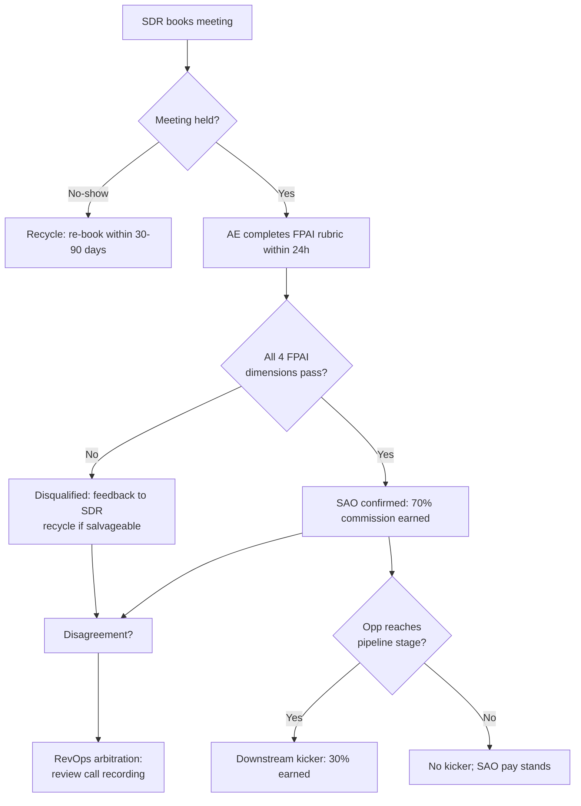

### Direct Answer

**Pay SDRs primarily on demos held + qualified — not on demos booked — but split the comp into two pieces so you protect activity without rewarding the wrong activity.** The cleanest 2026 structure is roughly **70% of variable comp on a held-and-qualified meeting (a Sales Accepted Opportunity, or SAO) and 30% on a downstream pipeline or revenue kicker.** Paying on "booked" alone is the single most common reason SDR comp plans rot: it pays the SDR the instant a calendar invite is accepted, which is the exact moment they have the least information about whether the meeting is real. The fix is not to police bookings harder — it is to move the money to the point in the funnel where quality is observable and verifiable: the meeting actually happened, an AE accepted it, and it met a written qualification bar.

**TL;DR**

- **Never pay 100% on booked.** It pays before quality is known and manufactures no-shows, soft-disqualifies, and "recycled" junk.
- **Pay on Sales Accepted Opportunity (SAO):** demo held + AE-accepted + meets a written, multi-factor qualification rubric. This is your primary unit.
- **Recommended split:** ~70% on SAO, ~30% on a pipeline-created or closed-won kicker so SDRs care about what happens after the handoff.
- **Per-SAO dollar value in 2026:** typically **$60–$120 for SMB/mid-market, $120–$250 for enterprise**, sized so variable comp lands at 35–45% of OTE at 100% of quota.
- **Held is a gate, not a payout.** Pay a small held bonus only if no-show rates are structurally high; otherwise fold "held" into the SAO definition.
- **The AE accept is the anti-collusion control.** It only works if AEs have no incentive to rubber-stamp and SDRs cannot retaliate.
- **Recycle within 30–90 days,** clawback on same-period reversals, and cap accepts-per-AE-per-week to kill gaming.
- **Instrument it:** booked→held, held→SAO, SAO→pipeline, and SAO→closed-won, sliced by SDR, AE, and source.

This answer walks through the funnel definitions, the exact math, the qualification rubric, the anti-gaming controls, segment-by-segment plans, the migration path from a booked plan, and the failure modes — with named operators and public data points throughout.

---

## 1. Why "Demos Booked" Is the Wrong Payout Trigger

The instinct to pay on booked demos is understandable. Booking a meeting is the most visible, most countable, most "SDR-owned" event in the funnel. It feels fair: the SDR did the work, the meeting is on the calendar, pay them. But booked is the wrong trigger for one structural reason — **it pays before quality is observable.**

- **A booked meeting is a promise, not an outcome.** At the moment a prospect accepts a calendar invite, you know almost nothing that matters: whether they will show, whether they have budget, whether they have a problem you solve, whether the person on the invite can buy. You are paying cash for an event whose value is still completely unknown.
- **You get exactly what you pay for, faster than you expect.** Comp plans are the most powerful behavior-shaping tool in a revenue org. Pay on booked and within one quarter you will see: meetings booked with low-fit titles, meetings booked with prospects who never agreed to a real conversation, "meetings" that are actually discovery calls relabeled, and a no-show rate that drifts from 15% toward 35%+. The SDR is not cheating — they are responding rationally to the scoreboard you built.
- **The cost lands on the AE.** Every junk booked demo consumes an AE's calendar slot, prep time, and follow-up. **The fully loaded cost of an enterprise AE hour in 2026 runs $150–$300** once you load salary, benefits, tooling, and ramp. Twelve junk demos a month per AE is a five-figure annual leak in pure opportunity cost — before you count the morale tax of an AE who stops trusting the SDR team.
- **It corrupts your forecast.** If "booked demo" is a pipeline-entry event, a booked-comp plan stuffs the top of funnel with meetings that will never convert. Your booked→closed-won rate craters, nobody trusts the top-of-funnel number, and finance starts discounting SDR-sourced pipeline by a guessed haircut — which means the SDR team's real wins also get discounted.

The deeper principle: **comp should pay as close as possible to the moment value is both created and verifiable.** Booked fails the verifiable test. Held is verifiable but not yet valuable (a meeting can happen and still be worthless). **SAO — held plus accepted plus qualified — is the first funnel stage that is both verifiable and a real proxy for value.** That is why it should carry the weight of the plan.

There is also a timing cost to paying on booked that is easy to miss. A booked plan pays the SDR *fastest* — sometimes the same week — which feels generous but is actually a trap. Fast pay on a not-yet-verified event means you are constantly paying out cash that you may later need to claw back when the meeting no-shows or disqualifies. You end up running a "pay early, correct later" cycle that maximizes both administrative overhead and SDR distrust. Paying at SAO costs you a short delay — typically days to two weeks between booked and the AE's accept — in exchange for paying *once*, on a *verified* event, with *no* clawback in the normal case. That trade is overwhelmingly worth it. A comp plan should pay slightly later and exactly right, not immediately and provisionally.

---

## 2. The Funnel Definitions You Must Lock Before You Write a Comp Plan

You cannot design SDR comp until five funnel stages are defined in writing, instrumented in the CRM, and agreed to by both Sales and Marketing leadership. Ambiguity here is where every dispute, every gamed plan, and every end-of-month comp argument comes from.

| Stage | Definition | Owner of the definition | Comp role |
|---|---|---|---|
| **Meeting Booked** | A prospect has accepted a calendar invite for a first call/demo | SDR ops | Tracked, not paid |
| **Meeting Held** | The meeting actually occurred with the right person; AE and prospect both attended | SDR ops + AE | Gate (sometimes a small bonus) |
| **SAO (Sales Accepted Opp)** | Held + AE formally accepts + meets a written qualification rubric | Sales leadership | **Primary payout unit** |
| **Pipeline / SQO** | SAO progresses to a real opportunity stage with an amount and close date | Sales leadership | Kicker |
| **Closed-Won** | The deal is signed | Finance | Optional secondary kicker |

A few rules about these definitions:

- **Write them down in one canonical document.** A comp plan that references "qualified demo" without a linked rubric is unenforceable and will be litigated every payday.
- **One stage = one CRM field with one owner.** SAO should be a single, auditable status change with a timestamp and an owner. If "accepted" lives in three places (a checkbox, a stage, and a Slack message), you cannot pay reliably or audit fairly.
- **The SDR cannot be the sole owner of any payable stage.** Booked is SDR-controlled, which is exactly why it is not payable. SAO requires an AE action specifically so the payable event is not self-serve.
- **Marketing and Sales must agree on SAO.** If marketing-sourced and SDR-sourced meetings use different SAO bars, you will get a turf war. One company, one SAO definition.

---

## 3. Held vs. Qualified: Two Different Gates, Two Different Jobs

"Demos held + qualified" is actually two gates bolted together, and conflating them causes design mistakes. Treat them separately.

### 3.1 Held is an attendance gate

"Held" means the meeting physically happened with the right people in the room. It protects against the no-show failure mode. But **a held meeting can still be completely worthless** — the prospect showed up, listened politely, and had no budget, no problem, and no authority. So "held" by itself is not a quality signal. It is necessary but nowhere near sufficient.

**Design choice on "held":**

- **Default: fold "held" into the SAO definition** and do not pay a separate held bonus. SAO already requires the meeting to have happened, so a standalone held payout is redundant.
- **Exception: if your no-show rate is structurally high** (long booking lead times, hard-to-reach personas, field/event-sourced meetings), add a **small held bonus — $15–$30** — purely to fund the chase: confirmation calls, reminder sequences, reschedule hustle. Keep it small enough that nobody games it.

### 3.2 Qualified is a fit-and-intent gate

"Qualified" means the meeting met a written bar on fit, problem, authority, and intent. This is the gate that actually correlates with revenue. **Qualified is the gate that should carry the money.** And "qualified" must never be one person's gut feel — it must be a rubric (Section 5).

### 3.3 The combined unit: SAO

When you combine "held" (it happened) with "qualified" (it met the bar) and "accepted" (an AE signed off), you get the **Sales Accepted Opportunity**. This is your primary payable unit. Phrased plainly for the comp doc: **an SDR earns the primary commission when a meeting they sourced is held, accepted by the AE, and meets the qualification rubric.**

---

## 4. The Recommended Comp Structure (the actual answer)

Here is the structure to implement, then the reasoning.

### 4.1 The split

- **~70% of SDR variable comp on SAO** (held + accepted + qualified). This is the engine.
- **~30% of SDR variable comp on a downstream kicker** — either pipeline created (an opportunity reaches a real stage with an amount) or closed-won revenue from SDR-sourced opportunities.
- **0% on booked.** Booked is a tracked activity metric and a coaching input, never a payout.
- **Optional: a small held bonus** ($15–$30) only in high-no-show environments, carved out of the 70% bucket — not added on top.

### 4.2 Why 70/30 and not 100/0 or 50/50

- **100% on SAO** makes the SDR indifferent to what happens after handoff. They will accept a low no-show rate and a borderline-passing qualification, then move on. You want them to care that the opportunity actually progresses.
- **50/50 (or heavier downstream)** pushes too much pay onto an outcome the SDR does not control. SDRs do not run the deal, set the price, or close. Tie half their pay to closed-won and you will get demoralized SDRs in any quarter the AE team underperforms — through no fault of the SDR. You will also lengthen the comp cycle painfully: an SDR who books in January should not wait until a June close to get paid for January's work.
- **70/30 keeps the SDR's primary scoreboard on something they substantially control (sourcing a real, qualified, accepted meeting) while still giving them a real stake in downstream quality.** It is the structure most repeatable, well-run SDR orgs converge on. Bridge Group's long-running SDR/sales-development research consistently shows quota-and-comp models anchored on qualified-opportunity creation rather than raw meeting counts in healthy orgs.

### 4.3 The dollar math

Work backward from On-Target Earnings (OTE).

- **Variable comp should be 35–45% of OTE for an SDR.** A 60/40 base/variable split is the common 2026 default; aggressive teams run 50/50, more conservative teams 70/30.
- **Worked example.** SDR OTE = $80,000. Use a 65/35 split → base $52,000, variable $28,000.
  - 70% of variable on SAO = **$19,600/year on SAOs.**
  - 30% of variable on the downstream kicker = **$8,400/year.**
- **Set the SAO quota.** Say the SAO quota is 14/month = 168/year.
  - Per-SAO commission at 100% attainment = $19,600 ÷ 168 ≈ **$117 per SAO.**
- **Downstream kicker.** If the SDR sources opportunities worth, say, $1.4M/year in pipeline at quota, the $8,400 kicker = **0.6% of sourced pipeline** — or, if you pay on closed-won instead, size it as a small percentage of SDR-sourced bookings.

**Typical 2026 per-SAO ranges, sanity-check band:**

| Segment | ACV band | Per-SAO commission | SAO quota/mo |
|---|---|---|---|
| SMB / Velocity | <$15k | $50–$90 | 16–22 |
| Mid-market | $15k–$60k | $90–$150 | 10–15 |
| Enterprise | $60k+ | $150–$250 | 6–10 |

The logic: higher-ACV segments have fewer, harder, more valuable meetings, so each SAO is worth more and the quota is lower. A single enterprise SAO can be worth six figures in pipeline; a velocity SAO is one of dozens. Comp should mirror that.

### 4.4 Accelerators and a floor

- **Accelerator past 100%.** Pay **1.2x–1.5x per SAO above quota.** An SDR who blows past quota with real, qualified meetings is your best ROI in the entire revenue org — overpay them deliberately. This mirrors how AE plans accelerate past quota.
- **No decelerator below quota** for SDRs. Decelerators on an entry-level role mostly drive attrition. Use coaching and performance management for underperformance, not a comp penalty spiral.
- **Consider a small monthly floor or guarantee during ramp** (months 1–3) so new SDRs are not punished for the pipeline-build lag.

---

## 5. The Qualification Rubric — the Heart of the Plan

"Qualified" cannot be a feeling. If it is subjective, the comp plan is unenforceable and you will spend every payday arbitrating disputes. Build a written rubric and make a passing score a hard requirement for SAO credit. A practical 2026 rubric, sales-methodology-agnostic but covering the four things that actually matter — **Fit, Problem, Authority, Intent (FPAI):**

| Dimension | What "passing" looks like | How it is verified |
|---|---|---|
| **Fit** | Right industry, right company size, right tech environment — inside ICP | Firmographic data on the account record |
| **Problem** | Prospect articulated a real pain your product addresses | AE call notes / recording |
| **Authority** | Attendee is a decision-maker or a credible, named champion with a path to one | Title + AE confirmation |
| **Intent** | Prospect agreed to a genuine evaluation conversation, not just "a chat" | Booking notes + meeting outcome |

Rules for the rubric:

- **Make it binary per dimension where you can.** "Is the attendee in ICP — yes/no." Binary checks are far harder to argue about than 1–5 scores.
- **Set a clear pass bar.** Common: **all four FPAI dimensions must pass** for SAO credit. Some teams allow 3-of-4 with a documented reason. Pick one and write it down.
- **The AE fills it out within 24 hours of the meeting,** while the call is fresh. A 24-hour SLA prevents the "I'll get to it" black hole that delays SDR pay.
- **Record the meetings.** Tools like **Gong** and **Clari** (which acquired **Wingman**), or **Salesloft**'s conversation intelligence, make every accept/reject auditable against the actual call. This is your single most powerful anti-gaming control — disputes get resolved by listening to the call, not by arguing.

---

## 6. Anti-Gaming Controls — the Part Most Plans Get Wrong

Every comp plan is a system under adversarial pressure. Smart, motivated people will optimize against whatever you measure. Design the controls before you launch, not after the first scandal.

### 6.1 The AE-accept is your primary control — but it needs its own controls

Putting "AE accepts" in the SAO definition is powerful because the person who pays the price for junk meetings is the person who gates the payout. But the accept itself can be corrupted two ways:

- **Collusion (rubber-stamping).** An AE who is friendly with an SDR, or who is desperate for pipeline coverage, accepts marginal meetings. **Counter-controls:** the FPAI rubric forces specific criteria so "accept" is not a mood; tie a slice of AE comp to opportunity *progression and win rate* so the AE pays a price for accepting junk; audit a random sample of accepts against call recordings monthly.
- **Retaliation / over-rejection.** An AE who dislikes an SDR, or who wants to clear their calendar, rejects legitimate meetings. **Counter-controls:** a fast arbitration path (Section 6.4); track reject rate *per AE* — an AE rejecting 40% when the team averages 15% is the anomaly, not the SDR; never let one AE both reject and have final say.

### 6.2 Clawbacks and recycles

- **Clawback within the same comp period.** If an SAO is reversed (the "qualified" opp turns out to be junk on the next call), the commission is clawed back **if caught within the same pay period.** Do not claw back across periods — it creates accounting chaos and an SDR who can never trust their paycheck.
- **Recycle, do not punish, no-shows.** A no-show is often not the SDR's fault. **Allow a re-book within a 30–90 day window** to still earn SAO credit when it eventually holds. This removes the incentive to over-book as insurance against no-shows.
- **De-dupe accounts.** Two SDRs booking the "same" account in the same window = one SAO, credited per a written tiebreak rule (usually first-touch or account ownership).

### 6.3 Caps that kill specific exploits

- **Cap accepts per AE per week.** If one AE can accept unlimited meetings from one SDR, you have built a collusion machine. A soft cap (e.g., 3 SAOs per SDR-AE pair per week) forces meetings to spread across the team.
- **Cap same-account SAOs.** One account should not generate five SAO payouts in a quarter from creative re-labeling of internal stakeholders.
- **Watch the booked→held and held→SAO ratios per SDR.** An SDR with a 95% booked rate but a 40% held rate is booking junk. An SDR with a high held rate but a 30% SAO rate is holding meetings that do not qualify. The ratios localize the problem.

### 6.4 The arbitration path

When an SDR and AE disagree on an accept/reject, there must be a **fast, neutral tiebreaker — RevOps or a sales manager — who reviews the call recording and rules within 48 hours.** Without this, disputes fester into team conflict and every payday becomes a negotiation. The arbitration path is also a data source: a pattern of overturned rejections from one AE is a management problem; a pattern of overturned accepts is too.

---

## 7. Segment-by-Segment Plans

The right plan changes with deal size, motion, and sales cycle. Three reference designs:

### 7.1 SMB / Velocity (ACV < $15k, short cycle)

- **Volume motion.** SAO quota high (16–22/month), per-SAO commission low ($50–$90).
- **Downstream kicker = closed-won** works here because cycles are short — the SDR books in week 1 and the deal can close in week 4-6, so a closed-won kicker pays inside the same quarter. Keep the kicker simple: a flat bonus per SDR-sourced closed-won deal.
- **Held bonus usually unnecessary** — short booking lead times mean low no-show rates.

### 7.2 Mid-Market (ACV $15k–$60k, 1–3 month cycle)

- **The 70/30 SAO + pipeline-kicker model is the cleanest fit.** Closed-won is too far away to motivate, so the 30% kicker pays on **pipeline created** (opp reaches a real stage with an amount).
- SAO quota 10–15/month, per-SAO $90–$150.
- FPAI rubric matters most here — mid-market is where "qualified" is most ambiguous and most worth nailing down.

### 7.3 Enterprise (ACV $60k+, 6–12 month cycle)

- **Low volume, high value.** SAO quota 6–10/month, per-SAO $150–$250.
- **Downstream kicker pays on pipeline / SQO, never closed-won** — a 9-month cycle means a closed-won kicker would pay an SDR for work done three quarters earlier, long after they may have been promoted to an AE seat.
- **Multi-threading credit.** Enterprise SAOs often involve several stakeholders; the rubric should reward a meeting that adds a *new buying-committee member* at a target account, not just a generic "demo."
- **Allocation-based / ABM overlay.** When SDRs are mapped to named accounts, layer a target-account multiplier so an SAO at a strategic account is worth more.

| Plan dimension | SMB / Velocity | Mid-Market | Enterprise |
|---|---|---|---|
| SAO quota / month | 16–22 | 10–15 | 6–10 |
| Per-SAO commission | $50–$90 | $90–$150 | $150–$250 |
| 30% kicker pays on | Closed-won | Pipeline created | Pipeline / SQO |
| Held bonus | Rarely | Optional | Sometimes (events) |
| Base/variable split | 60/40 | 60/40 or 65/35 | 65/35 or 70/30 |
| Accelerator past quota | 1.2x | 1.3x | 1.5x |

---

## 8. Migrating From a "Booked" Plan Without a Revolt

If you are reading this because your current plan pays on booked, do not flip the switch overnight. A mid-quarter comp change that cuts take-home pay is how you trigger SDR attrition. Run a controlled migration.

1. **Announce one full quarter ahead.** Comp changes need lead time. Tell the team the *why* — quality, AE trust, their own credibility with the forecast — not just the *what*.
2. **Run a shadow quarter.** Keep paying on booked, but *also* calculate what each SDR would have earned under the SAO plan. Show every SDR their two numbers side by side. This converts abstract fear into concrete data and surfaces plan-design bugs before they cost real money.
3. **Build the rubric and the CRM fields first.** Do not launch SAO comp until "accepted" is a single auditable field with a 24-hour AE SLA and call recording is in place. A plan you cannot audit is a plan you cannot defend.
4. **Hold OTE flat or raise it.** The migration should change *what* SDRs are paid for, not cut *how much* a good SDR earns. If your top SDRs would earn less under the new plan at the same performance, your per-SAO value is mis-sized — fix the math, not the people.
5. **Re-baseline quotas from real data.** Pull last quarter's actual booked→SAO conversion. If SDRs booked 30 and 18 would have been SAOs, the SAO quota is ~18, not 30. Setting it from the booked number sets people up to fail.
6. **Grandfather in-flight meetings.** Meetings booked under the old plan get paid under the old plan. Clean cutover date, no retroactive penalties.
7. **Over-communicate the first two paydays.** The first SAO-plan paycheck is where trust is won or lost. Have managers walk each SDR through their statement line by line.

---

## 9. Instrumentation — What to Build in the CRM and Dashboards

A comp plan you cannot measure is a comp plan you cannot run. Minimum instrumentation:

- **Five timestamped funnel fields:** booked_at, held_at, sao_at, pipeline_at, closed_won_at. Every payout and every audit derives from these.
- **The FPAI rubric as structured fields,** not a free-text note — four pass/fail fields plus an overall SAO flag.
- **An accept/reject owner and timestamp** on every meeting, with the AE's SLA clock visible.
- **Conversion dashboards** sliced by SDR, by AE, and by lead source: booked→held, held→SAO, SAO→pipeline, SAO→closed-won.
- **A live comp tracker** each SDR can see — SAOs to date, attainment %, projected payout. Surprise-free paydays are a retention feature.
- **A monthly audit sample:** pull 10–15 random SAOs, listen to the recordings, confirm the FPAI calls were honest. Publish that the audit happens — the deterrent is the point.

The 2026 stack that makes this routine: **Salesforce** or **HubSpot** as the system of record; **Gong**, **Clari** (with Wingman), or **Salesloft** for conversation intelligence and recording; **CaptivateIQ**, **QuotaPath**, **Spiff** (now part of Salesforce), or **Everstage** for automated commission calculation so payout math is never a spreadsheet someone hand-edits. Outbound execution platforms — **Outreach**, **Salesloft**, **Apollo.io** — should write activity and booking data back so booked→held is measured, not guessed.

---

## 10. Counter-Case: When Paying on Booked Is Actually Defensible

Intellectual honesty requires the other side. There are narrow situations where a booked-weighted plan is reasonable — temporarily.

- **A brand-new SDR team with no funnel history.** If you have zero data on booked→SAO conversion, you cannot set an SAO quota that is not a guess. Running a *booked-weighted* plan for one quarter to *collect the conversion data* is defensible — as long as everyone knows it is a temporary calibration phase with a hard sunset date.
- **A pure top-of-funnel "meeting-setter" role** that is genuinely decoupled from quality — for instance, an offshore appointment-setting function whose only job is volume, with a separate inside team doing all qualification. Even here, the better design is to pay the *qualifying* team on SAO and the setters on held; pure booked is still the weakest option.
- **Severe AE-capacity constraints distorting accepts.** If AEs are so overloaded they reject good meetings just to protect their calendars, an SAO plan will under-pay SDRs for reasons outside their control. But the right fix is to *solve the capacity problem* (hire AEs, fix routing), not to retreat to booked.
- **An extremely short, high-velocity, low-ACV motion** where booked and held are nearly the same event (instant-booked product demos that almost always hold). Here the gap between booked and held is small — but you still want a *qualified* gate, so the answer is "held + light qualification," not "booked."

In every one of these cases, booked-weighting is a **bridge, not a destination.** The moment you have conversion data and functioning AE capacity, move to SAO. If a "temporary" booked plan is still running a year later, it is no longer temporary — it is a quality problem you have stopped looking at.

One more honest concession: a *small* booked component — say 10% of variable comp — can be defensible as a deliberate **activity floor** during the first two quarters of a brand-new team, purely to keep raw outbound volume from collapsing while SDRs learn to qualify. Even here, treat it as training wheels with a written removal date. The danger is not the 10% itself; it is that the 10% quietly becomes 30% because a sales manager finds it the easiest lever to pull when monthly meeting counts dip. Any booked component must be in the plan document with an explicit sunset, reviewed every quarter, and defended by name — never allowed to drift upward by neglect.

---

## 11. Common Failure Modes (and the Fix)

| Failure mode | Symptom | Fix |
|---|---|---|
| **Subjective "qualified"** | Every payday is an argument | Written FPAI rubric, binary checks, call recordings |
| **AE rubber-stamping** | SAO→pipeline rate collapses | Tie AE comp to opp progression; audit accepts |
| **AE over-rejecting** | One AE's reject rate is 3x the team | Per-AE reject tracking; fast arbitration |
| **No-shows punished as SDR failure** | SDRs over-book as insurance | 30–90 day recycle window; small held bonus |
| **Cross-period clawback chaos** | SDRs distrust paychecks | Clawback only within the same pay period |
| **Quota set from booked data** | New SAO plan misses everywhere | Re-baseline from actual booked→SAO conversion |
| **100% on SAO** | SDRs indifferent to downstream junk | Add the 30% pipeline/closed-won kicker |
| **50%+ on closed-won** | SDRs demoralized in slow AE quarters | Cap downstream weight at ~30% |
| **Plan you cannot audit** | Disputes unresolvable | Single SAO field, timestamps, recordings before launch |
| **Mid-quarter switch** | Attrition spike | Announce a quarter ahead; shadow-calculate |

---

## 12. A 90-Day Rollout Checklist

- **Days 1–15:** Lock the five funnel definitions in writing. Get Sales and Marketing to sign off on one SAO definition. Draft the FPAI rubric.
- **Days 16–30:** Build the CRM fields (five timestamps, four rubric fields, accept owner + SLA). Turn on call recording. Configure the commission tool.
- **Days 31–45:** Pull historical booked→SAO conversion; set SAO quotas from real data. Size per-SAO commission so variable lands at 35–45% of OTE. Announce the new plan to the team with the *why*.
- **Days 46–75:** Run the shadow quarter — pay on the old plan, calculate the new plan in parallel, show every SDR both numbers. Fix design bugs.
- **Days 76–90:** Final plan review, finance sign-off, manager training on reading comp statements. Set the clean cutover date. Launch.

---

## 13. The Behavioral Economics Behind the Plan

It is worth spending real time on *why* comp plans bend behavior so reliably, because understanding the mechanism is what stops you from re-introducing the same bug six months later under a new name.

### 13.1 Goodhart's Law in the SDR seat

The economist Charles Goodhart's observation — **"when a measure becomes a target, it ceases to be a good measure"** — is the single most important idea in comp design. Booked demos are a perfectly good *measure* of SDR activity when nobody is paid on them. The moment you attach cash, the SDR's job silently changes from "create real meetings" to "create things that count as booked meetings," and those are not the same job. The booked number stops describing reality and starts describing the comp plan.

This is not a moral failing. It is the predictable, rational response of a person doing the job you incentivized. The lesson is not "find honest SDRs." The lesson is: **assume every metric you pay on will be optimized against, and only pay on metrics whose optimization you actually want.** You *want* SDRs to optimize for "held + accepted + qualified," because an SDR who games their way to more genuine SAOs has, by definition, done the job. You do *not* want them to optimize for "booked," because the cheapest way to inflate booked is to lower quality.

### 13.2 Proximity, controllability, and the comp-design triangle

Three forces pull against each other in every incentive design:

- **Proximity to value.** Pay close to where revenue is created. This pulls toward closed-won.
- **Controllability.** Pay on what the rep actually controls. For an SDR, this pulls toward booked/held — events they own end to end.
- **Verifiability.** Pay on what you can audit without disputes. This pulls toward objective, timestamped, single-owner events.

No single funnel stage maximizes all three. Booked wins on controllability, loses badly on proximity-to-value. Closed-won wins on proximity, loses on controllability. **SAO is the equilibrium point** — close enough to value to be meaningful, controllable enough to be fair (an SDR substantially controls whether the meetings they source are qualified), and verifiable if you build the rubric and recording. The 70/30 split is itself a triangle compromise: 70% at the equilibrium point, 30% nudged toward proximity-to-value so the SDR is not blind to downstream reality.

### 13.3 Loss aversion and clawbacks

Behavioral research — going back to Kahneman and Tversky's prospect theory — shows people feel a loss roughly twice as intensely as an equivalent gain. This is why clawbacks are so corrosive when done carelessly. An SDR who sees $117 appear and then vanish two pay periods later experiences that as a *punishment*, not a *correction*, even if the accounting is correct. The fix is not to abandon clawbacks — you need them — but to **make reversals fast and same-period.** A correction inside the same paycheck reads as "the number was still settling." A reversal three months later reads as "they took my money." Same outcome on the spreadsheet, completely different effect on trust and retention.

### 13.4 The fairness ceiling

There is a hard ceiling on how much downstream-outcome pay an SDR will tolerate before the plan feels *unfair* rather than *motivating*. SDRs watch AEs closely. They know which AEs close and which AEs fumble. If half an SDR's pay rides on closed-won and they get routed to a weak AE, they will correctly perceive the plan as a lottery rather than a meritocracy — and your best SDRs, the ones with options, leave first. Capping downstream weight at ~30% keeps the plan on the right side of the fairness ceiling: enough skin in the game to care, not so much that an SDR's income depends on a coworker they did not pick.

---

## 14. Worked Scenarios — Three SDRs, One Plan

Abstract math is easy to nod along to and hard to feel. Here are three SDRs running on the recommended mid-market plan (OTE $80k, 65/35 split, $19,600 SAO bucket, $8,400 pipeline kicker, 14 SAO/month quota = 168/year, ~$117 per SAO, 1.3x accelerator past quota, kicker = 0.6% of sourced pipeline).

### 14.1 Priya — the volume booker (a cautionary tale)

Priya books aggressively: 34 meetings a month, well above team average. Under the *old booked plan* she was the top earner. Under the *SAO plan*, her numbers tell a different story:

- Booked: 34/month → held: 21 (62% — she books a lot of soft "let's just chat" meetings that no-show).
- Held → SAO: 9 (43% — many held meetings fail the Fit or Intent dimension).
- **9 SAOs/month vs. a 14 quota = 64% attainment.** SAO pay ≈ $117 × 108 SAOs/year = **$12,636** against a $19,600 target.
- Her sourced pipeline is thin because her SAOs are borderline; kicker ≈ $4,000 against $8,400.
- **Total variable ≈ $16,600 vs. $28,000 target.**

This is the plan working exactly as intended. Priya is not a bad SDR — she is an SDR who was *trained by the old plan* to optimize the wrong thing. The shadow quarter would have shown her this gap before it hit her paycheck, giving her a quarter to shift from "book everything" to "book the right things." With coaching on FPAI pre-qualification, Priya's held and SAO rates climb the following quarter.

### 14.2 Marcus — the balanced performer

Marcus books fewer meetings but qualifies harder upfront:

- Booked: 22/month → held: 18 (82%) → SAO: 14 (78%).
- **14 SAOs/month = exactly 100% attainment.** SAO pay = $19,600.
- His SAOs are genuinely qualified, so they progress: sourced pipeline ≈ $1.4M, kicker ≈ $8,400.
- **Total variable = $28,000 — full OTE of $80k.**

Marcus is the SDR the plan is designed to produce: not the most *active*, the most *effective*. Note he books 12 fewer meetings a month than Priya and earns $11,400 more. That contrast, made visible on a dashboard, is the most powerful coaching tool you have.

### 14.3 Dana — the overachiever and the accelerator

Dana is a top performer in a strong territory:

- 16 SAOs/month average = 192/year vs. 168 quota.
- First 168 SAOs at $117 = $19,656. The 24 SAOs above quota at 1.3x ($152) = $3,648.
- **SAO pay ≈ $23,300** — and that overpayment is *correct*. Dana is generating real, qualified pipeline at a rate that is pure margin for the company.
- Strong SAOs → strong progression → sourced pipeline ≈ $1.7M → kicker ≈ $10,200.
- **Total variable ≈ $33,500 — 120% of OTE.**

Dana is exactly who the accelerator exists for. A plan that capped her at 100% would tell your best SDR that excellence is not worth pursuing — and Dana, with the best résumé on the team, is the easiest person for a competitor to poach. The accelerator is a retention tool disguised as a comp line.

| SDR | SAOs/mo | Attainment | SAO pay | Kicker | Total variable | % of OTE |
|---|---|---|---|---|---|---|
| Priya | 9 | 64% | $12,636 | $4,000 | $16,636 | 59% |
| Marcus | 14 | 100% | $19,600 | $8,400 | $28,000 | 100% |
| Dana | 16 | 114% | $23,304 | $10,200 | $33,504 | 120% |

---

## 15. How This Plan Interacts With the AE Comp Plan

An SDR comp plan never lives in isolation. It hands off to the AE plan, and if the two plans are not coherent the handoff becomes a battleground.

- **The AE-accept must be consequential for the AE.** If accepting a junk meeting costs the AE nothing, the accept gate is theater. Tie a meaningful slice of AE variable comp to **opportunity progression and win rate on SDR-sourced deals**, not just to closed-won on any source. An AE who rubber-stamps junk then watches their win rate sag is an AE who will start qualifying honestly at the accept step.
- **Avoid double-paying the same dollar twice without intent.** It is fine — and usually correct — for both the SDR (via the kicker) and the AE (via their quota) to be paid on the same closed-won deal; that is shared-credit by design. What is *not* fine is an unplanned, unbudgeted overlap that finance discovers at year-end. Model total cost-of-sale per deal across both plans before launch.
- **SDR-to-AE promotion path.** Most SDRs want to become AEs. A plan where SDRs earn closed-won kickers on long enterprise cycles creates an awkward situation: a promoted SDR is still collecting SDR kickers on deals from their old seat while ramping in the new one. For enterprise motions, paying the SDR kicker on *pipeline created* rather than closed-won cleanly avoids this — the SDR is fully paid out near the time of their work, and the promotion is a clean break.
- **Routing fairness.** If SDRs are paid partly on downstream outcomes, *routing* becomes a comp issue. Round-robin or skill-based routing must be transparent and seen to be fair, or SDRs will believe — sometimes correctly — that the routing algorithm, not their work, determined their paycheck.

---

## 16. Quarterly Plan Health Review — the Metrics That Tell You the Plan Is Working

Launching the plan is not the end. Review these signals every quarter:

- **Booked→SAO conversion, trending up.** If the plan is working, SDRs stop booking junk and the conversion rate climbs. A flat or falling rate means the rubric is being gamed or AEs are rubber-stamping.
- **No-show rate, trending down.** SAO comp removes the incentive to over-book; no-shows should fall as SDRs book fewer, better meetings.
- **SAO→pipeline and SAO→closed-won, stable or rising.** This is the proof that "qualified" actually means qualified. If SAOs are climbing but pipeline is not, your rubric pass-bar is too soft.
- **Per-SDR attainment distribution.** A healthy plan has most SDRs clustered near 80–120% of quota with a long right tail of overachievers. If everyone is at 130%+, the quota is too low and you are overpaying. If everyone is under 70%, the quota is too high or per-SAO value is mis-sized — and you have a retention bomb ticking. The shape of the distribution matters as much as the average: a plan where two stars carry the team and everyone else is underwater is not a healthy plan, it is a plan that is about to lose its middle and then its stars. Aim for a distribution where the *median* SDR is making real, motivating money — because the median SDR is who you must retain to have a team at all.
- **AE accept and reject rates by AE.** Tight clustering across AEs means the rubric is doing its job. Outliers in either direction are management conversations.
- **Comp as a percentage of SDR-sourced revenue.** This is the efficiency number finance cares about. If it drifts up, either the plan is being gamed or the funnel downstream of SAO has weakened.
- **Voluntary SDR attrition.** A plan that demoralizes people shows up here within two quarters. Cross-reference attrition against the attainment distribution — if your *high* performers are leaving, the accelerator or the OTE is uncompetitive.
- **Dispute volume at arbitration.** A spike means the rubric has an ambiguous dimension or a specific AE-SDR pair has a relationship problem. Falling dispute volume over the first two quarters is the sign the definitions have settled.
- **Ramp-time-to-first-SAO for new hires.** How long a new SDR takes to land their first qualified, accepted meeting is a leading indicator of both onboarding quality and plan clarity. If ramp is lengthening, either the rubric is too opaque for new hires to internalize or the territory mix has degraded. Track it cohort by cohort.
- **The "near-miss" rate.** Count meetings that held and were *rejected* at the rubric — failed exactly one FPAI dimension. A high near-miss rate is not necessarily bad; it can mean the rubric is doing real work. But if near-misses cluster on one dimension (say, Authority), that is a coaching theme for the whole team and possibly a sign the dimension's pass-bar is mis-calibrated. Use the near-miss data to tune both training and the rubric itself.

---

## 17. Edge Cases and How to Adjudicate Them

Real funnels are messy. Decide these in advance so they are policy, not improvisation:

- **Inbound meeting that an SDR merely confirms.** If marketing generated the lead and the SDR only confirmed the time, that is not a full SAO credit. Pay a reduced rate or none; reserve full SAO credit for SDR-sourced (outbound or SDR-qualified-inbound) meetings. Write the rule down.
- **An SAO that a different AE eventually closes.** Account ownership changes; territories get re-cut. The SDR's SAO credit and kicker should follow the *opportunity*, not the AE seat, with a documented snapshot at SAO time.
- **A meeting that qualifies months later.** A "not now" prospect re-engages and qualifies in a future quarter. Honor the recycle window (30–90 days) for SAO credit; beyond it, treat it as a fresh meeting. Pick a window and enforce it.
- **A demo with a champion who is not the decision-maker.** The FPAI Authority dimension allows "a credible, named champion with a path to a decision-maker." A champion-only meeting can pass — but the rubric note must name the champion and the path. A vague "they'll loop in their boss" does not pass.
- **Partner- or referral-sourced meetings the SDR coordinated.** Decide whether the SDR earns SAO credit for coordinating a partner referral. Usually yes at a reduced rate, since the SDR did real work but did not source the demand. Document it.
- **A held meeting where the prospect was clearly mis-sold the meeting's purpose.** If the call recording shows the prospect expected something other than an evaluation conversation, that is an Intent failure — disqualify, and coach the SDR. This is exactly the behavior a booked plan rewards and an SAO plan must catch.

---

## 18. Tooling Deep-Dive — Building the Plan So It Runs Itself

A comp plan that depends on a human exporting CSVs and reconciling spreadsheets every month will eventually break — not because the design is wrong, but because the operations are fragile. The 2026 stack lets you make the plan close to self-running. Here is how the pieces fit.

### 18.1 The system of record

**Salesforce** or **HubSpot** holds the five timestamped funnel fields and the FPAI rubric fields. Two non-negotiables:

- **Validation rules at the SAO field.** The CRM should refuse to flip a meeting to SAO unless all four FPAI fields are populated and an AE owner and timestamp are set. If the system enforces the definition, you do not have to.
- **Field history tracking on every payable field.** When an SAO is reversed, you need the audit trail: who changed it, when, from what. Field history is what makes a clawback defensible rather than a "trust me."

### 18.2 Conversation intelligence

**Gong**, **Clari** (which absorbed **Wingman**), and **Salesloft**'s conversation-intelligence layer record and transcribe every demo. This is the backbone of the anti-gaming program:

- **Every accept/reject is auditable against the actual call.** Arbitration stops being "she said / he said" and becomes "let us listen to minute 4."
- **Automated qualification signals.** Modern conversation tools surface whether budget, authority, and timeline were discussed. These are not a substitute for the AE's rubric judgment, but they flag SAOs worth auditing — e.g., an SAO where the recording shows authority was never mentioned.
- **Coaching loop.** The same recordings that audit the plan also coach the SDR. Priya from Section 14 improves because her manager can play her three calls that failed the Intent dimension and show her exactly what a passing booking conversation sounds like.

### 18.3 Incentive compensation management (ICM)

**CaptivateIQ**, **QuotaPath**, **Spiff** (now part of Salesforce), **Everstage**, and **Xactly** automate the commission math. Without an ICM tool, payout is a hand-built spreadsheet — and a hand-built spreadsheet is a source of errors, disputes, and one person who becomes a single point of failure. With one:

- **Payout is computed from CRM data automatically.** SAO count, attainment, accelerator tier, kicker — all derived from the funnel fields, no manual entry.
- **Every SDR gets a live, self-serve statement.** They see SAOs-to-date, attainment %, and projected payout in real time. Surprise-free paydays are a measurable retention lever.
- **Clawbacks and recycles are rules, not memory.** The tool applies the same-period clawback and the 30–90 day recycle window consistently, so the policy is enforced the same way for everyone.

### 18.4 Outbound execution platforms

**Outreach**, **Salesloft**, and **Apollo.io** run the SDR's sequences and — critically — write activity, booking, and outcome data back to the CRM. This is what makes booked→held measurable rather than guessed. If your booking data lives only in a calendar tool and never syncs, you cannot compute the conversion rates the plan depends on.

### 18.5 The integration test

Before launch, run one end-to-end test: a real SDR books a real meeting, the AE holds it and completes the rubric, the SAO flag flips, the ICM tool computes the commission, and the SDR sees it on their statement — all without anyone touching a spreadsheet. If that loop works for one meeting, it works for ten thousand. If it does not, fix the plumbing before you launch the plan.

---

## 19. What Great Looks Like — and What Failure Looks Like — Twelve Months In

To make the target concrete, here is the contrast between a healthy SAO plan and a failed one a year after launch.

### 19.1 The healthy plan at month 12

- **The booked→SAO conversion rate has climbed** from wherever it started toward a stable band, because SDRs stopped booking junk.
- **The no-show rate has fallen.** Fewer, better meetings hold more reliably.
- **AEs trust SDR-sourced pipeline.** The forecast no longer applies a mental haircut to SDR meetings, and the relationship between the teams is collaborative rather than adversarial.
- **Comp disputes are rare.** The rubric and recordings resolve disagreements quickly; arbitration handles a handful of genuine edge cases a quarter, not a flood.
- **The attainment distribution is healthy** — most SDRs clustered near quota, a real right tail of overachievers earning accelerators.
- **Finance can predict cost-of-sale.** Comp as a percentage of SDR-sourced revenue is stable and budgeted.
- **SDRs can articulate the plan.** Ask any SDR how they get paid and they give the same answer: held, accepted, qualified — that is the SAO — plus a kicker when it turns into pipeline. A plan everyone understands is a plan that works.

### 19.2 The failed plan at month 12

- **"Qualified" was never written down,** so every payday is a negotiation and the definition has quietly drifted to "whatever the AE felt like that day."
- **AEs are rubber-stamping** because their comp does not punish junk accepts, so SAO count is up but SAO→pipeline conversion has collapsed — the plan is paying booked-quality meetings under an SAO label.
- **Or AEs are over-rejecting** because there is no fast arbitration path, SDRs feel cheated, and the best SDRs have left.
- **Clawbacks span pay periods,** so SDRs do not trust their paychecks and treat the comp number as fiction.
- **Quotas were set from the old booked numbers,** so attainment is universally low and morale is on the floor.
- **The plan still secretly pays on booked** because someone added a "booking bonus" to placate the team during the migration, and the junk-meeting problem the migration was meant to solve is fully back.

The difference between these two outcomes is almost never the headline structure — both companies "pay on qualified demos." The difference is entirely in the execution: the written rubric, the AE-side incentive, the same-period clawback, the arbitration path, the data-driven quota, and the discipline to never let "booked" creep back into the payout. **The structure in this answer is necessary but not sufficient. The controls are what make it real.**

---

## 20. Frequently Asked Follow-Ups

**"My SDRs say the SAO plan makes their pay depend on AEs they cannot control. Are they right?"**
Partly — which is why downstream weight is capped at 30% and the *primary* 70% rides on SAO, which the SDR substantially controls (they choose which meetings to source and how well to qualify them upfront). The AE-accept is a gate, not a lottery: a genuinely qualified meeting should pass for any honest AE. If SDRs feel the accept is arbitrary, your rubric is too subjective or a specific AE is an outlier — fix that, do not retreat to booked.

**"Should marketing-sourced meetings count toward an SDR's SAO quota?"**
Only if the SDR did real qualification work on them. A pure calendar-confirm of a marketing lead is not a full SAO. Either exclude inbound from the SDR quota entirely or pay a reduced rate — and write the rule down so it is not re-litigated.

**"What about a held bonus — yes or no?"**
Default no; fold "held" into the SAO definition. Add a small held bonus ($15–$30) *only* if your no-show rate is structurally high because of long booking lead times or hard-to-reach personas. Keep it small enough that nobody books junk to farm it.

**"How fast should I migrate off a booked plan?"**
One full quarter of notice, plus a shadow quarter where you pay the old plan but calculate the new one in parallel. Never cut SDR take-home pay mid-quarter — that is how you trigger attrition.

**"Is 70/30 a hard rule?"**
No — it is the most common healthy equilibrium. Velocity teams sometimes run 75/25 or 80/20 because closed-won is close enough to motivate directly; enterprise teams sometimes run 70/30 with the kicker firmly on pipeline, never closed-won. What *is* close to a hard rule: never 100% on SAO (SDRs go blind to downstream junk) and never more than ~35% downstream (the fairness ceiling).

**"Can I just pay on booked but add a clawback for no-shows and disqualifications?"**
This is a booked plan wearing an SAO costume, and it inherits the worst of both: it pays before quality is known, *then* yanks the money back later — maximizing loss aversion and distrust. Pay at SAO in the first place. Do not pay early and claw back; pay at the right time.

---

## 21. The Bottom Line

**Do not pay SDRs on demos booked. Pay them on demos held + qualified — operationalized as the Sales Accepted Opportunity — with roughly 70% of variable comp on SAO and 30% on a downstream pipeline or revenue kicker.** Booked pays before quality is knowable and reliably manufactures the exact junk it rewards. SAO pays at the first funnel stage that is both verifiable and a genuine proxy for value: the meeting happened, an AE accepted it, and it cleared a written FPAI rubric. Wrap it in real anti-gaming controls — the AE-accept gate with its own collusion and retaliation counter-controls, same-period clawbacks, 30–90 day recycles, per-pair caps, and a fast neutral arbitration path. Size the dollars so variable comp is 35–45% of OTE, set quotas from actual conversion data, and migrate off any legacy booked plan with a full quarter of notice and a shadow-calculated quarter. Get this right and the SDR comp plan stops being a monthly argument and becomes what it should be: the cleanest, highest-ROI lever in the entire revenue org.

---

### Related Pulse RevOps entries

- *How should I structure SDR commission to discourage gaming MQL counts?* (q02) — the upstream sibling problem: gaming MQLs vs. gaming demos share a root cause.
- *What's the right SPIFF cadence to drive end-of-quarter pipeline pull-ins?* (q10) — short-term incentives layered on the base SDR plan.
- *What's a fair OTE for an enterprise AE selling $100k+ ACV deals in 2026?* (q01) — the AE side of the comp design that the SDR plan must hand off to.
- *What accelerator multiples are typical past 100% of quota for SaaS AEs?* (q05) — accelerator design that the SDR plan mirrors.

### Sources & Further Reading

1. The Bridge Group — annual SDR / Sales Development Metrics & Compensation research.
2. The Bridge Group — Inside Sales / AE Compensation reports.
3. SiriusDecisions / Forrester — demand waterfall and lead-stage definitions (MQL, SAL, SAO, SQO).
4. Forrester — B2B revenue waterfall updates and opportunity-stage frameworks.
5. Gartner — sales compensation design and quota-setting research.
6. Gartner — Chief Sales Officer research on SDR-to-AE handoff quality.
7. WorldatWork — sales compensation plan design surveys.
8. Alexander Group — sales compensation benchmarking and plan structure.
9. RevOps Co-op community — SDR comp plan templates and benchmarks.
10. Pavilion (formerly Revenue Collective) — operator benchmarks on SDR pay and quota.
11. SaaStr — Jason Lemkin essays on SDR comp and the "pay on qualified" principle.
12. Sales Hacker — practitioner guides on SDR compensation and meeting-quality gating.
13. Gong Labs — conversation-intelligence research on demo quality and outcomes.
14. Clari — research on pipeline integrity and opportunity definitions.
15. Salesloft — sales engagement benchmarks and SDR activity research.
16. Outreach — outbound benchmark reports.
17. Apollo.io — outbound and meeting-rate benchmark data.
18. CaptivateIQ — sales commission design content and ICM best practices.
19. QuotaPath — SDR compensation plan templates and OTE guides.
20. Spiff (Salesforce) — commission automation and plan-design resources.
21. Everstage — sales commission benchmarks and plan examples.
22. Xactly — incentive compensation benchmarking data.
23. Harvard Business Review — research on motivation, incentive design, and gaming of metrics.
24. "Goodhart's Law" literature — when a measure becomes a target it ceases to be a good measure.
25. Tom Tunguz (Theory Ventures) — SaaS GTM efficiency and SDR economics analysis.
26. David Skok, "For Entrepreneurs" — SaaS metrics, funnel conversion, and CAC.
27. OpenView Partners — SaaS benchmarks on sales-development productivity.
28. KeyBanc Capital Markets — annual SaaS Survey, GTM and sales-efficiency metrics.
29. ICONIQ Growth — Topline Growth and GTM benchmarking reports.
30. Bessemer Venture Partners — State of the Cloud and efficient-growth GTM benchmarks.
31. Winning by Design — SaaS funnel math and the "bowtie" revenue model.
32. CSO Insights / Korn Ferry — sales performance and quota-attainment studies.
