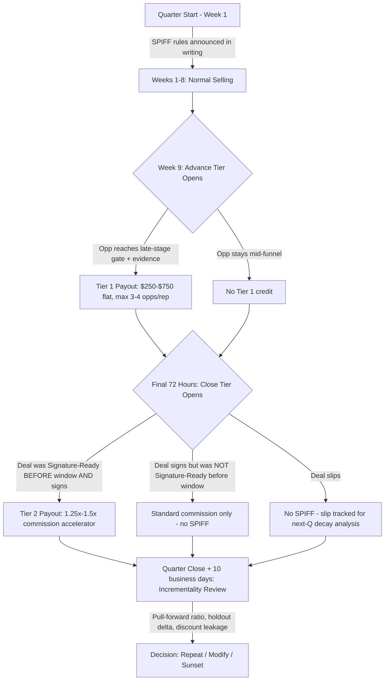

### Direct Answer

The right SPIFF cadence to drive end-of-quarter pipeline pull-in is a **narrow, pre-announced, escalating-window incentive that fires only in the final 3 to 4 weeks of the quarter, rewards verifiable pipeline-stage progression rather than raw bookings, and is funded at 1.5% to 3% of the incremental gross margin it actually pulls forward.** In practice, the highest-performing RevOps teams in 2026 run a two-tier SPIFF: a **Week-9-through-Week-11 "advance" tier** that pays $250 to $750 per opportunity moved to a late-stage gate (verbal, procurement, or signature-ready), and a **final-72-hours "close" tier** that pays an accelerator multiple — typically 1.25x to 1.5x of standard commission — on deals that actually sign before the quarter-end timestamp. The cadence is announced at the start of the quarter, not improvised in Week 10, because a SPIFF discovered late is a SPIFF that only rewards luck. Critically, the program must be capped, margin-gated, and instrumented so RevOps can prove — within ten business days of quarter close — whether the spend pulled real revenue forward or simply paid reps for deals that would have closed anyway. If you cannot answer that question, you do not have a SPIFF program; you have a discretionary bonus with a marketing name.

**TL;DR**

- **Cadence beats size.** A predictable, pre-announced escalating window outperforms a large surprise bonus because reps can plan their pipeline motion around it.
- **Pay for stage progression, not just bookings.** The "advance" tier de-risks the quarter by rewarding mid-funnel movement two to three weeks before the close scramble.
- **Fund from incremental margin, not headline ACV.** Budget 1.5% to 3% of the gross margin you genuinely expect to pull forward; cap total program spend at a board-approved number.
- **Measure incrementality or stop running it.** Use a holdout segment, a pull-forward ratio, and a "borrowed from next quarter" decay analysis. Most SPIFFs that feel successful are 40% to 70% pull-forward of deals that would have landed anyway.
- **Beware the discount-leakage tax.** Time-boxed SPIFFs quietly push reps to discount harder to hit the timestamp; instrument net ASP and discount depth alongside close rate.
- **Sunset deliberately.** A SPIFF that runs every quarter stops being an incentive and becomes salary; rotate mechanics, vary tiers, and skip a quarter occasionally.

---

## Why "Cadence" Is the Word That Matters in This Question

Most leaders ask "how big should the SPIFF be?" That is the wrong first question. The variable that determines whether a quarter-end SPIFF works is **cadence** — the timing, predictability, and rhythm of the incentive — not its dollar magnitude. A $1,000 SPIFF announced on the Tuesday of Week 11 changes almost nothing, because the deals that could have been pulled in were already either committed or dead. The same $1,000, announced in Week 1 with a clearly defined escalating window, changes how a rep sequences discovery calls, schedules security reviews, and times their procurement nudges across all twelve weeks of the quarter.

Cadence works because of three behavioral mechanics that every RevOps leader should be able to name:

1. **Anticipation shapes pipeline construction.** When a rep knows in Week 1 that Weeks 9 through 12 carry an incentive, they build their pipeline so that closeable deals are *available* to be pulled. They schedule the proof-of-concept to end in Week 8, not Week 13. The SPIFF's value is realized weeks before it pays out.
2. **Escalation creates urgency without panic.** A flat SPIFF that pays the same in Week 9 and Week 12 gives no reason to act early. An escalating structure — or better, a structure that *de-escalates* the easy money and concentrates the accelerator at the very end — pulls effort forward in a controlled way.
3. **Predictability defeats gaming.** Surprise SPIFFs reward reps who happen to have a deal in the right place. Predictable SPIFFs reward reps who *built* a deal into the right place. The second behavior is the one you want to pay for.

The rest of this answer is organized around that thesis: get the cadence right first, then layer in the dollar mechanics, the funding model, the measurement framework, and the failure modes.

---

## The Quarter-End Pull-In Problem, Defined Precisely

"Pull-in" means accelerating a deal that would otherwise close in a future period into the current period. It is distinct from three things it is frequently confused with:

- **Net-new generation** — creating pipeline that did not exist. SPIFFs are poor tools for this; the sales cycle is too long for a 3-week incentive to manufacture and close a deal.
- **Save motion** — preventing a deal from slipping. This overlaps with pull-in but is defensive; a good SPIFF does both.
- **Sandbagging reversal** — surfacing deals reps were intentionally holding for next quarter to protect their own quota attainment timing. This is the *hidden* target of most quarter-end SPIFFs, and it is worth being honest about it.

The financial logic of pull-in is subtle. Pulling a deal forward one quarter does not create new lifetime revenue; it changes *when* the revenue is recognized and *which* period's quota it serves. The legitimate reasons a company pays for that timing shift are:

1. **Board and investor optics.** A clean linearity story — predictable bookings each quarter rather than a hockey-stick — materially affects valuation multiples and fundraising terms.
2. **Cash timing.** Earlier signature means earlier invoicing, earlier collection, and a healthier cash runway, which is non-trivial for any company not sitting on excess cash.
3. **Compounding on usage and expansion.** A deal that starts in Q1 begins its expansion and usage-growth clock a quarter earlier than the same deal starting in Q2.
4. **Competitive denial.** A signed contract this quarter is a competitor's lost opportunity; an open deal can still be lost.

Those four reasons are real, but they are *bounded* in value. They justify spending some money to pull deals forward — they do not justify spending unlimited money, and they certainly do not justify pulling a deal forward at the cost of a deeper discount that permanently lowers ASP. Hold that tension in mind; it governs every funding decision below.

---

## The Recommended Cadence: A Two-Tier, Pre-Announced Escalating Window

Here is the concrete structure that the strongest RevOps teams converge on. Treat it as a starting template, not gospel — but deviate deliberately.

### Tier 1 — The "Advance" SPIFF (Weeks 9 to 11)

**Purpose:** De-risk the quarter by getting deals into late stages *before* the final-week scramble.

- **Trigger:** An opportunity moves from a mid-funnel stage into a defined **late-stage gate** — typically "Verbal Commit," "In Procurement," or "Signature-Ready" — with verification evidence attached (a recorded verbal, a procurement contact, or a redlined contract).
- **Payout:** A **flat per-opportunity bonus** of $250 to $750, depending on ACV band. Flat, not percentage, because this tier rewards *motion*, and you do not want reps ignoring smaller deals.
- **Cap:** No more than 3 to 4 qualifying opportunities per rep per quarter count toward Tier 1. This prevents a rep from stage-stuffing every deal they own.
- **Why Weeks 9 to 11:** Early enough that a deal reaching "Signature-Ready" still has runway to actually close in-quarter; late enough that the rep is genuinely in the closing motion.

The Advance tier is the unsung hero of the structure. It moves the company's *risk* forward by two to three weeks. A pipeline that is mostly late-stage on the Friday of Week 11 is a quarter you can forecast with confidence; a pipeline that is mid-stage on that Friday is a coin flip.

### Tier 2 — The "Close" SPIFF (Final 72 Hours)

**Purpose:** Convert signature-ready deals into signed contracts before the quarter-end timestamp.

- **Trigger:** A deal that was at "Signature-Ready" as of the start of the final 72-hour window actually signs before the cutoff.
- **Payout:** An **accelerator multiple** — 1.25x to 1.5x of the rep's standard commission rate on that deal. Percentage-based here, because at the moment of close you *want* reps fighting hardest for the biggest deals.
- **Eligibility gate:** The deal must have been at Signature-Ready *before* the window opened. This is the single most important anti-gaming rule in the entire program — it prevents reps from pricing a discount on Day 1 of the window and calling it a "pull-in."
- **Cap:** Total Tier 2 payout per rep capped at a defined ceiling (commonly 0.5x of the rep's quarterly variable target).

### Why Two Tiers and Not One

A single close-only SPIFF rewards deals that were *already* going to close — you pay a premium for outcomes you would have gotten free. A single advance-only SPIFF rewards motion that may never convert — you pay for deals that stall at Signature-Ready and slip anyway. The two tiers together create a **funnel-shaped incentive**: broad and cheap at the top (advance), narrow and expensive at the bottom (close), with the bottom tier *gated* on having qualified for a late stage before the close window. That gating is what makes the program pay for genuine pull-in rather than for luck.

---

## A Visual Model of the Cadence

The diagram makes the central design choice visible: the only path to the expensive Tier 2 payout runs *through* a pre-window Signature-Ready state. You cannot buy your way into the accelerator with a last-minute discount.

---

## The Funding Model: Pay From Incremental Margin, Not Headline ACV

A SPIFF budget anchored to bookings is a budget that grows fastest exactly when it should grow slowest. Anchor it to **incremental gross margin pulled forward** instead.

### Step-by-step funding calculation

1. **Estimate the pull-forward pool.** From the prior 4 to 6 quarters, calculate the median dollar value of deals that historically closed within 30 days *after* quarter-end. That early-next-quarter cohort is your realistic pull-in target. Suppose it is $1.2M in ACV.
2. **Apply a realistic capture rate.** You will not pull all of it. A well-run SPIFF pulls forward 25% to 45% of that cohort. Use 35% as a planning midpoint: $420K of ACV genuinely accelerated.
3. **Convert to gross margin.** At a typical SaaS gross margin of ~80%, that is roughly $336K of gross margin pulled forward.
4. **Size the SPIFF at 1.5% to 3% of that margin.** That yields a program budget of roughly $5K to $10K for the quarter.
5. **Hard-cap it.** Set a board-visible ceiling — say $12K — above which the program auto-stops, regardless of how many deals qualify. A SPIFF without a cap is an open-ended liability.

### Funding model comparison

| Funding basis | How budget is set | Risk profile | Verdict |
|---|---|---|---|
| % of headline ACV closed | Pay X% of every SPIFF deal's ACV | Budget balloons with success; rewards deals that would have closed anyway | Avoid |
| Flat discretionary pool | Fixed dollar pot, first-come | Predictable spend, but no link to value created | Acceptable as a fallback |
| % of incremental margin pulled forward | Modeled from pull-forward pool x capture rate x margin | Spend scales with genuine value; requires measurement discipline | **Recommended** |
| Per-deal flat + capped accelerator | Tier 1 flat + Tier 2 multiple, both capped | Predictable ceiling, behaviorally precise | **Recommended (operational form)** |

The recommended approach in the table's last two rows is the same philosophy expressed two ways: model the budget from incremental margin, then *operationalize* it as a capped flat-plus-accelerator structure so individual reps see clean, simple rules.

---

## Payout Mechanics by Deal Band

One flat number across all deal sizes distorts behavior. Reps chase whatever the SPIFF over-rewards relative to effort. Band the payouts:

| ACV band | Tier 1 "Advance" flat payout | Tier 2 "Close" accelerator | Rationale |
|---|---|---|---|
| < $15K (velocity / SMB) | $250 | 1.25x commission | Short cycles; modest nudge is enough |
| $15K - $50K (mid-market) | $500 | 1.35x commission | The sweet spot for genuine pull-in |
| $50K - $150K (enterprise core) | $750 | 1.5x commission | Longer cycles; bigger nudge justified by margin |
| > $150K (strategic) | $750 (capped) | Standard commission only | Strategic deals should NOT be rushed for a SPIFF |

The last row is deliberate and important: **strategic deals are explicitly excluded from the close-tier accelerator.** A $250K deal pulled in three weeks early at the cost of a rushed security review or a panic discount is a bad trade. Large deals should close when they are ready. The SPIFF's job is to accelerate the *mid-market core* — the band where a modest, well-timed nudge produces genuine, low-regret pull-in.

---

## Measuring Incrementality: The Part Almost Everyone Skips

A SPIFF "feels" successful because Week 12 bookings spike. That spike proves nothing. The spike happens every quarter with or without a SPIFF, because deals naturally cluster at period boundaries. The only question that matters is: **did the SPIFF cause revenue to arrive earlier than it otherwise would have, and was that timing shift worth what you paid?**

### The three measurements that answer it

**1. The pull-forward ratio.** Of the deals that closed in the final three weeks under the SPIFF, what fraction had a *pre-SPIFF* expected close date in the *following* quarter? Pull historical close-date forecasts from before Week 9. If 70% of "SPIFF deals" already had an in-quarter forecast, the SPIFF paid for 70% of its deals to do what they were already going to do. A healthy program shows a pull-forward ratio of 35% to 55% — meaning a real but honest minority of deals were genuinely accelerated.

**2. The holdout delta.** Where territory structure allows, withhold the SPIFF from a comparable segment — one region, one segment, one pod — and compare quarter-end pull-in rates against the SPIFF'd group. The difference is your cleanest causal estimate. Many companies resist this because it feels unfair to the holdout reps; mitigate by rotating which segment is the holdout each quarter and being transparent that it is a measurement practice, not a penalty.

**3. The next-quarter decay check.** Run this 30 to 45 days into the *following* quarter. If the SPIFF genuinely pulled deals forward, the start of the next quarter should look *thinner* — you borrowed from it. If next quarter starts just as strong, you did not pull deals forward; you simply paid extra for normal close behavior, and the "pull-in" was an illusion. This is the measurement that most exposes a SPIFF that is quietly just a bonus.

### SPIFF scorecard template

| Metric | Definition | Healthy range | Red flag |
|---|---|---|---|
| Pull-forward ratio | % of SPIFF deals with prior-quarter pre-SPIFF forecast | 35% - 55% | > 70% (paying for nothing) |
| Holdout delta | SPIFF-group pull-in rate minus holdout pull-in rate | +8 to +20 pts | < +5 pts (no causal effect) |
| Next-Q decay | Drop in next-Q week-1-to-4 bookings vs. trailing avg | Visible dip | No dip (no real pull-in) |
| Discount leakage | Change in net ASP / discount depth on SPIFF deals | < 2 pts deeper | > 5 pts deeper (margin destruction) |
| Cost per pulled dollar | Total SPIFF spend / incremental margin genuinely pulled | < $0.03 per $1 | > $0.06 per $1 |
| Slip-back rate | SPIFF deals that signed but later churned/clawed back in 90 days | < 3% | > 8% (rushed, bad-fit deals) |

If you run only one of these, run the **next-quarter decay check** — it is the cheapest to compute and the hardest to fool.

---

## Counter-Case: When You Should NOT Run a Quarter-End SPIFF

A genuinely useful answer has to name the conditions under which the recommended structure is the *wrong* move. There are at least five.

1. **You sell primarily on long enterprise cycles.** If your median sales cycle is 9+ months and your deals are six- and seven-figure strategic agreements, a 3-week SPIFF cannot meaningfully accelerate them — and the pressure to rush a strategic deal does real damage. For these motions, invest in deal-desk support and executive sponsorship, not SPIFFs.

2. **Your forecast is already linear.** SPIFFs exist to fix lumpiness. If your bookings already arrive smoothly across the quarter, a quarter-end SPIFF will *create* the very end-loading you do not currently have, training reps to hold deals for the incentive window.

3. **You have a discounting problem.** If discount depth is already a board-level concern, a time-boxed SPIFF will make it worse. Reps under timestamp pressure trade price for speed every time. Fix discounting discipline first.

4. **The SPIFF has run every quarter for a year.** At that point it is not an incentive — it is deferred salary that reps have priced into their expectations. The pull-in effect has fully decayed. The fix is to *sunset* it for a quarter or two, then reintroduce it with different mechanics so it regains its signal.

5. **You cannot measure incrementality.** If your CRM cannot reconstruct pre-Week-9 close-date forecasts, you have no way to compute the pull-forward ratio, and you will never know if the program works. Build the measurement capability first, then launch the SPIFF. A SPIFF you cannot evaluate is a SPIFF you should not run.

The honest summary: a quarter-end pull-in SPIFF is a **precision tool for a velocity-to-mid-market motion with a measurable, lumpy pipeline.** Outside that envelope, the recommended structure is at best wasted money and at worst actively harmful.

---

## The Discount-Leakage Tax: The Hidden Cost Most Teams Miss

The most underestimated cost of a quarter-end SPIFF is not the SPIFF spend itself — it is the **discounting it silently induces.** When a rep is staring at a 1.5x accelerator that evaporates at the quarter-end timestamp, the fastest lever to get a signature is price. A buyer who senses the rep's urgency — and experienced buyers always sense it — will extract a concession.

Model it concretely. Suppose your SPIFF costs $8K for the quarter and pulls forward $336K of gross margin. That looks like an excellent trade — until you notice that net ASP on SPIFF deals ran 4 points lower than non-SPIFF deals. On $420K of accelerated ACV, four points of additional discount is roughly $17K of permanently surrendered revenue — and unlike the one-time SPIFF cost, that discount often *anchors the renewal*. The deal you "won" with the SPIFF now renews at the discounted rate forever.

Mitigations:

- **Floor the discount.** Pair the SPIFF with a hard rule that any discount beyond the standard approval threshold *disqualifies* the deal from Tier 2. The accelerator and the discount approval become mutually exclusive.
- **Reward net ASP, not gross ACV.** Compute Tier 2 commission on net (post-discount) value, so a deeper discount directly shrinks the rep's accelerator. Align the incentive with the margin you actually keep.
- **Track it explicitly.** Put "discount depth on SPIFF deals vs. non-SPIFF deals" on the scorecard (it is already in the table above) and review it every quarter. What gets measured gets defended.

A SPIFF that pulls revenue forward while quietly lowering ASP is not a win; it is a loan against future renewal revenue, taken at a bad interest rate.

---

## Anti-Gaming Design: Six Rules That Keep the Program Honest

SPIFFs are gamed wherever the rules permit it. Build these six constraints in from day one:

1. **Pre-window state gating.** Tier 2 eligibility requires the deal to have been Signature-Ready *before* the close window opened. This single rule defeats the most common game — pricing a discount inside the window and calling the result a pull-in.
2. **Evidence requirements.** Tier 1 stage credit requires attached verification (recorded verbal, procurement contact, redline). No evidence, no credit. This stops stage-stuffing.
3. **Per-rep caps on both tiers.** Caps prevent a single rep from converting the SPIFF into an uncapped bonus by funneling every opportunity into it.
4. **Clawback on early churn.** Any SPIFF deal that churns or is clawed back within 90 days forfeits the SPIFF payout. This kills the incentive to rush bad-fit deals across the line.
5. **Manager attestation.** A frontline manager must attest that each Tier 2 deal's close timing was genuine, not a paperwork backdate. Backdating is fraud; make a human sign their name to the timing.
6. **Written, pre-announced rules.** All mechanics published at quarter start, in writing, with no mid-quarter changes. A rule changed in Week 10 to "help a deal qualify" destroys the program's credibility and invites every rep to lobby for exceptions next time.

---

## Sequencing the Rollout: A Quarter-by-Quarter Plan

A pull-in SPIFF should be introduced deliberately, not switched on overnight.

- **Quarter 0 (pre-launch):** Build the measurement plumbing. Confirm your CRM can snapshot close-date forecasts as of Week 9. Define the late-stage gates and their evidence requirements. Get the budget cap board-approved. Identify the holdout segment.
- **Quarter 1 (pilot):** Run the two-tier structure in a subset of the team or one region, with the holdout for comparison. Keep payouts at the conservative end of the bands. Communicate the rules in writing in Week 1.
- **Quarter 1 close + 10 days:** Run the full scorecard. Compute pull-forward ratio, holdout delta, discount leakage, and cost per pulled dollar.
- **Quarter 2 (calibrate):** Adjust band payouts based on Q1 data. If pull-forward ratio was above 70%, the SPIFF is too generous on deals that would have closed anyway — tighten the pre-window gate or lower Tier 2. If the holdout delta was below +5 points, the SPIFF is not causing pull-in — reconsider whether to continue.
- **Quarter 3+ (rotate and sunset):** Vary the mechanics each quarter — change the window length, swap flat-for-accelerator emphasis — and skip at least one quarter per year so the incentive does not decay into expected salary.

---

## Worked Example: A Mid-Market SaaS Team

Consider a mid-market SaaS company, ~$28M ARR, 14 AEs, median ACV $32K, median cycle 75 days, historically lumpy with ~45% of quarterly bookings landing in Weeks 11 and 12.

- **Pull-forward pool:** Trailing-6-quarter median of deals closing within 30 days *after* quarter-end: $1.1M ACV.
- **Planning capture rate:** 35% → $385K ACV targeted for genuine pull-in.
- **Gross margin:** 81% → $312K margin pulled forward.
- **SPIFF budget:** 2.4% of pulled margin → ~$7.5K, hard-capped at $11K.
- **Structure:** Tier 1 advance at $500/opp (mid-market band), max 3 opps/rep; Tier 2 accelerator at 1.35x, capped at 0.5x of quarterly variable; strategic deals excluded.
- **Holdout:** One of three pods runs without the SPIFF.

**Quarter-close result:** SPIFF group pulled in 31% of the post-quarter cohort; holdout pulled in 19%. Holdout delta: +12 points — a genuine, real causal effect. Pull-forward ratio: 48% — healthy. Discount leakage: 1.6 points deeper — within tolerance. Cost per pulled dollar of margin: $0.024. Next-quarter weeks 1 to 4 came in ~9% below trailing average — confirming real borrowing from the future.

**Verdict:** The program worked. It is repeatable — with the explicit note that the next-quarter dip is the *price* of the pull-in and the board must understand it is timing, not new revenue. The team should rotate mechanics in Q3 and plan a skip quarter within the year.

---

## The Behavioral Science Underneath the Cadence

It is worth slowing down on *why* cadence works, because the mechanism is not obvious and getting it wrong produces a SPIFF that costs money and changes nothing. The relevant behavioral economics is well established, and a RevOps leader who understands it will design better programs than one who simply copies a template.

**Salience and the recency window.** A reward that is years away barely moves behavior; a reward that is days away dominates it. This is hyperbolic discounting, and it is the single most important reason a quarter-end SPIFF works at all. Standard commission is paid weeks or months after a deal closes, on a deferred and somewhat abstract schedule. A SPIFF that pays out shortly after quarter close, on a clearly defined deal, is *salient* — the rep can picture the money. The closer the payout is to the action, the more the action changes. This is also why mid-quarter SPIFFs underperform: the reward is too far from the moment of effort.

**Goal gradient and the pull of the finish line.** Effort intensifies as a goal gets closer — the classic goal-gradient effect. Reps naturally work harder in the last two weeks of a quarter. A well-designed SPIFF does not fight this; it *channels* it. The Tier 1 advance window exists precisely to harness the goal-gradient energy that would otherwise all discharge in a chaotic Week-12 scramble, spreading some of it into Weeks 9 to 11 where it can do controlled, forecastable work.

**Loss aversion and the expiring window.** A SPIFF that expires creates a sense of potential loss — "if I do not close this by Friday, I lose the accelerator." Loss aversion makes an expiring reward roughly twice as motivating as an equivalent reward with no deadline. This is powerful and also dangerous: the same loss-aversion pressure that motivates the rep is what pushes them toward discounting. The design must capture the motivation while fencing off the discount leakage — which is exactly what the pre-window Signature-Ready gate and the discount-disqualification rule are for.

**Predictability and planning behavior.** Reps are sophisticated economic actors who plan their pipeline around known incentives. A predictable SPIFF cadence does not just reward behavior at quarter-end; it changes behavior in Week 2, when the rep decides how to sequence a proof-of-concept so the deal is *closeable* during the SPIFF window. The most valuable behavior change a SPIFF produces happens long before the SPIFF pays out — and only a *predictable* SPIFF can produce it. A surprise SPIFF, by definition, cannot influence Week-2 planning, which is why surprise SPIFFs reward luck rather than skill.

**Overjustification and the decay of repeated incentives.** There is a cost to running the same SPIFF every quarter: the overjustification effect. When an external reward becomes a permanent fixture, the brain re-categorizes the behavior from "something I do as a professional" to "something I do only because I am paid extra." Once that recategorization happens, removing the SPIFF causes a *larger* drop in effort than if the SPIFF had never existed. This is the rigorous reason behind the sunset rule: a SPIFF that never sunsets eventually makes the underlying behavior *dependent* on the SPIFF. Rotating mechanics and skipping quarters keeps the behavior anchored to professionalism, not to the bonus.

A leader who can name these five mechanisms — salience, goal gradient, loss aversion, predictability, and overjustification — will instinctively avoid the most common SPIFF mistakes, because each mistake is a violation of one of them.

---

## Communication: How to Roll the SPIFF Out Without Eroding Trust

A SPIFF is a communication artifact as much as a financial one. The same dollar amount, communicated two different ways, produces two different outcomes. Treat the rollout with the same rigor as the mechanics.

### The Week-1 announcement

Publish the full rules in writing in the first week of the quarter. The announcement should contain, at minimum:

- **The exact triggers** for Tier 1 and Tier 2, with the late-stage gate definitions and the evidence requirements spelled out.
- **The exact payouts** by ACV band, in a table the rep can read in fifteen seconds.
- **The caps** — both per-rep and program-wide — stated plainly. Reps respect a cap they were told about up front; they resent a cap discovered when their payout is trimmed.
- **The disqualifiers** — the discount floor, the pre-window Signature-Ready requirement, the clawback rule. Naming the disqualifiers up front is not negative framing; it is fairness, and it prevents the much worse conversation later.
- **The measurement note** — a single honest sentence: "We measure whether this program genuinely pulls revenue forward, and we will share the results." This sets the expectation that the SPIFF is an experiment with a verdict, which makes a future sunset feel principled rather than punitive.

### What not to do

- **Do not change the rules mid-quarter.** The fastest way to destroy a SPIFF program's credibility is to "make an exception" in Week 10 to help a specific deal qualify. Every other rep sees it, and next quarter every rep lobbies for their own exception. If the rules are wrong, fix them next quarter, in writing, for everyone.
- **Do not announce the SPIFF late.** A SPIFF announced in Week 9 cannot influence Week-2 pipeline planning and therefore forfeits most of its value. If you genuinely cannot decide on a SPIFF until Week 9, the honest move is to skip it this quarter and plan it properly for next.
- **Do not over-hype it.** Breathless all-hands theater around a SPIFF signals desperation to buyers (reps carry that energy into calls) and inflates the overjustification effect. Communicate the SPIFF as a professional, well-designed program, not a frenzy.
- **Do not bury the caps.** A cap in a footnote that surprises a top performer at payout time costs you more trust than the cap saves you in dollars.

### Mid-quarter cadence of communication

Between the Week-1 announcement and the close window, communicate sparingly and factually: a Week-8 reminder that the advance window opens soon, and a Week-11 reminder of the close-window mechanics. Resist the urge to send daily leaderboard blasts; they amplify the discount-leakage pressure and create a frantic culture. Quiet, predictable, factual communication outperforms hype.

---

## Cross-Functional Coordination: Deal Desk, Finance, and Enablement

A quarter-end SPIFF is not a sales-only program. It touches at least three other functions, and skipping their involvement is how SPIFFs cause collateral damage.

**Deal desk.** The close window concentrates contract volume into a 72-hour period. If deal desk is not staffed for that surge, the bottleneck moves from the rep to the approval queue, and deals that *could* have been pulled in stall in legal review instead. Before the close window, confirm deal desk has surge coverage, pre-approved fallback terms, and a fast path for standard-shape contracts. The SPIFF's promised acceleration is only real if the paperwork pipeline can keep up.

**Finance.** Finance owns three concerns. First, the **budget cap** must be theirs to enforce — RevOps proposes, finance ratifies and monitors. Second, **revenue recognition**: pulling a signature into the current quarter is only valuable if revenue recognition rules actually allow the revenue (or bookings) to land in the period; finance must confirm the timing treatment so the pull-in is real on the financial statements, not just in the CRM. Third, **the next-quarter dip**: finance must understand and ideally forecast the borrowing effect so the following quarter's plan accounts for the thinner start. A SPIFF that surprises finance with a weak next quarter is a SPIFF that damages the RevOps team's credibility.

**Enablement.** Enablement should brief managers on the SPIFF mechanics and, critically, on the anti-gaming rules — because frontline managers are the ones who must enforce evidence requirements and sign the Tier 2 attestations. A manager who does not understand the pre-window gate will wave through deals that should not qualify, and the program's integrity erodes from the middle.

The coordination overhead is real but modest, and it is non-negotiable. A SPIFF designed in a RevOps silo and dropped on the org will create exactly the bottlenecks, recognition surprises, and enforcement gaps that make leaders distrust SPIFFs in general.

---

## SPIFF Cadence Patterns Compared

There are several distinct cadence patterns in common use. The recommended two-tier escalating window is not the only option, and naming the alternatives clarifies why it is preferred.

| Cadence pattern | How it works | Strengths | Weaknesses | Best for |
|---|---|---|---|---|
| **Two-tier escalating window** (recommended) | Weeks 9-11 advance flat + final-72h close accelerator, gated | De-risks early, channels goal gradient, anti-gaming gate | Requires measurement discipline and CRM snapshots | Velocity / mid-market motions with lumpy pipeline |
| Flat final-week SPIFF | One bonus for any deal closing in the last week | Simple to communicate and run | Rewards deals that would have closed anyway; pure end-loading | Teams new to SPIFFs, as a one-time pilot |
| Always-on monthly SPIFF | A standing per-deal bonus every month | Smooths motivation across the period | Decays into salary fast; strong overjustification effect | Rarely advisable; effectively a comp-plan change |
| Surprise / discretionary SPIFF | Announced mid-quarter, ad hoc | Flexibility for management | Rewards luck, not planning; cannot influence Week-2 behavior | Genuine emergencies only |
| Tiered-target team SPIFF | Whole team unlocks a reward at a collective number | Builds collaboration, reduces individual gaming | Free-rider problem; weak individual pull-in signal | Pipeline-generation goals, not pull-in |
| Reverse / de-escalating SPIFF | Largest payout early in the window, shrinking toward quarter-end | Strongly discourages last-minute discounting | Counterintuitive to reps; harder to communicate | Teams with a known discount-leakage problem |

The reverse SPIFF in the last row deserves a note: for a team whose primary risk is quarter-end discounting, *de-escalating* the reward — paying the most for deals closed in Week 9 and the least in Week 12 — directly counteracts the discount-leakage tax by removing the incentive to wait until the timestamp is imminent. It is a niche tool, but a precise one, and it illustrates the broader principle that cadence design should be matched to the team's specific failure mode.

---

## Industry and Motion Variations

The recommended structure is calibrated for a mid-market SaaS sales motion. It needs adjustment for other contexts.

**Enterprise / strategic software.** As covered in the Counter-Case, multi-quarter cycles and seven-figure deals do not respond well to short SPIFFs, and the pressure to rush is dangerous. If a quarter-end incentive is used at all in this motion, it should reward *milestone* progression — an executive sponsor secured, a procurement process initiated, a security review completed — rather than signature timing, and the payouts should be flat and modest.

**SMB / velocity / transactional.** Short cycles mean a SPIFF *can* genuinely create and close pipeline within the window, so the advance tier matters less and the close tier can be broader. Watch the discount-leakage tax especially hard here, because velocity reps discount reflexively under time pressure and the deal sizes give them little margin to surrender.

**Channel / partner-led.** When a partner closes the deal, the SPIFF must be designed at the partner-account-manager level, rewarding the PAM for accelerating partner-sourced deals — and partner program terms must permit it. A SPIFF that conflicts with partner compensation agreements creates channel friction.

**Usage-based and PLG.** As noted in the Common Questions, pull-in in a consumption model means accelerating the *commitment* — converting a self-serve or month-to-month account to an annual contract — not accelerating consumption. The SPIFF should target the sales-assist or expansion rep, and the trigger should be the signed annual commit.

**Renewals and expansion.** A pull-in SPIFF can be applied to early renewals — closing a renewal a quarter ahead of its term to lock in retention and improve net revenue retention timing. The mechanics are similar, but the discount-leakage risk is even sharper, because an early renewal closed with a concession permanently lowers the renewal base. Gate it hard on no-discount terms.

---

## The Margin Math: A Deeper Look at Whether Pull-In Pays

The funding section established budgeting at 1.5% to 3% of incremental margin. It is worth working through *why* the pull-in itself — independent of the SPIFF cost — is or is not a good trade, because the SPIFF spend is usually the smallest number in the equation.

Pulling a deal forward one quarter produces value through four channels, and each can be quantified:

1. **Cash timing value.** Earlier invoicing means earlier cash. At a reasonable cost of capital, accelerating the cash on a $32K deal by one quarter is worth a small but real number — on the order of a few hundred dollars. Modest, but it accumulates across many deals.
2. **Expansion clock value.** A deal that starts a quarter earlier begins its expansion and usage-growth trajectory a quarter earlier. For a company with strong net revenue retention, this compounding is genuinely meaningful over the customer's lifetime — often the largest of the four channels.
3. **Linearity / valuation value.** This is the hardest to quantify per-deal but often the real reason leadership wants the SPIFF. Smoother, more predictable bookings improve forecast credibility, and forecast credibility affects valuation multiples and fundraising terms. The value is portfolio-level, not deal-level, but it is not imaginary.
4. **Competitive denial value.** A signed contract removes the deal from the competitive board. An open deal can still be lost. Quantify this as the probability of loss times the deal's lifetime value.

Against those four sources of value, set three costs:

1. **The SPIFF spend itself** — usually the smallest, at 1.5% to 3% of pulled margin.
2. **The discount-leakage tax** — frequently the largest, and the one most often ignored. As shown earlier, a few points of additional discount across the pulled cohort can dwarf the SPIFF spend, and it anchors the renewal.
3. **The next-quarter borrowing cost** — the pulled revenue is gone from next quarter. This is not a *loss* of revenue, but it does mean next quarter starts with a hole that must be filled with genuinely new pipeline.

The honest conclusion: pull-in is a *good* trade when channels 2 and 3 (expansion clock and linearity) are large for your business and you have disciplined control of the discount-leakage tax. It is a *bad* trade when discount leakage is uncontrolled, because you are then permanently surrendering ASP to achieve a one-time timing shift. The SPIFF mechanics matter less to this calculation than the discount discipline does — which is why the discount floor and net-ASP-based commission are not optional add-ons but central to whether the whole program pays.

---

## Governance, Audit, and Documentation

A SPIFF is a compensation program, and compensation programs get audited — by finance, sometimes by external auditors, and by the reps themselves the moment a payout looks wrong. Build the governance in from the start.

- **A single written program document.** One source of truth, version-controlled, with the rules, payouts, caps, disqualifiers, and effective dates. When a dispute arises, it is settled by reference to the document, not by memory or by who argues loudest.
- **An auditable trail in the CRM.** Every Tier 1 credit should be traceable to a stage change with attached evidence and a timestamp. Every Tier 2 payout should be traceable to a pre-window Signature-Ready snapshot, a close timestamp, and a manager attestation. If a payout cannot be reconstructed from system records, it should not be paid.
- **A dispute process.** Define, in advance, how a rep contests a SPIFF decision and who adjudicates. A pre-defined process turns a potential trust crisis into a routine administrative step.
- **A post-quarter results memo.** Within ten business days of quarter close, RevOps publishes the scorecard — pull-forward ratio, holdout delta, discount leakage, cost per pulled dollar — and a one-paragraph verdict: repeat, modify, or sunset. This memo is what makes the program a disciplined practice rather than a recurring expense nobody evaluates.
- **Clawback documentation.** The 90-day churn clawback must be written into the program document and, ideally, acknowledged by reps when the SPIFF is announced, so that enforcing it later is administering a known rule rather than springing a surprise.

Good governance is not bureaucracy for its own sake. It is what lets you run the program again next quarter with the team's trust intact, and it is what lets you defend the spend when finance or the board asks whether the SPIFF was worth it.

---

## A Realistic Failure Story (And the Fix)

Consider a contrasting case to the worked example above. A Series B SaaS company, frustrated by lumpy bookings, announces a large flat SPIFF in Week 10 of the quarter: $2,000 for any deal that closes by quarter-end, no tiers, no gates, no cap. Week 12 bookings spike impressively. Leadership declares victory and runs the same SPIFF the next quarter, and the next.

By the fourth quarter, the cracks are obvious. The pull-forward ratio, when someone finally computes it, is 78% — the SPIFF is paying $2,000 per deal for deals that already had an in-quarter forecast. Net ASP on SPIFF deals is running 6 points below non-SPIFF deals, because reps learned that the fastest path to the timestamp is a discount. The first quarter of each new period now starts noticeably weak, because deals are being held and pulled rather than closed when ready. And when leadership floats removing the SPIFF, the team reacts as if a pay cut has been proposed — the overjustification effect has fully set in.

The fixes map exactly to the principles in this answer: announce in Week 1, not Week 10, so the SPIFF can influence pipeline construction; add the two-tier structure with a pre-window gate so the program pays for genuine pull-in rather than for normal closing; cap both tiers; tie Tier 2 to net ASP so the discount leakage stops; instrument the scorecard so "it worked" is a measured claim rather than a feeling; and plan a sunset quarter so the behavior re-anchors to professionalism. None of these fixes is exotic. The original program failed not because SPIFFs do not work, but because it ignored cadence, gating, caps, and measurement — the four things this answer argues are the entire game.

---

## Common Questions

**Should the SPIFF reward the rep or the whole pod?** For pull-in specifically, reward the individual rep — pull-in is an individual closing behavior. Pod-level SPIFFs are better suited to pipeline-generation or collaboration goals. A blended model (80% individual, 20% pod) can work if your culture leans collaborative.

**What about SDRs and the pull-in motion?** SDRs do not close deals, so the close-tier accelerator does not apply. If you want to involve SDRs, give them a small flat bonus for *reactivating* a stalled late-stage opportunity — a discovery call that resurrects a Signature-Ready deal that had gone quiet.

**How long should the close window be — 72 hours or the full final week?** 72 hours concentrates urgency and limits discount leakage exposure to a short window. A full final week gives more deals a chance to qualify but extends the period of timestamp pressure. Start with 72 hours; widen only if Q1 data shows too few deals could realistically reach the line.

**Can we run this with a usage-based or PLG motion?** Partially. Pull-in is a sales-led concept. In a PLG or usage-based model, the analog is accelerating *contract conversion* of self-serve accounts — and the SPIFF should target the sales-assist rep who converts a self-serve account to an annual commit, not raw consumption.

**Does the SPIFF count toward quota relief?** No. The SPIFF is *on top of* standard commission; it does not change quota or attainment math. Keep the two systems clean and separate, or you will create accounting and trust problems.

**Should new hires and ramping reps be eligible?** Yes, but with realistic expectations. A rep in their first or second month does not have a pipeline mature enough to produce close-window deals, so they will rarely earn Tier 2. They *can* earn Tier 1 advance credits on inherited or fast-moving opportunities, and including them avoids the perception that the SPIFF is a club for veterans. Do not, however, create a separate ramped-rep SPIFF tier; it adds complexity for little behavioral gain.

**What if a deal qualifies for Tier 1 but then slips out of the quarter entirely?** The Tier 1 advance payout is earned for genuine stage progression with evidence, so it is generally honored even if the deal later slips — the rep did the work the tier rewards. The exception is a deal that slips and then is discovered to have been stage-stuffed without real progression; that is an evidence-integrity failure and the credit should be reversed. This is exactly why the evidence requirement exists.

**How should the SPIFF interact with an existing accelerator in the comp plan?** Carefully. If the standard comp plan already pays accelerated commission past 100% of quota, a rep over quota in the close window is now stacking the comp-plan accelerator on top of the SPIFF accelerator, which can produce an outsized payout for a single deal. Model the stacked case before launch and, if the combined number is uncomfortable, cap the SPIFF accelerator so the *combined* effective rate stays within a defined ceiling.

**Can the SPIFF be funded from a marketing or finance budget instead of the sales comp budget?** It can, and sometimes should — if the primary motivation is linearity for board optics, finance has a legitimate claim to fund it as an investor-relations expense rather than a sales cost. What matters is not which budget line it sits on but that the budget is *capped*, *modeled from incremental margin*, and *owned by someone accountable for measuring it*.

**How do we handle a partial quarter, like a rep who joins or leaves mid-quarter?** Pro-rate nothing about the SPIFF — it is deal-based, not time-based. A rep who is active during the close window and closes a qualifying deal earns the SPIFF regardless of when they joined. A rep who departs before the close window simply has no qualifying close-tier deals. Keep it deal-anchored and the edge cases resolve themselves.

---

## Tooling and Instrumentation: What the SPIFF Needs From Your Stack

The two-tier program described here is only as good as the data it runs on. Before launching, confirm your revenue stack can support five specific capabilities. If it cannot, the gap is a launch blocker, not a nice-to-have.

**1. Close-date forecast snapshots.** The pull-forward ratio — the most important measurement in the program — requires reconstructing what each deal's expected close date was *before* Week 9. Your CRM or revenue platform must snapshot opportunity close-date forecasts on a schedule, or store enough field history to reconstruct them. Many CRMs do not do this by default; field history tracking has to be deliberately enabled on the close-date and stage fields, and it must be enabled *before* the quarter starts, because you cannot retroactively create history.

**2. Stage-change timestamps with evidence attachment.** The Tier 1 advance credit requires knowing exactly when an opportunity entered a late-stage gate, and the anti-gaming design requires verification evidence attached to that stage change. The CRM must timestamp stage transitions reliably and provide a field or related record for the evidence artifact — a call recording link, a procurement contact, a contract document.

**3. A pre-window state snapshot.** The Tier 2 close accelerator is gated on the deal having been Signature-Ready *before* the 72-hour window opened. The system must capture, at the moment the window opens, which deals were in the Signature-Ready stage. This can be a scheduled snapshot, a flag set by an automation, or a manual deal-desk list — but it must be captured at the window boundary and be tamper-evident.

**4. Net-ASP and discount-depth reporting.** The discount-leakage scorecard line requires comparing net (post-discount) ASP and discount depth on SPIFF deals against non-SPIFF deals. The stack must capture list price, final price, and discount depth per opportunity, and the reporting layer must be able to segment by SPIFF participation.

**5. Holdout segmentation.** Running a holdout requires being able to cleanly tag which reps, pods, or territories are in the SPIFF group and which are in the holdout, and to report bookings and pull-in rates separately for each. This is usually trivial in a modern CRM but should be confirmed, because a holdout you cannot cleanly report on is a holdout that produces no usable causal estimate.

Modern incentive-compensation platforms automate the payout calculation, the caps, and the accelerator math, which removes a large source of manual error and disputes. But the *measurement* capabilities — snapshots, evidence, segmentation — usually live in the CRM and the BI layer, and they are the ones most often missing. Audit all five before you commit to a launch date.

---

## A Twelve-Week Operating Calendar

To make the cadence concrete for the team running it, here is the program reduced to a week-by-week operating calendar. This is the artifact a RevOps manager actually executes against.

| Week | Phase | RevOps action | Sales action |
|---|---|---|---|
| 1 | Launch | Publish written SPIFF rules; confirm CRM snapshots are running | Read rules; plan pipeline so closeable deals land in the window |
| 2-7 | Normal selling | Monitor snapshot integrity; nothing rep-facing | Standard selling; sequence POCs to finish by Week 8 |
| 8 | Pre-advance reminder | Send factual reminder that advance window opens Week 9 | Push mid-funnel deals toward late-stage gates |
| 9-11 | Advance tier open | Validate Tier 1 evidence; credit qualifying opps | Move opps to late-stage gates with evidence attached |
| 11 (Fri) | Pre-window snapshot | Capture which deals are Signature-Ready as the close window approaches | Ensure genuinely ready deals are marked Signature-Ready honestly |
| 12 (final 72h) | Close tier open | Confirm deal-desk surge coverage; track close timestamps | Close pre-qualified Signature-Ready deals; respect discount floor |
| 12 (close) | Quarter end | Lock the books; freeze SPIFF data | — |
| +1 to +10 days | Review | Run scorecard; collect manager attestations; publish results memo | Managers attest Tier 2 deal timing |
| Next-Q day 30-45 | Decay check | Run next-quarter decay analysis; finalize repeat/modify/sunset verdict | — |

The calendar exposes something important: the program demands real RevOps attention in only about half the weeks, and most of the high-stakes work is concentrated in Week 11, the close window, and the post-close review. A SPIFF that is *not* this organized — that has no Week-1 publication, no Week-11 snapshot, and no post-close review — is a SPIFF that cannot be measured and therefore cannot be defended.

---

## Pitfalls Checklist

A condensed list of the failure modes covered throughout this answer, for use as a pre-launch review:

- **Announcing late.** A SPIFF announced after Week 8 forfeits its ability to shape pipeline construction. Announce in Week 1 or skip the quarter.
- **No cap.** An uncapped SPIFF is an open-ended liability. Cap both tiers per-rep and cap the program overall.
- **Paying for bookings instead of stage progression.** A close-only SPIFF pays a premium for deals that would have closed anyway. Use the advance tier and the pre-window gate.
- **Ignoring discount leakage.** The discount the SPIFF induces is often a larger cost than the SPIFF itself, and it anchors the renewal. Floor the discount and pay Tier 2 on net ASP.
- **Rushing strategic deals.** Large, complex deals damaged by SPIFF-driven haste are a bad trade. Exclude the strategic band from the close accelerator.
- **Running it every quarter forever.** Overjustification turns a permanent SPIFF into expected salary. Rotate mechanics and skip a quarter periodically.
- **Changing rules mid-quarter.** A mid-quarter exception destroys credibility and invites endless lobbying. Fix rules next quarter, in writing, for everyone.
- **Not measuring incrementality.** "It felt like it worked" is not a verdict. Run the pull-forward ratio, holdout delta, and next-quarter decay check.
- **Skipping cross-functional coordination.** Deal-desk surge, revenue-recognition timing, and manager enforcement all need to be set up before launch.
- **No governance trail.** A SPIFF you cannot audit is a SPIFF you cannot defend. Keep a written program doc and an auditable CRM trail.

If a planned SPIFF trips more than two items on this checklist, it is not ready to launch.

---

## The Bottom Line

The right SPIFF cadence for quarter-end pull-in is a **pre-announced, two-tier, escalating-window program**: a Weeks-9-to-11 flat "advance" SPIFF that de-risks the quarter by rewarding verified late-stage progression, followed by a final-72-hour "close" accelerator gated on pre-window Signature-Ready status. Fund it from 1.5% to 3% of the incremental gross margin you realistically expect to pull forward, hard-cap the spend, band the payouts so the mid-market core is the target and strategic deals are excluded, and build six anti-gaming rules in from day one.

Above all: **measure incrementality or do not run the program.** The pull-forward ratio, the holdout delta, and the next-quarter decay check are the difference between a SPIFF that genuinely accelerates revenue and a discretionary bonus wearing a SPIFF's name. A SPIFF you cannot evaluate is a cost you cannot justify — and in 2026, with every dollar of go-to-market spend under board scrutiny, "we think it helped" is no longer an acceptable answer. Cadence first, dollars second, measurement always.

---

### Sources & Further Reading

1. The Bridge Group — Annual SaaS Sales Compensation and Productivity Benchmarks.
2. CaptivateIQ — Sales SPIFF Design and Incentive Compensation Guides.
3. Xactly — Incentive Compensation Benchmark Reports and SPIFF Best Practices.
4. Spiff (Salesforce) — Sales Commission and SPIFF Program Documentation.
5. Pavilion — Revenue Leadership Benchmarks and Compensation Surveys.
6. OpenView Partners — SaaS Benchmarks Report (Go-to-Market and Pricing).
7. ICONIQ Growth — Topline Growth and Sales Efficiency Reports.
8. KeyBanc Capital Markets — Annual SaaS Survey (Sales Metrics).
9. SaaStr — Quarter-End and Sales Linearity Best-Practice Essays.
10. Gong Labs — Deal Velocity and Close-Rate Research.
11. Clari — Revenue Cadence and Forecasting Research.
12. RevenueOps / RevOps Co-op — Community Benchmarks on SPIFF Programs.
13. Harvard Business Review — "Motivating Salespeople: What Really Works."
14. Forrester — B2B Sales Incentive and Compensation Research.
15. Gartner — Sales Compensation and SPIFF Effectiveness Studies.
16. McKinsey & Company — B2B Sales Growth and Incentive Design.
17. Alexander Group — Sales Compensation Trends Reports.
18. WorldatWork — Sales Compensation Survey and Practice Guides.
19. CSO Insights / Korn Ferry — Sales Performance Studies.
20. SBI (Sales Benchmark Index) — Quarter-End Execution Research.
21. RepVue — Sales Compensation and OTE Benchmark Data.
22. QuotaPath — Commission Plan and SPIFF Design Library.
23. Varicent — Incentive Compensation Management Research.
24. Performio — SPIFF and Incentive Program Guides.
25. Canidium — Sales Performance Management Implementation Notes.
26. Tableau / Salesforce Research — Pipeline Analytics Benchmarks.
27. InsightSquared / Mediafly — Forecasting and Pull-In Analytics.
28. Bain & Company — Commercial Excellence and Sales Productivity.
29. SiriusDecisions (Forrester) — Demand and Pipeline Waterfall Models.
30. CFO.com — Bookings Linearity and Revenue Recognition Commentary.
31. Deloitte — Sales Compensation Governance and Audit Practices.
32. Anaplan — Connected Planning for Sales Incentive Modeling.
