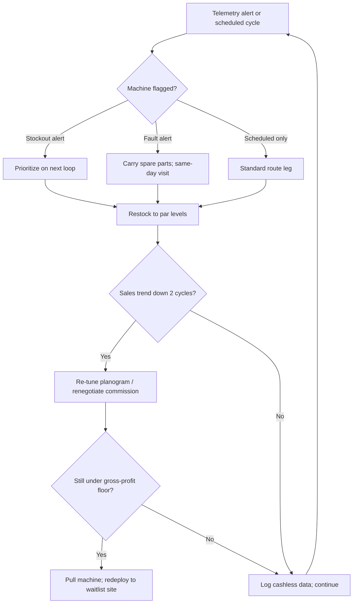

### Direct Answer

A realistic 20-machine vending route in 2026 produces a blended **$8,000-$14,000/mo in gross sales**, or roughly **$400-$700/mo per machine** on average — not the $1,000+ per machine that route brokers and "automatic business" coaches advertise. The gap between a $500/mo machine and a $1,500/mo machine is almost never the equipment; it is **location foot traffic, captive-audience dwell time, planogram fit, uptime discipline, and cashless acceptance**. The single biggest controllable lever is placement quality: a top-decile location — a 24/7 manufacturing floor, a hospital staff corridor, an apartment laundry room — does roughly 3x the volume of a median break room, and no amount of merchandising skill can rescue a structurally bad spot.

> **TLDR**
> - Blended average per machine on a healthy mixed route: **$400-$700/mo gross**, **$140-$280/mo net** after COGS, commissions, processing fees, fuel, and shrink.
> - A **$1,500/mo machine** is a captive-audience location with 100+ daily users, long dwell time, three-shift coverage, and no nearby retail alternative; a **$500/mo machine** is a single-shift break room with an exit and a Dollar General two minutes away.
> - **COGS runs 45-55%** of sales; the operator lives on the spread, so revenue mix (drinks vs. snacks vs. fresh) matters as much as gross dollars.
> - **Cashless payment acceptance is the highest-ROI upgrade in the business** — Cantaloupe (CTLP) and Nayax (NYAX) telemetry data show cashless lifts revenue 20-30% and is now 70%+ of transactions at office and campus sites.
> - **Three killers** quietly turn a good machine into a dead one: stockouts (lost sales you never see), silent downtime (jams and faults with no error message), and location churn (the account changes hands or installs a micro-market).
> - Underwrite every placement on **gross profit per machine per month**, not gross sales — a $900/mo snack machine can lose to a $650/mo drink machine once COGS and commission are netted out.
> - A disciplined owner-operator clears **$3,500-$5,000/mo** on 20 machines worked solo — a real income, but physical, hands-on, and not the passive franchise the marketing promises.

---

## I. The Honest Revenue Picture — What 20 Machines Actually Produce

Vending is sold as a passive-income franchise dream, and the marketed math is consistently inflated. The route-economics reality is narrower, more boring, and far more dependent on a handful of variables you control before the machine is ever plugged in. This section sets the realistic baseline before later sections decompose what drives the spread. The same unattended-asset structure — a portfolio of locations, a blended average, a few stars carrying the route — shows up in the broader getting-started entry (q1937) and in the laundromat cash-flow analysis (q1123), so an operator who has read those will recognize the shape immediately.

### 1.1 The blended-route number

A "typical" 20-machine route is rarely 20 identical machines in 20 identical locations. It is a portfolio: a few stars, a fat unremarkable middle, and two or three duds the operator has not yet had the discipline to pull. Treating the route as one number hides the entire story; treating it as a distribution tells the truth. An honest decomposition of a real-world 20-machine route looks like this.

| Tier | Machines (of 20) | Gross sales/machine/mo | Tier gross/mo | Share of route gross |
|------|------------------|------------------------|---------------|----------------------|
| Stars (captive, high-traffic, multi-shift) | 3 | $1,300 | $3,900 | 32% |
| Strong (good traffic, single or partial multi-shift) | 5 | $750 | $3,750 | 31% |
| Median (ordinary office or warehouse) | 7 | $480 | $3,360 | 28% |
| Weak (low traffic, retail nearby) | 3 | $260 | $780 | 6% |
| Dud (pull candidates) | 2 | $110 | $220 | 2% |
| **Route total** | **20** | **blended $600** | **$12,010** | **100%** |

That blended **$600/machine/mo** and **~$12,000/mo route gross** is the number a buyer should underwrite — not the $1,000+ figure on a broker's spreadsheet. Notice the concentration: the top eight machines (40% of the fleet) produce 63% of the gross. That concentration is both the upside and the risk, and Section VII returns to it when underwriting a route purchase.

### 1.2 Why the marketed number is wrong

Route listings, franchise-style vending programs, and "automatic business" coaches quote per-machine revenue using three reliable distortions:

- **They cite gross sales and let the buyer assume it is take-home.** Gross is the top line; the operator keeps roughly a quarter of it. Quoting a $900/mo machine without mentioning the $450 of product cost is the oldest trick in the listing.
- **They sample only the seller's best locations.** A seller with three star machines will quote the star average and call it "typical," omitting the seven median machines and three duds that drag the real blend down.
- **They ignore the duds entirely.** Every mature route has machines the operator has mentally written off but not yet physically removed. They are still in the count, still costing service time, and conveniently absent from the pitch.

National Automatic Merchandising Association (NAMA) industry data and Vending Market Watch operator surveys both place realistic single-operator per-machine averages well below the brokered claims. Treat any listing quoting a $1,200+ blended per-machine number as a portfolio of cherry-picked stars until proven otherwise.

### 1.3 The metric that actually matters

Gross sales is a vanity number. The figure that decides whether a placement earns its slot on your route is **gross profit per machine per month** — sales minus product cost minus the location commission minus processing. Consider two machines:

| Machine | Gross/mo | COGS % | Commission | Processing | Gross profit/mo |
|---------|----------|--------|------------|------------|-----------------|
| Snack machine A | $900 | 52% | 12% | 5% | $279 |
| Drink machine B | $650 | 46% | 0% | 5% | $318 |

The lower-gross machine is the better asset. Drink machine B earns $39/mo more on $250/mo less in sales, because soft drinks carry a fatter margin and the location took no commission. Every decision in this guide routes back to gross profit per machine per month, not the headline gross.

### 1.4 What the route does NOT produce

It is worth stating the negatives plainly. A 20-machine route does not produce passive income — it produces an owner-operator job (Section VI). It does not scale with software-style leverage — every machine adds a permanent service obligation. It does not protect you from location risk — any single account can terminate you. And it does not return its purchase price quickly if you overpaid on inflated numbers. A clear-eyed operator treats the route as a small business with real operating discipline required, not a money-printing appliance.

### 1.5 The revenue distribution is the whole story

The single most useful mental model for vending is that a route is not an average — it is a distribution with a long tail on both ends. The Section 1.1 table showed three stars producing nearly a third of the gross while two duds produced 2%. That asymmetry has three direct consequences for how an operator should think and act.

First, **growth comes from converting median machines into strong ones and adding stars, not from nudging the whole fleet up evenly.** A 5% lift applied uniformly across 20 machines adds $600/mo of gross; landing one new star adds $1,300/mo. The operator's scarce attention belongs at the top of the distribution.

Second, **the duds are not neutral — they are negative.** A dud does not simply earn little; it consumes a service leg, fuel, standing inventory, and operator hours that a star or a strong machine would convert into real margin. The dud is, in opportunity-cost terms, subsidized by the rest of the route.

Third, **the blended average is fragile.** Because the top of the distribution carries the route, losing a single star — through churn, a micro-market conversion, or an account acquisition — does not cost you 5% of the route; it can cost you 10-12%. A route that looks like it nets $4,000/mo can drop to $3,200/mo on one phone call from one facility manager. Underwriting must respect that fragility (Section 7.2).

### 1.6 Realistic revenue by route maturity

A route's revenue profile also changes with its age. A freshly assembled route underperforms its eventual steady state because new machines have not yet found their planogram fit and the operator has not yet learned each location's velocity.

| Route stage | Typical blended gross/machine | Operator note |
|-------------|-------------------------------|---------------|
| Months 1-3 (new placements) | $350-$480 | Planograms unproven; pars miscalibrated; cashless data thin |
| Months 4-9 (tuning phase) | $480-$580 | Data accumulating; dead SKUs being cut; pars stabilizing |
| Months 10-18 (steady state) | $560-$680 | Planograms fit; duds pulled and redeployed; pars dialed in |
| Mature, well-run (18+ months) | $620-$760 | Optimized fleet; star-weighted; cash-light; tight routing |

A new operator who underwrites a brand-new route at the mature steady-state number will be disappointed for the better part of a year. Budget for the ramp.

---

## II. The $500 vs. $1,500 Machine — Decomposing the 3x Gap

Two machines, same model, same operator, same product catalog. One does $500/mo, one does $1,500/mo. The entire gap is explained by four location variables and two operational ones. Equipment quality contributes almost nothing once you are past a working bill validator and a cold, reliable compressor.

### 2.1 Variable one: captive audience and dwell time

This is the dominant driver, and it deserves the most weight in any placement decision. A *captive audience* is a population that cannot easily leave to buy elsewhere during the window in which they want a snack or a drink — a factory floor mid-shift, a hospital wing at 2 a.m., a college dorm at midnight, an apartment laundry room during a wash cycle. The harder the alternative and the longer the dwell time, the higher the spend per person.

| Location type | Captivity | Daily users | Typical gross/mo |
|---------------|-----------|-------------|------------------|
| 24/7 manufacturing floor (150+ staff) | Very high | 110-160 | $1,300-$1,800 |
| Hospital staff corridor / break area | Very high | 90-140 | $1,100-$1,600 |
| Distribution / fulfillment center, multi-shift | High | 70-120 | $850-$1,400 |
| Apartment-complex laundry room | High | 40-70 | $600-$1,000 |
| Mid-size office break room (40-80 staff) | Medium | 30-55 | $420-$750 |
| Small office (one exit, retail nearby) | Low | 12-25 | $200-$450 |
| Low-traffic warehouse, day shift only | Low | 8-18 | $120-$300 |

The lesson is blunt: you do not merchandise your way from the bottom of this table to the top. You *place* your way there. The skill that separates a $5,000/mo route operator from a $1,800/mo one is the ability to identify, pitch, and win captive high-traffic locations before a competitor does.

### 2.2 Variable two: traffic volume and shift coverage

A machine in a 24/7 facility sees three distinct waves of users; a day-shift-only site sees one. Three shifts roughly triple the transaction window without tripling your servicing cost — you still drive there, you still restock, but the machine sells around the clock. The best vending locations a solo operator can realistically land are second- and third-shift industrial sites, precisely because no nearby retail is open at 1 a.m. The machine becomes the only option in the building, and the only option in any building for miles.

Within the same building, shift mix also changes the product mix: night shifts skew heavily toward energy drinks and caffeine, day shifts toward water and lighter snacks. A planogram that ignores the shift profile leaves money in the slots.

### 2.3 Variable three: planogram fit

A *planogram* is the product map — what SKU goes in which slot, at what price, at what facing depth. A $1,500-capable location running a generic planogram leaves money on the table; a $500 location with a perfectly tuned planogram still cannot manufacture traffic. Fit means matching product to the specific population in front of the machine.

- **Match the price ceiling to the population.** A $2.75 premium energy drink sells briskly on a construction site or a third-shift floor and dies in a budget-conscious nonprofit office. The same machine, the same SKU, two different outcomes.
- **Stock the velocity items deep.** The top 20% of SKUs typically drive about 70% of sales. Give those winners double-facings and the deepest par levels so they never empty between service visits.
- **Cut the dead slots fast.** Any SKU that has not sold in two consecutive service cycles is occupying a slot a proven winner could use. Sentiment about a product is irrelevant; the slot is the scarce asset.
- **Localize by season.** Cold drinks spike in summer; warmer, heartier snacks and confection move in winter. At outdoor-adjacent sites the seasonal swing can be 25% or more.
- **Read the cashless data, not your gut.** Connected payment hardware reports exactly what sold and when. The planogram should follow the data, refreshed every few cycles.

### 2.4 Variable four: competition and alternatives

A break room with a Dollar General two minutes away, a microwave, and a stocked communal fridge competes against your machine all day long. A machine 400 feet from the only exit of a fenced industrial campus has no competition for an entire eight-hour shift. When you tour a prospective location, the operative question is never "how many people work here" — it is "where else can these people buy a drink without leaving the building, and is that place open during their break." If the honest answer is "nowhere" or "nothing nearby is open on their shift," you have found a star.

### 2.5 Variable five: uptime and stockout discipline

This is operational, not locational — and entirely yours to fix. A jammed bill validator or an empty top-seller slot is invisible lost revenue: the customer walks away, you never see the transaction, and there is no error message waiting for you. Industry telemetry suggests poorly serviced machines lose **15-25% of potential sales** to stockouts and faults. A $1,300/mo star machine losing 20% to bad service is quietly a $1,040/mo machine — the operator destroyed a star and never saw the receipt. Section IV covers the discipline that closes this leak.

### 2.6 Variable six: cashless payment acceptance

A cash-only machine in 2026 silently turns away every customer who is not carrying bills, and that is now most customers. Card and mobile-wallet acceptance is no longer an upgrade — it is table stakes. Section V covers the full economics, but the headline is that this single variable can move a machine 20-30% on its own with no change in location, product, or service.

### 2.7 Worked example — the same machine, two locations

To make the 3x gap concrete, take one identical refurbished combo machine and place it, hypothetically, in two locations. Nothing changes but the address.

| Factor | Location A: 24/7 metal-stamping plant | Location B: 35-person insurance office |
|--------|----------------------------------------|----------------------------------------|
| Captivity | Very high — fenced campus, nothing open nearby | Low — strip mall, convenience store across the lot |
| Daily users | ~130 across three shifts | ~22, day shift only |
| Dwell time | Long — fixed breaks, no off-site option | Short — many leave for lunch |
| Planogram | Energy drinks, protein, hearty snacks | Diet drinks, water, light snacks |
| Competition | None during second/third shift | Constant — convenience store, communal fridge |
| Expected gross/mo | $1,450 | $410 |
| Net at 24% | ~$348/mo | ~$98/mo |

The machine, the operator, and the catalog are identical. Location A nets roughly 3.5x what Location B nets. This is why the placement decision — not the equipment decision — is the one that determines whether a route succeeds, and why an operator's location-sourcing skill is worth more than any merchandising trick.

### 2.8 The equipment myth — why machines are the distant fourth lever

New operators spend a disproportionate share of their planning energy on machine selection — glass-front versus closed-front, this manufacturer versus that, new versus refurbished. The energy is misallocated. Once a machine has a working modern bill validator, a reliable compressor, and cashless hardware, its incremental contribution to revenue is small. A pristine new machine in a low-traffic single-shift break room still does $400/mo; a sound refurbished machine in a captive three-shift plant still does $1,400/mo. The machine is a commodity; the location is the asset.

This is not an argument for buying junk. A failing compressor or a finicky validator directly causes the silent downtime of Section 4.2, and a machine with no warranty and no service history is a repair-cost gamble. The argument is one of *sequencing attention*: get a sound, reliable, cashless-equipped machine — refurbished is usually the best value — and then stop optimizing the machine and start optimizing the placement. An operator who spends a month agonizing over machine brands and a single afternoon choosing locations has the priorities exactly inverted.

### 2.9 How to actually find captive locations

Because location quality is destiny, the practical question becomes: how does a solo operator find and win captive high-traffic sites? The honest answer is that it is a sales process, not a search.

- **Drive industrial and medical corridors directly.** Multi-shift manufacturers, distribution centers, and hospitals are not listed in a vending directory; you find them by physically canvassing the corridors where they cluster.
- **Pitch the amenity, not the machine.** A facility manager does not want a vending machine — they want fewer off-site breaks, a low-effort staff perk, and one less thing to manage. Lead with the staff-retention and convenience angle.
- **Offer the service guarantee in writing.** A 24-hour fault-response and never-empty commitment beats a higher commission for most facility managers, and it costs your margin nothing.
- **Target sites an incumbent is underserving.** A location with a competitor's frequently-empty machine is a warm lead — the facility manager is already frustrated and looking for a reason to switch.
- **Build a waitlist.** Good locations open up on their own schedule. An operator with a documented waitlist of pre-qualified captive sites can pull a dud and redeploy the same week instead of leaving a machine idle.

---

## III. Unit Economics — Where the Money Goes

Gross sales is the top line; the operator lives on the spread. This section walks the full profit-and-loss statement for a single representative machine and then the full 20-machine route, line by line.

### 3.1 Cost of goods sold by category

COGS is the single largest expense and the most controllable through sourcing. Buying product at a club-store retail price instead of a wholesale-distributor or bottler price can swing COGS ten full points — the difference between a 28% net machine and an 18% net machine.

| Product category | Typical COGS % of sale | Margin note |
|------------------|------------------------|-------------|
| Carbonated soft drinks | 40-48% | Best margin; club-store or bottler-distributor sourcing |
| Bottled water | 35-45% | High margin, steady velocity, near-zero spoilage |
| Energy drinks | 48-58% | High ticket, thinner margin, very strong velocity on night shifts |
| Bagged snacks (chips, crackers) | 50-58% | Mid margin; watch crush and staleness loss |
| Candy and confection | 45-55% | Heat-sensitive; melt loss in summer at warm sites |
| Pastry and baked goods | 50-60% | Short shelf life; only at fast-turning sites |
| Fresh / refrigerated food | 55-70% | Highest spoilage risk; only at high-velocity captive sites |

The strategic takeaway: a route weighted toward drinks and water carries a structurally better blended margin than a snack-heavy route, even at identical gross sales. When you choose a planogram you are also choosing your margin.

### 3.2 Single-machine monthly profit-and-loss

A representative *strong* machine — a drink-and-snack combo grossing $750/mo, modest 10% commission, full cashless:

| Line item | Amount/mo | % of gross |
|-----------|-----------|-----------|
| Gross sales | $750 | 100% |
| Cost of goods sold (50%) | ($375) | 50% |
| Location commission (10%) | ($75) | 10% |
| Cashless processing fees (~5%) | ($38) | 5% |
| Allocated fuel + servicing time | ($60) | 8% |
| Shrink, spoilage, jam refunds (~3%) | ($23) | 3% |
| **Net profit per machine** | **$179** | **24%** |

That ~24% net margin on a strong machine is the realistic ceiling for an ordinary location. Star machines net a higher absolute dollar figure but a similar percentage; duds net a far worse percentage because the fixed costs of a service visit do not shrink with the revenue.

### 3.3 Full 20-machine route profit-and-loss

Scaling the $12,010 blended-route gross from Section 1.1 to a full monthly route P&L:

| Line item | Amount/mo | % of gross |
|-----------|-----------|-----------|
| Gross sales (20 machines) | $12,010 | 100% |
| Cost of goods sold (~50%) | ($6,005) | 50% |
| Location commissions (blended ~7%) | ($840) | 7% |
| Cashless processing + telemetry SaaS | ($720) | 6% |
| Fuel and vehicle costs | ($550) | 5% |
| Repairs, parts, refunds | ($300) | 2.5% |
| Insurance, licenses, misc. | ($250) | 2% |
| **Net operator profit** | **$3,345** | **28%** |

A leaner operator — better sourcing pulling COGS to 47%, fewer duds, lower blended commission — pushes that net into the **$4,500-$5,000/mo** range. A sloppy operator with a snack-heavy planogram, generous commissions, and poor uptime drops below $2,500. The same 20 machines, a 2x spread in take-home, all of it operating discipline. The structure is directly comparable to the one-truck mobile-detailer economics in q1147 and the residential lawn-care route math in q1149 — unattended assets in place of a service truck, but the same "portfolio of locations, blended average, a few stars carry it" shape.

### 3.4 Commission structure — the hidden margin leak

Location commissions are negotiable, and they are frequently overpaid. Many operators reflexively offer 10-15% to win a placement when the location would have happily said yes at 0-8%. A captive industrial site values the *amenity* — staff retention, fewer off-site breaks, a perk that costs the facility nothing — far more than it values the commission check. Reserve double-digit commissions for genuine bidding wars at top-decile sites. Default to a low or zero commission paired with a written 24-hour service guarantee; service reliability wins more placements than a points war ever will, and it does not erode your margin every month forever.

### 3.5 The capital side — what 20 machines cost to acquire

| Acquisition path | Per-machine cost | Notes |
|------------------|------------------|-------|
| New combo machine | $3,500-$6,000 | Warranty, modern bill validator, longest service life |
| Refurbished machine | $1,200-$3,000 | Best value if compressor and validator are sound |
| Used / as-is machine | $400-$1,200 | Buyer beware; budget for immediate repairs |
| Buying an existing route | varies | Pays a multiple of claimed gross — diligence-critical |

A 20-machine route assembled from refurbished equipment runs roughly **$25,000-$55,000 in machines** plus cashless hardware, an initial product fill, and a service vehicle. Against a $3,300-$5,000/mo net, the payback on a self-built route is real but multi-year — and an overpriced route purchase can stretch it past any reasonable horizon (Section 7.2).

### 3.6 Working capital and cash flow timing

Vending is cash-flow-friendly in one respect and hostile in another. Friendly: customers pay instantly, there are no receivables, and there is no collections risk. Hostile: you must buy and physically place product *before* it sells, so a 20-machine route ties up several thousand dollars in standing inventory across the fleet and the warehouse at all times. New operators routinely underestimate this standing-inventory float and run short of buying capital in month two. Budget for it explicitly.

### 3.7 Pricing strategy — the lever most operators ignore

Vended prices are not fixed by law and they are not fixed by tradition; they are a lever, and most operators leave them set too low out of timidity. A captive audience has, by definition, a low price sensitivity in the moment — they cannot easily leave, and the alternative is nothing. Within reason, a captive site will absorb a price increase with very little volume loss, and the increase flows almost entirely to gross profit because COGS is unchanged.

| Pricing posture | Where it fits | Effect |
|-----------------|---------------|--------|
| Aggressive (premium) | High-captivity industrial / healthcare | Maximizes gross profit; minimal volume loss |
| Standard | Ordinary offices | Market-rate; safe default |
| Value | Budget-sensitive sites; high competition | Defends volume; thinner margin |

The discipline is to price by location, not by habit. A nickel-and-dime increase across a captive star machine, applied through the cashless system in seconds, can add $40-$70/mo of nearly pure profit. Reprice on the data: if velocity holds after an increase, the prior price was leaving money in the slot.

### 3.8 The break-even machine and the gross-profit floor

Every operator needs one number burned into memory: the gross-sales level at which a machine breaks even after all costs. Below it, the machine loses money; above it, it contributes. Working from the Section 3.2 cost structure — roughly 50% COGS, a blended 7% commission, 5% processing, and a fixed servicing-and-fuel allocation of about $60/mo per machine — a machine breaks even at roughly **$160-$200/mo in gross sales**. That is the absolute floor; it is not a target.

The *gross-profit floor* — the level below which a machine should be pulled and redeployed — sits well above break-even. A machine clearing only break-even occupies a service leg, standing inventory, and operator attention while contributing nothing. A practical pull threshold is a machine netting under roughly **$90/mo of gross profit** after a planogram re-tune and a commission renegotiation, which corresponds to roughly $300-$340/mo in gross sales at standard cost ratios. Below that line the machine is a dud (Section 4.6); the capital and the service leg are worth more redeployed to a waitlisted captive site than left chasing a location that the planogram and the commission renegotiation could not save.

### 3.9 Comparing the route to other unattended-asset businesses

It helps to frame vending's economics against its cousins, because an operator choosing how to deploy capital and labor should see the trade-offs clearly.

| Business | Capital intensity | Physical labor | Spoilage risk | Location risk |
|----------|-------------------|----------------|---------------|---------------|
| 20-machine vending route | Moderate | High (driving, lifting, restocking) | Moderate (fresh/candy) | High (per-account) |
| ATM route (q9649) | Moderate | Low (cash loading only) | None | Moderate |
| Laundromat (q2153, q1123) | High (single big lease) | Low-moderate | None | Low (one location) |
| Mobile car detailing (q1147) | Low | Very high | None | Low (mobile) |

Vending's distinctive profile is *moderate capital, high labor, distributed location risk*. It rewards an operator who enjoys being on the road and is good at sales-driven location sourcing; it punishes an operator who wanted genuinely passive income, for whom the ATM route or the concentrated laundromat is a structurally better fit.

---

## IV. Operations — Uptime, Routing, and the Three Killers

A vending route is an operations business wearing the costume of a passive one. The difference between a route that holds $600/machine and one that quietly decays to $400 is service discipline — nothing else.

### 4.1 Killer one: stockouts

A stockout is invisible lost revenue, and that invisibility is what makes it the most dangerous killer. The customer who wanted the top-selling cola at slot A4 and found it empty does not file a complaint — they buy nothing, walk away, and you have no data point telling you it happened. The fix is **par-level restocking**: stock each slot to a level calculated to outlast the service interval at that location's measured velocity, with the top 20% of SKUs given the deepest pars and the most facings. Par levels are not a guess — connected telemetry (Section V) tells you exactly how fast each slot empties, and the pars should be set from that data and revised as it changes.

### 4.2 Killer two: silent downtime

A jammed bill validator, a failed compressor, or a stuck coin mechanism can run for days before anyone bothers to tell you. Every hour of downtime at a $1,300/mo machine is roughly $1.80 of lost gross; a three-day outage at a star is over $130 gone, plus the harder-to-measure damage of customers who tried, failed, and stopped trying. Telemetry converts silent downtime into a same-day alert. Without it, you are completely blind between scheduled service visits, and the machine can be dead for most of a week before your next stop reveals it.

### 4.3 Killer three: location churn

The account changes management, signs a micro-market vendor, gets acquired, or simply asks you to leave. Location churn is the structural risk of the entire business — you do not own the floor your machine stands on. Mitigate it three ways: multi-year *written* placement agreements rather than verbal handshakes; a named, current contact at the location who knows you and values the service; and visible, relentless reliability. A location that never sees an empty machine, never sees a hand-written "out of order" sign, and never has to call you twice has no reason to shop your slot to a competitor.

### 4.4 Route design and service cadence

Service cadence should be tiered by machine velocity, not applied uniformly. Servicing a dud as often as a star burns fuel and labor for no return; servicing a star as rarely as a dud bleeds it dry through stockouts.

| Location velocity | Service interval | Rationale |
|-------------------|------------------|-----------|
| Star ($1,000+/mo) | Twice weekly | High velocity; severe stockout risk between visits |
| Strong ($600-$1,000/mo) | Weekly | Standard cadence for a healthy machine |
| Median ($350-$600/mo) | Every 10-14 days | Balance fuel cost against product freshness |
| Weak (<$350/mo) | Every 2-3 weeks | Minimize servicing cost; active pull candidate |

Cluster locations geographically. A route spread across 60 miles burns exactly the fuel and labor savings that make vending viable in the first place. The ideal solo route fits a tight servicing loop, with stars and strong machines positioned on the most frequently traveled legs so a twice-weekly star does not require a dedicated trip.

### 4.5 The service-cadence decision flow

### 4.6 The pull decision

Every route carries duds, and the discipline most operators conspicuously lack is *pulling* them. A machine netting under your gross-profit floor — say $90/mo — after a planogram re-tune and a commission renegotiation is not an asset. It is dead capital: it ties up a machine, a service leg, standing inventory, and the operator's attention, all of which could be redeployed to a waitlisted captive location. A focused 20-machine route of all median-or-better placements beats a sprawling 24-machine route dragging four duds, every time. The duds do not merely earn little — they actively subsidize their own losses with your good machines' margin.

### 4.7 Servicing time and the labor reality

A realistic solo operator spends a meaningful chunk of the week on physical servicing: driving the loop, hauling cases of product, restocking to par, clearing jams, and reconciling cash where machines still take it. The "passive income" framing collapses on contact with this reality. Twenty machines is roughly the ceiling one person can service well without help; past that, labor enters the P&L and compresses the margins in Section III (see the scaling discussion in Section 6.4). An operator should price their own time into the model honestly before deciding the route "works."

### 4.8 Vehicle, insurance, and licensing

The unglamorous fixed costs are real and recurring. A reliable cargo van or box-style vehicle is mandatory — the route is, functionally, a small logistics operation. Commercial general liability insurance for unattended retail is inexpensive but non-optional; a machine that injures someone, or product that makes someone ill, is a liability you cannot afford uninsured. Municipal and county vending licenses and health permits vary widely and must be confirmed locally before placing a single machine. None of these line items is large, but together they form the "insurance, licenses, misc." row in the route P&L and they do not go away.

### 4.9 Sourcing and product procurement discipline

Section 3.1 showed that COGS is the largest expense and the most controllable. The control happens at the procurement step, and it is a discipline most new operators get wrong by defaulting to whatever club store is convenient.

- **Buy from bottler distributors for drinks.** Coca-Cola and PepsiCo distributor channels price below club-store retail at route volume; the relationship is worth establishing even for a 20-machine route.
- **Consolidate snack and candy buys.** Wholesale distributors and warehouse clubs each win on different categories; a disciplined operator splits the buy rather than single-sourcing for convenience.
- **Buy to par, not to truck capacity.** Overbuying ties up working capital and raises spoilage and staleness loss; buy what the measured velocity says the next cycle needs.
- **Rotate stock first-in-first-out.** Crush, melt, and date-code loss is pure margin destruction; disciplined rotation at restock keeps the shrink line near 3% instead of 6%.
- **Watch the heat-sensitive categories.** Candy and confection melt loss in summer at warm sites can erase the category's margin entirely; either condition the storage or shift the planogram seasonally.

### 4.10 Shrink, fraud, and refund discipline

The "shrink, spoilage, jam refunds" line in the P&L looks small at ~3% but compounds quietly. Shrink has four sources: physical theft and vandalism (Section 6.5), date-code and spoilage loss, mechanical fraud (stringed coins, slugs, validator manipulation), and over-generous refunds. Each has a fix. Theft is mitigated by site selection. Spoilage is mitigated by FIFO rotation and right-sized par levels. Mechanical fraud is largely eliminated by modern cashless-forward hardware, which has no coin string to pull. Refunds are controlled by a clear, posted policy and by telemetry that lets you verify a genuine fault before issuing a credit. An operator who treats 3% as a fixed cost of doing business rather than a managed line is leaving margin on the floor.

---

## V. The Cashless Payment Lever — Cantaloupe, Nayax, and Telemetry

If there is one upgrade in the entire business with a clear, fast, and reliable payback, it is connected cashless payment hardware. It is simultaneously a revenue lever and an operations tool, and skipping it in 2026 is the single most expensive mistake a new operator can make.

### 5.1 Why cashless lifts revenue

Customers who are not carrying cash used to walk away from the machine empty-handed; now they tap a card or a phone and complete the sale. Industry data from connected-payments vendors consistently shows cashless acceptance lifts machine revenue **20-30%**, and card and mobile-wallet transactions are now well over half — frequently 70% or more — of total volume at office, campus, and healthcare sites. The lift is genuine, incremental money: a $600/mo cash-only machine routinely becomes a $750-$780/mo machine on the cashless upgrade alone, with zero change in location, product, or service frequency. There is no other single intervention in vending that reliably moves a machine that much.

### 5.2 The two dominant vendors

The connected-vending hardware and telemetry market is led by two publicly traded companies, and a solo operator will almost certainly run one of them across the fleet.

| Vendor | Public ticker | What it provides | Operator note |
|--------|---------------|------------------|---------------|
| Cantaloupe, Inc. | CTLP (Nasdaq) | Card readers, telemetry, cashless processing, route-management software | U.S. market leader; absorbed the legacy USA Technologies cashless platform |
| Nayax Ltd. | NYAX (Nasdaq / TASE) | Cashless readers, management suite, broad global payment rails | Strong breadth across unattended retail well beyond vending |

Both companies charge a per-device monthly SaaS fee plus a processing percentage on cashless sales. Across a 20-machine route, that combined cost is the roughly $720/mo "cashless processing + telemetry SaaS" line in the Section 3.3 route P&L — and it pays for itself many times over through the revenue lift and the downtime it silently prevents. An operator evaluating the cost in isolation has misframed it; it is a profit center, not an expense.

### 5.3 Telemetry as an operations tool

The same connected hardware that processes a card payment also streams sales and fault data back to the operator. That telemetry converts the three killers from invisible to managed:

- **Stockout visibility** — see exactly which slots are emptying and how fast, and adjust par levels before the next service visit instead of discovering the empty slot when you arrive.
- **Fault alerts** — a bill-validator jam or compressor fault pings you the same day instead of festering silently until the next scheduled stop a week away.
- **Dynamic routing** — service the machines that genuinely need it and skip the ones that do not, cutting wasted fuel and recovering hours of labor every week.
- **Honest data for buying and selling routes** — settlement reports from CTLP or NYAX are auditable third-party records; they cannot be fabricated the way a handwritten cash log can. This is the single most important diligence document when buying a route.
- **Planogram intelligence** — the sales feed shows which SKUs win and which are dead weight, turning planogram tuning from guesswork into a data exercise.

### 5.4 Hardware payback math

| Item | Per machine |
|------|-------------|
| Cashless reader + telemetry hardware | $250-$400 one-time |
| Monthly SaaS + processing fees | ~$36/mo |
| Revenue lift (20% on a $600/mo machine) | +$120/mo gross, ~+$55/mo net |
| **Net payback period on hardware** | **~5-7 months** |

A five-to-seven-month payback on the highest-leverage upgrade in the business is the clearest, easiest "yes" in all of vending. Any machine still running cash-only in 2026 is leaving real money on the table every single day, and the operator cannot even see how much because the lost transactions never register. Cashless is not optional; it is the baseline.

### 5.5 Cash handling — the legacy cost cashless eliminates

Cash is not free to accept. It must be physically collected from every machine, transported, counted, reconciled against the machine's mechanical counters, and deposited — and it invites both internal shrink and external theft. Coin and bill mechanisms jam, causing the silent downtime of Section 4.2. As cashless climbs past 70% of volume, the rational long-term direction for many routes is toward cash-light or, at some captive sites, fully cashless machines — eliminating the collection labor, the reconciliation time, the jam-related downtime, and a meaningful chunk of the shrink line in the P&L. The transition should be deliberate and site-by-site, but the direction of travel is not in doubt.

### 5.6 Reading the telemetry data — turning a feed into decisions

Connected hardware produces a data feed, but a feed is not a decision. The operators who get the full value from CTLP or NYAX telemetry treat the dashboard as a weekly management ritual, not a passive readout. Three reports drive most of the value.

The **slot-velocity report** ranks every slot in every machine by units sold per day. It directly drives par levels — fast slots get deeper pars and more facings — and it identifies dead SKUs for the cut list. Reviewed every two service cycles, it keeps the planogram honest.

The **fault and uptime report** logs every validator jam, compressor alarm, and door event. An operator scanning it weekly catches the slow-developing fault — a validator that is starting to reject more bills, a compressor cycling oddly — before it becomes a multi-day outage at a star.

The **per-machine revenue trend** shows each machine's gross over rolling weeks. Two consecutive declining cycles is the trigger in the Section 4.5 flowchart: re-tune the planogram, and if that fails, renegotiate or pull. Without the trend report, a machine can decay for months before a service visit reveals it.

### 5.7 The cashless cost objection — answered

New operators frequently resist cashless because they see the per-device SaaS fee and the processing percentage as a leak. The objection is a framing error. The processing fee applies only to the *incremental* cashless transactions — sales that, cash-only, would not have happened at all. A 20% revenue lift that costs 5% in processing is a 15-point net gain, not a 5-point loss. The SaaS fee buys the telemetry that prevents the silent-downtime losses of Section 4.2, which on a single star machine can exceed the SaaS cost many times over. The correct way to book cashless in the P&L is as the highest-return line item on the route — Section 5.4's five-to-seven-month payback is conservative once the prevented-downtime value is counted. Resisting cashless to "save" the fee is a textbook example of optimizing the visible cost while ignoring the larger invisible loss, exactly the stockout error of Section 4.1 in a different costume.

---

## VI. Counter-Case — When the Vending Route Math Does Not Work

This guide makes a disciplined vending route sound like a reliable path to $3,500-$5,000/mo on 20 machines. That is true — but only under conditions that frequently do not hold. An honest analysis has to state plainly when the model breaks, because the marketing never will.

### 6.1 You bought a broker's route at a broker's price

The most common and most expensive failure is overpaying for a route on inflated numbers. Routes are typically priced at a multiple of *claimed* gross sales. If you pay a full multiple on a portfolio of cherry-picked star locations, and then watch two of those stars churn within the first year — which captive-site accounts routinely do, because the account changes hands or installs a micro-market — your real return collapses below a savings-account yield, and you are left servicing a route of median machines you paid star prices for. **Counter-position:** never buy a route without 12 months of dated cashless settlement reports, and underwrite the deal at the *blended* number with at least two stars assumed lost in year one.

### 6.2 Your locations are mediocre and you cannot upgrade them

Everything in Section II says location is destiny. The brutal corollary: if you cannot land captive, high-traffic sites — because the genuinely good locations in your area are already locked up by an entrenched incumbent operator or by national vending companies with established relationships — you are structurally stuck with a route of $300-$450 machines. No planogram tuning, no cashless upgrade, no service heroics can fix a low-traffic single-shift break room with a Dollar General next door. A route composed entirely of mediocre placements may net $1,800/mo for genuinely full-time work — below minimum wage on an honest hourly basis. The business does not work in a market where you cannot win good locations, and no amount of operating skill changes that.

### 6.3 The micro-market and unattended-retail shift

The premium captive locations — large offices, big multi-shift industrial sites, distribution centers — are increasingly being converted to **micro-markets**: open, self-checkout convenience setups with far more SKUs, fresh-food breadth, and substantially higher revenue per location than a bank of traditional machines. Micro-markets out-earn vending machines at exactly the high-traffic sites you most want to win. A solo operator running traditional machines can be structurally out-competed for the best placements by a better-capitalized operator offering a micro-market. This is the same competitive-displacement dynamic that appears when self-serve adoption plateaus and a higher-touch motion takes over the most valuable accounts (q674) — the format that delivers more value per location wins the location.

### 6.4 It is not passive and it does not scale cleanly

Vending is marketed relentlessly as passive income. It is not. It is physical, recurring, hands-on work: driving the loop, lifting cases, clearing jams, reconciling cash, chasing location contacts who have stopped returning calls. It scales by adding machines, but every single machine adds a permanent service obligation — there is no software-style leverage where the next unit is free to operate. Past roughly 30-40 machines, a solo operator must hire help, and labor costs compress the Section III margins hard. If the genuine goal is hands-off income, an ATM route (q9649) carries far less physical and spoilage burden per dollar of revenue, and a laundromat (q2153, with the cash-flow detail in q1123) concentrates the asset in a single location instead of spreading it across twenty sites you must drive between.

### 6.5 Theft, vandalism, and shrink at the wrong sites

Some locations destroy machine economics through loss rather than low traffic. A machine in an under-supervised public-adjacent area can suffer break-ins, vandalism, and walk-up theft that turn a respectable gross into a net loss after repairs and replacement product. Captivity cuts both ways: the captive industrial floor that protects revenue also tends to be a supervised, low-theft environment, while a high-traffic but unsupervised location can be a trap. Underwrite the loss risk, not just the traffic.

### 6.6 The seasonality and demand-shock exposure

Vending revenue is not flat across the year, and a route underwritten on a summer month will disappoint in February. Cold-drink-heavy planograms swing meaningfully with the seasons; school and university locations can go nearly dark over breaks; and a manufacturing site that cuts a shift or runs a temporary layoff takes a slice of your captive audience with it. The route is also exposed to demand shocks it cannot control — a plant closure, a hospital wing relocation, an employer's shift to remote or hybrid work that empties an office. None of this makes vending a bad business; it makes it a business that must be underwritten on a *trailing twelve months* of data, never a single strong month, and that must keep a redeployment waitlist precisely because some locations will weaken through no fault of the operator.

### 6.7 When it genuinely works

The vending route works — and works well — when four conditions hold simultaneously: you can personally source, pitch, and land captive high-traffic locations; you have the operational discipline to service on cadence, tune planograms from data, and pull duds without sentiment; you buy machines or routes at a sane price on audited cashless data; and you accept that the first 20 machines are an owner-operator job, not passive income. Under those conditions the $400-$700/machine blended math holds, the route nets a real $3,500-$5,000/mo, and it is a legitimate small business — comparable in realistic owner take to the indoor climbing-gym membership economics in q1141 or the in-bay car-wash unit economics in q1121. Outside those conditions, the marketed numbers are a trap, and the route is a slow way to lose money and time.

---

## VII. Decision Framework — Underwriting a Placement or a Route

Pulling the entire guide into a repeatable, checklist-driven framework an operator can actually use.

### 7.1 Underwriting a single new location

Before you commit a machine, a cashless reader, and a service leg to a location, score it deliberately:

- **Captivity** — how genuinely hard is it for this population to buy elsewhere during the window they want a snack or drink? This carries the highest weight; a captive site with modest traffic beats a high-traffic site with easy alternatives.
- **Daily users multiplied by dwell time** — raw headcount times how long they actually linger near the machine. A 200-person office where everyone leaves for lunch can sell less than a 90-person floor that never leaves.
- **Shift coverage** — one shift or three? Multi-shift coverage roughly triples the selling window at almost no extra servicing cost.
- **Planogram fit** — can you match product, price ceiling, and category mix to this specific population? If not, discount the projected gross.
- **Commission demanded** — what does the gross-profit-per-machine number look like *after* their cut? A high-commission site can underperform a lower-gross zero-commission site.
- **Loss risk** — is the site supervised and secure, or exposed to theft and vandalism?

If the projected **gross profit per machine per month** clears your floor with a genuinely captive audience, place the machine. If the projection depends on a generous traffic assumption, a thin commission spread, or hope, pass — there is always another location, and a disciplined waitlist is worth more than a marginal placement.

### 7.2 Underwriting a route purchase

Buying an existing route can be faster than building one, but only if the diligence is ruthless. Most route-purchase regret traces directly to skipping the items below.

| Diligence item | What to demand | Red flag |
|----------------|----------------|----------|
| Revenue proof | 12 months of dated CTLP/NYAX settlement reports | Handwritten cash logs only; "trust me" |
| Location contracts | Written, multi-year, transferable agreements | Verbal handshakes or month-to-month |
| Machine condition | Service records and compressor/validator age | "Sold as-is," no history, no records |
| Location concentration | No single site over ~15% of route gross | One star secretly carrying the whole route |
| Cashless penetration | Already installed and live fleet-wide | Cash-only fleet — factor the full upgrade cost |
| Account stability | Long-tenured accounts, named current contacts | Recent account turnover, lost-contact sites |
| Pricing basis | A sane multiple of blended, audited net | A full multiple of claimed gross sales |

### 7.3 The 90-day operator improvement plan

Whether you built the route or bought it, the first 90 days of disciplined operation determine whether it hits the top or the bottom of the Section III margin range:

1. **Audit every machine on gross profit per month**, never gross sales — rank the entire fleet honestly and identify the stars, the median, and the duds.
2. **Install cashless on any machine that lacks it** — this is the fastest, highest-certainty payback in the business and should happen first.
3. **Re-tune the bottom-half planograms from the cashless data** — cut every dead SKU, deepen the proven top 20%, match the price ceiling to the population.
4. **Renegotiate or formally document every location agreement** — written, multi-year, transferable, with an explicit service guarantee in place of a fat commission.
5. **Pull the confirmed duds and redeploy them** to waitlisted captive sites, converting dead capital back into earning machines.

### 7.4 Common mistakes and their fixes

Most failure in vending is not exotic; it is a short list of predictable, repeated errors. An operator who simply avoids the list below outperforms the field.

| Mistake | Why it happens | The fix |
|---------|----------------|---------|
| Underwriting at gross sales | The big number is seductive | Underwrite at gross profit per machine per month |
| Buying a route on claimed numbers | Trust replaces diligence | Demand 12 months of CTLP/NYAX settlement reports |
| Skipping cashless to "save" fees | Visible cost beats invisible loss | Treat cashless as the route's top-ROI line item |
| Keeping duds out of sentiment | Sunk-cost attachment to a machine | Pull anything under the gross-profit floor and redeploy |
| Uniform service cadence | Simplicity over economics | Tier the cadence to machine velocity |
| Over-paying commissions | Reflexive generosity to win a site | Default low; trade a service guarantee for points |
| Generic planograms | No data discipline | Tune from slot-velocity telemetry every few cycles |
| Sprawling geography | Grabbing every available site | Cluster the route into a tight servicing loop |
| Underbudgeting working capital | Ignoring standing inventory float | Budget explicitly for fleet + warehouse inventory |
| Treating it as passive | Believing the marketing | Price your own labor into the model honestly |

### 7.5 A simple go / no-go test

If an operator wants a single, fast filter before committing capital, it is this. The vending route is a go if you can answer yes to all five: (1) Can I personally land at least three captive, multi-shift, high-traffic locations in my market? (2) Will I genuinely enjoy — or at least tolerate — driving a physical route and lifting product every week? (3) Can I fund the machines, cashless hardware, and standing inventory float without stretching? (4) If buying a route, can I get 12 months of auditable settlement data? (5) Am I willing to run it as a job for 12-18 months before it reaches steady state? Five yeses means the $3,500-$5,000/mo outcome is realistically in reach. Any no is a signal to either fix that gap first or choose a different unattended-asset business — the ATM route in q9649 or the laundromat in q2153 each relax a different one of these constraints.

### 7.6 The bottom line

A 20-machine route, built or bought sanely and run with the discipline in this guide, holds its blended **$600/machine/mo** gross and nets the owner-operator a real **$3,500-$5,000/mo**. The number is honest, the work is genuinely physical, and the lever is always the same in the same order: **location quality first, cashless and uptime discipline second, planogram tuning third, and equipment a distant fourth.** Operators who invert that order — chasing shiny machines and ignoring placement — produce the disappointing $1,800/mo routes that give vending its reputation as a passive-income trap. Operators who respect the order, treat the route as a real small business, and underwrite every machine on gross profit per month build a legitimate, durable income that delivers exactly what the math promises and nothing the marketing oversold.

---

**Sources and references:** National Automatic Merchandising Association (NAMA) industry data and operator benchmarking; Vending Market Watch operator surveys and route-economics reporting; Automatic Merchandiser "State of the Industry" annual report; Cantaloupe, Inc. (Nasdaq: CTLP) investor disclosures and connected-payments transaction data; Nayax Ltd. (Nasdaq/TASE: NYAX) operator platform documentation and unattended-retail reporting; USA Technologies legacy cashless-adoption datasets (platform now part of Cantaloupe); U.S. Bureau of Labor Statistics small-business and self-employment income data; U.S. Small Business Administration guidance on route-based and unattended-retail businesses; IBISWorld vending-machine operators industry report; payment-processor interchange and card-network fee schedules; municipal and county vending license and health-permit requirements; vending equipment manufacturer service-life and reliability documentation; commercial general liability insurance underwriting guidance for unattended retail; route-broker listing analysis and operator due-diligence checklists; club-store and wholesale-distributor pricing comparisons; Coca-Cola and PepsiCo bottler distributor pricing structures; energy-drink category velocity and margin reports; refrigerated-vending spoilage and shrink studies; micro-market and unattended-retail conversion case studies; cold-chain compressor reliability data; planogram optimization and SKU-velocity merchandising research; route-density and fuel-cost logistics modeling; second- and third-shift industrial facility staffing data; commercial real estate foot-traffic analysis; consumer cashless-payment adoption surveys; mobile-wallet penetration data; small-business cash-flow and working-capital benchmarks; vending fraud, jam, and refund-rate operational studies; multi-year placement agreement contract templates; route valuation multiple analysis; comparative unattended-asset business returns across ATM, laundromat, and car-wash formats; owner-operator labor and time-allocation studies; seasonal demand variation data for vended categories; product crush, melt, and staleness loss benchmarks; competitive-displacement analysis of micro-markets versus traditional vending; theft and vandalism loss-rate data for unattended retail; standing-inventory and working-capital float modeling for route businesses; and cross-references to related Pulse RevOps route-economics and small-business entries (q1937, q1147, q1149, q1123, q1121, q9649, q2153, q1141, q674).
