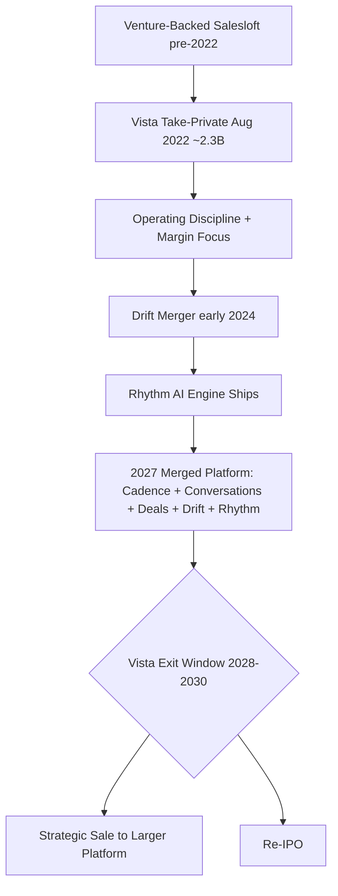

### Direct Answer

**Salesloft is worth buying in 2027 for roughly 30-40% of mid-market sales-engagement buyers and the wrong choice for the rest.** The question is not whether the product is good -- it is mature, stable, and competitive -- but whether your specific buyer profile (CRM, scale, vertical, AI ambition, procurement posture) matches the specific buyers Salesloft now wins. Run it through a five-criterion buy filter and a seven-criterion skip filter before signing; never pick it because someone on the team used it three jobs ago.

**TL;DR:** Since the August 2022 take-private by **Vista Equity Partners** at roughly a **$2.3 billion** valuation, Salesloft merged with conversation-marketing pioneer **Drift** (combined in early 2024), shipped the **Rhythm** AI signal engine, and settled into a focused mid-market sales-engagement and revenue-orchestration platform. It is sold against **Outreach** (the enterprise/Salesforce leader), **Apollo.io** (the PLG, data-bundled cost killer), **HubSpot Sales Hub** (the native-CRM bundle), **Gong Engage** (the conversation-intelligence-led entrant), and **Clari Copilot / Groove** (the revenue-platform consolidation play). **Buy Salesloft if** you run HubSpot CRM at 50-200 reps, genuinely need integrated conversation marketing, have procurement that can extract a Vista multi-year discount, prefer mid-market simplicity, or are graduating up from HubSpot Sales Hub. **Skip Salesloft if** you run Salesforce at enterprise scale, are an AI-first 2027 buyer, are under 50 reps and cost-sensitive, operate in FinServ/Healthcare/Public Sector, want a PLG self-serve motion, are EMEA/APAC-heavy, or need 400+ pre-built integrations. The cash TCO is competitive -- Vista discounts hard for multi-year -- but the equity-style upside of a soon-to-IPO challenger is gone; this is a private-equity asset run for cash flow and an eventual exit, not a venture company chasing growth.

---

## 1. What Salesloft Actually Is In 2027

Salesloft is a **sales-engagement and revenue-orchestration platform** -- the system of record for outbound and follow-up activity executed by a B2B sales team. It is the software a sales development representative (SDR) and an account executive (AE) live in every day to run multi-step sequences of email, phone, LinkedIn, and SMS touches, log conversations, capture meeting outcomes, and trigger the next step.

### 1.1 Where It Sits In The Revenue Stack

The platform sits between the **CRM** (Salesforce, HubSpot, Microsoft Dynamics) -- the system of record for accounts, contacts, opportunities, and pipeline -- and the **revenue intelligence layer** (Gong, Clari, Chorus) that captures and analyzes conversations. The CRM tells you *who* to call; the engagement platform tells you *when*, *how*, and *through which channel*, then logs *what happened*. In 2027 the category has matured beyond pure cadence into a broader **revenue orchestration** posture: AI-assisted drafting, conversation summarization, deal-risk signals, forecasting hooks, and integrated conversation marketing.

### 1.2 The 2027 Product Surface

Salesloft's product surface in 2027 spans five modules. **Cadence** is the original sequencing engine. **Conversations** is call recording and analytics. **Deals** is pipeline and forecasting. **Drift** is the conversation-marketing layer -- web chat, chatbots, conversational landing pages, ABM live conversations. **Rhythm** is the AI signal-to-action engine that ranks and prioritizes seller actions across the platform.

### 1.3 Who Buys It

The platform is sold primarily to **mid-market and lower-enterprise B2B SaaS, services, and technology companies** running sales teams of roughly 25-500 reps, with heavy concentration in HubSpot-CRM shops and a meaningful base in Salesforce shops that prefer Salesloft's UX and pricing posture to Outreach's enterprise heaviness. The product is good and the company is stable; the 2027 buyer's question is not "does this work" -- it does -- but "is this the right fit for my CRM, scale, procurement, AI ambitions, and vertical."

The typical Salesloft buyer in 2027 is a **VP of Sales or a Director of Revenue Operations** at a $20M-$300M-revenue B2B company, often a HubSpot CRM shop, who has either outgrown a lighter tool (HubSpot Sales Hub sequences, a spreadsheet-and-Gmail motion, or an early-stage cadence add-on) or is replacing a competitor mid-contract because of a missed expectation. The economic buyer is increasingly a RevOps leader rather than a frontline sales manager, which has changed how the platform is evaluated: RevOps buyers care about data hygiene, CRM sync fidelity, reporting consistency, and total-stack integration more than they care about any single seller-experience feature. That shift favors Salesloft's mid-market positioning -- a RevOps buyer with a lean team values a platform that is fast to administer and clean to integrate over one that exposes maximum configurability.

### 1.4 The Maturity Signal That Matters Most

The most important thing a 2027 buyer should internalize is that Salesloft is no longer a category-defining innovator -- it is a **category-mature operator**. The sales-engagement category itself has matured: the core jobs (sequencing, dialing, logging, conversation capture, forecasting hooks) are solved problems, and the differentiation now lives at the edges -- AI quality, conversation marketing, CRM-specific depth, and pricing structure. A buyer who expects Salesloft to leapfrog the category will be disappointed; a buyer who wants a dependable, well-supported execution layer for a real sales team will be well served. The honest framing is that the *category* is mature and Salesloft is one of its most stable participants, which is exactly why the buy decision turns on fit rather than on which vendor is "winning."

| Module | Function | Closest Competitor Equivalent |
|--------|----------|-------------------------------|
| Cadence | Multi-channel sequencing engine | Outreach Sequences, Apollo Sequences |
| Conversations | Call recording, transcription, analytics | Gong, Chorus, Outreach Kaia |
| Deals | Pipeline management, forecasting | Clari, Outreach Commit |
| Drift | Conversation marketing, web chat, ABM | Qualified, Intercom (no native rival) |
| Rhythm | AI signal-to-action prioritization | Outreach AI Agents, Apollo AI |

---

## 2. The Vista Take-Private And Drift Merger: The Single Most Important Context

Any honest 2027 evaluation has to start with corporate context, because the company today is structurally different from the venture-backed challenger many buyers remember.

### 2.1 The August 2022 Take-Private

In **August 2022, Vista Equity Partners took Salesloft private at approximately a $2.3 billion enterprise value**, ending a roughly decade-long venture journey funded by Insight Partners, HarbourVest, and others. Vista is a private-equity firm with a long track record of operating B2B SaaS assets -- Marketo, Ping Identity, Mindbody, and dozens more. Its playbook is well known: take a profitable or near-profitable software asset private, install operating discipline, focus the product, expand margin, raise prices and tighten discounting, bolt on adjacent acquisitions, and exit in 5-7 years through a strategic sale or a re-IPO.

### 2.2 The Early-2024 Drift Combination

Two years into the hold, in **early 2024, Vista combined Salesloft with Drift** -- the conversation-marketing pioneer Vista had also acquired -- creating the merged platform a 2027 buyer actually purchases. Drift's chat, chatbot, and conversation-marketing capabilities became the chat and ABM layer of the combined offering, and the merged entity is positioned as the **mid-market revenue-orchestration alternative** to Outreach's enterprise pedigree and Apollo's PLG cost play. The strategic logic mirrors the consolidation thesis explored in (q1868) on whether Clari should acquire Drift -- conversation marketing is a category being absorbed into larger revenue platforms.

### 2.3 What This Means For A 2027 Buyer

The implications are concrete and four-fold. **First**, the company is run for cash flow and exit, not venture-style growth -- expect stable product, predictable roadmap, fewer wild bets, disciplined commercial execution (see q1847 on how Vista's playbook is reshaping Salesloft). **Second**, the Drift integration is a genuine product-level differentiator hard to replicate without a similar acquisition. **Third**, you are negotiating with a Vista-trained commercial team that discounts aggressively for multi-year but holds price firmly on short-term deals. **Fourth**, the long-tail outcome -- Vista exits, possibly to a larger software platform (Salesforce, Microsoft, Adobe, ServiceNow, and Oracle have all been speculated) or via re-IPO -- introduces non-zero strategic disruption risk in the 2028-2030 window that buyers should price into a multi-year commitment. None of this makes Salesloft a bad buy; it makes it a *specifically shaped* buy that rewards the buyer who understands the corporate context.

### 2.4 Reading The Vista Playbook For Pricing And Roadmap Signals

A buyer who understands Vista's operating model can predict Salesloft's behavior with reasonable accuracy, which is itself a procurement advantage. Vista's standard B2B SaaS playbook -- visible across **Marketo**, **Ping Identity**, **Mindbody**, **Datto**, and others -- produces a recognizable set of vendor behaviors. On **pricing**, expect tightened discounting on small and short-term deals, a clear preference for multi-year commits, contractual escalators of 5-7%, and aggressive willingness to discount when a competitive bake-off is genuinely in play. On **roadmap**, expect a focused, incremental release cadence -- features that retain customers and expand seats rather than features that chase headlines. On **packaging**, expect modular adders (Conversations, Deals, Drift, Rhythm priced or gated separately) because module-based packaging maximizes expansion revenue. On **support and success**, expect a professionalized customer-success motion oriented around net revenue retention -- the metric Vista watches most closely, and the subject of (q1856). For the buyer, the practical takeaway is that none of this is hidden: a procurement team that names the playbook out loud in negotiation -- "we know Vista wants the multi-year, here is what we need in exchange" -- negotiates from strength.

### 2.5 The Strategic-Disruption Risk Buyers Should Price In

The Vista hold began in August 2022; PE holds typically run 5-7 years, which places a likely exit in the **2027-2029 window** -- precisely overlapping a multi-year contract signed in 2027. The exit could take three forms, each with different buyer implications. A **strategic sale** to a larger platform (Salesforce, Microsoft, Adobe, ServiceNow, and Oracle have all been speculated) would likely mean roadmap re-prioritization, possible repackaging, and integration into the acquirer's broader suite -- disruptive but not necessarily negative. A **re-IPO** would re-orient the company toward growth metrics and could mean renewed product investment but also pricing pressure as the company chases revenue. A **secondary sale** to another PE firm would mean continuity of the cash-flow-focused model. A prudent 2027 buyer prices this in with contractual protections: price-lock clauses, change-of-control language, and a documented data-export path. The risk is real but manageable -- and it is the same risk that attaches to any PE-owned software asset, not a Salesloft-specific flaw.

---

## 3. The Competitive Field: Who You Are Actually Comparing Salesloft Against

A 2027 buying decision on sales engagement is a comparison, not an evaluation in isolation. The field has consolidated around five real alternatives a serious shortlist must include.

### 3.1 Outreach: The Enterprise Leader

**Outreach** remains the enterprise leader -- the deepest Salesforce integration, the most mature Strategic Account program, the largest pre-built integration marketplace (400-plus connectors), and the most aggressive shipped-AI roadmap with Smart Email Assist and the Outreach AI agent surfaces. Outreach is the right answer for enterprise Salesforce shops and AI-forward buyers; it is heavier to implement, more expensive at list, and less friendly to mid-market simplicity. Its own economics are detailed in (q1924) on how Outreach makes money in 2027.

### 3.2 Apollo.io: The PLG Cost Killer

**Apollo.io** is the self-serve, contact-data-bundled platform that has eaten the sub-100-rep market on a $50-$80 per-user-per-month price point that *includes* an enormous B2B contact database. The bundling is the structural advantage -- Salesloft and Outreach both require buying ZoomInfo, Cognism, or LeadIQ separately. Apollo wins for under-50-rep, cost-sensitive, PLG-leaning teams.

### 3.3 HubSpot Sales Hub: The Native-CRM Bundle

**HubSpot Sales Hub** is the native-CRM bundle. If you are already on HubSpot, Sales Hub Enterprise provides a competent sequencing and engagement layer with no incremental tooling, and the bundled-pricing math is hard to beat for sub-100-rep teams. Salesloft's defensive position against this exact threat is the subject of (q1855).

### 3.4 Gong Engage And Clari Copilot: The Adjacent Plays

**Gong Engage** is the conversation-intelligence-led entrant -- Gong's massive installed base in conversation intelligence gave it a credible adjacent-product launch into engagement; newer in cadence depth but improving fast. **Clari Copilot / Groove (Clari)** is the revenue-platform consolidation play -- Clari's 2022 acquisition of Groove combined cadence with Clari's forecasting and revenue platform, the natural in-platform engagement layer for buyers consolidating onto Clari.

| Competitor | Sweet Spot | Structural Edge | Where It Loses |
|------------|-----------|-----------------|----------------|
| Outreach | Enterprise SFDC, AI-first | Deepest Salesforce sync, 400+ integrations | Heavy implementation, mid-market overkill |
| Apollo.io | Under 50-100 reps, PLG | Bundled B2B contact data, lowest TCO | Enterprise depth, data accuracy |
| HubSpot Sales Hub | HubSpot CRM, sub-100 reps | Bundled pricing, native integration | Cadence sophistication at scale |
| Gong Engage | Existing Gong shops | Conversation-intelligence-led workflows | Cadence maturity, newness |
| Clari Copilot | Clari revenue-platform shops | In-platform consolidation | Standalone engagement depth |

Salesloft's 2027 win zone is the **mid-market HubSpot or HubSpot-leaning shop, the buyer who values the Drift conversation-marketing layer, the cost-conscious procurement that can extract a Vista multi-year discount, and the team that prefers a focused mid-market product to enterprise complexity or PLG self-serve.** The wrong move is to evaluate Salesloft against itself; the right move is to evaluate it against the alternative that fits your CRM, scale, vertical, and AI posture.

### 3.5 How The Field Has Consolidated -- And Why It Matters

The sales-engagement category looked very different in 2019, when a dozen credible standalone vendors competed and venture money funded aggressive feature races. By 2027 the category has consolidated hard, and a buyer should understand the shape of that consolidation because it changes the risk calculus. **Salesloft** was absorbed by Vista and merged with Drift. **Groove** was absorbed by Clari. **Chorus** was absorbed by ZoomInfo years earlier, and **Outreach** itself flirted with public-market timing before settling into a late-stage private posture. The pattern is unambiguous: standalone sales-engagement is no longer a venture growth story -- it is a feature inside larger revenue platforms or a PE-operated cash asset. For a buyer, that means **vendor independence is itself a vanishing category**: there is no longer a credible "pick the scrappy independent challenger" option, because the challengers have all been acquired. The realistic 2027 choice is between PE-operated focused platforms (Salesloft, Outreach), a PLG data-bundled play (Apollo), and in-platform engagement layers (HubSpot Sales Hub, Gong Engage, Clari Copilot). Salesloft's PE ownership is therefore not a disqualifier relative to the field -- it is the *norm* of the field. The question reduces to which of these structurally similar options fits the buyer's CRM, scale, and motion.

### 3.6 The "Build Versus Buy Versus Bundle" Pre-Question

Before shortlisting any vendor, a 2027 buyer should answer a pre-question that often gets skipped: do you need a dedicated sales-engagement platform at all? Three honest answers exist. **Bundle:** if you are on HubSpot CRM with under 50 reps and a moderate outbound motion, the bundled Sales Hub engagement layer may be genuinely sufficient, and adding Salesloft is a premature spend. **Build:** virtually no mid-market team should build sequencing in-house in 2027 -- the category is commoditized and a homegrown tool carries unbounded maintenance cost. **Buy:** a dedicated platform earns its cost when outbound volume is high, the SDR function is a distinct org with its own workflow needs, conversation marketing or conversation intelligence is strategically important, or the CRM-native option has hit a real ceiling. Salesloft is a *buy* answer, and it is the right buy answer specifically when the buyer has confirmed the bundle is insufficient and the build option is off the table.

---

## 4. The Five Buy Criteria: When Salesloft Is The Right Answer

A serious buyer should run a structured five-criterion buy test, because the platform's 2027 win zone is specific.

### 4.1 Buy Criterion 1 -- HubSpot CRM At Mid-Market Scale

If your CRM is HubSpot and you run 50-200 reps, Salesloft is a preferred partner of the HubSpot ecosystem: the integration is mature and bidirectional, the joint go-to-market motion is well established, and the win rate in head-to-head HubSpot situations is high (operators repeatedly cite roughly **60-70% win rates** in HubSpot shops, driven by integration depth and partnership lock-in). For teams that have outgrown Sales Hub Enterprise's sequencing -- typically past the 50-rep mark with serious outbound -- Salesloft is the natural next step without leaving the HubSpot orbit. The mechanics of this motion are covered in (q1857) on how Salesloft wins the HubSpot CRM customer base.

### 4.2 Buy Criterion 2 -- Genuine Need For Integrated Conversation Marketing

The Drift inheritance is a real, hard-to-replicate edge: integrated web chat, conversational chatbots, conversational landing pages for ABM, and live web conversations inside the same engagement platform that runs your sequences. If your demand-gen and sales motion includes serious chat or ABM live conversations -- increasingly common in B2B mid-market and enterprise -- Salesloft natively delivers what Outreach and Apollo do not. Replicating it elsewhere now requires stitching together a chat tool and a sequencing tool with worse data flow, since Vista owns Drift outright. The durability of this edge is examined in (q1859).

### 4.3 Buy Criterion 3 -- Cost-Conscious Procurement That Can Negotiate

Vista commercial teams are trained to win the multi-year and will discount aggressively -- **30-40% off list** is realistic for a committed multi-year agreement, and the HubSpot-bundle motion preserves further savings versus adding Apollo's data bundle or Outreach's higher list. A procurement team that can run a multi-vendor process, force a competitive bake-off, and commit to multi-year extracts genuine TCO savings.

### 4.4 Buy Criterion 4 -- Mid-Market Simplicity Preference

Outreach's enterprise heaviness -- more configuration, more admin overhead, deeper change management -- is overkill for many mid-market teams that want sequencing depth without a six-month implementation. Salesloft's UX is cleaner, onboarding is faster, and implementation is lighter, which matters operationally for a mid-market team without a dedicated revenue-operations bench.

### 4.5 Buy Criterion 5 -- Graduating Up From HubSpot Sales Hub

A team that started on HubSpot CRM with Sales Hub Enterprise as its engagement layer and has now grown past the 50-rep threshold -- where Sales Hub starts feeling thin on cadence depth -- gets a smooth migration path to Salesloft inside the HubSpot ecosystem. The data, workflows, and integration are already in place. A graduation move avoids the single most expensive part of any engagement-platform switch: the CRM re-plumbing. Because the buyer stays on HubSpot CRM, the historical activity data, the contact and company records, and the reporting models all carry forward, and the migration becomes a workflow-and-training exercise rather than a data-architecture project. **The decision rule:** yes to three or more of these five criteria makes Salesloft a serious candidate; yes to four or all five makes it likely the right answer.

### 4.6 The Operator Evidence Behind The Buy Case

The buy case is not theoretical -- it rests on a recognizable pattern of operator experience. RevOps leaders who have run competitive evaluations consistently report that in HubSpot-CRM shops the Salesloft integration "just works" in a way that reduces the ongoing administrative tax, and that the implementation timeline runs materially shorter than an enterprise Outreach deployment -- weeks rather than the multi-month projects enterprise Salesforce rollouts often become. Sales leaders report that rep adoption is faster because the UX is cleaner and the learning curve is shorter, and adoption is the single largest determinant of whether an engagement-platform investment pays back. Procurement leaders report that Vista's commercial team is professional and predictable -- there are no surprises in the negotiation if you know the playbook -- and that the multi-year discount is real and substantial. Demand-gen leaders running chat report that the Drift layer removes a genuine integration headache. None of this is unanimous, and the skip criteria below capture where the experience turns negative; but the buy case is grounded in a real, repeated pattern, not in vendor marketing. The honest summary: where the fit is right, operators are broadly satisfied; the entire risk lives in mis-fit, which is why the skip filter matters as much as the buy filter.

| Buy Criterion | Triggers When | Alternative If Not Met |
|---------------|---------------|------------------------|
| 1. HubSpot CRM at mid-market scale | HubSpot CRM, 50-200 reps | HubSpot Sales Hub, Outreach |
| 2. Integrated conversation marketing need | Chat/ABM is core to motion | Stitch Qualified + Outreach |
| 3. Cost-conscious negotiating procurement | Can run multi-year bake-off | Apollo (lowest list) |
| 4. Mid-market simplicity preference | No heavy RevOps bench | Apollo, HubSpot Sales Hub |
| 5. Graduating from HubSpot Sales Hub | Outgrew Sales Hub cadence | Stay on Sales Hub longer |

---

## 5. The Seven Skip Criteria: When Outreach, Apollo, Or An Alternative Wins

Negative-case discipline matters as much as the positive case, because the wrong fit on a multi-year contract is a multi-million-dollar mistake.

### 5.1 Skip Criterion 1 -- Salesforce CRM At Enterprise Scale

If you run Salesforce at enterprise scale -- 200-plus reps, deep custom objects, complex named-account hierarchies, strategic-account programs -- Outreach's Salesforce plumbing, Strategic Account program, and enterprise-grade configuration genuinely beat Salesloft. The Salesforce-Outreach pairing is the established enterprise default for a reason. The full head-to-head on this dimension is in (q1854) and (q1906).

### 5.2 Skip Criterion 2 -- AI-First 2027 Buyer

A buyer whose primary 2027 criterion is "which platform has the most aggressive, most agentic, most frontier-model-integrated AI shipped today" should pick Outreach -- it has been roughly **18-24 months ahead** on Smart Email Assist, AI agent surfaces, and autonomous-cadence experiments. Salesloft Rhythm is real and improving, but Outreach has shipped more, faster. Salesloft's response is detailed in (q1849) on its AI strategy and (q1850) on competing with AI-native sequencing tools.

### 5.3 Skip Criterion 3 -- Under 50 Reps And Cost-Sensitive

Below 50 reps the math turns against Salesloft. Apollo's $50-$80 per-user-per-month price plus bundled contact data beats the combination of Salesloft plus a separate data provider on TCO by a wide margin, and the PLG self-serve onboarding is friendlier for a small team.

### 5.4 Skip Criterion 4 -- FinServ, Healthcare, Or Public Sector

Vertical depth and compliance posture matter in regulated industries, and Outreach has invested more deeply -- FedRAMP coverage, financial-services configurations, healthcare compliance documentation, and a longer enterprise-procurement track record. Salesloft is competitive but Outreach is the safer regulated-vertical answer.

### 5.5 Skip Criterion 5 -- PLG Self-Serve Preference

A team that wants to swipe a credit card, set up in a day, run for a quarter, and decide whether to expand should pick Apollo. The PLG motion is structurally different from Salesloft's sales-led enterprise motion, and forcing a PLG team through a Salesloft sales cycle creates friction.

### 5.6 Skip Criterion 6 -- International Heavy (EMEA + APAC)

International presence, partner network, and language and data-residency support favor Outreach in EMEA and APAC. Salesloft has international presence but Outreach has the broader, deeper international partner ecosystem. Salesloft's growth path here is examined in (q1861).

### 5.7 Skip Criterion 7 -- Need For 400-Plus Pre-Built Integrations

Outreach's integration marketplace is the largest in the category. For a buyer with a long tail of niche tools that need pre-built connectors, Outreach is the safer bet. Salesloft's integration count is competitive and growing but smaller. **The decision rule:** yes to two or more of these seven skip criteria means Salesloft is probably the wrong choice, and a serious shortlist should lead with Outreach, Apollo, HubSpot Sales Hub, Gong Engage, or Clari Copilot depending on which criteria triggered.

### 5.8 The Skip-Criteria Severity Hierarchy

Not all skip criteria carry equal weight, and a sophisticated buyer should weight them rather than simply counting them. The two **structural** skip criteria -- Salesforce-at-enterprise-scale and under-50-reps-cost-sensitive -- are close to disqualifying on their own, because they reflect a fundamental mismatch between Salesloft's win zone and the buyer's reality: an enterprise Salesforce shop is buying against Outreach's deepest moat, and a sub-50-rep cost-sensitive team is buying against Apollo's structural data-bundling advantage. The **vertical** skip criterion -- FinServ, Healthcare, or Public Sector -- is severe when compliance is contractual or regulatory (a FedRAMP requirement is effectively disqualifying) but softer when the buyer is in a regulated industry without a hard compliance gate. The **preference** skip criteria -- AI-first priority, PLG self-serve, international depth, integration-marketplace breadth -- are real but more negotiable; a buyer might tolerate a Rhythm-versus-Outreach AI gap if the HubSpot fit is decisive, or accept a smaller integration marketplace if the specific niche tools they need happen to be supported. The practical rule: **one structural skip criterion should stop the evaluation; two preference skip criteria should trigger a hard second look; a vertical skip criterion depends entirely on whether the compliance need is a gate or a preference.**

### 5.9 The Cost Of A Wrong-Fit Decision

It is worth quantifying why the skip filter deserves this much rigor. A wrong-fit sales-engagement decision on a 100-rep team is not merely a software-licensing mistake -- it compounds. The direct cost is the multi-year contract value, roughly $700K-$1.1M per year for Salesloft at that scale. The indirect costs are larger: a $30K-$60K implementation that has to be redone, six to twelve months of degraded SDR productivity while reps work around a poorly-fitting tool, the opportunity cost of pipeline that did not get built, the change-management drag of a second migration, and the organizational credibility cost to the RevOps leader who chose wrong. A realistic all-in cost of a wrong-fit decision and subsequent re-platforming on a 100-rep team runs into the **low single-digit millions of dollars** once productivity loss is counted. That is the number that justifies running both the five-criterion buy filter and the seven-criterion skip filter with discipline, building a full TCO model, and forcing a competitive bake-off rather than single-sourcing.

---

## 6. Total Cost Of Ownership: The Honest Math For 2027 Buyers

A 2027 buyer must run a clean TCO model rather than compare list prices, because the real economics depend on what is bundled and what is added separately.

### 6.1 The Per-Seat Reality

Salesloft does not publish list pricing publicly, but operators and procurement professionals consistently report a 2027 effective per-seat range of roughly **$125-$180 per user per month** for the core engagement platform on a multi-year commit, with adders for Conversations, Deals, Drift, and Rhythm pushing fully loaded all-in pricing to roughly **$180-$280 per user per month** for a buyer adopting the broader platform. Multi-year commitments and competitive procurement can extract another **20-35%** off these numbers.

### 6.2 The Full TCO Stack

The TCO model that matters includes six components: **(a)** per-seat platform cost at multi-year; **(b)** the data layer -- ZoomInfo, Cognism, or LeadIQ at $15-$40 per user per month additional if data is not internally sourced; **(c)** implementation services, typically $20K-$80K one-time depending on complexity; **(d)** integration build for non-marketplace tools; **(e)** training and certification, modest but ongoing; and **(f)** annual escalators, typically 5-7% built into multi-year contracts unless negotiated flat. For a 100-rep mid-market team on a 3-year commit with the broader platform, all-in TCO lands roughly **$700K-$1.1M per year** -- comparable to or slightly below Outreach at the same scope, well above Apollo (roughly $300K-$450K with bundled data), and well above HubSpot Sales Hub.

### 6.3 The Competitive Pricing Table

| Platform | Per-User/Month (Multi-Year) | Data Bundled | Key Add-Ons | All-In 100-Rep TCO/Yr | Best Fit |
|----------|-----------------------------|--------------|-------------|-----------------------|----------|
| Salesloft (Cadence + Conversations + Drift + Rhythm) | $180-$280 | No | Drift, Rhythm, Conversations, Deals | $700K-$1.1M | Mid-market HubSpot, conversation marketing |
| Outreach (Engagement + Smart AI + Deal Insights) | $200-$310 | No | Smart Email Assist, Kaia, AI Agents | $850K-$1.3M | Enterprise SFDC, AI-first, FinServ/Healthcare |
| Apollo.io (Engagement + Data) | $50-$80 | Yes | Apollo AI, Chat, Conversations | $300K-$450K | Under 50 reps, PLG, cost-sensitive |
| HubSpot Sales Hub Enterprise | ~$100-$150 (bundled) | Partial | Breeze AI, Conversations | Effectively bundled in HubSpot | HubSpot CRM, sub-100 reps |
| Gong Engage | $150-$220 | No | Gong Conversation AI core | $600K-$900K | Existing Gong shops |
| Clari Copilot (Groove) | $130-$200 | No | Clari forecasting integration | $500K-$800K | Clari revenue-platform consolidation |

The table shows the pattern bluntly: Salesloft and Outreach occupy the same enterprise tier on price; Apollo dominates TCO under 100 reps; HubSpot Sales Hub wins for bundled buyers; Gong Engage and Clari Copilot sit within the Salesloft band but win specifically when their core platform is already adopted. The **TCO discipline**: do not compare list prices, build the full stack including data and implementation, and weight the multi-year commitment realistically.

### 6.4 The Negotiation Levers That Actually Move Price

Because Salesloft's commercial team is Vista-trained, the negotiation is predictable, and a buyer who knows the levers extracts the discount. **Lever one: term length.** A 3-year commit unlocks the deepest discount; a 1-year commit unlocks almost none. If the buyer can tolerate the 3-year horizon (and the change-of-control protections discussed above), this is the single largest lever. **Lever two: a genuine competitive alternative.** Vista's team discounts hardest when a real, late-stage competing proposal -- from Outreach or Apollo -- is on the table; a buyer who runs a true bake-off and shows the competing quote moves price meaningfully. **Lever three: timing.** Software vendors discount harder at quarter-end and fiscal-year-end; a buyer who can align signature to the vendor's quarter close gains leverage. **Lever four: seat-count ramp.** Committing to a growth ramp -- starting at 60 seats with a contractual ramp to 120 -- can unlock the larger-deal discount tier early. **Lever five: module bundling.** Buying Conversations, Deals, and Drift together rather than adding them piecemeal usually unlocks a bundle rate. **Lever six: escalator negotiation.** The default 5-7% annual escalator is negotiable to flat or near-flat, and over a 3-year term flattening the escalator is worth real money. The honest summary: Salesloft's price is not fixed -- it is a function of how professionally the buyer negotiates, and a buyer who pulls three or more of these levers lands a materially better deal than a buyer who accepts the first quote.

### 6.5 The Hidden Costs Buyers Routinely Underestimate

Two TCO components are routinely under-budgeted. The first is the **data layer**: because Salesloft does not bundle contact data, a buyer who has not internally sourced their prospect data must add ZoomInfo, Cognism, or LeadIQ, and at $15-$40 per user per month this is not a rounding error -- on a 100-rep team it is $18K-$48K per year, and it is the single line item that most often makes Apollo look cheaper than it first appears on a pure platform-to-platform comparison. The second is **change management and adoption**: the cost of a sales-engagement platform is not the license, it is whether reps actually use it, and driving adoption requires enablement time, manager coaching, and often a dedicated RevOps owner -- a soft cost that rarely appears in the procurement spreadsheet but determines whether the investment returns anything at all. A disciplined TCO model line-items both.

---

## 7. Salesloft Versus Outreach: The Detailed Head-To-Head

Outreach is the alternative every Salesloft evaluation must beat, and a careful side-by-side reveals where each genuinely wins.

### 7.1 The Eight-Dimension Comparison

**CRM integration depth.** Outreach's Salesforce plumbing is the deepest in the category -- bidirectional sync of custom objects, complex named-account hierarchies, Strategic Account orchestration. Salesloft's HubSpot integration is the deepest in the *other* direction. The buyer's CRM choice largely determines this dimension. **AI surface.** Outreach has shipped more AI capability faster -- Smart Email Assist, AI agent surfaces, frontier-model integrations -- running roughly 18-24 months ahead of Rhythm. Rhythm is genuinely good at ranking signals and prioritizing seller actions, but Outreach has the AI lead today. **Enterprise pedigree.** Outreach won the enterprise market early and carries deeper scars and capabilities for 500-plus-rep deployments, complex security reviews, and FedRAMP-grade public-sector deals. **Mid-market UX and implementation.** Salesloft's UX is cleaner, configuration is lighter, implementation is faster -- a real advantage for mid-market teams without a heavy RevOps function. **Conversation marketing.** Salesloft's Drift inheritance gives it a chat and conversation-marketing layer Outreach does not natively match. **Pricing posture.** Salesloft under Vista discounts aggressively for multi-year; Outreach holds firmer at list at the enterprise tier. **Integration marketplace.** Outreach's 400-plus pre-built integrations is the larger marketplace; Salesloft's is competitive but smaller.

### 7.2 The CRM Question Resolves Most Of The Decision

It is worth being blunt about how much the CRM choice determines this comparison. In practice, **the buyer's CRM resolves 60-70% of the Salesloft-versus-Outreach decision before any other dimension is weighed.** A deeply-instrumented Salesforce shop -- custom objects, complex territory and named-account hierarchies, a mature Salesforce admin function -- will get materially more value from Outreach's Salesforce plumbing, and forcing Salesloft into that environment means accepting a shallower sync and more workarounds. A HubSpot-CRM shop gets the inverse: Salesloft's HubSpot integration is the deepest in the category, and forcing Outreach into a HubSpot environment means accepting that the vendor's deepest engineering investment is pointed at a CRM the buyer does not use. Only when the CRM is genuinely neutral -- a Dynamics shop, or a buyer mid-CRM-migration -- do the other seven dimensions become decisive. The practical instruction for a buyer: name your CRM first, and let it set the prior; then use AI posture, vertical, scale, and TCO to confirm or override that prior rather than starting from a blank slate.

### 7.3 The Verdict

Outreach for enterprise Salesforce, AI-first buyers, regulated verticals, and international depth; Salesloft for mid-market HubSpot, conversation-marketing need, cost-sensitive procurement, and faster implementation. For the structured side-by-side on which to buy, see (q1854), (q1906), and (q1845) on whether Salesloft beats Outreach in mid-market by 2027. The most common mistake in this comparison is treating it as a feature checklist -- counting capabilities and picking whoever has more. That misframes the decision: both platforms are mature and feature-complete for the core jobs, so the winner is determined by *fit on the dimensions that matter to this specific buyer*, not by an aggregate feature count. A buyer who builds a weighted scorecard -- CRM fit and AI posture weighted heavily, niche features weighted lightly -- reaches a defensible answer; a buyer who counts checkboxes reaches a misleading one.

| Dimension | Outreach Wins | Salesloft Wins |
|-----------|---------------|----------------|
| CRM integration | Salesforce enterprise | HubSpot mid-market |
| AI surface | Yes (18-24 mo ahead) | No (Rhythm improving) |
| Enterprise pedigree | Yes (500+ reps, FedRAMP) | No |
| Mid-market UX/implementation | No | Yes (cleaner, faster) |
| Conversation marketing | No | Yes (Drift inheritance) |
| Pricing flexibility | Holds list | Discounts hard (Vista) |
| Integration marketplace | Yes (400+) | No (competitive, smaller) |
| International depth | Yes (EMEA/APAC) | No |

---

## 8. Salesloft Versus Apollo: The Cost-And-Scale Cut

Apollo is the cost killer below 100 reps, and any buyer at that scale should run the comparison honestly.

### 8.1 The Structural Data Advantage

Apollo's structural advantage is **bundled contact data**. Salesloft and Outreach both require a separate data provider -- ZoomInfo, Cognism, or LeadIQ -- adding $15-$40 per user per month to the stack. Apollo bundles a competitive B2B contact database into the engagement platform at a single $50-$80 per-user-per-month price, collapsing the data-plus-engagement stack into one bill. For a 30-rep team, this can be the difference between **$25K per year (Apollo)** and **$90K per year (Salesloft plus data)** -- a structural TCO advantage hard to argue against at sub-50-rep scale. The question of what happens to Apollo's data moat when AI agents handle outbound is explored in (q1908).

### 8.2 Where Apollo Falls Short

Apollo's PLG model -- self-serve, credit-card, set up in a day, expand if it works -- matches modern mid-market buying behavior and avoids full sales-led procurement friction. But Apollo's database is large, not deep: for buyers in segments where data quality is critical (named accounts, vertical-specific firmographics), the bundled data may be insufficient and the cost advantage shrinks. Apollo's cadence and platform depth are competent but historically less sophisticated than Salesloft's or Outreach's at scale, and its security posture, compliance maturity, and enterprise-procurement readiness lag both. **The verdict:** Apollo for under 50-100 reps, PLG-leaning, cost-sensitive, data-bundled; Salesloft for 50-300 reps where engagement sophistication, conversation marketing, and HubSpot fit matter more than the absolute lowest TCO.

### 8.3 The Scale Inflection Point

The Salesloft-versus-Apollo decision is best understood as a function of a single inflection point: rep count. Below roughly **50 reps**, Apollo's bundled-data economics and PLG simplicity are close to decisive -- a small team rarely needs the engagement depth that justifies the Salesloft premium, and the data bundling collapses two line items into one. Between **50 and 100 reps**, the decision genuinely splits: a team in this band should weight conversation-marketing need, CRM fit, and outbound complexity, because either platform can be the right answer. Above **100 reps**, the calculus shifts toward Salesloft (or Outreach) -- at that scale the engagement-platform sophistication, the reporting depth, the workflow controls, and the enterprise-readiness gap become operationally material, and Apollo's data-quality ceiling on named-account and vertical-specific firmographics starts to bite. The honest framing for a buyer: identify which side of the 50-rep and 100-rep thresholds you sit on, project where you will be in 24 months, and let the inflection point -- not vendor marketing -- anchor the decision.

---

## 9. Salesloft Versus HubSpot Sales Hub: The Native-CRM Cut

For HubSpot CRM customers, the most underappreciated alternative to Salesloft is HubSpot Sales Hub itself, and a serious evaluation must include it.

### 9.1 Where Sales Hub Is Enough

Sales Hub Enterprise's sequencing and engagement capabilities are now genuinely competent for teams up to roughly 50-100 reps with standard outbound motions -- it does sequencing, templates, snippets, meeting scheduling, basic call recording, basic conversation intelligence, and integrates natively with the rest of the HubSpot suite. The bundled-pricing math is hard to beat: if you already pay for HubSpot Enterprise, the marginal cost of Sales Hub Enterprise capability is far lower than buying Salesloft separately. Sales Hub is enough for AE-led teams with moderate outbound volume, smaller mid-market teams that value bundled simplicity, and HubSpot-native operations where leaving the platform creates more friction than the incremental capability is worth.

### 9.2 Where Sales Hub Falls Short -- And The Graduation Path

Sales Hub falls short on deep cadence sophistication for high-volume outbound, advanced AI-assisted drafting, conversation-marketing depth, specialized SDR workflow tooling, and the capabilities mid-market 100-plus-rep outbound machines need. **The verdict and graduation path:** Sales Hub for HubSpot teams under 50 reps with moderate outbound; Salesloft for HubSpot teams that have outgrown Sales Hub's cadence depth and need the dedicated platform without leaving the HubSpot ecosystem. Salesloft has explicitly built the upward migration path -- the defensive and offensive sides of this dynamic are covered in (q1855) and (q1857).

### 9.3 The Awkward Truth: Salesloft's Best Friend Is Also Its Biggest Threat

There is a structural tension a HubSpot-shop buyer should understand. Salesloft's strongest buy case -- HubSpot-CRM fit -- depends on HubSpot, and HubSpot's own Sales Hub is simultaneously Salesloft's most natural competitor. HubSpot has every incentive to keep improving Sales Hub's engagement capabilities and to keep bundling more value into its Enterprise tier, because every dollar of engagement spend that stays inside HubSpot is a dollar HubSpot keeps. That means the floor under Salesloft's HubSpot-graduation buy case is rising every year: the rep-count threshold at which Sales Hub becomes "thin" keeps moving up as HubSpot invests. For a 2027 buyer, the practical implication is to evaluate Sales Hub *honestly and currently* rather than relying on a two-year-old impression -- the gap Salesloft fills is real today but narrower than it used to be. The buyer who genuinely needs dedicated cadence depth, conversation marketing, or specialized SDR tooling should still graduate to Salesloft; the buyer who assumed Sales Hub was inadequate without re-checking may find the bundle now suffices.

### 9.4 The Switching-Cost Asymmetry

One under-discussed factor in the HubSpot-shop decision is switching-cost asymmetry. Moving *up* from Sales Hub to Salesloft is relatively low-friction because the CRM stays constant -- it is a workflow and training migration. Moving *off* Salesloft later, however, is higher-friction: the buyer has rebuilt sequences, retrained reps, integrated reporting, and possibly adopted Drift, and unwinding that is a real project. A buyer should price this asymmetry into the decision: graduating to Salesloft is easy to start and harder to reverse, which is a reason to be confident about the three-plus-buy-criteria threshold before committing rather than treating the move as a low-stakes experiment.

---

## 10. Salesloft Versus Gong Engage And Clari Copilot: The Adjacent-Platform Cuts

Two further comparisons matter for buyers consolidating onto a broader platform.

### 10.1 Gong Engage

Gong Engage is Gong's adjacent-product launch into engagement, leveraging Gong's massive installed base in conversation intelligence -- Gong's original product, where it remains the category leader. For shops where Gong is already the deal-and-conversation system of record, Gong Engage is the natural in-platform extension and avoids running two vendors for related functions. The product is newer and less mature in cadence depth than Salesloft but improving fast, and especially appealing to teams that prize conversation-intelligence-led workflows where AI insights from calls feed directly into the next sequence touch.

### 10.2 Clari Copilot

Clari Copilot (formerly Groove) is the engagement product of Clari, which acquired Groove in 2022 and integrated it into the Clari revenue platform. For buyers consolidating onto Clari as the revenue-operations spine -- forecasting, deal management, revenue intelligence -- Clari Copilot is the in-platform engagement layer and avoids the integration tax of a separate Salesloft or Outreach. It is competent and the platform integration is the differentiator; standalone, it is not yet at Salesloft or Outreach depth. **The pattern for both:** they win specifically when the parent platform is already adopted and consolidation pressure favors the in-platform option; they lose when the buyer evaluates engagement on its own merits, where the dedicated platforms still lead. A 2027 buyer with Gong or Clari already in place should include the in-platform option; a buyer without either should not pick against Salesloft because of a consolidation argument that does not apply to them.

### 10.3 The Consolidation-Versus-Best-Of-Breed Trade-Off

The Gong Engage and Clari Copilot comparisons surface a deeper strategic question every 2027 RevOps leader faces: consolidate onto fewer platforms, or assemble best-of-breed components? The consolidation case is real -- fewer vendors means fewer integrations to maintain, one data model instead of several, simpler procurement, and lower aggregate administrative overhead. The best-of-breed case is also real -- a dedicated platform almost always out-performs an adjacent-product extension on its core job, and locking into a single vendor's full suite reduces negotiating leverage and raises switching cost. For sales engagement specifically, the trade-off resolves around how strategically important outbound execution is to the business. If outbound is a *core growth engine* -- a large SDR org, high volume, sophisticated multi-touch motions -- best-of-breed (Salesloft or Outreach) is usually worth the integration tax, because engagement quality directly drives pipeline. If outbound is a *supporting function* alongside a dominant inbound or product-led motion, the consolidation case strengthens and an in-platform engagement layer may be sufficient. Salesloft's position in this trade-off is clear: it is a best-of-breed choice, and it wins when the buyer has decided that sales-engagement execution is important enough to deserve a dedicated, specialized platform.

---

## 11. The Drift Conversation-Marketing Layer: Real Differentiator Or Marketing Story

A clear-eyed buyer must evaluate whether the Drift inheritance is a genuine differentiator or a marketing story, because it is the single most-cited Salesloft-specific advantage.

### 11.1 The Honest Assessment

For buyers who actually use chat and conversation marketing in their demand-gen and sales motion, Drift inside Salesloft is a real, hard-to-replicate edge. Drift's chat, chatbots, conversational landing pages, ABM live conversations, and conversational ads are mature and competitive in their own right -- Drift was the B2B conversation-marketing category leader before the Vista acquisition, and that product capability did not disappear. The integration into Salesloft means chat conversations, chatbot-qualified leads, and ABM live-conversation outcomes flow into the Salesloft engagement and pipeline data without a separate integration tax.

### 11.2 When The Drift Edge Does And Does Not Matter

For a mid-market or enterprise B2B team running serious chat -- increasingly common for SaaS, services, and any high-consideration B2B sale -- this is a structural advantage Outreach and Apollo cannot match natively. **But the edge only counts if you use it.** A buyer with no chat motion, no ABM live-conversation program, and no plan to build one is paying for a differentiator they will not exercise -- and in that case Drift is, for them, a marketing story. The honest test: does your 2027 demand-gen plan include conversation marketing as a real channel? If yes, Drift is a genuine reason to favor Salesloft (see q1858 on the Drift acquisition value and q1859 on beating Drift's standalone competitors). If no, weight the buy decision on CRM fit, TCO, and AI posture instead.

### 11.3 The Integration Quality Question

A subtle point separates a real differentiator from a re-badged acquisition: how *deeply* Drift is integrated into the Salesloft platform versus how much it remains a separately-administered product with a shared logo. The honest assessment in 2027 is that the integration is real but still maturing -- the data does flow between the chat layer and the engagement layer, chatbot-qualified leads do route into sequences, and the combined reporting does exist, but a buyer should validate the depth in their own proof-of-concept rather than assuming a seamless single product. The right diligence question to ask Salesloft directly: "Show me a chat conversation becoming a Cadence touch and a Deals pipeline entry, end to end, in one demo." A vendor that can show that fluidly has delivered on the integration promise; a vendor that switches between two consoles to show it has delivered an acquisition, not yet an integration. This is the single most important thing for a conversation-marketing-motivated buyer to verify before signing.

### 11.4 The 2027 AI-Outbound Wildcard

There is a forward-looking reason the Drift layer may matter more, not less, through 2027. As AI agents increasingly handle high-volume cold outbound -- the trend examined in (q1908) -- the differentiated, human-attention-worthy part of the funnel shifts toward *inbound and conversational* moments: the prospect who raises a hand on the website, the ABM target who engages live. Conversation marketing sits exactly at that high-value inbound moment. If the AI-outbound thesis plays out, a sales-engagement platform with a native conversation-marketing layer is positioned for the part of the funnel that retains human value, while a pure-cadence platform is more exposed to commoditization. This does not guarantee the Drift edge compounds -- execution still matters -- but it is a credible reason a 2027 buyer with a long planning horizon should weight conversation marketing as a strategic asset rather than a legacy module.

---

## 12. Counter-Case: The Strongest Argument Against Buying Salesloft

Intellectual honesty demands the adversarial case, and there is a real one.

### 12.1 The Private-Equity Asset Risk

The strongest argument against Salesloft is that **you are buying a private-equity asset mid-hold, not a venture company chasing growth.** Vista's model is margin expansion and exit, and that creates three concrete buyer risks. **First, roadmap conservatism:** a company optimized for cash flow ships predictable incremental updates, not category-redefining bets -- which is fine if you want stability but a liability if the category is being reshaped by AI faster than a margin-focused roadmap can respond. **Second, the AI gap is structural, not temporary:** Outreach's 18-24-month lead on shipped AI is partly a function of Vista's discipline -- a PE-owned asset is unlikely to out-invest a competitor in frontier-model R&D. **Third, exit disruption:** the 2028-2030 Vista exit window means a buyer signing a 3-year deal in 2027 may find their platform sold to a larger company (with attendant roadmap, pricing, and support disruption) or pushed through a re-IPO that re-prioritizes growth over the stability the buyer signed up for.

### 12.2 The Equity-Upside Gap And The Rebuttal

There is also no **equity-style upside** to being an early customer of a private-equity asset -- a buyer who picks a venture-backed challenger sometimes rides a partnership into preferential pricing, co-marketing, and influence over the roadmap as that vendor scales. Salesloft offers none of that; it is a mature asset run for cash. **The rebuttal that keeps Salesloft a valid buy:** for the *operational* buyer -- the one who needs a stable, mature, well-supported engagement platform to run a real sales team this quarter -- roadmap conservatism is a *feature*, not a bug. The mid-market buyer who matches three-plus buy criteria is not buying equity upside; they are buying a tool that works. The counter-case is decisive for the AI-first buyer and the buyer who wants to ride a challenger; it is not decisive for the pragmatic mid-market HubSpot operator. The growth-sustainability question underneath all of this is examined in (q1848) on whether Salesloft can keep growing 15%-plus post-Vista.

### 12.3 The Second-Order Counter-Case: Innovation Risk In A Reshaping Category

The counter-case has a second-order form that even the operational buyer should weigh. Sales engagement as a category is being reshaped by AI faster than at any point in its history -- autonomous outbound agents, AI-drafted personalization at scale, and conversation-intelligence-driven next-best-action are all moving from experiment to default. A PE-operated, margin-focused vendor is structurally less likely to lead that reshaping. The risk is not that Salesloft becomes bad -- it is that the category moves and a conservatively-run platform follows rather than leads, and a buyer who signed a 3-year deal finds their platform a generation behind by renewal. The mitigation is twofold: first, weight Salesloft's *current* AI capability (Rhythm) honestly rather than assuming it will leap forward; second, keep the contract term aligned to the buyer's confidence horizon -- a 2-year term instead of 3 trades a slightly worse discount for a faster exit option if the category moves decisively. The buyer who needs the deepest discount accepts the 3-year term and the innovation risk that comes with it; the buyer who values optionality pays slightly more for a shorter term. Neither is wrong -- but the trade-off should be made deliberately, not by default.

### 12.4 When The Counter-Case Should Actually Stop The Purchase

To be concrete: the counter-case should *stop* the purchase for three specific buyers. The buyer whose competitive differentiation depends on outbound being more AI-advanced than rivals -- for them, Outreach's shipped-AI lead is strategic, not cosmetic. The buyer in a fast-moving segment where a one-generation lag in tooling translates directly to lost deals. And the buyer with low tolerance for mid-contract disruption who cannot get adequate change-of-control and price-lock protections in the contract. For every other buyer -- the large majority of mid-market HubSpot operators who need a dependable execution platform -- the counter-case is a set of risks to mitigate contractually, not a reason to walk away.

---

## 13. The 2027 Buying Decision Framework

A serious buyer should compress the analysis into a repeatable decision sequence.

### 13.1 The Five-Step Process

**Step 1 -- Identify your CRM and scale.** HubSpot at 50-200 reps points toward Salesloft; Salesforce at enterprise scale points toward Outreach; sub-50 reps points toward Apollo. **Step 2 -- Run the five buy criteria.** Three-plus yes answers keep Salesloft on the shortlist. **Step 3 -- Run the seven skip criteria.** Two-plus yes answers should push Salesloft off the shortlist. **Step 4 -- Build a full TCO model.** Per-seat plus data plus implementation plus escalators, multi-year, all competitors on the same scope. **Step 5 -- Force a competitive bake-off.** A Vista commercial team discounts hardest under genuine competitive pressure; never single-source a sales-engagement platform. The bake-off should be a real proof-of-concept, not a slide comparison: have two finalist vendors stand up a working pilot against the buyer's actual data and CRM, run a representative set of reps on each for two to three weeks, and measure adoption, sequence-completion rates, and seller-reported friction directly. A proof-of-concept surfaces the integration-depth and UX-fit realities that no demo or reference call can, and it gives procurement a defensible competing quote to negotiate against.

### 13.3 The Diligence Questions To Ask Salesloft Directly

A buyer entering a Salesloft evaluation should put a specific set of questions to the vendor and weight the quality of the answers. Ask for the **HubSpot integration depth** in concrete terms -- which objects sync bidirectionally, at what latency, with what conflict-resolution behavior. Ask for the **Drift integration demo** end to end, chat conversation to Cadence touch to Deals entry, in a single flow. Ask for the **Rhythm AI roadmap** specifics and how the vendor closes the shipped-AI gap with Outreach. Ask for **change-of-control contract language** and a documented data-export path against the 2027-2029 Vista exit window. Ask for **reference customers** at the buyer's CRM, scale, and vertical -- not generic logos. Ask for the **full price stack** including every module adder and the annual escalator, and request the escalator be negotiated flat. A vendor that answers all of these crisply is a vendor the buyer can sign with confidence; evasive answers on integration depth or contract protections are themselves a finding.

### 13.2 The Verdict Matrix

| Buyer Profile | Recommendation | Primary Reason |
|---------------|----------------|----------------|
| HubSpot CRM, 50-200 reps, conversation marketing | Buy Salesloft | Integration depth + Drift edge |
| Salesforce CRM, 200+ reps, enterprise | Skip -- buy Outreach | SFDC plumbing, Strategic Accounts |
| Under 50 reps, cost-sensitive | Skip -- buy Apollo | Bundled data, lowest TCO |
| AI-first, frontier-model priority | Skip -- buy Outreach | 18-24 month shipped-AI lead |
| FinServ / Healthcare / Public Sector | Skip -- buy Outreach | FedRAMP, vertical compliance |
| HubSpot CRM, sub-50 reps, moderate outbound | Consider HubSpot Sales Hub | Bundled pricing |
| Existing Gong or Clari shop | Consider in-platform engage | Consolidation economics |

---

## 14. The Bottom Line For 2027

Salesloft in 2027 is a **mature, focused, fairly-priced mid-market sales-engagement and revenue-orchestration platform with a genuine Drift-driven differentiator.** It is the right answer for roughly 30-40% of the market -- the mid-market HubSpot shop, the conversation-marketing-driven team, the cost-conscious procurement that can negotiate, and the team graduating up from Sales Hub. It is the wrong answer for the enterprise Salesforce shop, the AI-first buyer, the sub-50-rep cost-sensitive team, the regulated-vertical buyer, the PLG-leaning team, the EMEA/APAC-heavy operation, and the buyer who needs the largest integration marketplace. The honest path is the five-criterion buy filter, the seven-criterion skip filter, a full TCO model, and a competitive bake-off -- not picking Salesloft because someone on the team used it three jobs ago, and not skipping it because it is no longer a venture-backed darling. Buy it for the fit; skip it for the mismatch; in both cases, decide on the criteria, not the nostalgia.

---

### Sources & Further Reading

1. Salesloft -- Official Product Documentation: https://www.salesloft.com
2. Outreach -- Official Product Documentation (primary competitor): https://www.outreach.io
3. Apollo.io -- Official Product Documentation (PLG alternative): https://www.apollo.io
4. Vista Equity Partners -- Portfolio & Investment Approach: https://www.vistaequitypartners.com
5. Drift -- Conversation Marketing Platform Documentation: https://www.drift.com
6. HubSpot Sales Hub -- Product & Pricing: https://www.hubspot.com/products/sales
7. Gong -- Revenue Intelligence & Gong Engage: https://www.gong.io
8. Clari -- Revenue Platform & Clari Copilot: https://www.clari.com
9. ZoomInfo -- B2B Contact Data Platform: https://www.zoominfo.com
10. Cognism -- B2B Sales Intelligence: https://www.cognism.com
11. LeadIQ -- Prospecting Data Platform: https://www.leadiq.com
12. Microsoft Dynamics 365 Sales -- CRM Documentation: https://dynamics.microsoft.com
13. Salesforce -- Sales Cloud Documentation: https://www.salesforce.com/products/sales-cloud
14. G2 -- Sales Engagement Software Category & Reviews: https://www.g2.com/categories/sales-engagement
15. TrustRadius -- Sales Engagement Platform Reviews: https://www.trustradius.com
16. Gartner -- Sales Engagement Application Market Guide: https://www.gartner.com
17. Forrester -- Sales Engagement & Revenue Orchestration Research: https://www.forrester.com
18. Salesloft Rhythm -- AI Signal-to-Action Documentation: https://www.salesloft.com/platform/rhythm
19. Outreach Smart Email Assist & AI Agents: https://www.outreach.io/product/ai
20. Apollo.io Pricing & Plans: https://www.apollo.io/pricing
21. HubSpot Breeze Intelligence Documentation: https://www.hubspot.com/products/breeze
22. Salesloft Conversations -- Call Recording & Analytics: https://www.salesloft.com/platform/conversations
23. Salesloft Deals -- Pipeline & Forecasting: https://www.salesloft.com/platform/deals
24. Drift Conversational ABM & Live Conversations: https://www.drift.com/platform
25. Vista Equity Partners -- Software Operating Playbook (Marketo, Ping, Mindbody case studies): https://www.vistaequitypartners.com/companies
26. Crunchbase -- Salesloft Funding & Acquisition History: https://www.crunchbase.com/organization/salesloft
27. PitchBook -- Salesloft Private-Equity Profile: https://pitchbook.com
28. Pulse RevOps Library (q1847) -- How Vista's playbook is reshaping Salesloft through 2027
29. Pulse RevOps Library (q1848) -- Can Salesloft keep growing 15%+ post-Vista
30. Pulse RevOps Library (q1849) -- Salesloft AI strategy in 2027
31. Pulse RevOps Library (q1854) -- Salesloft vs Outreach: which should you buy
32. Pulse RevOps Library (q1855) -- How Salesloft defends against HubSpot Sales Hub bundling
33. Pulse RevOps Library (q1857) -- How Salesloft wins the HubSpot CRM customer base
34. Pulse RevOps Library (q1924) -- How Outreach makes money in 2027
35. Salesloft Customer Community & Implementation Resources: https://support.salesloft.com
