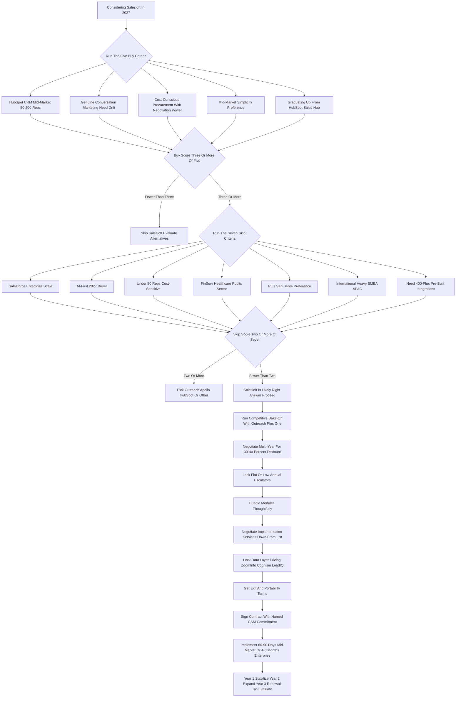

### Direct Answer

Salesloft is worth buying in 2027 for roughly 30-40% of mid-market sales-engagement buyers and the wrong choice for the rest. The question is not whether the product is good -- it is mature, stable, and competitive -- but whether your specific buyer profile matches the specific buyers Salesloft now wins: HubSpot-CRM mid-market shops, teams that genuinely use conversation marketing, and procurement teams that can extract a Vista multi-year discount. Run the platform through a five-criterion buy filter and a seven-criterion skip filter before signing; do not pick it on familiarity.

**TL;DR**

- **The verdict in one line.** Salesloft is a mature, focused, fairly-priced mid-market sales-engagement platform with a real Drift-driven differentiator -- it is the right answer for HubSpot mid-market buyers and the wrong answer for enterprise Salesforce, AI-first, and sub-50-rep cost-sensitive buyers.
- **Corporate context drives everything.** Vista Equity Partners took Salesloft private in August 2022 at roughly a **$2.3 billion** valuation, then combined it with conversation-marketing pioneer Drift in early 2024. You are buying a private-equity asset run for cash flow and exit, not a venture-backed growth company.
- **Buy if** you run HubSpot CRM at 50-200 reps, you genuinely need conversation marketing, you have procurement discipline, you want mid-market simplicity, or you are graduating up from HubSpot Sales Hub.
- **Skip if** you run Salesforce at enterprise scale, you are an AI-first buyer, you are under 50 reps and cost-sensitive, you operate in FinServ/Healthcare/Public Sector, you want PLG self-serve, you are international-heavy in EMEA/APAC, or you need 400-plus pre-built integrations.
- **TCO is competitive on cash** -- Vista will discount aggressively for multi-year -- but the equity-style upside of being on a soon-to-IPO challenger is gone.
- This entry sits alongside the post-Vista Salesloft cluster: Vista's playbook reshaping Salesloft (q1847), the head-to-head Salesloft vs Outreach buy call (q1854), the 2027 buy comparison (q1906), and how Salesloft competes against AI-native sequencing tools (q1850).

## 1. What Salesloft Actually Is In 2027

Buying the right tool starts with naming the category honestly. Salesloft in 2027 is a mature, well-run platform with a specific shape -- and the buyer who understands that shape buys well.

### 1.1 The Product Category And Where It Sits

Salesloft is a **sales-engagement and revenue-orchestration platform** -- the system of record for outbound and follow-up activity executed by a B2B sales team. In plain terms, it is the software a sales development representative (SDR) and an account executive (AE) live in every day to run multi-step sequences of email, phone, LinkedIn, and SMS touches against a list of prospects, log conversations and calls, capture meeting outcomes, and trigger the next step. It sits between the **CRM** -- Salesforce, HubSpot, Microsoft Dynamics, the system of record for accounts, contacts, opportunities, and pipeline -- and the **revenue intelligence layer** (Gong, Clari, Chorus) which captures and analyzes conversations. The CRM tells you who to call; the engagement platform tells you when, how, and through which channel, then logs what happened.

### 1.2 The 2027 Product Surface

By 2027 the category has matured beyond pure cadence into a broader **revenue orchestration** posture: AI-assisted email drafting, conversation summarization, deal-risk signals, forecasting hooks, and integrated conversation marketing. Salesloft's specific product surface includes five modules:

- **Cadence** -- the original multi-channel sequencing engine that defined the category.
- **Conversations** -- call recording, transcription, and conversation analytics.
- **Deals** -- pipeline management and forecasting hooks.
- **Drift** -- conversation marketing: web chat, chatbots, conversational landing pages, and ABM live conversations, inherited from the Drift merger.
- **Rhythm** -- the AI signal-to-action engine that ranks and prioritizes seller actions across the platform.

### 1.3 Who Salesloft Sells To

Salesloft is sold primarily to **mid-market and lower-enterprise B2B SaaS, services, and technology companies** running sales teams of roughly 25-500 reps, with a strong concentration in HubSpot-CRM shops and a meaningful base in Salesforce shops that prefer Salesloft's UX and pricing posture to Outreach's enterprise heaviness. The product is good, the company is stable, and the question for a 2027 buyer is not "does this work" -- it does -- but "is this the right fit for my CRM, my scale, my procurement posture, my AI ambitions, and my vertical." For the deeper read on how Salesloft makes money and sustains margin under Vista, see how Salesloft makes money in 2027 (q1852).

### 1.4 The Buyer Persona Who Actually Signs

In practice, the Salesloft buying decision in a mid-market organization is owned by a small set of personas, and naming them sharpens the evaluation. The **VP of Sales or Chief Revenue Officer** owns the business case -- they care about rep productivity, pipeline coverage, and forecast reliability, and they will champion or kill the deal. The **revenue-operations leader** owns the technical fit -- CRM integration depth, data hygiene, reporting, and the admin burden -- and is the persona most likely to surface a skip criterion. The **SDR or AE front-line manager** owns adoption -- if the day-to-day workflow is clumsy, the rollout fails regardless of the contract terms. **Procurement and finance** own the commercial terms -- multi-year discount, escalators, and the total-cost-of-ownership math. A buying committee that treats Salesloft as a CRO-only decision routinely under-weights the revenue-operations fit and the procurement leverage; the disciplined organization runs the evaluation across all four personas and demands a yes from each before signing. This persona discipline is the same rigor a strong revenue organization brings to any major tooling decision, and the buying-committee structure should mirror the seriousness of a multi-year, six-figure commitment.

## 2. The Vista Take-Private And Drift Merger: The Most Important Context

Any honest evaluation of Salesloft in 2027 has to start with corporate context, because the company today is structurally different from the venture-backed challenger many buyers remember.

### 2.1 The August 2022 Take-Private

In **August 2022, Vista Equity Partners took Salesloft private at approximately a $2.3 billion enterprise value**, ending a roughly decade-long venture journey that included rounds led by Insight Partners, HarbourVest, and others. Vista is a private-equity firm with a long history of operating B2B SaaS assets -- it has owned **Marketo**, **Ping Identity** (NYSE-listed before Vista took it private in 2022), **Mindbody**, and dozens of others. Robert Smith, Vista's founder and CEO, built the firm's reputation on a disciplined enterprise-software operating model.

### 2.2 The Vista Playbook

Vista's playbook is well known: take a profitable or near-profitable software asset private, install operating discipline, focus the product, expand margin, raise prices and tighten discounting, bolt on adjacent acquisitions, and exit in five to seven years through a strategic sale or a re-IPO. Vista has run this pattern across its portfolio for two decades, and Salesloft is a textbook target -- a category-relevant asset with margin-expansion headroom. The full mechanics of how this playbook reshapes the platform are covered in Vista's playbook reshaping Salesloft (q1847).

### 2.3 The Drift Merger

Two years into the Vista hold, in **early 2024, Vista combined Salesloft with Drift** -- the conversation-marketing pioneer Vista had also acquired. Drift's chat, chatbot, and conversation-marketing capabilities became the chat and ABM layer of the combined Salesloft offering, and the combined entity has been positioned as the **mid-market revenue-orchestration alternative to Outreach's enterprise pedigree and Apollo's PLG cost play**.

### 2.4 What This Means For A 2027 Buyer

The implications are concrete and shape every buying decision:

- **Run for cash, not growth.** The company is operated for cash flow and eventual exit, which means a stable product, a predictable roadmap, fewer wild bets, and disciplined commercial execution.
- **Drift is a genuine differentiator.** Conversation marketing inside a sales-engagement platform is hard to replicate without a similar acquisition -- Outreach and Apollo do not match it natively.
- **You negotiate against a Vista-trained commercial team.** They discount aggressively for multi-year commitments but hold price firmly on month-to-month and short-term deals.
- **Exit risk is real but bounded.** Vista exits in the 2028-2030 window -- possibly to a larger platform (Salesforce, Microsoft, Adobe, ServiceNow, and Oracle have all been speculated) or via re-IPO -- creating non-zero strategic disruption risk that buyers should price into a multi-year commitment.

None of this makes Salesloft a bad buy; it makes it a specifically-shaped buy that rewards the buyer who understands the corporate context and penalizes the buyer who treats it as 2018-era venture-backed Salesloft.

## 3. The Competitive Field You Are Actually Comparing Against

A 2027 buying decision on sales engagement is a comparison, not an evaluation in isolation. The field has consolidated around five real alternatives that any serious shortlist must include.

### 3.1 The Five Real Alternatives

| Alternative | What It Is | Wins For | Loses For |
|-------------|-----------|----------|-----------|
| **Outreach** | The enterprise leader -- deepest Salesforce integration, most mature Strategic Account program, largest integration marketplace (400-plus), most aggressive shipped-AI roadmap | Enterprise SFDC shops, AI-forward buyers, regulated verticals, international depth | Mid-market simplicity, faster implementation, lower list price |
| **Apollo.io** | The PLG cost killer -- self-serve, contact-data-bundled platform at $50-$80 per user per month including an enormous B2B database | Under-50-rep cost-sensitive buyers, PLG-leaning teams, data-plus-engagement on one bill | Enterprise readiness, cadence depth at scale, named-account data quality |
| **HubSpot Sales Hub** | The native-CRM bundle -- Sales Hub Enterprise provides competent sequencing inside HubSpot at no incremental tooling cost | HubSpot-native shops, sub-100-rep teams, bundled-pricing economics | High-volume outbound cadence depth, advanced AI drafting, conversation marketing |
| **Gong Engage** | The conversation-intelligence-led entrant -- Gong leveraged its massive conversation-intelligence installed base into an adjacent engagement product | Existing Gong shops consolidating onto one vendor | Standalone cadence maturity, depth versus dedicated platforms |
| **Clari Copilot / Groove** | The revenue-platform consolidation play -- Clari's 2022 Groove acquisition combined cadence with Clari's forecasting platform | Buyers consolidating onto Clari as the revenue-operations spine | Standalone engagement evaluation versus dedicated platforms |

### 3.2 Salesloft's 2027 Win Zone

Salesloft's win zone is the **mid-market HubSpot or HubSpot-leaning shop**, the buyer who values the Drift conversation-marketing layer, the cost-conscious procurement that can extract a Vista multi-year discount, and the team that prefers a focused mid-market product to enterprise complexity or PLG self-serve. The wrong move is to evaluate Salesloft against itself; the right move is to evaluate it against the specific alternative that fits your CRM, scale, vertical, and AI posture. The detailed cross-CRM head-to-head is covered in Outreach vs Salesloft -- which should you buy in 2027 (q1906) and Salesloft vs Outreach -- which should you buy (q1854).

### 3.3 The Consolidation Backdrop

The competitive field is itself moving. The category has seen repeated M&A speculation -- whether Outreach should acquire Apollo (q1892) and whether the broader engagement and conversation-intelligence categories will collapse into fewer vendors. A 2027 buyer is not just picking a product; they are betting on which vendors will still be independent and well-resourced in 2029. The relevant insight: a buyer should weight a vendor's strategic stability alongside its product, because a vendor absorbed mid-contract can see roadmap priorities reshuffled, integration commitments deprioritized, and pricing posture changed. Salesloft's Vista ownership makes it more predictable than a venture-backed vendor chasing a raise, but the eventual Vista exit reintroduces the same uncertainty in the 2028-2030 window.

### 3.4 Why The Field Narrowed To Five

Five years earlier, the sales-engagement category had a longer tail of credible vendors. By 2027 it has compressed to five because the economics of the category reward scale: a sales-engagement platform needs deep CRM integration on both Salesforce and HubSpot, a mature AI roadmap, a security and compliance posture that survives enterprise procurement, and an integration marketplace -- and each of those is expensive to build and maintain. Sub-scale vendors either got acquired, narrowed to a niche, or fell off serious shortlists. The practical consequence for a 2027 buyer is that the shortlist writes itself: Outreach, Apollo, HubSpot Sales Hub, Gong Engage, and Clari Copilot are the credible field, and Salesloft sits among them as the focused mid-market option. A buyer evaluating a sixth vendor outside this set should ask hard questions about that vendor's scale, roadmap funding, and five-year viability.

## 4. The Five Buy Criteria: When Salesloft Is The Right Answer

A serious buyer should run a structured five-criterion buy test before saying yes, because the platform's 2027 win-zone is specific.

### 4.1 Buy Criterion One -- HubSpot CRM At Mid-Market Scale

If your CRM is HubSpot and you have 50-200 reps, Salesloft is a preferred partner of the HubSpot ecosystem, the integration is mature and bidirectional, and the joint go-to-market motion is well established. Operators repeatedly cite roughly 60-70% win-rates in head-to-head HubSpot situations, driven by integration depth and partnership lock-in. HubSpot Sales Hub is the in-platform alternative, but teams past the 50-rep mark with serious outbound motions typically outgrow Sales Hub's cadence depth -- see how Salesloft wins the HubSpot CRM customer base (q1857).

### 4.2 Buy Criterion Two -- Genuine Need For Conversation Marketing

The Drift inheritance is a real, hard-to-replicate edge: integrated web chat, conversational chatbots, conversational landing pages for ABM, and live web conversations as part of the same engagement platform that runs your sequences. If your demand-gen and sales motion includes serious chat or ABM live conversations -- increasingly common in B2B mid-market and enterprise -- Salesloft natively delivers what Outreach and Apollo do not.

### 4.3 Buy Criterion Three -- Cost-Conscious Procurement That Can Negotiate

Vista commercial teams are trained to win the multi-year, and they will discount aggressively -- 30-40% off list is realistic for a committed multi-year agreement. A procurement team that can run the multi-vendor process, force a competitive bake-off, and commit to multi-year extracts genuine total-cost-of-ownership savings.

### 4.4 Buy Criterion Four -- Mid-Market Simplicity Preference

Outreach's enterprise heaviness -- more configuration, more admin overhead, deeper change management -- is overkill for many mid-market teams that want sequencing depth without a six-month implementation. Salesloft's UX is cleaner, the onboarding is faster, and the implementation is lighter, which matters operationally for a mid-market team without a dedicated revenue-operations bench.

### 4.5 Buy Criterion Five -- Graduating Up From HubSpot Sales Hub

A team that started on HubSpot CRM with HubSpot Sales Hub Enterprise as the engagement layer, and has now grown past the 50-rep threshold where Sales Hub feels thin on cadence depth, gets a smooth migration path to Salesloft within the HubSpot ecosystem. The data, the workflows, and the integration are already there. **The buy-test rule:** answer yes to three or more of the five criteria and Salesloft is a serious candidate; answer yes to four or all five and it is likely the right answer.

## 5. The Seven Skip Criteria: When An Alternative Wins

The negative-case discipline matters as much as the positive case, because the wrong fit on a multi-year contract is a multi-million-dollar mistake.

### 5.1 Skip Criterion One -- Salesforce CRM At Enterprise Scale

If you run Salesforce at enterprise scale -- 200-plus reps, deep custom objects, complex named-account hierarchies, strategic-account programs -- Outreach's Salesforce plumbing, Strategic Account program, and enterprise-grade configuration genuinely beat Salesloft. The Salesforce-Outreach pairing is the established enterprise default for a reason.

### 5.2 Skip Criterion Two -- AI-First 2027 Buyer

A buyer whose primary 2027 evaluation criterion is "which platform ships the most aggressive, most agentic, most frontier-model-integrated AI today" should pick Outreach -- it has been roughly 18-24 months ahead on Smart Email Assist, AI agent surfaces, and autonomous-cadence experiments. Salesloft Rhythm is real and improving, but Outreach has shipped more, faster. See how Salesloft competes against AI-native sequencing tools (q1850).

### 5.3 Skip Criterion Three -- Under 50 Reps And Cost-Sensitive

Below 50 reps the math turns against Salesloft. Apollo's $50-$80 per-user-per-month price point plus bundled contact data beats the combination of Salesloft plus a separate data provider (ZoomInfo, Cognism, LeadIQ) on TCO by a wide margin, and the PLG self-serve onboarding is friendlier for a small team.

### 5.4 Skip Criterion Four -- FinServ, Healthcare, Or Public Sector

Vertical depth and compliance posture matter in regulated industries, and Outreach has invested more deeply -- FedRAMP coverage, financial-services-specific configurations, healthcare compliance documentation, and a longer track record of enterprise procurement in these verticals.

### 5.5 Skip Criterion Five -- PLG Self-Serve Preference

A team that wants to swipe a credit card, set up in a day, run for a quarter, and decide whether to expand should pick Apollo. The PLG motion is structurally different from Salesloft's sales-led enterprise motion, and forcing a PLG team through a Salesloft sales cycle creates friction.

### 5.6 Skip Criterion Six -- International Heavy In EMEA And APAC

International presence, partner network, and language and data-residency support favor Outreach in EMEA and APAC. Salesloft has international presence but Outreach has the broader and deeper international partner ecosystem.

### 5.7 Skip Criterion Seven -- Need For 400-Plus Pre-Built Integrations

Outreach's integration marketplace is the largest in the category. For a buyer with a long tail of niche tools that need pre-built connectors, Outreach is the safer bet. Salesloft's integration count is competitive and growing but smaller. **The skip-test rule:** answer yes to two or more of the seven skip criteria and Salesloft is probably the wrong choice; a serious shortlist should then lead with Outreach, Apollo, HubSpot Sales Hub, Gong Engage, or Clari Copilot depending on which skip criteria triggered.

## 6. Total Cost Of Ownership: The Honest Math For 2027 Buyers

A 2027 buyer must run a clean TCO model rather than compare list prices, because the real economics depend on what is bundled and what is added separately.

### 6.1 The Salesloft Price Range

Salesloft does not publish list pricing publicly, but operators and procurement professionals consistently report a 2027 effective per-seat range of roughly **$125-$180 per user per month for the core engagement platform on a multi-year commit**, with adders for Conversations, Deals, Drift, and the Rhythm AI engine pushing fully-loaded all-in pricing to roughly **$180-$280 per user per month** for a buyer adopting the broader platform. Multi-year commitments and competitive procurement processes can extract another 20-35% off these numbers.

### 6.2 The Full TCO Stack

The TCO model that matters for Salesloft includes six components, not just per-seat cost:

- **Per-seat platform cost** at the multi-year rate.
- **The data layer** -- ZoomInfo, Cognism, or LeadIQ at $15-$40 per user per month additional if data is not internally sourced.
- **Implementation services** -- typically $20K-$80K one-time depending on complexity.
- **Integration build for non-marketplace tools** -- variable but real.
- **Training and certification** -- modest but ongoing.
- **Annual escalators** -- typically 5-7% built into multi-year contracts unless negotiated to flat.

For a 100-rep mid-market team on a three-year commit with the broader platform, all-in TCO lands roughly **$700K-$1.1M per year** for Salesloft -- comparable to or slightly below Outreach at the same scope, meaningfully above Apollo, and well above HubSpot Sales Hub. The TCO discipline: do not compare list prices, build the full stack including data and implementation, and weight the multi-year commitment realistically.

### 6.3 The Hidden Costs Buyers Routinely Miss

Three cost categories are systematically under-counted in Salesloft business cases, and a disciplined buyer surfaces them before signing. **First, the data-layer cost is not optional.** Salesloft does not bundle contact data, so a buyer who does not already own ZoomInfo, Cognism, or LeadIQ must add $15-$40 per user per month -- on a 100-rep team that is $18K-$48K per year that an incomplete business case omits entirely. **Second, the admin and revenue-operations headcount cost is real.** A serious Salesloft deployment needs a partial-to-full revenue-operations resource to own sequences, reporting, integration health, and user provisioning; pretending the platform runs itself understates the true cost of ownership by a fully-loaded headcount fraction. **Third, the change-management cost of migration is genuine.** Moving 100 reps off a prior tool involves lost selling time during onboarding, the temporary productivity dip while reps re-learn workflows, and the management overhead of driving adoption -- none of which appears on a vendor quote but all of which is a real cost the business absorbs. A buyer who builds the business case with only the per-seat number will be surprised; a buyer who counts all three hidden categories negotiates from reality.

### 6.4 Salesloft TCO And Competitive Pricing Comparison

| Platform | Per-User Per-Month (Multi-Year) | Data Bundled | Add-Ons (AI, Convs, Deals) | All-In 100-Rep TCO/Yr | Best Fit |
|----------|--------------------------------|--------------|---------------------------|----------------------|----------|
| Salesloft (Cadence + Conversations + Drift + Rhythm) | $180-$280 | No (add ZoomInfo/Cognism/LeadIQ) | Drift, Rhythm, Conversations, Deals | $700K-$1.1M | Mid-market HubSpot, conversation-marketing need |
| Outreach (Engagement + Smart AI + Deal Insights) | $200-$310 | No (separate data) | Smart Email Assist, Kaia, AI Agents | $850K-$1.3M | Enterprise SFDC, AI-first, FinServ/Healthcare |
| Apollo.io (Engagement + Data) | $50-$80 | Yes (bundled B2B database) | Apollo AI, Chat, Conversations | $300K-$450K | Under 50 reps, PLG, cost-sensitive |
| HubSpot Sales Hub Enterprise | ~$100-$150 (bundled in HubSpot) | Partial (HubSpot Breeze Intelligence) | Breeze AI, Conversations | Effectively bundled in HubSpot Enterprise | HubSpot CRM, sub-100 reps |
| Gong Engage | $150-$220 | No | Gong's Conversation AI core | $600K-$900K | Existing Gong shops |
| Clari Copilot (Groove) | $130-$200 | No | Clari forecasting integration | $500K-$800K | Clari revenue-platform consolidation |

The table shows the pattern bluntly: Salesloft and Outreach sit in the same enterprise tier on price; Apollo dominates on TCO under 100 reps; HubSpot Sales Hub wins for HubSpot-bundled buyers; Gong Engage and Clari Copilot fall within the Salesloft band but win specifically when their core platform is already adopted.

## 7. Salesloft Versus Outreach: The Detailed Head-To-Head

Outreach is the alternative every Salesloft evaluation must beat, and a careful side-by-side reveals where each genuinely wins.

### 7.1 Where Outreach Wins

- **CRM integration depth (Salesforce).** Outreach's Salesforce plumbing is the deepest in the category -- bidirectional sync of custom objects, complex named-account hierarchies, and Strategic Account program orchestration.
- **AI surface.** Outreach has shipped more AI capability faster -- Smart Email Assist for personalized outbound drafting, the Outreach AI agent surfaces for autonomous cadence, and frontier-model integrations -- roughly 18-24 months ahead of Salesloft's Rhythm.
- **Enterprise pedigree.** Outreach won the enterprise market early and has deeper capabilities for 500-plus-rep deployments, complex security and compliance reviews, and FedRAMP-grade public-sector deals.
- **Integration marketplace.** Outreach's 400-plus pre-built integrations is the larger marketplace.

### 7.2 Where Salesloft Wins

- **CRM integration depth (HubSpot).** Salesloft's HubSpot integration is the deepest in the category in the other direction.
- **Mid-market UX and implementation.** Salesloft's UX is cleaner, the configuration is lighter, and the implementation is faster -- a real advantage for mid-market teams without a heavy revenue-operations function.
- **Conversation marketing.** Salesloft's Drift inheritance gives it a chat and conversation-marketing layer Outreach does not natively match.
- **Pricing posture.** Salesloft under Vista is willing to discount aggressively for multi-year; Outreach holds firmer at list at the enterprise tier.

### 7.3 The Verdict

Outreach for enterprise Salesforce, AI-first buyers, regulated verticals, and international depth; Salesloft for mid-market HubSpot, conversation-marketing need, cost-sensitive procurement, and faster implementation. The buyer's CRM choice largely pre-determines this comparison -- which is why the head-to-head buy call in q1854 and q1906 both route on primary CRM first.

## 8. Salesloft Versus Apollo: The Cost-And-Scale Cut

Apollo is the cost killer below 100 reps, and any buyer at that scale should run the comparison honestly.

### 8.1 Apollo's Structural Advantage

**Apollo's structural advantage is bundled contact data.** Salesloft and Outreach both require a separate data provider -- ZoomInfo, Cognism, or LeadIQ -- which adds $15-$40 per user per month to the stack. Apollo bundles a competitive B2B contact database into the engagement platform at a single $50-$80 per user per month price point, which collapses the data-plus-engagement stack into one bill. For a 30-rep team, this can be the difference between $25K per year (Apollo) and $90K per year (Salesloft plus data) -- a structural TCO advantage that is hard to argue against at sub-50-rep scale.

### 8.2 Where Apollo Falls Short

- **PLG model is a different buying motion.** Self-serve, credit-card, set up in a day -- this matches modern mid-market buying behavior, but it is structurally different from a sales-led procurement cycle.
- **Data-quality reality.** Apollo's database is large but not as deep or accurate as ZoomInfo's enterprise tier; in segments where data quality is critical, the apparent cost advantage shrinks.
- **Cadence and platform depth.** Apollo's engagement engine is competent but historically less sophisticated than Salesloft's or Outreach's at scale -- it has closed the gap but enterprise teams with complex multi-touch motions sometimes outgrow it.
- **Enterprise readiness.** Security posture, compliance maturity, custom configuration, and enterprise procurement readiness lag Salesloft and Outreach.

### 8.3 The Verdict

Apollo for under 50-100 reps, PLG-leaning, cost-sensitive, and data-bundled; Salesloft for 50-300 reps where engagement-platform sophistication, conversation marketing, and HubSpot fit matter more than the absolute lowest TCO. The classic three-way evaluation -- Outreach vs Salesloft vs Apollo for outbound cadences -- is laid out in q110.

## 9. Salesloft Versus HubSpot Sales Hub: The Native-CRM Cut

For HubSpot CRM customers, the most underappreciated alternative to Salesloft is HubSpot Sales Hub itself, and a serious evaluation should include it.

### 9.1 Where Sales Hub Is Enough

**Sales Hub Enterprise's sequencing and engagement capabilities are now genuinely competent** for teams up to roughly 50-100 reps with standard outbound motions -- sequencing, templates, snippets, meeting scheduling, basic call recording, basic conversation intelligence, and native integration with the rest of the HubSpot suite. **The bundled-pricing math is hard to beat:** if you are already paying for HubSpot Enterprise, the marginal cost of Sales Hub Enterprise capability is much lower than buying Salesloft separately. Sales Hub is enough for account-executive-led teams with moderate outbound volume and smaller mid-market teams that value bundled simplicity.

### 9.2 Where Sales Hub Falls Short

Sales Hub falls short on deep cadence sophistication for high-volume outbound teams, advanced AI-assisted drafting, conversation-marketing depth, specialized SDR workflow tooling, and the kinds of capabilities that mid-market 100-plus-rep outbound machines need.

### 9.3 The Graduation Path

**The verdict and the Salesloft graduation path:** Sales Hub for HubSpot teams under 50 reps with moderate outbound; Salesloft for HubSpot teams that have outgrown Sales Hub's cadence depth and need the dedicated platform without leaving the HubSpot ecosystem. Salesloft has explicitly built the migration path from Sales Hub upward -- and the strategic question of how Salesloft defends against HubSpot Sales Hub bundling is covered in q1855.

## 10. Salesloft Versus Gong Engage And Clari Copilot: The Adjacent-Platform Cuts

Two other comparisons matter for buyers consolidating onto a broader platform.

### 10.1 Gong Engage

**Gong Engage** is Gong's adjacent-product launch into engagement, leveraging Gong's massive installed base in conversation intelligence -- Gong's original product, where they remain the category leader. For shops where Gong is already the deal-and-conversation system of record, Gong Engage is the natural in-platform extension and avoids running two vendors for related functions. The product is newer and less mature in cadence depth than Salesloft, but improving fast, and especially appealing to teams that prize conversation-intelligence-led workflows where AI insights from calls feed directly into the next sequence touch.

### 10.2 Clari Copilot

**Clari Copilot (formerly Groove)** is the engagement product of Clari, which acquired Groove in 2022 and integrated it into the Clari revenue platform. For buyers consolidating onto Clari as the revenue-operations spine -- forecasting, deal management, revenue intelligence -- Clari Copilot is the in-platform engagement layer and avoids the integration tax of a separate Salesloft or Outreach. The standalone product is competent; the platform integration is the differentiator. Whether Salesloft's own pipeline AI is worth buying versus Clari is the subject of q1860, and the question of when to add a forecasting tool like Clari versus using Salesforce reports is covered in q108.

### 10.3 The Pattern For Both

Adjacent platforms win specifically when the parent platform is already adopted and consolidation pressure favors the in-platform option; they lose when the buyer evaluates engagement on its own merits, where the dedicated platforms still lead. A buyer with Gong or Clari already in place should include the in-platform option on the shortlist; a buyer without either should not pick Salesloft over Gong Engage or Clari Copilot on a consolidation argument that does not apply to them.

## 11. The Drift Layer And The Rhythm AI Engine: The Two Salesloft-Specific Stories

The two most-cited Salesloft-specific advantages deserve a clear-eyed, honest evaluation.

### 11.1 The Drift Conversation-Marketing Layer

For buyers who actually use chat and conversation marketing as part of their demand-gen and sales motion, Drift inside Salesloft is a real, hard-to-replicate edge. Drift's chat, chatbots, conversational landing pages, ABM live conversations, and conversational ads are mature and competitive in their own right -- Drift was the category leader in B2B conversation marketing before the Vista acquisition. The integration into Salesloft means chat conversations, chatbot-qualified leads, and ABM live-conversation outcomes flow into the Salesloft engagement and pipeline data without a separate integration tax.

**The honest counter:** for buyers who do not actively use chat, who run pure outbound motions, or whose chat is a low-priority channel, the Drift layer is paid-for capability that does not earn its keep, and a buyer who will not use it is overpaying for the integrated stack. **The buyer test:** is chat or conversation marketing a real, planned, used channel in your demand-gen and sales motion in 2027 and 2028?

### 11.2 The Rhythm AI Engine

Salesloft's AI story in 2027 centers on the **Rhythm** engine -- the signal-to-action layer that ranks and prioritizes seller actions, draws on Conversations and Deals data to surface deal-risk signals, and drives the daily prioritized work surface a seller sees on opening the platform. **What Rhythm does well:** signal aggregation across email, calls, meetings, and chat; deal-risk surfacing; next-best-action suggestions; and increasingly, AI-assisted drafting of personalized outbound. The product is genuinely good and has closed meaningful ground on Outreach's earlier AI lead.

**Where Outreach is still ahead:** Smart Email Assist for personalized outbound drafting at scale, the Outreach AI agent surfaces for autonomous cadence experimentation, frontier-model integrations, and the sheer volume of shipped AI capability over the last 18-24 months. **The 2027-2028 trajectory:** Rhythm is improving fast under Vista's investment, the gap is narrowing each quarter, and the structural reality is that frontier-model capability is increasingly commoditized -- both platforms can plug into GPT-class, Claude-class, and Gemini-class models, and the differentiator is increasingly the workflow integration rather than the underlying model.

### 11.3 How To Evaluate The AI Claims Honestly

Every sales-engagement vendor in 2027 markets aggressively on AI, and a disciplined buyer must separate shipped capability from roadmap promise. **Demand a live demo on your data, not a canned one.** Vendor demos use clean, curated data; the real test is whether the AI produces useful drafts and accurate deal-risk signals against your messy CRM. **Ask what is generally available versus in beta versus on the roadmap.** A capability described as "coming soon" should be worth zero in the business case until it ships. **Probe the human-in-the-loop boundary.** In 2027 the realistic state of the art is AI-assisted human selling -- the AI drafts, summarizes, prioritizes, and the rep approves; a vendor claiming fully autonomous outbound is overselling, and the buyer should treat that claim skeptically. **Check the model-update cadence.** Because frontier models improve every few months, the platform that re-plumbs to the newest model fastest holds a temporary edge -- ask how the vendor handles model upgrades and whether they pass through new capability or gate it behind a higher tier. A buyer who runs this four-part interrogation evaluates Rhythm and Smart Email Assist on what they actually do today, not on the marketing narrative.

## 12. Vertical Fit: Where Salesloft Wins And Loses By Industry

Industry vertical materially shapes the Salesloft buying decision, and a serious evaluation includes vertical fit.

### 12.1 The Vertical Pattern

Salesloft wins in **B2B SaaS and Technology** -- its strongest vertical, where the HubSpot-leaning mid-market and the conversation-marketing motion are most prevalent -- as well as **Professional Services** and **mid-market Education** institutions that commonly run HubSpot. Salesloft loses to Outreach in **Financial Services**, **Healthcare and Life Sciences**, and **Public Sector and Government**, where vertical depth, compliance posture, and FedRAMP-adjacent capabilities are decisive. **Manufacturing**, **Retail and Consumer**, and **Real Estate and Construction** are mixed and depend heavily on the specific platform stack and the complexity of the account-based motion.

### 12.2 Vertical Fit Matrix: Salesloft Vs Competitors By Industry

| Vertical | Salesloft Fit | Outreach Fit | Apollo Fit | HubSpot Sales Hub Fit | Recommended Default |
|----------|---------------|--------------|------------|----------------------|---------------------|
| B2B SaaS / Technology (mid-market 50-200 reps) | Strong | Strong | Strong (under 50) | Good (HubSpot shops) | Salesloft if HubSpot, Outreach if SFDC enterprise |
| Professional Services | Strong | Good | Good (under 50) | Good (HubSpot shops) | Salesloft for HubSpot mid-market |
| Manufacturing / Industrial | Mixed | Strong | Limited | Limited | Outreach for enterprise account orchestration |
| Financial Services / FinTech | Mixed | Strong | Limited | Limited | Outreach for compliance and vertical depth |
| Healthcare / Life Sciences | Limited | Strong | Limited | Limited | Outreach for HIPAA and compliance |
| Public Sector / Government | Limited | Strong (FedRAMP) | Limited | Limited | Outreach for FedRAMP and gov procurement |
| Education (mid-market institutions) | Strong (HubSpot prevalence) | Good | Mixed | Strong | Salesloft or HubSpot Sales Hub |
| Retail / Consumer (B2B motions) | Mixed | Mixed | Mixed | Mixed | Depends on CRM and scale |
| Real Estate / Construction | Mixed | Mixed | Limited | Strong (HubSpot) | HubSpot Sales Hub or Salesloft |
| Startups (sub-50 reps, cost-sensitive) | Limited | Limited | Strong | Strong | Apollo or HubSpot Sales Hub |

### 12.3 The Regulated-Vertical Caution

A 2027 buyer in a regulated vertical should weight vertical fit heavily and should not pick Salesloft on general fit if vertical depth pushes toward Outreach. The compliance gap is not a marketing nuance -- it surfaces in enterprise-procurement security reviews and can stall or kill a deployment after the contract is signed.

## 13. The Buying Decision Tree

The decision tree below walks the full path from initial interest to a signed contract -- the five buy criteria, the seven skip criteria, and the procurement sequence.

### 13.1 How To Read The Tree

The decision tree is a gate sequence, not a scorecard. The buyer enters at the top with a genuine interest in Salesloft -- usually because someone on the team has used it, a HubSpot account team recommended it, or it appeared in an analyst report. The first gate is the **five buy criteria**: the buyer must clear three or more to proceed. A buyer who clears fewer than three should stop and evaluate alternatives, because the structural fit is not there and no amount of negotiation discipline fixes a fit problem. The second gate is the **seven skip criteria**: even a buyer who cleared the buy gate must then confirm they trigger fewer than two skip criteria. Two or more skip triggers means an alternative -- Outreach, Apollo, HubSpot Sales Hub, Gong Engage, or Clari Copilot -- is the better answer. Only a buyer who clears both gates proceeds into the procurement sequence. The discipline here protects against the single most common mistake: a buyer who likes Salesloft, clears the buy criteria, but ignores a decisive skip criterion (enterprise Salesforce, regulated vertical, sub-50-rep cost sensitivity) and signs a multi-year contract that the organization regrets within two quarters.

### 13.2 The Full Path Visualized

## 14. The Procurement Playbook: How To Negotiate A Salesloft Deal

A buyer who has decided Salesloft is the right answer should run a disciplined procurement process to extract genuine value.

### 14.1 The Eight Negotiation Levers

| Step | Lever | What To Do | Why It Matters |
|------|-------|-----------|----------------|
| 1 | Competitive process | Force a bake-off with Outreach plus one relevant alternative | Vista teams discount harder when they know they are competing |
| 2 | Multi-year commit | Commit three years for the discount sweet spot | Vista commercial training rewards multi-year with 30-40% off list |
| 3 | Escalators | Negotiate annual escalators to flat or 3% | Compounding 5-7% on a $700K-$1.1M base materially changes Year 3 cost |
| 4 | Module bundling | Buy only the modules you will deploy | Salesloft prices Cadence, Conversations, Deals, Drift, Rhythm separately |
| 5 | Implementation services | Push for credits, free seats, or extended onboarding | The $20K-$80K implementation fee is genuinely negotiable |
| 6 | Data layer pricing | Lock ZoomInfo/Cognism/LeadIQ pricing in the same cycle | Avoids surprise data-cost inflation in Year 2 |
| 7 | Exit and portability | Negotiate data-export and material-change termination rights | Protects against a Vista exit to a vendor you do not want |
| 8 | References and product access | Get vertical references, a named CSM, and product-team access | Leverage you hold at signing and lose afterward |

### 14.2 The Disciplined-Buyer Outcome

The disciplined buyer extracts 30-40% off list, flat or low escalators, bundled implementation, and protective exit terms. The undisciplined buyer pays list, accepts 7% escalators, and has no real recourse if the relationship sours. The difference across a three-year contract on a 100-rep deployment is comfortably six figures -- procurement rigor here is not bureaucratic friction, it is direct margin.

### 14.3 Timing The Negotiation

Beyond the levers themselves, when a buyer negotiates materially changes the outcome. Vista-trained commercial teams carry quarterly and annual quota pressure, and a deal that lands in the final two weeks of a quarter -- particularly the fiscal-year-end quarter -- gives the buyer the most leverage on discount and terms. A buyer who can credibly hold the decision until quarter-end, while keeping a competitive alternative warm, will see the discount move. The converse trap: a buyer who signals urgency, reveals a hard internal deadline, or lets the vendor learn that the alternative bake-off was theater will pay closer to list. The disciplined buyer treats timing as a lever equal in weight to the multi-year commit -- run the process so the close lands when the vendor needs it most, not when the buyer is most eager.

## 15. Implementation And The First 90 Days

A 2027 Salesloft deployment runs on a predictable arc, and a buyer should plan for it realistically rather than be surprised.

### 15.1 The 90-Day Arc

| Phase | Days | What Happens | Key Risk |
|-------|------|-------------|----------|
| Discovery and configuration | 1-14 | CRM integration mapping, sequence audit, user provisioning, role configuration | Messy Salesforce or HubSpot data surfaces here and slows everything |
| Build and migrate | 15-45 | Sequences, templates, snippets built or migrated; integrations connected; admin training begins | Complex enterprise builds with many integrations run to 6-8 weeks |
| Pilot and train | 46-75 | A 10-25 rep cohort runs in production with active customer-success support | Pilot surfaces workflow bugs and change-management friction |
| Roll out and stabilize | 76-90 | Full team rolls on, prior tool sunsetted, dashboards configured, first QBR scheduled | Change-management resistance from reps used to the prior tool |

### 15.2 Realistic Time-To-Value

Mid-market mid-complexity deployments hit meaningful productivity gains in 60-90 days; enterprise complex deployments take four to six months to fully stabilize. The implementation risks to plan for: CRM data quality (the silent killer), change-management resistance, integration gaps with niche tools not in the marketplace, and admin-skill gaps if the buyer has no dedicated revenue-operations function. The teams that implement well allocate a dedicated project manager, run a real pilot before full rollout, invest in admin training, and treat the customer-success relationship as a partnership.

## 16. The Post-Sale Reality: Living With Salesloft Year 1-3

A buying decision is not just about the contract; it is about the lived experience of running on the platform for the contract term.

### 16.1 The Three-Year Arc

- **Year 1.** The team learns the platform, sequences get refined, the workflow stabilizes, and the AI signals start being used. Customer-success engagement is high. The risks are implementation gaps and change-management friction.
- **Year 2.** The platform becomes the operational fabric of the sales motion, and the buyer typically expands either seat count or module footprint. The Vista commercial team will push expansion; a disciplined buyer evaluates each module on real need versus nice-to-have. The risks are scope creep and pricing inflation on add-ons.
- **Year 3.** The renewal conversation happens, and the contract terms negotiated at signing become real. Buyers who locked flat or low escalators feel good; buyers who accepted 5-7% escalators feel the compounding bite. The buyer revisits whether Salesloft is still the right answer.

### 16.2 The Adoption Metrics That Predict Renewal

A buyer who wants to know in Year 1 whether the Year 3 renewal will be smooth should track a small set of leading indicators rather than waiting for the renewal conversation. **Active-seat ratio** -- the share of licensed seats logging meaningful daily activity -- is the single best predictor; a ratio below 70% signals an adoption problem that will surface as a downgrade or churn at renewal. **Sequence-completion rate** measures whether reps run multi-step cadences to completion or abandon them, which separates real workflow adoption from login theater. **Logged-activity-per-rep** trending up over the first two quarters indicates the platform is becoming the system of record rather than a parallel tool. **Pipeline sourced through Salesloft sequences** ties the platform to revenue and arms the buyer with the business case at renewal. A revenue-operations leader who instruments these four metrics from day one turns the renewal from a vendor-driven negotiation into a data-driven decision.

### 16.3 The Honest Renewal Reality

**The honest reality:** Salesloft renewals run at a healthy rate -- operators report 85-90%-plus gross retention in mid-market -- the product is sticky, and the migration cost to a competitor is genuine. But a thoughtful renewal evaluation, run with the same rigor as the initial buy, is the discipline that protects the buyer over multiple cycles. The renewal decision criteria are concrete: has the platform delivered against the original buy criteria; has the team grown into a different scale or vertical that changes the fit; has the AI race shifted and made the platform feel behind; and has Vista's exit horizon become more visible and shifted the corporate-context risk. A buyer who answers those four questions honestly at renewal -- rather than defaulting to renewal because switching is painful -- protects the organization across multiple contract cycles.

## 17. Risks: What Could Go Wrong Buying Salesloft In 2027

A serious buyer must confront the risks honestly, because no platform is risk-free and the multi-year commitment magnifies any miss.

### 17.1 The Eight Material Risks

- **Vista exit disruption (2028-2030).** The most likely scenario is a Vista exit via strategic sale or re-IPO. A sale to a Salesforce, Microsoft, Adobe, ServiceNow, or Oracle could materially change the roadmap, integration priorities, or pricing posture.
- **AI race acceleration.** If frontier AI capability accelerates faster than Rhythm can keep pace, Salesloft could fall meaningfully behind Outreach or a new entrant on AI surface.
- **Category consolidation absorbing point-solution engagement.** If HubSpot, Salesforce, Microsoft, or Clari succeed in absorbing engagement into the broader CRM or revenue platform, point-solution Salesloft could face structural headwinds.
- **HubSpot-Salesloft partnership disruption.** A meaningful share of Salesloft's mid-market wins comes through the HubSpot ecosystem partnership; if HubSpot competes more aggressively with Sales Hub, the primary distribution channel could weaken.
- **Drift integration debt.** The Salesloft-Drift merger is a real integration challenge, and integration debt could surface as bugs, workflow friction, or roadmap delays.
- **Pricing inflation on multi-year escalators.** Buyers who do not negotiate flat or low escalators face 5-7% annual compounding.
- **Vendor concentration risk.** Putting Salesloft plus Drift plus Conversations plus Deals on a single vendor increases the cost of switching if the relationship deteriorates.
- **Customer-success quality variance.** Vista-operated commercial teams sometimes prioritize new-logo capture over post-sale customer success; the buyer should negotiate named-CSM commitments.

### 17.2 Risk Severity And Mitigation Matrix

| Risk | Likelihood | Impact If It Materializes | Primary Mitigation |
|------|-----------|---------------------------|--------------------|
| Vista exit disruption (2028-2030) | High over the multi-year window | Moderate -- roadmap and pricing shift | Negotiate material-change termination and data-export rights |
| AI race acceleration | Moderate | Moderate -- competitive disadvantage on AI surface | Prefer a three-year over a five-year term; track Rhythm releases |
| Category consolidation | Moderate over five years | High if point-solution engagement narrows | Avoid over-long contracts; keep CRM-native fallback in mind |
| HubSpot partnership disruption | Low to moderate | High for HubSpot-shop buyers | Confirm partnership status at signing; monitor annually |
| Drift integration debt | Moderate | Low to moderate -- workflow friction | Pilot the Drift module before committing budget to it |
| Multi-year escalator inflation | High if not negotiated | Moderate -- compounding Year 3 cost | Lock flat or 3% escalators at signing |
| Vendor concentration | Buyer-controlled | Moderate -- raises switching cost | Avoid putting the whole revenue stack on one vendor |
| Customer-success variance | Moderate | Moderate -- adoption and renewal risk | Negotiate a named CSM and service-level commitments |

### 17.3 The Honest Framing

These risks are real but manageable with negotiated contract terms, a disciplined renewal process, and avoiding over-concentration on a single vendor. A buyer who acknowledges the risks at signing, prices them into the contract, and runs a disciplined renewal cycle protects against most downside scenarios. The risks that genuinely should change a buying decision -- rather than just inform the contract -- are the structural ones: a buyer who believes point-solution engagement will be absorbed by the CRM within their contract window, or who needs frontier AI today, should weight those concerns into the buy-versus-skip call rather than treating them as negotiable line items.

## 18. Counter-Case: The Argument Against Buying Salesloft At All

Intellectual honesty requires steelmanning the case for skipping Salesloft entirely -- not just choosing a different vendor, but questioning the dedicated-engagement-platform category itself.

### 18.1 The Bear Case

The strongest argument against Salesloft is that the **dedicated sales-engagement category may be structurally obsolete by the end of the decade**. The CRMs are absorbing the function: HubSpot Sales Hub and Salesforce's native sequencing are both "good enough" for a growing share of buyers, and every dollar spent on a separate engagement platform is a dollar spent on a layer the CRM vendor is actively commoditizing. A buyer signing a three-year Salesloft contract in 2027 is betting that point-solution engagement still exists, and still justifies a six-figure annual line item, in 2030 -- a bet the consolidation trend actively works against.

The second bear-case argument is the **AI-agent disruption thesis**: if autonomous AI agents handle outbound entirely, the cadence-orchestration UX that Salesloft, Outreach, and Apollo all sell becomes a legacy interface. The value migrates to whoever owns the agent and the data, not whoever owns the human-in-the-loop sequencing screen. Under that thesis, the right 2027 move is to buy nothing on a long contract and stay flexible -- relevant context lives in whether Salesloft Cadence is still relevant in 2027 (q1851).

### 18.2 Why The Counter-Case Does Not Win For Most Buyers

The counter-case is real but overstated for the typical 2027 mid-market buyer. **First**, the consolidation timeline is slow -- CRM-native sequencing has been "good enough for some buyers" for five years and dedicated platforms still win the serious-outbound mid-market, because depth, workflow, and SDR productivity tooling genuinely matter at 100-plus reps. **Second**, the AI-agent disruption is years from production reliability for full-funnel outbound; the realistic 2027-2028 state is AI-assisted human selling, which is exactly the workflow Salesloft and Outreach are built around. **Third**, doing nothing has a cost too -- a 100-rep team without a real engagement platform loses sequencing rigor, activity data, and forecasting hooks. The honest synthesis: the counter-case is a reason to negotiate a shorter term, lock exit rights, and avoid over-concentration -- not a reason to run a serious mid-market outbound motion on no engagement platform at all.

## 19. The Honest 2027 Verdict: Who Should Buy And Who Should Not

Pulling the entire evaluation into a single decision: Salesloft in 2027 is **the right answer for roughly 30-40% of mid-market sales-engagement buyers and the wrong answer for the rest**. The discipline is matching your specific buyer profile to the specific buyers Salesloft now wins.

### 19.1 The Win And Loss Pattern Reference Table

| Buyer Profile | Salesloft Likely Result | Why | Better Alternative |
|--------------|------------------------|-----|--------------------|
| HubSpot CRM, 100 reps, B2B SaaS, chat-heavy | Strong Win | HubSpot fit, Drift differentiator, mid-market sweet spot | None -- this is the win zone |
| Salesforce CRM, 350 reps, enterprise SaaS, AI-first | Loss | Outreach Strategic Account program plus AI lead | Outreach |
| Salesforce CRM, 60 reps, FinServ, compliance-heavy | Loss | Vertical depth and compliance posture | Outreach |
| HubSpot CRM, 25 reps, startup, cost-sensitive | Loss | TCO dominated by Apollo bundled data | Apollo |
| Salesforce CRM, 80 reps, mid-market SaaS, no chat motion | Mixed | Outreach is the safer enterprise default | Outreach |
| HubSpot CRM, 40 reps, services, light outbound | Loss | HubSpot Sales Hub Enterprise is sufficient | HubSpot Sales Hub |
| Existing Gong customer, 150 reps, conversation-led | Loss | Consolidation favors Gong Engage | Gong Engage |
| Existing Clari customer, 200 reps, revenue-platform consolidation | Loss | Consolidation favors Clari Copilot | Clari Copilot |
| HubSpot CRM, 180 reps, B2B SaaS, ABM-heavy | Strong Win | Drift inheritance is decisive | None -- this is the win zone |
| Salesforce CRM, 500 reps, enterprise FinServ, FedRAMP needed | Strong Loss | Vertical depth, FedRAMP, enterprise SFDC all favor Outreach | Outreach |
| HubSpot CRM, 90 reps, EU-heavy international | Mixed | International depth favors Outreach, HubSpot fit favors Salesloft | Evaluate carefully |
| Microsoft Dynamics, 120 reps | Mixed | Neither platform is CRM-native here | Evaluate on AI, vertical, scale, TCO |

### 19.2 Five Named Buying Scenarios

Concrete scenarios make the abstract criteria tangible. **Marisol Vargas**, VP of Sales at a 120-rep mid-market B2B SaaS company on HubSpot CRM running HubSpot Sales Hub Enterprise, has outgrown Sales Hub's cadence depth and runs an active chat motion -- Salesloft is the right answer; she negotiates a three-year commit at 35% off list, lands at $850K all-in, and implements in eight weeks. **Devraj Menon**, head of revenue operations at a 350-rep enterprise FinServ on Salesforce, picks Salesloft on familiarity and hits vertical-compliance gaps and Salesforce-customization friction -- six months in, the team is in a painful re-evaluation toward Outreach. **Henrietta Cole**, founder of a 25-rep B2B SaaS startup, picks Apollo over Salesloft because the TCO math is decisive -- $15K per year with bundled data versus $80K-$100K for Salesloft plus ZoomInfo. **The Bowman & Reyes** 70-rep regional consulting firm on HubSpot picks Salesloft specifically for the Drift conversation-marketing layer, with chat as their primary inbound channel. **Tomasz Wnuk**, VP of revenue at a 280-rep enterprise SaaS on Salesforce with an AI-first 2027 strategy, picks Outreach for the AI lead, deeper Salesforce plumbing, and FedRAMP-adjacent posture.

### 19.3 The Final Word

The TCO is competitive on multi-year commits, the product is mature and stable, the Drift inheritance is a real differentiator for buyers who use it, the Rhythm AI is competitive but not the frontier, and the Vista corporate context is a meaningful but manageable variable. The right buying behavior: run the five buy and seven skip criteria honestly, do not pick Salesloft on familiarity or vendor relationship, negotiate the multi-year discount aggressively, lock flat or low escalators, plan the implementation realistically, and revisit the decision at renewal with the same rigor as the initial buy. Salesloft is neither the universal answer nor a category mistake -- it is a focused, well-run mid-market platform with a specific win-zone, and the buyers who land in that win-zone get genuine value while the buyers outside it should pick the alternative that fits their specific context.

## Sources

1. Salesloft -- Official Product Documentation, Pricing Posture, And Platform Modules (Cadence, Conversations, Deals, Drift, Rhythm). https://www.salesloft.com
2. Vista Equity Partners -- Portfolio And Take-Private Documentation, August 2022 Salesloft Transaction. https://www.vistaequitypartners.com
3. Drift -- Pre-Acquisition Conversation Marketing Documentation And Post-Merger Integration With Salesloft. https://www.drift.com
4. Outreach -- Official Product Documentation, Strategic Account Program, Smart Email Assist. https://www.outreach.io
5. Apollo.io -- Official Product Documentation, PLG Pricing, Bundled B2B Database. https://www.apollo.io
6. HubSpot Sales Hub -- Official Product Documentation And Sales Hub Enterprise Capabilities. https://www.hubspot.com/products/sales
7. Gong Engage -- Official Product Documentation And Gong Adjacent-Product Launch. https://www.gong.io
8. Clari Copilot (Formerly Groove) -- Clari Acquisition Of Groove And Revenue Platform Integration. https://www.clari.com
9. Forrester Wave -- Sales Engagement Platforms, Industry-Analyst Category Evaluation. https://www.forrester.com
10. Gartner Magic Quadrant -- Sales Engagement Applications, Leaders, Challengers, And Niche Players. https://www.gartner.com
11. G2 -- Sales Engagement Category Reviews Across Salesloft, Outreach, Apollo, HubSpot, Gong, Clari. https://www.g2.com
12. TrustRadius -- Sales Engagement Platform Comparisons And Procurement-Oriented User Reviews. https://www.trustradius.com
13. PitchBook -- Salesloft Vista Take-Private Transaction Details (August 2022). https://pitchbook.com
14. CB Insights -- Sales Engagement Category Mapping And Vendor Funding History. https://www.cbinsights.com
15. TechCrunch -- Vista Equity Acquires Salesloft (August 2022) Coverage. https://techcrunch.com
16. TechCrunch -- Salesloft Combines With Drift Under Vista (Early 2024) Coverage. https://techcrunch.com
17. Bessemer Venture Partners -- State Of The Cloud Reports On B2B SaaS Sales-Engagement Category. https://www.bvp.com
18. OpenView Partners -- PLG And Sales Engagement Reports On Apollo's PLG Model. https://openviewpartners.com
19. Tenbound -- Sales Development And SDR Tooling Research. https://www.tenbound.com
20. Sales Hacker -- Practitioner Coverage Of Sales Engagement Platforms. https://www.saleshacker.com
21. Pavilion -- Practitioner Discussion And Vendor Selection Threads. https://www.joinpavilion.com
22. RevOps Co-op -- Revenue-Operations Community Discussion Of Platform Selection. https://www.revopscoop.com
23. ZoomInfo -- B2B Contact Data Provider And Engagement Layer Pricing Context. https://www.zoominfo.com
24. Cognism -- B2B Contact Data Provider Strong In EMEA, Data-Layer Alternative For EU Buyers. https://www.cognism.com
25. LeadIQ -- B2B Contact Data Provider Commonly Paired With Sales Engagement Platforms. https://leadiq.com
26. Salesforce -- CRM Platform And Sales Cloud Native Sequencing Context. https://www.salesforce.com
27. Microsoft Dynamics 365 -- CRM Platform Context For Non-Salesforce, Non-HubSpot Buyers. https://www.microsoft.com/dynamics365
28. Insight Partners -- Salesloft Venture-Round Investor History. https://www.insightpartners.com
29. Crunchbase -- Salesloft Funding History And Acquisition Timeline. https://www.crunchbase.com
30. SaaStr -- Operator Commentary On Sales Engagement Pricing And Procurement. https://www.saastr.com
31. Sales Hacker Community -- Operator-Reported Win-Rate And Renewal-Rate Benchmarks For Mid-Market Engagement Platforms. https://www.saleshacker.com
32. Vista Equity Partners -- Public Coverage Of Marketo, Ping Identity, And Mindbody Operating-Playbook Precedents. https://www.vistaequitypartners.com
