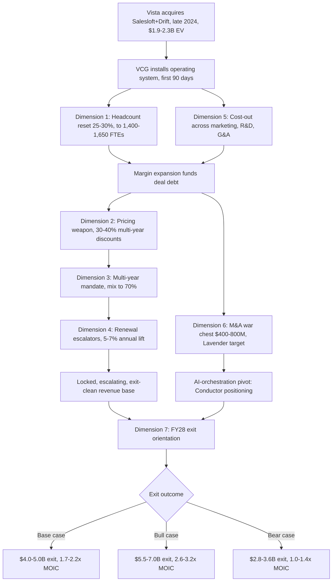

### Direct Answer

Vista Equity Partners is reshaping Salesloft through 2027 by running its standardized software-buyout playbook: a 25-30% headcount reset off the combined Salesloft+Drift baseline, a pricing pivot to aggressive 30-40% multi-year discounts that lock revenue, a 70% multi-year-contract mandate, deep cost-out across marketing, R&D, and G&A, a $400-800M M&A war chest with Lavender as the highest-probability target, and a total FY28-exit orientation tested against one question -- does this raise the strategic-acquirer multiple? The 2027 Salesloft is disciplined, cost-rationalized, multi-year locked, and repositioned as an AI revenue-orchestration layer rather than a venture-era sales-engagement point tool, with a base-case $4.0-5.0B exit delivering Vista a 1.7-2.2x MOIC.

**TL;DR**

- **Vista's playbook is knowable, not improvised.** It has been run dozens of times -- Marketo, Cvent, Ping Identity, Datto, Apptio, TIBCO, Mindbody, Pluralsight, Solera, Granicus -- and Salesloft is dimension-for-dimension predictable.
- **Seven hard dimensions** drive the reshape: headcount reset, pricing weaponization, multi-year mandate, renewal-escalator discipline, cost-out, M&A war chest, FY28-exit orientation.
- **Headcount lands at 1,400-1,650 FTEs** in FY27, down 25-30% from the ~2,200 combined Salesloft+Drift baseline, with cuts concentrated in marketing, junior SDR, junior CSM, and off-strategy R&D.
- **Pricing becomes a weapon:** 30-40% multi-year discounts replace the venture-era 10-15%, locking revenue ahead of exit while renewal escalators defend a 5-7% annual lift.
- **The exit is the whole point:** base case $4.0-5.0B / 1.7-2.2x MOIC, bull case $5.5-7.0B / 2.6-3.2x if Lavender integration completes and the AI-orchestration pivot lands.
- **For buyers:** expect harder negotiation, longer contracts, faster renewal escalators, and a roadmap bent toward exit-clean metrics -- price your contract accordingly and lock favorable terms now.

## 1. What "Vista's Playbook" Actually Means In 2027

Vista Equity Partners is not a generalist private-equity firm that happens to own software companies. It is a software-only buyout machine that has built, refined, and standardized a single operating model across more than seventy enterprise-software acquisitions since 2000. When Vista acquires a company, the outcome is not improvised -- it is the application of a documented, repeatable playbook that the firm's operating arm, Vista Consulting Group (VCG), installs within the first 90 days. Understanding the reshape of Salesloft through 2027 therefore does not require speculation. It requires reading the playbook Vista has already run at Marketo, Cvent, Ping Identity, Datto, Apptio, TIBCO, Mindbody, Pluralsight, Solera, Aptean, and Granicus, and mapping each dimension onto Salesloft's specific situation.

### 1.1 The Playbook Is A Standardized Operating System

VCG operates as an internal consultancy of roughly 100+ operators who deploy a library of "best practices" -- Vista's term -- across every portfolio company. These practices are not loose guidelines; they are codified procedures covering pricing architecture, sales compensation, R&D portfolio rationalization, procurement, shared services, and capital allocation. The standardization is the point: it lets Vista underwrite an acquisition with high confidence that the same levers will produce the same margin expansion regardless of which company is in the portfolio. A new Vista portfolio company is, functionally, a new installation of an operating system whose behavior is already known.

The implication for Salesloft is direct. The 2027 Salesloft will look almost nothing like the venture-stage 2022 Salesloft, and the difference is not the result of new management's creativity. It is the result of VCG installing the same operating system it installed at Cvent in 2016 and at Apptio in 2018. The seven dimensions below are not a forecast. They are a description of the operating system's standard configuration.

### 1.2 Why Predictability Matters For Operators

For a buyer evaluating Salesloft, the predictability of Vista's playbook is itself the most useful fact. It means the questions that matter -- will pricing get harder, will the roadmap change, will support degrade, will the company be sold -- all have answers that can be read off the playbook rather than guessed. An operator who understands the playbook negotiates a Salesloft contract differently than one who treats the company as a venture-stage vendor still optimizing for growth at any cost. This is why the operator's read at the end of this entry is the highest-value section: the playbook is knowable, and knowable means actionable. For the adjacent question of whether the company is a sound purchase at all, see (q1846). For the growth-durability question, see (q1848).

## 2. The Pre-Vista Salesloft And The Acquisition Itself

To measure the reshape, you need the baseline. The pre-Vista Salesloft was a venture-funded, growth-stage sales-engagement company that had raised more than $245M across multiple rounds, reached an estimated $250-300M in annual recurring revenue, and consolidated the conversational-marketing vendor Drift into its platform before the Vista transaction. The combined Salesloft+Drift organization carried roughly 2,200 full-time employees and operated with the cost structure typical of a venture company still prioritizing growth: a large marketing function, a deep SDR layer, generous multi-year discounting held to 10-15%, and an R&D portfolio that funded several adjacent product bets.

### 2.1 The Transaction Structure And Valuation

Vista's acquisition of Salesloft closed in late 2024 in a transaction reported in the **$1.9-2.3B enterprise-value range**, following Vista's earlier role in consolidating Drift into the platform. The deal was a classic Vista software buyout: a control acquisition of a category-leading but not category-dominant company, priced at a revenue multiple that assumed material margin expansion under Vista ownership rather than continued venture-style burn. The transaction was financed with the leverage typical of a Vista deal, which itself shapes the playbook -- debt service creates a structural mandate for free-cash-flow generation that growth-at-all-costs operating decisions cannot satisfy.

### 2.2 The Baseline Numbers That Frame Every Dimension

| Metric | Pre-Vista baseline (2024) | Vista FY27 target | Direction |
|---|---|---|---|
| Combined FTEs (Salesloft+Drift) | ~2,200 | 1,400-1,650 | Down 25-30% |
| Estimated ARR | $250-300M | $340-420M | Up, slower than venture pace |
| Multi-year new-logo mix | 35-40% | ~70% | Up sharply |
| Standard multi-year discount | 10-15% | 30-40% | Deeper, deliberately |
| Renewal escalator (annual lift) | 0-3%, often waived | 5-7%, defended | Up, enforced |
| Marketing spend (% of revenue) | venture-heavy | down 40-50% | Down |
| Rule-of-40 posture | growth-weighted | margin-weighted | Shifted to FCF |

Every dimension below moves one of these numbers, and every move is in service of the same end state: a company whose revenue is locked, whose margins are expanded, and whose metrics read clean to a strategic acquirer at a FY28 exit.

## 3. Dimension 1: The Headcount Reset

The single most visible and immediate dimension of the Vista playbook is the headcount reset. Vista does not run gradual attrition-based rightsizing; it runs a decisive, concentrated reduction within the first two to three quarters of ownership, because the cost savings are needed to service deal debt and because a clean, defensible cost structure is foundational to every later dimension.

### 3.1 The Magnitude And Timing

The Salesloft headcount reset runs **25-30%** off the pre-acquisition combined Salesloft+Drift baseline of roughly **2,200 FTEs**, landing the FY27 organization at **1,400-1,650**. This is consistent with Vista's reductions at comparable portfolio companies: Pluralsight, Ping Identity, and Cvent all saw reductions in the 20-30% range within the first year of Vista ownership. The cut is front-loaded -- the bulk lands in the first two quarters -- because Vista's underwriting assumes the savings begin compounding immediately, not gradually.

### 3.2 Where The Cuts Land -- And Where They Do Not

The reset is not uniform. Vista cuts surgically, protecting revenue-generating and exit-critical functions while eliminating cost centers and duplications.

| Function | Treatment | Rationale |
|---|---|---|
| Top-of-funnel marketing | Cut 40-50% | Brand/content deprioritized vs. attributable demand-gen |
| Junior SDR layer | Cut 40-50% | Replaced by AE-led pipeline + AI-assisted outbound |
| Junior CSM | Cut | Strategic-account CSM coverage defended; long-tail thinned |
| G&A duplications | Cut 30-40% | Salesloft+Drift overlaps collapsed into shared services |
| Off-strategy R&D | Cut 20-30% | Legacy/adjacent product lines killed |
| AE quotas / senior CSM | Defended | Direct revenue and renewal protection |
| RevOps / FP&A | Defended | Vista's instrumentation and forecasting backbone |
| Cadence + Drift + Conductor cores | Defended | The product engines that carry the exit thesis |

The pattern is the playbook: cut the cost of growth, defend the engine of revenue. An operator reading this understands that the Salesloft account team they work with in 2027 is leaner but not gutted -- the senior AE and strategic CSM roles survive, while the SDR and junior-support layers thin materially.

The logic of the cut targets is worth unpacking, because it is the same logic VCG applies at every portfolio company. The junior SDR layer is cut hardest because it is the most replaceable function in the AI era: AI-assisted outbound tooling can now generate, personalize, and sequence a meaningful share of the prospecting that a junior SDR used to do by hand, so the cost-per-pipeline-dollar of a large SDR org is no longer competitive with an AE-led plus AI-assisted model. Top-of-funnel marketing is cut next because, under Vista's attribution discipline, any spend that cannot be tied to a pipeline number is discretionary -- and brand, content, and community spend is inherently hard to attribute. G&A is cut because the Salesloft+Drift combination created literal duplication: two finance teams, two HR functions, two IT stacks, two legal departments, and Vista's shared-services model exists precisely to collapse that duplication. Off-strategy R&D is cut because a company near exit cannot afford to fund product bets that pay off after the exit window. What is defended is, in every case, either a direct revenue generator or a function Vista's operating model structurally depends on. The cut is surgical because the playbook has run this exact surgery dozens of times and knows precisely which tissue is load-bearing.

### 3.3 The Cultural Cost And Its Containment

A 25-30% reduction is a cultural shock to a company that grew up on venture-stage abundance. Vista contains the cultural cost the same way at every portfolio company: the reset is decisive and one-time rather than a slow bleed, communicated as the price of a sustainable company, and paired with retention packages for the defended roles. The risk -- covered in the counter-case below -- is that the cuts overshoot and damage the revenue engine they were meant to fund. But the playbook's design intent is a single, contained shock followed by stability, not chronic uncertainty.

## 4. Dimension 2: Pricing As A Competitive Weapon

If the headcount reset is the most visible dimension, pricing is the most strategically consequential. Vista treats pricing not as a finance function but as the central lever of enterprise value, and the shift at Salesloft is sharp.

### 4.1 From Modest Discounting To Aggressive Lock-In

The pre-Vista Salesloft held multi-year discounts to a modest **10-15%** -- enough to incentivize longer terms without materially eroding price. The post-Vista Salesloft moves to an aggressive **30-40% multi-year discount**. This looks counterintuitive: why would a margin-focused PE owner discount more deeply? The answer is that the discount is not a margin concession -- it is a revenue-locking instrument. A 35% discount on a three-year contract converts a customer who might have churned or renegotiated annually into locked, predictable, exit-clean revenue for the full term. Vista is buying contractual certainty with discount dollars, and contractual certainty is exactly what a strategic acquirer pays a premium for.

### 4.2 The Mechanics Of The Pricing Weapon

| Pricing lever | Pre-Vista posture | Post-Vista posture | Strategic purpose |
|---|---|---|---|
| Multi-year discount depth | 10-15% | 30-40% | Lock revenue ahead of exit |
| Discount conditionality | Loosely tied to term | Hard-tied to 2-3 year terms | Force multi-year mix up |
| List price discipline | Frequent ad-hoc concessions | Centralized, governed | Protect realized price |
| Competitive-deal discounting | Reactive, deep | Modeled, capped | Defend price floor |
| Annual price increases | Often waived | Enforced via escalators | Compound the base |

The pricing weapon also functions defensively against bundled competitors. When HubSpot bundles sequencing into its Sales Hub or Salesforce includes cadence functionality, Salesloft's aggressive multi-year lock-in keeps strategic accounts contractually committed through the period when a bundle might otherwise pull them away. For the detail on how Salesloft defends against HubSpot's bundling specifically, see (q1855), and for the AI-native sequencing threat see (q1850).

### 4.3 What This Means At The Negotiating Table

For a buyer, the practical effect is a harder, more disciplined counterparty. The venture-era Salesloft would concede on price under competitive pressure; the Vista-era Salesloft models the floor and holds it. But the same discipline creates an opportunity: because Vista wants the multi-year lock badly, a buyer willing to sign a three-year term can extract the full 30-40% discount and should negotiate hard for it. The lever cuts both ways -- the buyer who understands the playbook trades term length for price and wins.

### 4.4 Why Pricing Discipline Is The Highest-Leverage Dimension

Among the seven dimensions, pricing is the one Vista treats as most central, and the reason is mathematical. A software company's enterprise value is a multiple of its revenue or its profit, and pricing is the only lever that improves both simultaneously at near-zero marginal cost. A headcount cut improves profit but does nothing for revenue and can damage it. A new-logo win improves revenue but costs sales-and-marketing dollars to acquire. A price increase or a disciplined discount floor improves realized revenue per customer without any incremental cost of delivery -- the same software, sold at a better-defended price. This is why VCG installs pricing governance in the first 90 days and treats ad-hoc discounting as a control failure rather than a sales tactic. For Salesloft specifically, the pricing dimension is also the company's primary defense against the structural threat from bundled competitors: as long as a strategic account is locked into a multi-year Salesloft contract at an attractive discount, the economics of a HubSpot bundle cannot pull that account away mid-term. Pricing is simultaneously the value-creation engine and the moat. An operator who internalizes this understands that Salesloft's pricing behavior in 2027 is not negotiable softness waiting to be discovered -- it is governed, modeled, and central to the company's value, and the only real leverage a buyer has is the term-length trade.

## 5. Dimension 3: The Multi-Year Contract Mandate

Closely coupled to the pricing weapon is an explicit mandate to shift the contract mix toward multi-year terms. This is its own dimension because it changes the shape of the revenue base, not just its price.

### 5.1 From 35-40% To 70% Multi-Year Mix

The pre-Vista Salesloft signed roughly **35-40%** of new logos on multi-year terms. The Vista mandate pushes that to approximately **70%**. The mechanism is the pricing weapon from Dimension 2 -- the 30-40% discount is the carrot -- combined with sales-compensation changes that reward AEs for multi-year bookings and a contracting process that makes the annual option deliberately less attractive.

### 5.2 Why Multi-Year Mix Drives Exit Value

| Effect of higher multi-year mix | Why it matters for the FY28 exit |
|---|---|
| Higher locked NRR | Net revenue retention is the single metric strategic acquirers scrutinize most |
| Lower churn exposure | Multi-year contracts cannot churn mid-term; revenue is contractually safe |
| Cleaner revenue-quality story | Diligence sees durable, contracted ARR, not annually-at-risk ARR |
| Reduced renewal-cycle cost | Fewer annual renewal negotiations = lower S&M drag |
| Forward visibility | Locked terms make FY28 and FY29 revenue forecastable |

A revenue base that is 70% multi-year locked is worth a higher multiple than a base that is 60% annual, because the acquirer is buying contracted certainty rather than renewal hope. The mandate is, in effect, a multiple-expansion program executed one contract at a time. For how the same locked-revenue logic shapes Salesloft's overall money-making model, see (q1852), and for the NRR baseline see (q1856).

## 6. Dimension 4: Renewal Escalator Discipline

The fourth dimension governs the installed base rather than new logos. Vista enforces renewal escalators -- contractual annual price increases -- with a discipline the venture-era company did not have.

### 6.1 Defending The 5-7% Annual Lift

The pre-Vista Salesloft frequently waived or minimized annual price increases to keep renewals smooth, especially on competitive accounts. The Vista-era Salesloft defends a **5-7% annual lift** on renewals, and defends it even on competitive renewals where the venture-era company would have conceded. The discipline compounds: a 6% annual escalator applied across a multi-year locked base grows the revenue line meaningfully without acquiring a single new customer.

### 6.2 The Compounding Math

| Year | Base (indexed) | With 6% escalator |
|---|---|---|
| FY25 | 100.0 | 100.0 |
| FY26 | 100.0 | 106.0 |
| FY27 | 100.0 | 112.4 |
| FY28 (exit) | 100.0 | 119.1 |

By the FY28 exit, a flat installed base has grown roughly 19% on escalators alone. Combined with the multi-year mandate that locks customers in for the escalator to apply, this is one of the cleanest sources of exit-clean revenue growth available -- it requires no new sales capacity and no product investment, only contractual discipline. The trade-off is renewal friction: a defended escalator on a competitive account raises churn risk, which is why the playbook pairs escalator discipline with the multi-year lock that makes mid-term churn contractually impossible.

## 7. Dimension 5: Cost-Out Across Non-Revenue Functions

The headcount reset in Dimension 1 is the visible edge of a broader cost-out program that rationalizes every non-revenue function against Vista's shared-services and demand-attribution models.

### 7.1 The Function-By-Function Cost-Out

| Function | Reduction | Mechanism |
|---|---|---|
| Marketing | Down 40-50% | Brand/content gutted; demand-gen attribution model installed |
| R&D | Down 20-30% | Legacy and off-strategy product lines killed |
| G&A | Down 30-40% | Vista shared-services model absorbs finance, HR, IT, legal |
| SDR layer | Down 40-50% | AE-led pipeline + AI-assisted outbound replace junior outbound |

### 7.2 Marketing: From Brand To Attribution

The largest proportional cut lands in marketing. Vista's model is unsentimental about brand and content marketing -- spend that cannot be attributed to pipeline is treated as discretionary and cut. What survives is demand generation with hard attribution: paid channels, lifecycle marketing, and field marketing that can show a pipeline number. The venture-era Salesloft funded a substantial brand and thought-leadership effort; the Vista-era Salesloft funds a measurable demand engine and little else.

### 7.3 R&D: Portfolio Rationalization

The R&D cut is not a blanket reduction. Vista's R&D rationalization kills off-strategy and legacy product lines while protecting the cores -- Cadence, Drift, and the Conductor AI-orchestration layer. The intent is to concentrate engineering capacity on the products that carry the exit thesis and stop funding adjacent bets that a venture company tolerates but a PE owner near exit cannot. For the question of whether Cadence itself survives this rationalization, see (q1851).

### 7.4 G&A: The Shared-Services Model

VCG's shared-services model is one of the most reliable margin levers in the Vista toolkit. Finance, HR, IT, legal, and procurement functions are partially absorbed into Vista's portfolio-wide shared infrastructure, eliminating the duplicate overhead that every standalone company carries. At Salesloft, the Salesloft+Drift combination created exactly the kind of G&A duplication this model is built to collapse.

## 8. Dimension 6: The M&A War Chest And The Lavender Question

The sixth dimension is offensive rather than defensive. Vista does not only cut -- it allocates capital for targeted acquisitions that strengthen the exit thesis.

### 8.1 The $400-800M War Chest

Through FY27, Vista has allocated an estimated **M&A war chest of $400-800M** for Salesloft tuck-ins. The capital is not for transformative acquisitions; it is for targeted purchases that fill a strategic gap and raise the exit multiple. Vista has a long history of bolt-on M&A inside portfolio companies -- the Datto and Aptean platforms were both built partly through Vista-funded tuck-ins.

### 8.2 Lavender As The Highest-Probability Target

The single highest-probability target is **Lavender**, the AI-assisted email-coaching company, at an estimated **$300-600M**. The strategic logic is precise: Lavender provides the AI-orchestration layer that lets Salesloft reposition from a sales-engagement point tool to an AI revenue-orchestration platform -- the Conductor pivot in Dimension 7. Owning Lavender would let Salesloft defend pricing power against HubSpot's bundled AI features and would give the exit story a clean "AI platform" narrative rather than a "sequencing tool" narrative.

### 8.3 The Likely M&A Set

| Target type | Probability | Estimated cost | Strategic purpose |
|---|---|---|---|
| Lavender (AI email coaching) | High | $300-600M | AI-orchestration layer; exit narrative |
| EMEA or APAC tuck-in | Moderate | $50-150M | Geographic coverage; international ARR |
| Video-engagement tool | Possible | $50-200M | Round out the engagement suite |

For the standalone question of whether Salesloft should acquire a video tool, see (q1865). For the broader Drift-acquisition value question that overlaps the war-chest logic, see (q1858).

### 8.4 Why Vista Funds M&A While Cutting Costs

There is an apparent contradiction in the playbook that an operator should be able to resolve: Vista cuts 25-30% of headcount and rationalizes every non-revenue function, yet simultaneously allocates hundreds of millions of dollars for acquisitions. The resolution is that the two activities serve the same end. The cost-out dimensions generate free cash flow and protect the margin floor; the M&A dimension spends a portion of that capacity on the one thing cost-cutting cannot produce -- a strategic capability that changes the exit narrative. Vista does not fund M&A for growth's sake. It funds M&A only when a target closes a specific gap that raises the exit multiple by more than the purchase price plus integration cost. Lavender qualifies because the AI-orchestration capability it provides is the difference between a category-multiple exit and a platform-multiple exit, and that difference -- roughly $1.5-2.0B of enterprise value in the scenarios above -- dwarfs even a $600M acquisition price. The M&A war chest is, in this sense, just another value-creation lever, underwritten with the same exit-multiple test as everything else. A tuck-in that did not move the exit narrative would not be funded no matter how strategically interesting it looked. This is the discipline that distinguishes Vista's bolt-on M&A from the growth-driven acquisition sprees that venture-stage companies sometimes run.

## 9. Dimension 7: Total FY28 Exit Orientation

The seventh dimension is not a discrete program -- it is the lens through which the other six are evaluated. Every operating decision at Vista-era Salesloft is tested against one question: does this raise the strategic-acquirer multiple at the FY28 exit?

### 9.1 The Exit Is The Organizing Principle

Vista's standard hold period is four to six years, and the Salesloft underwriting assumes a **FY28 exit**. This is not a vague aspiration; it is the dominant constraint on capital allocation, product roadmap, and organizational design. A product investment that would pay off in FY30 is deprioritized against one that improves FY28 metrics. A hire that improves long-run capability but not exit-window numbers is deferred. The exit orientation explains why the playbook looks the way it does -- the headcount reset, the revenue lock, the escalator discipline, and the cost-out all converge on a single FY28 picture: a disciplined, margin-expanded, multi-year-locked company with a clean AI-platform narrative.

### 9.2 The Credible Acquirer Set And Exit Valuation

| Scenario | Exit valuation | Vista MOIC | Conditions |
|---|---|---|---|
| Bear | $2.8-3.6B | 1.0-1.4x | AI pivot stalls; HubSpot bundling erodes base |
| Base | $4.0-5.0B | 1.7-2.2x | Playbook executes; metrics clean; Drift integrated |
| Bull | $5.5-7.0B | 2.6-3.2x | Lavender integrated; Conductor repositioning lands |

The credible strategic-acquirer set is **HubSpot (HUBS), Adobe (ADBE), Workday (WDAY), ServiceNow (NOW), Microsoft (MSFT), and Salesforce (CRM)** -- each of which has a revenue-engagement gap that a repositioned Salesloft could fill. Adobe (ADBE) has already demonstrated appetite for exactly this kind of asset by acquiring Marketo out of Vista's portfolio, and Salesforce (CRM) has a structural interest in any tool that strengthens the sequencing layer adjacent to its CRM core. Microsoft (MSFT), through its Dynamics and LinkedIn Sales Navigator franchises, and ServiceNow (NOW), expanding aggressively from IT service management into the revenue workflow, both have a credible thesis for owning an AI revenue-orchestration layer. A secondary PE sale or a sponsor-to-sponsor transaction is the fallback if the strategic path does not materialize. For the full bull-case treatment see (q1839), and for the question of whether the company is worth buying as a customer in light of this exit orientation, see (q1846).

The presence of six credible public-company acquirers is itself a material part of the Vista thesis. A PE owner underwriting an exit wants competitive tension among acquirers, because tension is what produces a premium multiple rather than a category multiple. The risk, developed in the counter-case, is that by FY28 each of these acquirers has already placed its revenue-engagement bet elsewhere -- in which case the strategic exit path narrows and Vista is left with a sponsor-to-sponsor sale at a more modest multiple.

## 10. The Vista Reshape: Deal Close To Exit Visualized

The seven dimensions do not run independently -- they sequence. The following diagram traces how the playbook unfolds from acquisition to exit, and the subsections that follow explain how to read it.

### 10.1 The Sequencing Logic

### 10.2 Why The Order Matters

The diagram makes the logic visible: the cost dimensions (1 and 5) fund the debt and create the margin floor; the revenue dimensions (2, 3, and 4) build a locked, escalating base; the offensive dimension (6) buys the AI narrative; and the exit dimension (7) is the lens that orders everything. Each dimension is necessary, and they only produce the target return when executed together.

The order is not arbitrary, and an operator should understand the dependency chain. The cost dimensions run first because they fund everything else -- the deal carries leverage, and the debt service has to be covered before Vista can afford to discount revenue into multi-year locks. Only once the margin floor is established does the pricing weapon get deployed, because aggressive discounting that is not backed by an expanded margin base would simply shrink the company. The revenue dimensions then compound on that floor, and the M&A war chest is funded from the cash the cost dimensions free up. The exit orientation in Dimension 7 is the only dimension that is not a discrete program -- it runs continuously, as the test applied to every decision in the other six. A buyer who understands this dependency chain can read where Salesloft is in its Vista lifecycle simply by observing which dimensions are currently most active: heavy cost-out signals an early-hold company, while heavy multi-year-lock and M&A activity signals a company moving into its pre-exit window.

## 11. The Comparable Vista Software Exits Drive The Playbook

The credibility of every number above rests on Vista's track record. The playbook is not theoretical -- it has produced measurable outcomes across a portfolio of comparable software companies.

### 11.1 The Pattern Across Vista's Software Portfolio

| Vista company | Playbook signature | Outcome |
|---|---|---|
| Marketo | Cost-out, refocus, rapid resale | Sold to Adobe, ~$4.75B, ~2x in under two years |
| Cvent | Headcount reset, margin expansion | Public exit via SPAC, later re-privatized |
| Ping Identity | Rightsizing, IPO, re-privatization | IPO then taken private again at premium |
| Apptio | Portfolio focus, margin discipline | Sold to IBM, ~$4.6B |
| Datto | Bolt-on M&A, cost discipline | Sold to Kaseya, ~$6.2B |
| Mindbody | Cost-out, re-platforming | Held, restructured |
| TIBCO | Deep cost-out, debt-funded scale | Merged with Citrix in mega-deal |

### 11.2 What The Comparables Tell Us About Salesloft

The Marketo case is the closest analogue: a category-leading but not dominant marketing-and-engagement software company, bought by Vista, cost-rationalized, and resold to a strategic acquirer -- Adobe (ADBE) -- at roughly 2x within a short hold. The Salesloft base case -- $4.0-5.0B exit, 1.7-2.2x MOIC -- sits squarely in the range the comparables predict. The bull case requires Salesloft to do what Apptio and Datto did: become a platform a strategic acquirer pays a premium for, not a point tool sold at a category multiple. Apptio's sale to IBM (IBM) and Datto's sale to Kaseya both demonstrate Vista's ability to manufacture a platform narrative that a strategic buyer pays up for. The comparables also flag the bear risk: not every Vista hold produces a clean strategic exit on schedule; some require a longer hold or a sponsor-to-sponsor sale.

### 11.3 The Limits Of The Comparable Set

There is one important way Salesloft differs from the cleanest Vista comparables, and an honest analysis has to name it. Marketo, Cvent, and Apptio were, at the time of Vista's acquisition, more mature and slower-growing than Salesloft. The Vista playbook is most reliably value-accretive when applied to a company whose growth has already plateaued and whose value creation is therefore a margin-and-discipline story rather than a growth story. Salesloft, even post-Vista, still needs a credible growth rate to justify the entry multiple Vista paid. This is the single most important caveat on the comparable analysis: the playbook's track record is strongest on mature assets, and Salesloft is being asked to deliver both the margin discipline of a mature asset and enough growth to defend a premium exit. That dual mandate is harder than the comparables alone suggest, and it is the seed of the counter-case below. The research firm Gartner (IT) and the benchmarking work of Bessemer Venture Partners both consistently show that the sales-engagement category's growth rates have compressed from their venture-era peaks, which raises the bar on what "enough growth" means for a Salesloft exit.

## 12. What Survives Unchanged Inside Salesloft

The playbook is not pure subtraction. Vista deliberately defends the assets that carry the exit thesis, and an operator evaluating Salesloft should know what is protected.

### 12.1 The Defended Core

- **The Cadence product engine.** Salesloft Cadence is the revenue core, and its engineering team is defended through the R&D rationalization. The product gets less adjacent experimentation but a stable, funded core.
- **Strategic-account coverage.** Senior AEs and the CSMs covering strategic accounts are protected; the cuts land on the junior layers, not the relationships that carry the largest contracts.
- **RevOps and FP&A.** Vista runs on instrumentation. The functions that produce the forecasts and the data Vista's operating model depends on are defended and often strengthened.
- **The Drift and Conductor engineering cores.** The conversational-marketing and AI-orchestration product lines are the exit narrative; their core engineering is protected even as off-strategy lines are killed.

### 12.2 What This Means For Continuity

For a customer, the practical takeaway is that the product they bought does not disappear and the senior relationship they value is likely preserved. The discontinuity is in the periphery -- thinner junior support, less brand marketing, fewer adjacent product bets -- not in the core platform. For the related question of how Cadence specifically fares, see (q1851), and for the API-strategy continuity question see (q1840).

## 13. How The Customer Experience Changes

The reshape is felt by customers in concrete, predictable ways. None of the changes is hidden; all of them follow directly from the seven dimensions.

### 13.1 The Customer-Facing Changes

| Customer touchpoint | Pre-Vista experience | Post-Vista experience |
|---|---|---|
| Pricing negotiation | Flexible, concession-prone | Disciplined, modeled, floor-defended |
| Contract term | Annual common, multi-year optional | Multi-year strongly steered |
| Renewal | Escalators often waived | 5-7% escalator defended |
| Junior support tier | Generously staffed | Thinner; self-serve emphasized |
| Strategic-account CSM | Strong | Preserved or strengthened |
| Product roadmap | Broad, experimental | Focused on core + AI orchestration |
| Brand/community presence | Heavy investment | Reduced |

### 13.2 The Net Read For Customers

A strategic customer with a large multi-year contract may experience the Vista era as broadly positive: a more stable company, a focused roadmap, and a preserved senior relationship. A small customer on an annual contract relying on junior support may experience it as a degradation: harder pricing, thinner support, and pressure toward longer terms. The playbook is, in effect, a re-segmentation of the customer base around contract value -- and a buyer should self-locate in that segmentation before signing. For the head-to-head buying comparison against Outreach in this environment, see (q1854) and (q1906).

### 13.3 The Support-Tier Reality A Buyer Should Plan For

The thinning of the junior support layer deserves a specific operator caution, because it is the change most likely to surprise a buyer who does not anticipate it. Under the venture-era Salesloft, even a mid-sized customer could expect responsive, human, hands-on support for routine questions. Under the Vista-era cost structure, that level of touch is reserved for strategic accounts; everyone else is steered toward self-serve documentation, community forums, and AI-assisted support. This is not a sign of a company in trouble -- it is the deliberate, playbook-standard re-allocation of a cost center toward the accounts that drive the most revenue. But it does mean a mid-market buyer should plan for it: budget internal admin capacity to handle the configuration and troubleshooting that a junior CSM used to handle, negotiate a defined support tier explicitly into the contract rather than assuming it, and treat the quality of the assigned strategic-account contact as a material part of the buying decision rather than an afterthought. The buyers who are unhappy with Vista-era Salesloft are usually the ones who bought expecting venture-era support levels and did not contract for them; the buyers who are satisfied are the ones who understood the segmentation and either qualified for the strategic tier or planned around its absence.

## 14. How The Competitive Landscape Responds

Vista's reshape does not happen in a vacuum. The competitive set -- Outreach, HubSpot, Apollo, Gong, and a wave of AI-native sequencing tools -- responds to a Vista-owned Salesloft.

### 14.1 The Competitive Responses

- **Outreach** positions against the Vista narrative directly, telling prospects that a PE-owned competitor is optimizing for exit rather than customer roadmap. This is a real talking point, and Salesloft's sales team must counter it. See (q1845) and (q1884) for the Outreach-side dynamics.
- **HubSpot** continues bundling sequencing into Sales Hub, betting that bundle economics pull price-sensitive accounts away from a standalone Salesloft. The Vista multi-year lock is the direct defense. See (q1855) and (q1857).
- **Apollo** competes on price and all-in-one breadth at the low end, where Salesloft's harder pricing under Vista creates an opening. See (q110).
- **AI-native sequencing tools** -- Regie.ai and similar -- attack the premise that a human-centered cadence tool is the right architecture in an AI-agent era. The Conductor pivot is Salesloft's structural answer. See (q1850) and (q1927).

### 14.2 Vista As Both Asset And Liability Competitively

Vista ownership is a double-edged competitive fact. It is an asset because it signals discipline, stability, and a focused roadmap to a buyer who values those things. It is a liability because it gives every competitor a clean attack line -- "they are being run for the exit, not for you." A buyer should weigh both readings and discount the competitor talking point appropriately: Vista's exit orientation does not mean the product stops being supported; it means the roadmap is focused rather than broad.

## 15. The AI-Orchestration Pivot: From Sales-Engagement To Conductor

The most strategically important transformation under Vista is not a cost dimension at all -- it is the repositioning of Salesloft from a sales-engagement point tool to an AI revenue-orchestration layer.

### 15.1 Why The Pivot Is Existential

The sales-engagement category that Salesloft and Outreach defined is under structural pressure. As AI agents take over more of the outbound-execution task, a tool whose value proposition is "help a human run a cadence" risks being disintermediated. The pivot to AI revenue orchestration -- positioning Salesloft as the layer that coordinates AI agents, signals, and human reps across the revenue motion -- is the company's structural answer to that threat. Conductor is the product brand for this positioning, and the Lavender acquisition in Dimension 6 is the capability acquisition that makes the narrative credible.

### 15.2 The Pivot And The Exit Multiple

| Positioning | Category multiple | Exit narrative |
|---|---|---|
| Sales-engagement point tool | Lower, commoditizing | "A good cadence tool" |
| AI revenue-orchestration layer | Higher, platform-grade | "The AI layer of the revenue stack" |

The difference between the base case and the bull case in Dimension 9 is largely the difference between these two narratives. If Salesloft exits FY28 as a sequencing tool, it sells at a category multiple. If it exits as an AI-orchestration platform -- with Conductor adopted and Lavender integrated -- it sells at a platform multiple, and Vista's MOIC moves from 1.7-2.2x toward 2.6-3.2x. For the full AI-strategy detail see (q1849), and for the Pipeline AI comparison against Clari see (q1860).

### 15.3 What The Pivot Requires To Actually Land

The pivot is not a marketing repositioning -- it is a genuine product and go-to-market transformation, and an honest read should name what it requires. First, it requires the Conductor product to be more than a feature; it has to be an orchestration layer that customers adopt as the coordinating brain of their revenue motion, sitting above the cadence-execution layer. Second, it requires the AI capability -- the part Lavender is acquired to provide -- to be genuinely differentiated, not a thin wrapper on a general-purpose model that any competitor could replicate. Third, it requires the go-to-market motion to retrain buyers to evaluate Salesloft as a platform rather than as a cadence tool, which is a multi-quarter education effort against a category definition Salesloft itself helped create. Fourth, it requires the defended R&D core from Dimension 5 to actually have enough engineering capacity to ship the orchestration roadmap on the FY28 timeline -- which is exactly where the cost-out dimension and the AI-pivot dimension come into direct tension. If the headcount reset cut too deep into product engineering, the company will not have the velocity to land Conductor, and the bull case quietly becomes the base case. This interlock between Dimension 1 and Dimension 7 is the single most important thing to watch, and it is the heart of the counter-case below.

## 16. The Vista Operating Cadence Inside Salesloft

Beneath the seven dimensions sits an operating rhythm that VCG installs at every portfolio company and that governs how the playbook is actually executed week to week.

### 16.1 The Cadence Mechanics

Vista runs portfolio companies on a tight, data-driven operating cadence: weekly metrics reviews against a standardized scorecard, monthly business reviews with VCG operators, and quarterly board sessions oriented around the exit thesis. The scorecard is consistent across the portfolio -- pipeline coverage, net revenue retention, multi-year mix, gross margin, Rule-of-40, and free-cash-flow conversion. A Salesloft executive in 2027 manages to this scorecard, and the scorecard is itself a compressed expression of the seven dimensions.

### 16.2 The CEO Mandate

The post-Vista CEO operates under a mandate that is unambiguous: execute the playbook, hit the scorecard, and deliver the FY28 exit. This is a different job than the venture-stage CEO role, which prioritized growth, vision, and category creation. The Vista-era CEO is an operator-executor, and the role is structured accordingly. For the full treatment of the post-Vista CEO and their mandate, see (q1853).

### 16.3 What The Operating Cadence Means For Predictability

The operating cadence is the reason the seven-dimension forecast in this entry can be stated with confidence rather than hedged as speculation. Because VCG installs the same scorecard at every portfolio company, and because the scorecard is a direct numerical expression of the seven dimensions, the company's behavior becomes legible from the outside. An operator does not need inside information to know what Salesloft is optimizing for in 2027 -- the scorecard is standardized and public knowledge in its general shape, and every quarter's decisions are derivable from it. This legibility is a genuine advantage for a buyer. A venture-stage vendor is unpredictable because its priorities shift with each funding round and strategic pivot; a Vista-era vendor is predictable because its priorities are fixed by an operating system whose configuration is known. The practical upshot is that a buyer evaluating Salesloft in 2027 can plan around the company's behavior with more confidence than they could plan around most software vendors -- the harder pricing, the multi-year steering, the focused roadmap, and the FY28 exit horizon are all knowable in advance, and a buyer who plans for them is rarely surprised.

## 17. The Drift Integration: Done, Mostly

A specific sub-thread of the reshape is the absorption of Drift, the conversational-marketing company consolidated into Salesloft before the Vista transaction.

### 17.1 The State Of Integration

By 2027, the Drift integration is substantially complete. The G&A duplications between the two companies have been collapsed into shared services -- this was one of the cleanest cost-out wins in Dimension 5 -- and the Drift conversational-marketing capability has been positioned as a component of the broader engagement platform rather than a standalone product. What remains is product-level integration: making Drift's conversational layer a native, seamless part of the Salesloft-plus-Conductor experience rather than a bolted-on adjacency.

### 17.2 The Integration's Role In The Exit Story

Drift matters to the exit narrative because conversational marketing plus sequencing plus AI orchestration is a more complete revenue-platform story than sequencing alone. A strategic acquirer evaluating Salesloft in FY28 sees a multi-capability platform, and Drift is part of why. The risk -- flagged in the counter-case -- is that an incomplete product integration leaves Drift looking like an unabsorbed acquisition rather than a native capability. For the Drift-value question in depth see (q1858), and for the conversational-marketing competitive question see (q1859).

### 17.3 The Integration As A Template For Lavender

The Drift integration is also instructive as a preview of how the Lavender acquisition would be absorbed. Vista has now run the Salesloft-plus-Drift integration through its full lifecycle: the easy, immediate G&A consolidation first, then the harder product-level work of making the acquired capability feel native rather than bolted on. If Vista funds the Lavender acquisition, an operator should expect the same sequence -- rapid back-office consolidation that shows up quickly in the margin numbers, followed by a multi-quarter product-integration effort whose success is far less certain. The Drift experience suggests Vista is competent at the cost-side integration and slower, like most acquirers, at the product-side integration. For the bull case to land, the Lavender product integration has to go better than the Drift product integration did -- and that is a real open question rather than a foregone conclusion. This is one more reason the Lavender integration is the single best leading indicator of whether Salesloft exits at a base-case or a bull-case multiple.

## 18. Risks To The Vista Thesis

The playbook is not guaranteed to produce the base case. Several risks could push the outcome toward the bear scenario.

### 18.1 The Principal Risks

| Risk | Mechanism | Severity |
|---|---|---|
| Over-cutting the revenue engine | Headcount reset overshoots; growth stalls | High |
| AI pivot fails to land | Conductor not adopted; sequencing-tool multiple | High |
| HubSpot bundling erodes the base | Price-sensitive accounts defect despite locks | Moderate-high |
| Lavender integration stumbles | Bull case lost; base-case narrative weakens | Moderate |
| Macro multiple compression | SaaS exit multiples fall industry-wide | Moderate |
| Renewal friction from escalators | Defended price increases drive competitive churn | Moderate |

### 18.2 Ranking The Risks By What An Operator Can Observe

Not all six risks are equally observable, and a buyer should weight them by their leading indicators. The over-cutting risk is observable through hiring and attrition signals in product engineering and through new-logo growth -- if Salesloft's growth rate decelerates sharply through FY26, the cut likely overshot. The AI-pivot risk is observable through Conductor adoption metrics and the cadence of orchestration-feature releases. The HubSpot bundling risk is observable through win-rate trends in competitive mid-market deals. The Lavender risk is observable through whether the acquisition closes at all and how quickly the integration milestones are hit. The macro and renewal-friction risks are largely outside the company's control and outside an operator's ability to forecast. The practical lesson is that a buyer should weight the observable risks most heavily in a buying decision, because those are the ones where new information will actually arrive in time to act on -- and the single most observable, highest-severity risk is the over-cutting-versus-growth interlock.

### 18.3 The Interlock Of The Risks

The risks are not independent. Over-cutting in Dimension 1 raises the chance the AI pivot fails because there is not enough engineering capacity to land Conductor. A failed AI pivot makes the HubSpot bundling threat more dangerous because Salesloft has no platform differentiation to defend with. The bear case is not one thing going wrong -- it is the cost dimensions overshooting and starving the revenue and product dimensions that were supposed to carry the exit. This interlock is exactly what the counter-case below develops.

## 19. Counter-Case: Why The Vista Reshape At Salesloft Could Disappoint

A disciplined analysis has to argue the other side. Here is the strongest case that the Vista reshape underperforms the base scenario.

### 19.1 The Cost-Out Eats The Growth Engine

The central bear argument is that Vista's playbook is calibrated for mature, slow-growth software companies -- and Salesloft, despite Vista ownership, still needs to grow to hit an exit multiple worth the entry price. A 25-30% headcount reset that lands well at a mature company like Solera or Granicus may overshoot at a company that still needs sales capacity and product velocity to defend its category position. If the SDR-layer cut and the marketing cut suppress pipeline more than the AE-led model and AI-assisted outbound replace it, Salesloft enters FY28 with a shrinking new-logo number, and a shrinking growth rate caps the exit multiple no matter how clean the margins look.

### 19.2 The AI Pivot Is Harder Than A Tuck-In

The bull case depends on Salesloft genuinely repositioning as an AI revenue-orchestration platform. But platform repositioning is a multi-year product and go-to-market effort, not something a single Lavender-scale acquisition delivers. Buying an AI email-coaching company gives Salesloft a capability; it does not give it a platform. If Conductor adoption is slow, or if the orchestration narrative does not resonate with buyers who still evaluate Salesloft as a cadence tool, the company exits FY28 at a sequencing-tool multiple -- and the entire gap between the 1.7x base case and the 3.0x bull case evaporates.

### 19.3 The Competitive Window May Close

The HubSpot bundling threat is structural and getting worse. Every quarter HubSpot improves its native sequencing, the standalone value proposition of a Salesloft erodes at the low and mid-market end. Vista's multi-year lock defends the installed base for the term of the contract, but it does not defend new-logo acquisition -- and if HubSpot's bundle wins the new-logo competition, Salesloft's growth slows even as its locked base holds. A company with a defended but not growing base is a 1.0-1.4x bear-case outcome, not a 2x.

### 19.4 The Exit Market May Not Cooperate

Finally, the playbook assumes a receptive FY28 exit market -- either a strategic acquirer willing to pay a platform premium or a healthy sponsor-to-sponsor market. Both are macro-dependent. If SaaS multiples are compressed in 2028, or if the credible strategic acquirers (HubSpot, Adobe, Salesforce, ServiceNow) have each made their revenue-engagement bet elsewhere by then, Vista may face a longer hold than underwritten. A six-year hold instead of a four-year hold materially lowers the IRR even if the exit valuation is unchanged. The base case is plausible -- but it is not the only plausible case, and a buyer should weigh the bear scenario when deciding how much continuity to assume. For the explicit churn-math version of this risk see (q1843), and for the growth-durability question see (q1848).

## 20. The Operator's Read: How To Use This Inside A Buying Decision

The playbook is knowable, which means it is actionable. Here is how an operator evaluating Salesloft in 2027 should use everything above.

### 20.1 If You Are Buying Salesloft As A Customer

- **Negotiate the multi-year discount hard.** Vista wants the multi-year lock badly. If you are willing to sign a three-year term, demand the full 30-40% discount -- the playbook gives you leverage you should use.
- **Lock your renewal terms now.** The 5-7% escalator is defended and compounds. Negotiate a capped escalator into your contract before it becomes standard and non-negotiable.
- **Self-locate in the segmentation.** If you are a strategic account, the Vista era is broadly favorable -- stable company, focused roadmap, preserved senior coverage. If you are a small annual customer leaning on junior support, expect degradation and price accordingly.
- **Discount the competitor talking point.** Outreach will tell you Vista runs Salesloft for the exit, not for you. That is half true. The roadmap is focused on the exit thesis -- but the core product is defended and funded. Treat it as a roadmap-focus fact, not a product-abandonment fact.

### 20.2 If You Are Evaluating Salesloft As An Investment Or Competitor

- **Read the scorecard, not the press release.** Salesloft's 2027 behavior is governed by the VCG scorecard -- multi-year mix, NRR, gross margin, Rule-of-40. Judge the company on those metrics.
- **Watch the Lavender integration as the bull-case tell.** Whether Salesloft exits at a 2x or a 3x depends substantially on whether the AI-orchestration pivot lands. Lavender integration progress is the leading indicator.
- **Treat FY28 as the planning horizon.** Every Salesloft decision is oriented to the FY28 exit. If you are a competitor, that is the window in which the company is most predictable and most vulnerable to disruption of its narrative.

### 20.3 The Three-Year Buying Posture

Because the playbook is knowable, a buyer can adopt a deliberate three-year posture rather than reacting to Salesloft year by year. In the near term -- the 2027 negotiation -- the posture is to use the multi-year-discount leverage hard, contract for a capped escalator, and lock a defined support tier in writing. In the medium term -- the run-up to the FY28 exit -- the posture is to watch the Lavender integration and Conductor adoption as the signals of whether Salesloft is becoming a more valuable platform or stalling as a point tool, because that trajectory affects roadmap investment and support quality. At the exit itself, the posture is to anticipate an ownership change: a strategic acquirer like Adobe (ADBE) or Salesforce (CRM) would fold Salesloft into a larger suite, while a sponsor-to-sponsor sale would simply reset the Vista-style clock with a new owner running a similar playbook. A buyer who maps their own contract renewal cycle against this three-year arc can time renewals, renegotiations, and any competitive evaluation to land at the most advantageous point in Salesloft's Vista lifecycle. The knowability of the playbook is, ultimately, a planning gift -- it converts what would otherwise be vendor uncertainty into a schedule a buyer can manage against.

### 20.4 The Bottom Line

The 2027 Salesloft is a disciplined, cost-rationalized, multi-year-locked, AI-orchestration-pivoting company being run with precision toward a FY28 exit. The reshape is not mysterious -- it is the seventh installation of an operating system Vista has run at Marketo, Cvent, Apptio, and Datto. Read the playbook, and you can read Salesloft. For the adjacent decisions, see whether the company is worth buying (q1846), whether it can keep growing post-Vista (q1848), how it makes money (q1852), and the Outreach head-to-head (q1854).

## Numbers

- **$1.9-2.3B** -- reported enterprise-value range of Vista's late-2024 Salesloft acquisition.
- **~2,200** -- pre-acquisition combined Salesloft+Drift FTE baseline.
- **1,400-1,650** -- FY27 target headcount after the 25-30% reset.
- **25-30%** -- magnitude of the headcount reset off the combined baseline.
- **30-40%** -- post-Vista standard multi-year discount, up from 10-15%.
- **70%** -- target multi-year new-logo mix, up from 35-40%.
- **5-7%** -- defended annual renewal escalator.
- **$400-800M** -- estimated M&A war chest through FY27.
- **$300-600M** -- estimated cost of the Lavender acquisition.
- **$4.0-5.0B / 1.7-2.2x** -- base-case exit valuation and Vista MOIC.
- **$5.5-7.0B / 2.6-3.2x** -- bull-case exit valuation and MOIC.
- **$2.8-3.6B / 1.0-1.4x** -- bear-case exit valuation and MOIC.

## Sources

1. Vista Equity Partners -- Firm profile and portfolio disclosures, https://www.vistaequitypartners.com
2. Vista Consulting Group -- Operating model overview, https://www.vistaequitypartners.com
3. Salesloft -- Vista Equity Partners acquisition announcement, https://www.salesloft.com
4. Salesloft -- Company and product overview, https://www.salesloft.com
5. Drift -- Conversational marketing platform overview, https://www.drift.com
6. Bessemer Venture Partners -- BVP Cloud Index and State of the Cloud 2026, https://www.bvp.com
7. Bessemer Venture Partners -- Rule of 40 benchmark analysis, https://www.bvp.com
8. PitchBook -- Private equity software buyout activity, https://pitchbook.com
9. PitchBook -- Vista Equity Partners deal history, https://pitchbook.com
10. Crunchbase -- Salesloft funding history, https://www.crunchbase.com
11. Crunchbase -- Drift funding and acquisition record, https://www.crunchbase.com
12. Adobe -- Marketo acquisition press release, https://www.adobe.com
13. IBM -- Apptio acquisition announcement, https://www.ibm.com
14. Kaseya -- Datto acquisition announcement, https://www.kaseya.com
15. Cvent -- Investor relations and transaction history, https://www.cvent.com
16. Ping Identity -- Corporate history and transactions, https://www.pingidentity.com
17. HubSpot -- Sales Hub product and bundling strategy, https://www.hubspot.com
18. Outreach -- Sales execution platform overview, https://www.outreach.io
19. Gong -- Revenue intelligence platform overview, https://www.gong.io
20. Apollo.io -- Go-to-market platform overview, https://www.apollo.io
21. Clari -- Revenue platform overview, https://www.clari.com
22. Lavender -- AI email coaching product overview, https://www.lavender.ai
23. Gartner -- Sales Engagement Platforms market guide, https://www.gartner.com
24. Gartner -- Magic Quadrant context for revenue technology, https://www.gartner.com
25. Forrester -- Revenue operations and sales technology research, https://www.forrester.com
26. McKinsey & Company -- Private equity value creation in software, https://www.mckinsey.com
27. Bain & Company -- Global Private Equity Report, https://www.bain.com
28. Harvard Business Review -- Private equity operating-partner models, https://hbr.org
29. SaaS Capital -- Private SaaS company growth and retention benchmarks, https://www.saas-capital.com
30. KeyBanc Capital Markets -- SaaS metrics survey, https://www.key.com
31. OpenView Partners -- SaaS benchmarks and pricing research, https://openviewpartners.com
32. Battery Ventures -- Software industry and exit-multiple analysis, https://www.battery.com
33. Reuters -- Software M&A and private-equity transaction coverage, https://www.reuters.com
34. The Wall Street Journal -- Private equity and enterprise software coverage, https://www.wsj.com

## Related Pulse Library Entries

- (q1846) -- Is Salesloft worth buying in 2027?
- (q1848) -- Can Salesloft keep growing 15%+ post-Vista acquisition?
- (q1849) -- What is Salesloft AI strategy in 2027?
- (q1850) -- How does Salesloft compete against AI-native sequencing tools?
- (q1851) -- Is Salesloft Cadence still relevant in 2027?
- (q1852) -- How does Salesloft make money in 2027?
- (q1853) -- Who is the post-Vista Salesloft CEO and what is their mandate?
- (q1854) -- Salesloft vs Outreach - which should you buy?
- (q1855) -- How does Salesloft defend against HubSpot Sales Hub bundling?
- (q1856) -- How does Salesloft net revenue retention look in 2026?
- (q1857) -- How does Salesloft win the HubSpot CRM customer base?
- (q1858) -- What should Salesloft do about the Drift acquisition value?
- (q1839) -- What is the bull case for Salesloft 2027?
- (q1843) -- What does Salesloft churn math look like under Vista pressure?
- (q110) -- How do I evaluate Outreach vs Salesloft vs Apollo for outbound cadences?
