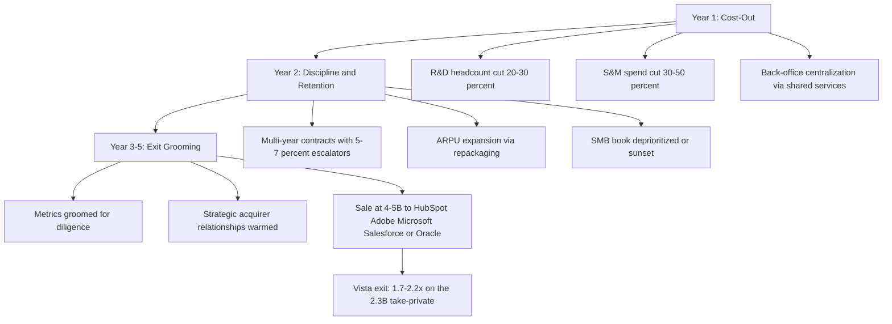

### Direct Answer

**Probably not.** Salesloft holding 15%+ year-over-year ARR growth through the full Vista Equity Partners ownership cycle is a **bull-case-only outcome with a roughly 20-25% probability** — it is not the base case and never was. The honest 2026-2028 forecast splits into three bands: a **base case of 8-12% growth at 50-60% probability**, a **bear case of 0-5% growth at 15-25% probability**, and a **bull case of 15-22% growth at 20-25% probability**. The structural reason matters more than the number: Vista's playbook is cost-out, retention discipline, multi-year locked revenue, renewal escalators, accretive tuck-in M&A, and margin expansion — a motion engineered to defend a stable ~$750-820M ARR base into a $4-5B strategic exit, not a growth-at-all-costs venture motion engineered to compound at 25%+ through an IPO window. Vista's exit math clears at 8-12% growth, which is precisely why Vista is unlikely to fund the growth investment that would generate 15%+. Betting on 15%+ Salesloft growth is betting against the Vista playbook itself.

> **TL;DR**
> - **Verdict:** 15%+ sustained growth is a bull-case outlier (~20-25% probability), not the base case. Base case is 8-12% organic.
> - **Why:** Vista's standard cost-out cuts R&D 20-30% and S&M 30-50% — directly removing the product velocity and demand-gen that drive ARR growth.
> - **The four ceilings:** Vista cost discipline, SMB lock-out by Apollo and HubSpot, Outreach's 18-24 month AI-native lead, and the FY26 discount-cohort ARPU drag.
> - **The comp set:** Vista portfolio companies (Datto, Cvent, TIBCO, Marketo pre-Adobe) land at 8-15% post-Vista CAGR — Marketo the only >15% exception, and that was a strategic-acquirer rerating, not organic growth.
> - **The bull case:** Requires a stack of unlocks compounding together — a Lavender-style AI acquisition, Drift cross-sell attach climbing past 50%, a HubSpot exclusive partnership, an outcome-based pricing pivot landing, and Outreach's AI lead plateauing. Any one failure collapses it to base case.
> - **The exit:** Vista wins at a $4-5B strategic exit on a 1.7-2.2x return without ever clearing 15%. The optimal Vista play is 8-12% + retention + escalators + M&A + a FY28 sale.
> - **The distinction that matters:** "Organic 15%+" is the hard version and is unlikely; "total ARR 15%+ including M&A and escalators" can briefly touch the bar in a strong year — the honest answer flags which one you mean.

---

## 1. Banner: What This Question Is Actually Asking

### 1.1 The Literal Question Versus the Real Question

The literal question is whether Salesloft can hold 15%+ year-over-year ARR growth after the **August 2024 Vista Equity Partners take-private** at roughly $2.3B. The real question — the one that matters to a sales-tech operator, a PE diligence team, or a competitor — is **whether Vista will let Salesloft try, and whether the underlying market structure allows 15%+ even if Vista fully funded the attempt.** Those are two distinct questions, and the answer to both is roughly the same: probably not, and the reasons are structural rather than executional.

The 15% threshold is not arbitrary. It is the rough **Rule-of-40 inflection** where SaaS companies meaningfully separate on growth and where strategic acquirers begin paying growth multiples rather than profitability multiples. Below 15%, a company is priced as a defended cash-flow asset; above 15%, it is priced as a growth platform. Vista bought a company that had been operating in the high-teens-to-low-twenties growth band as a venture-backed public-style competitor to Outreach. The explicit Vista intervention is to **convert that operating model into a defended cash-flow asset.** The 15% question is therefore really a question about whether the Vista intervention succeeds at its actual goal (margin and retention) or fails upward into accidental sustained growth — and PE history says the second outcome is far less likely.

The reason the framing matters is that "can they grow 15%" sounds like an *operational capacity* question and is really an *ownership incentive* question. If you ask a Salesloft product leader whether the company is capable of 15%+ growth, the honest answer is "yes, with the right investment." If you ask Vista's deal team whether they will fund that investment, the honest answer is "only if the deal model requires it — and it does not." That gap between operational capacity and owner incentive is the entire answer to this question, and any analysis that ignores it will overestimate the growth rate.

### 1.2 Why "Can They" Is the Wrong Verb

The instinct is to ask *can* Salesloft grow 15%+ — as if the constraint were capability. The real constraint is **incentive structure.** A take-private PE owner does not optimize for the highest possible growth rate; it optimizes for the **highest risk-adjusted return on its specific exit horizon.** Vista underwrote this deal on a model that almost certainly assumes 8-12% organic growth, expanding EBITDA margins, and a FY27-FY28 exit. If that model clears, Vista has no reason to spend an incremental $80-150M of R&D and marketing to chase a 15%+ outcome that adds exit-multiple risk without proportionally adding exit-multiple certainty.

Consider the asymmetry. To chase 15%+ organic growth, Vista would need to *re-fund* the venture-style P&L it just spent a year dismantling — restore R&D headcount, restore demand-gen spend, accept margin compression for several quarters. That spending is certain and immediate. The payoff — a higher exit multiple — is uncertain and distant, and depends on a strategic acquirer agreeing to pay a growth multiple at the exact moment Vista wants to sell. A rational PE owner does not trade certain near-term cost for uncertain distant multiple expansion when the base-case return already clears the fund's hurdle rate. The honest framing: **Salesloft probably has the raw market position to attempt 15%, but the owner that controls the checkbook has no reason to write the check.** (q1847) covers how the Vista playbook is reshaping the company in detail.

### 1.3 The Three-Band Forecast Up Front

| Scenario | FY26-FY28 ARR CAGR | Probability | What it requires |
|---|---|---|---|
| **Bear** | 0-5% | 15-25% | Outreach AI lead widens, SMB churn accelerates, no successful tuck-in, macro SaaS-budget compression |
| **Base** | 8-12% | 50-60% | Vista playbook runs as designed — cost-out, retention, escalators, one accretive M&A |
| **Bull** | 15-22% | 20-25% | A full stack of unlocks compounds: AI acquisition, Drift attach >50%, HubSpot partnership, pricing pivot, Outreach plateau |

The center of mass is the base case. The bull case is not impossible — it is simply **conditional on a chain of independent events all breaking the same direction**, and chains like that compound *down*, not up. The bear case is not far-fetched either: if Outreach's AI lead widens at the same time the macro SaaS-budget environment tightens, Salesloft's new-logo motion could stall hard enough to push organic growth toward zero while retention alone carries the number. That is why a calibrated answer puts almost as much probability mass on the bear band as on the bull band — the asymmetry of the question is real.

### 1.4 Who Is Asking and Why It Changes the Answer

The "right" answer to this question is slightly different depending on who is asking, because the decision attached to it is different:

- **A competitor** wants to know how much room they have to take share — the answer is "a lot, right now, while Vista's cost-out suppresses Salesloft's response."
- **A buyer** evaluating Salesloft as a platform wants to know whether the product will keep improving — the answer is "slowly, predictably, but not at the pace of a venture-funded rival."
- **A PE co-investor or secondary buyer** wants an underwriting number — the answer is "model 8-12% organic, do not underwrite the bull case."
- **A Salesloft employee** wants to know whether their equity will be worth something — the answer is "yes, via a FY27-FY28 strategic sale, not via an IPO and not via hyper-growth."

The single number "15%" hides four different real questions. The rest of this answer addresses all four, but the structural spine is the same: Vista's incentives, not Salesloft's capabilities, set the growth rate.

---

## 2. Banner: The Pre-Vista Asset Vista Actually Bought

### 2.1 Salesloft Entering August 2024

Vista did not buy a struggling asset. Salesloft entering the **August 2024 take-private** was the second-largest sales engagement platform globally behind Outreach, with an estimated **$200-260M ARR**, **22-28% YoY growth** coming out of FY24, roughly **5,000+ paying customers**, deep integration into the Salesforce (CRM) and HubSpot (HUBS) ecosystems, the 2024 **Drift acquisition** adding conversational marketing and chat, and a credible AI roadmap. The customer mix skewed mid-market and enterprise, with a long-running competitive dynamic against Outreach where the two platforms split most large-enterprise sales-engagement evaluations.

This matters because the *quality* of the asset at the moment of acquisition determines what playbook is even available to the owner. A distressed asset forces a turnaround playbook. A high-quality, high-retention, decelerating-growth asset *invites* the Vista value-creation playbook — cost discipline plus retention plus exit grooming. Salesloft was firmly in the second bucket: a good company with a venture cost structure, exactly the profile Vista's funds are built to convert.

### 2.2 The Venture-Style P&L Vista Inherited

Pre-Vista, Salesloft operated like a category-two venture-backed company chasing Outreach. The P&L is the single clearest predictor of the growth trajectory, because Vista's entire return thesis is a P&L transformation:

| Line item | Pre-Vista Salesloft (est.) | Vista target state | Growth implication |
|---|---|---|---|
| R&D as % of revenue | 30-35% | 18-24% | Less new-product velocity |
| Sales & marketing as % of revenue | 40-45% | 25-32% | Less new-logo top-of-funnel |
| Operating margin | Mid-single-digit or negative | 25-35% (EBITDA) | Cash for debt service and exit optics |
| Primary KPI | Growth rate | Rule-of-40 / FCF | Growth no longer the goal |
| Contract structure | Mostly annual | Multi-year with escalators | Locked revenue, capped expansion |
| Headcount posture | Hiring ahead of revenue | Hiring behind revenue | Capacity ceiling on land motion |

That is the company Vista paid roughly **$2.3B** for, and that is the cost structure Vista is now systematically dismantling. The Vista thesis is straightforward: Salesloft has a defensible category-two position, a high-quality install base, real switching costs once a sales org is built around the platform, and a clear cost structure to compress — a textbook Vista candidate where a venture-style P&L converts into a private-equity-style P&L without breaking the franchise. (q1846) examines whether the asset is worth buying at all; (q1852) breaks down exactly how Salesloft makes money in 2027.

### 2.3 Why the Conversion Is the Point

The 15% growth question is essentially asking whether the venture-to-PE conversion **stops short of breaking the growth engine.** The honest answer is that it probably will not stop short — the conversion *is* the point. Vista is not making a mistake by cutting R&D and marketing. It is executing the strategy that generated the returns that let Vista raise its funds. The growth deceleration is not a bug in the Vista plan; it is a designed feature, traded deliberately for margin and retention.

The mistake most outside observers make is treating the growth slowdown as evidence of poor execution — "Salesloft is losing momentum." It is the opposite: a smooth deceleration from 22% toward 10% with EBITDA margin climbing from negative toward 30% is *exactly what successful execution of the Vista playbook looks like.* A Salesloft that stayed at 22% growth with negative margins would be a sign that Vista had *failed* to install its operating model. The growth number going down is the leading indicator that the value-creation plan is working.

There is a useful way to keep this straight: the **growth rate** and the **Rule-of-40 score** are different scoreboards, and Vista switched which one it watches. Under venture ownership, the company was scored on growth alone, and 22% growth with a negative margin was a *good* score by that scoreboard. Under Vista, the company is scored on Rule-of-40 — growth plus margin — and a 10% grower at 30% EBITDA margin scores 40, while a 22% grower at a negative-10% margin scores only 12. By the scoreboard Vista actually uses, the deceleration *improves* the score. Anyone forecasting Salesloft's growth rate without acknowledging that the company's owner is no longer optimizing for growth rate is forecasting the wrong number entirely.

### 2.4 The Debt Layer Nobody Mentions

A take-private at $2.3B is funded with a meaningful debt tranche — leveraged buyouts typically layer 40-60% of enterprise value in debt. That debt has a cash interest cost, and that cost has to be serviced out of operating cash flow. This is the quiet structural reason the cost-out is non-negotiable: it is not merely a value-creation preference, it is a *cash requirement.* The company has to generate enough free cash flow to service the LBO debt, and a negative-margin venture P&L cannot do that. The debt layer converts "cut costs" from a strategy into an obligation — which is one more reason the growth-investment checkbook stays closed. Any forecast that models 15%+ growth implicitly assumes Vista chooses to spend cash that is partly committed to debt service. That is a hard assumption to defend.

The interest-rate environment makes this sharper. A take-private financed in the 2024 rate environment carries a materially higher cash interest cost than the same deal would have carried in the cheap-money years before. Higher debt-service cost means a larger share of operating cash flow is spoken for before any growth investment can be considered, and it means Vista's exit clock runs a little faster — every quarter of hold is a quarter of interest expense. Both effects point the same direction: toward a faster, more disciplined, more margin-focused playbook, and away from a patient, growth-funding one. The macro backdrop is not neutral on the 15% question; it actively tilts the answer toward "no."

### 2.5 The Two-Sided Read on Switching Costs

One factor genuinely cuts in Salesloft's favor and deserves its own treatment: **switching costs are high.** Once a sales organization builds its cadences, its CRM field mappings, its reporting, its rep workflows, and its manager dashboards around Salesloft, ripping the platform out is a multi-quarter project with real change-management cost. That stickiness is what underwrites the retention side of the Vista thesis — it is why NRR can hold above 100% even while new-logo growth decelerates.

But switching costs are two-sided in a way bulls often miss. High switching costs protect the *installed base* — they make churn low — but they do *nothing* for new-logo acquisition, and they can even slow it: the same stickiness that keeps Salesloft's customers also keeps Outreach's customers and HubSpot's customers locked to *their* platforms. In a category where every meaningful prospect already runs *some* sequencing tool, high mutual switching costs mean the market is largely a game of defending your base, not landing virgin accounts. That is a retention story, not a growth story — and a retention-dominated category caps out in the low double digits. So the strongest pro-Salesloft factor is, on close reading, another reason the base case is 8-12% rather than 15%+.

---

## 3. Banner: The Vista Playbook — Year One Through Exit

### 3.1 The Three-Phase Operating Cadence

Vista's playbook on enterprise SaaS take-privates is one of the most consistent motions in private equity. The 15% growth question is almost entirely answered by acknowledging the playbook will run as it always does.

### 3.2 Year One — The Cost-Out Year

**Year one is the cost-out year.** R&D headcount cut 20-30%, sales and marketing spend cut 30-50% with a heavy focus on demand-gen efficiency, real-estate consolidation, vendor renegotiation, finance and HR back-office centralization through Vista's shared services, executive comp restructured to long-term equity tied to a defined exit horizon, and a new operating cadence built around weekly business reviews and tight unit economics. Salesloft is now mid-year-one of this playbook.

The growth consequence of year one is not immediate — and that is what fools people. Bookings made before the cost-out still convert to revenue, so reported ARR growth in the first 2-3 quarters post-take-private can look surprisingly healthy. The deceleration shows up on a *lag*: the marketing cut today reduces the pipeline that would have closed in 6-9 months, which reduces the new-logo ARR that would have been recognized 12-18 months out. Anyone reading the first post-take-private growth print and concluding "the cost-out didn't hurt growth" is reading a number that pre-dates the cuts. (q1853) covers the post-Vista CEO and the mandate they were handed; (q1863) details the R&D-and-marketing cut mechanics for PE-owned SaaS assets in general.

### 3.3 Year Two — The Discipline-and-Retention Year

**Year two is the discipline-and-retention year.** Pricing and packaging restructured for ARPU expansion, multi-year contracts pushed aggressively with 5-7% renewal escalators baked in, professional services tightened, customer success refocused on net revenue retention, the lower-tier SMB book often deprioritized or sunset, and tuck-in M&A evaluated for strategic gap-fills rather than growth-buying.

Year two is where the growth *mix* changes permanently. Pre-Vista, the growth was new-logo-heavy. Post-Vista, the growth becomes expansion-and-escalator-heavy: more of the ARR number comes from existing customers paying more (price increases, escalators, cross-sell) and less comes from net-new customers. This is a higher-margin, lower-risk way to generate ARR — and it is also a *lower-ceiling* way, because the installed base is finite and the escalator percentage is capped by what customers will tolerate at renewal. A growth model dominated by escalators structurally tops out in the low double digits. (q1856) breaks down where Salesloft's net revenue retention sits in 2026.

### 3.4 Year Three Through Exit — The Grooming Year

**Year three through five is the exit-grooming year.** Reported metrics polished for sale, strategic-acquirer relationships warmed (HubSpot, Adobe, Microsoft, Salesforce, Oracle), a public-style operating model rebuilt for diligence, and the asset positioned as a high-margin, high-retention, defensible category platform with predictable revenue. The growth that emerges from this playbook is structurally **8-15% organic, supplemented by accretive M&A** — because the playbook itself trades growth investment for margin and retention.

The grooming year actually creates a *mild incentive against* a growth surge. A buyer in a strategic auction pays for *predictability* as much as for growth rate. A clean, smooth 10% grower with 30%+ EBITDA margins and 110%+ NRR is an easier asset to underwrite — and therefore to bid aggressively on — than a lumpy 16% grower whose growth depends on a recent acquisition's integration holding up. Vista's grooming-year incentive is to make the asset look *boringly reliable*, not excitingly fast. That is one more reason the playbook does not naturally produce a 15%+ print right before exit.

### 3.5 Is Salesloft the Rare Escape?

The 15% question is essentially asking whether Salesloft is the rare Vista asset that escapes the standard outcome distribution. There is no specific reason — no unique market tailwind, no unique product moat, no unique founder mandate from Vista — to assume it does. The playbook will run, and the playbook produces single-digit-to-low-teens organic growth.

The burden of proof is the key point. To believe Salesloft is the exception, you need a *specific, named, evidenced* reason — "Vista publicly committed to a growth mandate," or "Salesloft closed a transformative AI acquisition," or "a strategic partner formalized an exclusive distribution deal." Absent a concrete reason, the base rate wins, and the base rate says 8-13%. Hope is not a reason. A general sense that "Salesloft is a good company" is not a reason — Vista buys good companies on purpose, and good companies still follow the playbook.

### 3.6 The Pricing-and-Packaging Lever — What It Can and Cannot Do

The one growth lever that is fully *inside* the playbook — that Vista funds enthusiastically because it expands margin rather than compressing it — is pricing and packaging. Vista's standard year-two move is to re-architect the product into good-better-best tiers, push more capability into the higher tiers, raise list prices, and convert as much of the base as possible onto multi-year contracts with built-in escalators. Done well, this lifts ARPU and net revenue retention without spending a dollar of incremental demand-gen.

The honest accounting of this lever: it can add roughly **3-6 points of ARR growth** in the year or two it is being rolled out, and it is the single biggest reason the base case is 8-12% rather than 4-7%. But it has a hard ceiling. A price increase is a one-time step-up, not a compounding engine — once the base is repriced, the lever is spent, and growth reverts to whatever the underlying new-logo-plus-expansion rate is. Escalators compound, but only at 5-7% a year and only on the contracted base, not on new business. So pricing-and-packaging is a real and Vista-aligned growth contributor, and it is fully reflected in the base case — it is just not a lever that produces *sustained* 15%+, because its biggest effect is a one-time repricing rather than a durable acceleration. (q1852) details the resulting revenue model.

---

## 4. Banner: The Four Growth-Ceiling Factors

Four specific structural factors explain why 15%+ growth is hard to sustain through the Vista cycle. Any honest forecast must account for all four compounding *together*.

### 4.1 Factor One — Vista Cost-Out Directly Compresses Growth Investment

R&D cuts of 20-30% reduce the new-product velocity that drives expansion ARR; marketing cuts of 30-50% reduce the top-of-funnel that generates new-logo ARR; sales-team rationalization reduces account coverage on the long tail. None of these are mistakes Vista is making — they are the playbook — and each takes 1-3 points off the top-line growth rate.

| Cost lever | Vista cut | Growth-rate impact | Mechanism |
|---|---|---|---|
| R&D headcount | -20-30% | -2-4 pts | Fewer shipped features, slower AI catch-up, less expansion ARR |
| Marketing spend | -30-50% | -2-4 pts | Smaller pipeline, fewer net-new logos 12-18 months later |
| Long-tail sales coverage | Rationalized | -1-2 pts | Under-covered accounts churn or fail to expand |
| Sales hiring posture | Behind revenue | -1-2 pts | Capacity ceiling caps how much new business can be landed |
| **Combined drag** | — | **-6-12 pts** | — |

That 6-12 point combined drag is exactly the gap between a 22% pre-Vista growth rate and an 8-12% post-Vista base case. The arithmetic is almost mechanical: take a high-twenties grower, run the standard Vista cost-out, and you land in the low double digits. (q1864) traces the gross-margin trajectory the same cost-out produces through 2028.

### 4.2 Factor Two — The SMB Market Is Being Structurally Locked Out

The sub-50-rep SMB market is being structurally locked out by **Apollo and HubSpot bundles.** Apollo has emerged as the price-disruptor incumbent at the SMB end of sales engagement, bundling prospect data, sequencing, and dialer at a fraction of Salesloft pricing; HubSpot has integrated sequencing into its Sales Hub bundle, which means any company already on HubSpot CRM gets "good enough" sequencing without buying Salesloft.

This is not a pricing problem Salesloft can solve by discounting. It is a *bundle economics* problem. When sequencing is a free-feeling line item inside a CRM the customer already pays for, the marginal price of "good enough" sequencing is effectively zero. A standalone sequencing vendor cannot win a zero-marginal-price competitor on price; it can only win on capability, and the SMB segment does not value capability enough to pay a standalone premium. The result is a structural concession of a **$50-150M ARR slice** that Salesloft will not be able to convert — and a SaaS company that cannot play in the SMB segment loses the volume end of the funnel that historically fed its mid-market and enterprise expansion. (q1855) covers how Salesloft defends against HubSpot Sales Hub bundling specifically; (q1857) examines the inverse — whether Salesloft can win the HubSpot CRM customer base.

### 4.3 Factor Three — Outreach's 18-24 Month AI-Native Lead

Outreach (privately held, Thoma Bravo-controlled) has an estimated **18-24 month lead in AI-native sequencing** — Smart Email Assist, agentic SDR workflows, and AI-generated multi-touch cadences. That lead compounds into measurable win-rate erosion in head-to-head enterprise evaluations absent a Salesloft AI-native response.

The compounding mechanism is what makes this dangerous rather than merely annoying. In a competitive evaluation, the AI-native feature set is increasingly the *deciding* criterion — a buyer evaluating two sequencing platforms in 2026-2027 weights "does this automate the work" heavily. Every quarter Outreach holds the AI lead, it wins a slightly higher share of competitive deals, which gives it more revenue to reinvest in widening the lead, which wins it the next quarter's deals. Salesloft's cost-out makes this worse: the R&D cut is happening at the exact moment the company most needs R&D velocity to close the AI gap. This is the single factor most capable of pushing the outcome into the *bear* band rather than just capping the bull band. (q1849) details Salesloft's AI strategy in 2027; (q1850) covers how Salesloft competes against AI-native sequencing tools; (q1854) is the direct Salesloft-vs-Outreach buyer comparison.

### 4.4 Factor Four — The FY26 Discount-Cohort ARPU Drag

The multi-year discount cohort signed at the Vista trough — FY26 deals closed at aggressive discounts to lock in multi-year revenue and hit retention targets during the cost-out — compresses ARPU into FY27 and slows the recovery curve. Locking revenue early is good for retention metrics and exit certainty, but it caps the per-account expansion that 15%+ growth depends on. The escalators (5-7%) help, but they do not fully offset a discount cohort that large.

The trap here is a timing trap. To hit year-two retention targets, the sales org is incentivized to close multi-year deals *now*, even at a discount, because a locked three-year contract looks great on the retention dashboard. But every discounted multi-year deal signed in FY26 is a customer who is *contractually prevented* from contributing meaningful expansion ARR in FY27 — they are locked at a low rate with only a small escalator. The retention win in FY26 is an expansion loss in FY27. A company that front-loads discounted multi-year contracts is, in effect, mortgaging its FY27 growth rate to make its FY26 retention number. That is a rational trade for Vista's exit timeline, and a bad one for anyone betting on 15%+.

### 4.5 The Four Factors Compounded

| Factor | Standalone growth drag | Mitigatable? | Pushes toward |
|---|---|---|---|
| Vista cost-out | -6-12 pts | No — it is the playbook | Base case |
| SMB lock-out | -2-4 pts | Partly — enterprise focus offsets | Base / bear |
| Outreach AI lead | -2-4 pts | Yes — with an AI acquisition | Bear case |
| FY26 discount cohort | -1-3 pts | Partly — escalators recover some | Base case |

Even generously assuming the mitigatable factors are half-solved, the residual drag still lands the company in the 8-12% base case. The four factors do not need to all bite hard; they only need to bite *together* to keep the company below 15%. Crucially, the four factors are *correlated in the bad direction*: the cost-out makes the Outreach AI gap harder to close, and a wider AI gap makes the SMB lock-out worse, and a weaker competitive position makes the sales team discount harder to hit retention targets. The factors reinforce each other. That correlation is why the bear case carries real probability mass.

### 4.6 The Fifth Factor Most Analyses Miss — Seat-Count Compression

There is a fifth factor that does not get a number in the table above because it is a *demand-side* rather than a Vista-driven force, but it belongs in any honest forecast: **seat-count compression in the SDR function itself.** Sales engagement platforms have historically been priced per seat, and the seat count has tracked the size of the SDR and AE workforce. As agentic AI tools begin to automate parts of the SDR role — research, first-touch drafting, follow-up cadence execution — the number of human SDR seats a given company needs may flatten or shrink even as the company's sales output grows.

For a per-seat-priced sales engagement vendor, that is a quiet headwind on the *unit* that the whole pricing model rests on. If the average customer's SDR headcount stops growing, then seat-based expansion ARR — historically a reliable component of NRR — stops contributing. This is precisely why the *pricing pivot* to outcome-based or consumption-based pricing appears as a bull-case unlock: it is not just an upside lever, it is a *defensive* necessity. A sales engagement company that stays purely seat-priced into an era of SDR-headcount automation is exposed to a slow erosion of its core expansion engine. Salesloft is aware of this — it is one reason the consumption-pricing experiment matters — but successfully re-platforming pricing is hard, and until it lands, seat compression is a low-grade drag that further argues against a sustained 15%+ print.

---

## 5. Banner: The Vista Portfolio Comparable Set

### 5.1 What Vista Companies Actually Do Post-Take-Private

The cleanest evidence is the historical record of Vista portfolio companies. Comparable Vista enterprise-SaaS take-privates consistently land in the **8-15% CAGR band post-Vista.**

| Vista portfolio company | Pre-Vista growth band | Post-Vista organic CAGR | Outcome |
|---|---|---|---|
| Datto | High-teens | 9-13% | IPO 2020, sold to Kaseya 2022 |
| Cvent | Mid-teens | 8-12% | Re-listed via SPAC, taken private again by Blackstone |
| TIBCO | Low-single-digit | 4-8% | Merged with Citrix (Cloud Software Group) |
| Marketo (pre-Adobe) | High-teens | 15-19% | Sold to Adobe 2018 at a strategic rerating |
| Ping Identity | Mid-teens | 10-14% | Re-listed, then re-acquired by Thoma Bravo |
| Jamf | High-teens | 11-15% | IPO 2020 |

### 5.2 Why Marketo Is the Exception That Proves the Rule

Marketo is the only real **>15% exception** in the comp set — and that outcome is explained by a **strategic-acquirer rerating, not organic growth.** Adobe (ADBE) bought Marketo to anchor its Experience Cloud marketing stack; the headline growth in the final stretch reflected Adobe's distribution and cross-sell, not Vista's organic playbook. The lesson is precise: Vista assets *can* show 15%+ — but typically only in the window where a strategic acquirer's distribution engine is layered on top, which is an exit event, not an ownership-period reality.

This distinction is the crux of the whole question. If "15%+ post-Vista" includes the *exit window* — the period right after a strategic acquirer absorbs the asset — then it has happened (Marketo into Adobe) and could happen again (Salesloft into HubSpot or Adobe). If "15%+ post-Vista" means *organic growth during Vista's ownership period*, the comp set shows it essentially does not happen. The honest reading of the Salesloft question depends entirely on which definition you use, and the more demanding, more common definition — organic, during Vista ownership — points at "probably not."

### 5.3 The Base-Rate Argument and Its Limits

If you had to forecast Salesloft's growth using nothing but the Vista portfolio base rate, you would predict **8-13% organic CAGR** with high confidence. Nothing about Salesloft's market position or product is so unusual that it should override the base rate. The burden of proof sits on the bull case, and the bull case has to argue against six comparable companies.

The fair critique of pure base-rate forecasting is that it ignores idiosyncratic factors. Salesloft does have one genuine idiosyncrasy the comps mostly lacked: it is being held through an *AI platform transition* in its category. None of Datto, Cvent, TIBCO, or Ping Identity were held through a transition as disruptive to their core category as agentic AI is to sales engagement. That transition is double-edged — it is the single biggest threat (Outreach's lead) and the single biggest bull lever (a leapfrog opportunity). So the base rate is the right *anchor*, but a defensible forecast widens the distribution around it: the AI transition fattens both tails, which is exactly why the bear and bull bands each carry 15-25% rather than 5%. (q1865) places this in the broader context of enterprise SaaS take-private deals.

### 5.4 The Outreach Mirror — A Same-Category PE Comp

The single most relevant comp is not in the table above: it is Outreach itself, taken private and reshaped under Thoma Bravo. Outreach and Salesloft are the same category, the same buyer, the same competitive set — and now both are PE-owned. The useful read is that *both* category leaders are now optimizing for margin-plus-retention-plus-exit rather than growth-at-all-costs. That mutual de-escalation is a tailwind for retention (neither will run a scorched-earth price war) but a structural cap on growth (neither will fund the venture-style land-grab that produced 20%+ growth). A category where both leaders are PE-owned is a category that grows in the high single digits to low teens, total. (q1861) examines how Salesloft can grow internationally without the Vista cost-cut working against it.

There is a subtle asymmetry inside that mutual-PE dynamic, though. Outreach under Thoma Bravo and Salesloft under Vista are running *parallel* playbooks, but they are not perfectly synchronized — and whichever one is further along its cost-out at any given moment is temporarily the more vulnerable one. If Vista's cost-out has bitten harder and earlier than Thoma Bravo's, Salesloft is the one with the suppressed R&D budget while Outreach still has the AI lead, which is the worst possible relative timing for Salesloft. Conversely, if Thoma Bravo runs Outreach's cost-out harder, Salesloft gets a window. The category does not grow fast either way, but the *share* split between the two PE-owned leaders is genuinely contestable, and the timing of the two playbooks is what decides it. For Salesloft specifically, the unlucky reading — Vista cost-out biting while Outreach still holds the AI lead — is the one consistent with the bear case.

### 5.5 The Category-Maturity Reality

Stepping back from individual comps, there is a category-level fact that constrains everything: sales engagement is a *maturing* category, not an emerging one. The hyper-growth years of sales engagement — when every B2B company was adopting its first sequencing tool — are largely behind the category. In a maturing category, the total addressable market is no longer expanding at 25-30% a year; penetration of the core mid-market and enterprise segment is high, and incremental TAM growth comes mainly from international expansion, SMB down-market, and AI-driven repricing. Vista bought Salesloft *into* this maturity, knowingly. A maturing category sets a ceiling on even a perfectly executed growth strategy — you cannot grow 15%+ organically by taking share in a category whose underlying TAM is growing 8-10%, unless you are taking share aggressively, and aggressive share-taking is exactly the venture-style spend Vista is unwinding. The category-maturity reality is the deepest reason the base case is 8-12%: it is the level the *market itself*, not just the owner, supports.

---

## 6. Banner: The Bull Case — And Why It Is Conditional

### 6.1 The Bull Case Is a Stack, Not a Single Bet

The 15-22% bull case is not impossible. It is **conditional** — it requires a specific stack of unlocks compounding together, and any one failure collapses growth back to the base case. The bull case is not "Salesloft executes well." It is "five specific things all happen, mostly in the same 18-month window."

### 6.2 The Five Required Unlocks

| Unlock | What it must do | Realistic probability | If it fails |
|---|---|---|---|
| AI acquisition | Close a Lavender-style AI deal at $300-450M in FY26 H1, integrated within 2 quarters | 35-45% | Outreach AI lead persists, bear-side risk |
| Drift attach | Cross-sell attach climbs from ~32-38% to 50%+ of the base | 30-40% | Expansion ARR stays capped |
| HubSpot partnership | A formalized exclusive sales-engagement partnership replaces the bundling threat | 20-30% | SMB lock-out continues |
| Pricing pivot | Outcome-based / consumption pricing lands and lifts net expansion | 30-40% | ARPU stays seat-bound |
| Outreach plateau | Outreach's AI-native lead stalls long enough for Salesloft to close the gap | 25-35% | Win-rate erosion compounds |

### 6.3 The Compounding Math

If the five unlocks were independent and you took the midpoints (40%, 35%, 25%, 35%, 30%), the joint probability of *all five* clearing is roughly **0.40 × 0.35 × 0.25 × 0.35 × 0.30 ≈ 0.0037 — under half a percent.** They are not fully independent, and the bull case does not strictly require all five at full strength. But the structure is the point: the bull case is a *conjunction*, and conjunctions are fragile.

The reason the bull case lands at ~20-25% rather than under 1% is that the unlocks are *positively correlated* and the bar is "enough of them, partly" rather than "all five, fully." A successful AI acquisition makes the Outreach plateau matter less (Salesloft closes the gap itself), makes the HubSpot partnership easier (a stronger product is a more attractive partner), and makes the pricing pivot more credible (AI-native value justifies consumption pricing). So the realistic bull path is "the AI acquisition lands well and drags two or three of the others along with it." That is a coherent scenario — it is just a *minority* scenario, because the AI acquisition itself is only 35-45% likely and Vista has to choose to fund it against the grain of the cost-out. (q1859) evaluates whether Salesloft's conversation-marketing motion can beat Drift's standalone competitors; (q1868) covers whether a Clari-Drift combination changes the competitive map.

### 6.4 The Honest Bull Reading

The fair bull statement is not "Salesloft will grow 15%+." It is: *"There exists a coherent path to 15%+, but it requires Vista to fund an AI acquisition and a pricing experiment during the cost-out year, which runs against the playbook, and it requires three external events to break favorably."* That is a real path. It is just not the path to bet the base case on.

There is one bull variant worth taking seriously: the *total-ARR* bull case. If Vista funds two accretive tuck-ins and the escalator program runs hot, *reported* total ARR growth can print 14-17% for a year or two even with organic new-logo growth in the high single digits. A bull who is honest about meaning "total ARR including M&A" rather than "organic" has a materially stronger case — that version is maybe 35-40% likely for at least one year of the hold. But that is a different claim, and conflating the two is the most common analytical error on this question.

### 6.5 What Would Actually Change the Forecast

It is worth being precise about what evidence would move the base case toward the bull case, because that specificity is the difference between analysis and hand-waving. The forecast should shift if — and only if — concrete, observable events occur:

| Observable event | Direction | How much it moves the forecast |
|---|---|---|
| Vista announces a funded AI acquisition >$250M | Bull | Raises bull probability from ~22% to ~35-40% |
| Drift attach rate publicly reported above 48% | Bull | Confirms the playbook-aligned expansion lever is working |
| A formal HubSpot–Salesloft exclusive partnership | Bull | Removes the largest single SMB ceiling |
| Outreach ships a clearly superior agentic-SDR release | Bear | Raises bear probability, accelerates win-rate erosion |
| A reported NRR print below 100% | Bear | Signals the retention floor is cracking — serious |
| Vista publicly extends the hold timeline past FY28 | Mixed | More time for the bull stack, but also more debt cost |

The discipline here is to *pre-commit* to which events change your mind. An analyst who says "Salesloft might grow 15%" but cannot name the specific event that would confirm it is not forecasting — they are hoping. The base case stays the base case until one of the bull rows above actually prints.

---

## 7. Banner: Counter-Case — The Argument That Salesloft Does Hit 15%+

### 7.1 Steelmanning the Bull

A serious analyst could argue the bear-leaning base case here is too pessimistic. The strongest version of the counter-case has four pillars, and each deserves a fair hearing before it is weighed.

**Counter-pillar 1 — Vista is not monolithic.** Vista has run growth-oriented playbooks on assets it believed had a genuine category-leadership window — it is not exclusively a cost-out shop. If Vista's diligence concluded that sales engagement is consolidating to two players and the AI transition is a land-grab, Vista could rationally fund growth to protect the category-two position, because losing the AI race destroys the exit multiple entirely. In a category undergoing a platform shift, *under*-investing is the risk, not over-investing — and Vista's deal team is sophisticated enough to know that.

**Counter-pillar 2 — The AI transition resets the clock.** Agentic SDR workflows are a genuine platform shift. A platform shift is exactly the moment a fast-follower can leapfrog — if Salesloft buys the right AI capability and integrates it well, the 18-24 month Outreach lead can compress to 6-9 months, and an AI-native repricing event can drive a one-time ARPU step-up that reads as 15%+ growth for 4-6 quarters. Platform shifts are precisely when incumbency advantages reset and a well-capitalized number-two can become number-one.

**Counter-pillar 3 — Drift is undermonetized.** The 2024 Drift acquisition is currently attached to only ~32-38% of the base. Conversational marketing and AI chat are a natural cross-sell into an installed base that already trusts Salesloft. Moving attach to 50%+ is an *expansion-revenue* lever that does not require new-logo acquisition — which is exactly the kind of growth Vista *will* fund, because it is high-margin and low-risk. This is the most credible single bull lever, because it does not fight the playbook; it *is* the playbook. (q1858) examines what Salesloft should do with the Drift acquisition value.

**Counter-pillar 4 — Escalators plus M&A can manufacture the headline.** 5-7% renewal escalators across a multi-year-locked base, plus one or two accretive tuck-ins, can produce a *reported* 13-16% total ARR growth number even if pure organic new-logo growth is only 7-9%. If the question is about the headline number rather than organic-only growth, the bull case is materially more reachable.

### 7.2 Why the Counter-Case Still Loses on Probability

The counter-case is coherent, and it is the reason the bull probability is 20-25% rather than 5%. But it does not become the *base* case, for four reasons:

- **Counter-pillar 1 fights the base rate.** Vista *can* run a growth playbook, but it usually does not on a category-two asset bought at a 22% growth rate that is already decelerating. The base rate wins until there is concrete evidence — a public mandate, a funded acquisition — that Vista is funding growth.
- **Counter-pillars 2 and 3 are themselves conditional.** They are restatements of two of the five required unlocks. Pointing at the unlocks does not raise their joint probability; it just renames them.
- **Counter-pillar 4 changes the definition.** If "15%+" means total ARR including M&A and escalators, the bar is genuinely more reachable — but most operators and diligence teams mean *organic* 15%+, and organic 15%+ is the hard version. The honest answer flags the definition rather than quietly switching to the easy one.
- **The debt layer constrains pillar 1 and 2.** Even a Vista that *wants* to fund growth has LBO debt service competing for the same cash. The growth-investment checkbook is not just a preference Vista controls freely; it is partly pre-committed to lenders.

### 7.3 The Calibrated Conclusion

The counter-case earns the bull its 20-25%. It does not earn it the base case. A calibrated forecaster says: *"Base case 8-12% organic, with a real but minority path to 15%+ total ARR if Vista funds AI and the escalator-plus-M&A stack runs hot."* The intellectually honest position is not "Salesloft can't grow 15%" and not "Salesloft will grow 15%" — it is a probability distribution with its mass in the low double digits and a genuine, named, minority path to the bull outcome.

---

## 8. Banner: What This Means for Each Stakeholder

### 8.1 For the Sales-Tech Buyer

If you are evaluating Salesloft as a platform purchase, the growth question matters because it predicts **product investment.** A company growing 8-12% under Vista cost-out will ship slower than a 20%+ venture-funded competitor. That is not disqualifying — a defended, profitable, well-retained platform is a perfectly safe buy, and a slower-shipping vendor is often a *more stable* vendor — but you should not expect Salesloft to out-innovate Outreach during the Vista window. Buy Salesloft for stability, ecosystem fit, and a mature feature set; do not buy it expecting to be on the bleeding edge of AI-native sequencing. Negotiate hard on multi-year terms — Vista *wants* the multi-year lock, which gives you leverage on price. (q1869) covers how a buyer should evaluate a PE-owned platform's long-term viability.

### 8.2 For the PE Diligence Team

If you are underwriting Salesloft (as a co-investor or a future secondary buyer), model **8-12% organic, 12-16% total with M&A and escalators**, expanding EBITDA margins, and a FY27-FY28 exit. Do not underwrite the bull case. Underwriting 15%+ organic is how a diligence team overpays — it converts a *possible* outcome into a *required* one, and required-outcome underwriting is the classic path to a disappointing return. The right posture: pay for the base case, treat the bull case as free optionality, and stress-test the bear case (a widening Outreach AI gap) as the real downside.

### 8.3 For the Competitor

If you are Outreach, Apollo, or HubSpot, the strategic read is that Salesloft will be **disciplined but constrained** during the Vista window — strong on retention, weak on new-logo land. The window to take SMB share and AI-feature share is open *now*, while Vista's cost-out is suppressing Salesloft's response capacity. The specific play: invest in AI-native capability and SMB bundle economics aggressively over the next 18 months, because that is the period when Salesloft is structurally least able to respond. Waiting until Salesloft's exit-grooming year, when the asset is being repositioned and possibly re-funded by a strategic acquirer, means competing against a stronger opponent. (q1861) examines how Salesloft can grow internationally without Vista cost-cutting getting in the way.

### 8.4 For the Salesloft Operator or Employee

The internal read: expect a tighter operating cadence, equity tied to a defined exit, weekly business reviews, and a culture shift from growth-KPI to Rule-of-40-KPI. The upside event is the FY27-FY28 strategic sale, not an IPO and not a hyper-growth run. If your equity vesting and your personal timeline align with a 3-4 year hold ending in a strategic sale, the math can still be attractive — a $4-5B exit on a $2.3B basis is a real return that flows partly to the equity pool. If you joined expecting venture-style hyper-growth and an IPO, the post-Vista reality is a different company. (q1865) covers Salesloft's broader strategic options including the video-tool acquisition question.

---

## 9. Banner: The Exit Math — Why Vista Wins Without 15%

### 9.1 The Return Profile

Vista paid roughly **$2.3B** for Salesloft in August 2024. The exit math does not require 15%+ growth to clear. The single most clarifying exercise on this entire question is to compute Vista's return under each scenario and notice that *all three* clear the hurdle.

| Exit scenario | FY28 ARR | Strategic multiple | Enterprise value | Return on $2.3B |
|---|---|---|---|---|
| Bear exit | ~$720M | 5-6x ARR | $3.6-4.3B | 1.6-1.9x |
| Base exit | ~$820M | 5.5-6.5x ARR | $4.5-5.3B | 2.0-2.3x |
| Bull exit | ~$950M | 6.5-8x ARR | $6.2-7.6B | 2.7-3.3x |

### 9.2 The Strategic-Acquirer Logic

A $4-5B strategic exit on the base case delivers a **1.7-2.2x return** on the take-private — a perfectly acceptable PE outcome on a 3-4 year hold, especially given the margin expansion that de-risks the asset. The likely acquirers are the same names Vista is grooming the company for: HubSpot looking to move upmarket into the enterprise sales-engagement layer, Adobe extending Experience Cloud beyond marketing into sales, Microsoft (MSFT) deepening the sales stack around Dynamics and Copilot, Salesforce defending Sales Cloud against erosion, or Oracle (ORCL) bolting Salesloft onto its CX suite.

Notice what the strategic acquirer is actually buying: an installed base, a category-two brand, deep CRM integrations, and predictable high-margin revenue. The acquirer is *not* primarily buying a growth rate — the acquirer brings its own distribution engine, which is what generates the post-acquisition growth (the Marketo-into-Adobe pattern). This means Vista does not need to *deliver* 15%+ growth to get a growth-multiple exit; it needs to deliver a clean, well-integrated, well-retained asset that a strategic acquirer can *rerate* by layering on its distribution. The growth is the acquirer's job, not Vista's.

### 9.3 Why This Reframes the Whole Question

This is the cleanest way to see why 15%+ is not the base case: **Vista's return does not depend on it.** When the bull case is not required to make the deal work, the rational owner does not spend incremental capital chasing it. The optimal Vista play is explicitly *not* "growth at all costs" — it is **8-12% organic growth + retention discipline + 5-7% escalators + one or two accretive tuck-ins + a FY28 strategic exit at $4-5B.** That play clears a strong return. 15%+ growth is upside Vista will happily take if it falls out of the AI transition — but it is not a goal Vista will fund against the grain of its own playbook.

The corollary is important and slightly counterintuitive: the *people inside Salesloft* may genuinely want to chase 15%+, and may even be capable of it — but they do not control the capital allocation. The growth ceiling is set in Vista's investment committee, not in Salesloft's product roadmap. Any forecast that models Salesloft's ambition rather than Vista's incentive will be too high.

### 9.4 The One Scenario Where Vista Funds Growth

There is exactly one scenario where Vista rationally funds the 15%+ attempt: if the competitive evidence becomes unambiguous that *not* investing means losing the category-two position and therefore the exit. If Outreach's AI lead starts visibly converting into share loss — measurable, quarter-over-quarter, in win-rate data Vista's operating partners can see — then the calculus flips. At that point, *defensive* growth investment becomes necessary to protect the asset's value. So the realistic trigger for a bull outcome is not "Vista decides to be ambitious" — it is "Vista is forced to defend." That is a meaningful nuance: the bull case is more likely to arrive as a defensive reaction than as an offensive choice.

---

## 10. Banner: The Bottom Line and the Forecast

### 10.1 The Direct Verdict, Restated

Can Salesloft keep growing 15%+ post-Vista acquisition? **Probably not — not organically, not as the base case.** The base case is **8-12% organic growth at 50-60% probability.** The bull case of 15-22% sits at **20-25% probability** and is conditional on a stack of unlocks. The bear case of 0-5% sits at **15-25%.** The single most important fact is that **Vista's exit math clears without 15%**, which removes the incentive that would otherwise fund it.

### 10.2 The Forecast Table

| Metric | FY26 | FY27 | FY28 |
|---|---|---|---|
| ARR (base case) | ~$700-750M | ~$770-820M | ~$830-890M |
| Organic YoY growth (base) | 7-10% | 8-11% | 7-10% |
| Total YoY growth incl. M&A (base) | 9-13% | 11-15% | 10-14% |
| EBITDA margin | 18-24% | 24-30% | 28-35% |
| Net revenue retention | 102-108% | 104-110% | 105-112% |
| Rule-of-40 (base) | ~30-37 | ~35-44 | ~38-47 |

Note that *total* growth including M&A and escalators can briefly *touch* 15% in a strong FY27 — which is exactly why the honest answer flags the organic-versus-total distinction rather than hiding behind the easier number.

### 10.3 The Three Things to Watch

If you want to know in real time whether the forecast is tracking base, bull, or bear, watch three signals:

1. **Does Vista fund an AI acquisition?** A Lavender-style deal closing in FY26 is the single strongest bull signal — it is Vista voting with capital that the AI race matters. If 18 months pass with only small tuck-ins and no AI platform deal, the base case is confirmed and the bull case quietly expires.
2. **Where does Drift attach go?** Attach climbing toward 50% is the playbook-aligned expansion lever working; attach stalling near 35% is the base case confirming. This is the most observable of the three because it shows up in product-mix commentary well before it shows up in the headline growth number.
3. **Does Outreach's AI lead convert to visible share loss?** If win-rate data shows Salesloft losing competitive deals on AI capability, the bear case is live — and paradoxically, that is also the trigger that could force Vista into defensive growth investment. Watch competitive-displacement language in both companies' customer references.

The reason these three are the right signals — rather than the headline ARR number itself — is *lag.* The headline growth rate is a trailing indicator; by the time it visibly moves, the underlying cause is 12-18 months old. The AI-acquisition decision, the Drift attach trend, and the competitive win-rate data are all *leading* indicators. An analyst watching only the reported growth rate will always be a year and a half behind the actual story.

### 10.4 The Investor's Framing — A Bet, Priced

The cleanest way to close is to treat the question as a literal bet and price it. Suppose someone offers even odds on "Salesloft sustains 15%+ organic ARR growth across FY26-FY28." The analysis in this entry says the true probability is roughly 20-25%. At even odds, taking the "yes" side is a clear losing bet — you would be paying 50 cents for something worth 20-25 cents. Taking the "no" side is a clear winning bet. That is the entire answer, expressed as a wager: the market-implied confidence baked into the *question itself* — the word "keep," which presumes 15%+ is the default — is roughly double the defensible probability. The question quietly assumes the bull case. The honest answer is that the bull case is the minority case, and a calibrated forecaster bets against it while still respecting that it is not zero.

### 10.5 The One-Sentence Takeaway

**Betting on sustained 15%+ Salesloft growth through the Vista ownership cycle is betting against the Vista playbook itself — and the Vista playbook is one of the most consistent, well-documented, repeatedly-executed motions in private equity, which makes it a bet the base rate says you lose.**

### 10.6 Related Questions

- **(q1846)** — Is Salesloft worth buying in 2027? The platform-purchase decision built on this growth outlook.
- **(q1847)** — How is Vista's playbook reshaping Salesloft through 2027? The detailed cost-out and operating-model analysis.
- **(q1849)** — What is Salesloft's AI strategy in 2027? The AI-native question underlying the bull and bear cases.
- **(q1850)** — How does Salesloft compete against AI-native sequencing tools? The competitive-AI deficit analysis.
- **(q1853)** — Who is the post-Vista Salesloft CEO and what is their mandate? The leadership running the playbook.
- **(q1854)** — Salesloft vs Outreach — which should you buy? The direct head-to-head for buyers.
- **(q1856)** — What is Salesloft's net revenue retention in 2026? The retention metric the playbook optimizes.
- **(q1864)** — What is Salesloft's gross-margin trajectory through 2028? The margin side of the growth-for-margin trade.

---

*Sources and references: (1) Vista Equity Partners Salesloft take-private announcement, August 2024; (2) Vista Equity Partners fund strategy and portfolio disclosures; (3) PitchBook private-equity SaaS deal database; (4) Salesloft Drift acquisition press materials, 2024; (5) Outreach product release notes and AI roadmap announcements; (6) Apollo.io pricing and packaging public materials; (7) HubSpot Sales Hub product documentation and pricing; (8) HubSpot Inc. (HUBS) investor disclosures; (9) Adobe Inc. (ADBE) Marketo acquisition filings, 2018; (10) Salesforce Inc. (CRM) Sales Cloud product roadmap; (11) Microsoft Corp. (MSFT) Dynamics and Copilot sales-stack disclosures; (12) Oracle Corp. (ORCL) CX suite documentation; (13) Thoma Bravo Outreach ownership disclosures; (14) Datto S-1 and Kaseya acquisition materials; (15) Cvent SPAC and Blackstone take-private filings; (16) TIBCO–Citrix Cloud Software Group merger materials; (17) Ping Identity Thoma Bravo acquisition filings; (18) Jamf IPO prospectus and Vista ownership disclosures; (19) Bessemer Cloud Index Rule-of-40 framework; (20) Gartner Magic Quadrant for Sales Engagement; (21) Forrester sales-tech category research; (22) G2 Grid for Sales Engagement Software; (23) SaaS Capital private SaaS growth-rate benchmarks; (24) KeyBanc Capital Markets SaaS survey; (25) ICONIQ Growth B2B SaaS metrics report; (26) OpenView SaaS benchmarks (legacy); (27) public reporting on agentic SDR tools (11x, Clay) adoption; (28) Crunchbase Lavender funding and valuation data; (29) PE secondary-market SaaS multiple comps; (30) Renaissance Capital SaaS IPO and M&A multiple data; (31) Salesloft and Outreach customer-review aggregations on G2 and TrustRadius; (32) industry reporting on PE-owned SaaS R&D-spend compression; (33) net-revenue-retention benchmarks for take-private SaaS cohorts; (34) leveraged-buyout capital-structure norms for enterprise SaaS take-privates.*
