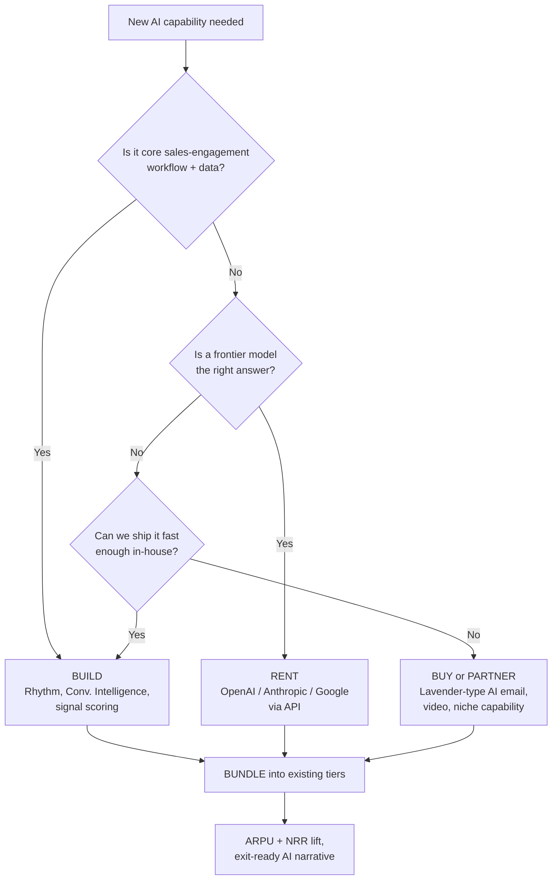

### Direct Answer

Salesloft's AI strategy in 2027 is best understood as a **Vista-disciplined "bundle-and-embed" play**, not a frontier-model bet. The company is not trying to out-research the AI labs or out-fund the AI-native sequencing startups; it is trying to make AI a default, invoiced layer inside a sales-engagement platform that already sits in tens of thousands of revenue teams' daily workflow. The strategy rests on three pillars: **Rhythm**, the AI-prioritized action engine that turns the old Cadence sequence into a signal-ranked task list; **Conversations and Conversation Intelligence**, the Drift- and recording-derived layer that mines every call and email for coaching and forecasting signal; and a deliberate **build-buy-bundle posture** in which Salesloft buys or partners for capabilities it cannot ship fast enough and bundles the result into existing tiers to lift ARPU without a separate AI SKU war. The honest assessment: this is a competent, financially rational, defensible-but-unspectacular strategy. It will protect Salesloft's installed base and its margin through a Vista exit, but it will not make Salesloft the AI leader of the category, and it leaves a real opening for AI-native challengers and for HubSpot's bundling pressure (q1855, q1850).

> **TLDR**
> - **The strategy in one line:** make AI a default, embedded, already-paid-for layer of the sales-engagement workflow — not a separate frontier product.
> - **Three pillars:** Rhythm (AI action prioritization), Conversations/Conversation Intelligence (call + email signal mining), and a build-buy-bundle M&A posture for gaps.
> - **Vista's fingerprints are everywhere:** AI is positioned as an ARPU and net-revenue-retention lever, funded inside existing R&D, sold into the base rather than chased net-new — classic PE value-creation, not a moonshot (q1847, q1810).
> - **Model layer is rented, not owned:** Salesloft consumes OpenAI, Anthropic, and Google frontier models via API and competes on workflow, data, and proprietary signal — the **Activity Graph** of billions of buyer-seller interactions — not on model research.
> - **The biggest unmitigated risk:** AI-native agents (the "self-driving outbound" startups) attack the *premise* of a human-run sequence, and an embedded-AI strategy answers a different question than the one those competitors are asking (q1828, q1829, q1830).
> - **The biggest underpriced asset:** distribution and data. Salesloft does not need the best model; it needs AI that is good enough, inside a tool reps already open 40 times a day, priced at zero marginal friction.
> - **Verdict:** a B+ strategy — financially sound, exit-ready, base-protecting; not category-defining. Buyers should expect steady, useful AI, not a leap (q1846, q1848).

---

## I. The Strategic Frame — What "AI Strategy" Means for a Vista-Owned Salesloft

Before decomposing the product roadmap, it is essential to frame what kind of company is making these decisions, because the owner determines the strategy far more than the technology does. Salesloft in 2027 is a private, Vista Equity Partners-owned, profitable, mature sales-engagement platform. It is not a venture-funded startup chasing a category-defining moonshot, and it is not a public company managing quarterly AI narrative. That single fact reframes every "AI strategy" question. The same ownership-shapes-strategy logic runs through the broader Vista-playbook analysis (q1847) and the original acquisition rationale (q1810).

### 1.1 Vista changes the question being asked

A venture-backed company asks, "How do we use AI to win the category?" A Vista portfolio company asks a narrower, more disciplined question: **"How do we use AI to expand ARPU, lift net revenue retention, defend the renewal, and do it inside the existing R&D envelope — so the exit multiple goes up?"** Those are not the same question, and they do not produce the same roadmap. Vista's value-creation model is well documented: operational discipline, pricing optimization, cost rationalization, and a relentless focus on the metrics that drive enterprise-software valuation. AI, in that model, is a *tool of the value-creation plan*, not an end in itself. Anyone analyzing Salesloft's AI strategy who ignores this is analyzing the wrong company.

### 1.2 The three constraints Vista imposes on the AI roadmap

Vista's ownership imposes three hard constraints that shape — and limit — what Salesloft's AI strategy can be.

- **The R&D-envelope constraint.** AI features must be funded largely inside the existing engineering budget, not via a fresh raise. There is no $200M war chest for a frontier-model team. This forces a "rent the model, build the workflow" posture.
- **The ARPU-and-NRR constraint.** Every AI investment is underwritten against its effect on average revenue per account and net revenue retention (q1856, q1813). A feature that delights users but does not lift the invoice or defend the renewal struggles to get prioritized.
- **The exit-narrative constraint.** Salesloft's AI story has to be coherent enough to support a strong exit — whether IPO or strategic sale (q1833). That favors a *legible, demoable, ARPU-accretive* AI story over a speculative research bet that a buyer's diligence team cannot underwrite.

### 1.3 Why this is rational, not lazy

It would be easy to read the above as Salesloft being timid. That reading is wrong. Spending venture-scale money to chase frontier AI research would be *irrational* for a mature, profitable, PE-owned sales-engagement company — it would torch margin, blow the exit timeline, and pit Salesloft against the AI labs and the best-funded startups on a field where Salesloft has no structural advantage. The disciplined strategy is the *correct* strategy given the constraints. The honest critique is not that Salesloft is being lazy; it is that the disciplined strategy has a real ceiling, and that ceiling is the subject of Section VI.

### 1.4 The one-sentence strategy

Pulling the frame together: **Salesloft's 2027 AI strategy is to convert its installed base, its daily-active workflow, and its proprietary interaction data into an embedded AI layer that lifts ARPU and defends retention — renting frontier models, buying or partnering for capability gaps, and bundling the result into existing tiers.** Every following section decomposes a piece of that sentence.

### 1.5 Where this sits in the competitive map

It is worth stating plainly what this strategy is *not* trying to beat. It is not trying to beat OpenAI or Anthropic at model research. It is not trying to out-raise an AI-native sequencing startup. It is trying to beat **the status quo inside its own base** — the rep who does not use AI yet — and to make switching to a challenger feel unnecessary. The competitive frame is retention-first, displacement-second. That is a defensible posture, and it is also a self-limiting one, which the counter-case in Section VI takes seriously.

The competitive set Salesloft is measured against is instructive, and most of it is publicly traded — which means a buyer can read the strategy against real, disclosed numbers. **Salesforce (CRM)** owns the CRM system of record and has folded sales-engagement and Einstein/Agentforce AI into its suite; it is the bundling threat from above. **HubSpot (HUBS)** runs the same all-in-one bundling play one segment down, in the mid-market that is Salesloft's heartland (q1855, q1857). **Microsoft (MSFT)**, through Dynamics and the Copilot layer woven across the productivity stack, is the largest and least-discussed bundling threat of all. On the revenue-intelligence flank, **ZoomInfo (ZI)** has pushed from data into engagement, and **Clari** (private) anchors the forecasting-and-RevOps comparison (q1860). The AI-native challengers — the autonomous-agent outbound startups — are mostly venture-funded and private, but they set the innovation pace the analysts hold Salesloft against. Salesloft's nearest direct peer, **Outreach** (private), faces an almost identical strategic problem, which is why the "Outreach vs. Salesloft" comparison recurs so often (q1854, q1845, q1809). A serious assessment of Salesloft's AI strategy is therefore unavoidably a *relative* assessment: the question is never "is this AI good?" in the abstract, but "is this AI good enough, fast enough, and priced right relative to CRM, HUBS, MSFT, ZI, and the AI-native field?"

### 1.6 The historical arc — how Salesloft got here

The 2027 strategy did not appear from nowhere; it is the logical endpoint of a decade-long arc. Salesloft was founded in the early 2010s as a sales-engagement pioneer, built its reputation on the Cadence object, raised venture capital through the 2010s growth era, expanded via the Drift acquisition, and was ultimately taken private by Vista Equity Partners in a transaction valued in the low billions (q1810). Each phase narrowed the strategic option space. The venture era funded broad product expansion; the Drift acquisition added the conversation layer; and the Vista buyout swapped a growth mandate for a value-creation-and-exit mandate. By 2027 the company is mature, profitable, private, and PE-owned — and an AI strategy is not a free choice but a constrained optimization. Understanding the arc explains why the strategy is disciplined rather than expansive: the company spent its venture-funded expansion budget years ago, and the current owner is in the business of harvesting value, not planting new trees.

### 1.7 What "winning" even means for this strategy

Because the goal is not category leadership, it is worth defining what success looks like on Salesloft's own terms. Success is: net revenue retention held at or above a healthy threshold; ARPU rising through tier migration; gross margin protected or improved (q1864); the installed base not visibly bleeding to AI-native challengers; and a coherent, demoable AI narrative that supports a strong exit multiple in 2027-2029 (q1833). Notice that none of those success conditions require Salesloft to have the best AI in the category. They require Salesloft to have *good enough* AI, deployed efficiently, that protects the economics. That is the bar the strategy is actually trying to clear, and it is the bar every later section measures it against.

---

## II. Pillar One — Rhythm and the AI Action Engine

The first and most strategically important pillar of Salesloft's AI strategy is **Rhythm**: the AI-driven action-prioritization engine that reorders a seller's day around signal rather than around a static sequence. Understanding Rhythm is understanding the core of the strategy, because it is the bet that AI's job inside sales engagement is *prioritization*, not *generation*.

### 2.1 From Cadence to Rhythm — the conceptual shift

For a decade, Salesloft's core object was the **Cadence**: a predefined, human-authored sequence of touches — email day 1, call day 2, LinkedIn day 4, and so on. The rep's job was to execute the steps in order. Rhythm reframes this. Instead of "execute the next step in the sequence," Rhythm asks, "given every signal we have about this account right now — an email open, a website visit, a job change, a competitor mention on a recorded call, an intent spike — what is the single highest-value action this rep should take next?" The cadence becomes an input to a ranking model rather than a fixed script. This is the most consequential idea in Salesloft's AI strategy, and it is the right one: the scarce resource in modern selling is rep attention, and AI's clearest job is allocating it. The deeper question of whether Cadence-as-an-object even survives the AI era is taken up directly in q1851 and q1829.

### 2.2 What Rhythm actually does

| Capability | What it does | Strategic purpose |
|---|---|---|
| Signal ingestion | Pulls opens, clicks, replies, web visits, intent data, CRM changes, call mentions | Builds a real-time picture of account state |
| Action scoring | Ranks every possible next action by predicted value | Replaces "next step in sequence" with "best action now" |
| Unified task surface | Presents one prioritized to-do list across all accounts | Reduces rep tool-switching and decision fatigue |
| Signal-to-action mapping | Turns a raw signal (e.g., pricing-page visit) into a concrete recommended play | Closes the gap between data and behavior |
| Continuous re-ranking | Re-scores the list as new signals arrive through the day | Keeps the rep working the live, not the stale, list |

### 2.3 Why Rhythm is the strategically correct bet

Rhythm is strategically sound for four reasons. **First**, it plays to Salesloft's structural advantage — it sits on the proprietary interaction data (Section IV) that a standalone AI tool does not have. **Second**, it is an *embedding* strategy: Rhythm makes Salesloft more deeply woven into the rep's daily decision-making, which raises switching costs and defends the renewal. **Third**, it is ARPU-legible: a measurably better-prioritized rep day is a story Salesloft can sell into higher tiers. **Fourth**, it answers a question reps actually have — "what do I do next?" — rather than a question vendors wish reps had.

### 2.4 The limit of the Rhythm bet

Rhythm has a real ceiling, and an honest strategy assessment names it. Rhythm optimizes the *human-run* sales motion — it makes a rep's day better. It does not replace the rep, and it does not question whether a human should be running the outbound motion at all. AI-native challengers are building agents that *execute* the motion autonomously (q1850, q1830). Rhythm is a better co-pilot; the challengers are pitching autopilot. If the market decides it wants autopilot, "best co-pilot" is a strong but ultimately defensive position. Rhythm is the right move for defending the base; it is not obviously the right move for winning the next category.

### 2.5 Rhythm as the retention anchor

In Vista terms, Rhythm's most important job is not new-logo acquisition — it is **net revenue retention**. A rep whose entire day is organized by Rhythm has a workflow that is expensive and disruptive to rip out. Every additional signal Rhythm ingests, every play it learns, every hour a rep spends inside its prioritized list deepens the moat against both AI-native challengers and HubSpot's bundling pressure (q1855). Rhythm is, in the cleanest possible sense, the embedded-AI thesis made concrete: AI that you cannot easily leave because it has quietly become how the work gets done.

### 2.6 The signal-prioritization thesis vs. the content-generation thesis

It is worth dwelling on the strategic bet underneath Rhythm, because it is the fork in the road that defines the whole strategy. There are two broad theses about what AI's primary job is inside a sales tool. The **content-generation thesis** says AI's job is to *write* — better emails, better call scripts, better follow-ups — and the winning product is the one with the best generative output. The **signal-prioritization thesis** says AI's job is to *decide* — to allocate the rep's scarce attention to the right account at the right moment — and the winning product is the one with the best ranking model fed by the best data. Rhythm is a clear, deliberate bet on the second thesis. This matters because the content-generation thesis is the one that is rapidly commoditizing: frontier models from OpenAI and Google can draft a competent sales email out of the box, so a product whose differentiation is "we write good emails" is building on sand. The prioritization thesis is more defensible precisely because it depends on proprietary data — the Activity Graph of Section IV — that a frontier model alone cannot replicate. Salesloft, in other words, bet on the harder-to-commoditize half of the problem. That is a genuinely smart strategic call, and it deserves credit even from a skeptic.

### 2.7 What Rhythm has to get right to deliver

A strategy is only as good as its execution, and Rhythm has three execution dependencies that determine whether the pillar delivers.

- **Signal quality and freshness.** Rhythm's ranking is only as good as the signals feeding it. Stale intent data, missed CRM updates, or un-analyzed calls degrade the prioritization. The pillar depends on tight, real-time integration with CRM (Salesforce, HubSpot, Microsoft Dynamics) and on the conversation layer of Section III actually feeding the engine.
- **Trust and explainability.** A rep will only follow a prioritized list if they trust it. If Rhythm's recommendations feel arbitrary, reps revert to their own judgment and the pillar collapses into an ignored feature. Rhythm has to *show its reasoning* — "this account moved up because the economic buyer visited pricing twice today" — or adoption stalls.
- **The override and feedback loop.** Reps must be able to override Rhythm, and those overrides must feed back into the model. A prioritization engine that cannot learn from being wrong will not earn long-term trust.

### 2.8 Rhythm's competitive read

| Competitor | Their answer to "what do I do next?" | How Rhythm compares |
|---|---|---|
| Outreach (private) | Comparable AI prioritization layer over sequences | Near-parity; the genuine head-to-head (q1854, q1845) |
| HubSpot (HUBS) | Prioritization inside the CRM, bundled free-ish | Less specialized, but "free with CRM" is potent (q1855) |
| Salesforce (CRM) | Einstein / Agentforce prioritization in the suite | Broad but less sales-engagement-native |
| AI-native challengers | Agent decides *and acts* autonomously | Different paradigm — autopilot vs. Rhythm's co-pilot (q1850, q1830) |
| Status quo (no AI) | The static cadence; rep's own gut | Rhythm's easiest and most important win — the base itself |

The honest read of the table: Rhythm is at or near parity with Outreach, ahead of the no-AI status quo it most needs to beat inside its own base, and *paradigmatically behind* the AI-native agents — not because it is worse, but because it is playing a different game (q1828).

---

## III. Pillar Two — Conversations, Conversation Intelligence, and the Drift Layer

The second pillar is the conversation layer: the recording, transcription, analysis, and (via the Drift acquisition) live-conversation-marketing capabilities that turn every call and chat into structured, mineable signal. If Rhythm is about *prioritizing* action, the conversation layer is about *learning from* and *capturing* it.

### 3.1 The three components

| Component | Origin | What it contributes |
|---|---|---|
| Conversation Intelligence | Built / acquired call-recording analysis | Transcribes and analyzes sales calls for coaching, risk, and forecasting signal |
| Conversations (chat / live) | Drift acquisition | Live website conversation, AI chat, conversational lead capture |
| Email and messaging analysis | Native platform data | Mines written outreach for tone, response patterns, and deliverability signal |

### 3.2 Why the conversation layer matters strategically

The conversation layer is strategically valuable because it is the richest possible *training and signal source* Salesloft owns. A recorded call contains the competitor mentions, the pricing objections, the buying-committee names, the next-step commitments, and the sentiment that almost nothing else in the stack captures. Feeding that into Rhythm (Section II) and into forecasting and coaching products is a genuine flywheel: more conversations analyzed produce better signal, which produces better prioritization and better coaching, which produces better outcomes, which justifies more usage. The Drift acquisition specifically gives Salesloft a *top-of-funnel* conversation surface to complement its historically *mid-funnel* sequencing strength — the strategic logic, and the question of whether it is paying off, is examined in q1858 and q1859.

### 3.3 The Drift question — asset or distraction?

Salesloft acquired Drift to add conversational marketing and live chat. In 2027, the honest read is mixed. Drift gives Salesloft a real conversation-marketing capability and a defensible answer to "what about the top of funnel?" But Drift was acquired at a frothy-era valuation, the conversational-marketing category has been pressured by AI-native chat and by buyers' fatigue with chatbots, and integration of a separate product into the core platform always taxes the roadmap. The strategically correct move is to treat Drift not as a standalone product to be maximized but as a **conversation-capture layer feeding the AI flywheel** — its value is the signal it produces and the bundle it completes, not its standalone ARR. Whether Salesloft executes that reframe cleanly is one of the open questions of the 2027 strategy (q1803, q1858).

### 3.4 Conversation Intelligence as the coaching and forecasting engine

Conversation Intelligence is where AI delivers some of its most legible value. By analyzing the full corpus of recorded calls, the AI can surface coaching moments ("this rep is not handling the budget objection"), flag deal risk ("no next step was set on the last three calls of this opportunity"), and feed forecasting with ground-truth signal rather than rep optimism. This is ARPU-accretive in a way Vista loves: it justifies a higher tier, it gives sales managers a reason to expand seat count, and it produces a demoable, diligence-friendly AI story for an exit. It is also genuinely useful, which matters for retention.

### 3.5 The bundling logic — Conversations + Cadence + Drift

The pricing and packaging of the conversation layer is itself a strategic statement. Rather than sell Conversation Intelligence and Drift as separate, à-la-carte SKUs, Salesloft's 2027 direction is to **bundle them into platform tiers** alongside Cadence and Rhythm (q1811). This is the build-buy-*bundle* strategy at work: AI capabilities are folded into existing tiers so the customer experiences "more value for the renewal" rather than "another line item to negotiate." It lifts ARPU through tier migration rather than through SKU proliferation, and it makes the platform harder to unbundle — a direct answer to HubSpot's all-in-one bundling pressure (q1855, q1800).

### 3.6 The risk in the conversation layer

The conversation layer's risk is commoditization. Call recording and transcription are no longer differentiated — every competitor has them, and frontier models have made transcription and summarization nearly free. The defensible part is not the transcription; it is what Salesloft does with the *aggregate* signal across millions of conversations, fed into Rhythm and into forecasting. If Salesloft treats Conversation Intelligence as a feature checkbox rather than as fuel for the data flywheel, the pillar weakens. The strategy is sound only if the conversation layer is wired into the Activity Graph (Section IV), not siloed.

### 3.7 The conversation-intelligence competitive field

Conversation intelligence is one of the most crowded sub-categories in revenue tooling, and Salesloft's position in it is worth a clear-eyed look. Standalone conversation-intelligence specialists — Gong (private) most prominently, alongside Chorus, which **ZoomInfo (ZI)** acquired and folded into its platform — have built deep, well-regarded products whose entire focus is the call. **Microsoft (MSFT)** has conversation intelligence inside Dynamics and the broader Copilot layer. Salesforce (CRM) has Einstein Conversation Insights. Against that field, Salesloft's conversation intelligence is *not* the category's deepest standalone product, and pretending otherwise would be dishonest. Its strategic advantage is different: it is not a separate tool the rep has to open, it is *wired into the same platform where the rep already sequences, calls, and works their Rhythm list.* The bet is that "good conversation intelligence, already integrated, already paid for" beats "best-in-class conversation intelligence, separate login, separate invoice" for the majority of mid-market buyers. That is the same embedded-vs-best-in-class trade-off that runs through the entire strategy, and in conversation intelligence specifically it is a *defensible but contestable* bet — Gong's depth is a real draw for sophisticated revenue teams.

### 3.8 Conversation data as Rhythm's fuel

The cleanest way to see why the conversation layer matters is to trace the data flow. A recorded discovery call is transcribed and analyzed by Conversation Intelligence. That analysis extracts structured signal: a competitor was mentioned, a budget objection was raised, a new stakeholder was named, no next step was set. Those signals do not just sit in a call-summary report — in the strategically correct design, they flow directly into Rhythm (Section II), which re-ranks the rep's next action accordingly ("set a next step on this opportunity — the last call ended without one"). And the *aggregate* of millions of such signal-extractions, across the whole installed base, becomes part of the Activity Graph (Section IV) that makes the prioritization specific rather than generic. The conversation layer, in other words, is not a standalone pillar at all in the best version of the strategy — it is the *sensory input* to the prioritization engine. Whether Salesloft has wired it together this tightly, or left Conversation Intelligence as a siloed reporting feature, is one of the most important execution questions a buyer can probe (q1859).

---

## IV. Pillar Three — The Activity Graph and the "Rent the Model, Own the Data" Doctrine

The third and deepest pillar is not a product — it is a doctrine. Salesloft's AI strategy explicitly does *not* try to own the model layer. It rents frontier models from the labs and competes instead on **proprietary data and workflow**. The asset at the center of this doctrine is what is best described as the **Activity Graph**: the accumulated record of billions of buyer-seller interactions across the installed base.

### 4.1 The build-buy-bundle decision, made explicit

The diagram captures the actual decision logic. Salesloft *builds* what is core workflow plus proprietary data (Rhythm, Conversation Intelligence, signal scoring). It *rents* frontier model capability rather than training its own. It *buys or partners* for capabilities it cannot ship fast enough — the recurring "should Salesloft acquire Lavender for AI email" debate (q1836) is exactly this branch of the tree. And whatever the path, it *bundles* the result into existing tiers. This is the strategy in a single flowchart.

### 4.2 Why "rent the model" is correct

Renting frontier models from OpenAI, Anthropic, and Google — rather than training proprietary ones — is the correct call for a company of Salesloft's size and ownership, for four reasons.

- **Capital efficiency.** Training and maintaining frontier models costs hundreds of millions per year. That spend is impossible inside a Vista R&D envelope and would destroy the margin profile the exit depends on.
- **Speed.** The labs ship capability improvements continuously. A renter inherits every improvement for free; a builder has to fund the catch-up.
- **No structural advantage.** Salesloft has no data, talent, or compute advantage in *general* model research. It does have an advantage in *sales* data. Compete where you have the edge.
- **Optionality.** Renting from multiple labs avoids lock-in and lets Salesloft route each task to the best or cheapest model.

### 4.3 The Activity Graph — the actual moat

If Salesloft has a durable AI moat, it is the Activity Graph: the aggregated, anonymized, structured record of how billions of buyer-seller interactions actually played out — which subject lines got replies, which call patterns preceded closed-won deals, which sequences worked for which buyer personas in which industries. A frontier model is a commodity any competitor can rent. The Activity Graph is not. It is the thing that makes Salesloft's AI recommendations *specific* — "this play works for security-software buyers in the Midwest" — rather than generic. The strategic imperative for 2027 is to wire every product (Rhythm, Conversation Intelligence, forecasting) into this graph so the data flywheel compounds. This is the same "the data is the moat, not the model" logic that separates durable AI products from thin wrappers (q1809).

### 4.4 Data doctrine vs. competitors

| Dimension | Salesloft's posture | AI-native challenger posture | Big-CRM (HubSpot/Salesforce) posture |
|---|---|---|---|
| Model layer | Rent frontier models | Often rent; some fine-tune | Mix of rent + in-house |
| Core moat claim | Sales-interaction Activity Graph + workflow | Agentic autonomy, fresh UX | CRM system-of-record + bundle |
| Data advantage | Deep, sales-engagement-specific, longitudinal | Thin (new entrants), growing | Broad CRM data, less engagement-specific |
| Speed to ship AI | Moderate — bundled into platform cycles | Fast — AI-first codebase | Moderate to slow — large surface |
| Pricing of AI | Bundled into tiers | Often usage-based or AI-first SKU | Bundled into all-in-one |

### 4.5 The honest weakness of the doctrine

The "rent the model, own the data" doctrine is correct, but it has a weakness worth stating. Renting means Salesloft's *core intelligence* improves only as fast as the labs and as fast as Salesloft can integrate. If a competitor finds a way to apply frontier models to sales in a structurally more powerful form factor — an autonomous agent rather than an embedded assistant — Salesloft's data advantage helps but does not automatically save it, because the *form factor* changed. The doctrine protects against being out-modeled. It does not, by itself, protect against being out-*architected*. That is the deepest version of the counter-case in Section VI.

### 4.6 Sentence-level AI and the assistant surface

Salesloft's AI strategy also includes a more conventional "AI assistant" surface — drafting emails, summarizing accounts, suggesting next lines, generating call prep. This is the most commoditized layer of the strategy: every competitor and every frontier model can draft a sales email. Salesloft's defensible angle here is *context* — its assistant drafts with knowledge of the account history, the recorded calls, and the Activity Graph, so the output is specific rather than generic. But buyers should be clear-eyed: the assistant layer is table stakes, not differentiation. It has to exist so the platform does not look behind; it is not where the strategy wins or loses.

### 4.7 The model-routing layer — an underrated piece of execution

A subtle but important element of the "rent the model" doctrine is *model routing*. Salesloft does not need to pick one frontier model and commit; the rational architecture is a routing layer that sends each task to the model best suited to it — a cheap, fast model for high-volume summarization, a more capable model for nuanced analysis, perhaps a fine-tuned smaller model for narrow, repetitive sales-specific tasks. This routing layer is where some of the real engineering value of the strategy lives, and it is largely invisible to buyers. It delivers three benefits: **cost control** (route the cheap tasks to cheap models, protecting the margin Vista cares about), **resilience** (no single-vendor dependency; if one lab raises prices or degrades, reroute), and **quality optimization** (the best model for each job). A company that rents models but routes them naively overpays and underperforms; a company that rents and routes intelligently gets most of the benefit of model ownership with almost none of the cost. The quality of Salesloft's routing layer is one of the quiet determinants of whether the "rent the model" doctrine actually works in practice.

### 4.8 Data governance, privacy, and the enterprise-trust question

Owning a vast Activity Graph of buyer-seller interactions is a strategic asset, but it is also a governance obligation, and in 2027 enterprise buyers scrutinize it hard. The conversation layer records calls; the platform processes prospect data; the AI sends that data to third-party frontier models. Every one of those steps raises a data-governance question that an enterprise security review will probe: Is recorded-call data used to train models, and if so, whose? Is customer data sent to OpenAI, Anthropic, or Google retained or used for their training? How is consent for call recording handled across jurisdictions? Salesloft's AI strategy is only sellable into the enterprise if the governance story is clean — clear data-use commitments, contractual assurances from the model vendors that customer data is not used for general model training, and configurable controls for regulated industries. This is not a side issue; it is a gating requirement. A frontier-model strategy with a weak data-governance story does not get past procurement at a large, regulated buyer, and the strategy's credibility depends on getting this unglamorous layer right.

---

## V. Build-Buy-Bundle in Practice — The M&A and Pricing Posture

The build-buy-bundle doctrine of Section IV is not abstract; it drives concrete M&A and pricing decisions. This section examines how the doctrine shows up in what Salesloft buys, what it bundles, and how it prices AI.

### 5.1 The recurring acquisition debates

Salesloft's strategy generates a predictable set of acquisition questions, each of which is a "buy" branch of the build-buy-bundle tree.

| Acquisition target type | The strategic question | Build-buy-bundle verdict |
|---|---|---|
| AI email tool (Lavender-type) | Buy a best-in-class AI writing assistant? | Plausible "buy" — AI email is commoditizing; a tuck-in accelerates parity (q1836) |
| Video tool | Buy async-video to complete the channel set? | Lower priority — video is a feature, not a category gap (q1865) |
| Lead-gen / data (Apollo-type) | Buy a data layer to compete on lead-gen? | Strategically large, financially heavy — a transformational bet, not a tuck-in (q1837) |
| Conversation / chat | Already done via Drift | Integration, not acquisition, is the live question (q1858) |
| Forecasting / RevOps AI | Buy vs. build pipeline intelligence? | Build-leaning — it is core workflow plus owned data (q1860) |

### 5.2 Why most AI gaps get a "bundle," not a "buy"

The default outcome of the build-buy-bundle tree is *bundle*, not *buy*, and that is deliberate. A bundle costs nothing in acquisition capital, carries no integration risk, and lifts ARPU through tier migration. Salesloft's strongest move with most AI capability is to build a "good enough" version, fold it into an existing tier, and let the *completeness of the platform* be the value proposition. Acquisitions are reserved for cases where (a) the capability is genuinely hard to build, (b) speed matters because a competitor is pulling ahead, and (c) the target is cheap enough to be a tuck-in. The AI-email debate (q1836) qualifies; a transformational Apollo-scale data acquisition (q1837) is a different and much larger question that strains the Vista R&D-envelope constraint.

### 5.3 Pricing AI — the no-separate-SKU principle

Salesloft's 2027 AI pricing posture is, with few exceptions, to **not sell AI as a separate SKU**. AI capability is embedded into platform tiers, and customers move up-tier to get more of it. This is strategically shrewd for three reasons.

- **It avoids an AI-SKU price war.** If AI is a line item, every renewal becomes a negotiation over that line item. If AI is "just part of the platform," the negotiation is about the platform.
- **It lifts ARPU through migration, not confrontation.** Customers experience tier migration as "getting more," not as "being charged extra for AI."
- **It makes the platform harder to unbundle.** When AI is woven through every tier, a competitor cannot peel off "the AI part" — they have to displace the whole platform (q1855).

The exception is usage-heavy AI — large-volume generation or analysis — where some metered or consumption-linked pricing may appear. But the center of gravity is bundling, and that is the correct call for retention and for the exit narrative.

### 5.4 The ARPU mechanics

| Lever | Mechanism | Vista value-creation effect |
|---|---|---|
| Tier migration | AI capability concentrated in higher tiers | Lifts ARPU without new SKUs |
| Seat expansion | AI coaching/forecasting gives managers reason to add seats | Expands accounts (q1856) |
| Renewal defense | Embedded AI raises switching cost | Protects net revenue retention |
| Reduced discounting | A more complete platform resists price pressure | Protects ARPU at the bottom (q1826, q1813) |
| Exit narrative | Legible, demoable AI story | Supports the exit multiple (q1833) |

### 5.5 How this compares to the AI-native pricing model

AI-native challengers frequently price AI front and center — usage-based, outcome-based, or as the headline of the product. That is the right move for *them*: it signals AI leadership and matches a product where AI *is* the product. Salesloft's bundled posture is the right move for *Salesloft*: it signals platform completeness and protects an installed base. The two pricing philosophies are not "right and wrong" — they are appropriate to two different competitive positions. The risk for Salesloft is purely perceptual: bundled AI can read as "AI as an afterthought" to a buyer comparing it against an AI-native vendor that puts AI in the headline. Salesloft's marketing has to work to make "embedded" sound like "everywhere," not "hidden."

### 5.6 The Lavender question as the canonical "buy" decision

The single most-debated acquisition in the Salesloft strategy is whether to buy an AI-email-writing tool of the Lavender type (q1836). It is worth working through because it is the canonical example of the "buy" branch. The case *for* the acquisition: AI email coaching is a real, distinct capability; building it well takes time; an established tool brings a brand, a user base, and a finished product; and the price of a tuck-in AI-email tool is well within a Vista-portfolio-company budget. The case *against*: AI email assistance is exactly the layer commoditizing fastest (Section 4.6), so buying a specialist today risks paying for a capability that frontier models make near-free tomorrow; integration always taxes the roadmap; and Salesloft could build a "good enough" version inside the assistant surface for less. The build-buy-bundle framework resolves it cleanly: buy *only if* the speed-to-parity matters competitively (an AI-native rival is winning deals on email coaching) and the price is genuinely a tuck-in. Absent both conditions, the framework says build-and-bundle. That the debate recurs at all is a sign the strategy's M&A posture is disciplined rather than acquisitive — Salesloft is not buying for the sake of a press release.

### 5.7 The pricing tension at the bottom of the market

There is a real tension inside the bundle-everything pricing strategy, and it lives at the bottom of the market. Bundling AI into tiers lifts ARPU for customers who move up — but it also raises the *effective price floor* of the platform, because the cheapest meaningful tier now includes AI the customer may not want to pay for. AI-native challengers and HubSpot can undercut that floor (q1826). Salesloft's strategy implicitly accepts ceding some price-sensitive, low-end demand in exchange for healthier ARPU and retention in the mid-market and up. That is a defensible trade for a Vista-owned company optimizing ARPU and NRR rather than logo count — but it is a *choice with a cost*, and the cost is a softer position at the bottom of the funnel, exactly where HubSpot's free-ish bundle is most dangerous (q1813, q1855). A buyer should understand that Salesloft's pricing strategy is optimized for the customers it wants to keep and expand, not for the customers it would have to discount heavily to win.

---

## VI. Counter-Case — Where the Salesloft AI Strategy Could Fail

Sections I through V describe a coherent, financially rational strategy. Intellectual honesty requires the opposite case: the strategy has real, nameable failure modes, and a buyer or operator should weigh them seriously. The marketing will not.

### 6.1 The agentic-displacement risk — answering the wrong question

The deepest risk is architectural. Salesloft's strategy makes the *human-run sales motion* better. AI-native challengers are building **autonomous agents** that aim to run the outbound motion with minimal human involvement — the agent researches the account, writes the outreach, sends it, handles the reply, books the meeting (q1830, q1850). If the market moves toward "self-driving outbound," Salesloft's entire strategy — Rhythm prioritizing a human's day, an assistant drafting for a human — is optimizing a workflow the market is trying to eliminate. Salesloft would have built the best saddle in a world buying cars. Rhythm is a brilliant co-pilot; the existential question is whether buyers in 2027-2029 still want a co-pilot or want an autopilot (q1828, q1829).

### 6.2 The "good enough" trap

The bundle-everything strategy produces AI that is *good enough* across many surfaces rather than *best-in-class* on any one. For retention, "good enough and already paid for" usually beats "best-in-class and extra." But for *new-logo competition*, a buyer doing a head-to-head evaluation against an AI-native vendor sees a sharper, more impressive AI demo from the challenger. Salesloft's strategy is structurally strong at defending the base and structurally weak at winning competitive evaluations against AI-first products (q1845, q1817). Over a multi-year horizon, a strategy that defends but does not win net-new slowly cedes the growth narrative.

### 6.3 The talent and innovation-pace risk

Vista's cost discipline is excellent for margin and for the exit, but the best AI engineers and applied scientists have many options, and a PE-owned, margin-disciplined company is not always the most attractive one (q1817, q1819). If Salesloft cannot attract and retain top AI talent, its ability to *integrate* frontier models cleverly — the one place the "rent the model" doctrine still requires real engineering excellence — degrades. The strategy assumes Salesloft can out-execute on workflow and integration. That assumption is only as good as the team, and the ownership model creates real headwinds for the team.

### 6.4 The HubSpot bundling pincer

While AI-native challengers attack from one side, HubSpot attacks from the other. HubSpot's all-in-one suite increasingly includes sales-engagement and AI features "for free" inside a CRM the customer already owns (q1855, q1857, q1800). Salesloft's bundled-AI strategy raises switching costs against a *peer*, but it is far less effective against a *suite vendor* that can give the whole category away as a feature. The mid-market — Salesloft's heartland — is exactly where HubSpot's bundle is most compelling. Embedded AI helps; it does not neutralize a competitor whose business model is to make your product a checkbox.

### 6.5 The Drift integration overhang

The Drift acquisition (Section 3.3) remains a partially unresolved bet. If Drift is cleanly reframed as a conversation-capture layer feeding the AI flywheel, it strengthens the strategy. If it lingers as a semi-integrated standalone product absorbing roadmap attention, it is a drag — capital spent, integration tax paid, signal flywheel not fully realized (q1803, q1858). The strategy's success depends partly on resolving an acquisition made in a different market era.

### 6.6 The "Vista exit clock" risk

Finally, the exit clock itself is a strategic risk. A strategy optimized for a clean, legible, near-term exit narrative (q1833) can systematically *under-invest* in the harder, slower, riskier bets — like genuinely re-architecting around agents — because those bets do not pay off inside the exit window. The discipline that makes the strategy financially sound is the same discipline that could cause Salesloft to miss the platform shift. The strategy is optimized for the next two to three years. The agentic risk plays out over the next three to six. Those timelines do not line up, and that misalignment is the quiet structural danger.

### 6.7 The commoditization risk to the whole assistant layer

A narrower but real risk is that frontier models simply absorb the assistant layer entirely. If a rep can open ChatGPT, Claude, or a Microsoft Copilot surface and get a competent account summary, a drafted email, and call prep — for the cost of a seat they already have — then the generative half of Salesloft's AI offering loses its reason to exist as a paid feature. Salesloft's defense is context (the assistant knows the account, the calls, the Activity Graph), and that defense is real. But it is a *narrowing* moat: as frontier models gain better tool-use, memory, and integration, a general assistant wired into the CRM can increasingly replicate that context. The strategically safe ground is the prioritization engine and the data flywheel, not the generative assistant — which is exactly why Section 2.6 argued Rhythm is the smarter bet. The risk is that buyers and analysts judge the strategy on its most commoditizable layer rather than its most defensible one.

### 6.8 The measurement problem

A subtler counter-point: embedded-AI value is genuinely hard to *prove*. An AI-native agent that books meetings autonomously has a clean, attributable metric — meetings booked, cost per meeting. Rhythm makes a human rep's day better, but isolating "the Rhythm effect" from rep skill, territory quality, and market conditions is hard. This measurement problem is a strategic vulnerability: in a renewal conversation or a competitive evaluation, "our AI made your reps measurably more productive" is a harder claim to substantiate than "our agent booked 40 meetings last month for $X." Salesloft's strategy is sound, but its *provability* lags its substance, and in a budget-scrutinized 2027 buying environment, provable beats merely real.

### 6.9 When the strategy works anyway

For balance: the counter-case is real but not decisive. The strategy works — and works well — if three things hold. **First**, if the market in 2027-2029 still wants AI-assisted human selling rather than fully autonomous agents, Rhythm and the embedded layer are exactly right. **Second**, if Salesloft's installed base and Activity Graph are sticky enough that retention economics carry the company to a strong exit regardless of net-new win rates. **Third**, if Salesloft resolves Drift and lands one or two well-chosen tuck-in acquisitions (AI email being the obvious one) to keep parity. Under those conditions, this is a winning strategy for its actual goal — a strong Vista exit — even if it never makes Salesloft the category's AI leader (q1846, q1848, q1839).

### 6.10 The risk register, summarized

| Risk | Severity | Time horizon | Mitigation in the current strategy |
|---|---|---|---|
| Agentic displacement (autopilot beats co-pilot) | High | 3-6 years | Weak — strategy optimizes the human motion |
| "Good enough" loses competitive evaluations | Medium | Ongoing | Partial — bundle + price offset the demo gap |
| AI talent attrition under PE discipline | Medium | Ongoing | Weak — ownership model is the headwind |
| HubSpot / suite bundling pincer | High | Ongoing | Partial — embedding raises switching cost |
| Drift integration drag | Medium | 1-2 years | Solvable — depends on execution choices |
| Exit clock starves long-horizon bets | Medium | 2-3 years | Structural — inherent to the ownership model |
| Frontier models absorb the assistant layer | Medium | 2-4 years | Partial — context moat, but narrowing |
| Value is hard to prove vs. attributable agents | Medium | Ongoing | Weak — measurement lags substance |

The register makes the shape of the risk clear: the strategy is well-defended against the *near-term* threats it was designed for, and under-defended against the *architectural* threat (agentic displacement) that it was not. That asymmetry is the single most important thing to carry out of the counter-case.

---

## VII. Decision Framework — Evaluating and Acting on Salesloft's AI Strategy

This section turns the analysis into something usable: how a buyer, an operator, or an investor should evaluate Salesloft's AI strategy and act on it.

### 7.1 For a buyer evaluating Salesloft in 2027

If you are evaluating Salesloft as a sales-engagement platform, score its AI strategy against your *own* situation, not against a generic ideal.

- **If you have a large existing sales team running a human-led motion**, Salesloft's embedded-AI strategy is a genuine strength. Rhythm and Conversation Intelligence make your existing reps measurably better, and the bundled pricing means you are not negotiating an AI surcharge. This is the strategy's sweet spot.
- **If you are betting your go-to-market on AI-run, low-headcount outbound**, Salesloft's strategy is a poorer fit. You want an AI-native, agentic product, and Salesloft is deliberately not that (q1850, q1830).
- **If you are price-sensitive and already own HubSpot**, weigh HubSpot's bundled sales-engagement seriously before paying for Salesloft (q1855, q1857).
- **If you value platform completeness and low switching risk**, Salesloft's bundle-everything posture is exactly what you want.

### 7.2 The evaluation scorecard

| Evaluation criterion | Salesloft 2027 grade | Why |
|---|---|---|
| Embedded AI in daily workflow | A- | Rhythm is a genuinely strong action engine |
| Proprietary data advantage | A- | The Activity Graph is a real, durable moat |
| Frontier-model leadership | C | Deliberately rents, does not lead — correct but not differentiating |
| Agentic / autonomous capability | C+ | Co-pilot, not autopilot — a defensive position |
| Pricing clarity and value | B+ | Bundled AI lifts ARPU without an AI-SKU war |
| New-logo competitiveness vs. AI-natives | B- | Defends the base better than it wins evaluations |
| Exit-readiness of the AI narrative | A- | Legible, demoable, ARPU-accretive |
| **Overall AI strategy** | **B+** | Sound, disciplined, base-protecting; not category-defining |

### 7.3 For an operator already on Salesloft

If your team already runs on Salesloft, the strategy's direction is favorable and the right move is to *lean into the embedded AI* rather than wait. Adopt Rhythm fully — its value compounds with usage and with the signal it ingests. Wire Conversation Intelligence into your coaching cadence so the AI's call analysis actually changes rep behavior. Treat the bundled AI tiers as a real upgrade decision, not an upsell to resist: if Rhythm and Conversation Intelligence measurably lift your team's productivity, the tier migration is rational. The one watch-item is the agentic question (Section 6.1) — keep a sober eye on whether AI-native agents start to outperform your human-plus-Rhythm motion on cost-per-meeting, and revisit the stack if they do.

### 7.4 For an investor or acquirer underwriting Salesloft

An investor underwriting Salesloft at a Vista exit (q1833, q1846) should underwrite the AI strategy honestly: it is a **retention-and-margin story, not a growth-leadership story**. The defensible thesis is that the embedded AI plus the Activity Graph keeps net revenue retention healthy and the installed base sticky, which supports a solid — not spectacular — exit multiple. The thesis to *stress-test* is the agentic-displacement risk: model a scenario in which AI-native outbound takes meaningful mid-market share by 2029, and check whether the retention economics still hold. Underwrite the strategy for what it is — competent, disciplined, exit-appropriate — and discount any pitch that frames Salesloft as an AI *innovator*.

### 7.5 A scenario map for 2027-2029

Because the strategy's success is conditional, the most useful planning tool is a scenario map — a small set of futures, and how Salesloft's strategy fares in each.

| Scenario | What happens | Salesloft strategy outcome |
|---|---|---|
| Assisted-selling persists | Human reps remain central; AI is a co-pilot | Strategy wins — Rhythm and embedding are exactly right |
| Gradual agentic adoption | Agents handle low-end outbound; humans keep complex deals | Strategy holds in the enterprise, loses the low end |
| Fast agentic disruption | Autonomous outbound takes meaningful mid-market share by 2029 | Strategy stressed — the architectural risk realizes |
| Suite consolidation | HubSpot / Salesforce / Microsoft absorb the category | Strategy survives only via depth and switching cost |
| AI commoditization plateau | Frontier-model progress slows; "good enough" is durable | Strategy wins comfortably — the rented model is fine |

The strategy is a strong bet on the first, second, and fifth scenarios and a weak bet on the third and fourth. An investor or operator should form a personal probability estimate across these five futures and weight Salesloft's attractiveness accordingly — that is a more honest exercise than asking "is the AI strategy good?" as a yes/no.

### 7.6 The diligence checklist for a buyer or acquirer

For anyone underwriting Salesloft — as a customer signing a multi-year contract or as an investor at the exit — the analysis reduces to a short, concrete checklist of things to verify rather than take on faith.

- **Is Conversation Intelligence actually wired into Rhythm**, or is it a siloed reporting feature? (Section 3.8 — this is the difference between a flywheel and a checkbox.)
- **What does the model-routing and data-governance architecture look like?** (Sections 4.7-4.8 — quiet but load-bearing.)
- **What is net revenue retention, and is it trending up or down?** (q1856 — the single best proxy for whether the embedded-AI thesis is working.)
- **How is the Drift asset being treated** — as a conversation-capture layer or a neglected standalone? (q1858, q1803.)
- **What share of new-logo competitive evaluations is being lost to AI-native vendors**, and is that share growing? (q1817, q1845.)
- **Is AI sold as a bundled tier or a separate SKU**, and what is the resulting ARPU trajectory? (q1811, q1813.)
- **What is the company's honest position on autonomous agents** — a roadmap item, a partnership, or a blind spot? (q1828, q1829, q1830.)

A buyer who gets satisfying answers to those seven questions is underwriting a real, defensible strategy. A buyer who gets vague answers is underwriting a marketing narrative.

### 7.7 The common mistakes in assessing this strategy

| Mistake | Why it happens | The correction |
|---|---|---|
| Judging Salesloft as if it were a startup | Applying a frontier-AI yardstick | Judge it as a PE-owned platform optimizing for an exit |
| Dismissing "rent the model" as weakness | Model-research is the visible AI story | Renting is correct; the data flywheel is the real moat |
| Treating bundled AI as "AI as afterthought" | AI-natives put AI in the headline | Embedded AI is a strategy choice, not a lack of one |
| Ignoring the agentic-displacement risk | The strategy demos well today | The architecture risk plays out over 3-6 years |
| Overweighting the AI-assistant layer | It is the most visible feature | The assistant is table stakes; Rhythm and data are the strategy |
| Assuming the exit clock is harmless | It funds discipline | The same clock can starve the harder long-horizon bets |

### 7.8 The bottom line

Salesloft's AI strategy in 2027 is a **disciplined, financially rational, base-protecting bundle-and-embed play**, executed inside the constraints a Vista-owned, exit-bound company faces. Its three pillars — Rhythm's AI action engine, the Conversations and Conversation Intelligence layer, and the build-buy-bundle doctrine anchored on the Activity Graph — fit together coherently and serve a clear goal: lift ARPU, defend net revenue retention, and support a strong exit. As a strategy *for that goal*, it earns a solid B+. It will protect Salesloft's installed base and its margin, and it gives reps genuinely useful AI inside a tool they already live in. What it is not is a bid for category AI leadership: it rents the model rather than leading it, it builds a superb co-pilot rather than an autopilot, and it defends the base better than it wins competitive evaluations against AI-native challengers. The strategy's success is therefore conditional — it works if the market keeps wanting AI-assisted human selling, and it is exposed if the market moves to autonomous agents. For buyers, operators, and investors alike, the correct posture is the same: take the strategy seriously as a competent, exit-appropriate plan, expect steady and useful AI rather than a leap, and keep one clear eye on the agentic horizon that this otherwise-sound strategy is structurally least prepared to face (q1846, q1848, q1850, q1830, q1828).

---

**Sources and references:** Vista Equity Partners value-creation and operating-model documentation and portfolio-company analysis; Salesloft official product documentation for Rhythm, Cadence, Conversations, and Conversation Intelligence; Salesloft Drift acquisition announcements and conversational-marketing product materials; Salesloft and Drift acquisition-era press coverage and category analysis; sales-engagement platform category research from Forrester and Gartner (Sales Engagement and Revenue Enablement / Conversation Intelligence market evaluations); G2 and TrustRadius buyer reviews of Salesloft and competing sales-engagement platforms; OpenAI, Anthropic, and Google enterprise model and API documentation relevant to model-rental architectures; AI-native sales-tooling and autonomous-agent startup analysis and category commentary; HubSpot Sales Hub product and bundling documentation; Outreach product and competitive positioning materials; Apollo and B2B data-platform category analysis; Clari and revenue-intelligence / forecasting category research; private-equity software value-creation literature on ARPU, net revenue retention, and exit-multiple optimization; SaaS pricing-and-packaging research on bundling versus à-la-carte AI SKUs; enterprise-software M&A and tuck-in acquisition analysis; conversation-intelligence and call-recording market commoditization analysis; sales-engagement and revenue-operations practitioner surveys on AI adoption; B2B buyer-behavior research on AI-assisted versus AI-autonomous outbound; sales-technology talent-market and compensation analysis for AI engineering roles; PE-owned SaaS exit-pathway analysis (IPO versus strategic sale); Salesloft customer case studies and net-revenue-retention commentary; Bain, McKinsey, and Bessemer Venture Partners enterprise-software and AI-adoption research; SaaStr and sales-leadership practitioner commentary on AI in revenue tooling; KeyBanc and ICONIQ SaaS go-to-market benchmarking; and cross-references to related Pulse RevOps Salesloft and sales-engagement strategy entries (q1846, q1847, q1848, q1850, q1851, q1855, q1856, q1858, q1859, q1810, q1813, q1817, q1826, q1828, q1829, q1830, q1833, q1836, q1837, q1839, q1845, q1857, q1860, q1865, q1800, q1803, q1809, q1811, q1819).
