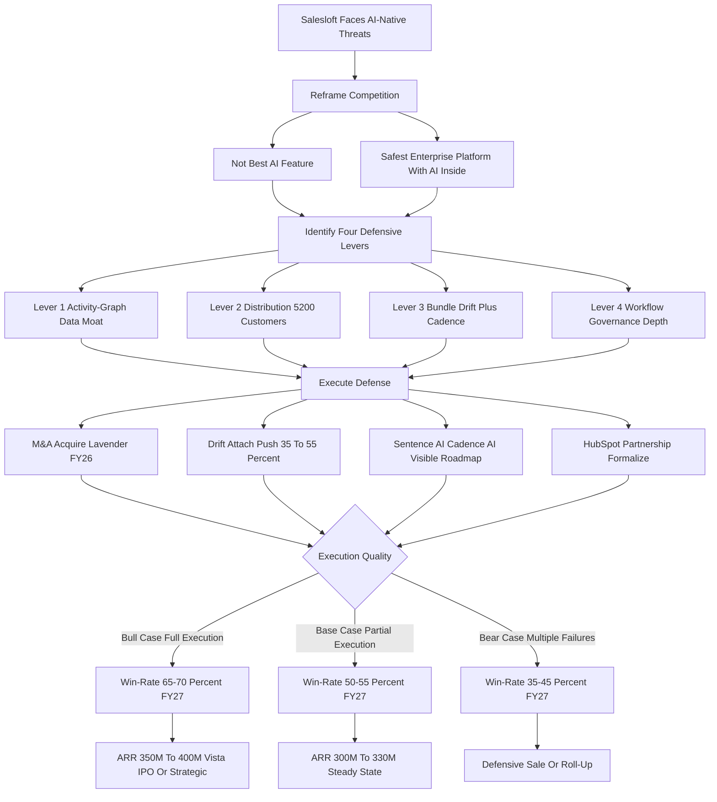

### Direct Answer

Salesloft, the legacy sales engagement platform owned by Vista Equity Partners since the 2024 take-private, competes against AI-native sequencing tools — Lavender, Apollo's AI tier, 11x.ai, Regie.ai, AiSDR, Bondi and the agentic-SDR cohort — not by matching AI feature parity but by **reframing the buying decision** from "best AI feature" to "safest enterprise platform with AI inside." It defends with four structural moats the AI-natives cannot replicate quickly: a 12-to-18-month per-customer **activity-graph data moat**, a **distribution moat** of roughly 5,200 customers plus the HubSpot partnership and Vista's M&A capital, a **product-bundle moat** (Drift conversation plus Cadence sequencing at $135-$185 combined ARPU), and a **workflow-and-governance moat** of enterprise admin, compliance and integration depth. Salesloft does not win the raw-AI fight — it wins the platform-versus-point-tool fight, contingent through 2027 on M&A execution, bundle discipline and a visible AI roadmap.

**TL;DR**

- **The question is wrong in its surface form.** "How does Salesloft compete against AI-native sequencing tools?" assumes a feature contest; the real contest is platform-versus-point-tool for two distinct buyer pools.
- **Four moats carry the defense.** Data (12-18mo corpus), distribution (~5,200 customers, HubSpot channel, Vista capital), bundle (Drift + Cadence, 7-10pt retention lift) and governance (SOC 2, ISO 27001, multi-CRM sync).
- **Salesloft loses the demo and the price comparison, wins procurement.** Lavender writes better emails, 11x ships louder agentic demos, Apollo bundles cheaper — but AI-natives stall in IT, Legal and Finance review.
- **M&A decides the outcome.** Vista's estimated $400M-$800M war chest lets Salesloft buy what it cannot build; a Lavender acquisition is the single highest-leverage move.
- **2027 verdict:** Salesloft survives with its upmarket install base intact; AI-natives grow the bottom-up segment and the category overall. Base-case win-rate 50-55%, bull 65-70%, bear 35-45%.

## Section 1 — Reframing The Salesloft Versus AI-Native Question

### 1.1 Why The Surface Question Is The Wrong Question

The competitive question "how does Salesloft compete against AI-native sequencing tools?" must be reframed before it can be answered. **The naive frame is a feature contest** — Salesloft is legacy, AI-natives like Lavender and Apollo and 11x are faster and cheaper at the AI parts, therefore Salesloft loses. That frame is wrong because it treats sales engagement as a feature category rather than as the **enterprise system of record for outbound activity**, which is what Salesloft actually is for roughly 5,200 paying organizations. **The correct frame is platform-versus-point-tool.** Salesloft is competing on whether the buying committee at a 200-rep mid-market revenue org or a 2,000-rep enterprise sales team picks the safest, most integrated, most governable platform with AI inside, or picks the fastest, cheapest, AI-first point tool. Those are different buyers, different deals, different procurement processes and different success criteria.

### 1.2 The Scoreboard Trap

The AI-natives have done extraordinary work convincing the market that the question is "best AI" — and for the bottom-up motion in startups under 100 reps, that frame is correct and Salesloft is structurally disadvantaged. **For the upmarket motion — where the dollars and the install base actually sit — the frame is "platform versus point solution,"** and Salesloft has advantages the AI-natives have not yet built and cannot quickly replicate. The entire competitive strategy hangs on Salesloft's ability to keep enterprise revenue leaders evaluating the question as "platform with AI" rather than as "best AI feature," while simultaneously closing the AI feature gap fast enough — through build, buy and partner — that the platform frame stays credible. Get the reframing right and the rest of the analysis follows; get it wrong and you are scoring Salesloft on a scoreboard the AI-natives wrote. The companion entry on Salesloft's broader moat against legacy and AI competitors develops this further (q1809), as does the analysis of how Salesloft should rethink its sequencing thesis for AI buyers (q1828).

### 1.3 What "Compete" Actually Means Here

Competing does not mean winning every deal. **It means winning the right deals decisively while conceding the structurally unwinnable ones profitably.** Salesloft's competitive job through 2027 is to defend the upmarket install base, hold the contested mid-market boundary, neutralize the most acute AI-native threats through acquisition, and avoid the trap of burning the R&D budget chasing demos that get leapfrogged in two quarters. There is a recurring failure mode worth naming explicitly: the legacy incumbent that responds to an AI-native disruption by trying to match every demoed feature spends two years and the entire discretionary R&D line shipping "AI catch-up" features that the market reads as defensive, while the actual moats — distribution, bundle, governance — receive no incremental investment and quietly erode. **The discipline is to invest where the structural advantage is, not where the competitor's marketing is loudest.** The strategic question of whether Cadence as a sequencing engine is even still the right thesis in an agentic world is treated in depth elsewhere (q1829) and (q1830).

### 1.4 The Two Clocks Salesloft Is Racing

Salesloft is racing two clocks at once, and conflating them produces bad strategy. **The first clock is the AI-feature-perception clock** — how long the market continues to perceive Salesloft's organic AI as credible enough to keep the platform-with-AI frame intact. That clock runs in quarters: each quarter without a visible flagship AI release erodes the frame. **The second clock is the moat-decay clock** — how long the data, distribution, bundle and governance advantages remain structurally meaningful before AI-natives mature their own install bases and harden their own governance. That clock runs in years, roughly 18-36 months on the data moat and 3-5 years on governance. The strategy works only if Salesloft uses the slower moat-decay clock to buy time for M&A and bundle execution, while spending just enough on the faster perception clock to keep the frame credible. Spend everything on the fast clock and the moats erode unfunded; ignore the fast clock and the platform-with-AI frame collapses before the moats can do their work.

## Section 2 — The Four Defensive Levers In Detail

### 2.1 Lever One — The Activity-Graph Data Moat

**What it actually is:** every Salesloft customer accumulates, on average, 12 to 18 months of granular activity data — which sequences fired, which steps were sent, which buyers opened and replied, which patterns correlated with closed-won pipeline, which reps over- or under-perform with which cadences. After that window a customer has a per-rep, per-segment, per-cadence corpus describing what works in their specific market with their specific buyers. **Why it is a moat:** that corpus is the training fuel for Salesloft's Sentence AI and Cadence AI features, and it makes those models customer-specific in a way an AI-native tool cannot be on day one — a new Lavender or Apollo AI deployment starts from generic LLM defaults and learns the customer's patterns over six to twelve months, while Salesloft starts from the customer's own accumulated data. **Why it is not permanent:** AI-natives close the gap as their own customer bases mature, and synthetic data plus foundation-model fine-tuning can compress the data-moat advantage from years to quarters; a competitor with a thousand mid-market customers can run transfer learning across cohorts of similar customers and approximate customer-specific tuning without the same data depth. **What Salesloft must do to defend the lever:** ship customer-specific AI features that visibly use the longitudinal data rather than generic LLM features rebranded as Salesloft AI, make the data advantage legible in the demo and the renewal conversation ("your AI is trained on your data"), and widen the moat by capturing richer signals — Drift conversation transcripts, multi-touch attribution, downstream opportunity outcomes from CRM sync. The honest read is that the data moat buys Salesloft 18-36 months of differentiation, not a decade, and the company's job is to use those months to build the other three moats that outlast it.

### 2.2 Lever Two — The Distribution Moat

**What it actually is:** roughly 5,200 paying customers weighted to mid-market and enterprise (a rough 70% enterprise / 30% mid-market revenue mix), with an average tenure near 3.2 years, deep Salesforce and HubSpot integrations, and Vista's capital backing both organic growth and an active M&A pipeline. **Why it matters:** this is not a list of email addresses — it is 5,200 organizations where Salesloft is the system of record for outbound activity, where switching out involves a 90-180 day migration, sequence rebuild, rep retraining and integration rewiring. **The HubSpot (NYSE: HUBS) partnership** is the underappreciated multiplier — HubSpot's CRM upmarket motion needs a sales-engagement layer and Salesloft is the strategic partner of choice. **The Vista capital question** is structural: Vista runs Salesloft on disciplined operating margins and M&A-funded category expansion, with an estimated $400M-$800M war chest, which means Salesloft can buy what AI-natives are still building. The Vista exit dynamic and how it reshapes the company is covered separately (q1835).

### 2.3 Lever Three — The Product-Bundle Moat

**What it actually is:** Salesloft owns Drift, the conversation-marketing and AI-chatbot product, and sells it together with Cadence, the sequencing engine. **The pricing:** Drift standalone runs roughly $55-$95 ARPU; Cadence standalone runs roughly $85-$135 ARPU; the bundle prices at approximately $135-$185 combined ARPU, a 15-25% bundle discount. **Why it is a competitive moat:** no AI-native sequencing tool ships an integrated conversation-plus-sequencing combo — Lavender is email-only, Apollo bundles data and sequencing but not conversation, 11x is agentic-outbound focused, Regie is content. **The retention math is the proof:** customers using both products retain at 92-95% gross versus 85-88% for Cadence-only customers — a 7-10 point spread that compounds enormously across the install base. The execution challenge is that Drift attach, currently around 35-40%, needs to reach 50%+ by FY27 for the bundle moat to hit full strategic potential. Cadence's continued strategic relevance is examined in (q1851).

### 2.4 Lever Four — The Workflow And Governance Moat

**What it actually is:** Salesloft has built, over more than a decade, the deep enterprise plumbing every serious customer requires but no demo ever features — multi-tenant admin and role-based access controls, sequence governance and approval workflows for regulated industries, audit trails for compliance and legal review, regional data residency for GDPR and other privacy regimes, SOC 2 Type II and ISO 27001 certifications, bidirectional Salesforce and HubSpot sync with custom field mapping, marketing-automation and conversation-intelligence integrations, dialer infrastructure, multi-team and multi-region structure, sequence sharing and templating across business units, sandbox environments, granular reporting, SSO and identity-provider integration, deep API surface, and the security-review documentation enterprise procurement actually requires. **Why it matters:** an AI-native startup running on a small team and a recent Series A simply has not built this with enterprise-grade depth — they pass the demo and lose procurement. **The five-gate reality:** in a $200K+ ACV enterprise sequencing decision the buying committee includes Sales (cares about AI and features), RevOps (cares about workflow and integration), IT (cares about security and SSO), Legal (cares about contracts and data residency) and Finance (cares about predictability and vendor maturity). Salesloft passes all five gates; an AI-native point tool typically passes one and stalls in the others. That is why Salesloft regularly loses head-to-head AI-feature shoot-outs and still wins the deal — procurement eliminates the AI-native before the feature comparison even matters. **Why it is durable:** building enterprise governance is years of unsexy investment that AI-native startups optimizing for product velocity deliberately deprioritize, which means the gap is widening, not narrowing, in the categories that matter to enterprise buyers.

### 2.5 How The Four Levers Compound

The four levers are not independent — **they reinforce one another.** Distribution funds R&D; R&D feeds the data moat; the bundle deepens distribution; governance protects the install base from churn. The strategic question is not whether the levers exist but whether Salesloft executes hard enough on AI catch-up that the levers stay relevant.

| Lever | Mechanism | Quantified advantage | Decay risk |
|---|---|---|---|
| 1 — Activity-graph data | 12-18mo per-customer engagement corpus | AI-natives need 6-12mo to close; customer-specific tuning | Foundation models compress to quarters |
| 2 — Distribution | ~5,200 customers, HubSpot channel, Vista capital | 18-36mo + enterprise build for AI-native to match | Erodes if partnership or M&A discipline fails |
| 3 — Bundle | Drift + Cadence integrated, $135-185 ARPU | 7-10pt retention lift, no AI-native ships combo | Compresses if AI-natives acquire conversation |
| 4 — Governance | Multi-CRM, SOC 2, ISO 27001, audit, residency | Multi-year, multi-hundred-million build to match | Compresses if a $500M+ entrant builds it |

## Section 3 — The AI-Native Threat Map

### 3.1 Lavender — The Acute Threat

**Lavender is the highest-velocity threat** — an AI email-coaching and writing assistant with roughly 5,000+ customer accounts, estimated $25M-$50M ARR, a strong product-led-growth motion, and a feature focus on real-time email scoring, personalization assist and reply-rate lift. Lavender is the AI feature Salesloft most needs and most clearly does not yet match natively; it is the clearest M&A target in the category and is widely understood to be in conversation with multiple acquirers. The full profile and the acquisition logic are developed in (q1836).

### 3.2 Apollo — The Strategic Threat

**Apollo is the most strategic threat** — not because its AI is better than Salesloft's but because Apollo bundles lead data, intent signals and sequencing into a single $59-$119/user/month offering aimed at the bottom-up self-serve mid-market. Apollo's revenue is estimated at $150M-$250M ARR with a strong free-tier funnel. Apollo's threat is structural: a category-redefining bundle that AI-natives can sell for less because they do not carry the legacy enterprise overhead. The deep competitive read on Apollo against Salesloft and Outreach lives in (q1849).

### 3.3 11x.ai — The Agentic Threat

**11x.ai is the agentic threat** — autonomous SDR agents (Alice for inbound, Mike for outbound) that promise to replace human SDR work entirely. 11x is at an estimated $5M-$15M ARR but with extraordinary attention and a vision (autonomous agentic GTM) that, if it delivers, eliminates the human-AE-driven sequencing category Salesloft is built for. The threat is not 11x's current revenue but the category-redefining bet underneath it.

### 3.4 The Manageable Tail — Regie, AiSDR, Bondi And Others

**Regie.ai** focuses on AI-generated content for sales sequences — an estimated $15M-$30M ARR, complement-not-replacement, integrating with Salesloft and Outreach as much as it competes. **AiSDR** plays an agent-first autonomous-outbound game in a narrower segment, estimated $10M-$25M ARR. **Bondi** combines GTM data and AI sequencing in an early-stage $5M-$15M ARR play. **The long tail** — Clay, Smartlead, Jason AI and similar — plays in adjacent corners of the category and is best ignored while the bundle and the install base do their work.

### 3.5 The Accurate Threat Ranking

| Competitor | Estimated ARR | Threat level | Salesloft response |
|---|---|---|---|
| Lavender | $25M-$50M | Highest (acute) | Acquire in FY26, ~$250M-$400M range |
| Apollo (AI tier) | $150M-$250M | High (strategic) | HubSpot exclusivity + Drift bundle defense |
| 11x.ai | $5M-$15M | Medium (structural) | Build or acquire agentic SDR features |
| Regie.ai | $15M-$30M | Medium-low | Cadence AI content-gen feature |
| AiSDR | $10M-$25M | Low | Sub-100-rep segment, accept losses |
| Bondi | $5M-$15M | Low | Activity-graph data moat |
| Long tail (Clay, Smartlead) | varies | Noise | Ignore, focus on platform |

The competitive reality: Salesloft does not need to beat every AI-native on every feature — **it needs to neutralize Lavender, blunt Apollo's bottom-up motion at the upmarket boundary, build credible agentic features before 11x owns the conversation, and ignore the rest.**

### 3.6 Why The Threats Are Not Interchangeable

The most common analytical error in this category is treating the AI-natives as a single undifferentiated wave. **They are not — each poses a threat of a different shape, severity and time horizon, and each requires a different response.** Lavender is an *acute* threat: a sharp, near-term feature gap that is fully addressable by writing a single check, which is why it tops the M&A list. Apollo is a *structural* threat: not a feature gap but a category-redefinition of the bundle itself, addressable only by Salesloft's own bundle and by channel exclusivity, not by acquisition. 11x is an *existential* threat on a longer horizon: it does not erode Salesloft's current revenue but it bets that the human-AE sequencing category itself shrinks, and the only response is for Salesloft to play in the agentic category before the category forms without it. Regie, AiSDR and Bondi are *manageable* threats: real but narrow, addressable by build-or-partner, and not worth a competitive obsession. **Mismatching the response to the threat shape is how budget gets wasted** — acquiring a manageable-tier company at an acute-tier price, or trying to out-feature Apollo when the actual fight is bundle economics.

## Section 4 — The Buyer Reality

### 4.1 The Salesloft Buyer Profile

**The Salesloft buyer** is a mid-market or enterprise revenue organization with 100+ reps (frequently 500+ to 5,000+), Salesforce or HubSpot as the CRM system of record, a structured RevOps function, a multi-team or multi-region selling organization, formal sales-engagement governance, an integrated GTM stack, and a procurement process that includes Sales, RevOps, IT, Legal and Finance reviews. **The buyer's success criteria:** predictable rep activity, governance and audit, integration depth, vendor maturity — and AI features as one part of a broader platform decision, not the whole decision.

### 4.2 The AI-Native Buyer Profile

**The AI-native buyer** is a seed-to-Series-B startup with 5-100 reps, a founder-led or VP-Sales-led GTM, often HubSpot or a lighter-weight CRM as the system of record, less formal RevOps, faster procurement (often a single decision-maker), willingness to trade governance for speed, and a primary success criterion of outbound throughput and reply-rate lift. **The buyer's success criteria:** ship fast, AI does the heavy lifting, low total cost, no procurement overhead.

### 4.3 The Contested Middle Ground

**The boundary between the two pools is contested ground.** A 100-150 rep mid-market organization could go either way depending on the buying committee, the GTM maturity, and the priority weighting of AI features versus governance. The Apollo bottom-up wedge is exactly the move to grow the AI-native pool upward into the contested ground; the Salesloft Drift bundle and HubSpot exclusivity are the defensive moves to keep the contested ground in the platform-buyer category. The 2027 read is that the contested ground moves slowly toward AI-natives in pure-throughput buyers and slowly toward Salesloft in governance-conscious revenue orgs, leaving the net roughly stable through 2026-2027.

### 4.4 How Salesloft Is Actually Bought And Renewed

**The new-logo enterprise cycle** runs 6-12 months from first conversation to closed-won, with a buying committee of 5-9 stakeholders, a formal RFP, deep technical due diligence, a security review against SOC 2 and ISO 27001, and a 2-3 year contract with annual escalators. The decision rarely turns on a single feature; it turns on which platform passes all the gates and demonstrates the strongest fit for the customer's specific GTM motion. **The mid-market cycle** runs 3-6 months with a smaller 3-5 stakeholder committee, faster procurement, and more weight on AI features and immediate productivity — the segment most contested with Apollo, where Salesloft's bundle and integration depth must do the most competitive work. **The renewal cycle** is initiated 90-120 days before renewal date, with the customer's RevOps team running an internal "stay or switch" evaluation — the major churn drivers are low platform utilization, AI features that did not deliver perceived value (the "we are paying for AI we are not using" objection), weakened CSM relationships, a GTM shift toward a lighter-weight tool, and unreasonable price escalation. **The expansion motion** — existing Cadence customers buying Drift, premium AI, additional seats, or moving to enterprise tiers — is the most economically important customer motion, and bundle attach is its single most important lever because every Drift add-on lifts ARPU, lifts retention and locks the customer deeper into the platform.

### 4.5 Why The Two Pools Will Not Simply Merge

A tempting simplification is that the AI-native pool and the Salesloft pool eventually converge into one market with one winner. **That is unlikely through 2027, because the two pools are defined by genuinely different operating realities, not just different vendor preferences.** A 25-rep Series A startup does not have a RevOps function, does not run a formal security review, does not need multi-region sequence governance, and cannot afford a 6-month procurement cycle — and a 2,000-rep enterprise cannot run pipeline-touching outbound on a tool with thin admin, no audit trail and a Series-A vendor balance sheet. The pools are stable because the *requirements* are stable. What moves is the contested boundary in the 100-300 rep band, and even there the movement is gradual and bidirectional. The correct competitive model is two durable pools with a slowly shifting boundary, and the strategic fight is over the boundary, not over a single converging market.

## Section 5 — Pricing And Packaging

### 5.1 Salesloft's Pricing Structure

**Salesloft holds a premium platform price.** Cadence standalone runs roughly $85-$135 per user per month at typical mid-market and enterprise volume; Drift standalone runs roughly $55-$95 per user per month; the Drift-plus-Cadence bundle prices at $135-$185 combined ARPU, a 15-25% bundle discount versus standalone purchase of both. Enterprise deals layer in admin tiers, premium AI features, advanced governance and CSM-led services, often pushing effective ARPU above $200 per user per month. The mechanics of pricing the Cadence + Drift bundle are developed further in (q1811).

### 5.2 AI-Native Pricing

**The AI-natives undercut on headline price.** Apollo runs roughly $59-$119 per user per month for the AI-tier sequencing-and-data bundle, with a meaningful free-tier funnel — structurally cheaper than Salesloft and explicitly positioned as the lower-cost alternative. Lavender runs $29-$99 per user per month for email coaching, a feature add-on rather than a full platform. 11x.ai runs roughly $200-$500 per "agent" per month, priced per autonomous agent rather than per human seat — a fundamentally different model. Regie.ai runs roughly $89-$199 per user per month for AI content generation.

### 5.3 The Pricing Comparison Table

| Platform / product | Pricing range (per user/mo) | Notes |
|---|---|---|
| Salesloft Cadence (standalone) | $85-$135 | Sequencing engine |
| Drift (standalone) | $55-$95 | Conversation marketing |
| Salesloft Drift + Cadence bundle | $135-$185 | 15-25% bundle discount |
| Salesloft enterprise tier (loaded) | $200+ | Premium AI, governance, services |
| Apollo (AI tier) | $59-$119 | Lead data + sequencing |
| Lavender | $29-$99 | Email coaching add-on |
| 11x.ai (per agent) | $200-$500 | Per autonomous SDR agent |
| Regie.ai | $89-$199 | AI content generation |
| Outreach (closest legacy peer) | $90-$165 | Comparable platform |

### 5.4 The Pricing Strategy Through 2027

**Apollo's $59-$119 versus Salesloft's $135-$185 is the headline every AI-native demo emphasizes** — and it is real — but it omits the bundle value, the integration depth, the governance and the install-base economics. A mid-market customer comparing Apollo at $90 against Salesloft Cadence-only at $110 sees a clear price gap; the same customer comparing Apollo at $90 against Salesloft's full bundle at $160 sees a different value comparison once the conversation product, integrated analytics and unified admin are weighed in. Salesloft's 2027 pricing strategy: hold premium pricing on the platform tier to protect margin and signal enterprise positioning; drive bundle attach to lift effective ARPU and retention; offer a more aggressive AI-features-included tier at the mid-market boundary to blunt Apollo's wedge; and use Vista's M&A capacity to acquire AI capabilities rather than build them and amortize the cost over the install base. The risk: if AI-natives at scale deliver enterprise-credible feature parity at sub-$100 pricing, Salesloft is forced into a margin-compressing response, and the platform-pricing premium that funds Vista's returns and the R&D budget compresses.

### 5.5 The Per-Seat Model Versus The Per-Agent Model

The deepest pricing risk is not the headline discount — it is the **model mismatch**. Salesloft, Apollo, Lavender and Outreach all price per human seat. 11x prices per autonomous agent. Those are not two points on one scale; they are two different economic theories of the category. If a customer replaces ten human SDRs with three agents, a per-seat vendor's revenue from that account collapses by 70% even if the agents run on a sequencing platform underneath, while a per-agent vendor captures the value. **Salesloft's per-seat pricing is structurally exposed to its own customers automating away the seats it bills for.** The defensive move is to evolve toward usage-based or outcome-based pricing tiers — billing on sequences executed, meetings booked or pipeline touched rather than on human headcount — so that an account that shifts from humans to agents stays roughly revenue-neutral to Salesloft instead of shrinking. This is a 2027-2028 roadmap question, not a 2026 one, but pricing-model evolution is the quietest and most important pricing decision Salesloft faces.

## Section 6 — The M&A Game

### 6.1 Vista's War Chest

**Salesloft's competitive position through 2027 may be more determined by M&A than by product**, because M&A lets Salesloft buy AI capabilities faster than it can build them. Vista Equity Partners brings a documented willingness to deploy growth capital into category consolidation, an investment thesis around platform companies acquiring point solutions, and the balance-sheet flexibility to execute $50M-$500M deals. The realistic Vista war chest for Salesloft category M&A is in the $400M-$800M range over the 2025-2027 window.

### 6.2 The Lavender Acquisition Question

**The Lavender acquisition is the single most strategically important M&A move available.** Lavender is the highest-velocity AI feature gap, has 5,000+ customers (a meaningful install-base addition), is at a stage where acquisition pricing in the $250M-$400M range is plausible, and is widely understood to be in conversation with Salesloft, Outreach and others. The strategic logic: acquiring Lavender immediately closes the AI email-writing gap, removes the most visible AI-native competitor from the field, brings 5,000+ customers into the Salesloft funnel, and signals to the market that Salesloft is the active consolidator rather than the legacy incumbent being disrupted.

### 6.3 Other M&A Candidates

Beyond Lavender, the realistic target list includes **an AI sales-conversation startup** to deepen Drift's AI, **a small agentic-SDR startup** to credibly enter the agentic category before 11x defines it without Salesloft, **a vertical sequencing tool** to extend into a regulated industry where Salesloft is underweight, and **a pipeline-orchestration or RevOps adjacency** to expand the platform footprint.

| Target | Estimated acquisition range | Strategic rationale |
|---|---|---|
| Lavender | $250M-$400M | Closes acute AI email gap; brings 5,000+ customers |
| Small agentic-SDR startup | $50M-$150M | Credible agentic play before 11x defines the category |
| AI sales-conversation startup | $75M-$200M | Deepens Drift AI capabilities |
| Vertical sequencing tool | $50M-$150M | Extends into healthcare or financial services |
| Pipeline-orchestration adjacency | $100M-$300M | Platform footprint expansion |

### 6.4 The M&A Discipline

**Vista will not let Salesloft overpay, and Salesloft cannot afford to be priced out.** The right move is decisive Lavender acquisition early, surgical adds in agentic and conversation-AI, and ruthless avoidance of the bidding wars that destroy capital efficiency. The bear-case M&A scenario — Outreach (Salesloft's closest legacy competitor) acquires Lavender first — leaves Salesloft with a permanent AI gap and a competitor that has both the install base and the AI capability. The constraint that makes this hard: a competitor with deeper pockets — Salesforce, Microsoft, or an AI-native that lands a mega-round — could outbid Salesloft on a strategic target, and Vista's return-on-capital discipline caps how high Salesloft can chase.

### 6.5 Integration Risk — The Reason M&A Often Fails

Acquiring Lavender is the easy part; **integrating it is where the value is created or destroyed.** The integration risks are concrete: Lavender's product runs on a different architecture and a different data model than Cadence, so a true native integration is a multi-quarter engineering effort, not a logo swap; Lavender's product-led-growth motion and self-serve customer base are culturally and operationally different from Salesloft's enterprise sales motion, and PLG funnels decay fast when absorbed into an enterprise sales org; and the most acquisition-critical Lavender talent — the people who actually understand the email-scoring models — are exactly the people most likely to leave after a take-private acquirer's sponsor closes the deal. **The M&A thesis is only as good as the integration plan**, and Salesloft's track record with the Drift integration — which took longer to bundle effectively than originally planned — is the relevant precedent to weigh. A successful Lavender deal requires a named integration owner, a two-quarter native-integration commitment, and retention packages for the model team locked before the deal signs.

## Section 7 — The HubSpot Partnership And Channel Exclusivity

### 7.1 What The Relationship Currently Is

**Salesloft is a strategic partner to HubSpot for sales engagement**, with deep bidirectional integration into HubSpot CRM, joint go-to-market motions including co-marketing and co-selling, and the de-facto recommended sequencing platform for HubSpot CRM upmarket customers. HubSpot's own native sequencing is real but lighter-weight and focused on SMB and lower mid-market; HubSpot has historically partnered for the deeper enterprise sequencing layer rather than building it natively.

### 7.2 Why It Matters For The AI-Native Competition

**HubSpot's CRM upmarket motion is one of the largest single distribution channels in the entire revenue-software category.** Customers crossing the upmarket threshold from HubSpot's lower-tier products into the enterprise tier need a sales-engagement layer, and Salesloft is the path of least resistance. Apollo, which is building a competing CRM-plus-sequencing bundle, is structurally locked out of the HubSpot upmarket flow as long as the partnership holds.

### 7.3 The Strategic Upside And Risk

**The strategic upside:** a formal or exclusive partnership — "preferred sales engagement partner for HubSpot enterprise customers," joint-product features, deeper CRM integration, joint roadmap commitments — substantially raises the cost for any AI-native to win HubSpot upmarket deals and effectively eliminates a major Apollo growth vector, since Apollo is partly attempting to build its own competing CRM-plus-sequencing bundle. **The strategic risk:** HubSpot's Breeze AI and broader native AI investment could include native sequencing features that compete directly with Salesloft, weakening the partnership rationale and pushing HubSpot toward building rather than partnering. If HubSpot decides the sequencing layer is too strategic to leave to a partner, the relationship erodes and Salesloft loses one of its strongest channel positions. The watch-item is HubSpot's Breeze AI roadmap and its public statements about native sales engagement; any signal that HubSpot is building rather than partnering is a major shift in competitive terrain. The Breeze AI threat to standalone sequencing is examined in (q1853).

### 7.4 Why The Partnership Is Likely To Deepen Through 2027

The base-case read is that the HubSpot partnership deepens rather than erodes through FY27, and the reason is mutual incentive rather than goodwill. **HubSpot benefits from not having to build enterprise sequencing depth** — multi-region governance, audit trails, deep dialer infrastructure and the rest are years of investment that distract from HubSpot's core CRM and SMB-to-mid-market platform priorities. **Salesloft benefits from access to one of the largest upmarket distribution channels in the category.** Both companies have a rational interest in deepening rather than disrupting, and Breeze AI is more naturally positioned as a complement — AI inside the CRM workflow — than as a full enterprise sequencing replacement. The partnership erodes only if HubSpot makes a deliberate strategic decision to internalize the entire sequencing layer, which is a multi-year build HubSpot has so far shown no clear commitment to. Salesloft's job is to make itself the obvious, low-friction, jointly-engineered choice so that build-versus-partner math always favors partner.

## Section 8 — The Agentic SDR Question

### 8.1 The Agentic Thesis

**The single most existential question for Salesloft is whether autonomous agentic SDRs collapse the human-AE-driven sequencing category.** The agentic thesis: rather than a human SDR or AE running sequences in Salesloft or Apollo, an autonomous agent prospects, personalizes, sends, follows up, qualifies and books meetings entirely without human touch — replacing not the sequencing tool but the human who used the tool. If the thesis fully delivers, the addressable market for human-AE sequencing platforms shrinks.

### 8.2 The Current Evidence

**11x.ai has demonstrated impressive agentic demos and accumulated meaningful (though small) ARR**, but real customer adoption at scale has been slower than the public narrative suggests, with mixed results on quality, deliverability and actual pipeline conversion versus human-AE-driven sequences. Foundation-model improvements make the underlying agent capabilities better quarterly, suggesting the trajectory is real even if the current state is over-marketed.

### 8.3 The Honest Assessment And Salesloft's Response

**Agentic SDR is real, growing, and will materially reshape the category by 2028-2030, but it does not eliminate human-AE sequencing in 2026-2027.** The most likely intermediate state is a hybrid — agentic agents for high-volume top-of-funnel prospecting, human AEs for qualification and complex deals, with sequencing platforms supporting both motions. Salesloft must ship credible agentic features within the platform (built or acquired) so customers exploring agentic do not have to leave Salesloft, participate in defining the hybrid model rather than letting AI-natives define it, and watch foundation-model and 11x adoption velocity closely as the leading indicator of when category-redefinition becomes real. The deeper analysis of what replaces Cadence if agents handle outbound lives in (q1829), and the question of pivoting Salesloft from sequencing to AI orchestration is treated in (q1830).

### 8.4 The Governance Argument Applies To Agents Too

The under-appreciated point in the agentic debate is that **the governance moat does not disappear when the human SDR does — it arguably becomes more important.** An autonomous agent sending outbound at scale is a larger compliance, deliverability and brand-risk surface than a human rep, not a smaller one. An enterprise that lets an AI agent touch its pipeline needs audit trails of what the agent sent and why, approval workflows for agent-generated messaging, data-residency controls on the agent's training and inference data, rate and brand-safety guardrails, and a clear accountability chain when an agent misfires. **A pure-play agentic startup that has not built enterprise governance ships an ungoverned agent — which is precisely the thing an enterprise risk function will not approve.** This reframes Salesloft's agentic opportunity: it does not need to win the agent-quality demo against 11x; it needs to be the platform that can run agents *safely* inside an enterprise's existing governance, integration and audit framework. "The governed agentic platform" is a more defensible position for Salesloft than "the best agent," and it is consistent with the moats it already owns.

## Section 9 — The CRM-Adjacent Threat

### 9.1 Why CRM Vendors Are A Bigger Threat Than AI-Natives

**A separate and potentially larger threat than the AI-native sequencing tools is the major CRM vendors bundling native AI sequencing into their platforms.** HubSpot (NYSE: HUBS) with Breeze AI, Salesforce (NYSE: CRM) with Einstein and Agentforce, Microsoft (NASDAQ: MSFT) with Dynamics 365 Copilot — CRM vendors own the system of record, the customer relationship and the deepest data. If they ship credible native sequencing with AI built in, customers face a "good-enough integrated" versus "best-of-breed standalone" choice that historically favors the integrated option in late-stage category consolidation.

### 9.2 The Three CRM-Adjacent Threats

**HubSpot Breeze AI** is the closest active threat — HubSpot has a clear strategic interest in extending native capability up the stack, and its mid-market and lower-enterprise base is precisely the segment Salesloft most needs to defend. **Salesforce Einstein and Agentforce** is the larger but slower-moving threat — Salesforce has historically partnered for sales engagement, but Agentforce represents a strategic shift toward owning more of the AI-driven workflow natively. **Microsoft Dynamics Copilot** is the dark-horse threat — Microsoft has the foundation-model relationships, the enterprise distribution and the deep pockets to ship a Copilot-driven sequencing experience.

### 9.3 Salesloft's Defense Against CRM-Adjacent AI

**Salesloft's defense is the platform depth and bundle value that goes beyond what an integrated CRM AI feature can deliver** — enterprise governance, multi-CRM support (Salesloft works with both Salesforce and HubSpot, an integrated CRM AI does not), the conversation-plus-sequencing combo, and specialized RevOps depth. The single strongest argument is multi-CRM neutrality: a large enterprise frequently runs more than one CRM across business units after acquisitions, and an integrated CRM-AI sequencing feature only serves the customers on that one CRM, while Salesloft serves the whole org regardless of which CRM each unit runs. The HubSpot-Salesloft partnership is the critical hedge: as long as the partnership holds, Breeze AI is a complement rather than a competitor.

### 9.4 Ranking The Threats — AI-Natives Versus CRM-Adjacent

If an operator must rank the threats by severity, **the CRM-adjacent threat is larger and slower than the AI-native threat.** An AI-native winning a feature comparison costs Salesloft a deal; a CRM vendor deciding to internalize the sequencing layer costs Salesloft a category. But the CRM-adjacent threat moves on a 3-5 year clock — CRM vendors have historically partnered for enterprise sequencing because building it well is genuinely hard and off their core roadmap. The practical implication: Salesloft should spend its near-term competitive energy on the AI-natives (the fast, deal-by-deal clock) while making the structural bets — multi-CRM depth, governed agentic, bundle — that hedge the slower CRM-adjacent clock. The worst-case scenario remains HubSpot or Salesforce deciding sequencing is too strategic to leave to a partner; that is the contingency Salesloft must prepare for through platform depth, M&A and disciplined partnership management.

## Section 10 — The Strategic Decision Flow

The diagram below maps how Salesloft moves from facing AI-native threats to one of three FY27 outcomes.

## Section 11 — Win/Loss Patterns

### 11.1 Where Salesloft Consistently Wins

**Salesloft wins** enterprise deals at 500+ reps where governance, compliance and integration depth matter; deals where Salesforce is the CRM and Salesloft's deep integration creates structural advantage; deals where the buying committee includes IT, Legal and Finance and the AI-native point tool fails procurement; renewal deals where switching cost dominates; deals needing both inbound conversation and outbound sequencing where the Drift-plus-Cadence bundle eliminates the point tool; multi-region enterprise deals; and deals in regulated industries where audit trails, data residency and compliance posture eliminate AI-natives.

### 11.2 Where Salesloft Consistently Loses

**Salesloft loses** sub-100-rep startups where speed and cost dominate and procurement is one decision-maker; HubSpot-CRM deals at the lower mid-market boundary where Apollo's all-in-one bundle is cheaper and good-enough; pure outbound-velocity buyers where Lavender's email AI demonstrably outperforms; AI-first cultures willing to trade governance for the most aggressive tooling; and greenfield deals where there is no existing Salesforce or HubSpot integration.

### 11.3 The Win/Loss Table

| Deal type | Salesloft win probability | Driver |
|---|---|---|
| Enterprise 500+ reps with Salesforce | 70-80% | Governance, integration, bundle |
| HubSpot upmarket via partnership | 65-75% | Partnership defense |
| Mid-market 100-500 reps contested | 45-55% | Bundle versus price trade-off |
| Sub-100-rep startup AI-first | 15-25% | Concede; structural disadvantage |
| Greenfield, no Salesforce/HubSpot | 30-40% | Lighter integration favors AI-natives |
| Renewal in install base | 90-92% | Switching cost dominant |
| Regulated industry (healthcare, finance) | 75-85% | Compliance posture decisive |

### 11.4 The Competitive Guidance For Sales

**Salesloft loses on AI feature parity in the demo, loses on price in the comparison, and wins on enterprise depth in procurement.** The guidance: lead every enterprise conversation with platform, integration, governance and bundle value; lead AI comparisons with the customer's own data ("your AI is trained on your data") rather than feature parity; use the Drift bundle as the differentiator AI-natives cannot match; and concede the sub-100-rep AI-first segment rather than chasing deals Salesloft cannot win profitably. The Salesloft-versus-Outreach buy decision, a useful adjacent frame for buyers, is covered in (q1854).

## Section 12 — Bull, Base, And Bear Cases Through 2027

### 12.1 The Bull Case

**Salesloft executes the full playbook.** It acquires Lavender in FY26 at a $250M-$350M price and integrates within two quarters, absorbing Lavender's 5,000+ customers. Drift attach climbs from 35-40% to 55%+ by FY27. The Sentence AI and Cadence AI roadmap ships visibly with two or three flagship features per quarter. The HubSpot partnership formalizes into "preferred enterprise sales engagement partner." One or two additional surgical acquisitions extend the platform. **Net result:** win-rate against AI-natives reaches 65-70% by FY27, ARR grows from roughly $250M to $350M-$400M, gross retention stays at or above 92%, and Vista positions for an IPO or strategic exit at a 6-8x revenue multiple. The full bull case for Salesloft is developed in (q1839).

### 12.2 The Base Case

**Partial execution.** Salesloft acquires a smaller AI-tooling startup (not Lavender, which goes to Outreach or stays independent), Drift attach climbs to 45-50%, the AI roadmap ships at moderate cadence, the HubSpot partnership deepens informally without formal exclusivity, and competitive win-rate against AI-natives lands at 50-55%. ARR grows modestly to $300M-$330M, gross retention holds around 88-90%, and Vista runs a longer runway before exit.

### 12.3 The Bear Case

**Multiple things go wrong.** Outreach wins the Lavender acquisition, leaving Salesloft with a visible AI gap. Apollo's bottom-up wedge succeeds in the contested mid-market. 11x establishes agentic SDR as a category Salesloft cannot credibly enter. HubSpot ships native Breeze AI sequencing and weakens the partnership. The AI roadmap underwhelms and Drift attach stalls at 35-40%. **Net result:** win-rate against AI-natives drops to 35-45%, ARR stagnates or declines slightly, gross retention drifts toward 85%, and Vista is forced into a defensive sale or merger at a compressed multiple. The full bear case is developed in (q1838).

### 12.4 The Scenario Table

| Scenario | Probability | Win-rate vs AI-natives | ARR outcome | Gross retention | Vista outcome |
|---|---|---|---|---|---|
| Bull | 25-30% | 65-70% | $350M-$400M | 92%+ | IPO or strategic exit at 6-8x revenue |
| Base | 45-50% | 50-55% | $300M-$330M | 88-90% | Continued hold, longer runway |
| Bear | 20-25% | 35-45% | $230M-$260M (decline) | ~85% | Defensive sale or merger, compressed multiple |

### 12.5 The Variables That Decide Which Scenario Happens

The scenarios are not equally driven by Salesloft's own execution. **The base case is mostly within Salesloft's control** — partial M&A, moderate roadmap cadence, informal partnership deepening — and reaching it requires competent, not heroic, execution. **The bull case requires both excellent execution and favorable external conditions** — Salesloft must execute the full playbook *and* win the Lavender deal *and* see the HubSpot partnership formalize. **The bear case is largely externally driven** — it happens primarily when Outreach wins Lavender, Apollo's wedge succeeds, 11x makes agentic real fast, or HubSpot internalizes sequencing, none of which Salesloft fully controls. The honest probability weighting — bull 25-30%, base 45-50%, bear 20-25% — reflects this asymmetry: Salesloft can guarantee itself the base case through discipline, can earn the bull case through discipline plus M&A luck, and can suffer the bear case despite reasonable execution if the external dice land wrong.

| Decision variable | Controlled by Salesloft? | Pushes toward |
|---|---|---|
| Lavender acquisition outcome | Partially (competes with Outreach) | Bull if won, bear if lost |
| Drift bundle attach rate | Mostly yes | Bull if 55%+, bear if stalls at 35-40% |
| AI roadmap visible cadence | Yes | Bull if quarterly flagships, bear if slow |
| HubSpot partnership formalization | Partially (HubSpot's call) | Bull if exclusive, bear if Breeze internalizes |
| Apollo mid-market velocity | No | Bear if wedge succeeds |
| 11x agentic delivery speed | No | Bear if enterprise-credible by 2027 |

## Section 13 — What An Operator Should Actually Do

### 13.1 For A Salesloft Executive

**The playbook is bundle attach, M&A execution, AI roadmap velocity, HubSpot formalization and disciplined enablement.** Drive Drift to 50%+ within 18 months. Acquire Lavender or a credible peer in FY26. Ship visible AI roadmap every quarter. Push the HubSpot partnership toward exclusivity in the upmarket. Lead sales with platform value, and concede sub-100-rep AI-first deals rather than burning margin chasing them.

### 13.2 For An AI-Native Competitor

**The playbook is wedge, build governance, partner, and avoid head-to-head enterprise fights.** Wedge into the contested mid-market boundary with AI-feature differentiation and aggressive pricing. Build the governance and integration depth that lets you cross into enterprise procurement. Partner aggressively with CRM vendors. Avoid head-to-head enterprise upmarket competition with Salesloft until the governance gap is closed.

### 13.3 For A Customer Evaluating Sequencing In 2027

**First determine whether you are an upmarket platform buyer or a bottom-up AI-first buyer**, then pick the platform that matches that profile rather than optimizing for a single dimension like "best AI." Mid-market buyers in the contested zone should explicitly evaluate the bundle value, the integration economics and the governance posture against the AI feature gap, and price the trade-off honestly. The sales-engagement category sizing that frames this decision is covered in (q1846).

### 13.4 For An Investor In The Category

**Salesloft is a defensible platform with real moats but exposed to AI-native disruption and CRM-adjacent threats.** The bull case is M&A-led consolidation and AI catch-up by 2027; the base case is steady-state competition with modest market-share shifts; the bear case is a defensive sale or roll-up. AI-native pure-plays are growth stories with category-redefinition optionality but face structural enterprise-governance gaps that limit upmarket TAM. The risk asymmetry matters for position-sizing: Salesloft's downside is bounded by the install-base value — even a bear case leaves a ~$230M-$260M ARR business with high gross retention that a strategic acquirer will pay for — while an AI-native pure-play's downside is closer to zero if it fails to scale into enterprise before foundation-model commoditization erodes its feature edge. Both sides have viable paths to multi-billion-dollar outcomes; the category is not winner-take-all.

### 13.5 For A RevOps Practitioner Choosing Tools

**Evaluate based on your actual GTM motion, not on which tool has the most aggressive AI demo.** The decision inputs that matter: your CRM (Salesforce or HubSpot favors Salesloft's deep integration; a lighter CRM widens the AI-native option), your governance requirements (regulated industry or multi-region structure favors the platform), your integration footprint (a deep existing stack raises the switching cost of leaving a platform and the integration cost of adopting a point tool), your team's operating maturity (a formal RevOps function can absorb platform complexity; a lean team values the AI-native's simplicity), and your three-year vendor strategy (whether you need a vendor that will still be there, and consolidating, in 2029). The right tool is the one that fits your GTM, not the one with the best feature in isolation — and the most expensive mistake is buying for the demo and discovering the governance, integration and renewal realities afterward.

### 13.6 The Throughline For Every Audience

Across all five audiences the throughline is the same: **competitive strategy in this category is about matching platform-versus-point-tool capabilities to platform-versus-point-tool buyers, executing against the moats that matter to your audience, and avoiding the trap of competing on dimensions you are structurally disadvantaged on.** Salesloft can win the platform game; it cannot win the pure AI-feature game; the strategy must be ruthlessly consistent with that reality. AI-natives can win the bottom-up game; they cannot win the enterprise-governance game until they spend years building it; their strategy must be equally consistent. The operators who lose are the ones who fight on the other side's scoreboard.

## Section 14 — Counter-Case: Why Salesloft May Lose The AI Transition Anyway

The analysis above describes a defensible position, but a serious operator must stress-test it against the conditions under which Salesloft loses despite executing the playbook.

### 14.1 The Data Moat Decays Faster Than Marketed

**The 12-18 month per-customer data corpus is genuinely valuable today, but it is a wasting asset.** Foundation-model improvements make smaller corpuses far more useful, synthetic data and transfer learning let AI-natives close the gap from years to quarters, and a year from now the "your AI is trained on your data" claim is harder to defend in a buyer demo.

### 14.2 Outreach Beats Salesloft To Lavender

**Outreach has the same install-base logic, similar capital and equal motivation.** If Outreach wins the Lavender deal — a real and meaningful probability — Salesloft is left with a permanent visible AI gap, Outreach gets the install-base addition and the AI capability, and the head-to-head dynamic shifts decisively against Salesloft for two-plus years.

### 14.3 Apollo's Wedge Succeeds And Agentic Collapses The Category

**Apollo's $59-$119 pricing and all-in-one bundle are structurally compelling for mid-market buyers.** If Apollo crosses the contested threshold, Salesloft's growth in the segment most needed for ARR expansion stalls. Compounding this, if 11x or a peer delivers credible enterprise-grade autonomous outbound agents that actually replace SDR headcount, the entire human-AE sequencing category Salesloft is built for shrinks structurally by 2028-2029.

### 14.4 The CRM Vendors And Vista Discipline Undermine The Defense

**HubSpot Breeze AI shipping native sequencing weakens the partnership; Salesforce Agentforce internalizing the sequencing layer removes a CRM pillar.** And Vista is a financial owner with a return discipline — the M&A budget is real but bounded, R&D is constrained by margin targets, and if the AI transition demands more capital and faster execution than Vista is willing to fund, Salesloft is structurally under-invested versus AI-natives raising hundreds of millions in growth equity.

### 14.5 The Procurement Gate Erodes And Pricing Pressure Compresses Margin

**The enterprise-governance gate that protects Salesloft today is not permanent.** Apollo is investing in enterprise, Lavender is hardening compliance, and new AI-natives are SOC 2 from day one. If a deep-pocketed entrant ($500M-$1B-funded, or a Microsoft Copilot extension) builds the full governance stack and combines it with AI-native architecture, the moat compresses precisely in the segment Salesloft most depends on — and the resulting pricing pressure forces a margin response that compresses the platform-pricing premium funding Vista's returns and the R&D budget.

### 14.6 When This Counter-Case Dominates

**The bear-case probability of 20-25% is not negligible — it is the second-most-likely outcome after the base case.** The mitigations — aggressive M&A, bundle discipline, HubSpot formalization, AI roadmap velocity, buyer education — are necessary but not sufficient. The factors mostly outside Salesloft's control — Outreach M&A execution, Apollo's mid-market velocity, 11x's agentic delivery, HubSpot's Breeze roadmap, Vista's investment discipline, foundation-model velocity — collectively determine whether the playbook works. Anyone modeling Salesloft should hold the bull case as aspirational, the base case as most likely, and the bear case as a real risk demanding honest contingency planning.

## Section 15 — The Honest 2027 Verdict

### 15.1 Salesloft Is Not Dying

**The activity-graph data moat, the 5,200-customer install base, the Drift-plus-Cadence bundle, the Vista capital and M&A capacity, the HubSpot partnership and the governance depth are real defensive assets that compound.** A competitor cannot simply ship better AI features and dislodge a platform with these structural advantages, especially when the buying committee for upmarket sales engagement values exactly the qualities Salesloft has built.

### 15.2 Salesloft Is Also Not Winning The AI Feature War

**Lavender writes better individual emails. 11x ships more aggressive autonomous-agent demos. Apollo bundles more cheaply.** Salesloft's organic AI roadmap is credible but trailing, and competing on feature parity is a losing strategy that misallocates the R&D budget. The right strategy is the one Salesloft is largely executing: reframe the buying decision, use M&A to close the most acute gaps, drive bundle attach, formalize the HubSpot channel, and ship a steady cadence of visible AI roadmap.

### 15.3 The Most Likely Outcome And The Category Picture

**The most likely 2027 outcome:** Salesloft retains its upmarket install base, holds a roughly 50-55% competitive win-rate against AI-natives in head-to-head deals, grows ARR modestly to $300M-$350M, holds gross retention at 88-90%, and positions for a continued Vista hold, an IPO, or a strategic acquisition. AI-natives grow the overall category, win the bottom-up segment decisively, and contest the mid-market boundary — but do not displace Salesloft in the enterprise. The category, not just Salesloft, expands: sales engagement and AI sequencing in aggregate become a larger, more important and more contested category through 2027, with the platform-versus-point-tool segmentation persisting and both segments growing. The category is not winner-take-all; it is segmentation-and-bundle, and Salesloft's job is to win its segment decisively while AI-natives win theirs.

### 15.4 The One-Sentence Answer

If the entire analysis compresses to a single sentence: **Salesloft competes against AI-native sequencing tools by being the safest enterprise platform with AI inside, by buying what it cannot quickly build, by deepening the Drift bundle, and by formalizing the HubSpot channel — and that strategy works through 2027 if executed with discipline, contingent on M&A execution rather than on raw AI feature parity.** The honest framing for an operator: the question is not "does Salesloft have the best AI" — it does not, and it never needs to — the question is "does Salesloft survive the AI transition with its install base intact," and the answer through 2027 is yes, in the base case, with real bull and bear tails on either side.

## Sources

1. Salesloft Company Site — product, integration and strategic positioning documentation. https://www.salesloft.com
2. Salesloft About Page — customer count and corporate profile reference. https://www.salesloft.com/about
3. Salesloft Cadence Product Documentation — sequencing-engine feature reference. https://www.salesloft.com/platform
4. Vista Equity Partners — portfolio and investment-thesis reference for capital availability. https://www.vistaequitypartners.com
5. Vista Equity Partners Press Releases — take-private and platform-consolidation playbook reference.
6. Lavender AI — email-coaching platform; highest-priority AI-native competitor. https://www.lavender.ai
7. Apollo.io — lead-data and sequencing platform; strategic bottom-up competitor. https://www.apollo.io
8. Apollo.io Pricing Page — AI-tier and free-tier pricing reference. https://www.apollo.io/pricing
9. 11x.ai — autonomous SDR agents Alice and Mike; agentic competitor. https://www.11x.ai
10. Regie.ai — AI content generation for sales sequences. https://www.regie.ai
11. AiSDR — autonomous outbound SDR platform. https://aisdr.com
12. Bondi — GTM data and AI sequencing, early-stage competitor. https://www.bondi.ai
13. Outreach — Salesloft's closest legacy competitor. https://www.outreach.io
14. HubSpot — CRM and Sales Hub platform; strategic Salesloft partner. https://www.hubspot.com
15. HubSpot Breeze AI Documentation — native AI investment shaping partnership dynamics. https://www.hubspot.com/products/breeze
16. Salesforce Einstein and Agentforce — CRM-adjacent AI sequencing threat. https://www.salesforce.com/einstein
17. Microsoft Dynamics 365 Copilot Documentation — CRM-adjacent AI threat. https://www.microsoft.com/dynamics-365
18. Drift — conversation-marketing platform acquired by Salesloft. https://www.drift.com
19. Bessemer Venture Partners — State of the Cloud 2026 category benchmarks. https://www.bvp.com/atlas
20. Gartner Magic Quadrant — Sales Engagement Platforms analyst evaluation. https://www.gartner.com/en/sales/research
21. Forrester Wave — Sales Engagement Platforms category evaluation. https://www.forrester.com
22. G2 Sales Engagement Platforms Category — customer-review marketplace data. https://www.g2.com/categories/sales-engagement
23. TrustRadius Sales Engagement Reviews — independent customer-review data. https://www.trustradius.com
24. PitchBook — Salesloft and sales-engagement M&A coverage. https://pitchbook.com
25. Crunchbase — funding profiles for AI-native sequencing tools. https://www.crunchbase.com
26. The Information — sales-engagement and AI-native industry reporting. https://www.theinformation.com
27. TechCrunch — coverage of Lavender, Apollo, 11x and category competition. https://techcrunch.com
28. Pavilion — CRO and revenue-leader community discussion of tool selection. https://www.joinpavilion.com
29. RevOps Co-op Community — practitioner reference for RevOps platform decisions. https://www.revopscoop.com
30. SaaStr — Jason Lemkin commentary on sales engagement and AI-native dynamics. https://www.saastr.com
31. Tomasz Tunguz / Theory Ventures — SaaS competitive analysis and platform-versus-point-tool framing. https://tomtunguz.com
32. ChiefMartec — Scott Brinker category-mapping of the sales and marketing technology landscape. https://chiefmartec.com
33. SOC 2 and ISO 27001 Compliance Standards Documentation — enterprise governance gate reference. https://www.aicpa.org
34. GDPR and Regional Data Residency Documentation — data-residency requirement reference. https://gdpr.eu
35. OpenAI and Anthropic Foundation Model Documentation — models powering AI-native sequencing capabilities. https://www.anthropic.com
36. RepVue and Modern Sales Pros Community Data — community-sourced data on rep tool usage and platform satisfaction. https://www.repvue.com
