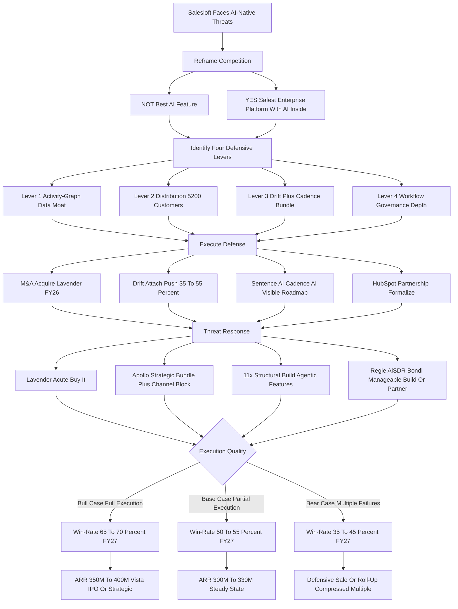

### Direct Answer

Salesloft competes against AI-native sequencing tools not by matching them on raw AI features -- a fight it cannot win -- but by reframing the buying decision from "best AI feature" to "safest enterprise platform with AI inside" and defending four structural moats the AI-natives cannot replicate quickly: an activity-graph data moat, a roughly 5,200-customer distribution moat backed by Vista capital and the HubSpot channel, a Drift-plus-Cadence product bundle no point tool ships, and an enterprise workflow-and-governance moat built over a decade. The honest 2027 verdict is that Salesloft survives with its upmarket install base intact and a 50-55% base-case head-to-head win-rate, contingent on M&A execution (the Lavender acquisition question), bundle attach discipline, and a visibly delivered AI roadmap -- while the AI-natives grow the bottom-up segment and contest the mid-market boundary.

**TL;DR:** Salesloft (owned by Vista Equity Partners since 2024) faces AI-native sequencing competitors -- Lavender, Apollo's AI tier, 11x.ai, Regie.ai, AiSDR, Bondi -- that out-demo it on individual AI features and undercut it on price. It does not win on feature parity. It wins by being the platform that passes Sales, RevOps, IT, Legal, and Finance procurement gates while a point tool passes one. The four levers (data, distribution, bundle, governance) compound, but none is permanent. The competitive question is not "does Salesloft have the best AI" but "does Salesloft survive the AI transition with its install base intact" -- and through 2027 the answer is a qualified yes. Base case: ~50-55% win-rate, ARR $300M-$330M, gross retention 88-90%. Bull case (Lavender acquired, Drift attach >50%): 65-70% win-rate. Bear case (Outreach wins Lavender, Apollo wedges up, HubSpot internalizes the layer): 35-45% win-rate and a defensive sale.

## 1. Reframing The Question: Platform Versus Point Tool

### 1.1 Why The Surface Question Is The Wrong Question

The competitive question "how does Salesloft compete against AI-native sequencing tools?" is misleading in its surface form, and any operator -- whether at Salesloft, at an AI-native rival, at a customer evaluating both, or at an investor sizing the category -- must reframe it before answering. **The naive frame is a trap.** It says: Salesloft is a legacy sales engagement platform; AI-natives like Lavender and Apollo and 11x.ai are faster and cheaper at the AI parts; therefore Salesloft loses. That frame treats sales engagement as a feature category rather than as the **enterprise system of record for outbound activity**, which is what Salesloft actually is for roughly 5,200 paying organizations.

**The correct frame is platform-versus-point-tool.** Salesloft is not competing on AI feature parity, because it cannot win that fight, and trying to fight it that way is the documented path to losing the install base while burning the R&D budget chasing demos that get leapfrogged in two quarters. Salesloft is competing on **whether the buying committee at a 200-rep mid-market revenue org or a 2,000-rep enterprise sales team picks the safest, most integrated, most governable platform with AI inside, or picks the fastest, cheapest, AI-first point tool.**

### 1.2 Two Buyers, Two Scoreboards

Those are different buyers, different deals, different procurement processes, and different success criteria. **The AI-natives have done extraordinary marketing work** convincing the market that the question is "best AI" -- and for the bottom-up motion in startups under 100 reps, that frame is correct and Salesloft is structurally disadvantaged. **For the upmarket motion** -- where the dollars and the install base actually sit -- the frame is "platform versus point solution," and Salesloft holds advantages the AI-natives have not yet built and cannot quickly replicate.

The entire competitive strategy hangs on Salesloft's ability to keep enterprise revenue leaders evaluating the decision as "platform with AI" rather than "best AI feature," while simultaneously closing the AI feature gap fast enough -- through some mix of build, buy, and partner -- that the platform frame stays credible. Get this reframing right and the rest of the analysis follows; get it wrong and you are scoring Salesloft on a scoreboard the AI-natives wrote. The reframe is also why an investor reading "is Salesloft worth buying" (q1846) must score the company on platform durability, not feature velocity.

### 1.3 The Vendors In Scope

The AI-native field Salesloft competes against is not monolithic. **Lavender** is an AI email-coaching and writing assistant. **Apollo** bundles lead data, intent signals, and sequencing in a low-cost self-serve package. **11x.ai** ships autonomous SDR agents (Alice for inbound, Mike for outbound). **Regie.ai** generates AI sales content. **AiSDR** plays an agent-first autonomous-outbound game in a narrower segment. **Bondi** combines GTM data and AI sequencing in an early-stage play. The long tail -- Clay, Smartlead, Jason AI, Instantly -- occupies adjacent corners. Each poses a threat of different shape and severity, and Salesloft's response must be vendor-specific, not generic.

### 1.4 What "AI-Native" Actually Means

The phrase "AI-native" is doing heavy lifting in this competitive conversation, and an operator should disambiguate it before treating it as a category. **AI-native does not mean "uses AI."** Salesloft uses AI -- Sentence AI for content, Cadence AI for next-best-action. The distinction is architectural and organizational. An AI-native vendor was founded after the foundation-model inflection, designed its data model and product surface around generative and agentic capability from the first commit, carries no legacy codebase optimized for a pre-AI workflow, and built its go-to-market motion around an AI-first value proposition rather than retrofitting AI onto a sequencing engine. **The architectural advantage is real and the organizational advantage is real** -- an AI-native ships AI features faster because it is not refactoring a decade-old workflow engine, and it markets them more credibly because its entire brand is AI.

But the AI-native label also conceals a weakness Salesloft must exploit: **AI-native frequently means "feature-native, platform-immature."** The same architectural freshness that lets an AI-native ship a great email-scoring feature in a quarter also means it has not built the multi-year compliance, integration, and governance infrastructure an enterprise buyer requires. The competitive job for Salesloft is to keep the conversation honest about both halves of the label -- to grant the AI-native its genuine feature advantage while making the buying committee see the platform immaturity that the demo hides. An operator who accepts "AI-native" as an unqualified positive has already half-lost the framing battle.

## 2. The Four Defensive Levers

### 2.1 Lever Overview: Why The Moats Compound

Salesloft has four structural assets that AI-native sequencing competitors cannot match in 2027, and each is a distinct competitive lever requiring distinct execution. They are not independent -- they compound. **Distribution funds R&D; R&D feeds the data moat; the bundle deepens distribution; governance protects the install base.** The strategic question is not whether the levers exist but whether Salesloft executes hard enough on AI catch-up that the levers stay relevant. A platform that loses on AI for two years can still lose its install base to a credible AI-native that crosses the upmarket threshold.

| Lever | What It Is | Durability | Primary Risk |
|---|---|---|---|
| 1. Activity-graph data moat | 12-18mo of per-customer engagement history | 18-36 months | Foundation models compress customer-specific tuning |
| 2. Distribution moat | ~5,200 customers, HubSpot channel, Vista capital | High | M&A loss; HubSpot internalizes the layer |
| 3. Product-bundle moat | Drift + Cadence at $135-$185 combined ARPU | Medium-high | AI-native acquires conversation capability |
| 4. Workflow & governance moat | Admin, compliance, integration, audit depth | Highest | Well-capitalized AI-native builds the stack |

### 2.2 Lever One: The Activity-Graph Data Moat

The activity-graph moat is Salesloft's most-discussed defense -- and the most over-claimed -- so it deserves precise framing. **What it actually is:** every Salesloft customer accumulates structured longitudinal data on every sequence sent, every step (email, call, LinkedIn touch, manual task), every buyer engagement (open, click, reply, sentiment), every conversion (meeting booked, opportunity created, closed-won or closed-lost), and the linkage among all of it. After twelve to eighteen months, that customer has a per-rep, per-segment, per-cadence corpus of what works in their specific market with their specific buyers.

**Why it is a moat:** Salesloft's AI features train on this customer-specific corpus, allowing recommendations grounded in what has actually worked for that customer -- structurally different from an AI-native tool starting with generic LLM defaults and learning the customer's patterns from zero. **Why it is not permanent:** AI-natives accumulate the same data as their install bases mature, foundation-model improvements compress the data advantage by making smaller corpuses more useful, and synthetic data plus transfer learning across cohorts of similar customers close the gap from years to quarters.

**What Salesloft must do to defend the lever:** ship customer-specific AI features that visibly use the longitudinal data (not generic LLM features rebranded as Salesloft AI), make the data advantage legible to buyers ("your AI is trained on your data"), and widen the moat by capturing richer signals -- conversation transcripts via Drift, multi-touch attribution, downstream opportunity outcomes from CRM sync. The honest read: the data moat buys 18-36 months of differentiation, not a decade. Salesloft's AI strategy through 2027 (q1849) is fundamentally about converting those months into the other, more durable moats.

**The data-moat scorecard** is worth making explicit, because it is the lever most prone to wishful thinking. The advantage is genuine on three dimensions and weak on two. It is genuine on personalization grounding (the model knows which subject lines worked for this customer's buyers), on benchmark realism (the customer compares against its own historical reply rates, not a generic baseline), and on cold-start avoidance (a renewing customer's AI is useful on day one of a new feature). It is weak on portability (the data is locked to Salesloft, which is good for retention but means the moat does not travel if the customer's needs change) and on transferability of insight (a single customer's corpus, however rich, is small relative to what a foundation-model provider trains on). The defensible posture is to treat the data moat as a renewal and expansion asset -- a reason existing customers stay and buy more -- rather than as a new-logo weapon, because a prospect with no Salesloft history sees none of it.

### 2.3 Lever Two: The Distribution Moat And The Vista Capital Question

The distribution moat is Salesloft's most durable asset and the one most undervalued by AI-native enthusiasts who treat sales engagement as a feature contest. **What it actually is:** approximately 5,200 paying customers, weighted to mid-market and enterprise, with an average tenure of about 3.2 years, integrated into the Salesforce and HubSpot CRMs those customers already run their pipelines on, with reps trained on Salesloft workflow and admins configured for Salesloft governance.

**Why it matters:** this is not a list of email addresses -- it is 5,200 organizations where Salesloft is the system of record for outbound activity, where switching out involves a 90-180 day migration, sequence rebuild, rep retraining, integration rewiring, and the political cost of an internal change-management exercise. At a roughly $48K average ACV, the install base represents about $250M in ARR with high gross retention, and a platform position from which Salesloft sells additional products at far lower CAC than an AI-native paying for cold acquisition.

**The Vista capital question** is structural. Vista Equity Partners owns Salesloft and runs it on a playbook of disciplined operating margins, M&A-funded category expansion, and platform consolidation. Vista has a realistic $400M-$800M war chest available for category M&A across 2025-2027, which means Salesloft can buy what AI-natives are building. The inverse risk: Vista is a financial owner with an exit window, and if the competitive picture deteriorates fast, Vista could push Salesloft into a defensive sale rather than a long-horizon platform build. How Vista's playbook reshapes the company is its own analysis (q1847), as is whether the company can keep growing post-acquisition (q1848).

**The switching-cost arithmetic deserves precision**, because it is what makes the distribution moat more than a customer count. When a 300-rep mid-market customer evaluates a switch from Salesloft to an AI-native, the true cost is not the new tool's price -- it is the sum of several line items the AI-native demo never surfaces. Sequence migration: 90-180 days to rebuild and re-test cadences, often hundreds of templates and branching logic. Integration rewiring: re-mapping custom Salesforce or HubSpot fields, re-establishing dialer and conversation-intelligence connections, re-validating data flow. Rep retraining: every rep relearns a daily-driver tool, with a measurable productivity dip during the transition. Admin reconfiguration: rebuilding governance, approval workflows, and reporting. Political cost: a RevOps leader who championed the switch owns the outcome if reply rates dip. Risk cost: the chance the new tool underdelivers and the team must switch back. **Sum these and the implied switching cost frequently exceeds two to three years of the price difference** -- which is why even a meaningfully cheaper AI-native rarely wins a Salesloft renewal in the upmarket segment. The moat is not loyalty; it is arithmetic.

**The HubSpot channel is the multiplier on this lever.** Salesloft is the de-facto recommended sales engagement platform for HubSpot CRM customers crossing the upmarket threshold, which means a meaningful share of new-logo demand arrives pre-qualified through a partner channel rather than through paid acquisition. That channel both lowers CAC and, structurally, locks Apollo -- which is building a competing CRM-plus-sequencing bundle -- out of one of the largest distribution flows in the category. The distribution moat, properly understood, is install base plus switching cost plus channel, and all three compound.

### 2.4 Lever Three: The Drift-Plus-Cadence Bundle Moat

The product-bundle moat is the strategic move Salesloft has executed best in the AI transition, and the lever with the clearest leverage on win-rate over the next 24 months. **What it actually is:** Salesloft owns Drift, the conversation-marketing and AI-chatbot product, and sells it together with Cadence, the core sequencing engine. Drift standalone runs roughly $55-$95 ARPU; Cadence standalone runs roughly $85-$135 ARPU; the bundle prices at approximately $135-$185 combined ARPU, a 15-25% bundle discount.

**Why it is a competitive moat:** no AI-native sequencing tool ships an integrated conversation-plus-sequencing combo. Lavender is email-only. Apollo bundles data and sequencing but not conversation. 11x is agentic-outbound focused. Regie is content. The Drift-plus-Cadence bundle covers inbound conversation capture and outbound sequence execution in one integrated platform with one admin, one analytics layer, one integration set, and one renewal conversation -- a buying experience point tools structurally cannot replicate without acquiring or partnering.

**The retention math is the proof:** customers using both products retain at 92-95% gross versus 85-88% for Cadence-only -- a 7-10 point spread that compounds enormously across the install base. **The execution challenge:** Drift attach, currently around 35-40%, needs to reach 50%+ by FY27 for the moat to hit full potential. What Salesloft should do with the Drift acquisition value is a strategic question in its own right (q1858), and whether Salesloft's conversation product can beat Drift standalone competitors is a related front (q1859).

**Why the bundle is more than a discount.** A skeptic could read the Drift-plus-Cadence bundle as ordinary price packaging -- two products sold together at a discount -- and miss the strategic point. The bundle is a moat because it changes the unit of competition. An AI-native competing for a Salesloft customer is no longer competing for "the sequencing tool"; it is competing to displace an integrated inbound-conversation-plus-outbound-sequencing system with one admin, one analytics layer, one integration surface, and one renewal. To match the bundle, the AI-native must either build a conversation product (years of work) or partner for one (introducing the exact integration tax the AI-native's pitch promised to eliminate). The bundle therefore raises the AI-native's cost of competing without Salesloft spending anything beyond the discount it was already willing to give. **The strategic risk** is that an AI-native at scale -- Apollo, most plausibly -- acquires a conversation startup and assembles its own bundle, compressing the differentiation. But even then, Salesloft's bundle is more deeply integrated because it owns both codebases, and the integration depth, not the existence of two products, is the durable part.

### 2.5 Lever Four: Workflow Depth And Enterprise Governance

The workflow-and-governance moat is the defense AI-native enthusiasts most consistently dismiss and enterprise buyers most consistently care about -- and that asymmetry is exactly what Salesloft exploits in upmarket deals. **What it actually is:** more than a decade of unsexy enterprise plumbing -- multi-tenant admin and role-based access controls, sequence governance and approval workflows for regulated industries, audit trails for compliance and legal review, regional data residency for GDPR and other privacy regimes, SOC 2 Type II and ISO 27001 certifications, bidirectional Salesforce and HubSpot CRM sync with custom field mapping, integration with marketing automation, conversation intelligence, and dialer infrastructure, multi-team and multi-region organizational structure, sandbox environments, granular reporting, single sign-on, API depth, and the security-review documentation an enterprise procurement process actually requires.

**Why it matters:** an AI-native startup running on a small team and a recent Series A has not built any of this with enterprise-grade depth. They have a great AI feature and a thin admin layer; they pass demo and lose procurement. **What enterprise buyers actually buy on:** in a $200K+ ACV enterprise sequencing decision, the buying committee includes Sales (features and AI), RevOps (workflow, integration, governance), IT (security, SSO, compliance), Legal (contracts, data residency, audit), and Finance (predictability, vendor maturity, total cost). Salesloft passes all five gates; an AI-native point tool typically passes one and stalls in the others.

**What makes the moat durable:** building enterprise governance is years of investment AI-native startups deliberately deprioritize for product velocity -- which means the gap is widening, not narrowing, in the categories that matter to enterprise buyers. **The risk:** a well-capitalized AI-native (Apollo at scale, or a Microsoft- or OpenAI-backed entrant) could build the governance stack and combine it with AI-native features -- but that is a multi-year, multi-hundred-million-dollar build, and Salesloft has runway to acquire and consolidate first.

**The five-gate procurement map** makes the governance moat concrete. Every enterprise sequencing decision passes through five evaluators, each with a distinct veto, and the AI-native point tool typically passes one and stalls in the rest.

| Procurement Gate | What It Evaluates | Salesloft | Typical AI-Native |
|---|---|---|---|
| Sales | AI features, productivity, reply-rate lift | Adequate | Strong |
| RevOps | Workflow depth, integration, governance | Strong | Weak |
| IT / Security | SSO, SOC 2, ISO 27001, data handling | Strong | Weak |
| Legal | Contracts, data residency, audit trails | Strong | Weak |
| Finance | Vendor maturity, predictability, total cost | Strong | Mixed |

The asymmetry is the whole point: an AI-native can win the Sales gate decisively and still lose the deal because it stalls at IT or Legal. **Governance is not a feature an AI-native can ship next quarter** -- it is an organizational maturity that requires a security team, a compliance program, a legal function, audit infrastructure, and customer-success operations, none of which appear in a product demo and all of which an enterprise procurement process explicitly tests. The moat is widening precisely because AI-natives, optimizing for the Sales gate where they win, keep deprioritizing the gates where they lose.

## 3. The AI-Native Threat Map

### 3.1 Vendor-By-Vendor Threat Assessment

A founder, sales leader, or operator evaluating the category needs an accurate read of each AI-native competitor, because they are not interchangeable. **Lavender** is the highest-velocity threat -- an AI email-coaching and writing assistant with roughly 5,000+ customer accounts, estimated $25M-$50M ARR, a strong product-led-growth motion, and a feature focus on real-time email scoring, personalization assist, and reply-rate lift. Lavender is the AI feature Salesloft most needs and most clearly does not yet match natively; it is the clearest M&A target in the category.

**Apollo** is the most strategic threat -- not because its AI is better but because it bundles lead data, intent signals, and sequencing into a single $59-$119/user/month offering aimed at the bottom-up self-serve mid-market, with estimated $150M-$250M ARR and a strong free-tier funnel. Apollo's threat is structural: a category-redefining bundle AI-natives can sell for less because they carry no legacy enterprise overhead.

**11x.ai** is the agentic threat -- autonomous SDR agents that promise to replace human SDR work entirely. At $5M-$15M ARR but extraordinary attention, 11x's danger is not current revenue but the category-redefining bet underneath it. **Regie.ai** ($15M-$30M ARR) is complement-not-replacement, integrating with Salesloft and Outreach as much as competing. **AiSDR** ($10M-$25M ARR) plays a similar agent-first game in a narrower segment. **Bondi** ($5M-$15M ARR) combines GTM data and AI sequencing in an early niche play.

### 3.2 The Threat Ranking And Salesloft's Response

| Competitor | Estimated ARR | Threat Level | Salesloft Response |
|---|---|---|---|
| Lavender | $25M-$50M | Highest (acute) | M&A target FY26, ~$250M-$350M acquisition price |
| Apollo (AI tier) | $150M-$250M | High (strategic) | HubSpot channel exclusivity + Drift bundle defense |
| 11x.ai | $5M-$15M | Medium (structural) | Build or acquire agentic SDR features |
| Regie.ai | $15M-$30M | Medium-low | Cadence AI content-generation feature |
| AiSDR | $10M-$25M | Low | Sub-100-rep segment defense |
| Bondi | $5M-$15M | Low | Activity-graph data moat |
| Long tail (Clay, Smartlead, others) | varies | Noise | Ignore; focus on platform |

The accurate read: Salesloft does not need to beat every AI-native on every feature. It needs to **neutralize Lavender** (by acquisition), **blunt Apollo's bottom-up motion** at the upmarket boundary (bundle plus channel), **build credible agentic features** fast enough that 11x does not own the conversation, and **ignore the rest** while the bundle and the install base do their work. Whether Cadence itself stays relevant under this pressure is a foundational question (q1851).

### 3.3 Reading Each Threat Correctly

A common operator error is to treat all six AI-natives as a single undifferentiated "AI threat" and respond with one generic strategy. The threats differ in kind, not just degree, and each requires a different response posture.

**Lavender is a feature gap, not a platform threat.** Lavender does not displace Salesloft -- it is frequently deployed alongside Salesloft or Outreach. The danger is that Lavender's email AI becomes the reference standard buyers expect, making Salesloft's native email assist look dated by comparison. The correct response is acquisition, because buying Lavender both closes the gap instantly and removes the reference standard from a competitor's hands. This is a checkbook problem, not a product-roadmap problem.

**Apollo is a category-redefinition threat at the boundary.** Apollo's danger is not its AI -- it is the bundle economics. By combining lead data, intent, and sequencing at sub-$120 pricing, Apollo redefines what a mid-market buyer thinks a sequencing tool should cost and include. The correct response is to defend the upmarket boundary with the Drift bundle and the HubSpot channel, while conceding -- deliberately and profitably -- the sub-100-rep segment Apollo will win regardless. Fighting Apollo for every small-team deal destroys margin.

**11x is a category-existence threat on a longer horizon.** 11x's danger is not FY26 revenue -- it is the possibility that autonomous agents shrink the human-AE sequencing market by 2028-2030. The correct response is to build or acquire a credible agentic capability inside the platform, so the agentic transition happens within Salesloft rather than around it. This is a roadmap-and-M&A problem with a multi-year clock.

**Regie, AiSDR, and Bondi are manageable.** Regie is a content feature Cadence AI can substitute for or partner with. AiSDR competes in a narrow segment Salesloft already concedes. Bondi is early-stage and sub-scale. The correct response is build-or-partner where cheap, and otherwise ignore. The discipline is to spend competitive energy proportional to threat severity -- and the long tail gets none.

## 4. The Buyer Reality And Pricing Battle

### 4.1 Who Buys Salesloft Versus Who Buys AI-Natives

Operator clarity requires understanding that Salesloft and the AI-natives are not really competing for the same buyer in most deals -- they are competing for adjacent buyers with overlapping but distinct needs. **The Salesloft buyer profile:** mid-market and enterprise revenue organizations with 100+ reps (frequently 500+ to 5,000+), Salesforce or HubSpot as the CRM system of record, a structured RevOps function, a multi-team or multi-region selling organization, formal sequence governance, an integrated GTM stack, and a procurement process spanning Sales, RevOps, IT, Legal, and Finance.

**The AI-native buyer profile:** seed-to-Series-B startups with 5-100 reps, a founder-led or VP-Sales-led GTM, often a lighter-weight CRM, less formal RevOps, faster procurement (often a single decision-maker), willingness to trade governance for speed, and outbound throughput as the primary success criterion.

### 4.2 The Contested Middle Ground

**The boundary between them is contested ground.** A 100-150 rep mid-market organization could go either way depending on the buying committee, GTM maturity, and the weighting of AI features versus governance. The Apollo bottom-up wedge is the move to grow the AI-native buyer pool upward into the contested zone; the Salesloft Drift bundle and HubSpot channel position are the defensive moves to keep that ground in the platform-buyer category. Anyone modeling competitive outcomes should treat these as two distinct buyer pools with overlapping contested ground, not a single winner-take-all market.

| Buyer Attribute | Salesloft Buyer | Contested Mid-Market | AI-Native Buyer |
|---|---|---|---|
| Rep count | 500+ | 100-500 | 5-100 |
| CRM | Salesforce / HubSpot enterprise | HubSpot / mixed | Light or none |
| RevOps function | Formal, staffed | Emerging | Informal or absent |
| Buying committee | 5-9 stakeholders | 3-5 stakeholders | 1-2 decision-makers |
| Procurement cycle | 6-12 months | 3-6 months | Days to weeks |
| Primary success metric | Governance + integration + AI | Bundle value vs price | Outbound throughput |
| Likely winner | Salesloft | Execution-dependent | AI-native |

The strategic implication of the table is that Salesloft should not try to be the right answer for all three columns. It is structurally the right answer for the left column, structurally the wrong answer for the right column, and the middle column is the only ground worth actively contesting. A sales organization that internalizes this stops chasing unwinnable small-team deals and concentrates resources where the bundle and governance actually move the win-rate.

### 4.3 Pricing And Packaging

Pricing is where the competitive battle becomes most concrete. The headline comparison every AI-native demo emphasizes -- Apollo at $59-$119 versus Salesloft's $135-$185 -- is real, but it omits bundle value, integration depth, governance, and install-base economics.

| Platform / Product | Pricing Range (per user/month) | Notes |
|---|---|---|
| Salesloft Cadence (standalone) | $85-$135 | Sequencing engine |
| Drift (standalone) | $55-$95 | Conversation marketing |
| Salesloft Drift + Cadence bundle | $135-$185 | 15-25% bundle discount |
| Salesloft enterprise tier (loaded) | $200+ | Premium AI, governance, services |
| Apollo (AI tier) | $59-$119 | Lead data + sequencing |
| Lavender | $29-$99 | Email coaching feature add-on |
| 11x.ai (per agent) | $200-$500 | Per autonomous agent, not per seat |
| Regie.ai | $89-$199 | AI content generation |
| Outreach (closest legacy peer) | $90-$165 | Comparable platform |

**Salesloft's 2027 pricing strategy:** hold premium pricing on the platform tier to protect margin and signal enterprise positioning, drive bundle attach to lift effective ARPU and retention, offer a more aggressive AI-features-included tier at the mid-market boundary to blunt Apollo's wedge, and use Vista's M&A capacity to acquire AI capabilities rather than build them and amortize the cost across the install base. The risk: if AI-natives at scale deliver enterprise-credible parity at sub-$100 pricing, Salesloft is forced into a margin-compressing response. How the company actually monetizes -- the revenue mix that funds all of this -- is its own analysis (q1852).

**The fully-loaded cost comparison is the honest one.** An AI-native demo compares its sticker price to Salesloft's sticker price and stops there. The fully-loaded comparison a mature buyer should run includes the items the sticker hides. For the AI-native: the cost of a separate conversation tool if inbound matters, the cost of integration engineering to connect a lighter-weight tool to an enterprise CRM, the cost of building governance and reporting the tool lacks, and the risk-adjusted cost of vendor immaturity (will this Series-A company exist and support the contract in three years). For Salesloft: the premium price, partly offset by the bundle discount, the integration depth that ships included, and the vendor-maturity discount on risk. **Run honestly, the headline 30-50% price gap narrows substantially and sometimes inverts** for an enterprise buyer -- which is exactly the comparison Salesloft sales should put in front of the Finance gate, and exactly the comparison the AI-native's pitch is structured to avoid.

**The pricing-model evolution question.** Per-seat pricing is itself under pressure. If agentic SDR adoption grows, the unit of value shifts from "seats" to "agents" or "meetings booked" or "pipeline generated," and a per-seat platform price looks increasingly mismatched to value delivered. 11x's per-agent model and the broader move toward outcome-based pricing are early signals. Salesloft's per-seat premium funds Vista's returns and the R&D budget today, but beyond 2027 the company will likely need to evolve toward usage-based or AI-feature-tiered structures -- a transition that is manageable if anticipated and disruptive if forced.

## 5. The M&A Game And The Channel Levers

### 5.1 Vista's War Chest And The Lavender Question

Salesloft's competitive position through 2027 may be more determined by M&A than by product, because M&A lets Salesloft buy AI capabilities faster than it can build them. **What Vista brings:** documented willingness to deploy growth capital into category consolidation, an active thesis around platform companies acquiring point solutions, and the balance-sheet flexibility to execute $50M-$500M deals without blinking. The realistic Vista war chest for Salesloft category M&A is $400M-$800M across the 2025-2027 window.

**The Lavender acquisition question** is the single most strategically important M&A move available. Lavender is the highest-velocity AI feature gap, has 5,000+ customers (a meaningful install-base addition), is at a stage where acquisition pricing in the $200M-$400M range is plausible, and is widely understood to be in conversation with multiple acquirers. The strategic logic: acquiring Lavender immediately closes the AI email-writing gap, removes the most visible AI-native competitor from the field, brings 5,000+ customers into the funnel, and signals that Salesloft is the active consolidator rather than the legacy incumbent being disrupted.

### 5.2 Other M&A Candidates And The Execution Risk

| M&A Target Type | Strategic Rationale | Indicative Price | Priority |
|---|---|---|---|
| Lavender (AI email coaching) | Close acute AI gap, add 5,000+ logos | $200M-$400M | Highest |
| AI conversation startup | Deepen Drift's AI capabilities | $50M-$150M | Medium |
| Agentic SDR startup (small) | Enter agentic category before 11x defines it | $75M-$200M | Medium |
| Vertical sequencing tool | Extend into regulated industries | $40M-$120M | Low |
| RevOps / pipeline adjacency | Expand platform footprint | $100M-$300M | Low |

**The execution risk:** Vista's return-on-capital discipline constrains how much Salesloft can pay, and a deeper-pocketed competitor (Salesforce, Microsoft, an AI-native that lands a mega-round) could outbid on a strategic target. **The bear-case M&A scenario:** Outreach acquires Lavender first, leaving Salesloft with a permanent AI gap and a competitor that has both install base and AI capability -- a scenario that bears directly on the Salesloft-versus-Outreach buying decision (q1854).

**The integration risk is as real as the acquisition risk.** Buying Lavender closes the feature gap on paper; it only closes it in practice if Salesloft integrates the product, the team, and the customer base within two to three quarters. Acquisition history in sales-tech is littered with deals where the acquired product was left to stagnate, the founding team departed, and the strategic rationale evaporated. The Drift acquisition itself is an instructive precedent -- a strong asset whose value depended entirely on integration execution and attach-rate discipline. **The M&A discipline that matters** is therefore not just "acquire Lavender" but "acquire Lavender and integrate it visibly fast enough that the buying committee sees a unified platform, not a bolted-on feature." A slow or botched integration converts a $300M acquisition into a $300M write-down and leaves the AI gap unclosed -- arguably worse than not acquiring at all, because the capital is spent and the competitor is now inside the building.

**Why M&A beats build here.** Salesloft could attempt to build Lavender-class email AI organically. It should not, for three reasons. First, time: building, training, and hardening a competitive email-coaching model is 18-24 months, during which Lavender remains the reference standard and possibly gets acquired by Outreach. Second, the install base: acquiring Lavender adds 5,000+ logos and a PLG funnel that organic build delivers zero of. Third, the competitive signal: a build says "Salesloft is catching up"; an acquisition says "Salesloft is the consolidator." For an acute, well-defined feature gap with a clear acquisition target at a plausible price, build is the wrong instrument. Vista's capital exists precisely to make the buy decision the easy one.

### 5.3 The HubSpot Channel And CRM-Adjacent Threats

The Salesloft-HubSpot relationship is the under-discussed multiplier on the distribution moat. **What it currently is:** Salesloft is a strategic partner to HubSpot for sales engagement, with deep bidirectional integration into HubSpot CRM, joint go-to-market motions, and de-facto recommended-platform status for HubSpot CRM upmarket customers. HubSpot's own native sequencing is real but lighter-weight, focused on SMB and lower mid-market. **Why it matters competitively:** HubSpot's CRM upmarket motion is one of the largest distribution channels in revenue software. Customers crossing the upmarket threshold need a sales engagement layer, and Salesloft is the path of least resistance -- structurally locking Apollo out of that flow as long as the partnership holds. Winning the HubSpot CRM customer base is a major growth vector in its own right (q1857), and defending against HubSpot Sales Hub bundling the layer itself is the corresponding defensive question (q1855).

**The CRM-adjacent threat is potentially larger than the AI-natives.** HubSpot Breeze AI, Salesforce Einstein and Agentforce, and Microsoft Dynamics 365 Copilot each represent a major CRM vendor potentially bundling native AI sequencing and eroding the standalone category. Salesloft's defense is platform depth and multi-CRM support (it works with both Salesforce and HubSpot; an integrated CRM AI does not), plus the conversation-plus-sequencing combo and specialized RevOps depth. The worst case -- HubSpot or Salesforce fully internalizing the sequencing layer -- is a 3-5 year shift Salesloft must prepare for through platform depth, M&A, and partnership management.

## 6. The Agentic SDR Question

### 6.1 Does 11x Redefine The Category?

The single most existential medium-term question for Salesloft -- and every sequencing platform -- is whether autonomous agentic SDRs collapse the human-AE-driven sequencing category into something smaller and commodified. **The agentic thesis:** rather than a human SDR running sequences in Salesloft or Apollo, an autonomous agent prospects, personalizes, sends, follows up, qualifies, and books meetings without human touch -- replacing not the sequencing tool but the human who used it. If the thesis fully delivers, the addressable market for human-AE sequencing platforms shrinks.

**The current evidence:** 11x.ai has demonstrated impressive agentic demos and accumulated meaningful (though small) ARR, but real customer adoption at scale has been slower than the public narrative suggests, with mixed results on quality, deliverability, and actual pipeline conversion versus human-AE-driven sequences. Foundation-model improvements make the underlying agent capabilities better quarterly, so the trajectory is real even where the current state is over-marketed.

### 6.2 The Honest Assessment And Salesloft's Play

**The honest assessment:** agentic SDR is real, growing, and will materially reshape the category by 2028-2030, but it is not yet at a state where it eliminates human-AE sequencing in 2026-2027. The most likely intermediate state is a hybrid -- agentic agents for high-volume top-of-funnel prospecting, human AEs for qualification and complex deals, with sequencing platforms supporting both motions.

**What Salesloft must do:** ship credible agentic features within the platform (built or acquired) so customers exploring agentic do not leave Salesloft to do it; participate in defining the hybrid agentic-plus-human model rather than letting AI-natives define it; and watch foundation-model and 11x adoption velocity as the leading indicator. **The strategic opportunity:** position the bundle as "the enterprise platform for both human and agent outbound" -- extending the moat into the next category transition. The agentic question is the most important medium-term competitive variable and must be modeled explicitly rather than dismissed as hype.

### 6.3 The Leading Indicators To Watch

Because the agentic transition is the variable with the largest range of outcomes, an operator should not guess -- they should watch a specific set of indicators that signal when the category-redefinition becomes real.

| Indicator | What It Signals | Current Read |
|---|---|---|
| 11x net revenue retention | Whether agentic customers expand or churn | Mixed; watch closely |
| Agentic-vs-human reply-rate parity | Whether agents match human-AE output quality | Not yet at parity |
| Enterprise logos on agentic platforms | Whether agentic crosses the governance threshold | Rare; mostly SMB |
| Foundation-model capability cadence | The trajectory of underlying agent quality | Improving quarterly |
| Email deliverability for agent-sent volume | Whether agentic outbound survives spam filtering | Contested |

**The honest interpretation:** none of these indicators currently points to a 2026-2027 collapse of human-AE sequencing. They collectively point to a real but gradual transition, with the hybrid model as the likely intermediate state. The strategic error Salesloft must avoid is at either extreme -- dismissing agentic as hype (and being structurally absent when the category does shift) or overreacting (and over-investing in agentic features ahead of real customer demand). The disciplined posture is to build a credible agentic capability now, keep it integrated with the human-AE workflow, and let the leading indicators -- not the demos -- dictate the pace of further investment.

## 7. Win/Loss Patterns

### 7.1 Where Salesloft Consistently Wins

Operator-level competitive analysis requires real understanding of where Salesloft wins specific deals versus AI-natives and where it loses. **Where Salesloft consistently wins:** enterprise deals at 500+ reps where governance, compliance, and integration depth matter; deals where Salesforce is the CRM and Salesloft's deep integration creates structural advantage; deals where the buying committee includes IT, Legal, and Finance and the AI-native point tool fails procurement; renewal deals where switching cost dominates; deals where the customer needs both inbound conversation and outbound sequencing and the bundle eliminates the point tool; multi-region enterprise deals where organizational-structure depth matters; deals in regulated industries where audit trails, data residency, and compliance posture eliminate AI-natives.

### 7.2 Where Salesloft Consistently Loses

**Where Salesloft consistently loses:** sub-100-rep startups where speed and cost dominate and procurement is one decision-maker; HubSpot-CRM deals at the lower mid-market boundary where Apollo's all-in-one bundle is cheaper and good-enough; pure outbound-velocity buyers who care primarily about reply-rate lift and where Lavender's email AI demonstrably outperforms; AI-first cultures willing to trade governance for the most aggressive tooling; greenfield deals with no existing Salesforce or HubSpot integration where a lighter integration profile is acceptable.

| Deal Dimension | Salesloft Position | AI-Native Position |
|---|---|---|
| AI feature parity (demo) | Loses | Wins |
| Price comparison | Loses | Wins |
| Enterprise procurement (IT/Legal/Finance) | Wins | Loses |
| Integration depth (Salesforce/HubSpot) | Wins | Loses |
| Bundle (conversation + sequencing) | Wins | Loses |
| Speed-to-value, sub-100-rep | Loses | Wins |
| Renewal / switching-cost defense | Wins | Loses |

### 7.3 Competitive Guidance For Salesloft Sales

The pattern that matters: **Salesloft loses on AI feature parity in the demo, loses on price in the comparison, and wins on enterprise depth in the procurement and the boardroom.** The competitive guidance: lead every enterprise conversation with platform, integration, governance, and bundle value; lead AI feature comparisons with the customer's own data ("your AI is trained on your data") rather than feature parity ("our AI is as good as theirs"); use the Drift bundle as the differentiator AI-natives cannot match; and concede the sub-100-rep AI-first segment to Apollo and Lavender rather than chasing deals Salesloft cannot win profitably. Sales teams that try to win every deal lose money; teams that win the right deals decisively grow profitably -- a discipline that ties directly to whether Salesloft beats Outreach in mid-market (q1845).

**The renewal motion is where the win/loss pattern is most favorable to Salesloft.** A new-logo deal lets the AI-native compete on a level demo stage; a renewal forces the comparison through the switching-cost arithmetic, the integration depth, and the bundle attach. AI-natives rarely win renewal-driven switches in the upmarket segment -- not because their product is worse on the day of the demo, but because the customer's RevOps team, running an internal "stay or switch" evaluation 90-120 days before renewal, scores the total cost of leaving and concludes the move is not worth the disruption. **The exception** is the weakened renewal: where Salesloft's customer-success relationship has decayed, where the AI features were sold but never adopted ("we are paying for AI we do not use"), or where the customer's GTM has shifted toward a lighter-weight motion. Those are the renewals AI-natives win, and they are won on Salesloft's execution failures, not on the AI-native's feature advantage. The competitive implication: the most cost-effective competitive defense Salesloft has is not a feature -- it is disciplined customer-success execution that keeps adoption high and the relationship warm, because a healthy renewal is structurally unwinnable for an AI-native.

## 8. Strategic Decision Flow

### 8.1 How Salesloft Defends Its Position Through 2027

The defensive playbook is a sequence: reframe the competition, identify the four levers, execute the defense (M&A, bundle attach, AI roadmap, channel formalization), respond to each threat by severity, and let execution quality determine which scenario lands.

### 8.2 Reading The Flow

The flow makes the dependency chain explicit: the reframe is the precondition, the four levers are the assets, the four defensive plays are the actions, and execution quality is the gate. The diagram is not a guarantee -- it is a decision map. The single highest-leverage node is M&A execution, because the Lavender acquisition both closes the most acute gap and forecloses the most damaging bear-case branch.

## 9. Three Scenarios Through 2027

### 9.1 The Bull Case: Full Execution

Strategic analysis becomes useful when it commits to scenarios with explicit assumptions. **The bull case -- Salesloft executes the full playbook.** Salesloft acquires Lavender in FY26 at a $250M-$350M price, integrates within two quarters, and absorbs Lavender's 5,000+ customers into the funnel. Drift attach climbs from 35-40% to 55%+ by FY27, lifting effective ARPU and retention. The Sentence AI and Cadence AI roadmap ships visibly with two or three flagship features per quarter, closing the parity gap in buyer perception. The HubSpot partnership formalizes into a "preferred enterprise sales engagement partner" arrangement with joint-product features. One or two additional surgical acquisitions in agentic SDR or AI conversation extend the platform. **Net result:** win-rate in head-to-head competitive deals reaches 65-70% by FY27, ARR grows from ~$250M to $350M-$400M, gross retention holds at or above 92%, and Vista positions for an IPO or strategic exit at a 6-8x revenue multiple.

### 9.2 The Base Case And Bear Case

**The base case -- partial execution.** Salesloft acquires a smaller AI tooling startup (not Lavender, which goes to Outreach or stays independent), Drift attach climbs to 45-50%, the AI roadmap ships at moderate cadence, the HubSpot partnership deepens informally without formal exclusivity, and competitive win-rate lands at 50-55%. ARR grows modestly to $300M-$330M, gross retention holds around 88-90%, and Vista runs a longer runway before exit.

**The bear case -- multiple failures.** Outreach or another competitor wins the Lavender acquisition, leaving Salesloft with a visible AI gap. Apollo's bottom-up wedge succeeds in the contested mid-market. 11x establishes agentic SDR as a category Salesloft cannot credibly enter without an expensive late-stage acquisition. HubSpot ships native Breeze AI sequencing and weakens the partnership. The AI roadmap underwhelms and Drift attach stalls at 35-40%. **Net result:** win-rate drops to 35-45%, ARR stagnates, gross retention drifts toward 85%, and Vista is forced into a defensive sale at a compressed multiple.

| Scenario | Probability | Win-Rate FY27 | ARR | Gross Retention | Outcome |
|---|---|---|---|---|---|
| Bull case | 25-30% | 65-70% | $350M-$400M | 92%+ | IPO or strategic exit at 6-8x |
| Base case | 45-50% | 50-55% | $300M-$330M | 88-90% | Steady state, longer Vista hold |
| Bear case | 20-25% | 35-45% | Stagnant / declining | ~85% | Defensive sale, compressed multiple |

The base case is the most likely path, the bull case is achievable with disciplined execution, and the bear case depends primarily on M&A losses and AI-native execution velocity rather than Salesloft strategy errors alone.

## 10. Counter-Case: When This Strategy Fails

### 10.1 When The Platform Frame Stops Working

The platform-versus-point-tool strategy is the right strategy for Salesloft -- but it is not universally correct, and an honest operator must name the conditions under which it fails. **The strategy fails when the AI-natives cross the governance threshold.** The entire defense assumes AI-native point tools cannot pass enterprise procurement. If a well-capitalized AI-native -- Apollo at scale, or a Microsoft- or OpenAI-backed entrant -- invests two to three years and several hundred million dollars into SOC 2, ISO 27001, audit trails, RBAC, multi-region structure, and deep CRM integration, the governance moat compresses and the platform frame loses its force. At that point Salesloft is competing against a tool that has both better AI and adequate governance, and the only remaining differentiator is the install base and switching cost -- which erode over renewal cycles.

**The strategy also fails when foundation models commoditize customer-specific tuning.** The data moat assumes that twelve to eighteen months of customer-specific activity data produces materially better recommendations than a generic model. If foundation models improve to the point where raw model quality dominates customer-specific fine-tuning, the data moat falls below the threshold of buyer relevance, and a brand-new AI-native deployment performs as well as a multi-year Salesloft account.

### 10.2 When Not To Bet On The Platform

**When agentic redefinition arrives faster than expected.** The base case assumes agentic SDR is a 2028-2030 phenomenon. If autonomous agents reach enterprise-credible quality and governance by 2026-2027, the human-AE sequencing category contracts faster than Salesloft can pivot, and the platform is optimized for a shrinking market. An investor or a customer betting on Salesloft is implicitly betting that the agentic transition is slow -- and that bet can be wrong.

**When the buyer is genuinely bottom-up.** For a fast-growing startup under 100 reps optimizing pure outbound throughput, with light governance needs, a single decision-maker, and no enterprise CRM lock-in, the platform frame is simply not relevant. Apollo or Lavender is the correct pick, and a RevOps practitioner who buys Salesloft for that profile is overpaying for governance they will not use. The honest competitive map concedes this segment.

**When Vista's exit window forecloses the long game.** The strategy assumes Salesloft has the runway to acquire, integrate, and out-execute. If Vista's portfolio dynamics force an earlier exit, the company may be sold or rolled up before the M&A-led consolidation thesis can play out -- in which case the four-lever defense is interrupted mid-execution. The strategy is sound but contingent on a patient owner, and that contingency is not guaranteed. Whether Salesloft's pipeline AI is even worth buying versus a dedicated alternative like Clari (q1860) is the kind of feature-level scrutiny that intensifies precisely when the platform frame weakens.

## 11. What An Operator Should Do

### 11.1 Action By Audience

The competitive analysis is decision input for distinct operator audiences, and each should take different action. **For a Salesloft executive:** drive Drift attach to 50%+ within 18 months, execute the Lavender acquisition (or a credible peer) in FY26, ship a visible AI roadmap every quarter, push the HubSpot partnership toward upmarket exclusivity, and enable sales to lead with platform and concede sub-100-rep AI-first deals.

**For an AI-native competitor:** wedge into the contested mid-market boundary with AI-feature differentiation and aggressive pricing, build the governance and integration depth that lets you cross into enterprise procurement, partner aggressively with CRM vendors and complementary tools, and avoid head-to-head enterprise upmarket competition with Salesloft until the governance gap is closed.

**For a customer evaluating sequencing in 2027:** first determine whether you are an upmarket platform buyer (governance, integration, multi-team, multi-region, regulated industry) or a bottom-up AI-first buyer (speed, throughput, lower cost, lighter governance) -- then pick the platform that matches that profile rather than optimizing for a single dimension like "best AI." Mid-market buyers in the contested zone should explicitly price the bundle value, integration economics, and governance posture against the AI feature gap.

**For an investor:** Salesloft is a defensible platform with real moats but exposed to AI-native disruption and CRM-adjacent threats; the bull case is M&A-led consolidation and AI catch-up by 2027, the base case is steady-state competition, the bear case is a defensive sale. AI-native pure-plays are growth stories with category-redefinition optionality but structural enterprise-governance gaps that limit upmarket TAM.

### 11.2 The Throughline

Competitive strategy in this category is fundamentally about matching platform-versus-point-tool capabilities to platform-versus-point-tool buyers, executing the moats that matter to your audience, and avoiding the trap of competing on dimensions you are structurally disadvantaged on. **Salesloft can win the platform game; it cannot win the pure AI-feature game; the strategy must be ruthlessly consistent with that reality.**

## 12. The Honest 2027 Verdict

### 12.1 Salesloft Survives, AI-Natives Grow The Category

The bottom line is concrete and balanced rather than hype-driven in either direction. **Salesloft is not dying.** The activity-graph data moat, the 5,200-customer install base, the Drift-plus-Cadence bundle, the Vista capital and M&A capacity, the HubSpot partnership, and the workflow-and-governance depth are real defensive assets that compound. A competitor cannot simply ship better AI features and dislodge a platform with these structural advantages, especially when the upmarket buying committee values exactly the qualities Salesloft has built.

**Salesloft is also not winning the AI feature war.** Lavender writes better individual emails. 11x ships more aggressive autonomous-agent demos. Apollo bundles more cheaply. Salesloft's organic AI roadmap is credible but trailing, and competing on feature parity is a losing strategy that misallocates the R&D budget.

### 12.2 The Most Likely Outcome And The Risk Asymmetry

**The most likely 2027 outcome:** Salesloft retains its upmarket install base, holds a roughly 50-55% competitive win-rate against AI-natives in head-to-head deals, grows ARR modestly to $300M-$350M, holds gross retention at 88-90%, and positions for a continued Vista hold, an IPO, or a strategic acquisition. AI-natives grow the overall category, win the bottom-up segment decisively, and contest the mid-market boundary -- but do not displace Salesloft in the enterprise.

**The risk asymmetry:** Salesloft's downside (defensive sale, compressed multiple, slow ARR growth) is bounded by the install base value; the AI-natives' downside (failure to scale into enterprise, commodification by foundation-model improvements, acquisition by a platform) is also real. Both sides have viable paths to multi-billion-dollar outcomes. The category is not winner-take-all; it is segmentation-and-bundle. **Net: Salesloft competes against AI-natives by being the safest enterprise platform with AI inside, by buying what it cannot quickly build, by deepening the bundle, and by formalizing the HubSpot channel -- and that strategy works through 2027 if executed with discipline.**

### 12.3 The Three Things That Decide The Outcome

If an operator, investor, or category observer remembers only three things from this analysis, they should be these. **First, M&A execution decides the bull-versus-bear split.** The single highest-variance node is whether Salesloft acquires Lavender (or a credible peer) and integrates it well. Win that, and the AI gap closes and the bear-case branch is foreclosed; lose it -- particularly to Outreach -- and Salesloft carries a visible AI deficit into every competitive deal. Nothing else in the playbook has the same leverage.

**Second, the platform frame must hold.** The entire defense rests on the buying committee evaluating "platform with AI" rather than "best AI feature." That frame holds as long as the four moats stay credible and the AI roadmap ships visibly enough that "Salesloft has adequate AI" remains a defensible claim. The frame collapses if the AI-natives cross the governance threshold or if Salesloft's AI roadmap stalls so badly that "with AI inside" stops being believable. Defending the frame is a continuous job, not a one-time positioning exercise.

**Third, discipline beats ambition.** The losing version of this strategy is the one where Salesloft tries to win every deal -- chasing sub-100-rep AI-first buyers it cannot serve profitably, matching AI-natives feature-for-feature on a roadmap it cannot sustain, and over-investing in agentic ahead of demand. The winning version concedes the segments it cannot win, defends the segments it can, spends competitive energy proportional to threat severity, and lets the install base and the bundle compound. Salesloft's competitive future is not won by being the most aggressive vendor in the category -- it is won by being the most disciplined.

## 13. Sources

1. Salesloft Company Site -- Product, Customer, And Strategy Documentation -- https://www.salesloft.com
2. Salesloft About Page -- Customer Count And Company Profile -- https://www.salesloft.com/about
3. Vista Equity Partners -- Portfolio And Investment Thesis -- https://www.vistaequitypartners.com
4. Lavender AI -- Email Coaching Platform -- https://www.lavender.ai
5. Apollo.io -- Lead Data And Sequencing Platform -- https://www.apollo.io
6. 11x.ai -- Autonomous SDR Agents (Alice And Mike) -- https://www.11x.ai
7. Regie.ai -- AI Content Generation For Sales Sequences -- https://www.regie.ai
8. AiSDR -- Autonomous Outbound SDR Platform -- https://aisdr.com
9. Bondi -- GTM Data And AI Sequencing -- https://www.bondi.ai
10. Outreach -- Salesloft's Closest Legacy Competitor -- https://www.outreach.io
11. HubSpot -- CRM And Sales Hub Platform -- https://www.hubspot.com
12. HubSpot Breeze AI Documentation -- https://www.hubspot.com/products/breeze
13. Salesforce Einstein And Agentforce -- https://www.salesforce.com/einstein
14. Drift -- Conversation Marketing Platform (Salesloft Acquired) -- https://www.drift.com
15. Bessemer Venture Partners -- State Of The Cloud 2026 -- https://www.bvp.com/atlas/state-of-the-cloud-2026
16. Gartner Magic Quadrant -- Sales Engagement Platforms -- https://www.gartner.com/en/sales/research
17. Forrester Wave -- Sales Engagement Platforms -- analyst category evaluation
18. G2 Sales Engagement Platforms Category -- https://www.g2.com/categories/sales-engagement
19. TrustRadius Sales Engagement Reviews -- independent customer review data
20. PitchBook -- Salesloft And Sales Engagement M&A Coverage
21. Crunchbase -- Funding Profiles For AI-Native Sequencing Tools
22. The Information -- Sales Engagement And AI-Native Reporting
23. TechCrunch -- AI-Native Sales Tools Coverage
24. Pavilion CRO And Revenue Leader Community -- https://www.joinpavilion.com
25. RevOps Co-op Community -- Tool Evaluation And Stack Discussion
26. Modern Sales Pros And RepVue Community Data
27. OpenAI And Anthropic Foundation Model Documentation -- https://www.anthropic.com
28. Microsoft Dynamics Copilot Documentation -- https://www.microsoft.com/dynamics-365
29. MarTech And ChiefMartec Category Mapping (Scott Brinker) -- https://chiefmartec.com
30. Tomasz Tunguz / Theory Ventures Blog -- https://tomtunguz.com
31. Jason Lemkin / SaaStr Coverage Of Sales Engagement -- https://www.saastr.com
32. Chris Orlob / Pclub.io Sales Conversation Intelligence Coverage
33. Public LinkedIn Discussion -- Salesloft Versus AI-Native Tooling
34. SOC 2 And ISO 27001 Compliance Standards Documentation
35. GDPR And Regional Data Residency Documentation -- https://gdpr.eu
36. OpenView SaaS Benchmarks -- retention and expansion benchmarks for SaaS
