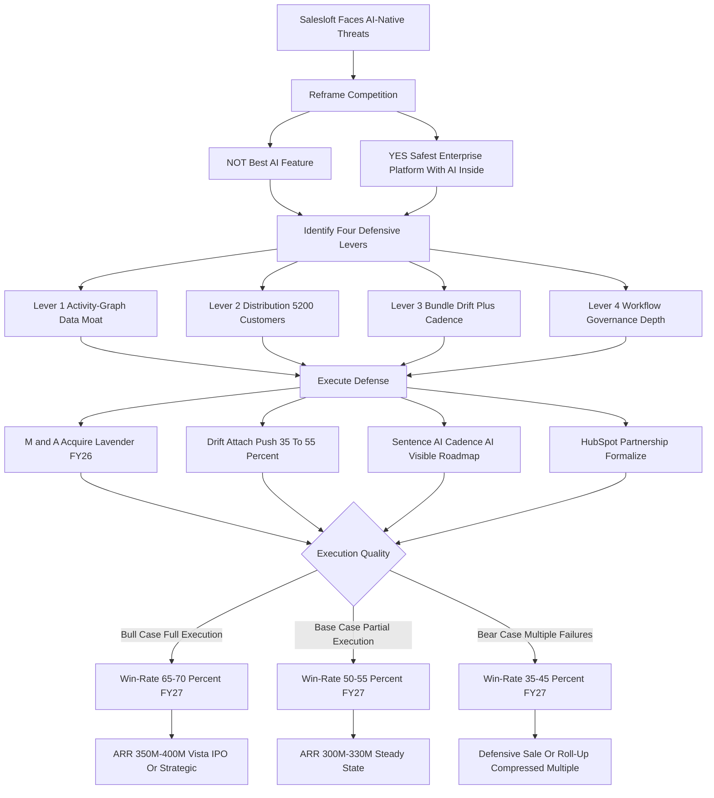

### Direct Answer

Salesloft -- the legacy sales engagement platform owned by Vista Equity Partners since the 2024 take-private -- competes against AI-native sequencing tools (Lavender, Apollo's AI tier, 11x.ai, Regie.ai, AiSDR, Bondi) not by winning the raw AI-feature contest, which it cannot, but by **reframing the buying decision** from "best AI feature" to "safest enterprise platform with AI inside" and stacking four structural moats the AI-natives cannot replicate quickly: an **activity-graph data moat**, a **distribution moat** (~5,200 customers plus Vista capital plus the HubSpot channel), a **product-bundle moat** (Drift plus Cadence), and a **workflow-and-governance moat**. The honest 2027 verdict: Salesloft survives the AI transition with its install base intact -- contingent on M&A execution, bundle discipline, and visible AI roadmap delivery -- while AI-natives grow the bottom-up segment and contest the mid-market boundary.

**TL;DR:** Salesloft loses the demo on AI features, loses the price comparison, and wins the procurement room on platform depth. Its competitive strategy is segmentation-and-bundle, not winner-take-all: concede the sub-100-rep AI-first segment, defend the upmarket with governance and the Drift bundle, and use Vista's $400M-$800M M&A war chest to buy the AI capabilities it cannot build fast enough (Lavender being the highest-priority target). Base-case 2027 win-rate against AI-natives is roughly 50-55%; the bull case (full execution) reaches 65-70%; the bear case (lost M&A race plus Apollo wedge plus agentic disruption) collapses to 35-45%. The competitive question is not "does Salesloft have the best AI" -- it is "does Salesloft survive the AI transition," and through 2027 the answer is yes, with conditions.

## 1. What Is Actually Being Asked: Reframing The Question

### 1.1 The Naive Frame Versus The Correct Frame

The surface question -- "how does Salesloft compete against AI-native sequencing tools?" -- is the wrong question in its naive form, and any operator (at Salesloft, at an AI-native competitor, at a customer, or at an investor) must reframe it before answering. **The naive frame** says: Salesloft is a legacy sales engagement platform, AI-natives like Lavender, Apollo, and 11x are faster and cheaper at the AI parts, therefore Salesloft loses. **That frame is wrong** because it treats sales engagement as a feature category rather than as the *enterprise system of record for outbound activity*, which is what Salesloft actually is for roughly 5,200 paying organizations.

**The correct frame:** Salesloft is not competing on AI feature parity, because it cannot win that fight, and trying to fight it that way is the documented path to losing the install base while burning the R&D budget chasing demos that get leapfrogged in two quarters. Salesloft is competing on **whether the buying committee at a 200-rep mid-market revenue org or a 2,000-rep enterprise sales team picks the safest, most integrated, most governable platform with AI inside, or picks the fastest, cheapest, AI-first point tool.**

### 1.2 Two Buyers, Two Scoreboards

Those are different buyers, different deals, different procurement processes, and different success criteria. The AI-natives have done extraordinary work convincing the market that the question is "best AI" -- and for the bottom-up motion in startups under 100 reps, that frame is correct and Salesloft is structurally disadvantaged. For the upmarket motion -- where the dollars and the install base actually sit -- the frame is "platform versus point solution," and Salesloft has advantages the AI-natives have not yet built. **The entire competitive strategy hangs on keeping enterprise revenue leaders evaluating the question as "platform with AI" rather than as "best AI feature,"** while simultaneously closing the AI feature gap fast enough -- through some mix of build, buy, and partner -- that the platform frame stays credible. Get this reframing right and the rest of the analysis follows; get it wrong and you are scoring Salesloft on a scoreboard the AI-natives wrote. This sits alongside the parallel question of Salesloft's own AI roadmap (q1849) and the prior framing of the same competitive question (q1795).

| Frame | Who Uses It | Verdict For Salesloft |
|---|---|---|
| "Best AI feature" | AI-native marketing, sub-100-rep buyers | Salesloft loses -- structurally disadvantaged |
| "Platform vs point tool" | Enterprise procurement, RevOps | Salesloft wins -- moats not yet replicated |
| "Safest vendor for 3 years" | CFO, IT, Legal gates | Salesloft wins decisively |
| "Cheapest per seat" | Self-serve startup founders | Salesloft loses -- concede this segment |

## 2. The Four Defensive Levers In Detail

### 2.1 Lever Overview

Salesloft has four structural assets that AI-native sequencing competitors cannot match in 2027, and each is a distinct competitive lever requiring distinct execution. The levers **compound**: distribution funds R&D, R&D feeds the data moat, the bundle deepens distribution, governance protects the install base. The strategic question is not whether the levers exist but whether Salesloft executes hard enough on AI catch-up that the levers stay relevant -- because a platform that loses on AI for two years can still lose the install base to a credible AI-native that crosses the upmarket threshold.

| Lever | Mechanism | Quantified Advantage | Durability |
|---|---|---|---|
| 1 -- Activity-graph data moat | 12-18mo per-customer engagement corpus | AI-natives need 6-12mo to close; foundation models compress to quarters | 18-36 months |
| 2 -- Distribution moat | 5,200 customers + HubSpot channel + Vista capital | AI-natives need 18-36mo plus enterprise build | High, actively defended |
| 3 -- Bundle moat | Drift + Cadence integrated, $135-$185 ARPU | 7-10 point retention lift; no AI-native ships the combo | High, controllable |
| 4 -- Governance moat | Multi-CRM, SOC 2, ISO 27001, audit, residency | Multi-year, multi-hundred-million build to match | Highest, widening |

### 2.2 Lever One -- The Activity-Graph Data Moat

**What it actually is:** every Salesloft customer accumulates structured longitudinal data on every sequence sent, every step (email, call, LinkedIn touch, manual task), every buyer engagement (open, click, reply, sentiment), every conversion (meeting booked, opportunity created, closed-won or closed-lost), and the linkage between all of it. After 12-18 months, that customer has a per-rep, per-segment, per-cadence corpus of what works in their specific market with their specific buyers.

**Why it is a moat:** Salesloft's AI features (Sentence AI for content suggestions, Cadence AI for next-best-action) train on this customer-specific corpus -- structurally different from an AI-native tool starting with generic LLM defaults and learning the customer's patterns from zero over six to twelve months. A new Lavender or Apollo AI deployment starts from generic foundation-model behavior; Salesloft starts from the customer's own accumulated history. **Why it is not permanent:** AI-natives accumulate the same data as their install bases mature; foundation-model improvements make smaller corpuses more useful; synthetic data plus transfer learning from cohorts of similar customers can close the gap from years to quarters.

**What Salesloft must do to defend the lever:** ship customer-specific AI features that visibly use the longitudinal data (not generic LLM features rebranded as Salesloft AI), make the data advantage legible to buyers (the demo and the renewal conversation should show "your AI is trained on your data"), and widen the moat by capturing richer engagement signals -- conversation transcripts via Drift, multi-touch attribution, downstream opportunity outcomes from CRM sync. **What kills the lever:** if foundation models become good enough that customer-specific tuning matters less than raw model quality, or if a major AI provider releases sales-engagement models that AI-natives can fine-tune cheaply, the data advantage compresses below the threshold of buyer relevance. **The honest read:** the data moat buys Salesloft 18-36 months of differentiation, not a decade, and the job is to use those months to build the moats -- bundle, governance, acquired AI -- that outlast the data advantage.

### 2.3 Lever Two -- The Distribution Moat And The Vista Capital Question

**What it actually is:** approximately 5,200 paying customers, weighted to mid-market and enterprise (roughly 70% enterprise and 30% mid-market by revenue), with an average tenure of about 3.2 years, integrated into the Salesforce and HubSpot CRMs those customers already run their pipelines on. This is not a list of email addresses -- it is 5,200 organizations where Salesloft is the system of record, where switching out involves a 90-180 day migration. At roughly a $48K average ACV, that install base represents approximately $250M in ARR with high gross retention.

**Why the distribution moat matters:** this install base is the platform position from which Salesloft sells additional products (Drift, AI features, future categories) at far lower customer-acquisition cost than an AI-native paying for cold acquisition. An AI-native competitor would need 18-36 months of bottom-up land-and-expand plus enterprise selling to approach 5,200 customers, and the install base is sticky because switching costs -- 90-180 days to migrate sequences, retrain reps, rewire integrations -- are real and the political cost of an internal change-management exercise is real on top of them.

**The Vista capital question** is structural. Vista Equity Partners runs the playbook of disciplined operating margins, M&A-funded category expansion, and platform consolidation, with a documented $400M-$800M-range war chest available for category consolidation through 2027 -- which means Salesloft can buy what AI-natives are building. The Vista risk is the inverse: Vista is a financial owner with an exit window, and if the AI-native picture deteriorates faster than expected, Vista could push Salesloft into a defensive sale rather than a long-horizon platform build (see q1839 for the full bull-case treatment and q1838 for the bear case). The distribution moat is the strongest single defense Salesloft has, but it is a moat that must be actively defended through partnership formalization, M&A execution, and visible AI roadmap delivery -- not assumed as a permanent gift.

### 2.4 Lever Three -- The Drift Plus Cadence Bundle Moat

**What it actually is:** Salesloft owns Drift (the conversation marketing and AI chatbot product) and sells it together with Cadence (the core sequencing engine). Drift standalone runs roughly $55-$95 ARPU; Cadence standalone runs roughly $85-$135 ARPU; the bundle prices at approximately $135-$185 combined ARPU at a 15-25% bundle discount.

**Why it is a competitive moat:** no AI-native sequencing tool ships an integrated conversation-plus-sequencing combo. Lavender is email-only. Apollo bundles data and sequencing but not conversation. 11x is agentic-outbound focused. Regie is content. **The retention math is the proof:** customers using both products retain at 92-95% gross versus 85-88% for Cadence-only customers -- a 7-10 point spread that compounds enormously across the install base. **The execution challenge:** a current Drift attach rate around 35-40% needs to reach 50%+ by FY27 for the bundle moat to hit full strategic potential. This is Salesloft's best-executed defense and the most controllable lever in its competitive playbook (q1809).

### 2.5 Lever Four -- Workflow Depth And Enterprise Governance

**What it actually is:** over more than a decade Salesloft has built the deep enterprise plumbing every serious customer requires but no demo ever features -- multi-tenant admin and role-based access controls, sequence governance and approval workflows, audit trails, regional data residency for GDPR, SOC 2 Type II and ISO 27001 certifications, bidirectional Salesforce and HubSpot sync with custom field mapping, integration with marketing automation and conversation intelligence, multi-team and multi-region structure, sandbox environments, SSO and identity-provider integration, and the security review documentation enterprise procurement actually requires.

**Why it matters:** in a $200K+ ACV enterprise sequencing decision, the buying committee includes Sales (cares about AI), RevOps (cares about workflow and governance), IT (cares about security), Legal (cares about data residency), and Finance (cares about vendor maturity). Salesloft passes all five gates; an AI-native point tool typically passes one and stalls in the others. An AI-native startup running on a small team and a recent Series A simply has not built any of this with enterprise-grade depth -- it has a great AI feature and a thin layer of admin, and it passes the demo but loses procurement.

**The moat in action:** Salesloft loses head-to-head AI-feature shoot-outs to Lavender and feature-heavy competitors regularly, and still wins the deal because the procurement and security review eliminates the AI-native from consideration. **What makes the moat durable:** building enterprise governance is years of unsexy investment -- compliance certifications, security infrastructure, integration engineering, customer-success operations, contractual sophistication -- that AI-native startups optimizing for product velocity deliberately deprioritize, so the gap is widening, not narrowing, in the categories that matter to enterprise buyers. **The risk:** if a well-capitalized AI-native (Apollo at scale, an OpenAI- or Microsoft-backed entrant) decides to build the enterprise governance stack and combine it with AI-native features, the moat compresses -- but that is a multi-year, multi-hundred-million-dollar build, and Salesloft has the runway to acquire and consolidate before it happens.

## 3. The AI-Native Threat Map

### 3.1 Who Each Competitor Actually Is

A founder, sales leader, or operator evaluating the category needs an accurate read of each AI-native competitor, because they are not interchangeable and the threats differ in shape and severity.

**Lavender** is the highest-velocity threat -- an AI email-coaching and writing assistant with roughly 5,000+ customer accounts, estimated $25M-$50M ARR, a strong product-led growth motion, and a feature focus on real-time email scoring, personalization assist, and reply-rate lift. It is the clearest M&A target in the category. **Apollo** is the most strategic threat -- not because its AI is better but because Apollo bundles lead data, intent signals, and sequencing into a single $59-$119/user/month offering aimed at the bottom-up self-serve mid-market, with estimated $150M-$250M ARR and a strong free-tier funnel. **11x.ai** is the agentic threat -- autonomous SDR agents (Alice for inbound, Mike for outbound) that promise to replace human SDR work entirely; at $5M-$15M ARR but with extraordinary attention and a category-redefining vision.

### 3.2 The Secondary And Long-Tail Threats

**Regie.ai** focuses on AI-generated content for sales sequences -- $15M-$30M ARR, complement-not-replacement, integrates with Salesloft and Outreach as much as it competes. **AiSDR** plays a similar agent-first autonomous outbound game in a narrower segment, $10M-$25M ARR. **Bondi** combines GTM data and AI sequencing in an early-stage $5M-$15M ARR play. **The long tail** -- Clay, Smartlead, Instantly, lemlist, Jason AI -- plays in adjacent corners.

### 3.3 The Accurate Threat Ranking

| Competitor | Est. ARR | Threat Level | Salesloft Response |
|---|---|---|---|
| Lavender | $25M-$50M | Highest (acute) | M&A target FY26, $250M-$350M price |
| Apollo (AI tier) | $150M-$250M | High (strategic) | HubSpot channel block + Drift bundle |
| 11x.ai | $5M-$15M | Medium (structural) | Build or acquire agentic SDR features |
| Regie.ai | $15M-$30M | Medium-low | Cadence AI content-gen feature |
| AiSDR | $10M-$25M | Low | Sub-100-rep segment defense |
| Bondi | $5M-$15M | Low | Activity-graph data moat |
| Long tail | varies | Noise | Ignore; focus on platform |

The competitive reality: Salesloft does not need to beat every AI-native on every feature -- it needs to neutralize Lavender (by acquisition), blunt Apollo's bottom-up motion at the upmarket boundary, build credible agentic features fast enough that 11x does not own the conversation, and ignore the rest while the bundle and install base do their work. This threat map parallels the one Outreach faces against the identical competitive set (q1735).

### 3.4 The Threat Shape By Vector

Each AI-native threatens Salesloft along a different vector, and the defenses are not interchangeable. Lavender is a *feature* threat -- addressable by acquisition. Apollo is a *segment* threat -- addressable by bundle economics and channel exclusivity. 11x is a *category* threat -- addressable only by Salesloft building or buying its way into the agentic conversation. The error an analyst makes is treating these as a single "AI-native" bucket and prescribing a single response; the error a Salesloft executive makes is over-investing in the loudest threat (agentic demos) while the quiet, well-executed one (Apollo's mid-market wedge) does the real damage.

| Competitor | Threat Vector | Right Defense | Wrong Defense |
|---|---|---|---|
| Lavender | Feature gap (email AI) | Acquire it | Build a copycat feature |
| Apollo | Segment erosion (mid-market) | Bundle + HubSpot channel block | Match pricing dollar-for-dollar |
| 11x.ai | Category redefinition (agentic) | Build/buy agentic, define hybrid | Ignore as hype |
| Regie / AiSDR / Bondi | Niche features | Build-or-partner selectively | Acquire prematurely |

## 4. The Buyer Reality: Two Pools, One Contested Middle

### 4.1 The Two Buyer Profiles

Operator clarity requires understanding that Salesloft and the AI-natives are not really competing for the same buyer in most deals -- they compete for adjacent buyers with overlapping but distinct needs.

**The Salesloft buyer profile:** mid-market and enterprise revenue organizations with 100+ reps (frequently 500-5,000+), Salesforce or HubSpot as the CRM system of record, a structured RevOps function, a multi-team or multi-region selling organization, formal sales engagement governance, an integrated GTM stack, and a procurement process including Sales, RevOps, IT, Legal, and Finance. **The AI-native buyer profile:** seed-to-Series-B startups with 5-100 reps, founder-led or VP-Sales-led GTM, often HubSpot or a lighter CRM, less formal RevOps, faster procurement (often a single decision-maker), willingness to trade governance for speed, and a primary success criterion of outbound throughput and reply-rate lift.

### 4.2 The Contested Middle Ground

The boundary between them is contested ground. A 100-150 rep mid-market organization could go either way, depending on the buying committee, the GTM maturity, and the priority weighting of AI features versus governance. The Apollo bottom-up wedge is exactly the move to grow the AI-native buyer pool upward into the contested ground; the Salesloft Drift bundle and HubSpot channel are the defensive moves to keep the contested ground in the platform-buyer category.

| Segment | Reps | Primary Buyer | Likely Winner |
|---|---|---|---|
| Enterprise | 500+ | RevOps + IT + Legal + Finance | Salesloft (70-80%) |
| Upper mid-market | 250-500 | RevOps + VP Sales | Salesloft (contested) |
| Lower mid-market | 100-250 | VP Sales + RevOps | Contested (45-55%) |
| Growth-stage | 25-100 | VP Sales / founder | AI-native (65-75%) |
| Startup | 5-25 | Founder | AI-native (75-85%) |

### 4.3 The 2027 Read On The Boundary

The contested ground is moving slowly toward AI-natives in pure outbound-throughput buyers and slowly toward Salesloft in governance-conscious revenue orgs. The net is roughly stable through 2026-2027, with Salesloft retaining the upmarket and AI-natives growing the bottom-up. Anyone modeling competitive outcomes needs to model two distinct buyer pools with overlapping contested ground -- not a single market where one platform wins.

## 5. Pricing And Packaging

### 5.1 The Pricing Comparison

Pricing is where the competitive battle becomes most concrete. **Salesloft's structure:** Cadence standalone runs roughly $85-$135/user/month; Drift standalone $55-$95; the Drift-plus-Cadence bundle $135-$185 combined ARPU at a 15-25% discount; fully-loaded enterprise tiers often above $200. **Apollo's pricing** runs roughly $59-$119/user/month for the AI-tier data-plus-sequencing bundle with a meaningful free tier. **Lavender** runs $29-$99 for email coaching -- a feature add-on, not a full platform. **11x.ai** runs roughly $200-$500 per *agent* per month, a fundamentally different pricing model.

| Platform / Product | Pricing Range (per user/mo) | Notes |
|---|---|---|
| Salesloft Cadence (standalone) | $85-$135 | Sequencing engine |
| Drift (standalone) | $55-$95 | Conversation marketing |
| Salesloft Drift + Cadence bundle | $135-$185 | 15-25% bundle discount |
| Salesloft enterprise tier (loaded) | $200+ | Premium AI, governance, services |
| Apollo (AI tier) | $59-$119 | Lead data + sequencing |
| Lavender | $29-$99 | Email coaching add-on |
| 11x.ai (per agent) | $200-$500 | Per autonomous agent, not per seat |
| Regie.ai | $89-$199 | AI content generation |
| Outreach (closest legacy peer) | $90-$165 | Comparable platform |

### 5.2 The Pricing Dynamics And Strategy

Apollo's $59-$119 versus Salesloft's $135-$185 is the headline every AI-native demo emphasizes -- and it is real -- but it omits bundle value, integration depth, governance, and install-base economics. A mid-market customer comparing Apollo at $90 to Salesloft Cadence-only at $110 sees a clear price gap; the same customer comparing Apollo at $90 to Salesloft's full bundle at $160 sees a different value comparison once the conversation product and unified admin are weighed in.

**Salesloft's 2027 pricing strategy:** hold premium pricing on the platform tier to protect margin and signal enterprise positioning; drive bundle attach to lift effective ARPU and retention; offer a more aggressive AI-features-included tier at the mid-market boundary to blunt Apollo's wedge; and use Vista's M&A capacity to acquire AI capabilities rather than build them and amortize the cost over the install base. The risk: if AI-natives at scale deliver enterprise-credible feature parity at sub-$100 pricing, Salesloft is forced into a margin-compressing response, and the platform-pricing premium that funds Vista's returns and the R&D budget compresses.

### 5.3 The Drift Bundle Attach Trajectory

The most controllable pricing lever Salesloft holds is Drift attach -- every Drift add-on lifts effective ARPU, lifts retention, and locks the customer deeper into the platform. The strategic target trajectory below shows why a stalled attach rate is the most damaging controllable failure in the competitive playbook: the bundle moat does not deepen, the retention lift does not compound, and the effective-ARPU advantage over Apollo's sub-$120 pricing never materializes.

| Period | Drift Attach Rate | Effective ARPU | Retention Impact |
|---|---|---|---|
| Today (baseline) | 35-40% | ~$130-$160 blended | ~88% gross |
| FY26 target | 45-50% | ~$140-$170 blended | ~89-90% gross |
| FY27 target | 55%+ | ~$150-$180 blended | ~91-92% gross |
| Bull case 2027 | 60%+ | ~$160-$185 blended | ~92%+ gross |

The 2027 read on pricing: pressure is real but contained through FY27, with the bundle, governance, and integration depth justifying the premium for the platform buyer; beyond 2027 the pricing model may need to evolve toward usage-based or AI-feature-tiered structures rather than per-seat platform pricing.

## 6. The M&A Game: Vista's War Chest

### 6.1 What Vista Brings And The Lavender Question

Salesloft's competitive position through 2027 may be more determined by M&A than by product, because the M&A path lets Salesloft buy AI capabilities faster than it can build them. The realistic Vista war chest for Salesloft category M&A is $400M-$800M over the 2025-2027 window.

**The Lavender acquisition question** is the most strategically important move available -- Lavender is the highest-velocity AI feature gap, has 5,000+ customers, and is at a stage where an acquisition in the $200M-$400M range is plausible. The strategic logic: acquiring Lavender immediately closes the AI email-writing gap, removes the most visible AI-native competitor, brings 5,000+ customers into the Salesloft funnel, and signals that Salesloft is the active consolidator rather than the legacy incumbent being disrupted (q1836).

### 6.2 The Full M&A Target List

| Target | Est. Acquisition Range | Strategic Rationale |
|---|---|---|
| Lavender | $250M-$400M | Closes acute AI email gap; +5,000 customers |
| Small agentic SDR startup | $50M-$150M | Credible agentic play before 11x defines category |
| AI sales conversation startup | $75M-$200M | Deepens Drift AI capabilities |
| Vertical sequencing tool | $50M-$150M | Extends into healthcare or financial services |
| Pipeline orchestration adjacency | $100M-$300M | Platform footprint expansion |

### 6.3 The M&A Discipline

The **bear-case M&A scenario:** Outreach (Salesloft's closest legacy competitor) acquires Lavender first, leaving Salesloft with a permanent AI gap. **The bull-case scenario:** Salesloft acquires Lavender in FY26, integrates within two quarters, follows with one or two surgical adds in agentic and conversation AI, and emerges by 2027 as the consolidator that absorbed the most threatening AI-natives. **The discipline:** Vista will not let Salesloft overpay, and Salesloft cannot afford to be priced out -- the right move is decisive Lavender acquisition early, surgical adds, and ruthless avoidance of bidding wars (q1835).

## 7. The HubSpot Partnership And Channel-Exclusivity Lever

### 7.1 What The Relationship Currently Is

Salesloft is a strategic partner to HubSpot (NYSE: HUBS) for sales engagement, with deep bidirectional integration into HubSpot CRM, joint go-to-market motions, and the de-facto recommended sequencing platform for HubSpot CRM upmarket customers. HubSpot's own native sequencing capabilities are real but lighter-weight, focused on SMB and lower mid-market, and HubSpot has historically partnered for the deeper enterprise layer.

### 7.2 Why It Matters And The Strategic Upside

HubSpot's CRM upmarket motion is one of the largest single distribution channels in the entire revenue-software category. Customers crossing the upmarket threshold need a sales engagement layer, and Salesloft is the path of least resistance. **Apollo, which is building a competing CRM-plus-sequencing bundle, is structurally locked out of the HubSpot upmarket flow as long as the partnership holds.** The strategic upside: a more formal or exclusive partnership -- "preferred sales engagement partner for HubSpot enterprise customers" -- substantially raises the cost for any AI-native to win HubSpot upmarket deals.

| Element | Current State | Strategic Direction |
|---|---|---|
| Integration | Deep bidirectional | Maintain and deepen |
| Co-marketing | Active | Expand |
| Co-selling | Active | Formalize |
| Recommended platform | De-facto | Push to formal preferred partner |
| Exclusivity | Informal | Push to formal exclusive for upmarket |
| Threat from Breeze AI | Watch-item | Hedge through bundle differentiation |

### 7.3 The Strategic Risk

HubSpot's Breeze AI and broader native AI investment could include native sequencing AI features that compete directly with Salesloft, weakening the partnership rationale. The watch-item for an operator is HubSpot's Breeze AI roadmap; any signal that HubSpot is building rather than partnering is a major shift in the competitive terrain. The 2027 read: the partnership is likely to deepen rather than erode through FY27 -- but it must be actively managed.

## 8. The Agentic SDR Question: Does 11x Redefine The Category?

### 8.1 The Agentic Thesis

The single most existential question for Salesloft and every sequencing platform is whether autonomous agentic SDRs -- 11x.ai's Alice and Mike, AiSDR, Jason AI, and the next generation of foundation-model-powered agents -- collapse the human-AE-driven sequencing category into something fundamentally smaller and more commodified. **The thesis:** rather than a human SDR running sequences in Salesloft or Apollo, an autonomous agent prospects, personalizes, sends, follows up, qualifies, and books meetings without human touch -- replacing not the sequencing tool but the human who used it. If the thesis fully delivers, the addressable market for human-AE sequencing platforms shrinks.

### 8.2 The Current Evidence And Honest Assessment

11x.ai has demonstrated impressive agentic demos and accumulated meaningful (though small) ARR. Real customer adoption at scale has been slower than the public narrative suggests, with mixed results on quality, deliverability, and actual pipeline conversion versus human-AE sequences. Foundation-model improvements (GPT-5, Claude Opus 4.7, Gemini 3) make the underlying agent capabilities better quarterly. **The honest assessment:** agentic SDR is real, growing, and will materially reshape the category by 2028-2030 -- but it is not yet at a state where it eliminates human-AE sequencing in 2026-2027. The most likely intermediate state is a hybrid: agentic agents for high-volume top-of-funnel prospecting, human AEs for qualification and complex deals.

### 8.3 What Salesloft Must Do

Salesloft must ship credible agentic features within the platform (built or acquired) so customers exploring agentic do not have to leave Salesloft to do it; participate in defining the hybrid agentic-plus-human model rather than letting AI-natives define it; and watch foundation-model and 11x adoption velocity as the leading indicator of when the category-redefinition becomes real. **The strategic risk:** if Salesloft ignores agentic and 11x or a peer builds an enterprise-credible agentic platform with governance and integration depth, by 2028-2029 Salesloft is competing in a shrinking human-AE sequencing market while the new category grows around it. **The strategic opportunity:** Salesloft acquires or partners aggressively in agentic, integrates it into the Cadence platform, and positions the bundle as "the enterprise platform for both human and agent outbound," extending the moat into the next category transition (q1828). The agentic question is the most important medium-term competitive variable, and operator clarity requires modeling it explicitly rather than dismissing it as hype.

### 8.4 The Agentic Adoption Curve

| Horizon | Agentic State | Implication For Salesloft |
|---|---|---|
| 2026 | Demos strong, real adoption thin | Watch-and-build; no urgent threat |
| 2027 | Hybrid emerging at top-of-funnel | Ship agentic features inside Cadence |
| 2028-2029 | Agentic credible for high-volume prospecting | Bundle must cover human + agent outbound |
| 2030+ | Category-level restructuring plausible | Platform position defends or it does not |

## 9. Win/Loss Patterns: Where Salesloft Wins And Loses

### 9.1 Where Salesloft Consistently Wins

Operator-level analysis requires real understanding of where Salesloft wins specific deals versus AI-natives. **Salesloft wins** enterprise deals at 500+ reps where governance and integration depth matter; deals where Salesforce (NYSE: CRM) is the CRM and Salesloft's deep integration creates structural advantage; deals where the buying committee includes IT, Legal, and Finance and the AI-native point tool fails procurement; renewal deals where switching cost dominates; deals needing both inbound conversation and outbound sequencing where the Drift-plus-Cadence bundle eliminates the point tool; and deals in regulated industries where audit trails and data residency eliminate AI-natives.

### 9.2 Where Salesloft Consistently Loses

**Salesloft loses** sub-100-rep startups where speed and cost dominate; HubSpot-CRM deals at the lower mid-market boundary where Apollo's all-in-one bundle is cheaper and good-enough; pure outbound-velocity buyers where Lavender's email AI demonstrably outperforms; AI-first cultures willing to trade governance; and greenfield deals with no existing Salesforce or HubSpot integration.

| Deal Type | Salesloft Win Probability | Driver |
|---|---|---|
| Enterprise 500+ reps with Salesforce | 70-80% | Governance, integration, bundle |
| HubSpot upmarket via partnership | 65-75% | Partnership defense |
| Mid-market 100-500 reps contested | 45-55% | Bundle vs price trade-off |
| Sub-100-rep startup AI-first | 15-25% | Concede; structural disadvantage |
| Greenfield no Salesforce/HubSpot | 30-40% | Lighter-integration edge to AI-natives |
| Renewal in install base | 90-92% | Switching cost dominant |
| Regulated industry (healthcare, finance) | 75-85% | Compliance posture decisive |

### 9.3 The Competitive Guidance For Salesloft Sales

The pattern: Salesloft loses on AI feature parity in the demo, loses on price in the comparison, and wins on enterprise depth in the procurement and the boardroom. **The guidance:** lead every enterprise conversation with platform, integration, governance, and bundle value; lead AI comparisons with the customer's own data ("your AI is trained on your data") rather than feature parity; use the Drift bundle as the differentiator; and concede the sub-100-rep AI-first segment rather than chasing deals Salesloft cannot win profitably. Sales teams that try to win every deal lose money; sales teams that win the right deals decisively grow profitably.

### 9.4 The Deal-Stage Pattern

The win/loss pattern is not uniform across the deal cycle -- it inverts as the deal moves from demo to procurement. Early in the cycle, when the evaluation is feature-driven and the AI-native demo is fresh, Salesloft is behind. As the cycle moves into technical due diligence, security review, and contracting, the platform-depth and governance advantages compound and the AI-native's thin enterprise layer becomes the deciding liability. **The strategic implication for Salesloft sales:** do not try to win the demo -- try to *survive* the demo and win the procurement. A rep who over-indexes on AI feature comparison early loses the frame; a rep who anchors early on "let's talk about how this works across your five regions and your security review" moves the deal onto Salesloft's scoreboard before the AI-native ever gets to its strongest ground.

| Deal Stage | Who Is Ahead | Why |
|---|---|---|
| Discovery / framing | Even | Frame is contested |
| Product demo | AI-native | Feature parity, fresh AI demo |
| Technical due diligence | Salesloft | Integration depth, multi-CRM |
| Security / compliance review | Salesloft (decisive) | SOC 2, ISO 27001, residency, audit |
| Pricing negotiation | AI-native | Lower per-seat headline |
| Contracting / legal | Salesloft | Vendor maturity, data terms |
| Final committee decision | Salesloft (upmarket) | Five-gate consensus favors platform |

## 10. The CRM-Adjacent Threat

### 10.1 Why The CRM Vendors Are A Bigger Threat Than The AI-Natives

A separate and potentially larger threat than the AI-native sequencing tools is the possibility that the major CRM vendors -- HubSpot with Breeze AI, Salesforce with Einstein and Agentforce, Microsoft (NASDAQ: MSFT) with Dynamics 365 Copilot -- bundle native AI sequencing into their CRM platforms and erode the standalone sequencing category entirely. CRM vendors own the system of record, the customer relationship, and the deepest data. If they ship credible native sequencing with AI built in, customers face a "good-enough integrated" versus "best-of-breed standalone" choice that has historically favored the integrated option in late-stage category consolidation.

### 10.2 The Three CRM-Adjacent Threats

**HubSpot Breeze AI** is the closest active threat -- HubSpot's mid-market and lower-enterprise base is precisely the segment Salesloft most needs to defend. **Salesforce Einstein and Agentforce** is the larger but slower-moving threat -- Salesforce has historically partnered for sales engagement, but Einstein and Agentforce represent a strategic shift toward owning more of the AI-driven workflow natively. **Microsoft Dynamics Copilot** is the dark-horse threat -- Microsoft has the foundation-model relationships (OpenAI), the enterprise distribution, and the deep pockets to ship a Copilot-driven sequencing experience.

| CRM-Adjacent Threat | Severity | Timeline | Salesloft Hedge |
|---|---|---|---|
| HubSpot Breeze AI | High | Active 2026-2027 | Partnership management + bundle depth |
| Salesforce Agentforce | Medium-high | 2027-2029 | Multi-CRM positioning |
| Microsoft Dynamics Copilot | Medium | 2027-2030 | Enterprise-depth differentiation |

### 10.3 What This Means For Salesloft Strategy

Salesloft's defense is the platform depth and bundle value that goes beyond what an integrated CRM AI feature can deliver -- enterprise governance, **multi-CRM support** (Salesloft works with both Salesforce and HubSpot; an integrated CRM AI does not), conversation-plus-sequencing combo, and specialized RevOps depth. The HubSpot-Salesloft partnership is the critical hedge against HubSpot building rather than partnering. The worst-case scenario is HubSpot or Salesforce deciding to fully internalize the sequencing layer -- a 3-5 year shift Salesloft must prepare for (q1855).

## 11. Customer Mental Model: How Salesloft Is Bought And Renewed

### 11.1 The Buying Cycles

Strategy that does not match how customers actually buy is just analyst frame. **The new-logo enterprise buying cycle:** typically 6-12 months, a buying committee of 5-9 stakeholders, a formal RFP, deep technical due diligence, security review against SOC 2 and ISO 27001, and a multi-year contract. The decision rarely comes down to a single feature; it comes down to which platform passes all the gates. **The mid-market buying cycle:** typically 3-6 months, a smaller committee (3-5 stakeholders), faster procurement, more weight on AI features -- the segment most contested with Apollo.

### 11.2 The Renewal And Expansion Motions

**The renewal cycle:** for existing Salesloft customers, the renewal conversation is initiated 90-120 days before the renewal date, with the customer's RevOps team running an internal "stay or switch" evaluation. The major drivers of renewal versus churn: did the customer use the platform deeply, did the AI features deliver perceived value, is the integration still strong, did the CSM relationship maintain trust, and is the price escalation reasonable. **The expansion motion** -- existing Cadence customers buying Drift, premium AI features, or additional seats -- is the most economically important customer motion, and bundle attach is the most important expansion lever.

| Motion | Cycle Length | Committee Size | Primary Competitive Risk |
|---|---|---|---|
| New-logo enterprise | 6-12 months | 5-9 stakeholders | Loses on AI demo, wins procurement |
| New-logo mid-market | 3-6 months | 3-5 stakeholders | Apollo bundle + price |
| Renewal (enterprise) | 90-120 day window | RevOps-led | Low -- switching cost dominant |
| Expansion (Drift attach) | Continuous | CSM-led | Native CRM AI cannibalization |

### 11.3 What This Means For Competitive Strategy

Salesloft's competitive position is most fragile in the new-logo mid-market segment (where Apollo and AI-natives have the easiest shot) and most defensible at renewal in the enterprise segment (where switching cost and bundle depth dominate). The strategic implication: invest in CSM-led retention and expansion in the install base while fighting hard for the contested mid-market new-logo deals.

## 12. Bull, Base, And Bear Cases Through 2027

### 12.1 The Three Scenarios

Strategic analysis becomes useful when it commits to scenarios with explicit assumptions and predicted outcomes.

**The bull case -- full playbook execution.** Salesloft acquires Lavender in FY26 at a $250M-$350M price, integrates within two quarters, and absorbs Lavender's 5,000+ customers. Drift attach climbs from 35-40% to 55%+ by FY27. The Sentence AI and Cadence AI roadmap ships visibly with two or three flagship features per quarter. The HubSpot partnership formalizes into "preferred enterprise partner." Net result: win-rate against AI-natives reaches 65-70%, ARR grows from ~$250M to $350M-$400M, gross retention stays at or above 92%, and Vista positions for an IPO or strategic exit at a 6-8x revenue multiple.

**The base case -- partial execution.** Salesloft acquires a smaller AI tooling startup (not Lavender), Drift attach climbs to 45-50%, the AI roadmap ships at moderate cadence, the HubSpot partnership deepens informally, and win-rate lands at 50-55%. ARR grows modestly to $300M-$330M, gross retention holds around 88-90%.

**The bear case -- multiple failures.** Outreach or another competitor wins the Lavender acquisition. Apollo's bottom-up wedge succeeds in the contested mid-market. 11x establishes agentic SDR as a category Salesloft cannot credibly enter. HubSpot ships native Breeze AI sequencing. The AI roadmap underwhelms. Drift attach stalls. Net result: win-rate drops to 35-45%, ARR stagnates or declines, gross retention drifts toward 85%, and Vista is forced into a defensive sale.

### 12.2 The Probability Weighting

| Scenario | Probability | Win-Rate vs AI-Natives | ARR Outcome | Gross Retention | Vista Outcome |
|---|---|---|---|---|---|
| Bull | 25-30% | 65-70% | $350M-$400M | 92%+ | IPO or strategic exit at 6-8x |
| Base | 45-50% | 50-55% | $300M-$330M | 88-90% | Continued hold, longer runway |
| Bear | 20-25% | 35-45% | $230M-$260M (decline) | ~85% | Defensive sale or merger |

The base case is the most likely path, the bull case is achievable with disciplined execution, and the bear case is a real risk that depends primarily on M&A losses and AI-native execution velocity rather than on Salesloft strategy errors alone.

## 13. The Strategic Decision Flow

The diagram captures the throughline: the reframing decision feeds the four-lever identification, the levers feed the execution program (M&A, bundle, roadmap, partnership), and execution quality determines which of the three 2027 outcomes Salesloft lands in.

## 14. What An Operator Should Actually Do

### 14.1 Audience-Specific Playbooks

The competitive analysis is decision input for several distinct operator audiences.

**For a Salesloft executive:** the playbook is bundle attach (drive Drift to 50%+ within 18 months), M&A execution (acquire Lavender or a credible peer in FY26), AI roadmap velocity (ship visibly every quarter), HubSpot partnership formalization, and disciplined sales enablement (lead with platform, concede sub-100-rep AI-first deals). **For an AI-native competitor:** the playbook is wedge into the contested mid-market boundary with AI-feature differentiation and aggressive pricing, build the governance and integration depth that lets you cross into enterprise procurement, partner aggressively with CRM vendors, and avoid head-to-head enterprise competition with Salesloft until the governance gap is closed.

### 14.2 The Buyer And Investor Lens

**For a customer evaluating sequencing in 2027:** first determine whether you are an upmarket platform buyer (governance, integration, multi-team, regulated industry) or a bottom-up AI-first buyer (speed, throughput, lower cost) -- then pick the platform that matches that profile rather than optimizing for a single dimension like "best AI." **For an investor:** Salesloft is a defensible platform with real moats but exposed to AI-native disruption and CRM-adjacent threats; the bull case is M&A-led consolidation, the base case is steady-state competition, the bear case is a defensive sale. **For a RevOps practitioner choosing tools:** evaluate based on your actual GTM motion, CRM, governance requirements, integration footprint, and three-year vendor strategy -- not based on which tool has the most aggressive AI demo.

### 14.3 The Throughline

Competitive strategy in this category is fundamentally about matching platform-versus-point-tool capabilities to platform-versus-point-tool buyers, executing against the moats that matter to your audience, and avoiding the trap of competing on the dimensions you are structurally disadvantaged on. Salesloft can win the platform game; it cannot win the pure AI-feature game; the strategy must be ruthlessly consistent with that reality (q1851).

## 15. Counter-Case: When This Strategy Fails

The analysis above describes a defensible competitive position, but a serious operator must stress-test it against the conditions under which Salesloft loses despite executing the playbook. There are real reasons the bear case happens.

### 15.1 The Wasting-Asset Counters

**Counter 1 -- The activity-graph data moat is not as durable as the marketing suggests.** The 12-18 month per-customer corpus is genuinely valuable today, but foundation-model improvements make smaller corpuses far more useful, and synthetic data plus transfer learning let AI-natives close the gap from years to quarters. The data moat is a wasting asset, not a permanent fortress.

**Counter 2 -- The procurement gate erodes faster than expected.** Enterprise governance, security review, and integration depth currently eliminate AI-natives from many upmarket deals. But AI-natives are building these capabilities -- Apollo is investing in enterprise, Lavender is hardening compliance, new AI-natives are SOC 2 from day one. If the gate compresses faster than expected, Salesloft loses its most reliable upmarket defense.

### 15.2 The Competitive-Loss Counters

**Counter 3 -- Outreach beats Salesloft to Lavender.** Outreach has the same install-base logic, similar capital, and equal motivation to acquire the highest-velocity AI feature gap. If Outreach wins the Lavender deal, Salesloft is left with a permanent visible AI gap and a competitor that has both the install base and the AI capability (q1749).

**Counter 4 -- Apollo's bottom-up wedge succeeds in the contested mid-market.** Apollo is well-executed, the AI-tier pricing is structurally compelling, and the all-in-one bundle is a real value proposition. If Apollo crosses the contested threshold, Salesloft's growth in the segment most needed for ARR expansion stalls.

**Counter 5 -- Agentic SDRs collapse the human-AE sequencing category by 2028-2029.** If 11x or a peer delivers credible enterprise-grade autonomous outbound agents that actually replace SDR headcount, the entire category Salesloft is built for shrinks structurally. Salesloft's install base is built around human reps using the platform.

### 15.3 The Partnership And Capital Counters

**Counter 6 -- HubSpot Breeze AI ships native sequencing and weakens the partnership.** If HubSpot ships native sequencing AI good enough to compete in the upmarket motion, the partnership erodes and Salesloft loses its strongest channel.

**Counter 7 -- Salesforce Einstein and Agentforce internalize the sequencing layer.** If Salesforce decides sales engagement is too strategic to leave to a partner and ships native Agentforce-powered sequencing, Salesloft loses one of its two CRM partnership pillars.

**Counter 8 -- The Drift bundle attach stalls.** If Drift attach stays at 35-40% rather than reaching 50%+ by FY27, the bundle moat does not deepen and Salesloft loses the most controllable lever in its competitive defense.

**Counter 9 -- Vista's return-on-capital discipline constrains the M&A and AI investment Salesloft needs.** Vista is a financial owner with an exit window. If the AI transition demands more capital and faster execution than Vista is willing to fund, Salesloft is structurally under-invested versus AI-natives raising hundreds of millions in growth equity.

### 15.4 The Roadmap And Pricing Counters

**Counter 10 -- Salesloft's organic AI roadmap underwhelms.** If the roadmap ships slowly and the features are perceived as "AI catch-up" rather than category-defining, customers in renewal conversations conclude the AI investment is not delivering, and churn rises.

**Counter 11 -- A deep-pocketed competitor builds the enterprise governance stack and combines it with AI-native features.** The governance moat is durable against $20M-$100M-funded startups, but a $500M-$1B-funded competitor (or a Microsoft Dynamics Copilot extension) can build the governance stack in 2-3 years and combine it with AI-native architecture from day one.

**Counter 12 -- AI-native pricing pressure forces a margin response that compresses the platform-pricing premium.** If mid-market buyers normalize on AI-native pricing, Salesloft is forced to discount, the platform-pricing premium that funds Vista's returns and the R&D budget compresses, and the economic engine that funds the competitive defense weakens.

**The honest verdict.** Salesloft can lose the AI transition despite executing the playbook reasonably well, because the threats are real, the moats are wasting assets, and the competitive set is well-funded and aggressive. The bear-case probability of 20-25% is not negligible -- it is the second-most-likely outcome. The factors mostly outside Salesloft's control -- Outreach M&A execution, Apollo's mid-market velocity, 11x's agentic delivery, HubSpot's Breeze AI roadmap, Vista's investment discipline, foundation-model improvement velocity -- collectively determine whether the playbook actually works.

## 16. The Honest 2027 Verdict

**Salesloft is not dying.** The activity-graph data moat, the 5,200-customer install base, the Drift-plus-Cadence bundle, the Vista capital, the HubSpot partnership, and the workflow-and-governance depth are real defensive assets that compound. A competitor cannot simply ship better AI features and dislodge a platform with these advantages when the upmarket buying committee values exactly the qualities Salesloft has built.

**Salesloft is also not winning the AI feature war.** Lavender writes better individual emails. 11x ships more aggressive autonomous-agent demos. Apollo bundles more cheaply. Salesloft's organic AI roadmap is credible but trailing, and competing on feature parity is a losing strategy that misallocates the R&D budget.

**The right strategy is the one Salesloft is largely executing:** reframe the buying decision from "best AI feature" to "safest enterprise platform with AI inside," use M&A to close the most acute feature gaps quickly (Lavender being the highest-priority target), drive bundle attach to deepen the moat and lift ARPU, formalize the HubSpot partnership to lock down the upmarket channel, and ship a steady cadence of visible AI roadmap. **The most likely 2027 outcome:** Salesloft retains its upmarket install base, holds a roughly 50-55% competitive win-rate against AI-natives, grows ARR modestly to $300M-$350M, and positions for either a continued Vista hold, an IPO, or a strategic acquisition. The category is not winner-take-all; it is segmentation-and-bundle, and Salesloft's job is to win its segment decisively while AI-natives win theirs.

## 17. Numbers: The Quantified Competitive Picture

### 17.1 Salesloft Company And Install-Base Profile

The numbers below are the public-estimate baseline an operator should hold when modeling the competitive position. They are directional estimates drawn from category coverage, analyst data, and practitioner-community discussion -- not audited figures -- and the ranges reflect genuine uncertainty in a private, Vista-owned company.

| Metric | Value | Notes |
|---|---|---|
| Active customers | ~5,200 | Mid-market and enterprise weighted |
| Customer mix (revenue) | ~70% enterprise / ~30% mid-market | Estimated |
| Average customer tenure | ~3.2 years | Sticky workflow software |
| Estimated ARR | ~$250M | Pre-AI-roadmap baseline |
| Average ACV | ~$48K | Blended across tiers |
| Gross retention (Cadence-only) | 85-88% | Baseline |
| Gross retention (Drift + Cadence bundle) | 92-95% | Bundle attach lift of 7-10 points |
| Switching cost to migrate | 90-180 days | Sequences, integrations, rep retraining |
| Owner | Vista Equity Partners | Acquired 2024 |
| Vista M&A war chest (estimated) | $400M-$800M | Available for consolidation 2025-2027 |

### 17.2 The Four Levers, Quantified Side By Side

| Lever | Mechanism | Quantified Advantage |
|---|---|---|
| 1 -- Activity-graph data moat | 12-18mo per-customer engagement corpus | AI-natives need 6-12mo to close; foundation models compress to quarters |
| 2 -- Distribution moat | 5,200 customers + HubSpot partnership + Vista capital | AI-natives need 18-36mo plus enterprise build to match |
| 3 -- Bundle moat | Drift + Cadence integrated, $135-$185 ARPU, 15-25% discount | 7-10 point retention lift; no AI-native ships the combo |
| 4 -- Governance moat | Multi-CRM, SOC 2, ISO 27001, audit, residency, role permissions | Multi-year, multi-hundred-million build for an AI-native to match |

### 17.3 The Competitive Math In One View

The single most useful number for an operator is the win-rate spread across the three scenarios: a 30-point swing between bull (65-70%) and bear (35-45%) on a base that is itself only 50-55%. That spread is unusually wide for an incumbent platform, and it is wide precisely because the outcome depends on M&A execution and competitor velocity rather than on steady-state product quality. An incumbent with a stable, defensible position would show a 10-15 point spread; Salesloft's 30-point spread is the quantitative signature of a company in the middle of a contested category transition.

| Variable | Bear | Base | Bull |
|---|---|---|---|
| Win-rate vs AI-natives | 35-45% | 50-55% | 65-70% |
| Drift attach rate (FY27) | 35-40% | 45-50% | 55-60%+ |
| ARR (FY27) | $230M-$260M | $300M-$330M | $350M-$400M |
| Gross retention | ~85% | 88-90% | 92%+ |
| Lavender outcome | Lost to Outreach | Smaller acquisition | Acquired by Salesloft |
| Probability | 20-25% | 45-50% | 25-30% |

## Sources

1. Salesloft Company Site -- Product, Customer, And Strategy Documentation. https://www.salesloft.com
2. Salesloft About Page -- Customer Count And Company Profile. https://www.salesloft.com/about
3. Vista Equity Partners -- Portfolio And Investment Thesis. https://www.vistaequitypartners.com
4. Lavender AI -- Email Coaching Platform. https://www.lavender.ai
5. Apollo.io -- Lead Data And Sequencing Platform. https://www.apollo.io
6. 11x.ai -- Autonomous SDR Agents (Alice And Mike). https://www.11x.ai
7. Regie.ai -- AI Content Generation For Sales Sequences. https://www.regie.ai
8. AiSDR -- Autonomous Outbound SDR Platform. https://aisdr.com
9. Bondi -- GTM Data And AI Sequencing.
10. Outreach -- Salesloft's Closest Legacy Competitor. https://www.outreach.io
11. HubSpot -- CRM And Sales Hub Platform. https://www.hubspot.com
12. HubSpot Breeze AI Documentation. https://www.hubspot.com/products/breeze
13. Salesforce Einstein And Agentforce. https://www.salesforce.com/einstein
14. Drift -- Conversation Marketing Platform (Salesloft Acquired). https://www.drift.com
15. Bessemer Venture Partners -- State Of The Cloud 2026. https://www.bvp.com/atlas
16. Gartner Magic Quadrant -- Sales Engagement Platforms. https://www.gartner.com/en/sales/research
17. Forrester Wave -- Sales Engagement Platforms.
18. G2 Sales Engagement Platforms Category. https://www.g2.com/categories/sales-engagement
19. TrustRadius Sales Engagement Reviews. https://www.trustradius.com
20. PitchBook -- Salesloft And Sales Engagement M&A Coverage. https://pitchbook.com
21. Crunchbase -- Funding Profiles For AI-Native Sequencing Tools. https://www.crunchbase.com
22. The Information -- Sales Engagement And AI-Native Reporting. https://www.theinformation.com
23. TechCrunch -- AI-Native Sales Tools Coverage. https://techcrunch.com
24. Pavilion CRO And Revenue Leader Community. https://www.joinpavilion.com
25. RevOps Co-op Community -- Tool Evaluation And Stack Discussion. https://www.revopscoop.com
26. Modern Sales Pros And RepVue Community Data. https://www.repvue.com
27. OpenAI And Anthropic Foundation Model Documentation. https://www.anthropic.com
28. Microsoft Dynamics Copilot Documentation. https://www.microsoft.com/dynamics-365
29. MarTech And Sales Tech Coverage (Scott Brinker, ChiefMartec). https://chiefmartec.com
30. Tomasz Tunguz / Theory Ventures Blog. https://tomtunguz.com
31. Jason Lemkin / SaaStr Coverage Of Sales Engagement Category. https://www.saastr.com
32. Chris Orlob / Pclub.io Sales Conversation Intelligence Coverage. https://www.pclub.io
33. Public LinkedIn Discussion -- Salesloft Versus AI-Native Tooling. https://www.linkedin.com
34. SOC 2 And ISO 27001 Compliance Standards Documentation. https://www.aicpa.org
35. GDPR And Regional Data Residency Documentation. https://gdpr.eu
36. Salesloft Cadence Product Documentation -- Sequencing Engine Reference. https://www.salesloft.com/platform
37. HubSpot Investor Relations -- Public Filings And Partnership Disclosures. https://ir.hubspot.com
