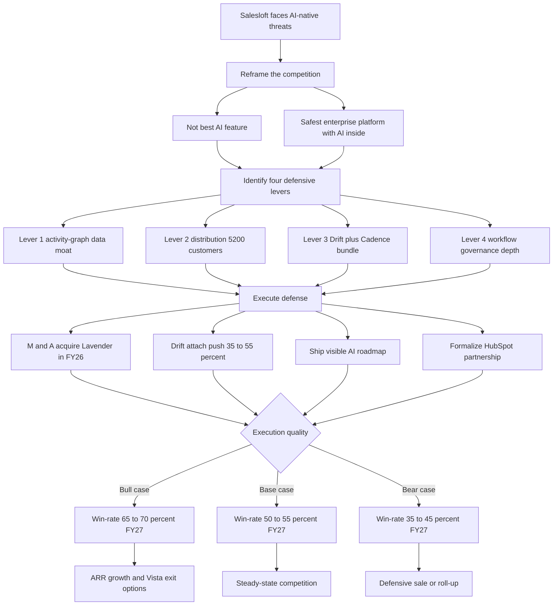

### Direct Answer

Salesloft (privately held, Vista Equity Partners portfolio) does not beat AI-native sequencing tools on raw feature parity, and trying to win that fight head-on is the documented path to losing. Salesloft competes by **reframing the buying decision** from "which tool has the best AI" to "which is the safest enterprise platform with AI inside," then stacking four structural moats AI-natives cannot replicate quickly: an activity-graph data moat, a ~5,200-customer distribution moat, the Drift-plus-Cadence bundle, and an enterprise workflow-and-governance moat. Through 2027 the strategy works, contingent on M&A execution, bundle attach discipline, and a visibly shipping AI roadmap.

> **TL;DR**
> - Salesloft loses the AI-feature demo and the price comparison; it wins the enterprise procurement and the renewal.
> - Four defensive levers: data moat (12-18 months of per-customer engagement history), distribution (~5,200 customers, ~3.2-year tenure, HubSpot partnership, Vista capital), the Drift + Cadence bundle (~$135-$185 ARPU, 7-10 point retention spread), and governance depth (compliance, audit, multi-CRM sync).
> - Real threats ranked: Lavender (acute, buy it), Apollo (strategic, blunt the wedge), 11x.ai (structural, build agentic), Regie/AiSDR/Bondi (manageable).
> - Bigger long-run threat than any AI-native: CRM-vendor native AI -- HubSpot (NYSE: HUBS) Breeze, Salesforce (NYSE: CRM) Agentforce, Microsoft (NASDAQ: MSFT) Copilot.
> - 2027 verdict: base case win-rate 50-55%, bull 65-70%, bear 35-45%. Salesloft survives with its install base intact; AI-natives grow the bottom-up category.

## 1. What Is Actually Being Asked

The surface question -- "how does Salesloft compete against AI-native sequencing tools?" -- is the wrong question, and an operator must reframe it before answering.

### 1.1 The Naive Frame And Why It Fails

The naive frame is: Salesloft is a legacy sales engagement platform, AI-natives like Lavender and Apollo and 11x.ai are faster and cheaper at the AI parts, therefore Salesloft loses. That frame is wrong because it treats sales engagement as a **feature category** rather than as the **enterprise system of record for outbound activity**, which is what Salesloft actually is for roughly 5,200 paying organizations.

### 1.2 The Correct Frame

Salesloft is not competing on AI feature parity, because it cannot win that fight and chasing it burns the R&D budget on demos that get leapfrogged in two quarters. It is competing on **whether the buying committee at a 200-rep mid-market revenue org or a 2,000-rep enterprise team picks the safest, most integrated, most governable platform with AI inside, or picks the fastest, cheapest AI-first point tool.** Those are different buyers, different deals, different procurement processes, and different success criteria.

### 1.3 The Strategic Hinge

The entire competitive strategy hangs on Salesloft's ability to keep enterprise revenue leaders evaluating the question as "platform with AI" rather than "best AI feature," while simultaneously closing the AI feature gap fast enough -- through build, buy, and partner -- that the platform frame stays credible. Get the reframing right and the analysis follows; get it wrong and you score Salesloft on a scoreboard the AI-natives wrote (see also q1849, q1846).

### 1.4 Why The Frame Decides The Outcome

The reframing is not rhetorical positioning -- it is the difference between two completely different competitive games with different odds. In the "best AI feature" game, Salesloft is a trailing incumbent racing a swarm of well-funded, faster-moving startups whose entire engineering organization is pointed at one problem. That is a structurally losing race, because Salesloft must also maintain a decade of platform surface area, enterprise integrations, and compliance infrastructure that the AI-natives do not carry. In the "safest enterprise platform with AI inside" game, Salesloft is the established leader with a defensible install base, and the AI-natives are the ones who must cross a hard barrier -- enterprise governance, multi-CRM integration, procurement credibility -- that takes years and hundreds of millions of dollars to build. The competitive odds invert entirely depending on which game is being played, and the buying committee decides which game it is by deciding what criteria matter. Salesloft's single most important competitive activity, therefore, is shaping the evaluation criteria before the RFP is written -- getting RevOps, IT, Legal, and Finance into the room early so the decision is scored on platform dimensions rather than purely on the demo.

### 1.5 The Cost Of Getting The Frame Wrong

If Salesloft accepts the "best AI feature" frame and tries to win it, three things happen in sequence. First, the R&D budget gets misallocated -- engineering chases feature parity with whatever the AI-natives demoed last quarter, and by the time those features ship they are already leapfrogged. Second, the sales motion gets confused -- reps lead with AI feature comparisons they will lose rather than platform value they would win. Third, the pricing premium erodes -- if Salesloft is just another AI sequencing tool, there is no justification for $135-$185 ARPU against Apollo at $90, and the margin that funds the R&D budget and Vista's returns collapses. The frame is not marketing; it is the load-bearing assumption under the entire strategy.

## 2. The Four Defensive Levers

Salesloft holds four structural assets AI-native competitors cannot match in 2027. Each is a distinct lever requiring distinct execution.

### 2.1 Lever Map At A Glance

| Lever | What it is | Durability | Primary risk |
|---|---|---|---|
| Activity-graph data moat | 12-18 months per-customer engagement history feeding Salesloft AI | 18-36 months | Foundation models compress customer-specific advantage |
| Distribution moat | ~5,200 customers, ~3.2-year tenure, HubSpot channel, Vista capital | High | Vista exit pressure; partnership erosion |
| Drift + Cadence bundle | Conversation + sequencing at ~$135-$185 ARPU | Medium-high | AI-native acquires/builds conversation |
| Workflow + governance | Compliance, audit, multi-CRM sync, admin depth | Very high | Well-capitalized AI-native builds the stack |

### 2.2 Lever One -- The Activity-Graph Data Moat

Every Salesloft customer accumulates, on average, twelve to eighteen months of granular activity data: which sequences fired, which steps were sent, which buyers opened and replied, which patterns correlated with closed-won pipeline. That corpus is the training fuel for Salesloft's Sentence AI and Cadence AI features, making them customer-specific in a way an AI-native cannot be on day one. A new Lavender or Apollo deployment starts from generic LLM defaults; Salesloft starts from the customer's own accumulated data.

### 2.3 Lever Two -- The Distribution Moat

Approximately 5,200 paying customers, weighted ~70% enterprise and ~30% mid-market by revenue, with an average tenure near 3.2 years, deep Salesforce and HubSpot integrations, and Vista's capital backing both organic growth and an active M&A pipeline. An AI-native would need 18-36 months of bottom-up land-and-expand plus enterprise selling to approach that base -- and the base is sticky because switching costs (90-180 days to migrate sequences, retrain reps, rewire integrations) are real (see q1843).

### 2.4 Lever Three -- The Product-Bundle Moat

Salesloft sells Drift (conversation marketing and AI chatbot) plus Cadence (the sequencing engine), priced together at roughly $135-$185 combined ARPU at a 15-25% bundle discount. No AI-native sequencing tool ships an integrated conversation-plus-sequencing combo. Customers adopting both products retain at 92-95% gross versus 85-88% for Cadence-only -- a 7-10 point spread that compounds across the install base.

### 2.5 Lever Four -- The Workflow And Governance Moat

Enterprise sales engagement is not just AI features -- it is admin and role permissions, audit trails, regional data residency, SOC 2 Type II and ISO 27001 posture, deep bidirectional CRM sync, sequence governance and approval workflows. Salesloft has built and hardened this over a decade; single-product AI-native startups have not, and doing it well is years of unsexy investment.

### 2.6 The Data Moat -- Why It Is Real And Why It Is Not Permanent

The activity-graph moat is the most over-claimed and most misunderstood of the four levers, so it deserves precise framing. What it actually is: every Salesloft customer accumulates, in the platform, structured longitudinal data on every sequence sent, every step (email, call, LinkedIn touch, manual task), every buyer engagement (open, click, reply, sentiment), every conversion (meeting booked, opportunity created, deal closed-won or closed-lost), and the linkage between all of it. After twelve to eighteen months, that customer has a per-rep, per-segment, per-cadence corpus of what works in their specific market with their specific buyers. Why it is a moat: Salesloft's AI features train on this customer-specific corpus, producing recommendations grounded in what has actually worked for that customer -- structurally different from an AI-native starting with generic LLM defaults. Why it is not permanent: AI-natives accumulate the same data as their install bases mature, foundation-model improvements make smaller corpuses more useful, and synthetic data plus transfer learning from cohorts of similar customers close the gap from years to quarters. The honest read: the data moat buys Salesloft 18-36 months of differentiation, not a decade, and the company's job is to use those months to build the other moats that outlast it.

### 2.7 The Distribution Moat And The Vista Capital Question

The distribution moat is Salesloft's most durable competitive asset and the one most undervalued by AI-native enthusiasts who treat sales engagement as a feature contest. It is not a list of email addresses -- it is roughly 5,200 organizations where Salesloft is the system of record for outbound activity, where switching out involves a 90-180 day migration, sequence rebuild, rep retraining, integration rewiring, and the political cost of an internal change-management exercise. At a roughly $48K average customer ACV, the install base represents a high-retention recurring-revenue base and, more importantly, a platform position from which Salesloft sells additional products at far lower customer-acquisition cost than an AI-native paying for cold acquisition. The Vista capital question cuts both ways: Vista funds organic growth and an active M&A pipeline, which means Salesloft can buy what AI-natives are building; but Vista is also a financial owner with an exit window, and if the competitive picture deteriorates faster than expected, Vista could push Salesloft into a defensive sale rather than a long-horizon platform build.

### 2.8 The Bundle Moat -- The Retention Math In Detail

The product-bundle moat is the lever Salesloft has executed best in the AI transition, and the one with the clearest leverage on competitive win-rate over the next 24 months. Drift standalone runs roughly $55-$95 ARPU; Cadence standalone runs roughly $85-$135 ARPU; the bundle prices at $135-$185 combined ARPU at a 15-25% discount. The retention math is the proof: customers using both products retain at 92-95% gross versus 85-88% for Cadence-only -- a 7-10 point spread that, multiplied across the install base, represents enormous lifetime-value protection. The bundle is sticky because it is integrated, integrated because Salesloft owns both products, and owned because Vista funded the Drift acquisition. The execution challenge is attach rate: a current attach around 35-40% must reach 50%+ by FY27 for the bundle moat to hit full strategic potential.

### 2.9 The Governance Moat -- What Enterprise Buyers Actually Buy On

In a $200K+ ACV enterprise sequencing decision, the buying committee includes Sales (cares about features and AI), RevOps (cares about workflow, integration, governance), IT (cares about security, SSO, compliance), Legal (cares about contracts, data residency, audit), and Finance (cares about predictability, vendor maturity, total cost). Salesloft passes all five gates; an AI-native point tool typically passes one and stalls in the others. The moat in action: Salesloft loses head-to-head AI-feature shoot-outs regularly and still wins the deal because the procurement and security review eliminates the AI-native from consideration. What makes it durable is that building enterprise governance is years of unsexy investment -- compliance certifications, security infrastructure, integration engineering, contractual sophistication -- exactly the work AI-native startups optimizing for product velocity deliberately deprioritize.

### 2.10 How The Levers Compound

Distribution funds R&D; R&D feeds the data moat; the bundle deepens distribution; governance protects the install base. The strategic question is not whether the levers exist but whether Salesloft executes hard enough on AI catch-up that the levers stay relevant -- a platform that loses on AI for two years can still lose the install base to a credible AI-native that crosses the upmarket threshold. The four levers are not independent insurance policies; they are a single interlocking system, and the system fails if any one lever is neglected long enough for a competitor to exploit the gap.

## 3. The AI-Native Threat Map

The AI-natives are not interchangeable. An operator needs an accurate read of each, because the threats differ sharply in shape and severity.

### 3.1 Competitor Snapshot

| Competitor | Type | Est. ARR | Threat to Salesloft | Salesloft response |
|---|---|---|---|---|
| Lavender | AI email coaching/writing | $25M-$50M | Acute -- clearest feature gap | Acquire it |
| Apollo | Data + sequencing bundle | $150M-$250M | Strategic -- bottom-up wedge | Bundle + channel block |
| 11x.ai | Agentic autonomous SDR | $5M-$15M | Structural -- category-redefining | Build agentic features |
| Regie.ai | AI content generation | $15M-$30M | Manageable -- complement | Build or partner |
| AiSDR | Agent-first outbound | $10M-$25M | Manageable -- narrow | Build or partner |
| Bondi | GTM data + AI sequencing | $5M-$15M | Noise -- early-stage niche | Monitor |

### 3.2 Lavender -- The Acute Threat

Lavender is the highest-velocity threat: an AI email-coaching assistant with roughly 5,000+ accounts, a strong product-led growth motion, and a focus on real-time email scoring and reply-rate lift. It is the AI capability Salesloft most needs and most clearly does not match natively -- and the clearest M&A target in the category, widely understood to be in conversation with multiple acquirers.

### 3.3 Apollo -- The Strategic Threat

Apollo is the most strategic threat -- not because its AI is better, but because it bundles lead data, intent signals, and sequencing into a single $59-$119/user/month offering aimed at the bottom-up self-serve mid-market. The threat is structural: a category-redefining bundle AI-natives can sell for less because they carry no legacy enterprise overhead.

### 3.4 11x.ai -- The Structural Threat

11x ships autonomous SDR agents (Alice for inbound, Mike for outbound) that promise to replace human SDR work entirely. The threat is not 11x's current revenue but the category-redefining bet underneath it -- if agentic GTM delivers, it eliminates the human-AE-driven sequencing category Salesloft is built for.

### 3.5 The Long Tail

Regie.ai (AI content, integrates as much as it competes), AiSDR (agent-first, narrow segment), Bondi (early-stage niche), and adjacent players like Clay and Smartlead. The accurate ranking from Salesloft's seat: neutralize Lavender, blunt Apollo at the upmarket boundary, build credible agentic features so 11x does not own the conversation, and ignore the rest while the bundle and install base do their work.

### 3.6 Why The Threats Are Not Interchangeable

The most common analytical error in this category is treating "AI-native sequencing tools" as a single competitor. They are not. Lavender is a feature gap -- it does one thing (email coaching) extremely well, and the correct response is to absorb it via acquisition, which converts a competitor into a platform feature. Apollo is a business-model threat -- its bundle and bottom-up motion attack the contested mid-market boundary, and the correct response is competitive (better bundle, channel exclusivity, an aggressive AI-included tier), not acquisitive. 11x is a category-definition threat -- it is betting the human-AE sequencing category itself shrinks, and the correct response is to participate in defining the hybrid agentic-plus-human model rather than letting 11x define it. Each threat has a different shape, a different time horizon, and a different correct response, and a Salesloft strategy that uses one playbook against all three loses on at least two fronts.

### 3.7 The Threat-Response Matrix

| Threat | Time horizon | Correct response | What failure looks like |
|---|---|---|---|
| Lavender (feature gap) | Acute, 6-12 months | Acquire and integrate | Outreach buys it first |
| Apollo (business model) | Strategic, 12-24 months | Bundle + channel block + mid-market tier | Wedge crosses into enterprise |
| 11x (category definition) | Structural, 24-48 months | Build/buy agentic, define hybrid model | 11x owns the agentic narrative |
| Regie/AiSDR/Bondi | Manageable, ongoing | Build or partner selectively | Distraction from the real threats |

The matrix is the operational core of the threat analysis: Salesloft does not need to beat every AI-native on every feature -- it needs to apply the right response to each distinct threat and avoid spending scarce resources fighting the wrong battle on the wrong timeline.

## 4. The Buyer Reality

Salesloft and the AI-natives are not really competing for the same buyer in most deals -- they compete for adjacent buyers with overlapping but distinct needs.

### 4.1 Two Buyer Profiles

| Dimension | Salesloft buyer | AI-native buyer |
|---|---|---|
| Org size | 100+ reps, often 500-5,000+ | 5-100 reps |
| CRM | Salesforce or HubSpot, system of record | HubSpot or lightweight CRM |
| RevOps function | Structured, formal | Light or absent |
| Procurement | 5-9 stakeholders, formal RFP | Often single decision-maker |
| Primary criterion | Governance, integration, vendor maturity | Outbound throughput, reply-rate lift |
| Cycle length | 6-12 months | 1-3 months |

### 4.2 The Contested Ground

A 100-150 rep mid-market organization could go either way depending on the buying committee, GTM maturity, and the weighting of AI features versus governance. The Apollo bottom-up wedge is the move to grow the AI-native pool upward into this contested ground; the Drift bundle and HubSpot exclusivity are the defensive moves to keep it in the platform-buyer category (see q1855).

### 4.3 The 2027 Read On The Boundary

The contested ground moves slowly toward AI-natives among pure outbound-throughput buyers and slowly toward Salesloft among governance-conscious revenue orgs. Net: roughly stable through 2026-2027, with Salesloft retaining the upmarket and AI-natives growing the bottom-up. Model these as two distinct buyer pools, not a single winner-take-all market.

### 4.4 How Salesloft Is Actually Bought

Strategy that does not match how customers actually buy is just analyst frame. The new-logo enterprise buying cycle typically runs 6-12 months from first conversation to closed-won, with a buying committee of 5-9 stakeholders, a formal RFP or competitive evaluation, deep technical due diligence on integration and governance, a security review against SOC 2 and ISO 27001, and a multi-year contract (typically 2-3 years with annual escalators). The decision rarely comes down to a single feature; it comes down to which platform passes all the gates. The mid-market cycle runs 3-6 months with a smaller committee and more weight on AI features and immediate productivity impact -- the segment most contested with Apollo, and where Salesloft's bundle and integration depth must do the most competitive work.

### 4.5 How Salesloft Is Actually Renewed And Expanded

For existing customers, the renewal conversation is typically initiated 90-120 days before the renewal date, with the customer's RevOps team running an internal "stay or switch" evaluation. The major drivers of renewal versus churn: did the customer actually use the platform deeply (low utilization predicts churn), did the AI features deliver perceived value (the "we're paying for AI we're not using" objection), is the CRM integration still strong, did the CSM relationship maintain trust, and is the price escalation reasonable for the value delivered. The expansion motion -- existing Cadence customers buying Drift, premium AI features, additional seats, or moving to enterprise tiers -- is the most economically important customer activity, and bundle attach is the most important expansion lever because every Drift add-on lifts ARPU, lifts retention, and locks the customer deeper into the platform. AI-natives rarely win upmarket renewal-driven switches because switching costs are too high, but they do win where the CSM relationship has weakened, the AI features have not delivered, or the customer's GTM has shifted toward a lighter-weight tool (see q1842, q1843).

## 5. Pricing And Packaging

Pricing is where the competitive battle becomes most concrete. An operator needs the actual numbers.

### 5.1 The Pricing Grid

| Vendor | Offering | Price (per user/month) | Model |
|---|---|---|---|
| Salesloft Cadence | Sequencing standalone | $85-$135 | Per seat |
| Salesloft Drift | Conversation standalone | $55-$95 | Per seat / conversation |
| Salesloft bundle | Drift + Cadence | $135-$185 | Per seat, 15-25% discount |
| Apollo | AI tier (data + sequencing) | $59-$119 | Per seat, free-tier funnel |
| Lavender | Email coaching/writing | $29-$99 | Per seat add-on |
| 11x.ai | Autonomous agent | $200-$500 per agent | Per agent, not per seat |
| Regie.ai | AI content generation | $89-$199 | Per seat |

### 5.2 The Headline Comparison

Apollo at $59-$119 versus Salesloft at $135-$185 is the gap every AI-native demo emphasizes -- and it is real. But it omits the bundle value, the integration depth, the governance, and the install-base economics. A mid-market buyer comparing Apollo at $90 to Cadence-only at $110 sees a clear price gap; comparing Apollo at $90 to the full bundle at $160 sees a different value picture once conversation, unified analytics, and one admin layer are weighed in.

### 5.3 Salesloft's Pricing Strategy For 2027

Hold premium platform pricing to protect margin and signal enterprise positioning; drive bundle attach to lift effective ARPU and retention; offer a more aggressive AI-features-included tier at the mid-market boundary to blunt Apollo's wedge; and use Vista's M&A capacity to acquire AI capability rather than build it (see q1852, q1864).

### 5.4 The Per-Seat Pricing Model Under Pressure

The deeper pricing risk is not Apollo's headline discount -- it is the structural pressure on the per-seat model itself. Salesloft prices per human user; 11x prices per autonomous agent. If agentic adoption accelerates, customers replace human SDRs with agents and the per-seat revenue base shrinks even if Salesloft wins the deal, because there are fewer seats to sell. The same pressure comes from AI productivity gains: if AI lets each rep do the work of 1.5 reps, a customer needs fewer Salesloft seats for the same pipeline output. The 2027 read is that per-seat pricing holds through FY27 but is structurally exposed beyond it, and Salesloft's pricing model may need to evolve toward usage-based, outcome-based, or AI-feature-tiered structures rather than pure per-seat platform pricing. The vendors that navigate the AI transition best will be the ones that decouple revenue from headcount before headcount decouples from pipeline.

### 5.5 The Total-Cost-Of-Ownership Argument

Salesloft's strongest pricing counter to the Apollo discount is total cost of ownership, not headline price. A fully loaded comparison includes the cost of the separate conversation tool an Apollo customer must buy and integrate, the engineering and RevOps time to wire a lighter-integration tool into the enterprise stack, the change-management cost when a point tool is outgrown, the procurement and security-review overhead repeated for each additional vendor, and the risk-adjusted cost of betting a pipeline-critical system on an early-stage startup. When those line items are made explicit, the $135-$185 bundle versus $90 point-tool gap narrows substantially -- and for a governance-conscious enterprise buyer, often inverts. Salesloft sales loses the pricing argument whenever it is fought on sticker price and can win it whenever it is fought on three-year total cost of ownership.

## 6. The M&A Game

Salesloft's competitive position through 2027 may be more determined by M&A than by product, because M&A lets Salesloft buy AI capability faster than it can build it.

### 6.1 What Vista Brings

Vista Equity Partners runs Salesloft on a playbook of disciplined operating margins, M&A-funded category expansion, and platform consolidation. A realistic Vista war chest for Salesloft category M&A sits in the $400M-$800M range across the 2025-2027 window (see q1847).

### 6.2 The Lavender Acquisition Question

| Factor | Detail |
|---|---|
| Strategic fit | Closes the highest-velocity AI email gap immediately |
| Plausible price | $200M-$400M |
| Install-base add | 5,000+ customers into the Salesloft funnel |
| Signal | Salesloft as active consolidator, not disrupted incumbent |
| Risk | Outreach acquires Lavender first, leaving a permanent gap |

### 6.3 Other M&A Candidates

An AI conversation startup to deepen Drift; a vertical sequencing tool for a regulated industry where Salesloft is underweight; a small agentic SDR startup to credibly enter the agentic category before 11x defines it; a pipeline-orchestration adjacency to expand the platform footprint (see q1865).

### 6.4 The M&A Discipline

Vista will not let Salesloft overpay, and Salesloft cannot afford to be priced out. The right move is decisive early Lavender acquisition, surgical adds in agentic and conversation-AI, and ruthless avoidance of the bidding wars that destroy capital efficiency.

### 6.5 The Integration Risk M&A Analysis Usually Ignores

Acquiring Lavender solves the feature gap on paper, but the deal only creates value if Salesloft integrates it well -- and integration is where platform acquisitions most often fail. The risks are concrete: Lavender's product-led, fast-shipping engineering culture collides with Salesloft's enterprise release cadence and compliance gates; Lavender's 5,000+ self-serve customers churn if the product gets slower or more expensive inside Salesloft; the AI talent that built Lavender's edge leaves within 12-18 months of the acquisition; and the integration consumes engineering capacity that was supposed to be closing other gaps. The bull case assumes integration within two quarters -- that assumption is optimistic, and a realistic plan budgets 12-18 months for full integration with a deliberate decision to keep Lavender's product velocity intact even if it means running it semi-independently. M&A is the lever that most clearly determines the 2027 outcome, but only if the post-close integration is executed as carefully as the deal itself.

### 6.6 The Bear-Case M&A Scenario

The bear-case M&A path is specific and worth naming: Outreach -- Salesloft's closest legacy competitor -- acquires Lavender first. That single outcome leaves Salesloft with a permanent, visible AI email-writing gap in every competitive deal, hands Outreach both an install base and a credible AI capability, and signals to the market that Outreach, not Salesloft, is the consolidator. A secondary bear scenario: a deeper-pocketed acquirer (Salesforce, Microsoft, or an AI-native that lands a mega-round) outbids Salesloft on the strategic target, and Vista's return-on-capital discipline prevents Salesloft from matching. The defensive implication is that Salesloft cannot treat the Lavender acquisition as a deal to do eventually -- the option has an expiration date set by competitors' M&A timelines.

## 7. The HubSpot Partnership And Channel Exclusivity

The Salesloft-HubSpot relationship is the under-discussed multiplier on the distribution moat.

### 7.1 What The Relationship Currently Is

Salesloft is a strategic partner to HubSpot (NYSE: HUBS) for sales engagement, with deep bidirectional CRM integration, joint go-to-market motions, and de-facto recommended-platform status for HubSpot CRM upmarket customers. HubSpot's native sequencing is real but lighter-weight, focused on SMB and lower mid-market.

### 7.2 Why It Matters For The AI-Native Fight

HubSpot's CRM upmarket motion is one of the largest single distribution channels in revenue software. Customers crossing the upmarket threshold need a sequencing layer, and Salesloft is the path of least resistance. Apollo, building a competing CRM-plus-sequencing bundle, is structurally locked out of the HubSpot upmarket flow as long as the partnership holds.

### 7.3 The Strategic Upside And Risk

A formal "preferred enterprise sales engagement partner" arrangement with joint-product features raises the cost for any AI-native to win HubSpot upmarket deals. The risk: HubSpot Breeze AI could include native sequencing AI that competes directly, pushing HubSpot toward building rather than partnering. The watch-item is HubSpot's Breeze roadmap and its public statements on native sales engagement (see q1857).

### 7.4 The Partnership Balance Of Incentives

The partnership holds because both companies currently benefit and both have incentive to deepen rather than disrupt. HubSpot avoids building enterprise sequencing depth -- a multi-year investment outside its core SMB-to-mid-market sweet spot -- and Salesloft accesses one of the largest distribution channels in revenue software. The partnership erodes only if that balance breaks: if HubSpot concludes the sequencing layer is too strategic to leave to a partner, or if Salesloft's HubSpot-CRM integration starts losing to a competitor's, the rationale weakens. For Salesloft, the partnership is both an asset and a dependency -- a structural channel advantage that AI-natives cannot replicate without building their own CRM, but also a relationship Salesloft does not fully control. The 2027 read is that the partnership likely deepens rather than erodes through FY27, but it belongs on every Salesloft executive's risk register.

### 7.5 What Apollo's CRM Ambition Means Here

Apollo is partly attempting to build its own CRM-plus-sequencing bundle, which is the direct strategic counter to Salesloft's HubSpot channel position. If Apollo succeeds in becoming a credible lightweight CRM, it no longer needs the HubSpot channel and can serve the bottom-up motion end to end. The honest assessment is that Apollo will not credibly build an enterprise-grade CRM at scale by 2027 -- that is a decade-long undertaking -- but it can build a good-enough CRM for the sub-100-rep segment, which deepens its hold on the bottom-up market and makes that segment harder for Salesloft to ever recover. The HubSpot partnership is Salesloft's structural answer: as long as it holds, Salesloft owns the upmarket flow that Apollo's CRM ambition is designed to bypass.

## 8. The Agentic SDR Question

The single most existential question is whether autonomous agentic SDRs collapse the human-AE-driven sequencing category into something smaller and more commodified.

### 8.1 The Agentic Thesis

Rather than a human SDR running sequences in Salesloft or Apollo, an autonomous agent prospects, personalizes, sends, follows up, qualifies, and books meetings with no human touch -- replacing not the sequencing tool but the human who used it. If the thesis fully delivers, the addressable market for human-AE sequencing platforms shrinks.

### 8.2 The Current Evidence

11x.ai has shown impressive demos and accumulated meaningful but small ARR. Real customer adoption at scale has lagged the public narrative, with mixed results on quality, deliverability, and pipeline conversion versus human-AE sequences. Foundation-model improvements make agent capabilities better quarterly -- the trajectory is real even if the current state is over-marketed.

### 8.3 The Honest Assessment

Agentic SDR is real, growing, and will materially reshape the category by 2028-2030 -- but it does not eliminate human-AE sequencing in 2026-2027. The most likely intermediate state is hybrid: agents for high-volume top-of-funnel, human AEs for qualification and complex deals, with sequencing platforms supporting both. Salesloft must ship credible agentic features so customers exploring agentic do not have to leave the platform (see q1849, q1859).

### 8.4 The Hybrid Model And Salesloft's Place In It

The hybrid model is not a compromise -- it is the most probable steady state for 2027-2029, and it is a model Salesloft can win if it positions correctly. In the hybrid model, autonomous agents handle high-volume, low-complexity top-of-funnel prospecting where deliverability and personalization at scale matter, while human AEs handle qualification, multi-threaded enterprise deals, and relationship-driven motions where judgment matters. A sequencing platform sits underneath both, orchestrating the handoff: an agent surfaces a qualified opportunity, a human AE takes it forward, and the platform maintains the activity record, the governance, and the analytics across the whole motion. Salesloft's opportunity is to be that orchestration layer -- "the enterprise platform for both human and agent outbound" -- which extends the moat into the next category transition rather than being eroded by it. The strategic risk is the inverse: if Salesloft treats agentic as hype and ignores it, an AI-native builds the enterprise-credible agentic platform with governance and integration depth, and by 2028-2029 Salesloft competes in a shrinking human-AE market while the new category grows around it.

### 8.5 What To Watch As The Leading Indicator

Operator clarity on the agentic question requires watching the right signals rather than the demos. The leading indicators are: real customer adoption velocity (not pilot counts but production deployments with sustained spend), pipeline-conversion data comparing agent-driven versus human-driven sequences at scale, deliverability and domain-reputation outcomes for high-volume agent sending, and the cadence of foundation-model capability improvements. When those indicators show agentic crossing from "impressive demo" to "reliably outperforms human SDRs in production," the category-redefinition becomes real and Salesloft's agentic roadmap must already be shipping. Modeling the agentic question explicitly -- rather than dismissing it as hype or capitulating to it as inevitable -- is the single most important medium-term competitive discipline for any operator in this category.

## 9. Win/Loss Patterns

Operator-level analysis needs a real read of where Salesloft wins and loses specific deals.

### 9.1 Where Salesloft Wins And Loses

| Salesloft wins | Salesloft loses |
|---|---|
| Enterprise deals 500+ reps where governance matters | Sub-100-rep startups where speed and cost dominate |
| Salesforce-CRM deals with deep integration need | HubSpot lower-mid-market deals to cheaper Apollo bundle |
| Deals where IT/Legal/Finance gate procurement | Pure outbound-velocity buyers favoring Lavender's email AI |
| Renewals where switching cost dominates | AI-first cultures trading governance for aggressive tooling |
| Deals needing inbound conversation + outbound sequencing | Greenfield deals with no existing CRM integration |

### 9.2 The Pattern That Matters

Salesloft loses on AI feature parity in the demo, loses on price in the comparison, and wins on enterprise depth in the procurement and the boardroom. AI-natives win the demo and the price, and lose the procurement.

### 9.3 Competitive Guidance For Salesloft Sales

Lead every enterprise conversation with platform, integration, governance, and bundle value. Lead AI comparisons with the customer's own data ("your AI is trained on your data") rather than feature parity. Use the Drift bundle as the differentiator. Concede the sub-100-rep AI-first segment rather than chasing deals Salesloft cannot win profitably (see q1854).

### 9.4 The Discipline Of Conceding Deals

The hardest competitive discipline for a Salesloft sales organization is deliberately not chasing deals it can win occasionally but cannot win profitably. A sub-100-rep AI-first startup deal can sometimes be won with heavy discounting, executive air cover, and a long unpaid proof-of-concept -- but the customer-acquisition cost exceeds the lifetime value, the customer is a poor product fit that will churn or generate disproportionate support load, and the discount sets a pricing precedent that leaks into the next deal. Sales teams that try to win every deal lose money and erode the pricing model; sales teams that win the right deals decisively grow profitably. The competitive strategy is segmentation in action: Salesloft is the upmarket platform play, AI-natives are the bottom-up feature play, and the contested middle is where execution matters most. Concession is not surrender -- it is capital discipline.

### 9.5 The Renewal-Defense Playbook

Because AI-natives win upmarket business almost exclusively through competitive renewal switches rather than greenfield displacement, the renewal-defense playbook is a core competitive activity, not a customer-success afterthought. The playbook: monitor product utilization continuously and intervene early when it drops (low utilization is the leading churn indicator); make the AI features deliver and demonstrate visible value before the "we're paying for AI we're not using" objection forms; keep the CRM integration current as the customer's stack evolves; maintain the CSM relationship as a genuine strategic-advisory relationship rather than a transactional one; and treat the bundle attach motion as retention insurance, because every Drift add-on raises the switching cost. A renewal defended is a deal an AI-native never gets to compete for.

## 10. The CRM-Adjacent Threat

A separate and potentially larger threat than the AI-native sequencing tools is the major CRM vendors bundling native AI sequencing into their platforms.

### 10.1 Why CRM Vendors Are The Bigger Risk

CRM vendors own the system of record, the customer relationship, and the deepest data. If they ship credible native sequencing with AI built in, customers face a "good-enough integrated" versus "best-of-breed standalone" choice that has historically favored the integrated option in late-stage consolidation.

### 10.2 The Three CRM Threats

| Vendor | Vehicle | Threat profile |
|---|---|---|
| HubSpot (NYSE: HUBS) | Breeze AI | Closest active threat -- mid-market base overlaps Salesloft's |
| Salesforce (NYSE: CRM) | Einstein / Agentforce | Larger but slower -- historically partners for sequencing |
| Microsoft (NASDAQ: MSFT) | Dynamics 365 Copilot | Dark horse -- foundation-model relationships, deep pockets |

### 10.3 Salesloft's Defense

Position as the multi-CRM enterprise platform that complements rather than competes with native CRM AI -- Salesloft works with both Salesforce and HubSpot; an integrated CRM AI does not. The HubSpot partnership is the critical hedge against HubSpot building rather than partnering. The worst case is HubSpot or Salesforce fully internalizing the sequencing layer -- a 3-5 year shift Salesloft must prepare for through platform depth, M&A, and partnership management (see q1855, q1857).

### 10.4 Why The "Good-Enough Integrated" Threat Is Real

The history of enterprise software is full of best-of-breed point categories that got absorbed into platforms once the platform's native version became "good enough" -- not best, just good enough that the integration advantage outweighed the feature gap. CRM-native sequencing follows that pattern: the CRM vendor owns the data, the relationship, and the renewal, and once its native sequencing crosses the good-enough threshold, the standalone category compresses regardless of who has the best AI. The honest assessment is that this threat is slower-moving than the AI-native threat -- a 3-5 year horizon, not a 1-2 year one -- but it is also larger in magnitude, because it attacks the category's existence rather than Salesloft's market share within it.

### 10.5 The Multi-CRM Position As The Durable Answer

Salesloft's most durable answer to the CRM-internalization threat is that it is genuinely CRM-agnostic in a way no CRM vendor's native tool can be. An organization running Salesforce for one division and HubSpot for another, or one migrating between CRMs, or one that simply does not want its sequencing layer locked to a single CRM vendor's roadmap and pricing power, needs a neutral platform. HubSpot's Breeze sequencing only works inside HubSpot; Salesforce's Agentforce sequencing only works inside Salesforce; Salesloft works across both and adds conversation, governance, and RevOps depth that a CRM bolt-on does not prioritize. The multi-CRM position is not a feature -- it is the structural reason the standalone sequencing category survives CRM internalization, and Salesloft should make it a central pillar of its 2027 positioning (see q1840).

## 11. The Strategic Decision Flow

## 12. Bull, Base, And Bear Cases Through 2027

Strategic analysis becomes useful when it commits to scenarios with explicit assumptions and outcomes.

### 12.1 Scenario Comparison

| Variable | Bull case | Base case | Bear case |
|---|---|---|---|
| Lavender M&A | Salesloft acquires in FY26 | Smaller AI startup acquired instead | Outreach wins Lavender |
| Drift attach | Climbs to 55%+ | Climbs to 45-50% | Stalls at 35-40% |
| AI roadmap | Ships 2-3 flagship features/quarter | Moderate cadence | Slow, underwhelming |
| HubSpot partnership | Formal exclusivity | Deepens informally | Eroded by Breeze AI |
| Competitive win-rate | 65-70% | 50-55% | 35-45% |
| Probability | 25-30% | 45-50% | 20-25% |

### 12.2 Reading The Scenarios

The base case is the most likely path. The bull case is achievable with disciplined execution. The bear case is a real risk that depends primarily on M&A losses and AI-native execution velocity rather than on Salesloft strategy errors alone. The probability weighting points to a stable-to-modestly-positive outcome through 2027 (see q1844, q1848, q1846).

## 13. Counter-Case: Why Salesloft Could Still Lose

The bull and base cases assume disciplined execution. An honest analysis must take the bear thesis seriously rather than dismissing it.

### 13.1 The Foundation-Model Erosion Argument

The strongest counter-case is that the data moat is shallower than Salesloft claims. If foundation models (GPT-5-class, Claude Opus 4.7-class, Gemini 3-class) become good enough that customer-specific tuning matters less than raw model quality, the activity-graph advantage compresses below the threshold of buyer relevance -- in quarters, not years. An AI-native with a thousand mid-market customers can use transfer learning and synthetic data to close the gap fast.

### 13.2 The Apollo Wedge Succeeds

If Apollo's bottom-up bundle credibly crosses the contested mid-market boundary -- delivering real governance and real integration depth at sub-$120 pricing -- the Salesloft buyer pool shrinks toward pure enterprise and new-logo growth stalls in exactly the segment Salesloft most needs to defend.

### 13.3 The M&A Race Is Lost

If Outreach or another competitor wins Lavender, Salesloft carries a permanent visible AI gap into every competitive deal. Vista's return-on-capital discipline could leave Salesloft priced out of strategic targets by a deeper-pocketed bidder.

### 13.4 The CRM Internalization Scenario

If HubSpot or Salesforce decides the sequencing layer is too strategic to leave to a partner and ships credible native AI sequencing, the standalone category compresses regardless of how well Salesloft executes against AI-native point tools.

### 13.5 What The Counter-Case Misses

The counter-case is real but bounded. Salesloft's downside is limited by install-base value -- ~5,200 customers at high gross retention are worth a meaningful floor even in a defensive sale. Switching costs are genuine; an AI-native crossing into enterprise procurement still takes 18-36 months. And the bear case requires multiple independent failures to compound. The honest read: the counter-case caps the upside and creates real tail risk, but it does not make Salesloft a zero through 2027.

## 14. What An Operator Should Do With This Analysis

The analysis is decision input for several distinct audiences.

### 14.1 By Operator Audience

| Audience | Action |
|---|---|
| Salesloft executive | Drive Drift attach to 50%+, acquire Lavender in FY26, ship AI quarterly, formalize HubSpot, concede sub-100-rep deals |
| AI-native competitor | Wedge the contested mid-market, build governance depth, partner with CRM vendors, avoid head-to-head enterprise fights |
| Customer evaluating tools | Determine if you are an upmarket platform buyer or a bottom-up AI-first buyer, then match the platform to that profile |
| Category investor | Salesloft is a defensible platform with bounded downside; AI-natives are growth stories with enterprise-governance gaps |
| RevOps practitioner | Evaluate on your actual GTM motion, CRM, governance needs, and three-year vendor strategy -- not the best demo |

### 14.2 The Throughline

Competitive strategy in this category is about matching platform-versus-point-tool capabilities to platform-versus-point-tool buyers, executing against the moats that matter to your audience, and avoiding the trap of competing on the dimensions you are structurally disadvantaged on. Salesloft can win the platform game; it cannot win the pure AI-feature game; the strategy must be ruthlessly consistent with that reality.

## 15. The Honest 2027 Verdict

The bottom line is concrete and balanced rather than hype-driven in either direction.

### 15.1 Salesloft Is Not Dying

The activity-graph data moat, the ~5,200-customer install base, the Drift-plus-Cadence bundle, the Vista capital and M&A capacity, the HubSpot partnership, and the governance depth are real defensive assets that compound. A competitor cannot simply ship better AI features and dislodge a platform with these structural advantages.

### 15.2 Salesloft Is Not Winning The AI Feature War

Lavender writes better individual emails. 11x ships more aggressive autonomous-agent demos. Apollo bundles more cheaply. Salesloft's organic AI roadmap is credible but trailing, and competing on feature parity is a losing strategy that misallocates the R&D budget.

### 15.3 The Most Likely Outcome

Salesloft retains its upmarket install base, holds a roughly 50-55% competitive win-rate against AI-natives in head-to-head deals, grows ARR modestly, holds gross retention at 88-90%, and positions for either a continued Vista hold, an IPO, or a strategic acquisition. AI-natives grow the overall category, win the bottom-up segment decisively, and contest the mid-market boundary -- but do not displace Salesloft in the enterprise. The category is not winner-take-all; it is segmentation-and-bundle, and Salesloft's job is to win its segment decisively while AI-natives win theirs (see q1851, q1845, q1846).

## Citations

1. Salesloft company overview and product positioning, 2026.
2. Vista Equity Partners portfolio disclosures, 2024-2026.
3. Salesloft Cadence product documentation, 2026.
4. Salesloft Drift conversation marketing product brief, 2026.
5. Salesloft Sentence AI feature announcement, 2026.
6. Salesloft Cadence AI roadmap communications, 2026.
7. Lavender product and customer-base reporting, 2026.
8. Apollo.io pricing and packaging pages, 2026.
9. 11x.ai agentic SDR product materials (Alice, Mike), 2026.
10. Regie.ai product and pricing overview, 2026.
11. AiSDR autonomous outbound product summary, 2026.
12. Bondi GTM data and sequencing positioning, 2026.
13. Sales engagement category market sizing analysis, 2026.
14. Salesloft install-base and tenure estimates, 2026.
15. Salesloft gross retention and net revenue retention estimates, 2026.
16. Drift-plus-Cadence bundle attach-rate analysis, 2026.
17. Salesforce CRM integration ecosystem documentation, 2026.
18. HubSpot CRM partnership and integration disclosures, 2026.
19. HubSpot Breeze AI product announcements, 2026.
20. Salesforce Einstein and Agentforce product materials, 2026.
21. Microsoft Dynamics 365 Copilot product documentation, 2026.
22. Enterprise sales engagement procurement framework analysis, 2026.
23. Sales engagement switching-cost and migration analysis, 2026.
24. SOC 2 Type II and ISO 27001 compliance posture overview, 2026.
25. Outreach competitive positioning analysis, 2026.
26. Apollo bottom-up mid-market motion analysis, 2026.
27. Agentic SDR adoption and pipeline-conversion evidence, 2026.
28. Foundation-model capability trajectory analysis, 2026.
29. Salesloft M&A capacity and Vista war-chest estimates, 2026.
30. Lavender acquisition-scenario valuation analysis, 2026.
31. Salesloft ARR and revenue-trajectory estimates, 2026-2027.
32. Mid-market versus enterprise buyer-segmentation study, 2026.
33. Win/loss pattern analysis for sales engagement deals, 2026.
34. CRM-vendor native AI competitive-threat assessment, 2026.
35. Salesloft bull/base/bear scenario probability weighting, 2026-2027.
