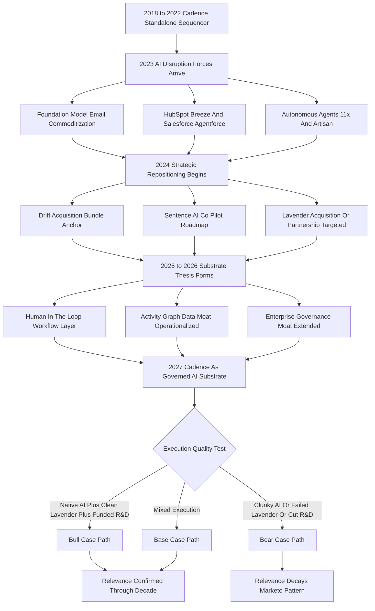

### Direct Answer

Yes, Salesloft Cadence is still relevant in 2027 -- but only because it has finished a forced metamorphosis from "the sequence engine an AE builds in" into "the human-in-the-loop workflow substrate that AI agents run inside, governed by enterprise compliance and anchored to a 12-18 month customer activity graph." The standalone rules-based sequencer Salesloft sold in 2022 is dying as fast as rules-based marketing automation died around 2017; the version that survives in 2027 is a different product with the same brand, the same logo, and a fundamentally different value proposition underneath. Relevance is real but segmented and execution-contingent: enthusiastically yes for the 100-plus-rep regulated enterprise, contested in mid-market, and gone from SMB by design.

**TL;DR:** Cadence-as-platform retains **78-88% gross dollar retention**, stabilizes ARPU at **$165-220 per seat per month** with one AI attach, and defends **70-80% market share inside the 100-plus-rep enterprise segment** where governance and audit trails are non-negotiable. It earns its 2027 existence by becoming the orchestration layer humans use to deploy, monitor, override, and approve what autonomous AI sales agents actually do. The bear case is real -- if Sentence AI ships late or clunky, if HubSpot Breeze reaches parity, if Vista starves R&D, or if foundation-model APIs let entrants assemble a Cadence-equivalent in eight weeks, retention collapses to **50-60%** and Cadence becomes the Marketo of sales engagement. Three variables decide which case wins: timely native AI shipping, deliberate repositioning away from rules-based sequencing, and preservation of the activity-graph data moat.

## 1. What Cadence Was, Is, And Is Becoming

Cadence's 2027 relevance cannot be assessed against the 2022 product, because the product itself has changed shape. The single biggest analytical error a buyer can make is measuring a substrate against a sequencer.

### 1.1 The 2018-2022 Product: A Rules-Based Sequencer

**Cadence in 2018-2022 was a rules-based sales sequencer.** An AE built a multi-step workflow -- Day 1 email, Day 3 LinkedIn touch, Day 5 call, Day 8 email, Day 12 break-up -- assigned prospects into it, and the platform paced the steps, surfaced the daily task list, captured replies, and reported cadence-level conversion. Underneath sat a CRM sync to Salesforce (NYSE: CRM) or HubSpot (NYSE: HUBS), an email and dialer integration, a basic A/B framework, and comparative reporting. **Executed well, it was a quietly excellent and category-defining piece of software** -- it, along with Outreach and Yesware, created the "sales engagement platform" category Gartner began tracking around 2019.

### 1.2 The 2024 Inflection: A Question, Not A Competitor

**By 2024 the category had matured and the product had hit a ceiling.** The conversation in every account review meeting shifted from "how do I run better cadences" to "do I even need cadences if AI can write the email and pick the timing." That shift -- not a competitor, not a recession, not a missed feature -- forced the metamorphosis. A maturing category whose core value proposition is being stress-tested by a general-purpose technology is the precondition for everything else in this analysis.

### 1.3 The 2027 Product: A Governed Substrate

**The Cadence of 2027 is a different product with the same brand.** It is the layer where humans review what an AI sequencer proposes, approve or override individual sends, audit what was done in their name, and govern the rules that keep the AI inside legal, regulatory, and brand boundaries. The sequence builder still exists; it is no longer the center of gravity. The center of gravity is the orchestration, governance, and integration substrate that lets a 200-rep enterprise deploy AI sales agents without the legal team and the CRO both having a heart attack. **Anyone evaluating relevance against the 2022 product is asking the wrong question and will get the wrong answer.**

### 1.4 Why The Brand Survives The Product Change

**The brand survives the product change for a specific and somewhat counterintuitive reason: the buyer relationship outlasts the feature set.** A 200-rep enterprise that has run Cadence for five years has a procurement relationship, a security questionnaire on file, an integration with its CRM, a body of administrator expertise, and a renewal cadence already in the budget. When Salesloft repositions Cadence from sequencer to substrate, it is not asking that customer to evaluate a new vendor -- it is asking them to accept that the tool they already trust is doing more. That is a far easier sell than a net-new AI-native vendor faces, and it is why incumbency, even through a product metamorphosis, carries weight. The risk is the inverse: a brand carrying "rules-based sequencer" associations can make the substrate positioning land as marketing rather than reality, which is exactly the tension Counter 1 in section 20 raises. The honest read is that the brand is an asset for renewals and a mild liability for the strategic-narrative pivot -- net positive, but not unambiguously so.

## 2. The 2027 Decision Context: Who Is Buying And Why

A relevance question is fundamentally a buying question. If real budget owners keep writing real checks, the product is relevant; if they stop, it is not, regardless of marketing.

### 2.1 The Three Buyer Cohorts

**The Cadence buyer has bifurcated into three cleanly separable cohorts**, and the relevance answer differs in each.

| Cohort | Profile | 2027 relevance verdict | Approx. install base |
|---|---|---|---|
| Enterprise | 100-plus reps, regulated industries, Fortune 1000 | Enthusiastically yes | 2,800-3,400 customers |
| Mid-market | 25-100 reps, growth-stage SaaS | Contested but defensible | 1,400-1,800 customers |
| SMB | Under 25 reps, agencies, solo founders | No -- abandoned by design | 600-1,000 customers |

### 2.2 Why Enterprise Buys Enthusiastically

**The enterprise cohort buys Cadence enthusiastically because the alternative is a non-starter for its general counsel.** Autonomous AI agents from 11x or Artisan with no governance layer cannot pass a Fortune 1000 procurement review in financial services, pharma, healthcare, or legal-adjacent SaaS. This is the segment where Cadence's relevance is least in question, and it anchors every favorable scenario.

### 2.3 Why Mid-Market Is Contested And SMB Is Gone

**The mid-market is the contested middle**, where Cadence competes against HubSpot Sales Hub with Breeze AI bundled into the CRM, Apollo's combined data-and-sequencing platform at a fraction of the price, and AI-first sequencers shipping without legacy or premium pricing. Salesloft has to earn each renewal here. **The SMB cohort has largely abandoned Cadence as overkill and over-priced**, defaulting to Apollo, Smartlead, Instantly, or the AI sequencer bundled into their CRM -- a segment that was never Cadence's strategic core, so its loss is not a relevance crisis. Adjacent buyer-side reasoning appears in (q1852) and (q1860).

## 3. The Five Forces Reshaping Sales Engagement

Five distinct forces collided in the 2024-2027 window. Cadence's relevance is determined by how cleanly Salesloft adapted to all five, not how well it serves any single one.

### 3.1 Force One: Foundation Models Commoditize Email Writing

**When Anthropic Claude, OpenAI GPT successors, and open-weight models from Meta (NASDAQ: META) and Mistral produce a competent prospecting email faster than a human can edit one, the value of a "sequence step that prompts an AE to send an email" collapses.** Value migrates to what the email should say, when, to whom, and with what context.

### 3.2 Force Two: Autonomous Agents Move From Demo To Deployment

**Companies like 11x, Artisan, and Regie now ship products that prospect end-to-end without a human in the loop**, and large companies are running pilots that put real budget at risk. The full threat assessment lives in (q1848).

### 3.3 Force Three: CRMs Embed AI Sequencing Natively

**HubSpot Breeze and Salesforce Agentforce bundle AI-driven prospecting and sequencing into the CRM at minimal incremental cost.** This collapses the standalone-tool value proposition for any customer already paying for the CRM, detailed in (q1849).

### 3.4 Force Four: Data Quality Becomes The Durable Moat

**As email writing commoditizes, the differentiator is no longer the words -- it is the targeting, timing, and context that depend on accumulated customer-specific engagement data**, which incumbents have and AI-native entrants do not. This moat is dissected in (q1854).

### 3.5 Force Five: Enterprise Governance Becomes Non-Negotiable

**As AI agents start sending email in regulated companies' names, the compliance, brand, and legal-risk layer becomes a hard requirement** AI-native startups have not built. The 2027 question is not whether these forces happened -- they all did -- but whether Salesloft rode forces four and five hard enough to compensate for forces one through three taking value off the table. This guide's answer is a qualified yes, contingent on execution.

## 4. The Workflow Substrate Thesis

The single most important conceptual shift in Cadence's relevance story is the move from "sequence engine" to "workflow substrate."

### 4.1 How The Substrate Loop Works

**The 2022 Cadence was a tool an AE used to organize their own outbound. The 2027 Cadence is the layer where humans deploy, monitor, govern, override, and audit what AI agents do on their behalf.** The mechanics: an AI sequencer -- Salesloft's own Sentence AI, an integrated Lavender, or a partnered third-party agent -- proposes an account list, a sequence design, personalized opening emails, and a touch calendar. Cadence presents that proposal for approval, lets the operator override individual sends or rewrite individual emails, applies the enterprise's content review and compliance rules, executes the approved sends through existing CRM and email infrastructure, captures responses, and feeds outcomes back into the AI's learning loop.

### 4.2 Why The Substrate Is Defensible

**AI-native autonomous agents explicitly market the absence of the human layer as a feature** -- "your AI SDR works while you sleep" -- which is exactly what enterprise compliance teams will not allow in regulated industries, brand-sensitive companies, or any organization where a hallucinated claim sent at scale is an existential risk. Cadence wins the segment where the human-in-the-loop layer is required, not optional. The operational detail of building such a loop appears in (q1858).

### 4.3 Why Segment Size Decides Relevance

**The size of the human-in-the-loop segment determines Cadence's 2027 relevance.** If it is large and growing -- regulated industries, enterprises, brand-conscious sellers -- Cadence is genuinely relevant; if it is small and shrinking, Cadence is a niche product with declining strategic weight. This guide's read of the 2027 evidence is that the human-in-the-loop segment is large, durable, and the highest-value end of the market -- which is why the relevance answer is yes, a yes contingent on Salesloft executing the substrate thesis rather than on historical product strength.

## 5. The Two Structural Moats

Two moats explain why Cadence's enterprise retention numbers are what they are, and any analysis ignoring the data and governance layers treats the product as if it is just software -- which in 2018 it was and in 2027 it is not.

### 5.1 The Activity-Graph Data Moat

**Underneath any sales engagement platform sits a corpus of data:** who emailed whom, when, with what subject line, what was opened, what was replied to, what led to a meeting, what closed. A Cadence customer running 12-18 months has accumulated a dense customer-specific engagement graph capturing ICP response patterns, sales-cycle rhythm, winning and failing sequences, market seasonality, persona timing, and the language that resonates with their buyers. **That graph is the genuine moat in a world where the AI itself is a commodity API call.** An AI-native entrant starts with zero customer-specific data and needs 6-12 months of meaningful volume before its AI matches an incumbent's AI fed by 12-18 months of accumulated graph. That window is the moat: not infinite, not absolute, but real, and it compounds for the customer who stays.

### 5.2 The Enterprise Governance Moat

**The second moat is the layer of enterprise governance features AI-native tools have not built and structurally cannot quickly build.**

| Governance capability | What it requires | AI-native gap |
|---|---|---|
| Permission tiers | Role-based build/approve/send rights | Largely absent |
| Audit trails | Logged sends, edits, approvals, retention windows | Shallow or missing |
| Content review workflows | Compliance vetting before send | Not built |
| Cooling-off and frequency rules | Touch caps, do-not-contact, geo constraints | Partial |
| Brand-voice content libraries | Marketing-controlled approved messaging | Rare |
| Segregation of duties | Builder cannot be approver, SOX-style | Absent |
| Enterprise identity | SSO, SCIM provisioning, RBAC at scale | Inconsistent |
| Data residency controls | Regional storage and processing rules | Weak |

### 5.3 Why The Governance Moat Buys Time

**Cadence has built versions of each capability over a decade of enterprise selling**; AI-native entrants ship for SMB and mid-market velocity buyers and have explicitly traded enterprise governance for shipping speed. When a 200-rep regulated enterprise runs a procurement evaluation in 2027, the autonomous-agent platforms either fail the security and compliance review outright or pass with so many required customer-built controls that the implementation cost wipes out their pricing advantage. The full governance checklist is enumerated in (q1853) and (q1863).

### 5.4 Why Both Moats Are Time-Limited, Not Permanent

**Neither moat is permanent, and an honest relevance analysis must say so.** The data moat erodes if foundation-model improvements compress the volume of customer-specific data needed to reach a quality threshold -- a dynamic Salesloft cannot control -- or if data-portability standards make the engagement graph movable rather than stuck, a regulatory development that would convert a moat into a transferable asset. The governance moat erodes the moment a well-funded AI-native vendor decides enterprise compliance is worth 12-18 months of focused engineering; the features are hard but not mysterious, and the autonomous-agent category has the capital to build them. **What both moats genuinely provide is time** -- a 2-3 year window during which Cadence's enterprise install base is expensive to dislodge and the incumbent can compound its advantage. The strategic question is not whether the moats last forever (they will not) but whether Salesloft uses the window to ship the substrate, deepen the bundle, and convert latent technical advantage into customer-visible value before the window closes. A moat that buys three years is worth a great deal if the company executes inside those three years and worth very little if it does not.

## 6. The Bundle Math: Cadence As Anchor

Salesloft's 2024-2027 strategy evolved the company from a single-product business into a multi-product platform where Cadence is the anchor SKU.

### 6.1 The Attach Products

**The bundle consists of Cadence plus three attach products:** Drift (conversational, acquired adjacent to Vista's portfolio in 2024 for roughly $300M, structure varying by source), Sentence AI (the in-house co-pilot shipped 2025-2026), and Lavender (acquisition or deep partnership anchored on the FY26 roadmap, targeted for H2 2026 integration).

### 6.2 The ARPU Ladder

**The bundle math is the heart of the relevance argument: if Cadence is the anchor pulling a multi-product stack, its standalone relevance matters less because customers are buying the integration and platform, not the standalone sequencer.**

| Configuration | Approx. 2027 ARPU/seat/mo | Strategic role |
|---|---|---|
| Cadence standalone | $130-160 | Declining share of new business |
| Cadence + Drift | $135-185 | Bundle entry tier |
| Cadence + Sentence AI | $145-200 | AI-augmented standard |
| Cadence + Lavender | $165-220 | AI email premium |
| Full stack (all four) | $200-285 | Strategic enterprise CRO buy |

### 6.3 The Execution Risk In The Bundle

**Bundle sales require bundle execution** -- the integrations have to actually work, the products have to feel like one product not four, the sales motion has to handle larger deal size and longer cycles, and customer success has to drive multi-product adoption. Vista's operating discipline has historically been good at the financial mechanics of bundles and less good at the product-engineering work to make a bundle feel native. If the bundle works, Cadence is more relevant in 2027 than as a standalone in 2022; if it does not, Cadence is a sequencer being hollowed out while attach products fail to compensate. The economics are modeled further in (q1859).

## 7. The Direct Competitive Field

A relevance question requires naming the field. In 2027 Cadence competes against five distinct cohorts, each pressing on a different part of the value proposition.

### 7.1 The Five Competitor Cohorts

| Cohort | Representative vendors | Pressure point | Cadence posture |
|---|---|---|---|
| Legacy peer | Outreach | Enterprise feature parity | Defensible |
| CRM-bundled sequencer | HubSpot Breeze, Salesforce Agentforce | Mid-market and enterprise TCO | Losing mid-market |
| Data-plus-sequencer | Apollo | SMB and lower-mid-market price | Ceding by design |
| AI-first email tools | Lavender, Regie, Smartlead, Instantly | AI-native velocity | Partnering or absorbing |
| Autonomous agents | 11x, Artisan | Labor-cost replacement | Contesting via substrate |

### 7.2 The Outreach Comparison: Two Twins

**Outreach is the closest structural twin** -- founded the same era (Outreach 2014, SalesLoft 2011 with Cadence emerging 2014), comparable scale ($150M-$250M ARR range by 2022 across reported figures), comparable enterprise install base, comparable AI-substrate strategy with Smart Email Assist and Kaia conversation intelligence. Outreach has historically been slightly more aggressive on the AI roadmap and enterprise positioning; Salesloft has been slightly stronger on customer experience, the HubSpot ecosystem partnership, and the Drift bundle play. **As of late 2026 the two companies look more alike than different**, which suggests the category as a whole is following the substrate-and-bundle path -- Cadence's relevance moves with the category rather than against it. The head-to-head detail lives in (q1847).

### 7.3 The Net Competitive Shape

**Cadence's 2027 competitive position is: defensible against the legacy peer, increasingly losing the CRM-bundled cohort in mid-market, ceding SMB to the commoditizer by design, partnering or absorbing the AI-first tools, and contesting the autonomous agents with the substrate thesis.** That is the right strategic shape for a maturing category-defining product -- but not the unbounded growth story Salesloft's 2018-2022 trajectory suggested. The category-level outlook is framed in (q1846) and (q1869).

## 8. The CRM-Bundled AI Threat

The single largest structural threat to Cadence's mid-market position is the bundling of AI sequencing into the CRMs themselves.

### 8.1 HubSpot Breeze And The TCO Math

**HubSpot Breeze, launched late 2024 and expanded through 2025-2026, ships AI-driven prospecting, sequencing, and email generation as native Sales Hub capabilities at no incremental cost.** For a HubSpot mid-market customer paying $1,500-$3,000 per user per year for Sales Hub Professional or Enterprise, the marginal cost of Breeze sequencing is zero and the integration is perfect by definition. Cadence at $130-200 per seat per month is a $1,500-$2,400 incremental annual cost that has to justify itself against a free-marginal native option -- a justification that increasingly fails on TCO for mid-market unless Cadence's AI quality and feature depth are meaningfully better.

### 8.2 Salesforce Agentforce And The Enterprise End

**Salesforce Agentforce does the equivalent inside the Salesforce stack** with a different go-to-market and stronger enterprise positioning. Salesforce's historical weakness in sequencing UX has protected Cadence in Salesforce-CRM enterprise accounts, but Agentforce is the long-term threat as Salesforce closes the UX gap. The Agentforce competitive picture is detailed in (q1850).

### 8.3 The Strategic Implication

**The mid-market is structurally being conceded, SMB is already gone, and the relevance argument rests on enterprise** -- where Salesforce-CRM customers still buy Cadence for governance, depth, and the bundle, and HubSpot-CRM enterprise customers buy it for the same reasons. CRM-bundling pressure is the single largest reason the relevance answer is "yes, but enterprise-segmented" rather than "yes, broadly."

## 9. The Autonomous AI SDR Threat

The 11x and Artisan autonomous-agent category attracted the most VC attention in the 2024-2026 window. Any honest relevance analysis must address whether autonomous agents make the human-in-the-loop sequencer obsolete.

### 9.1 Where Autonomous Agents Win

**Autonomous agents work where the work is repetitive, low-stakes per touch, and high-volume.** Pure top-of-funnel cold outbound to generic ICPs, with no compliance requirement and no brand sensitivity, is the natural fit -- which is exactly the SMB segment Cadence has already conceded.

### 9.2 Where Autonomous Agents Fail

**Autonomous agents fail where compliance, brand voice, account-based selling, and high-stakes-per-touch dynamics dominate.** Enterprise account-based motions, regulated industries, and any selling where one bad email to a strategic account is a fireable offense -- that is precisely where Cadence's substrate thesis lives, and the autonomous agents have not solved the governance problem in a way enterprise procurement accepts.

### 9.3 Why They May Not Be Zero-Sum

**A plausible 2027-2030 evolution is coexistence:** autonomous agents handle top-of-funnel volume as a bolt-on the substrate orchestrates, while Cadence handles the human-in-the-loop work for higher-stakes accounts. This is the path Salesloft seems to be betting on, and it would make the autonomous-agent category an integration partner more than a replacement competitor. The risk: if autonomous-agent quality improves fast enough that even compliance-conscious enterprises reduce the human layer to quarterly review, the substrate's daily value hollows out even if the brand survives. As of 2027 that scenario is on the radar but not the base case.

### 9.4 The Pilot-To-Deployment Conversion Gap

**The single most informative 2024-2027 signal about autonomous agents is the gap between pilot announcements and broad deployment.** The 2024 hype cycle implied that enterprises would replace SDR headcount with autonomous agents within 18 months; the observed reality is slower, and the slowdown is itself evidence for the substrate thesis. Three frictions explain the gap. **First, the compliance review** -- an autonomous agent sending email in a regulated company's name triggers a security, legal, and brand review that routinely runs 8-16 weeks and frequently ends in a "not yet" verdict. **Second, the trust calibration problem** -- a sales leader who has watched an agent send one tone-deaf email to a strategic account becomes unwilling to remove the human layer, and that single bad experience resets the deployment timeline by a renewal cycle. **Third, the attribution and accountability question** -- when an autonomous agent's outbound underperforms, no human owns the number, and enterprise revenue organizations are structurally uncomfortable with un-owned pipeline. The implication for Cadence: the pilot-to-deployment gap is not a permanent barrier, but it is a multi-year one, and it gives the substrate thesis the time it needs. If the gap closes faster than expected -- if autonomous agents clear compliance, earn trust, and solve accountability inside the 2027-2029 window -- the bear case strengthens materially; if it closes on the slower 2029-2032 timeline most enterprise procurement patterns suggest, Cadence has room to entrench the substrate.

## 10. Cadence Relevance Through The Decade

A direct comparative view of Cadence's evolution is the cleanest summary of the substantive argument.

### 10.1 The Year-By-Year Trajectory

| Year | Cadence role | Bundled ARPU | Gross dollar retention | Primary threat |
|---|---|---|---|---|
| 2022 | Standalone sequence engine | $110-145 | 92-95% | Outreach feature parity |
| 2023 | Sequencer + early AI features | $115-150 | 90-93% | HubSpot Sales Hub roadmap |
| 2024 | Sequencer + Drift bundle | $125-170 | 88-92% | 11x and Artisan announcement |
| 2025 | + Sentence AI co-pilot beta | $135-185 | 86-91% | HubSpot Breeze GA |
| 2026 | Workflow substrate + Sentence AI | $145-200 | 82-89% | Agentforce + Apollo pricing |
| 2027 | Substrate for AI agents + Lavender | $165-220 | 78-88% | Autonomous-agent pilots converting |
| 2028 (proj.) | AI-orchestrated platform | $200-285 | 75-86% | Foundation-model new entrants |
| 2029 (proj.) | Substrate at maturity | $215-310 | 73-84% | Generational platform shift |

### 10.2 What The Trajectory Reveals

**The directional read is consistent:** ARPU rises with bundle sophistication, retention drifts down with competitive intensity, the differentiator migrates from product features to data and governance, and the threat profile changes shape but never vanishes. A product can be relevant and under continual pressure simultaneously, and Cadence in 2027 is exactly that.

## 11. The Bull Case And The Bear Case

The relevance answer is path-dependent. Both the favorable and unfavorable paths have specific, load-bearing assumptions worth stating plainly.

### 11.1 The Bull Case Assumptions

**The bull case for deepening relevance through 2030 has six load-bearing assumptions.** It is not "Cadence is great" -- it is "Cadence executes the substrate-and-bundle thesis faster than the disruption arrives."

| # | Bull assumption | Uncertainty level |
|---|---|---|
| 1 | Sentence AI ships native and well-integrated in H2 FY26 | Moderate |
| 2 | Lavender integration ships and works as native capability | Moderate-high |
| 3 | Activity-graph moat operationalized into visible customer value | Moderate |
| 4 | Governance features extended faster than competitors close gap | Lower |
| 5 | Bundle sales motion converts, attach rate hits 50-65% | Moderate |
| 6 | Vista funds engineering investment rather than starving it | Highest |

**If all six hit, Cadence in 2030 is a $1B-plus ARR platform** with strong enterprise retention, healthy bundle ARPU, and a defensible position as the governed AI-orchestration substrate -- meaningfully more relevant than the 2022 sequencer. If even three of the six miss, the bull case degrades materially.

### 11.2 The Bear Case Assumptions

**The bear case is equally specific.** If Sentence AI ships late or clunky, if the Lavender deal falls through or integrates poorly, if Breeze and Agentforce reach parity faster than expected, if autonomous agents solve compliance, if foundation-model APIs enable eight-week Cadence clones, and if Vista's cost-out discipline starves engineering -- then by 2029-2030 Cadence is the Marketo of sales engagement: still on order forms, still generating cash, no longer in the strategy conversation, gradually replaced in new logos, ultimately wound down or sold to a CRM consolidator. The Marketo precedent itself is analyzed in (q1856).

### 11.3 The Probability Weighting

**The probability-weighted read across scenarios is roughly base case 50%, bull case 25%, bear case 25%**, with variance driven primarily by Sentence AI and Lavender execution and secondarily by Vista's R&D discipline. The bear case is not the most likely outcome, but it is plausible enough that any honest relevance answer must acknowledge it.

## 12. The Customer Decision Framework

A buyer reading this analysis wants a decision framework, not meta-commentary. Here is the operator's-eye view of what to do in 2027.

### 12.1 The Segment-By-Segment Playbook

| Buyer profile | 2027 recommended action |
|---|---|
| 100-plus-rep enterprise on Cadence | Renew; negotiate full bundle into the contract |
| 50-100-rep mid-market on Cadence | Run a real eval vs Breeze, Apollo, Lavender |
| 25-50-rep growth-stage, first-time buyer | Do not default to Cadence; revisit at 75-100 reps |
| SMB or solo seller | Use Apollo, Smartlead, Lavender, or native CRM |
| Regulated-industry enterprise | Cadence or Outreach is structurally the right answer |
| Non-regulated high-growth tech enterprise | Genuine optionality; consider a hybrid build |

### 12.2 The Cohort Most At Risk Of Defection

**The non-regulated high-growth tech enterprise has the most genuine optionality** -- the substrate thesis works for it, but so might a hybrid of native CRM AI plus an autonomous-agent layer. This is the cohort most likely to defect from Cadence over the 2027-2030 window if substrate execution lags. The AI-augmented-versus-AI-replacement choice is examined in (q1864).

### 12.3 The Decision Logic By Entry Point

**The decision can be reduced to a small set of branching rules** keyed on company size, compliance profile, and CRM stack -- the same logic the Mermaid map in section 18.3 expresses for Cadence's overall trajectory, applied here to the buyer's own renewal.

| Entry condition | Branch | 2027 decision |
|---|---|---|
| Enterprise, regulated industry | Compliance bar dominates | Renew Cadence, add full bundle, sign multi-year |
| Enterprise, non-regulated, governance-first | Substrate fit is strong | Renew Cadence, add Sentence AI attach |
| Enterprise, non-regulated, AI-aggressive | Hybrid is viable | Cadence substrate + 11x or Artisan as workers |
| Mid-market on HubSpot, Breeze sufficient | TCO favors native | Defect to Breeze, add Lavender standalone |
| Mid-market on HubSpot, Breeze insufficient | AI depth matters | Renew Cadence + Sentence AI + Lavender |
| Mid-market on Salesforce, Agentforce sufficient | TCO favors native | Defect to Agentforce, add Lavender standalone |
| Mid-market on Salesforce, needs depth | Bundle value holds | Renew Cadence with AI attach |
| SMB or solo seller | Cadence is overkill | Apollo, Smartlead, Lavender, or native CRM |

**The single most important branch is the compliance profile within the enterprise tier:** a regulated-industry enterprise should renew almost regardless of price pressure, because the cost of building equivalent governance on an AI-native tool exceeds Cadence's premium; a non-regulated enterprise has genuine optionality and should run the hybrid evaluation before defaulting to renewal. The mid-market branch hinges entirely on whether the incumbent CRM's native AI has crossed the "good enough" threshold for that specific team's needs -- a judgment that should be made with a real side-by-side pilot, not a feature-list comparison, because feature lists overstate native-AI maturity and understate the integration and data-depth advantages Cadence still holds.

## 13. The Pricing And ARPU Reality

A relevance question is partly a pricing question. A product that keeps cutting price to keep customers is less relevant than one that holds or expands ARPU through the same disruption.

### 13.1 The Segmented Pricing Picture

| Configuration | List ARPU/seat/mo | Effective ARPU | Annual seat value |
|---|---|---|---|
| Cadence standalone | $130-160 | $110-140 | $1,320-1,680 |
| Cadence + Drift | $145-195 | $125-170 | $1,500-2,040 |
| Cadence + Sentence AI | $155-210 | $135-185 | $1,620-2,220 |
| Cadence + Lavender | $175-235 | $155-210 | $1,860-2,520 |
| Cadence + Conversation Intelligence | $185-250 | $165-225 | $1,980-2,700 |
| Full stack bundle | $215-300 | $190-275 | $2,280-3,300 |

### 13.2 The Competitive Pricing Reference

| Competitor configuration | List ARPU/seat/mo | Strategic role |
|---|---|---|
| HubSpot Breeze (incremental) | $0-15 above CRM | Bundled with CRM |
| Apollo full platform | $80-130 | Price-led commodity |
| Lavender standalone | $50-85 | Email-only point tool |
| Smartlead / Instantly cold email | $30-70 | SMB velocity tooling |
| Outreach (the structural twin) | $135-215 | Comparable bundled peer |
| 11x autonomous SDR | $200-1,000-plus | Labor-replacement positioning |

### 13.3 What The Pricing Validates

**Cadence's pricing premium is real, defensible in bundled enterprise configurations, and increasingly difficult to justify standalone against bundled CRM AI.** The 2027 ARPU reality validates the substrate-and-bundle strategy and confirms the incentive to drive bundle attach. Apollo's price-led pressure is examined in (q1862).

## 14. The Salesloft Corporate Trajectory

Cadence's relevance cannot be separated from Salesloft's corporate trajectory, because the roadmap, the engineering investment, and the bundle strategy all flow from Vista Equity Partners' ownership.

### 14.1 The Vista Ownership Timeline

| Event | Timing | Detail |
|---|---|---|
| Vista acquires Salesloft | Late 2021 | ~$2.3B reported valuation |
| Drift acquired / integrated | 2024 | ~$300M reported, structure varies |
| Sentence AI development | 2024-2026 | In-house AI co-pilot |
| Lavender integration target | H2 2026 | Acquisition or deep partnership |

### 14.2 The Vista Pattern And Its Precedents

**The Vista pattern with mature software is reasonably documented:** optimize the operating model, expand margins, retain or modestly grow ARR, position for a strategic exit or recapitalization. Vista has done versions of this with Marketo (sold to Adobe (NASDAQ: ADBE) for $4.75B in 2018), Mindbody, and Ping Identity -- some thrived post-Vista, some plateaued. **The variable that matters most is whether the operating discipline included sustained R&D investment or starved it.** Salesloft's 2025-2027 R&D spend pattern is the single most predictive variable for the bull-versus-bear case. The Vista operating model is profiled in (q1855).

### 14.3 The Observable Signal

**As of 2027 public information is incomplete on R&D spend, but the product cadence -- visible new features, integration depth, hiring patterns, conference presence -- suggests R&D is being maintained at substrate-supporting levels.** That is consistent with the "yes, still relevant" answer. Any future-looking analyst should watch this variable above all others, because everything else flows from it.

## 15. The Make-Or-Break Integrations

Two specific product-execution variables most directly determine Cadence's relevance through 2027-2030.

### 15.1 Sentence AI: The Native Co-Pilot Test

**Sentence AI, Salesloft's in-house AI co-pilot for the sequence builder, was announced in 2024, entered beta through 2025, and is targeted for full GA integration by H2 2026.** The execution bar: suggestions appear inside the existing workflow without context-switching, are visibly informed by the customer's activity graph so they improve with platform tenure, reach email-quality parity with standalone AI tools by mid-2027, and are governed by existing enterprise content review machinery rather than bolted on outside it. **If Sentence AI clears that bar, the AI-native standalone tools lose their differentiator inside the install base; if it ships as a clunky right-sidebar suggestion engine producing generic AI-tells, the standalone position erodes.**

### 15.2 The Lavender Integration: Closing The Email Gap

**The Lavender integration -- whether acquisition or deep partnership -- brings best-in-class AI email generation under the Cadence brand.** Lavender (founded 2020, raised meaningful Series A and growth capital, established among AE-led teams) is widely regarded as the leading standalone AI email tool, and its integration would close Cadence's most exposed feature gap. The execution bar: Lavender works inside Cadence as a native capability, the bundle ARPU lift materializes, and the joint experience feels like one product. The AI-native cohort comparison is detailed in (q1857).

### 15.3 The Honest Read On Execution

**If both Sentence AI and Lavender ship as expected and integrate cleanly, Cadence's relevance through 2030 is on solid footing; if either fails, the substrate thesis cracks at exactly the load-bearing point.** The honest 2027 read: Sentence AI is shipping but the quality bar is not yet definitively cleared, and the Lavender integration is in motion but not yet concluded -- meaning the relevance answer is "yes, with execution risk" rather than "yes, definitively."

## 16. Three Detailed Operating Scenarios

Concrete scenarios make the relevance question tangible. Three named operating scenarios cover the realistic distribution.

### 16.1 The Regulated-Industry Enterprise Renewal

**A 240-rep insurance carrier on Salesforce CRM, on Cadence since 2020, evaluates the 2027 renewal.** The compliance team requires content review, audit trails for FINRA-adjacent and state insurance regulator requirements, and segregation of duties on outbound campaigns. The CFO asks about moving to HubSpot Breeze for cost; the procurement evaluation lasts four months and concludes Cadence -- with the Sentence AI bundle and the Lavender roadmap -- is the only platform meeting the governance bar without significant customer-built compliance infrastructure. They renew on a three-year deal, sign for the full bundle, and ARPU rises from $145 to $205. **This is the canonical Cadence-2027-relevance story and the segment anchoring the bull case.**

### 16.2 The Mid-Market Growth-Stage Defection

**A 65-rep B2B SaaS company on HubSpot CRM, on Cadence since 2022, evaluates the 2027 renewal.** The CRO runs a head-to-head against HubSpot Breeze (free marginal cost) and Apollo combined with Smartlead (40% of Cadence's price). The Cadence bundle has visible AI advantages, but the TCO gap is $90K annually for 65 seats, and the company's growth rate plus less-stringent compliance needs do not justify the premium. They migrate to Breeze for sequencing and add Lavender standalone for email; Cadence loses the account on price. **This is the canonical contested-mid-market loss and the segment anchoring the bear case.**

### 16.3 The High-Growth Tech Hybrid Build

**A 180-rep AI infrastructure company on Salesforce, on Cadence since 2023, evaluates in 2027 whether to add an autonomous-agent layer for top-of-funnel volume.** They keep Cadence as the substrate for named-account and high-stakes touches, deploy 11x autonomous agents for the broad ICP top-of-funnel, and orchestrate both through the Cadence platform with the agents as bolt-on workers the substrate manages. The hybrid works, both vendors keep the account, and the model becomes a template for the 2028-2030 evolution. **This is the most strategically interesting scenario because it suggests autonomous agents and Cadence are not zero-sum and the substrate thesis can absorb the disruption rather than be displaced.**

### 16.4 What The Three Scenarios Teach

**The three scenarios are not equally weighted, and the distribution between them is the relevance answer in miniature.** The regulated-enterprise renewal is the highest-confidence outcome -- the compliance logic is durable, the switching cost is real, and the bundle ARPU lift is observable; this scenario carries the most weight in Cadence's favor. The mid-market defection is the most common loss and the clearest evidence that Cadence's addressable market has contracted -- it is not a failure of the product so much as a failure of the price-to-value ratio in a segment where a free-marginal alternative now exists. The hybrid build is the lowest-confidence but highest-strategic-interest scenario, because it determines whether the 2028-2030 sales engagement market is a zero-sum fight between substrates and agents or a layered architecture in which both coexist. **If the hybrid scenario becomes the dominant enterprise pattern, Cadence's relevance is durable well past 2030; if the mid-market defection scenario spreads upward into the lower end of the enterprise tier, the bear case gains ground.** A buyer or investor tracking Cadence should treat the relative frequency of these three scenarios in the field as the single best leading indicator of which case is winning.

## 17. The Macro Environment

Cadence's 2027 relevance plays out against a macro backdrop that is not neutral.

### 17.1 SaaS Spend Discipline Favors Bundles

**The 2024-2026 enterprise SaaS environment was dominated by spend rationalization** -- tool consolidation, vendor reduction, and CFO-led pressure on the SaaS line item -- which structurally favored bundle plays over best-of-breed point tools. Cadence's bundle strategy aligns with that pressure; standalone AI sequencer startups face it head-on. The vendor-consolidation dynamic is examined in (q1866).

### 17.2 The AI Budget Reallocation Question

**AI budget reallocation is real, and the question is whether AI dollars come from the existing sales-engagement line item -- cannibalizing Cadence -- or from net-new AI budget.** Bessemer's 2025-2026 State of the Cloud reports, ICONIQ's State of SaaS reports, and Gartner's sales-tech coverage all point to a mix of both. **Incumbents who position as "the AI-augmented version of what you already buy" capture the additive flow more cleanly than AI-native challengers who must justify net-new spend** -- which is exactly Cadence's substrate-and-bundle positioning. The foundation-model commoditization effect is detailed in (q1865).

### 17.3 The Compression Risk

**The opposite scenario is real: if AI budget gets centralized at the CIO or Chief AI Officer level and standardized on horizontal platform vendors, the sales-engagement category loses share to horizontal AI platforms with vertical applications layered on top.** As of 2027 that compression has not materialized at scale, and the relevance answer holds. Conversation intelligence as a bundle component is covered in (q1861).

## 18. The 2030 Outlook

Looking three years past the 2027 relevance question pressure-tests the substrate-and-bundle thesis.

### 18.1 The Three 2030 Pictures

| Scenario | 2030 ARR | Retention | Bundle attach | Probability |
|---|---|---|---|---|
| Bull case | $1.5-2.0B | 82-88% | 75-80% | ~25% |
| Base case | $1.0-1.4B | 75-83% | 60-70% | ~50% |
| Bear case | $700-900M | 70-78% | Below 50% | ~25% |

### 18.2 What Each Picture Implies

**In the base case, Cadence is more relevant in 2030 than in 2022** -- it is the strategic platform rather than the productivity tool, the enterprise infrastructure rather than the AE workflow, the sub-segment leader rather than the broad category winner. The bull case adds expansion into adjacent revenue-operations categories and a validating exit. **The bear case is hollowed-out engineering and a sale to a CRM consolidator at a strategic-but-not-spectacular multiple.** Any of the three is consistent with "Cadence is relevant in 2027" -- only the bear case implies a meaningful 2029-2030 decline, and the relevance answer is substantially defended by the breadth of the favorable scenario range.

### 18.3 The Cadence Evolution Map

## 19. Why The Question Itself Is A Category Signal

A meta-observation worth making: the fact that "is Cadence still relevant" is the question being asked in 2027 is itself a category-maturity signal.

### 19.1 The Marketo Parallel

**In 2018-2022 nobody asked whether Marketo was relevant** -- the marketing automation category was so embedded the question would have seemed odd. The relevance question only became salient when AI-native marketing tools and platform-bundled alternatives started visibly eroding the position. The same pattern is now playing out for sales engagement.

### 19.2 What The Question Reveals

**The fact that the relevance question is asked seriously in 2027 means four things:** the category has reached the maturity where the value proposition is stress-tested rather than assumed; credible alternatives have emerged at multiple price points and architectures; the disruption forces are real enough that incumbency alone no longer answers the question; and thoughtful buyers are doing real evaluations rather than defaulting to the incumbent. **All four signals are present**, which is why the relevance question requires a deep, segmented, scenario-aware answer rather than a one-line "yes." The right organizational context for evaluating sales-tech is covered in (q1867), and ROI measurement in (q1868).

## 20. Counter-Case: Why Cadence Is Not Relevant In 2027

A serious analyst must stress-test the favorable case against the conditions that would make Cadence genuinely irrelevant -- not just declining, but strategically obsolete.

### 20.1 The Moat And Thesis Counters

**Counter one -- the substrate thesis is marketing rationalization, not product reality.** "Governed AI-orchestration substrate" sounds compelling in a slide, but in 2027 the day-to-day Cadence experience for most users is still a sequence builder with AI bolted on the side. If the substrate is not real in the product, the relevance argument is rhetorical.

**Counter two -- the activity-graph moat is more theoretical than operational.** Foundation-model improvements compress the data-volume threshold for quality faster than incumbent customers accumulate proprietary advantage. By 2027 a fresh-start AI-native tool can match an incumbent's AI within 90-180 days of meaningful volume -- short enough that the moat does not lock customers in.

**Counter three -- the governance moat is real but narrow.** The regulated-industry segment is a small fraction of the total addressable market, the governance features can be built by competitors in 12-18 months once prioritized, and the segmentation that makes Cadence "relevant for enterprise governance" also admits "irrelevant everywhere else."

### 20.2 The Competitive And Market Counters

**Counter four -- the bundle math depends on integrations not proven at quality.** As of 2027 the Drift, Sentence AI, and Lavender integrations are partial, the UX is fragmented, and customers often experience the "bundle" as several products with shared billing.

**Counter five -- Breeze and Agentforce reach parity faster than the bull case admits.** Once Breeze is "good enough" for mid-market, Cadence's standalone TCO premium becomes structurally indefensible at that tier and the install base flips at renewal.

**Counter six -- autonomous agents solve compliance faster than the substrate thesis allows.** VC-funded autonomous-agent startups are spending real money on compliance features precisely because they recognize the enterprise opportunity; the 2027-2030 window is plausibly when one builds the audit and segregation-of-duties layer needed to clear regulated procurement.

### 20.3 The Structural Counters

**Counter seven -- Vista's operating discipline is structurally incompatible with the required R&D.** Vista's pattern is margin expansion and cash generation; the substrate thesis requires sustained engineering investment for 3-5 years against uncertain payback, which is exactly the pattern PE owners minimize.

**Counter eight -- foundation-model APIs have collapsed barriers to entry.** The 70-90% per-token cost compression from 2023-2027, combined with mature open-weight models, means a competent team can build a Cadence-equivalent in 8-12 weeks; the category fragments and the incumbent moat is less durable.

**Counter nine -- SaaS spend rationalization favors consolidation, not best-of-breed.** Cadence's premium positioning works against the macro trend, and even strong features may not defend a separate line item when the CFO asks why they pay for it on top of HubSpot or Salesforce.

**Counter ten -- the category itself may be shrinking.** The autonomous-agent thesis at its strongest implies the entire "sales engagement platform" category is structurally obsolete; if the category shrinks, even leadership is a shrinking pie.

**Counter eleven -- the "different product, same brand" pivot rarely succeeds at scale.** Marketo, Eloqua, and Pardot tried versions of the platform pivot; most plateaued or were absorbed. The base rate for the substrate pivot is unfavorable.

**Counter twelve -- the segmented relevance answer is itself a quiet admission of decline.** "Relevant for regulated enterprise on the full bundle" is a meaningfully smaller addressable market than "relevant for sales teams generally." A product relevant to 80% of the market in 2022 and 35% in 2027 is in measurable strategic decline regardless of how strong the surviving segment's retention looks.

### 20.4 When To Side With The Counter-Case

**A buyer should weight the counter-case heavily if:** Sentence AI quality reviews disappoint through mid-2027, the Lavender deal is not concluded, Salesloft's hiring and feature cadence visibly slows, or autonomous-agent vendors announce credible compliance certifications. **A reasonable analyst could read the same evidence and conclude Cadence in 2027 is a managed-decline asset** -- hollowed out by AI commoditization, displaced in mid-market, contested in enterprise by agents that will solve compliance within the renewal window, owned by a PE firm whose model starves the required R&D, and pivoted to a "platform" positioning the install base experiences as marketing. This counter-view is not the base case in this guide, but it is plausible enough that any buyer or investor should hold both views simultaneously and watch the execution variables.

## 21. Key Numbers At A Glance

A compact reference for the quantitative claims throughout this analysis.

### 21.1 Retention And Segment Distribution

| Metric | 2027 value |
|---|---|
| Blended gross dollar retention | 78-88% |
| Enterprise (100-plus rep) retention | 88-93% |
| Mid-market (25-100 rep) retention | 72-83% |
| SMB retention | 55-70% |
| Bundle attach rate inside install base | 45-58% |
| Approximate total customer count | 4,800-6,200 |
| Approximate ARR range | $400M-$650M |

### 21.2 Deal And Usage Benchmarks

| Metric | 2027 value |
|---|---|
| Average enterprise deal seat count | 120-280 seats |
| Average enterprise bundled ACV | $250K-$650K |
| Top-decile enterprise ACV | $800K-$2.4M |
| Average enterprise sales cycle | 6-9 months |
| Compliance review cycle (regulated) | 8-16 weeks |
| Sentence AI feature adoption | 38-55% of licensed seats |
| AI-suggested-then-human-edited send share | 45-65% of total sends |
| Pure-AI-autonomous send share | 5-15%, gated by governance |

### 21.3 Macro And Category Benchmarks

| Metric | 2026-2027 value |
|---|---|
| Sales engagement category market size | $2.4-3.1B |
| Category CAGR 2024-2027 | 8-14%, slowing from 25-35% |
| AI-native sales tooling category size | $1.1-1.8B |
| AI-native category growth rate | 45-80% |
| Foundation-model API cost compression 2023-2027 | 70-90% per-token |
| Enterprise sales-tech vendor count reduction 2024-2026 | 12-22% |

## 22. The Honest Verdict

Pulling the analysis together: yes, Salesloft Cadence is still relevant in 2027, with three strong qualifications.

### 22.1 The Three Qualifications

**Qualification one -- it is relevant in the enterprise and regulated-industry segments** where the human-in-the-loop substrate, the activity-graph data moat, the enterprise governance moat, and the bundle math all work in its favor; it is contested in mid-market and absent in SMB by design.

**Qualification two -- its relevance is contingent on execution:** Salesloft must ship Sentence AI as a genuinely native AI co-pilot, integrate Lavender as best-in-class native AI email, and deliver the substrate thesis as a coherent platform rather than a marketing slogan. The execution risk is real and the timeline is short.

**Qualification three -- the relevance answer is configuration-specific.** A regulated enterprise on the full bundle finds Cadence highly relevant; a mid-market growth company on a thin configuration finds it borderline. The same product can be the right answer for one buyer and the wrong answer for another in 2027 in a way that was not true in 2022.

### 22.2 The One-Line Answer

**The category-defining sequencer of 2018-2022 is a different product in 2027** -- sold to a different decision-maker, defended by a different moat, priced as a bundle anchor, and positioned against a different competitive set. The honest one-line answer: yes, Cadence is relevant in 2027 as the governed AI-orchestration substrate for enterprise sales, contingent on Salesloft executing the bundle and substrate thesis -- and a buyer's individual answer depends entirely on which segment they are in and which configuration they are evaluating. That is meaningfully different from both the dismissive "no, AI killed it" and the lazy "yes, it's an incumbent," both of which are wrong in different ways.

## Sources

1. Salesloft Corporate Site -- Product, customer, and roadmap documentation for Cadence, Sentence AI, Drift integration, and the bundle strategy. https://www.salesloft.com
2. Salesloft Blog -- Product, strategy, and AI announcements including Sentence AI development and Lavender partnership signals. https://www.salesloft.com/blog
3. Outreach Corporate Site -- Comparative reference for the closest peer competitor, including Smart Email Assist and Kaia. https://www.outreach.io
4. HubSpot Sales Hub And Breeze AI Documentation -- The CRM-bundled native sequencing and AI threat to Cadence's mid-market position. https://www.hubspot.com/products/sales
5. Salesforce Sales Cloud And Agentforce Documentation -- The Salesforce-stack equivalent threat at the enterprise end. https://www.salesforce.com/sales/agentforce
6. Apollo.io Platform Documentation -- The data-plus-sequencer commoditizer pulling SMB and lower-mid-market price points down. https://www.apollo.io
7. Lavender AI Site And Product Documentation -- The leading standalone AI email tool, anchored as Salesloft's targeted integration partner. https://www.lavender.ai
8. 11x AI Site -- The autonomous SDR agent and reference point for the AI-replacement thesis. https://www.11x.ai
9. Artisan AI Site -- The other prominent autonomous-agent vendor in the 2024-2027 disruption window. https://www.artisan.co
10. Regie.ai Documentation -- AI-first sequencing and prospecting tool in the AI-native cohort. https://www.regie.ai
11. Smartlead.ai And Instantly.ai Documentation -- AI-first cold email and sequencing tools serving SMB and lower-mid-market. https://www.smartlead.ai
12. Gartner Sales Engagement Platform Research -- Industry analyst category coverage and competitive positioning. https://www.gartner.com/en/sales/research
13. Forrester Wave -- Sales Engagement Platforms -- Comparative analyst evaluation across governance and AI-feature scoring.
14. G2 Sales Engagement Category And Customer Reviews -- Real-customer reviews of Cadence, Outreach, HubSpot, Apollo, and the AI-native cohort. https://www.g2.com/categories/sales-engagement
15. TrustRadius And Gartner Peer Insights -- Cadence and Outreach reviews with deployment and renewal context.
16. Bessemer Venture Partners State Of The Cloud 2026 -- Macro SaaS spending and AI budget allocation trends. https://www.bvp.com/atlas/state-of-the-cloud-2026
17. ICONIQ Capital State Of SaaS Reports 2025-2026 -- Growth-stage SaaS metrics, retention benchmarks, and AI-tool adoption. https://www.iconiqcapital.com/insights/state-of-saas
18. Vista Equity Partners Portfolio Communications -- Investor and corporate context for Salesloft's operating model. https://www.vistaequitypartners.com
19. Battery Ventures And Insight Partners SaaS Research -- Additional venture research on sales-tech category dynamics.
20. Marketo Engage And Adobe Marketing Cloud Documentation -- The marketing-automation precedent for substrate-and-bundle evolution.
21. Salesforce Marketing Cloud Account Engagement (Pardot) Documentation -- The other marketing-automation precedent for incumbent evolution.
22. Anthropic Claude API And Model Documentation -- The foundation-model platform underpinning AI commoditization in the email layer. https://www.anthropic.com
23. OpenAI Platform And API Documentation -- The other dominant foundation-model provider commoditizing the AI-writing layer. https://openai.com
24. Microsoft Copilot For Sales And Dynamics 365 Sales Documentation -- The Microsoft-stack equivalent of the CRM-bundled AI threat.
25. LinkedIn Sales Navigator Documentation -- Adjacent prospecting infrastructure that integrates with Cadence. https://www.linkedin.com/sales-solutions
26. ZoomInfo Platform Documentation -- B2B data infrastructure that integrates with Cadence and competes at the data layer. https://www.zoominfo.com
27. Clay.com -- Modern B2B Data And Workflow Platform -- AI-native data and workflow tool emerging in the 2024-2027 window. https://www.clay.com
28. The Sales Development Conference And SaaStr Annual -- Industry conference programs reflecting the category conversation.
29. Productiv And Vendr -- SaaS Spend And Vendor Consolidation Data -- Reference for the enterprise SaaS spend rationalization pattern.
30. Sapphire Ventures And Sequoia Capital Sales-Tech Coverage -- Additional venture research on the sales-tech category and AI disruption.
31. The CRO Magazine And Pavilion Network -- Practitioner-community coverage of vendor decisions and renewal patterns.
32. Securities And Exchange Commission Filings -- Public disclosures from Salesforce, HubSpot, and Adobe relevant to platform competition.
33. FINRA, FDA, HIPAA, And GDPR Compliance Documentation -- Regulatory frameworks underpinning the enterprise governance moat.
34. Salesloft And Outreach Customer Success Case Studies -- Public examples of large-scale Cadence and Outreach deployments.
35. AE-Practitioner Communities And Sales-Operations Slack Groups -- Real-world discussion of Cadence's day-to-day usefulness and AI-feature quality.

## Related Pulse Library Entries

- **(q1846)** -- What is the future of sales engagement platforms? Category-level outlook framing the Cadence relevance question.
- **(q1847)** -- How does Outreach compare to Salesloft in 2027? The structural twin comparison central to this analysis.
- **(q1848)** -- Will autonomous AI SDRs replace human SDRs by 2030? The 11x and Artisan threat assessment.
- **(q1849)** -- How does HubSpot Breeze threaten standalone sales engagement tools? The CRM-bundled-AI mid-market threat.
- **(q1850)** -- What is Salesforce Agentforce and how does it compete with sales engagement platforms? The Salesforce-stack threat.
- **(q1852)** -- Should you buy Cadence or HubSpot Sales Hub in 2027? The mid-market buyer decision adjacent to this question.
- **(q1853)** -- How do you evaluate AI sales tools for enterprise compliance? The governance-moat detail this guide references.
- **(q1854)** -- What is the activity-graph data moat in sales tech? The data-moat detail this guide references.
- **(q1855)** -- How does Vista Equity Partners operate its software portfolio? The PE-ownership operating-pattern context.
- **(q1856)** -- What happened to Marketo and what does it predict for sales engagement? The marketing-automation precedent.
- **(q1857)** -- Lavender vs Regie vs Smartlead: which AI email tool wins in 2027? The AI-native cohort detail.
- **(q1858)** -- How do you build a human-in-the-loop AI workflow for regulated industries? The substrate operationalization detail.
- **(q1859)** -- What is the ARPU and retention math for sales engagement platforms? The bundle economics this guide references.
- **(q1860)** -- How do you negotiate enterprise SaaS renewals in the AI transition? The buyer-side renewal strategy.
- **(q1861)** -- What is the future of conversation intelligence (Gong, Drift, Chorus)? The Drift-bundle component.
- **(q1862)** -- How does Apollo.io compete on price in the sales-tech category? The SMB and lower-mid-market threat.
- **(q1863)** -- What enterprise governance features should any AI sales tool have? The compliance-feature checklist.
- **(q1864)** -- How do CROs evaluate the AI-augmented vs AI-replacement choice? The buyer decision framework.
- **(q1865)** -- What is the foundation-model commoditization effect on sales tech? The macro AI-cost-compression dynamic.
- **(q1866)** -- How does B2B SaaS spend rationalization affect sales-tech vendors? The macro budget-pressure dynamic.
- **(q1867)** -- What is the right organizational structure for revenue operations in 2027? The buyer-organization context.
- **(q1868)** -- How do you measure sales engagement platform ROI? The ROI-measurement detail referenced in renewals.
- **(q1869)** -- What is the difference between sales engagement and sales enablement in 2027? The category-definition adjacent.
- **(q9501)** -- A company sells $100 group workshops teaching older adults how to use technology -- what's the right next move? Benchmark-quality library entry referenced for format and depth.
- **(q9502)** -- How do you scale a workshop-led senior tech-training business in 2027? Benchmark-quality library entry referenced for format and depth.
