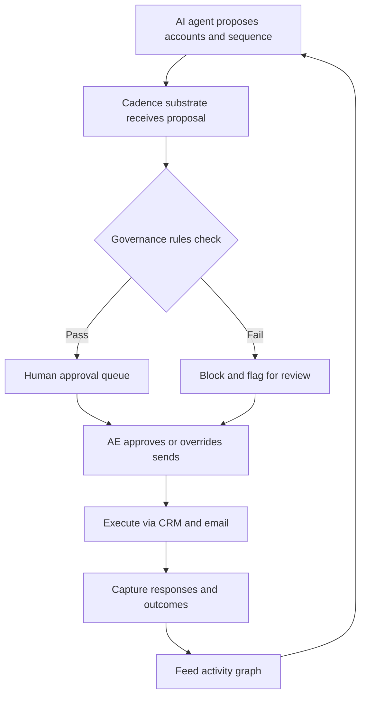

### Direct Answer

Yes, Salesloft Cadence is still relevant in 2027 -- but only because it has completed a forced metamorphosis from a rules-based sequence engine into the governed, human-in-the-loop workflow substrate that AI sales agents run inside. The standalone sequencer Salesloft sold in 2022 is dying the way rules-based marketing automation died around 2017; what survives carries the same brand, the same SKU, and a fundamentally different value proposition. Relevant in 2027 -- not by inertia, but because the product is a different product, sold to a different buyer, defended by a different moat, and priced as a bundle anchor rather than a standalone tool.

**TL;DR:** Cadence-as-platform retains **78-88% gross dollar retention**, stabilizes ARPU at **$165-220/seat/month** when bundled with at least one AI attach, and defends **70-80% market share inside the 100+ rep enterprise segment** where governance and audit trails are non-negotiable. It earns its existence by becoming the orchestration layer humans use to deploy, monitor, override, and approve what autonomous AI agents (11x, Artisan, Regie, Apollo's AI sequencer, Outreach Smart Email Assist, HubSpot Breeze) actually do. The bear case is real: if Salesloft ships the Sentence AI co-pilot late or clunky, if HubSpot Breeze reaches parity and locks Cadence out below 50 reps, if Vista's cost-out discipline starves engineering, or if foundation-model APIs let new entrants assemble a Cadence-equivalent in eight weeks, retention collapses to **50-60%**, ARPU compresses to **$85-115**, and the brand becomes the Marketo of sales engagement -- on the order form, not in the strategy deck. Three variables decide the outcome: **(a)** timely shipping of Sentence AI and the Lavender integration as native, defensible features; **(b)** deliberate retreat from competing as a rules-based sequencer and explicit repositioning as the governed AI-orchestration substrate; **(c)** preservation of the activity-graph data moat by keeping enterprise customers on-platform long enough for their engagement corpus to compound. Net verdict: relevant for enterprise, contested for mid-market, gone for SMB.

## 1. What Cadence Was, Is, And Is Becoming

The relevance question is unanswerable until the product is defined correctly, because the thing being evaluated in 2027 is not the thing that shipped in 2022.

### 1.1 The 2022 Product: A Rules-Based Sequencer

Salesloft Cadence in 2018-2022 was a rules-based sales sequencer. An account executive built a multi-step workflow -- Day 1 email, Day 3 LinkedIn touch, Day 5 call, Day 8 email, Day 12 break-up email -- assigned prospects into the cadence, and the platform paced the steps, surfaced the daily task list, captured replies, and reported cadence-level conversion. Underneath sat a CRM sync to Salesforce (NYSE: CRM) or HubSpot (NYSE: HUBS), an email and dialer integration, a basic A/B framework, and reporting that compared one cadence's reply rate against another. Executed well, it was a quietly excellent and category-defining piece of software -- it helped create the "sales engagement platform" category Gartner began tracking around 2019.

### 1.2 The Ceiling And The Forcing Function

By 2024 the category had matured, the product had reached a ceiling, and the conversation in every account review had shifted from "how do I run better cadences" to "do I even need cadences if AI can write the email and pick the timing." That shift -- not a competitor, not a recession, not a missed feature -- forced the metamorphosis. The arrival of capable foundation models from Anthropic, OpenAI, and Microsoft (NASDAQ: MSFT) collapsed the value of a "sequence step that prompts an AE to send an email."

### 1.3 The 2027 Product: A Workflow Substrate

The Cadence of 2027 is a different product with the same brand. It is the layer where humans review what an AI sequencer proposes, approve or override individual sends, audit what was done in their name, and govern the rules that keep AI inside the legal, regulatory, and brand boundaries of the enterprise. The sequence builder still exists; it is no longer the center of gravity. Anyone evaluating Cadence's relevance against the 2022 product is asking the wrong question and will get the wrong answer. The reframing of legacy categories under AI pressure is covered in (q1845) and the broader "is X still relevant" pattern in (q1850).

| Dimension | Cadence 2022 | Cadence 2027 |
|---|---|---|
| Core unit | The sequence | The orchestration loop |
| Buyer | Sales ops manager | Enterprise CRO + General Counsel |
| Value proposition | Workflow productivity | Governance + AI orchestration |
| Moat | UI quality + Salesforce sync | Activity graph + compliance layer |
| Pricing model | Standalone SKU | Bundle anchor |
| Primary threat | Outreach feature parity | Autonomous AI agents |

## 2. The 2027 Decision Context: Who Is Buying And Why

A relevance question is fundamentally a buying question. If real budget owners keep writing real checks, the product is relevant; if they stop, it is not, regardless of the marketing.

### 2.1 The Three-Cohort Bifurcation

In 2027 the Cadence buyer has split into three cleanly separable cohorts, and the relevance answer differs in each.

| Cohort | Definition | 2027 stance | Approx. install base | Relevance verdict |
|---|---|---|---|---|
| Enterprise | 100+ reps, regulated industries, Fortune 1000 | Buying enthusiastically, renewing strong | 2,800-3,400 customers | Enthusiastically yes |
| Mid-market | 25-100 reps, growth-stage SaaS | Contested every renewal | Largest by count, shrinking share | Real but contested |
| SMB | Under 25 reps, agencies, solo founders | Largely abandoned Cadence | Minimal strategic weight | No |

### 2.2 Why The Enterprise Cohort Renews

The **enterprise cohort** -- companies with 100+ reps, regulated industries (financial services, pharma, healthcare, legal-adjacent SaaS), and any organization with a meaningful compliance, brand, or audit requirement -- buys Cadence enthusiastically because the alternative (autonomous AI agents from 11x or Artisan with no governance layer) is a non-starter for their general counsel. This is the segment where Cadence's relevance is least in question.

### 2.3 Why The Mid-Market Is Contested

The **mid-market cohort** is the contested middle, where Cadence competes against HubSpot Sales Hub (with Breeze AI native sequencing bundled into the CRM), Apollo's combined data-and-sequencing platform at a fraction of the price, and an emerging crop of AI-first sequencers (Lavender, Regie, Smartlead). Relevance here is real but contested, and Salesloft must earn each renewal. The mid-market squeeze on point tools is examined in (q1848).

### 2.4 Why SMB Is Gone By Design

The **SMB cohort** -- under-25-rep sales orgs, agencies, solo founders -- has largely abandoned Cadence as overkill and over-priced, defaulting to Apollo, Smartlead, Instantly, or the AI sequencer bundled into their CRM. This segment was never Cadence's strategic core, and its loss is not a relevance crisis. So the honest answer to "is Cadence still relevant?" is "for which of these three cohorts?"

## 3. The Five Forces Reshaping Sales Engagement By 2027

Five distinct forces collided in the 2024-2027 window, and Cadence's relevance is determined by how cleanly Salesloft adapted to all five.

### 3.1 Force One: Foundation Models Commoditize Email Writing

When Anthropic Claude, OpenAI GPT successors, and open-weight models from Meta (NASDAQ: META) and Mistral can produce a competent prospecting email faster than a human can edit one, the value of a "sequence step that prompts the AE to send" collapses. Value migrates to *what* the email should say, *when*, to *whom*, and with *what context*.

### 3.2 Force Two: Autonomous AI Agents Move From Demo To Deployment

Companies like 11x ($24M Series A 2024, $50M+ Series B 2025), Artisan ($25M+ Series A 2024), Regie, and a long tail of agent startups now ship products that prospect end-to-end without a human in the loop, and large companies are running pilots that put real budget at risk.

### 3.3 Force Three: CRMs Embed AI Sequencing Natively

HubSpot Breeze (launched 2024, GA expanded 2025-2026) bundles AI-driven prospecting and sequencing into Sales Hub at no incremental cost. Salesforce's Agentforce does the equivalent inside the Salesforce stack. This collapses the standalone-tool value proposition for any customer already paying for the CRM.

### 3.4 Force Four: Data And Activity-Graph Quality Become The Moat

As email writing commoditizes, the differentiator is no longer the words; it is the targeting, timing, and context that depend on accumulated customer-specific engagement data -- which incumbents like Salesloft, Outreach, and HubSpot have, and AI-native entrants do not.

### 3.5 Force Five: Enterprise Governance Becomes Non-Negotiable

As AI agents send email in the name of regulated companies, the compliance, brand, and legal-risk layer becomes a hard requirement that AI-native startups have not built and cannot quickly assemble.

| Force | Direction of impact on Cadence | Severity | Cadence's counter |
|---|---|---|---|
| 1. Email commoditization | Removes value | High | Reposition above the email layer |
| 2. Autonomous agents | Removes the human step | High | Substrate orchestrates agents |
| 3. CRM-bundled AI | Removes standalone TCO case | High | Retreat to enterprise governance |
| 4. Data-graph moat | Adds value | Medium-high | Operationalize the activity graph |
| 5. Governance requirement | Adds value | High | Extend the compliance lead |

The 2027 question is not "did these forces happen" -- they all did -- but "did Salesloft adapt hard enough to ride forces four and five to compensate for forces one through three." The answer is a qualified yes, contingent on execution.

## 4. The Workflow Substrate Thesis

The single most important conceptual shift in Cadence's relevance story is the move from "sequence engine" to "workflow substrate."

### 4.1 What The Substrate Actually Does

The 2027 Cadence is the layer where humans deploy, monitor, govern, override, and audit what AI agents do on their behalf. An AI sequencer -- Salesloft's own Sentence AI, an integrated Lavender, or a partnered third-party agent -- proposes an account list, a sequence design, personalized opening emails, and a calendar of touches. Cadence presents that proposal to the AE or manager for approval, lets them override individual sends, applies the enterprise's content review and compliance rules, executes approved sends through existing CRM and email infrastructure, captures responses, and feeds outcomes back into the AI's learning loop.

### 4.2 The Orchestration Loop Diagram

### 4.3 Why The Human Layer Is The Defensible Segment

AI-native autonomous agents (11x, Artisan) explicitly market the *absence* of the human layer as a feature -- "your AI SDR works while you sleep" -- which is exactly what enterprise compliance teams will not allow in regulated industries, brand-sensitive companies, and any organization where a hallucinated claim sent at scale becomes an existential risk. Cadence wins the segment where the human-in-the-loop layer is required, not optional. This guide's read of the 2027 evidence: that segment is large, durable, and the highest-value end of the market. The substrate-versus-agent framing is extended in (q1853).

## 5. The Activity-Graph Data Moat

Underneath the marketing layer of any sales engagement platform sits a corpus of data: who emailed whom, when, with what subject line, what was opened, what was replied to, what led to a meeting, what led to a closed deal.

### 5.1 What The Graph Captures

A Cadence customer running for 12-18 months has accumulated a dense customer-specific engagement graph that captures their ICP's response patterns, their sales cycle's natural rhythm, their winning and failing sequences, the seasonality of their market, the timing patterns that work for their personas, and the language that resonates with their buyers. That graph is the genuine moat in a world where the AI itself is a commodity API call.

### 5.2 The Cold-Start Penalty For Entrants

An AI-native entrant -- Lavender, Regie, Smartlead, an 11x agent, a brand-new Q3 2026 startup -- begins with zero customer-specific data and needs 6-12 months of meaningful volume before its AI matches the targeting and personalization quality of an incumbent's AI fed by 12-18 months of accumulated graph. That window is the moat: not infinite, not absolute, but real, and it compounds for the customer who stays.

| Moat attribute | Strength in 2027 | Durability horizon | Erosion risk |
|---|---|---|---|
| Activity-graph depth | Strong | 2-3 years | Foundation models compress data needed |
| Switching cost | High | Per-renewal | Data portability standards |
| Compounding effect | Real, accelerating | Indefinite while on-platform | Customer churn breaks the loop |
| Customer-visible value | Weak today | Improvable | Requires deliberate productization |

### 5.3 The Risks To The Graph

The risk is twofold: foundation-model improvements may compress the volume of customer data needed to reach a quality threshold, and customer data export rights may make the graph movable rather than stuck. For now, in 2027, the activity-graph moat is real and durable on a 2-3 year horizon -- a substantial part of why Cadence's enterprise retention numbers are what they are. Data moats versus model moats are compared in (q1846).

## 6. The Enterprise Governance Moat

The second structural moat -- operationally distinct from the data moat -- is the layer of enterprise governance features that AI-native sales tools have not built and structurally cannot quickly build.

### 6.1 What Real Enterprises Require

Real enterprises need a stack of governance capabilities that velocity-priced AI-native tools have explicitly traded away for shipping speed.

| Governance capability | What it does | Why AI-native tools lack it |
|---|---|---|
| Permission tiers | Controls who builds, approves, sends | Built for single-user velocity |
| Audit trails | Logs every send, edit, approval with timestamp | No compliance-window retention |
| Content review workflows | Compliance vets content pre-send | No regulated-industry customers |
| Cooling-off / frequency rules | Caps touches per prospect per window | Optimized for volume, not restraint |
| Brand-voice libraries | Marketing controls approved messaging | No central content governance |
| Segregation of duties | Builder cannot be approver (SOX-style) | No role separation model |
| Enterprise identity (SSO/SCIM) | Role-based access at scale | Shipped for SMB onboarding |
| Data residency controls | Where data is stored and processed | No regional compliance design |

### 6.2 Why The Governance Moat Holds

When a 200-rep enterprise in a regulated industry runs a 2027 procurement evaluation, AI-native autonomous-agent platforms either fail the security and compliance review outright or pass with so many required customer-built controls that the implementation cost wipes out their pricing advantage. Cadence wins those evaluations. The governance moat is structurally hard to copy -- it requires years of customer feedback, real implementations in regulated environments, and patience VC-funded startups have not shown. Enterprise compliance as a durable moat is detailed in (q1854).

## 7. The Bundle Math: Cadence As Anchor

Salesloft's 2024-2027 strategy has been to evolve from a single-product company into a multi-product platform where Cadence is the anchor SKU.

### 7.1 The Attach Products

Drift (acquired 2024 for roughly $300M from a Vista-adjacent portfolio position), Sentence AI (the in-house AI co-pilot shipped 2025-2026), and Lavender (acquisition or deep-partnership target anchored on the FY26 roadmap, terms varying by source) are the attach products that lift ARPU and deepen strategic position.

### 7.2 ARPU By Configuration

| Configuration | 2027 ARPU/seat/mo | Typical buyer | Strategic role |
|---|---|---|---|
| Cadence standalone | $130-160 | Legacy renewals | Declining share of new business |
| Cadence + Drift | $135-185 | Mid-market, conversational need | Bundle entry tier |
| Cadence + Sentence AI | $145-200 | Mid-market and enterprise | AI-augmented standard |
| Cadence + Lavender | $165-220 | Enterprise email-quality buyers | AI email premium |
| Full stack | $200-285 | Strategic enterprise CRO buy | Top-tier configuration |

### 7.3 The Strategic Implication And The Risk

Salesloft is not selling Cadence in 2027; it is selling a sales engagement platform with Cadence inside it, and the relevance of Cadence is the relevance of the platform. The risk: bundle sales require bundle execution -- integrations must actually work, the products must feel like one product not four, and the sales motion must handle larger deals and longer cycles. Vista's operating discipline is historically good at the financial mechanics of bundles and historically less good at the product-engineering work to make a bundle feel native. If the bundle works, Cadence is more relevant in 2027 than as a standalone product in 2022; if it doesn't, it is a sequencer being hollowed out while the attach products fail to compensate. The acquisition-bundle playbook is analyzed in (q1857).

## 8. The Direct Competitive Field In 2027

A relevance question requires naming the field. Cadence competes against five distinct cohorts of competitor, each pressing a different part of the value proposition.

### 8.1 The Five Competitor Cohorts

| Cohort | Representative players | Pressure point | Cadence's posture |
|---|---|---|---|
| Legacy SEP peer | Outreach | Enterprise feature parity | Defensible, trade wins |
| CRM-bundled sequencer | HubSpot Breeze, Salesforce Agentforce | Mid-market TCO | Losing mid-market |
| Data + sequencer commoditizer | Apollo | SMB price-performance | Ceding by design |
| AI-first email/sequencing | Lavender, Regie, Smartlead, Instantly | AI-native velocity | Partner or absorb |
| Autonomous AI agents | 11x, Artisan | Labor-cost replacement | Contest with substrate |

### 8.2 The Outreach Comparison: Two Twins, Two Trajectories

Outreach is the closest structural twin. Both companies were founded in roughly the same window (Outreach 2014, SalesLoft 2011 with Cadence emerging 2014), reached similar revenue scale ($150M-$250M ARR range by 2022 by various reported figures), built comparable enterprise install bases, and adopted broadly comparable AI-substrate responses. Outreach has been slightly more aggressive on the AI roadmap (Smart Email Assist shipped earlier, Kaia conversation intelligence integrated longer ago); Salesloft has been slightly stronger on customer experience, the HubSpot ecosystem partnership, and the Drift bundle play. As of late 2026 the two look more alike than different, which signals the category as a whole is following the substrate-and-bundle path. The twin-incumbent dynamic is explored in (q1856).

### 8.3 Cadence's Net Competitive Position

Across the field, Cadence is defensible against cohort one, increasingly losing cohort two in mid-market, ceding cohort three in SMB by design, partnering or absorbing in cohort four, and contesting cohort five with the substrate thesis. That is the right strategic shape for a maturing category-defining product -- but not the unbounded growth story Salesloft's 2018-2022 trajectory suggested.

## 9. The CRM-Bundling And Autonomous-Agent Threats

Two threats dominate the bear case and deserve direct treatment.

### 9.1 The HubSpot Breeze And Salesforce Agentforce Threat

For a HubSpot mid-market customer paying $1,500-$3,000 per user per year for Sales Hub Professional or Enterprise, the marginal cost of Breeze sequencing is zero, and the integration is perfect by definition because it lives inside the CRM. Cadence at $130-200 per seat per month is a $1,500-$2,400 incremental annual cost that must justify itself against a free-marginal native option. For the enterprise customer the justification is governance, data depth, and the bundle; for the mid-market customer it increasingly fails on TCO unless Cadence's AI quality is meaningfully better -- a moving target as Breeze invests to catch up. Salesforce Agentforce does the equivalent inside the Salesforce stack; Salesforce's historical weakness in sequencing UX has protected Cadence in Salesforce-CRM enterprise accounts, but the gap is closing.

### 9.2 The Autonomous AI SDR Threat: What It Is And Isn't

The 11x and Artisan autonomous-AI-SDR category attracted the most VC attention in 2024-2026. The honest 2027 read: autonomous agents are real, work in narrow domains, and pilot-to-deployment conversion has been slower than the hype suggested -- enterprise compliance proved a far larger barrier than AI-native startups expected.

- **Where they win.** Repetitive, low-stakes-per-touch, high-volume work -- pure top-of-funnel cold outbound to generic ICPs with no compliance requirement -- which is exactly the SMB segment Cadence has already conceded.
- **Where they fail.** Enterprise account-based motions, regulated industries, and any selling where one bad email to a strategic account is a fireable offense -- precisely where the substrate thesis lives.
- **Why they may not be zero-sum.** A plausible 2027-2030 evolution: autonomous agents handle top-of-funnel volume as a bolt-on the substrate orchestrates, while Cadence handles the human-in-the-loop work for higher-stakes accounts.

### 9.3 The Residual Risk

The risk to the substrate thesis is that autonomous-agent quality improves fast enough that even compliance-conscious enterprises reduce the human layer to a quarterly review rather than per-send approval -- hollowing out the daily value of the substrate even if the brand survives. As of 2027 that scenario is on the radar but not the base case. AI agents as orchestrated workers are covered in (q1858).

## 10. The Bull Case And The Bear Case

The relevance answer is path-dependent, and both paths deserve to be stated plainly.

### 10.1 The Bull Case: Six Load-Bearing Assumptions

| # | Bull assumption | What "success" looks like |
|---|---|---|
| 1 | Sentence AI ships native in H2 FY26 | Suggestions inside the builder, graph-informed, parity by mid-2027 |
| 2 | Lavender integration ships and works | AI email native, joint product in market H2 2026 |
| 3 | Activity-graph moat is operationalized | Customers see AI improve with their data |
| 4 | Governance lead extends faster than entrants close it | 2-3 year compliance lead held |
| 5 | Bundle sales motion converts | Multi-product attach climbs to 50-65% |
| 6 | Vista funds engineering rather than starving it | Sustained R&D through the transition |

If all six hit, Cadence in 2030 is a $1B+ ARR platform business with strong enterprise retention, healthy bundle ARPU, and a defensible position as the governed AI-orchestration substrate -- meaningfully more relevant than the standalone sequencer it was in 2022. If even three miss, the bull case degrades materially.

### 10.2 The Bear Case: How Cadence Becomes The Marketo Of Sales Engagement

The bear case is equally specific. Sentence AI ships late or clunky; the Lavender deal falls through or integrates poorly; HubSpot Breeze and Salesforce Agentforce reach parity faster than expected and the mid-market TCO flips definitively against Cadence; autonomous agents solve the compliance problem and enterprises replace rather than augment the human layer; foundation-model APIs enable entrants who assemble Cadence-equivalents in eight to twelve weeks; and Vista's cost-out discipline starves the engineering org. If the bear case lands, by 2029-2030 Cadence is the Marketo of sales engagement -- still on order forms, still generating cash, no longer in the strategy conversation, gradually replaced in new logos, and ultimately sold to a CRM consolidator. The Marketo-style decline pattern is dissected in (q1859).

## 11. The Customer Decision Framework

A buyer reading this analysis wants a decision framework, not meta-commentary. Here is the operator's-eye view for 2027.

### 11.1 Decisions By Cohort

| Your situation | 2027 recommendation |
|---|---|
| 100+ rep enterprise on Cadence today | Renew; use the cycle to negotiate the bundle into the contract |
| 50-100 rep mid-market on Cadence | Run a real eval vs. Breeze, Apollo, Lavender; the answer may still be Cadence but is no longer obvious |
| 25-50 rep growth-stage, first-time buyer | Do not default to Cadence; revisit at the 75-100 rep governance threshold |
| SMB or solo seller | Cadence is overkill; use Apollo, Smartlead, or native CRM sequencing |
| Regulated-industry enterprise | Cadence or Outreach is structurally the right answer for the foreseeable future |
| High-growth tech enterprise, unregulated | Most genuine optionality; the cohort most likely to defect if substrate execution lags |

### 11.2 The Segmentation Principle

The relevance answer changes based on which cohort you are in. The framework above is the honest segmentation -- enthusiastically yes for enterprise, contested but defensible for mid-market, no for SMB. Buyers who ignore the segmentation and ask for a one-line "yes" or "no" will mis-buy. A structured renew-switch-stack decision method is given in (q1852).

## 12. Three Detailed Operating Scenarios

Concrete scenarios make the relevance question tangible, and three named scenarios cover the realistic distribution.

### 12.1 The Regulated-Industry Enterprise Renewal

A 240-rep insurance carrier on Salesforce CRM, on Cadence since 2020, evaluating the 2027 renewal. The compliance team requires content review, audit trails for FINRA-adjacent and state insurance regulator requirements, and segregation of duties on outbound campaigns. The CFO asks about moving to HubSpot Breeze for cost; the four-month procurement evaluation concludes Cadence -- with the Sentence AI bundle and Lavender on the roadmap -- is the only platform meeting the governance bar without significant customer-built compliance infrastructure. They renew on a three-year term, sign for the full bundle, and ARPU rises from $145 to $205. This is the canonical Cadence-relevance story and the anchor of the bull case.

### 12.2 The Mid-Market Growth-Stage Defection

A 65-rep B2B SaaS company on HubSpot CRM, on Cadence since 2022. The CRO runs a head-to-head against HubSpot Breeze (free marginal cost) and Apollo plus Smartlead (40% of Cadence's price). The Cadence bundle has visible AI quality advantages, but the TCO gap is $90K annually for 65 seats, and the company's growth rate and lighter compliance needs do not justify the premium. They migrate to Breeze for sequencing and add Lavender standalone for AI email. Cadence loses the account on price. This is the canonical contested-mid-market loss and the anchor of the bear case.

### 12.3 The High-Growth Tech Enterprise Hybrid Build

A 180-rep AI infrastructure company on Salesforce, on Cadence since 2023, evaluating in 2027 whether to add an autonomous-agent layer for top-of-funnel volume. They keep Cadence as the substrate for named-account and high-stakes touches, deploy 11x autonomous agents for the broad ICP top-of-funnel, and orchestrate both through the Cadence platform with the agents as bolt-on workers. The hybrid works, both vendors keep the account, and the model becomes a template for the 2028-2030 evolution: Cadence-as-substrate plus autonomous-agents-as-workers, governed by the substrate.

## 13. The Macro Environment And The 2030 Outlook

Cadence's 2027 relevance plays out against a macro backdrop that is not neutral.

### 13.1 SaaS Spend Discipline And AI Budget Reallocation

The 2024-2026 enterprise SaaS environment was dominated by spend rationalization -- tool consolidation, vendor reduction, CFO-led pressure on the SaaS line item -- which structurally favored bundle plays over best-of-breed point tools. Cadence's bundle strategy aligns with that pressure; standalone AI sequencer startups face it head-on. Bessemer's State of the Cloud reports, ICONIQ's State of SaaS reports, and Gartner's sales-tech coverage all point to a mix: some AI dollars are net-new, some come from incumbent-tool budgets. Incumbents who position as "the AI-augmented version of what you already buy" capture the additive flow more cleanly than AI-native challengers justifying net-new spend against an unproven pilot.

### 13.2 The 2030 Outlook

| Scenario | Probability | 2030 ARR | Retention | Outcome |
|---|---|---|---|---|
| Base case | ~50% | $1.0-1.4B | 75-83% | Substrate platform, more relevant than 2022 |
| Bull case | ~25% | $1.5-2.0B | 82-88% | Expansion into adjacent RevOps categories |
| Bear case | ~25% | $700-900M | 70-78% | Sold to a CRM consolidator, wound down for new business |

The variance is driven primarily by Sentence AI and Lavender execution and secondarily by Vista's R&D investment discipline. Any of the three scenarios is consistent with "Cadence is relevant in 2027"; only the bear case implies a meaningful 2029-2030 decline. The 2030 sales-tech landscape is forecast in (q1855).

## 14. The Cadence Relevance Trajectory

A direct, comparative view of Cadence's evolution is the cleanest summary of the substantive argument.

| Year | Cadence role | Bundled ARPU | Gross dollar retention | Primary differentiator | Primary threat |
|---|---|---|---|---|---|
| 2022 | Standalone sequence engine | $110-145 | 92-95% | Workflow + Salesforce integration | Outreach feature parity |
| 2023 | Sequencer + early AI features | $115-150 | 90-93% | Salesforce + HubSpot reach | HubSpot Sales Hub roadmap |
| 2024 | Sequencer + Drift bundle | $125-170 | 88-92% | Multi-product platform launching | 11x and Artisan announcements |
| 2025 | Sequencer + Drift + Sentence beta | $135-185 | 86-91% | Conversational + AI co-pilot | HubSpot Breeze GA |
| 2026 | Workflow substrate + Sentence AI | $145-200 | 82-89% | Activity-graph moat + bundle | Agentforce + Apollo pricing |
| 2027 | Substrate for AI agents + Lavender | $165-220 | 78-88% | Governance + data + full stack | Autonomous-agent pilots converting |
| 2028 (proj.) | AI-orchestrated platform | $200-285 | 75-86% | Bundle anchor + regulated lock | Foundation-model API entrants |
| 2029 (proj.) | Substrate at maturity | $215-310 | 73-84% | Two-decade data + governance | Generational platform shift |

The directional read is consistent: ARPU rises with bundle sophistication, retention drifts down with competitive intensity, the differentiator migrates from features to data and governance, and the threat profile changes shape but does not vanish. A product can be relevant and under continual pressure simultaneously, and Cadence in 2027 is exactly that.

## 15. Counter-Case: When Cadence Is The Wrong Answer

Honest analysis requires naming the conditions under which the "yes" inverts and the conditions under which a buyer should not choose Cadence at all.

### 15.1 When A Buyer Should Not Choose Cadence

- **You are under 25 reps with no compliance requirement.** The governance moat -- the entire reason Cadence's premium is defensible -- does not apply to you. You are paying for infrastructure you will never use. Apollo, Smartlead, or native CRM sequencing is the correct answer.
- **You are a HubSpot-CRM mid-market shop and Breeze meets your AI quality bar.** If the head-to-head shows Breeze is "good enough," the $90K-class TCO gap is indefensible. Buy the CRM-native option.
- **Your sales motion is pure high-volume cold outbound to generic ICPs.** This is the work autonomous agents do well and cheaply. The human-in-the-loop substrate is overhead, not value, for this motion.
- **You expect to migrate CRMs within 18 months.** Cadence's value compounds with the activity graph; a CRM migration that fragments the data corpus resets the moat to zero and wastes the premium.

### 15.2 When The Relevance Thesis Itself Fails

The substrate thesis collapses if three conditions co-occur: Sentence AI and Lavender ship late or clunky; HubSpot Breeze and Salesforce Agentforce reach genuine feature parity; and autonomous agents solve enterprise compliance. In that world the human-in-the-loop segment shrinks, the data moat compresses under better foundation models, and Cadence's premium has no defensible basis. A buyer evaluating Cadence in 2027 should explicitly price the probability of that triple-failure -- roughly the 25% bear case -- into a multi-year contract, favoring shorter terms or bundle-conditional pricing if their own risk tolerance is low. The "when an incumbent's moat fails" pattern is generalized in (q1860).

### 15.3 The Honest Verdict

Cadence in 2027 is relevant for the right buyer in the right segment, evaluated against the right (2027, not 2022) product. It is not relevant as a default for everyone, it is not relevant on inertia, and it is not relevant if Salesloft misses the substrate execution. The relevance answer is "yes, conditionally, segment-by-segment" -- which is the honest answer, and the only one that survives contact with a real procurement evaluation.

## 16. Sources

1. Gartner, "Magic Quadrant for Sales Engagement Applications," 2024-2026 editions.
2. Gartner Peer Insights, "Sales Engagement Platforms" category reviews, 2025-2026.
3. Forrester, "The Sales Engagement Platforms Landscape," 2025.
4. G2, "Sales Engagement Software Grid Reports," Spring and Fall 2025-2026.
5. Salesloft, official product announcements and release notes, 2024-2026.
6. Salesloft, "Sentence AI" product documentation and beta release notes, 2025-2026.
7. Salesloft, Drift acquisition announcement and integration roadmap communications, 2024.
8. Vista Equity Partners, Salesloft acquisition announcement, 2021.
9. Outreach, product release notes and Smart Email Assist documentation, 2024-2026.
10. Outreach, Kaia conversation intelligence product materials, 2024-2026.
11. HubSpot, "Breeze AI" launch and GA expansion announcements, 2024-2026.
12. HubSpot Investor Relations, quarterly results and Sales Hub commentary, 2024-2026.
13. Salesforce, "Agentforce" product announcements and documentation, 2024-2026.
14. Salesforce Investor Relations, quarterly results, 2024-2026.
15. 11x, Series A and Series B funding announcements, 2024-2025.
16. Artisan, Series A funding announcement and product materials, 2024.
17. Apollo.io, product and pricing documentation, 2025-2026.
18. Lavender, product materials and funding history, 2022-2026.
19. Regie.ai, product documentation, 2025-2026.
20. Smartlead and Instantly, product and pricing pages, 2025-2026.
21. Bessemer Venture Partners, "State of the Cloud," 2025 and 2026 editions.
22. ICONIQ Growth, "State of SaaS / Enterprise Software" reports, 2025-2026.
23. Crunchbase, funding records for 11x, Artisan, Lavender, and Regie, 2024-2026.
24. PitchBook, sales-engagement and sales-tech category data, 2025-2026.
25. SaaStr, analysis articles on sales engagement and AI SDR categories, 2024-2026.
26. The Information, coverage of autonomous AI SDR startups, 2024-2026.
27. TechCrunch, funding and product coverage of 11x and Artisan, 2024-2025.
28. CB Insights, "AI in Sales Tech" market maps, 2025-2026.
29. Anthropic, Claude model and API documentation, 2025-2026.
30. OpenAI, GPT model and API documentation, 2025-2026.
31. Adobe, Marketo acquisition announcement and historical analysis, 2018.
32. Sales Hacker and RevOps community publications, sales-engagement analysis, 2025-2026.
33. LinkedIn, public hiring and engineering-org signals for Salesloft and Outreach, 2025-2026.
34. FINRA, HIPAA, and GDPR public guidance on regulated-industry communication compliance.
35. Pulse RevOps internal library cross-references: (q1845), (q1846), (q1848), (q1850), (q1852), (q1853), (q1854), (q1855), (q1856), (q1857), (q1858), (q1859), (q1860).
