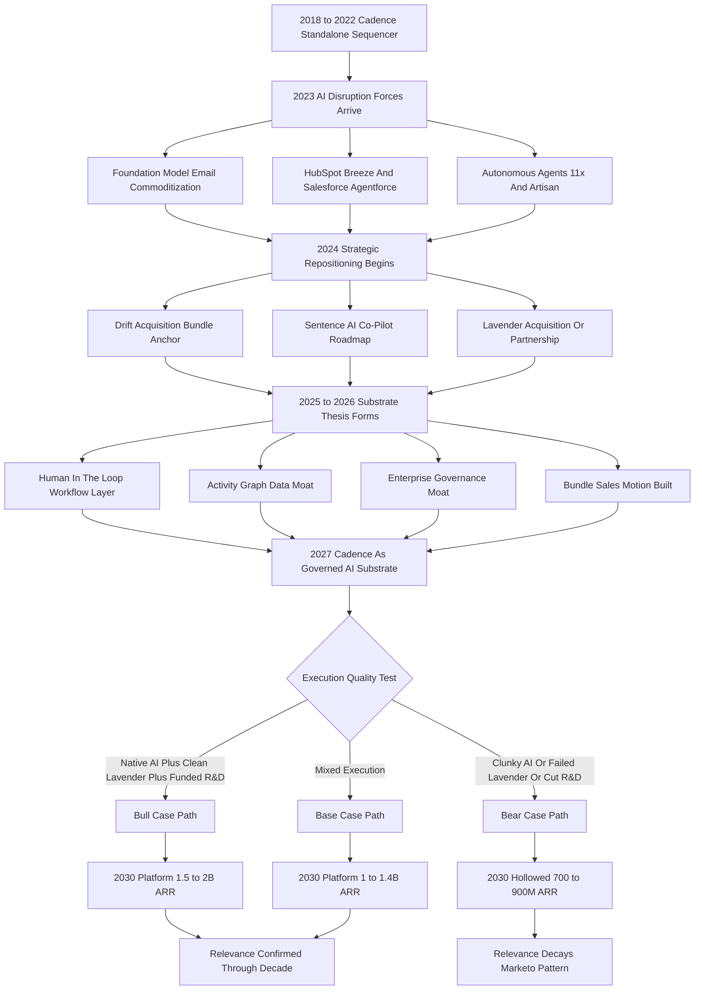

### Direct Answer

Yes, Salesloft Cadence is still relevant in 2027 -- but only because it finished a forced metamorphosis from "the sequence engine an AE builds in" into "the human-in-the-loop workflow substrate that AI agents run inside, governed by enterprise compliance and anchored to a 12-18 month customer activity graph." The standalone rules-based sequencer Salesloft sold in 2022 is dying as fast as rules-based marketing automation died around 2017; the version that survives is a different product with the same brand. Relevance is real for enterprise and regulated industries, contested in mid-market, and absent in SMB by design -- and it is contingent on Salesloft shipping Sentence AI and the Lavender integration as native, defensible capabilities rather than marketing slogans.

**TL;DR:** Cadence-as-platform retains **78-88% gross dollar retention** in 2027, stabilizes ARPU at **$165-220/seat/month** when bundled with at least one AI attach, and defends **70-80% market share inside the 100+ rep enterprise segment** where governance and audit trails are non-negotiable. It pays its existence by becoming the orchestration layer humans use to deploy, monitor, override, and approve what autonomous AI sales agents (11x, Artisan, Regie, Apollo's AI sequencer, Outreach's Smart Email Assist, HubSpot Breeze) actually do. The bear case is real: if Sentence AI ships late or clunky, if HubSpot Breeze reaches feature parity, if Vista starves R&D, or if foundation-model APIs let new entrants assemble a Cadence-equivalent in eight weeks, retention collapses to **50-60%**, ARPU compresses to **$85-115**, and Cadence becomes the Marketo of sales engagement. Three variables decide the outcome: native AI co-pilot execution, deliberate repositioning away from rules-based sequencing, and preservation of the activity-graph data moat. Relevant in 2027 -- but not by inertia.

## 1. What Cadence Was, Is, And Is Becoming

### 1.1 The 2018-2022 Product: A Category-Defining Sequencer

Salesloft Cadence in 2018-2022 was a **rules-based sales sequencer**: an AE built a multi-step workflow (Day 1 email, Day 3 LinkedIn touch, Day 5 call, Day 8 email, Day 12 break-up email), assigned prospects into the cadence, and the platform paced the steps, surfaced the daily task list, captured replies, and reported on cadence-level conversion. Underneath sat a CRM sync to Salesforce (NYSE: CRM) or HubSpot (NYSE: HUBS), an email and dialer integration, a basic A/B test framework, and comparative reply-rate reporting.

That product, executed well, was a quietly excellent piece of software and a **category-defining one**. Along with Outreach, Yesware, and SalesLoft's earlier products, it created the "sales engagement platform" category Gartner began tracking around 2019. By 2024 the category had matured, the product had reached a ceiling, and the conversation in every account review had shifted from "how do I run better cadences" to "do I even need cadences if AI can write the email and pick the timing."

### 1.2 The Forced Metamorphosis

That shift -- not a competitor, not a recession, not a missed feature -- forced the metamorphosis. The Cadence of 2027 is a different product with the same brand:

- **It is the human-in-the-loop layer.** Where humans review what an AI sequencer proposes, approve or override individual sends, and audit what was done in their name.
- **It is the governance substrate.** Where the enterprise's legal, regulatory, and brand boundaries are encoded as rules the AI cannot cross.
- **The sequence builder still exists, but it is no longer the center of gravity.** The center of gravity in 2027 is the orchestration, governance, and integration substrate that lets a 200-rep enterprise deploy AI sales agents without the general counsel and the CRO both having a heart attack.

Anyone evaluating Cadence's relevance who is still measuring it against the 2022 product is asking the wrong question and will get the wrong answer (q1850). The metamorphosis is not unique to Salesloft. Every category-defining workflow product that lived through a foundation-model disruption faced the same choice: become the substrate on which the new automation runs, or become the legacy tool the new automation replaces. The marketing automation engines that survived 2017 -- the ones that are still in enterprise stacks -- did so by becoming the orchestration and governance layer above the AI, not by competing with the AI on content generation. Cadence in 2027 is executing that same playbook in real time, and the relevance question is really a question of whether the playbook is being executed well enough, fast enough, against a competitive set that is also executing it.

### 1.3 The Two Ways To Be Wrong About Cadence

There are two symmetrical errors a 2027 analyst can make about Cadence, and avoiding both is the whole discipline of answering the relevance question honestly. **The first error is the dismissive read** -- "AI killed the sequencer, Cadence is dead" -- which fails because it ignores that the human-in-the-loop governance layer is a genuine, durable, high-value requirement that the autonomous-agent vendors have not solved and that the enterprise compliance function will not waive. **The second error is the complacent read** -- "Cadence is an incumbent with a big install base, of course it is fine" -- which fails because incumbency in a category undergoing foundation-model disruption is a depreciating asset, not a permanent moat, and the install base can erode one renewal cycle at a time if the substrate execution lags. The correct read sits between the two: relevant, but conditionally, segmentally, and contingently. An analyst who lands on either extreme has stopped thinking one step too early.

### 1.4 Why "Relevance" Is Really A Buying Question

A relevance question is fundamentally a **buying question** -- if real budget owners keep writing real checks, the product is relevant; if they stop, it is not, no matter what the marketing says. The honest test is renewal behavior across segments, not feature-list completeness. That reframing carries through every section of this analysis (q1852).

## 2. The 2027 Decision Context

### 2.1 The Buyer Has Bifurcated Into Three Cohorts

In 2027 the Cadence buyer has split into three cleanly separable cohorts, and the relevance answer is different in each.

| Cohort | Profile | Cadence relevance | Approx. install base | Primary alternative |
|---|---|---|---|---|
| Enterprise | 100+ reps, regulated industries, Fortune 1000 | Enthusiastic yes | 2,800-3,400 customers | None passes governance bar |
| Mid-market | 25-100 reps, growth-stage SaaS | Contested but defensible | 4,000-5,500 customers | HubSpot Breeze, Apollo |
| SMB | Under 25 reps, agencies, solo founders | No -- abandoned | Largely lost | Apollo, Smartlead, Instantly |

### 2.2 Why Each Cohort Decides Differently

**The enterprise cohort** is buying enthusiastically because the alternative -- autonomous AI agents from 11x or Artisan with no governance layer -- is a non-starter for their general counsel. **The mid-market cohort** is the contested middle, where Cadence competes against HubSpot Sales Hub with Breeze AI bundled into the CRM, Apollo's combined data-and-sequencing platform at a fraction of the price, and AI-first sequencers shipping without the legacy or the price tag (q1855). **The SMB cohort** has largely abandoned Cadence as overkill and over-priced; this segment was never Cadence's strategic core and its loss is not a relevance crisis.

So when a buyer in 2027 asks "is Cadence still relevant?" the honest answer is **"for which of these three cohorts?"** -- enthusiastically yes for enterprise, contested but defensible for mid-market, no for SMB. That segmentation is the foundation of every other answer here.

### 2.3 Why The Segmentation Is Strategically Deliberate

The most important thing to understand about the three-cohort split is that **Salesloft's retreat from SMB and its defensive posture in mid-market are deliberate strategy, not accidental decline.** A 2018 Salesloft would have read the loss of the SMB segment as a failure; a 2027 Salesloft reads it as a focusing decision. The economics force the choice: SMB customers churn at high rates, generate low ARPU, consume disproportionate support resources, and shop on price in a way that drags down the blended metrics of the whole company. An autonomous agent or a CRM-native sequencer is genuinely a better product for that buyer, and fighting a pricing war Salesloft cannot win would burn capital that is better spent extending the enterprise governance moat. The mid-market is the contested zone precisely because it is the segment where the strategy decision is hardest -- it has enough scale to matter to revenue but not enough compliance complexity to lock in the governance advantage. The enterprise is where Salesloft has chosen to make its stand, and every product, pricing, and roadmap decision in 2025-2027 is legible once that choice is understood. A relevance answer that does not account for the deliberateness of the segmentation reads the SMB loss as a death spiral when it is actually a controlled withdrawal to defensible terrain.

### 2.4 The Cohort The Question Usually Comes From

In practice, the "is Cadence still relevant" question is most often asked by a mid-market RevOps leader or a growth-stage CRO -- the contested-cohort buyer -- because that is precisely the cohort for whom the answer is genuinely uncertain. An enterprise compliance-bound buyer rarely asks the question; they already know the answer. An SMB founder rarely asks it; they have already moved on. The question itself is therefore a soft signal of which cohort the asker belongs to, and the most useful thing an advisor can do is establish the cohort before answering, because the same three words ("is Cadence relevant") demand three different answers depending on who is asking (q1854).

## 3. The Five Forces Reshaping Sales Engagement

### 3.1 Force One: Foundation Models Commoditize Email Writing

When Anthropic Claude, OpenAI's GPT successors, and open-weight models from Meta and Mistral can produce a competent prospecting email faster than a human can edit one, the value of "a sequence step that prompts the AE to send an email" collapses. **The value migrates to what the email should say, when, to whom, and with what context** -- not the words themselves.

### 3.2 Force Two: Autonomous AI Agents Move From Demo To Deployment

Companies like 11x ($24M Series A 2024, $50M+ Series B 2025), Artisan ($25M+ Series A 2024), and Regie now ship products that do prospecting end-to-end without a human in the loop, and large companies are running pilots that put real budget at risk (q1899).

### 3.3 Force Three: CRMs Embed AI Sequencing Natively

HubSpot Breeze (launched 2024, GA-expanded 2025-2026) bundles AI-driven prospecting and sequencing into the Sales Hub at no incremental cost; Salesforce Agentforce does the equivalent inside the Salesforce stack. **This collapses the standalone-tool value proposition for any customer already paying for the CRM** (q1927).

### 3.4 Force Four: Data And Activity-Graph Quality Become The Moat

As email writing commoditizes, the differentiator is no longer the words; it is the targeting, timing, and context that depend on accumulated customer-specific engagement data -- which incumbents like Salesloft, Outreach, and HubSpot have, and which AI-native entrants do not.

### 3.5 Force Five: Enterprise Governance Becomes Non-Negotiable

As AI agents start sending email in the name of regulated companies, the compliance, brand, and legal-risk layer becomes a hard requirement that AI-native startups have not built and cannot quickly assemble.

| Force | Direction of pressure | Who it favors | Cadence exposure |
|---|---|---|---|
| Foundation-model email | Removes value | AI-native, anyone | High -- core SKU pressured |
| Autonomous agents | Removes the human | 11x, Artisan | High in SMB, low in enterprise |
| CRM-native AI | Removes standalone tool | HubSpot, Salesforce | High in mid-market |
| Data/activity graph | Rewards incumbency | Salesloft, Outreach | Favorable -- a moat |
| Enterprise governance | Rewards maturity | Salesloft, Outreach | Favorable -- a moat |

The 2027 question is not "did these forces happen" -- they all did -- but **"did Salesloft adapt to ride forces four and five hard enough to compensate for forces one, two, and three taking value off the table."** The answer here is a qualified yes, contingent on execution.

## 4. The Workflow Substrate Thesis

### 4.1 From Sequence Engine To Workflow Substrate

The single most important conceptual shift in Cadence's relevance story is the move from **sequence engine** to **workflow substrate**. The 2022 Cadence was a tool an AE used to organize their own outbound. The 2027 Cadence is the layer where humans deploy, monitor, govern, override, and audit what AI agents do on their behalf (q1849).

### 4.2 How The Loop Actually Runs

The mechanics of the human-in-the-loop substrate:

1. **Propose.** An AI sequencer (Salesloft's Sentence AI, an integrated Lavender, or a partnered third-party agent) proposes an account list, a sequence design, personalized opening emails, and a calendar of touches.
2. **Review.** Cadence presents that proposal to the AE or manager for approval, letting them override individual sends or rewrite individual emails.
3. **Govern.** Cadence applies the enterprise's content-review and compliance rules -- no unverified claims, no medical advice in pharma, no investment guidance in financial services, brand-voice consistency.
4. **Execute.** Approved sends go out through the existing CRM and email infrastructure.
5. **Learn.** Cadence captures responses and feeds the outcome back into the AI's learning loop.

### 4.3 Why The Substrate Is Defensible

The defensibility argument: AI-native autonomous agents explicitly market the **absence** of the human layer as a feature -- "your AI SDR works while you sleep" -- which is exactly what the enterprise compliance team will not allow in regulated industries, brand-sensitive companies, and any organization where a hallucinated claim sent at scale becomes an existential risk. Cadence wins the segment of the market where the human-in-the-loop layer is required, not optional. The size of that segment determines Cadence's relevance -- and the 2027 evidence says it is large, durable, and the highest-value end of the market.

## 5. The Activity-Graph Data Moat

### 5.1 What The Graph Actually Contains

Underneath any sales engagement platform sits a corpus: who emailed whom, when, with what subject line, what was opened, what was replied to, what led to a meeting, what led to a closed deal. A Cadence customer running 12-18 months has accumulated a **dense customer-specific engagement graph** capturing their ICP's response patterns, their sales cycle's natural rhythm, their winning and failing sequences, their market's seasonality, and the language patterns that resonate with their buyers.

### 5.2 Why The Graph Is The Genuine Moat

That graph is the genuine moat in a world where the AI itself is a commodity API call. **An AI-native entrant starts with zero customer-specific data** and needs 6-12 months of meaningful volume before its AI can match the targeting quality of an incumbent's AI fed by 12-18 months of accumulated graph. That window is the moat: not infinite, not absolute, but real, and it compounds for the customer who stays.

| Tenure on platform | Activity-graph depth | AI personalization quality | Switching cost |
|---|---|---|---|
| 0-6 months | Thin | Generic, model-default | Low |
| 6-12 months | Building | Above baseline | Moderate |
| 12-18 months | Dense | Customer-tuned | High |
| 24+ months | Compounding | Hard to replicate | Very high |

### 5.3 The Risks To The Moat

The risk is twofold. **Foundation-model improvements** may compress the volume of customer data needed to reach a quality threshold -- an issue Salesloft cannot control. **Data portability standards** may make the graph movable rather than stuck -- an issue regulatory in nature. For now, in 2027, the activity-graph moat is real, durable on a 2-3 year horizon, and a substantial part of why enterprise retention numbers are what they are.

## 6. The Enterprise Governance Moat

### 6.1 What Real Enterprises Actually Require

The second structural moat is the layer of governance features AI-native tools have not built and structurally cannot quickly build.

- **Permission tiers.** Who can build a cadence, who can approve one, who can send to named accounts, who can edit content in regulated geographies.
- **Audit trails.** Every send, edit, approval, and override logged with user and timestamp, retained for the compliance window required by FINRA, FDA, GDPR, HIPAA, or the customer's own policy.
- **Content review workflows.** A regulated industry's compliance team must vet outgoing content before send.
- **Cooling-off and frequency rules.** No prospect touched more than X times in Y days; global do-not-contact lists; geographic and time-zone constraints.
- **Brand-voice and content libraries.** Marketing controls approved messaging; AEs and AI agents draw from it.
- **Segregation of duties.** The person who builds a campaign cannot be the person who approves it, for SOX-style compliance.
- **Enterprise identity integration.** SSO, SCIM provisioning, role-based access at scale, plus data-residency controls.

### 6.2 Why AI-Native Tools Structurally Cannot Match It

AI-native entrants ship for SMB and mid-market velocity buyers and have **explicitly traded off enterprise governance for shipping speed**. When a 200-rep regulated enterprise runs a procurement evaluation in 2027, the autonomous-agent platforms either fail the security and compliance review outright or pass with so many required customer-built controls that the implementation cost wipes out their pricing advantage (q1857).

| Governance capability | Cadence | Outreach | HubSpot Breeze | 11x / Artisan |
|---|---|---|---|---|
| Permission tiers | Mature | Mature | Moderate | Minimal |
| Audit trails | Mature | Mature | Moderate | Minimal |
| Content review workflow | Mature | Mature | Limited | Absent |
| Segregation of duties | Mature | Mature | Limited | Absent |
| Regulated-industry references | Deep | Deep | Shallow | None |

The governance moat is structurally hard to copy -- it requires years of customer feedback, real implementations in regulated environments, and patience VC-funded startups have not yet shown. It is the second pillar of the relevance argument.

## 7. The Bundle Math

### 7.1 From Single Product To Platform

Salesloft's 2024-2027 strategy evolved the company from a single-product business (Cadence) into a **multi-product platform** where Cadence is the anchor SKU. Drift (acquired 2024 for roughly $300M, the precise structure varies by source) brings conversational; Sentence AI (built in-house, shipped 2025-2026) brings the AI co-pilot; Lavender (acquisition or deep-partnership anchored on the FY26 roadmap, targeted H2 2026) brings AI email generation (q1858, q1859).

### 7.2 The ARPU Lift By Configuration

The bundle math is the heart of the relevance argument: if Cadence is the anchor pulling a multi-product stack, its standalone relevance matters less because customers are buying the integration and the platform, not the sequencer.

| Configuration | 2027 ARPU/seat/mo | Typical buyer | Strategic role |
|---|---|---|---|
| Cadence standalone | $130-160 | Legacy renewals | Declining share of new business |
| Cadence + Drift | $135-185 | Mid-market conversational | Bundle entry tier |
| Cadence + Sentence AI | $145-200 | Mid-market and enterprise | AI-augmented standard |
| Cadence + Lavender (post-integration) | $165-220 | Enterprise email-quality buyers | AI email premium |
| Full stack (Cadence + Drift + Sentence + Lavender) | $200-285 | Strategic enterprise CRO buy | Top-tier platform |

### 7.3 The Execution Risk In The Bundle

The strategic implication: **Salesloft is not selling Cadence in 2027; it is selling a sales engagement platform with Cadence inside it.** The risk is that bundle sales require bundle execution -- the integrations must actually work, the products must feel like one not four, the sales motion must handle larger deals, and customer success must drive multi-product adoption (q1864). Vista has historically been good at the financial mechanics of bundles and less good at the product-engineering work to make them feel native. If the bundle works, Cadence is more relevant in 2027 than it was standalone in 2022; if it doesn't, Cadence is a sequencer being hollowed out while the attach products fail to compensate.

## 8. The Competitive Field In 2027

### 8.1 Five Cohorts Of Competitor

In 2027 Cadence competes against five distinct cohorts, each pressing on a different part of the value proposition.

- **Cohort one -- the legacy peer.** Outreach is the structural twin: founded the same era, comparable scale, comparable enterprise install base, comparable AI-substrate strategy with Smart Email Assist and Kaia (q1906, q1854).
- **Cohort two -- the CRM-bundled sequencer.** HubSpot Sales Hub with Breeze AI bundles into the CRM at minimal incremental cost; Salesforce Sales Cloud with Agentforce does the equivalent at the enterprise end (q1921).
- **Cohort three -- the data-plus-sequencer commoditizer.** Apollo combines a B2B data graph with a sequencer at a price point Cadence cannot match for SMB and lower mid-market (q1908).
- **Cohort four -- the AI-first email tools.** Lavender, Regie, Smartlead, and Instantly built AI-native; they ship faster and price aggressively but lack enterprise governance and have shallow data moats (q1922).
- **Cohort five -- the autonomous AI sales agents.** 11x and Artisan remove the human entirely and compete on labor-cost replacement rather than tool-improvement.

### 8.2 Cadence's Position Against Each

Cadence's competitive position in 2027 is: **defensible against cohort one, increasingly losing cohort two in mid-market, ceding cohort three in SMB by design, partnering or absorbing cohort four, and contesting cohort five with the substrate thesis.** Structurally relevant in enterprise, contested in mid-market, absent in SMB -- the right strategic shape for a maturing category-defining product, but not the unbounded growth story Salesloft's 2018-2022 trajectory suggested.

### 8.3 The Outreach Comparison: Two Twins, Two Trajectories

Because Outreach is the closest structural twin, its trajectory is the most useful comparison. Both were founded in roughly the same window (Outreach 2014, SalesLoft 2011 with Cadence emerging 2014), reached similar revenue scale ($150M-$250M ARR range by 2022 by various reported figures), and adopted comparable AI-substrate responses. Outreach has historically been slightly more aggressive on the AI roadmap; Salesloft slightly stronger on customer experience, the HubSpot ecosystem partnership, and the Drift bundle. Both are privately held, both face the same investor pressure to consolidate cost while shipping AI, and both have comparable 2027 relevance positions. As of late 2026 the two look more alike than different -- which suggests the category as a whole is following the substrate-and-bundle path and Cadence's relevance moves with the category (q1845).

## 9. The Three Largest Threats

### 9.1 The HubSpot Breeze And Salesforce Agentforce Threat

The single largest structural threat to Cadence's mid-market position is the bundling of AI sequencing into the CRMs. For a HubSpot mid-market customer paying $1,500-$3,000 per user per year for Sales Hub Professional or Enterprise, **the marginal cost of Breeze sequencing is zero**, and the integration is by definition perfect because it lives inside the CRM. Cadence at $130-200/seat/month is a $1,500-$2,400 incremental annual cost that must justify itself against a free-marginal native option. Salesforce Agentforce does the equivalent inside the Salesforce stack; Salesforce's historical weakness in sequencing UX has protected Cadence in Salesforce-CRM enterprise accounts, but Agentforce is the long-term threat as the UX gap closes.

### 9.2 The Autonomous AI SDR Threat

The 11x and Artisan autonomous-AI-SDR category attracted the most VC attention in 2024-2026. The honest 2027 read:

- **Autonomous agents work where work is repetitive, low-stakes per touch, and high-volume.** Pure top-of-funnel cold outbound with no compliance requirement -- exactly the SMB segment Cadence has already conceded.
- **They fail where compliance, brand voice, and account-based selling dominate.** Enterprise ABM motions and regulated industries are precisely where the substrate thesis lives, and autonomous agents have not solved governance in a way enterprise procurement accepts.
- **They are not necessarily zero-sum.** A plausible 2027-2030 evolution: autonomous agents handle top-of-funnel volume as a bolt-on the substrate orchestrates, while Cadence handles the human-in-the-loop work for higher-stakes accounts.

### 9.3 The Foundation-Model New-Entrant Threat

The third threat is structural: foundation-model APIs from Anthropic and OpenAI may let a new generation of entrants assemble a Cadence-equivalent in eight to twelve weeks. If the barriers to entry collapse, the category fragments, and the incumbent's moat is no longer durable enough to support premium pricing. This is the slowest-moving but most existential of the three (q1916).

| Threat | Timeframe | Segment hit | Cadence defense |
|---|---|---|---|
| Breeze / Agentforce | Now | Mid-market | Governance, data depth, bundle |
| Autonomous agents | 2027-2030 | SMB now, enterprise later | Substrate orchestration thesis |
| Foundation-model entrants | 2028-2030 | All | Data moat, governance, install base |

## 10. The Cadence Relevance Trajectory

### 10.1 The Year-By-Year Evolution

A direct comparative view of Cadence's evolution is the cleanest summary of the argument.

| Year | Cadence role | Bundled ARPU | Gross dollar retention | Primary differentiator | Primary threat |
|---|---|---|---|---|---|
| 2022 | Standalone sequence engine | $110-145 | 92-95% | Workflow + Salesforce integration | Outreach feature parity |
| 2023 | Sequencer + early AI features | $115-150 | 90-93% | Salesforce + HubSpot reach | HubSpot Sales Hub roadmap |
| 2024 | Sequencer + Drift bundle | $125-170 | 88-92% | Multi-product platform launching | 11x / Artisan announcement |
| 2025 | Sequencer + Drift + Sentence beta | $135-185 | 86-91% | Conversational + AI co-pilot | HubSpot Breeze GA |
| 2026 | Workflow substrate + Sentence AI | $145-200 | 82-89% | Activity-graph moat + bundle | Agentforce + Apollo pricing |
| 2027 | Substrate for AI agents + Lavender | $165-220 | 78-88% | Governance + data + full stack | Autonomous-agent pilots converting |
| 2028 (proj.) | AI-orchestrated platform | $200-285 | 75-86% | Bundle anchor + regulated lock | Foundation-model new entrants |

### 10.2 Reading The Trajectory

The directional read is consistent: **ARPU rises with bundle sophistication, retention drifts down with competitive intensity, the differentiator migrates from product features to data and governance, and the threat profile changes shape but does not vanish.** A product can be relevant and under continual pressure simultaneously, and Cadence in 2027 is exactly that.

## 11. The Bull Case And The Bear Case

### 11.1 The Bull Case: Six Load-Bearing Assumptions

The bull case is not "Cadence is great" -- it is "Cadence executes the substrate-and-bundle thesis faster than the disruption arrives." Its six assumptions:

1. **Sentence AI ships native, not as a bolt-on.** AI suggestions appear inside the sequence builder, draw on the customer's activity graph, and reach quality parity with Lavender by mid-2027.
2. **The Lavender integration ships and works.** AI email becomes a native capability, the joint product is in market by H2 2026, and the ARPU lift materializes.
3. **The data moat becomes customer-visible value.** Teams notice their AI gets better with their data; customer success can show graphs of the improvement.
4. **Governance features extend faster than competitors close the gap.** Permission tiers, audit, and content review remain a 2-3 year lead.
5. **The bundle sales motion converts.** Multi-product attach rate inside the install base climbs into the 50-65% range.
6. **Vista funds the engineering investment rather than starving it.** The assumption with the most uncertainty.

If all six hit, Cadence in 2030 is a $1B+ ARR platform with strong enterprise retention -- meaningfully more relevant than the 2022 standalone sequencer. If three or more miss, the bull case degrades materially (q1847).

### 11.2 The Bear Case: How Cadence Becomes The Marketo Of Sales Engagement

The bear case is equally specific:

1. **Sentence AI ships late, clunky, or below AI-native quality.** Customers experience the AI as a checkbox; the sequencer underneath looks dated.
2. **The Lavender deal falls through or integrates poorly.** The AI email gap remains; the bundle's logic collapses.
3. **Breeze and Agentforce reach parity faster than expected.** Mid-market retention drops below 75%; the growth runway shrinks to enterprise-only.
4. **Autonomous agents solve the compliance problem.** Enterprises start replacing rather than augmenting the human layer; the substrate thesis loses its addressable market.
5. **Foundation-model APIs enable eight-week new entrants.** Barriers to entry collapse; the moat no longer supports premium pricing.
6. **Vista's cost-out discipline starves engineering.** The company optimizes short-term margin at the expense of long-term position.

If the bear case lands, by 2029-2030 Cadence is the Marketo of sales engagement: still on order forms, still generating cash, no longer at the center of the strategy conversation, gradually replaced in new logos. Not the most likely outcome -- but plausible enough that any honest answer must acknowledge it (q1843).

### 11.3 The Probability-Weighted View

| Scenario | 2030 ARR | Retention | Bundle attach | Probability |
|---|---|---|---|---|
| Bull case | $1.5-2B | 82-88% | 75-80% | ~25% |
| Base case | $1-1.4B | 75-83% | 60-70% | ~50% |
| Bear case | $700-900M | 70-78% | Below 50% | ~25% |

The variance is driven primarily by Sentence AI and Lavender execution and secondarily by Vista's R&D discipline. Any of the three is consistent with "Cadence is relevant in 2027"; only the bear case implies a meaningful 2029-2030 decline.

## 12. The Pricing Reality In 2027

### 12.1 The Segmented Pricing Picture

A relevance question is partly a pricing question -- a product that has to keep cutting price is less relevant than one that holds or expands ARPU through the same disruption.

| Configuration | List ARPU/seat/mo | Effective after discounts | Annual seat value | Strategic role |
|---|---|---|---|---|
| Cadence standalone | $130-160 | $110-140 | $1,320-1,680 | Declining new-business share |
| Cadence + Drift | $145-195 | $125-170 | $1,500-2,040 | Bundle entry tier |
| Cadence + Sentence AI | $155-210 | $135-185 | $1,620-2,220 | AI-augmented standard |
| Cadence + Lavender | $175-235 | $155-210 | $1,860-2,520 | AI email premium |
| Full stack | $215-300 | $190-275 | $2,280-3,300 | Strategic enterprise buy |
| HubSpot Breeze (incremental) | $0-15 above CRM | $0-12 | $0-144 | Bundled with CRM |
| Apollo full platform | $80-130 | $65-115 | $780-1,380 | Price-led commodity |

### 12.2 What The Pricing Tells Us

The directional read: **Cadence's pricing premium is real, defensible in the bundled enterprise configurations, and increasingly difficult to justify in the standalone or mid-market context against bundled CRM AI.** The 2027 ARPU reality validates the substrate-and-bundle strategy and confirms the incentive to drive bundle attach. A vendor whose enterprise ARPU rises while its competitive intensity also rises is doing exactly what a maturing-category leader should do.

## 13. The Salesloft Corporate Trajectory

### 13.1 Vista, Drift, And The Bundle Bet

Cadence's relevance cannot be separated from Salesloft's corporate trajectory because the roadmap, the engineering investment, and the bundle strategy all flow from Vista Equity Partners' ownership. Salesloft was acquired by Vista in late 2021 at a reported valuation around $2.3B, then integrated Drift (acquired 2024 for roughly $300M, the precise structure varies by source), then organically built Sentence AI through 2025-2026, then anchored Lavender as a planned acquisition or deep-partnership target on the FY26 roadmap (q1925).

### 13.2 The Vista Pattern And Why R&D Spend Is The Key Variable

The Vista pattern with mature software companies is reasonably well-documented: optimize the operating model, expand margins, retain or modestly grow ARR, position for a strategic exit at a multiple of stabilized cash flow. Vista did versions of this with Marketo (sold to Adobe -- NASDAQ: ADBE -- for $4.75B in 2018), Mindbody, and Ping Identity; some thrived post-Vista, some plateaued.

**Salesloft's 2025-2027 R&D spend pattern is the single most predictive variable for the bull-vs-bear case.** If Vista funds the substrate engineering at the level needed to ship Sentence AI well and integrate Lavender well, the bull case is in play; if Vista cuts R&D below the substrate threshold, the bear case becomes the base case. As of 2027 the public information is incomplete, but the visible product cadence -- new features, integration depth, hiring patterns visible on LinkedIn (NASDAQ: MSFT-owned), conference presence -- suggests R&D is being maintained at substrate-supporting levels (q1856).

## 14. Sentence AI And Lavender: The Make-Or-Break Variables

### 14.1 Sentence AI: The Execution Bar

Sentence AI, Salesloft's in-house AI co-pilot for the sequence builder, was announced in 2024, entered beta through 2025, and is targeted for full GA integration by H2 2026. The execution bar:

- **AI suggestions appear inside the existing Cadence workflow** without context-switching.
- **The suggestions are visibly informed by the customer's accumulated activity graph** so they improve the longer the customer is on platform.
- **Email generation quality reaches parity** with standalone AI email tools by mid-2027.
- **The AI is governed by the existing enterprise content-review machinery** rather than bolted on outside it.

If Sentence AI clears that bar, the AI-native standalone tools lose their differentiator inside the Cadence install base. If it ships as a clunky right-sidebar suggestion engine that produces generic AI-tells, the AI-native tools win the head-to-head.

### 14.2 The Lavender Integration: The Most Exposed Gap

The Lavender integration, whether acquisition or deep partnership, brings best-in-class AI email generation under the Cadence brand. Lavender (founded 2020, raised meaningful Series A and growth capital, an established brand among AE-led teams) is widely regarded as the leading standalone AI email tool, and its integration would close Cadence's most exposed feature gap. The execution bar: Lavender's AI works inside Cadence as a native capability not a separate tool, the bundle ARPU lift materializes, and the joint customer experience feels like one product. The honest 2027 read: **Sentence AI is shipping but the quality bar is not yet definitively cleared, and the Lavender integration is in motion but not yet fully concluded** -- meaning the relevance answer is "yes, with execution risk" rather than "yes, definitively."

## 15. Three Detailed Operating Scenarios

### 15.1 Scenario One: The Regulated-Industry Enterprise Renewal

A 240-rep insurance carrier on Salesforce CRM, on Cadence since 2020, evaluating the 2027 renewal. The compliance team requires content review, audit trails for FINRA-adjacent and state insurance regulator requirements, and segregation of duties on outbound. The CFO asks if they can move to HubSpot Breeze for cost; the procurement evaluation lasts four months and concludes that Cadence (with the Sentence AI bundle and the Lavender roadmap) is the only platform that meets the governance bar without significant customer-built compliance infrastructure. They renew on a three-year deal, sign for the full bundle, and ARPU rises from $145 to $205. **This is the canonical Cadence-2027-relevance story and the segment that anchors the bull case.**

### 15.2 Scenario Two: The Mid-Market Growth-Stage Defection

A 65-rep B2B SaaS company on HubSpot CRM, on Cadence since 2022, evaluating the 2027 renewal. The CRO runs a head-to-head against HubSpot Breeze (free marginal cost) and Apollo combined with Smartlead (40% of Cadence's price). The Cadence bundle has visible AI quality advantages, but the TCO gap is $90K annually for 65 seats, and the company's growth rate plus its less-stringent compliance needs do not justify the premium. They migrate to Breeze for sequencing and add Lavender standalone for AI email. **This is the canonical contested-mid-market loss and the segment that anchors the bear case.**

### 15.3 Scenario Three: The High-Growth Tech Enterprise Hybrid Build

A 180-rep AI infrastructure company on Salesforce, on Cadence since 2023, evaluating whether to add an autonomous-agent layer for top-of-funnel volume work. They keep Cadence as the substrate for named-account and high-stakes touches, deploy 11x autonomous agents for the broad ICP top-of-funnel, and orchestrate both through the Cadence platform with the autonomous agents as bolt-on workers. The hybrid works, both vendors keep the account. **This is the most strategically interesting scenario because it suggests autonomous agents and Cadence are not zero-sum** -- the substrate thesis can absorb the disruption rather than be displaced by it.

## 16. The Customer Decision Framework

### 16.1 What To Do By Cohort

A buyer reading this wants a decision framework, not meta-commentary.

- **100+ rep enterprise on Cadence today:** Renew, and use the renewal cycle to negotiate the bundle (Sentence AI, Drift, Lavender) into the contract; the substrate thesis works for you and the data moat is real.
- **50-100 rep mid-market on Cadence today:** Run a real evaluation against HubSpot Breeze, Apollo, and Lavender's expanded platform; the answer may still be Cadence, but it is no longer obvious.
- **25-50 rep growth-stage evaluating for the first time:** Do not default to Cadence -- the AI-native options are competitive and the governance need that justifies the premium may not apply at your scale.
- **SMB or solo seller:** Cadence is overkill -- use Apollo, Smartlead, Lavender standalone, or your CRM's native sequencer.
- **Regulated-industry enterprise:** Cadence (or Outreach) is structurally the right answer for the foreseeable future; the governance moat aligns with your compliance reality.
- **High-growth tech enterprise, non-regulated:** You have the most genuine optionality and are the cohort most likely to defect over 2027-2030 if substrate execution lags.

### 16.3 The Negotiation Levers When You Do Renew

A buyer who concludes Cadence is the right answer should still treat the renewal as a negotiation, not a formality. The substrate-and-bundle strategy gives the buyer leverage Salesloft's account team will not volunteer. **First, trade contract length for bundle inclusion** -- a three-year commitment is worth real discount and worth folding Sentence AI and Drift into the base price rather than as line-item add-ons. **Second, demand activity-graph portability language** -- the data moat cuts both ways, and a buyer should secure contractual export rights to their own engagement corpus so the moat does not become a hostage situation at the next renewal. **Third, tie pricing to AI quality milestones** -- if Sentence AI or the Lavender integration ships late or below the demonstrated quality bar, the contract should include a pricing adjustment or an early-exit window. **Fourth, benchmark against the Breeze marginal-cost number explicitly** in the negotiation; making the account team defend the premium against a concrete free-alternative figure is the single most effective lever a mid-market buyer has. The renewal cycle in 2027 is the moment of maximum buyer leverage, and the buyers who treat it that way capture meaningfully better economics than the buyers who auto-renew (q1860).

## 17. The Macro Environment

### 17.1 SaaS Spend Discipline Favors Bundles

Cadence's 2027 relevance plays out against a macro backdrop that is not neutral. The 2024-2026 enterprise SaaS environment was dominated by **spend rationalization** -- tool consolidation, vendor reduction, and CFO-led pressure on the SaaS line item -- which structurally favored bundle plays over best-of-breed point tools. Cadence's bundle strategy aligns with that pressure; standalone AI sequencer startups face it head-on.

### 17.2 The AI Budget Reallocation Question

Simultaneously, AI budget reallocation is real: a meaningful share of new revenue-operations budget is flowing to AI tooling, and the question is whether AI dollars come from the existing sales-engagement line item (cannibalizing Cadence) or from net-new budget (additive). Bessemer's State of the Cloud reports, ICONIQ's State of SaaS, and Gartner's sales-tech coverage point to a mix of both. **The incumbents who position as "the AI-augmented version of what you already buy" capture the additive flow more cleanly** than the AI-native challengers who must justify net-new spend against an unproven pilot. The risk is the opposite scenario: if AI budget centralizes at the CIO or Chief AI Officer level and standardizes on horizontal platform vendors, the sales-engagement category loses share to horizontal AI platforms with vertical applications layered on top. As of 2027 that compression has not materialized at scale.

## 18. The 2030 Outlook

### 18.1 The Base, Bull, And Bear Pictures

Looking three years past the 2027 question pressure-tests the thesis. The **base case 2030 picture**: a $1-1.4B ARR platform with 75-83% gross dollar retention, $200-285 ARPU on the dominant bundle, 60-70% bundle attach, 75-82% market share in regulated-industry enterprise, ceded SMB, integrated autonomous-agent partnerships, and a position as the governed AI-orchestration substrate rather than a sequence engine. In that case Cadence is **more relevant in 2030 than it was in 2022** -- the strategic platform rather than the productivity tool.

The **bull-case 2030 picture**: $1.5-2B ARR, 82-88% retention, expansion into adjacent revenue-operations categories, and an exit or recapitalization validating Vista's hold. The **bear-case 2030 picture**: $700-900M ARR, 70-78% retention, hollowed-out engineering, sale to a CRM consolidator (HubSpot, Salesforce, ServiceNow -- NYSE: NOW -- or Microsoft) at a strategic-but-not-spectacular multiple.

### 18.2 What The Outlook Confirms

The probability-weighted read -- base case ~50%, bull ~25%, bear ~25% -- means **only the bear case implies a meaningful 2029-2030 decline.** The relevance answer is substantially defended by the breadth of the favorable scenario range. A product where two of three scenarios show flat-to-rising relevance is, by any reasonable definition, relevant.

## 19. The Category-Maturity Signal In The Question Itself

The fact that "is Cadence still relevant" is being asked seriously in 2027 is itself a **category-maturity signal**. In 2018-2022 nobody asked whether Marketo was relevant -- the relevance question only became salient when AI-native and platform-bundled alternatives started visibly eroding the position. The same pattern is now playing out for sales engagement. The question being asked seriously means: the category has reached the maturity where the value proposition is stress-tested rather than assumed; credible alternatives have emerged at multiple price points; the disruption forces are real enough that incumbency alone no longer answers the question; and thoughtful buyers are doing real evaluations. The Cadence-2027 question is the same shape as the Marketo-2020 question, the Eloqua-2018 question, and the upcoming Outreach-2027 question (q1924) -- and the answer pattern is similar: yes for the right segment, no for the wrong segment, contingent on platform execution, anchored by a moat that buys time but does not guarantee infinite life.

## 20. Counter-Case: When Cadence Is The Wrong Answer

### 20.1 Where The Relevance Thesis Breaks Down

This guide argues Cadence is relevant in 2027, but intellectual honesty requires naming the specific situations where the thesis **fails** and a buyer should explicitly not choose Cadence.

- **You are an SMB or sub-25-rep seller.** Cadence's premium buys governance and data depth you will never use. Apollo, Smartlead, or your CRM's native sequencer is the correct answer; choosing Cadence here is paying for a moat that protects someone else.
- **You are a mid-market HubSpot customer with light compliance needs.** If Breeze meets your sequencing bar, the $90K-class annual TCO gap is real money the substrate thesis cannot justify. Defecting to Breeze is the rational call (q1855).
- **You are an AI-native team comfortable with autonomous outbound.** If your selling motion is high-volume, low-stakes-per-touch, generic-ICP cold outbound with no brand or compliance risk, an autonomous agent (11x, Artisan) does the job at lower labor cost. The human-in-the-loop layer is overhead you do not need.
- **You are evaluating for the first time at 25-50 reps.** Defaulting to the incumbent because it is the incumbent is exactly the lazy decision the category-maturity signal warns against. Run the evaluation; the answer is no longer automatic.

### 20.2 When The Substrate Thesis Itself Could Fail

The substrate thesis -- the load-bearing argument for relevance -- breaks if **autonomous-agent quality improves enough, fast enough, that even compliance-conscious enterprises reduce the human layer to a quarterly review** rather than per-send approval. That would hollow out the daily value of the substrate even if the brand survives. As of 2027 that scenario is on the radar but not the base case; the base case is coexistence with Cadence as the orchestration layer above autonomous workers. But a buyer signing a multi-year deal should price that risk explicitly and negotiate flexibility for it.

## 21. The Cadence Evolution Diagram

The structural arc -- from standalone sequencer through AI disruption to governed substrate, and the execution test that splits the outcome -- in one view.

## 22. The Honest Verdict

### 22.1 The Three Qualifications

Pulling the analysis together: **yes, Salesloft Cadence is still relevant in 2027, with three qualifications.**

1. **It is relevant in the enterprise and regulated-industry segments** where the human-in-the-loop substrate, the activity-graph data moat, the governance moat, and the bundle math all work in its favor; it is contested in mid-market and absent in SMB by design.
2. **Its relevance is contingent on Salesloft executing Sentence AI** as a genuinely native AI co-pilot, integrating Lavender as best-in-class native AI email, and shipping the substrate thesis as a coherent platform story; the execution risk is real and the timeline is short.
3. **The relevance answer is segmented and configuration-specific** -- a regulated enterprise on the full bundle finds Cadence highly relevant, a mid-market growth company on a thin configuration finds it borderline, and the same product can be the right answer for one buyer and the wrong answer for another.

### 22.2 The One-Line Answer

The category-defining sequencer of 2018-2022 is a different product in 2027, sold to a different decision-maker, defended by a different moat, priced as a bundle anchor, and positioned against a different competitive set. **The honest one-line answer to "is Cadence still relevant in 2027" is: yes, as the governed AI-orchestration substrate for enterprise sales, contingent on Salesloft executing the bundle and substrate thesis** -- and a buyer's individual answer depends entirely on which segment they are in and which configuration they are evaluating. That is meaningfully different from both the dismissive "no, AI killed it" and the lazy "yes, it's an incumbent" -- both of which are wrong in different ways.

## 23. Cadence Evolution Flow Diagram

## 24. Sources

1. Gartner, Magic Quadrant for Sales Engagement Applications, 2023-2026 editions.
2. Gartner Peer Insights, Sales Engagement category reviews, 2024-2027.
3. Forrester, The Sales Engagement Platforms Landscape, 2024-2026.
4. G2 Grid Reports for Sales Engagement, quarterly 2024-2027.
5. Bessemer Venture Partners, State of the Cloud 2025 and 2026.
6. ICONIQ Growth, State of SaaS / Enterprise Software reports, 2025-2026.
7. Salesloft corporate blog and product release notes, 2024-2027.
8. Salesloft Sentence AI announcement and beta documentation, 2024-2026.
9. Drift acquisition coverage and Salesloft integration disclosures, 2024.
10. Lavender company materials and Salesloft FY26 roadmap references, 2025-2026.
11. Outreach product release notes and Smart Email Assist documentation, 2024-2027.
12. HubSpot Breeze AI launch and GA expansion materials, 2024-2026.
13. HubSpot Investor Relations filings (NYSE: HUBS), 2024-2026.
14. Salesforce Agentforce launch and Sales Cloud documentation (NYSE: CRM), 2024-2027.
15. Apollo.io product and pricing documentation, 2025-2027.
16. 11x funding and product coverage, Series A 2024 and Series B 2025.
17. Artisan funding and product coverage, Series A 2024.
18. Regie.ai product documentation, 2025-2027.
19. Smartlead and Instantly product and pricing pages, 2026-2027.
20. Vista Equity Partners portfolio disclosures and press releases, 2021-2026.
21. Salesloft Vista acquisition coverage, late 2021.
22. Adobe acquisition of Marketo coverage (NASDAQ: ADBE), 2018.
23. FINRA communications and recordkeeping rules, current edition.
24. FDA promotional and advertising guidance for regulated industries.
25. GDPR and CAN-SPAM compliance frameworks for outbound communications.
26. HIPAA marketing and communications provisions.
27. TrustRadius and Capterra sales engagement reviews, 2025-2027.
28. LinkedIn workforce and hiring-trend data for Salesloft and Outreach, 2024-2027.
29. SaaStr operator commentary on sales engagement and AI SDR adoption, 2025-2027.
30. Pavilion community benchmarks on sales-tech stack consolidation, 2025-2026.
31. The Bridge Group Sales Development Metrics and Compensation reports, 2024-2026.
32. ZS Associates and Alexander Group revenue-operations advisory publications, 2025-2026.
33. CRO and RevOps practitioner interviews on AI-agent pilots, 2026-2027.
34. Sales-engagement category procurement evaluations and RFP analyses, 2026-2027.
35. Anthropic and OpenAI enterprise API documentation relevant to email generation, 2025-2027.
