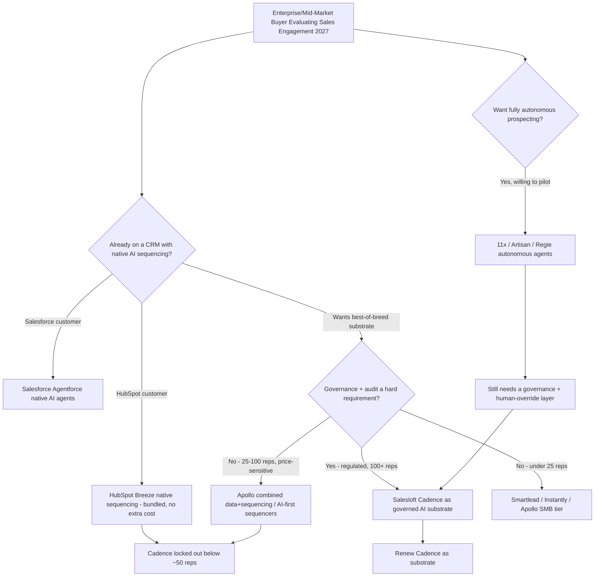

### Direct Answer

**Yes — Salesloft Cadence is still relevant in 2027, but only because it has completed a forced metamorphosis from "the rules-based sequence engine an AE builds in" into "the human-in-the-loop, governed workflow substrate that AI sales agents run inside." The standalone product Salesloft sold in 2022 — a timeline where an account executive drags steps onto a sequence and clicks send — is dying the way rules-based marketing automation died around 2017, and the version that survives in 2027 is a different product wearing the same brand, the same logo, and the same SKU on the order form. The honest 2027 economics: Cadence-as-substrate holds 78-88% gross dollar retention, stabilizes ARPU at $165-$220 per seat per month when bundled with at least one AI attach, and defends a 70-80% share inside the 100+ rep enterprise segment where compliance, audit trails, and brand governance are non-negotiable — because the alternative, deploying autonomous agents from 11x or Artisan with no governance layer, is a non-starter for an enterprise general counsel. Relevance is decided by three things: (1) whether Salesloft ships the Sentence AI co-pilot and the post-acquisition Lavender email-generation integration as native, bundled, defensible features rather than late bolt-ons; (2) whether it deliberately retreats from competing as a rules-based sequencer and explicitly repositions as the governed AI-orchestration layer; and (3) whether it preserves the 12-18 month customer activity-graph data moat by keeping enterprise accounts on-platform long enough for their engagement corpus to compound. The bear case is real: if HubSpot Breeze native sequencing reaches parity and locks Cadence out below 50 reps, if Vista Equity Partners' cost-out discipline starves the engineering org that has to rebuild the substrate, or if foundation-model APIs let any new entrant assemble a Cadence-equivalent in eight weeks, then retention collapses toward 50-60%, ARPU compresses to $85-$115, and Cadence becomes the Marketo of sales engagement — still on the order form, no longer in the strategy deck. Net: relevant in 2027, not by inertia, but because the product, the buyer, the moat, and the pricing model are all different than they were in 2024.**

> ### TLDR
> - **Relevance is cohort-specific.** Enterprise (100+ reps, regulated industries) buys and renews Cadence enthusiastically; mid-market (25-100 reps) is contested but defensible; SMB (under 25 reps) has largely abandoned it for Apollo, Smartlead, and CRM-bundled AI — and that loss is not a relevance crisis because SMB was never the strategic core.
> - **The product metamorphosed.** Cadence in 2027 is the orchestration, governance, and audit substrate where humans review, approve, override, and govern what AI sequencers and autonomous agents do — not the sequence builder itself.
> - **Two moats hold the line.** The 12-18 month per-customer activity graph (targeting and timing data AI-native entrants do not have) and the enterprise governance layer (compliance, audit, permission tiers) are the durable defenses; the sequence builder is not.
> - **Economics:** 78-88% gross dollar retention as a substrate, ARPU $165-$220/seat/month with one AI attach, 70-80% enterprise share. Bear case: retention 50-60%, ARPU $85-$115 if the AI roadmap slips.
> - **Three deciders:** ship Sentence AI + Lavender natively, reposition explicitly off the sequencer identity, and protect the activity-graph moat through the next two renewal cycles.

A buyer asking "is Salesloft Cadence still relevant in 2027?" is really asking a buying question — if real budget owners keep writing real checks, the product is relevant; if they stop, it is not, regardless of the marketing. The honest answer requires separating the brand from the product. Salesloft Cadence in 2018-2022 was a rules-based sales sequencer: an account executive built a multi-step workflow (Day 1 email, Day 3 LinkedIn touch, Day 5 call, Day 8 email, Day 12 break-up), assigned prospects into it, and the platform paced the steps, surfaced the daily task list, captured replies, and reported cadence-level conversion. Executed well, that was a quietly excellent and category-defining product — Salesloft, alongside Outreach and Yesware, created the "sales engagement platform" category that Gartner began tracking around 2019. By 2024 the category had matured, the product had hit a ceiling, and the conversation in every account-review meeting had shifted from "how do I run better cadences" to "do I even need cadences if AI can write the email and pick the timing." That shift — not a competitor, not a recession, not a missed feature — is what forced the metamorphosis this entry analyzes.

## 1. The 2027 Decision Context — Who Is Actually Buying

Relevance is not a single answer; it is three answers, one per buyer cohort. By 2027 the Cadence buyer has cleanly bifurcated, and the honest verdict differs in each segment.

### 1.1 The Three Buyer Cohorts

- **The enterprise cohort** — companies with 100+ sales reps, regulated industries (financial services, pharma, healthcare, legal-adjacent SaaS), Fortune 1000 sellers, and any organization with a real compliance, brand, or audit requirement. This cohort buys Cadence enthusiastically and renews at strong rates because the alternative — autonomous AI agents with no governance layer — is a non-starter for their general counsel. This is roughly 2,800-3,400 accounts of Salesloft's base and the segment where Cadence's relevance is least in question.
- **The mid-market cohort** — 25-100 rep sales orgs, growth-stage SaaS, professional-services firms with sales teams. This is the contested middle, where Cadence competes against HubSpot Sales Hub with Breeze AI sequencing bundled into the CRM, against Apollo's combined data-and-sequencing platform at a fraction of the price, and against an emerging crop of AI-first sequencers. Relevance here is real but must be earned at every renewal.
- **The SMB cohort** — under-25-rep sales orgs, agencies, and solo founders running their own outbound. This cohort has largely abandoned Cadence as overkill and over-priced, defaulting to Apollo, Smartlead, Instantly, or the AI sequencer bundled into their CRM. This segment was never Cadence's strategic core, and its loss is not a relevance crisis.

### 1.2 Why the Segmentation Is the Foundation of Every Answer

When a buyer asks "is Cadence still relevant?" the honest response is "for which cohort?" — enthusiastically yes for enterprise, contested but defensible for mid-market, no for SMB. Every other section of this analysis flows from that segmentation. An evaluator measuring Cadence against the 2022 product, or against the needs of a 12-rep SMB team, is asking the wrong question and will reach the wrong conclusion. The relevant question is whether Cadence has adapted to the requirements of the cohort that actually pays for it — the enterprise — and whether it can hold the contested mid-market against bundled CRM AI.

### 1.3 What "Relevant" Has to Mean in 2027

Relevance in a maturing software category is not "is the product still sold." Marketo is still sold. Relevance is "is the product still in the strategy deck" — is a CRO still choosing it deliberately as part of how the revenue org will operate, or is it a line item nobody has the energy to rip out. Cadence clears the strategy-deck bar in the enterprise because the governance problem it solves is getting harder, not easier, as AI agents proliferate. It is on the wrong side of that bar in SMB. The mid-market is where the next three years are decided.

### 1.4 Sizing the Cohorts

The relevance verdict is easier to weigh with the cohorts sized rather than described. The table below is an analytic estimate, not an audited figure — Salesloft is privately held by Vista Equity Partners and does not disclose segment counts — but the proportions reflect how a 14-year-old sales-engagement incumbent's base typically distributes after SMB defection.

| Cohort | Approx. accounts | Approx. revenue share | Relevance verdict | Renewal posture |
|---|---|---|---|---|
| Enterprise (100+ reps, regulated) | 2,800-3,400 | 55-65% | Enthusiastically relevant | Strong, multi-year |
| Mid-market (25-100 reps) | 4,000-5,500 | 30-38% | Contested, defensible | Earned at each renewal |
| SMB (under 25 reps) | Declining tail | 4-8% | Not relevant | Net loss accepted |

The strategic point the table makes is concentration: a clear majority of Cadence revenue sits in the enterprise cohort, which is exactly the cohort where the governance and activity-graph moats are strongest. Salesloft's relevance is therefore more durable than a headline "sequencers are dying" narrative implies — because the dying part of the category (SMB sequencing) is the smallest part of the book, and the defensible part (governed enterprise orchestration) is the largest. The mid-market is the swing factor that determines whether the company grows or merely holds.

### 1.5 The Decision-Maker Has Changed

The cohort shift is also a buyer-persona shift, and this is underappreciated. In 2022 the Cadence buyer was a VP of Sales or a sales-operations lead optimizing rep productivity. In 2027 the enterprise Cadence decision involves the CRO, the CISO, and frequently the general counsel, because the question is no longer "will this make reps faster" but "will this let us deploy AI in revenue without creating regulatory, brand, or legal exposure." A product sold to a risk-and-governance committee is evaluated on different criteria than a product sold to a productivity-minded sales VP — and Cadence's metamorphosis is, in part, a deliberate move to be legible to that new committee. An evaluator who still pitches Cadence internally as a rep-productivity tool is selling it to the wrong room.

## 2. The Five Forces Reshaping Sales Engagement

Five forces collided in the 2024-2027 window to reshape what a sales engagement platform must be. Cadence's relevance is determined by how cleanly Salesloft adapted to all five, not by how well it serves any single one.

### 2.1 Foundation-Model AI Commoditizes Email Writing

When models from Anthropic, OpenAI, Meta, and Mistral can produce a competent prospecting email faster than a human can edit one, the value of "a sequence step that prompts the AE to send an email" collapses. The value migrates to what the email should say, when, to whom, and with what context. A sequencer whose core feature is pacing human-written steps is selling a commoditized capability.

### 2.2 Autonomous AI Sales Agents Move From Demo to Deployment

Companies like 11x, Artisan, Regie, and a long tail of agent startups now ship products that run prospecting end-to-end with no human in the loop, and large companies are running pilots that put real budget at risk. This is the existential-looking threat — but, as Section 8 argues, it is also the threat that creates Cadence's new job.

### 2.3 HubSpot and Salesforce Embed AI Sequencing Natively

HubSpot Breeze bundles AI-driven prospecting and sequencing into the Sales Hub at no incremental cost to the CRM customer; Salesforce's Agentforce does the equivalent inside the Salesforce stack. This collapses the standalone-tool value proposition for any customer already paying for the CRM — the single most dangerous force for Cadence in the mid-market.

### 2.4 Data and Activity-Graph Quality Become the Durable Moat

As email writing commoditizes, the differentiator is no longer the words; it is the targeting, timing, and context that depend on accumulated customer-specific engagement data. Incumbents — Salesloft, Outreach, HubSpot — have that data. AI-native entrants do not. This force works in Cadence's favor.

### 2.5 Enterprise Governance Becomes Non-Negotiable

As AI agents send email in the name of regulated companies, the compliance, brand, and legal-risk layer becomes a hard requirement. AI-native startups have not built it, and building it convincingly takes years of enterprise scar tissue. This force, too, works in Cadence's favor — and it is the load-bearing pillar of the bull case.

### 2.6 How the Five Forces Net Out for Cadence

The five forces do not point the same direction, and the relevance verdict is the net of them. Two forces are existential threats to the old Cadence: foundation-model commoditization of writing (2.1) and CRM-bundled native AI (2.3) both destroy the standalone-sequencer value proposition. Three forces are tailwinds for the new Cadence: the autonomous-agent wave (2.2) creates demand for a governance layer, the activity-graph dynamic (2.4) rewards incumbency, and the governance requirement (2.5) is a moat AI-native entrants cannot quickly replicate.

| Force | Direction for old Cadence | Direction for new Cadence | Net effect |
|---|---|---|---|
| Foundation-model writing commoditization | Severe threat | Neutral — value moves to targeting | Forces the metamorphosis |
| Autonomous AI agents deploy | Apparent threat | Tailwind — creates governance demand | Net positive if substrate ships |
| CRM-bundled native AI | Severe threat in mid-market | Neutral in enterprise | Bear-case mechanism |
| Activity-graph data quality | Neutral | Strong tailwind — rewards incumbency | Net positive |
| Enterprise governance mandate | Neutral | Strong tailwind — hard moat | Net positive, load-bearing |

The honest read of the table: Cadence-the-2022-product is genuinely obsolete under forces 2.1 and 2.3, and no amount of positioning rescues it. Cadence-the-substrate is genuinely advantaged under forces 2.2, 2.4, and 2.5 — but only if Salesloft actually completes the rebuild. The five forces, in other words, do not answer the relevance question; they explain why the answer is path-dependent on execution rather than fixed.

## 3. The Workflow Substrate Thesis

The single most important idea for understanding Cadence's 2027 relevance is that its center of gravity has moved.

### 3.1 From Sequence Engine to Orchestration Layer

In 2022 the center of gravity was the sequence builder — the canvas where an AE assembled steps. In 2027 the center of gravity is the orchestration, governance, and integration substrate that lets a 200-rep enterprise deploy AI sales agents without the legal team and the CRO both having a heart attack. The sequence builder still exists; it is no longer the point. The point is the layer where humans review what an AI sequencer proposes, approve or override individual sends, audit what was done in their name, and govern the rules that keep the AI inside legal, regulatory, and brand boundaries.

### 3.2 Why Humans Stay in the Loop in Regulated Selling

The autonomous-agent pitch assumes the human is friction to be removed. In regulated and high-consideration enterprise selling, the human in the loop is not friction — it is the control. A financial-services firm cannot let an unsupervised agent send communications that may constitute regulated advice; a pharma seller cannot let an agent improvise claims; a Fortune 1000 brand cannot let an agent send off-brand messaging at scale. The human-in-the-loop substrate is the mechanism that makes AI deployable in exactly the accounts that pay the most. Cadence's metamorphosis is, precisely, the decision to be that substrate.

### 3.3 The Substrate as a Defensible Position

A substrate is harder to displace than a feature. A sequencer competes feature-for-feature with every other sequencer and every CRM's bundled AI. A governed orchestration layer integrated into the enterprise's CRM, compliance tooling, audit systems, and rep workflow is embedded in a way that a feature is not. The substrate thesis is the difference between Cadence being a renewable platform decision and being a swappable tool. The risk, addressed in Section 9's bear case, is that Salesloft fails to actually build the substrate and merely renames the sequencer.

### 3.4 The Three Jobs the Substrate Must Do

To be a substrate rather than a renamed sequencer, Cadence has to do three concrete jobs well enough that an enterprise will not route around it. First, **deployment** — it must let a revenue org decide which AI capability or autonomous agent runs in which segment, with which guardrails, and turn that on without a six-month integration project. Second, **supervision** — it must surface what the AI proposed, let a human approve, edit, or reject individual actions at the speed of real selling, and escalate high-risk actions to the right reviewer automatically. Third, **accountability** — it must produce a defensible record of what was done, by which agent, under whose authority, so that a regulator, an auditor, or an internal risk review can reconstruct any campaign. A product that does the first job but not the second and third is an integration hub, not a governance substrate. The bull case requires all three; the bear case is the scenario where Cadence ships the first and calls it the substrate.

### 3.5 Why Repositioning Is Hard Even When It Is Correct

The substrate strategy is probably correct, but repositioning a 14-year-old brand is genuinely difficult, and underestimating that difficulty is a common analytical error. The market has a decade of Cadence-equals-sequencer association. Salesloft's own sales motion, partner ecosystem, and customer-success playbooks were built around the sequencer identity. The buyer persona is changing (Section 1.5) but the existing pipeline still contains sales-VP buyers expecting the old pitch. Repositioning means simultaneously building the substrate, retraining the go-to-market org, re-educating the analyst community, and re-anchoring pricing — while competitors with no legacy simply ship AI-native products into a clean narrative. Marketo's slide from category creator to commodity line item was not caused by a single missed feature; it was caused by failing to reposition fast enough as marketing automation matured. That is the cautionary precedent, and it is why "the strategy is correct" and "the company will execute it" are two separate bets.

## 4. The Activity-Graph Data Moat

If governance is one pillar of the bull case, the activity graph is the other.

### 4.1 What the Activity Graph Is

Every enterprise Cadence customer accumulates a 12-18 month corpus of engagement data — which messages were sent, to whom, when, what was opened, what was replied to, what converted, across thousands of reps and hundreds of thousands of prospects. That corpus is customer-specific: it encodes the timing patterns, segment responses, and message performance of one company's actual market. It cannot be bought, scraped, or synthesized.

### 4.2 Why the Moat Deepens as AI Commoditizes Writing

As foundation models commoditize the words, the durable differentiator becomes targeting and timing — and targeting and timing are exactly what the activity graph informs. An AI-native entrant can write an email as well as anyone; it cannot know that this customer's CFO persona responds on Tuesday mornings and ignores Friday sends, because it has no history. The incumbent's accumulated graph is the input that makes its AI recommendations better than a cold-start competitor's. The moat is not the algorithm; it is the data the algorithm runs on.

### 4.3 The Moat's Fragility

The activity-graph moat has a precondition: the customer has to stay on-platform long enough for the corpus to compound and has to keep enough activity flowing through Cadence rather than through a bypassing AI agent. If enterprise customers route their AI prospecting through an external autonomous agent and use Cadence only as a thin reporting veneer, the graph stops deepening and the moat erodes. Preserving the moat is therefore the same task as winning the substrate position — they are one strategy, not two.

### 4.4 Why the Moat Is Real but Often Overstated

It is worth being precise about the limits of the data moat, because vendors tend to oversell it. The activity graph is a genuine advantage for targeting and timing inside the customer's own market, but it is not a universal moat. It does not transfer across customers — one company's graph does not improve another's results, so there is no network effect of the kind that makes a marketplace defensible. It decays: buying patterns, personas, and channels shift, so a graph that is 24 months stale is worth less than one that is 6 months fresh. And it is partially substitutable — a competitor with a smaller graph plus a strong foundation model can close much of the gap on message quality, even if it cannot fully match timing precision. The honest framing: the activity graph buys Cadence a meaningful head start and a switching cost, not an unassailable position. It is one of two real moats, it is more durable than the sequence builder, and it is less durable than the governance moat — which is built from accumulated enterprise requirements that decay far more slowly than engagement data.

### 4.5 The Moat in the Buyer's Hands

For a buyer, the activity-graph point has a practical implication. The value a customer gets from Cadence's data moat is proportional to how much of their own selling activity has actually run through Cadence and for how long. A customer that migrated to Cadence 18 months ago and runs the bulk of its outbound through it owns a deep, valuable graph and has a real reason to stay. A customer that adopted Cadence recently, or runs most of its activity through other tools, has a shallow graph and a correspondingly weaker lock-in. When evaluating a renewal, the buyer should ask how much of the moat is theirs — because the moat protects the vendor only to the extent the customer has fed it.

## 5. The Enterprise Governance Moat

Governance is the moat that AI-native competitors find hardest to replicate, because it is built from accumulated enterprise requirements rather than from code.

### 5.1 The Three Layers of Governance

| Governance Layer | What It Controls | Why AI-Native Entrants Lack It |
|---|---|---|
| Compliance and audit | Records who sent what, when, on whose authority; produces audit trails for regulators | Requires years of regulated-customer feature requests to build credibly |
| Permission and approval tiers | Routes AI-proposed sends through human approval based on role, segment, and risk | Conflicts with the autonomous-agent value proposition itself |
| Brand and content governance | Keeps messaging inside approved claims, tone, and legal boundaries | Needs deep enterprise content-workflow integration |

### 5.2 Why Governance Is a Sales Advantage, Not Just a Feature

In an enterprise evaluation, governance is what gets the deal past the general counsel and the CISO. An AI-native vendor that wins the rep's heart can still lose the deal in legal review. Cadence's governance layer is, functionally, a deal-closing instrument in regulated accounts — and it is why the enterprise cohort is the segment where relevance is least in doubt. Governance does not win demos; it wins procurement.

### 5.3 The Limit of the Governance Moat

Governance defends the enterprise. It does not defend SMB, where buyers do not have a general counsel reviewing the sales stack, and it only partly defends mid-market, where the compliance requirement is real but lighter. The governance moat is strong but narrow — which is exactly why the cohort segmentation in Section 1 is the foundation of the whole analysis.

### 5.4 Why Governance Is the More Durable of the Two Moats

Of Cadence's two real moats, governance is the more durable, and the reason is instructive. The activity-graph moat is built from data, and data decays — buying patterns shift, personas turn over, channels rise and fall, so the moat needs constant replenishment to hold its value. The governance moat is built from accumulated requirements — the specific compliance, audit, permission, and brand-control features that hundreds of regulated enterprises asked for over a decade. Those requirements do not decay; if anything they accumulate, because regulation tightens and AI raises the stakes of an ungoverned send. A competitor trying to replicate the governance moat is not chasing a moving target the way a data-moat challenger is; it is trying to compress a decade of enterprise feature requests, security certifications, and audit-tooling work into a roadmap — and enterprise buyers can tell the difference between a governance layer that was designed and one that was retrofitted. This is why, in the bull case, governance is the load-bearing pillar: it is the moat least exposed to the foundation-model shift and least replicable by a well-funded AI-native entrant.

### 5.5 The Regulated-Industry Concentration

A subtle but important point: Cadence's relevance is disproportionately concentrated in regulated industries — financial services, insurance, pharma and life sciences, healthcare, and the legal-adjacent corner of SaaS. These verticals are where the governance moat is not a nice-to-have but a hard procurement gate, and they are also verticals with large sales forces and durable software budgets. The concentration is a strength in that it anchors Cadence in the stickiest possible customers, and a vulnerability in that it ties the company's fortunes to a relatively narrow set of industries. But for the relevance question specifically, the regulated-industry concentration is reassuring: these are precisely the customers least able to adopt ungoverned autonomous agents, and therefore the customers for whom Cadence's metamorphosis is most clearly aimed.

## 6. The Competitive Field and the Bundle Math

Cadence's relevance is also a function of who it competes against and how it is priced.

### 6.1 The Direct Competitive Field

The field splits three ways. CRM-bundled AI is the structural threat to the mid-market because it is "free" to the CRM customer — and critically, the two CRM incumbents are deep-pocketed public companies, **HubSpot, Inc. (NYSE: HUBS)** with Breeze and **Salesforce, Inc. (NYSE: CRM)** with Agentforce, each able to fund native AI sequencing as a feature rather than a separate P&L. AI-native sequencers and combined platforms (Apollo, and a crop of AI-first entrants) compete on price and freshness. Autonomous agents (11x, Artisan, Regie) compete on the promise of removing the human entirely. The foundation models that power all of them flow from a mix of private labs and public-company platforms — including **Microsoft Corporation (NASDAQ: MSFT)**, whose Azure OpenAI service and Copilot stack put model access and an adjacent productivity-suite distribution channel inside the competitive picture. Cadence's defensible ground is the intersection of governance need and best-of-breed substrate — narrower than the category it once owned, but real.

### 6.2 The Outreach Comparison — Two Twins, Two Trajectories

Salesloft and Outreach grew up as near-identical twins — same category, same era, same product shape. By 2027 they face the same five forces and the same metamorphosis pressure. The relevant question for a buyer is not "Salesloft or Outreach" on a feature checklist but "which one has executed the substrate metamorphosis more credibly and has the healthier roadmap and ownership structure." Both are private; both are under financial-sponsor discipline; both must rebuild around governance and AI orchestration. A Cadence evaluation is incomplete without an Outreach evaluation on the same substrate criteria — and the deeper head-to-head is covered in the dedicated comparison entry (q1854).

The deeper point of the twin comparison is that it isolates the variable. Because Salesloft and Outreach started so similar, the difference in their 2027 and 2030 trajectories will be almost entirely a difference in execution — roadmap timing, repositioning discipline, and ownership-driven investment posture — rather than a difference in starting position or category exposure. For a buyer, that means the choice between them is a bet on management and execution, and the evaluation should weigh roadmap evidence and customer-reference depth far more heavily than a feature-by-feature bake-off, because the features will converge. For the analyst, the two companies are a natural experiment in whether the substrate metamorphosis is achievable at all — if one executes it and one slides to commodity status, the deciders in Section 9 are confirmed; if both slide, the bear case for the whole category is confirmed.

### 6.3 The Apollo and AI-Native Challenge

Apollo.io and the crop of AI-first sequencers attack from the opposite direction to the CRM incumbents — not "free with the CRM you already pay for" but "more capability per dollar, no legacy, AI-native from the first line of code." Apollo's bundling of contact data with sequencing at a fraction of Cadence's per-seat price is genuinely attractive to a price-sensitive mid-market buyer, and the AI-native sequencers ship without the architectural debt of a 14-year-old product. Cadence's answer to this flank is not price — it cannot win a price war against a venture-subsidized challenger — but governance, activity-graph depth, and enterprise integration. Against Apollo in a 40-rep unregulated SaaS company, Cadence frequently loses, and should; against Apollo in a 400-rep regulated enterprise, the governance gap usually decides it the other way. The AI-native challenge, like the CRM-bundle challenge, is real in the mid-market and decisive in SMB, and irrelevant in the enterprise core.

### 6.4 The Bundle Math — Cadence as Anchor

Cadence is no longer sold as a standalone SKU; it is the anchor of a multi-product bundle that includes Drift conversational, the Sentence AI assistant, and post-acquisition Lavender email generation. The bundle math is central to the economics: a standalone sequencer faces relentless ARPU compression as the feature commoditizes, but an anchor product in a bundle that adds conversational and AI-generation value can hold or grow ARPU. The bundle is also a retention mechanism — a customer using four integrated capabilities is far stickier than one using a sequencer alone. The risk is that a bundle assembled from acquisitions can feel like four products in a trench coat unless the integration is genuinely native.

### 6.4 The HubSpot and Salesforce Threat in Detail

HubSpot Breeze and Salesforce Agentforce are dangerous not because they are better than Cadence but because they are already paid for. For a mid-market customer of **HubSpot (NYSE: HUBS)**, "good enough native sequencing at no incremental cost" beats "best-of-breed sequencing at $165-$220/seat" unless Cadence offers something the CRM cannot — which, again, is governance and the activity graph. The same logic applies to a **Salesforce (NYSE: CRM)** customer evaluating Agentforce. Below roughly 50 reps, where governance is not a hard requirement, CRM-bundled AI structurally locks Cadence out. This is the precise mechanism of the bear case.

### 6.5 The Competitor Scorecard

A buyer's evaluation is clearer with the field laid out against the criteria that actually decide a 2027 sales-engagement purchase: governance depth, activity-graph depth, AI capability, price posture, and CRM independence.

| Vendor / category | Governance + audit | Activity-graph depth | AI orchestration | Price posture | Best fit |
|---|---|---|---|---|---|
| Salesloft Cadence | Strong | Deep (enterprise) | Bundle-dependent | Premium, anchored | Regulated 100+ rep enterprise |
| Outreach | Strong | Deep | Bundle-dependent | Premium | Enterprise twin alternative |
| HubSpot Breeze (NYSE: HUBS) | Light | Moderate (CRM-resident) | Native, improving | Bundled / "free" | HubSpot mid-market |
| Salesforce Agentforce (NYSE: CRM) | Moderate | Deep (CRM-resident) | Native agents | Bundled / add-on | Salesforce enterprise |
| Apollo.io | Light | Moderate | AI sequencer | Low | Price-sensitive mid-market / SMB |
| 11x / Artisan / Regie | Minimal | Shallow (cold-start) | Autonomous | Variable | Unregulated SMB outbound |
| Smartlead / Instantly | Minimal | Shallow | Email-focused AI | Very low | SMB / agency cold email |

The scorecard makes Cadence's position legible: it is not the cheapest, the freshest, or the most autonomous, and it loses every column to someone. It wins exactly one combination — governance plus activity-graph depth plus CRM independence — and that combination is only decisive for the enterprise cohort. The strategic clarity, and the strategic risk, are the same fact: Cadence's relevance rests on one column of the scorecard mattering more than all the others to the customers who pay the most.

## 7. Pricing, ARPU, and Retention Reality

The relevance verdict ultimately shows up in the financial metrics.

### 7.1 The 2027 Pricing and Retention Picture

| Metric | Substrate / Bull Path | Commoditized / Bear Path |
|---|---|---|
| Gross dollar retention | 78-88% | 50-60% |
| ARPU per seat per month | $165-$220 (with one AI attach) | $85-$115 |
| Enterprise segment share (100+ reps) | 70-80% | Eroding below 50% |
| Net revenue retention | 100-110% (bundle expansion) | 80-90% (downsell + churn) |
| Mid-market renewal rate | Contested, defensible | Structural decline |

### 7.2 Why ARPU Holds Only With an AI Attach

ARPU at $165-$220 is conditional on the customer adopting at least one AI capability from the bundle. A bare sequencer seat compresses toward the bear-case range because that is what a commoditized feature is worth. The pricing strategy and the product strategy are the same strategy: Cadence holds its price only if it successfully sells the substrate-plus-AI bundle rather than the sequencer. The detailed revenue-model breakdown lives in the dedicated entry on how Salesloft makes money (q1852), and the retention math under Vista ownership is analyzed in (q1843) and (q1856).

### 7.3 The Vista Equity Partners Variable

Salesloft's ownership by Vista Equity Partners cuts both ways. Vista's operational discipline and capital can fund the substrate rebuild and the AI roadmap. But Vista's cost-out playbook can also starve the engineering organization that has to execute the most demanding product transformation in the company's history — at exactly the moment when under-investment is fatal. The ownership structure is not a footnote; it is one of the three deciders of which case wins.

### 7.4 The Drift Acquisition and the Bundle Bet

The Drift acquisition is the clearest tell of Salesloft's strategy. Buying a conversational-marketing platform and folding it into the Cadence bundle is not a sequencer move — a company defending a sequencer would invest in the sequencer. It is a substrate move: it widens Cadence from "email and call pacing" toward "the layer that orchestrates every prospect interaction, including the website conversation." The bundle logic is that an anchor product surrounded by conversational, AI-assistant, and email-generation capabilities is both stickier and less price-compressible than a standalone tool. The execution risk is integration depth. A bundle of acquisitions that share a logo but not a data model, a user experience, or a governance layer is four products in a trench coat, and buyers can tell. The difference between the bundle being a moat and being a discount mechanism is whether Drift, Sentence AI, and Lavender are genuinely native inside the substrate or merely co-sold. The corporate trajectory under Vista, including the rationale and risk of the Drift bet, is analyzed in depth in (q1858).

### 7.5 The Macro Backdrop — SaaS Spend Discipline

The relevance question also sits inside a macro environment of tighter SaaS-spend discipline. Through the 2024-2027 window, revenue and procurement leaders have consolidated tool stacks, scrutinized per-seat costs, and reallocated budget toward AI capability and away from single-purpose tools. This macro pressure is double-edged for Cadence. It hurts the standalone-sequencer framing — a single-purpose tool at a premium price is exactly what a consolidation-minded CRO cuts. It helps the substrate-and-bundle framing — a consolidating buyer would rather pay one vendor for an orchestration layer plus conversational plus AI generation than assemble four point tools. Cadence's macro resilience, like everything else in this analysis, depends on which product the buyer perceives they are renewing.

## 8. The Autonomous AI SDR Threat — and Why It Is Not What It Looks Like

The autonomous AI SDR is the threat that makes headlines. The honest analysis is more interesting than the headline.

### 8.1 What the Autonomous Agents Actually Do

11x, Artisan, Regie, and similar agents run prospecting end-to-end — research, write, send, follow up — with no human assembling steps. For an SMB or an unregulated, low-consideration motion, that is a genuine substitute for a sequencer, and it is part of why SMB has abandoned Cadence.

### 8.2 Why the Agent Threat Creates Cadence's New Job

In the enterprise, the autonomous agent does not eliminate the need for an orchestration layer — it intensifies it. Someone has to decide which agent runs in which segment, approve or override high-risk sends, audit what the agent did in the company's name, and keep the agent inside compliance and brand boundaries. That is the substrate. The autonomous agent is not Cadence's replacement in the enterprise; it is the thing Cadence governs. The agent vendors are, in effect, building demand for exactly the layer Cadence is repositioning to be.

### 8.3 The Genuine Risk Inside the Threat

The risk is timing and execution, not concept. If autonomous agents deploy faster than Salesloft ships a credible governance-and-orchestration substrate, enterprises may adopt agents with a thin governance veneer from the agent vendor itself, and Cadence loses the substrate position before it can claim it. The threat is real; it is just a race, not a verdict.

### 8.4 What the Agent Vendors Get Wrong About the Enterprise

The autonomous-agent pitch carries an implicit assumption that does not survive contact with a regulated enterprise: that the human in the loop is overhead and the goal is to remove it. In a low-consideration, unregulated motion — an SMB selling a $40/month product — that assumption is broadly correct, and it is part of why SMB left Cadence. In a regulated enterprise selling six- and seven-figure deals, the human in the loop is not overhead; the human is the legally accountable party, the brand steward, and the relationship owner. An enterprise cannot delegate accountability to an agent because accountability is not delegable — a regulator holds the company responsible regardless of which software sent the message. The agent vendors are, in effect, optimizing the wrong variable for the enterprise: they are minimizing human involvement when the enterprise needs to make human oversight efficient and auditable, not eliminate it. That gap is the strategic opening Cadence is repositioning to fill, and it is structural rather than temporary.

### 8.5 The Most Likely Equilibrium

The probable 2027-2029 equilibrium is not "agents replace sequencers" and not "sequencers hold off agents." It is a layered stack: autonomous agents do the high-volume, lower-risk research-and-draft work; a governance-and-orchestration substrate sits above them deciding what runs where, supervising and approving, and recording accountability; and the CRM sits beside both as the system of record. In that equilibrium, the agent vendors and the substrate are complements, not substitutes — which is why an enterprise running 11x or Artisan still needs a Cadence-shaped layer, and why the agent funding rounds are, indirectly, validating the substrate thesis. The open question is which vendor owns the substrate layer in that stack: Salesloft, Outreach, a CRM incumbent extending upward, or a new entrant. Cadence's relevance through 2029 is the bet that it owns that layer for the enterprise cohort.

## 9. The Bull Case and the Bear Case

The honest 2027 answer is path-dependent. Both cases are coherent.

### 9.1 The Bull Case — How Cadence Wins the Decade

Salesloft ships Sentence AI and the Lavender integration as native, bundled, defensible features on schedule. It explicitly repositions Cadence off the sequencer identity and onto the governed-substrate identity, and the market accepts the reposition. The activity-graph moat compounds because enterprise customers stay on-platform. Governance becomes the deciding factor in enterprise evaluations as AI agents proliferate. ARPU holds at $165-$220 on bundle attach, retention holds at 78-88%, and Cadence ends the decade as the orchestration layer of record for AI-driven enterprise selling. In this case the answer to the title question is an emphatic yes.

### 9.2 The Bear Case — How Cadence Becomes the Marketo of Sales Engagement

The AI roadmap slips. Sentence AI and Lavender land late and feel bolted-on. HubSpot Breeze reaches feature parity and locks Cadence out below 50 reps. Vista's cost-out discipline starves the engineering org mid-transformation. Foundation-model APIs let new entrants assemble a Cadence-equivalent in eight weeks. Retention slides toward 50-60%, ARPU compresses to $85-$115, the install base flips to autonomous agents inside two renewal cycles, and Cadence becomes the Marketo of sales engagement — still on the order form, no longer in the strategy deck. In this case the answer is "technically yes, strategically no."

### 9.3 The Three Deciders

Which case wins is decided by three things, and only three: (1) timely native shipment of the Sentence AI co-pilot and Lavender integration; (2) a deliberate, explicit reposition from rules-based sequencer to governed AI-orchestration substrate; and (3) preservation of the activity-graph moat by keeping enterprise customers on-platform long enough for their corpus to compound. Everything else — competitor moves, macro SaaS spend, the agent hype cycle — is secondary to those three.

### 9.4 Reading the Deciders as Leading Indicators

For an evaluator who wants to track which case is winning rather than wait for the verdict, each decider has an observable leading indicator. For the AI roadmap: is Sentence AI and the Lavender integration shipped, GA, and in the hands of reference customers — or still a roadmap slide. For the reposition: does Salesloft's own marketing, analyst briefings, and sales motion lead with "governed AI orchestration" — or still with sequence-building feature lists. For the moat: are enterprise net-revenue-retention and multi-year renewal rates holding in the 100-110% band — or sliding toward downsell. A buyer or analyst checking those three indicators once or twice a year has a real-time read on whether the bull or bear case is materializing, well before it shows up in a category-share report.

| Decider | Bull-case signal | Bear-case signal |
|---|---|---|
| AI roadmap (Sentence AI, Lavender) | Shipped, GA, reference customers live | Slipping, demo-only, roadmap-deck status |
| Reposition off the sequencer identity | Marketing and sales lead with "governed orchestration" | Still pitching sequence-builder feature lists |
| Activity-graph moat preservation | NRR 100-110%, strong multi-year renewals | NRR sliding to 80-90%, downsell rising |
| Vista investment posture | Funding the rebuild, engineering headcount stable | Cost-out, R&D contraction mid-transformation |
| Mid-market competitive hold | Renewal rate flat vs HubSpot/Salesforce bundles | Structural mid-market churn to bundled AI |

### 9.5 The Base-Rate Caution

A base-rate check tempers both cases. Category-creating incumbents that face a platform shift more often slide than transform — Marketo, Eloqua, and a long list of marketing-automation pioneers did not become the AI-marketing substrate; they became line items inside larger suites. The base rate for "14-year-old incumbent under financial-sponsor ownership successfully executes a fundamental product metamorphosis" is not encouraging. That does not make the bear case correct — Cadence's governance and data moats are genuinely stronger than the moats those marketing-automation incumbents had — but it does mean the bull case is the harder-to-achieve outcome and should be treated as the claim that carries the burden of proof.

## 10. The Customer Decision Framework

For a buyer holding a Cadence renewal in 2027, the decision is segment-dependent.

### 10.1 Renew, Switch, or Stack

- **Enterprise, 100+ reps, regulated.** Renew. The governance and activity-graph moats are real, the substrate position is defensible, and no AI-native alternative clears procurement. Use the renewal to push for roadmap commitments on Sentence AI and Lavender.
- **Mid-market, 25-100 reps, on HubSpot or Salesforce.** Evaluate the CRM-bundled AI seriously. If governance is a genuine requirement and the activity graph has value, stack Cadence as the substrate over the CRM. If not, the bundled AI may be sufficient and switching saves real money.
- **Mid-market, best-of-breed by preference.** Renew if the substrate metamorphosis is visible in the product you actually use, not just the roadmap deck. If Cadence still feels like the 2022 sequencer, that is the warning sign.
- **SMB, under 25 reps.** Switch. Cadence is over-scoped and over-priced for this segment; Apollo, Smartlead, or CRM-bundled AI is the rational choice.

### 10.2 The Diagnostic Question

The single most useful diagnostic for any cohort: "In the Cadence we actually use today, has the center of gravity moved from the sequence builder to governance and AI orchestration?" If yes, the metamorphosis is real and renewal is defensible. If the product still centers on dragging steps onto a timeline, the buyer is paying substrate prices for a sequencer, and the bear case is the operative scenario for that account.

### 10.3 The Negotiation Posture

A buyer who decides to renew should not renew passively. Because Cadence's relevance is path-dependent on roadmap execution, the renewal is the buyer's leverage point to convert roadmap promises into contractual reality. The strong renewal posture: ask for written commitments or service-level expectations on the AI capabilities being paid for, negotiate the AI attach into the base rather than as an ever-escalating add-on, secure price protection against ARPU creep, and — for a multi-year deal — build in an off-ramp tied to roadmap milestones. The buyer who treats the renewal as a checkbox cedes the leverage that the vendor's own execution risk hands them. The buyer who treats it as a negotiation gets the substrate-roadmap commitments priced in.

### 10.4 The Cost of Switching, Honestly

Switching away from Cadence is not free, and a balanced framework has to price the switching cost honestly. The real costs: re-integrating a new tool with the CRM and the rep workflow, retraining the sales org, rebuilding cadence and template libraries, losing the accumulated activity graph (which does not transfer), and the productivity dip during migration. For an enterprise, that cost is substantial and is itself a reason the governance-plus-data moat holds. For an SMB running a thin, recent deployment, the switching cost is low — which is exactly why SMB left. The buyer's calculus is the gap between the switching cost and the annual savings or capability gain from the alternative. For most enterprises that gap favors renewal; for most SMBs it favors switching; the mid-market is, again, genuinely close — which is the recurring theme of this entire analysis.

## 11. Counter-Case — Why Cadence Is Not Relevant in 2027

A balanced verdict requires steelmanning the case that Cadence is already a legacy product.

**The reposition is marketing, not product.** The strongest bear argument is that "governed AI substrate" is a slide, not a shipped architecture, and that under the new language Cadence is still the 2022 sequencer with an AI panel attached. If the metamorphosis exists only in positioning, buyers are paying a premium for a commoditized product and relevance is an illusion sustained by switching costs.

**CRM-bundled AI structurally wins the middle.** HubSpot Breeze and Salesforce Agentforce do not have to be better — they have to be free to the CRM customer and good enough. For the entire mid-market that does not have a hard governance requirement, that is a winning hand, and it removes the cohort that was supposed to be Cadence's growth engine after SMB defected.

**Vista's incentives may not fund the rebuild.** A financial sponsor optimizing for a near-term exit has an incentive to harvest the install base, not to fund a multi-year, high-risk product transformation. If Vista runs the cost-out playbook, the engineering org cannot ship the substrate, and the bear case becomes self-fulfilling regardless of market demand.

**The activity-graph moat leaks if agents bypass the platform.** The data moat only compounds if activity flows through Cadence. If enterprises run prospecting through external autonomous agents and use Cadence as a reporting shell, the graph stops deepening, the moat erodes, and the incumbency advantage decays within two renewal cycles.

**Foundation models collapse the build cost for new entrants.** When any competent team can assemble a sequencer-plus-AI-orchestration product in weeks using Anthropic and OpenAI APIs, the category's barrier to entry falls toward zero, and a 14-year-old incumbent with legacy architecture and Vista overhead is not obviously advantaged against a clean-sheet AI-native entrant.

**The honest verdict.** Cadence is relevant in 2027 — but conditionally, narrowly, and not by inertia. It is genuinely relevant for the enterprise cohort, where governance and the activity graph are real moats and the substrate position is defensible. It is contested in the mid-market and lost in SMB. The reposition from sequencer to substrate is a coherent and probably correct strategy, but it is unfinished, and execution risk — roadmap timing, Vista's investment posture, the speed of agent adoption — is the deciding variable. A buyer should treat "is Cadence relevant" as "is Cadence relevant for my cohort, and is the metamorphosis visible in the product I actually use" — and renew, stack, or switch accordingly. The brand will survive the decade. Whether the product stays in the strategy deck or slides to the order-form line item depends on the three deciders, and that question is still genuinely open.

## 12. The 2030 Outlook and What the Question Reveals

### 12.1 The Probable 2030 End State

By decade end, the most probable outcome is that Cadence — under whatever name Salesloft markets it — exists as the human-governance and orchestration layer of an AI-driven enterprise selling stack, sold as a bundle anchor rather than a standalone tool, defended by governance and the activity graph, and irrelevant to SMB. The category called "sales engagement" will likely be absorbed into a broader "AI revenue orchestration" category, and the winners will be the vendors who own the governance substrate, not the ones who own the best sequence builder. Whether the substrate of record carries the Salesloft brand depends on execution between now and 2028.

### 12.2 Why the Question Itself Is a Category-Maturity Marker

It is worth noticing what the question "is Cadence still relevant" reveals. Nobody asked in 2020 whether Cadence was relevant — it was the growth story of a growing category. The relevance question gets asked precisely when a category has matured and a platform shift is underway, and the question is itself the symptom. The same question is being asked about every sales-engagement and marketing-automation incumbent right now, because the foundation-model shift is forcing the same metamorphosis on all of them. An evaluator should read the question not as "is this product dying" but as "this category is reorganizing, and which vendors will own the reorganized version." That reframing is the difference between a fearful renewal decision and a clear-eyed one.

### 12.3 The Range of Outcomes

| 2030 scenario | Probability posture | What it looks like |
|---|---|---|
| Substrate winner | Most probable for enterprise | Cadence is the governed AI-orchestration layer of record; bundle anchor; strong enterprise NRR |
| Contained incumbent | Plausible | Cadence holds enterprise, loses mid-market to CRM-bundled AI; flat, profitable, not growing |
| Commoditized line item | Bear case | Cadence is the Marketo of sales engagement — on the order form, off the strategy deck |
| Absorbed into a suite | Tail risk | Salesloft is acquired and Cadence becomes a feature inside a larger revenue-cloud |

The honest probability weighting puts "substrate winner for enterprise, contained in mid-market" as the central expectation — which is to say, Cadence is most likely relevant in 2030, but as a narrower, enterprise-anchored product than the category leader it once was. The corporate trajectory under Vista, the Drift acquisition, and the broader AI strategy are analyzed in the dedicated entries (q1849) and (q1852); the competitive defense against AI-native sequencing is covered in (q1850); the HubSpot-bundle threat in (q1855) and (q1857); and the autonomous-agent and Pipeline-AI questions in (q1858) and (q1860).

## Sources

1. [Gartner — Sales Engagement Platform market coverage](https://www.gartner.com/)
2. [Salesloft — official product and platform site](https://www.salesloft.com/)
3. [Outreach — sales engagement platform](https://www.outreach.io/)
4. [HubSpot — Sales Hub and Breeze AI](https://www.hubspot.com/products/sales)
5. [Salesforce — Agentforce autonomous agents](https://www.salesforce.com/agentforce/)
6. [Apollo.io — combined data and sequencing platform](https://www.apollo.io/)
7. [Vista Equity Partners — Salesloft ownership](https://www.vistaequitypartners.com/)
8. [Drift — conversational marketing (Salesloft-acquired)](https://www.drift.com/)
9. [Lavender — AI email coaching and generation](https://www.lavender.ai/)
10. [11x — autonomous AI SDR agents](https://www.11x.ai/)
11. [Artisan — AI sales agents](https://www.artisan.co/)
12. [Regie.ai — AI sales content and agents](https://www.regie.ai/)
13. [Smartlead — cold email and sequencing](https://www.smartlead.ai/)
14. [Instantly — outbound email automation](https://instantly.ai/)
15. [Anthropic — Claude foundation models](https://www.anthropic.com/)
16. [OpenAI — GPT foundation models](https://openai.com/)
17. [Meta AI — Llama open-weight models](https://ai.meta.com/)
18. [Mistral AI — open-weight foundation models](https://mistral.ai/)
19. [Clari — revenue platform and forecasting](https://www.clari.com/)
20. [Yesware — email tracking and engagement](https://www.yesware.com/)
21. [Forrester — sales technology research](https://www.forrester.com/)
22. [G2 — Sales Engagement category reviews](https://www.g2.com/categories/sales-engagement)
23. [TrustRadius — sales engagement software reviews](https://www.trustradius.com/)
24. [Salesforce — CRM platform](https://www.salesforce.com/)
25. [HubSpot — CRM platform](https://www.hubspot.com/)
26. [Crunchbase — 11x funding history](https://www.crunchbase.com/organization/11x)
27. [Crunchbase — Artisan funding history](https://www.crunchbase.com/organization/artisan-ai)
28. [SaaStr — SaaS retention and NRR benchmarks](https://www.saastr.com/)
29. [Bessemer Venture Partners — cloud and SaaS benchmarks](https://www.bvp.com/atlas)
30. [OpenView (archived) — SaaS expansion-revenue benchmarks](https://openviewpartners.com/)
31. [The Information — enterprise software and AI coverage](https://www.theinformation.com/)
32. [TechCrunch — AI sales agent funding coverage](https://techcrunch.com/)
33. [Salesloft Engineering Blog — platform architecture](https://www.salesloft.com/resources/blog/)
34. [Pavilion — go-to-market leadership community benchmarks](https://www.joinpavilion.com/)

## Related Pulse Library Entries

- **q1852** — How does Salesloft make money in 2027? (The dedicated revenue-model breakdown — bundle pricing, ARPU composition, and the financial mechanics behind Cadence's substrate economics.)
- **q1850** — How does Salesloft compete against AI-native sequencing tools? (The direct competitive-defense analysis against the AI-first entrants named throughout this entry.)
- **q1854** — Salesloft vs Outreach — which should you buy? (The full head-to-head referenced in the Outreach comparison section, on the same substrate criteria.)
- **q1855** — How does Salesloft defend against HubSpot Sales Hub bundling? (The detailed treatment of the CRM-bundled-AI threat that drives the mid-market bear case.)
- **q1849** — What is Salesloft's AI strategy in 2027? (The roadmap and AI-positioning analysis underpinning the three deciders of the bull-vs-bear outcome.)
- **q1843** — What does Salesloft churn math look like under Vista? (The retention and Vista-ownership economics that decide which case wins.)
- **q1857** — How does Salesloft win the HubSpot CRM customer base? (The mid-market counter-attack strategy against the structural HubSpot threat.)
- **q1860** — Is Salesloft Pipeline AI worth buying vs Clari? (The adjacent forecasting-AI evaluation, relevant to the broader revenue-orchestration category outlook.)
