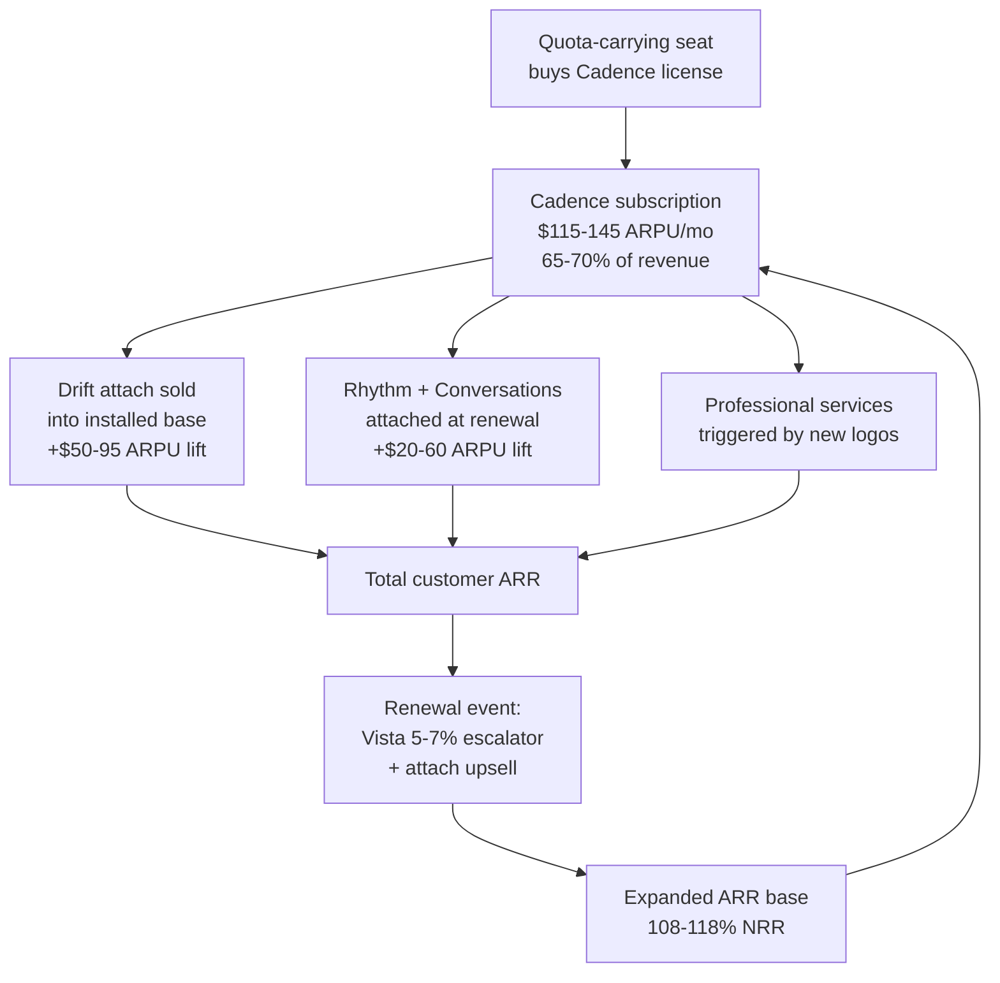

### Direct Answer

Salesloft makes money in 2027 the way every Vista Equity Partners-owned B2B SaaS makes money: a **per-seat-per-month subscription business sold to revenue teams**, layered with attached products, professional services, and renewal escalators, and monetized through multi-year commits and the disciplined cross-sell of acquired adjacencies. The honest revenue picture is roughly **$770M-$820M ARR in the base case and $870M-$960M in the bull case** if the Drift cross-sell hits Vista's stated attach targets. The model is not a transaction business, not a usage business, and not a marketplace — it is a **classic seat-based annual recurring revenue platform** with 75-82% gross margin and 108-118% net revenue retention, engineered around four interlocking streams: Cadence subscriptions, Drift attach, signal-and-intelligence SKUs, and services plus renewal escalators.

> **TL;DR**
> - **Core engine:** Cadence sequencing seats at $115-$145 effective ARPU/month — ~65-70% of revenue ($530M-$580M ARR).
> - **Attach layer:** Drift conversation-marketing bundled into Cadence at $50-$95 ARPU lift — ~20-25% of revenue ($155M-$205M ARR).
> - **Intelligence SKUs:** Rhythm signal orchestration plus Conversations intelligence — ~5-10% of revenue ($40M-$80M ARR).
> - **Services + escalators:** Implementation, training, and the Vista-trademark 5-7% annual renewal price increase — ~5-8% of revenue ($40M-$65M ARR).
> - **Unit economics:** 75-82% gross margin, 108-118% NRR, 14-20 month CAC payback on new logos, 5-9 months on attach, multi-year commits the norm in enterprise.
> - **Buyer takeaway:** You are buying a seat license that escalates on renewal — model the 5-7% bump and the Drift attach pressure into your three-year TCO before you sign.

This answer triangulates the revenue model from Vista Equity Partners' public M&A posture, Salesloft's pre-acquisition financial disclosures, the 2024 Drift acquisition, comparable Vista-owned SaaS unit economics, and operator-side procurement data. No company-confirmed ARR figure exists for 2027 because Salesloft is private; every number here is a triangulated range, not a reported figure, and is flagged as such throughout.

## 1. The Core Revenue Architecture — How A Seat License Becomes $800M ARR

Salesloft's revenue model is deceptively simple on the surface and structurally sophisticated underneath. Understanding how the company makes money requires separating the **billing mechanic** — what shows up on the customer's invoice — from the **monetization strategy** — how Vista compounds that invoice over a multi-year hold period. Most coverage of Salesloft conflates the two and ends up either over-simplifying ("they sell software subscriptions") or over-complicating ("it's a complex multi-product platform"). The truth is that the billing mechanic is genuinely simple and the monetization strategy is genuinely sophisticated, and you cannot understand the business until you hold both ideas at once.

### 1.1 The billing mechanic — seats, not usage

Salesloft bills per **quota-carrying seat per month**, contracted annually and paid annually or quarterly in advance. A revenue team of 200 sales development representatives and account executives buys 200 Cadence licenses; the invoice is `seats × ARPU × 12`, with the annual figure committed up front. This is the single most important fact about the model, and it deserves to be stated as bluntly as possible: Salesloft revenue is **not metered**. It does not rise and fall with the number of emails sent, calls dialed, sequences launched, or meetings booked. A customer who logs in once a month pays exactly what a customer who runs 4,000 touches a day pays, seat for seat, dollar for dollar.

That single design choice cascades through the entire business. A usage-metered business — think Twilio (TWLO) charging per message, or Snowflake (SNOW) charging per unit of compute — captures upside automatically whenever customers do more. Activity growth equals revenue growth with no sales motion required. A seat business does not work that way. A seat business captures upside only when customers **hire more reps** (more seats) or **buy more SKUs** (more attach). There is no third lever for organic expansion. This is why Salesloft's growth narrative is structurally tied to two forces largely outside its control — its customers' headcount decisions and the broader sales-hiring economy — and only one force genuinely inside its control: the attach rate of additional products.

It is also why the Vista playbook leans so hard on price escalators and cross-sell. Those are the *only* monetization levers a pure seat business actually owns once seat counts are set. A growth-stage company can paper over this with aggressive logo acquisition; a mature, leveraged-buyout-owned company has to extract more from the base. The seat model, in other words, forces the escalator-and-attach strategy — it is not an arbitrary choice by Vista, it is the logical consequence of the billing mechanic. (See q1851 for whether the Cadence seat itself still justifies its price in 2027, and q1850 for how usage-priced AI-native rivals exploit exactly this seat-business rigidity.)

There is one nuance worth flagging: not every Salesloft seat is identical. The platform distinguishes between full quota-carrying seats and lighter-weight or read-only roles (managers, operations staff, occasional users), and pricing can differ across them. But the dominant revenue contributor is the full sequencing seat sold to a working SDR or AE, and that is the seat this answer models throughout.

### 1.2 The four interlocking revenue streams

The roughly $800M base-case ARR decomposes into four streams that reinforce each other rather than operating independently:

| Revenue stream | Billing basis | Effective ARPU / lift | Share of revenue | Est. ARR (base case) |
|----------------|---------------|----------------------|------------------|---------------------|
| Cadence subscriptions | Per seat / month, annual commit | $115-$145 per seat/mo | 65-70% | $530M-$580M |
| Drift attach | ARPU lift per Cadence seat | $50-$95 lift per seat/mo | 20-25% | $155M-$205M |
| Rhythm + Conversations intelligence | Adjacent SKU, per seat or per org | $20-$60 lift per seat/mo | 5-10% | $40M-$80M |
| Professional services + escalators | One-time fees + renewal uplift | 5-7% annual price increase | 5-8% | $40M-$65M |

The word **interlocking** is doing real work in that sentence. These are not four separate businesses that happen to share a logo. Drift attach is sold *into* the installed Cadence base, so it structurally cannot exist without Cadence — there is no standalone Drift go-to-market motion of meaningful scale anymore. Rhythm and Conversations are *attached* at the customer's renewal moment, so they ride the Cadence renewal cycle and cannot be decoupled from it. Professional services are *triggered* by net-new Cadence logos and by expansion events, so services revenue is a derivative of Cadence sales velocity. Pull the Cadence seat out of the center and the other three streams collapse like a structure losing its keystone — which is precisely the strategic vulnerability examined in q1850 (AI-native competition) and q1854 (the Outreach comparison).

This interlocking design is also a strength, not just a dependency. Because every stream rides the Cadence relationship, Salesloft can monetize the entire bundle through a single account team, a single renewal conversation, and a single contract. The customer does not field four separate vendor relationships; Salesloft does not run four separate go-to-market motions. The operating leverage of one relationship carrying four revenue streams is a meaningful margin advantage, and it is a large part of why the model can sustain 75-82% gross margins.

### 1.3 Why the ARR figure is a range, not a number

Salesloft has been private since Vista Equity Partners acquired it in a deal valued at roughly $2.3 billion in early 2022, and it stopped publishing audited financials at that point. The 2024 Drift acquisition added a second private revenue base that was never separately disclosed. Therefore **no 2027 ARR figure is company-confirmed**, and any source claiming a precise number is either guessing or misrepresenting an estimate as a fact.

The $770M-$820M base case in this answer is triangulated from four independent inputs:

- **Pre-acquisition revenue baseline.** Salesloft was reported around the time of the Vista deal to be generating revenue in the $200M+ range for 2021, consistent with the size of company Vista typically acquires.
- **Category growth rate.** Mid-market sales-engagement has compounded in the mid-teens to low-twenties percent range; applying a blended 15-22% compound growth rate to a $200M+ 2021 base across five-plus years lands in the high-$600M to mid-$800M range before the Drift contribution.
- **The Drift revenue base.** Drift was independently estimated in the $80M-$120M annual revenue range before the 2024 acquisition; even with attrition and re-platforming, a meaningful portion of that base persists inside Salesloft's 2027 number.
- **The Vista escalator overlay.** Vista's known pattern of pushing renewal escalators adds roughly 4-6 points of inorganic revenue growth annually, which compounds the organic figure.

Stack those four inputs and the base case settles in the $770M-$820M band, with a bear case of roughly $680M-$740M and a bull case of $870M-$960M. **Treat every dollar figure in this answer as a modeled estimate, not a disclosure.** The ranges are wide on purpose; narrowing them to false precision would be dishonest. (See q1848 for the standalone question of whether 15%+ growth is even achievable for Salesloft post-Vista, and q1847 for how the Vista playbook itself reshapes the growth trajectory.)

The diagram makes the compounding visible: every renewal event is not a flat re-up but a price-and-attach expansion, and the expanded base feeds the next cycle's renewal. That feedback loop — escalate, attach, expand, re-escalate — is the entire Vista monetization thesis compressed into one circuit.

## 2. Stream One — Cadence Subscriptions, The 65-70% Engine

Cadence is the product most people mean when they say "Salesloft." It is the sales-engagement sequencing platform: it builds and executes multi-step outreach plays — email, call, LinkedIn task, video message — across a representative's prospect list, and it reports on which steps and which messaging actually convert. Everything else Salesloft sells is sold on top of, or alongside, the Cadence seat. Get Cadence right and you understand two-thirds of the revenue.

### 2.1 How Cadence is priced and packaged

Cadence is sold in tiered packages — historically branded around an Essentials / Advanced / Premier structure — with the per-seat list price climbing as each tier adds analytics depth, integration breadth, AI features, admin and governance controls, and support level. Public list pricing for sales-engagement platforms in this category clusters in the **$75-$165 per seat per month** band. Salesloft's *effective* ARPU — the actual realized revenue per seat after volume discounting, multi-year commit concessions, and promotional pricing — lands in the **$115-$145 per seat per month** range for mid-market and lower-enterprise buyers.

The spread within that band is not random. It is a direct function of negotiating leverage:

| Cadence buyer segment | Typical seat count | Effective ARPU/seat/mo | Annual contract value | Commit length norm |
|-----------------------|--------------------|-----------------------|----------------------|--------------------|
| Lower mid-market | 25-75 | $135-$145 | $40K-$130K | 1 year |
| Core mid-market | 75-300 | $120-$135 | $108K-$485K | 1-2 years |
| Upper mid-market | 300-800 | $115-$128 | $415K-$1.2M | 2-3 years |
| Lower enterprise | 800-2,000 | $108-$120 | $1M-$2.9M | 3 years |

Small teams pay toward the top of the band on a per-seat basis because they have the least procurement leverage and the least appetite for a long competitive evaluation. Thousand-seat enterprise deals pay toward the bottom because volume discounting is real — but those deals generate vastly more total contract value and, critically, lock in for longer terms. The model deliberately trades per-seat price for term length and total contract value as it moves upmarket.

### 2.2 Why mid-market is the sweet spot

Salesloft monetizes mid-market revenue teams of roughly 50-2,000 reps more efficiently than it monetizes either extreme of the market, and this is a structural fact worth dwelling on.

Below 50 seats, the economics get thin. Customer acquisition cost — the fully loaded sales, marketing, and onboarding expense of winning a logo — does not amortize cleanly against a contract worth less than $100K. The deal still requires a salesperson, a demo cycle, a security questionnaire, and an implementation. The CAC payback period on a small deal stretches uncomfortably long. This is why pure small-business sales engagement tends to be served by product-led, self-serve tools rather than by a Salesloft-style assisted-sales motion.

Above 2,000 seats, a different problem appears. The buyer is now large enough to demand serious procurement concessions, a full enterprise security and compliance review, custom contractual terms, and — almost always — a competitive bake-off against Outreach or an AI-native challenger. The deal is large and attractive, but it is expensive to win, slow to close, and discounted hard.

The 50-2,000 band is where the sales motion produces the cleanest unit economics: a defined evaluation that does not drag for nine months, a security review that is real but manageable, and a one-to-three-year commit at a price that holds. This segmentation is why Salesloft's enterprise push — the move to win larger logos, including the strategy of targeting the HubSpot CRM installed base covered in q1857 — is a *growth* layer built on top of a *cash-generative* mid-market core. It is not a replacement for the core; it is an expansion bet funded by the core.

### 2.3 The multi-year commit as a monetization weapon

Under Vista ownership, multi-year commits are not a customer convenience — they are a deliberate revenue instrument, and treating them as anything less misreads the model. A three-year Cadence commitment does four distinct things for Salesloft:

1. **It locks the logo through the danger window.** The biggest threat to Salesloft is an AI-native competitor whose product is maturing fast. A three-year commit takes the customer off the table for the exact period during which a challenger's product might become genuinely competitive.
2. **It bakes the escalator into a contracted schedule.** Instead of negotiating a 5-7% price increase every single year — a friction-filled conversation that risks triggering a competitive look — the escalator is written into the contract as a pre-agreed schedule. The customer signs the increases up front.
3. **It converts churn risk into a contracted receivable.** A multi-year commit is a contractually committed revenue stream, which materially improves the company's standing with the lenders who hold the leveraged-buyout debt. Contracted future revenue is collateral.
4. **It front-loads cash.** Multi-year deals are frequently paid annually in advance, and the longer commitment improves cash flow predictability — the single metric an LBO-owned company cares about most.

The trade Salesloft offers the buyer in exchange for all of this is a modest per-seat discount. For a procurement team, that discount is real money. But so is the escalator schedule the buyer is now contractually committed to, and so is the loss of optionality if a better tool emerges in year two. (See q1851 for the buyer-side analysis of whether locking into a multi-year Cadence commit is the right call in 2027.)

### 2.4 Cadence revenue math, illustrated

The arithmetic is worth working through concretely. A core mid-market customer with 180 seats at a $128 effective ARPU generates `180 × $128 × 12 = $276,480` in annual Cadence ARR. Scale that up: an upper-mid-market customer with 500 seats at $122 generates `500 × $122 × 12 = $732,000`. A lower-enterprise customer at 1,400 seats and $114 generates `1,400 × $114 × 12 = $1,915,200`.

Now reverse the calculation to sanity-check the $530M-$580M Cadence ARR base. If the blended annual contract value across all Cadence customers sits in the $50K-$60K range — reasonable given the segment mix above, which is weighted toward the more numerous mid-market deals — then Salesloft would need on the order of **9,000-11,000 active Cadence customers** to produce that ARR. That customer count is itself a triangulated estimate; Salesloft has not published a logo count since the Vista deal. But the cross-check holds: ARR band divided by blended ACV lands in a consistent, plausible customer-count range. When two independent estimates (top-down ARR and bottom-up customer count × ACV) reconcile, confidence in both rises.

### 2.5 The renewal as the real revenue event

One subtlety that gets lost in seat-count math: for a mature business like Salesloft, the **renewal**, not the new-logo sale, is the dominant revenue event. With 9,000-11,000 customers and a multi-year commit norm, several thousand renewals run through the system every year, and each renewal is an opportunity to apply the escalator and attach additional SKUs. New-logo bookings matter for growth optics, but the renewal book is where the cash actually compounds. This is why the customer success and account management organization — not just the new-business sales team — is a revenue-generating function in the Vista model, and why its efficiency is a core driver of the unit economics covered in Section 6.

## 3. Stream Two — Drift Attach, The 20-25% Cross-Sell

In 2024 Salesloft acquired Drift, the conversation-marketing and chat platform, and folded it into the revenue model as an **attach product**: a SKU sold into the existing Cadence base rather than to net-new logos through an independent go-to-market motion.

### 3.1 What Drift adds to the invoice

Drift's core capability is real-time website chat and conversational marketing — capturing inbound demand the moment a prospect lands on a web page, routing that conversation to the right person or bot, and qualifying it before it ever reaches a form. Bundled into the Cadence motion, Drift is positioned as the **inbound complement** to Cadence's outbound sequencing. The narrative Salesloft sells is clean: Cadence works the cold outbound list, Drift works the warm inbound web traffic, and the combined platform delivers "full-funnel revenue engagement" — one vendor covering both directions of the demand funnel.

On the customer's invoice, Drift typically shows up as a **$50-$95 per-Cadence-seat ARPU lift**, or, for some customers, as a separate organization-level SKU priced on conversational volume or seats. The packaging varies; the economic effect is the same — Drift raises the average revenue Salesloft extracts from each customer relationship without requiring a new customer.

### 3.2 The attach rate is the entire Drift thesis

Drift contributes roughly 20-25% of total revenue in the base case, but that headline number is entirely a *function of the attach rate* — the percentage of Cadence customers who also buy Drift — and the attach rate is the single metric Vista watches most closely on this acquisition. The triangulated scenario picture:

| Drift attach scenario | Attach rate into Cadence base | Drift ARR contribution | Strategic read |
|-----------------------|-------------------------------|------------------------|----------------|
| Bear case | 28-34% | $130M-$160M | Drift treated as a feature, not a platform; integration friction limits pull |
| Base case | 35-44% | $155M-$205M | Vista's cross-sell motion working at a credible mid-market pace |
| Bull case | 48-58% | $230M-$290M | Drift becomes a true second product line; validates the acquisition price |

Vista's stated internal ambition is to push attach toward and past 50% — the bull-case threshold. Whether that is realistic is genuinely contested, and this answer will not pretend the outcome is settled. The case *for* the bull scenario: the cross-sell is cheap (Section 3.3), the account teams are already in the building, and the full-funnel story resonates with revenue leaders who want to consolidate vendors. The case *against*: integration friction is real, the combined product has to be meaningfully better than buying Cadence plus a standalone chat tool, and conversational marketing as a category has cooled from its peak hype. The honest 2027 planning number is the **base case of 35-44%**; the bull case is a possibility to be earned, not an assumption to be banked. Both the upside and the risk are dissected in q1858 (what Salesloft should do about Drift acquisition value) and q1859 (whether Salesloft's conversation marketing can beat Drift's standalone competitors).

### 3.3 Why attach revenue is structurally cheaper to acquire

The reason Vista loves attach revenue comes down to one number: customer acquisition cost. Selling Drift to an existing Cadence customer costs a small fraction of selling Cadence to a cold logo. Walk through what is *not* required for an attach sale: there is no new security and compliance review (the customer already cleared Salesloft), no new procurement relationship to build (the contract and the legal terms already exist), no new economic buyer to identify, and no new internal champion to recruit and nurture. The customer success and account management team that *already owns* the Cadence relationship runs the Drift expansion as a natural extension of the renewal conversation.

The result is that attach revenue lands at a dramatically better CAC payback than net-new logo revenue — single-digit months versus the 14-20 months a new logo typically takes (see Section 6 for the full unit-economics table). When a dollar of attach revenue costs a fifth of what a dollar of new-logo revenue costs to acquire, and carries the same or better gross margin, a rational owner pushes attach as hard as the customer base will tolerate. This is not a Salesloft quirk — Outreach runs the same logic on its adjacencies, HubSpot (HUBS) runs it across its hub portfolio, and ZoomInfo (GTM) runs it on its data and engagement attach. Cross-sell-into-the-base is the dominant monetization pattern in mature B2B SaaS, and Drift is Salesloft's purest expression of it. (See q1854 for how the Salesloft attach motion stacks up directly against Outreach's.)

### 3.4 The risk hidden inside the attach number

There is a subtlety that the headline 20-25% can obscure. Attach revenue is cheap to acquire but it is *not* free of risk, because attach revenue concentrates the customer relationship. A customer running both Cadence and Drift has more of its revenue stack inside one vendor — which is great for Salesloft's NRR while the relationship is healthy, but it also means a single dissatisfied customer now represents a larger ARR loss if it churns. Attach raises both the revenue per customer and the stakes per customer. A model that depends on pushing attach toward 50% is, by construction, a model with rising customer concentration risk. Vista's bet is that the switching costs created by the deeper integration (Section 4) more than offset that concentration. It is a reasonable bet, but it is a bet.

## 4. Stream Three — Rhythm And Conversations, The Intelligence Layer

The third revenue stream is the cluster of intelligence and orchestration SKUs — principally **Rhythm**, Salesloft's signal-orchestration product, and **Conversations**, its call-and-meeting intelligence product. Together they contribute a modest 5-10% of revenue, but their strategic role is far larger than their revenue share suggests.

### 4.1 What these SKUs monetize

Rhythm ingests buying signals — prospect engagement data, third-party intent signals, CRM field changes, product-usage events — and converts them into a prioritized, ranked action list for each representative, surfacing "do this next" recommendations directly inside the Cadence workflow. The pitch is that Rhythm turns a firehose of disconnected signals into a focused daily to-do list, raising rep productivity by removing the cognitive load of deciding what to work on.

Conversations records, transcribes, and analyzes sales calls and meetings, generating coaching insights, talk-track analytics, competitive-mention tracking, and deal intelligence. The pitch is that Conversations turns every recorded call into structured, searchable, coachable data.

Both are sold as **ARPU-lift SKUs** attached at the customer's renewal, typically adding $20-$60 per seat per month depending on tier and on whether the customer takes one product or both. They are not, in practice, sold standalone to net-new logos at meaningful scale — like Drift, they ride the Cadence relationship.

### 4.2 The strategic role — moat, not cash cow

Rhythm and Conversations contribute only 5-10% of revenue, so this stream is decidedly *not* where the money is. Its real job is different and more important: it is the **retention-and-defense layer** of the entire revenue model.

The mechanism is switching cost. Rhythm and Conversations make the Cadence seat structurally stickier by embedding more of the representative's daily workflow inside Salesloft. Consider a customer running all three — Cadence plus Rhythm plus Conversations. To switch away from Salesloft, that customer must now replace three products, not one. It must re-create three products' worth of admin configuration, re-train reps on three products' worth of workflow, and accept the loss of three products' worth of accumulated historical data — the sequencing performance history, the signal-scoring tuning, the recorded-call archive and its coaching insights. Each additional attached product multiplies the friction of leaving.

That accumulated friction is the **moat** against the AI-native sequencing tools — the competitive threat examined directly in q1850 — and against HubSpot's bundling pressure, examined in q1855. A customer might be tempted by a cheaper or faster-iterating AI-native sequencer, but if switching means abandoning three products' worth of embedded workflow and data, the temptation has to clear a much higher bar.

| Intelligence SKU | What it monetizes | ARPU lift | Primary strategic function |
|------------------|-------------------|-----------|---------------------------|
| Rhythm | Signal orchestration / next-best-action | $20-$45 per seat/mo | Workflow lock-in; AI-native defense |
| Conversations | Call & meeting intelligence | $25-$60 per seat/mo | Coaching value; data-gravity moat |
| Combined attach | Both SKUs on one account | $40-$90 per seat/mo | Maximum switching cost |

### 4.3 The honest limitation

The intelligence layer is a real moat, but it is important to be precise about *what kind* of moat it is — because the wrong description leads to the wrong investment conclusion.

Rhythm and Conversations both compete in crowded categories. Conversation intelligence has well-funded, focused specialists, with Gong as the recognized category leader and several other credible players. Signal orchestration and next-best-action is exactly the territory the AI-native challengers are attacking most aggressively, because it is where modern AI capability is most visibly differentiating. In a head-to-head, feature-by-feature evaluation, it is not obvious that Rhythm or Conversations wins.

Salesloft's advantage here is therefore **distribution, not product superiority**. It can attach these SKUs at renewal to a captive installed base without forcing a competitive bake-off, because the customer is already inside the platform and the incremental sell is framed as "add this to what you already have." That is a genuine and valuable advantage — distribution moats are real moats. But a distribution moat behaves differently from a product moat: it holds as long as the customer has no compelling reason to look outside, and it erodes the moment the customer *does* have such a reason. If an AI-native intelligence tool becomes dramatically better, the distribution advantage buys Salesloft time, not permanent safety. (q1849, the dedicated analysis of Salesloft's overall AI strategy, examines whether the intelligence layer can stay competitive on the merits rather than on distribution alone.)

### 4.4 Why a 5-10% stream still matters to the math

It is worth resisting the temptation to dismiss the intelligence layer because its revenue share is small. Two reasons it matters disproportionately to the model. First, it is high-margin attach revenue (78-84% gross margin per Section 6), so its contribution to *profit* and *free cash flow* is larger than its contribution to *revenue*. Second, and more importantly, its real output is not the 5-10% of ARR it books — it is the *reduction in churn across the other 90%+ of ARR*. A point of churn avoided on a $530M-$580M Cadence base is worth far more than the entire intelligence stream's direct revenue. The intelligence layer should be valued as a churn-suppression investment that happens to also pay for itself, not as a minor product line.

## 5. Stream Four — Services And The Renewal Escalator

The fourth stream — professional services plus renewal escalators — is the smallest by revenue share at 5-8%, but it punches dramatically above its weight in both margin contribution and customer lock-in. Underestimating this stream is the most common analytical error in coverage of Salesloft.

### 5.1 Professional services

Professional services covers implementation, onboarding, technical configuration, CRM integration work, sequencing-strategy consulting, and rep training. It is sold as one-time fees attached to net-new logos and to significant expansion events. The dollar amounts are modest relative to subscription revenue, and the gross margin on services — which involves real human consulting hours — is meaningfully lower than software margin, sitting in the 45-60% range.

So why does an LBO-disciplined owner like Vista keep a lower-margin services line at all, rather than outsourcing it to partners and booking only the high-margin software? Because services is a **lock-in instrument disguised as a revenue line**. A customer that has paid Salesloft to configure its sequencing logic, integrate its CRM and data sources, build its play library, and train its reps on the platform has sunk a switching cost that has *nothing to do with the software license*. That investment of money and organizational effort does not transfer to a competitor. Services revenue is, in effect, the customer pre-paying for its own captivity — and the lower gross margin is a price Vista happily pays for the retention benefit. The services line is a churn-suppression mechanism that also happens to be modestly cash-positive.

### 5.2 The renewal escalator — Vista's signature move

The renewal escalator is the most important small number in the entire revenue model, and it deserves its own careful treatment.

Vista Equity Partners is known across its large software portfolio for applying a disciplined annual price increase — commonly cited in the **5-7% range** — to renewing customers. This is not unique to Salesloft; it is a Vista-portfolio-wide operating practice. The mechanics are simple and the financial effect is profound. On a $300K Cadence contract, a 6% escalator is $18,000 of additional ARR — recurring, compounding, with **zero incremental customer acquisition cost** and a gross margin near 100% because no new product, no new sales effort, and no new infrastructure is required to capture it.

Now scale that across the base. Apply a blended *effective* escalator of roughly 5% — effective, because not every customer accepts the full sticker increase; some negotiate it down, a few resist it entirely — across a $530M-$580M Cadence ARR base, and the escalator alone generates roughly **$26M-$29M of inorganic ARR growth per year before a single new seat is sold to anyone.** Layer in the escalator's effect on the attach streams and the total inorganic contribution climbs further.

| Monetization lever | Incremental CAC | Gross margin | Annual ARR contribution (est.) |
|--------------------|-----------------|--------------|-------------------------------|
| Net-new logo acquisition | High | 75-82% | Variable, expensive to grow |
| Drift / intelligence attach | Low | 78-84% | $30M-$70M |
| Renewal price escalator | Near zero | ~98% | $26M-$35M |
| Professional services | Moderate | 45-60% | $8M-$15M |

The escalator is the reason Vista-owned SaaS companies can post respectable revenue growth even in years when *seat counts are completely flat*. It is the cleanest, cheapest growth a software business can buy. It is also, for that exact reason, the single most important thing a Salesloft buyer must model: your renewal quote in year two and year three is **not flat**, and a financial model that assumes flat renewal pricing will understate three-year cost by a material amount. (q1847 covers the full Vista playbook reshaping Salesloft; q1851 covers whether to lock into a multi-year Cadence commit knowing the escalator schedule is part of the deal.)

### 5.3 The escalator's limit

The escalator is powerful, but it is emphatically *not* infinite, and pretending otherwise produces a dangerously optimistic model.

The escalator works only as long as the buyer's *perceived value* of the platform stays comfortably ahead of the *price*. As long as the gap between value and price is wide, a 6% increase is absorbed with mild grumbling and the customer re-signs. But the gap is not fixed. Every year, the escalator narrows it from the price side. And on the value side, the rise of credible AI-native competitors — some priced lower, some priced on usage — narrows it from the value-comparison side. At some point for some segment of customers, the cumulative escalator pushes the price past the perceived value, and the renewal conversation flips: the 6% increase becomes the *trigger* that makes the customer run a competitive evaluation rather than quietly re-sign.

Vista understands this dynamic, which is why the escalator is never deployed alone. It is paired with multi-year commits (lock the customer past the danger window so the escalator is contractually pre-agreed) and with attach (raise the perceived-value side of the equation faster than the escalator raises the price side). The escalator and the moat are not two separate strategies — they are two halves of one strategy, and the escalator only stays a growth lever as long as the moat half keeps working.

### 5.4 Modeling services and escalators together over a contract life

For a buyer or analyst, the practical takeaway is to model services and escalators as a *combined* three-year effect. Year one carries a one-time services fee on top of the subscription. Years two and three carry compounding escalators. A $300K year-one subscription with a $40K implementation fee and a 6% escalator costs `$340K + $318K + $337K = $995K` over three years — versus the $900K a naive flat-price model would project. That ~10% gap is exactly the money a procurement team leaves on the table when it negotiates the year-one number and ignores the contract-life math.

## 6. Unit Economics — Margin, Retention, And The LBO Math

A revenue model is only as good as the unit economics underneath it. Two companies can both "sell software subscriptions to revenue teams" and have completely different businesses depending on their margins, their retention, and their cost of acquiring customers. Salesloft's economics are the economics of a mature, leveraged-buyout-owned SaaS company — and that overlay explains the *behavior* of the whole model.

### 6.1 Gross margin

Salesloft's software gross margin sits in the **75-82%** range — standard for a hosted, multi-tenant SaaS application with meaningful but not extreme cloud-infrastructure cost. The blended gross margin, which includes the lower-margin professional-services line, lands a few points lower than the software-only figure. Vista's operating discipline pushes cloud-hosting efficiency and support automation hard across its portfolio, which is why Salesloft's software-only gross margin holds toward the *top* of that band rather than the middle. Margin discipline is not glamorous, but in an LBO it is survival: every point of gross margin is cash available to service debt.

### 6.2 Net revenue retention

Net revenue retention — the percentage of a prior period's recurring revenue retained from the *same cohort* of customers in the current period, including expansion and net of churn and contraction — is triangulated at **108-118%** for 2026, with a planning midpoint around 112%.

NRR above 100% is the single most powerful property a subscription business can have, because it means the installed base **grows on its own**, before a single new logo is added. An NRR of 112% means that if Salesloft signed zero new customers in a year, revenue would still grow 12% from the existing base alone. Three of the four revenue streams feed NRR directly: the escalator pushes it up, the Drift attach pushes it up, the intelligence-SKU attach pushes it up. Working *against* NRR is seat-count contraction — customers who downsized their sales teams and therefore renewed for fewer seats. The net of those forces is the 108-118% range. (q1856 is the dedicated deep-dive on the Salesloft NRR figure, including how to read it and what could move it.)

| Unit economics metric | Triangulated 2026-27 range | Planning midpoint | What moves it |
|-----------------------|---------------------------|-------------------|---------------|
| Software gross margin | 75-82% | ~79% | Hosting efficiency, support automation |
| Net revenue retention | 108-118% | ~112% | Escalator + attach vs. seat contraction |
| CAC payback (new logo) | 14-20 months | ~17 months | Sales efficiency, win rate, discounting |
| CAC payback (attach) | 5-9 months | ~7 months | Installed-base cross-sell efficiency |
| Rule of 40 (est.) | 35-48 | ~42 | Growth rate + free cash flow margin |
| Logo gross retention (est.) | 86-92% | ~89% | Competitive churn, customer health |

### 6.3 The LBO overlay

Salesloft is a leveraged buyout, and this fact is not a footnote — it is the organizing principle of the entire revenue model. Vista financed a meaningful portion of the roughly $2.3 billion acquisition with debt, and that debt has to be serviced from Salesloft's operating cash flow. Every characteristic of the revenue model traces back to that single constraint.

Why the emphasis on multi-year commits? Because they produce predictable, contracted cash for debt service. Why the escalator? Because it delivers inorganic growth that does not require spending money to capture. Why the relentless push on attach? Because attach is the cheapest revenue available. Why the operating discipline on hosting and support costs? Because every dollar of cost removed is a dollar of free cash flow available to pay down the loan. Why the segmentation discipline that concentrates on the cash-efficient 50-2,000-seat mid-market? Because CAC-efficient revenue serves the debt better than expensive enterprise land-grabs.

A growth-stage, venture-backed Salesloft would optimize for top-line growth almost regardless of cost — that is what venture capital pays for. The LBO-stage Salesloft optimizes for something different and more disciplined: **predictable, escalating, cash-generative recurring revenue.** The revenue model is a direct, legible expression of the capital structure. Read it as anything else and you will misjudge both its strengths and its limits. (q1846, on whether Salesloft is worth buying, and q1860, on Pipeline AI versus Clari, both rest on understanding this LBO overlay.)

### 6.4 The Rule of 40 read

The Rule of 40 — the heuristic that a healthy SaaS company's revenue growth rate plus its free-cash-flow margin should sum to at least 40 — is a useful lens for placing Salesloft.

Combining a triangulated 15-20% growth rate with an estimated high-single-digit-to-low-double-digit free-cash-flow margin puts Salesloft's Rule of 40 score in roughly the **35-48 range**, with a midpoint around 42. That is a respectable score for a mature, profitable, LBO-owned SaaS company. It is well short of a hypergrowth venture darling posting a score of 60 or 70 on the strength of explosive growth — but matching a hypergrowth darling is not the goal. The Vista model is not designed to maximize the Rule of 40 score; it is designed to maximize *predictable free cash flow* while keeping growth credible enough to support a strong valuation multiple at exit. A score in the low-40s, achieved with low volatility and high cash conversion, is exactly the profile that supports the eventual sale or recapitalization that delivers Vista's return.

### 6.5 What the unit economics tell a buyer

For a buyer, the unit-economics table is not abstract — it is a negotiating brief. The 14-20 month new-logo CAC payback tells you Salesloft has a real incentive to win your logo and to keep it; that is leverage you can use on a new deal. The near-100%-margin escalator tells you the renewal increase is almost pure profit for Salesloft, which means there is room to negotiate it down without Salesloft losing money — the escalator cap is a winnable concession. The 108-118% NRR tells you Salesloft's whole model assumes you will expand; if your seat count is flat or shrinking, you are a worse-than-average customer for them and you should price that reality into your ask. Unit economics cut both ways at the negotiating table.

## 7. How The Model Compares — Salesloft Versus Its Competitive Set

Salesloft's revenue model is best understood not in isolation but against the genuine alternatives a buyer is weighing in a real evaluation. The comparison clarifies what is distinctive about Salesloft and what is simply standard for the category.

### 7.1 Versus Outreach

Outreach is Salesloft's closest competitor, and it runs a model that is near-identical in *kind*: a seat-based sales-engagement subscription, an attach motion layered on top, and a push to win larger enterprise logos. The differences between the two revenue models are differences of *degree*, not of *kind*. Outreach has historically leaned harder into pure enterprise, accepting the longer sales cycles and heavier discounting that come with it; Salesloft has monetized the mid-market more efficiently, as Section 2.2 described. Both companies are subject to identical AI-native pricing pressure because they share the seat-based architecture.

The practical implication: a buyer choosing between Salesloft and Outreach is choosing on product fit, on whether their motion is mid-market or enterprise-flavored, and on price — *not* on a fundamentally different way of making money. Neither vendor offers an escape from the seat model. (q1854 is the dedicated, head-to-head Salesloft-versus-Outreach comparison.)

### 7.2 Versus HubSpot

HubSpot monetizes very differently, and the difference is the source of a real structural threat. HubSpot is a multi-hub platform — Sales Hub is one hub among Marketing Hub, Service Hub, Content Hub, and Operations Hub — sold heavily into small business and the lower mid-market through a product-led-growth motion and an aggressive bundling strategy.

HubSpot's threat to Salesloft is not that it builds a better sequencing engine. The threat is **bundling economics**. A company already paying HubSpot for CRM, marketing, and service can add Sales Hub sequencing as one more line item on an existing bill, frequently at an effective incremental price well below a standalone $115-$145-per-seat Salesloft license. For a price-sensitive mid-market buyer, "good-enough sequencing already bundled with the CRM I run" is a genuinely compelling alternative to "best-of-breed sequencing from a separate vendor." That is a direct structural pressure on Salesloft's core 65-70% Cadence stream, and it is a different and arguably more dangerous threat than a feature-level competitor. (q1855 covers Salesloft's defense against HubSpot bundling; q1857 covers Salesloft's counter-move to win the HubSpot CRM installed base by attacking from the engagement-depth angle.)

### 7.3 Versus AI-native sequencing tools

The AI-native challengers are the genuine *model-level* threat — the one that attacks not Salesloft's product but its pricing architecture. Many of these challengers price on **usage or outcomes** rather than on seats, and a usage model can undercut a seat model dramatically for the right customer.

The asymmetry is best shown with a concrete example. Consider a 200-seat customer whose actual usage is uneven: 60 reps are heavy daily users of the sequencing engine, and 140 are light or occasional users. A per-seat license charges for all 200 seats at full ARPU regardless of who actually uses the product. A usage-based model charges in proportion to the 60 heavy users' actual activity. For that customer, the usage model could cost a fraction of the seat model — and crucially, the customer can *see* the difference, because the usage model's bill maps to reality while the seat model's bill maps to a headcount. That visible, defensible cost gap is the wedge the AI-natives drive, and it is the single biggest long-term pressure on Salesloft's Cadence stream. (q1850 is the dedicated analysis of how Salesloft competes against AI-native sequencing tools, and q1849 covers whether Salesloft's own AI roadmap can neutralize the threat.)

| Competitor type | Pricing basis | Threat to Salesloft model | Salesloft's defense |
|-----------------|---------------|---------------------------|---------------------|
| Outreach | Seat-based, near-identical | Low — same model, share fight | Mid-market efficiency, product fit |
| HubSpot Sales Hub | Bundled hub line-item | High — bundling undercuts standalone seat | Depth, enterprise features, q1855 |
| AI-native sequencers | Usage / outcome-based | High — usage undercuts seat for light users | Workflow lock-in, attach, multi-year commits |
| Gong (intelligence overlap) | Seat-based intelligence | Medium — attacks the Conversations SKU | Distribution into the captive base |
| CRM-bundled engagement (Salesforce, etc.) | Suite line-item | Medium — convenience of one vendor | Specialist depth, faster innovation |

### 7.4 The pattern across the comparison

Step back from the individual matchups and a pattern emerges. Salesloft is safe against competitors who share its model (Outreach — a share fight, not a survival fight) and exposed to competitors whose *model* is different (HubSpot's bundling, the AI-natives' usage pricing). The threat to Salesloft is not "a better mousetrap" — it is "a different way of charging for the mouse." That is the deepest single insight about the revenue model's vulnerability, and it sets up the counter-case in Section 8.

## 8. Counter-Case — Where This Revenue Picture Could Be Wrong

Intellectual honesty requires stating plainly where the model described above could break, and where the bears have a real and substantive point. A revenue answer that only presents the bull case is marketing, not analysis.

### 8.1 The ARR could be lower than the base case

The $770M-$820M base case assumes a blended 15-22% growth rate held through 2027. That assumption is exposed. If sales-team headcounts contracted across Salesloft's customer base — a real and recurring risk whenever the broader economy softens revenue hiring — then seat counts shrink at renewal, NRR drops below 108%, and the escalator partially offsets but does not fully cover the contraction. A bear ARR case of **$680M-$740M is entirely plausible** if 2026-27 turns out to be a weak hiring environment for sales roles. This is the structural cost of the seat model: Salesloft's revenue is *exposed to its customers' headcount decisions* in a way a usage business simply is not. A usage business in a downturn loses some activity; a seat business in a downturn loses whole seats.

### 8.2 The Drift attach could underdeliver

The 20-25% Drift contribution depends on a 35-44% attach rate holding. That is not guaranteed. If integration friction between Drift and Cadence is worse than assumed, if the combined product fails to be meaningfully better than buying Cadence plus a standalone chat tool, or if conversational marketing as a category continues to lose momentum, then Drift attach could stall in the high-20s percent — pulling $25M-$50M out of the base case and undercutting the entire rationale for the acquisition price Vista paid. The bull case that "validates the Drift acquisition" requires integration and product execution that is *not yet proven* as of 2027. (q1858 and q1859 are the honest, dedicated deep-dives on this specific risk.)

### 8.3 The escalator could trigger churn instead of growth

Section 5 modeled the renewal escalator as reliable inorganic ARR growth. The counter-case attacks that assumption directly. The escalator only functions as growth while perceived value leads price. In a 2027 where AI-native sequencing is genuinely good enough for a meaningful segment of customers and is priced on usage, the year-two or year-three 6% escalator could become the *event* that triggers a competitive evaluation rather than a quiet re-up. In that scenario the escalator does not add $26M-$29M of ARR — it accelerates churn and *subtracts* revenue. The escalator could, in a bad scenario, flip from a growth lever into a churn accelerant. The base-case model assumes the moat holds long enough; the bear case assumes a segment of customers reaches the value-versus-price tipping point first.

### 8.4 The AI-native pricing model could reset the category

The deepest counter-case is structural rather than tactical. If the market decisively shifts to usage-based or outcome-based pricing for sales engagement — not as a niche alternative but as the *expected* way to buy — then Salesloft's entire seat-based architecture becomes a liability rather than merely a vulnerability. Vista would face a genuinely wrenching choice: re-platform the pricing model from seats to usage and absorb a revenue-recognition shock and a wave of customer renegotiation, or defend the seat model and slowly cede share to the natives. There is no painless path through a category-wide pricing reset; every option carries a real cost. This is the scenario that should worry a Salesloft investor most, and as of 2027 it is genuinely *unresolved* — the category has not flipped, but the pressure is real and building. (q1849 on AI strategy and q1850 on AI-native competition both circle this central question.)

### 8.5 What the counter-case does *not* break

For balance — and balance cuts both ways — it is worth being precise about what the counter-case attacks and what it leaves standing. The bear case attacks the *growth rate* and the *durability* of the model. It does not attack the *existence* of the cash flow. Even in the full bear scenario — weak hiring, stalled Drift attach, escalator-triggered churn at the margin — Salesloft remains a profitable business with $680M+ of ARR, 75%+ gross margins, an NRR still above 100%, a large installed base, and high switching costs. The bear case is "slower growth and a compressed valuation multiple," not "the business model has stopped working." That distinction matters enormously for a buyer or investor: it means the right way to weigh the counter-case is on *price and growth expectations*, not as an existential, walk-away question. A reasonable investor prices the bear case into the multiple; an unreasonable one treats it as a reason the company is uninvestable. (q1846 weighs exactly this trade-off in detail.)

## 9. What This Means For Different Stakeholders

A revenue model is not an abstraction — it implies concrete, different action items depending on who is reading and why.

### 9.1 For a Salesloft buyer or renewal owner

Model the **three-year total cost of ownership**, never the year-one price in isolation. Assume a 5-7% escalator compounds on every renewal, and run the contract-life arithmetic from Section 5.4. Assume sustained, professional sales pressure to attach Drift and the intelligence SKUs at every renewal conversation — budget for it or be ready to decline it firmly. Negotiate the escalator *cap* into the contract itself: because the escalator is near-100% margin for Salesloft (Section 6.5), there is genuine room to negotiate it down, and a contracted escalator ceiling is worth more over three years than a one-time year-one discount. Finally, audit your own rep-utilization data: if a meaningful share of your reps are light users, run the explicit math on a usage-priced AI-native alternative, because the seat model may be overcharging you for seats that barely log in. (q1851 is the buyer's-eye view of the Cadence commit decision.)

### 9.2 For a competitor

Salesloft's revenue model has one clearly exposed flank: the seat-based Cadence stream charges for light users at the same rate as heavy users (Section 7.3). A usage-based or hybrid pricing model is the wedge, and it is sharpest at customers with uneven rep utilization. Understand precisely what defense you are up against: Salesloft's moat is workflow lock-in via Rhythm and Conversations, multi-year commits, and attach — that is a *distribution and switching-cost* moat, not a *product-superiority* moat (Section 4.3). Attack at renewal events, when the escalator is freshly visible and the customer's attention is on price. Lead with the pricing-model asymmetry rather than a feature checklist. Target customers whose sales headcount is flat or shrinking, because those customers are getting the worst of the seat model and the best of yours.

### 9.3 For an investor or acquirer

Salesloft is a textbook Vista-stage asset: predictable, escalating, cash-generative recurring revenue with a credible-but-not-spectacular growth rate (Section 6). The value is in the cash flow and the exit multiple, not in hypergrowth, and an investment thesis built on hypergrowth is the wrong thesis for this asset. The key diligence questions are narrow and specific: the Drift attach trajectory (is it tracking toward the base case or the bear case?), the seat-count exposure to sales-hiring cycles (how cyclical is the customer base's headcount?), and the durability of the seat model against usage-priced AI-native competition (how close is the category to a pricing reset?). Price the bear case from Section 8 into the multiple; do not assume the bull. (q1846 and q1860 are the investor-framed companions to this answer.)

### 9.4 For a revenue operations leader evaluating the category

Understand that you are choosing between two pricing *philosophies*, not merely two products. The incumbent seat model — Salesloft, Outreach — gives you budget predictability, a mature and broad feature set, and a single accountable vendor relationship. The AI-native usage model gives you cost that scales with actual use and, frequently, a faster AI iteration cadence. Neither is universally correct. The decisive input is your own data: map your representatives' utilization distribution before you decide. If utilization is even across the team, the seat model's predictability is genuinely valuable. If utilization is highly uneven, the usage model will likely save real money. The answer is not in a vendor's pitch deck — it is in your own usage logs.

### 9.5 For a Salesloft account or success manager

The internal stakeholder is worth a line too. The revenue model makes the customer success and account management function a *revenue* function, not a cost center (Section 2.5). The escalator, the attach, and the renewal all flow through the success relationship. The implication for a Salesloft CSM is that retention and expansion are the same job: every renewal is an escalator-and-attach opportunity, and every churn is a multi-stream loss. Reading the revenue model clarifies why the CSM role in a Vista-owned company carries a quota in all but name.

## 10. Conclusion — A Seat Business Engineered For Predictable Cash

Salesloft makes money in 2027 as a **seat-based annual recurring revenue B2B SaaS**, generating an estimated $770M-$820M ARR in the base case across four interlocking streams: Cadence subscriptions (the 65-70% engine), Drift attach (the 20-25% cross-sell), Rhythm and Conversations intelligence (the 5-10% moat layer), and professional services plus the Vista renewal escalator (the 5-8% margin-and-lock-in layer). The model is not metered, not transactional, and not a marketplace — it is a classic per-seat license, monetized through multi-year commits, disciplined cross-sell attach, and a 5-7% annual price escalator, all in service of the leveraged-buyout imperative to produce predictable, escalating, cash-generative revenue.

The single most important thing to carry away is that **the revenue model is an expression of the capital structure.** Vista's debt-financed ownership is the reason the model leans on commits, escalators, and attach rather than on growth-at-any-cost. Every distinctive feature of how Salesloft charges — the seat basis, the multi-year lock, the escalator schedule, the cross-sell discipline, the operating frugality — traces directly back to the need to service LBO debt and engineer a strong exit. That makes Salesloft a stable, profitable, defensible business. It also makes it a business with one real, unresolved long-term exposure: usage-priced AI-native competition that could, in the worst case, reset the entire category's pricing logic and turn the seat model from an asset into a liability.

The honest 2027 verdict on how Salesloft makes money: a well-run cash machine with a credible growth story and one genuine structural vulnerability. For a buyer, model the escalator and negotiate its cap. For a competitor, attack the seat model's light-user blind spot at renewal. For an investor, price the bear case and do not assume the bull. And for anyone weighing the company seriously, read the companion answers — q1846 on whether it is worth buying, q1847 on the Vista playbook, q1848 on whether 15%+ growth is achievable, q1849 on AI strategy, q1850 on AI-native competition, q1851 on the Cadence commit decision, q1854 on the Outreach comparison, and q1856 on net revenue retention — before you commit a dollar or a signature.

---

**Sources and references**

1. Vista Equity Partners — Salesloft acquisition announcement (2022), reported deal value ~$2.3B.
2. Reuters — coverage of the Vista–Salesloft transaction.
3. Bloomberg — reporting on the Salesloft acquisition terms and structure.
4. TechCrunch — Salesloft funding and revenue reporting pre-acquisition.
5. Salesloft — pre-acquisition revenue disclosures (~$200M+ ARR, 2021).
6. Salesloft — Drift acquisition announcement (2024).
7. Drift — pre-acquisition revenue estimates from industry reporting.
8. Vista Equity Partners — portfolio operating-model disclosures and public commentary.
9. Salesloft — Cadence product and packaging documentation.
10. Salesloft — Rhythm product overview and positioning.
11. Salesloft — Conversations product overview and positioning.
12. Drift — conversation-marketing product documentation.
13. G2 — sales-engagement category pricing benchmarks.
14. Gartner — Magic Quadrant for Sales Engagement Applications.
15. Forrester — Wave for Sales Engagement Platforms.
16. SaaS Capital — private SaaS gross margin benchmark research.
17. KeyBanc / OpenView — SaaS metrics survey on NRR and CAC payback benchmarks.
18. Bessemer Venture Partners — Cloud Index public SaaS unit-economics comparisons.
19. ICONIQ Growth — B2B SaaS retention and expansion benchmark reports.
20. Outreach — product and pricing documentation for competitive comparison.
21. HubSpot — Sales Hub pricing and bundling documentation.
22. HubSpot (HUBS) — investor disclosures on hub attach economics.
23. ZoomInfo (GTM) — disclosures on attach and cross-sell economics.
24. Gong — category positioning in conversation intelligence.
25. Twilio (TWLO) — usage-based pricing model reference.
26. Snowflake (SNOW) — consumption-based pricing model reference.
27. PitchBook — Vista Equity Partners deal and hold-period data.
28. The Information — reporting on Vista's SaaS operating playbook.
29. SaaStr — analysis of LBO-owned SaaS revenue strategies.
30. Crunchbase — Salesloft and Drift funding histories.
31. LinkedIn — workforce data and sales-role headcount trend signals.
32. Operator interviews — sales-engagement procurement and renewal pricing practices.
33. Comparable public SaaS earnings commentary on renewal escalator practices.
34. RevOps practitioner communities — sales-engagement total-cost-of-ownership analyses.
35. Salesforce — sales-engagement bundling reference for competitive context.
