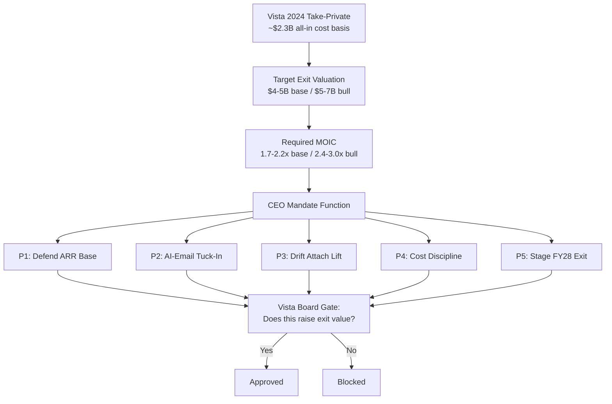

### Direct Answer

The post-Vista Salesloft CEO is not a visionary appointed to reimagine sales engagement — the role is a **Vista Equity Partners operating mandate to back-solve every decision from a single number: the target return at exit.** With Salesloft taken private by Vista in late 2024 on a roughly $2.3B all-in cost basis, the CEO's mandate decomposes into five non-negotiable priorities — defend the ARR base, close an AI-email tuck-in, lift the Drift attach rate, hold ruthless cost discipline, and stage an FY28 strategic-acquirer exit — each one tested against the question "does this increase exit valuation?"

**TL;DR:** The Salesloft CEO operating through the Vista hold period (Vista's December 2024 take-private of Salesloft on a ~$2.3B all-in entry) runs a mandate that is **exit-math execution, not strategic vision.** Every priority, hire, product bet, and M&A move is back-solved from the **target Vista return at exit** — a $4-5B base-case / $5-7B bull-case exit valuation at the four-to-five-year hold horizon, implying a **1.7-2.2x base / 2.4-3.0x bull MOIC and a 14-18% net IRR.** From that number the mandate decomposes into five non-negotiable priorities: **(1) defend the $760-820M ARR base** through multi-year contracting and renewal-escalator discipline; **(2) close a Lavender-or-equivalent AI-email tuck-in** in the $300-600M range during FY26 to plug the AI-personalization gap Outreach uses as a wedge; **(3) push Drift cross-sell attach** from 28-32% toward 45-50%; **(4) hold cost discipline** at ~1,400-1,600 headcount (down from a ~2,200 pre-Vista peak) so EBITDA margin expands from sub-15% to 28-35%; and **(5) stage an FY28 strategic-acquirer exit** — HubSpot, Adobe, Workday, Microsoft, or Salesforce — with an IPO held as a conditional alternative. The decision framework is brutally simple: any move that does not raise exit valuation is blocked at the Vista board level. The pattern matches Vista's CEO playbooks at Datto, Ping Identity, and Pipedrive, and the CEO's true performance contract is not an org chart but a waterfall model.

---

## BANNER 1 — Who The Post-Vista CEO Actually Is And Why The Title Misleads

### 1.1 The role is a Vista operating seat, not a founder's chair

The single most common mistake outside observers make is treating "Salesloft CEO" as if it were still the founder-era job that Kyle Porter held when he built the company from an Atlanta startup into a sales-engagement category leader. Under Vista Equity Partners ownership, the title is a different instrument entirely. The post-Vista CEO occupies an **operating seat inside a private-equity portfolio**, and the seat comes with a pre-written performance contract: a financial model, a hold-period clock, and a Vista board that meets the CEO not as a strategy partner but as a return-accountability body.

This distinction matters because it changes every prediction you would otherwise make. A founder-CEO optimizes for category leadership, brand, employee mission, and a long-horizon product vision. A Vista portfolio CEO optimizes for one variable — **the multiple-on-invested-capital (MOIC) the fund books when it sells the company** — and every other variable is instrumental to that one. When you read a Salesloft press release, an analyst note, or a product roadmap leak, the correct decoding question is never "what does the CEO believe?" It is "which line of the Vista exit waterfall does this move serve?"

### 1.2 The Vista take-private and the cost basis that defines the mandate

Vista Equity Partners took Salesloft private in a transaction that closed at the end of 2024. The publicly reported deal value sat in the **$2.0-2.3B range**, and when you layer in transaction fees, the assumption of Salesloft's prior Drift acquisition, refinancing costs, and the equity-plus-debt structure Vista typically uses, the **all-in cost basis lands near $2.3B**. That number is not trivia. It is the denominator of every return calculation the CEO is measured against, and it is therefore the starting point of the entire mandate.

Vista's structural model — well documented across its software portfolio — is to enter with a meaningful debt tranche, install or retain an operating CEO, run the **Vista Standard Operating Procedures (VSOP)** playbook of pricing optimization, sales-process standardization, and cost rationalization, and exit inside a four-to-five-year window either to a strategic acquirer or via IPO. Salesloft is not an exception to that model; it is a textbook instance of it. (For the broader reshaping mechanics, see q1847.)

### 1.3 Why "the CEO" is best understood as a function, not a person

Vista frequently rotates operating leadership across a hold period — bringing in a value-creation-phase CEO early and sometimes an exit-preparation CEO late. Whether the Salesloft seat is held by one executive across the full hold or by a sequence of them, the **mandate is invariant.** That is why this answer treats the post-Vista CEO as a function — a defined set of priorities and constraints — rather than betting on a single named individual whose tenure could end mid-hold. The function is stable; the occupant is replaceable. That is itself a feature of the Vista model: the playbook does not depend on irreplaceable talent.

The diagram captures the causal spine of the entire mandate: a fixed cost basis drives a target exit valuation, which drives a required MOIC, which decomposes into five priorities, each gated by a single board-level question.

### 1.4 The founder-era inheritance the CEO has to manage

Salesloft did not arrive in Vista's hands as a blank asset. It arrived with a founder-era inheritance: a strong category brand, an Atlanta-rooted culture that prized mission and community, a loyal installed base, and a recently acquired conversational-marketing platform in Drift. The post-Vista CEO does not get to discard that inheritance — it is the raw material the exit thesis is built from. The brand is an asset to be monetized; the culture is a productivity input to be preserved enough to keep the team performing; the base is the floor to be defended; Drift is a line in the waterfall to be justified. The CEO's job is to take a founder-built company and **convert it into a Vista-shaped exit asset without breaking the parts that make it worth buying.** That conversion — not invention — is the substance of the role. (q1851 looks at whether the founder-era Cadence product survives this conversion as a relevant offering.)

### 1.5 Why outside observers keep misreading the role

Three recurring misreadings distort outside commentary on the Salesloft CEO. The first is the **vision misread** — treating the CEO as a strategist setting category direction, when the direction is set by the deal model. The second is the **personality misread** — predicting the company from the CEO's background or temperament, when the mandate is invariant to the occupant. The third is the **timeline misread** — assuming Salesloft is building toward an indefinite future, when in fact every plan terminates at an exit date four to five years out. Correcting all three misreads at once produces the frame this answer uses: the CEO is a **function with a clock**, and the company's behavior is the predictable output of that function. Once you adopt the frame, Salesloft stops being mysterious.

---

## BANNER 2 — The Exit-Math Mandate: Back-Solving Every Decision From The Return Number

### 2.1 The return waterfall that the CEO is actually paid against

The CEO's true performance contract is a spreadsheet. The Vista deal model contains an exit waterfall — entry equity, debt paydown, exit valuation, fees, carry — and the CEO's compensation, almost certainly a heavily equity-weighted package vesting on a liquidity event, is a slice of that waterfall. The practical consequence: the CEO is not paid to grow Salesloft for its own sake. The CEO is paid to grow the **number Vista realizes at sale.** Those two goals overlap but are not identical, and where they diverge — for example, a beloved product line that does not lift exit value — the divergence resolves in favor of the waterfall every time.

| Exit-math input | Value | Why it drives the mandate |
|---|---|---|
| All-in cost basis | ~$2.3B | Denominator of every MOIC calculation |
| Base-case exit valuation | $4-5B | Implies 1.7-2.2x gross MOIC |
| Bull-case exit valuation | $5-7B | Implies 2.4-3.0x gross MOIC |
| Target net IRR | 14-18% | Vista's software-fund return floor |
| Hold horizon | 4-5 years (exit ~FY28-FY29) | Sets the clock on every priority |
| Required exit ARR | $1.0-1.3B | What an $4-5B SaaS valuation needs |

### 2.2 Translating the return number into an ARR target

If the base-case exit valuation is $4-5B and software strategic acquirers in a normalized 2027-2028 market pay roughly 4-6x ARR for a profitable, growing sales-engagement asset, the **implied exit ARR is $1.0-1.3B.** Salesloft enters the hold near $760-820M ARR. The CEO's growth mandate is therefore not "grow fast" in the abstract — it is "add $250-500M of net new ARR over the hold while expanding margin," a far more specific and far more constraining instruction.

That specificity is what makes the mandate predictable. The CEO cannot chase a greenfield product category that would not move ARR inside the hold window. The CEO cannot make an acquisition whose integration drag would suppress margin during the exit-prep year. Every option is filtered through the dual constraint of **ARR accretion within the clock** and **margin expansion toward the exit multiple.**

### 2.3 The "does this raise exit value?" gate in practice

The decision framework is brutal in its simplicity. Every proposed move — a new product investment, a hire, a partnership, a geographic expansion, a pricing change — is tested against a single question: **does this increase exit valuation, and does it do so before the exit window?** A move that raises exit value clears the Vista board. A move that does not is blocked, regardless of how strategically interesting, customer-loved, or mission-aligned it is.

This is why the post-Vista Salesloft will feel, to longtime customers and employees, like a more disciplined and less adventurous company. The adventurousness has not been lost to incompetence; it has been **deliberately optimized out** because adventurousness that does not pay inside the clock is, in waterfall terms, a cost. (q1846 works through whether that disciplined posture makes Salesloft itself worth buying.)

| CEO move category | Passes the gate when... | Blocked when... |
|---|---|---|
| Product investment | It lifts ARR or margin pre-exit | It is a multi-year bet maturing post-exit |
| M&A | Tuck-in plugs a competitive gap fast | Large deal adds integration drag |
| Hiring | It is revenue-generating or efficiency-creating | It rebuilds headcount Vista just cut |
| Geographic expansion | It uses partner leverage, low capex | It requires heavy ground investment |
| Pricing change | It expands net revenue retention | It risks the renewal base for share |

### 2.4 Why the mandate is legible from outside the company

A Vista portfolio CEO mandate is unusually legible because Vista's model is consistent and well-studied. The fund does not improvise. The pricing optimization, the headcount rationalization, the standardized go-to-market, the tuck-in M&A, the exit staging — these recur across Vista's software holdings with enough regularity that an outside analyst can reconstruct the Salesloft mandate from the deal structure alone. That legibility is the foundation of every prediction in the sections below.

### 2.5 The debt tranche and why it accelerates the clock

Vista take-privates are not all-equity transactions. The Salesloft deal almost certainly carries a **debt tranche** layered into the ~$2.3B structure, and that debt does two things to the CEO's mandate. First, it **amplifies the equity return**: if the company exits at $4-5B and a portion of the entry was debt, the equity multiple is higher than the headline enterprise-value multiple, which is why a 1.7-2.2x gross EV move can translate into a stronger equity outcome for the fund. Second, the debt carries **interest service**, and interest is a real cash cost that the CEO must cover out of operating cash flow every quarter of the hold. That cost is one more reason margin expansion is non-negotiable: the EBITDA the CEO produces is not just an exit-multiple input, it is the source of debt service. A CEO who lets margin slip does not merely lower the exit number — the CEO threatens the company's ability to service its own capital structure. The debt, in other words, is a second clock running alongside the hold-period clock, and it pushes in the same direction: toward discipline.

### 2.6 The value-creation phases inside the hold

The four-to-five-year hold is not uniform. It runs in **three recognizable phases**, and the CEO's weekly priorities shift as the company moves through them. Phase one, roughly the first 12-18 months, is the **stabilize-and-cut phase**: lock the base, take the headcount down toward the ceiling, install the standardized go-to-market, and establish clean financial reporting. Phase two, the broad middle of the hold, is the **build-and-attach phase**: close the AI-email tuck-in, drive the Drift attach rate, grow ARR toward the exit target, and let margin compound. Phase three, the final 12-18 months, is the **exit-preparation phase**: clean every metric, resolve every diligence flag, warm the acquirer set, and stage the process. Understanding the phase the company is in is the single best predictor of what the CEO is doing in any given quarter.

| Hold phase | Approximate window | CEO's dominant priority |
|---|---|---|
| Stabilize-and-cut | Months 0-18 | Lock base, hit headcount ceiling, clean reporting |
| Build-and-attach | Middle of hold | Tuck-in, Drift attach, ARR growth, margin compounding |
| Exit-preparation | Final 12-18 months | Diligence-readiness, warm acquirers, stage the process |

---

## BANNER 3 — Priority One: Defend The ARR Base With Contractual Lock-In

### 3.1 Why the revenue floor is the first thing the CEO protects

Before a Vista CEO grows anything, the CEO **secures the floor.** The single largest risk to the exit waterfall is not slow growth — it is base erosion. If Salesloft's $760-820M ARR base leaks 8-12% net through churn and downgrade, the entire growth plan is spent backfilling the hole and the exit ARR target becomes unreachable. So Priority One, chronologically and in board emphasis, is **defend the base.**

### 3.2 The contractual instruments: multi-year terms and renewal escalators

The CEO defends the base with contract structure, not with sentiment. The two principal instruments are **multi-year contracting** — pushing customers from one-year to two- and three-year terms so revenue is locked beyond the exit window — and **renewal escalators**, contractual price-step clauses that raise the renewal price 5-10% annually without a renegotiation. Together they convert a soft, re-competeable revenue base into a hard, contractually-floored one. A strategic acquirer paying $4-5B is paying for predictability, and multi-year contracted ARR with built-in escalators is the most direct way to manufacture predictability.

| Base-defense lever | Mechanism | Exit-math effect |
|---|---|---|
| Multi-year contracting | 2-3 year terms vs annual | Locks ARR past exit; raises diligence quality |
| Renewal escalators | 5-10% contractual annual step | Grows ARR with zero new-logo cost |
| Net revenue retention focus | Expansion within accounts | NRR is the headline diligence metric |
| Renewal-team specialization | Dedicated renewal motion | Reduces churn-at-renewal leakage |
| Multi-product attach | Drift + Cadence + AI in one paper | Raises switching cost, lowers churn |

### 3.3 Net revenue retention as the headline diligence metric

When a strategic acquirer or IPO underwriter diligences Salesloft, the first number they pull is **net revenue retention (NRR)** — the percentage of last year's revenue retained plus expansion, net of churn and downgrade. NRR above ~110% signals a healthy, expanding base; NRR below ~100% signals erosion. The CEO's base-defense work is, in effect, NRR management: every renewal escalator, every multi-product attach, every specialized renewal rep exists to push the NRR number into the range that supports the exit multiple. (q1856 examines exactly where Salesloft's NRR is likely to land.)

### 3.4 The competitive pressure on the base

The base is not defended in a vacuum. HubSpot's Sales Hub bundles sequencing into a broader CRM-plus-marketing suite at an attach price that can undercut a standalone Salesloft renewal, and AI-native sequencing tools price aggressively to win seats. The CEO's contractual lock-in is partly a defense against exactly this pressure: a customer on a three-year term with an escalator cannot easily defect mid-contract to a HubSpot bundle or an AI-native challenger. (q1855 details the HubSpot bundling defense; q1850 covers the AI-native pressure.) The contract is the moat the CEO can build fastest, and so it is the moat the CEO builds first.

### 3.5 The trade-off the CEO accepts

Aggressive multi-year contracting and escalators have a cost: they can slow new-logo growth, because a longer-term, escalator-laden contract is a harder initial sale than a flexible annual one. The CEO accepts that trade-off knowingly. In exit-math terms, **a locked base is worth more than a faster-growing but leakier one**, because the acquirer pays for the locked, predictable revenue at a higher multiple. This is a recurring signature of the Vista mandate: where security and speed conflict, the CEO chooses security.

### 3.6 The renewal motion as an operating discipline

Defending the base is not only a contracting question — it is an operating-motion question. Under the founder-era model, renewals were often handled informally, folded into the account-executive's broader relationship. The post-Vista CEO **specializes the renewal motion**: a dedicated renewal team, with its own targets, its own compensation, its own playbook for the at-risk-account intervention. The logic is the same logic that drives every Vista operating change — a specialized, measured motion produces a more predictable outcome than a generalized, relationship-dependent one. A specialized renewal team can be staffed against a churn-rate target, coached against a documented playbook, and held accountable in a way a distributed renewal responsibility cannot. The renewal team is, in effect, the operational arm of Priority One. (q1845 examines how this disciplined renewal posture compares to Outreach's in the mid-market.)

### 3.7 Pricing optimization as a base-defense lever

Vista is well known for pricing optimization, and pricing is a base-defense lever as much as a growth lever. The post-Vista CEO conducts a **structured pricing review** — analyzing which customer segments are under-monetized, which features are given away that could be packaged into a higher tier, and where the price-to-value relationship has drifted. The output is a re-architected pricing and packaging model that raises revenue per account *without* requiring new logos. Done well, pricing optimization is one of the highest-return moves available to the CEO: it touches the entire base at once and it accretes ARR with near-zero incremental cost. Done badly — too aggressively, too fast — it accelerates churn and breaks the base it was meant to grow. The CEO's mandate is to find the optimization that the base will absorb without revolting, which is a more delicate calibration than the headline "raise prices" makes it sound.

### 3.8 What base defense looks like in the exit diligence room

The ultimate test of Priority One is the diligence room. When a strategic acquirer's deal team examines Salesloft, they will pull a **cohort-retention analysis** — tracking each annual cohort of customers and measuring how much of its revenue survives one, two, and three years on. A base that has been defended well shows flat or rising cohort curves and a high share of multi-year contracted revenue. A base that has leaked shows decaying cohorts and a thin contracted layer. The CEO's entire base-defense program — multi-year terms, escalators, the specialized renewal team, pricing discipline — exists to make that cohort-retention chart read as a *premium* chart in the diligence room. Everything about Priority One is, in the end, dress rehearsal for that single chart.

---

## BANNER 4 — Priority Two: The AI-Email Tuck-In Acquisition

### 4.1 The competitive gap the tuck-in is meant to close

Salesloft's most visible product vulnerability through the hold is **AI-driven email personalization at scale.** Outreach has used AI-email personalization as a competitive wedge, and AI-native challengers built their entire pitch on it. Salesloft's organic AI roadmap can narrow the gap, but organic development is slow, and the CEO is operating against a clock. The fastest way to close a capability gap inside a hold window is not to build — it is to **buy.**

### 4.2 Why Lavender (or an equivalent) is the archetypal target

Lavender is the archetypal target because it is an AI email-coaching and personalization tool — exactly the capability Salesloft needs — at a scale that fits a Vista tuck-in budget. Whether the eventual target is Lavender specifically or a functional equivalent, the **profile of the deal is fixed**: an AI-email personalization asset, acquired in the **$300-600M range**, closing during **FY26**, integrated fast into the Cadence and Rhythm workflow so the capability ships as a Salesloft feature rather than a separate product.

| Tuck-in deal parameter | Expected value | Rationale |
|---|---|---|
| Target capability | AI email personalization at scale | Closes the Outreach competitive wedge |
| Deal size | $300-600M | Fits Vista tuck-in budget; accretive |
| Timing | FY26 | Early enough to integrate before exit-prep |
| Integration target | Embedded in Cadence/Rhythm | Ships as feature, not separate SKU |
| Exit-math effect | Raises ARR quality + competitive narrative | Supports the exit multiple |

### 4.3 Why a tuck-in, not a transformational deal

The CEO's M&A authority is bounded. A large, transformational acquisition — say, buying a CRM or a conversation-intelligence platform outright — would add integration drag, dilute margin during the exit-prep window, and require new debt. All three are waterfall-negative. A tuck-in is different: small enough to fund from cash or a modest facility, fast enough to integrate inside the clock, and targeted enough to plug one specific gap. The Vista mandate **permits tuck-ins and blocks transformational deals**, and the CEO operates inside that boundary. (q1865 applies the same tuck-in logic to a possible video-tool acquisition.)

### 4.4 The narrative value of the deal at exit

Beyond the capability, the tuck-in has narrative value. When the CEO stages the exit, the story told to strategic acquirers must be "Salesloft has closed its AI gap and is competitive on the dimension that matters most in 2027-2028 sales engagement." A completed, integrated AI-email acquisition is the proof point that makes that narrative credible. The deal is therefore both a product move and an **exit-storytelling move**, which is exactly why it clears the "does this raise exit value?" gate. (q1849 maps the full AI strategy this tuck-in slots into.)

### 4.5 The build-versus-buy calculation in detail

The CEO's choice to buy rather than build AI-email personalization is not a default — it is the output of an explicit calculation. **Building** the capability organically would cost less in upfront cash but far more in time: a credible AI-email engine, trained, tuned, and shipped at parity with Outreach's, is plausibly an 18-30 month organic effort, and 18-30 months is a punishing fraction of a four-to-five-year hold. **Buying** costs $300-600M of cash or facility but compresses the timeline to a closing-plus-integration window measured in quarters, not years. Against the exit clock, time is the scarcer resource, so the buy side of the calculation wins. The CEO is, in effect, **trading capital for time** — and trading capital for time is exactly the trade a hold-period clock makes rational. (q1849 develops the organic-versus-acquired balance across the full AI roadmap.)

### 4.6 Integration risk and why the target must be small

The reason the tuck-in must be small is integration risk. Every acquisition carries the risk that the integration consumes more management attention, more engineering capacity, and more time than planned — and integration overrun is **waterfall-negative on three fronts**: it suppresses margin during the build year, it distracts from the base-defense and attach-rate priorities, and it can sour the diligence story if the acquired product is still half-integrated at exit. A small, focused target — one product, one capability, a team that slots into existing engineering rather than running as a separate org — minimizes all three risks. The CEO's M&A discipline is therefore not timidity; it is **a deliberate cap on integration risk** calibrated to the time the hold allows. (q1865 applies the identical small-target discipline to a hypothetical video-tool acquisition.)

### 4.7 The signal a completed tuck-in sends to the market

When the AI-email tuck-in closes and integrates, it sends a signal beyond the product itself. To competitors, it signals that Salesloft has chosen to compete on AI rather than cede the dimension. To the acquirer set, it signals a management team that executes M&A cleanly — a reassuring data point for a buyer about to acquire the whole company. To the base, it signals continued investment, which supports renewals. The CEO extracts value from the deal not only through the capability it adds but through the **competence it demonstrates**. In a hold designed to end in a sale, demonstrated competence is itself an asset on the balance sheet of the exit narrative.

---

## BANNER 5 — Priority Three: Drift Cross-Sell And The Attach-Rate Mandate

### 5.1 The Drift acquisition the CEO inherited

Before Vista, Salesloft acquired **Drift**, the conversational-marketing and chat platform, in a deal valued near $600M. That acquisition is now a line in the exit waterfall the post-Vista CEO must justify. If Drift sits beside Cadence as a loosely-attached second product, it is dead weight on the model. If Drift is **cross-sold deep into the Salesloft base** so a large share of customers run both products on one contract, it lifts ARPU, raises switching cost, and validates the $600M the company spent. The CEO's mandate is to force the second outcome.

### 5.2 The attach-rate target: from 28-32% toward 45-50%

The concrete metric is **Drift cross-sell attach rate** — the percentage of Salesloft customers who also run Drift. It enters the hold near **28-32%**, and the CEO's mandate is to push it toward **45-50%.** That is a roughly 15-20 percentage-point lift, achieved through bundled pricing, unified packaging, sales-rep incentives weighted toward multi-product deals, and product integration that makes the combined offering genuinely better than the parts.

| Drift attach metric | Hold-start | CEO target | Lever |
|---|---|---|---|
| Cross-sell attach rate | 28-32% | 45-50% | Bundled pricing + rep incentives |
| Per-account ARPU | Baseline | +15-25% | Two products on one contract |
| Switching cost | Single-product | Multi-product lock-in | Integrated workflow |
| Churn risk | Higher (single product) | Lower (bundle) | Bundle stickiness |
| Drift acquisition payback | Unproven | Validated at exit | Attach-rate proof point |

### 5.3 Why attach rate is an exit-multiple lever, not just a revenue lever

A higher attach rate does three things to the exit waterfall simultaneously. First, it **raises ARPU**, growing ARR without new-logo cost. Second, it **lowers churn**, because a customer running two integrated products faces a higher switching cost than a single-product customer. Third, it **upgrades the diligence story**, turning Drift from a "why did they buy that?" question into a "multi-product platform" proof point. All three lift the multiple a strategic acquirer will pay. (q1858 dives specifically into what the CEO should do about Drift's acquisition value; q1859 evaluates whether the conversation-marketing motion can beat Drift's standalone competitors.)

### 5.4 The risk if the attach rate stalls

If the attach rate stalls in the low 30s, the CEO has a problem that compounds. Drift remains an unjustified $600M line, the exit narrative weakens, and the company looks like a single-product sequencing vendor in a market increasingly skeptical of single-product sequencing vendors. That is why the attach-rate mandate is one of the five hard priorities and not a nice-to-have: it is the difference between the bull case and the base case in the exit waterfall.

### 5.5 The packaging and incentive levers in detail

Driving the attach rate is not a marketing campaign — it is a set of structural levers the CEO pulls inside the go-to-market machine. The first lever is **packaging**: re-architecting the product catalog so that the combined Cadence-plus-Drift offering is a named, priced bundle rather than two separate purchases, with the bundle priced to make the second product an easy yes. The second lever is **sales-rep incentive design**: weighting commission and quota credit toward multi-product deals, so a rep who lands a customer on both products is paid materially more than a rep who lands one. The third lever is **product integration**: building the workflow connections that make the combined product genuinely better — shared data, unified reporting, a single pane of glass — so the bundle is not just cheaper but actually superior. Packaging removes the price friction, incentives align the sales force, and integration removes the buyer's "why bother" objection. The CEO needs all three pulling together; any one alone underperforms.

### 5.6 What the attach rate proves to a strategic acquirer

A strategic acquirer evaluating Salesloft will read the Drift attach rate as a **platform-credibility test**. A company at a 45-50% attach rate is, demonstrably, a multi-product platform — customers vote for that with their wallets. A company at a 30% attach rate is a single-product company that also owns a second product. The valuation gap between those two descriptions is real: platforms command higher multiples than point solutions because platforms have more expansion runway, higher switching costs, and more defensible competitive positions. The CEO's attach-rate mandate is therefore an exercise in **earning the platform label before the diligence room**, because the label is worth multiple points on a $4-5B valuation. (q1858 examines the Drift-value question head-on; q1859 weighs the conversation-marketing motion against Drift's standalone competitors.)

### 5.7 The conversational-marketing context Drift sits inside

Drift does not operate in a vacuum. The conversational-marketing category — chat, conversational landing pages, conversation routing — has its own competitive dynamics, and the post-Vista CEO must decide how hard to fight in that category versus how hard to simply harvest Drift into the Salesloft base. The mandate's answer is consistent with everything else: **harvest, do not crusade.** The CEO is not chartered to win the conversational-marketing category outright — that would be a multi-year, post-exit ambition. The CEO is chartered to extract the attach-rate value from the Drift asset already owned. Where category-fighting and attach-harvesting conflict, the mandate resolves toward harvesting, because harvesting pays inside the clock and crusading does not. (q1859 explores how far the conversation-marketing motion can credibly go.)

---

## BANNER 6 — Priority Four: Cost Discipline And Margin Expansion

### 6.1 The headcount rationalization

Vista's value-creation playbook is, at its core, a margin-expansion machine, and the most direct margin lever is **headcount.** Salesloft entered the Vista era with a peak workforce near **~2,200**. The post-Vista operating model targets a steady-state headcount of roughly **1,400-1,600** — a reduction on the order of 30%, achieved through a combination of restructuring, attrition without backfill, and the elimination of roles that the standardized go-to-market model makes redundant.

This is not a one-time cut. It is a **disciplined operating ceiling.** The CEO does not rebuild headcount as revenue grows; instead, the CEO is mandated to grow ARR faster than headcount, so revenue-per-employee rises steadily across the hold. That ratio — revenue per employee — is itself a diligence metric, and a strategic acquirer pays more for a company that demonstrates it can grow without proportional hiring.

### 6.2 The R&D and marketing envelopes

Cost discipline extends past headcount into the spending envelopes. Annual **R&D is held near $40-70M** — enough to fund the organic AI roadmap and integration work, not enough to fund speculative greenfield bets. **Marketing headcount is held near 90-130**, with spend redirected from broad brand-building toward efficient, measurable demand generation. The principle in both cases is the same: spend is permitted where it accretes ARR or margin inside the clock, and trimmed where it does not.

| Cost envelope | Pre-Vista | Post-Vista target | Margin effect |
|---|---|---|---|
| Total headcount | ~2,200 peak | 1,400-1,600 | Largest single margin lever |
| Annual R&D | Higher, less disciplined | $40-70M | Funds roadmap, blocks speculation |
| Marketing headcount | Broad brand teams | 90-130 | Shifts to efficient demand-gen |
| EBITDA margin | Sub-15% | 28-35% | The exit-multiple driver |
| Revenue per employee | Baseline | Rising every year | Diligence-grade efficiency metric |

### 6.3 The margin target and why it is the multiple driver

The output of all this discipline is **EBITDA margin expansion from sub-15% at hold-start to 28-35% by exit.** That expansion is not a side effect — it is the single most important number the CEO produces, because the exit multiple is a function of the **Rule of 40** (growth rate plus profit margin). A company growing 15-20% at a 30%+ EBITDA margin posts a Rule-of-40 score in the high 40s to low 50s, which is exactly the profile a strategic acquirer pays a premium multiple for. The cost discipline is, in the end, multiple engineering. (q1864 traces the gross-margin trajectory that underpins this; q1848 stress-tests whether 15%+ growth survives the cost cuts.)

### 6.4 The cultural cost the CEO manages

A 30% headcount reduction and a frozen hiring posture have a real cultural cost: morale pressure, the loss of institutional knowledge, and a less expansive sense of mission than the founder era offered. The CEO is mandated to **manage that cost without reversing the discipline.** That is one of the hardest parts of the job — keeping enough of the team motivated and productive to hit the ARR target while operating inside a cost ceiling that the team experiences as a constraint. A CEO who lets morale collapse loses productivity; a CEO who relaxes the ceiling loses margin. The mandate requires walking that line for four to five years. (q1861 examines how international growth happens without the cost-cutting reversing.)

### 6.5 The Rule of 40 as the governing equation

The cost-discipline priority is best understood through the **Rule of 40** — the SaaS heuristic that a healthy company's revenue growth rate plus its profit margin should sum to at least 40. The Rule of 40 is the governing equation of the entire mandate because it tells the CEO exactly how growth and margin trade against each other. A company growing 25% at a 15% margin scores 40. A company growing 15% at a 30% margin also scores 40 — and crucially, the second profile is the one a Vista exit favors, because profitable growth is paid a higher multiple than unprofitable growth at the same Rule-of-40 score. The CEO's mandate is to move Salesloft along the Rule-of-40 frontier *toward the profitable end* — accepting somewhat slower growth in exchange for materially higher margin — because that is the move that maximizes the exit multiple. Every cost decision is, implicitly, a Rule-of-40 decision.

| Profile | Growth | EBITDA margin | Rule of 40 | Exit-multiple quality |
|---|---|---|---|---|
| Founder-era Salesloft | High | Sub-15% | ~40 | Lower (unprofitable growth) |
| Mid-hold target | 15-20% | 20-28% | ~40-48 | Improving |
| Exit-ready target | 15-20% | 28-35% | ~45-55 | Premium (profitable growth) |

### 6.6 Where the discipline must not cut

Cost discipline is not indiscriminate. There are functions the CEO is mandated to **protect even inside the ceiling**, because cutting them would damage the exit asset. Customer success and the renewal team are protected, because they defend Priority One. Core R&D on the AI roadmap and the tuck-in integration is protected, because it serves Priority Two. The revenue-generating front line — the most productive account executives — is protected, because cutting quota-carrying capacity directly cuts ARR growth. The discipline falls hardest on **overhead, redundant management layers, and functions that the standardized go-to-market model makes unnecessary.** A CEO who cuts uniformly damages the asset; a CEO who cuts surgically expands margin while preserving the parts a buyer pays for. The mandate requires the surgical version.

### 6.7 The efficiency narrative the CEO builds for diligence

By the exit-preparation phase, the CEO must be able to tell a clean efficiency story: "Salesloft grew ARR from roughly $800M to over $1B while holding headcount flat, expanding EBITDA margin from sub-15% to 30%+, and lifting revenue per employee every year of the hold." That narrative is not spin — it is the literal record of Priority Four executed well. And it is precisely the narrative a strategic acquirer wants to hear, because it says the asset is **already efficient** and the acquirer can layer its own distribution on top without first having to fix a cost problem. The cost discipline, executed across the full hold, *becomes* the efficiency narrative — and the efficiency narrative is what justifies the premium end of the exit-valuation range. (q1864 traces the gross-margin component of this story in detail; q1848 tests whether the growth half of the equation holds up.)

---

## BANNER 7 — Priority Five: Staging The FY28 Strategic-Acquirer Exit

### 7.1 The exit clock and why it governs everything

Vista's hold horizon for software assets is typically **four to five years**, which places the Salesloft exit window around **FY28-FY29.** That clock is not a soft target — it governs the sequencing of every other priority. The tuck-in must close early (FY26) so it can be integrated before exit-prep. The base defense must be locked before diligence begins. The margin expansion must be visible in two-to-three years of clean financials before a buyer's underwriter examines them. The CEO runs the company backward from the exit date.

### 7.2 The realistic strategic acquirers

The base-case exit is a **sale to a strategic acquirer**, and the realistic acquirer set is well-defined. Each has a specific reason Salesloft fits.

| Potential acquirer | Strategic rationale | Fit quality |
|---|---|---|
| HubSpot (NYSE: HUBS) | Deepen Sales Hub; absorb sequencing leader | Strong — direct adjacency |
| Adobe (NASDAQ: ADBE) | Extend Marketo/experience cloud into sales engagement | Moderate — GTM expansion |
| Workday (NASDAQ: WDAY) | Add front-office GTM to back-office suite | Moderate — portfolio breadth |
| Microsoft (NASDAQ: MSFT) | Bolt sequencing onto Dynamics 365 + Copilot | Strong — Copilot synergy |
| Salesforce (NYSE: CRM) | Reabsorb sequencing into the CRM core | Plausible — but build-vs-buy tension |

The CEO's exit-staging job is to keep this acquirer set warm — maintaining relationships, ensuring Salesloft's product and metrics read as a clean bolt-on for each — so that when the window opens, the CEO can run a competitive process rather than a one-bidder sale. A competitive process is worth meaningful multiple points. (q1857 examines the HubSpot-customer-base angle that makes HUBS a particularly natural fit.)

### 7.3 The IPO as a conditional alternative

An IPO is held as a **conditional alternative, not a base case.** The condition is demanding: Salesloft would need to clear roughly **$1B+ ARR**, post a clean Rule-of-40 profile, and find a favorable IPO market window — all three simultaneously. If those conditions hit, an IPO can deliver a strong outcome and a clean exit. If any fails, the CEO defaults to the strategic sale. The discipline is in **not betting the hold on the IPO**: the CEO builds the company so that it is sellable to a strategic acquirer regardless, and treats the IPO as upside optionality layered on top.

### 7.4 The diligence-readiness work

Exit-staging is also a great deal of unglamorous diligence-readiness work: clean, audited financials; a documented and de-risked customer base; resolved litigation and contractual exposure; a clear product roadmap; and a management team that will credibly stay through a transition. The CEO spends the final 12-18 months of the hold making Salesloft **boring to diligence** — no surprises, no hidden liabilities, no metric that needs explaining. Boring-to-diligence is, in M&A, a premium-multiple feature. (q1846 weighs whether a buyer should actually pay that premium.)

### 7.5 Running a competitive process versus a one-bidder sale

The single largest valuation lever inside the exit itself is **process design**. A one-bidder sale — where only one acquirer is at the table — gives the buyer pricing power and typically clears at the lower end of the valuation range. A competitive process — where three or four credible acquirers bid against each other, often advised by an investment bank running a structured auction — pushes the price toward and past the top of the range. The CEO's exit-staging work is therefore not only about making the asset clean; it is about **manufacturing competitive tension** by keeping multiple acquirers genuinely interested and credibly capable of bidding when the window opens. Every warm relationship the CEO maintains with HubSpot, Adobe, Workday, Microsoft, and Salesforce is, in effect, an option on a higher exit price. The mandate rewards the CEO who arrives at the exit with a full table.

### 7.6 The management-retention question

Strategic acquirers do not only buy a product and a customer base — they buy, at least for a transition period, a management team. An acquirer is far more comfortable paying a premium when the CEO and the senior team will credibly stay through integration. This creates a subtle alignment in the CEO's mandate: the CEO's own equity vests on the liquidity event, *and* the CEO's continued presence post-close supports the price the equity vests at. The CEO is therefore incentivized not just to sell the company but to **sell it as a going concern with intact leadership** — which is a healthier outcome for employees and customers than a pure financial flip. The Vista model, for all its financial-engineering character, generally produces an exit where the asset is handed over functioning rather than gutted, because a functioning asset is worth more.

### 7.7 The downside scenarios the CEO plans against

A disciplined exit plan includes the downside cases. If the strategic-acquirer market is cold at the planned exit window, the CEO has three fallbacks. The first is a **hold extension** — Vista moves the asset into a continuation vehicle and runs another one-to-two years, betting on a better window. The second is a **secondary sale to another financial sponsor** — a clean exit, but typically at a lower multiple than a strategic sale. The third is a **partial liquidity event** — a recapitalization or minority stake sale that returns some capital while keeping the asset. The CEO does not choose among these; Vista does. But the CEO must keep the company in a state where *all three remain available*, which is one more reason base defense and margin discipline run the full length of the hold: they are the features that keep every exit door open.

---

## BANNER 8 — The Comparable Vista CEO Playbooks

### 8.1 Datto: the platform tuck-in and clean strategic exit

Vista's handling of **Datto**, the IT-management software company, is one of the clearest comparables. Vista held Datto, ran the standard pricing-and-cost playbook, took it public, and ultimately the asset transacted to a strategic acquirer in the IT-management consolidation. The pattern that maps to Salesloft: a focused product, disciplined operations, and an exit to a larger platform player who valued the installed base and the recurring revenue. The Salesloft CEO's FY28 plan is the same shape.

### 8.2 Ping Identity: take-private, operate, strategic outcome

**Ping Identity**, the identity-security software company, was taken private by Thoma Bravo rather than Vista, but it illustrates the same private-equity-software pattern that Vista runs: a public software company taken private, operated for margin and predictable growth, and positioned for a clean institutional outcome. The relevance to Salesloft is the structural lesson — **the take-private is the start of a value-creation clock, not an end state.**

### 8.3 Pipedrive: Vista's CRM-adjacent operating model

**Pipedrive**, the sales CRM, sits inside Vista's portfolio and is the closest functional comparable to Salesloft — both are sales-software companies in Vista's hands. The Pipedrive operating model — disciplined growth, efficient go-to-market, margin focus — is essentially the model the Salesloft CEO runs. Watching how Vista operates Pipedrive is one of the best available windows into how it operates Salesloft, because the playbook is shared.

| Comparable | Vista-style move | Lesson for Salesloft CEO |
|---|---|---|
| Datto | Operate, then strategic exit | The exit-to-platform pattern |
| Ping Identity | Take-private, operate for margin | Take-private starts a clock |
| Pipedrive | Disciplined sales-software operating model | The shared GTM playbook |
| Marketo (Vista era) | Tuck-in M&A, then sale to Adobe | The tuck-in-then-strategic-sale arc |
| Vista software portfolio generally | Pricing + cost + standardized GTM | The VSOP playbook is invariant |

### 8.4 What the comparables predict

Across these comparables the prediction is consistent: the Salesloft CEO will run a **focused, margin-disciplined, tuck-in-supported company toward a strategic-acquirer exit inside a four-to-five-year window.** The comparables also predict the *texture* of the hold — the standardized go-to-market, the pricing optimization, the headcount ceiling — because Vista does not run each portfolio company differently. It runs the same playbook, adjusted for the asset. That invariance is precisely what makes the Salesloft mandate predictable. (q1845 and q1854 compare the resulting Salesloft against Outreach on this disciplined footing; q1906 runs the buy-side comparison directly.)

---

## BANNER 9 — Counter-Case: Where The Exit-Math Reading Could Be Wrong

### 9.1 Counter-case one: the mandate is more growth-tilted than exit-math implies

The strongest objection to the framing above is that it **overstates the financial-engineering character of the mandate and understates genuine growth ambition.** Vista is not only a cost-cutter; in several holdings it has funded real product investment and pursued aggressive growth, because growth — not just margin — drives the exit multiple. A skeptic could argue the Salesloft CEO's mandate is more balanced: invest in AI, grow the base, and let margin follow, rather than cut first and grow second.

The response: this is a difference of emphasis, not of structure. Even a growth-tilted Vista CEO is still back-solving from the exit number; growth is simply a different *route* to the same waterfall. The five priorities still hold — the question is only how much weight the CEO puts on Priority Four (cost) versus the growth-oriented elements of Priorities One through Three. The exit-math frame survives the objection because growth and margin are both inputs to the same model.

### 9.2 Counter-case two: macro and market conditions could break the clock

The mandate assumes a four-to-five-year hold ending in a normalized exit market with strategic acquirers willing to pay 4-6x ARR. **A weak software M&A market, a closed IPO window, or a multiples compression in 2027-2028 could break that assumption.** If exit conditions are hostile, Vista may extend the hold (a "continuation" structure), recapitalize, or accept a lower outcome. In that scenario the CEO's mandate stretches in time, and the priorities reorder — base defense and margin become even more dominant while growth investment is deferred.

The response: this does not falsify the mandate; it stresses it. The five priorities are robust to a longer hold — they simply run longer. What changes is the exit *date*, not the exit *logic*. And a CEO who has run the base-defense and margin playbook well is, if anything, *better* positioned to wait out a bad window than a growth-at-all-costs operator would be.

### 9.3 Counter-case three: an AI disruption could make the whole category cheaper

The deepest counter-case is technological. If autonomous AI agents make outbound sequencing a near-commodity capability — something a general AI sales agent does for free as a feature — then the entire sales-engagement category, Salesloft included, could **face structural multiple compression** that no CEO mandate can fully offset. (q1924 and the broader "what replaces sequencing if AI agents handle outbound" cluster, e.g. q1850, examine exactly this risk.) In that world, the exit valuation target itself is at risk, and the CEO's tuck-in and AI-roadmap work is a race against category commoditization.

The response: this is a real risk and the CEO's own AI-email tuck-in is the explicit hedge against it. The mandate already prices this in — Priority Two exists *because* of the AI threat. If the threat materializes faster than the hedge, the base case slips toward the bear case, and the CEO's job becomes selling sooner, into the strongest available bid, rather than waiting for a peak that may not come. The mandate bends; it does not break.

### 9.4 Counter-case four: founder-culture loss could quietly erode the asset

A subtler objection: the same cost discipline that expands margin can **hollow out the institutional knowledge, customer relationships, and product intuition** that made Salesloft valuable. If the 30% headcount cut removes the people who actually understood the customers, the base may erode in ways that show up only late — after diligence has already priced the company. This is a genuine execution risk, not a modeling artifact.

The response: it is precisely why base defense is Priority One and why the CEO is mandated to manage morale without reversing discipline (Section 6.4). The counter-case identifies the hardest part of the job, not a flaw in the mandate. A weak CEO fails here; the mandate's *design* anticipates the risk and assigns the CEO to manage it.

### 9.5 Counter-case five: the mandate could be invariant but the execution could vary wildly

A final, more measured objection: granting that the *mandate* is invariant, the *outcome* still depends entirely on execution quality, and execution quality is exactly what a structural reading cannot predict. Two CEOs handed the identical Vista mandate could produce a $4B exit and a $6B exit. The structural frame tells you what the CEO is *trying* to do; it does not tell you whether the CEO is *good at it*.

The response: this is correct, and it is the honest boundary of the analysis. The exit-math frame is a high-confidence guide to the CEO's *direction* and a low-confidence guide to the CEO's *result*. What the frame does deliver is a scorecard — defend the base, close the tuck-in, lift the attach rate, hold cost, stage the exit — against which execution can be measured as the hold unfolds. The frame is not a prediction of success; it is the **rubric by which success will be judged**. That is a more useful thing for an operator, buyer, or employee to hold than a guess about an outcome.

---

## BANNER 10 — What This Means For Operators, Buyers, And Employees

### 10.1 For RevOps leaders evaluating Salesloft as a vendor

If you run RevOps and you are evaluating Salesloft, decode the mandate before you sign. Expect **harder, longer contracts with renewal escalators** — negotiate the escalator down or cap it now, because it will compound. Expect **bundled Drift-plus-Cadence pricing** — useful if you want both, expensive friction if you want only one. Expect a **product roadmap weighted toward AI-email and integration**, not toward speculative greenfield features. And expect the company to be **for sale around FY28** — factor an ownership change into your three-year vendor risk assessment. None of this makes Salesloft a bad choice; it makes it a *predictable* one, and predictability is something a RevOps buyer can plan around. (q1851 assesses whether the core Cadence product stays relevant through this; q1850 covers the AI-native alternatives.)

### 10.2 For investors and acquirers watching the asset

If you are a strategic acquirer in the HubSpot / Adobe / Workday / Microsoft / Salesforce set, the mandate tells you when and what you will be offered: a **margin-disciplined, contractually-locked, multi-product sales-engagement asset around FY28**, packaged for a clean bolt-on. The CEO will have done the diligence-readiness work for you. Your job is to decide whether the 4-6x ARR multiple is worth it — which is exactly the question q1846 works through — and to be ready to move when the competitive process opens. If you are a financial buyer, note that the asset will be *already optimized*: most of the easy margin has been taken, so your thesis must rest on growth, not further cost-cutting.

| Stakeholder | Key implication of the CEO mandate | Recommended action |
|---|---|---|
| RevOps buyer | Longer contracts, escalators, bundle pricing | Negotiate escalator caps; plan for FY28 ownership change |
| Strategic acquirer | Clean bolt-on available ~FY28 | Keep relationship warm; pre-build the integration thesis |
| Financial buyer | Asset already margin-optimized | Underwrite on growth, not on further cost cuts |
| Salesloft employee | Cost ceiling, equity tied to exit | Understand the equity-vesting liquidity trigger |
| Competitor (Outreach et al.) | Salesloft is disciplined, not adventurous | Compete on AI velocity and contract flexibility |

### 10.3 For Salesloft employees reading the mandate

If you work at Salesloft, the mandate explains your environment. The **cost ceiling is structural**, not a temporary austerity — it will not lift as revenue grows. Your **equity is tied to the exit waterfall**, so understand the liquidity trigger, the vesting schedule, and the realistic exit-valuation range, because that is what your equity is actually worth. The company will feel **more disciplined and less mission-expansive** than the founder era; that is by design, not decline. And the **most valuable thing you can do** — for the company and for your own equity — is to contribute directly to the five priorities: defend the base, integrate the tuck-in, lift the attach rate, hold efficiency, and make the company exit-ready. Work that does not touch the waterfall is, in the current regime, work that does not count.

### 10.4 For competitors deciding how to attack

If you compete with Salesloft — Outreach most directly, the AI-native challengers most disruptively — the mandate is a map of where to attack. Salesloft is **disciplined, not adventurous**: it will not out-innovate you on a speculative new category, because speculative bets are blocked at the Vista board. So attack on **AI velocity** (ship AI-personalization faster than the tuck-in can integrate) and on **contract flexibility** (offer the annual, escalator-free terms Salesloft's own base-defense mandate forbids it from matching). The Vista mandate that makes Salesloft predictable to a buyer is the same mandate that makes it attackable by a competitor — its discipline is its constraint. (q1845 and q1906 run the head-to-head comparison in full.)

### 10.5 The bottom line

The post-Vista Salesloft CEO is the executor of a Vista Equity Partners exit thesis. The title says "CEO"; the job is **return-on-invested-capital optimization** across a four-to-five-year hold. Every priority — defend the base, close the AI-email tuck-in, lift the Drift attach rate, hold cost discipline, stage the FY28 exit — is back-solved from a target exit valuation of $4-5B base / $5-7B bull on a ~$2.3B cost basis. The mandate is not a mystery and not a matter of personality; it is a financial model with an org chart attached. Decode the model, and you can predict the company. (For the adjacent reads: q1847 on the Vista playbook, q1848 on growth durability, q1849 on AI strategy, q1852 on the revenue model, and q1860 on the Pipeline-AI-versus-Clari question.)

---

## Sources

1. Vista Equity Partners — official site and portfolio disclosures (vistaequitypartners.com), software take-private model and hold-period structure.
2. Salesloft — corporate site, product pages for Cadence, Rhythm, and Drift (salesloft.com).
3. Salesloft / Vista Equity Partners — take-private transaction announcement and coverage, late 2024.
4. Salesloft — Drift acquisition announcement and contemporaneous reporting on the ~$600M deal value.
5. Lavender — AI email-coaching product overview (lavender.ai) as the archetypal AI-email tuck-in target profile.
6. Outreach — product positioning on AI email personalization (outreach.io), the competitive wedge Salesloft must close.
7. HubSpot, Inc. (NYSE: HUBS) — Sales Hub product disclosures and investor materials on sequencing bundling.
8. Adobe Inc. (NASDAQ: ADBE) — Marketo and Experience Cloud positioning relevant to a sales-engagement adjacency.
9. Workday, Inc. (NASDAQ: WDAY) — investor materials on front-office portfolio expansion.
10. Microsoft Corporation (NASDAQ: MSFT) — Dynamics 365 and Copilot product disclosures relevant to a sequencing bolt-on.
11. Salesforce, Inc. (NYSE: CRM) — CRM-core product disclosures and historical build-vs-buy posture on sequencing.
12. Pitchbook — private-equity software deal database, Vista hold-period and exit-multiple norms.
13. Crunchbase — Salesloft, Drift, Lavender, and Outreach company and funding profiles.
14. SaaS Capital — annual SaaS retention and net-revenue-retention benchmark reports.
15. KeyBanc Capital Markets — annual private SaaS survey, Rule-of-40 and margin benchmarks.
16. Bessemer Venture Partners — State of the Cloud reports on SaaS growth-efficiency and exit multiples.
17. OpenView Partners — SaaS benchmarks on retention, expansion, and pricing.
18. Datto — Vista-era operating history and subsequent strategic transaction, as a Vista comparable.
19. Ping Identity — private-equity take-private history as a software-PE comparable.
20. Pipedrive — Vista portfolio sales-software comparable, operating-model reference.
21. Marketo — Vista-era ownership and subsequent strategic sale to Adobe, the tuck-in-then-strategic-exit arc.
22. Gartner — Magic Quadrant and Market Guide for Sales Engagement Platforms.
23. Forrester — sales-engagement and revenue-operations technology research.
24. G2 — buyer reviews and category comparisons for Salesloft, Outreach, and Drift.
25. The Information — technology M&A and private-equity software coverage.
26. Bloomberg — software M&A, take-private, and valuation reporting.
27. Reuters — corporate transaction and private-equity coverage.
28. Wall Street Journal — Pro Private Equity software-deal coverage.
29. TechCrunch — Salesloft, Drift, and sales-engagement category reporting.
30. SaaStr — operating benchmarks and commentary on private-equity-owned SaaS.
31. CB Insights — sales-technology market mapping and competitive analysis.
32. McKinsey & Company — research on private-equity value creation and operating playbooks.
33. Bain & Company — Global Private Equity Report, hold-period and exit-environment data.
34. Salesloft Investor and Press relations — historical ARR, headcount, and growth disclosures from the pre-take-private public-company period.
