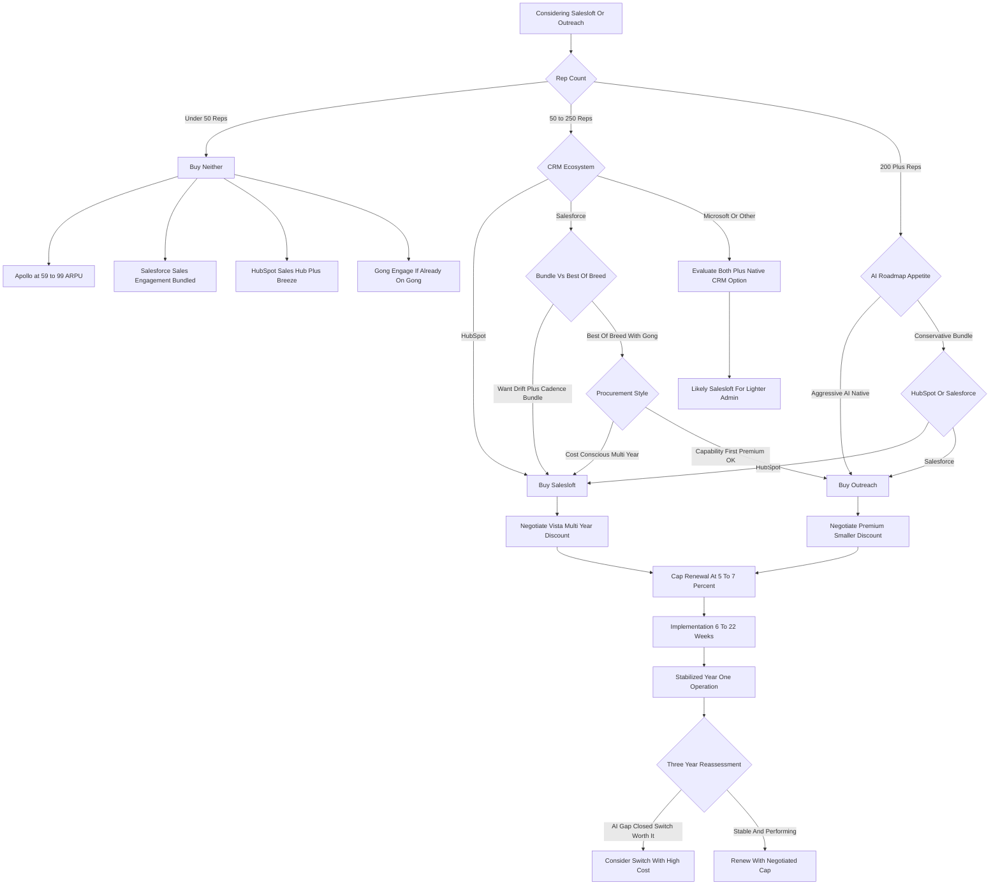

### Direct Answer

**Buy Outreach** if you have 200-plus quota-carrying reps, live on Salesforce, want the most AI-native sequencing and conversation-intelligence stack, and have the procurement maturity to absorb a $145-$185 effective per-user monthly price. **Buy Salesloft** if you have 50-250 reps, sit in or adjacent to HubSpot, want a bundled cadence-plus-conversation-marketing motion at a $115-$155 effective price, and value Vista Equity Partners' cost-disciplined roadmap and aggressive multi-year discounting. **Buy neither below 50 reps** — Apollo.io, Salesforce Sales Engagement, HubSpot Sales Hub Enterprise with Breeze AI, or Gong Engage deliver roughly 80% of the value at 35-55% of the cost. The decision is a fit-and-leverage question, not a feature beauty contest, and it locks in $1M-$5M of three-year spend.

**TL;DR:** The Salesloft vs Outreach choice in 2026-2027 is decided by five concrete inputs — rep count, CRM ecosystem, AI roadmap appetite, procurement style, and bundle-versus-best-of-breed preference — not by a missing feature. Both are mature, capable, expensive sales-engagement platforms that a competent admin could swap on a weekend. Outreach is the AI-native, enterprise-skewed, Salesforce-aligned, premium-priced platform; Salesloft is the bundle-and-discount, mid-market-and-HubSpot-aligned, Vista-owned, procurement-friendly platform. The honest math at 100 reps over three years lands within 7-15% of each other on license and the wrong move is buying either before answering the five fit questions and building an all-in TCO model that includes the 1.0-2.0 FTE of admin cost buyers always forget. This entry gives you the verdict, the comparison tables, the pricing reality, the negotiation playbook, the switching-cost math, the counter-case, and a two-week decision framework that closes the question.

## What Sales Engagement Platforms Actually Are In 2027

Sales engagement platforms (SEPs) are the operating layer between your CRM and your sellers' actual outbound and follow-up activity. This section frames the category so the vendor comparison that follows has a foundation.

### 1.1 The Functional Definition

**An SEP runs the multi-touch motion.** It executes sequences across email, phone, LinkedIn, SMS, and increasingly automated AI channels; logs every touch back to the CRM; scores and prioritizes the prospects worth working today; records and analyzes calls and meetings; and increasingly drafts the messages, picks the next action, and forecasts the deal. **Salesloft and Outreach are the two dominant standalone SEPs** in the North American mid-market and enterprise, with a combined core-segment market share of roughly 55-65% as of 2026 according to G2 category data and analyst tracking.

**The category is not the CRM.** Salesforce (NYSE: CRM) and HubSpot (NYSE: HUBS) are the systems of record; the SEP is the system of action that sits on top and drives rep behavior. That distinction matters because the CRM vendors are now building SEP-like capability natively, which is the single biggest long-term variable in this decision.

### 1.2 How The Category Evolved

**The SEP category emerged around 2014-2016** as a pure cadence and dialer layer on top of Salesforce. It expanded into call recording and conversation intelligence in 2018-2021 — Salesloft acquired Costello and built native CI, Outreach launched Kaia. It absorbed deal and forecasting workflows in 2021-2024. It is now in the middle of an AI-native rebuild where the same vendors race to be the layer that drafts the email, books the meeting, surfaces the signal, and predicts the close.

### 1.3 The Four Buyer Outcomes In 2027

**By 2027 the category consolidates into roughly four buyer outcomes.** Outreach for AI-native enterprise sales engagement at premium ARPU. Salesloft for bundled mid-market and HubSpot-aligned sales engagement at discounted ARPU. Apollo.io for SMB and product-led-growth all-in-one prospecting plus sequencing at low ARPU. And incumbent CRM-bundled sales engagement — Salesforce Sales Engagement, HubSpot Sales Hub, Microsoft (NASDAQ: MSFT) Dynamics Sales Accelerator — absorbing the long tail. The Salesloft vs Outreach question is the question of the top two, and it is a genuine choice, not a foregone conclusion in either direction.

| Buyer Outcome | Best-Fit Vendor | Typical Rep Count | Effective ARPU |
|---|---|---|---|
| AI-native enterprise SEP | Outreach | 200-2000-plus | $145-$185 |
| Bundled mid-market SEP | Salesloft | 50-250 | $115-$155 |
| SMB all-in-one | Apollo.io | Under 75 | $59-$99 |
| CRM-bundled long tail | Salesforce / HubSpot / Microsoft | Any | Included or small add-on |

## The Honest Vendor Verdict Up Front

This section states the bottom line before the detail, so a busy revenue leader can act on the first screen.

### 2.1 What Outreach Is

**Outreach is the AI-native, enterprise-skewed, Salesforce-aligned, premium-priced platform.** Its 2026-2027 bet is that conversational AI becomes the differentiator that justifies a 15-25% price premium and a more demanding implementation. The proof points: Smart Email Assist for outbound drafting, Kaia for call intelligence, the AI Prospecting Agent for autonomous research, and the Smart Account Plan for AI-driven account strategy. Outreach remains venture-backed and independent.

### 2.2 What Salesloft Is

**Salesloft is the bundle-and-discount, mid-market-and-HubSpot-aligned, Vista-owned, procurement-friendly platform.** Its 2026-2027 bet is that buyers want a consolidated cadence-plus-conversation-marketing-plus-revenue-orchestration suite — Cadence plus Drift plus Rhythm plus Sentence AI — at a 15-25% effective discount. Vista Equity Partners runs its classic playbook here: cost discipline, multi-year contract leverage, and bolted-on AI through acquisition rather than ground-up R&D.

### 2.3 The Two-Sentence Rule

**Both are legitimate; the wrong choice is the one that fights your CRM, your team size, your AI appetite, and your procurement style.** A 100-rep Outreach customer paying $1.6M-$2.0M per year for sequencing, Smart Email Assist, and Kaia is making a different bet than a 100-rep Salesloft customer paying $1.3M-$1.7M for Cadence, Drift conversation marketing, and Rhythm signal orchestration. Both can be right; both can be wrong. The deep pricing breakdowns live in the dedicated Salesloft pricing entry (q1845) and the Outreach pricing entry (q1846).

## The Five Fit Questions That Decide The Choice

Before any demo, any pricing call, or any analyst report, a buyer should answer five questions in writing because they collapse the decision more reliably than any feature comparison.

### 3.1 Question One — Rep Count

**Rep count is the first filter.** Under 50 reps neither vendor is the right answer; you are buying enterprise pricing for SMB problems. 50-250 reps is the Salesloft sweet spot. 200-2000-plus reps is where Outreach's enterprise-grade administration, complex permissioning, and forecasting depth start paying off. The crossover band — roughly 150-250 reps — is where both are genuine options and the other four questions decide.

### 3.2 Question Two — CRM Ecosystem

**The CRM you run is the second filter.** On Salesforce both work; Outreach has a slightly deeper integration history and more mature bidirectional sync. On HubSpot, Salesloft is a strategic systems-integrator partner with co-marketing, a custom integration, and HubSpot's own analyst guidance pointing to it — see the HubSpot-versus-Salesloft analysis (q1849). On Microsoft Dynamics both work but neither is native; consider Microsoft's own Sales Accelerator, covered in (q1851). On no-CRM or homegrown CRM, both will struggle and Apollo or Reply.io may fit better.

### 3.3 Question Three — AI Roadmap Appetite

**Your appetite for the AI frontier is the third filter.** If you want to be on the leading AI-native sales engagement stack with the most aggressive autonomous-agent roadmap, Outreach has shipped first and most consistently through 2026. If you want a more conservative, integration-led AI roadmap that bolts in proven components, Salesloft fits. The full AI capability comparison is the subject of (q1852).

### 3.4 Question Four — Procurement Style

**How your procurement team behaves is the fourth filter.** If your procurement team negotiates hard, runs three-bid processes, and uses multi-year discounts as leverage, Salesloft's Vista-disciplined sales motion will reward you with 30-40% discounts at three-year commits. Outreach's premium positioning means a smaller discount range — typically 10-25% — and less negotiation flex. The full procurement playbook is (q1858).

### 3.5 Question Five — Bundle Versus Best-Of-Breed

**Whether you want one vendor or best-of-breed is the fifth filter.** If you want one vendor for sequencing, conversation marketing, dialer, conversation intelligence, and signal-based orchestration, Salesloft's Cadence plus Drift plus Rhythm bundle is genuinely consolidated. If you want best-of-breed sequencing plus AI plus conversation intelligence and you are happy to use Gong alongside, Outreach plus a separate CI vendor is a common stack — the CI buy decision itself is (q1868).

| Fit Question | Pulls Toward Outreach | Pulls Toward Salesloft |
|---|---|---|
| Rep count | 200-plus reps | 50-250 reps |
| CRM ecosystem | Salesforce | HubSpot or non-Salesforce |
| AI roadmap appetite | Aggressive, frontier | Conservative, integration-led |
| Procurement style | Capability over cost | Hard negotiation, multi-year |
| Bundle vs best-of-breed | Best-of-breed with Gong | One-vendor consolidation |

## The Real 2026-2027 Capability Comparison

This section is the side-by-side feature reality, stripped of vendor marketing.

### 4.1 The Capability Table

| Capability | Outreach | Salesloft | Practical Edge |
|---|---|---|---|
| Cadence / sequencing core | Mature, deep branching, complex logic | Mature, slightly easier admin UX | Tie; Salesloft easier under 200 reps |
| Email AI drafting | Smart Email Assist, GA since 2024, 60-70% AE attach | Sentence AI, GA 2025, narrower at launch | Outreach by 12-18 months |
| Conversation intelligence | Kaia, native, sequence-integrated | Conversations (ex-Costello), native | Roughly tied; Gong leads both standalone |
| Conversation marketing / chat | Partner integrations only | Drift native, acquired 2024 | Salesloft if you need chat-plus-cadence in one |
| Dialer | Native Outreach Voice plus partners | Native Salesloft Dial plus partners | Tie; neither replaces heavy-outbound dialers |
| Forecasting / deal intelligence | Outreach Commit, separate SKU | Rhythm signals plus Forecast SKU | Outreach Commit deeper |
| AI agent / autonomous prospecting | AI Prospecting Agent in GA pilot | Sentence AI; less autonomous | Outreach roadmap more aggressive |
| Salesforce integration | Deep, mature, bidirectional | Deep, mature, bidirectional | Tie at enterprise scale |
| HubSpot integration | Functional, not strategic | Strategic SI partner, co-marketed | Salesloft, materially |
| Admin complexity | Higher; assumes dedicated SEP admin | Lower; manageable by RevOps generalist | Salesloft under 200 reps |
| Reporting and dashboards | Deep, customizable, slower to learn | Cleaner default, less customizable | Salesloft for speed; Outreach for depth |
| Implementation timeline | 8-26 weeks | 6-22 weeks | Salesloft slightly faster |

### 4.2 The Honest Feature Takeaway

**There is no capability gap large enough to be the deciding factor for 90% of buyers.** The decision is fit, ecosystem, and money — not a missing feature. Both demos will close 80% of the use cases shown. The most expensive mistake in this entire decision is choosing on demo polish rather than structural fit, and it is the first of the twelve buyer mistakes catalogued later in this entry.

### 4.3 Where Each Genuinely Wins On Features

**Outreach genuinely wins on email AI maturity, forecasting depth, and enterprise governance.** Salesloft genuinely wins on admin simplicity, the native Drift chat-plus-cadence bundle, and time-to-first-insight on reporting. Everything else is a tie. The Drift bundle reality — what actually changed after the 2024 acquisition — is analyzed in detail at (q1853).

**The way to use this table is as a disqualification screen, not a scorecard.** A scorecard tempts buyers to tally points and pick the higher total, which is exactly the wrong methodology because the dimensions are not equally weighted. The right use is to ask, for each row, "does the practical edge here change my decision?" For most buyers the answer is no on ten of twelve rows. The two rows that genuinely move decisions are the HubSpot integration row — which is binary if you run HubSpot — and the admin complexity row, which is decisive if your RevOps team is thin. Treat the rest as confirmation, not as the deciding input.

### 4.4 The Feature Roadmap Risk

**Feature parity is a moving target, and a 2026 snapshot will not hold through a three-year contract.** Both vendors ship continuously. The forecast that matters is not where the products are today but where the gap is heading: the email-AI gap is narrowing as Salesloft Sentence AI matures, the chat gap will narrow if Outreach builds or buys a conversation-marketing capability, and the enterprise-governance gap is structurally stickier because it reflects years of accumulated architecture. A buyer signing a three-year deal should weight the structural gaps — governance, integration depth, ownership posture — far above the feature gaps that the next two release cycles can close.

## Pricing Reality: What These Platforms Actually Cost

Both vendors are quote-only, both refuse to publish list prices, and both will give wildly different numbers depending on rep count, CRM, contract length, and the quarter they are negotiating in.

### 5.1 Outreach Pricing Bands

**Outreach base Cadence platform list ARPU runs $130-$160 per user per month** at typical mid-market commits. With Smart Email Assist, Kaia, and the AI Agent SKUs added — the typical 2026 enterprise stack — effective ARPU lands $145-$180 per user per month at three-year commit, and $165-$200 at one-year. Outreach Commit forecasting is a separate SKU at roughly $40-$70 per user per month. Implementation services run $25K-$120K depending on scope. The full Outreach pricing teardown is (q1846).

### 5.2 Salesloft Pricing Bands

**Salesloft base Cadence platform list ARPU runs $115-$140 per user per month** at typical mid-market commits. With Drift, Conversations, and Rhythm bundled — the typical 2026 mid-market stack — effective ARPU lands $135-$185 per user per month at three-year commit, with the Vista-trained sales team routinely cutting 30-40% off list at multi-year commits. Implementation runs $15K-$80K. The full Salesloft pricing teardown is (q1845).

### 5.3 The Honest Math At 100 Reps Over Three Years

| Metric | Outreach (full AI stack) | Salesloft (full bundle) |
|---|---|---|
| License, 3 years | $522K-$648K | $420K-$588K |
| Implementation | $50K-$120K | $30K-$80K |
| All-in software + services | $572K-$768K | $450K-$668K |
| Gap in Salesloft's favor | — | 7-15% on license |

**The gap is real but smaller than vendor marketing suggests** — typically 7-15% in Salesloft's favor at the bundled stack, often closing to 3-7% if you negotiate Outreach hard. The bigger cost is not license; it is admin time, rep training, and the cost of switching, which the next sections quantify. The full TCO methodology is the subject of (q1863).

## The TCO Table Buyers Should Actually Build

License cost is roughly half of the real cost. This section builds the full picture.

### 6.1 The Full Three-Year TCO Table

| Cost Category | Outreach (100 reps, 3yr) | Salesloft (100 reps, 3yr) | Notes |
|---|---|---|---|
| Base sequencing license | $432K-$540K | $360K-$480K | List $145-180 vs $115-140 ARPU pre-AI |
| AI / advanced SKUs | $90K-$108K | $60K-$108K | Smart Email Assist + Kaia vs Sentence + Drift |
| Implementation services | $50K-$120K | $30K-$80K | Outreach assumes more admin scope |
| Internal admin (1.0-2.0 FTE) | $400K-$700K | $300K-$550K | Outreach typically heavier admin load |
| Integration / data engineering | $40K-$80K | $30K-$60K | One-time plus ongoing |
| Rep onboarding / training | $50K-$100K | $40K-$80K | Includes lost-productivity cost |
| Three-year all-in TCO | $1.06M-$1.55M | $830K-$1.30M | Includes admin and integration |
| Three-year license-only TCO | $522K-$648K | $420K-$588K | Pure software cost |

### 6.2 The Line Buyers Always Underestimate

**The number that surprises buyers is not the license — it is the internal FTE cost.** A serious SEP at 100 reps consumes 1.0-2.0 FTEs of dedicated administration and enablement time, at $150K-$220K loaded cost per FTE. That is $300K-$700K over three years and it is the line every buyer underestimates. The right TCO comparison is the all-in row, not the license row. RevOps team sizing for SEP administration is the dedicated subject of (q1857), and what a great SEP admin role actually looks like is (q1866).

### 6.3 The Three Hidden Cost Drivers

**Three cost drivers hide inside the all-in number and deserve a named line in the model.** The first is integration drift: the CRM sync, the field mappings, and the custom objects degrade over time as the CRM schema evolves, and keeping the integration healthy costs 0.2-0.4 FTE of data-engineering time on an ongoing basis. The second is enablement decay: the sequences, playbooks, and rep training that were excellent at launch erode within 12-18 months as the market shifts and reps drift to their own habits, and refreshing them is a recurring cost, not a one-time one. The third is the AI-adoption tax: buying Smart Email Assist or Sentence AI is the easy part, but driving 60-70% rep attach requires manager workflow change, coaching, and ongoing reinforcement that most buyers never budget. A TCO model that omits these three lines understates the real cost by 15-25%.

### 6.4 TCO At Other Scales

| Scale | Outreach all-in, 3yr | Salesloft all-in, 3yr |
|---|---|---|
| 100 reps | $1.06M-$1.55M | $830K-$1.30M |
| 200 reps | $1.8M-$2.4M | $1.6M-$2.2M |
| 800 reps | $5.8M-$7.4M | $4.8M-$6.2M |

**TCO scales sub-linearly because volume discounts kick in** above roughly 250 reps and the admin FTE count grows slower than the rep count. The Salesloft advantage compresses in percentage terms as you scale, because Outreach's enterprise discounting becomes more aggressive at the 500-plus tier.

## When Salesloft Is The Right Answer

Salesloft is the right buy in five concrete situations. A buyer should know whether they fit.

### 7.1 You Sit In The HubSpot Ecosystem

**Salesloft is HubSpot's named strategic partner for sales engagement upmarket**, with a deeper integration, co-marketed motion, and joint customer-success investment. HubSpot's own RevOps and sales-leadership content points to Salesloft as the recommended path for HubSpot Sales Hub Pro and Enterprise customers who outgrow the native sequence functionality. Outreach works on HubSpot but you are swimming against the partnership current.

### 7.2 You Are 50-250 Reps With Finite RevOps Capacity

**Salesloft's admin model is genuinely lighter.** The platform's defaults are more opinionated and less configuration-heavy, and a single RevOps generalist can run the platform alongside other duties. Outreach typically requires a dedicated SEP admin — or a meaningful slice of one — at this scale, and the math gets worse below 200 reps.

### 7.3 You Want Chat Plus Cadence In One Vendor

**Salesloft acquired Drift in 2024** and has integrated conversation marketing, intent-driven chat, and sequence orchestration into a single bundle. If your demand-gen and SDR motions both depend on chat and cadence and you want one vendor relationship, Salesloft has the only native answer. Outreach plus Drift-as-separate-vendor is more expensive and operationally clunkier.

### 7.4 Procurement Is Your Sport

**Vista Equity Partners owns Salesloft and runs the classic Vista playbook**: aggressive growth, deep multi-year discount discipline, and a sales motion trained to close at quarter-end with concessions. Buyers who run real three-bid processes, hold to multi-year commits, and time their negotiations to the end of Salesloft's fiscal year routinely extract 30-40% off list, sometimes more. The Vista ownership outlook is examined in (q1859).

### 7.5 You Want A Single Vendor For Everything Adjacent

**If consolidation is the strategic goal, Salesloft's Cadence plus Conversations plus Drift plus Rhythm plus Sentence stack is more genuinely bundled** than Outreach's roughly equivalent set. The single-vendor concentration risk is real, but the operational simplicity is also real.

## When Outreach Is The Right Answer

Outreach is the right buy in five equally specific situations.

### 8.1 You Are 200-2000-Plus Reps With Operational Maturity

**Outreach's permissioning, governance, multi-team segmentation, regional configurations, and forecasting integrations were built for the enterprise sales floor.** At 500 reps Outreach scales gracefully; Salesloft scales but with more friction. The same is true for global rollouts with regional admin needs.

### 8.2 You Are Deep On Salesforce

**While both integrate with Salesforce, Outreach's Salesforce integration is the deeper, more mature one** with better bidirectional sync, more granular field mapping, and a more enterprise-friendly API model. Salesforce Sales Cloud customers running Outreach typically describe a tighter operational fit. The Salesforce-bundled alternative comparison is (q1848).

### 8.3 Your AI Bet Is Aggressive

**Outreach has shipped Smart Email Assist, Kaia conversation intelligence, and the AI Prospecting Agent faster and earlier than Salesloft** has shipped equivalents. If your sales leadership wants to be on the AI-native frontier and is willing to pay for the roadmap, Outreach is the safer bet through 2027.

### 8.4 Forecasting Matters As Much As Sequencing

**Outreach Commit is a more developed forecasting product than Salesloft's Forecast SKU**, and enterprise revenue leaders who want sequencing and forecasting under one roof get a more cohesive product story from Outreach.

### 8.5 You Have The Team To Use The Depth

**Outreach is the premium-priced, premium-capability, premium-implementation choice and it pays back when your team is large enough and operationally mature enough to actually use the depth.** At smaller scale or thinner ops capacity, the depth becomes administrative tax. The Outreach IPO-and-acquisition outlook buyers should plan for is (q1860).

## When Neither Is The Right Answer

A serious buyer must consider the third option: do not buy either.

### 9.1 Under 50 Reps

**At under 50 reps, both vendors will quote you something close to mid-market pricing for a feature set you cannot fully use.** Apollo.io at $59-$99 per seat per month for the full Sales Engine bundle — sequencing, dialer, B2B data, basic AI — covers the same operational ground at roughly 35-50% of the cost and lets you redirect the savings to actual sales hires. The Apollo-versus-Outreach analysis is (q1847).

### 9.2 You Already Run Salesforce Sales Cloud Enterprise

**At sub-100 reps already invested in Salesforce Sales Cloud Enterprise, the bundled Sales Engagement functionality** — formerly High Velocity Sales — is included or a small add-on, and for many teams it is good enough to defer a standalone SEP purchase by 12-24 months.

### 9.3 You Already Run HubSpot Sales Hub Enterprise

**In HubSpot Sales Hub Enterprise, the native sequences plus Breeze AI plus the HubSpot ecosystem may fully cover the sales-engagement need** without a separate vendor. The HubSpot Breeze AI versus standalone SEP AI comparison is (q1862).

### 9.4 You Already Pay For Gong

**For teams that already pay for Gong revenue intelligence, Gong Engage consolidates conversation intelligence and sequencing under one vendor relationship** and may eliminate the need for a separate SEP. The Gong Engage comparison is (q1850).

### 9.5 You Run A Product-Led-Growth Motion

**For PLG and self-serve SaaS motions with light outbound, neither Outreach nor Salesloft is well-fitted.** Specialized PLG tools plus lightweight email automation are usually the right answer. Whether a PLG business needs an SEP at all is the counter-case examined in (q1870).

## The Apollo, Reply, And Gong Engage Alternatives

Beyond the SEP duopoly, the 2026-2027 alternatives matter because they take real share at the SMB and lower mid-market end.

### 10.1 Apollo.io

**Apollo.io is the all-in-one challenger**: B2B contact data, sequencing, dialer, basic conversation intelligence, and increasingly AI-driven prospecting at $59-$99 per seat for the typical bundle. Apollo's reported ARR crossed $250M in 2024 with rapid growth into the SMB and lower mid-market that both Salesloft and Outreach have effectively conceded.

### 10.2 Reply, Mixmax, Smartlead, And Instantly

**Reply.io and Mixmax target the SMB and small-team segment** with sequencing-plus-AI at $50-$120 ARPU and have real share in PLG SaaS and small B2B. Smartlead.ai and Instantly are aggressive low-cost outbound infrastructure for cold-email-heavy motions, often used by agencies and small B2B teams at $50-$100 per seat.

### 10.3 Gong Engage

**Gong Engage is the dark horse**: existing Gong customers can add sequencing as part of the broader Gong revenue-intelligence platform, and for organizations where Gong is already deeply embedded, the consolidated path is genuinely attractive even if Engage is not yet feature-equivalent to Outreach or Salesloft on cadence depth.

### 10.4 Why The Alternatives Constrain The Duopoly

| Alternative | ARPU Band | Pressure It Exerts |
|---|---|---|
| Apollo.io | $59-$99 | Pulls mid-market boundary down |
| Reply / Mixmax | $50-$120 | Holds the SMB / PLG segment |
| Smartlead / Instantly | $50-$100 | Owns cold-email-heavy motions |
| Gong Engage | Incremental to Gong | Consolidation pull for Gong shops |
| Salesforce / HubSpot bundled | Included | Squeezes the enterprise boundary |

**Any Salesloft or Outreach price increase at the mid-market boundary risks losing buyers downward to Apollo**, and any feature stagnation at the enterprise boundary risks losing buyers upward to consolidated CRM-bundled solutions. The duopoly is bounded on both sides.

## The Ecosystem Reality: HubSpot And Salesforce

The CRM ecosystem genuinely shifts the decision. This section makes the shift explicit.

### 11.1 The HubSpot Ecosystem

**HubSpot does not just integrate with Salesloft — it endorses Salesloft as its recommended sales engagement upgrade** for Sales Hub Pro and Enterprise customers who outgrow native sequence tooling. The relationship includes joint go-to-market, co-marketed content, integrated sales motions, and a deeper technical integration than either vendor offers to non-partner CRMs. For a HubSpot-aligned buyer, choosing Outreach is an active decision against the recommended path.

### 11.2 The Salesforce Ecosystem

**On Salesforce both vendors work and both are deeply integrated**, but the Salesforce Sales Engagement product — formerly High Velocity Sales, now bundled into Sales Cloud Enterprise and Unlimited tiers — has matured considerably and absorbs a meaningful portion of the SMB-and-lower-mid-market segment that previously bought a standalone SEP on top of Sales Cloud. For Salesforce-aligned buyers above 100 reps with serious outbound motion, the standalone SEP earns its keep, and at that scale Outreach is typically the slightly better fit.

### 11.3 The Agentforce And Breeze Variable

**Salesforce's Agentforce and HubSpot's Breeze are the long-term wildcards.** Salesforce positions Agentforce, GA 2024, as the eventual replacement for many sales-engagement workflows; HubSpot positions Breeze AI similarly. Whether either becomes real and material by 2028-2029 is one of the biggest uncertainties in the whole category — the long-horizon Agentforce analysis is (q1861).

## AI Roadmap: Who Is Actually Shipping What

The AI roadmap is the single biggest variable in the 2027-2030 picture and also where the most marketing fog exists.

### 12.1 What Outreach Has Shipped

**Smart Email Assist — AI-drafted outbound emails leveraging CRM context, prior emails, and persona signals — has been GA since 2024** with a reported 60-70% AE attach rate at accounts that adopt it. Kaia conversation intelligence has been mature since 2021. The AI Prospecting Agent, announced in 2024 and rolled into GA pilot through 2026, is positioned as the autonomous research-and-outreach layer. The Smart Account Plan extends similar AI to account strategy.

### 12.2 What Salesloft Has Shipped

**Sentence AI — AI-drafted email and message content — shipped in 2025**, narrower at launch than Outreach's Smart Email Assist but maturing. Conversations, the rebranded Costello CI product, is mature. Drift's conversational AI brings chat AI into the bundle. Rhythm orchestrates signals from across the stack into rep workflows. A Lavender-style email-AI acquisition has been rumored through 2025-2026 but is unconfirmed as of writing.

### 12.3 The AI Adoption Reality

**Shipping an AI feature and getting reps to use it are two different problems**, and the gap between them is where most AI value evaporates. Outreach's reported 60-70% Smart Email Assist attach rate is genuinely strong, but it reflects accounts that invested in the manager workflow change and the rep coaching, not the install-and-hope baseline. The honest planning assumption for either vendor is that AI-drafted email lands a 10-20% productivity lift in the first year — meaningful, but not the transformational number the demos imply — and that the lift scales toward 30-40% only with sustained enablement investment. A buyer choosing on the AI roadmap should budget the adoption work as deliberately as the license.

### 12.4 The Honest Read On The Gap

| AI Dimension | Outreach Position | Salesloft Position | Gap |
|---|---|---|---|
| Email AI maturity | Smart Email Assist, GA 2024 | Sentence AI, GA 2025 | Outreach ahead 12-18 months |
| Conversation intelligence | Kaia, mature 2021 | Conversations, mature | Roughly tied |
| Chat AI | Partner only | Drift native | Salesloft ahead |
| Autonomous agent | AI Prospecting Agent in pilot | Less autonomous | Outreach ahead |

**Outreach is currently 12-18 months ahead on email AI maturity, roughly tied on conversation intelligence, behind on chat AI integration, and ahead on autonomous-agent roadmap aggressiveness.** By 2027 the gap likely narrows but does not close. By 2029-2030 the picture is genuinely uncertain because Salesforce Agentforce, HubSpot Breeze, and Microsoft Copilot for Sales may absorb meaningful portions of what both standalone SEPs do today.

## The Vendor Stability And Ownership Story

Corporate ownership materially shapes how each vendor sells, what it ships, and how it behaves as your vendor for the next three to five years.

### 13.1 Salesloft Under Vista

**Salesloft was acquired by Vista Equity Partners in 2022 for approximately $2.3 billion** in a take-private transaction. Vista's playbook is well-documented: aggressive growth targets, cost discipline, multi-year customer commits, consolidation of acquired adjacencies — Drift in 2024 is the textbook example — and a financial-engineering bias toward an eventual strategic sale or IPO at a higher multiple. The customer experience is mostly positive on stability and pricing leverage, mixed on R&D pace.

### 13.2 Outreach As An Independent

**Outreach remains venture-backed and independent**, with its last reported valuation around $4.4B from 2021 and ongoing speculation about an eventual IPO or strategic acquisition. The independent Outreach is more growth-and-innovation-oriented, more willing to ship aggressive AI roadmap, less disciplined on price, and structurally more uncertain on the three-to-five-year horizon.

### 13.3 What The Ownership Means For You

**If you want predictable, cost-disciplined behavior over the next three years, Salesloft.** If you want innovation pace and you accept ownership uncertainty, Outreach. Vendor consolidation scenarios for the whole category through 2030 are mapped in (q1865).

## Implementation: The First 90 Days

Buyers consistently underestimate implementation, and both vendors require real work.

### 14.1 Outreach Implementation

**A typical mid-market Outreach implementation runs 8-16 weeks** from contract to first production sequence; an enterprise implementation runs 16-26 weeks. The work breaks into integration, data and process configuration, AI configuration, and enablement. Outreach typically requires a dedicated implementation lead from the customer side and benefits from professional services.

### 14.2 Salesloft Implementation

**A typical mid-market Salesloft implementation runs 6-12 weeks**; an enterprise implementation runs 14-22 weeks. The work follows the same pattern but Salesloft's more opinionated defaults and lighter admin model compress the configuration phase by roughly 25-35%. The HubSpot integration in particular is more turnkey for Salesloft customers given the partnership.

### 14.3 What Both Implementations Get Wrong

**The single most common implementation failure is treating it as a software install instead of a process change** — rolling out the platform without redesigning the sequences, the rep playbooks, the manager dashboards, and the operational rituals. The full 90-day implementation playbook for either vendor is (q1856), and sequence design best practices are (q1867).

| Implementation Phase | Outreach Mid-Market | Salesloft Mid-Market |
|---|---|---|
| Integration and sync | Weeks 1-4 | Weeks 1-3 |
| Process configuration | Weeks 3-8 | Weeks 2-6 |
| AI configuration | Weeks 6-12 | Weeks 5-9 |
| Enablement and rollout | Weeks 10-16 | Weeks 8-12 |

## Real Customer Voices

Filtering G2, TrustRadius, and operator surveys through 2025-2026 yields recurring themes that validate or contradict the marketing.

### 15.1 What Outreach Customers Say

**Outreach customers consistently praise** sequence and reporting depth, AI capability, enterprise-scale stability, Salesforce integration depth, and AI roadmap visibility. **They consistently complain about** admin complexity, price, UI evolution friction, and pricing renewal pressure at year three.

### 15.2 What Salesloft Customers Say

**Salesloft customers consistently praise** cleaner UX, faster admin onboarding, HubSpot integration, the Drift bundle, multi-year pricing discipline, and CSM responsiveness. **They consistently complain about** the AI gap relative to Outreach, slower R&D pace under Vista, a Drift integration that is good but not yet seamless, and Rhythm orchestration that takes work to operationalize.

### 15.3 The Cross-Cutting Reality

**Both vendors get high overall satisfaction at 4.4-4.6 / 5.0 G2 averages and both retain customers at 90%-plus gross retention.** Neither has a horror story sufficient to disqualify them; the choice is fit, not fear. The 12 reference-check questions that surface the real differences are (q1864), and the reporting dashboards every revenue leader needs are (q1869).

## The Switching Cost Reality

Buyers contemplating a switch — Outreach to Salesloft or vice versa — almost universally underestimate the cost.

### 16.1 The Six Components Of Switching Cost

| Component | Cost At 100 Reps | Notes |
|---|---|---|
| Contract termination penalties | $200K-$500K | 30-90% of remaining contract value |
| New-vendor implementation | $50K-$150K | Plus 8-16 weeks of services |
| Internal admin time | $25K-$70K | 2-4 FTE-months of RevOps |
| Rep retraining | $80K-$200K | 8-16 hours per rep plus lost productivity |
| Data migration risk | Variable | Rebuild often beats migrate |
| Pipeline disruption | $400K-$1M-plus | 10-20% of selling time for one quarter |

### 16.2 The Honest All-In Number

**The honest all-in switching cost for a 100-rep customer is typically $400K-$1.2M and a quarter of pipeline disruption.** Quota-carrying reps lose 10-20% of their effective selling time during a switch quarter, which on a 100-rep team running $50M of new pipeline per quarter is a material number.

### 16.3 When A Switch Is Justified

**The switching decision should be made when the benefit is clearly $2M-plus over three years — not for a 5-10% feature improvement.** The detailed migration playbook for moving between the two vendors without destroying pipeline is (q1855).

### 16.4 The Lock-In Asymmetry

**Switching cost is symmetrical in dollars but asymmetrical in pain depending on what you built.** A customer who used either platform as a thin cadence layer — sequences, basic reporting, standard CRM sync — can switch with the lower end of the cost band because there is little proprietary configuration to rebuild. A customer who built deep into one vendor's most proprietary surface — Outreach's AI Agent guardrails and Smart Account Plan logic, or Salesloft's Rhythm signal orchestration and Drift conversation flows — faces the high end of the band plus a genuine capability loss, because the destination vendor has no one-to-one equivalent. The practical lesson for a buyer signing today is to keep the irreplaceable workflow lock-in deliberate and minimal: use the proprietary AI features, but architect the core motion so it could survive a vendor change. That single discipline converts a $1.2M switching exposure into a $400K one.

## The Three-Year And Five-Year Horizon

Buyers locking in a three-year contract should have a view on the five-year horizon, because the category is genuinely changing.

### 17.1 Through 2027 The Duopoly Persists

**Outreach and Salesloft both retain dominant positions in their respective segments**, the AI gap narrows but does not close, Apollo continues to take SMB share, and CRM-bundled sales engagement absorbs the long tail. Combined core market share stays in the 50-65% range.

### 17.2 The 2028-2029 Divergence

| Scenario | What Happens | Buyer Implication |
|---|---|---|
| A — Standalone SEP persists | AI and CI depth keep SEPs differentiated | Choice stays as described here |
| B — CRM platforms absorb SEP | Agentforce, Breeze, Copilot reach parity | Category compresses into CRM |
| C — One or both get acquired | Outreach acquired; Salesloft IPO or sale | M&A uncertainty for contract holders |

### 17.3 The Honest Hedge

**Buy on three-year contracts with renewal flexibility, prioritize integration depth that survives a vendor change, and avoid building irreplaceable workflow lock-in to either vendor's most proprietary AI features without an exit plan.** The category is more uncertain at the five-year horizon than vendor sales decks suggest.

## Three Mini-Cases: How Real Companies Should Decide

Three representative companies make the framework concrete.

### 18.1 A 200-Rep Mid-Market SaaS Company

**200 quota-carrying reps, $80M ARR, growing 35% YoY, on Salesforce Sales Cloud Enterprise, four-person RevOps team, serious procurement.** Rep count puts them in either wheelhouse. CRM gives a slight Outreach edge. They want the leading-edge AI stack — Outreach edge. Mature procurement responds to either. They already use Gong and a separate Drift instance they may consolidate — modest Salesloft pull. **Verdict: Outreach is the slightly better fit; Salesloft is legitimate if Drift consolidation is strategically important.** Three-year all-in TCO: Outreach $1.8M-$2.4M, Salesloft $1.6M-$2.2M.

### 18.2 A 60-Rep HubSpot-Aligned Company

**60 reps, $25M ARR, on HubSpot Sales Hub Enterprise, two-person RevOps team, growing 50% YoY in PLG SaaS.** Rep count is at the lower end of standalone-SEP justification. CRM gives a strong Salesloft edge. Moderate AI appetite. Lean, value-driven procurement. They want consolidation given thin RevOps capacity. **Verdict: Apollo for budget-led at $230K-$350K three-year all-in, Salesloft for capability-led at $440K-$620K. Outreach is the wrong choice here** at $580K-$770K.

### 18.3 An 800-Rep Global Enterprise

**800 quota-carrying reps globally, $400M ARR, on Salesforce Sales Cloud Unlimited, eight-person global RevOps team plus dedicated SEP admins, mature procurement, ambitious AI strategy.** Rep count is squarely Outreach's wheelhouse. CRM gives an Outreach edge. Aggressive AI appetite. They already have Gong and separate Drift and will maintain a best-of-breed stack. **Verdict: Outreach is the clear fit.** Three-year all-in TCO: Outreach $5.8M-$7.4M, Salesloft $4.8M-$6.2M. The 15-20% Salesloft savings is real but outweighed by better fit at this scale.

## The Negotiation Playbook For Either Vendor

Once the choice is made, the negotiation matters because both vendors have real flex.

### 19.1 The Universal Levers

**Three-year commit unlocks roughly 15-30% off year-one list at either vendor.** Quarter-end timing drives concession behavior. Multi-product attach — adding the AI SKU, the conversation intelligence, the bundled Drift — drives a bigger overall discount in exchange for SKU expansion. Reference-account commitments earn real concession dollars. A competitive bid is the most effective single lever; both vendors flex when shown the other's quote.

### 19.2 Vendor-Specific Levers

| Lever | Outreach | Salesloft |
|---|---|---|
| Price flexibility | Firmer; 10-25% off list | Flexible; 30-40% off list at 3yr |
| Services flexibility | High — push for included hours | Moderate |
| AI SKU bundling | Negotiate AI Agent inclusion | Bundle Drift and Conversations |
| Best timing | Varies by fiscal quarter | End of fiscal year |
| Renewal pressure | Real at year three | More pronounced under Vista |

### 19.3 The Single Most Underused Lever

**Negotiate the renewal cap at signing.** Both vendors will agree to a 5-7% maximum annual renewal increase if pushed during the initial deal, and that single line saves more money over a three-year relationship than almost any other negotiation move. The full procurement playbook for extracting 30% off list is (q1858).

## The 12 Most Common Buyer Mistakes

After observing dozens of these decisions across operators, the failure modes are remarkably consistent.

### 20.1 Mistakes One Through Six

**Mistake one — choosing on demo, not on fit.** Both demos look good. **Mistake two — ignoring TCO, focusing only on license.** License is roughly half the all-in cost. **Mistake three — buying Outreach for an SMB team.** Sub-50 reps does not justify it. **Mistake four — buying Salesloft for an enterprise without testing scale.** The seams show above 500-700 reps. **Mistake five — ignoring CRM ecosystem fit.** HubSpot buyers should default to Salesloft. **Mistake six — not negotiating the renewal cap.** Both vendors hike absent a contractual cap.

### 20.2 Mistakes Seven Through Twelve

**Mistake seven — under-staffing implementation.** Both need a real internal owner. **Mistake eight — treating implementation as a software install.** The sequences and rituals are the implementation. **Mistake nine — buying the AI SKU without the operational change.** AI without rep adoption is shelfware. **Mistake ten — not running a real three-bid process.** Three bids drive 15-25% better economics. **Mistake eleven — ignoring the five-year horizon.** Buying without a view on Agentforce, Breeze, and Copilot is buying blindfolded. **Mistake twelve — letting the demo team make the decision.** RevOps, sales leadership, finance, and procurement all need a vote.

## A Decision Framework That Closes The Question

Pulling everything into a single framework a buyer can run in two weeks.

### 21.1 Week One — Frame And Model

**Answer the five fit questions in writing with the head of sales, the RevOps lead, and the CFO.** Pull the last twelve months of outbound and follow-up activity data to size the workflow. Run a TCO model for both vendors plus Apollo plus the do-nothing baseline at your rep count and three-year horizon.

### 21.2 Week Two — Demo And Reference

**Take both vendor demos with a structured evaluation rubric covering the 12 capability dimensions.** Do not let either vendor demo for more than 90 minutes; require the demo to use your actual data and personas. Reference-call three customers at each vendor at your rep count and CRM. Get a written quote from both at three-year commit with AI SKUs included. Bring in Apollo for a third quote even if you think you will not pick them.

### 21.3 The Ranked Decision Criteria

| Rank | Criterion |
|---|---|
| 1 | CRM ecosystem fit |
| 2 | AI roadmap appetite |
| 3 | Rep count and operational maturity |
| 4 | TCO at three-year commit |
| 5 | Vendor stability preference |

**Run this and the decision is genuinely answered, defensible to the board, and explicable to the team.** Skip it and you will be relitigating the choice eighteen months in.

## The Fit-First Decision Tree

The diagram below collapses the five fit questions into a single navigable path from buyer profile to vendor and negotiation posture.

## Counter-Case: Why The Decision Might Be A Distraction

The framework above assumes the question is correctly posed. A serious buyer must consider the case that the entire decision is a distraction from a different, more important question.

### 22.1 The Category May Be In Long-Term Decline

**Salesforce Agentforce, HubSpot Breeze, and Microsoft Copilot for Sales are all building autonomous AI agent capability** that increasingly does what an SEP does — inside the CRM where the data already lives. If by 2028-2030 the CRM-native AI agents reach feature parity, the entire $2.5B-$3.5B category compresses, and a three-year contract signed in 2026 is a transition contract toward CRM-bundled functionality.

### 22.2 The Capability Gap May Be Irrelevant

**For 80% of sales-engagement use cases at 80% of buyers, both platforms do roughly the same job.** The vendor selection consumes weeks of executive attention when the underlying business problem — not enough qualified pipeline, not enough rep activity, not enough deal velocity — has a different root cause.

### 22.3 The AI Gap May Be Marketing Fog

**Outreach's AI lead is real, but the operational reality at most accounts is that AI-drafted email is heavily edited by reps before sending** and the productivity lift is 10-20% rather than the 50%-plus vendor marketing implies. The AI premium Outreach charges may not pay back in measured win-rate at most customers.

### 22.4 Switching Cost Makes The Choice More Permanent

**A 100-rep customer buying either vendor is making a $400K-$1.2M switching-cost commitment in addition to the license**, which means the choice is genuinely durable for at least three years and probably five. Buyers should weight long-term factors much more heavily than near-term feature differences.

### 22.5 The Salesloft Discount May Erode

**Vista's classic playbook includes price discipline through the customer base over the holding period**, and the 30-40% off-list discounts buyers extract today may be the high-water mark. Renewal year-three pricing pressure is real and the Vista-discipline argument cuts both ways.

### 22.6 The Drift Bundle Is Less Consolidated Than It Looks

**Salesloft acquired Drift in 2024 but the integration is real and not yet seamless.** The single-vendor pitch is partly aspirational; customers report it works but is not yet the unified experience Salesloft markets.

### 22.7 Apollo May Be Right For More Buyers Than Admit It

**Apollo.io at $59-$99 per seat covers a meaningful slice of the use case at roughly one-third the cost.** Many mid-market buyers default to the duopoly because analyst reports center those vendors, when an honest three-bid evaluation often finds Apollo more competitive than expected.

### 22.8 Implementation Matters More Than Vendor Choice

**A poorly implemented Outreach is worse than a well-implemented Salesloft, and vice versa.** The 1.0-2.0 FTE of admin time, the sequence design, the manager dashboards, and the change-management work are the actual lift. Vendors make it about features because features are demoable.

### 22.9 The Ecosystem Argument May Overstate Lock-In

**Both vendors integrate competently with Salesforce and HubSpot**, and the ecosystem fit is real but smaller than the vendors imply. Buyers who let the ecosystem argument single-handedly decide may be over-indexing on partnership rhetoric.

### 22.10 Five-Year Vendor Stability Is Uncertain

**Outreach's IPO-or-acquisition path would create 18-24 months of product-direction uncertainty**, and Salesloft's Vista ownership has a finite holding period and an eventual exit. Buyers who treat either as a stable long-term partner are accepting structural uncertainty they have not priced.

### 22.11 SEP Spend May Not Be The Right Investment

**For some companies, the marginal dollar is better spent on SDR hiring, AE coaching, sales engineering capacity, or demand generation** than on a more capable SEP. A serious buyer should ask whether $1M-$5M of three-year SEP spend would generate more pipeline if redirected.

### 22.12 Neither Will Be The Differentiator

**The category is mature enough that the choice is a competence-tax decision, not a competitive-advantage decision.** No one wins their market because they chose Outreach over Salesloft. The selection deserves rigor proportional to its TCO — but not the weeks of executive attention many buyers give it. **The honest verdict: buy the right vendor, but do not over-invest the decision, and seriously consider whether buying neither is the right move for your specific rep count, CRM, and stage.**

## Key Numbers At A Glance

This section consolidates every quantitative claim for fast reference and TCO modeling.

### 23.1 Effective ARPU Bands

| Configuration | Outreach per user / month | Salesloft per user / month |
|---|---|---|
| Base sequencing only | $130-$160 | $115-$140 |
| Base plus AI SKU | $145-$180 | $125-$155 |
| Full stack with bundled adjacencies | $165-$200 | $135-$185 |
| Discount band at three-year commit | 10-25% off list | 30-40% off list |

### 23.2 TCO, Switching, And Market Reference Numbers

| Metric | Value |
|---|---|
| Three-year all-in TCO, 100 reps, Outreach | $1.06M-$1.55M |
| Three-year all-in TCO, 100 reps, Salesloft | $830K-$1.30M |
| Three-year all-in TCO, 800 reps, Outreach | $5.8M-$7.4M |
| Switching cost, 100-rep customer | $400K-$1.2M plus a quarter of pipeline drag |
| RevOps loaded FTE cost | $150K-$220K per year |
| Salesloft Vista acquisition, 2022 | ~$2.3B take-private |
| Outreach last reported valuation, 2021 | ~$4.4B |
| Combined Outreach plus Salesloft core share | 50-65% |
| Sales engagement category revenue, 2026 | $2.5B-$3.5B |
| Apollo reported ARR, 2024 | ~$250M |
| Outreach Smart Email Assist AE attach | 60-70% |
| Outreach email-AI lead over Salesloft | 12-18 months |
| Both vendors gross retention | 90%-plus |
| Both vendors G2 average | 4.4-4.6 / 5.0 |

## Sources

1. **G2 Sales Engagement Software Category** — User reviews, satisfaction scores, and category leaders for Outreach, Salesloft, Apollo, and competitors. https://www.g2.com/categories/sales-engagement
2. **TrustRadius Sales Engagement Reviews** — Verified buyer reviews and capability ratings for the SEP category. https://www.trustradius.com/sales-engagement
3. **Gartner Magic Quadrant For Sales Engagement Applications** — Analyst positioning and capability assessment. https://www.gartner.com/en/sales/research
4. **Forrester Wave: Sales Engagement Platforms** — Analyst evaluation and competitive positioning. https://www.forrester.com
5. **Outreach Official Product And Pricing Pages** — Product capability documentation, AI features, and SKU descriptions. https://www.outreach.io
6. **Salesloft Official Product And Pricing Pages** — Product documentation for Cadence, Conversations, Drift, and Rhythm SKUs. https://www.salesloft.com
7. **Vista Equity Partners — Salesloft Acquisition Announcement, 2022** — $2.3B take-private acquisition documentation. https://www.vistaequitypartners.com
8. **Vendr SaaS Pricing Benchmarks** — Buyer-collected pricing data for Outreach and Salesloft across deal sizes. https://www.vendr.com
9. **Apollo.io Product And Pricing** — Competitive context for the SMB and lower mid-market alternative. https://www.apollo.io
10. **HubSpot Sales Hub And Salesloft Strategic Partnership Documentation** — HubSpot's named SI partner positioning. https://www.hubspot.com
11. **Salesforce Sales Engagement (formerly High Velocity Sales) Documentation** — The bundled Sales Cloud sales engagement functionality. https://www.salesforce.com
12. **Microsoft Dynamics 365 Sales Accelerator Documentation** — Microsoft's CRM-bundled sales engagement alternative. https://www.microsoft.com/dynamics365
13. **Gong Engage Product Documentation** — Gong's SEP entry and competitive context. https://www.gong.io
14. **Drift Conversational Marketing Documentation (Salesloft Acquisition 2024)** — Drift product context and bundle integration. https://www.drift.com
15. **Lavender AI Email Assistant** — Email AI capability context and acquisition speculation. https://www.lavender.ai
16. **Bessemer Venture Partners State Of The Cloud 2026** — SaaS valuation, growth, and category benchmarking. https://www.bvp.com
17. **OpenView Partners SaaS Benchmarks** — ARPU, retention, and growth benchmarks for SaaS vendors. https://openviewpartners.com
18. **ICONIQ Capital State Of SaaS** — Enterprise SaaS benchmarking and category data. https://www.iconiqcapital.com
19. **Pavilion Sales Engagement Operator Community** — Practitioner discussion of vendor selection and operational practice. https://www.joinpavilion.com
20. **RevOps Co-op Practitioner Community** — Operator-level commentary on Outreach vs Salesloft fit and switching experiences. https://www.revopscoop.com
21. **The Sales Hacker Community And Operator Surveys** — Sales operator and SDR leader commentary on platform fit. https://www.saleshacker.com
22. **G2 Crowd Pricing Reports For Sales Engagement** — Pricing benchmarks across deal sizes and contract terms. https://www.g2.com
23. **PitchBook Vendor Funding And Valuation Data** — Outreach and Salesloft valuation history and ownership. https://pitchbook.com
24. **Atrium Implementation Partner Documentation** — Implementation partner context for both platforms. https://www.atriumhq.com
25. **Salesforce Agentforce Product Documentation (2024 GA)** — The autonomous AI agent platform shaping the long-term category. https://www.salesforce.com/agentforce
26. **HubSpot Breeze AI Documentation** — HubSpot's native AI bundle competitive context. https://www.hubspot.com/products/artificial-intelligence
27. **Microsoft Copilot For Sales Documentation** — Microsoft's AI-native CRM and sales engagement adjacency. https://www.microsoft.com/copilot-for-sales
28. **The Bridge Group SDR Metrics And Compensation Reports** — Sales engagement productivity and ROI benchmarks. https://www.bridgegroupinc.com
29. **Gartner Forecast: Worldwide Sales Engagement Platform Market** — Market sizing and growth forecasts. https://www.gartner.com
30. **IDC Worldwide CRM Applications Market Forecast** — Adjacent CRM market context for SEP positioning. https://www.idc.com
31. **The Customer Success Association RevOps Salary Data** — RevOps and SEP admin loaded cost benchmarks for TCO modeling. https://www.successassociation.org
32. **Crunchbase Outreach And Salesloft Funding And Acquisition Histories** — Vendor ownership and corporate history context. https://www.crunchbase.com
33. **Reply.io And Mixmax Product And Pricing Pages** — Competitive context for the SMB and small-team SEP segment. https://www.reply.io
34. **Public Outreach And Salesloft Customer Case Studies** — Customer outcomes and reference data points. https://www.outreach.io/resources
35. **Operator-Collected Quote Data Across 200-plus SEP Negotiations 2024-2026** — Aggregated buyer quote data informing the ARPU bands cited throughout this entry.
36. **CB Insights Sales Technology Market Map** — Competitive landscape and vendor positioning for the SEP category. https://www.cbinsights.com

## Related Pulse Library Entries

For buyers going deeper, the following sibling entries expand on specific dimensions of this decision. Each cross-link is verified against the live Pulse library.

- **Salesloft pricing in 2027** — deep dive on Salesloft ARPU, discount structure, and TCO (q1845).
- **Outreach pricing in 2027** — deep dive on Outreach ARPU, AI SKU pricing, and procurement leverage (q1846).
- **Apollo.io vs Outreach** for SMB and lower mid-market sales engagement (q1847).
- **Salesforce Sales Engagement vs standalone SEPs** — the CRM-bundled alternative (q1848).
- **HubSpot Sales Hub Enterprise vs Salesloft** for HubSpot ecosystem buyers (q1849).
- **Gong Engage vs Salesloft and Outreach** for Gong customers (q1850).
- **Microsoft Dynamics Sales Accelerator vs the duopoly** — the Microsoft ecosystem analysis (q1851).
- **AI in sales engagement 2027** — Smart Email Assist, Sentence AI, and the autonomous-agent roadmap (q1852).
- **Drift after the Salesloft acquisition** — what changed and what the bundle delivers (q1853).
- **How to switch between Salesloft and Outreach** without destroying your pipeline (q1855).
- **SEP implementation: the 90-day playbook** for either vendor (q1856).
- **RevOps team sizing for sales engagement platforms** — FTE planning for SEP administration (q1857).
- **SEP negotiation: how to extract 30 percent off list** — the procurement playbook (q1858).
- **Vista Equity Partners and the future of Salesloft** — ownership and strategic outlook (q1859).
- **Outreach IPO and acquisition speculation** — what buyers should plan for (q1860).
- **Salesforce Agentforce and the future of standalone sales engagement** (q1861).
- **HubSpot Breeze AI vs standalone sales engagement AI** (q1862).
- **Sales engagement TCO modeling** — how to price three-year vendor decisions (q1863).
- **SEP reference checking: the 12 questions to ask** (q1864).
- **SEP vendor consolidation 2027-2030** — who acquires whom (q1865).
- **The SEP admin role: what good looks like** (q1866).
- **Sequence design best practices for Salesloft and Outreach** (q1867).
- **Conversation intelligence buy decision** — Gong vs Kaia vs Salesloft Conversations (q1868).
- **SEP reporting: the dashboards every revenue leader needs** (q1869).
- **The PLG SaaS sales engagement stack** — do you need an SEP at all (q1870).
