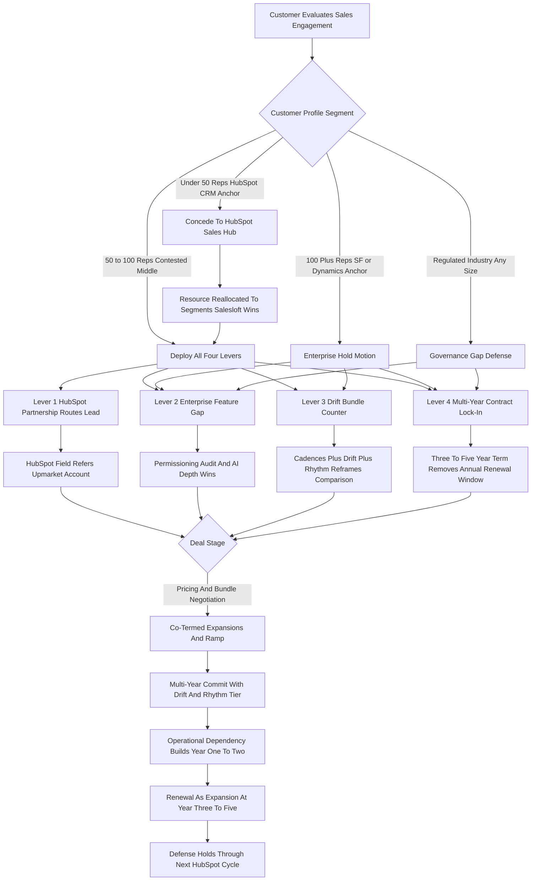

### Direct Answer

Salesloft defends against HubSpot Sales Hub bundling not by winning the price war it would lose, but by deploying a four-lever structural defense: the HubSpot strategic partnership that converts a competitor's field motion into an upmarket referral channel, a deliberate enterprise feature gap HubSpot (NYSE: HUBS) cannot close in one release cycle, a counter-bundle assembled from the 2024 Drift acquisition plus Rhythm AI, and Vista Equity Partners' multi-year-contract discipline that locks roughly 70% of new logos above the annual displacement window. The honest read is that this is a managed retreat upmarket plus a partnership-anchored hold of the contested 50-100 rep middle — Salesloft concedes the under-50-rep SMB tier where bundling math is decisive and is correct to stop fighting there. The defense is structurally durable through 2027 but is a disciplined competitive posture, not a final victory over a serious long-horizon bundler.

**TL;DR:** HubSpot's threat to Salesloft is a bundling-and-pricing war waged from a CRM-first starting position, not a feature war. Salesloft answers with four levers — partnership routing, an enterprise governance/AI feature gap, the Drift conversational counter-bundle, and Vista-disciplined multi-year contracts — applied segment-by-segment. It surrenders the under-50-rep tier, fights hard in the 50-100 rep contested middle, and holds the 100+ rep enterprise tier where Salesforce (NYSE: CRM) and Microsoft (NASDAQ: MSFT) Dynamics anchors mean HubSpot CRM is rarely the system of record. The defense holds through 2027; the 2028-2030 outlook depends on continued investment across all four levers as Sales Hub Enterprise closes gaps and Vista's hold-period exit pressure builds.

## 1. What Is Actually Being Defended Against

### 1.1 The Threat Is Bundling Economics, Not Features

The HubSpot Sales Hub threat to Salesloft is not a feature war, and any defense that treats it as one will misallocate every dollar of product and field investment. **It is a bundling-and-pricing war waged from a different starting position than Salesloft's**, and the asymmetry of that starting position is the entire foundation of the defense. HubSpot (NYSE: HUBS) enters the sales-engagement category as a CRM-first vendor: Marketing Hub, Sales Hub, Service Hub, Operations Hub, and Content Hub are all attached to the HubSpot CRM as a single Customer Platform. HubSpot prices Sales Hub Professional at roughly $90 per seat per month and Sales Hub Enterprise at roughly $150 per seat per month, with the CRM included and cross-Hub bundling discounts pulling the effective per-Hub cost down further when a customer takes two or three Hubs together.

**Salesloft sells from the opposite posture.** Salesloft markets a standalone sales-engagement platform that attaches to Salesforce (NYSE: CRM), Microsoft (NASDAQ: MSFT) Dynamics, or HubSpot CRM; it lists in the roughly $125-$165 per seat per month range for the core platform with conversation intelligence and Rhythm AI bundled into higher tiers; and it is sold as the operational layer above the CRM rather than as a bolt-on inside it. The pricing optics are obvious and they are not in Salesloft's favor at the small end.

### 1.2 The Optics Versus The Reality

A 30-rep team comparing a Sales Hub Professional bundle that includes the CRM at roughly $2,700 per month against Salesloft at roughly $4,500 per month plus a separate CRM contract reads HubSpot as the cheaper consolidated stack. **The optics are also misleading at scale.** The operational sophistication a 100+ rep organization actually deploys — multi-team permissioning, approval workflows for compliance-sensitive cadences, integration depth with Salesforce or Dynamics, conversation intelligence trained on enterprise call volume, AI signal routing, deep activity-graph reporting — is exactly where Sales Hub's CRM-attached, SMB-rooted DNA shows its limits.

The defense Salesloft must build is therefore not a "we are better" feature pitch. **It is a segment-by-segment economic argument** that concedes the segments where the bundling math favors HubSpot, reframes the segments where it does not, and locks the contested middle with structural mechanisms HubSpot cannot match by simply lowering price. Every other section of this guide is the operational expression of that core strategic posture. The same competitive shape — a category specialist defending against a CRM-attached bundler — runs in the reverse direction when HubSpot itself plays defense, as covered in (q1905), and the question of whether Salesloft can flip the script and win HubSpot's installed base is treated in (q1857).

### 1.3 Why The Asymmetry Favors A Disciplined Defender

The asymmetry has a hidden benefit for Salesloft: because HubSpot's bundle leverage is structurally strongest where governance needs are weakest, the segment HubSpot dominates is also the segment with the lowest lifetime value and the highest churn. **A disciplined defender that concedes that segment is not losing much margin** — it is shedding the least profitable cohort while concentrating field capacity on the enterprise tier where contract values are largest and net revenue retention is highest. The under-50-rep SMB cohort is the cohort most likely to churn for any reason — a funding crunch, a leadership change, a pivot — and it is the cohort whose support and onboarding cost is highest relative to contract value. A vendor that "wins" that cohort by matching HubSpot's bundle price is winning a negative-margin customer.

**The corollary is uncomfortable but strategically essential**: a founder running a category specialist against a bundler must be willing to lose deals on purpose. The instinct of every sales organization is to fight for every logo, and that instinct, unchecked, will pull a specialist into a price war it cannot win. Salesloft's defense works because the company's leadership has made the un-instinctive decision explicit at the level of compensation, territory design, and lead routing — the SMB inbound is not even routed to the enterprise field, so an enterprise AE never feels the temptation to discount down into the unwinnable segment. The discipline is structural, not motivational.

### 1.4 The Bundler's Structural Limit

It is worth being precise about why HubSpot's bundle advantage does not simply extend all the way up. A bundle is most powerful when the buyer values the bundled components roughly equally and wants to minimize vendor count. **As an organization scales, that preference inverts**: a 600-rep enterprise does not want one vendor for everything — it wants the best vendor for each load-bearing function, because the cost of a mediocre sales-engagement layer at that scale (lost productivity across 600 reps) dwarfs the procurement savings of consolidation. The bundle's appeal is inversely correlated with the operational stakes. This is the structural reason the enterprise tier is defensible at all, and it is why HubSpot's most credible upmarket path is not "bundle harder" but "close the feature gap" — which, as Section 3 argues, takes roadmap-time Salesloft can convert into lock-in.

| Dimension | HubSpot Sales Hub Posture | Salesloft Posture |
|---|---|---|
| Category entry point | CRM-first, Hub bundle | Standalone sales-engagement layer |
| Core per-seat list | ~$90 (Pro) / ~$150 (Ent) | ~$125-$165 core platform |
| CRM relationship | CRM included in bundle | CRM-agnostic; separate CRM contract |
| Natural sweet spot | Under 50 reps, HubSpot CRM anchor | 100+ reps, Salesforce/Dynamics anchor |
| Primary weapon | Bundle math and cross-Hub discount | Feature depth, governance, multi-year lock |
| Structural weakness | Enterprise governance and CRM-anchor mismatch | Higher absolute price per seat |

## 2. Lever One — The HubSpot Strategic Partnership Itself

### 2.1 The Counterintuitive Core Of The Defense

The single most counterintuitive piece of Salesloft's defense is that **HubSpot itself is one of its largest and most strategic referral partners**, and the partnership is structured precisely to handle the segment of the market Sales Hub cannot serve. HubSpot's field organization — the AEs and CSMs working inbound deals and account expansions in the 100+ rep tier — needs an answer when a prospect asks "can Sales Hub run our outbound at our scale?" When the honest answer is "Sales Hub can do parts of it but you will outgrow it within twelve months," HubSpot's commercial interest is to direct that account to a partner that keeps the customer on HubSpot CRM rather than losing the entire account to a Salesforce-and-Outreach stack.

**Salesloft is positioned as the preferred upmarket sales-engagement partner for exactly this routing decision.** The relationship is operationalized through joint co-marketing at HubSpot's INBOUND conference, partner-tier listing in the App Marketplace, integration-depth investments in the bidirectional sync with HubSpot CRM, joint case studies with shared enterprise customers, and direct field collaboration in deals where a HubSpot AE pulls Salesloft into the conversation as the upmarket sales-engagement layer.

### 2.2 Turning A Competitor's Motion Into A Channel

The strategic point is that HubSpot's own go-to-market motion becomes a Salesloft channel for the segment Sales Hub structurally cannot serve. **This converts what would otherwise be Salesloft's most dangerous competitor into its most useful upmarket lead source** for HubSpot-CRM-anchored accounts. A founder studying competitive defense should note how rare and how valuable this is — most defenders cannot turn the aggressor into a referral partner because the segment overlap is total. Salesloft can because the overlap is partial: HubSpot wants the SMB seat, Salesloft wants the enterprise seat, and the account that sits between them is worth more to both companies if it stays on HubSpot CRM with Salesloft running engagement on top.

### 2.3 The Honest Vulnerability In Lever One

The vulnerability is real and worth naming plainly. The partnership is **not contractual exclusivity**. HubSpot can shift partnership preference if Salesloft underperforms in shared accounts. HubSpot's own upmarket ambitions create permanent tension because every dollar HubSpot can keep inside Sales Hub Enterprise is a dollar that does not flow to Salesloft — and HubSpot's AI strategy, examined in (q1921), is explicitly aimed at making Sales Hub Enterprise more credible at larger scale. The defense therefore depends on Salesloft consistently demonstrating to HubSpot's field that Salesloft-anchored upmarket deals retain HubSpot CRM, expand the HubSpot footprint, and convert larger and stickier than Sales-Hub-only attempts at the same accounts.

### 2.4 How To Keep The Partnership Lever Healthy

A partnership lever that depends on continued goodwill must be actively maintained, and Salesloft's operational answer is to make the partnership measurable from HubSpot's side. **The decisive metric is HubSpot-CRM retention inside Salesloft-anchored accounts.** If HubSpot's analytics show that accounts where Salesloft runs the engagement layer keep HubSpot CRM longer, expand HubSpot seat count, and adopt more HubSpot Hubs than comparable Sales-Hub-only accounts, the partnership is self-reinforcing — HubSpot's own data tells its field to route. If that metric ever inverts, the partnership unwinds regardless of relationship warmth. The operational discipline is therefore to instrument the shared-account cohort, surface the retention and expansion numbers to HubSpot's partnership team quarterly, and treat any Salesloft-anchored account that churns HubSpot CRM as a partnership incident, not just a customer loss. The lever is durable exactly as long as Salesloft is provably accretive to HubSpot's core CRM franchise, and not one quarter longer.

| Partnership Mechanism | What It Delivers | Failure Condition |
|---|---|---|
| INBOUND co-marketing | Brand association, joint demand gen | HubSpot deprioritizes partner stage time |
| App Marketplace partner tier | Inbound discovery, integration trust | Tier downgrade after shared-account losses |
| Bidirectional CRM sync depth | Low-friction adoption on HubSpot CRM | HubSpot throttles API depth for partners |
| Joint field deal cycles | HubSpot AE routes upmarket account | HubSpot AE keeps deal inside Sales Hub Ent |
| Shared enterprise case studies | Proof for the next routed account | Reference customer churns to Sales Hub |

## 3. Lever Two — The Enterprise Feature Gap

### 3.1 Why The Gap Exists Structurally

The second lever is the operational reality that **Sales Hub's CRM-attached architecture and SMB-rooted product lineage leave a set of capability gaps that 100+ rep enterprises actively need and that HubSpot cannot close in a single release cycle**. This is not a claim that HubSpot's engineers are weak — they are not. It is a claim about lineage: a product built first for SMB inbound marketing carries assumptions about team size, governance overhead, and CRM-anchor that take multi-year roadmap time to unwind.

### 3.2 The Six Gaps Enumerated

**Multi-tier permissioning and sequence approval workflows** are the canonical gap. A 300-rep organization in financial services, healthcare, or life sciences needs role-based controls on who can launch a cadence, what approvals a cadence requires, what content can be sent without compliance review, and a full audit trail of who sent what to whom and when. Sales Hub's permission model, designed for smaller and less governance-heavy teams, does not match the granularity Salesloft built into its enterprise tier.

**Conversation intelligence depth** is the second gap — multi-language, multi-team, multi-method scoring and coaching workflows that enterprise sales organizations use to operationalize call intelligence at scale.

**Cadence sophistication** is the third — multi-step, multi-channel sequences with branching logic, conditional steps based on engagement signals, step-level A/B testing, and AI-recommended next-step actions.

**Integration depth with Salesforce and Microsoft Dynamics** is the fourth and most fundamental: Sales Hub's deepest integration is with HubSpot CRM, which is not the CRM the 1,000-seat enterprise actually runs.

**AI signal routing and Rhythm-style prioritization** is the fifth, where Salesloft's Rhythm engine consumes signals from across engagement, intent, and conversation surfaces — a roadmap detailed in (q1849).

**Reporting depth and activity-graph attribution** at enterprise scale is the sixth.

### 3.3 The Gap Is A Time Window, Not A Wall

None of these gaps are permanent in principle — HubSpot is a serious product organization and will close some of them. **The defensive lever is that closing the gaps takes multi-year roadmap time.** During that window Salesloft holds the enterprise tier on capability rather than only on price, and uses the multi-year contract lever (Section 6) to lock customers above the threshold where a closed-gap Sales Hub Enterprise could plausibly displace them.

| Capability Gap | Enterprise Need | Sales Hub Status | Estimated Close Time |
|---|---|---|---|
| Multi-tier permissioning + approvals | Regulated-industry compliance | Below enterprise granularity | 2-3 release cycles |
| Conversation intelligence depth | Multi-team coaching at scale | Basic transcription present | 2+ years to parity |
| Branching multi-channel cadences | Complex outbound orchestration | Linear sequences mature | 1-2 release cycles |
| Salesforce / Dynamics integration | Enterprise CRM anchor reality | HubSpot-CRM-first by design | Structural, slow |
| AI signal routing (Rhythm-class) | "What do I work next" prioritization | Earlier in product life | Fast-moving, uncertain |
| Activity-graph attribution | Enterprise RevOps reporting | Improving, not at depth | 1-2 release cycles |

### 3.4 The Governance Gap Is The Hardest To Close

Of the six gaps, the **multi-tier permissioning and approval-workflow gap is the one HubSpot will find hardest to close**, and it is therefore the one Salesloft should lean on most heavily in the contested middle and in regulated verticals. The reason is architectural rather than effort-related. A permission model is not a feature bolted onto a product — it is a foundational assumption that every other feature is built against. A product that started life assuming small, trusting, low-governance teams has thousands of code paths that implicitly assume "any user can do this." Retrofitting granular, auditable, approval-gated permissions onto that foundation means revisiting every one of those paths, and that is multi-year work that ships in fragments rather than in one release. Salesloft, by contrast, built its enterprise tier for governance-heavy buyers and carries that assumption in its foundation. **A financial-services buyer evaluating cadence governance is not comparing feature checklists — they are comparing whether a regulator's auditor will accept the audit trail**, and "we are working on it" is not an acceptable answer to a compliance officer. That is why the governance gap is the lever that holds even when HubSpot is cheaper and even when HubSpot has closed the cadence-sophistication and reporting gaps.

## 4. Lever Three — The Drift Bundle Counter

### 4.1 The Counter-Bundle Logic

The third lever is the bundle Salesloft assembled through the **2024 acquisition of Drift**, which converted Salesloft from a pure sales-engagement vendor into a sales-engagement-plus-conversational-marketing-plus-Rhythm-AI stack — a counter-bundle to HubSpot's CRM-attached Hub-bundling motion. The strategic logic is precise: HubSpot wins price-comparison conversations when the comparison is "Sales Hub plus CRM" versus "Salesloft plus separate CRM." **The comparison reframes when Salesloft answers with "Salesloft cadences plus Drift conversational AI plus Rhythm signal routing"** — a bundle that addresses both the outbound engagement layer and the inbound conversational-buying layer that HubSpot's Marketing Hub and Sales Hub split awkwardly.

### 4.2 What Drift Adds To The Stack

Drift adds chat-based qualification, AI-powered conversational selling, and signal capture from buyer behavior on the website and in product, all of which feeds the Rhythm engine that prioritizes which accounts and contacts the rep should work next. The bundle gives Salesloft a story for the 100+ rep enterprise: **"you do not need Sales Hub plus a separate conversational tool plus a separate signal layer; we are the full operational layer above whichever CRM you run."** Whether the conversational-marketing capability can actually beat Drift-era standalone competitors is examined in (q1859), and the broader strategic question of what Salesloft should do with the Drift asset is the subject of (q1858).

### 4.3 The Honest Economics And Vulnerability

The economics of the bundle counter are nuanced. Drift was a serious revenue line in its own right before the acquisition. The integration into the Salesloft platform takes time, and the go-to-market motion has to cross-sell the combined offering credibly. **The bundle does not lower the absolute price below HubSpot's price — it changes the price-per-capability comparison** so the buyer is comparing what each platform actually does for an enterprise sales motion, not just seat costs. The Drift acquisition also signaled strategic seriousness to the market and to the competitive set (Clari, Gong, Outreach) about Salesloft's intent to remain a consolidating platform rather than be consolidated. The vulnerability: Drift integration has to deliver bundle-level value. If it remains a loosely coupled cross-sell, the counter is more marketing than substance and HubSpot's bundling story regains the upper hand.

| Bundle Element | Comparison HubSpot Forces | Salesloft Counter-Frame |
|---|---|---|
| Outbound cadence engine | Sales Hub sequences vs Salesloft | Deeper branching, enterprise governance |
| Inbound conversational layer | Marketing Hub chat vs separate tool | Drift native, unified with engagement |
| Signal / intent routing | Breeze AI vs separate signal tool | Rhythm consumes all surfaces natively |
| CRM | "It is already bundled" | CRM-agnostic; no anchor lock-in |
| Total comparison | Seat-cost bundle math | Price-per-capability for enterprise motion |

## 5. Lever Four — Vista's Multi-Year Contract Discipline

### 5.1 The Quietly Most Powerful Lever

The fourth lever is the most quietly powerful, and it is the operating discipline Vista Equity Partners imposed on Salesloft after the 2021 take-private transaction: **a deliberate mandate to push new logos onto multi-year contracts** — typically three years, often four or five for the largest accounts — with roughly 70% of new logos signing on multi-year terms by the mid-2020s. The strategic reason is structural: a multi-year contract removes the customer from the annual renewal cycle that is HubSpot's most natural displacement window.

### 5.2 The Renewal-Window Mechanic

A customer on a one-year Salesloft contract is in a buying conversation every twelve months, and during that conversation HubSpot's bundling pitch — "you already have HubSpot CRM, just add Sales Hub for less than you are paying Salesloft" — is fresh and active. **A customer on a three-to-five-year contract is not in that buying conversation.** The renewal conversation becomes an expansion conversation about adding seats, adding modules, and lifting price per existing seat through Drift, conversation intelligence, and Rhythm tier upgrades.

### 5.3 What The Lock-In Window Buys

During the lock-in window Salesloft has time to deepen integration into the customer's workflow, train the customer's RevOps team on Salesloft-specific operating motions, accumulate the rep behavioral data that drives AI value, and build the switching cost that makes the eventual rip-and-replace conversation expensive even if Sales Hub Enterprise has closed the feature gap by then. The Vista operating model that produces this discipline is examined in depth in (q1847), and its effect on gross margin trajectory is treated in (q1864). The risk: aggressive multi-year terms can suppress new-logo close rates if customers resist commitment, and Vista's hold-period exit pressure can push the discipline into territory that erodes win rates.

## 6. The Multi-Year Contract Mechanics In Practice

### 6.1 The Six Operational Mechanics

Because the multi-year contract lever is so central, the mechanics of how Salesloft actually lands and operationalizes those contracts deserve enumeration.

**Pricing incentives for longer terms** are the first mechanic: a one-year contract pays one rate, a three-year contract pays a meaningfully discounted rate, and a five-year contract pays the most aggressive per-seat economics. The discount curve is steep enough that the buyer's CFO sees real savings, while Salesloft's lifetime-value math improves because gross retention dynamics dominate.

**Enterprise feature gating** is the second: Rhythm AI, Drift bundle access, conversation intelligence depth, advanced governance, and premium support tiers are gated either to higher editions or to multi-year commitments.

**Ramped seat commitments** are the third: a multi-year deal can include a ramp — 100 seats year one, 200 year two, 300 year three — letting the customer commit without paying for full seats day one while locking the expansion path.

**Co-termed expansions** are the fourth: when the customer adds Drift seats or upgrades a Rhythm tier mid-contract, the new modules co-term to the original end date, extending effective duration.

**Executive sponsorship** is the fifth: the largest multi-year deals are sponsored by Salesloft executive leadership meeting the customer's CRO and CFO directly.

**Renewal as expansion** is the sixth and most important: by the time a multi-year contract approaches its end, the operational dependency makes a clean rip-and-replace prohibitively expensive in change-management cost regardless of any list-price gap.

### 6.2 Why The Mechanics Compound

Executed with discipline, these mechanics convert the multi-year contract from a paper commitment into a real defensive moat. Each mechanic reinforces the others — ramped seats make the longer term easier to sign, feature gating makes it more valuable, co-terming extends it, and renewal-as-expansion harvests it.

| Mechanic | Buyer Benefit | Defensive Effect |
|---|---|---|
| Long-term pricing discount | Lower per-seat cost | Removes annual price re-shop |
| Enterprise feature gating | Access to full platform value | Ties value to the commitment |
| Ramped seat commitment | No day-one full-seat cost | Locks the expansion path |
| Co-termed module adds | Single renewal date | Extends effective contract duration |
| Executive sponsorship | Roadmap visibility, success commits | Raises political switching cost |
| Renewal-as-expansion | Continuity, no migration | Eliminates re-evaluation conversation |

## 7. Annual Renewal Math — Why The Lock-In Lever Matters Quantitatively

### 7.1 The Displacement-Window Comparison

A concrete renewal-math comparison shows the defensive value of multi-year contracts. The variable that matters is **how many times over a three-year horizon HubSpot's bundling pitch gets a fresh hearing**.

| Scenario | Term | Y1 Outcome | Y2 Outcome | Y3 Outcome | HubSpot Displacement Window |
|---|---|---|---|---|---|
| 1-year contract, no lock-in | 12 months | Renewal at-risk | At-risk | At-risk | Every 12 months — 3 chances over 3 years |
| 3-year contract, standard | 36 months | Locked | Locked | Renewal at-risk | One window at month 36 |
| 5-year contract with ramp | 60 months | Locked, ramping | Locked, ramping | Locked | Zero window in years 1-5 |
| 3-year + Drift bundle add-on | 36 months base | Locked | Locked, expansion | Renewal-as-expansion | Effectively no clean displacement opp |
| 1-year with HubSpot CRM anchor | 12 months | High bundling pressure | Likely loss | Lost to Sales Hub | High — default Salesloft loss |

### 7.2 Reading The Math

The math makes the lock-in lever explicit: a one-year contract with a HubSpot-CRM-anchored customer is the canonical lost-account profile, while a three-to-five-year contract with bundle add-ons effectively eliminates HubSpot's annual bundling-cycle window. **The defensive value of pushing roughly 70% of new logos onto multi-year terms is the difference between defending an account three times in three years against active bundling pressure and defending it once at month 36 in a renewal-as-expansion conversation.**

### 7.3 The Discount-Curve Trade

| Term | Typical Per-Seat Discount | Salesloft Trade-Off |
|---|---|---|
| 1 year | Baseline list | Highest price, highest churn exposure |
| 3 year | ~10-15% discount | Margin given up for displacement immunity |
| 5 year | ~20-25% discount | Deepest discount, longest moat, ramp-gated |

### 7.4 Why The Discount Is Worth It

The discount curve looks like Salesloft giving away margin, and a naive reading would call multi-year discounting a concession. **It is the opposite — it is the price of insurance against the most expensive event in the customer lifecycle, which is a competitive displacement.** Replacing a churned enterprise customer costs Salesloft the full sales-and-marketing cost of acquiring a new logo, and that acquisition cost typically exceeds a full year of contract value. A 15% three-year discount that converts a 30%-displacement-risk account into a near-zero-risk account is mathematically cheap insurance: Salesloft is paying 15% of one year's revenue to remove a roughly one-in-three chance of losing three-plus years of revenue. The lifetime-value arithmetic is decisively in favor of the discount, and it is the reason a Vista-disciplined finance organization actively wants the longer terms even though they depress reported new-logo average selling price. The metric that matters is not first-year ASP — it is risk-adjusted lifetime value, and the multi-year discount maximizes it.

## 8. The Segment-By-Segment Defense Map

### 8.1 The Segments And Their Lever Mix

The four levers are not deployed uniformly. The defense is segmented by customer size, industry, and CRM-anchor. **The under-50-rep segment** — SMB and lower-mid-market, often running HubSpot CRM as system of record, limited governance needs, acutely price-sensitive — is where HubSpot's bundling math wins decisively, and **Salesloft has correctly stopped fighting hard for it**. **The 50-100 rep contested middle** is where all four levers deploy in combination. **The 100+ rep enterprise tier** is where Salesloft holds and expands. **Regulated industries** are a cross-cutting segment where the governance gap is decisive regardless of seat count. **The Salesforce-anchored enterprise** is the most defensible segment of all because HubSpot's bundling math depends on the customer also being a HubSpot CRM customer.

### 8.2 The Segment Decision Matrix

| Segment | CRM Anchor | Lever Mix Deployed | Salesloft Posture |
|---|---|---|---|
| Under 50 reps | HubSpot CRM | None — referral / self-serve | Concede |
| Under 50 reps | Salesforce / Dynamics | Light: partnership + bundle | Tactical engage |
| 50-100 reps | HubSpot CRM | All four levers | Fight hard |
| 50-100 reps | Salesforce / Dynamics | Feature gap + bundle + multi-year | Pull upmarket |
| 100+ reps | Salesforce / Dynamics | Feature gap + bundle + multi-year | Hold and expand |
| 100+ reps | HubSpot CRM | All four, partnership-critical | Hold and expand |
| Regulated, any size | Any | Governance gap + multi-year | High win rate |

### 8.3 Why Conceding Is The Strongest Move

The correct concession of the under-50-rep segment is the most defensively intelligent thing Salesloft does. **Resource consumed defending an unwinnable segment is resource not invested in the segments where the defense holds.** A defender that tries to win everywhere loses the enterprise tier it should dominate.

## 9. The Sales Engagement Category Context

### 9.1 The Other Competitors On The Board

Salesloft's defense against HubSpot is conducted in a category that contains other serious competitors. **Outreach** is Salesloft's closest historical competitor — a comparable sales-engagement platform with similar enterprise positioning, a Salesforce-anchored base, and a parallel AI roadmap; the Outreach competition is decided on product depth and account-team execution rather than bundling math, and the head-to-head buyer choice is examined in (q1854) and (q1906). **Apollo** competes from below — price-disruptive, sales-intelligence-plus-engagement, winning SMB on bundled prospecting data. **Clari and Gong** are adjacent: Clari in revenue execution and forecasting, Gong in conversation intelligence; both overlap with parts of Salesloft's stack.

### 9.2 Different Threats Require Different Defenses

| Competitor | Threat Shape | Salesloft's Defense |
|---|---|---|
| HubSpot Sales Hub | Bundling from the SMB end | Four-lever segmented defense |
| Outreach | Like-for-like enterprise | Product + AI parity, account-team execution |
| Apollo | Price + data bundle from below | Enterprise capability + governance |
| Gong | Conversation-intelligence overlap | Platform breadth vs point depth |
| Clari | Revenue-execution overlap | Engagement-layer breadth vs forecasting depth |

### 9.3 The Resource-Allocation Problem

The strategic point: Salesloft's defense against HubSpot has to coexist with simultaneous defenses against Outreach, Apollo, Clari, and Gong on different fronts. **Resource allocation across those defenses is one of the most consequential ongoing decisions Salesloft's GTM leadership makes**, and how AI-native sequencing entrants change that calculus is treated in (q1850).

### 9.4 Why The HubSpot Defense Cannot Be Copy-Pasted

A subtle error a GTM leader could make is to assume the four-lever HubSpot defense generalizes to the other competitors. **It does not, and treating it as a universal playbook would misallocate resources.** Against Outreach, three of the four levers are nearly useless: there is no partnership to route deals, Outreach has a comparable enterprise feature set so the gap lever is thin, and Outreach can also sign multi-year contracts so the lock-in lever is symmetric rather than asymmetric. The Outreach defense reduces almost entirely to product depth, AI-roadmap credibility, and account-team execution — a fundamentally different motion. Against Apollo, the relevant levers are enterprise capability and governance, because Apollo's data-bundle advantage evaporates above the mid-market. Against Gong and Clari, the contest is platform breadth versus point-solution depth, and the levers that matter are integration and the Rhythm signal layer. The discipline the founder should extract is that **a defense is competitor-specific** — the four-lever system is the answer to a CRM-attached bundler, not a generic answer to competition, and a leadership team that confuses the two will deploy partnership-and-bundle messaging into deals where it does nothing.

## 10. Comparative Pricing And Positioning

### 10.1 The Pricing Table The Defense Is Built Around

| Vendor / Platform | Core Per-Seat List | Bundle / CRM Note | Sweet-Spot Segment | Primary Threat To Salesloft |
|---|---|---|---|---|
| Salesloft Platform (engagement + Drift + Rhythm) | $125-$165 / seat / mo | CRM-agnostic; Salesforce, Dynamics, HubSpot CRM | 100+ reps; SF/Dynamics anchor | Reference baseline |
| HubSpot Sales Hub Professional | ~$90 / seat / mo | Bundled with HubSpot CRM, cross-Hub discounts | Under 50 reps; HubSpot CRM anchor | Direct bundling pressure (SMB) |
| HubSpot Sales Hub Enterprise | ~$150 / seat / mo | Bundled with HubSpot CRM + Marketing Hub | 50-150 reps moving upmarket | Bundling + closing feature gap |
| Outreach | ~$130-$170 / seat / mo | Standalone, CRM-agnostic | 100+ reps; SF anchor | Like-for-like enterprise comp |
| Apollo | ~$50-$120 / seat / mo | Standalone, data-attached bundle | Under 100 reps; data-led buyers | Price + data bundling (SMB/MM) |
| Gong | ~$1,200-$1,600 / seat / yr | Standalone CI + revenue intelligence | 100+ reps; CI-led buyers | CI-layer overlap |
| Clari | Custom enterprise pricing | Standalone, CRM-attached | 100+ reps; forecasting-led buyers | Adjacent stack overlap |

### 10.2 What The Table Makes Explicit

Salesloft's price per seat is structurally above HubSpot's bundled price, comparable to Outreach's enterprise price, and well above Apollo's data-bundle price. **The defense against each competitor is therefore different in shape** — against HubSpot it is partnership-anchored upmarket positioning plus the feature gap plus the Drift bundle plus multi-year lock-in.

### 10.3 The Edition-Level Detail

| Vendor / Edition | Per-Seat Per-Month List | CRM Bundling | Typical Term |
|---|---|---|---|
| Salesloft Platform (engagement core) | $125-$165 | CRM-agnostic, separate CRM contract | 1-5 year, multi-year incentivized |
| Salesloft + Drift + Rhythm top tier | $165-$220+ | Same | Multi-year required for top tier |
| HubSpot Sales Hub Starter | ~$20-$50 | Bundled with HubSpot CRM | Typically 1 year |
| HubSpot Sales Hub Professional | ~$90 | Bundled, cross-Hub discount eligible | 1-2 year typical |
| HubSpot Sales Hub Enterprise | ~$150 | Bundled, full Customer Platform | 1-3 year |
| Outreach (enterprise tier) | $130-$170 | CRM-agnostic | Annual to 3-year |
| Apollo (paid plans) | $50-$120 | Standalone, data-bundle | Monthly to annual |

## 11. The Vista Equity Partners Operating Playbook Context

### 11.1 Why Vista Shapes Every Choice

A founder cannot understand Salesloft's defense without understanding Vista Equity Partners' operating playbook. **Vista took Salesloft private in 2021 in an approximately $2.3 billion transaction** and has run the company under the Vista operating model — the same model applied to Marketo, Pipedrive, Mindbody, Pluralsight, and Apptio. The Vista playbook elements visible in the defense: multi-year contract emphasis, disciplined pricing and packaging with tiered editions, portfolio cross-sell potential, operating-leverage focus with EBITDA optimization, acquisition-led platform consolidation (the Drift acquisition is a Vista-style move), and hold-period exit positioning with a five-to-seven-year horizon.

### 11.2 Three Defensive Consequences Of Vista Ownership

First, **Vista's capital and operating discipline give Salesloft runway** to invest in Rhythm AI, Drift integration, and platform depth without public-market quarterly pressure. Second, **Vista's multi-year-contract muscle memory** across the portfolio is what makes the lock-in lever an operational reality rather than a stated strategy. Third, **Vista's eventual exit** — re-IPO, strategic sale, or secondary buyout — creates a pressure cycle in the back end of the hold period where margin discipline tightens and growth investment can compress.

### 11.3 The Hold-Period Tension

| Vista Element | Defensive Benefit | Defensive Risk |
|---|---|---|
| Take-private capital structure | Runway free of quarterly pressure | Debt service in a rate-sensitive period |
| Multi-year contract discipline | Operationalizes the lock-in lever | Can suppress new-logo close rate |
| Acquisition-led consolidation | Funded the Drift counter-bundle | Integration execution risk |
| EBITDA optimization | Funds reinvestment into AI | Late-hold-period cost-cutting on growth |
| 5-7 year hold horizon | Strategic patience early | Exit-pressure margin squeeze late |

## 12. Customer Profile And ICP — Who Salesloft Is Actually Defending

### 12.1 The Canonical Enterprise Customer

The **canonical Salesloft enterprise customer** is a B2B SaaS or enterprise-software company in the 100-1,000 rep range with a Salesforce-anchored RevOps stack, a multi-team SDR and AE motion, a North-America-plus-EMEA footprint, and a CRO or VP RevOps who treats sales engagement as an operating-system layer above the CRM rather than a productivity-tool bolt-on.

### 12.2 Adjacent And Overlap ICPs

Adjacent ICPs include financial services (regulated, governance-heavy, audit-driven), healthcare and life sciences, industrial and manufacturing B2B, and the higher end of professional services. **The HubSpot-overlap ICP** — accounts running HubSpot CRM and evaluating Sales Hub versus Salesloft — is the contested middle, where the partnership lever is most explicitly deployed: a Salesloft AE leans into integration depth, cadence sophistication, the Drift bundle, and the multi-year commitment, often coordinating with HubSpot's own field rep.

### 12.3 The Discipline ICP Focus Imposes

| ICP Cohort | Defining Traits | Lever Emphasis |
|---|---|---|
| Canonical enterprise | 100-1,000 reps, Salesforce anchor | Feature gap + multi-year |
| Regulated industries | FS, healthcare, life sciences | Governance gap + multi-year |
| Industrial / manufacturing B2B | Large account-based motions | Feature gap + integration depth |
| HubSpot-overlap mid-market | HubSpot CRM, 50-100 reps | All four, partnership-led |
| Professional services | 100+ rep delivery teams | Cadence depth + bundle |

## 13. The 2024 Drift Acquisition — Strategic Rationale And Defensive Value

### 13.1 The Multi-Dimensional Rationale

The 2024 acquisition of Drift reshapes the defense in concrete ways. **Bundle counter to HubSpot's Hub-bundling motion**: HubSpot wins the "one platform for marketing, sales, service" pitch; Salesloft now has the "one platform for outbound engagement, inbound conversational selling, and AI-driven signal routing" response. **Conversational layer ownership**: Drift's chat and conversational AI give Salesloft ownership of the inbound buying surface. **Signal capture for Rhythm**: Drift chats and product-engagement signals feed the Rhythm engine. **Defensive against Outreach and Apollo as well**: the Drift bundle raises the platform-value comparison against competitors lacking an equivalent conversational layer. **Vista portfolio synergy**: Drift's enterprise base overlaps with Vista's other RevTech holdings.

### 13.2 The Integration Challenge

The integration challenges are real. Drift was a serious independent platform with its own go-to-market motion and roadmap. The bundle has to deliver actual cross-platform value — shared signals, unified workflows, integrated reporting — to be more than a marketing claim. The strategic question of how to maximize the Drift asset's value is the dedicated subject of (q1858), and whether Salesloft's conversational marketing can out-compete Drift-era standalone players is examined in (q1859).

### 13.3 Drift Acquisition Facts

| Dimension | Detail |
|---|---|
| Year | 2024 |
| Asset type | Conversational marketing + sales platform |
| Pre-acquisition state | Meaningful independent revenue, conversational AI specialist |
| Post-acquisition role | Drift module + Rhythm signal source |
| Strategic purpose | Counter-bundle to HubSpot Marketing + Sales Hub |
| Execution risk | Loose cross-sell vs true integrated bundle |

### 13.4 The Two-Year Test For The Drift Bundle

The Drift counter-bundle should be judged against a concrete two-year test, because "we acquired a conversational platform" is a press release, not a defense. **The test has three pass conditions.** First, signal flow: Drift's chat and product-engagement signals must actually feed the Rhythm engine and visibly change which accounts reps work — if Drift signals sit in a separate analytics view, the bundle is cosmetic. Second, unified commercial motion: a Salesloft AE must be able to sell engagement-plus-conversational-plus-signal as one priced offering with one contract and one renewal date, not as two products stapled together with a discount — if the buyer still experiences two procurement processes, HubSpot's genuinely-unified Customer Platform wins the simplicity comparison. Third, attach rate: a meaningful and rising share of new enterprise logos should take the Drift module at initial sale, because a bundle nobody attaches to is not reframing any comparison. If all three conditions hold by the two-year mark, the bundle counter is real and Lever Three is load-bearing. If they do not, Salesloft should be honest that the Drift acquisition bought a revenue line and a roadmap but not a defensive lever — and the question of how to extract value from the asset, examined in (q1858), becomes the more urgent one.

## 14. The Rhythm AI Layer — Salesloft's Differentiated AI Bet

### 14.1 What Rhythm Is

Salesloft's **Rhythm AI engine** is the signal-routing and prioritization layer that consumes inputs from cadences, conversation intelligence, intent signals, Drift conversations, and CRM activity to tell each rep which accounts and contacts to work next. Rhythm is positioned as Salesloft's answer to the "what do I do today?" question every rep faces every morning.

### 14.2 The Compounding-Switching-Cost Logic

The defensive logic is that **a customer who builds operational dependency on Rhythm-driven prioritization develops switching costs beyond the cadence-engine layer**, because the AI value compounds with the volume of rep behavioral data the system trains on. A customer two years into Rhythm use is generating recommendations tuned to their specific sales motion; ripping that out for an earlier-maturity equivalent means losing both the model fit and the historical signal accumulation.

### 14.3 The Multi-Front AI Battle

Rhythm competes against Outreach's AI roadmap, Clari's revenue-execution AI, Gong's revenue-intelligence AI, and HubSpot's Breeze AI inside Sales Hub. **The defensive risk is real**: AI in B2B sales engagement is moving fast, and a competitor that lands a meaningfully better prioritization layer can leapfrog Rhythm. The fuller AI strategy is treated in (q1849), and the AI-native sequencing threat in (q1850).

| AI Layer | Vendor | Overlap With Rhythm |
|---|---|---|
| Rhythm | Salesloft | Reference baseline |
| Smart Email Assist / deal AI | Outreach | Direct, like-for-like |
| Revenue-execution AI | Clari | Forecasting-adjacent overlap |
| Revenue-intelligence AI | Gong | Conversation-signal overlap |
| Breeze AI | HubSpot Sales Hub | Bundled-competitor overlap |

## 15. Win-Loss Patterns Against HubSpot Sales Hub

### 15.1 Where Salesloft Wins

**Wins against Sales Hub** cluster around 100+ rep accounts with a Salesforce or Dynamics anchor, regulated-industry compliance requirements, sophisticated multi-team RevOps motions, accounts pulled in via the HubSpot partnership routing, deals where the Drift bundle reframes the comparison, and customers willing to commit to multi-year terms in exchange for pricing concessions.

### 15.2 Where Salesloft Loses

**Losses to Sales Hub** cluster around under-50-rep accounts where the bundling math is decisive, HubSpot-CRM-anchored accounts with limited governance needs, extremely price-sensitive buyers, accounts with a HubSpot-loyal champion dominating the committee, deals where "good enough" capability meets the customer's actual needs at a materially lower price, and accounts where Salesloft's multi-year terms feel too aggressive.

### 15.3 The Diagnostic Use Of Win-Loss

| Outcome | Typical Profile | Defensive Action |
|---|---|---|
| Win | 100+ reps, SF/Dynamics anchor, regulated | Reinforce — invest field time |
| Win | Partnership-routed HubSpot CRM enterprise | Strengthen partnership operations |
| Loss | Under-50-rep, HubSpot CRM, price-led | Concede — stop investing field time |
| Loss | Multi-year terms rejected | Re-tune deal-desk flexibility |
| Stalemate | Customer picks Outreach or Apollo | Sharpen like-for-like differentiation |

## 16. Counter-Case — When The Defense Fails Or Should Not Be Trusted

### 16.1 The Honest Case Against The Defense

A gold-standard analysis must state the counter-case plainly. **The four-lever defense can fail, and a founder should not treat it as guaranteed.** Each lever has a documented failure mode, and the failure modes are correlated — the conditions that weaken one tend to weaken others.

**The partnership can cool.** If HubSpot decides to push Sales Hub Enterprise upmarket aggressively, the commercial logic that makes Salesloft a preferred partner inverts. HubSpot's AI strategy in (q1921) is explicitly an upmarket-credibility play, and a HubSpot that believes it can serve the 100+ rep tier directly has every incentive to stop routing those accounts to Salesloft.

**The feature gap can close faster than expected.** HubSpot is a serious product organization. If it makes a focused multi-year investment in Sales Hub Enterprise governance, conversation intelligence, and AI signal routing, the gap can become "good enough" for the contested middle even while Salesloft remains technically superior — and "good enough plus cheaper" wins deals.

**The Drift bundle can underdeliver.** If Drift integration remains a loose cross-sell rather than a genuinely unified stack, the counter-bundle is marketing, not substance, and HubSpot's bundling story regains the upper hand.

**The multi-year lock-in can erode.** If customer resistance to long commitments rises, or if Vista's hold-period exit pressure forces aggressive pricing, the multi-year economics weaken. A competitor offering comparably compelling multi-year terms with bundle pricing could out-lock Salesloft.

### 16.2 When A Buyer Should Not Choose Salesloft

The counter-case for the buyer is equally honest. **A genuinely SMB buyer under 50 reps, already on HubSpot CRM, with no regulated-industry governance need, should probably buy Sales Hub.** The bundling math is real, the feature gap is immaterial at that scale, and paying a premium for enterprise governance a 30-rep team will never use is poor capital allocation. Salesloft's own defense map concedes exactly this. A buyer who needs only basic linear sequencing and lives entirely inside HubSpot CRM is not Salesloft's customer, and an honest Salesloft AE will say so.

### 16.3 The Scenario Where The Whole Defense Breaks

The systemic break scenario is a correlated one: a Vista exit-pressure cycle forces margin extraction and growth-investment cuts at the same moment HubSpot pushes Sales Hub Enterprise upmarket and an AI-native entrant out-executes Rhythm. In that scenario the partnership cools, the feature gap closes, and the lock-in erodes simultaneously — and the defense, which is durable because the levers compound, fails for the same reason: the failures compound too. This is why the bear case in the broader Salesloft analysis matters, and why the gross-margin trajectory in (q1864) and the revenue model in (q1852) are load-bearing context for judging defense durability.

| Lever | Failure Trigger | Correlated With |
|---|---|---|
| HubSpot partnership | HubSpot pushes Sales Hub Ent upmarket | Feature-gap close |
| Enterprise feature gap | HubSpot multi-year roadmap investment | Partnership cooling |
| Drift bundle counter | Integration stays a loose cross-sell | AI-layer leapfrog |
| Multi-year lock-in | Vista exit-pressure pricing squeeze | EBITDA cost-cutting |

## 17. The Honest 2027 Outlook — How Durable Is The Defense

### 17.1 What Is Durable Through 2027

**The defense is structurally durable through 2027** for the segments Salesloft has chosen to fight in — the enterprise tier, the Salesforce-anchored mid-market, regulated industries, and the HubSpot-CRM-anchored upmarket accounts the partnership routes. The four levers compound: the partnership delivers leads, the feature gap holds the enterprise tier, the Drift bundle reframes the comparison, the multi-year contracts lock the gains.

### 17.2 What Is Conceded And What Is Uncertain

**The defense is correctly conceding the SMB and lower-mid-market segments.** The 2028-2030 outlook is more uncertain: Sales Hub Enterprise will close some of the feature gap, the partnership is not contractually permanent, the AI competitive set is evolving fast, and Vista's hold-period exit pressure will eventually compress investment cycles.

### 17.3 The Net Read

The honest read: Salesloft has built a real, structural, multi-lever defense that holds its strategic position through the medium term, but the defense is a managed strategic posture in a permanent competitive market, not a final victory. Every two-to-three-year window will require re-tuning. Executed with discipline, the defense is enough to keep Salesloft the leading enterprise sales engagement platform in 2027; sustaining that into 2030 requires continued execution, not coasting.

| Horizon | Defense Strength | Key Dependency |
|---|---|---|
| Through 2027 | Durable in chosen segments | Sustained investment in all four levers |
| 2028-2030 | Uncertain | Feature-gap defense vs Sales Hub Enterprise |
| SMB tier, all horizons | Conceded by design | Resource reallocated upmarket |

### 17.4 The Three Leading Indicators To Watch

A founder or operator who wants to judge whether the defense is holding should not wait for the lagging indicator — a quarter of missed bookings — but should watch three leading indicators. **First, partnership-sourced pipeline as a share of enterprise pipeline.** If that share is stable or rising, Lever One is healthy; if it falls two quarters running, HubSpot's field is keeping deals inside Sales Hub Enterprise and the partnership is cooling. **Second, the multi-year mix of new logos.** If the roughly 70% multi-year share holds, Lever Four is intact; if it slips toward 50%, either customers are resisting commitment or Salesloft's deal desk is trading term length for close rate, and the displacement-window protection is eroding. **Third, competitive win rate in the 50-100 rep contested middle specifically.** The enterprise tier will look fine long after the middle has started slipping, because enterprise contracts are long — the middle is the early-warning segment, and a declining win rate there is the first visible sign that Sales Hub Enterprise has become "good enough." These three indicators, watched together, give two-to-four quarters of warning before the defense's erosion shows up in revenue, which is exactly the lead time a re-tuning cycle needs.

## 18. The Four-Lever Defense Flow

## 19. Operating Implications For Salesloft's GTM Organization

### 19.1 The Seven Operating Disciplines

The four-lever defense imposes specific disciplines. **Field segmentation discipline** — AEs and SDRs deployed by ICP segment with calibrated messaging, pricing, and competitive positioning. **Partnership operations** — a dedicated team managing the HubSpot relationship and reporting partnership-sourced pipeline as a distinct channel. **Pricing and packaging discipline** — multi-year incentives, feature gating, and bundle pricing maintained as core levers, not ad-hoc deal-desk concessions. **Win-loss instrumentation** — continuous capture of competitive outcomes feeding messaging and roadmap. **Customer success operationalization** — CS tuned to drive operational dependency and renewal-as-expansion. **Competitive intelligence** — a near-real-time read on HubSpot's roadmap and field motion. **Executive sponsorship** — C-level commitment to the largest deals, the HubSpot executive relationship, and analyst credibility.

### 19.2 The Defense Is An Operating System

The strategic point: the four-lever defense is not a slide deck. **It is an operating system across product, sales, marketing, customer success, partnerships, and corporate strategy**, and the operational discipline of running that system is what converts strategic logic into defensive results.

| GTM Function | Defense Role | Lever Served |
|---|---|---|
| Field segmentation | Right motion per segment | All four |
| Partnership operations | Manages HubSpot routing channel | Lever 1 |
| Pricing and packaging | Maintains multi-year and bundle structure | Levers 3, 4 |
| Win-loss instrumentation | Feeds messaging and roadmap | Lever 2 |
| Customer success | Drives dependency and expansion | Lever 4 |
| Competitive intelligence | Early warning on HubSpot moves | All four |

## 20. What This Teaches About B2B SaaS Bundling Defense

### 20.1 The Seven Transferable Lessons

**Lesson one: do not fight on the segment where bundling math is structurally unfavorable** — conceding the unwinnable segment is itself a defensive act. **Lesson two: turn the bundler into a partner where you can** — the HubSpot partnership is durable precisely because it aligns the bundler's interest with yours in the segment they cannot serve. **Lesson three: build feature gaps that take roadmap-time to close.** **Lesson four: counter-bundle** — change the bundle composition rather than competing on price. **Lesson five: lock the customer above the bundling-cycle window** with multi-year contracts. **Lesson six: segment the defense and run it as an operating system.** **Lesson seven: stress-test and reinvest continuously**, because every lever erodes.

### 20.2 The Pattern Is Not Unique

These lessons travel beyond Salesloft to every category where a CRM-attached or platform-attached bundler consolidates from below — ServiceNow attacking IT-operations specialists, Microsoft consolidating productivity adjacencies, Salesforce attacking RevTech specialists. **The Salesloft-versus-HubSpot pattern is a recurring competitive shape**, and the four-lever defense is a transferable playbook. The mirror-image case — HubSpot itself defending against a larger bundler — is covered in (q1905).

### 20.3 The Final Synthesis

Salesloft defends against HubSpot Sales Hub bundling not by winning on price (it cannot) and not by out-bundling CRM-plus-Hubs (it cannot), but by deploying a four-lever system that converts HubSpot's field motion into an upmarket channel, holds the enterprise tier on a feature gap, reframes the price-per-capability comparison through the Drift bundle and Rhythm AI, and locks customers above the annual bundling-cycle window through Vista-disciplined multi-year contracts. The defense is segmented, executed as an operating system, durable through 2027, and dependent on continued investment to last beyond it. For a founder studying B2B SaaS competitive strategy, it is one of the cleanest worked examples of how a category leader survives against a CRM-attached bundling aggressor — not by winning every segment, but by deliberately conceding the unwinnable ones and running the defense as an operating system rather than a slogan.

## 21. Sources

1. **Salesloft Corporate — Platform Overview, Editions, And Pricing Page** — Official platform tiers, packaging, and feature inclusion. https://www.salesloft.com
2. **Salesloft — Drift Acquisition Announcement (2024)** — Strategic rationale, integration plan, and bundle positioning for the conversational layer.
3. **HubSpot Corporate — Sales Hub Editions And Pricing** — Sales Hub Starter, Professional, Enterprise pricing and feature comparison. https://www.hubspot.com/products/sales
4. **HubSpot — Customer Platform Bundling And Cross-Hub Discount Documentation** — Bundle pricing math across Marketing Hub, Sales Hub, Service Hub, Operations Hub, Content Hub.
5. **Vista Equity Partners — Salesloft Take-Private Transaction (2021, ~$2.3B)** — Acquisition press, operating-model context, and portfolio-strategy framing. https://www.vistaequitypartners.com
6. **Outreach Corporate — Platform And Pricing** — Like-for-like enterprise sales-engagement competitor reference. https://www.outreach.io
7. **Apollo.io — Pricing And Platform Documentation** — Price-disruptive sales-intelligence-plus-engagement competitor reference. https://www.apollo.io
8. **Gong — Platform Overview** — Conversation-intelligence and revenue-intelligence overlap context. https://www.gong.io
9. **Clari — Revenue Execution And Forecasting Platform** — Adjacent revenue-execution overlap context. https://www.clari.com
10. **Drift — Conversational Marketing And Sales Platform (Pre- And Post-Acquisition)** — Acquired Salesloft conversational layer reference. https://www.drift.com
11. **Gartner Magic Quadrant — Sales Engagement Platforms** — Analyst positioning of Salesloft, Outreach, HubSpot Sales Hub, Apollo, and adjacent vendors.
12. **Forrester Wave — Sales Engagement And Revenue Operations Platforms** — Analyst evaluation context for the category. https://www.forrester.com
13. **G2 — Sales Engagement Software Category And Reviews** — Buyer-side reviews and feature comparisons across the category. https://www.g2.com
14. **TrustRadius — Sales Engagement Platform Reviews And Comparisons** — Buyer-side competitive comparisons. https://www.trustradius.com
15. **HubSpot INBOUND Conference — Partner Ecosystem And Salesloft Co-Marketing Presence** — Reference for the operationalization of the HubSpot-Salesloft partnership.
16. **HubSpot App Marketplace — Salesloft Listing And Integration Documentation** — Partner-tier listing and integration depth reference. https://www.hubspot.com/products/marketplace
17. **Salesforce AppExchange — Salesloft Listing** — Salesforce-anchored channel reference. https://appexchange.salesforce.com
18. **Microsoft AppSource — Salesloft Dynamics Integration** — Dynamics-anchored channel reference. https://appsource.microsoft.com
19. **Bain & Company — B2B SaaS Bundling And Platform Consolidation Research** — Strategic analysis of bundling dynamics in enterprise software. https://www.bain.com
20. **McKinsey — B2B SaaS Pricing And Packaging Studies** — Pricing-strategy research applicable to the multi-year contract lever. https://www.mckinsey.com
21. **OpenView Partners — B2B SaaS Pricing And Multi-Year Contract Research** — Pricing benchmark and packaging research. https://openviewpartners.com
22. **Vista Equity Partners — Operating Model And Portfolio Approach** — Vista's standard operating-playbook context across portfolio companies.
23. **PitchBook — Salesloft Take-Private Transaction Documentation** — Deal terms, valuation context, and Vista hold-period framing. https://pitchbook.com
24. **Crunchbase — Salesloft And Drift Funding And Acquisition History** — Corporate-history reference. https://www.crunchbase.com
25. **The Bridge Group — SaaS Sales Development And Engagement Benchmarks** — Industry benchmarks on SDR/AE motions and tooling. https://bridgegroupinc.com
26. **TOPO / Demandbase — Sales And Marketing Operations Benchmarks** — ABM and RevOps benchmark context. https://www.demandbase.com
27. **RevOps Co-Op And Pavilion — RevOps Practitioner Community Discussions** — Practitioner-level reads on Salesloft, HubSpot, Outreach competitive dynamics. https://www.joinpavilion.com
28. **SaaStr — B2B SaaS Competitive Strategy And Bundling Coverage** — Industry-press analysis of category dynamics. https://www.saastr.com
29. **Sapphire Ventures / Operating Adviser Notes — B2B SaaS Defensive Strategy** — Strategic-finance framing of competitive defense in B2B SaaS.
30. **The Information — Salesloft, HubSpot, And Sales Engagement Category Reporting** — Ongoing journalism on the category. https://www.theinformation.com
31. **a16z B2B SaaS Research — Platform Vs Best-Of-Breed Dynamics** — Strategic framing of the consolidation-versus-best-of-breed competitive shape. https://a16z.com
32. **Tomasz Tunguz / Theory Ventures — B2B SaaS Pricing And Multi-Year Contract Analysis** — Pricing-and-terms research applicable to the lock-in lever. https://tomtunguz.com
33. **Pacific Crest / KeyBanc B2B SaaS Survey — Annual Pricing And Packaging Benchmarks** — Industry pricing benchmarks. https://www.key.com
34. **Bessemer State Of The Cloud Report — B2B SaaS Category Trends** — Annual category-level trends including sales engagement. https://www.bvp.com
35. **HubSpot SEC Filings (10-K, 10-Q) — Customer Platform Strategy And Sales Hub Disclosures** — Public-company disclosure context for HubSpot's bundling strategy. https://www.sec.gov
36. **Salesforce SEC Filings (10-K) — CRM Market Context** — Public-company disclosure context for the Salesforce-anchored enterprise segment. https://www.sec.gov
