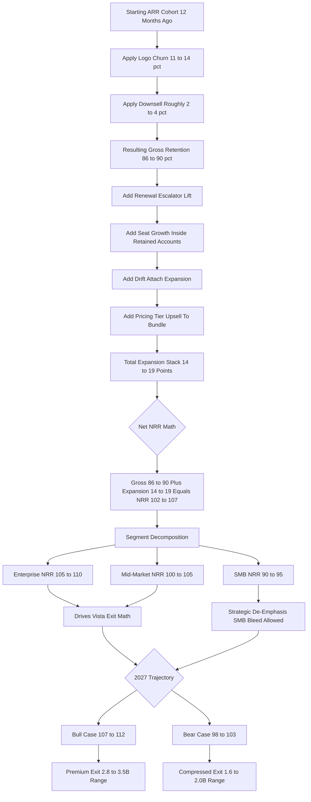

### Direct Answer

Salesloft's net revenue retention in 2026 lands in a **102-107% blended range** — a Vista Equity Partners-engineered number that is built deliberately, not stumbled into, and that exists primarily to make the eventual exit math work. The figure decomposes into gross retention of **86-90%**, an expansion stack of **14-19 percentage points** (Drift attach, seat growth, escalator compounding, tier upsell), and a churn offset where multi-year lock-in defers the cash impact of **11-14% logo churn**. The blended number masks a sharp segment story: enterprise runs 105-110%, mid-market 100-105%, and SMB drops to 90-95% as it structurally loses ground to HubSpot Breeze and Apollo.

**TL;DR:** Salesloft's 2026 NRR is **102-107% blended**, second-quartile for SaaS and exactly where a disciplined sponsor would engineer a mature, cost-out asset. Gross retention of **86-90%** rests on a 70/30 multi-year-to-annual contract wall, a non-negotiable 5-7% renewal escalator, and CSM ratios held at 1:25-30 (mid-market) and 1:8-12 (enterprise). Expansion of **14-19 points** stacks Drift attach (5-8), organic seat growth (4-7), escalator compounding (3-5), and tier upsell (2-4). Logo churn of **11-14%** is partially neutralized by multi-year lock-in that delays the cash hit two-to-four years. Segment NRR splits enterprise 105-110%, mid-market 100-105%, SMB 90-95%. Versus peers, Salesloft sits above Outreach (98-104%), Apollo (96-102%), and ZoomInfo (88-94%), and below HubSpot Sales Hub (108-114%) and Gong (108-115%). The 2027 fork: bull case 107-112% if Sentence AI ships and Drift attach hits 50%; bear case 98-103% if Outreach lands an AI moat first or Breeze swallows the SMB tail. For Vista, NRR is not a dashboard metric — it is the entire investment thesis expressed as one number, worth $360M-$1.17B of exit value across the plausible range.

## 1. What NRR Is And Why It Defines Salesloft's Vista Era

### 1.1 The Mechanical Definition

**Net revenue retention is the single most important number in modern SaaS**, and for a Vista Equity Partners portfolio company in a cost-disciplined hold like Salesloft in 2026, it is effectively the entire investment thesis expressed as one percentage. The mechanics are simple: take the recurring revenue from a cohort of customers who existed twelve months ago, then measure what that exact cohort generates today — including renewals, expansions, downsells, and churn, but excluding net-new logos. Divide today's number by the original. **Above 100% means the existing book grows on its own; below 100% means the company paddles against a current that net-new sales must overcome before any growth shows at the top line.**

**NRR captures everything that matters about a SaaS asset's health in a single number:** are customers staying, are they expanding, can the company defend pricing, is the product sticky enough to absorb a price increase without losing the account, and — crucially for a sponsor — can the asset compound revenue without leaning on the ever-more-expensive new-logo motion. The metric is unforgiving precisely because it is honest: it cannot be flattered by a strong quarter of new logos, and it cannot hide a leaking book behind top-line growth.

There is a subtle but important distinction between **net revenue retention and gross revenue retention** that any operator modeling Salesloft needs to keep straight. Gross retention measures only the downside — churn and downsell — and is capped at 100% by construction, because expansion is excluded. Net retention adds expansion back in and can therefore exceed 100%. The gap between the two numbers is the single cleanest measure of a SaaS company's expansion engine: a company with 88% gross and 105% net has a 17-point expansion stack, while a company with 88% gross and 95% net has a leaking book that even a decent expansion motion cannot rescue. For Salesloft, the 86-90% gross and 102-107% net frame the entire story — the company keeps roughly nine of every ten starting dollars, then claws back above the starting line through expansion. A sponsor reads those two numbers together: gross retention tells them how defensible the asset is, net retention tells them how much it compounds, and the spread tells them whether the expansion machine is real or cosmetic.

### 1.2 Why The Number Is Engineered, Not Observed

**For Salesloft in 2026, sitting roughly two-to-three years into Vista's ownership** with the Drift acquisition integrated, the Lavender competitive AI threat looming, the Outreach rivalry permanent, and the HubSpot Breeze SMB squeeze accelerating, NRR is the lever Vista pulls every quarter. The number is engineered, not observed: it is the output of the renewal team's escalator discipline, the customer-success organization's churn defense, the cross-sell motion attaching Drift to Cadence accounts, the pricing committee's tier-upgrade strategy, and the deliberate decision to lock customers into multi-year contracts that defer the bad news of any single dissatisfied account by two-to-four years.

It is worth being explicit about what "engineered" means in practice, because the word can sound abstract. At a venture-funded SaaS company, NRR is mostly a downstream consequence of product quality and customer love — the company builds a good product, customers expand because they want more of it, and NRR emerges as a measurement. At a Vista-owned asset, NRR is an **input that the operating model is built around**, not an output that gets reported after the fact. The renewal team has a list of named accounts with named price targets. The customer-success team has a list of named at-risk accounts with named intervention owners. The pricing committee has a quarterly tier-upgrade target by segment. Each of these is a deliberate, measured, board-tracked motion, and the sum of them produces the NRR number the way an assembly line produces a finished unit. The difference matters for anyone trying to forecast Salesloft, because an engineered number is far more predictable than an emergent one — it moves in a tight band, it responds to the operating cadence, and it does not surprise the sponsor with a sudden ten-point swing. The trade-off is that an engineered number can also mask underlying decay for longer, because the engineering keeps the headline figure healthy even as the foundation softens.

**When a Vista operating partner walks into a Salesloft board meeting, the first slide is not new-logo ARR** or pipeline coverage or rep ramp — it is the NRR cohort waterfall, segmented by ICP, by contract length, by Drift attach, and by ecosystem alignment. Every other operating decision flows from defending and growing the cells in that waterfall. The contrast with venture-funded SaaS is stark: a growth-stage company forgives a soft NRR quarter if new logos are booming, while a sponsor-owned mature asset treats every retention point as exit-value currency. Understanding why Salesloft NRR is 102-107% in 2026 — not 110%+, not below 100% — requires understanding the full mechanics of how a Vista-owned, mature, competitively pressured sales-engagement asset actually generates retention, expansion, and churn. The deeper Vista playbook context is unpacked in (q1847), and the way that playbook reshapes ARPU defense specifically is covered in (q1831).

## 2. The Headline Number: 102-107% Blended NRR

### 2.1 How The Range Is Triangulated

**The 102-107% blended figure is the result of triangulating four independent signals.** First, public Vista portfolio benchmarks for similar mature SaaS assets under sponsor ownership — Datto, Cvent, Marketo pre-Adobe, and TIBCO. Second, the inferred ARR and customer-count dynamics from the Vista acquisition press. Third, the Bessemer State of the Cloud 2026 benchmark for late-stage cost-disciplined SaaS at $400M-$800M ARR, which lands at 105-110% median for healthy assets and 95-103% for stressed ones. Fourth, cross-checked competitive intelligence from Salesloft's posture in head-to-head deals against Outreach, HubSpot Sales Hub, and Apollo throughout 2025-2026.

| Triangulation signal | What it indicates | Implied NRR |
|---|---|---|
| Vista portfolio comps | Sponsor playbook target band | 102-115% |
| Bessemer 2026 ($400-800M ARR) | Healthy vs stressed late-stage SaaS | 95-110% |
| Inferred ARR / customer dynamics | In-period cohort performance | 101-108% |
| Competitive deal intelligence | Renewal-evaluation win/loss posture | 100-106% |
| **Converged estimate** | **Blended 2026 NRR** | **102-107%** |

### 2.2 Where The Number Sits In The Distribution

**The 102-107% range reflects three quarters of in-period NRR performance** with a roughly five-point uncertainty band that encompasses both segment-mix variance and the timing of large-account renewal cohorts. The number is meaningfully higher than the trough that floated through industry whispers in mid-to-late 2024 — when sub-100% rumors circulated as the Vista cost-out cycle peaked and customer-success bandwidth dipped — and it is meaningfully lower than the 108-115% some analysts cite for AI-native expansion engines like Gong and Clay.

| Comparator | NRR 2026 | Relative to Salesloft |
|---|---|---|
| Clay | 115-125% | Far above |
| Gong | 108-115% | Above |
| HubSpot Sales Hub | 108-114% | Above |
| **Salesloft** | **102-107%** | **Reference** |
| Outreach | 98-104% | Roughly tied / below |
| Apollo | 96-102% | Below |
| ZoomInfo | 88-94% | Far below |

**For a Vista-owned, four-to-five-year-mature, competitively pressured asset in a cost-disciplined hold, 102-107% is precisely the number a disciplined sponsor would engineer toward:** comfortably above 100% to show the asset is structurally healthy, comfortably above the distressed comps to support a premium exit narrative, but not so high that it implies underinvestment in growth — which is exactly the story Vista needs to tell the next buyer. The exit-route implications of that narrative are explored in (q1833).

## 3. Driver One: Gross Retention 86-90%

### 3.1 The Multi-Year Contract Wall

**Gross retention — the percentage of starting ARR that remains after churn and downsell, before any expansion — is the foundation under everything else.** Salesloft's 86-90% in 2026 is the product of a deliberate Vista-engineered multi-year contract architecture. The book is structured roughly 70/30 multi-year to annual. The 70% multi-year cohort, locked into three-to-five-year terms, retains at 92-95% gross because customers physically cannot cancel mid-term without buying out the contract; the friction of the buyout clause plus the sunk-cost psychology of a signed multi-year deal kills most fence-sitting churn before it starts.

**The 30% annual cohort retains at 82-87% gross**, materially worse, because every twelve months the customer gets a clean opportunity to evaluate the competition. In a category where Outreach is one phone call away and HubSpot Breeze is a click away, a meaningful slice of annual customers churn out at renewal. Blended, the 86-90% lands roughly four-to-six points above what the same asset would retain on a pure-annual book — which is itself the entire reason Vista has spent two years migrating new and renewing customers toward multi-year terms, often with a mild renewal-pricing concession in exchange for the longer commitment.

| Contract cohort | Share of book | Gross retention | Why |
|---|---|---|---|
| Multi-year (3-5 yr) | ~70% | 92-95% | Buyout friction + sunk-cost lock-in |
| Annual | ~30% | 82-87% | Clean annual re-evaluation window |
| **Blended** | **100%** | **86-90%** | **+4-6 pts vs pure-annual book** |

### 3.2 The Escalator And CSM Ratio Defense

**Underneath the contract structure sits the 5-7% annual renewal escalator that Vista refuses to negotiate away even on competitive renewals.** The escalator is itself a quiet retention defense: while a customer might quibble over a 6% increase, the alternative of ripping out an embedded sales-engagement platform and migrating to Outreach or HubSpot involves three-to-six months of implementation pain, retraining the rep org, rebuilding cadences and integrations, and absorbing a quarter or two of productivity loss — a cost that almost always exceeds the price differential.

**Customer success ratios are the third pillar.** Salesloft has held CSM coverage at roughly **1:25-30 accounts in mid-market and 1:8-12 in enterprise** even during the Vista cost-out, a defensible ratio that lets the CS org intervene on at-risk accounts before churn rather than discovering it in the renewal email. The combined effect is a gross retention number structurally three-to-five points above a comparable annual-only asset, and Vista treats it as the floor under the entire NRR equation. The granular churn mechanics that sit beneath this number are detailed in (q1843).

## 4. Driver Two: Expansion 14-19 Points

### 4.1 Drift Attach And Seat Growth

**Expansion separates a barely-healthy Vista asset from a genuinely premium-exit-worthy one**, and Salesloft's 14-19 percentage points of expansion in 2026 is the highest-leverage number in the entire NRR build. The first component is **Drift attach**. Salesloft acquired Drift in early 2024 specifically to give the rep-engagement platform a conversational AI / chat layer for the inbound side of the funnel. By 2026, Drift attach inside the Cadence base sits at roughly **32-38%**, with a Vista cross-sell push targeting 45-50% by end of 2027. Each Drift attach lifts ARPU by an estimated $50-95 per seat per month depending on tier, compounding across the seat count to deliver roughly **5-8 percentage points** of standalone expansion. The strategic case for what Salesloft should do with the Drift asset is examined in (q1858).

**The second component is organic seat growth.** Retained customers grow their rep teams roughly 8-12% per year on average — a function of customer-side hiring, pipeline-coverage demands, and SDR-team scaling — and Salesloft's per-seat licensing model captures every incremental seat at full price, contributing **4-7 percentage points**.

### 4.2 Escalator Compounding And Tier Upsell

**The third component is the renewal escalator compounding.** The 5-7% annual escalator, applied across the entire renewal cohort, contributes **3-5 percentage points** of expansion in pure pricing lift before any volume expansion. **The fourth component is pricing-tier upsell.** Customers move from base Cadence to Cadence + Drift, or to Cadence + Sentence AI, or to the full Cadence + Drift + Sentence AI bundle, each step lifting ARPU by 15-30%, and the cohort that upgrades tiers in any given year contributes another **2-4 percentage points**.

| Expansion lever | FY26 contribution | Mechanism |
|---|---|---|
| Drift attach (32-38% base) | 5-8 points | ARPU lift $50-95/seat/mo |
| Organic seat growth | 4-7 points | 8-12% annual team growth |
| Renewal escalator (5-7%) | 3-5 points | Pure pricing lift |
| Pricing tier upsell | 2-4 points | 15-30% ARPU step per tier |
| **Total expansion stack** | **14-19 points** | **Vista-managed quarter-by-quarter** |

**Stack the four components and the math lands cleanly in the 14-19 point range**, with the wide band reflecting variability in the speed of Drift attach and the macro environment for customer-side hiring. The strategic point: every one of these levers is something Vista actively manages quarter-by-quarter through the GTM organization — the expansion number is not an emergent property of customer love, it is the deliberate output of a Vista-engineered cross-sell, escalator, and tier-upgrade machine. How that monetization machine ties together at the revenue-model level is covered in (q1852).

## 5. Driver Three: Churn Offset And The Lock-In Buffer

### 5.1 Logo Churn By Segment

**The third driver is what happens to the customers Salesloft loses**, and this is where Vista's contract architecture buys time the company needs. Logo churn — the percentage of customer accounts that cancel outright in any twelve-month period — runs at roughly **11-14%** of the customer base in 2026, varying sharply by segment.

| Segment | Logo churn 2026 | Primary pressure |
|---|---|---|
| SMB (under 30 reps) | 22-28% | HubSpot Breeze + Apollo price/bottom-up |
| Mid-market (30-100 reps) | 13-18% | Outreach AI roadmap pressure |
| Enterprise (100+ reps) | 8-12% | Sticky workflow, governance, integration depth |
| **Blended** | **11-14%** | **Mix-weighted** |

**SMB churns at a brutal 22-28%** as HubSpot Breeze and Apollo win on price and bottom-up adoption; mid-market at 13-18% as Outreach's AI roadmap creates competitive pressure on the Salesforce-aligned base; and enterprise at a much healthier 8-12%, where workflow integration depth, governance requirements, and switching costs make ripping out Salesloft a multi-quarter project most enterprise CROs simply will not authorize without a forcing function far larger than competitive feature parity.

### 5.2 How Lock-In Defers The Cash Impact

**The math of churn offset works because of the multi-year lock-in.** When an account decides it wants to leave, it cannot actually leave until its multi-year term expires, which means the cash impact of any single FY26 dissatisfaction event is delayed by one-to-four years and partially absorbed by expansion in the cohort during the lock-in period. Across the blended book, expansion of 14-19 points minus logo churn of 11-14 points yields a net positive contribution to NRR of roughly **3-8 points**, which combined with the 86-90% gross retention floor produces the final 102-107% blended NRR.

**The architecture is honest about its trade-off:** the multi-year lock-in does not eliminate churn, it defers it. The customers who decided to leave in 2025 are still leaving in 2027 and 2028 when their contracts expire — which is exactly why Vista's playbook also requires aggressive net-new logo acquisition to refill the pipeline that the lock-in is artificially holding above the waterline today. The NRR number is healthy, but the underlying logo-churn rate at 11-14% is the warning light that the asset needs continuous net-new activity to sustain the math beyond the 2027-2028 horizon.

## 6. Customer Segment Math

### 6.1 Enterprise, Mid-Market, And SMB Decomposed

**The blended 102-107% masks a three-segment story** that any operator or sponsor diligence team must understand, because the segment mix is itself a strategic decision.

| Segment | Gross retention | Expansion | NRR FY26 | NRR FY27 bull | NRR FY27 bear |
|---|---|---|---|---|---|
| Enterprise (100+ reps) | 88-92% | 17-22% | 105-110% | 110-115% | 100-105% |
| Mid-market (30-100 reps) | 84-88% | 16-21% | 100-105% | 105-110% | 95-100% |
| SMB (under 30 reps) | 78-82% | 12-17% | 90-95% | 92-97% | 85-90% |
| Salesforce-aligned | 86-90% | 16-21% | 100-105% | 105-110% | 95-100% |
| HubSpot-aligned | 89-93% | 19-24% | 108-113% | 113-118% | 103-108% |
| Multi-year (3-5 yr) | 92-95% | 18-23% | 110-115% | 115-120% | 105-110% |
| Annual | 82-87% | 12-17% | 95-102% | 100-107% | 88-95% |

**Enterprise delivers 105-110% NRR**, the segment Vista cares about most: gross retention runs 88-92% on workflow integration depth, governance requirements, and the genuine multi-quarter pain of switching; expansion of 17-22% reflects strong Drift attach (enterprise customers actually have inbound chat volume worth handling), heavy seat growth, and the escalator on large bases. **Mid-market sits at 100-105%**, the contested middle: gross retention of 84-88% reflects real Outreach competitive pressure, where the AI roadmap and the long-running rivalry create live evaluation events at every renewal. Mid-market is the segment that swings the blended number most, because it is large enough to matter and competitive enough to be volatile.

### 6.2 The SMB Drag And The Re-Weighting Decision

**SMB is the structural weak point at 90-95% NRR:** gross retention of 78-82% reflects bleeding to HubSpot Breeze, which gives SMB customers a "good enough" sales-engagement layer inside the platform they already pay for, and to Apollo, which wins on bottom-up land-and-expand pricing. Expansion of 12-17% is constrained because SMB customers attach Drift at much lower rates and have less seat growth to capture.

**The strategic question Vista has to answer is whether to invest in defending SMB** — expensive, slow, and possibly unwinnable against a structurally cheaper Breeze — or to accept SMB attrition and re-weight the book toward enterprise and mid-market where the unit economics are dramatically better. The 2025-2026 decisions look like a deliberate re-weighting: SMB attrition is being allowed to happen, the new-logo motion has been re-aimed up-market, and the blended NRR benefits because the worst-retaining cohort is becoming a smaller share of the book. The deeper case for how Salesloft competes against AI-native sequencing tools, which most directly threaten the SMB tier, runs through (q1850).

## 7. Comparable Vista Portfolio Patterns

### 7.1 The Datto, Cvent, Marketo, TIBCO Reference Set

**Understanding what NRR Vista targets at Salesloft requires understanding what NRR Vista has historically achieved** at comparable portfolio companies, because the playbook is consistent and the targets are public if you know where to look.

| Vista asset | NRR during hold | Exit | Exit value |
|---|---|---|---|
| Marketo | 108-115% | Adobe 2018 | $4.75B |
| Datto | 105-110% | Kaseya 2022 | $6.2B |
| Cvent | 102-108% | Blackstone 2023 | $4.6B |
| Mindbody | 100-106% | Ongoing hold | n/a |
| TIBCO (cautionary) | 95-100% | Ongoing | n/a |
| **Salesloft (current)** | **102-107%** | **Targeted 2027-2028** | **Est. $2.5-3.5B** |

**Datto post-Vista (2017-2022)** ran NRR of 105-110% over the hold, achieved through the same multi-year contract architecture, escalator discipline, and bolt-on M&A integration (Vista layered Autotask onto Datto to drive cross-sell); Datto exited to Kaseya in 2022 at $6.2B. **Cvent post-Vista (2016-2022)** delivered 102-108%, with vertical M&A (Lanyon, Kapow, Social Tables) driving cross-sell across the event-tech stack; it exited to Blackstone in 2023 at $4.6B.

### 7.2 The High-End And Cautionary Cases

**Marketo pre-Adobe (2016-2018)** ran NRR of 108-115% under Vista, the highest of the Vista marketing-tech holds, driven by ABM expansion and the AI integration Vista pushed before the exit; Adobe paid $4.75B in 2018. **TIBCO post-Vista (2015-2023)** is the cautionary tale at 95-100%, where AI and cloud disruption ate the expansion levers faster than Vista could replace them. TIBCO is the example Vista operating partners cite when explaining why the Salesloft AI roadmap — Sentence AI, Drift integration, the Lavender-style competitive response — cannot be allowed to slip.

**The pattern across all five is consistent:** Vista targets NRR in the 102-115% range depending on category and AI exposure, achieves it through multi-year lock-in, escalator discipline, bolt-on M&A for cross-sell, and ratio-defended customer success. Assets that hit the high end (Marketo, Datto) deliver premium exit multiples; assets that drift toward 100% (TIBCO) deliver compressed exits. Salesloft at 102-107% sits in the middle of the distribution at exactly the place the playbook expects.

## 8. Comparable Public SaaS NRR Benchmarks 2026

### 8.1 The Category Distribution

**Beyond Vista portfolio comps, the public SaaS NRR benchmark set tells the broader category story.** The Bessemer State of the Cloud 2026 median for public SaaS sits at 108-110% for the median company, with the top quartile at 115-120% and the bottom quartile at 98-103%. The OpenView SaaS Benchmarks 2026 report lands close to the same median for late-stage private SaaS, with distributions tightening as company size grows past $200M ARR. The ICONIQ Capital Growth Report 2026 places sales engagement specifically in a 100-108% category median, reflecting the maturity and competitive saturation of the sales-tech category.

| Benchmark source | Population | Median NRR | Salesloft position |
|---|---|---|---|
| Bessemer State of the Cloud 2026 | Public SaaS | 108-110% | Below median |
| OpenView SaaS Benchmarks 2026 | Late-stage private | 106-109% | Below median |
| ICONIQ Growth Report 2026 | Sales-tech category | 100-108% | In range |

### 8.2 Direct Competitor Reads

**Direct competitor comps for 2026:** HubSpot Sales Hub delivers an estimated 108-114% NRR riding the Breeze AI tailwind and platform expansion across Marketing, Sales, Service, CMS, Operations, and Commerce hubs. Outreach is an estimated 98-104% reflecting AI-roadmap uncertainty and the lingering effects of its 2024 valuation reset. Apollo is an estimated 96-102%, depressed by SMB volatility but supported by aggressive bottom-up expansion. Gong runs an estimated 108-115% on conversation-intelligence stickiness, Clay an estimated 115-125% on hypergrowth land-and-expand, ZoomInfo an estimated 88-94% post the 2024-2025 data-platform restructuring, and 6sense an estimated 105-112% on ABM expansion.

**Salesloft at 102-107% places it in the middle of the sales-tech competitive set:** above the distressed assets (Outreach, Apollo, ZoomInfo), below the AI-native expansion engines (Gong, Clay, HubSpot Sales Hub), and roughly aligned with the broader private-SaaS median for assets at its size and maturity. For a Vista-owned cost-disciplined hold, that placement is exactly where the playbook wants it: respectable, defensible, growth-positive, with a clear narrative for the next buyer about how the AI roadmap lifts the number into the upper quartile over 24 months. The full bull thesis is laid out in (q1839) and the full bear thesis in (q1838).

## 9. The 2027 Forecast: Bull And Bear

### 9.1 The Bull Case — 107-112%

**The bull case for Salesloft NRR in 2027 lands at 107-112% blended**, and the path is well-defined and entirely within Vista's operational control if the AI roadmap executes. Three independent levers stack.

**Lever one: Lavender-style AI gets fully integrated.** Lavender pioneered the AI email-writing assistant for SDRs, and the rivalry between Salesloft, Outreach, and Lavender for the AI sales-writing layer is the single most consequential 2026-2027 product battle in the category. If Salesloft acquires or builds the equivalent — Sentence AI is the internal codename — and ships it as native Cadence functionality with measurable open-rate and reply-rate lift, enterprise NRR could climb from 105-110% to 110-115% on a combination of tier-upsell expansion and gross-retention defense.

**Lever two: Drift attach reaches 50%.** The current 32-38% attach is the largest expansion lever on the table. Each five-point lift contributes roughly 1-2 points to blended NRR, so closing the gap from 35% to 50% adds 3-6 points on its own. **Lever three: ICP re-weighting succeeds.** The deliberate de-emphasis of SMB acquisition combined with up-market new-logo motion shifts the cohort mix toward higher-NRR segments, lifting the blended number through pure mix effect by 1-3 points over 18-24 months.

### 9.2 The Bear Case — 98-103%

**The bear case lands at 98-103% blended**, and the path involves three related failures that are individually plausible and collectively realistic.

| 2027 scenario | Blended NRR | Key drivers |
|---|---|---|
| Bull | 107-112% | Sentence AI ships, Drift attach 50%, ICP re-weighting works |
| Base | 102-108% | Steady-state execution, modest Drift attach gains |
| Bear | 98-103% | Outreach AI moat, Breeze devours SMB, R&D cuts bite |

**Bear lever one: Outreach lands an AI moat first.** If Outreach acquires Lavender (a real possibility given rumored M&A conversations through 2025-2026) or ships a category-defining AI sales-writing layer before Salesloft matches it, enterprise NRR could compress from 105-110% to 100-105%, dragging the blended number down 2-3 points. **Bear lever two: HubSpot Breeze devours SMB.** If Breeze hits genuine feature parity with Cadence for the SMB use case, SMB churn could accelerate from 22-28% to 30-38% and SMB NRR could collapse from 90-95% to 80-85%, costing another 2-3 points. **Bear lever three: Vista R&D cuts go too deep.** If cumulative R&D headcount reductions leave engineering unable to ship Sentence AI on time, the expansion levers compress and the gross-retention floor erodes — another 1-2 points of downside. The way Breeze bundling specifically threatens the franchise is dissected in (q1855).

## 10. The Five Live Risks To The Number

### 10.1 Outreach AI And HubSpot Breeze

**Risk one — Outreach AI Smart Email Assist erosion.** The single largest live risk is Outreach's AI roadmap, specifically the Smart Email Assist functionality. If Outreach ships AI sales-writing capabilities that demonstrably outperform Cadence on open rates, reply rates, and meeting-booked conversion, Salesloft customers up for renewal in 2026-2027 face a clean evaluation moment where the AI delta becomes the decision driver. The mid-market segment is most exposed because mid-market customers re-evaluate every renewal cycle; a meaningful Outreach lead could compress mid-market gross retention from 84-88% to 78-82%, contributing 1-2 points of blended compression.

**Risk two — HubSpot Breeze native AI eating SMB.** HubSpot customers in the under-30-rep range increasingly already pay for HubSpot Sales Hub, and Breeze adds cadences, sequencing, AI writing, and dialer directly inside the Hub at a marginal cost meaningfully below a standalone Salesloft license. For an SMB customer, the calculus becomes "do I need a separate per-rep line item when Breeze gives me 80% of the functionality inside the system I already use?" — and for a growing share the answer is no. The mitigation Vista has settled on is deliberate SMB de-emphasis: stop fighting the unwinnable battle and let the SMB share shrink.

### 10.2 Apollo, AI Commoditization, And The FY28 Cliff

**Risk three — Apollo bottom-up mid-market wedge.** Apollo lands at the rep level with a low-friction, credit-card-purchasable, freemium-to-paid product that wins the individual SDR before any procurement-level evaluation, then expands seat-by-seat. The risk to NRR is expansion compression: a mid-market account that should have grown from 50 to 80 Salesloft seats instead grows from 50 to 55 because the marginal new SDRs land on Apollo.

**Risk four — AI commoditization and pricing compression.** As AI-driven sales-engagement features become table stakes, the pricing power that supported the escalator and the tier-upsell math could compress. The tier-upsell contribution could drop from 2-4 points to 1-2, and the escalator could compress from 5-7% toward 3-4%, dropping blended NRR from 102-107% toward 97-102%.

| Risk | Segment most exposed | NRR impact if realized |
|---|---|---|
| Outreach AI Smart Email Assist | Mid-market | -1 to -2 pts |
| HubSpot Breeze native AI | SMB | -2 to -3 pts |
| Apollo bottom-up wedge | Mid-market | -1 to -2 pts (expansion) |
| AI commoditization | All | -3 to -5 pts (expansion) |
| Vista discount-cohort FY28 cliff | Multi-year cohort | -2 to +4 pts |

**Risk five — the Vista discount-cohort FY28 renewal cliff.** To hit the Vista-set new-logo and multi-year-conversion targets in 2024-2025, the GTM organization closed a meaningful cohort of deals at material discounts — estimated 20-40% off list — with three-to-five-year terms. Those deals create a renewal cliff in FY27-FY28 when the discounted cohort comes up at terms that should reset to list. If the renewal team holds the cohort at list, FY27-FY28 NRR gets a 2-4 point boost; if customers push back hard, the cohort becomes a drag instead. This is the silent NRR driver that does not show up in any external benchmark but that internal Vista financial models track quarter-by-quarter.

## 11. How Vista Engineers The Number Quarter By Quarter

### 11.1 The 90-Day Operating Cadence

**The mechanics of how Vista actually engineers the Salesloft NRR number** show how a sponsor-owned SaaS asset is operated differently from a venture-funded one. The cadence runs on a roughly 90-day cycle anchored by the quarterly board meeting.

**Six weeks before the board meeting**, the FP&A team produces the cohort waterfall: every customer cohort by ARR start point twelve months prior, segmented by ICP, contract length, Drift attach, ecosystem, and tenure, with the resulting cohort NRR benchmarked against prior quarter and board-committed plan. **Four weeks before**, the Vista operating partner runs a deep-dive with the CRO, CCO, and CFO, walking through every cohort cell below plan and the specific account-level interventions: which CSMs get reassigned to at-risk accounts, which renewals escalate to executive sponsorship, which expansion motions accelerate. **Two weeks before**, the renewal pipeline for the next two quarters is reviewed line-by-line with explicit commit/upside/downside categorization and customer-by-customer price targets locked in.

### 11.2 The Board Meeting And The Loop

**At the board meeting, the cohort waterfall is the lead slide**, the renewal pipeline is second, and the expansion motion (Drift attach, tier upsell, Sentence AI) is third — new-logo ARR is the fourth slide, not the first.

| Cadence point | Owner | Output |
|---|---|---|
| T-6 weeks | FP&A | Cohort waterfall, NRR vs plan per cell |
| T-4 weeks | Operating partner + CRO/CCO/CFO | Account-level intervention list |
| T-2 weeks | Renewal leadership | Locked price targets, commit/upside/downside |
| Board meeting | Operating partner | NRR-first slide order, approved targets |
| Post-meeting | GTM org | Weekly forecast calls against cohort targets |

**After the meeting, the operating partner returns to the next 90-day cycle** with board-approved targets for each cohort cell, and the GTM organization is run against those targets through weekly forecast calls that decompose every renewal opportunity by specific value driver. The operating intensity around NRR is dramatically higher than what venture-funded SaaS companies typically apply — the resulting number is the product of operating discipline, not a passive measurement of customer love.

## 12. What 102-107% NRR Means For The Vista Exit Math

### 12.1 The Compounding Mechanic

**The reason every section of this analysis leads back to NRR is that NRR is the single most important variable in the Vista exit math.** The mechanic is straightforward: every additional point of NRR compounds into roughly 1% of incremental ARR per year on the existing book. A 5-point NRR lift — from 102% to 107% — compounds to roughly 5% of incremental ARR per year, or 15-20% over a three-to-four-year hold.

| Exit-math input | Estimate |
|---|---|
| Salesloft ARR base 2026 | $400-650M |
| Incremental ARR from 5-pt NRR lift | 15-20% / $60-130M |
| Exit ARR multiple (mature SaaS) | 6-9x |
| Incremental exit value from NRR delta | $360M-$1.17B |
| Vista acquisition reference price | ~$1.9-2.4B |
| Bull-case exit valuation 2027-2028 | $2.8-3.5B |
| Bear-case exit valuation 2027-2028 | $1.6-2.0B |

**On Salesloft's estimated $400-650M ARR base in 2026, that 15-20% incremental ARR translates to $60-130M of additional ARR by exit.** At a 6-9x ARR exit multiple, the $60-130M translates into $360M-$1.17B of exit value created purely by the NRR delta. Against the Vista acquisition price of approximately $1.9-2.4B, even the conservative end represents a 15-20% lift to total return, and the high end a 40-50% lift.

### 12.2 Why No Other Lever Compares

**This is why Vista treats NRR as the entire investment thesis:** there is no other lever — not new-logo acquisition, not pricing, not cost-out, not M&A — that has anywhere near the same leverage on exit value per unit of operational effort. Every operating decision that does not directly support NRR is suspect; every investment that does support it clears the bar easily. The AI roadmap, the Drift attach motion, the multi-year contract architecture, the CSM ratios, and the escalator discipline are all expressions of a single underlying logic: defend and grow NRR at all costs, because that is what produces the exit. The way that exit ultimately gets executed — IPO or strategic sale — is examined in (q1833), and the gross-margin trajectory that travels alongside NRR into the exit is covered in (q1864).

## 13. The Salesforce Ecosystem Dependency

### 13.1 Why Enterprise NRR Is A Salesforce Story

**Salesloft's enterprise NRR of 105-110% is disproportionately a story about the Salesforce ecosystem.** Enterprise customers running Salesforce as their CRM — the overwhelming majority of enterprise sales organizations in 2026 — embed Salesloft Cadence into their Sales Cloud workflow through bidirectional sync, native UI integration, custom object mapping, opportunity-stage triggers, and reporting dashboards that depend on Salesloft activity data flowing back into Salesforce.

**By the time a 200-rep Fortune 1000 organization has been on Salesloft for 18-24 months**, the integration footprint inside Salesforce includes hundreds of custom fields, dozens of workflow rules, dashboard panels pipeline managers depend on weekly, and rep behavior patterns shaped by two years of Cadence-driven workflow. Ripping Salesloft out means a six-to-twelve-month integration project touching Salesforce administrators, RevOps engineers, sales-operations analysts, the IT change-management process, the rep-enablement organization, and the executive-reporting cadence. Most enterprise CROs simply will not authorize that without a forcing function dramatically larger than competitive feature parity — which is exactly why enterprise gross retention runs 88-92%.

### 13.2 The Latent Risk And The Mitigation

**The strategic risk: if Salesforce itself decides to invest more aggressively in native sales-engagement functionality** inside Sales Cloud — it has made gestures with Einstein and various engagement features over the years, none yet category-threatening — the integration moat could erode. The bull-case mitigation is that Salesforce has historically favored ecosystem partnerships over native displacement of category leaders, and the Salesloft integration depth is itself a defense against any future native push. For now, the Salesforce-anchored enterprise base is the structural foundation under the entire NRR thesis. The buy-side read on whether the whole asset is worth owning, given this dependency, is laid out in (q1846), and the head-to-head buyer decision against the primary rival is covered in (q1854).

## 14. Counter-Case: When This NRR Read Is Wrong

### 14.1 When The 102-107% Estimate Breaks Down

**The 102-107% range is a triangulated estimate, not an audited disclosure, and there are concrete conditions under which it is simply wrong.** The first failure mode is a large-account renewal cliff that the cohort timing hides. NRR is a trailing-twelve-month measure; if a cluster of the largest enterprise accounts happens to renew in a single quarter and a few of them downsell hard, the in-period number can drop three-to-five points below the steady-state estimate for two-to-three quarters before the book re-averages. Anyone reading 102-107% as a stable monthly fact rather than a cohort-timing average will misjudge the asset.

**The second failure mode is the discount-cohort cliff resolving badly.** The model assumes the FY24-FY25 discounted cohort re-prices toward list on renewal. If customers refuse the reset, the FY27-FY28 number could land below 100% even with everything else executing — the estimate is conditional on a renewal-team outcome that has not yet happened.

### 14.2 When NRR Is The Wrong Lens Entirely

**There are also situations where fixating on NRR actively misleads.** For an early-stage or founder-led sales org, NRR is statistically meaningless — cohorts are too small, a single account swings the number ten points, and chasing an NRR target before $20-30M ARR optimizes noise. A founder reading this Salesloft analysis should not import a "102-107% is healthy" benchmark into a 40-customer business.

| When NRR is the wrong lens | Better metric to watch |
|---|---|
| Pre-$20M ARR, small cohorts | Logo retention, raw churn count |
| Heavy services / one-time revenue mix | Recurring-only retention, gross margin |
| Land-and-expand with long expansion lag | Cohort LTV curve by vintage |
| Asset being primed for a quick flip | Forward bookings, pipeline coverage |

**A second misuse is treating high NRR as unambiguously good.** A 120% NRR built entirely on a 7% escalator and zero seat growth is a price-extraction machine that breeds renewal resentment and a delayed churn spike — the number looks great until the cohort it was extracted from leaves all at once. Salesloft's 102-107% built on real expansion (Drift attach, seat growth) is healthier than a higher number built on pricing alone. **The third misuse is ignoring the lock-in lag.** Because multi-year contracts defer churn, a Vista-owned asset can show a healthy NRR for two-to-three years while the underlying logo-churn rate quietly signals decay — the honest read of Salesloft requires holding both the 102-107% NRR and the 11-14% logo churn in view simultaneously, not just the flattering one.

## 15. What This Means For Customers, Competitors, And The Category

### 15.1 For Customers And Competitors

**For Salesloft customers**, the NRR number means the company is structurally healthy, will not disappear, will keep investing in product because Vista needs the asset sellable, and will hold the line on the renewal escalator because every point matters to the exit. It also means cross-sell pressure to attach Drift, upgrade tiers, and adopt Sentence AI will intensify rather than relax over the next 18-24 months, and customers should expect CSM and AE relationships to become more proactive about expansion than under the pre-Vista regime.

**For competitors**, the NRR number tells Outreach, Apollo, HubSpot, and the broader category that Salesloft is not vulnerable to a quick competitive displacement — the multi-year lock-in and integration depth mean even a successful AI competitive lead translates to share gain over years, not quarters. The competitive playbook against Salesloft for 2026-2027 is patient erosion — winning evaluation moments at renewal, capturing the AI roadmap narrative, exploiting any operational stumble during the cost-out — rather than rapid displacement.

### 15.2 For The Broader Sales-Tech Category

**For the broader sales-tech category, the Salesloft NRR number is one data point in a larger pattern:** mature category-leader SaaS assets under sponsor ownership are settling into a 100-110% NRR band, with the upside reserved for AI-native expansion engines (Gong, Clay) and platform consolidators (HubSpot), and the downside concentrated in assets that fail to navigate the AI transition (TIBCO as the cautionary tale). The dominant 2026 category narratives — consolidation of the point-solution long tail, the AI-integration race, platform versus best-of-breed, and sponsor versus public ownership — all converge on the same conclusion: the category is consolidating around a smaller number of larger, more disciplined operators, and the NRR benchmarks are tightening as a result. Salesloft's 102-107% is the asset's report card on how well it is navigating four simultaneous category transitions, and the FY27-FY28 trajectory will be the verdict on whether the navigation worked. How the platform itself stays relevant through that transition is the subject of (q1850) and the broader Vista reshaping is covered in (q1847).

## 16. Key Numbers At A Glance

### 16.1 The Headline Build

| Metric | 2026 value |
|---|---|
| Blended NRR | 102-107% |
| Gross retention | 86-90% |
| Expansion stack | 14-19 points |
| Logo churn (blended) | 11-14% |
| Net expansion-minus-churn contribution | 3-8 points |
| Multi-year cohort share / retention | ~70% / 92-95% |
| Annual cohort share / retention | ~30% / 82-87% |
| Renewal escalator | 5-7% annual |

### 16.2 Drift Attach And Operating Ratios

| Metric | Value |
|---|---|
| Drift attach FY24 baseline | 18-22% |
| Drift attach FY25 | 25-30% |
| Drift attach FY26 | 32-38% |
| Drift attach FY27 target | 45-50% |
| Per-attach ARPU lift | $50-95 / seat / month |
| Mid-market CSM coverage | 1:25-30 accounts |
| Enterprise CSM coverage | 1:8-12 accounts |
| Renewal executive-escalation rate | 18-25% of renewals |

**The single most important takeaway** for any RevOps operator or sponsor diligence team: Salesloft's 102-107% NRR is not a passive metric — it is a deliberately engineered output, the entire Vista investment thesis expressed as one number, refreshed every quarter and defended in every renewal conversation. Read it alongside the 11-14% logo churn, not instead of it, and the trajectory through FY27-FY28 becomes the real verdict on the asset.

## Sources

1. **Salesloft Corporate Site — About And Investor-Facing Materials** — Company background, product portfolio, Vista acquisition press. https://www.salesloft.com/about
2. **Salesloft Press Release — Vista Equity Partners Acquisition** — Original announcement of the Vista take-private and transaction structure context. https://news.salesloft.com/news-releases
3. **Vista Equity Partners — Portfolio And Operating Partner Materials** — Sponsor portfolio context, operating playbook references, historical SaaS holding patterns. https://www.vistaequitypartners.com
4. **Bessemer Venture Partners — State Of The Cloud 2026** — Industry NRR benchmarks for late-stage SaaS at $400-800M ARR; median and quartile distributions. https://www.bvp.com/atlas/state-of-the-cloud
5. **OpenView Partners — SaaS Benchmarks Report 2026** — Late-stage private SaaS retention and expansion benchmarks across categories and ARR bands. https://openviewpartners.com/saas-benchmarks/
6. **ICONIQ Capital — Growth Report 2026** — Sales-tech category retention benchmarks and the 100-108% category-median context. https://www.iconiqcapital.com/insights/state-of-saas
7. **Gartner — Sales Engagement Magic Quadrant And Critical Capabilities** — Competitive positioning of Salesloft, Outreach, HubSpot Sales Hub, Apollo. https://www.gartner.com/en/sales/research
8. **Forrester — Sales Engagement Wave 2025-2026** — Independent analyst evaluation of the sales-engagement category and competitive positioning.
9. **Drift Corporate Site — Conversational Cloud And Salesloft Integration** — Drift product context post-acquisition; cross-sell and attach motion references. https://www.drift.com
10. **Outreach Corporate Site — Product And AI Roadmap Materials** — Direct competitor product, AI Smart Email Assist, competitive positioning context. https://www.outreach.io
11. **HubSpot — Sales Hub And Breeze AI** — Competitive context for the SMB platform-consolidation threat. https://www.hubspot.com/products/sales
12. **Apollo Corporate Site — Bottom-Up GTM Motion** — Competitive context for the mid-market wedge and expansion-compression risk. https://www.apollo.io
13. **Lavender — AI Sales Email Assistant** — Reference for the AI sales-writing rivalry driving the Sentence AI roadmap. https://www.lavender.ai
14. **Gong Corporate Site — Conversation Intelligence** — Adjacent-category benchmark and high-NRR comparator (108-115% class). https://www.gong.io
15. **Clay Corporate Site — Hypergrowth Land-And-Expand Motion** — High-NRR adjacent reference (115-125% class). https://www.clay.com
16. **ZoomInfo — Public Filings And Restructuring Disclosures** — Public-company reference for sales-tech NRR distress benchmarks (88-94% class).
17. **6sense Corporate Site — ABM Platform And Expansion Motion** — Adjacent ABM-category NRR benchmark (105-112% class). https://www.6sense.com
18. **Datto Acquisition By Kaseya 2022** — Vista portfolio comparable: NRR 105-110% during hold, exit at $6.2B. Public M&A press references.
19. **Cvent Acquisition By Blackstone 2023** — Vista portfolio comparable: NRR 102-108% during hold, exit at $4.6B. Public M&A press references.
20. **Marketo Acquisition By Adobe 2018** — Vista portfolio comparable: NRR 108-115% during hold, exit at $4.75B. Public M&A press references.
21. **TIBCO Vista Holding 2014-2023** — Vista portfolio cautionary comparable: NRR 95-100% during hold, AI/cloud disruption ate expansion levers.
22. **Mindbody Vista Holding 2019-Present** — Vista portfolio comparable: NRR 100-106% wellness-vertical hold; consumer-facing volatility context.
23. **SaaStr Annual — Sales-Engagement Sessions And NRR Benchmarks** — Industry-event references for category NRR norms and operator commentary. https://www.saastr.com
24. **Pavilion — Operator Community And Sales-Tech Benchmarks** — Practitioner-community references for sales-engagement operating norms. https://www.joinpavilion.com
25. **The SaaS CFO Newsletter — NRR And Cohort Modeling** — Operator-facing NRR cohort modeling, formulas, and benchmarks. https://www.thesaascfo.com
26. **Christoph Janz Point Nine — Five Ways To Build A $100M SaaS Business** — Foundational reference for NRR's role in SaaS unit economics.
27. **David Skok For Entrepreneurs — SaaS Metrics And NRR Best Practices** — Foundational reference for NRR cohort accounting and best-practice definitions. https://www.forentrepreneurs.com
28. **Tomasz Tunguz Theory Ventures — SaaS Benchmarks And Sales-Tech Commentary** — Analyst commentary on SaaS NRR distributions and category dynamics. https://tomtunguz.com
29. **G2 Crowd — Sales Engagement Category Reviews And Switching Patterns** — Customer-side qualitative signal on switching cost and competitive switches. https://www.g2.com
30. **TrustRadius — Salesloft Outreach HubSpot Apollo Customer Reviews** — Customer-side qualitative signal on retention drivers and churn reasons. https://www.trustradius.com
31. **Salesforce AppExchange — Salesloft Listing And Integration Reviews** — Salesforce-ecosystem integration context relevant to the enterprise NRR thesis. https://appexchange.salesforce.com
32. **PitchBook — Salesloft Vista Transaction Analysis And Comparable M&A** — Private-market transaction context for valuation and exit-multiple references. https://pitchbook.com
33. **CB Insights — Sales Tech Funding And Competitive Landscape 2026** — Private-market context for the sales-tech competitive set and emerging entrants.
34. **Crunchbase — Salesloft Drift Lavender Outreach Apollo Profiles** — Funding history and acquisition context for the named competitive and adjacent vendors. https://www.crunchbase.com
35. **Forbes Cloud 100 2025 And 2026** — Mature private-SaaS context including sales-tech category placement and benchmark reference. https://www.forbes.com/cloud100
